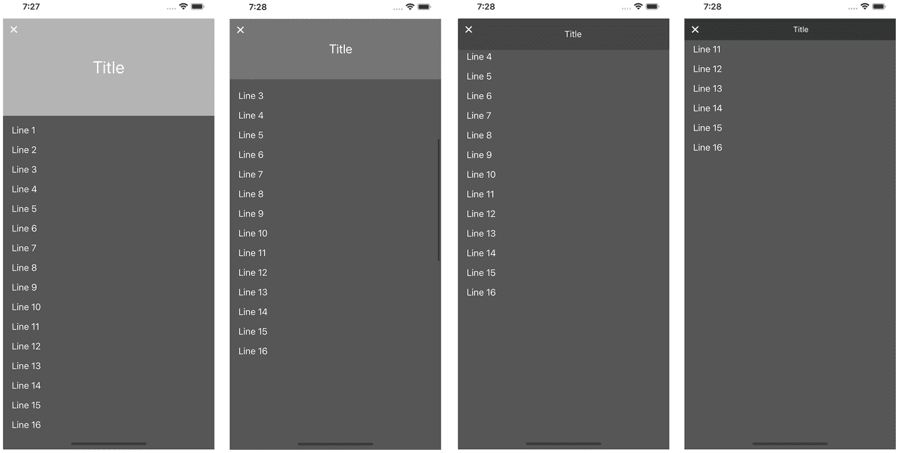
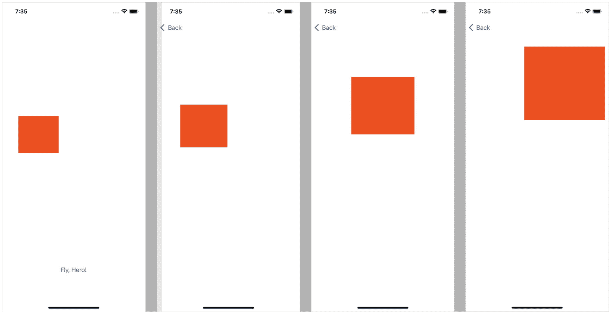

# 7. UI 动画与效果

动画和效果是现代移动应用的重要元素/方面。每个应用在商店/画廊中都有数十个类似的竞品；你需要让自己的应用脱颖而出，以便用户下载。精美的动画 UI 有助于它脱颖而出。

我们将回顾最流行的动画类型：

* 将 `UIView` 从一个点移动到另一个点（例如，当键盘出现/消失时）
* 对颜色或透明度等属性进行动画处理
* 使用 `UIScrollView`、`UITableView` 或 `UICollectionView` 实现视差效果
* “英雄”动画——将元素从一个视图移动到另一个视图
* 覆盖 `UIViewController` 之间的默认转场效果

## 视图动画

`UIView` 及其子类有多个可以进行动画处理的属性。我们将它们分为两组：

* 对视图自身属性进行动画处理，如颜色、透明度或缩放
* 通过更改约束来对布局进行动画处理


### 对 `UIView` 自身属性进行动画

`UIView` 最流行的动画是“淡入淡出”。“淡入”让 `UIView` 出现；“淡出”让它消失。出现和消失具体指什么？指的是将 `alpha` 属性从 `0.0` 变为 `1.0` 或反之。为什么我们改变 `alpha` 而不是 `isHidden`？因为 `isHidden` 是一个*布尔*值。*布尔*值无法渐变。它们始终要么是 `true`，要么是 `false`。那么这种动画还能生效吗？嗯，你可以试试作为练习。我们这里坚持使用 `alpha`，因为它是一个可渐变属性。

动画可以通过使用 `UIView` 类型的 `animation(withDuration:animations:)` 方法来完成。它是一个类型方法，因此你可以直接在 `UIView` 类型上调用它，而不是在实例上。

让我们看看它在代码中是什么样子。将 `UIView` 或其任何子类设置为一个出口 `fadeView`。注意，不要直接命名为 `view`，因为它被保留给根视图使用（代码清单 7-1）。

```
class FadeInViewController: UIViewController {
@IBOutlet weak var fadeView: UIView!
func fadeIn() {
fadeView.isHidden = false
fadeView.alpha = 1.0
UIView.animate(withDuration: 0.3) {
self.fadeView.alpha = 0.0
}
}
}
代码清单 7-1
淡入效果
```

在执行动画之前，我们设置了初始参数。这不是必须的，尤其是当你希望从其当前状态开始动画时。根据你的需求进行调整。

你还会在这个代码清单中看到一个魔法数字——`0.3`。魔法数字是未命名的数值常量。这是一种不良实践，因为在你之后处理这段代码的开发者（甚至几个月或几年后的你自己）可能不理解为什么这个常量存在以及它代表什么。

我们正在讨论动画，而且这段代码是本书的一部分，因此在此给出解释是可以接受的。`0.3` 秒是动画的一个常见时间间隔。它足够慢，可以让用户看到，同时又足够快，不会耽误他们。

如果你使用这段代码，请根据你的需求调整这个时间间隔，并为它定义一个具名常量。

在代码清单 7-2 中，我们有 `animate` 方法的另一个版本：

```
class FadeOutViewController: UIViewController {
@IBOutlet weak var fadeView: UIView!
func fadeOut() {
fadeView.alpha = 0.0
fadeView.isHidden = false
UIView.animate(withDuration: 0.3) {
self.fadeView.alpha = 1.0
} completion: { _ in
self.fadeView.isHidden = true
}
}
}
代码清单 7-2
淡出效果
```

```
func animate(with Duration:animations:completion:)
```

`UIView` 对象可以对以下属性进行动画处理：

- Frame
- Bounds
- Center
- Transform
- Alpha
- BackgroundColor

`UIView` 的子类可能还有其他可动画属性；你可以参考文档以查看每个类的完整列表。

### 通过改变约束来对布局进行动画

当 iPhone 刚出现时，它只有一种分辨率。后来，随着新型号的推出，屏幕变得更高。而在 iPad 上，情况相反，它变得更宽了。现在我们有了多种宽高比。要在如此多的变化中存活下来的方法就是使用约束。如果你正在阅读这段内容，你可能已经知道什么是约束了。如果不知道，你总能找到解释其工作原理的文档、书籍、文章或教程。

如果你使用了约束，就不应该再对 frame 和其他与位置相关的属性进行动画了。你应该对约束的变化进行动画。

要对一个约束进行动画，你首先需要创建一个出口。假设，我们有一些 `UIView`，需要将它向上移动。它有一个约束，定义了与顶部某个对象的距离。默认是 `50`，但我们希望它是 `20`。为什么？可能是因为键盘出现了，或者发生了其他需要缩小间距的情况。

```
@IBOutlet weak var distanceConstraint: NSLayoutConstraint!
```

注意

迄今为止，约束仍然是 `NSLayoutConstraint` 类的对象；它以 `NS` 开头，并且没有替代品。

诀窍在于：布局的变化并非在你更改约束属性时执行，而是在视图进行布局时执行。我们需要在调用 `animate(withDuration:animations:)` *之前*准备好新的布局。然后在这个方法中，我们只需调用父视图或根 `UIView` 的 `layoutIfNeeded`。你可以在代码清单 7-3 中看到具体做法。

```
class AnimatedConstraintsViewController: UIViewController {
@IBOutlet weak var distanceConstraint: NSLayoutConstraint!
func changeDistanceAnimated(_ newDistance: CGFloat) {
distanceConstraint.constant = newDistance
UIView.animate(withDuration: 0.3) {
self.view.layoutIfNeeded()
}
}
}
代码清单 7-3
对约束进行动画
```

### 限制条件

iOS 中的动画有其自身的限制。我们已经讨论过，你无法对不能渐变的值进行动画。

另一个限制是同时动画。你可以同时对多个属性或不同对象进行动画，但它们必须被封装在同一个代码块中。

如果你有复杂的动画，有两种解决方案：

- 将它们拆分为多个小的代码块，每个代码块包含一组在同一时刻结束的变化。当一个代码块结束时，开始下一个代码块。这可能需要进行一些计算。
- 使用一个定时器手动进行动画。`UIView.animate(withDuration:animations:)` 方法并不是唯一的方式。

### 当键盘出现时对布局进行动画

在第 6 章的“键盘处理”部分，我们讨论了键盘布局的变化。当时我们是在没有动画的情况下改变了一个约束：

```
if let keyboardSize = (notification.userInfo?[UIResponder.keyboardFrameEndUserInfoKey] as? NSValue)?.cgRectValue.size { bottomConstraint.constant = keyboardSize.height
view.layoutIfNeeded()}
```

在代码清单 7-4 中，我们改进了代码，使其看起来更平滑。

```
class AnimatedKeyboardListenerViewController: UIViewController {
@IBOutlet weak var bottomConstraint: NSLayoutConstraint!
override func viewWillAppear(_ animated: Bool) {
super.viewWillAppear(animated)
NotificationCenter.default.addObserver(
self,
selector: #selector(keyboardWillShow(notification:)),
name: UIResponder.keyboardWillShowNotification,
object: nil
)
NotificationCenter.default.addObserver(
self,
selector: #selector(keyboardWillHide),
name: UIResponder.keyboardWillHideNotification,
object: nil
)
}
override func viewDidDisappear(_ animated: Bool) {
NotificationCenter.default.removeObserver(self, name: UIResponder.keyboardWillShowNotification, object: nil)
NotificationCenter.default.removeObserver(self, name: UIResponder.keyboardWillHideNotification, object: nil)
super.viewWillDisappear(animated)
}
@objc func keyboardWillShow(notification: NSNotification) {
if let keyboardSize = (notification.userInfo?[UIResponder.keyboardFrameEndUserInfoKey] as? NSValue)?.cgRectValue.size {
bottomConstraint.constant = keyboardSize.height
UIView.animate(withDuration: 0.3) {
self.view.layoutIfNeeded()
}
}
}
@objc func keyboardWillHide() {
bottomConstraint.constant = 0
UIView.animate(withDuration: 0.3) {
self.view.layoutIfNeeded()
}
}
}
代码清单 7-4
当键盘出现时对布局变化进行动画
```

注意

代码清单 7-4 与代码清单 6-13 几乎完全相同。唯一的区别在于动画。请对比它们。


## 视差效果

视差效果通常指创建多个以不同速度移动的图层。这种效果常用于 2D 平台游戏或跑酷类游戏中。玩家身后的云层移动速度远慢于玩家本身，而覆盖角色的前景层则移动得更快。

在移动应用中，视差效果常被用作可滚动内容的屏幕标题栏。例如在订餐应用中，菜单上方会显示餐厅照片。当用户滚动菜单时，标题栏会缩小，仅保留返回按钮和餐厅名称，有时还会显示餐厅标识或购物车图标。

视差滚动效果不仅是从 A 点移动到 B 点，还应当具备响应性。当用户上下滚动时，标题栏需要动态变化（图 7-1）。



一组四张图片展示了用户界面滚动视图中的视差效果。第一张图片在灰色背景上显示标题标签，以及第 1 行到第 16 行的标签。后续图片也包含行标签。

**图 7-1** 视差效果

### 使用 UIScrollView 实现视差标题栏

此功能的核心在于用户界面，因此我们先准备好界面。

#### 准备用户界面

在本示例中，我们将使用一个包含以下对象的标题栏：

*   背景中的 `UIImageView`。其*内容模式*应设置为*等比例填充*。这样，背景图像会自动缩放，虽然只显示部分画面，但始终充满整个屏幕。
*   `UIView` 遮罩层。背景色设为黑色，透明度（`alpha`）从 0.3 变化到 0.8。
*   `UIButton` 作为静态返回按钮，始终位于标题栏的左上角。
*   `UILabel` 用于显示标题。标题栏展开时字号大且居中；标题栏收缩时字号小。

当用户滚动 `UIScrollView` 时，标题栏高度从 180 变为 40。向上滚动则逆转此过程。在完整代码中，所有数值均声明为常量。

`UIScrollView` 对象应位于标题栏后方，否则会覆盖整个标题栏。同时，我们也不能将其置于标题栏下方，这需要详细解释。

如果可滚动区域位于标题栏下方，则其位置和尺寸会随标题栏高度变化而改变。由于用户手指位置不变，这会在可滚动区域的坐标系中改变位置。效果看似不错，但通常会导致滚动偏移量出现不期望的抖动。

最后，我们需要向可滚动区域添加一些内容。别忘了，它必须与顶部边界保持至少 180 的边距，否则会被标题栏遮挡。如果需要滚动条，还应在故事板编辑器的指示器边距（Indicator Insets）部分添加内边距。否则，请隐藏滚动条。

完成故事板编辑后，创建以下插口：

```
// 视图
@IBOutlet weak var scrollView: UIScrollView!
@IBOutlet weak var headerView: UIView!
@IBOutlet weak var shadeView: UIView!
@IBOutlet weak var titleLabel: UILabel!
// 布局约束
@IBOutlet weak var headerHeightConstraint: NSLayoutConstraint!
@IBOutlet weak var titleLeadingConstraint: NSLayoutConstraint!
```

约束、`alpha`、字体等参数的初始值应为：

*   `shadeView.alpha` 为 0.3。
*   `titleLabel.font` 为 `UIFont.systemFont(ofSize: 32)`。
*   `headerHeightConstraint.constaint` 为 180。
*   `titleLeadingConstraint.constaint` 为 16。

如果布局过于复杂，无法按此说明构建，你可以在 GitHub 仓库中找到示例。

#### 视差功能

我们需要为 `UIScrollView` 设置代理。代理将是我们自己的 `UIViewController`。每次滚动位置变化时，都会调用以下方法：

```
func scrollViewDidScroll(_ scrollView: UIScrollView)
```

当前滚动位置为：

```
let scrollPosition = scrollView.contentOffset.y
```

要计算所有值，我们需要知道当前进度，这是一个从 0.0 到 1.0 的值，其中 0.0 表示完全展开，1.0 表示完全收缩。如何根据 `scrollPosition` 计算收缩进度呢？

我们需要确定速度。标题栏的高度范围是 180 - 40 = 140。当用户滚动 140 像素时，进度可从 0.0 变为 1.0，但我们在构建视差效果，而不是 `UIScrollView` 中的另一个分段。让我们将滚动速度减慢一半。为此，我们需要将 `scrollPosition` 除以 280。代码清单 7-5 展示了视差效果的完整代码。

```
class ParallaxViewController: UIViewController {
    // 视图
    @IBOutlet weak var scrollView: UIScrollView!
    @IBOutlet weak var headerView: UIView!
    @IBOutlet weak var shadeView: UIView!
    @IBOutlet weak var titleLabel: UILabel!
    // 布局约束
    @IBOutlet weak var headerHeightConstraint: NSLayoutConstraint!
    @IBOutlet weak var titleLeadingConstraint: NSLayoutConstraint!

    func setHeaderShrinkProgress(_ progress: CGFloat) {
        let progressClamped = max(min(progress, 1.0), 0.0)
        headerHeightConstraint.constant =
            ParallaxViewController.maxHeaderHeight * (1.0 - progressClamped) +
            ParallaxViewController.minHeaderHeight * progressClamped
        titleLeadingConstraint.constant =
            ParallaxViewController.maxLabelOffset * progressClamped +
            ParallaxViewController.minLabelOffset * (1.0 - progressClamped)
        titleLabel.font = UIFont.systemFont(
            ofSize: ParallaxViewController.minTitleFontSize * progressClamped +
            ParallaxViewController.maxTitleFontSize * (1.0 - progressClamped))
        shadeView.alpha =
            ParallaxViewController.minShadeAlpha * (1.0 - progressClamped) +
            ParallaxViewController.maxShadeAlpha * progressClamped
        headerView.layoutIfNeeded()
    }

    static let minHeaderHeight = CGFloat(40)
    static let maxHeaderHeight = CGFloat(180)
    static let minTitleFontSize = CGFloat(14)
    static let maxTitleFontSize = CGFloat(32)
    static let minLabelOffset = CGFloat(16)
    static let maxLabelOffset = CGFloat(56)
    static let minShadeAlpha = CGFloat(0.3)
    static let maxShadeAlpha = CGFloat(0.8)
}

extension ParallaxViewController: UIScrollViewDelegate {
    func scrollViewDidScroll(_ scrollView: UIScrollView) {
        let scrollPosition = scrollView.contentOffset.y
        let progress = scrollPosition / 280.0
        setHeaderShrinkProgress(progress)
    }
}
```

**代码清单 7-5** 视差效果

恭喜！这就是我们可用的视差标题栏。`setHeaderShrinkProgress` 方法只是使用相同的公式进行计算：

```
finalValue = expandedValue * (1.0 - progress) + shrinkedValue * progress
```

为确保所有值保持在范围内，我们在第一行对进度进行了钳制，将其值限制在 0.0 到 1.0 之间。


### 支持 UITableView 和 UICollectionView 的视差标题

由于我们已经掌握了使用 `UIScrollView` 实现视差效果的代码，因此可以轻松地让 `UITableView` 或 `UICollectionView` 也拥有视差效果。关键在于，这两个视图都是 `UIScrollView` 的子类，因此当你设置代理时，它会自动设置 `UIScrollViewDelegate`。

即便如此，我们仍然需要对代码和 storyboard 做一些修改。

首先，将 `UIScrollView` 替换为 `UITableView`。像之前一样添加指示器缩进，并创建一个单元格原型来制作一些演示内容。在下面的示例中，它只是一个带有 `tag` 属性为 1 的 `UILabel`。

然后，我们需要添加内容缩进：

```
tableView.contentInset = UIEdgeInsets(top: ParallaxTableViewController.maxHeaderHeight, left: 0, bottom: 0, right: 0)
```

进度计算也发生了变化，因为现在它是从 -180 开始计算，而不是从 0 开始。

```
func scrollViewDidScroll(_ scrollView: UIScrollView)
{ let scrollPosition = scrollView.contentOffset.y
let progress = (scrollPosition + ParallaxTableViewController.maxHeaderHeight) / 280.0
setHeaderShrinkProgress(progress)}
```

最后，我们需要实现 `UITableViewDataSource`。不要忘记同时设置 `delegate` 和 `dataSource`。示例 7-6 包含了最终代码：

```
class ParallaxTableViewController: UIViewController {
// 视图
@IBOutlet weak var tableView: UIScrollView!
@IBOutlet weak var headerView: UIView!
@IBOutlet weak var shadeView: UIView!
@IBOutlet weak var titleLabel: UILabel!
// 布局约束
@IBOutlet weak var headerHeightConstraint: NSLayoutConstraint!
@IBOutlet weak var titleLeadingConstraint: NSLayoutConstraint!
override func viewDidLoad() {
super.viewDidLoad()
tableView.contentInset = UIEdgeInsets(
top: ParallaxTableViewController.maxHeaderHeight, left: 0,
bottom: 0, right: 0)
}
func setHeaderShrinkProgress(_ progress: CGFloat) {
let progressClamped = max(min(progress, 1.0), 0.0)
headerHeightConstraint.constant =
ParallaxTableViewController.maxHeaderHeight * (1.0 - progressClamped) +
ParallaxTableViewController.minHeaderHeight * progressClamped
titleLeadingConstraint.constant =
ParallaxTableViewController.maxLabelOffset * progressClamped +
ParallaxTableViewController.minLabelOffset * (1.0 - progressClamped)
titleLabel.font = UIFont.systemFont(
ofSize: ParallaxTableViewController.minTitleFontSize * progressClamped +
ParallaxTableViewController.maxTitleFontSize * (1.0 - progressClamped))
shadeView.alpha =
ParallaxTableViewController.minShadeAlpha * (1.0 - progressClamped) +
ParallaxTableViewController.maxShadeAlpha * progressClamped
headerView.layoutIfNeeded()
}
static let minHeaderHeight = CGFloat(40)
static let maxHeaderHeight = CGFloat(180)
static let minTitleFontSize = CGFloat(14)
static let maxTitleFontSize = CGFloat(32)
static let minLabelOffset = CGFloat(16)
static let maxLabelOffset = CGFloat(56)
static let minShadeAlpha = CGFloat(0.3)
static let maxShadeAlpha = CGFloat(0.8)
}
extension ParallaxTableViewController: UIScrollViewDelegate {
func scrollViewDidScroll(_ scrollView: UIScrollView) {
let scrollPosition = scrollView.contentOffset.y
let progress = (scrollPosition + ParallaxTableViewController.maxHeaderHeight) / 280.0
setHeaderShrinkProgress(progress)
}
}
extension ParallaxTableViewController: UITableViewDataSource {
func tableView(_ tableView: UITableView, numberOfRowsInSection section: Int) -> Int {

}
func tableView(_ tableView: UITableView, cellForRowAt indexPath: IndexPath) -> UITableViewCell {
let cell = tableView.dequeueReusableCell(withIdentifier: "DemoCell", for: indexPath)
if let label = cell.viewWithTag(1) as? UILabel {
label.text = "Line \(indexPath.row + 1)"
}
return cell
}
}
示例 7-6
使用 UITableView 实现视差效果
```

同样地，你也可以为 `UICollectionView` 实现此效果。

请随意自定义标题效果。添加更多元素；让运动变得非线性，或发挥你的任何创意。

## 英雄动画

"英雄"动画是指一个视图从一个屏幕"飞"到另一个屏幕，视觉上类似于超级英雄（图 7-2）。当你点击一张照片或菜单中的一道菜时，它会放大并改变位置，同时其他视图在后台发生变化。



一组四张截图展示了英雄动画。第一张图片中间有一个相对较小的彩色方块，底部有文字"飞吧，英雄"。在随后的截图中，方块面积逐渐增大，并似乎移向手机屏幕顶部。

图 7-2

英雄动画

### 在同一个 UIViewController 内的英雄动画

既然我们知道如何制作常规动画，就可以创建英雄动画了。为此，我们需要执行以下步骤：

- 在目标点创建并隐藏 `UIView`。
- 计算源点和目标点之间的位置和大小的差值。
- 对此 `UIView` 应用变换，使其看起来与源 `UIView` 完全一致。
- 隐藏源 `UIView` 并显示目标 `UIView`。
- 对目标 `UIView` 进行动画处理，使其恢复到目标状态。

假设你不旋转它，这里有两种变换：

- 平移 – 位置的差值
- 缩放 – 大小的差值

让我们逐步构建整个算法；然后将其封装成一个示例。

#### 创建并显示 UIView

英雄动画始终是某个元素的移动，该元素外观相同但尺寸变大。原始（源）`UIView` 较小，因此将其放大会导致画质损失。我们需要创建另一个 `UIView`。可能它已经创建好了。在这种情况下，我们需要对其进行设置。如果你选择了带有缩略图的音轨，并且用户选择了一个，你需要将图片和音轨名称应用到目标 `UIView` 上。

在某个时刻，我们应该拥有两个外观一致，但位于不同位置、具有不同大小的 `UIViews`（或子类）。

```
var destinationView: UIView
var sourceView: UIView
```

如果是你创建的，请将其隐藏。如果你在 storyboard 中已有该视图，则必须在那里将其标记为隐藏。

#### 计算变换

首先，让我们计算在根视图中的位置。如果你的 `sourceView` 和 `destinationView` 都是根 `UIView` 的子视图，则可以跳过此步骤。

```
let sourceCenter = view.convert(sourceView.center, to: nil)
let destinationCenter = view.convert(destinationView.center, to: nil)
```

然后，我们需要计算水平和垂直方向上的缩放比例差值。

```
let scaleX = sourceView.frame.width / destinationView.frame.width
let scaleY = sourceView.frame.height / destinationView.frame.height
```

#### 应用变换

在此步骤中，我们只应用计算出的变换。

```
destinationView.transform = CGAffineTransform(scaleX: scaleX, y: scaleY)
destinationView.center = sourceCenter
```

#### 隐藏源 UIView 并显示目标 UIView

这一步非常直接。在此之前，目标 `UIView` 必须处于隐藏状态。

```
destinationView.isHidden = false
sourceView.isHidden = true
```

#### 动画

最后，我们按照本章前面介绍的方式应用动画。

```
UIView.animate(withDuration: 1.0)
{destinationView.transform = CGAffineTransform.identity
destinationView.center = destinationCenter}
```

就是这样！你的英雄可以是一个简单的 `UIImage`，也可以是 `UIView` 内的复杂布局。


#### 最终代码

在 7-7 范例中，我们仅使用了一个带有背景色的`UIView`。如果你需要更复杂的结构，则必须手动复制。在`UIKit`中，没有可靠的方法来复制视图结构。

```
class HeroViewController: UIViewController {
    @IBOutlet weak var sourceView: UIView!
    @IBOutlet weak var targetView: UIView!
    @IBAction func animateHero() {
        let destinationView = UIView(frame: targetView.frame)
        destinationView.backgroundColor = sourceView.backgroundColor
        view.addSubview(destinationView)
        let sourceCenter = view.convert(sourceView.center, to: nil)
        let destinationCenter = view.convert(destinationView.center, to: nil)
        let scaleX = sourceView.frame.width / destinationView.frame.width
        let scaleY = sourceView.frame.height / destinationView.frame.height
        destinationView.transform = CGAffineTransform(scaleX: scaleX, y: scaleY)
        destinationView.center = sourceCenter
        UIView.animate(withDuration: 1.0) {
            destinationView.transform = CGAffineTransform.identity
            destinationView.center = destinationCenter
        }
    }
}
范例 7-7
英雄动画
```

此外，我们还使用了另一个`UIView`——`targetView`。它是一个不可见的`UIView`实例，允许我们在故事板中设置目标位置的几何属性。

### 英雄飞入新 UIViewController

在同一个`UIViewController`内部与在两个不同的`UIViewController`之间进行动画的区别在于，我们无法使用故事板中的目标`UIView`。

算法会略有不同：

- 执行转场或推入目标`UIViewController`。在启动时隐藏目标`UIView`。
- 创建一个与目标`UIView`匹配的过渡`UIView`。
- 计算源位置与目标位置及缩放比例。
- 将过渡`UIView`添加到`UIWindow`并应用源变换。
- 隐藏源`UIView`。
- 对过渡`UIView`的变换应用动画。屏幕间的转场；`UIView`的动画应同步进行。
- 动画结束时，隐藏过渡`UIView`并显示目标`UIView`。
- 显示源`UIView`，以便用户返回时能看到它。

看起来相当复杂，但在代码中会更清晰。（请参见范例 4-3 中的`currentWindow`扩展函数，或使用 GitHub 上 7-8 范例的完整版本。）

```
// 在没有场景的项目中，请使用以下代码获取窗口：(UIApplication.shared.delegate as? AppDelegate)?.window
class Hero1ViewController: ViewController {
    @IBOutlet weak var sourceView: UIView!
    @IBAction func animateHero() {
        performSegue(withIdentifier: "Hero", sender: nil)
    }
    override func prepare(for segue: UIStoryboardSegue, sender: Any?) {
        if let destinationVC = segue.destination as? Hero2ViewController {
            guard let window = UIApplication.shared.currentWindow else {
                return
            }
            destinationVC.loadViewIfNeeded()
            destinationVC.view.layoutSubviews()
            let heroView = UIView(frame: destinationVC.destinationView.frame)
            heroView.backgroundColor = self.sourceView.backgroundColor
            destinationVC.destinationView.backgroundColor = self.sourceView.backgroundColor
            window.addSubview(heroView)
            self.sourceView.isHidden = true
            let sourceCenter = window.convert(self.sourceView.center, to: nil)
            var destinationCenter = window.convert(destinationVC.destinationView.center, to: nil)
            destinationCenter.y += self.view.safeAreaInsets.top
            let scaleX = self.sourceView.frame.width / heroView.frame.width
            let scaleY = self.sourceView.frame.height / heroView.frame.height
            heroView.transform = CGAffineTransform(scaleX: scaleX, y: scaleY)
            heroView.center = sourceCenter
            destinationVC.destinationView.isHidden = true
            UIView.animate(withDuration: 1.0) {
                heroView.transform = CGAffineTransform.identity
                heroView.center = destinationCenter
            } completion: { _ in
                destinationVC.destinationView.isHidden = false
                self.sourceView.isHidden = false
                heroView.removeFromSuperview()
            }
        }
    }
}
class Hero2ViewController: ViewController {
    @IBOutlet weak var destinationView: UIView!
}
范例 7-8
屏幕间的英雄动画
```

#### 获取并使用 UIWindow

在本范例中，我们假设项目使用了场景。`currentWindow`计算属性定义在范例 4-3 中。如果你的项目未使用场景，请改用范例 4-4。

听起来可能有些奇怪，但`UIWindow`是`UIView`的子类。这意味着我们可以在`UIWindow`上使用任何`UIView`的方法，包括`addSubview`和反向操作。

#### 细节

再做几点说明以使其更清晰。

当目标`UIViewController`被创建时，视图并未加载。我们需要手动加载它：

```
destinationVC.loadViewIfNeeded()
```

我们还需要手动布局视图，否则它们会保持与故事板编辑器中相同的位置。这在进行计算后并不总是相同：它们仅当设备与故事板设置中的设备一致时才匹配。

```
destinationVC.view.layoutSubviews()
```

另一个细节是，在计算时，屏幕顶部没有任何栏，因为屏幕尚不可见。因此，目标`UIView`的“y”坐标将被错误计算。假设两个屏幕的顶部插入量相同，我们进行以下修正：

```
destinationCenter.y += self.view.safeAreaInsets.top
```

其余代码与上一节基本相同，仅做了微小调整。

## 屏幕间的转场

默认情况下，有两种类型的动画：

- 在`UINavigationController`内从右向左出现
- 以模态方式呈现`UIViewController`时从下向上出现

你可以在“故事板编辑器”或代码中更改动画，但选项非常有限。幸运的是，iOS 允许我们创建自定义转场动画。

### 标准转场

根据导航类型，有两种情况：

- 如果在`UINavigationController`内部发生，则只有一种动画：第二个屏幕从右侧覆盖第一个屏幕（对于从右向左的语言，则从左侧覆盖）。
- 当你以模态方式呈现新的`UIViewController`时，有几个默认选项。我们可以在故事板中或呈现前的代码中选择动画类型。

如果你使用故事板和 segue，需要选择 segue 的类型（*Show* 用于推入，*Present Modally* 用于模态呈现）。其他类型也会用到，但频率较低，且自定义选项较少，因此我们暂时不讨论它们。

从转场的角度来看，最有趣的是模态呈现。如果你选择此类型，将有两个额外选项：

- *Presentation*（呈现）定义最终效果。默认情况下，它覆盖大约 90%的屏幕，在顶部留出上一屏幕的一部分。
- *Transition*（转场）定义动画效果。

这些选项可以通过代码访问，如范例 7-9 所示。你可以从代码中实例化视图控制器，或通过 segue 覆盖参数。

```
extension UIViewController {
    func openViewControllerDefinedWithStyle(destinationViewController: UIViewController) {
        destinationViewController.modalPresentationStyle = .fullScreen
        destinationViewController.modalTransitionStyle = .crossDissolve
    }
}
范例 7-9
更改呈现与转场
```


### 创建自定义转场动画

如果你对标准动画不满意，可以创建自己的自定义转场动画。

当我们谈论自定义转场时，需要回顾几个协议：

*   `UIViewControllerTransitioningDelegate` 是实现自定义转场所需遵循的协议。实现此协议可以定义用于呈现和解除的动画控制器和交互控制器。
*   `UIViewControllerAnimatedTransitioning` 协议的实现定义了转场动画的时长、转场动画本身，并处理一些回调。
*   `UIViewControllerContextTransitioning` 是一个上下文。其实现提供了关于转场视图和控制器（view controllers）的信息。

当你实现前两个协议时，需要设置 `destinationViewController.transitioningDelegate`。让我们一步步看看它是如何工作的。

1.  当你触发转场（使用 segue 或手动方式）时，iOS 会检查 `transitioningDelegate` 是否已设置。如果没有设置，它将使用你设置的标准转场或默认转场。
2.  如果 `transitioningDelegate` 已设置，它会调用你的 `transitioningDelegate` 的 `animationController(forPresented:presenting:source)` 方法。这个方法是可选的，返回 `nil` 是有效的。如果返回 `nil`，转场将恢复为标准转场，就像没有设置 `transitioningDelegate` 一样。
3.  此时，iOS 断定必须使用自定义动画，并创建一个上下文。
4.  调用 `transitionDuration(using:)` 来定义转场时间。时间应以秒为单位返回。通常，大约是 0.3 秒。超过一秒的转场动画可能会让用户感到不适。
5.  接下来，调用 `animateTransition(using:)` 方法。使用此方法，你可以应用动画。拥有上下文（在 `using` 参数中），你可以对两个屏幕应用任何修改。你可以更改颜色、位置、透明度——任何你喜欢的属性。
6.  最后，你需要调用 `completeTransition(_:)`。这将标记转场结束，并使目标视图控制器（destination view controller）变为活跃状态。如果你不调用它，它将继续保持非活跃状态。

有些事情做起来比解释起来更容易，所以让我们看看 Recipe 7-10 的实际效果。我们将制作一个最简单的转场：第一个屏幕淡出，第二个屏幕淡入。在转场的中间会有一个黑屏，因为两个屏幕都会不可见。动画时长设为一秒，足以观察整个过程。

```
class FadeThroughBlackPresentAnimationController: NSObject, UIViewControllerAnimatedTransitioning {
func transitionDuration(using transitionContext: UIViewControllerContextTransitioning?) -> TimeInterval {
return 1.0
}
func animateTransition(using transitionContext: UIViewControllerContextTransitioning) {
guard let fromView = transitionContext.viewController(forKey: .from)?.view,
let toView = transitionContext.viewController(forKey: .to)?.view
else { return }
toView.isHidden = true
transitionContext.containerView.addSubview(toView)
UIView.animate(withDuration: 0.5) {
fromView.alpha = 0.0
} completion: { _ in
fromView.isHidden = true
toView.alpha = 0.0
toView.isHidden = false
UIView.animate(withDuration: 0.5) {
toView.alpha = 1.0
} completion: { _ in
fromView.isHidden = false
transitionContext.completeTransition(!transitionContext.transitionWasCancelled)
}
}
}
}
class FromViewController: UIViewController, UIViewControllerTransitioningDelegate {
func animationController(forPresented presented: UIViewController, presenting: UIViewController, source: UIViewController) -> UIViewControllerAnimatedTransitioning? {
FadeThroughBlackPresentAnimationController()
}
func animationController(forDismissed dismissed: UIViewController) -> UIViewControllerAnimatedTransitioning? {
FadeThroughBlackPresentAnimationController()
}
override func prepare(for segue: UIStoryboardSegue, sender: Any?) {
segue.destination.modalPresentationStyle = .fullScreen
segue.destination.transitioningDelegate = self
}
}
class ToViewController: UIViewController {
@IBAction func goBack() {
dismiss(animated: true, completion: nil)
}
}
Recipe 7-10
黑色淡入淡出转场
```

这段代码包含了返回转场，与正向转场完全相同。

### 转场动画库

如果你想创建一些新东西，不妨四处看看——也许别人已经创建过了。有很多提供转场动画的库。让我们看看其中的一些：

*   Hero ( [`https://github.com/HeroTransitions/Hero`](https://github.com/HeroTransitions/Hero) ) 库提供了一种简单的方法来应用预定义的转场动画之一，并附带一套很好的自定义工具。
*   Jelly ( [`https://github.com/SebastianBoldt/Jelly`](https://github.com/SebastianBoldt/Jelly) ) 库也支持交互式转场动画。
*   Shift ( [`https://github.com/wickwirew/Shift`](https://github.com/wickwirew/Shift) ) 是一个用于类似 Hero 转场动画的动画库。它只需相对较少的努力就能制作出漂亮的动画。

所有这些库都是免费、开源的，并且可以通过 Swift Package Manager 和 CocoaPods 获取。你可以在你的应用程序中免费使用它们，但如果喜欢，别忘了捐赠支持。

## 总结

现代移动应用应使用动画来显得更用户友好。UIKit 为简单的 UI 动画提供了原生解决方案。在本章中，我们讨论了淡入淡出动画和动画布局变化。我们讨论了移动应用中流行的视差效果、作为屏幕间转场一部分的 Hero 动画。最后，我们回顾了转场动画本身的不同方式。至此，UIKit 话题告一段落，但 UIKit 并不是在 iOS 应用中创建 UI 的唯一方式。自 iOS 13 起，Apple 引入了 SwiftUI，它已在 iOS 和 macOS 的 UI 开发中得到积极使用。在下一章中，我们将快速了解 SwiftUI。

