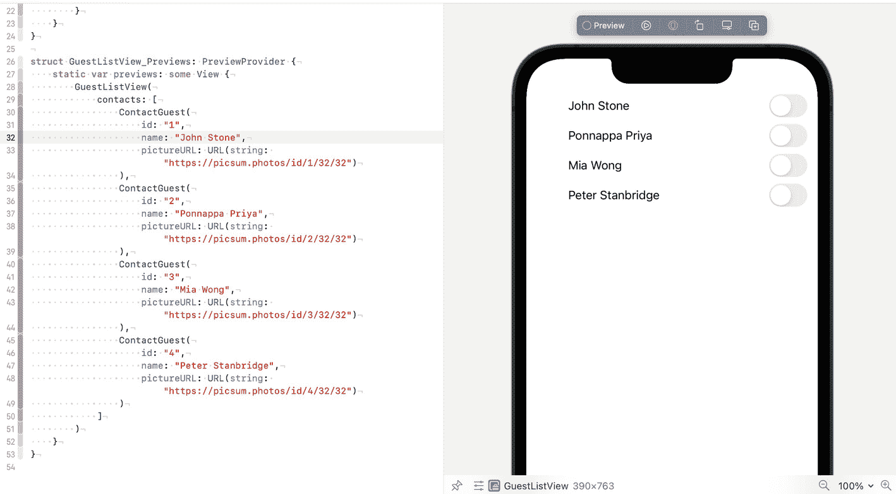
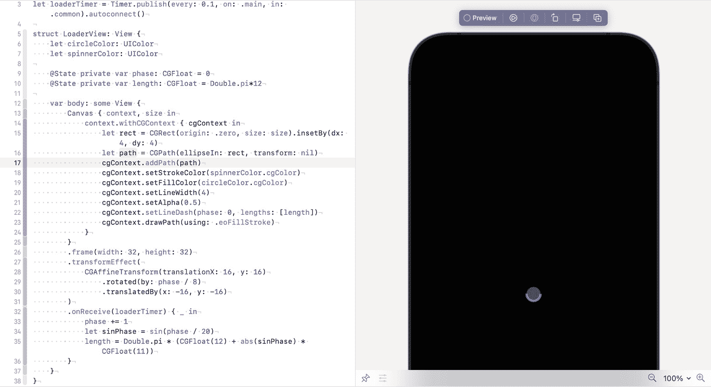
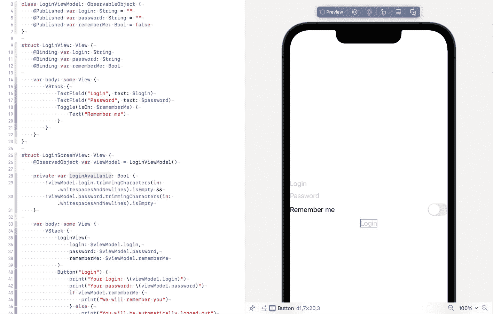

# 8. SwiftUI

SwiftUI 是一种构建用户界面的现代方式。它出现在 iOS 13、macOS 10.15、tvOS 13 和 watchOS 6 中。如今，大多数应用不需要支持 iOS 12，因此在你的项目中使用 SwiftUI 是安全的。

另一方面，存在大量用 UIKit 编写的代码库。成百上千的流行库出现在 SwiftUI 之前，或者支持旧版本的 iOS。这就是为什么在本章中，我们不仅要讨论 SwiftUI，还要讨论混合使用这两个框架。

什么是 SwiftUI？它是 UIKit 的包装器还是一个独立的平台？两者都是。一些 SwiftUI 控件构建在 UIKit 之上；另一些则是全新的。

## SwiftUI 基本概述

SwiftUI 使用构建块的构想。每个块都是一个 `View`。块可以代表整个屏幕，也可以代表屏幕的一部分。块可以包含其他块，并且这种结构可以很深。类似架构也用于其他平台，如 Flutter 或 React Native。

### 基础应用

SwiftUI 应用包含两个初始控件，App 和 View，分别如 Recipe 8-1 和 8-2 所示。

```
import SwiftUI
struct ContentView: View {
var body: some View {
Text("Hello, world!")
}
}
struct ContentView_Previews: PreviewProvider {
static var previews: some View {
ContentView()
}
}
Recipe 8-2
SwiftUI 视图
```

```
import SwiftUI
@main
struct MyApp: App {
var body: some Scene {
WindowGroup {
ContentView()
}
}
}
Recipe 8-1
SwiftUI 应用
```

这两个结构体是运行应用所需的全部代码。应用中间只会有一个文本标签，但它可以运行。


### 构建块

当你创建一个新的 SwiftUI 项目时，会看到两个控件：

- `Text` – 来自 UIKit 的对应控件是 `UILabel`。当然，它也具有 SwiftUI 的特性。
- `ContentView` – 这个 `View` 是屏幕的布局。它拥有手机屏幕的尺寸，因为它在你的 `App` 结构体中被引用。

从 SwiftUI 的角度来看，`Text` 和 `ContentView` 之间没有区别。例如，以下代码是完全有效的：

```swift
@main
struct MyApp: App {
    var body: some Scene {
        WindowGroup {
            Text("我是屏幕上唯一的元素 :)")
        }
    }
}
```

同时，`ContentView` 也可以在另一个 `View` 内部使用。

最常见的控件如下：

- `Text` – 一段文本，类似于 `UILabel`
- `Image` – 一个显示图片的控件，类似于 `UIImageView`
- `HStack` 和 `VStack` – 分别按行或列依次排列元素的控件，类似于 `UIStackView`
- `List` – 一个可滚动的列表，类似于 `UITableView` 或 `UICollectionView`
- `ZStack` – 一个框架，将子控件叠加显示，类似于 `UIKit` 中的 `UIView`
- `Spacer` – 用于在堆栈中的控件之间创建动态间距
- `Button` – 一个可点击的元素，允许用户控制应用，类似于 `UIButton`

上述列表并非完整列表，但这些控件是最常见的。

### 修改控件

你可以对控件进行小幅修改，而无需覆写或创建新控件。例如，你可能想改变字体、颜色、内边距、背景和其他属性。在 SwiftUI 中，可以通过在控件构造器之后调用方法来实现。例如：

```swift
Text("你好，世界！")
    .font(.system(size: 14))
    .foregroundColor(.blue)
```

修饰符不仅可以应用于单个组件，还可以应用于一组控件。例如，如果你对 `HStack` 应用了前景色，那么除非被覆盖，否则其所有内部控件都会自动获得这个颜色。

### 组合

当你创建一个新控件时，通常是从现有的构建块组合而成。这就是组合。SwiftUI 有三个主要的控件用于此目的：

- `HStack` – 它水平地依次显示控件。
- `VStack` – 它垂直地依次显示控件。
- `ZStack` – 它将控件互相叠放显示。

配方 8-3 就是这种组合的一个例子。它是一个用于嘉宾列表的自定义控件，如图 8-1 所示。你有一个包含照片和姓名的联系人列表。右侧是一个开关。当开关打开时，该联系人被邀请；否则，他们不在我们的嘉宾列表中。



一组两张图片，第一张是左侧在 Swift 用户界面中编写生成嘉宾列表的代码截图，右侧是 iPhone 模式下嘉宾列表的预览。

**图 8-1** 用 SwiftUI 编写的嘉宾列表。代码与预览

照片将使用 `pictureURL` 中提供的 URL 从网络加载。SwiftUI 有一个原生的 `AsyncImage` 控件，但它仅从 iOS 15 开始可用，因此我们将使用 `KFImage`。

`KFImage` 是 `Kingfisher` 库的一部分。你可以通过 Swift Package Manager 添加它：[`github.com/onevcat/Kingfisher`](https://github.com/onevcat/Kingfisher)。

```swift
import SwiftUI
import Kingfisher

struct ContactGuestView: View {
    let name: String
    let pictureURL: URL?
    @State private var isInvited = false

    var body: some View {
        HStack(alignment: .center,
               spacing: 8.0) {
            KFImage(pictureURL)
                .resizable()
                .aspectRatio(contentMode: .fill)
                .frame(width: 32, height: 32)
                .clipShape(Circle())
            Toggle(name, isOn: $isInvited)
                .onChange(of: isInvited) { newValue in
                    print(newValue)
                }
                .font(.system(size: 16))
                .foregroundColor(.primary)
        }
        .padding(.leading, 16)
        .padding(.trailing, 16)
        .frame(height: 32, alignment: .center)
    }
}

struct ContactGuestView_Previews: PreviewProvider {
    static var previews: some View {
        ContactGuestView(
            name: "张三",
            pictureURL: URL(string: "https://picsum.photos/32/32")
        )
    }
}
// 配方 8-3
// 嘉宾列表的自定义组件
```

这行代码中有一个有趣的部分：`@State private var isInvited = false`。这是你的组件或其一部分的状态。当开关（在 UIKit 中称为 Switch）的状态改变时，变量会自动随之改变。你可以访问你的状态并采取必要的操作。

如何处理状态变化？理想情况下，我们应该有一个视图模型来处理所有变化，并将结果存储在一个仓库中。为此，我们使用 `.onChange` 方法。完整签名如下所示：

```swift
@inlinable public func onChange(of value: V, perform action: @escaping (_ newValue: V) -> Void) -> some View where V : Equatable
```

在提供的闭包中，我们更改内部存储中的值，或向后端发送请求。在这个例子中，我们只是打印它。

**注意：** `onChange` 应该在 `Toggle` 声明之后、样式设置之前立即调用。样式设置方法返回的是简单的 `View`，而不是 `Toggle`，后者将无法识别 `onChange` 方法。

为了总结 SwiftUI 的基础知识，配方 8-4 展示了如何使用它。

```swift
import SwiftUI

struct ContactGuest {
    var id: String
    var name: String
    var pictureURL: URL?
}

struct GuestListView: View {
    let contacts: [ContactGuest]

    var body: some View {
        ScrollView(.vertical, showsIndicators: false) {
            LazyVStack {
                ForEach(contacts, id: \.id) { contact in
                    ContactGuestView(
                        name: contact.name,
                        pictureURL: contact.pictureURL
                    )
                }
            }
        }
    }
}

struct GuestListView_Previews: PreviewProvider {
    static var previews: some View {
        GuestListView(
            contacts: [
                ContactGuest(id: "1", name: "约翰·斯通", pictureURL: URL(string: "https://picsum.photos/id/1/32/32")),
                ContactGuest(id: "2", name: "庞纳帕·普里亚", pictureURL: URL(string: "https://picsum.photos/id/2/32/32")),
                ContactGuest(id: "3", name: "米娅·黄", pictureURL: URL(string: "https://picsum.photos/id/3/32/32")),
                ContactGuest(id: "4", name: "彼得·斯坦布里奇", pictureURL: URL(string: "https://picsum.photos/id/4/32/32"))
            ]
        )
    }
}
// 配方 8-4
// 嘉宾列表
```

`LazyVStack` 是 `VStack` 的一个变体，它不会渲染不可见的组件。`ScrollView` 内部的 `LazyVStack` 就像 `UITableView`。SwiftUI 有自己的 `List`，但当你有一组静态项目时，使用这种组合可能会更快。

### 插入 UIKit 组件

SwiftUI 是一个相对较新的框架。大多数可用的库，包括流行的库，仍然不支持它。幸运的是，有一种简单的方法可以将标准的 UIKit `UIView`（或任何子类）插入到 SwiftUI 的组件树中。

#### 从 UIKit 组件创建 SwiftUI 组件

假设你有一个复杂的自定义 `UIView` 子类 `MyCustomOldView`，你还没有准备好将其移植到 SwiftUI。你需要为其创建一个包装器，该包装器遵循 `UIViewRepresentable` 协议。

第二步是添加属性。你可以通过向结构体添加变量来添加它们。

步骤 3 和 4 是实现 `UIViewRepresentable` 协议中声明的两个函数：

```
func makeUIView(context: Self.Context) -> Self.UIViewType
```

该函数创建 `MyCustomOldView` 的一个实例并返回它。如果该组件有任何常量设置，你也可以在此函数中设置它们。如果你没有使用自己的自定义类，而是使用标准的 UIKit 类或来自外部库的类，并且需要一些调整，这可能很有用。

```
func updateUIView(Self.UIViewType, context: Self.Context)
```

这个函数需要更新你的 UIKit 组件的状态。你不应该在这个函数中（重新）创建你的 `UIView`；只需应用所有可更改的属性。不要返回任何内容。


### 自定义标签示例

在公式 8-5 中，我们将一个 `UILabel` 子类包装到 SwiftUI 结构中。许多应用都预定义了带有集成样式和格式的组件列表。当应用开始使用 SwiftUI 时，有两种选择：

-   使用 `Text` 在 SwiftUI 中添加所有这些组件
-   将现有组件包装成 SwiftUI 组件

如果你的应用部分迁移到了 SwiftUI 而另一部分尚未迁移，那么第二种方式具有优势。

```
import UIKit
import SwiftUI
class HeaderLabel: UILabel {
    required init?(coder: NSCoder) {
        super.init(coder: coder)
        commonInit()
    }
    override init(frame: CGRect) {
        super.init(frame: frame)
        commonInit()
    }
    private func commonInit() {
        textAlignment = .center
        font = .systemFont(ofSize: 20, weight: .bold)
        textColor = .darkText
        numberOfLines = 1
    }
}
struct HeaderText: UIViewRepresentable {
    var text: String
    func makeUIView(context: Context) -> HeaderLabel {
        HeaderLabel()
    }
    func updateUIView(_ uiView: HeaderLabel, context: Context) {
        uiView.text = text
    }
}
公式 8-5
将 UIKit 组件包装为 SwiftUI 组件
```

将其插入任意 SwiftUI `View` 中：

```
struct ContentView: View {
    var body: some View {
        HeaderText(text: "Hello, world!")
    }
}
```

如果你的属性可以动态更改，可以添加 `@Binding` 关键字。

## 使用 ViewModifier 应用样式

我们已经使用修饰符应用了几种样式。我们使用了 `font`、`foregroundColor`、`frame` 等。

当你创建自己的组件时，不必在构造函数中提供所有可调整的属性。如果你只有两三个属性，这可能是合理的。但当你创建更复杂的 `View` 时，可能有几十个属性，在构造函数中使用它们会非常不便。

为此，你可以添加扩展来更改自定义 `View`，并使用视图修饰符更全局地更改 `View` 的属性。

### 创建 ViewModifier

要创建你自己的修饰符，你需要添加一个符合 `ViewModifier` 协议的结构体。

在这个结构体中，你需要实现一个函数：

```
func body(content: Content) -> some View
```

在这个函数中，你需要设置你的 `View` 并返回结果。

```
struct ModifierName: ViewModifier {
    func body(content: Content) -> some View {
        content
        ... // 在此处进行修改
    }
}
```

### SwiftUI 中的链式修饰符

为了让你的修饰符看起来像标准的 SwiftUI 修饰符，你需要创建一个扩展。根据你的修饰符，你可以通过扩展 `View` 使其全局可用，或者使其更针对你特定的视图或某个组件树（例如 `Text` 的子类）。

```
extension View {
    func applyMyStyle() -> some View {
        modifier(ModifierName())
    }
}
```

### 不依赖 UIKit 的 HeaderText

公式 8-6 展示了如何为 `Text` 创建一个修饰符，以生成与公式 8-5 样式匹配的标题。

```
import SwiftUI
struct Header: ViewModifier {
    func body(content: Content) -> some View {
        content
            .font(.system(size: 20, weight: .bold))
            .foregroundColor(Color(UIColor.darkText))
            .fixedSize(horizontal: false, vertical: true)
            .lineLimit(1)
            .frame(alignment: .center)
    }
}
extension Text {
    func styleAsHeader() -> some View {
        modifier(Header())
    }
}
公式 8-6
使用 ViewModifier 的 HeaderText
```

像这样使用它：

```
struct ContentView: View {
    var body: some View {
        Text("Hello, world!")
            .styleAsHeader()
    }
}
```

如果你的 `View` 具有无法应用于 `Context` 的特定属性，请在调用修饰符方法之前，直接在扩展中应用它们。例如：

```
func changeMyView() -> some View {
    doSomethingSpecific().modifier(SomeModifier())
}
```

使用 `ViewModifier`，你可以创建自己的样式库，而无需对 `View` 进行子类化。

**注意**：如果你在容器（例如 `HStack` 或 `VStack`）上应用修饰符，它将应用于其所有子元素。这就是为什么通常最好使用纯修饰符，而不调用 `View` 子类的方法，并全局扩展 `View`。

## 创建自定义视图

SwiftUI 最有用的特性之一就是创建可重用的自定义组件。创建小的、可调整的构建块为 UI 创作提供了无限可能。

创建自定义视图主要有三种方式：

-   组合现有的 SwiftUI 组件并根据你的需求进行调整
-   包装 UIKit 组件
-   使用 `Canvas` 通过线条、圆形和其他图元绘制你自己的视图

自定义视图可以拥有可变数据。有两个关键的属性包装器：

-   `@State`
-   `@Binding`

我们在本章前面已经讨论了组合和包装 UIKit 组件。让我们详细回顾一下 `Canvas` 绘制和属性包装器。

### 在 Canvas 上绘制

`Canvas` 是一个 SwiftUI 控件，允许直接访问 CoreGraphics 的 `CGContext`。`CGContext` 有许多绘制方法，例如：

-   `func addRect(CGRect)` – 绘制一个矩形
-   `func addEllipse(in: CGRect)` – 绘制一个椭圆
-   `func addArc(center: CGPoint, radius: CGFloat, startAngle: CGFloat, endAngle: CGFloat, clockwise: Bool)` – 绘制一条弧线（椭圆的一部分）
-   以及其他方法

如果我们绘制一个带有虚线边框的实心圆，并让其围绕中心旋转，它看起来就像一个加载指示器（见图 8-2）。让我们回顾一下公式 8-7 中的示例。

```
import SwiftUI
let loaderTimer = Timer.publish(every: 0.1, on: .main, in: .common).autoconnect()
struct LoaderView: View {
    let circleColor: UIColor
    let spinnerColor: UIColor
    @State private var phase: CGFloat = 0
    @State private var length: CGFloat = Double.pi*12
    var body: some View {
        Canvas { context, size in
            context.withCGContext { cgContext in
                let rect = CGRect(origin: .zero, size: size).insetBy(dx: 4, dy: 4)
                let path = CGPath(ellipseIn: rect, transform: nil)
                cgContext.addPath(path)
                cgContext.setStrokeColor(spinnerColor.cgColor)
                cgContext.setFillColor(circleColor.cgColor)
                cgContext.setLineWidth(4)
                cgContext.setAlpha(0.5)
                cgContext.setLineDash(phase: 0, lengths: [length])
                cgContext.drawPath(using: .eoFillStroke)
            }
        }
        .frame(width: 32, height: 32)
        .transformEffect(
            CGAffineTransform(translationX: 16, y: 16)
                .rotated(by: phase / 8)
                .translatedBy(x: -16, y: -16)
        )
        .onReceive(loaderTimer) { _ in
            phase += 1
            let sinPhase = sin(phase / 20)
            length = Double.pi * (CGFloat(12) + abs(sinPhase) * CGFloat(11))
        }
    }
}
struct LoaderView_Previews: PreviewProvider {
    static var previews: some View {
        ZStack {
            Color.black
                .edgesIgnoringSafeArea(.all)
            LoaderView(
                circleColor: .blue,
                spinnerColor: .white
            )
        }
    }
}
公式 8-7
在 SwiftUI 中使用 Canvas
```



两幅图像中，第一幅展示了用于在左侧 SwiftUI 界面中生成自定义旋转器的代码截图，第二幅展示了右侧 iPhone 模拟器中自定义旋转器（一个蓝色圆点）的预览。

**图 8-2**: 用 SwiftUI 编写的自定义旋转器

这里你可以看到许多魔数。尝试改动它们，看看结果如何变化。


### 组件状态

我们在多个示例中已经使用了 `@State` 关键字。`@State` 是什么？它又如何改变我们的 `View`？

`@State` 是一个属性包装器，意味着它会在后台生成一些代码。它会创建一个存储空间，并将我们的变量移出结构体（因为结构体是值类型）。建议将 `@State` 变量设为私有，并在声明后立即初始化，而不使用构造函数。

`@State` 变量用于保持 `View` 的状态。根据组件逻辑，它可以是一个文本字符串、布尔值、数字或结构体。`@State` 变量可以直接在布局中使用，甚至可以根据用户的操作在布局中改变它们。

`@State` 变量不应在对象之间共享。它们不可观察，其变化也无法通过 `willSet` 或 `didSet` 来处理。要在 `@State` 变量变化时运行某些代码，可以使用以下三种方式：

*   使用 UI 控件回调，例如 `onChange` 或 `onEditingChanged`。
*   使用绑定。
*   使用可观察对象（例如，你的视图模型可以遵循 `ObservableObject` 协议）。

要查看 `@State` 包装器的实际操作，请参考示例 8-3 和 8-7。

### 数据绑定

使用 `@Binding` 替代 `@State`，可以让变量与 UI 元素之间建立更强大的连接，并在对象之间共享状态。

如果你使用了视图模型并在其中声明了某个变量，你可以通过传递绑定本身（而不是值）来建立与 UI 元素的连接。

这种方法的优势如下：

*   当你切换开关或输入文本时，它会在视图模型中直接更改值。后续使用起来会非常方便。
*   如果一个变量改变了多个 UI 组件，那么当该变量发生变化时，这些组件会自动更新。

例如，如果某个文本字段只应在 `Toggle` 开启时出现，`@State` 无法解决这个问题，但 `@Binding` 可以（示例 8-8）。

```
import SwiftUI
class LoginViewModel: ObservableObject {
@Published var login: String = ""
@Published var password: String = ""
@Published var rememberMe: Bool = false
}
struct LoginView: View {
@Binding var login: String
@Binding var password: String
@Binding var rememberMe: Bool
var body: some View {
VStack {
TextField("Login", text: $login)
TextField("Password", text: $password)
Toggle(isOn: $rememberMe) {
Text("Remember me")
}
}
}
}
struct LoginScreenView: View {
@ObservedObject var viewModel = LoginViewModel()
private var loginAvailable: Bool {
!viewModel.login.trimmingCharacters(in: .whitespacesAndNewlines).isEmpty &&
!viewModel.password.trimmingCharacters(in: .whitespacesAndNewlines).isEmpty
}
var body: some View {
VStack {
LoginView(
login: $viewModel.login,
password: $viewModel.password,
rememberMe: $viewModel.rememberMe
)
Button("Login") {
print("Your login: \(viewModel.login)")
print("Your password: \(viewModel.password)")
if viewModel.rememberMe {
print("We will remember you")
} else {
print("You will be automatically logged out")
}
}.disabled(!loginAvailable)
}
}
}
struct LoginView_Previews: PreviewProvider {
static var previews: some View {
LoginScreenView()
}
}
示例 8-8
使用 @Binding
```

在此示例中，我们同时使用了绑定和可观察对象。通过使用可发布的视图模型和绑定，我们只需极少的代码就能控制*登录*按钮（当其中一个字段为空时，该按钮会变为不可用）。我们还可以从*登录*按钮的回调中访问输入的值，而无需引用文本字段本身。

这些功能展示了 SwiftUI 的强大之处，以及相比 UIKit 的优势（图 8-3）。



两张图片的集合。左侧是 Swift 用户界面中数据绑定代码的截图，右侧是 iPhone 轮廓中登录页面创建的预览。

图 8-3

SwiftUI 中的数据绑定

## 总结

SwiftUI 是 iOS UI 开发的未来。本章的目的并非提供全面的 SwiftUI 课程——这个话题对于一章而言过于庞大。但我们讨论了几个有趣的概念，展示了 SwiftUI 的强大功能，例如用构建块搭建用户界面、在 SwiftUI 中使用 UIKit 组件、使用 `ViewModifier`、Canvas 和 Binding。


