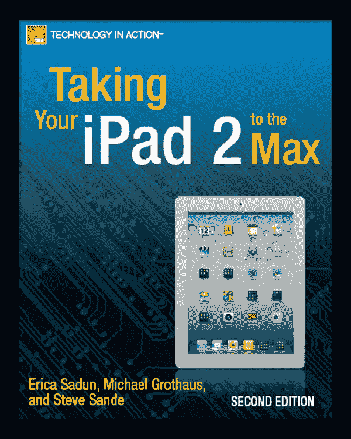
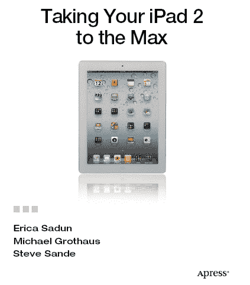

**充分发挥您的 iPad 2 潜力**

版权所有 © 2011 Erica Sadun、Michael Grothaus 和 Steve Sande。

保留所有权利。未经版权所有者及出版商事先书面许可，不得以任何形式或任何手段（电子或机械，包括影印、录制，或通过任何信息存储或检索系统）复制或传播本作品的任何部分。

ISBN-13（平装）：978-1-4302-3539-2

ISBN-13（电子版）：978-1-4302-3540-8

本书中可能会出现商标名称、徽标和图像。我们不会在每次出现商标名称、徽标或图像时都使用商标符号，而仅以编辑方式使用这些名称、徽标和图像，以维护商标所有者的利益，且无意侵犯商标权。

在本出版物中使用商品名称、商标、服务标记和类似术语，即使未将其标识为商标，也不应被视为对其是否受所有权保护的看法表达。

> 总裁与出版人：Paul Manning
> 
> 首席编辑：Michelle Lowman
> 
> 开发编辑：Douglas Pundick
> 
> 技术审阅：Dave Caolo
> 
> 编委会：Steve Anglin、Mark Beckner、Ewan Buckingham、Gary Cornell、Jonathan Gennick、Jonathan Hassell、Michelle Lowman、Matthew Moodie、Jeff Olson、Jeffrey Pepper、Frank Pohlmann、Douglas Pundick、Ben Renow-Clarke、Dominic Shakeshaft、Matt Wade、Tom Welsh
> 
> 协调编辑：Kelly Moritz
> 
> 文字编辑：Tracy Brown、William McManus 和 Patrick Meador
> 
> 排版：MacPS, LLC
> 
> 索引制作：Toma Mulligan
> 
> 插图师：April Milne
> 
> 封面设计：Anna Ishchenko

本书由 Springer Science+Business Media, LLC. 在全球图书贸易中发行，地址：233 Spring Street, 6th Floor, New York, NY 10013。电话：1-800-SPRINGER，传真：(201) 348-4505，电子邮件：`orders-ny@springer-sbm.com`，或访问：[`www.springeronline.com`](http://www.springeronline.com)。

有关翻译信息，请发送电子邮件至：`rights@apress.com`，或访问：[`www.apress.com`](http://www.apress.com)。

Apress 及 friends of ED 图书可批量购买，用于学术、企业或促销用途。大多数图书也提供电子书版本和许可证。如需更多信息，请参考我们的特殊批量销售-电子书许可网页：[`www.apress.com/bulk-sales`](http://www.apress.com/bulk-sales)。

本书中的信息按“原样”提供，不提供任何保证。尽管在编写本书时已采取一切预防措施，但作者和 Apress 均不对因使用本书所含信息而直接或间接导致的任何损失或损害向任何个人或实体承担责任。

## 目录速览

目录

关于作者

关于技术审阅者

致谢

引言

 第 1 章：将您的 iPad 带回家

 第 2 章：将数据和媒体放入 iPad

 第 3 章：探索 iPad 硬件

 第 4 章：与 iPad 交互

 第 5 章：连接到互联网

 第 6 章：使用 Safari 浏览网页

 第 7 章：体验您的音乐和视频

 第 8 章：购买应用、图书、音乐等

 第 9 章：使用 iBooks

 第 10 章：充分利用您的桌面套件

 第 11 章：设置和使用邮件

 第 12 章：使用地图

 第 13 章：体验您的数码照片

 第 14 章：随时随地使用 iWork

 第 15 章：将 iPad 摄像头与相机、Photobooth 和 FaceTime 配合使用

 第 16 章：使用 iPad 的其他绝佳方式

索引

