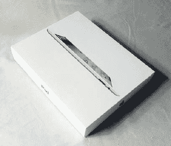
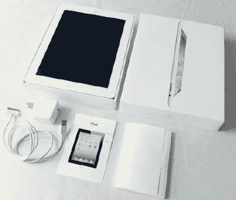
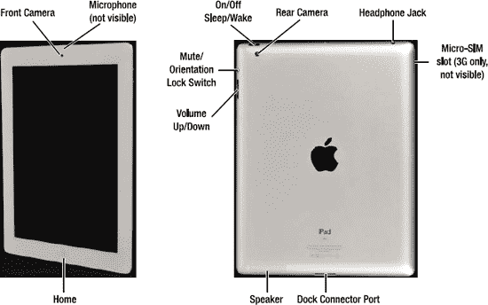
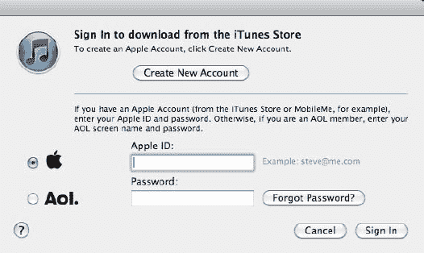
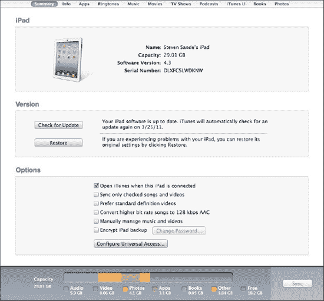
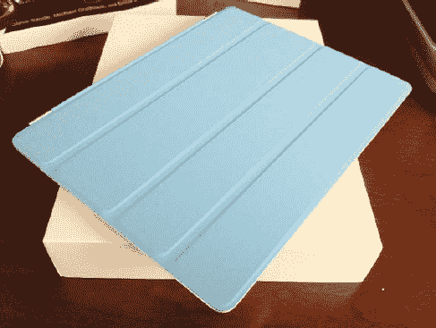
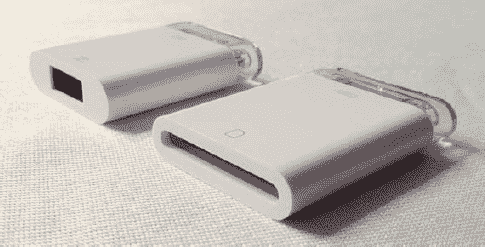

# 引言

哦，我们已经走了这么远。

随着我们步入 21 世纪的第二个十年，过去 30 年的计算机正日益显露出不仅仅是陈旧，甚至堪称古老的痕迹。20 世纪 80 和 90 年代笨重的 CRT 显示器已被 21 世纪薄如铅笔的显示屏所取代。PC 那笨重厚实的米色机箱已缩小到一本厚平装书的大小，例如苹果的`Mac Mini`，或者甚至被整合到显示器本身之中，就像苹果的`iMac`一样。PC 的缩小化同时也伴随着计算机性能数千倍的提升——这种进步丝毫没有减弱的迹象。但是，尽管微型化和处理能力的爆炸式增长是令人赞叹的技术成就，iPad 却标志着一个全新时代的开始——触控计算机的时代。

当你手持 iPad 2 时，你便掌握了未来。它的手势控制打破了计算机的数字/物理屏障。借助 iPad 2，你可以触摸你的电影、电子邮件和数码照片；你可以在不增加包重的情况下携带一万本书；你只需手指轻轻一扫，就能翻阅书页。就连长期被局限于僵化桌面环境的网络，也变成了你茶几上的杂志，只不过拥有无限的页面。

当第一代 iPad 最初问世时，有人说它不过是一个大号的 iPhone。的确，iPhone 向世界介绍了多点触控界面，而且两款设备都使用了名为`iOS`的相同操作系统。然而，正如你即将看到的，它们之间有许多细微和相当多的重大差异。使用 iPad 时，你的视线会立刻被它的大屏幕所包围；无论是在腿上玩游戏、浏览地图还是观看视频，都无需眯着眼睛。它的全尺寸键盘让你能够使用不逊于传统旧式计算机上的应用程序，舒心地创建文档、电子表格和演示文稿。不，iPad 并非放大了的 iPhone；它是个人电脑的进化。iPad 2 进一步定义了计算机的未来，使该设备不仅用于媒体消费，更用于媒体创作。苹果增加了前置和后置摄像头，用于 FaceTime 视频聊天和高清视频录制。现在，你不仅可以听音乐，还可以使用可选的`GarageBand`软件创作自己的音乐。甚至直接在触摸屏上进行视频编辑，现在也因苹果的`iMovie for iPad`而成为现实。

《充分发挥你的 iPad 2》将向你介绍 iPad 2。从帮助你选择最适合你的 iPad 开始，我们引导你完成购买决策和首次设置。你将学会基于手势的多点触控词汇，这些词汇使你能够操控 iPad 及其数以万计的应用程序。我们将向你展示如何连接互联网、浏览网页、触摸你的音乐和视频，以及从 App Store 查找和下载应用。你将发现如何使用苹果革命性的`iBooks`应用购买和浏览书籍，观看幻灯片和照片，发送电子邮件，创建笔记和日历，甚至将你的 iPad 变成指南针。你还将发现，iPad 不仅仅是一种新的休闲设备；它是一个强大的办公工具，而且对许多人来说，确实可以成为传统计算机的可行替代品。我们引导你创建丰富的文档、电子表格和演示文稿。我们还向你展示如何使用前置和后置摄像头与朋友和家人进行视频会议，甚至录制你自己的电影。最后，我们向你展示一些我们最喜欢的第三方应用，以及我们将 iPad 用作艺术家画布、教学工具甚至厨房帮手的方法。

本书是为任何拥有 iPad 2 或正考虑购买一台（你不会后悔的！）的人而写。无论你是 Mac 还是 Windows 用户，或者实际上从未使用过电脑，这都不重要。本书的全面覆盖和逐步讨论使所有 iPad 2 用户都能了解他们的设备，并掌握充分发挥其性能所需的技能和知识。如果你拥有原始 iPad 并刚刚升级到 iPad 2，这本书对你仍然大有裨益。iPad 2 引入了许多我们将在本书中详尽介绍的新硬件和软件功能。

如何阅读本书由你自己决定。如果你对 iPad（或一般电脑）完全陌生，我们建议你从头到尾通读本书，但如果对你来说跳着章节读效果更好，也完全可以。最重要的是，在学习 iPad 所能做的一切时，要享受其中的乐趣。这是计算的未来，非常带劲。感谢你让我们为你展示这一切。

## 第 1 章

### 将你的 iPad 带回家

购买你的第一台 iPad 应该是一次有趣且令人兴奋的经历。与购买一台功能齐全的台式机或笔记本电脑相比，需要你抉择的选项并不多，不会让事情变得复杂。iPad 的价格标签并不像苹果的`MacBook Pro`那样令人望而却步，所以即使你没有做出完美的选择，对你的钱包也不会造成太大冲击。在本章中，你将了解在前往当地苹果零售店或在线订购 iPad 之前，应做出哪些决定。你将了解除了 iPad 之外还需要什么，如果你对购买不满意或拿到有问题的设备该怎么做，以及如何让你的 iPad 准备好日常使用。以下是选择、购买和设置 iPad 所需的所有基本知识。

### 挑选你的 iPad

尤其是在 iPad 生命周期的这个早期阶段，关于购买哪种型号的设备，你有一个相对容易的决定。在任何特定时间，可用的 iPad 型号从来不会太多，因为苹果在保持其产品线精简且与时俱进方面做得很好。你需要问自己的主要问题是：你是否需要 3G 无线功能，你的 3G iPad 应该运行在 GSM 还是 CDMA 网络上，你想要多大的存储空间，以及是否要购买二手 iPad。让我们更详细地探讨这四个问题。

#### Wi-Fi 还是 Wi-Fi + 3G？

iPad 是一款联网设备。当然，它也能在没有网络连接的情况下用作电子书阅读器或游戏设备，但没有网络的 iPad 就像轮胎瘪了的保时捷。苹果为你提供了两种选择：Wi-Fi（无线网络连接）型号和 Wi-Fi + 3G（无线网络加 3G 移动数据连接）型号。如果你想要在 Wi-Fi 热点之外的地方联网，就需要购买 iPad 的 Wi-Fi + 3G 版本，因为你无法在后期为 iPad 增加这一功能。

Wi-Fi + 3G 型号比仅支持 Wi-Fi 的型号稍贵，价格高出约 130 美元。你支付的部分对应的是内置的 3G 电路、全球定位系统（GPS）接收器以及一根天线，通俗点说，就是你的 iPad（加上向本地无线运营商订阅的可选数据套餐）可以在任何有 3G 无线服务的地方上网、收发电子邮件以及连接至 iBookstore。你需要 3G 功能吗？这里有几个需要你自问的问题：

-   **你是否会在没有 Wi-Fi 热点的地方使用 iPad？** 如果你打算在配备 Wi-Fi 的家庭和办公室周围使用 iPad，并且你常去的大多数场所（商店、图书馆、咖啡馆、机场和酒店）都提供免费 Wi-Fi，那么你可能不需要 Wi-Fi + 3G 型号。然而，如果你经常在车内、足球场或其他没有 Wi-Fi 的地方需要联网，那么 Wi-Fi + 3G 的 iPad 可能才是你的正确选择。
-   **你是否有其他方式连接 3G 网络？** 你可能已经有另一种接入广域无线网络的方法。如果你有一个 3G 路由器，例如 Sierra Wireless Overdrive 3G/4G 或用于笔记本电脑的 Novatel MiFi，那么你可以使用它和你现有的无线数据套餐来连接互联网。如果你有运行 iOS 4.3 或更高版本的 iPhone 4，可以考虑使用手机上的“个人热点”功能作为你的互联网网关（需要单独的数据套餐）。
-   **你是否愿意为你的 iPad 和 3G 数据套餐支付额外费用？** 首先，Wi-Fi + 3G 的 iPad 比对应的不含 3G 的型号贵 130 美元。这还不是你将要承担的唯一额外费用，因为你的无线运营商会向你收取数据套餐费用。在美国，AT&T 提供无需合约的 3G 数据服务，每月 250MB 数据需 14.99 美元，或每月 2GB 数据需 25 美元。另一家美国运营商 Verizon Wireless 的资费从每月 20 美元 1GB 数据起步，最高可达每月 80 美元 10GB 数据。国际运营商提供类似的套餐，请向你所在国的运营商咨询数据套餐的费用和容量的详细信息。
-   **你是否需要使用能够感知 iPad 位置的应用？** Wi-Fi 版 iPad 能够通过一种称为 Wi-Fi 定位系统的技术来确定其位置。这项由北美 Skyhook Wireless 提供的服务，利用已知 Wi-Fi 接入点的位置来近似定位 iPad 的位置。虽然在美国和加拿大的人口密集中心区域，这可以将位置数据精确到 20 到 30 米范围内，但当 iPad 远离 Wi-Fi 时，它完全无法工作。Wi-Fi + 3G 的 iPad 包含一个完整的辅助全球定位系统（A-GPS）接收器，能够利用 GPS 精确定位设备的位置。因此，只要 Wi-Fi + 3G 的 iPad 能够“看到”天空，几乎在地球上的任何地方都能确定精确的位置。

#### GSM vs. CDMA

如果你决定购买 Wi-Fi + 3G 的 iPad，你还需要决定使用哪种移动无线网络。在美国有两个选择：GSM，即 AT&T Wireless 使用的标准；以及 CDMA，即 Verizon 移动网络背后的技术。全球绝大多数的无线网络都使用 GSM，因此，经常进行国际旅行的用户在做出购买决定时可能会考虑这一因素。

实际上，这两种 3G 网络的速度和性能是相似的。对于大多数美国 iPad 买家来说，主要的区别在于两家运营商在你生活和工作区域所提供的覆盖范围。对目前手机语音信号质量感到满意的 Verizon Wireless 用户，可以继续使用他们现有的运营商来获得 iPad 数据服务。同样，信号强度满格且服务质量良好的 AT&T Wireless 用户，可能也愿意继续使用他们当前的运营商。

### 存储容量有多大？

在决定购买 Wi-Fi 版还是 Wi-Fi + 3G 版 iPad 后，接下来要考虑的是内置存储容量。尽管不同型号 iPad 的运行内存（RAM）容量相同（初代 iPad 为`256MB`，iPad 2 为`512MB`），但用于存储应用和数据的闪存驱动器有三种规格：`16GB`、`32GB`和`64GB`。iPad 的闪存驱动器无法升级，因此你只能使用购买时选择的容量。和任何电子设备一样，iPad 会随时间更新换代，未来可能会提供更大存储容量。

在 iPad 发布时，`16GB`和`32GB`型号之间的差价仅为`100 美元`，而将存储空间升级到最大的`64GB`也只比基础型号贵`200 美元`。在决定购买多大存储容量前，请考虑以下问题：

- *你的音乐库有多大？* 如果音乐库较小，想在 iPad 上听音乐完全没问题。如果音乐库很大，更大容量型号的额外空间能帮你存储更多音乐和播客。当然，如果你已有 iPod 等音乐设备，也可以继续用它听音乐。iPod 有多种容量规格，且比 iPad 便携得多。
- *你想随身携带多少视频？* 一部两小时的电影可能占用超过 1GB 的存储空间。如果你经常旅行，尤其是乘坐飞机，可能会愿意多花钱来存储更多电影和电视节目。在本书的第 7 章中，我们将讨论如何使用 Handbrake 将 DVD 视频转换为 iPad 兼容的格式。尽管 Handbrake 的视频压缩效果很好，但一部电影的大小仍可能达到`500MB`到`1GB`。如果你还拥有第二代 Apple TV，可以考虑使用 Apple 的 AirPlay 和家庭共享功能将视频流传输到 iPad，从而减少对更大存储空间的需求。
- *你打算携带大量照片吗？* 虽然数码照片体积很小（一张典型照片的大小为`300KB`到`1.2MB`），但如果携带数千张照片，它们仍然会占据不少存储空间。你可能会觉得在 iPad 上带这么多照片很荒唐？但 Apple 对 Mac iPhoto 应用的内置支持，让你只需一次同步操作就能将多年的照片存档存入 iPad。使用 iPad 相机连接套件，直接将数码相机中的照片传输到 iPad 也十分方便。因此，在旅行时把一路的记忆备份到 iPad 上并非完全不可行。
- *你需要携带大量数据吗？* 你可能不会把 iPad 当作数据存储设备，但确实有办法（主要是通过电子邮件将文档发送给自己或使用第三方应用）在旅途中携带数据。如果你认为可能需要这样做，那么额外的 GB 空间就能派上用场。
- *你打算使用这台 iPad 多久？* 如果你是一个早期采用者，计划在 Apple 推出新机型时第一时间升级，那么现在可以省省钱包，期待未来更快推出的拥有更大内存的机型。相反，如果你希望尽可能长时间地充分利用这台 iPad，那么前期投入更多意味着你不会那么快就觉得存储空间不够用了。

### 应该购买二手 iPad 吗？

既然 iPad 已经上市了一段时间，一些用户开始升级到更新或功能更强的 iPad，因此二手设备通常比新机更便宜。如果你不需要最新最好的 iPad，二手设备可以让你以更小的经济压力进入 iPad 世界。

信不信由你，Apple 是出售二手 iPad 的最佳商家。该公司经常以低于新设备建议零售价的价格出售翻新 iPad，并且这些 iPad 会附带原厂保修。你可以在 Apple 在线商店（[`http://store.apple.com`](http://store.apple.com)）或 Amazon.com 上找到翻新设备。

eBay 通常是购买二手电脑设备的好地方，因为买家会给卖家评分，你可以一目了然地看到其他人与特定卖家的交易情况。然而，与任何在线拍卖一样，买家需要保持警惕。确保卖家有你正在竞拍的具体设备的照片，有退货政策，并且拥有完美的好评率。

如果你从本地个人手中购买 iPad，在做出承诺之前，不妨考虑让 Apple 授权服务提供商（[`www.apple.com/buy/locator/service/`](http://www.apple.com/buy/locator/service/)）检查一下设备。虽然你可以很容易地目视检查屏幕和外壳是否有划痕或凹痕，但很难发现是否有水造成的隐性损坏，或者接口是否已损坏。

最后，当下一代 iPad 发布时（通常在三月或四月），你或许能买得起新机。零售商需要为即将到货的新 iPad 腾出空间，从而打折清空现有库存。耐心等待会有回报！

### 考虑系统需求

iPad 与大多数其他电脑不同。本质上，它们类似于一台大屏幕的 iPod touch。而且，像 iPod touch 一样，要想有效使用 iPad，你需要一台配备 USB 2.0 接口、能连接互联网并运行最新版 iTunes 的电脑。虽然 iPad 可以通过 Wi-Fi 或 3G 连接接收应用更新和同步数据，但它仍需直接连接到电脑才能接收系统软件更新。此外，通过直接 USB 2.0 线缆连接，传输大量音乐、电影或照片的速度也快得多。

你需要将 iPad 成功连接到 iTunes 后，才能购买应用、书籍或音乐。这意味着你需要一台运行 OS X 10.5.8 或更高版本的 Mac，或者一台运行 Windows XP（家庭版或专业版，需 Service Pack 3 或更高版本）、Windows Vista 或 Windows 7 的 Windows 电脑。这也意味着你需要拥有一个 iTunes Store 账户。

在决定购买 iPad 之前，请问问自己：你手头是否有具备所有这些功能的电脑？如果没有，你可能无法设置和使用 iPad。

**注意：** 如果你尚未在电脑上安装 iTunes，可以从[`www.apple.com/itunes`](http://www.apple.com/itunes)免费获取。它同时适用于 Mac OS X 和 Windows 系统，安装快速简便。

### 购买你的 iPad

在从现有的 iPad 型号中做出决定后，你可能已经准备好掏出信用卡去购买一台 iPad 了（参见图 1–1）。你应该去哪里购买？去 Apple Store？去苹果授权经销商或百思买（Best Buy）零售店？还是应该在线购买？你可能会惊讶地发现，其中存在更好和更差的选择。

我们建议你亲自到实体店购买 iPad。你可以提出疑问，建立人情联系。如果购买过程中出现问题，你可以找到能面对面帮助你解决的人。这并不是说拨打苹果的支持热线不够用；而是说与真人面对面交流能更顺利地解决问题。

令人遗憾的是，偶尔 iPad 的购买过程并非一帆风顺。有些人最终会遇到屏幕瑕疵，比如坏点。这并不是一个罕见的问题，如果在购买后很快发现，可能可以换一台新机。其他人则可能遇到连接 Wi-Fi 或 3G 网络的问题。当你有一个可以交谈的真人时，解决这些问题的几率会显著增加。

至于选择苹果零售店还是其他零售商，我们稍微倾向于在 Apple Store 购买。你购买的是苹果产品，而苹果员工对该产品显然了解得更多。

**图 1–1.** *那个漂亮的闪亮盒子里装着你心仪的 iPad。请记得保留所有包装、收据和其他购买信息，以备需要退货时使用。*

### 在线购买你的 iPad

对于数量惊人的人来说，附近并没有实体店可以购买 iPad。在这种情况下，苹果在线商店是你尽快拿到 iPad 的最佳选择。

**注意：** 有两种快捷方式可以在线购买 iPad。首先，点击苹果网站（[`www.apple.com`](http://www.apple.com)）顶部的 iPad 标签，然后点击蓝色的“立即购买”按钮。第二种方式？将浏览器指向苹果在线商店的 iPad 页面（[`http://store.apple.com/us/browse/home/shop_ipad/family/ipad`](http://store.apple.com/us/browse/home/shop_ipad/family/ipad)）。请确保准备好你的信用卡。

苹果让在线购买 iPad 变得非常容易。各个机型都有自己的“选择”按钮，点击后会带您进入一个页面，让您选择要添加到购买中的苹果配件。将这些配件添加到购物车只需点击每个配件旁边的单选按钮；当您最终准备结账时，点击“添加到购物车”按钮会显示您虚拟购物车的内容以及一个“立即结账”按钮。每个物品旁边会显示预估的发货日期，以便您知道何时开始等待快递员按响门铃。

### 维修、退货、保修、AppleCare 和保险

在大多数情况下，您购买的 iPad 都将完美运行，您永远不需要将其退回给苹果。然而，如果您确实拿到了一台无法正常工作，或者在购买后第一年内就无法工作的 iPad，可以遵循一个经过验证的流程。

首先，访问 iPad 支持网页（[`www.apple.com/support/ipad/`](http://www.apple.com/support/ipad/)），查看是否设置不当，或者是否存在已知问题及其解决方案。如果在线支持无法解决问题，那么您就需要将 iPad 带到您的苹果零售商处，或者将 iPad 寄送给苹果。

对于在 Apple Store 购买的 iPad，最简单的做法是带上您的收据、iPad、原装盒以及盒内的所有物品，然后前往商店。Apple Store 的员工可能会要求您与 Genius Bar 的工作人员协作尝试解决问题，在这种情况下，可能需要等待他们安排出繁忙日程中的时间。

在其他苹果授权零售商处，退货政策可能有所不同，因此请在购买 iPad 时务必核实该政策。

从苹果在线购买的 iPad 需要获取退货授权（RMA）。要启动退货流程，请拨打苹果支持电话 1–800-275-2273，并与 iPad 支持专员沟通。如果该人员判断 iPad 存在故障且符合维修或更换条件，他们会为您发放一个 RMA。

**注意：** 在美国境外，您可以参考 [`www.apple.com/support/contact/phone_contacts.html`](http://www.apple.com/support/contact/phone_contacts.html) 获取苹果支持的国际电话号码列表。

在本节第一段中，我们提到了“购买后的第一年”。这是任何 iPad 附带的免费保修期。如果您希望将保修期再延长一年，可以花费 99 美元购买适用于 iPad 的 AppleCare 全方位服务计划。这会将您的硬件维修覆盖期延长至两年。如果有兴趣，您可以在苹果在线商店购买此选项。保修期一旦过期，您将需要按当时的价格支付维修或电池更换费用。

美国运通卡持卡人只需使用其运通卡购买 iPad，即可将 iPad 的保修期延长一倍。其他信用卡公司也可能提供此延长保修计划，因此请务必查阅您的卡条款和细则以了解详情。

如果可能的话，在送修之前，请务必通过将 iPad 同步到 iTunes 来进行备份。苹果通常会将 iPad 恢复至出厂状态，这意味着在维修和服务过程中，您将丢失存储在 iPad 上的所有数据。

AppleCare 值得购买吗？在我们看来，是值得的。曾经有一个案例，在一个 Apple PowerBook G4 的逻辑板（FireWire 端口有故障）需要更换时，差不多在购买计划三年后，AppleCare 的赔付金额远远超过了其购买成本。

您在购买 iPad 后的 90 天内有权享受免费电话支持。AppleCare 将此期限延长至整整两年，并且您可以随时致电苹果专家，次数不限，以解答您的疑问。

如果您发现 iPad 并非您真正所需，或者您决定想要 64GB 型号而不是您购买的 32GB iPad，该如何处理？苹果意识到人们可能会改变主意，或出于某种原因感到不满意，因此您有 14 个日历日的时间来退货。您必须将 iPad 连同原始、无标记的包装盒一并退回，其中包括所有配件（如电源适配器）、手册、文档和随产品附带的注册资料。这种灵活性是有代价的，因为苹果会收取退货价格 10% 的重新入库费。

苹果不为 iPad 提供保险计划，并且该公司未来也不太可能提供此类服务。相反，您需要联系您的租客或家庭保险提供商，了解为 iPad 添加附加险（rider 指附加在现有保单之上，为标准计划未涵盖的特定物品增加保障）需要支付多少费用。

### 拆箱你的 iPad

当你带着 iPad 回家，或是它被送到你家门口时，就该拆箱并进行设置了。iPad 的包装（见图 1–2）本身就是一件小巧的艺术品。iPad 的包装盒内包含设备本身、一根 `Dock Connector` 转 `USB` 连接线、一个 10 瓦 `USB 电源适配器`以及一包文档。这些物品每一样都很重要，能帮助你进行日常使用。

-   **连接线**：`USB 连接线`可将 iPad 连接到电脑或 `交流电源适配器`。无论你是要给 iPad 充电以备次日使用，还是要与电脑同步以获取最新软件更新，`Dock Connector` 转 `USB` 连接线都是 iPad 套件中的关键部件。
-   **USB 电源适配器**：iPad 附带的 `交流电源适配器`可直接插入墙壁插座，让你能为 iPad（或任何其他 USB 设备）充电。它提供一个 USB 端口。使用时，只需用 `USB 连接线`将 iPad 连接到适配器即可。它能提供为 USB 设备供电所需的 5 伏电压。

**图 1–2.** *iPad 包装盒内的物品不多：iPad、一根 Dock Connector 转 USB 连接线、一个 10 瓦交流电源适配器以及一些简单的文档。*

### iPad 功能概览

拆箱 iPad 后，花几分钟时间了解一下你的新设备吧。图 1–3 介绍了 iPad 的基本功能。

iPad 顶部设有一个可插入耳机的插孔、一个内置麦克风（位于 iPad 2 的顶部正面）以及一个用于开启或关闭特定功能的 `睡眠/唤醒` 按钮。如果你购买的是 Wi-Fi + 3G 型号，顶部（或在 iPad 2 上是左侧）还会有一个微型用户身份模块（micro-SIM）卡托，用于存放手机的 micro-SIM 卡。iPad 底部内置扬声器和一个用于连接 `Dock Connector` 转 `USB` 连接线或基座的凹槽。iPad 正面是一块巨大的触摸屏和一个单独的 `主屏幕` 按钮。在通过 `iTunes` 完成 iPad 设置之前，你的 iPad 屏幕将处于未激活状态。

较新款的 iPad 还配备了两个摄像头：一个位于正面，用于使用 `Photo Booth` 或进行 `FaceTime` 视频通话（见第 15 章）；另一个位于背面，可用于录制高清视频和拍摄静态照片。

在 iPad 的右侧（正面观看时），你会找到音量键和侧边开关（用于锁定屏幕方向）。

**图 1–3.** *功能分解图，展示了 iPad 2 上的按钮和接口。基座接口位于 iPad 底部靠近主屏幕按钮的位置。*

### 准备设置

你已经拆箱了 iPad，但尚未将其连接到 `iTunes`。现在是检查电脑上的数据的好时机。当你的 iPad 首次设置时，它会与 `iTunes` 同步，同时根据你的电脑设置，同步你的电子邮件账户、日历等。在继续之前，你可能需要检查和清理以下项目，以便你的 iPad 能以最新的数据开始运行：

-   **联系人**：iPad 可与 Windows 上的 `Outlook` 2003 或 2007 以及 `Windows 通讯簿`、Mac 上的 `通讯录`、`Outlook` 或 `Entourage`，以及互联网上的 `Yahoo! 通讯录` 或 `Google 联系人` 同步。为了准备首次同步，请检查你现有的联系人，并确保他们的电话号码和电子邮件地址是最新的。如果你使用其他程序管理联系人，请考虑将联系人迁移到上述解决方案之一。如果你不想这么做，也没问题。你可以直接在 iPad 上添加联系人信息，尽管这不如自动加载信息那么方便。
-   **日历**：你可以将 iPad 与电脑上的日历同步，就像同步联系人一样。iPad 支持 Mac 上的 `iCal`、`Outlook` 和 `Entourage` 日历，以及 Windows 上的 `Outlook` 日历。在首次同步前整理好你的日历，这样你就可以立即在电脑和 iPad 上管理日程了。
-   **电子邮件**：iPad 可与大多数电子邮件提供商配合使用，包括 `Yahoo! Mail`、`Google Gmail` 和 `AOL`。如果你的电子邮件提供商使用行业标准的 `POP3`、`IMAP` 或 `Exchange` 服务，那么你的服务也能与 iPad 配合使用。你可能希望在设置 iPad 之前先在这些提供商处建立新账户。这样，在首次同步时，这些账户信息就会加载到你的设备上。你总归可以稍后添加新的电子邮件账户，但能一次性设置好并立即投入使用会更方便。
-   **媒体**：与例如拥有慷慨的 160GB 硬盘容量的 `iPod Classic` 相比，某些 iPad 型号的存储空间相对较小。为了充分利用这有限的空间，请为你最喜爱的歌曲、电视节目、电影和播客创建播放列表。因为很可能你无法将整个媒体库同步到新的 iPad 上，所以现在花点时间筛选你的媒体文件，找出你最想随身携带的内容。
-   **软件与操作系统**：在尝试设置 iPad 之前，请将 `iTunes` 更新到 10.2 或更高版本。如果你使用的是 Mac，请确保已将操作系统更新到至少 `OS X` 10.5.8。Windows 电脑必须运行 `Windows 7`、`Windows Vista` 或安装了 `Service Pack 3` 或更高版本的 `Windows XP Home` 或 `Professional`。你可以从 Apple 官网 [`www.itunes.com/download`](http://www.itunes.com/download) 下载最新版本的 `iTunes`。
-   **iTunes 账户**：Apple 要求使用一个有效的 `iTunes` 账户才能设置你的 iPad。如果你还没有账户，你必须在 `iTunes Store` 注册一个账户。如果你想通过 `iTunes Store`、`App Store` 或 `iBookstore` 进行购买，你需要提供有效的地址和信用卡。以下是创建新 `iTunes` 账户需要遵循的步骤：

1.  在电脑上启动 `iTunes` 应用程序，并等待其加载完成。
2.  在窗口左侧的栏目中找到 `iTunes Store`。点击 `iTunes Store`，然后等待商店窗口加载。你必须连接到互联网才能执行此操作，因为所有商店信息都存储在 Apple 的服务器上。
3.  点击屏幕右上角的 `登录` 链接。`iTunes` 会打开如图 1–4 所示的登录界面，你可以使用现有账户登录，也可以开始创建新账户。

**图 1–4.** *iTunes 登录界面让你能够使用现有账户登录 iTunes，或开始创建新账户的流程。*

4.  点击`Create New Account`。屏幕会清空，并显示一条欢迎您使用 iTunes Store 的消息。点击`Continue`按钮。
5.  查看服务条款，勾选标有“I have read and agree to these terms and conditions”的复选框，然后点击`Continue`。一个新窗口会出现，提示您创建账户。
6.  输入您的电子邮件地址和密码（必须输入两次密码以进行验证）。同时输入一个有助于验证您身份的问题和答案，以及您的出生月份和日期。查看页面上的其他选项，并根据需要调整，然后点击`Continue`。屏幕将再次清空，您将进入账户创建的最后一个步骤。
7.  输入有效的信用卡及该信用卡的账单信息。这些信息必须匹配才能完成账户创建。输入信息后，点击`Continue`。

完成这些步骤后，您将会在注册时指定的地址收到一封确认邮件。邮件会欢迎您加入 iTunes Store，并提供客户服务网址（[`www.apple.com/support/itunes/store`](http://www.apple.com/support/itunes/store)）。

创建 iTunes App Store 账户并不需要信用卡。如果您只打算下载免费应用，并且没有信用卡，有一种方法可以直接从您的 iPad 上创建 iTunes App Store 账户。以下说明假定您尚未拥有账户，并且已经拆开 iPad 的包装。别担心；如果您想稍后再操作，随时可以回来参考这些说明。

1.  在您的 iPad 上，点击 App Store 应用图标以启动它。
2.  寻找一款免费应用。可以是任何应用，但请确保其价格显示为`Free`。点击`Free`按钮开始“购买”流程；然后点击`Install App`。
3.  会弹出一个对话框，要求您使用现有 Apple ID 或创建新的 Apple ID 登录 iTunes App Store。点击`Create New Apple ID`按钮。
4.  系统会要求您选择一个与您付款方式账单地址相匹配的国家或地区。点击`Store`字样旁边的国家名称，从出现的列表中选择一个；然后点击`Next`按钮。
5.  同意 iTunes Store 条款与条件。
6.  现在系统会要求您输入新的账户信息，包括您的电子邮件地址、密码、密保问题与答案以及您的出生日期。输入这些信息后，点击`Next`。
7.  在账单信息屏幕上，点击`Credit Card`字样旁边的名称，然后选择`None`作为您的付款方式。输入有效的姓名和账单地址，然后点击`Next`。
8.  此时，应会出现一个电子邮件验证屏幕。点击`Finish`，然后在您的 iPad 上打开“邮件”应用（前提是邮件已设置好；如果尚未设置，您可以在另一台电脑上完成此部分操作）。
9.  打开来自 Apple 的邮件，点击`Verify Now`链接。系统会要求您登录以完成账户创建。
10. 点击`Use Existing Account`按钮，输入您刚刚创建的用户名（电子邮件地址）和密码，然后点击`OK`。
11. 您将看到一条消息，告知您 iTunes Store 账户已成功创建。点击`Done`按钮，然后您就可以开始从 iTunes、App Store 或 iBookstore 下载任何免费应用、图书、音乐或视频了。在第 8 章中了解更多关于这些商店的信息。

### 将 iPad 连接到电脑

当您在电脑或 iPad 上创建了 iTunes 账户后，您应该将 iPad 连接到电脑进行备份、检查软件更新以及执行初始数据同步。如果您尚未从包装盒中取出 iPad，请遵循以下步骤：

1.  从包装盒中取出 iPad，并撕掉出厂包装膜。同时拆开附带的基座接口转 USB 连接线。
2.  找到 USB 连接线的两端。一端较薄，并标有标准的三叉 USB 符号。另一端较宽，并标有一个内含一条直线的矩形。
3.  将连接线的宽头连接到 iPad 底部的基座接口端口。将薄头连接到电脑上空闲的 USB 2.0 端口。iTunes 将启动，您的 iPad 会发出轻柔的提示音。

如果您的 iPad 没有自动开机并显示白色 Apple 标志或“连接到 iTunes”消息，请按住`Sleep/Wake`按钮。让主屏幕朝向您，该按钮位于 iPad 的右上角。几秒钟后，iPad 应会唤醒并在开机时显示白色 Apple 标志。如果 iPad 没有响应，也未显示白色 Apple 标志或“连接到 iTunes”消息，请联系您购买设备的商店或致电 Apple 支持。

### 同步你的新 iPad

现在你可以准备将 iPad 与电脑进行同步了。这样你就能初始化 iPad 上的音乐、影片、播客、电子邮件帐户、日历、书签等内容。

连接到电脑后，iPad 会出现在 iTunes 的源列表中（即电脑 iTunes 屏幕上的左侧栏）。如果你已经拥有并使用 iPhone，那么你对 iPad 同步操作应该已经很熟悉了。如果不熟悉，这里有一个快速概述。

在你的电脑上，点击源列表中 iPad 的名称，即可在 iTunes 主窗口中打开其偏好设置。窗口顶部的标签页允许你设置与 iPad 相关的各项选项。

**提示：** 在 Mac 或 PC 的 iTunes 中，再次点击 iPad 名称即可打开一个文本编辑字段，让你能够编辑名称。你可以给 iPad 起个比“John Appleseed 的 iPad”更有创意的名字。也许你可以把它命名为“比尔·盖茨”来博君一笑。

“摘要”标签页（见图 1–5）显示了 iPad 的概览信息，包括 iPad 名称、容量、当前安装的固件版本、序列号和电话号码。在此页面上，你可以检查固件更新，并将 iPad 恢复到原始的出厂状态。

**图 1–5.** *iTunes 允许你管理加载到 iPad 上并与 iPad 同步的内容。每个标签页都提供多种控制选项，让你能选择每次同步时哪些信息会加载到 iPad 上。*

“信息”标签页允许你选择哪些通讯录、日历、邮件帐户、书签和备忘录会同步到 iPad。通过勾选这些项目的复选框来选择你想要同步的内容，然后点击 `Apply`。你可以同步任何 POP3、Exchange 或 IMAP 电子邮件帐户。

“应用”标签页会显示已安装到 iPad 上的应用程序，并让你能够管理哪些应用放在特定的主屏上。此标签页还用于在 iPad 应用和电脑之间共享文件。

“音乐”标签页指定你希望存储在 iPad 上的歌曲、播放列表和音乐视频。如果你拥有一个庞大的音乐库，你可能只想选择你最喜欢的播放列表，或者创建智能播放列表（本书后面会介绍），以建立一个不断变化的收藏集。“影片”标签页与“音乐”标签页类似，但它允许你确定要在 iPad 上存储哪些影片。由于影片文件可能非常大，你可能希望每次只移动少量影片到 iPad 上观看。

想在 iPad 上观看自己喜欢节目的电视迷们，可以使用“电视节目”标签页来同步从 iTunes Store 购买的节目。如果你的口味更偏向音频内容，“播客”标签页可以指定你订阅的播客中哪些剧集同步到 iPad。各年龄段的学生如果想使用 iTunes U 课件来增长知识，可以使用“iTunes U”标签页将讲座和教育视频同步到 iPad。

iPad 是终极的电子书阅读器，当你想要在电脑和 iPad 之间同步电子书或有声读物时，“图书”标签页会很有帮助。

“照片”标签页让你能够将 iPad 上的照片集与 iPhoto 同步。由于你可以使用相机连接套件将照片直接从数码相机导入到 iPad，因此“照片”标签页是将照片移至电脑进行备份的重要工具。

对于任何标签页，只需做出选择并点击 `Apply`。屏幕底部的容量条会监控设备上剩余的空间。

### 为你的 iPad 配备配件

如果你在 Apple Store 购买 iPad，苹果销售专员会向你展示许多可用的配件。这些配件来自苹果公司和第三方厂商，它们为 iPad 提供保护并增加附加功能。

苹果销售 iPad 基座，可让你轻松为 iPad 充电和同步。售价 29 美元的 iPad 基座和 iPad 2 基座能将 iPad 以直立姿态支撑起来，并兼容其他配件和可选的音频线缆。对于第一代 iPad，iPad 键盘基座（售价 69 美元）增强了在 iPad 应用中的文本输入功能，并在你打字时为 iPad 充电。

为了保护 iPad 2，苹果提供了 iPad Smart Cover（售价 29 美元；图 1–6），它可以折叠成多种形态，用于在平坦表面上支撑 iPad 2。这款色彩缤纷的 Smart Cover 通过磁力吸附在 iPad 2 上，打开时自动唤醒 iPad 屏幕，合上时则使其进入休眠。

**图 1–6.** *iPad 2 Smart Cover 有彩虹般的多种颜色可选，在保护 iPad 屏幕的同时，几乎不增加重量或厚度。*

摄影师们会想购买 iPad 相机连接套件（售价 29 美元；图 1–7），该套件包含两个转接器——一个用于通过 USB 2.0 线缆连接相机，另一个用于读取 SD 存储卡。USB 转接器还可用于连接 USB 耳机和键盘到 iPad。

**图 1–7.** *iPad 相机连接套件包含两个转接器。左边的转接器可连接标准 USB 线缆，用于直接连接数码相机；右边的转接器可用于读取或写入 SD 存储卡。*

由于你可能想用 iPad 播放幻灯片或 Keynote 演示文稿，苹果销售 iPad Dock Connector to VGA 转接器（售价 29 美元）。该转接器的 VGA 端可连接到外接显示器、某些电视和 PC 投影仪。在 iPad 2 上，屏幕上的任何内容都可以镜像到外部显示器上，而第一代 iPad 则仅限于显示那些专门编写了视频输出功能的应用。

苹果 Digital AV 转接器（售价 39 美元）非常适合将幻灯片、影片、照片以及 iPad 屏幕上可见的任何其他内容输出到你的高清电视上。该转接器提供标准 HDMI 接口以及一个基座接口端口，用于在连接显示器时为 iPad 充电。

苹果分量 AV 线缆（售价 39 美元）和复合 AV 线缆（售价 39 美元）也兼容 iPad，提供了另外两种将外接显示器和投影仪连接到设备的方法。这些线缆同样适用上述应用限制。

最后，苹果无线键盘（售价 69 美元）和大多数其他蓝牙键盘都与 iPad 兼容，为在 iPad 应用中输入文本提供了另一种方式。

### 总结

在本章中，你学习了如何选购你的 iPad。你了解了在使用 iPad 之前需要进行哪些设置。作为收尾，以下是本章关键点的快速概述：

-   选择 iPad 时，你主要考虑是否需要 3G 连接、需要多大存储空间，以及（在美国）希望使用哪家移动运营商的网络。你也可以决定是否需要一台全新的 iPad，或者为了更符合预算而使用二手的设备。
-   购买 iPad 有多种渠道，但我们推荐前往 Apple Store。
-   购买前，请确保你的电脑与 iPad 兼容。
-   考虑为你的 iPad 购买 AppleCare 服务，以获得额外一年的硬件维修保障。
-   iPad 技术支援在 90 天内免费，但如果购买了 AppleCare，你可以在长达两年的时间内致电苹果专家。
-   考虑通过向你的保险公司购买附加险，为你的 iPad 投保以防丢失或损坏。

## 第 2 章

