# 将数据和媒体放入 iPad

现在，你已经拆开 iPad 的包装并将其连接到了 `iTunes`。接下来该做什么？第 1 章简要介绍了通过 `iTunes` 将音乐、电影、照片和其他数据与 iPad 同步的基础知识。本章将深入探讨可用于将数据与 iPad 同步的各种选项。无论你是从 `iTunes Store` 购买了歌曲和视频，还是从 CD 和 DVD 将其导入到程序中，`iTunes` 都能将你的 iPad 与其资料库中的几乎任何内容进行同步。若想在 iPad 上拥有丰富的媒体和应用程序库，你需要从电脑上的资料库同步这些内容。

`iTunes` 会决定哪些应用、音乐和视频文件可以传输并加载到你的 iPad 上。接下来，你将了解如何将所有内容整合到 `iTunes` 中，并通过 `USB Dock Connector` 数据线将其发送到你的 iPad。你将看到如何选择想要同步的项目，以及如何让 iPad 上的内容保持新鲜和最新。

### 使用 iTunes

在开始选择要同步哪些歌曲、视频、播客和有声读物之前，你首先需要将 iPad 物理连接到电脑并启动 `iTunes` 应用程序。使用 iPad 附带的 USB 数据线（或等效的底座），将 iPad 连接到系统上一个空闲的 USB 端口。点击电脑上的 `iTunes` 应用程序图标来启动它。如果你的 iPad 设置了锁屏密码，你必须在 `iTunes` 连接前解锁设备（参见图 2-1）。

**注意：** 最好使用 USB 2.0 进行连接。USB 2.0 提供了更优越的带宽和更好的连接性。虽然支持 USB 1.1，但如果你尝试使用 USB 1.1 同步，`iTunes` 会发出警告，并建议你切换到 USB 2.0 端口。通常情况下，你的 iPad 在同步时无法充电。当 iPad 顶部状态栏右侧出现 `Not Charging` 消息时，不必惊慌。相反，请使用 iPad 包装盒内附带的 10 瓦墙插式电源适配器，为 iPad 提供所需的电量进行充电。你的 iPad 拥有出色的内置电池。你会发现，与其他移动设备不同，你只需要每隔一两天充一次电。是的，你可以更频繁地同步，但如果你唯一担心的是让电量保持充足，那其实不必每次都同步。

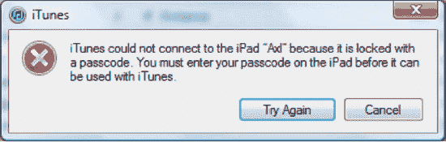

**图 2-1.** *`iTunes` 会提示你在连接设备前解锁 iPad。*

连接成功后，你的 iPad 会出现在 `iTunes` 窗口左侧的列表中。这个浅蓝色的列被称为源列表，它被分为几个部分，分别对应你的媒体资料库、`iTunes Store`、设备和播放列表。iPad 以及连接到电脑的任何其他设备，都列在 `Devices` 标题下方，如图 2-2 所示。

如果你没有在这个列表中看到你的 iPad，请确保已通过 USB 数据线物理连接了 iPad，并且数据线牢固地插入电脑和 iPad。接下来，确保你的 iPad 已开机。当你的 iPad 处于激活或休眠状态时，它会显示在列表中，但关机时不会显示。如果你的 iPad 已正确连接并开机，但仍然未出现，请在 Google 中搜索“disappearing iPads” 或 “disappearing iPhones”。iOS 设备在 `iTunes` 中不显示是一个已知的（尽管是偶发的）支持问题。你会发现其他用户也遇到过同样的问题，并且你可能能够找到解决方案。

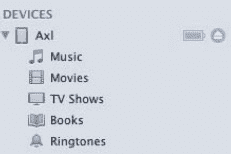

**图 2-2.** *你的 iPad 出现在 `iTunes` 源列表的 `Devices` 部分。设备下列出的项目（你可以通过切换设备名称左侧的隐藏/显示三角形来查看）会根据你选择同步到设备的项目而变化。请注意，你 iPad 名称左侧的图像看起来像一个小型 iPad。在 `iTunes` 中，设备图片看起来就像实际使用的设备。*

### iPad 的 iTunes 设置面板

当你在 `iTunes` 源列表中选择你的 iPad 时，会看到一个包含一系列标签页的设置面板。这些标签页允许你自定义设备连接和同步 `iTunes` 媒体内容的方式。每个标签页都提供了不同的方式来定制 iPad 的内容，让你可以设置与 iPad 相关的选项。

你会看到的标签页（从左到右）包括 `Summary`、`Info`、`Apps`、`Music`、`Movies`、`TV Shows`、`Podcasts`、`iTunes U`、`Books` 和 `Photos`（参见图 2-3）。如果你已经是 iPhone 或 iPod touch 用户，那么 iPad 的设置面板会看起来非常熟悉，尽管它确实有一些 iPhone 或 iPod touch 上没有的选项。如果 iPad 是你的第一款苹果触屏设备，别担心——浏览这些标签页不需要你具备任何 iPhone 或 iPod touch 的知识。阅读完本章后，你就会迅速上手。

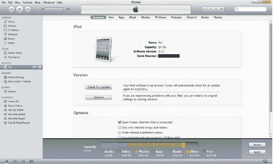

**图 2-3.** *`iTunes` 允许你管理加载到 iPad 上并与之同步的内容。沿着设置面板顶部排列的每个标签页都提供了各种控制选项，让你能够选择每次同步时将哪些信息加载到 iPad 上。`Summary` 面板顶部的 iPad 图形应与你的设备型号和颜色相匹配。*

在 iPad 设置面板的底部，你会发现一条长长的彩色 `Capacity` 容量条（参见图 2-4）。无论你选择哪个标签页，这个容量条都会显示。左侧显示的是你 iPad 的总存储容量，而 iPad 上不同类型文件所占用的数据量则被分解为彩色编码的片段。蓝色代表音频，紫色代表视频，橙色代表照片，绿色代表应用，浅紫粉色代表书籍，黄色代表其他内容（主要是数据和操作系统），灰色代表你 iPad 上剩余的可用空间。容量条下方的图例显示了每种颜色代表的含义以及每个类别占用的空间大小。

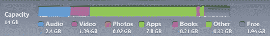

**图 2-4.** *`Capacity` 容量条是占据你 iPad 空间的各类文件的直观表示。*

**注意：** `Capacity` 容量条的划分不言自明。不过，有些人可能会对代表 `Other` 的黄色感到困惑。`Other` 到底是什么？它包括数据库文件（用于跟踪你的音乐、视频和播客资料库），其大小可能在 100MB 到 200MB 之间；专辑封面（每首曲目大约 500KB）；以及你 iPad 上应用程序的偏好设置文件。偏好设置文件让应用能够记住你每次启动它们时配置的应用内设置。如果你在应用程序中存储了大量数据，绿色的 `Apps` 片段会相应增加。


#### 关于同步数据的一点说明

iPad 的存储容量起步仅为 16GB。我们中许多人的音乐或电影库甚至比 iPad 最大存储选项还要大得多。如果你有一台 16GB 的 iPad 和一个 20GB 的音乐库，你不仅无法装下所有音乐，而且，即使你只选择 16GB 的音乐库，也没有空间存放照片、电影、书籍或应用程序。认识到这一现实后，苹果公司设计了这些设置偏好，以帮助你整理和选择最重要的数据并将其传输到 iPad。我们接下来讨论的选项卡将帮助你选择要同步到 iPad 的内容。

**注意：** 像 `Air Video`、`Dropbox`、`LogMeIn` 和 `Air Sharing Pro` 这样的应用程序提供了将本地存储卸载到远程服务器的方法，让你可以释放 iPad 上的空间。`Air Video` 无需同步整部电影，只要你有可用的网络连接，它就能将媒体从你的家庭电脑流式传输到 iPad。`Dropbox`、`LogMeIn` 和 `Air Sharing Pro` 都允许你将数据传输到远程服务器（`Dropbox` 和 `Air Sharing Pro`）或你家中或办公室的台式电脑（`LogMeIn` 和 `Air Sharing Pro`）。

请注意，虽然你可能无法将所有的音乐、照片和电影都放进 iPad，但你可以轻松地更改 iPad 上的内容。例如，在 iPad 上看完一部电影后，你可以删除它并用另一部替换。此外，有些文件比其他文件更大。电影通常是最大的，因此如果你想腾出空间，它们是删除的首选。联系人、日历和图书集都是基于文本的文件，而文本占用的空间非常小，所以不必担心将所有这些东西同步到 iPad 上。

#### 从哪里获取媒体内容？

iPad 是一个很棒的休闲设备，用于消费媒体内容。但你从哪里获取这些媒体呢？将电影、音乐、电视节目和书籍放到 iPad 上最简单直接的方式是通过电脑上的 iTunes Store（参见图 2–5）。在 iTunes Store 中，你可以按歌曲或专辑购买音乐，租借或购买电影，按集下载你喜欢的电视节目，或订阅季票，还可以下载免费的播客和 iTunes U 内容。

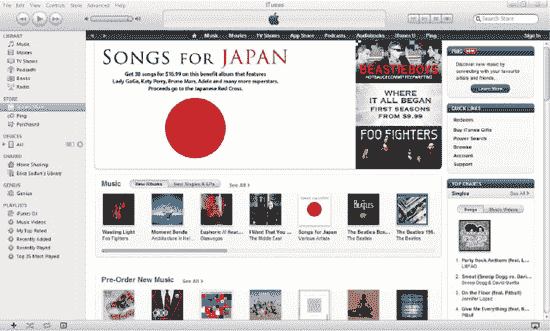

**图 2–5.** *iTunes Store 是全球最大的音乐商店。你还可以从中下载电影、电视节目、应用程序、播客和书籍。*

你也可以从自己的收藏中导入音乐和电影。使用 iTunes 从 CD 导入音乐很简单，导入视频也不难。将电影放到 iPad 上的一种方法是从你的 DVD 收藏中抓取。

**注意：** 抓取 DVD 意味着将光盘中的内容复制为可在其他设备（包括 iPad）上播放的格式。要将 DVD 中的视频加载到 iPad 上，请从 [`http://handbrake.fr`](http://handbrake.fr) 下载一份 HandBrake（适用于 Windows 和 Mac），然后将你的 DVD 内容转换为 iPad 兼容的格式。HandBrake 是免费的，而且易于使用。将 DVD 插入电脑，运行该应用程序，然后按照程序中的指示操作。电影抓取完成后，您可以自动将其添加到 iTunes（检查您的设置）或手动将其拖放到 iTunes 中。

要获取应用程序，你必须使用 iTunes App Store。没有其他方法可以为你的 iPad 添加新的软件项目。你可以从桌面版的 iTunes 或 iPad 上专用的 App Store 应用中轻松浏览应用程序，这将在第 8 章进一步介绍。

你可以通过多种方式建立你的 iPad 电子书库。也许最简单的方式是通过苹果的 iBookstore 购买书籍（详情见第 8 章），它是苹果免费下载的 iBooks 应用的一部分。你也可以利用古登堡计划（[`www.gutenberg.org`](http://www.gutenberg.org)）中超过 33,000 本免费电子书，将书籍下载到你的下载文件夹，然后拖入 iTunes。还有许多电子书店和出版商直接在线销售电子书。要获取一个销售电子书的好网站列表，请访问 [`www.epubbooks.com/buy-epub-books`](http://www.epubbooks.com/buy-epub-books)。

**注意：** 电子书有多种格式。与 iPad 的 iBooks 应用兼容的格式是 ePub（提供完全交互式的书籍功能，包括调整字体大小和页面重新布局）和 PDF（简单的文档显示；所见即所得）。在 iBookstore 之外购买电子书时，请确保其格式为 ePub 或 PDF，否则你需要寻找另一个能够读取你电子书格式的应用，或者使用像 Calibre（[`http://calibre-ebook.com`](http://calibre-ebook.com)）这样的转换器。例如，从亚马逊 Kindle 商店购买的书籍可以在 iPad 上阅读，但不能在 iBooks 应用中阅读。你需要下载亚马逊免费的 Kindle for iPad 应用（从 iTunes App Store）来阅读从亚马逊购买的 Kindle 格式电子书。

#### 记得应用你的更改

在你通过设置面板（如下节所述）在 iTunes 中更改 iPad 设置后，这些更改直到你点击容量条右侧的灰色“应用”按钮（参见图 2–6）才会最终生效。如果你忘记点击它，iTunes 会在你离开 iPad 设置面板之前自动提醒你。如果你误改了设置面板中的内容，只需单击“应用”按钮上方的“还原”按钮即可。请注意，当你选择添加或删除媒体时，容量条会增长或缩小；这发生在你同步之前，让你能够监控一旦提交同步，你将使用 iPad 的多少存储空间。

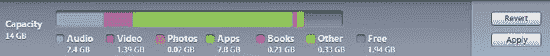

**图 2–6.** *“还原”和“应用”按钮允许你接受或否定你在 iTunes 的 iPad 设置面板中所做的任何更改。*

### 选项卡

沿着 iPad 设置面板顶部排列的选项卡（参见图 2–7）是你浏览所有 iPad 设置的方式。总共有十个选项卡：摘要、信息、应用、音乐、电影、电视节目、播客、iTunes U、图书和照片。要开始配置任何选项卡上的设置，只需单击该选项卡即可选择它。


**图 2–7.** *每个设置选项卡都提供了不同的方式来控制 iTunes 将你的 iPad 与家庭媒体库同步的方式。*

#### 摘要选项卡

摘要选项卡（参见图 2–3）是你在 iPad 设置面板中看到的第一个选项卡。它显示了你 iPad 的概览，包括 iPad 的名称、容量、当前安装的固件版本和序列号。在此页面，你可以检查固件更新，将 iPad 恢复到全新的出厂状态，并设置选项来帮助你管理数据同步的方式。该页面分为三个部分：iPad、版本和选项。


##### iPad 信息框

此信息框中将显示您的 iPad 图像及其名称、容量、软件版本和序列号，具体说明如下列所示。iPad 图像应与您设备的型号和颜色相匹配。

-   **名称**：这是您为 iPad 起的任何名称。要重命名，请在来源列表中点击该 iPad。这会在名称周围打开一个文本编辑字段。根据需要编辑名称（参见图 2–8），然后按 Return 或 Enter 键确认更改。
-   **容量**：此数字表示 iPad 的实际数据容量。与所有数据存储设备一样，标称容量（例如 16GB）与实际容量（14.03GB）并不完全一致。

> **注：** 实际数据容量与标称容量之间的差异是因为标称容量采用十进制；Apple 和其他制造商将 1 GB 定义为 1,000,000,000 字节。在计算机术语中，这个十进制数没有意义。计算机使用二进制。对于计算机而言，1 GB 等于 1,073,741,824 字节，因此一台 64GB iPad 标称的 64,000,000,000 字节会被缩减为大约 59.6 个计算机意义上的 GB。再加上操作系统文件结构的一些开销，就变成了您 iTunes 屏幕上为 64GB iPad 显示的 59.42GB。多年来，关于这个问题已经提起了各种无用的诉讼，但这仍然是海量存储行业的通行做法。

-   **软件版本**：iPad 会定期通过错误修复和功能改进来更新其软件。iTunes 会指示当前安装在您 iPad 上的固件版本。点击“软件版本”字样可切换至“编译版本”显示，查看您正在使用的固件编译版本。在编写本书时，最新的 iPad 软件是 4.3.1 版本，编译版本为 8G4。
-   **序列号**：此唯一序列号用于向 Apple 标识您的 iPad。点击“序列号”字样可显示您设备的 UDID（唯一设备标识符）。

> **提示：** 使用序列号在 Apple 自助维修网站（[`selfsolve.apple.com/GetWarranty.do`](https://selfsolve.apple.com/GetWarranty.do)）上检查您当前的保修状态。在那里，您可以查看设备是否已正确注册、是否拥有有效的电话技术支持服务、是否享有维修和服务保障，以及您的 AppleCare 保护计划的详细信息。如果您尚未为新 iPad 注册 AppleCare 服务，可以直接在自助维修网站上进行。它会提示您输入账单信息并处理您的信用卡付款。AppleCare 可将您 iPad 的保修期延长至硬件购买之日起两年。

> **注：** 您可以使用 UDID 为您的 iPad 注册某些开发者 Beta 测试（称为临时构建）。通过“编辑”“拷贝”将此值复制到内存，然后粘贴到电子邮件中，将您的 UDID 发送给开发者。虽然 UDID 并非特别敏感的信息，但为了防范某些未知的攻击可能利用 UDID，您可能不应随意与他人共享。仅将其发送给受信任的开发者，他们会向 Apple 注册以将您纳入其临时分发计划。另一种与其他人共享 UDID 的更简单方法是从 App Store 下载免费的 Ad Hoc Helper 应用程序。您可以将以下 URL 加载到网络浏览器中，以打开相应的 iTunes 页面：[`itunes.apple.com/app/ad-hoc-helper/id285691333?mt=8`](http://itunes.apple.com/app/ad-hoc-helper/id285691333?mt=8)。

通常，iPad 信息框中唯一可能更改的是 iPad 的软件版本号和 iPad 的名称。当您对 iPad 执行软件更新时，此字段会匹配新的版本号。这提供了一种简便的方法来确定您正在使用的 iPad OS 版本。如果您通过在 iTunes 来源列表中点击其名称然后编辑文本来更改 iPad 的名称（参见图 2–8），“摘要”选项卡将反映此更改。您的 iPad 容量和序列号永远不会改变。

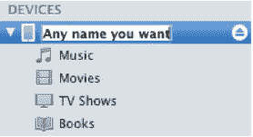

**图 2–8.** *在 iTunes 来源列表中点击您的 iPad 名称，可将其重命名为您想要的任何名称。名称更改将反映在“摘要”选项卡上。*

##### 版本框

“版本”框允许您通过点击“检查更新”按钮手动检查 iPad OS 软件更新。在该按钮旁边，您会看到通知您 iPad 软件是否为最新或是否有可用更新的文本。有时，甚至在您点击“检查更新”按钮之前，iTunes 就会通知您有可用的软件更新。它之所以知道，是因为 iTunes 每周会自动检查一次 iPad OS 更新。按钮旁边的文本还会告诉您 iTunes 下次自动检查更新的时间。

> **注：** 如果有可用的 iPad 软件更新，您应该安装它。有时更新会提供新功能；其他时候则只是简单的错误修复。Apple 在向公众发布这些更新之前会对其进行严格测试，因此可以放心地认为这些更新将使您的设备变得更好（无论您是否注意到）。在“恢复”和“更新”选项之间感到困惑？更新提供 Apple 新发布的固件。安装更新不会更改您的数据和应用程序。恢复 iPad 会将其恢复至出厂状态，并删除所有应用和数据。

在“检查更新”按钮下方是“恢复”按钮。您可能在某个时候会遇到 iPad 问题，需要将设备恢复至出厂设置。为此，请点击“恢复”按钮并按照提示操作（参见图 2–9）。备份设备会将您的设置和数据保存到电脑中。恢复过程会清除 iPad 上的所有信息，并重新加载最新的固件。恢复后，使用您的备份数据将您的个人设置、通讯录、书签和照片重新加载到 iPad 上。

如有必要，您可以将 iPad 恢复到当前版本以外的固件版本。在点击“检查更新”按钮或“恢复”按钮时，按住 Shift 键（在 Windows 上）或 Option 键（在 Mac 上），以选择要恢复到的 iPad 固件。iTunes 将打开一个文件对话框，您可以在其中导航到要使用的 `.ipsw` 文件（代表 iPad 软件；这些文件实际上是重命名的 ZIP 存档，如果您愿意，可以解压并探索），选择它，然后执行更新或恢复。

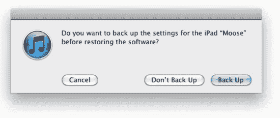

**图 2–9.** *恢复后，您将可以选择将 iPad 上的所有数据恢复到之前的状态。*


#### 选项面板

选项面板中有若干偏好设置。要启用或禁用任何功能，只需勾选或取消勾选其旁边的复选框。

- *当此 iPad 连接时打开 iTunes*：此选项默认已勾选。它指示电脑在检测到 iPad 通过 USB 连接时打开 iTunes。若取消勾选此选项，连接 iPad 时 iTunes 将不会打开，并且在您手动打开 iTunes 并点击容量条旁的`同步`按钮之前，不会有数据同步到您的设备。

**注意：** 即使此框未勾选时 iTunes 不会打开或同步数据，iPad 连接到兼容端口后仍会充电。

- *仅同步选中的歌曲和视频*：当此选项勾选时，iTunes 仅同步资料库和播放列表中在 iTunes 资料库内带有勾选标记的歌曲（请参阅图 2–9）。

例如，假设您有一个设置为与 iPad 同步的“精选金曲”播放列表。该播放列表包含来自两张不同专辑的迈克尔·杰克逊的 *Thriller* 的两份副本。您希望 iPad 上只保留这首歌的一个副本，但又不想从播放列表中移除多余的副本。为此，您可以取消勾选播放列表中的其中一个 *Thriller* 版本，并启用“仅同步选中的歌曲和视频”。该播放列表将同步到您的 iPad，但会去掉多余的 *Thriller*，而另一个音轨仍会保留在您的播放列表和 iTunes 资料库中。

- *优先使用标清视频*：勾选此选项后，如果您同时拥有高清和标清两个版本的视频，iTunes 将仅同步标清版本到您的 iPad。有时您从 iTunes Store 购买电影或电视节目时会同时获得两个版本。选择仅同步标清版本可以节省 iPad 上的存储空间。高清视频目前风靡一时，尽管高清视频的画质*确实*优于标清，但如果您只是偶尔用 iPad 观看视频，并未将其作为主要视频消费设备，您可能会倾向于选择标清版本。其画质不错，并且您可以在 iPad 上存储更多视频以供长途旅行时观看。

- *将更高比特率的歌曲转换为 128 kbps AAC*：数字音乐有多种格式和大小，其中最流行的是 MP3 和 AAC。根据您获取音乐的方式——无论是从 iTunes Store 购买还是从旧 CD 中抓取——您的歌曲可能具有不同的编码设置。一首以 256KBps 编码的歌曲所占空间是 128KBps 编码歌曲的两倍。勾选“将更高比特率的歌曲转换为 128 kbps AAC”选项后，任何同步到 iPad 的音乐都将被即时转换为 128KBps 的 AAC 文件。这通过将更高比特率的歌曲降低为完全可以接受的 128KBps，从而在 iPad 上节省了大量空间。

**注意：** 除非您是拥有敏锐听觉的极致发烧友，否则您很可能不会注意到 128KBps AAC 文件与 256KBps 版本之间的区别。

**提示：** 如果您拥有经常随身携带的 iPhone 或 iPod touch，您可能希望完全不在 iPad 上存放任何音乐。这样将节省大量空间，而您始终可以在另一台设备上欣赏音乐。利用 iPad 相对较大的屏幕优势，将 iPad 上节省出的空间用于存放视频和书籍。

- *手动管理音乐和视频*：勾选此选项后，音乐和视频不会自动与 iPad 同步。您可以通过将歌曲或视频从 iTunes 资料库拖放到 iTunes 来源列表中的 iPad 上，来精确选择您想要放在 iPad 上的项目。您可以通过点击 iTunes 来源列表中 iPad 旁边的下拉三角形来管理这些歌曲和视频。要移除某个歌曲或视频文件，请导航至您的音乐、电影或电视节目播放列表，选择该歌曲或视频文件，然后按下电脑键盘上的`Delete`键。

**注意：** 手动向 iPad 添加或从 iPad 移除音乐或视频不会影响电脑上的文件。每当文件被添加到 iPad 或从 iPad 删除时，操作的只是 iTunes 资料库中该文件的副本。原始文件将始终保留在您的 iTunes 资料库中，直到您从那里将其删除。

- *加密 iPad 备份*：每次 iPad 与 iTunes 同步时，都会创建 iPad 上所有文件和设置的备份。如果您需要恢复 iPad，此备份会非常方便。一旦恢复完成且您再次将 iPad 与 iTunes 同步，您就可以选择从此备份恢复 iPad。完成后，您将能够在刚刚恢复的 iPad 上保留所有旧的设置和文件。

勾选“加密 iPad 备份”选项后，您的备份以及您所有的数据都将被加密并受密码保护。要从加密数据文件恢复备份，用户必须知道该文件的密码。此选项旁边有一个`更改密码`按钮。这允许您随时更改加密数据的密码。

**注意：** 请勿忘记您的密码！如果加密了备份却忘记了密码，您将无法恢复备份数据。您将不得不从头开始重新同步所有数据。您还必须重新配置 iPad 上的所有设置以恢复到之前的状态，包括重新排列 iPad 的应用程序图标。如果 iPad 上有大量自定义设置，这会花费很长时间。请记住您的密码！

- *配置万能辅助*：您在“摘要”页面上看到的最后一项是一个`配置万能辅助`按钮。点击此按钮会打开一个“万能辅助”面板（请参阅图 2–10），该面板允许您为视障或听障人士设置视觉和听觉辅助功能选项。选项如下（三个“Seeing”单选按钮中只能选中一个）：

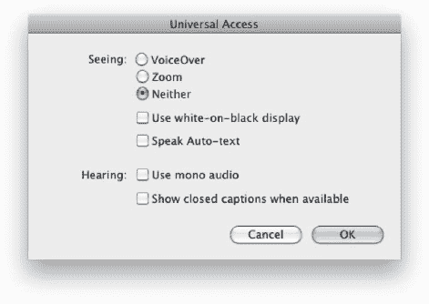

**图 2–10.** *万能辅助设置*

- *语音旁白*：让您的 iPad 朗读其界面，说出按钮名称、阅读文本字段内容，并以将视觉呈现转化为语音描述的方式描述屏幕上的元素。
  - *缩放*：允许用户放大通常不支持内置缩放功能的屏幕部分。当此选项选中时，用户可以用三根手指双击 iPad 屏幕的任何部分，即可自动放大 200%。放大后，用户必须用三根手指拖动或轻拂屏幕。当用户导航到新屏幕时，缩放总是会回到屏幕顶部中央位置。
  - *使用白底黑字*：选择此选项将反转 iPad 屏幕的颜色，使文本在黑色背景上显示为白色。iPad 的整个屏幕看起来像照片底片，为视障用户提供更高的对比度。
- *朗读自动文本*：勾选此选项后，任何自动纠正文本（例如您打字时出现的拼写检查弹出窗口）都会朗读给用户听。
- *使用单声道音频*：当此选项选中时，左右声道的立体声将合并为单声道信号。此选项允许单耳有听力障碍的用户用另一只耳朵听到完整的音频信号。
- *显示隐藏式字幕（如果可用）*：


##### 信息标签

“信息”标签可让您选择是否将某些基本桌面功能同步到 iPad：通讯录、日历、邮件账户、备忘录和书签。这些项目可能包含关于您或他人的个人或机密信息。您必须权衡随时随地使用这些信息的便利性与 iPad 被盗后信息落入不法之徒手中的安全隐患。请使用“信息”标签中的各分区选择要同步的项目，并指定同步方式。例如，您可以同步所有日历或仅同步工作日历；也可以同步所有通讯录或仅同步所选群组的通讯录。选择权在您手中。

只要您已在 Mac 上使用“邮件”、iCal 和“通讯录”，或在 Windows 电脑上使用 Outlook，就已具备将信息同步到 iPad 所需的一切条件。您只需告知 iPad 您希望如何同步这些信息。

**注意：** 如果您使用 Apple 的 MobileMe 服务（`www.me.com`），在首次同步 iPad 后，“同步通讯录”和“同步 iCal 日历”选项将始终处于取消勾选状态，并会看到解释说明：您的通讯录和日历正在通过 MobileMe 进行*无线*同步。*无线*同步意味着您无需将 iPad 连接到电脑即可更新对通讯录或日历所做的任何更改；同步将通过无线方式执行。

#### 同步通讯录

若要同步通讯录，您需要使用以下应用之一：Mac 上的“通讯录”或 Microsoft Entourage；Windows 电脑上的“Windows 通讯簿”或 Microsoft Outlook。

勾选`同步通讯录`复选框。然后您可以选择同步通讯录中的所有联系人，或仅同步所选群组中的联系人。如果您的通讯录分为多个群组，例如工作联系人、朋友和家人，您可以通过选中或取消选中群组名称旁边的复选框来选择要包含的联系人。此外，您还可以通过以下选项进一步控制通讯录的同步方式：

- *将 iPad 上群组外创建的联系人添加至*：选中此复选框后，您将可以访问一个下拉列表，其中包含您通讯录中的所有群组。如果您在 iPad 上创建了新联系人且未将其分配到任何群组，该联系人将自动放入您在此处选择的群组中。
- *同步 Yahoo!通讯录联系人*：选中此复选框后，您可以自动将 Yahoo!通讯录中的联系人同步到 iPad 通讯录。首先，您需要同意弹出窗口中的提示，确认允许 iPad 同步到您的 Yahoo!账户。随后，系统会提示您输入 Yahoo! ID 和密码。完成此操作后，您的联系人便设置为同步。点击`配置`按钮可让您输入其他 Yahoo! ID。
- *同步 Google 通讯录*：选中此复选框后，您可以自动将 Google 通讯录同步到 iPad 通讯录。首先，您需要同意弹出窗口中的提示，确认允许 iPad 同步到您的 Google 账户。随后，系统会提示您输入 Google ID 和密码。完成此操作后，您的联系人便设置为同步。点击`配置`按钮可让您输入其他 Google ID。

###### 同步 iCal 日历

若要同步日历，您需要使用以下应用之一：Mac 上的 iCal 或 Microsoft Entourage；Windows 电脑上的 Microsoft Outlook。

若要同步日历，请勾选`同步 iCal 日历`复选框（参见图 2-11）。与通讯录类似，您可以选择同步所有日历或仅同步所选日历。

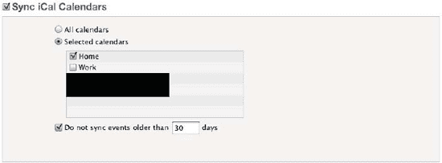

**图 2-11.** *您的日历同步选项*

如果您勾选了“不同步早于以下天数的日历事件”复选框，iTunes 将不会同步超过指定天数的旧事件。默认天数为 30 天，但您可以输入最多 99999 天。

**注意：** 一个寻找节日、学校活动或您喜爱运动队预制日历的好去处是`www.icalshare.com`。

#### 同步邮件账户

您在 Mac OS X 的“邮件”或 Microsoft Outlook 中设置的每个邮件账户都会显示在此处（参见图 2-12）。勾选`同步邮件账户`复选框后，您可以选择或取消选择任意账户。未被选中的账户将不会出现在 iPad 的“邮件”应用中。此选项不会同步您的邮件正文，仅同步账户设置。

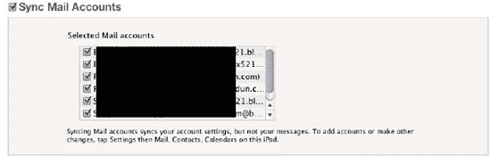

**图 2-12.** *您的电子邮件账户同步选项*

###### 其他

Apple 本来应该将此部分命名为“书签和备忘录同步”，但它选择了“其他”。在此处，您可以将电脑浏览器中的网页书签同步到 iPad 上的 Safari 网页浏览器（参见图 2-13）。同样，如果您有 MobileMe 账户，您的书签将通过无线方式同步。如果没有，请勾选`同步书签`复选框，并在适用情况下从下拉菜单中选择您的浏览器。在 Mac 上，书签同步支持 Safari。在 Windows 电脑上，书签同步支持 Safari 和 Microsoft Internet Explorer。

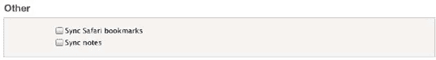

**图 2-13.** *您的书签和备忘录同步选项*

此部分还允许您将备忘录同步到 iPad。备忘录同步仅适用于 Mac OS X 的“邮件”应用，或者在 Windows 电脑上，适用于 Microsoft Outlook。要启用备忘录同步，请选中该复选框。

###### 高级

此部分允许您用电脑上的信息替换 iPad 上的通讯录、日历、邮件账户、书签和备忘录（参见图 2-14）。当您的信息出现同步错误，并且您想确保电脑与 iPad 上显示的内容完全一致时，此功能非常方便。

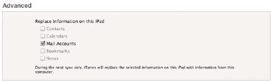

**图 2-14.** *您的高级同步选项*

当您选中相应的复选框后，iTunes 将仅在下次同步时替换 iPad 上的信息。此次同步后，iPad 与电脑之间的常规同步将恢复正常。

**注意：** 如果您的日历和通讯录正在通过 MobileMe 同步，您将无法在`高级`部分选中它们对应的复选框。

##### 应用标签

此标签用于决定要在 iPad 上安装哪些应用，并允许您通过简单的拖放操作来排列它们。此标签包含两个主要部分：`同步应用`和`文件共享`。


##### 同步应用

在“同步应用”标题下（如图 2–15 所示），您会看到一个可滚动的列表，其中包含 iTunes 应用库中的所有应用。您可以按名称、种类、大小、类别或下载日期对列表进行排序。

在应用列表中，每个应用图标的左侧都有一个复选框。每个图标的右侧是应用名称，下方是该应用的类别列表和单个应用的文件大小。任何选中了复选框的应用都表示已设置为与 iPad 同步。

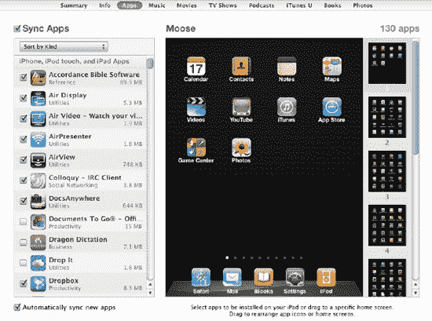

**图 2–15.** *“应用”选项卡用于选择将哪些应用放入 iPad，以及按何种顺序排列它们。*

**注意：** 每当您在 iTunes 中下载一个新应用时，它都会在下一次同步时自动与您的 iPad 同步。当然，您也可以在同步后直接移除该应用，或者取消选中图 2–15 中所示的 `Automatically sync new apps` 选项。

在应用列表旁边，您会看到 iPad 桌面的可视化表示。在其旁边，您会看到一个或多个黑色屏幕，上面显示着已经存在于 iPad 上或已设置为与 iPad 同步的应用图标。在最后一个黑色屏幕下方，您还会看到一个完全灰色的屏幕。

将应用安装到 iPad 上最简单的方法是：在应用列表中找到它们，然后直接将其拖拽到虚拟的 iPad 屏幕上。一旦您这样操作，该应用的复选框就会被自动选中。

您可以在虚拟 iPad 屏幕上拖拽应用，直到将它们按您喜欢的顺序排列好。您还可以抓取较小的黑色屏幕，并在列表中上下移动它们，从而在 iPad 上重新排列整个应用页面。列表顶部的黑色屏幕将是 iPad 的主页，其下方的每个屏幕则对应向右滑动一次即可访问的后续页面。底部的灰色屏幕是一个额外的屏幕，您可以用它来创建一个包含应用的新屏幕。

要移除一个应用，只需将鼠标悬停在该应用上，其左上角就会出现一个小 `X`。点击这个 `X`，该应用就会从屏幕上消失。在下一次同步时，该应用将从您的 iPad 上移除（不用担心，您随时可以通过再次将其从应用列表拖拽到虚拟 iPad 屏幕上来恢复它）。

**注意：** iPad 预装的应用无法从设备中移除——它们只能被重新定位。

每个屏幕除了底部固定的应用外，最多可以容纳 20 个应用。程序坞最多可以容纳六个应用。无论您滑动到哪个应用屏幕，您放置在程序坞中的任何应用都会出现在 iPad 的底部。由于程序坞中的应用始终出现在任何应用页面的底部，因此最好将您最常用的应用放在那里以便快速访问。

##### 文件共享

iPad 引入了一种在电脑和 iPad 之间轻松共享文件的方式。在“文件共享”标题下方，您会看到一个“应用”框和一个“文稿”框（见图 2–16）。当前 iPad 上所有支持拖放式文件共享的应用都会出现在这里的“应用”列表中。要将文件放入某个应用，只需在“应用”列表中选择该应用，然后在电脑上找到您要添加的文件，并将其拖拽到“文稿”列表中。您也可以点击“文稿”列表底部的 `添加` 按钮来浏览电脑上的文件。

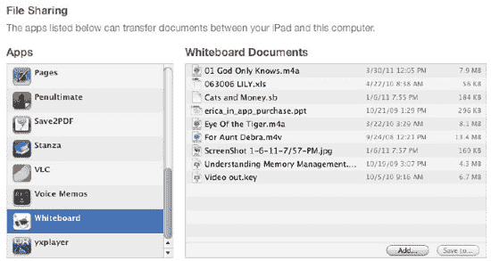

**图 2–16.** *支持拖放式文件共享的应用及其包含的文稿*

如果您在 iPad 上创建了一个全新的文件（例如在 Apple 的文字处理软件 Pages 中创建），并且想要将该文件传输到电脑上，请在“文稿”列表中选择该文件，点击列表下方的 `“保存到…”` 按钮，然后选择电脑上您想要保存文件的位置。或者，您也可以简单地将该文件从“文稿”列表拖拽到您的桌面上。

要从包含该文件的应用中删除它，请在“文稿”列表中选择该文件，然后按下键盘上的 `Delete` 键。此时会弹出一个窗口，询问您是否确实要删除该文件。点击 `删除` 即可完成删除。

只要文件在某个应用内被共享，当您将 iPad 与电脑同步时，该文件就会作为应用备份的一部分始终被备份。

**注意：** 您可以将文件拖拽到应用的文稿框中，但这并不意味着该应用能够打开它。应用仅限于处理 iPad 支持的文件类型。例如，iPad 本身不支持 Microsoft 的 WMV 视频文件。如果您将一个 WMV 电影拖拽到一个应用中，该应用会包含它，但仍然无法播放它，除非该应用本身内置了对此格式的支持。例如，Pages 无法打开一个电影文档。

##### 音乐选项卡

音乐选项卡基本上不言自明（见图 2–17）。请确保顶部的 `Sync Music` 复选框已被选中。在其下方的方框中，您会看到两个单选按钮和几个复选框。

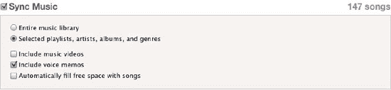

**图 2–17.** *“音乐”选项卡允许您选择要同步到 iPad 的播放列表、表演者、专辑和音乐类型。*

- *完整音乐资料库*：选中此选项后，您的整个音乐资料库将同步到 iPad，但这仅当您的 iPad 有足够的可用存储空间时才会发生。如果您的音乐容量超过了 iPad 的存储容量，一旦 iPad 存满，剩余的音乐将停止同步。
- *选定的播放列表、表演者、专辑和音乐类型*：如果您选择此选项，将会出现四个方框，列出您 iTunes 资料库中的所有播放列表、表演者、专辑和音乐类型（见图 2–18）。请逐一选择您希望在 iPad 上拥有的播放列表、表演者、专辑和音乐类型对应的复选框。
- *包括音乐视频*：如果选中此复选框，与所选播放列表、表演者、专辑或音乐类型相关的任何音乐视频都将传输到 iPad。
- *包括语音备忘录*：如果选中此复选框，您存储在 iTunes 资料库中的任何语音备忘录都将与 iPad 同步。
- *自动用歌曲填充空闲空间*：此复选框仅在您选择了“选定的播放列表、表演者、专辑和音乐类型”单选按钮时才会出现。如果选中，一旦所有其他文件（电影、图书、照片等）都已同步到 iPad，任何剩余的空闲空间都将被音乐填满，直到 iPad 无法再容纳任何内容为止。我们不建议选择此选项。这会严重限制您在 iPad 上创建新文档的能力，因为设备将没有剩余空间来存储它们。此功能更适合以音乐为主的 iPod touch，而非以应用为中心的 iPad。

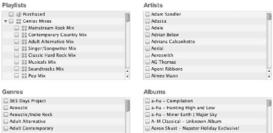

**图 2–18.** *选择您希望与 iPad 同步的播放列表、表演者、专辑和音乐类型。*


###### 影片标签页

iTunes Store 提供了大量可供租借或购买的电影，你可以下载并同步到 iPad 上。如下图所示，**图 2–19** 所示的“影片”标签页提供了多种将电影导入 iPad 的方法。

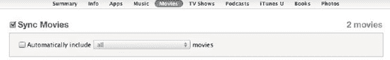

**图 2–19.** *“影片”标签页允许你选择要同步到 iPad 的电影。*

要同步电影，请首先确保选中了`同步电影`复选框。你会在“影片”标签页上看到这个复选框。如果将此复选框留空，iTunes 将不会将电影内容同步到你的 iPad：

*   **自动包含……影片**：如果选中此复选框，你将可以访问一个预设选项的下拉列表，让电影同步体验更轻松。从下拉列表中，你可以选择同步所有电影（这不是个好主意，因为一小时的视频可能占用高达半 GB 的空间），或者，如果你想节省空间，可以选择 1、3、5 或 10 部“最近的影片”预设。你还可以选择“所有未观看”影片预设，这将添加你资料库中所有尚未观看的电影。其他预设选项包括同步 1、3、5 或 10 部“最近未观看的影片”，或 1、3、5 或 10 部“最早未观看的影片”。

###### 电视节目标签页

与电影类似，iTunes Store 也提供了大量可供购买和下载的电视节目。所有这些节目都可以同步到你的 iPad 上播放。你可以按集购买，或者购买季度通行证。使用季度通行证，你可以一次性支付整季的费用，通常会有小幅折扣，并且新剧集在可用时会自动下载。

要同步电视节目，请首先确保选中了`同步电视节目`复选框（见 图 2–20）。

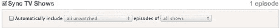

**图 2–20.** *“电视节目”标签页允许你选择要同步到 iPad 的节目。*

“电视节目”标签页上会出现以下选项：

*   **自动包含……集……**：如果选中此复选框，你将可以访问一系列预设选项的下拉列表，让电视节目同步体验更轻松。从下拉列表中，你可以选择同步所有电视节目（同样，如果你有很多节目，这不是个好主意，因为一小时的视频可能占用高达半 GB 的空间）。你还可以选择“所有未观看”选项以及多种预设，包括仅同步最新节目、最新未观看节目或最早未观看节目。使用所有这些选项，你可以将预设应用于所有节目或仅选定的电视节目。
*   **节目和剧集框**：如果“自动包含”复选框已选中且设置不是“全部”，你还可以在这些框中从你的 iTunes 资料库中选择额外的电视节目（见 图 2–21）。如果取消选中“自动包含”复选框，你可以在这些框中手动选择任意数量的电视节目。

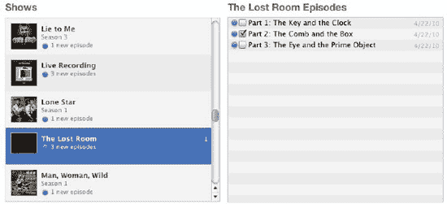

**图 2–21.** *“节目”框允许你选择要同步到 iPad 的电视系列。在右侧的“剧集”框中，你可以选择要同步该系列的哪些剧集。*

###### 播客标签页

许多人使用 iTunes 订阅他们喜爱的播客。*播客*是通过互联网传送的音频节目，就像电视节目通过电波传送一样。如今，有大量播客可用，包括娱乐、建议、教学节目等等。iTunes 会监控你的播客订阅，并在新节目可用时自动下载。“播客”标签页让你可以控制哪些节目同步到你的 iPad。

如 图 2–22 所示，“播客”标签页的外观和操作方式与“影片”和“电视节目”标签页类似。

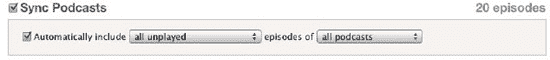

**图 2–22.** *“播客”标签页允许你选择要同步到 iPad 的播客。*

要同步播客，请首先确保选中了`同步播客`复选框。你会看到“播客”标签页上有以下项目：

*   **自动包含……集……**：如果选中此复选框，你将可以访问预设选项的下拉列表，让播客同步体验更轻松。从右侧下拉列表中，你可以选择同步所有播客或选定项目。如果相关播客仅为音频，同步所有播客占用的空间不会像同步所有电影或电视节目那样多。但是，如果你正在下载视频播客，则空间要求与电影相同。除了“全部”/“选定”选项外，左侧下拉菜单提供“所有未播放”和“所有新节目”选项，以及多种预设，包括仅同步最新播客、仅同步最近/最早未播放的播客，或仅同步最近/最早的新播客。使用所有这些选项，你可以将预设应用于所有播客或仅选定的播客。
*   **播客和剧集框**：如果“自动包含”复选框已选中且设置不是“全部”，你还可以在这些框中从你的 iTunes 资料库中选择额外的播客。如果取消选中“自动包含”复选框，你可以在这些框中手动选择任意数量的播客。你可以将相同的“最近五个”及类似选项应用于这些项目，就像其他媒体设置一样。由于许多播客每天或每周都会更新新剧集，它们可能会很快占用存储空间。而且，何必保留已经听过的剧集呢？

###### iTunes U 标签页

iTunes U 是苹果公司与众多教育机构提供的免费服务，用于传播课堂讲座和语言课程等教育工具。iTunes U 的操作方式与播客非常相似，将其导入 iPad 的方法也类似。

要同步你的 iTunes U 项目，请首先确保选中了`同步 iTunes U` 复选框（见 图 2–23）。

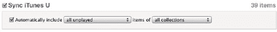

**图 2–23.** *iTunes U 标签页允许你选择要同步到 iPad 的 iTunes U 合集。*

你会在 iTunes U 标签页上看到以下项目：

*   **自动包含……项目……**：当此复选框选中时，你将可以访问预设选项的下拉列表，让 iTunes U 同步体验更轻松。从右侧下拉列表中，你可以选择同步所有 iTunes U 项目或选定项目。除了“全部”选项外，左侧下拉菜单提供“所有未播放”和“所有新项目”选项，以及多种预设，包括仅同步最新的 iTunes U 项目、最近/最早未播放的项目，或最近/最早的新项目。使用所有这些选项，你可以将预设应用于所有项目或仅选定的项目。
*   **合集和项目框**：如果“自动包含”复选框已选中且设置不是“全部”，你还可以在这些框中从你的 iTunes 资料库中选择额外的项目。如果取消选中“自动包含”复选框，你可以在这些框中手动选择任意数量的 iTunes U 课程。


###### “图书”标签页

iPad 的一大特色是能够通过新的 iBooks 应用购买和阅读电子书。你将在第 8 章和第 9 章中分别深入了解 iBookstore 和 iBooks 应用；目前你只需知道，iPad“设置”面板中的“图书”标签页是控制哪些图书同步到 iPad 的地方（参见图 2–24）。

请确保顶部的 `Sync Books`（同步图书）复选框已选中。在其下方的框中，你会看到两个单选按钮。`All books`（所有图书）会同步你 iTunes 资料库中的每一本书。`Selected books`（所选图书）则允许你只同步在页面下方“图书”框中选择的图书。

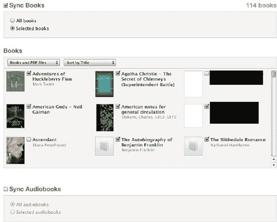

**图 2–24.** *“图书”标签页允许你选择要同步到 iPad 的图书。*

**注：** 即使你的 iTunes 资料库中有 300 本书，你也可以全部同步。电子书几乎不占用任何空间。事实上，*《战争与和平》*——现存最大的书籍之一（也是最伟大的书籍之一），仅占用 1.2MB 的磁盘空间。这比一个 128Kbps 的 AAC 音频文件还要少 50%以上。当然，插图版书籍会占用更多空间，但即便如此，它们占用的空间也不应超过几首 MP3 音乐。另外，也无需担心资料库混乱。你将在第 9 章中学习如何整理图书。

在“图书”框下方，你会看到一个 `Sync Audiobooks`（同步有声书）复选框（参见图 2–24）。同样，这里有两个选项：`All audiobooks`（所有有声书）或 `Selected audiobooks`（所选有声书）。

选择 `All audiobooks`（所有有声书）后，iTunes 资料库中的所有有声书都会同步到你的 iPad。如果选择 `Selected audiobooks`（所选有声书），则会显示与其他媒体标签页相似的熟悉布局，这次是“有声书”和“章节”框。在“有声书”框中，你可以手动选择要同步的有声书。部分有声书包含独立的文件，即标定章节的*片段*。在“章节”框中，你可以针对任何有声书只选择要同步的片段。

**注：** 与电子书不同，有声书可能相当大，因为它们本质上是很长的音频文件。如果你有数十本有声书，可能只需要传输其中少数几本以节省空间。

###### “照片”标签页

在 iPad 上查看照片可能是你购买它的原因中排名较低的一项，但你不应低估它。这种体验比在桌面上看照片要好得多。没有什么能比得上亲手拿着你的数码照片，在 iPad 华丽的显示屏上滑动浏览的体验。（第 13 章将深入介绍照片处理。）

使用“照片”标签页将照片传输到 iPad。确保顶部的 `Sync Photos from`（从以下位置同步照片）复选框已选中（参见图 2–25）；然后使用右侧的下拉列表选择要同步照片的来源。在 Mac 上，你的选项包括 iPhoto 4.0.3 或更新版本、Aperture 3.0.2 或更新版本，或者电脑上的任意文件夹。在 Windows 机器上，你的选项包括 Adobe Photoshop Elements 3.0 或更新版本，或者电脑上的任意文件夹。

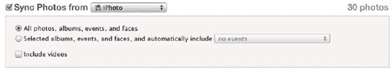

**图 2–25.** *“照片”标签页允许你选择要同步到 iPad 的照片。*

在复选框下方的框中，你有三个选项：

*   *所有照片、相簿、事件和面孔*：选择此选项可将所选照片应用或文件夹中的所有照片同步到 iPad。再次提醒，如果你的照片集和我们的一样庞大（我们其中一人的 Mac 上约有 80GB 的旅行照片），我们建议不要这样做。如果你只有几千张照片，那就全部加载吧！

**注：** 与新款 iPad 不同，第一代 iPad 没有内置摄像头，但你仍然可以通过相机连接套件将照片添加到你的旧款（或新款！）iPad 上。售价 29 美元的套件（可在[`www.store.apple.com`](http://www.store.apple.com)购买）包含两个适配器——一个用于通过 USB 2.0 数据线连接相机，另一个用于读取 SD 记忆卡。

*   *所选相簿、事件和面孔，并自动包含……*：选择此选项后，页面下方会显示“相簿”、“事件”和“面孔”框。你可以从这些框中选择要同步的 iPhoto 相簿和事件。你还可以选择是否同步你朋友的面孔。*面孔*是 iPhoto 中的一项功能，它使用面部识别软件来创建包含特定人物的照片集。

    当你选中某个相簿、事件或面孔旁的复选框时，右侧会显示该选项的照片数量。选择 `Selected albums, events, and faces, and automatically include`（所选相簿、事件和面孔，并自动包含）选项后，你会看到一个下拉选项列表，允许你选择全部、不选或预设的特定日期范围的 iPhoto 照片，甚至智能相簿。

*   *包括视频*：选中此复选框后，你用数码相机拍摄并出现在任何已选相簿中的视频文件也会传输到 iPad。请记住，视频会很快占用存储空间。


##### iTunes 设备设置

iTunes 为 iPad 提供了多项偏好设置。要访问这些设置，请打开 iTunes，然后在 Mac 上从菜单栏选择 iTunes  偏好设置，或在 Windows 电脑上从菜单栏选择编辑  偏好设置。iTunes 偏好设置窗口将会弹出，顶部排列着一系列图标。其中与 iPad 相关的唯一图标是“设备”。点击“设备”图标（外观像一部 iPhone），你将看到如图 2–26 所示的设备设置面板。

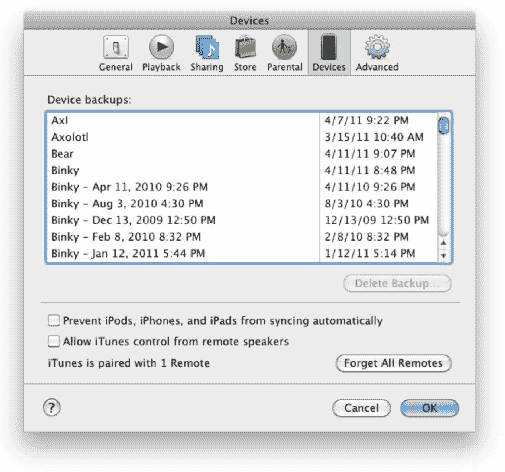

**图 2–26.** *iTunes 设备设置面板*

在这里，你可以找到与 iTunes 交互的设备的设置。这些设备包括 iPad、iPod、iPhone 和 AirPort Express。

- **设备备份**：每次同步 iPad 时，iTunes 都会为其内容创建备份。iPod、iPhone 或 iPad 的所有备份都会显示在这里。你将看到设备名称及其上次备份的日期。将鼠标悬停在 iPad 名称上，即可显示其序列号。

iTunes 会同时保存多个设备备份，但你可以通过从源列表中选择一个设备，然后右键单击（或按住 Ctrl 键单击）它，从备份中恢复。选择“从备份恢复”，然后选择你想要恢复的备份。iTunes 将备份文件存放在以下位置：

- **Mac**：`~/Library/Application Support/MobileSync/Backup/`
- **Windows XP**：`\Documents and Settings\(用户名)\Application Data\Apple Computer\MobileSync\Backup\`
- **Windows Vista 和 Windows 7**：`\Users\(用户名)\AppData\Roaming\Apple Computer\MobileSync\Backup\`

iTunes 备份的信息列表很长：

- Safari 书签、Cookie、历史记录和当前打开的页面
- 地图书签、最近搜索和地图中显示的当前位置
- 应用程序设置、偏好设置和数据
- 通讯录
- 日历
- CalDAV 和已订阅的日历账户
- YouTube 收藏
- 壁纸
- 备忘录
- 邮件账户
- 自动纠正词典
- 相机胶卷
- 主屏幕布局和 Web 剪辑
- 网络设置（已保存的 Wi-Fi 热点、VPN 设置、网络偏好设置）
- 已配对的蓝牙设备（仅当恢复到执行备份的同一台 iPad 时才能使用）
- 钥匙串（包括电子邮件账户密码、Wi-Fi 密码，以及你在网站和其他一些应用程序中输入的密码。钥匙串只能从备份恢复到同一台 iPad。如果你要恢复到新设备，则需要重新填写这些密码。）
- 受管理的配置/描述文件
- MobileMe 和 Microsoft Exchange 账户配置
- App Store 应用程序数据（应用程序本身及其 `tmp` 和 `Caches` 文件夹除外）
- 每个应用程序的位置服务使用偏好设置
- 离线 Web 应用程序缓存/数据库
- 网页自动填充
- 具有无法验证证书的可信主机
- 获准获取设备位置的网站
- 大部分（并非全部）应用内购买项目

若要删除 iPad 备份，请从“设备备份”列表中选择该备份，然后点击“删除备份”按钮。在弹出的窗口中点击“删除备份”按钮确认删除。

- **防止 iPod、iPhone 和 iPad 自动同步**：如果你想在将 iPad 连接到电脑时禁用自动同步，请选中此复选框。若要同步，你需要手动点击 iPad 的 iTunes 设置面板底部的“同步”按钮。

设备设置面板中与 iPad 相关的另一个选项是“查找 iPod touch、iPhone 和 iPad Remote”复选框，该复选框未显示在图 2–26 中。苹果公司有一款名为 `Remote` 的 iPhone 应用。该应用允许你将 iPod touch、iPhone 或 iPad 用作家庭电脑音乐库的遥控器。换句话说，你可以坐在沙发上，直接在 iPad 上浏览 Mac 或 Windows 电脑（或 Apple TV）上的整个 iTunes 资料库。你只需要免费的 `Remote` 应用、iPad 以及处于同一 Wi-Fi 网络中的电脑。如果取消选中此复选框，你的 iPad 将无法与你的 iTunes 资料库配对。点击“忘记所有 Remote”按钮将使 iTunes 与所有被允许用作遥控器的 iPod touch、iPhone 或 iPad 解除配对。

###### 恢复

如果你的 iPad 遇到问题，你可以选择恢复它。iTunes 提供了两种恢复选项：恢复到出厂默认设置，或从备份中恢复。出厂默认设置方法会将 iPad 恢复到初始出厂设置——就像你第一次打开它一样。从备份恢复则会从上次保存的备份文件恢复 iPad。

要恢复到出厂设置，请在电脑上的 iTunes 中，从设备列表中选择 iPad，选择“摘要”标签页，然后点击“恢复”（这将删除 iPad 上的所有数据并将其恢复到出厂设置）。当 iTunes 提示时，选择恢复你的设置的选项。

要从备份恢复，请在电脑上的 iTunes 中，右键单击（或按住 Ctrl 键单击）设备列表中的 iPad，选择“从备份恢复”，然后选择一个要恢复的备份。iPad 随后将根据“设备备份”列表中列出的备份进行恢复。

**注意：** 如果你为 iPad 备份设置了密码加密（本章前面已讨论过），那么如果你忘记密码，将无法从加密的备份中恢复。请务必记录下来！

### 总结

在本章中，你探索了将媒体和数据与 iPad 同步的各种选项。你了解了从哪里获取媒体，以及如何确保 iPad/iTunes 的同步偏好设置保持不变。最后，以下是本章一些关键点的快速概述：

- 如果你使用过 iPhone 或 iPod touch，那么 iPad 连接 iTunes 的方式以及你看到的设置面板会让你感到熟悉；不过，iPad 有一些重要的区别。
- 容量条将始终显示在 iPad 设置面板中，是快速了解 iPad 剩余空间大小的便捷指示器。
- 对 iPad 设置面板所做的任何更改，都需要点击“应用”按钮才能生效。同样，如果你意外进行了不想要的更改，始终可以点击“还原”按钮。
- 管理同步到 iPad 的数据非常重要。如果你同步了所有音乐，可能就没有剩余空间来同步照片和视频了。
- 使用“应用”标签页上 iPad 的可视化表示，同步应用既有趣又简单。但是，如果你有大量应用，应用同步有时可能会是一个缓慢的过程。等待可能很麻烦，但最好永远不要中断同步。
- 同步电影、音乐、电视节目、播客、iTunes U 内容、图书和照片非常直接，一旦你掌握了如何同步一种媒体形式，同步其余形式就很容易了。

## 第 3 章

## 探索 iPad 硬件

既然你已经购买了 iPad 并有机会将其与 iTunes 同步，那么是时候进一步熟悉实际硬件了。在本章中，我们将讨论 iPad 上的各种硬件控制方式以及如何使用它们。我们将讨论新设备的保养和维护要求，并详细探讨一些更常用的 Apple iPad 配件。拿起你的 iPad、你可能已购买的任何 Apple 配件，或许再来一杯提神的饮料，让我们快速浏览一下硬件。


### iPad 的各个部件

在第 1 章中，你已经简要了解了 iPad 机身外部的一些开关和接口的名称及位置。在本章中，我们将解释这些开关和接口*如何*使用。

#### 开/关 睡眠/唤醒 按钮

位于 iPad 右上角的是这块玻璃与铝合金小平板上最重要的按钮之一：开/关 睡眠/唤醒 按钮（见图 3-1）。这个按钮的名称有点奇怪，但它非常清晰地描述了其功能。

当 iPad 完全关机后，你需要按住该按钮两到三秒才能重新开机。屏幕上会出现白色的苹果标志，随后很快会显示 iPad 的主屏幕或密码锁定屏幕。

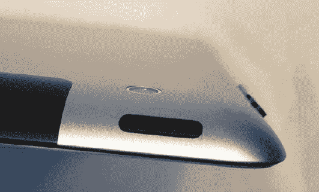

**图 3-1.** *睡眠/唤醒 按钮用于开启或关闭 iPad，以及在闲置时使其进入睡眠状态。*

如果你打算几小时内不使用 iPad，可以选择等待它自动锁定并进入睡眠（前提是在“设置”中开启了该选项），也可以手动使其进入睡眠。要手动操作，只需快速用力按下此按钮，屏幕便会变暗。当 iPad 声音开启时，你甚至能听到“咔哒”一声，作为设备已进入睡眠状态的声音确认。

你可以通过再次快速按下“开/关 睡眠/唤醒”按钮，或按下主屏幕按钮来唤醒 iPad。同样，如果你启用了密码锁定，则必须先正确输入密码才能使用 iPad。

偶尔，你可能需要完全关闭 iPad。这意味着它当然不会自动接收邮件、响闹钟或执行任何其他操作。它将完全关机。当你长时间不使用 iPad（例如，外出旅行时将 iPad 留在家中）且不希望电池耗电时，这非常方便。

要关闭 iPad，只需按住“开/关 睡眠/唤醒”按钮约五秒钟。iPad 会显示一个黑屏，底部有一个“取消”按钮，以防你真的不想关机，靠近顶部还有一个标有“滑动来关机”的红色按钮。用手指向右滑动该按钮即可关闭设备电源。

在极少数情况下，当 iPad 应用完全无响应且整个设备死机时，此技巧可能很有用。要重新开机，只需再次按下“开/关 睡眠/唤醒”按钮。

对于配有智能保护盖的 iPad 2，还有另一种让 iPad 睡眠和唤醒的方法：只需打开智能保护盖即可唤醒 iPad，合上则使其进入睡眠。

#### 静音/屏幕旋转锁定

移动到 iPad 的右侧（以主屏幕按钮和基座接口朝下、屏幕面向自己为方向），下一个开关是静音/屏幕旋转锁定（见图 3-2）。这个开关的名称描述了它的两个功能；默认情况下，它用于将 iPad 静音，完全关闭设备的声音。但静音/屏幕旋转锁定开关也可用于防止 iPad 屏幕改变方向。

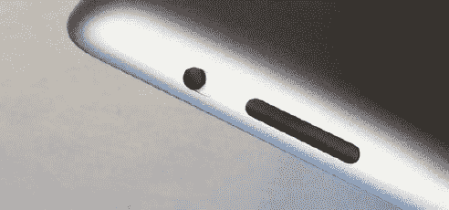

**图 3-2.** *静音/屏幕旋转锁定（小开关）和音量开关（较大的按钮）*

当此按钮用于将 iPad 静音时，将开关从上位置拨动到下位置会关闭设备的声音，并会在 iPad 屏幕上短暂显示一个静音图标（见图 3-3），以表示声音已关闭。如果你试图在参加重要会议时玩《愤怒的小鸟》，将 iPad 静音会非常有用。

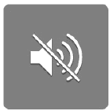

**图 3-3.** *当你将静音/屏幕方向开关向下拨动时，会显示此静音图标。*

新的 iPad 用户在阅读或玩游戏时，有时会因将 iPad 向某个方向倾斜过多而导致屏幕在纵向和横向之间切换方向，这可能会让他们感到困扰。

这正是屏幕旋转锁定派上用场的时候。这是 iPad 侧面开关的第二个用途。要使该开关能够锁定 iPad 屏幕的旋转，请前往“设置” `U001` “通用”，并将“侧边开关用于：”设置为“锁定屏幕旋转”。当你将开关向下拨动时，屏幕上会短暂出现一个中间带锁的环形箭头图标（见图 3-4）。同一个图标的缩小版会出现在屏幕顶部状态栏的右侧。现在，你可以随意旋转 iPad，屏幕将始终保持相同的方向。


**图 3-4.** *无论 iPad 方向如何，只要启用了屏幕旋转锁定，显示器将保持同一方向。*

例如，如果你在 iBooks 中阅读一本书，并且发现更喜欢在纵向模式下阅读，感觉更像读书，那么你可能想将屏幕方向锁定为纵向模式。要将屏幕锁定在纵向模式，请倾斜 iPad，使底部朝下，使显示器处于正确方向，然后向下滑动屏幕旋转锁定按钮。

要关闭屏幕旋转锁定，只需将静音/屏幕方向开关向屏幕顶部方向向上滑动即可。图标中央的锁消失，表示屏幕旋转现已解锁。

#### 音量开关

继续我们的 iPad 周边之旅，下一个遇到的按钮是音量开关。顾名思义，它用于调高或调低音量，或完全关闭声音。你可以在图 3-2 中看到音量开关的位置。

要提高 iPad 扬声器（或通过耳机插孔连接的任何耳机）的音量，只需按一下开关的上半部分。按一下可将音量提高一档；长按开关可快速将 iPad 音量调至最大。

降低音量则需要按音量开关的另一端。如果你按住音量开关的下端，iPad 的声音会关闭。这在电话铃声响起时需要快速关闭 Pandora 音乐应用的音量时非常方便。

每当你触摸音量开关时，iPad 显示屏中央会出现音量大小的视觉指示（见图 3-5）。如果你有一套 Apple 耳机，且其线缆上带有音量开关并已插入 iPad，你可以用类似的方式使用该开关调节音量，而无需触摸 iPad。

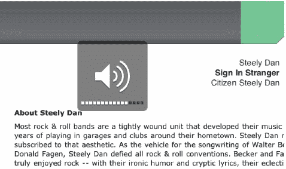

**图 3-5.** *当你使用音量开关或带音量开关的耳机调节 iPad 音量时，会出现这个透明的图标。*

#### 扬声器

说到音量，iPad 之旅的下一个部件是扬声器。它隐藏在 iPad 的底部（见图 3-6），通过 iPad 2 弧形铝制底部的一排微小孔洞发出各种系统提示音、音乐和电影配乐。在初代 iPad 上，它是隐藏在网格罩后面的三个微小的椭圆形开口。

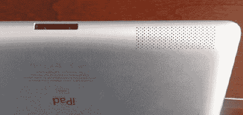

**图 3-6.** *iPad 扬声器开口（右）和基座接口（左）*

关于扬声器没什么太多可说的，除了如果你要为 iPad 购买或制作保护套，请确保其在正确位置有开口，以免声音被闷住。另外一个小提示：务必让液体远离扬声器和基座接口（见下一节），因为即使轻微的泼溅也可能导致 iPad 保修失效。


#### 基座接口端口

`Dock Connector` 端口是 iPad 连接外部世界的高速通道。通过该端口，您的 iPad 可以连接 Mac 或 Windows 电脑进行同步，可以通过 `Camera Connection Kit` 导入照片，还可以使用各种底座或数据线为电池充电。

我们将在本章后面讨论许多此类配件，但现在，我们先来了解如何使用随附的 `Dock Connector to USB` 数据线与 `Dock Connector` 端口配合使用。

您可以在第 1 章 中找到如何将数据线插入 `Dock Connector` 端口的说明。将数据线插入 iPad 时，请务必让带有小灰色图标（一个带线的矩形）的一面朝上，并确保将数据线笔直推入。换句话说，不要让数据线接口向上、向下或向侧边倾斜，因为这可能会对 `Dock Connector` 端口造成不必要的磨损。

#### 主屏幕按钮

引用《绿野仙踪》中桃乐丝的话：“世上只有家最好。” `Home` 按钮（参见图 3–7）无疑是 iPad 上使用最频繁的物理按钮。


**图 3–7.** *主屏幕按钮，位于 iPad 2 底部中央，功能多样。*

它用于多种操作，包括：

- 退出正在使用的应用程序并返回主屏幕。
- 唤醒处于睡眠状态的 iPad。
- 显示 iPad 上当前正在运行的所有应用。此功能是 `iOS 4`（苹果移动设备操作系统的第四代）新增的，通过双击 `Home` 按钮启用。此时 iPad 屏幕会变透明，活跃的应用程序会显示在屏幕底部的一行图标中。

关于 iPad 的一个迷人之处在于，根据您握住它的方式，`Home` 按钮可能位于屏幕的顶部、底部、左侧或右侧。但在大多数情况下，它位于标准的屏幕底部。

#### 耳机插孔

iPad 顶部的左侧是耳机插孔（参见图 3–8）。


**图 3–8.** *iPad 2 Wi-Fi + 3G 上的耳机插孔*

耳机插孔兼容任何标准的 `3.5mm` 立体声耳机接口，因此您有成千上万种耳机可供选择，以提升您的聆听体验。苹果销售两款耳机：`Apple Earphones with Remote and Mic` 和 `Apple In-Ear Headphones with Remote and Mic`。这两款耳机都能让您控制音乐音量，以及播放、暂停、快退、快进或跳过音乐或视频。

还记得本章前面警告过您不要让扬声器或 `Dock Connector` 进水吗？这个警告同样适用于耳机插孔。耳机插孔内有一个小型液体感应器。如果您的 iPad 曾受潮，这个液体感应器就会变色。这向任何拆卸您 iPad 的苹果技术人员表明，该 iPad 曾接触过液体，并且这将使您的保修失效。不幸的是，有些人发现，即使 iPad 只是暴露在极度潮湿的环境中，这个液体感应器也可能显示“进水损坏”。

如果您遇到这种情况，作为消费者，您有权要求技术人员打开 iPad，因为其内部还有另一个对湿度不那么敏感的感应器。

#### 麦克风

iPad 的麦克风可能是设备上最不显眼的部件。在第一代 iPad 上，它是一个位于耳机插孔旁边的小孔。第二代 iPad 则将麦克风移到了 iPad 正面，位于前置摄像头上方，是一排极小的微型圆点阵列。

如果您使用 iPad 应用程序录制讲座或对话，可以通过让麦克风正对说话者来稍微提升录音效果。当您录制自己的声音时，上一节讨论过的两款带有麦克风的苹果耳机都能清晰地再现您的语音，而不会收录太多背景噪音。此外，还有许多渠道可以买到专业级麦克风，例如售价 60 美元的 `IK Multimedia` 出品的 `iRig Mic` (`ikmultimedia.com/irigmic/`)，它可以直接插入耳机插孔。

当通过 `iPad Camera Connection Kit` 附带的 `USB` 适配器连接时，`USB` 耳机在 iPad 上用于收听和录音效果也很好。我们将在本章后面讨论 `Camera Connection Kit`。

#### Micro-SIM 卡槽（仅限 Wi-Fi + 3G iPad）

`Wi-Fi + 3G` 版 iPad 上还有一个 `Wi-Fi` 版没有的端口：`micro-SIM` 卡槽（参见图 3–9）。

世界上任何连接到基于 GSM 的移动电话系统的设备都会使用一张称为*用户身份模块*（SIM）的小卡片。您的 3G iPad 如果没有 SIM 卡就无法通过 3G 网络访问互联网，因此每台 3G iPad 出厂时都预装了一张。苹果在 iPad 中使用了一种更小尺寸的 SIM 卡，称为 *micro-SIM*。

偶尔，SIM 卡可能会损坏需要更换。为此，3G iPad 的左侧有一个小门。在第一代 iPad 上，它位于左侧下部，而在第二代 iPad 上则靠近顶部。这个门上有一个微小的孔，您可以将其视为门的锁孔（参见图 3–9）。

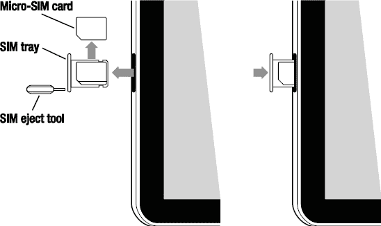

**图 3–9.** *micro-SIM 卡、SIM 卡托架和 SIM 卡弹出工具仅存在于 Wi-Fi + 3G 版 iPad 上。在第二代 iPad 上，该卡槽位于设备左侧靠近顶部的位置。*

支持 3G 的 iPad 还附带一个 `SIM eject tool`，它是一个椭圆形的小铝片，一端有一个小突起。要打开 SIM 卡门，请拿起 `SIM eject tool`，将突起部分插入门上的小孔。向工具施加压力，门就会从表面弹起。`SIM eject tool` 很容易丢失，因此在紧急情况下，您可以使用弯曲成类似形状的小回形针代替。

用手指捏住门的顶部，将 `micro-SIM` 卡从 iPad 中拉出。它放置在一个小托盘中，可以弹出并更换一张新的 `micro-SIM` 卡。要将新 SIM 卡放入 iPad，只需将托盘推回 iPad，直到门与设备侧面齐平。

### iPad 的保养与维护

虽然 iPad 不像 `MacBook Pro` 那么昂贵，但您仍然希望它能尽可能长久地使用。只要稍加爱护，您的 iPad 就能在未来多年为您服务。在本第 3 章的这一节中，我们将告诉您如何维护您的 iPad，使其拥有长久的使用寿命和多年的忠诚服务。

#### 保护壳

与其前辈 iPhone 一样，iPad 也正在催生自己的周边经济，大量为其生产的配件应运而生。一些最热门的 iPad 产品是用于保护设备免受划伤、水、灰尘和意外跌落损坏的保护壳。虽然我们不会在本节中列出所有可能的外壳，但我们将讨论不同类型的保护壳及其适用人群。


#### 保护套

iPad 保护套（见图 3–10）通常由柔软的材质制成，内衬为防刮面料。将 iPad 放入保护套后，再将其放入另一个携带包——例如背包、手提包、公文包或笔记本电脑包中。

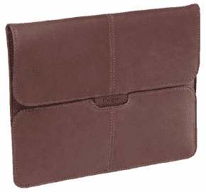

**图 3–10.** *Targus 推出的 Hughes Leather Portfolio Slipcase 款 iPad 保护套。图片由 Targus 提供。*

保护套主要的作用是保护 iPad 在放入其他包袋时免受刮擦。它们可由多种材料制成（例如皮革、摇粒绒、软木、氯丁橡胶、尼龙和大麻纤维等），价格也千差万别。

保护套的示例产品包括 Targus（[`www.targus.com`](http://www.targus.com)）和 Booq（`booqbags.com`）推出的型号。

#### 包袋

iPad 包袋（见图 3–11）不仅用于保护 iPad，还作为它的主要携带工具。因此，它们通常配有手柄或某种肩带以便于携带。从价格上看，包袋通常比保护套更贵，但提供的保护也更多。通常内部会有某种衬垫，以及一个硬质插片来保护屏幕。

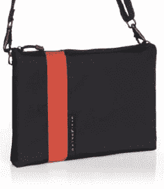

**图 3–11.** *WaterField Designs 推出的时尚且实用的 iPad Travel Express 包袋。图片由 WaterField Designs 提供。*

几款时尚的包袋由 WaterField Designs（`sfbags.com`）和 Tom Bihn（[`www.tombihn.com`](http://www.tombihn.com)）生产。

#### 机身贴膜

如果您想在不增加太多重量的情况下保护 iPad 的表面，可以考虑使用机身贴膜。它们通常由薄材料制成，可能无法保护您的 iPad 免受跌落损伤，但能防止刮擦。Zagg 的 Invisible Shield for iPad（[`www.zagg.com`](http://www.zagg.com)）和 Fusion of Ideas 的 Stealth Armor（[`www.fusionofideas.com/sa-ipad/index.html`](http://www.fusionofideas.com/sa-ipad/index.html)）就是两个完美的机身贴膜示例，它们能在几乎不增加体积的情况下提供防刮保护。

#### 书本式保护壳

iPad 是一款出色的电子书阅读器，那么何不让它看起来像一本书呢？这类保护壳的首款产品由旧金山的 DODOcase（`dodocase.com`）公司开发，这家公司将高科技与古老的装订工艺融合，打造出既美观又具保护性的 iPad 保护壳。其他公司也纷纷效仿，其中 Twelve South 的 BookBook for iPad（`twelvesouth.com/products/bookbook_ipad/`）就是此类 iPad 保护壳中一个巧妙而漂亮的典范（见图 3–12）。

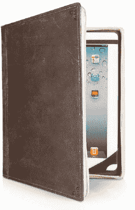

**图 3–12.** *使用一款巧夺天工、美观大方的书本式保护壳（如 Twelve South 的 BookBook for iPad），让您的电子书阅读器看起来像一本书。照片由 Twelve South 提供。*

#### 电池保养

iPad 的一大优点是其电池续航能力。连续数天不充电是常事，远离电源插座的想法也不再会让你惊慌。一个实用的经验法则是：正常使用时，电池电量大约每小时下降 10%。如果您在玩对图形和音效要求较高的游戏，电池续航时间可能不会那么长。另一方面，如果您在阅读电子书，iPad 的电池续航时间可能会更长。

然而，不充电的话，您的 iPad 电池也不会永远持续下去，因此您需要定期为其充电。通过使用基座接口转 USB 连接线和 10W USB 电源适配器，将 iPad 连接到电源插座，或者将连接线连接到高功率 USB 2.0 端口即可充电。

我们所说的高功率 USB 是什么意思？通常，这意味着直接插入计算机上的端口或插入有源 USB 集线器。将 iPad 插入 USB 键盘的端口或无源 USB 集线器将无法为其充电。相反，您会在状态栏中电池图标旁边看到“`未在充电`”的提示信息。我们建议每晚将 iPad 连接到电源适配器，使其充满电。

如果您的 iPad 电量*非常*低，您可能会在屏幕上看到图 3–13 中的某个图像。这些图标表示设备需要充电至少十分钟后才能使用。如果电池电量极低或完全耗尽，在将 iPad 连接到电源后，可能需要长达两分钟的时间才会显示这些图像。

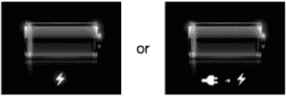

**图 3–13.** *如果在 iPad 屏幕上看到这两个符号中的任何一个，请停止使用，并尽快将其连接到电源。*

随着持续使用，您的 iPad 电池最终可能会达到这样一个状态：其存储电量的能力相比原始规格下降了 50% 或更多。如果是这种情况，您的 iPad 会不断电量耗尽，或者长时间插电后也从未显示完全充电。在这种情况下，您可能需要由 Apple 授权的服务提供商更换电池。如果您为 iPad 购买了 AppleCare 保护计划并且拥有时间不足两年，Apple 可能会免费为您更换电池。

您可以采取一些简单的步骤来延长电池续航时间，这在某些情况下（例如国际航班）您无法方便地为电池充电时非常有用：


##### iPad 电池保养技巧

- **关闭推送通知**：某些应用使用 Apple 推送通知来提供提醒。频繁使用时，这些通知往往会导致电池续航下降，因此你可以通过进入`设置`→`通知`并将通知设为“关闭”来禁用推送通知。
- **关闭 Wi-Fi**：在不使用 Wi-Fi 时，将其关闭以节省电量。进入`设置`→`Wi-Fi`并将 Wi-Fi 设为“关闭”。
- **使用 Wi-Fi + 3G 的 iPad？** 使用 3G 网络往往会比通过 Wi-Fi 连接更快地消耗电池电量。如果你处于 3G 信号弱或无信号的区域，请关闭 3G 以延长电池续航。有两种方法可以实现：第一种，选择`设置`→`蜂窝数据`并将蜂窝数据设为“关闭”；第二种方法是直接开启飞行模式，进入`设置`并将飞行模式设为“开启”。
- **尽量减少定位服务的使用**：iPad 可通过两种方式确定其位置：通过 Skyhook Wireless 的 Wi-Fi 热点位置数据库进行 Wi-Fi 定位，或在 Wi-Fi + 3G iPad 上通过辅助 GPS 进行定位。这两种方式都会降低电池续航。如果你不需要知道自己的位置或去向，请禁用定位服务。进入`设置`→`定位服务`并将定位服务开关滑动至“关闭”。
- **调整屏幕亮度**：iPad 默认开启自动亮度调节，这意味着它会在环境光较亮时提高屏幕亮度，在较暗的房间中降低亮度。你可以自行调整亮度：进入`设置`→`亮度与墙纸`，将滑块向左拖动以降低默认屏幕亮度。亮度越低，电池续航越好。
- **了解你下载的应用**：你在 iPad 上运行的某些应用可能会消耗电池电量。那些阻止屏幕自动变暗的游戏是常见元凶，需要持续运行以进行位置更新的应用也是如此。已知会频繁轮询 Wi-Fi + 3G iPad GPS 位置的地理追踪应用会迅速拉低电池续航。
- **让 iPad 远离极端温度**：Apple 建议让 iPad 远离阳光直射和高温车辆。极端高温会导致电池续航下降，还可能引发其他问题（我们稍后将讨论）。Apple 推荐的 iPad 工作温度范围为 32° 至 95°F（0° 至 35°C），关机状态下的存放温度范围为 -4° 至 113°F（-20° 至 45°C）。
- **将 iPad 设置为短时间无操作后自动关闭**。自动锁定功能（可通过进入`设置`→`通用`→`自动锁定`进行设置）会在预设时间后自动关闭屏幕。为获得最佳电池续航，请将时间间隔设置为较短的时间，例如一两分钟。

#### 屏幕保养

与早期移动设备（如 Apple Newton MessagePad 或 Palm Pilot）上容易刮擦的显示屏不同，iPad 的屏幕由非常耐用且极其坚硬的玻璃制成。尽管它能抵抗大多数刮擦，但最终仍可能被某些物体划伤。除非在极端情况下，这通常不会损坏屏幕，你仍然可以正常使用 iPad。

使用 iPad 显示屏时可能遇到的最大问题是它容易沾染指纹。iPad 屏幕带有疏油涂层，但仍然很容易沾染污迹和指纹。

清理 iPad 屏幕上的指纹和污迹可能会成为一种小小的执念。幸运的是，它们通常只在 iPad 关闭时才清晰可见，因此你无需过度纠结于指纹。当污迹确实干扰 iPad 使用时，Apple 建议完全关闭 iPad，拔掉所有线缆，然后使用柔软、微湿、不起毛的布进行清洁。我们推荐使用 RadTech ScreenSavrz 清洁布，将其用水略微沾湿，然后拧干，直到几乎不再滴水。

有些 iPad 用户声称婴儿湿巾也能很好地清洁 iPad 屏幕。它们价格低廉、方便且易于使用。清洁屏幕后，只需用软布擦去任何残留的灰尘或液体残留物即可。

接下来，用布擦拭屏幕。务必避开 iPad 上的任何开口，例如耳机插孔、基座接口和扬声器。

**切勿**使用玻璃清洁剂、液体眼镜清洁剂、家用清洁喷雾、酒精、氨水或任何研磨剂来清洁 iPad，因为它们可能会损坏屏幕。

##### 热量：iPad 的头号敌人

在之前关于电池续航的部分中，我们提到 Apple 建议让 iPad 远离高温环境以优化电池续航。确保 iPad 保持凉爽还有另一个充分理由：它可能会在过热时关机。

Apple 在设计 iPad 时没有内置冷却风扇，这样你就不会被风扇的噪音和功耗所困扰。不幸的是，这意味着 iPad 保持冷却的唯一方式是通过热传导将热量散发到周围环境中。

一些 iPad 用户报告称，当他们的设备处于高环境温度条件下时，屏幕上会显示警告信息，然后 iPad 会关机。要让你的 iPad“重获新生”，你需要将其带到远离阳光直射的阴凉处，直到它冷却下来。这种情况在夏季以及 iPad 在阳光直射下使用时似乎更为常见。

### Apple iPad 配件

在本书编写时（iPad 发布后不久），已经有数千种第三方配件可供选择。对于许多将在附近 Apple Store 零售店或通过 Apple 在线商店购买的 iPad 买家来说，Apple 原装配件可能是他们的首选。

在本节中，我们将介绍 Apple 制造的 iPad 配件，以及如何使用它们来增强你的用户体验。你已经在第 1 章中了解过这些配件；在此，我们将提供关于每种配件如何与你的 iPad 配合使用的更多细节。

#### Smart Cover

我们在本章前面提到过适用于 iPad 2 的 Apple Smart Cover，它可以保护设备屏幕免受刮擦。Smart Cover 在许多其他方面也很有用。

Smart Cover 由皮革（$69.00）或聚氨酯（$39.00）制成，这意味着当你的 iPad 戴上 Smart Cover 时，更容易握持。我们发现“裸机”iPad 有些滑，因此使用 Smart Cover 可能至少让我们避免了 iPad 掉落一次。

Smart Cover 通过非常坚固且位置巧妙的磁铁吸附在 iPad 2 上。只有一种正确的方式可以安装它，当你将保护盖调整到正确的方向时，它实际上会自动吸附到位。

Smart Cover 上的一块磁铁与 iPad 2 内部的一个小型微动开关协同工作：当保护盖被掀开时唤醒设备，合上时则使其进入休眠状态。这一功能使得无需按下“开/关-睡眠/唤醒”按钮即可唤醒 iPad。

我们最喜欢 iPad Smart Cover 的一个特点是，它可以像折纸一样折叠成一个方便的支架，如图 3-14 所示。Smart Cover 其中一个折叠层内部有一块钢板，会被一组磁铁吸附。当折叠成三角形管状时，Smart Cover 可以充当支架，在 iPad 上更方便地打字，或者将其支撑成垂直位置以便于观看电影。

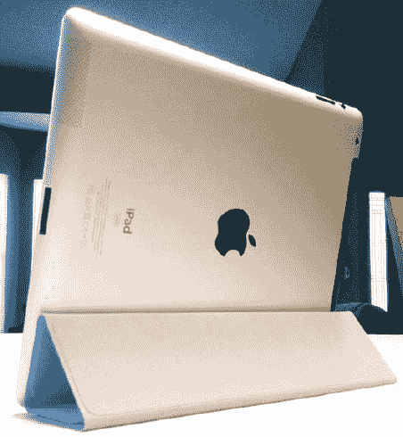

**图 3-14.** *iPad 2 Smart Cover 兼具屏幕保护壳、便捷支架和睡眠/唤醒功能。*


#### iPad 2 底座

苹果 iPad 2 底座（`$29.00`）提供了一个用于为 iPad 2 充电和同步的基座（参见图 3–15）。

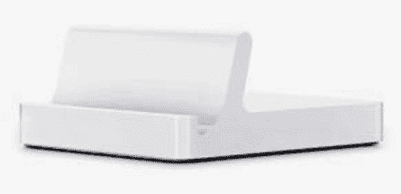

**图 3–15.** *苹果 iPad 2 底座外观简约且功能实用。*

初代 iPad 也有类似的底座，许多其他厂商也推出了功能相同且价格更低的底座。iPad 2 底座提供了一个`Dock Connector`端口和一个音频线路输出端口。它以一个固定角度支撑你的 iPad，且无法调整角度。对于希望将蓝牙键盘与 iPad 配合使用的人来说，iPad 2 底座是将 iPad 保持在适合打字的实用姿势的理想选择。

#### iPad 相机连接套件

对于摄影师来说，苹果的一款非常实用的配件是 iPad 相机连接套件（参见图 3–16）。该套件包含两个独立的连接器，可插入 iPad 的`Dock Connector`端口。第一个连接器设有一个安全数字（SD）存储卡插槽，适用于许多数码相机和摄像机使用的此类存储卡。当你想将照片或视频从相机传输到 iPad 以进行分享或修图时，只需插入相机连接套件的`SD`适配器，从相机中取出 SD 卡，然后将其插入相机连接套件上的 SD 插槽即可。

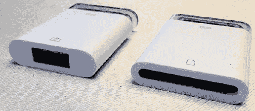

**图 3–16.** *iPad 相机连接套件包含一个 USB 适配器（左）和一个 SD 存储卡读卡器（右）。*

第二个连接器甚至更有用，它为 iPad 提供了一个 USB 端口。可以连接什么到 USB 端口呢？当然可以是数码相机或摄像机，但你也可以连接大多数 USB 键盘、USB 耳机，甚至 iPhone 或 iPod touch。如果你正在将 iPhone 或 iPod touch 用作相机，并希望将照片或视频传输到 iPad 进行编辑，相机连接套件的 USB 适配器与常规的 iPhone 同步线缆配合使用将非常完美。

为 iPad 添加 USB 耳机的功能使其成为 Skype 语音聊天的绝佳便携工作站，而且如果你有一款心爱的 USB 键盘难以割舍，现在也可以在 iPad 上使用了。

#### iPad 10W USB 电源适配器

iPad 附带一个 10W USB 电源适配器用于充电，但你可能需要第二个适配器以便在旅途中使用，或者在家和办公室都能充电。iPad 10W USB 电源适配器附带了一个你购买 iPad 时标配适配器中没有的额外部件——一根 6 英尺长的电源线，这样你就不必紧挨着电源插座才能充电了。

#### Apple VGA 适配器

当史蒂夫·乔布斯于 2010 年 1 月 27 日发布 iPad 时，他还同时宣布了适用于 iPad 的`iWork`的可用性。`iWork`包含三个强大的应用程序：`Pages`、`Keynote`和`Numbers`。

苹果的`Keynote`是一款演示软件，所以对于我们这些工作中需要进行演示的人来说，这是个激动人心的消息。然而，我们需要一种能将 iPad 上的图像传输到标准 PC 投影仪或大尺寸显示器上的方法。

几分钟后，乔布斯发布了 Apple VGA 适配器（参见图 3–17），它正好提供了这种功能。对于初代 iPad，VGA 适配器仅适用于某些已编写了特定驱动程序的应用程序。而在 iPad 2 上，VGA 适配器可以将屏幕上的所有内容真实地镜像到外接显示器或投影仪上。

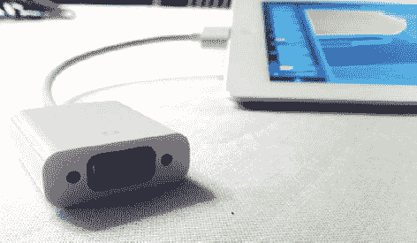

**图 3–17.** *iPad Dock Connector 转 VGA 适配器对于在外接显示器或 PC 投影仪上展示 Keynote 演示文稿非常有用。*

对于不想随身携带笔记本电脑的演示者来说，这款适配器简直是天赐之物。搭配适用于 iPad 的`Keynote`、适配器、你的 iPad 和一台 PC 投影仪，你就可以用你的演示惊艳全场了。

#### Apple 数字影音适配器

随着第二代 iPad 的推出，苹果引入了一款新的线缆：数字影音适配器。这款线缆的目的是让你的 iPad 能够连接到许多使用`HDMI`连接器标准的高清显示器和电视。

这款适配器的一端有一个底座连接器，用于插入 iPad，另一端则是一个`HDMI`线缆端口。`HDMI`端还提供了另一个底座连接器，以便你在使用 iPad 向高清电视输出视频时为其供电。数字影音适配器会将 iPad 2 屏幕上的内容镜像到高清显示器，但在初代 iPad 上，它仅适用于明确支持视频输出功能的应用程序。

#### Apple 复合及色差影音线缆

并非所有的 PC 投影仪或电视都使用`VGA`标准来输入视频信号，因此苹果确保其复合影音线缆和色差影音线缆能与 iPad 兼容。与可在 iPad 2 上以视频镜像模式工作的`VGA`适配器不同，这些线缆仅适用于那些已针对 iPad 视频输出功能进行编写的应用程序。我们希望未来能有更多 iPad 程序员在其应用程序中支持视频输出功能。

#### Apple 无线键盘

Apple 无线键盘是另一款可与 iPad 配合使用的苹果产品。这款小巧的键盘手感舒适，盲打时触感反馈良好。

该键盘通过蓝牙无线连接与 iPad 通信，并由两节 AA 电池供电。如果你已有 Apple 无线键盘并希望与 iPad 配合使用，只需将键盘与 iPad 配对即可——除非你每次使用都重新配对，否则无法同时在 Mac 和 iPad 上使用它。

这款键盘最大的优点在于它不受任何线缆束缚，因此你可以在 iPad 前方、膝盖上，甚至距离 iPad 最远 30 英尺的地方使用它。

正如我们之前提到的，几乎任何第三方蓝牙键盘都能与 iPad 配合使用。许多厂商正在生产集成了蓝牙键盘的 iPad 保护套，例如`ZaggMate`（`zagg.com/accessories/zaggmate-ipad-case`）和`Kensington KeyFolio`保护套（`kensington.com`）。

#### Apple 带遥控和麦克风的耳机

尽管 iPad 本质上使用的操作系统软件与 iPhone 相同，但它并非设计用于拨打或接听电话。即使是 iPad Wi-Fi + 3G 也无法进行语音通话，除非使用 FaceTime 或 Skype（[`http://skype.com`](http://skype.com)）、Line2（[`www.line2.com`](http://www.line2.com)）等网络电话软件。

虽然你不能像在 iPhone 上那样用 iPad 打电话，但你仍然会想用它听音乐、看电影，或者偶尔参与 FaceTime 聊天。因此，你可能需要一副好耳机。Apple 带遥控和麦克风的耳机在其中一根耳机线上有一个小型开关，可作为 iTunes 的遥控器。如果你需要快进到下一首歌、暂停、调高或调低音量，或者倒回，都可以通过这个遥控器完成。

这个遥控开关还包含一个重要部件——一个小型指向性麦克风，用于拾取你的声音。由于这些耳机与每部 iPhone 附带的耳机相同，你只需将其插入 iPad 的耳机插孔即可使用。

#### Apple 带遥控和麦克风的入耳式耳机

我们要讨论的最后一款苹果 iPad 配件是另一款耳机。Apple 带遥控和麦克风的入耳式耳机与前一款产品几乎完全相同，但有一个重要区别。这款耳机实际上会贴合在你的耳道内，从而提供更好的音质和外界噪音隔离效果。


### 摘要

本章通过带你了解日常会用到的各种开关、按钮和接口，向你介绍了 iPad 上可由用户操控的硬件。你还熟悉了 iPad 的保养与维护，并深入了解了可以从 Apple 购买的 iPad 配件。

以下是本章的一些要点：

- 为了便于使用，iPad 的物理开关和切换键非常少。与 iPad 的大多数交互都是通过触摸屏完成的。真正的按钮和开关包括开/关/睡眠/唤醒按钮、主屏幕按钮、音量切换键以及静音/屏幕旋转开关。
- 有许多方法可以延长 iPad 的电池续航时间，以备你长时间远离电源插座之需。在那些漫长的国际航班上，可以考虑调暗屏幕、降低音量，并关闭所有无线服务（`Wi-Fi`、`3G` 和 `Bluetooth`）。
- 极端温度是 iPad 的大敌。很可能，当你感到不舒服时，你的 iPad 也是如此！将其保持在你感觉舒适的温度下，就不会遇到任何问题。
- 切勿让液体进入 iPad 的任何接口，尤其是耳机插孔。接触液体可能会导致 iPad 保修失效。
- 如果你打算使用任何 Apple 线缆或适配器将 iPad 连接到投影仪、电视或家庭影院系统，请了解并非所有应用都支持这些线缆。

## 第 4 章：与 iPad 交互

对于使用过 iPhone 或 iPod touch 的人来说，你已经对如何与 iPad 交互有了一些概念。然而，由于 iPad 的大屏幕，你会发现 iPhone 和 iPad 之间存在一些细微差别。从未使用过 iPod touch 或 iPhone？那也没关系，因为你绝对会被 iPad 的 Multi-Touch（多点触控）屏幕所震撼。iPad 能够响应你的触摸语言。它的“词汇表”包括*轻点*、*拖移*、*捏合*和*轻拂*。通过这些操作，你可以像使用鼠标控制个人电脑一样轻松地控制你的 iPad。而且，交互远不止拖移和轻点。你的 iPad 提供了 Multi-Touch 技术，这意味着它可以同时识别和响应多次触摸。

在本章中，你将发现与 iPad 交互的所有不同方式——从放大和缩小图片，到使用 iPad 内置的大键盘，再到设置辅助功能选项。让我们开始吧。

### 交互基础

个人电脑有鼠标。个人数字助理（PDA）有触控笔。iPad 有你的手指。它无法与鼠标或触控笔配合使用，它需要真实的手指接触。你的 iPad 不仅能感应压力点，它还能检测从你手指传递过来的微小电荷。这意味着你可以用手指、指关节，甚至——如果你愿意的话——用鼻子来使用 iPad，但你不能使用铅笔擦、棉签或那些 PDA 触控笔来操作。你触摸时产生的电荷使 iPad 能够同时检测并响应一个或多个接触点，也就是运用 Multi-Touch 技术。

**提示：** 如果你真的想尝试点新奇的，你可以用一根冷冻的热狗来代替你的手指。韩国冬天非常寒冷，人们因为要在户外使用 iPhone 而摘掉手套，导致手指冻伤。一些有进取心的韩国人发现，你可以用一根冷冻的热狗来代替手指，依然能够与 iPhone 的触摸屏进行交互，同时还能戴着手套。理论上，冷冻的热狗在 iPad 的屏幕上应该也能用。

#### iPad 语言

你触摸 iPad 屏幕的方式提供了你的交流“词汇”。以下是你可以与 iPad “对话”的基本方式速览：

- *按下主屏幕按钮*：主屏幕按钮位于触摸屏下方，带有一个白色方块标记。在任何应用中随时按下此按钮，即可返回显示应用列表的主屏幕。在主屏幕或应用内双击主屏幕按钮会调出多任务栏。我们将在本章后面部分详细讨论多任务处理。
- *轻点*：用手指触摸屏幕并快速移开，即为轻点。轻点可以选择网页链接、激活按钮和启动应用。输入文本时，你可能想用食指轻点，或者如果更舒服的话，用拇指。
- *双指轻点*：双指轻点意指快速连续地轻点屏幕两次。在个人电脑上双击可能很重要，但在 iPad 上双指轻点实际上用得并不多。你可以在 Safari（iPad 自带的网页浏览器）中双指轻点来放大列，再次双指轻点缩小。在“照片”（iPad 内置的照片查看器）中，可以使用双指轻点来放大和缩小图片。
- *双指轻点和拖移*：iPad 的 Multi-Touch 技术意味着你可以同时使用多个手指轻点屏幕。少数应用会响应双指手势。要进行此操作，分开食指和中指，同时用两根手指轻点或拖移屏幕。例如，在 Safari 中，双指拖移可以在网页框架内滚动而不影响整个页面。
- *长按*：有时，你需要将手指放在屏幕上并保持不动，直到有事情发生。例如，在输入文本时长按会调出放大镜，在 Safari 中则会显示 URL 预览。
- *拖移*：将手指按在屏幕上，向任意方向移动后再抬起，即为拖移。使用拖移可以在 Safari 和 iPod（播放 iTunes 歌曲的应用）中上下滚动。有些应用在右侧提供一个索引，例如 图 4–1 中为 iPod 应用显示的索引。要使用此索引，请沿着它拖移，直到所需项目出现。
- *轻拂*：当处理长列表时，你可以快速轻拂列表。将手指放在屏幕上，向一个方向（上、下、左或右）快速移动。显示屏会响应并沿你指示的方向快速滚动。例如，使用轻拂可以快速浏览电子邮件联系人列表。

**提示：** 轻拂和拖移不会选择或激活 iPad 显示屏上的项目。你可以通过在主屏幕上拖移和轻拂来亲自尝试。

- *停止*：在滚动过程中，按住手指不放即可停止滚动。Apple 的法律文本是练习轻拂、拖移和停止的好地方。要找到它，请依次选择 `设置` `通用` `关于本机` `法律信息`。尽情享受其中无穷无尽的法律术语吧，你可以随心所欲地轻拂、拖移和停止。如果你不想手动停止滚动，只需等待，滚动会自行减速并停止。
- *清扫*：要清扫 iPad，请将手指从屏幕左侧向右侧拖移。清扫用于解锁 iPad 以及表示你想要删除列表项。
- *捏合*：在 iPad 上，将拇指和食指放在屏幕上，两者之间留有空隙，然后手指保持接触屏幕并向内移动，就像在捏屏幕一样，这就是捏合操作。捏合允许你在许多 iPad 程序中（包括“照片”和 Safari）缩小视图。
- *反向捏合*：反向捏合就是执行捏合的逆操作。开始时将拇指和食指并拢放在屏幕上，然后手指保持接触屏幕并向两边分开。反向捏合允许你在那些支持捏合缩小的 iPad 应用中进行放大操作。


#### 方向

在大多数 iPad 图片中，你可能会注意到设备处于竖屏方向，物理主屏幕按钮位于底部边框。然而，实际上并没有所谓的“正确”方式去持握 iPad。苹果将 iPad 设计为一种**方向无关**的设备。这意味着你可以在竖屏或横屏模式下持握 iPad，并正常与设备交互（图 4-2）。事实上，你甚至可以完全上下颠倒地持握 iPad，而屏幕显示内容依然保持正立。

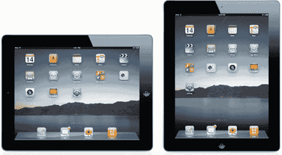

**图 4-2.** *iPad 的竖屏与横屏模式*

虽然没有所谓的正确持握方式，但某些应用在你将 iPad 翻转至横屏或竖屏模式时，会提供额外功能。例如，在竖屏模式下使用邮件应用时，屏幕上只会显示当前选中的邮件。要查看其他邮件列表，你需要点击顶栏下拉菜单中的收件箱。但是，如果将 iPad 旋转至横屏方向，你就能在当前所选邮件旁边看到所有邮件的列表。我们将在本书后续章节讨论不同应用针对特定方向的功能。

**注意：** 尽管大多数应用在两种方向下都能显示，但部分应用不支持。许多游戏会强制要求你在横屏模式下使用 iPad。

### 锁定屏幕

如果你刚打开 iPad，或者 iPad 已闲置一段时间，它会自动锁定，屏幕变暗。此时，请按下主屏幕按钮。锁定屏幕便会呈现，如图 4-3 所示。要解锁 iPad，请从左向右滑动滑块。锁定屏幕消失，主屏幕便随之呈现。

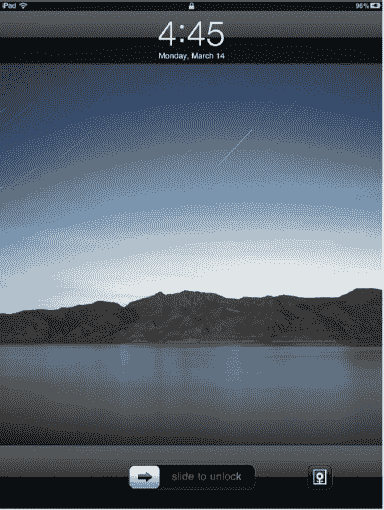

**图 4-3.** *iPad 锁定屏幕*

你可以设置 iPad 在锁定前等待的时间。前往`设置`  `通用`  `自动锁定`，然后选择你希望 iPad 在锁定前等待的分钟数。若要停用自动锁定，请选择“永不”——但请确保附近有可靠的电源。自动锁定是一项省电功能。停用它意味着 iPad 的电池消耗会更快。

出于安全考虑，你可以为 iPad 设置密码。你可以在常规密码和简单密码之间进行选择。*简单密码*就像你的借记卡四位数字 PIN 码。前往`设置`  `通用`，轻点“密码锁定”，然后轻点屏幕顶部的“开启密码”。接着，轻点“简单密码”将其切换至“开”，以建立一个新的简单密码。iPad 会提示你输入一个四位数字的代码，如图 4-4 所示。

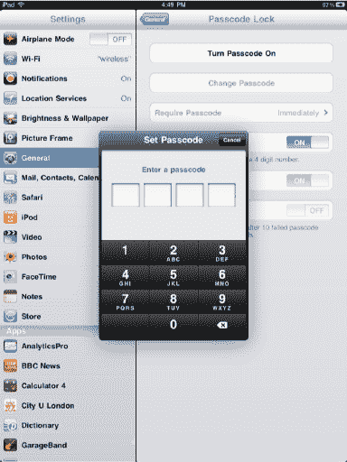

**图 4-4.** *设置你的简单密码*

输入代码，或轻点“取消”退出而不输入代码。输入代码后，iPad 会提示你再次输入，然后启用更多密码锁定设置。这些设置包括：设置 iPad 闲置多久后自动锁定；设置 iPad 锁定期间是否显示相框（更多关于相框的内容请见第 13 章）；以及设置在连续十次输错密码后是否抹掉 iPad 上的所有数据。

若要输入常规密码（实际上是可以使用字母、数字和符号任意组合的密码），请前往`设置`  `通用`，轻点“密码锁定”，然后轻点屏幕顶部的“开启密码”。接着，轻点“简单密码”将其切换至“关”，以建立一个新的复杂密码。iPad 会显示一个键盘，供你输入复杂密码。

要测试你的密码（无论是简单密码还是复杂密码），请按一下“睡眠/唤醒”按钮（使 iPad 进入睡眠状态），再按一次（唤醒它）。密码验证屏幕会显示出来，如图 4-5 所示。输入你的密码，iPad 便会解锁。

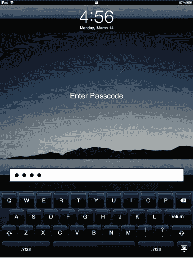

**图 4-5.** *密码锁定屏幕显示键盘，供您输入复杂密码。若为简单密码，则会显示数字键盘。*

若要移除 iPad 上的密码，请返回“密码锁定”设置界面（图 4-4）。选择“关闭密码”，并再次输入密码以确认是您本人在操作。

那么，如果您忘记了密码，或者一位不怀好意的同事在您不知情的情况下给 iPad 设置了密码，该怎么办？您需要将 iPad 连接到家用电脑，并使用 iTunes 来恢复 iPad 软件。您可以通过在 iTunes 中选择“摘要”标签页并点击“恢复”来恢复 iPad。有关恢复 iPad 的更多信息，请参见第 2 章。

在锁定屏幕上，“滑动来解锁”栏的右侧，您会注意到有一个盒子里面包含花朵的小图标（见图 4-3）。这就是“相框”按钮。轻点此按钮可将 iPad 变成数码相框。iPad 会在屏幕上接连不断地显示您的照片，直到您轻点屏幕并再次轻点相框按钮，或者滑动“滑动来解锁”栏来停止它。您将在第 13 章中了解更多关于 iPad 相框功能及其设置的信息。

锁定屏幕还可以执行最后一项功能：控制 iPad 的音乐播放器。如果在屏幕锁定时 iPad 正在播放音乐，您可以双击主屏幕按钮，在屏幕顶部显示音乐控制。您将在第 7 章中了解有关这些控件的更多信息。


#### 主屏幕

如前所述，当你打开 iPad 时，首先会看到锁定屏幕。根据你是否在 iPad 上设置了密码，要么你滑动“滑动来解锁”栏，然后看到数字或 QWERTY 键盘，要么你会直接进入 iPad 主屏幕。

iPad 主屏幕（参见图 4–6）是你 iPad 上应用的第一页。根据你拥有的应用数量，当你向左滑动时，可能会依次显示多个页面。

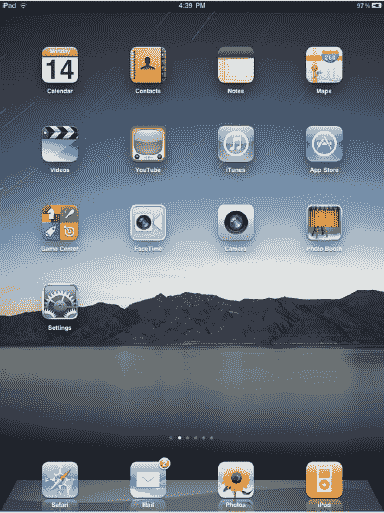

**图 4–6.** iPad 主屏幕

**提示：** 由于解锁 iPad 后首先进入的是主屏幕，因此将最常用的应用放在主屏幕上以便快速访问是合理的。

从屏幕顶部向下，你会看到以下元素：

**状态栏**：一条细细的黑色横条贯穿 iPad 主屏幕顶部。这个状态栏，如图 4–7 所示，会显示在 iPad 主屏幕的每一页上。


**图 4–7.** 状态栏

状态栏可以显示很多图标，但你最有可能看到的标准布局如下：在左上角，你会看到 *iPad* 或 *iPad 3G*（取决于你的型号），旁边是一个 Wi-Fi 图标。Wi-Fi 图标显示你已连接到无线热点，并告知你无线信号的强度。如果你有 iPad 3G，你还会看到你的 3G 服务运营商的名称。在状态栏中间，你会看到当前时间。在状态栏的右侧，你会看到一个电池电量图标，旁边是剩余电量的百分比。

状态栏还可以显示其他状态图标。包括以下内容：

*   **飞行模式**：开启飞行模式后，你将无法访问互联网或使用蓝牙。iPad 的其他功能仍可使用。
*   **E**：代表 EDGE，一种比 3G 慢的蜂窝数据网络。当你离开 3G 网络覆盖范围时，通常会显示 *E*。你可以使用 EDGE 连接到互联网；请记住它比 3G 慢（仅适用于 iPad Wi-Fi + 3G 型号）。
*   **o**：这个小符号代表 GPRS。如果把 3G 比作赛车，EDGE 比作自行车，那么 GPRS 就是乌龟。可以想象 1994 年拨号上网的速度（仅适用于 iPad Wi-Fi + 3G 型号）。
*   **活动**：活动图标看起来像一个太阳。当你的 iPad 上发生网络活动（如下载数据）时，你会看到这个活动图标。
*   **VPN**：表示你已连接到虚拟专用网络（VPN）。许多公司使用 VPN，以便你可以从家中安全地登录他们的电子邮件系统或私有网络。
*   **锁定**：这个挂锁图标告诉你 iPad 已锁定。你只会在锁定屏幕上看到这个图标。
*   **屏幕旋转锁定**：表示屏幕旋转已被锁定。详情请参见第 3 章。
*   **播放**：这个图标表示正在播放歌曲、播客或有声读物。

**应用页面**：在黑色状态栏下方，你会看到一系列应用图标（参见图 4–8）。除了程序坞中的应用外，每页最多可容纳 20 个应用。正如我们稍后将讨论的，无需将 iPad 连接到 iTunes，即可删除和重新排列应用。

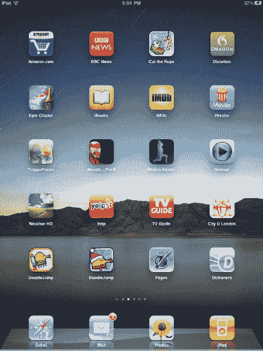

**图 4–8.** 一个装满应用的页面

**页面圆点**：就在程序坞中的应用图标上方，你会看到一系列白色小圆点（参见图 4–9）。这一系列圆点以一个小放大镜图标开始。我们稍后会介绍放大镜。放大镜旁边的圆点表示主屏幕上应用页面的数量。如果你看到五个圆点，意味着你有五页应用。最亮的圆点表示你当前所在页面在所有应用页面中的位置。


**图 4–9.** 圆点表示你有多少页应用。

**程序坞**：主屏幕每一页的底部都有一条长长的灰色面板，称为*程序坞*（参见图 4–10）。程序坞最多可以容纳六个应用。无论你滑动到哪一页应用，程序坞始终显示相同的应用。这样做的好处是，如果你有十页应用但经常查看电子邮件，无论你当前在哪一页应用上，只要将邮件应用放在了程序坞中，你总能快速访问它。


**图 4–10.** 程序坞可以容纳零到六个应用。

**注意：** 与某些应用不同，无论你是垂直还是水平握持 iPad，主屏幕的所有元素，包括你与它的交互方式，始终保持不变。


#### 操控主屏幕

您可以通过多种方式与 iPad 主屏幕进行交互。

**导航应用程序页面：** 如果您位于第一个应用程序页面，请用手指向左轻扫即可显示下一个应用程序页面。持续向左轻扫，即可浏览所有应用程序页面。要返回上一个应用程序页面，只需用手指向右轻扫即可。或者，您也可以将手指向左或向右拖动，以缓慢显示下一个应用程序页面。

**注意：** 主屏幕的页面仅能向左或向右移动。与许多应用程序不同，它们不能向上或向下移动。

**启动应用程序：** 要启动应用程序，只需轻点其图标。要返回主屏幕，请按下 iPad 边框上的圆形物理主屏幕按钮。

**操控应用程序图标：** 这一步很有趣。假设您想要重新排列主屏幕上的图标，但手边没有电脑，无法通过我们之前在第 2 章中讨论过的 iPad 的 iTunes 偏好设置页面进行操作。只需触摸并按住主屏幕上的任意图标。几秒钟后，您会看到页面上所有图标开始像一小块果冻一样晃动（请参见图 4–11）。此时您可以松开手指。图标会继续晃动。在晃动状态下，您可以触摸并按住任意应用程序图标，然后将其拖动到页面上的新位置。您还可以将图标拖入或拖出程序坞。

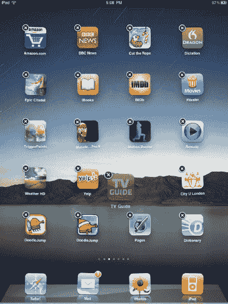

**图 4–11.** *晃动的图标。在此示例中，正在移动的是 TV Guide 应用程序。*

在图标都在晃动时，您可以继续轻扫到新的应用程序页面并重新排列该页面上的应用程序。您还可以在页面之间转移应用程序。只需触摸并按住您想要移动到其他页面的应用程序，并将其拖向该页面所在屏幕的边缘。稍作停顿后，下一个页面将自动滑入，您就可以将应用程序放置到任何想要的位置。如果该页面已满（20 个应用程序），右下角的应用程序将自动被推到下一个页面。

**注意：** 如果您的程序坞中已有六个应用程序，则必须先移走一个，然后才能向程序坞添加新应用程序。与主屏幕页面不同，如果您尝试向已满的程序坞添加新应用程序，程序坞中的应用程序不会自动被推到新页面。

**创建应用程序文件夹：** 在第 2 章中，我们讨论了如何使用 iTunes 在 iPad 上创建装满应用程序的文件夹，但您也可以直接在 iPad 上创建应用程序文件夹。只需触摸并按住一个应用程序图标，直到所有应用程序开始晃动（请参见图 4–11）。它们晃动后，将一个应用程序拖到另一个应用程序图标上并保持不动。一两秒钟后，一个应用程序文件夹就会出现。将应用程序放入文件夹中，使其出现在您按住的那个应用程序图标旁边（请参见图 4–12）。

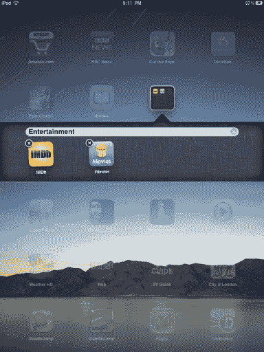

**图 4–12.** *创建一个装满应用程序的文件夹*

您可以按照自己的意愿在这个新文件夹中排列应用程序。您也可以随意命名该文件夹。苹果公司做的一个很酷的事情是让文件夹能够猜测您想要的名称。在图 4–12 的示例中，我们创建了一个包含两个电影应用程序的文件夹。iPad 知道这两个应用程序都与娱乐相关，因此恰当地将其命名为“娱乐”。当然，您随时可以更改文件夹的名称。轻点文件夹外部的任意位置即可返回正常的应用程序屏幕。将任意应用程序拖到现有文件夹中即可将其添加到该文件夹。

文件夹显示为包含多个应用程序图标的灰色方框（请参见图 4–13）。每个文件夹最多可包含 20 个应用程序，并且每个页面上最多可以有 26 个文件夹（页面上 20 个，程序坞中可存放 6 个）。要打开文件夹，只需轻点它，其内容就会展开，同时外部的其他应用程序图标会变暗（请参见图 4–13）。要退出文件夹，请轻点其外部的任意位置。

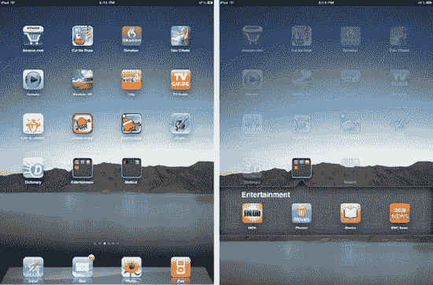

**图 4–13.** *左图：一个包含“娱乐”和“医疗”两个文件夹的应用程序页面。右图：同一个应用程序页面，“娱乐”文件夹已打开。*

**删除应用程序：** 在第 2 章中，我们告诉您如何使用 iTunes 从 iPad 删除应用程序。您也可以直接在 iPad 上删除应用程序。要执行此操作，只需触摸并按住主屏幕上的任意图标，等待它们全部像重新排列应用程序时那样开始晃动（请参见图 4–14）。


**图 4–14.** *应用程序晃动时，轻点 X 即可将其删除。*

注意到有些应用程序的左上角有一个小小的黑白`X`吗？轻点那个`X`将会删除该应用程序。如果您意外从 iPad 删除了一个应用程序，请不要担心。这些应用程序始终存储在您的 iTunes 资料库中，您可以随时重新安装它们。

**注意：** 您无法删除任何 iPad 出厂时安装的 Apple 应用程序。但是，您可以删除自己安装的 Apple 应用程序，例如 Pages、iBooks、Numbers 和 Keynote。

要删除应用程序，只需轻点`X`。屏幕上会出现一个弹出窗口，询问您是否要删除选定的应用程序。您还会看到一条提示，说明删除该应用程序“也将删除其所有数据”，如图 4–15 所示。*这一点很重要！* 如果您在应用程序内创建了新文档或在游戏中获得了新的最高分，但在同步到 iTunes 之前删除了该应用程序，那么与该应用程序关联的任何新数据都将被删除。因此，如果您在 Pages 中创建了新文档，并决定删除 Pages 应用程序，那么如果您在删除 Pages 之前没有同步 iPad，您的新文档将永久丢失。如果您从 iTunes 重新同步 Pages 应用程序，则可以再次获得上次同步之前 Pages 应用程序包含的任何文档。

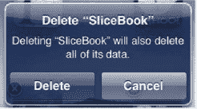

**图 4–15.** *删除警告弹出窗口*

**注意：** 如果您意外删除了一个应用程序并需要立即恢复，但手边没有电脑，您只需使用 iPad 内置的 App Store 应用重新下载该应用程序即可。如果它是付费应用程序，请不要担心；您不会被二次收费。您的 iTunes 帐户知道您已经为它付过费了。

如果您确定要删除应用程序，请继续轻点`Delete`按钮。如果您改变了主意，请轻点`Cancel`。删除应用程序后，页面上所有其他应用程序将移动一个位置以填补被删除应用程序留下的空白。


```markdown
#### 多任务与后台应用管理

随着 iOS 4 的发布，苹果为 iPod touch 引入了多任务功能。多任务意味着您可以同时运行多个应用。换句话说，您可以在 Safari 中浏览网页，同时在后台运行一个即时通讯应用。即使整个 iPad 屏幕都用于显示 Safari 应用，您仍能保持在线状态，并收到来自 IM 应用的新消息通知。

如前所述，要离开某个应用，您需要按下 `Home` 键返回主屏幕，然后找到并点击下一个想要启动的应用图标。借助 iOS 4 内置的多任务功能，您无需每次启动不同应用时都返回主屏幕。现在，无论您处于哪个应用中，双击 `Home` 键都会调出一行当前在后台运行的所有应用（参见图 4–16）。这些应用被称为 *后台* 应用。自开机以来您在 iPad 上启动的任何应用都会作为后台应用运行，直到您彻底关闭它（稍后讨论）。这个后台应用栏是一个非常便捷的功能，但有一个小注意事项：您在那里看到的所有应用可能并非实际在后台运行。苹果还使用这个栏来显示最近使用的应用，因此即使在重启之后，您也可能在栏中看到几个应用，尽管自重启后您并未启动过它们。

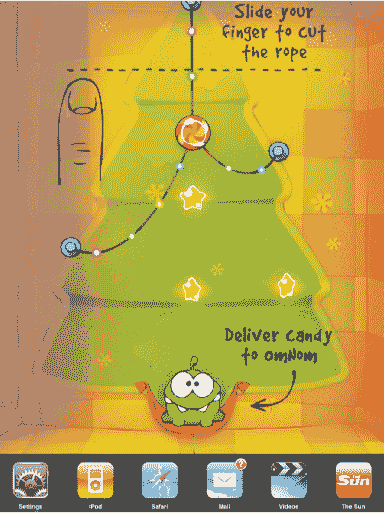

**图 4–16.** *当前我们在玩 Cut the Rope 游戏时，一些正在后台运行的应用。*

在图 4–16 中，您可以看到我们正在玩一个名为 Cut the Rope 的有趣游戏。通过双击 `Home` 键，多任务栏会向上滑动屏幕，您可以在其中滚动查看所有其他打开的后台应用。要查看更多当前运行的后台应用，请在应用行上滑动手指。要快速切换到另一个后台应用，请点击其图标，它将与您当前所在的应用交换位置（参见图 4–17）。


**图 4–17.** *Cut the Rope 应用通过 iPad 的多任务功能与 iPod 应用交换位置*

##### 彻底关闭应用

iPad 的主屏幕允许您通过一次点击启动任何应用。一旦您启动了某个应用，即使您返回主屏幕，它也会在后台保持打开状态。要彻底关闭应用，请双击 `Home` 键打开后台应用栏。在应用行中滑动手指，直到找到您想要关闭的应用。现在长按该应用的图标，直到它和栏中的其他应用开始抖动。您会注意到栏中所有应用的角落出现了带有白色减号的红色圆圈（参见图 4–18）。点击红色圆圈即可关闭该应用。要重新打开应用，您需要再次从主屏幕启动它。

退出应用而不是让它们在后台保持打开状态，可以降低 CPU 使用率，让您的 iPod 温度稍低一些，并减少对电池的压力。

还记得我们提到过苹果也使用这个后台多任务栏来显示最近使用的应用吗？好吧，如果应用没有在运行，点击减号会从栏中移除该最近使用的应用。按照苹果的实现方式，仅通过查看栏，您无法真正分辨哪些应用正在运行，哪些只是最近使用的应用。


**图 4–18.** *点击红色圆圈以彻底关闭应用。*

##### 强制退出应用

iPad 的主屏幕允许您通过一次点击启动任何应用。在应用中时，按下 iPad 的 `Home` 键可以随时返回主屏幕。如果由于某种原因程序挂起且您的 iPad 变得无响应，您可以按住 `Home` 键 6 到 10 秒来退出该程序并返回主屏幕。

**提示：** 在应用内部，许多 iPad 屏幕的左上角会出现一个 `Back` 按钮。点击此按钮可返回应用中的上一个屏幕。这与按下 `Home` 键不同。`Back` 按钮让您在应用内的屏幕之间移动。`Home` 键则离开应用并返回主屏幕。

#### 聚焦搜索

至此，您已经探索了 iPad 主屏幕提供的所有功能，除了一个重要的功能。前面我们提到过，代表应用页面数量的圆点行旁边有一个小的灰色放大镜图标（参见图 4–19）。这个放大镜图标代表了 iPad 强大的搜索功能，名为 `Spotlight`。


**图 4–19.** *每个主页底部都有 Spotlight 放大镜图标（已圈出）*

要访问 `Spotlight`，只需在主屏幕的第一页向右滑动。您会进入一个页面，顶部显示一个小的白色搜索字段，其中包含文字 *Search iPad*。页面底部会显示内置键盘。

只需在搜索字段中输入任何搜索查询，搜索字段与键盘之间的区域就会开始填充结果（参见图 4–20）。


**图 4–20.** *Spotlight 搜索结果页面*

目前，`Spotlight` 还没有达到其应有的强大程度。如果您拥有一台 Mac，您会知道 `Spotlight` 能够搜索文档内容，而不仅仅是文档的文件名。目前，`Spotlight` 只能搜索以下内容：

*   *通讯录*：名字、姓氏和公司名称。
*   *邮件*：收件人、发件人和主题字段。
*   *日历*：事件标题、邀请和地点。
*   *iPod*：歌曲名称、艺术家和专辑。播客和有声读物的标题和名称。
*   *备忘录*：有趣的是，尽管 `Spotlight` 无法搜索电子邮件正文中的文本，但它可以搜索 `Notes` 应用中备忘录的文本。

要选择某个结果，只需点击它，您将自动转到该文档或文件所在的应用程序。在 `Spotlight` 结果的底部，您可以选择在网络上搜索您的查询，也可以搜索维基百科。点击这两个选项中的任何一个都会打开 `Safari` 网页浏览器，并将您带到默认搜索引擎页面或维基百科搜索结果页面。

尽管 `Spotlight` 是一个不错的功能，但它确实有一些局限性。也许最大的限制是您无法搜索电子邮件正文中的文本。此外，`Spotlight` 不够智能，无法识别拼写错误，因此备忘录或电子邮件主题中任何拼写错误的内容都无法被找到。

**注意：** 如果您有几十个应用，无需在所有主屏幕页面中滑动，只需前往 `Spotlight` 搜索应用的名称。当它的图标出现时，点击即可启动它。

##### 聚焦搜索设置

前往 `Settings``General``Home``Spotlight Search`，您会看到一个列表，列出了 iPad 上 `Spotlight` 会搜索的项目。您可以取消选中某些应用，将它们从 `Spotlight` 搜索中排除（例如，点击 `Music` 取消选中，歌曲名称就不会在搜索时出现）。您还可以使用屏幕右侧的抓取图标来重新排列搜索分组出现的顺序。
```


### iPad 设置

iPad 提供了多种设置，允许您自定义 iPad 的工作方式和外观。您可以在 iPad 主屏幕上的“设置”应用中找到所有设置（如图 4–21 所示）。


**图 4–21.** *“设置”应用图标*

轻点“设置”应用，在屏幕左侧会看到 iPad 以及随 iPad 自带的所有苹果 iPad 应用的设置列表（参见图 4–22）。在这些设置下方，您会看到一个“应用”标题。您从 iTunes Store 下载的任何应用，如果具有可自定义的设置，都会出现在此处。若要选择某个应用的设置，请轻点该应用的名称。


**图 4–22.** *通用设置选项*

虽然我们会在本书中更深入地介绍苹果内置应用的各项设置，但首先让我们来熟悉一下 iPad 的“通用”设置。

*   **关于本机**：此处显示您的 iPad 上有多少歌曲、视频、照片和应用程序。它还会显示您的 iPad 总存储容量以及剩余容量。您可以在此找到 iPad 的 OS 版本号、型号和序列号，以及您的 Wi-Fi 和蓝牙 ID。在最底部，您会看到指向苹果法律和监管文档的链接。
*   **声音**：此区域提供一个滑块用于调整 iPad 的音量和设置铃声。它还允许您打开或关闭电子邮件、日历提醒、锁定声和键盘点击音。
*   **网络**：此选项显示您的网络设置。详情请参见第 3 章。
*   **蓝牙**：此选项允许您打开或关闭 iPad 的蓝牙信号。如果您没有在 iPad 上使用任何蓝牙设备，请保持蓝牙关闭。这样可以节省电池电量。
*   **聚焦搜索**：iPad 的聚焦搜索功能的设置。
*   **自动锁定与密码锁定**：正如我们之前所讨论的，您可以在此处配置锁定设置。
*   **访问限制**：如果您与家人共用一台 iPad，或为孩子购买了一台，您可能希望限制他们在 iPad 上的操作。限制设置允许您限制对 Safari、YouTube 和 iTunes Store 应用的访问。此外，您可以限制用户安装新应用和使用定位服务。您还可以选择允许在 iPad 上显示的内容。设置包括限制应用内购买，以及限制访问超过您所选评级的电影、音乐、电视节目和应用。
*   **将侧边开关用于**：设置 iPad 物理侧边开关的功能。可以选择将其设为旋转锁定开关或静音开关。
*   **日期与时间**：此选项允许您选择 24 小时制时钟，以及设置时区和手动设置日期与时间。
*   **键盘**：您可以在此处控制所有键盘设置。我们将在下一节中逐一介绍。
*   **国际**：使用此设置面板选择您偏好的语言以及地址和电话号码的区域格式。
*   **辅助功能**：此处包含针对视障和听障人士的设置。我们将在本章后面详细讨论。
*   **电池百分比**：选择是否在状态栏的电池图标旁显示剩余电池电量的百分比。
*   **还原**：“还原所有设置”可将您的 iPad 设置恢复为出厂默认值。“抹掉所有内容和设置”的作用与“还原所有设置”类似，但还会抹掉您的所有个人数据。此部分还允许您将网络、键盘、主屏幕布局和定位设置重置为 iPad 的出厂默认值。

### 键盘

喜欢您 iPhone 上的触摸键盘吗？但您还没见过真正的厉害之处。当您意识到大屏幕多点触控设备的潜力时，首次使用 iPad 键盘简直是一种顿悟。

如图 4–23 所示的键盘，当您处于任何需要文本输入的应用中时会自动显示。需要注意的是，如果 iPad 已与外部蓝牙键盘配对，则软件键盘不会显示。（请参阅第 3 章了解蓝牙配对详情。）


**图 4–23.** *iPad 的多点触控键盘*

在本节中，我们将介绍如何在每台 iPad 都自带的苹果“备忘录”应用中使用屏幕键盘。

打开“备忘录”，点击右上角的`+`按钮以创建新笔记。在 iPad 屏幕底部，您会看到键盘自动出现（参见图 4–24）。


**图 4–24.** *键盘出现在 iPad 屏幕底部。*

**注：** 在竖屏方向使用键盘时，键盘会较小，但屏幕上能看到更多输入内容。如果切换到横屏方向，键盘会更大，但能看到已输入内容的屏幕空间会减少。您可以试一下，看看哪种方式最适合您。

尽管苹果在设计 iPad 键盘方面已竭尽全力，但许多人仍然认为这是他们新 iPad 上最难适应的地方。转向触摸屏键盘可能很困难，但在相对较短的时间内，情况会大为改观。键盘使用得越多，就越容易使用，这不仅是因为您习惯了，更因为它有一个秘密。

这个秘密就是，如图 4–23 所示的键盘非常智能——智能到可以纠正许多打字错误和手指错位。它会自动将句首字母大写。它会为拼写错误的单词建议更正。它利用预测技术让您更容易按对键。因此，几周之内，您就能掌握键盘的窍门。您还可以使用苹果的 iPad Smart Cover（在第 1 章中提到过）为 iPad 打字提供更好的角度。保护套折叠成一个三角形，形成一个楔形，将 iPad 倾斜到一个舒适的角度，这样您就可以边打字边看着键盘上方的屏幕。保护套的角度有助于避免触摸打字员在 iPad 屏幕键盘上常犯的错误，即将手掌和手指放在屏幕上。

以下是使 iPad 键盘工作的一些关键技术：

**词典**：iPad 内置了一个词典，会在您打字时学习常用词汇（参见图 4–25）。它还会从您的通讯录中获取姓名和拼写。这意味着随着数据的积累，它猜中您意图的能力会越来越强。


**图 4–25.** *iPad 从您的通讯录中学习单词和姓名的示例*

**自动纠正**：当您打字时，iPad 会查找与您正在输入的内容相似的单词并进行猜测，并将猜测结果显示在您正输入的单词下方（参见图 4–26）。要接受建议，只需轻点空格键，完整的单词就会被插入。


**图 4–26.** *iPad 自动纠正功能的示例*

**拼写检查**：如果您确实拼错了一个单词，或者 iPad 无法识别它，您会看到该单词下方出现一条红线。当您轻点该单词时，其上方会显示一个或多个替代拼写（参见图 4–27）。只需轻点正确的单词，它就会自动插入到文本中。


**图 4–27.** *iPad 拼写检查功能的示例*

**预测映射**：iPad 利用其词典来预测您即将输入哪个单词。然后，它会重新调整键盘的响应区域，使您更容易按对字母。可能性高的字母会获得更大的点击区域；可能性低的字母则会获得较小的点击区域。


#### 更多键盘

以为 iPad 只有一个键盘？再想想。它有十几款键盘（不同语言）。还有两个你会经常从屏幕主键盘上访问的键盘。

在主键盘上（如之前图 4–23 所示），你会注意到 Shift 键旁边的逗号、感叹号、问号和句号。下方是 `.?123` 键（在某些应用中它是 `@123` 键）。轻点 `.?123` 键会自动将你的 QWERTY 键盘切换为带有更多标点符号的数字键盘，其中包含“撤销”选项和另一个标有 `#+=` 的键盘修饰键（见图 4–28）。

**提示：** 你不需要用“撤销”按钮来撤销操作。只需摇晃你的 iPad 即可。（别太用力！你不想显得像丢了魂似的！）屏幕上会出现一个撤销弹出窗口，让你选择撤销上一步操作或取消撤销。


**图 4–28.** *`.?123` 键盘*

轻点 `#+=` 键会进入第三个键盘，其中包含更多标点符号和一个“重做”按钮（见图 4–29）。重做功能（如果应用支持）会重复上一步操作。所以，如果你复制并粘贴了文本，轻点重做按钮会再次粘贴文本。


**图 4–29.** *`#+=` 键盘*

#### 入门指南

当你刚开始使用 iPad 时，请先慢慢打字。由于设备尺寸，手持 iPad 打字可能会有些困难。为了获得最佳打字体验，请将 iPad 放在桌子上或搁在腿上。起初，你可能需要用双手的食指来打字，但用得越多，你就会越像在实体键盘上打字。无论使用哪种方法，务必保持适当的速度，以便能跟踪自己输入的内容并随时更正。以下是一些打字技巧：

*调出键盘*：要打开键盘，请轻点任意可编辑文本区域。

*关闭键盘*：要关闭 iPad 的键盘，请轻点右下角的按键（你可以在图 4–23、4–28 和 4–29 中看到这个键）。它是一个带有键盘图标和向下箭头的按钮。要重新调出键盘，只需再次轻点任意可编辑文本区域。

*接受或拒绝自动更正*：iPad 会在你正在输入的单词下方显示建议的更正，如前文图 4–25 所示。要接受建议，请轻点空格键。（你无需打完整个单词；iPad 会为你自动填入。）要拒绝更正，请轻点该单词本身。即使你按下空格键，iPad 也不会进行替换。

*使用放大镜*：打字时，你可以使用 iPad 内置的放大镜功能来调整光标位置，如图 4–30 所示。将手指按住文本区域的某处，直到放大镜出现。然后，利用放大视图将光标拖拽到所需的确切位置。


**图 4–30.** *放大镜让你能精准定位光标位置。*

**注意：** 如果你打算在 iPad 上进行大量打字（例如写一本书），你可能需要考虑购买 iPad 键盘底座或我们在第 3 章中提到的 Apple 蓝牙键盘。实体键盘能将 iPad 变成更接近传统电脑的形态。此外，如果你是盲打用户，在实体键盘上打字可能会快得多，因为你能感受到按压感和听到敲击声。你也不限于使用 Apple 蓝牙键盘。多款第三方键盘也与 iPad 兼容。请联系制造商了解其蓝牙键盘的功能。

#### iPad 打字技巧

一旦你掌握了键盘的使用，iPad 还提供了其他几种让打字更轻松的方法。本节介绍了一些便捷的 iPad 打字技巧。

##### 缩略形式

当你想输入像 *can’t* 或 *shouldn’t* 这样的缩略形式时，不必费心输入撇号。iPad 足够智能，能猜到 *cant* 就是 *can’t*（图 4–31）。当然，如果你是在谈论英国盗贼的隐语，请务必轻点该单词拒绝将名词改为缩略形式。

当你输入像 *we’ll* 这样的词时，其非缩略形式 *well* 是一个常见词，请多加一个字母 *l*。iPad 会将 *welll* 更正为 *we’ll*，将 *shelll* 更正为 *she’ll*。


**图 4–31.** *“Cant” 变为 “Can’t”。*

**提示：** 其他缩略形式技巧包括 *itsa*，它会被更正为 *it’s*，以及 *weree*，它会被更正为 *we’re*。

##### 标点符号

在句子末尾时，轻点标点符号键，然后轻点你想使用的项目（例如问号或句号），最后轻点空格键。iPad 足够智能，能识别出句子末尾并将你带回字母模式。在常规打字过程中，你也可以双击空格键来添加句点后跟空格。这个双击技巧可以通过 `设置`  `通用`  `键盘`  `“.” 快捷方式` 来控制。

##### 重音符号

长按任意键盘字母键，可查看该字母的变体形式。例如，长按 *e* 会显示添加 e、é 或 ê 的选项（以及其他重音符号），如图 4–32 所示。这个快捷方式让输入外来词变得容易得多。要选择非英语键盘，请前往 `设置`  `通用`  `国际`  `键盘`，然后从 iPad 长长的外语变体列表中进行选择。


**图 4–32.** *iPad 处理重音符号非常专业。*

##### 大写锁定

要启用大写锁定功能，请前往 `设置`  `通用`  `键盘偏好设置`。当此功能启用时，你可以双击 Shift 键来切换锁定开关。

##### 单词删除

当你按住 Delete 键时，iPad 开始时逐个删除字母，然后继续。但如果你按住的时间超过大约一行文本的长度，它会切换到单词删除模式，并开始一次删除整个单词。

##### 自动大写

自动大写功能意味着 iPad 会自动将句子开头的单词大写。因此，你可以输入 *the day has begun*，iPad 足够智能，会将 *the* 大写，变成 *The day has begun*。这意味着你无需担心在每句开头按 Shift 键，甚至输入 *i* 时也不用，因为 *i went to the park* 会变成 *I went to the park*。在 `设置`  `通用`  `键盘偏好设置` 中启用或禁用自动大写。


### 拷贝与粘贴

苹果设计了一种简单直观的方式，用于选中单词或文本块、拷贝它们，然后粘贴到其他位置。

让我们从 iPad 的 Safari 浏览器中拷贝一些网页文本。在拷贝一个单词前，需要先选中它。方法是：手指长按一个单词，将会弹出一个黑色上下文菜单，提供`Select`（选择）和`Select All`（全选）选项。`Select`会仅高亮这个单词，`Select All`则会高亮页面上所有文字。无论选择哪个，被选文本的首尾都会出现调整手柄（见图 4-33）。利用这些手柄，你可以调整选中的文本范围。


**图 4-33.** *利用调整手柄，您可以选中单个单词、一句话或整个段落进行拷贝。*

**注意：** 如果你是在可编辑文档中选中了文本进行拷贝，会看到一个包含`Cut`（剪切）、`Copy`（拷贝）或`Paste`（粘贴）的上下文菜单。选择`Cut`会移除文本，选择`Copy`会拷贝文本，如果已有拷贝的文本，则可粘贴覆盖当前选中内容。

选中文本后，会看到另一个包含`Copy`的上下文菜单。点击`Copy`即可拷贝文本，此后在任何支持文本输入的 App 中都可以使用这段拷贝的内容。

现在回到“备忘录”App 中的笔记。要粘贴从 Safari 拷贝到笔记中的文本，只需手指长按屏幕直至出现放大镜图标。使用放大镜将光标调整到要插入拷贝文本的位置，然后松开手指。此时会弹出一个包含三个选项的上下文菜单：`Select`、`Select All`和`Paste`。点击`Paste`，拷贝的文本便会立即插入（见图 4-34）。


**图 4-34.** *只需点击“粘贴”，文本即可自动插入。*

### 撤销与重做

如前所述，iPad 键盘配备了撤销和重做按钮。点击撤销按钮可撤销上一步操作。因此，如果你拷贝并粘贴了文本，点击撤销按钮会撤销粘贴操作，但文本仍保留在剪贴板中。请记住，你也可以摇晃 iPad 来显示一个撤销弹出窗口，询问你是否要撤销上一步操作。

如果应用支持，`Redo`（重做）会重复上一步操作。因此，如果你拷贝并粘贴了文本，点击重做按钮会再次粘贴文本。

### 辅助功能

苹果希望确保每个人都能尽可能轻松地使用 iPad。为此，苹果提供了辅助功能来帮助残障人士使用 iPad。我们在第 2 章的 iPad iTunes 设置面板中简要提及了 iPad 的辅助功能选项。然而，iPad 的辅助功能远不止设置面板中显示的那些。要查看所有辅助功能选项，请点击 iPad 主屏幕上的`Settings`（设置）图标。在`General`（通用）设置下，点击`Accessibility`（辅助功能）。`Accessibility`设置便会滑入屏幕（见图 4-35）。下面我们逐一介绍这些设置。


**图 4-35.** *“辅助功能”设置*

#### 旁白

开启`VoiceOver`（旁白）后，用户只需触摸屏幕，就能听到手指下方内容的语音描述。然后双击即可选中该项目。启用`VoiceOver`后，当用户收到新电子邮件时，iPad 会语音提示，甚至可以朗读邮件内容给用户听。

#### 缩放

`Zoom`（缩放）功能帮助视力不佳的用户放大整个屏幕。这与 iPad 常规软件中的捏合缩放功能不同。辅助功能中的`Zoom`会放大屏幕上的所有内容，使用户甚至能放大最小的按钮。选择此选项后，用户可以用三根手指双击 iPad 屏幕的任何位置，屏幕会自动放大至 200%。屏幕放大时，必须用三根手指拖动或轻扫。此外，当切换到新屏幕时，缩放位置总会回到屏幕顶部中央。

#### 大文本

此功能可让你增大`Contacts`（通讯录）、`Mail`（邮件）和`Notes`（备忘录）中的文本字号。你可以选择 20 磅、32 磅、40 磅、48 磅和 56 磅等字号。

#### 白底黑字

对于某些有阅读障碍的人来说，反转电脑屏幕的颜色使其看起来像照片底片，有助于他们更好地阅读文本。开启`White on Black`（白底黑字）即可实现此效果。

#### 单声道音频

选择`Mono Audio`（单声道音频）后，左右扬声器的立体声将合并为单声道（单一）信号。此选项让一只耳朵有听力障碍的用户能用另一只耳朵听到完整的音频信号。

#### 自动朗读文本

开启此选项后，任何自动纠正的文本（例如键入时出现的拼写检查弹出窗口）都会被朗读出来。

#### 连按三次主屏幕按钮

如果你与残障家人共享一台 iPad，选择此选项后，用户可以通过连按三次 iPad 实体`Home`按钮，快速开启或关闭`VoiceOver`、`Zoom`或`White on Black`（图 4-36）。你也可以将其设置为：连按三次`Home`按钮时，屏幕上会弹出一个窗口，询问要开启哪项辅助功能。


**图 4-36.** *“辅助功能选项”弹出窗口*

**注意：** 除了连按三次`Home`按钮功能外，所有这些辅助功能设置也可以在 iPad iTunes 设置面板的`Summary`（摘要）标签页中进行配置（参见第 2 章）。

### 本章小结

本章探讨了你与 iPad 交互的所有方式，从点按、按钮到捏合。你了解了触摸屏以及如何与之交互。你学会了如何进入主屏幕、如何锁定屏幕以及如何重新排列图标。你探索了 iPad 的“通用”设置，并学习了使用 iPad 虚拟键盘和设置辅助功能的技巧。简而言之，本章向你介绍了你和 iPad 相互沟通的所有基本方式。以下是一些关键要点供你铭记：

*   积累你的 iPad 交互操作词汇表。你会惊讶地发现，像双指点按这样较少使用的手势，常常能证明其有用性。
*   如果在数据安全至关重要的区域使用 iPad，请务必设置密码锁。
*   `Spotlight`是 iPad 上强大的搜索工具，为你提供了快速启动应用的另一种方式。
*   iPad 支持十多种键盘语言以及实体硬件键盘。
*   不必担心在 iPad 上打字不完美。它的智能键盘会自动纠正你大部分的错误。
*   有残障并不意味着你不能使用 iPad。iPad 提供了许多辅助功能来帮助有视力或听力问题的人。

## 第 5 章


