# 连接互联网

尽管从理论上讲，你的 iPad 可以在不与外界建立真实连接的情况下离线使用，但它本质上就是为接入互联网而设计的工具。它内置了 Wi-Fi 或 Wi-Fi + 3G 连接功能，并且大多数默认应用如果没有某种互联网连接都将毫无用处。

没有互联网，你就不需要用`邮件`来收发信息，`Safari`网页浏览器也就没有了用武之地。你将无法查看地图，YouTube 只会变成一个在主屏幕上占用空间的平淡图标，你也不能从`App Store`购买应用、从`iBookstore`购买图书、或者从`iTunes`购买音乐、电影和视频。Facebook 和 Twitter？没有网络连接就别想了。

幸运的是，苹果公司让你连接互联网变得很简单。在本章中，我们将告诉你如何通过 Wi-Fi 和 3G 建立互联网连接并解决相关问题，还会讨论一种替代内置 3G 的方案。

### 连接 Wi-Fi

Wi-Fi 是基于 IEEE 802.11 标准的无线网络的通用名称。尽管 Wi-Fi 起源于 20 世纪 90 年代初，但它真正腾飞是在过去的十年里，如今在酒店、图书馆、餐厅，甚至公交车和飞机等许多公共场所都能找到 Wi-Fi 接入点。

对许多人来说，Wi-Fi 接入点是家庭网络的福音，因为它意味着计算机和打印机无需安装电缆（既昂贵又不便）就能相互连接。在大多数情况下，Wi-Fi 路由器直接连接到家庭有线或 DSL 互联网调制解调器，为范围内的任何计算机提供无线网络。

你的 iPad 支持 802.11b/g/n 标准下的 Wi-Fi 连接。你无需了解这些标准各自的具体含义，只需知道最大原始数据速率（数据传输到 iPad 的速度）会随着标准的演进而提高。iPad 和 Wi-Fi 路由器将基于双方共同支持的最高标准进行通信，因此，如果你的 Wi-Fi 路由器只支持 802.11b，那么两个设备之间的通信速率将限制在 802.11b 的速度。同样，如果你拥有最新的 Apple AirPort Extreme Wi-Fi 路由器之一，你的 iPad 将使用快速的 802.11n 标准实现与其通信。

#### 认证与加密

所有 Wi-Fi 网络的一个重要因素是使用加密。加密网络要求在首次加入网络时输入密码或口令。密码不仅用于验证你的 iPad 对网络的访问权限——本质上确保你被允许使用该网络——还用作加密 iPad 与路由器之间传输的任何数据的密钥。

认证和加密对于任何无线网络都至关重要。在你的家庭或办公网络上设置认证，可以确保未经授权的人无法在你允许的情况下使用你的无线网络。这一点很重要，因为向任何恰好处于该区域的人提供你的互联网连接访问权限，可能被视为违反许多互联网服务提供商的**服务条款**。此外，如果有人在你知情或不知情的情况下，通过连接到你的无线网络的计算机实施了犯罪，你可能需要承担责任。

同样，加密使得黑客难以拦截和解码你的 iPad 与其他任何计算机之间的交易。当你进行货币交易时，这一点极为重要。目前，大多数家庭、办公和公共 Wi-Fi 网络上存在三种主要的加密类型：`WEP`、`WPA` 和 `WPA2`。`WPA2` 是 `WPA` 加密标准的后续版本，被认为（与强口令一起使用时）极其安全。

为什么我们在一本关于 iPad 的书中讨论认证和加密呢？嗯，如果你不熟悉 Wi-Fi 网络，当你尝试将 iPad 连接到网络时，这个话题肯定会碰到。

#### 设置 Wi-Fi

你的 iPad 不会在打开电源后自动连接到互联网。为什么？苹果公司希望你先设置与 `iTunes` 的同步，而这总是通过 USB 连接到另一台计算机来完成的。完成设置后，你就可以自由地连接互联网了，对大多数人来说，初次连接是通过 Wi-Fi 完成的。

你需要知道你的网络密码或口令，以及你想连接的网络的名称。如果你住在一栋有许多无线网络覆盖的公寓楼里，知道网络名称可能非常重要。屏幕上会弹出一个窗口，要求你输入网络密码，一旦你正确输入，你就连接到了该网络。

在图 5-1 中， iPad 范围内有两个网络。锁形图标表示你需要输入密码或口令才能连接到该网络，而 AirPort 图标（锁形图标右侧的扇形图标）表示该网络的相对信号强度。

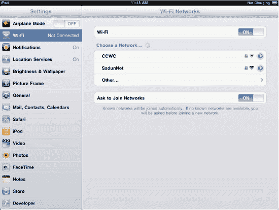

**图 5-1.** *在仅有 Wi-Fi 功能的 iPad 上的“设置”应用中，顶部的开关允许你打开或关闭 Wi-Fi 设置。*

要输入密码并加入网络，请点击网络名称，随后会出现一个密码屏幕。输入你的密码或口令，然后点击 iPad 虚拟键盘上的`加入`按钮。如果你输入的密码正确，网络名称会变为蓝色并出现一个对勾标记，表示它是选中的网络。如果你没有输入正确的密码，你将看到类似于图 5-2 中的错误信息。点击`忽略`按钮，然后重试。

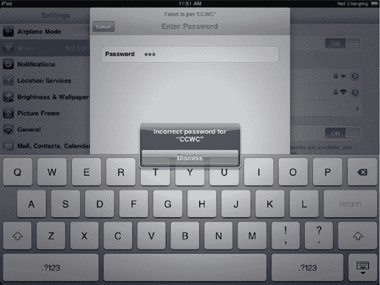

**图 5-2.** *看起来有人在这里输错了密码。点击“忽略”重试。*

如果你的 iPad Wi-Fi 未启用，你可以通过进入`设置`  `Wi-Fi`，并将标记为`关闭`的按钮滑动到显示为`打开`的位置来开启它。

你的 iPad 会记住你加入过的网络，这样你每次移动到新的无线网络时就不必重新输入网络信息。如果附近没有已知的网络，你要么需要手动选择新网络，要么会被询问是否要加入一个新网络。有什么区别？这完全取决于`询问是否加入网络`按钮（见图 5-1）是否设置为`打开`。如果未设置，你必须手动选择网络；如果设置了，你的 iPad 会询问你是否要加入新网络。

当你连接到 Wi-Fi 网络时，状态栏中的 Wi-Fi 图标会显示你的连接强度。条数越多（最多五条）表示连接越强。

#### 解决 Wi-Fi 连接问题

新 iPad 用户可能会遇到一些常见问题。以下简要讨论一些你可能遇到的典型问题。

##### 没有显示网络名称

在这种情况下，网络可能是封闭或私有的，这意味着服务集标识符（SSID），即通常在“选择网络”列表中看到的网络名称，已被设置为隐藏。要连接到该网络，你需要点击“其他”按钮（如前文图 5-1 所示），这会显示图 5-3 中的屏幕。

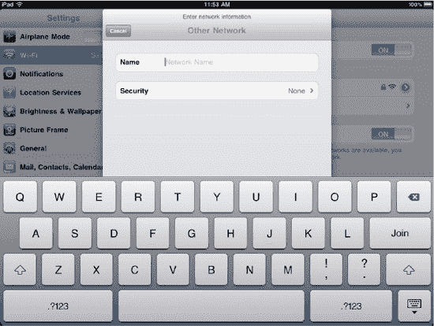

**图 5-3.** *在企业环境中使用 iPad 时，输入关于隐藏网络的信息非常有用。*

请向你的网络管理员询问网络名称，并将其输入到“名称”字段中。同时，建议向他们询问网络设置了哪种安全类型，因为你需要通过点击“安全”按钮，然后在“安全”屏幕（如图 5-4 所示）上点击对应的按钮来进行选择。

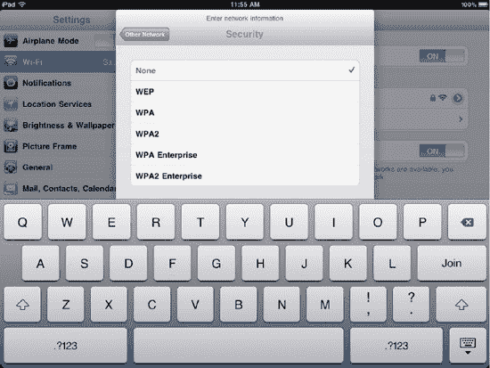

**图 5-4.** *iPad 使用设置来定义加密的类型和级别，以防止你的数据被窥探。*

这些缩写词代表什么？有线等效保密（`WEP`）是一种老旧的无线网络安全方法。那么，为什么崭新的 iPad 上还提供 `WEP`？它主要是为了那些尚未将 Wi-Fi 接入点升级到更新、更安全技术的用户而存在的。

`WPA` 代表 Wi-Fi 保护接入，这是另一种老旧的安防技术。`WPA Enterprise` 是一种标准加密算法，并增加了使其在企业使用中更“防弹”的特性。

如果可能，你应该使用 `WPA2` 或 `WPA2 Enterprise` 安全协议，以确保你的数据在传输过程中得到保护。`WPA2` 是目前最安全的现有 Wi-Fi 安全方法。建议使用真正随机的 13 个或更多字符的密码短语以获得更好的安全性，尽管使用更长但更容易记住的密码短语可能更实用。

“容易记住”是什么意思？指的是你*自己*能轻松记住，但别人却很难猜到的内容。例如，密码短语“`ilovemydogfredandhesmyfavoritepet`”或者甚至“`ilmdfahmfp`”（即同一短语中每个单词的首字母）比“`X1F39%@233.abc$@#@`”要容易记住得多。

一旦你输入了网络名称和安全类型，系统会要求你输入密码或密码短语，然后你就可以继续连接到网络了。

##### “输入密码”屏幕中的“加入”按钮呈灰色

这意味着你输入的密码对于该网络启用的安全类型来说太短了。请确保你拥有正确的密码，然后重试。

##### 你刚刚设置了 Wi-Fi 路由器，但不知道密码

某些 Wi-Fi 路由器有默认密码。你可以联系制造商网站查找默认密码，或者将密码更改为你能记住的内容。为了维护网络安全，建议采用后一种解决方案。

##### 信号强度只有一格，或者看不到你的 Wi-Fi 网络

Wi-Fi 接入点和路由器的覆盖范围有限，尤其是当附近有混凝土墙、布有大量电线或管道的墙壁，或者在使用微波炉时。要么靠近 Wi-Fi 接入点，要么尽量避免干扰源。

##### 你在公共场所，一个网页要求你登录网络

这在公共 Wi-Fi 网络中很常见，包括美国星巴克门店的 AT&T 无线热点。如果你所在的位置需要付费使用 Wi-Fi，可能会出现一个登录屏幕，你需要在其中输入订阅信息或购买访问时长。如果该屏幕没有出现，请打开 iPad 上的 Safari 浏览器，该屏幕应该会显示。

##### 你的 Wi-Fi 连接显示满格信号，但无法连接到互联网

请确保你连接的是正确的 Wi-Fi 网络，而不是附近的其他网络。如果你正尝试连接到正确的 Wi-Fi 网络，那么从你的 Wi-Fi 接入点或路由器到电缆或 DSL 调制解调器的连接可能已中断。如果该连接看起来正常，那么问题可能出在你的互联网服务提供商身上。你可以通过检查你所在位置的其他电脑是否能成功上网来测试这一点。

##### 所有 Wi-Fi 网络都具有相同的名称

这比你想象的要更常见。许多人购买了 Wi-Fi 接入点或路由器后，从未更改过出厂设置中的名称。在人口密集区域，看到许多名为“Linksys”的网络并不罕见。如果你遇到这种情况，请联系路由器制造商，获取有关如何为你的 Wi-Fi 网络设置唯一名称的信息。

##### 以上解决方案均无效

也许是时候重置 iPad 上的网络设置了。要重置网络设置，请依次轻点“设置”“通用”“还原”“还原网络设置”。此时会弹出一个对话框，警告你将删除所有网络设置，并将其恢复为出厂设置。轻点“还原”。这将重启你的 iPad，当它重新启动后，所有已保存的网络、Wi-Fi 密码以及其他设置都将消失。请尝试再次查找并加入网络。

如果你仍然无法连接到你的网络，请尝试查看你的 iPad 是否能连接到公共可用网络。例如，如果你附近有 Apple Store 零售店，可以尝试连接到他们的网络。如果这样也不行，你至少可以去 Apple 天才吧咨询一下。

#### 特殊 Wi-Fi 设置

对大多数人而言，默认的 Wi-Fi 设置已经足够完美。然而，在某些情况下，你可能需要连接一个要求特殊设置的网络。这时，系统可能会提示你更改 iPad 上的这些设置。

你可以通过进入`设置` → `无线局域网`，然后点击网络名称右侧的蓝色箭头图标，来访问特殊的 Wi-Fi 设置。此时会显示一个更加详细的网络设置列表（图 5–5）。

你可能需要更改的第一项内容是 iPad 获取互联网协议（IP）地址的方式。大多数情况下，这是通过一种名为动态主机配置协议（`DHCP`）的方式完成的。当你的 iPad 设置为使用 `DHCP` 获取网络地址时，它会在加入网络时请求一个地址，然后获得一个持续一定时间的“租约”。该租约通常会自动续订。如果你需要手动续订 `DHCP` 租约，可以在`设置`屏幕的 `DHCP` 选项卡上找到一个`续租`按钮，点击即可执行。

另一种获取 IP 地址的方式是通过引导协议，即 `BootP`（图 5–6）。`BootP` 选项卡显示的信息可能需要更改，以便你的 iPad 从配置服务器上注册的地址池中获取一个地址。

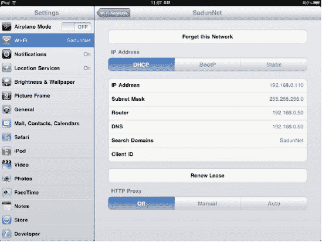

**图 5–5.** *你可能永远不需要更改或查看你的网络设置。但在必要时，你可以在此处控制这些设置。*

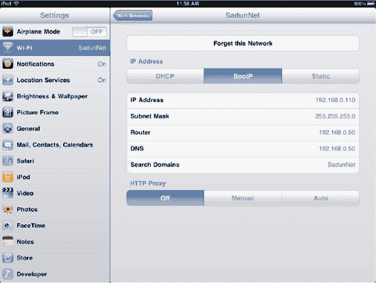

**图 5–6.** *BootP 配置显示界面*

最后，一些网络需要固定（即*静态*）IP 地址（图 5–7）。在这种情况下，你通常会得到一个静态 IP 地址、一个子网掩码以及路由器和 DNS 服务器的地址，你需要将这些信息输入到相应的字段中以连接网络。请提前与你的系统管理员核实以获取这些值。

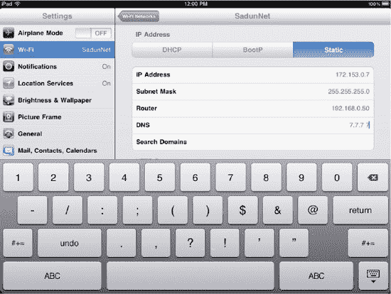

**图 5–7.** *iPad 上的静态 IP 设置*

在`设置`屏幕的每个选项卡（`DHCP`、`BootP` 和 `静态`）上，你都会找到三个用于 `HTTP 代理`的按钮。这些按钮在图 5–5 和 5–6 中可见。在图 5–7 中，`HTTP 代理`部分被键盘遮挡住了。*代理服务器*是一种计算机系统，充当你的计算机与其他服务器之间的中介。例如，许多公司要求所有来自计算机的网络流量必须通过代理服务器，以便进行日志记录或使用审核。如果你需要输入代理信息，你的系统管理员会就所需的设置给出说明。

### 通过 3G 连接

iPad 分为仅 Wi-Fi 型号和 Wi-Fi + 3G 型号。目前在美国，AT&T 和 Verizon 都提供 3G 型号。在美国以外，其他运营商根据不同国家/地区部署提供 3G 蜂窝数据服务。

3G 是一个移动电信标准系列，可同时支持语音和数据服务。苹果在其电话产品（iPhone 系列）和 iPad Wi-Fi + 3G 中选择了遵循全球移动通信系统（GSM）标准。该标准在全球移动电话系统中占主导地位，这意味着具备 3G 功能的 iPhone 和 iPad 可以在全球范围内使用，尽管国际数据漫游通常非常昂贵。

3G 的带宽通常比 Wi-Fi 更有限，但 3G 的价值在于，只要有 3G 系统覆盖的地方，几乎都可以使用数据服务。这意味着你通常可以在旅途中使用 3G 服务，而不仅仅是在本地 Wi-Fi 热点（例如你的家、办公室或提供互联网连接的咖啡馆）使用时。Wi-Fi 仅限于短距离、高带宽的连接；而 3G 则是广覆盖但较低带宽的连接。

你能用 3G 连接做什么呢？很多。在配备 3G 的 iPad 上，你可以相当快速地浏览互联网、通过电子邮件向朋友发送照片甚至小视频、观看 YouTube 视频，以及（正如你将在第 8 章中发现的）购买和下载应用、音乐和书籍。

你通过 3G 服务获得的移动性是有代价的。你需要注册一个蜂窝数据套餐，通常以按月预付的方式提供。预付费服务意味着你需要在月初为服务付费，而不是在月末，后者是 iPhone 上更常见的服务提供方式。这也意味着你可以随时取消，因为你已使用的月份已经通过信用卡扣费。

如果你使用 iPad 的大部分时间是在有 Wi-Fi 服务的办公室或家中，并且你只打算在旅途中偶尔使用 3G 服务收发邮件，那么一个配额更少、带宽更低的套餐可能就适合你。如果你发现低级别的数据套餐限制太多，大多数国家和运营商都提供带宽更高的高级别套餐。套餐和带宽因运营商而异，因此你需要根据自己的所在国家和所购 iPad 型号做一些研究。例如，在美国，你不能将为 Verizon 准备的 iPad 服务切换到 AT&T 服务。由于 iPad 连接蜂窝数据网络的方式，硬件会将你限制在某个运营商。

在注册月度套餐后的任何时间，若要查看你的 3G 使用情况，请进入`设置` → `蜂窝数据` → `查看账户`。这些信息，以及运营商在你接近数据使用量上限时发送的提醒，对于密切关注你实际消耗了多少兆字节非常有帮助。

#### 设置 3G

有一种非常简单的方法，无需查看包装盒就能知道你手上的是 Wi-Fi + 3G 版 iPad：当你打开它时，状态栏的左侧会显示 3G 运营商的名称以及你所在位置的信号强度（图 5–8）。

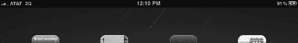

**图 5–8.** *支持 Wi-Fi + 3G 的 iPad 会在状态栏左侧显示运营商名称和信号强度，以及网络类型（3G、EDGE）。*

设置你的 3G 数据套餐非常快捷，并且只需要一张信用卡。在 iPad 开机状态下，轻点 `设置`  `蜂窝数据`。如果 3G 尚未开启，将 `蜂窝数据` 按钮滑动到 `开` 即可激活内置的无线电模块。如果尚未设置蜂窝数据账户，系统会要求你在 iPad 上直接选择套餐并注册服务。注册的详细信息因运营商而异，但通常你需要输入名字和姓氏、联系电话号码、有效的电子邮件账户以及信用卡信息。

继续填写表单，你将看到服务条款。如果需要，请仔细阅读，然后轻点 `同意` 按钮以继续流程。服务条款同样因运营商而异。

部分运营商还允许你添加一次性的国际套餐。这些套餐费用非常昂贵。请确保你计划前往的国家/地区受该国际套餐支持。选择你希望开始使用国际套餐的日期，然后轻点 `完成` 按钮。如果你近期没有出国旅行的计划，请不要选择任何套餐，直接轻点 `完成` 以继续。

通常，在注册数据套餐几分钟后，iPad 显示屏上会出现一条通知（图 5–9），告知你数据套餐已激活。这表示你已经可以带着 iPad 在城里自由活动，不再受限于需要靠近 Wi-Fi 热点。在美国，如果你现在成为了 iPad 数据客户，根据你所订阅的服务，你将可以在任意 AT&T 或任意 Verizon 热点免费使用 Wi-Fi。

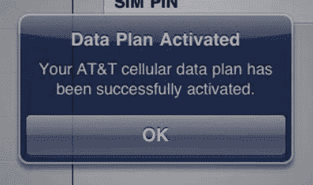

**图 5–9.** *恭喜！你的 iPad 现已准备好通过 3G 与世界连接。*

#### 数据漫游

当你国际漫游使用 iPad 时，了解你的国际套餐使用的是哪家或哪些蜂窝网络公司，以及如何关闭数据漫游，这是非常明智的做法。如果开启了数据漫游，你的设备可能会连接到与你的国内运营商没有合作协议的蜂窝网络运营商，这种情况下你将面临更高的收费。要禁用数据漫游，请选择 `设置`  `通用`  `网络`，并将数据漫游选项切换到 `关`。

对于像 AT&T iPad 2 这样的 GSM iPad，请查询你所在运营商的国际漫游合作伙伴。访问运营商的网站，查找其合作伙伴运营商、所使用的技术以及频率。

如果你携带的是 Verizon iPad 旅行，其 CDMA 服务使得连接本地数据变得更加困难。因此，你可能会考虑租用一个小型的移动 Wi-Fi 设备，例如 Novatel Wireless MiFi 热点。MiFi 热点能提供便携式网络，你可以通过 GSM 或 CDMA 的 iPad 或笔记本电脑连接到该网络，而不需要使用 iPad 内置的数据服务。你无需在 iPad 上开启数据漫游，即可通过 MiFi 的蜂窝数据访问互联网。

XCom Global 是一家提供 MiFi 设备国际租赁的供应商。每天大约花费 18 美元，你就可以获得本地数据访问权限，这些数据可以通过 Wi-Fi 轻松提供给你的 iPad 或笔记本电脑。当然，你也可以直接购买自己的设备，然后在旅途中寻找 SIM 卡；但对于许多旅行者来说，使用一个开箱即用、预先配置好的设备是一个很大的优势。

覆盖区域和预期带宽各不相同。例如，在阿联酋，你可以期望获得 7.2Mbps 的速度，但在关岛可能只有 1Mbps。请查看 XCom 网站的覆盖地图，以确保你访问的区域能够提供服务。

如果你在多个国家之间旅行，你可以通过 XCom Global 设置多个设备租赁。从你开始旅行之日起，到返回美国之日止，每天都会按日费率计费。该公司的常见问题解答页面解答了许多关于其服务的常见问题。

旅行期间，你的数据用量是无限的。那么，“无限”数据意味着什么？请查看 XCom 的“公平使用”条款。不同国家的供应商可能会对数据用量大的用户设置使用上限或限制带宽，但对于正常的计算需求（假设你不是每天下载几个千兆字节大小的电影），通常都在保障范围内。

如果租用 7 天，XCom 会提供免费送货（通常 FedEx 2Day 服务需要 29.90 美元；如需隔日送达，需额外付费）。如果租用时间超过 14 天，日费率将降至每天 16.15 美元。你还需要考虑的一件事是，是否增加每天 2.50 美元的电池续航包选项。MiFi 在始终保持开启状态时效果最佳——电池续航包提供了一种避免频繁开关机的方法（尽管它会变得相当热，所以务必将其放在通风的包或口袋中）。或者，你也可以自带电池组。

我们推荐 ZAGGsparq 电池组。这款售价 100 美元的设备具有国际适配能力，支持使用 220V 电源充电；你无需电压转换器，简单的插座适配器即可。这将为你节省租赁费用，并且即使在家时也能提供方便的移动电源（据称可为 iPad 充电四次）。

此外，你也可以考虑购买保险。每天大约 4 美元，它最多可覆盖三台设备，让你不必过于担心扒手和设备丢失问题。有了保险，每台设备你只需支付 160 美元的免赔额，而不是 XCom 通常收取的 800 美元。三台设备总计 480 美元，这比你需支付的 2400 美元要少得多。

所有这些费用加起来确实不菲，每天大约 25 美元，还不算可能的运费，但作为商务支出，与你将在机票、酒店、餐饮和杂项上的花费相比，这相对较少。毫无疑问，这比支付漫游数据费用要划算得多。

总结本节内容，当您携带 iPad Wi-Fi + 3G 出国时，需要了解的关键事项是：关闭数据漫游，并做到“出发前先了解”。

#### 更改账户信息或增加数据流量

你的 iPad 会在你即将接近数据套餐的带宽限制时非常贴心地提醒你。它会分别在你剩余 20%、剩余 10% 以及套餐流量用尽时通知你。你可以选择在此之后停止使用数据、购买另一个数据套餐，或者（如果运营商提供此选项，则视具体运营商而定）升级你的套餐以获得更高的带宽配额。

要升级你的数据套餐、更改信用卡、编辑地址信息或购买国际数据套餐，请选择 `设置`  `蜂窝数据`。轻点 `查看账户` 按钮，即可在 iPad 上立即进行任何更改。

#### 飞行模式

当你带着一台 Wi-Fi + 3G 版 iPad 乘坐飞机时，实际上等于随身携带了一部大型手机。虽然如今航空公司对 Wi-Fi 友好得多，许多航班甚至提供机上 Wi-Fi 服务，但飞行途中使用 3G 和其他移动网络连接仍然不被允许。

与 iPhone 类似，Wi-Fi + 3G 版 iPad 具备切换至飞行模式的控制功能。当空乘人员宣布"请关闭所有手机"时，若要开启飞行模式，请启动`设置`应用。页面顶部的第一个控制选项（图 5–10）便是飞行模式开关。

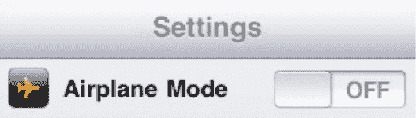

**图 5–10.** *苹果深知飞行途中关闭 iPad 的 3G 模块至关重要，因此将飞行模式设为设置应用中的首要选项。*

将飞行模式开关向右滑动，开关将变为开启状态，并禁用 Wi-Fi、3G 和蓝牙功能。若想在飞行中使用 Wi-Fi，可点击飞行模式开关下方的`Wi-Fi 设置`按钮，独立于任何 3G 服务单独启用 Wi-Fi。

### 内置 3G 的替代方案

若想在不具备内置 3G 功能的 iPad 上获得移动网络连接，一种方式是使用移动宽带路由器。这类设备由多家移动运营商提供，外形小巧，可连接至 3G 网络，并允许附近最多五台设备共享该 3G 连接。

在美国和加拿大，Novatel Wireless（品牌名`MiFi`）和 Sierra Wireless（品牌名`Overdrive`）均提供移动宽带路由器。这些小巧设备可通过 Sprint 和 Verizon 购买——有趣的是，这两家运营商并非 iPad 所采用的 GSM 标准的服务商。

Sprint 的`Overdrive` 3G/4G 移动热点（图 5–11）就是可与 iPad 配合使用的移动宽带路由器之一。`Overdrive`的特别之处在于它兼容 Sprint 正在美国主要城市部署的 4G 网络。4G 网络速度比 3G 服务快十倍，这意味着你可以用 iPad 体验到接近 Wi-Fi 网络的速度。

部分手机（例如 Palm Pre Plus）也可用作移动热点，详情请咨询你的移动运营商。在美国等许多国家，运营商允许将 iPhone 作为*网络共享*设备——即把 3G 版 iPhone 当作移动宽带路由器使用。不过，旅行中若需共享 iPhone 网络，你仍需像在 iPad 上一样办理数据漫游服务。

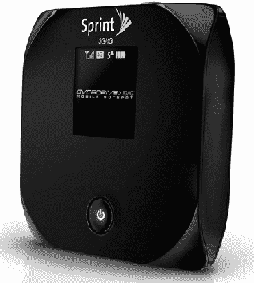

**图 5–11.** *想以比 3G 更快的速度联网，并和朋友共享无线宽带连接？Sprint Overdrive 3G/4G 移动热点这类无线宽带路由器就能实现。图片由 Sprint 提供。*

### 本章小结

本章我们讲解了通过 Wi-Fi 和 3G 数据连接接入互联网的流程。你学到了在无法连接 Wi-Fi 网络时的一些实用故障排除技巧。以下是本章要点的总结：

* 你的 iPad 通过 Wi-Fi 和（若为 Wi-Fi + 3G 版）3G 蜂窝网络与世界通信。没有 Wi-Fi 或 3G，就无法连接互联网。
* 使用 Wi-Fi 时安全至关重要。要实现最高级别的无线安全，请使用 WPA2 级别加密。
* 由于费用高昂，国际旅行时应关闭数据漫游。可改用 GSM 漫游合作伙伴并开通国际数据套餐，*或*租用能为 iPad 和其他移动设备提供 Wi-Fi 接入的移动热点。
* 在飞机上使用 3G 版 iPad 时，务必开启飞行模式以遵守国际及各国法规。

