# 使用 Safari 浏览互联网

2007 年苹果推出 iPhone 时，史蒂夫·乔布斯称其将互联网装进了口袋。iPhone 上的`Safari`浏览器堪称革命性设计，让你以前所未有的方式触摸网络。如果要将 iPhone 上的 Safari 体验放大十倍，你就能大致想象在 iPad 上浏览网页的感受。iPad 屏幕上的网页画面宏大，以超乎想象的清晰度呈现前所未有的丰富内容。这感觉就像让 iPad 将互联网变成你掌中的互动杂志。

在本章中，你将学会如何充分利用`Safari`及其所有强大功能。你将掌握网页导航、管理书签、以及使用竖屏和横屏模式的方法。你还将发现一些绝佳的触控快捷操作、书签技巧，以及便捷的网络剪辑功能。继续阅读，了解更多精彩内容。

### Safari 入门指南

轻点`Safari`应用图标即可启动程序。默认情况下，苹果将其置于程序坞的左下角。图标以蓝色背景上的白色指南针标识（见图 6–1）。轻点后，`Safari`应用将打开新窗口。

**图 6–1.** *Safari 图标*

### Safari 浏览器窗口

Safari 窗口中的许多元素可能看起来很熟悉，尤其是对于有使用网页浏览器或在 iPhone 或 iPod touch 上使用 Safari 经验的人来说。熟悉的元素包括地址栏、重新加载按钮和历史导航箭头。图 6–2 展示了一个典型的 Safari 浏览器窗口。

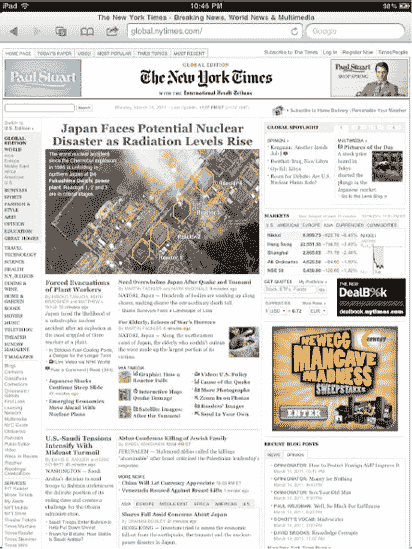

**图 6–2.** *Safari 窗口显示了许多熟悉的功能，包括地址栏、返回、前进和书签按钮。*

让我们更仔细地看看 Safari 页面的顶部。在每个 Safari 窗口的顶部，你会看到导航栏（参见图 6–3）。导航栏包含任何现代网页浏览器上常见的按钮和工具。从左到右，它们依次是：

**图 6–3.** *Safari 导航栏*

- **返回按钮**：点击此按钮可在浏览历史记录中后退一页。
- **前进按钮**：如果你已经后退了一页，前进按钮将在历史记录中前进一步。

**注意：** 当返回和前进按钮变灰时，说明你尚未建立浏览历史。一旦你开始浏览，这些箭头会从浅灰色变成深灰色，你就可以在历史记录中向前和向后移动到上一页和下一页。每个页面都维护自己的历史记录。你不能使用这些按钮返回到你在另一个窗口中查看的页面（请参见下文的页面按钮讨论）。

- **页面按钮**：此按钮看起来像两个重叠的方块。它允许你打开页面选择浏览器，并选择你当前打开的其中一个 Safari 窗口。你最多可以同时打开九个浏览器窗口。我们将在本章后面进一步讨论此按钮。
- **书签按钮**：点击书本形状的图标可打开你的书签屏幕。书签屏幕还包含你的完整 Safari 浏览历史。
- **共享按钮**：此按钮看起来像一个从方框中突破出来的箭头。点击它会显示一个菜单，允许你添加当前页面的书签、将页面快捷方式添加到主屏幕、通过邮件发送页面链接以及打印所显示的网页。我们将在本章后面进一步讨论此按钮。
- **地址栏**：使用 Safari 窗口顶部中央的地址栏输入新的网址（网址即统一资源定位符，也称为 URL）。
- **重新加载按钮**：地址栏中弯曲成半圆形的箭头就是重新加载按钮。点击它可刷新当前屏幕。
- **停止按钮**：当页面加载时，Safari 会将重新加载按钮替换为一个小写的 *X*。如果你在导航到某个页面后改变了主意，点击此处可停止当前页面继续加载。
- **搜索栏**：点击此栏可快速访问 Google 搜索。

### 导航基础

iPad 上的 Safari 让你能够完成在浏览器中所期望的所有常规操作。你可以点击链接和按钮，可以在表单中输入文本等等。此外，Safari 还提供了一些你在家用电脑上找不到的 iPad 特有功能：将 iPad 侧向倾斜，它会从横屏视图切换到竖屏视图，反之亦然。以下部分将引导你了解 Safari 的基本功能。

#### 输入 URL

点击地址栏可打开 URL 输入窗口（参见图 6–3）。导航部分出现在屏幕顶部，同时键盘从下方弹出。在这两者之间，屏幕会变暗，你仍然可以看到你所在页面的部分内容（参见图 6–4）。

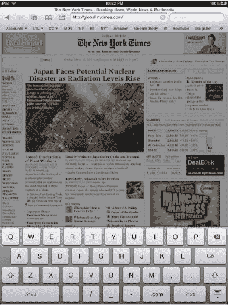

**图 6–4.** *在 URL 或搜索字段中操作时看到的 Safari 窗口*

**注意：** 如果你决定停留在当前页面，只需点击导航栏和键盘之间的变暗区域，你就会被带回到该页面。或者，你也可以点击键盘右下角的隐藏键盘按钮。

你还会看到一个书签栏出现在 URL 字段下方（参见图 6–5）。这些并非你所有的书签，而是你决定添加到书签集合中“书签栏”文件夹里的少数精选书签。书签通常用于快速访问你最常访问的网站。要激活书签栏中的书签，只需点击它，你就会被带到其对应的网页。

**图 6–5.** *书签栏让你能够快速访问部分书签。*

如果当前 URL 字段为空，只需点击它并开始输入。你会短暂看到一个显示“粘贴”的上下文菜单，但不必担心。只需开始输入，上下文菜单就会消失（或者如果你想粘贴之前复制的 URL，可以点击“粘贴”按钮）。

如果当前 URL 字段中已有内容（例如，你已经在一个网站上，而不是空白页面），只需点击它。你会看到在通常显示刷新按钮的位置出现了一个小的灰色 *X*（参见图 6–5）。点击此 *X* 将清除 URL 字段的内容。此外，如果你想复制当前 URL，请点击 URL 字段中的任意位置，你会看到一个弹出菜单，显示“选择”、“全选”和“粘贴”。点击“全选”，然后点击出现的弹出字段中的“复制”。

不必担心输入 `http://` 甚至 `www`；Safari 足够智能，知道这些是必需的，并会自动添加它们。iPad 上 Safari 键盘的一个便捷功能是专用的 `.com` 按钮（参见图 6–6）。这一个按钮让你的手指少敲四下键盘。更酷的是，当你长按 `.com` 按钮时，会出现一个弹出字段，允许你选择 `.edu`、`.org`、`.us` 和 `.net`。

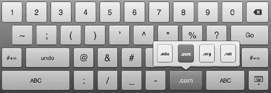

**图 6–6.** *Safari 的键盘，带有 `.com`、`.edu`、`.org`、`.us` 和 `.net` 按钮*

在你输入时，Safari 会将你的按键与现有的书签集合进行匹配。会弹出一个字段，显示来自你的书签和历史记录的可能的匹配项列表（参见图 6–7）。要选择其中一个，只需点击它。Safari 会自动导航到选定的 URL。

当你输入完一个 URL 后，点击“前往”按钮，Safari 就会导航到你输入的地址。要返回浏览器屏幕而不输入新的 URL，请点击键盘和导航栏之间的任意位置。

**提示：** 当你在文本输入字段中看到一个灰色圆圈内的白色 *X* 时，你可以点击它来清除该字段。

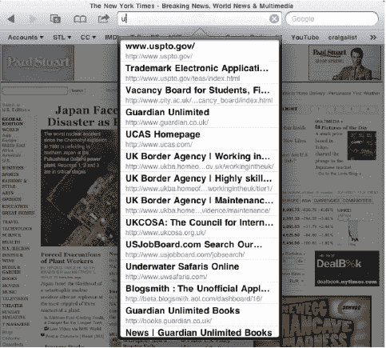

**图 6–7.** *URL 输入窗口允许你输入希望 Safari 访问的地址。*

#### 输入文本

很多时候，您需要在网页上填写用户名或密码才能登录，或者可能遇到一个要求填写其他表单的页面。要编辑任何文本输入框的内容，只需轻点它，Safari 便会打开一个新的文本输入键盘。

虽然这个键盘表面上与图 6-5 中显示的键盘相似，但它也存在一些差异。这些差异包括键盘顶部的`上一个`和`下一个`按钮，它们用于搜索网页上的其他文本字段（参见图 6-8）。这些按钮让您无需经历繁琐的“轻点/编辑/完成”循环即可填写表单。只需输入文本，轻点`下一个`，再输入更多文本，依此类推。

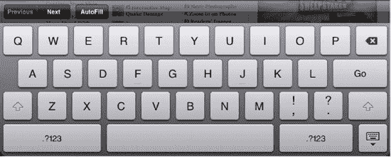

**图 6-8.** *网页表单的文本输入键盘。请注意顶部的`上一个`、`下一个`和`自动填充`按钮。*

与 Safari 文本输入功能的另一个区别是`自动填充`按钮。轻点`自动填充`按钮，将自动使用您通讯录中个人联系卡片的信息填充文本字段。它还会输入已存储的用户名和密码。我们将在本章后面讨论如何设置`自动填充`功能。

输入完所有文本后，要提交表单，请轻点`前往`或`搜索`。这类似于在常规电脑上按下`回车`键。

#### 搜索网页

在任何 Safari 窗口中，您只需轻点一下即可进行网络搜索。如图 6-5 所示，一个谷歌搜索字段位于 URL 字段的右侧。它最初显示为浅灰色，带有一个放大镜图标。轻点此搜索字段调出键盘，输入您想要在谷歌中搜索的词语。

搜索字段会变长，而 URL 字段会缩短，键盘上的`前往`按钮会切换为`搜索`按钮。输入一两个词，您会看到一个弹出框，其中显示谷歌根据您输入的内容建议的搜索词（参见图 6-9）。要选择其中一个谷歌建议的词，您只需在列表中轻点它，或者直接输入完您要查找的内容并轻点键盘上的`搜索`即可。Safari 将会导航至[`www.google.com`](http://www.google.com)（无论当前显示的是哪个页面）并搜索您的查询词。

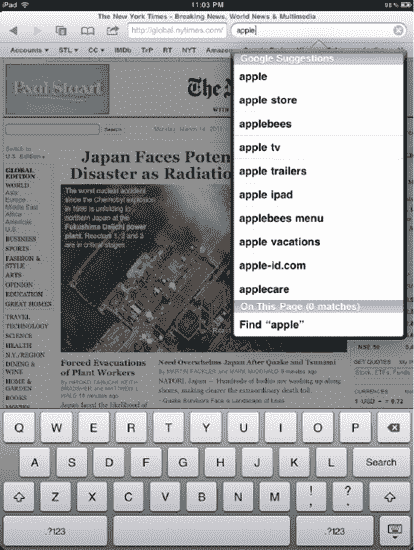

**图 6-9.** *带有建议关键词的搜索字段*

如果您更愿意使用必应或雅虎搜索而不是谷歌搜索，您可以导航至“设置”  “Safari”来更改您的默认搜索引擎（我们将在本章后面详细介绍 Safari 的所有设置）。

#### 在网页中搜索文本

Safari 还允许您在网页上搜索特定文本。要搜索文本，请轻点谷歌搜索字段内部，并输入您正在网页上查找的一个或多个词语。轻点显示为“查找”的位置；然后，轻点您在搜索建议弹出字段底部输入的文本（参见图 6-10）。

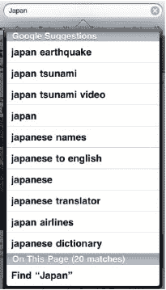

**图 6-10.** *在网页中搜索文本*

在您轻点`查找`命令后，Safari 会放大到网页上首次出现您所查找文本的区域，并将其以黄色高亮显示（参见图 6-11）。然后，使用页面底部的“搜索文本”栏，您可以轻点`下一个`按钮来查找网页上文本的下一个实例。您也可以使用页面底部“搜索文本”栏中的搜索字段来优化您的关键词搜索。

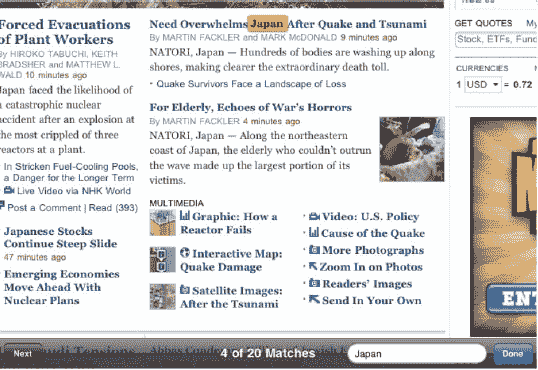

**图 6-11.** *Safari 中显示的文本搜索结果*

#### 跟随链接

超文本链接在全球广域网中无处不在。文本链接带有下划线，并且通常与正文颜色不同。图片链接则更为隐蔽，但它们同样能将您带到新位置。

轻点这些链接可导航到新网页，或者对于某些特殊链接，可打开新邮件或查看地图。当链接指向 iPad 能够识别的音频或视频文件时，它将播放该文件。特殊链接包括`mailto:`（用于创建邮件信息）、`tel:`（用于拨打电话，前提是您在 iPad 上安装了 Skype），以及自动识别谷歌地图 URL（这将带您进入 iPad 的“地图”应用）。

**注意：** 支持的音频格式包括`AAC`、`M4A`、`M4B`、`M4P`、`MP3`、`WAV`和`AIFF`。视频格式包括`h.264`和`MPEG-4`。

除了简单地轻点链接以打开新页面之外，您还有其他选择。要预览链接的地址，请触摸并按住链接一两秒钟。一个地址弹出字段将出现在链接旁边（参见图 6-12）。在链接的完整地址下方，您会看到三个按钮，其作用如下：

*   *“打开”按钮*：其效果等同于您直接轻点该链接，而非触摸并按住。
*   *“在新页面中打开”按钮*：在一个新的 Safari 页面中打开链接。
*   *“拷贝”按钮*：拷贝链接，以便您稍后能将其粘贴到电子邮件或 URL 字段中。

要取消上述任一选项并停留在当前页面，只需在屏幕任意位置轻点一下手指即可。

**图 6-12.** *触摸并按住链接时的选项：打开、在新页面中打开和拷贝*

**提示：** 要检测屏幕上的图片链接，请轻点并按住一张图片。如果它变成灰色，则是一个链接。如果它保持原有亮度，则只是一张普通图片。当您轻点并按住一个带链接的图片时，您将获得与文本链接相同的选项。您还会多一个额外选项：`存储图像`。这会将图像保存到您 iPad 上的“照片”应用中。

#### 改变方向

iPad 的突出特性之一是其灵活的方向支持。当您将设备侧放时，iPad 会随之翻转其显示内容，如图 6-11 所示。内置传感器检测 iPad 的倾斜角度，并将显示调整为横向模式。当倾斜回垂直方向时，iPad 将恢复为纵向模式。iPad 只需一秒钟即可检测到方向变化并更新显示。别忘了，您始终可以通过滑动 iPad 侧面的屏幕方向锁定按钮来锁定屏幕方向；但是，您应确保已将该按钮设置为锁定方向，而非静音 iPad。为此，请前往“设置”  “通用”，然后将`用侧边开关：`选项设置为`锁定旋转`。

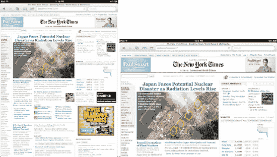

**图 6-13.** *Safari 可以使用纵向和横向两种模式显示网页。*

iPad 的横向视图提供明显更宽的显示区域。这对于需要横向操作的任务尤其有利，例如阅读书籍宽度的文本。更宽的屏幕允许您使用更大的字体并查看更宽的列，而无需水平滚动。纵向视图则提供更长的呈现效果，非常适合阅读内容较窄的网页，例如新闻源。在纵向视图中，您不需要像横向视图那样频繁地向上滚动。

无论是在横向模式还是纵向模式下，Safari 的功能都相同，包括位于相同位置的相同按钮。在横向模式下，您可以使用更宽的横向键盘输入文本。

#### 滚动、缩放及其他浏览技巧

`Safari` 支持我们在第 2 章中讨论过的所有点按、轻扫和拖移手势。你可以放大图片、捏合调整列宽，以及更多操作。以下是与你屏幕互动的基本方式快速回顾：

- `*拖移*`：触摸屏幕并拖移手指以重新定位网页。如果你将 iPad 视为浏览网页的窗口，拖移可以让你在网页上移动这个窗口。
- `*轻扫*`：在处理长页面时，你可以向上或向下轻扫显示屏以快速滚动。这在浏览搜索引擎结果和新闻网站时尤其有用。
- `*双击*`：双击任何列或图像以放大，使其自动适配显示屏宽度。再次双击以缩小。使用此选项可立即放大网页中的文本。iPad 能识别文本的宽度并完美匹配。
- `*捏合*`：使用捏合手势手动放大或缩小。这让你可以根据需要精细调整缩放比例。
- `*点按*`：点按按钮和链接以选中它们。点按可以让你在网站之间跳转并提交表单。
- `*向下翻页*`：当放大到某一列时，在保持位于该列内的情况下，双击屏幕靠近底部的位置。页面会以你点按的位置为中心重新定位。注意不要点到链接！
- `*跳至顶部*`：双击屏幕最顶部（时间显示正下方）即可瞬间返回页面顶部。
- `*停止滚动*`：轻扫页面使其开始滚动后，你可以随时点按页面来停止滚动。别忘了，你也可以手动拖移屏幕显示区域来重置当前查看的部分。

**提示：** 有些网页包含文本框，这些文本框有自己的滚动条，与网页的滚动条是分开的。如果你在 iPad 上使用 `Safari` 时遇到包含文本框的网页，你可以滚动该文本框内的内容，而不会滚动整个页面。要执行此操作，请在文本框内用双指向上或向下滑动。只有文本框中的内容会滚动，主页面将保持不动。

#### 页面管理

`Safari` 允许你同时打开最多九个浏览器窗口。要查看你打开的窗口，请点按导航栏中的“页面”按钮（看起来像两个叠在一起的方框）。`Safari` 的页面查看器会打开，如图 6–14 所示。你可能会在按钮内看到一个数字。这个数字表示当前你在 `Safari` 中打开页面的数量。

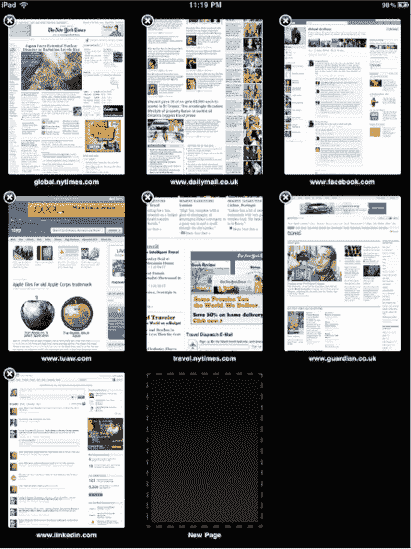

**图 6–14.** *页面查看器允许你选择要显示的浏览器窗口。*

此查看器允许你交互式地选择浏览器窗口。在此之后，你可以执行以下操作：

- 要选择一个窗口，只需点按它。该 `Safari` 窗口会弹出并自动重新加载，以确保显示页面上最新的内容。
- 要关闭一个窗口，请点按关闭按钮——每个页面左上角内含一个 `*X*` 的黑色圆圈。页面查看器会将剩余的页面滑动到被关闭窗口留下的空缺位置。
- 要添加新页面，请点按虚线状的空白“新页面”按钮；`Safari` 将创建一个新窗口并打开一个空白新页面供你操作。如果你当前已打开九个页面，则不会看到“新页面”窗口。
- 页面管理工具让你可以在多个打开的 `Safari` 窗口之间快速来回切换。如果你愿意，可以将此工具视为桌面浏览器所提供的标签页的替代品。

#### 使用书签

iPad 的一大特色是它能让你随身携带你的世界：联系人、日历、电子邮件账户和书签。你不必在 iPad 上重新输入所有常访网页的 URL。只要你在 iTunes iPad 偏好设置窗口中启用了此功能（参见第 2 章），它就会在同步时加载这些书签。

##### 选择书签

一个书签集合可能包含成百上千个独立的 URL，这就是为什么人们非常欣赏 iPad 简洁的书签浏览器（见图 6–15）。当你点按导航栏中的“书签”按钮时，会出现一个简单的书签弹出窗口。它使用你在个人电脑上设置的相同文件夹结构。你可以点按文件夹将其打开，然后点按“返回”按钮（左上角）以返回上一级文件夹。

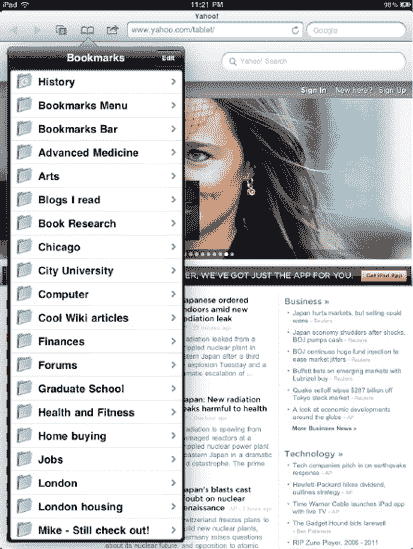

**图 6–15.** *使用 iPhone 版 Safari 的交互式书签导航菜单来定位和打开你喜爱的书签。*

识别书签很容易。文件夹看起来像文件夹，每个书签都标有一个小的打开的书本符号。点按其中一个，`Safari` 将直接带你到该页面。如果你的书签列表很长，只需轻扫或滚动浏览列表即可。

当你在书签的第一级时，你会注意到顶部有一个“历史记录”文件夹。点按它，你将看到自上次清除历史记录以来你在 `Safari` 中访问过的所有页面。要清除历史记录，请点按“清除历史记录”按钮，系统会要求你确认。点按红色的“清除历史记录”按钮进行确认（图 6–16）。

你还会看到一个名为“书签栏”的文件夹。放置在此文件夹中的任何书签都会显示在书签栏中，该栏会在你输入 URL 时出现在 `Safari` 导航栏的底部（如图 6–5 所示）。

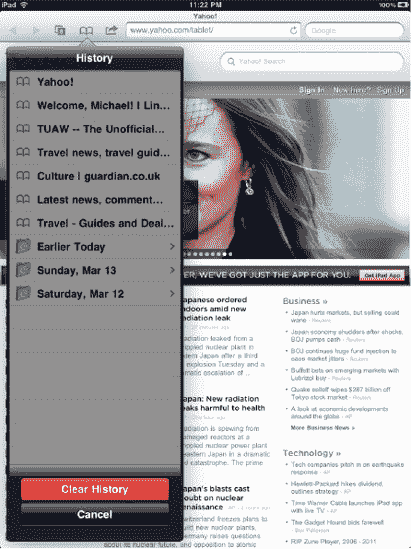

**图 6–16.** *Safari 的历史记录文件夹和清除历史记录的删除确认*

**注意：** 你的桌面浏览器的历史记录与 iPad 上 `Safari` 浏览器的历史记录不会同步。你在 iPad 上导航访问的任何页面都不会出现在你桌面浏览器的浏览历史中，反之亦然。

##### 编辑书签

如图 6–15 所示，书签弹出字段的右上角会出现一个“编辑”按钮。点按它即可进入编辑模式（见图 6–17）。

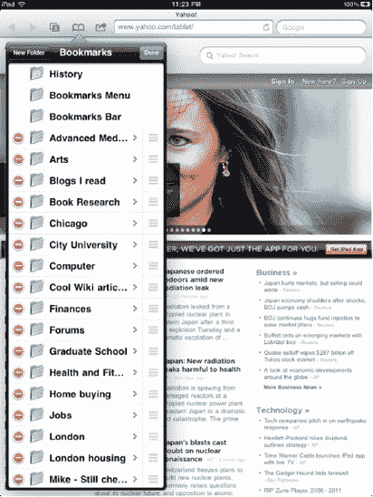

**图 6–17.** *Safari 包含一个内置的书签管理系统，允许你编辑和重新排列书签。*

编辑模式允许你像在个人电脑上一样管理 iPad 上的书签：

- `*删除书签*`：点按书签左侧的红色删除圆圈图标以删除该书签。点按“删除”确认，或点按屏幕上的其他地方取消。
- `*重新排列书签*`：使用灰色的拖动手柄（最右侧的三条线）将文件夹和书签移动到新位置。抓住、拖动，然后松开。
- `*编辑名称*`：点按灰色的显示箭头（每个名称右侧的侧向 V 形符号）以打开“编辑书签”或“编辑文件夹”屏幕。使用键盘进行更改，然后点按“返回”按钮返回书签编辑器。
- `*更改归属文件夹*`：你可以通过点按名称编辑字段下方的归属文件夹字段将项目从一个文件夹移动到另一个文件夹。选择一个文件夹，然后点按“返回”按钮返回书签编辑器。遗憾的是，你无法像在“邮件”中将项目发送到新文件夹时那样看到生动的动画效果，但至少它功能可靠。
- `*添加文件夹*`：点按“新建文件夹”以在当前显示的书签中创建一个文件夹。iPad 会自动打开“编辑文件夹”屏幕。在这里，你可以编辑名称，并在需要时更改新文件夹的归属。点按“返回”返回编辑器。
- `*完成*`：返回顶级书签列表（点按“返回”按钮直至到达该列表），然后点按“完成”。这将关闭编辑器并返回到你的书签列表。

##### 保存书签和共享网页

要保存新书签，请轻点任意 Safari 网页导航栏中的“共享”按钮。它位于地址栏的左侧。此时会弹出一个共享菜单，提供四个选项（参见图 6-18）：

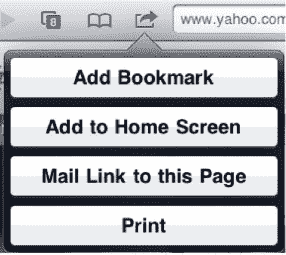

**图 6-18.** *轻点“共享”按钮，查看共享网页的所有方式。*

- **添加书签**：轻点此选项可让您为书签输入标题，然后选择性地选择要保存到的文件夹（参见图 6-19）。轻点当前显示的文件夹可查看所有可用文件夹的列表。书签树的根目录名为`Bookmarks`。做出选择后，轻点`存储`。Safari 会将新书签添加到您的收藏中。如果您想在不保存的情况下返回 Safari，请轻点`取消`。

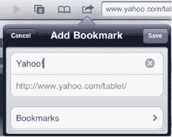

**图 6-19.** *“添加书签”允许您在保存前重命名书签。*

- **添加至主屏幕**：这是一个很酷的功能。轻点此选项可将网页图标添加到您的 iPad 主屏幕。Apple 将这些网页图标称为*Web Clips*。在保存 Web Clip 之前，您可以选择重命名。请保持名称简短，以便您能在主屏幕的 Web Clip 图标下看到完整的名称。

**注意：** 当您将 Web Clip 添加到主屏幕时，某些网站会提供针对 iPad 优化的站点图标。其他网站则只会以 iPad 图标形状显示页面缩略图。

Web Clip 看起来就像应用图标，允许您轻点即可打开 Safari 并自动跳转到该网页。我们会在 iPad 上保留一个充满我们最喜爱 Web Clip 的主屏幕，以便快速导航到最常访问的站点（参见图 6-20）。我们发现这比使用 Safari 中的书签功能快得多。

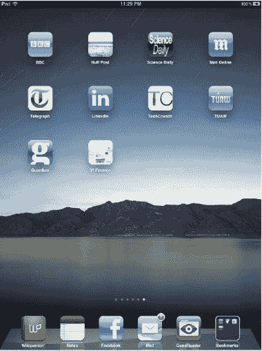

**图 6-20.** *iPad 主屏幕上一系列的 Web Clip。您可以看到哪些站点有专用的 Web Clip 图标，哪些站点让 iPad 使用网页缩略图。*

在 iTunes 中，Web Clip 会出现在“App”标签页的虚拟 iPad 屏幕上（参见第 2 章）。请注意，您只能在 iTunes 中重新排列 Web Clip，而不能删除它们。要在 iPad 上删除 Web Clip 图标，请长按直至其晃动，然后轻点左上角的`X`。

- **邮件链接至本页面**：轻点此按钮会在 Safari 中打开一个新的“邮件”撰写窗口，并自动将链接插入到邮件正文中。
- **打印**：轻点此按钮可调出打印菜单（图 6-21）。打印菜单允许您选择要使用的无线 AirPrint 打印机以及要打印的份数。做出选择后，点击`打印`按钮。

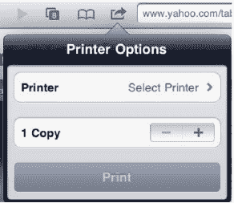

**图 6-21.** *从 Safari 打印网页*

### Safari 设置

与 iPad 上的许多应用一样，Safari 也可以进行一定程度的自定义。前往 iPad 主屏幕上的“设置”应用，并轻点`Safari`，即可自定义您的 Safari 设置。此屏幕如图 6-22 所示，允许您控制多项功能，主要与安全相关。以下是这些功能及其含义的简要说明：

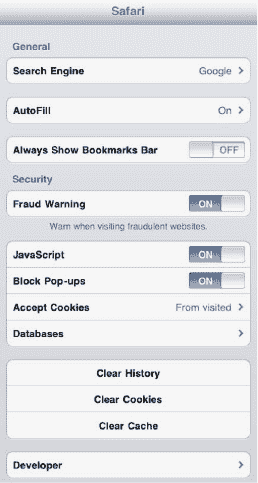

**图 6-22.** *Safari 设置窗口主要涉及安全功能。*

- **搜索引擎**：此设置决定您在图 6-3 中看到的搜索栏使用的搜索引擎。可从 Google、Bing 或 Yahoo!中选择。
- **自动填充**：此功能允许您开启自动填充，用于填写网页上的表单。在`我的信息`框中，选择您的通讯录名片作为自动填充信息的来源。您还可以在此处选择开启`名称和密码`。开启此功能后，Safari 会记住您访问网站的登录名和密码。轻点`清除全部`可擦除 iPad 上所有已保存的名称和密码。
- **始终显示书签栏**：开启此功能，您将始终看到 Safari 导航栏下方的书签栏；否则，此栏仅在选择 URL 栏时显示（参见图 6-5）。
- **欺诈警告**：开启此偏好设置后，在导航至可能存在欺诈的网站前，系统会向您显示警告。不幸的是，互联网上欺诈网站泛滥（例如伪造的 PayPal 站点）。此功能有助于您识别并避开这些站点。
- **JavaScript**：JavaScript 允许网页在您访问时运行程序。禁用 JavaScript 意味着提高整体浏览安全性，但您也会失去许多酷炫且有价值的网页功能。大多数网页可以安全访问，但遗憾的是，有些并非如此。要禁用 JavaScript，请将此开关从“开”切换为“关”。
- **拦截弹出式窗口**：许多网站使用弹出式窗口进行广告宣传。这是浏览网页时令人烦恼的现实情况。默认情况下，Safari 的弹出式窗口拦截功能是“开”。将此设置切换为“关”以允许创建弹出式窗口。
- **接受 Cookie**：Cookie 指的是您访问的网站存储在 iPad 上的数据。Cookie 允许网站记住您并存储有关您访问的信息。您可以选择始终接受 Cookie、从不接受 Cookie 或仅接受“来自已访问”网站的 Cookie。
- **数据库**：仅当您访问过使用数据库功能的网站（例如某些 Google 站点，如 Gmail）时，您才会看到此选项。这些数据库在您的 iPad 上存储本地信息，用于离线浏览。
- **清除历史记录**：轻点并确认即可清空您 iPad 上的页面导航历史记录。这可以在一定程度上保护您的个人浏览习惯隐私，尽管他人仍可能浏览您的书签。

**注意：** 清除导航历史记录不会影响 Safari 的页面历史记录。您仍然可以轻点其“返回”按钮查看您访问过的站点。

- **清除 Cookie**：轻点并确认即可清除 iPad 上所有现有的 Cookie。
- **清除缓存**：您 iPad 的浏览器缓存存储了许多您访问过的网站的数据。它利用这些数据来加速您下次访问时的页面加载速度。与 Cookie 和历史记录一样，您的缓存可能泄露您不愿分享的个人信息。轻点`清除缓存`并`确认`以清除您的缓存。

**提示：** 清除缓存也可能有助于纠正加载有问题的页面。通过清除缓存，您可以移除可能损坏或仅部分下载的页面元素。

- **开发者**：大多数人无需操心此设置。顾名思义，它适用于开发者，允许他们打开调试控制台，以帮助其针对 iPad 优化网站。

### iPad 与 Flash 视频

若你曾在网上观看过视频，那么该视频很可能使用了 Flash 编码。自苹果公司向世界推出 iPhone 以来，苹果与 Adobe 之间的关系便日益紧张。原因在于：苹果不允许 Adobe 专有的 Flash 插件在 iPhone 或后来的 iPad 上运行。

在苹果看来，Flash 是一项速度慢、漏洞多且过时的技术。史蒂夫·乔布斯本人甚至曾在苹果官网上发布公开信，向全世界阐明这一观点（[`www.apple.com/hotnews/thoughts-on-flash/`](http://www.apple.com/hotnews/thoughts-on-flash/)）。这封信也为那些希望在 iPad 或 iPhone 上看到 Flash 的人彻底关上了大门。

许多人听到“iPad 不支持 Flash”时，误以为 iPad 无法播放网络视频。事实远非如此。当然，如果某个视频是用 Flash 编码的，你确实无法在 iPad 上观看。虽然网络上约 75% 的视频（据乔布斯称）使用 Flash 编码，但其中大多数也支持一种名为 `HTML5` 的新通用网络标准。`HTML5` 视频无需插件即可播放。同时，`HTML5` 的功耗远低于 Flash——对于依赖电池供电的移动设备而言，这无疑是一项重要特性。

世界正转向 `HTML5`，苹果选择支持它以及开放标准，而非 Adobe 陈旧且专有的 Flash。YouTube 的大部分视频已重新编码以支持 `HTML5`，许多其他主流网站也已弃用 Flash，转而采用新的 `HTML5` 网络标准。

### 总结

iPad 将上网浏览从一件只能在书桌前完成的事情，变成了一件可以在客厅里舒适地放在腿上完成的活动。从某种意义上说，在 iPad 上浏览网页赋予了网页前所未有的“触感”——你只需伸出手指即可触摸它们。很可能，在 iPad 上使用 `Safari` 浏览网页后，你将再也不想用其他方式探索网络了。

以下是一些你在继续阅读本章后需要牢记的技巧：

- iPad 不仅支持传统的纵向（竖屏）模式。你可以将 iPad 横向翻转，以横向模式查看网页。你的 `Safari` 页面会自动调整。
- 没错，它不支持 Flash。永远也不会支持。而且你并不需要它。
- 网络剪辑是直接从 iPad 主屏幕访问你喜爱网站的好方法。
- 轻点任意 `Safari` 页面的顶部（状态栏中时钟的正下方），即可快速返回网页顶部。
- `Safari` 的页面管理工具可让你在多个 `Safari` 窗口之间来回切换。其功能类似于桌面浏览器中标签页的工作方式。

## 第 7 章

## 掌控你的音乐与视频

iPad 为你与媒体互动提供了全新的方式。iPad 配备了一款出色的专用音乐播放器，只需轻点几下，你就可以从众多其他应用中访问相同的音频，在游戏和工作中尽情享受音乐。当你在 iPad 上观看电视节目、电影或短视频时，其宽屏视频播放能力和出色的电视集成功能，能为你呈现比以往任何时候都更大、更清晰美丽的图像。此外，iPad 的无线网络功能让你能够访问海量内容——从 YouTube 到网络上的嵌入式视频，再到你自己的个人电脑——并且可以将设备上已有的内容共享到外部播放器。本章将介绍让你在 iPad 上享受音乐和视频的主要应用：`Videos`、`YouTube`、`Safari` 和 `iPod`。

### 在 iPad 上观看视频

视频是 iPad 的基本组成部分，你不应将其仅仅视为一个单独的应用。苹果提供了多项内置应用所使用的基础技术，这些应用支持第三方媒体的视频播放。以下列表简要概述了这些苹果提供的应用（参见图 7–1）。

**注：** 第 15 章将讨论如何使用 iPad 新增的内置摄像头系统录制和播放自己制作的视频。

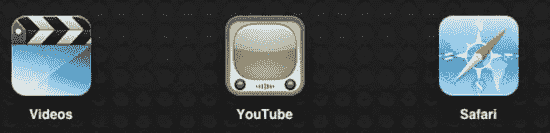

**图 7–1.** *Videos、YouTube 和 Safari 在 iPad 上都具备视频播放功能。*

- *`Videos`*：`Videos` 应用位于 iPad 的主屏幕上。其图标看起来像一块传统的拍板，顶部为黑白条纹，底部为蓝色。该应用用于播放你从家庭 iTunes 资料库同步过来的电视节目、电影、播客、iTunes U 课程和音乐视频。
- *`YouTube`*：在图 7–1 中，你会发现 `YouTube` 应用图标就在 `Videos` 应用图标旁边。该图标看起来像一台老式电视，带有绿色屏幕和棕色旋钮。`YouTube` 连接互联网，允许你观看来自 `YouTube.com` 的视频。你可以在 iPad 的 `Safari` 中导航至 [`www.youtube.com`](http://www.youtube.com) 并通过这种方式浏览 YouTube 视频，但 iPad 的 `YouTube` 应用将 [`www.youtube.com`](http://www.youtube.com) 包装得如此精美且易于导航，你会发现它远比在网页浏览器中使用 YouTube 要好得多。
- *`Safari`*：你在第 6 章中已深入了解了 `Safari`，它提供了第三种观看视频的方式。与其桌面版类似，`Safari` 应用允许你观看嵌入的影片文件。`Safari` 的图标看起来像一个浅蓝色的指南针，指针指向东北方向。

除了 iPad 自带的这三款播放视频的应用外，还有成千上万的其他应用也能播放视频。你可以在 iTunes Store 中发现所有这些应用。我们最喜欢的一些应用包括用于观看新闻视频的 BBC News 应用，以及用于观看天气相关新闻报道和多普勒视频的 The Weather Channel 应用。

尽管 iPad 在视频方面功能强大，但它也有局限性。你的 iPad 内置应用只能播放 `H.264 MPEG-4` 视频，仅此而已。正如前一章所述，你无法使用 iPad 的标准应用来观看 Flash/Shockwave 视频或动画。你无法播放 `AVI` 视频。你无法播放 `DivX`、`Xvid` 或其他几十种流行格式。如果你的视频不是 `H.264 MPEG-4` 格式，你的 iPad 在没有辅助的情况下将无法识别它。

幸运的是，App Store 可以帮助你解决这一限制。一些第三方应用让你能够以 iPad 官方不支持的格式观看视频。这些视频播放应用包括 `CineXPlayer`、`yxplayer` 和 `Azul Media Player`。这些播放器支持多种内容格式，包括 `WMV`、`AVI`、`DivX` 和 `Flash FLV` 等。由于这些应用运行在苹果内置媒体支持之外，你通常需要将内容预先加载到每个应用中。使用 iTunes 的“应用”标签页中的“文件共享”部分来添加和删除视频文件。

某些应用还允许你直接通过网络 URL 访问媒体，甚至能播放嵌入在网页中的 Flash 视频（`FLV`）（而非直接链接到 `FLV` 资源的 URL）。自定义网页浏览器 `Skyfire` 通过边缘案例提供了 Flash 视频播放支持。但并非总能成功，因为像 Hulu 这样的收费网站目前会禁用任何通过其自定义播放器之外解决方案访问 iPad 视频的途径（例如 Hulu 的 Hulu Plus 播放器）。即使 iPad 上的 Flash 限制被解除，Hulu 自身的限制也意味着它不会向移动浏览器自由分发视频。

对此问题的普遍共识是，尽管 Adobe 的 Flash 技术已准备好用于 iPad 和 iOS 平台一段时间，但 Adobe 与苹果之间的关系，更不用说苹果公司史蒂夫·乔布斯的直言不讳，使得该技术一直未能登上这一平台。

**注：** 苹果 iPad 官方支持 `H.264` 视频，最高可达 `1.5Mbps`、`1024` x `768` 像素、`30` 帧每秒，以及 `M4V`、`MP4` 和 `MOV` 文件格式下的 `720p` 分辨率。

### 视频播放

iPad 是一款不限定方向的设备：你可以竖屏或横屏使用它。播放视频时也是如此。在 iPad 上观看视频时，你可以竖着握持，也可以横着握持。根据你使用的 App，你可能会看到针对正在播放的视频或 App 本身的更多选项。

不过，大多数 App 的视频界面元素都大同小异，这意味着一旦你掌握了在一个 App 中控制视频播放的方法，也就知道如何在其他 App 中操作了。以下是这些控制项的快速概览，如图 7–2 所示。

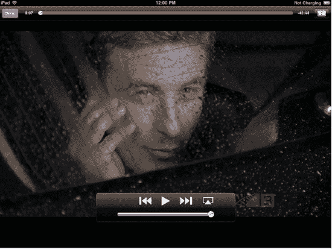

**图 7–2.** *iPad 的视频播放控制功能让您在观看时能够控制播放。*

- **播放/暂停**：播放/暂停按钮显示为指向右方的三角形（播放）或两条竖线（暂停）。轻点此按钮可暂停或继续视频播放。
- **快退**：快退按钮显示为两个指向左侧竖线的三角形。轻点可返回视频开头，按住按钮可向后快退。
- **快进**：与快退相反，快进按钮的三角形指向右侧而不是左侧。按住此按钮可向前快进。轻点则可跳至下一个视频轨道。
- **AirPlay**：一个内含向上三角形箭头的矩形，AirPlay 允许你将无线播放内容重定向到其他设备。在本书撰写时，AirPlay 接收端仅限于第二代或更新版本的 Apple TV，以及 Banana TV（`http://bananatv.net`）等第三方应用。
- **音量**：音量控制是播放/暂停按钮下方那条粗大的横条。拖动音量控制旋钮可调节播放音量。当然，你也可以随时使用 iPad 侧边的专用物理音量按钮。
- **进度条**：进度条位于屏幕顶部。它是一条带有可拖动小圆点的长条（音量控制是底部较粗的横条）。沿着进度条拖动播放头可设置当前播放时间。
- **缩放**：缩放按钮看起来像一个白色方框内有两个彼此背离的箭头，位于屏幕右上角。双击屏幕或轻点缩放按钮，可在全屏模式和原始宽高比之间切换。要回到原始宽高比视图，请再次双击屏幕，或再次轻点缩放按钮。你会注意到，在全屏观看视频时，缩放按钮会略微变化：箭头变为信箱模式图标。在全屏模式下，你会使用整个 iPad 屏幕，但视频的顶部或两侧可能会被裁剪一部分。在原始宽高比下，你可能会看到信箱模式（上下黑边）或竖屏信箱模式（左右黑边），这是由于保留了视频的原始宽高比。
- **音轨和字幕**：如果你正在观看的视频提供了其他音轨或字幕，你会在控制项中看到一个对话气泡图标。轻点此图标可从弹出的列表中选取音轨和字幕。
- **完成**：完成按钮出现在所有视频应用界面上。轻点“完成”可退出视频播放。按下 iPad 边框上的实体主屏幕按钮可退出应用并返回主屏幕。

在播放视频时，iPad 会在一两秒后自动隐藏视频控制项。这样你就可以不受屏幕按钮干扰地观看视频。轻点屏幕可重新调出控制项。再次轻点屏幕可将其隐藏；或者让它们保持不动几秒钟，它们会再次淡出。

### 视频 App

要启动“视频”App，请轻点其蓝色场记板图标。App 打开后，你会看到一个已同步到 iPad 的媒体项目列表。这些项目按标签分类归档，包括影片、电视节目、播客等项目（参见图 7–3）。只要你已从 iTunes 资料库同步了视频（参见第 2 章），它们就会出现在这里。轻点每个标签以找到完整的已同步媒体选择。

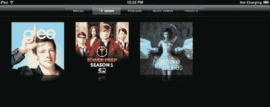

**图 7–3.** *“视频”App 提供单独的标签页，用于显示已同步到 iPad 的影片、电视节目、播客、音乐视频和 iTunes U 课程。*

#### 播放视频

如你所见，图 7–3 中显示的“视频”界面再简单不过了。其缩略图代表了你已拷贝到 iPad 的项目（同步这些项目在第 2 章中讨论）。通过轻点屏幕顶部的分类标签（参见图 7–4），可以在各种视频媒体类别间浏览切换。如果某个类别中有大量视频，你可以滑动手指快速滚动列表。

**图 7–4.** *轻点屏幕顶部的相应分类标签，可在视频类别间导航。*

轻点任意视频缩略图即可打开它。项目的图标会向前飞出，其后灰色的面板像折纸一样展开。你将看到信息页面，其中显示视频名称和制作年份，以及其他信息，可能包括时长、尺寸、文件大小、编解码器和版权声明，但通常只包含剧集或影片的详细描述（参见图 7–5）。轻点“更多”可查看完整描述。

如果你正在观看带有章节的视频，例如一部电视剧（一季中的每一集被视为一个章节）、播客或影片，你会看到一个章节列表。如果是播客或电视剧，你会看到 iPad 上的各集，包括名称、摘要、评分以及每集的时长。

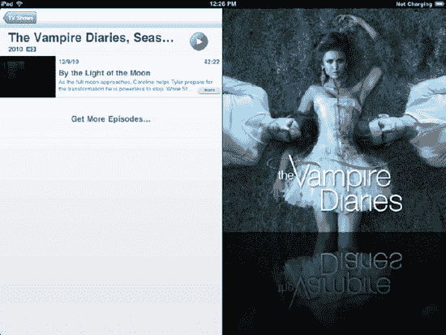

**图 7–5.** *影片和电视节目的信息屏幕*

要开始视频播放，请轻点屏幕右上角的圆形播放按钮，或者如果你的视频有章节列表，则从列表中轻点一个章节。屏幕会变黑，视频加载并自动开始播放。轻点“完成”可返回信息页面。

#### 删除视频

如果你想从 iPad 上删除一个视频，请按住视频缩略图，直到视频图标角落出现一个带有白色×的圆圈（参见图 7–6）。轻点×即可删除该视频。除了从 iTunes Store 租借的视频外，从 iPad 上删除视频不会将其从电脑中删除。如果你愿意，可以随时从 iTunes 资料库再次将其同步到 iPad。

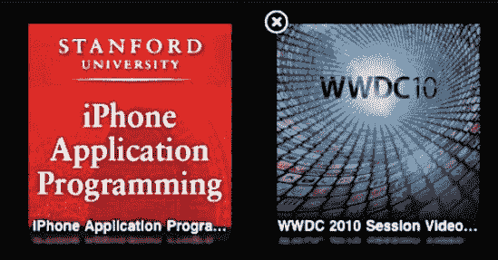

**图 7–6.** *按住视频的缩略图图标，等待圆圈中的×出现。轻点×即可删除该视频。*

### 视频设置

你可以调整多项影响视频播放的设置。这些设置需要通过 iPad 的`设置`应用进行访问（参见图 7–7）。

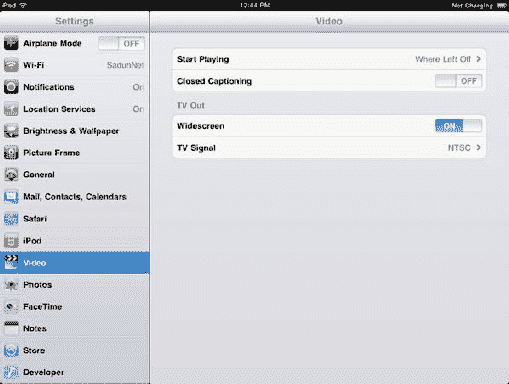

**图 7–7.** *视频设置偏好*

- **开始播放**：此设置允许你选择视频是从开头开始播放，还是从上次停止处继续播放。当你想利用零碎时间追一部电影或电视剧时，“从上次停止处继续播放”的功能非常棒。不过，你可能更希望产品演示视频始终从开头播放。
- **隐藏式字幕**：如果你的视频包含嵌入的隐藏式字幕，你可以将此选项从`关闭`切换为`开启`来查看它们。隐藏式字幕不仅对听力障碍者有帮助。当你在嘈杂的环境（如地铁或拥挤的自助餐厅）中观看视频时，它们也是提升观看体验的绝佳方式。

iPad 的视频应用还允许你通过家中的电视机播放其中的内容。你需要为此购买额外的线缆，你可以在本章稍后的“视频配件”部分了解相关信息，但视频设置中你可以选择以下选项：

- **宽屏**：开启此选项可强制宽屏视频在电视上以宽屏模式播放。这能保持其原始宽高比。
- **电视制式**：选择`NTSC`或`PAL`。如果你在北美或日本，电视很可能是`NTSC`制式。在欧洲、澳大利亚和新西兰，则是`PAL`制式。

#### YouTube

在 iPad 上发现、浏览和观看 YouTube 视频的体验，远胜于坐在桌前用电脑观看。iPad 将观看 YouTube 视频变成了一种绝佳的休闲体验，你可以舒适地坐在沙发上尽情享受。

与视频应用不同，YouTube 应用需要网络连接。只要你至少有 Wi-Fi 连接，就可以正常使用。在本书撰写时，YouTube 也允许你通过 3G 连接观看视频；应用会自动降低视频质量，以减少对你带宽的占用。低质量视频的显示效果虽然不如 Wi-Fi 连接下的好，但不会很快耗尽你的流量套餐。

要充分利用 YouTube 应用，你需要拥有一个 YouTube 账户。虽然你*并不一定*需要一个账户才能使用该应用，但拥有一个账户会让应用的功能更强大。有了 YouTube 账户，你可以查看和收藏你最喜欢的视频；订阅 YouTube 用户的视频；轻点一个按钮即可查看你所有上传到 YouTube 的视频；以及分享、评分和标记视频——所有这些操作都可以在 YouTube 应用内完成。创建一个 YouTube 账户只需几分钟，可以在[`www.youtube.com/create_account`](http://www.youtube.com/create_account) 上完成。

要启动 YouTube 应用，请轻点 YouTube 图标；它看起来像一台复古风格的电视机（如前文图 7–1 所示）。首次启动时，应用会显示“精选”屏幕，如图 7–8 所示。此屏幕展示由 YouTube 工作人员挑选的视频。

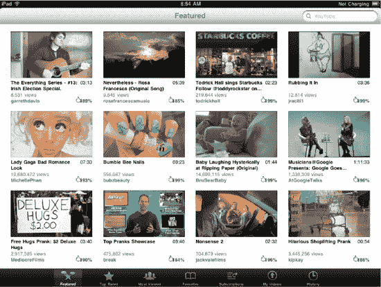

**图 7–8.** *YouTube 的“精选”屏幕提供了一个视频展台。*

#### 浏览和查找 YouTube 视频

YouTube 应用的关键元素包括应用右上角的搜索栏和屏幕底部的七个按钮行。每个按钮（见图 7–9）都提供了不同的方式去发现和欣赏 YouTube 视频。

**图 7–9.** *YouTube 导航栏*

- **精选**：此屏幕显示由 YouTube 工作人员审核并推荐的视频。你常能在这里发现一些值得一看、但可能错过的内容。
- **评分最高**：此屏幕显示 YouTube 上评分最高的视频。你可以选择显示当天、当周或历史所有时间评分最高的视频。观众进行评分后，票数最高的视频会被收录在此。
- **最多观看**：此屏幕显示 YouTube 上观看次数最多的视频。你可以选择显示当天、当周或历史所有时间观看次数最多的视频。在这里，你会发现通过各种方式（如电子邮件、Twitter 和 Facebook 推荐）在观众间迅速传播的热门视频。
- **收藏**：此屏幕显示你已添加到 YouTube 收藏列表中的所有视频。当你轻点屏幕顶部的`播放列表`标签时，此屏幕还会显示你所有的播放列表及其视频列表。这是 YouTube 应用中需要你拥有 YouTube 账户才能使用的功能之一。要登录你的账户，请轻点左上角的`登录`按钮（见图 7–10）。系统会提示你输入用户名和密码。完成操作后，你收藏过的所有视频都会显示出来。

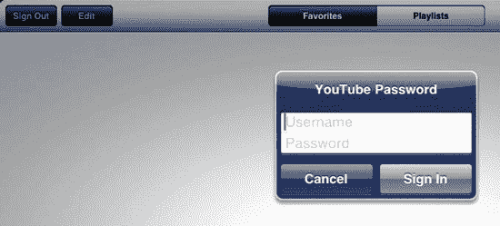

**图 7–10.** *`登录`/`退出`按钮位于收藏、订阅和我的视频页面的左上角。轻点它以登录你的 YouTube 账户。*

要移除一个已收藏的视频，请轻点顶部灰色栏中的`编辑`按钮。你所有已收藏的视频左上角会显示一个带圆圈的 ×。轻点该 × 将该视频从收藏中移除。完成删除收藏后，轻点蓝色的`完成`按钮。（当你删除最后一个收藏且没有剩余收藏时，iPad 会自动返回收藏屏幕，无需轻点`完成`。）

**注意：** 在 iPad 上从 YouTube 收藏中移除一个视频，也会将其从你的 YouTube 账户中移除，这意味着无论你从哪个设备登录 YouTube，它都不会再显示在你的收藏中。移除收藏的操作无法撤销。

- **订阅**：YouTube 允许你订阅其他 YouTube 用户的视频，以便随时了解他们发布的最新视频。你所有的订阅内容都会显示在此屏幕上。轻点用户名即可查看他们显示在列表左侧的所有视频。此功能要求你登录 YouTube 账户。
- **我的视频**：此屏幕显示你已上传到 YouTube 的所有视频。此功能要求你登录 YouTube 账户。
- **历史记录**：此屏幕显示你在 iPad 上观看过的视频。此历史记录不反映你在登录 YouTube 账户后于电脑上观看过的视频。要清除历史记录，请轻点左上角的`清除`按钮。

你还可以使用位于上述任何一个屏幕右上角的搜索栏来搜索 YouTube 的视频库。

#### 观看 YouTube 视频

找到想看的视频后，下一步该做什么？此时的操作取决于你是竖持还是横持 iPad。如果你在竖屏模式下点击视频缩略图，将出现视频信息界面，并且视频会在该界面中自动开始播放。如果你在横屏模式下点击视频缩略图，视频将以全屏模式开始播放，你需要点击`完成`按钮才能查看视频信息界面。

视频信息界面会提供每个视频的详细信息。根据你横持或竖持 iPad 的方向，信息的布局会略有不同，但无论哪种方向提供的信息都是一致的。图 7–11 展示了同一信息界面在横竖屏模式下的对比。

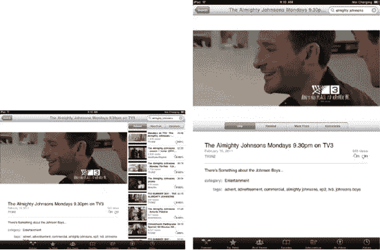

**图 7–11.** *YouTube 视频信息界面在横屏和竖屏模式下都能提供视频的相关信息。横屏布局会显示相关视频列表，竖屏布局则显示更完整的视频描述。*

在视频信息界面中，你可以看到视频名称、评分（星级，零到五星，视情况而定）、观看次数、时长等信息。你还会看到标注为“相关”、“更多来自”和“评论”的标签。

- **相关**：默认显示的标签，列出与当前观看视频相关的视频。YouTube 使用巧妙的算法匹配名称、主题、上传者等方面，为你提供与当前视频最相关的视频列表。
- **更多来自**：点击此标签可查看上传当前视频的 YouTube 用户发布的更多视频。在此标签页中，你还可以点击`订阅`按钮订阅该用户的视频推送。该用户的 YouTube 名称和视频将显示在“订阅”页面中。
- **评论**：点击此标签可阅读其他 YouTube 用户对当前视频发表的评论。你也可以点击“添加评论”字段撰写自己的评论。撰写评论前必须登录你的 YouTube 账户。

##### 管理视频：评分、分享等

在 YouTube 应用中，除了排序和观看视频外，你还能对视频进行更多操作。在视频信息界面中，你可以收藏、分享、评分和标记视频，也可以在嵌入模式和全屏播放之间切换。只需点击视频即可调出 YouTube 控制覆盖层，如图 7–12 所示。

如图 7–12 所示，覆盖层由视频顶部和底部的不透明条组成。底部的控制条可以让你播放/暂停视频，通过滑块快进或快退，以及点击双箭头展开按钮切换至全屏模式。这些都是标准控制，操作方式与你预期完全一致，与其他应用中的视频界面相同。全屏模式下也会出现双箭头按钮，让你从全屏模式返回嵌入模式播放。

顶部的控制条则提供了多种管理视频的选项。在这里，你可以将视频添加到收藏夹、与他人分享、对视频投票（赞或踩），或将视频标记为不适当。所有顶部栏选项都需要 YouTube 账户才能使用。以下是各选项及其功能的简要说明。

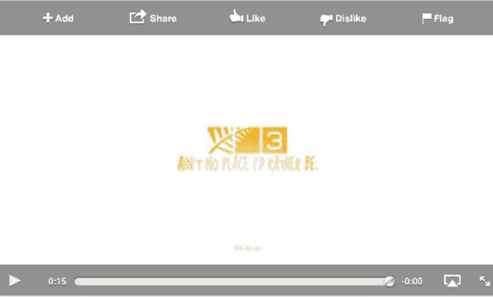

**图 7–12.** *在视频信息界面中点击视频，会叠加显示多种管理选项。*

**注意：** 你必须处于视频信息界面（即嵌入模式）中，才能对视频进行评分、分享等操作。当视频以全屏模式播放时，管理视频工具栏不会显示。唯一的例外是收藏功能。在全屏模式下，屏幕底部的音量滑块旁边会出现一个书签图标。点击它即可将视频添加到收藏夹。

- **添加**：点击此按钮可将视频收藏至收藏夹。如果你有多个收藏列表，可以选择要添加视频的列表。该视频将立即出现在 YouTube 应用的“收藏”按钮下。
- **分享**：点击此按钮可通过电子邮件发送视频链接。无需离开 YouTube 应用，就会弹出一个邮件撰写窗口，主题栏中已填好视频名称，正文中已包含视频链接。只需输入收件人的电子邮件地址即可完成！你还可以像写普通邮件一样，在邮件正文中添加自己的文字。
- **赞/踩**：点击任一按钮可将视频标记为喜欢（竖拇指向上）或不感兴趣（拇指向下）。
- **标记**：点击此按钮将显示一个红色的“标记为不适当”按钮。点击它即可向 YouTube 发送通知。YouTube 会审核该视频，如果认为有必要，会将其从网站下架。请注意：不要仅仅因为不喜欢内容就标记视频。标记功能仅适用于反感内容。如果你错误标记了太多视频，你的 YouTube 账户可能会被暂停。

**注意：** 当你已经对视频进行评分或标记后，评分和标记按钮将变为灰色不可用状态。

#### YouTube 使用技巧

以下是使用 YouTube 应用的一些技巧：

- 使用历史记录界面右上角的`清除`按钮可以擦除你的 YouTube 观看历史记录。这样别人就不会知道你一直在看那只玩滑板的狗了。
- 不要忽略相关视频列表。在视频信息界面向下滚动，可以找到你可能感兴趣的相关视频。YouTube 在添加你可能真正想看的列表方面相当聪明。
- 在“精选”、“评分最高”和“最多观看”页面浏览视频时，一直滚动到底部，你会看到一个带有“加载更多…”字样的灰色视频图标。点击它即可在所选页面上加载更多视频。
- 你可以通过支持的视频线缆（复合、分量、VGA 和 HDMI 线缆均可通过 Apple Store 购买）将 iPad 连接至电视，或者选择 AirPlay 目标设备（如 Apple TV 或 Banana TV 等第三方播放器），从而在电视上播放 YouTube 视频。

### 在 Safari 浏览器中观看网页视频

iPad 上的视频功能并不仅限于专用应用程序。你也可以通过 iPad 的 Safari 浏览器观看 MPEG-4 格式的电影文件。第 6 章 介绍了`Safari`。在这里，你将了解如何连接到万维网上的视频并在你的`Safari`浏览器中观看。

除了 YouTube 之外，许多网站都内嵌了视频。例如，几乎任何新闻网站都能找到内嵌视频。正如我们在第 6 章及本章前面提到的，iPad（因此也包括`Safari`）通常不支持 Flash 播放，这限制了 iPad 显示所有网页视频的能力（参见图 6-20，了解当 Flash 视频在 iPad 的`Safari`浏览器中显示时会发生什么情况）。然而，许多网站提供 HTML-5 和 MPEG-4 格式的视频，这些格式与 iPad 完全兼容。你也可以使用第三方应用程序，如`Skyfire Mobile Browser`，来观看网页上的 Flash 视频。

例如，网站 TED（`www.ted.com`）就完全兼容 iPad，你可以在该网站上观看当今一些最伟大的人物谈论科学、教育、技术和艺术的视频。图 7–13 展示了在 iPad 的`Safari`网页浏览器中播放该网站作者伊丽莎白·吉尔伯特谈论创造力的视频。

你只需点击内嵌视频即可开始播放。根据你的网速，视频可能需要几秒钟才能开始播放。你可以选择在页面内或全屏模式下观看。要在两种视图之间切换，请点击视频，其底部会出现一个导航栏。导航栏上显示播放/暂停按钮、导航滑块以及最右侧熟悉的全屏双箭头按钮。点击双箭头按钮进入全屏视图。要退出全屏视图并返回网页，请点击视频播放屏幕上的“完成”按钮。

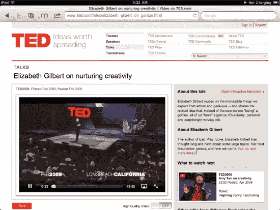

**图 7–13.** *网页上的许多视频都可以在 Safari 网页浏览器中直接播放。*

### 视频配件

如果你打算观看大量视频，应考虑购买以下几种 iPad 配件：

*   ***支架***：多家公司生产此类产品，价格从 5 美元到 100 美元不等。无论你选择哪种支架，请确保它能将 iPad 横向固定，因为这样能为你提供最大的屏幕空间来观看视频。有些保护套也可兼作 iPad 支架。苹果的 iPad 2 Smart Cover（39 美元）可以折叠成一个支架。
*   ***Apple Digital AV Adapter***（39 美元）：使用此适配器（参见图 7–14）通过 HDMI 连接将你的 iPad 连接到任何电视机。双端口设计让你在显示视频的同时，还能通过第二个端口为 iPad 充电。iPad 2 支持屏幕镜像，但该适配器也可用于较旧型号的 iPad，适用于支持视频输出的应用程序，包括视频、照片和 YouTube。
*   ***iPad Dock Connector to VGA Adapter***（29 美元）：适配器的 VGA 端可以连接到外部显示器、某些电视和 PC 投影仪。你需要此适配器或下面列出的线缆，将 iPad 连接到家用电视。与 Digital AV Adapter 一样，此连接器兼容新旧款 iPad。但是，只有 iPad 2 及更新机型才支持屏幕镜像。
*   ***Apple Component AV Cable***（49 美元）和***Composite AV Cable***（49 美元）：这些线缆同样适用于 iPad，提供了另外两种将外部显示器和投影仪连接到设备的方法。使用这些线缆无法在任何 iPad 上实现屏幕镜像。

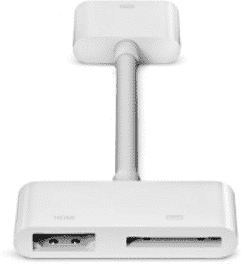

**图 7–14.** *苹果新款 Digital AV Adapter 可为你的 iPad 提供 HDMI 连接。第二个连接器接口让你可以在显示视频的同时为 iPad 充电。*

如果你不清楚 VGA、HDMI、Composite 和 Component 之间的区别，不必担心。这些都是将设备连接到电视的物理视频连接器类型。

*   ***VGA*** 是一种 15 针连接器，在许多 PC 的背面仍能找到。它支持最高 2048×1536 的分辨率。
*   ***HDMI***，即高清晰度多媒体接口，是一种数字音频/视频连接器（可同时传输两种信号），通过单一数字链路提供高达 2560×1600 的高清信号支持。
*   ***Composite*** 是一种视频连接器，通过单个连接传输三种视频源信号。它是这四种技术中最古老的，但仍支持最高 720×576i 的分辨率。
*   ***Component*** 是一种视频连接器，接收三种视频源信号（红、绿、蓝）并通过三个不同的连接输出。它基本上是一条与复合线缆类似的带有三个头的 RCA 线缆，但 Component 提供了更好的分辨率，最高可达 1920×1080p（也称为***全高清***）。

许多现代电视都支持所有这些连接方式。请查看你的电视手册，了解其支持哪些连接方式。

#### 投影视频

虽然苹果的连接线缆能让你将 iPad 视频输出到电视上，但许多创新的第三方厂商也提供了视频解决方案。例如，WowWee 公司售价 430 美元的 Cinemin Slice（`www.wowwee.com`）。它是一个视频系统，允许你连接 iPad（参见图 7–15）并将视频投影到任何屏幕或墙壁上。有了它，你在移动演示时可以避免许多尴尬的线缆布置，而且无需提前准备高清电视。相反，你可以随身携带这个相对较小的设备，并将其显示在任何大的平坦表面上，如果需要，甚至包括天花板——投影头安装在一个铰链上，可以向前和向上旋转。

Slice 可与 iPad 2 的屏幕镜像功能配合使用。如果你需要以横向而非纵向模式进行投影（这可能是大多数商务人士更偏好的），你可以购买一个 40 美元连接包，配合你的苹果品牌 VGA 视频线缆使用。

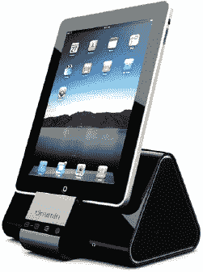

**图 7–15.** *售价 430 美元的 Cinemin Slice 产品提供了一种高便携性的方式，用于在移动演示中投影 iPad 2 屏幕。*

### 在 iPad 上听音乐

当苹果推出 iPad 时，许多人开始在互联网上抱怨它只不过是一个大号的 iPod touch，尽管他们中的大多数人都还没试用过 iPad。甚至有一个流行的恶搞视频，展示慢跑者在晨跑时带着 iPad 而不是 iPod。到现在你已经发现，iPad 远不止是一个大号的 iPod touch，但它*确实*也能像 iPod 一样播放音乐（只是别带着它慢跑；或者，如果你真要这么做，就戴上蓝牙耳机并把 iPad 扔进背包里，这样就不会因为手里拿着一个笔记本电脑屏幕大小的东西跑步而显得很傻，更糟糕的是把它绑在胳膊上）。

对于 iPad 来说，*iPod* 不是一个设备——它是一个应用程序，允许你浏览音频库并选择要播放的项目。一旦你理解了这有点令人困惑的名称转换，你就会发现 iPad 的`iPod`应用带来了你所期望的 iPod 的所有功能和易用性，只是这些功能以一种独特的 iPad 方式呈现。

如果你习惯在 iPod、iPod touch 或 iPhone 上听音乐，你可能会期望 iPad 的音乐播放器有类似的界面。实际上，iPad 的音乐播放器界面与电脑上的 iTunes 更为相似，而不是之前的任何 iPod 界面。这是个好消息，因为如果你习惯在 Mac 或 Windows 电脑上使用 iTunes，你会立刻对 iPad 音乐播放器应用的基本布局感到熟悉。

**注意：** 不要混淆 iPad 上的`iPod`和`iTunes`应用程序。`iPod`用于播放你的音乐曲目。`iTunes`则让你连接移动版`iTunes Wi-Fi Music Store`，它不是通用的音乐播放器。

#### 浏览音乐资料库和播放列表

轻触 iPad 主屏幕上的 `iPod` 图标（参见图 7–16）即可启动该应用。`iPod` 图标呈亮橙色，上面绘有一台经典的 iPod 形象，配有已过时的点按式转盘。这是对过去的致敬，任何在 21 世纪初用 iPod 欣赏过音乐的人都能一眼认出，尽管我的孩子们从未使用过、不理解、也不太可能接触到这种点按式转盘。

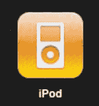

**图 7–16.** iPod 图标。

你首先会注意到 `iPod` 应用（参见图 7–17）的布局，如前所述，与 `iTunes` 类似。在该应用中，你不仅能听音乐，还能像在电脑上一样轻松创建和编辑播放列表。如果你曾在 iPhone 或 iPod touch 上播放过音乐，你会惊讶地发现 iPad 上 iPod 应用的布局更加开阔。iPad 的空间更大，因此你能同时看到更多音乐。无需在冗长的菜单屏幕间上下翻动，iPad 就能在一个界面中呈现更多选项和更多音乐，让查找和欣赏歌曲变得更加轻松。

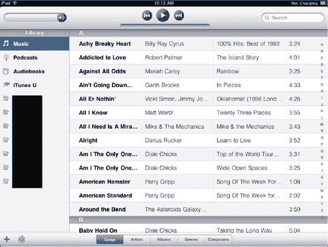

**图 7–17.** iPad 上的 iPod 应用与电脑上的 iTunes 极为相似。

`iPod` 窗口由五个关键元素组成：

- **播放栏**：位于应用顶部，包含音量滑块；播放/暂停、前进和后退按钮；以及搜索栏。
- **资料库来源列表**：在左栏中，你可以看到音乐按照不同类别分类，具体取决于你同步到 iPad 的内容（参见图 7–17）。轻触任一类别即可查看其内容。
    - **音乐**：包含 iPad 上的所有音乐
    - **播客**：包含你的音频和视频播客
    - **有声读物**：包含你的有声读物
    - **iTunes U**：包含你的 iTunes U 讲座和课程
    - **Genius 混曲**：包含你选择从 iTunes 同步的任何 Genius 混曲
    - **已购买**：包含你通过 iTunes Store 购买的所有音乐和音乐视频

在这五个类别下方，你可能会看到许多不同的播放列表。播放列表分为三种类型（参见图 7–18）：

- **常规播放列表**：由四条横线和一个音符图标表示。常规播放列表包含你手动添加到列表中的任何音乐。它不会自动更新，只有当你添加或移除歌曲时才会变化。
    - **智能播放列表**：由名称前的齿轮图标表示。智能播放列表是指你设置了一组歌曲必须符合的特定规则。任何匹配规则的歌曲都会显示在播放列表中。
    - **Genius 播放列表**：由看起来像被电子包围的原子图标表示。Genius 播放列表是 `iTunes` 或 `iPod` 应用根据你资料库中的一首歌曲自动生成的播放列表。该播放列表将填充与你选择作为播放列表源歌曲搭配起来效果极佳的歌曲。

**注意：** 请参阅本章后面的“创建播放列表”部分，了解如何在 iPad 上创建播放列表。

**图 7–18.** 播放列表类型包括（从上到下）Genius 播放列表、智能播放列表和常规播放列表。

- **歌曲列表**：这是 `iPod` 应用的主体部分。它显示所选类别或播放列表中的所有歌曲。用手指上下滑动即可浏览列表。如果列表很长，屏幕右侧会出现一个字母索引控件，如图 7–17 所示。轻触一个字母，或沿着字母索引向下滑动手指，即可跳转到你想查看的部分。
- **创建与排序栏**：这是位于应用底部的栏（参见图 7–19）。通过此栏，你可以创建新的播放列表和 Genius 播放列表，还可以按歌曲、艺人、专辑、风格或作曲家对歌曲列表中的音乐进行排序。

**图 7–19.** 创建与排序栏

- **封面图**：歌曲的封面图（歌曲所属专辑的封面）显示在 `iPod` 应用屏幕的左下角，位于资料库来源列表的正下方。轻触封面即可进入“正在播放”窗口（本章稍后的图 7–20 中会显示）。

**注意：** 资料库来源列表中，只有“音乐”、“已购买”以及播放列表可以按歌曲、艺人、专辑、风格或作曲家进行排序。播客、有声读物、iTunes U 和 Genius 混曲不具备排序选项。

#### 其他歌曲控制选项

浏览资料库中的音乐时，你可以利用几个按钮来选择如何查看曲目。使用这些按钮有助于找到你正在寻找的项目。位于图 7–17 底部中央的选项包括：

- **歌曲**：以字母顺序列表显示 iPad 音乐资料库中的所有歌曲。
- **艺人**：以字母顺序列表显示资料库中的所有艺人。轻触一位艺人可查看其所有专辑以及每张专辑下的歌曲。轻触任意歌曲即可播放。
- **专辑**：以字母顺序缩略图列表显示资料库中的所有专辑。轻触一张专辑封面，它会向前弹出并翻转，显示一个缩小的专辑视图。轻触一首歌曲即可开始播放。
- **风格**：以字母顺序缩略图列表显示资料库中所有歌曲的风格。轻触一个风格封面，它会向前弹出并翻转，显示一个缩小的专辑视图。显示的歌曲可能来自许多不同的艺人。轻触一首歌曲即可开始播放。
- **作曲家**：以字母顺序列表显示资料库中的所有作曲家。轻触一位作曲家的名字可查看其所有专辑以及每张专辑下的歌曲。轻触任意歌曲即可播放。

#### 从音乐资料库和播放列表播放音频

无论你是在主音乐资料库中，还是在标准、智能或 Genius 播放列表中，要开始播放一首歌曲，只需轻触它。图 7–20 显示了 `iPod` 应用的“正在播放”屏幕。每当你开始播放歌曲时，就会进入此屏幕。

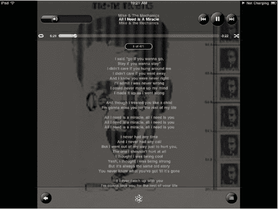

**图 7–20.** iPod 应用的“正在播放”屏幕提供了一个交互式画面，可控制当前播放项目的播放。在此屏幕中，你可以调节音量、暂停和恢复播放，以及循环当前曲目。如果你在 iTunes 中添加了歌词，歌词也会显示在此处。

你还会注意到，iPad 状态栏中出现了一个“播放”指示器（参见图 7–21）。屏幕右上角（电池状态左侧）向右指的“播放”指示器，在播放音乐时会普遍出现。这让你一眼就能知道音乐正在播放。当你取下耳塞并将 iPad 放在桌子上时，这一点尤其有用。它会提醒你，你的电池正在开心地消耗电量，因为你的 iPad 正在播放无人聆听的音乐。

**图 7–21.** 播放指示器位于 iPad 状态栏中电池状态的旁边。

#### “正在播放”屏幕

“正在播放”屏幕（参见图 7–20）分为三个部分。以下是对每个部分及其包含的信息和控件的详细介绍。

##### 标题栏

标题栏（见图 7–22）是“播放中”屏幕顶部的黑色横条，包含以下项目：

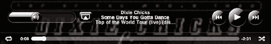

**图 7–22.** *“播放中”屏幕上的标题栏*

-   *音量滑块*：沿滑块拖拽以调节音量。你也可以使用 iPad 的物理音量按钮调节音量。如果已连接外部扬声器或遥控器，亦可使用其开关来控制播放音量。
-   *AirPlay 按钮*：当家庭网络中有支持音乐的 AirPlay 接收器可用时，音量滑块右侧会出现一个 AirPlay 按钮。轻点该按钮并选择一个接收器，即可将音乐重定向到该设备。由于苹果高度加密的 AirTunes 协议，音乐和音频的 AirPlay 功能在 2011 年春季之前仅限于苹果品牌的接收设备，之后该协议才最终被逆向工程，从而允许第三方应用程序访问。
-   *艺人、歌曲和专辑*：这些项目显示在屏幕顶部中央，仅供信息参考。轻点它们不会有任何操作。
-   *快退*：快退按钮看起来像一条竖线后面跟着两个指向左侧的三角形。
    -   轻点一次可跳回当前播放歌曲的开头。
    -   轻点两次可跳转到专辑或播放列表中的上一首歌曲。如果当前已在歌曲开头，轻点一次则回到上一首；若已在第一首，该操作效果如同按下“返回”按钮——你会回到最近的专辑或播放列表屏幕。
    -   长按可快退当前歌曲。向后快退时，你会听到极短的片段。此功能在收听有声读物时尤其方便。
-   *播放/暂停*：“播放”图标看起来像一个指向右侧的三角形。“暂停”图标看起来像两条竖线。轻点此按钮可在播放和暂停模式之间切换。
-   *快进*：快进按钮看起来像是快退按钮的镜像。竖线在右侧，两个三角形都指向右侧而非左侧。
    -   轻点一次可跳转到专辑或播放列表中的下一首歌曲。如果当前已是最后一首，轻点快进会回到专辑或播放列表开头。
    -   长按可快进当前歌曲。

在标题栏下方，您会看到一个细条，其中包含循环按钮、进度条和随机播放按钮（见图 7–22）。

-   *循环控制*：此控件看起来像是一对箭头在圆环中彼此指向，轻点专辑封面时会出现。
    -   *轻点一次可循环播放当前专辑或播放列表。最后一首歌曲播放完毕后，第一首歌曲会重新开始播放。*
    -   *轻点第二次可仅循环当前歌曲。循环图标上会出现数字 1，表示循环仅适用于此歌曲。*
    -   *再轻点一次可禁用循环。*
    -   *蓝色循环图标（无论是普通循环还是带数字 1 的循环）表示循环功能已启用。白色循环图标表示循环已关闭。*
-   *进度条*：进度条位于循环控制右侧。轻点专辑封面可使此控件显示；再次轻点则可隐藏。
    -   进度条左侧的数字显示已播放时间。右侧的数字显示剩余播放时间。
    -   拖拽播放头可设置歌曲的播放起点。你可以在歌曲播放时进行此操作，以便听到你已到达哪个位置。
-   *随机播放*：随机播放控件看起来像两条箭头形成一个波浪形的 *X*。它位于进度条的右侧，与循环和进度条控件一样，只有在轻点专辑封面后才会出现。
    -   当随机播放控件关闭（白色）时，专辑和播放列表中的歌曲按顺序播放。
    -   当随机播放控件被选中（蓝色）时，iPod 应用会随机排列歌曲顺序进行乱序播放。

**注意：** 如果你在 iPad 上使用带有线控和麦克风的苹果 iPhone 耳机听音乐，iPhone 耳塞的所有按钮和点击功能均能正常使用（尽管苹果未将耳塞列为 iPad 官方配件）。单击可播放/暂停歌曲。双击可跳到下一首歌曲。三击可返回上一首歌曲。轻点耳塞上的 `+` 或 `–` 按钮可增大或减小音量。iPhone 耳塞上的麦克风与 iPad 配合使用也毫无问题。带有线控和麦克风的苹果耳塞在苹果官网的售价为 `$29`。

##### 专辑封面

在进度条下方，你会注意到歌曲的专辑封面占据了显示屏幕的大部分区域（见图 7–20）。

-   *专辑封面*：当你下载了专辑封面后，封面图像会显示在顶部横条下方，并占据大部分屏幕。（当 iPad 找不到专辑封面时，它会在白色背景上显示一个浅灰色的音符图标）。
-   *歌曲计数*：这是一个药丸形状的小按钮，显示当前歌曲在播放列表中的序号以及列表中的歌曲总数。
-   *歌词*：如果歌曲文件中嵌入了歌词，歌词将显示在专辑封面上。轻点一次可使歌词和其余控制界面消失。再次轻点专辑封面可将其重新显示。

##### 底部横条

在“播放中”屏幕的底部，你会看到一个黑色粗横条（见图 7–23），其中包含以下内容：

-   *返回按钮*：轻点横条左端的返回按钮（指向左侧的箭头）可返回到最近的专辑或播放列表屏幕。轻点返回按钮不会停止播放。当你浏览各类别或轻点主屏幕按钮在 iPad 上进行其他操作时，歌曲会继续播放。
-   *Genius 按钮*：这个居中的按钮看起来像一个带有环绕电子的原子。轻点它，会基于当前正在播放的歌曲创建一个 Genius 播放列表。当你导航回音乐资料库时，你会看到一个标记为“Genius”的播放列表以及其他几个选项。稍后我们会讨论这些选项。
-   *专辑视图按钮*：此按钮看起来像一个带有三个项目的列表符号列表，位于横条的右端。轻点此按钮可在“播放中”屏幕与其专辑视图之间切换。

**图 7–23.** *“播放中”屏幕底部的横条允许你创建 Genius 播放列表并进入专辑视图。*

#### 专辑视图

`Album View`（专辑视图）是一种强大且有趣的音乐浏览方式。您可以通过两种方式访问`专辑视图`，这两种方式都位于`Now Playing`（正在播放）窗口中。事实上，`专辑视图`是`正在播放`窗口的一部分。当您访问它时，您会看到`正在播放`窗口顶部和底部的栏保持不变（参见图 7–24）。

-   双击专辑封面区域以显示`专辑视图`。封面会翻转过来，然后您将看到该专辑的完整歌曲列表。
-   点击`正在播放`窗口底部粗栏中的`专辑视图`按钮。当前歌曲的封面会翻转过来，然后您将看到该专辑的完整歌曲列表。

要退出`专辑视图`，请点击屏幕右下角的小型专辑封面缩略图（即`专辑视图`按钮之前所在的位置）。专辑的歌曲列表将翻转回来，并再次显示封面。或者，点击屏幕左下角的`返回`按钮，您将返回主 iPod 应用屏幕。您的音乐将继续播放。

为什么要使用`专辑视图`？假设您正在听一个播放列表，突然播放了一首您很久没听的歌曲。这是一首很棒的歌，您想看看这张专辑里还有哪些其他歌曲。`专辑视图`让您无需离开播放列表就能做到这一点。只需使用前面提到的任一方法访问它，您就会看到一个屏幕，其中显示了该专辑所有歌曲的曲目列表，以及它们的名称和时长。上下滚动曲目列表，以查看当前播放列表或专辑中的所有项目。点击任意项目即可开始播放。

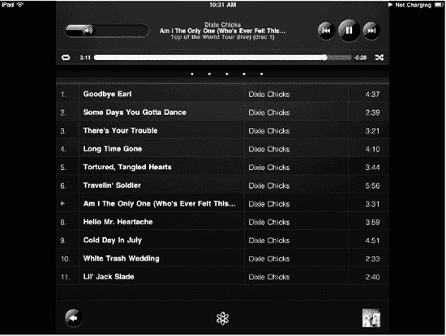

**图 7–24.** *`专辑视图`显示当前专辑或播放列表的曲目及其时长列表。*

`专辑视图`还允许您为歌曲评分。使用出现在进度条下方的星级控件为当前歌曲评分，从零星到五星。在星级上拖动手指以设定您的评分。这些评分会同步回您的电脑。为音乐评分是个好习惯，因为这能帮您记录下真正喜欢的歌曲。您可以创建智能播放列表来包含所有五星歌曲，从而在一个地方即时访问它们。

此外，如果您在桌面版`iTunes`中使用了`iTunes DJ`功能，评分较高的歌曲播放频率会更高。`iTunes DJ`是`iTunes`的一项功能，它会从您的音乐库中挑选歌曲并创建不间断的音乐播放。当您举办派对时，这个功能非常棒。`iTunes DJ`并非 iPad 上 iPod 应用的功能。

**提示：** 当`专辑视图`中的曲目列表有空余空间时——例如，当您只有一两首曲目时——双击空白区域即可返回`正在播放`屏幕。或者，双击评分星级显示的任意一侧。

##### 创建播放列表

本章前面介绍了不同类型的播放列表。您选择从`iTunes`同步的播放列表将自动出现在您的 iPod 应用中。但您不限于在电脑上创建播放列表。您可以直接在 iPad 上创建播放列表和`Genius`（天才）播放列表，从而在移动中构建音频收听体验。

##### 创建播放列表

要创建一个标准播放列表，请点击 iPod 应用屏幕左下角的`+`按钮（参见图 7–17）。会弹出一个窗口，要求您为播放列表命名。输入一个名称，然后点击`保存`。紧接着，iPad 上所有歌曲的列表会滑入屏幕。通过点击每首曲目旁边的蓝色`+`按钮，选择您要包含在播放列表中的歌曲。当您选择一首歌曲时，它会显示为灰色。您还会在歌曲列表的顶部找到一个`添加所有歌曲`选项。不过，添加库中所有歌曲会违背创建播放列表的初衷。

如果您误选了一首歌曲，此时无法取消选择，但您可以稍后轻松将其移除。您可以将同一首歌曲多次添加到播放列表中。之后，您可以通过编辑播放列表来删除这些副本（下一节将讨论）。

在向播放列表添加歌曲时，您有几种选项来浏览您的音乐库以找到想要的歌曲。在`添加到播放列表`屏幕的底部，您会看到 iPod 应用的五个分类视图：`歌曲`、`艺术家`、`专辑`、`流派`和`作曲家`。选择其中任意一个，对您的歌曲库进行分类，然后点击相应的歌曲将其添加到播放列表。

您还可以通过 iPod 应用的`资料库`源列表进行导航，以找到要添加到播放列表的项目。为此，请点击屏幕左上角的`来源`按钮，将出现一个下拉列表，显示您资料库中的来源和现有播放列表（参见图 7–25）。您可以将有声读物、歌曲和播客组合到同一个播放列表中。添加完歌曲后，点击蓝色的`完成`按钮。

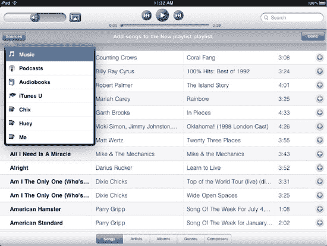

**图 7–25.** *向播放列表添加歌曲。您可以搜索整个资料库来查找歌曲，或从资料库中选择一个来源或播放列表。*

##### 编辑播放列表

当您向新播放列表添加完歌曲并点击右上角的蓝色`完成`按钮后，您将进入播放列表编辑屏幕（参见图 7–26）。此屏幕允许您添加、删除、重新排列和随机播放歌曲，以及完全删除播放列表。

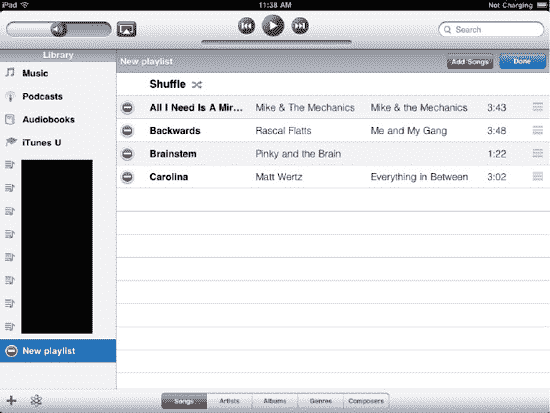

**图 7–26.** *播放列表编辑屏幕允许您在创建播放列表后进一步自定义它们。*

您可以从任何现有播放列表中，通过点击其右上角的灰色`编辑`按钮来访问播放列表编辑屏幕。该播放列表编辑屏幕允许您执行以下操作：

-   *添加歌曲*：点击`添加歌曲`按钮，再次进入`添加到播放列表`屏幕，并按照之前的步骤操作，直到添加完您想要的项目；然后再次点击蓝色的`完成`按钮。
-   *删除歌曲*：点击白色和红色的减号（`−`）按钮以移除选定的歌曲。点击歌曲右侧出现的红色`删除`按钮以确认删除。从播放列表中移除歌曲不会将其从您的 iPad 或电脑上的音乐资料库中删除。
-   *重新排列歌曲*：长按歌曲右侧的拖动条，并进行拖动以在播放列表中重新排列。
-   *删除播放列表*：如果您决定不再需要该播放列表，请点击源列表中播放列表名称旁边的白色和红色减号（`−`）按钮以删除该播放列表。点击播放列表名称右侧出现的红色`删除`按钮以确认删除。删除播放列表不会将其包含的歌曲从您的 iPad 或电脑上的音乐资料库中删除。iPod 应用会提示您确认删除。

**注意：** 您只能编辑标准播放列表。如果您从电脑上的`iTunes`同步了一个智能播放列表（图标旁边带有机器齿轮的那种），您将无法对其进行编辑。

#### 创建 Genius 播放列表

`Genius` 是 iTunes 中的一项功能，能自动找到你音乐资料库中风格相近的歌曲。它通过匹配节奏、节拍、歌手、音乐类型以及网络数据来实现这一点。`Genius` 播放列表是指当你对正在收听的歌曲运行`Genius`功能后生成的歌曲列表。

你可以在电脑上或 iPad 上的 iTunes 中创建 `Genius` 播放列表。不过，要启用`Genius`功能，你首先需要在电脑上通过 iTunes 打开它。具体操作是：在电脑上启动 iTunes，进入 `Store` 菜单，然后选择 `Turn on Genius`。你需要使用 iTunes Store 账户登录（关于创建 iTunes 账户，请参见第 8 章），才能访问`Genius`功能。输入你的用户名和密码，同意条款与条件，然后静待 Apple 分析你的音乐资料库。

你可以通过两种方式创建 `Genius` 播放列表：

- 点击 iPod 应用主屏幕底部的 `Genius` 图标（参见图 7–17）。该图标看起来像一个被电子环绕的原子。如果没有歌曲正在播放，系统会像创建播放列表时一样，显示一个歌曲列表。点击一首歌曲，将其作为创建`Genius`播放列表的基础。
- 在“正在播放”窗口中，点击底部栏中央的 `Genius` 图标（参见图 7–20）。

一个名为 `Genius` 的新播放列表会出现在你的音乐资料库源列表中。在其歌曲列表中，你可以滚动浏览，查看`Genius`挑选出了哪些歌曲。该播放列表通过歌曲列表顶部的三个按钮提供三个选项：

- **新建**：点击 `New` 开始创建一个全新的 `Genius` 列表。iPod 应用会显示一个歌曲列表供你选择新歌曲。选择你想要作为播放列表基础的歌曲，然后让内置的`Genius`功能开始工作。
- **刷新**：点击 `Refresh` 可以围绕你最初选择的歌曲重建 `Genius` 播放列表。这允许你保留相同的播放列表风格，但会更新一批与该主题匹配的曲目选项。如果你正在锻炼并播放完了列表，但想继续听与刚才相同类型的歌曲，这个功能非常棒。
- **保存**：`Genius` 是否生成了一组你绝对喜欢、想保留下来反复播放的精彩歌曲集？点击 `Save` 可将你的 `Genius` 播放列表保存下来以供日后使用。点击 `Save` 后，播放列表的名称会从 `Genius` 变为你当初选择用来创建该列表的那首歌的名称。

### 编辑 `Genius` 播放列表

`Genius` 播放列表提供以下两个管理选项。当选中 `Genius` 播放列表时，这两个选项会以按钮形式出现在歌曲列表上方。

- **刷新**：点击 `Refresh` 会用基于你最初选择的全新歌曲填充 `Genius` 播放列表。使用此选项，你可以在切换音乐的同时保持主题不变。列表中之前的所有歌曲都会被移除，但仍保留在你的音乐资料库中。
- **删除**：点击 `Delete` 后，源列表中 `Genius` 播放列表名称旁会出现一个白底红字的减号 (−) 按钮。点击减号按钮可从 iPad 上移除该播放列表，然后点击 `Genius` 播放列表名称右侧出现的红色 `Delete` 按钮以确认删除。系统会弹出一个窗口，警告你删除 `Genius` 播放列表将会在下次同步时将其从电脑的 iTunes 资料库中删除。点击 `Delete` 确认删除。

**注意：** 一旦 `Genius` 播放列表同步回电脑上的 iTunes，你将无法在 iPad 上删除它。你唯一的选择是 `Refresh`。如果你想删除该 `Genius` 播放列表，必须通过电脑上的 iTunes 进行操作。

#### 播放 Genius 混合曲

在 iPad 上探索音乐的另一种方式是播放 `Genius` 混合曲。`Genius` 混合曲与 `Genius` 播放列表类似，但你无法控制其中出现哪些歌曲，而且每次播放时歌曲都会变化。

在电脑上，当你启用 `Genius` 功能时，iTunes 会自动创建 `Genius` 混合曲。`Genius` 混合曲基于音乐类型和格式，而不是像 `Genius` 播放列表那样基于单首歌曲。你可以拥有任意数量的不同混合曲——这完全取决于你的 iTunes 资料库中拥有的歌曲类型。`Genius Mixed` 的例子包括朋克混合曲、流行混合曲、古典跨界混合曲、民谣混合曲……名单可以一直列下去。

要播放 `Genius` 混合曲，请点击源列表中的 `Genius Mix`。iPad 会显示一系列 `Genius` 混合曲，每个混合曲由四个专辑封面组成一个方块来表示（参见图 7–27）。这些封面代表了该混合曲中包含的歌曲样本。要开始播放一个混合曲，点击它即可。该混合曲的四封面图标会变成混合曲中当前正在播放歌曲的专辑封面。

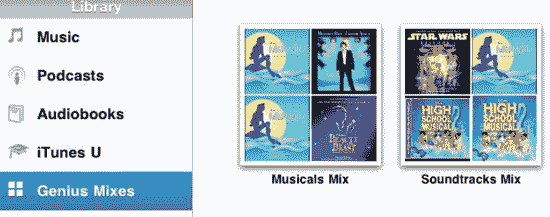

**图 7–27.** *iPad 上的 `Genius` 混合曲让您能够收听按音乐类型自动生成的合集音乐。*

在混合曲播放时，你的导航选项有限。你不会看到混合曲中的歌曲列表，只能通过“前进”和“后退”按钮在歌曲之间切换。当前正在播放的专辑仍会显示在“正在播放”屏幕上。

#### 播放播客、有声读物和 iTunes U 课程

如果你已将播客、有声读物和 iTunes U 课程同步到 iPad，这些类别会连同其他播放列表一起显示在 iPod 应用资料库的源列表中。要查看每个类别中可用的项目，只需点击该类别名称即可。与音乐不同的是，在项目列表中无法对播客、有声读物和 iTunes U 课程进行排序。

对于播客和 iTunes U 课程，点击该系列或课程，然后选择剧集或课程开始播放该内容。要播放有声读物，请在列表中点击你选择的有声读物。

当你选择一个播客、有声读物或 iTunes U 课程时，“正在播放”屏幕会出现。虽然这个屏幕与音乐的“正在播放”屏幕相似，但有一些细微的差别（参见图 7–28）。

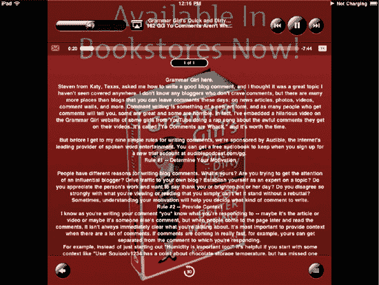

**图 7–28.** *播客、有声读物和 iTunes U 课程的“正在播放”屏幕提供了几个音乐的“正在播放”屏幕所没有的额外功能。*

#### “正在播放”屏幕

如你所见，“正在播放”屏幕的布局与音乐播放时的布局相同（参见图 7–28）。然而，它提供了一些新功能：

- **电子邮件**：点击进度条左侧的信封图标，可通过电子邮件分享当前播放播客的链接。
- **音频速度按钮**：点击 `1X` 图标一次，它会变成 `2X` 图标。这会使音频播放速度加倍。点击 `2X` 图标，它会变成 `1/2X` 图标。这将以正常速度的一半播放音频，如果你觉得对话语速太快难以跟上，这会很有帮助。点击 `1/2X` 图标，它会变回 `1X` 图标，使音频播放速率恢复正常。
- **30 秒按钮**：此按钮出现在屏幕底部中央。其标识是数字 `30` 和环绕它的逆时针双箭头。点击此按钮可在播客或有声读物中回跳 30 秒。此功能让你无需使用进度条进行倒带，因为进度条倒带可能会让你跳回比预期远得多的位置。如果你走神了，错过了刚才说的内容，快速点击 30 秒倒带按钮就能让你迅速跟上。
- **专辑视图按钮**：该按钮看起来像一个三项项目符号列表，也出现在音乐的“正在播放”屏幕中，但视图本身不同。在播客、有声读物或 iTunes U 课程中，专辑视图会分别显示所有剧集、章节或课程的列表。

#### 搜索

iPod 应用提供了一个易于使用的搜索功能，让您能快速找到歌曲。当您拥有庞大的媒体库，不想花时间翻阅冗长的歌曲列表时，这功能就超级实用。轻点 iPod 应用屏幕右上角的搜索栏，键盘就会弹出。输入搜索关键词时，搜索结果列表会自动开始填充您屏幕的主要部分（参见图 7-29）。

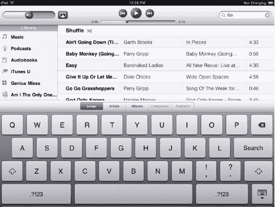

**图 7-29.** *iPod 应用的搜索功能*

您可以通过轻点键盘上方的相应按钮，按歌曲、艺人、专辑、作曲家、播客或有声书来浏览搜索结果。如图 7-29 所示，哪些按钮处于激活状态取决于您已载入 iPad 媒体库中的媒体类型。

您也可以用手指滚动查看结果。这样做会隐藏键盘，以便您看到更长的结果列表。要重新调出键盘，只需再次轻点搜索栏即可。轻点任意歌曲即可播放。您的搜索结果列表会一直保留，直到您导航到源列表中的某个类别或播放列表，或轻点搜索栏中的 `×` 按钮。

**提示：** 您也可以在不打开 iPod 应用的情况下搜索歌曲。使用主屏幕左侧的 iPad 聚焦功能来搜索歌曲；然后轻点它即可开始播放。

#### 在其他应用中显示音乐播放控制

我们已经提到过，即使您离开 iPod 应用，您的音乐、播客和有声书仍会继续播放。好消息是，您无需返回 iPod 应用就能切换曲目。只需快速连续双击 iPad 的实体主屏幕按钮，调出最近使用的应用列表，然后向右滑动即可找到您的 iPad 播放控制（参见图 7-30）。在这个小的弹出窗口中，您可以浏览歌曲、调节音量或选择 AirPlay 目标。要关闭此面板，请轻点主屏幕上的任意位置。轻点右侧的 iPod 图标可直接跳转至 iPod 应用。

**图 7-30.** *这些 iPad 控制项会出现在您最近使用的应用左侧。向右滑动即可发现这个小宝藏。*

您也可以在 iPad 锁定时访问这些控制项。只需双击 iPad 的主屏幕按钮，iPod 导航栏就会出现在屏幕顶部（参见图 7-31）。

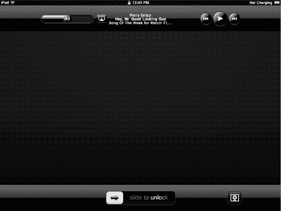

**图 7-31.** *只需轻按两下 iPad 的主屏幕按钮，iPod 选项便会出现在 iPad 的锁定屏幕上。即使 iPad 已锁定，您也可以使用这些按钮和滑块来控制音乐播放。*

#### iPod 应用设置

令人惊讶的是，对于像 iPod 这样功能丰富的应用，iPad 为其音乐播放器只提供了少量设置。您可以在“设置”  iPod 中找到这些设置（参见图 7-32），它们的作用如下：

*   *音量检查*：假设您正在听一首录制音量过低的歌曲。于是，您在播放时调高了音量。然后当下一个歌曲开始播放时，*轰！*——您的耳膜就遭殃了。音量检查可以防止这个问题。当您启用音量检查后，所有歌曲都会以大致相同的音量水平播放。

    **提示：** 您也可以在 iTunes 中使用音量检查。在 Windows 上选择“编辑”“偏好设置”“播放”“音量检查”，或在 Mac 上选择“iTunes”“偏好设置”“播放音量检查”。

*   *均衡器*：iPad 提供了多种均衡器设置，有助于强调不同类型音乐的回放效果。您可以从“原声”、“舞曲”、“有声读物”以及许多其他预设中进行选择。要禁用均衡器，请选择“关闭”。
*   *音量限制*：面对现实吧，个人音乐播放器让您的音频变得非常贴近个人——实际上如此贴近，以至于您的听力可能面临风险。虽然不是专门的音乐播放器，但 iPad 也不例外。我们强烈建议您利用 iPad 内置的音量限制功能来保护您的耳朵。轻点“音量限制”，然后使用滑块调节最大音量。滑动到最左边是静音——当然，这样可以保护您的耳朵，但您也什么都听不到了。滑动到最右边是正常的、无限制的最大音量。如果您极度担心，或者更常见的情况是，如果儿童可以使用您的 iPad，请轻点“锁定音量限制”以打开一个屏幕，允许您设置音量限制的密码。没有正确的密码，任何人都无法覆盖您的音量设置。
*   *歌词与播客信息*：此设置允许您在播放音频时显示或隐藏歌词和播客信息。您在“正在播放”窗口中查看歌曲或播客时，将看到此信息。

**提示：** 如果您的歌曲没有嵌入歌词，您可以自己添加。在 iTunes 中，选择一首歌曲，然后按下 `Cmd+I`（Mac）或 `Ctrl+I`（Windows）。在歌曲的“简介”屏幕上，导航到“歌词”标签页。您可以将您拥有的歌曲歌词粘贴到歌词字段中。还有一些应用可以搜索您的 iTunes 歌曲并自动添加歌词信息。在 Mac 上尝试 Get Lyrical ([`www.shullian.com`](http://www.shullian.com))，在 Windows 电脑上尝试 SoundCrank ([`www.soundcrank.com`](http://www.soundcrank.com))。

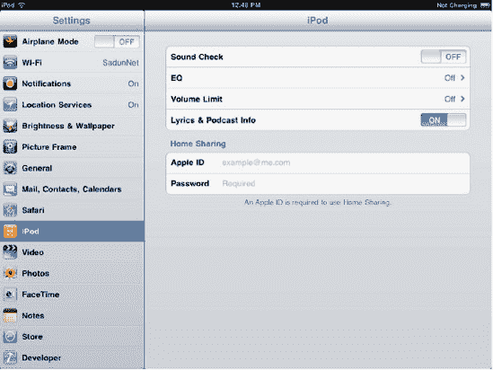

**图 7-32.** *iPod 应用的“设置”屏幕允许您设置均衡器、调整音量限制，以及为 iTunes 新的“家庭共享”功能添加凭据。*

#### 设置家庭共享

“家庭共享”允许您在 iPad 上播放家庭电脑中存储的音乐。这基本上与 AirPlay 的功能相反，AirPlay 是将音乐和视频从 iPad 发送到其他设备进行播放。要使“家庭共享”正常工作，您的电脑和 iPad 必须连接同一个 Wi-Fi 网络，并且 iTunes 必须在您的电脑上运行。“家庭共享”是 iTunes 应用本身的一项功能，它必须能够将数据提供给网络，并从网络传送到您的 iPad。

通过在“设置”中输入您的 Apple ID 和密码来启用“家庭共享”（参见图 7-32）。您必须使用与家庭电脑登录时相同的 Apple ID 和密码。如果未能做到这一点，您将无法访问您的音乐。

在您的家庭电脑上，启动 iTunes，然后选择“高级”“打开家庭共享”。输入您的 Apple ID 和密码，然后点击“创建家庭共享”。

从 iPad 这边，您可以通过轻点 iPod 应用源列表顶部的“资料库”项来访问家庭共享媒体（参见图 7-33）。从弹出菜单中选择您想要浏览的共享资料库。选择后，资料库内容可能需要一两分钟来加载（最终会出现一个进度环，让您知道需要多长时间）。加载完成后，家庭共享的资料库会替换当前的资料库，并且“家庭共享”弹出菜单中的勾选标记会切换到正在使用的资料库。您可以通过从“家庭共享”弹出菜单中选择您的 iPad，随时返回到您的本机资料库。

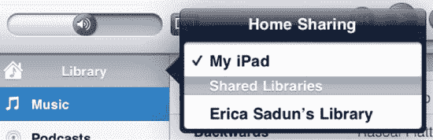

**图 7-33.** *从 iPod 应用源列表顶部的“资料库”项访问共享资料库。*

### 总结

在本章中，你学习了如何通过`YouTube`和`Videos`应用程序以及在`Safari`网页浏览器中观看视频。你还学习了如何使用`iPod`应用程序和`家庭共享`浏览和播放你的音乐与播客。

以下是几个你应该牢记并思考的要点：

-   视频播放功能在各应用程序间保持一致。如果你能在`YouTube`中操作视频，那么你也会知道如何在`Safari`中使用它。各屏幕界面之间的差异很小，易于掌握。
-   设置一个免费的`YouTube`账户，能让你更充分地使用`YouTube`应用。你将能够收藏你喜欢的视频、订阅视频推送，并对你喜爱的片段进行评分和分享。
-   `iPod`应用有三种类型的播放列表：标准、智能和`Genius`。`iPod`应用允许你创建并编辑其中两种：标准播放列表，你可以手动添加歌曲；以及`Genius`播放列表，它会根据你在音乐库中选择的某一首歌曲自动生成一个歌曲列表。
-   保护你的耳朵。使用内置的音量控制和限制器来调整播放音量。你可以在[www.cdhh.org/resources.php](http://www.cdhh.org/resources.php)了解更多关于噪声性听力损失日益频发的信息。
-   不要忘记，无论你当前在使用哪个应用程序，双击`Home`按钮都可以调出音乐控制功能。
-   `家庭共享`目前仅能在你的`iPad`和电脑处于同一`Wi-Fi`网络下时使用。希望苹果公司在未来的更新中能将其扩展到远程访问。要求你使用苹果账户进行身份验证，暗示着这一功能即将推出。

