# 购买应用、书籍、音乐等更多内容

你可能认为你的`iPad`是一台连接互联网的电脑，但它远不止于此。它还是一个软件商店、书店、音乐商店，以及购买视频和电影的地方。当你可以直接在`iPad`上租赁并立即观看电影时，又何必要开车去`Redbox`自助租赁机或者等待`Netflix`的`DVD`寄到邮箱呢？

`iPad`建立在苹果构建电子店面以方便购买数字内容的历史之上。这一切始于 2003 年 4 月 28 日的`iTunes Music Store`，仅仅五年后，苹果便成为了美国第一大音乐销售商。现在被称为`iTunes Store`，苹果的数字商店占据了全球数字音乐销量的 70%。

通过`iTunes Store`，你可以访问全球超过 1100 万首歌曲。如果你的`iPad`使用的是美国`iTunes Store`，你还可以访问超过 100 万个播客、4 万个音乐视频、3000 个电视节目、2 万本有声书、2500 部电影以及近 30 万个 iPhone 和`iPad`应用程序。

你无需前往实体店购买这些应用——它们都可以通过每台`iPad`都内置的名为`App Store`的应用程序获取。`App Store`类似于整个`iTunes Store`中专门针对软件的区域，而`App Store`应用为你提供了一种快捷方式，可以直接在你的`iPad`上搜索、了解并购买应用。

自 2010 年 4 月 3 日`iPad`发布以来，苹果打开了一家新商店的大门——`iBookstore`。虽然它的选择尚不及亚马逊的`Kindle Bookstore`，但已有大量经典和新版书籍可供选择。

在本章中，我们将带你进行一场虚拟购物之旅，购买应用、音乐、电影、视频和电视节目以及书籍，而所有这一切都只需你坐在`iPad`前即可完成。

#### App Store

`App Store`于 2008 年 7 月 11 日开设了其虚拟大门，截至本书印刷时，已售出超过 100 亿个应用。这些应用中的大多数是为`iPhone`和`iPod touch`编写的，但可以在`iPad`上不经修改地运行。许多应用是专门为利用`iPad`更大的屏幕和更快的处理器而编写的，有些应用在两个平台上都能运行，但只有在`iPad`上查看时才会显示出更强大的功能。

当你在`第 1 章`中激活你的`iPad`时，系统会要求你输入现有的`Apple ID`或注册一个新的。通过这样做，苹果建立了所有设备内商店共用的支付和授权机制。这意味着你已经准备好直接在你的`iPad`上从任何苹果商店进行购买了。

当你`iPad`上启动`App Store`时，映入眼帘的界面看起来像`图 8-1`。

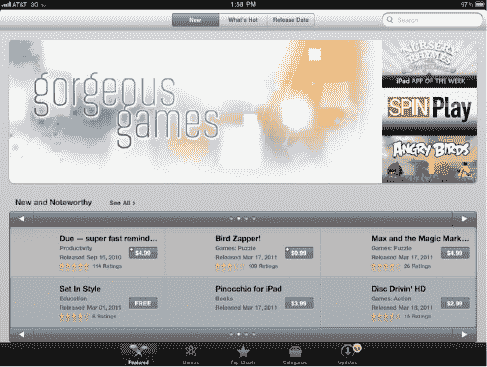

**图 8-1.** *iPad App Store*

默认情况下，`App Store`最初会向你展示精选应用。你如何辨别？在`App Store`页面底部有五个图标：`精选`、`Genius`、`排行榜`、`类别`和`更新`。

#### 精选应用

在商店的顶部，你会看到三个按钮：`新内容`、`热门内容`和`发布日期`。这些按钮中的每一个都会以略微不同的视图展示`App Store`的库存内容。我们先从查看`新内容`视图开始。

#### 新品

页面顶部是不断更新的新品应用示例展示。这些应用被`App Store`团队标记为独特或畅销之作。当你看到感兴趣的某个应用时，只需轻点一下，就会出现详细的应用描述（见图 8–2）。

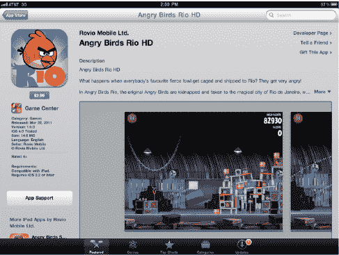

**图 8–2.** *App Store 中某款应用的详细描述*

应用描述界面会显示 iPad 屏幕上该应用图标的大图，同时包含价格、应用所属分类、最新版本信息、兼容性说明、用户星级评分以及评论。想把这个发现的应用推荐给朋友？轻点`告诉朋友`链接，`App Store`会自动生成一封邮件，方便你发送给好友。

**注意：** 如果你购买的应用出现问题，请轻点`精选`和`排行榜`页面底部的`支持`按钮，即可向`Apple`和开发者反馈问题。该按钮提供了指向`Apple`关于`iTunes`的支持网页链接，在`App Store`和`iBooks`标题下，有显示常见故障排查技巧的链接以及`给我们发邮件`按钮。`Apple`通常在 24 小时内回复大多数查询，这是获取答案最直接的途径。你也可以轻点应用描述页面左侧的`应用支持`按钮（见图 8–2）直接联系开发者。

iPad 屏幕上的应用描述最多显示约五行信息。若需查看更多内容，请轻点`更多`链接以展开描述（见图 8–3）。

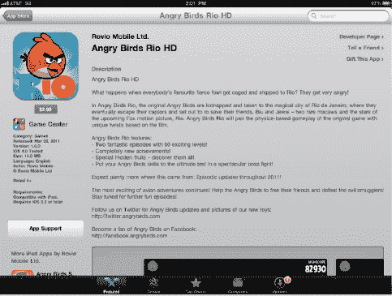

**图 8–3.** *轻点`更多`链接可展开应用描述。请将此描述与图 8–2 中仅显示五行的描述进行对比。*

屏幕左侧的按钮提供了指向开发者网站和支持页面的直接链接。界面中的图片可以滚动，若要查看所有图片，只需将可见图片向左拖动即可。

我们建议阅读应用描述页面底部的用户评分和评论，尽管它们有时可能具有误导性。我们发现评论通常能指出其他用户可能遇到的共性问题，这样你就可以决定是立即购买该应用，还是等待更新版本。购买应用后，你也可以为其评分并撰写评论供他人参考。评分时只需点击一星（差）到五星（好）的任意星级。如果你选择撰写评论，请注意需要再次登录你的`iTunes`账户，并且评论在发布前会经过`Apple`审核。

当你决定购买某款应用时，只需轻点价格。价格会变为绿色的`安装应用`按钮，随后你再轻点该按钮。iPad 屏幕上会出现一个对话框，要求你输入`iTunes`密码，然后轻点`好`。完成操作后，应用便会下载并安装到你的 iPad 上。几天内你会收到`Apple`发送的购后收据邮件。

**注意：** 当你轻点`好`开始下载时，`App Store`会关闭，iPad 的主屏幕会显示出来。不必担心，这是正常现象。更新应用时也会出现同样情况。

让我们再回到`App Store`，了解一下`新品`屏幕上的其他区域。在重点推荐区域下方，是`新内容与值得关注`应用板块（见图 8–4）。`Apple`团队从`App Store`的新上架应用中挑选出这些应用，它们通常独特且有趣。要浏览`新内容与值得关注`的应用，请轻点左右两侧的白色箭头。

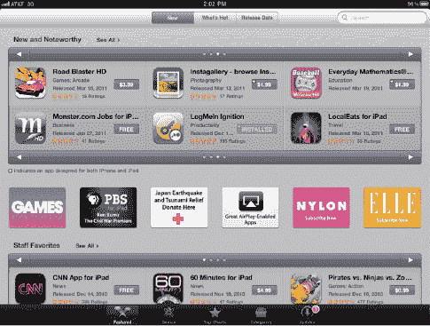

**图 8–4.** *`新内容与值得关注`的应用因功能有趣、玩法好玩或价值巨大而在`App Store`中获得特别关注。*

屏幕上的下一个区域通常是一小组图标，指向`本周应用`、同类应用合集（例如儿童应用或音乐创作应用）或值得特别关注的应用。

继续向下滚动`App Store`界面，你会看到`编辑推荐`精选（见图 8–5）。这些应用不一定是最新的，但它们深受`App Store`团队喜爱，团队希望你也了解它们。与`新内容与值得关注`板块一样，你可以通过轻点左右两侧的白色箭头来浏览这些精选应用。

在`App Store`底部是`快速链接`区域。如果你的账户目前有未使用的余额，该余额会显示出来。轻点该余额，你可以查看或更改任何`iTunes`账户信息。如果没有余额，则可以通过轻点`App Store`界面最底部的`账户`按钮来获取相关信息。

看到图 8–6 中的`兑换`按钮了吗？这是用别人的钱购买应用的一种有趣方式。你也许有幸从开发者那里获得一个“促销码”。这个代码可以兑换某款应用的免费副本。轻点`兑换`后，会出现一个对话框，你可以在其中输入该代码、`iTunes 充值卡`代码或礼品证书代码。输入代码并轻点`兑换`，然后输入你的`iTunes`密码。如果你输入的是特定应用的促销码，该应用便会下载并安装。如果你输入的是充值卡或礼品证书代码，你的`iTunes`账户会获得相应价值的额度。

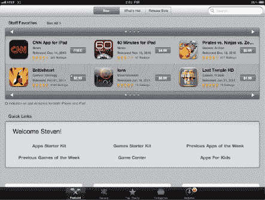

**图 8–5.** *`编辑推荐`、`快速链接`和常见的`App Store`按钮均位于`App Store`屏幕底部。*

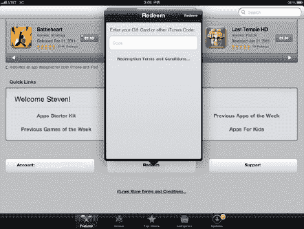

**图 8–6.** *兑换促销码、充值卡和礼品证书是购买众多应用的绝佳方式。*

`App Store`屏幕底部的最后一个按钮是`支持`。轻点此按钮会跳转到`Safari`浏览器中打开的`iTunes`支持网页（[`www.apple.com/support/itunes`](http://www.apple.com/support/itunes)）。

许多常见问题的答案都可在`iTunes`支持页面找到，因此在寻求进一步帮助前，请务必先浏览这些信息。如果你未找到关于`iTunes`、`App Store`、`iBookstore`或音乐/视频购买问题的答案，页面中还有一个按钮可用于向`iTunes Store`支持团队发送邮件。多数情况下，你会在 24 小时内收到回复。

#### 热门推荐

`热门推荐`界面布局与`新品`类似，只是将`新内容与值得关注`替换为`热门推荐`应用列表。该界面还会展示一份频繁更新的应用合集，这些应用对 iPad 用户具有特殊吸引力。例如，在 iPad 2 发布后不久，该板块就重点展示了针对新设备进行了特别增强的应用。

#### 按发布日期

最后，`精选`页面上的`按发布日期`按钮可以滚动查看所有已发布的应用，按时间倒序排列。每天的应用按字母顺序列出。你首先会看到今天发布的应用（按字母顺序），然后是昨天发布的（同样按字母顺序），以此类推。

**注意：** 对 iPad 上虚拟商店的描述基于本书撰写时的状态。`Apple`经常更改商店的设计，因此本章所述的具体细节在你阅读时可能已有所不同。

#### 排行榜

每当我们想在 iPad 上查看什么应用热门时，就会打开 App Store，然后轻点屏幕底部的`排行榜`按钮。屏幕上会显示付费 iPad 应用排行榜和免费 iPad 应用排行榜（参见图 8-7）。继续向下滚动屏幕，还会看到收入最高的 iPad 应用列表。

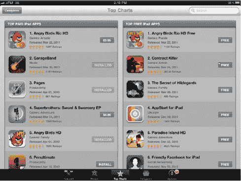

**图 8-7.** *App Store 中的“排行榜”屏幕显示了付费和免费 iPad 应用排行。*

苹果根据每个应用的下载量来定义付费和免费 iPad 应用排行榜，而下面的列表则根据应用产生的总收入计算得出。这意味着，如果某个高定价应用在 App Store 中销售良好，它就会登顶“收入最高 iPad 应用”榜单。

#### 类别

有时你不想在成百上千个 iPad 应用中逐一浏览，而更希望只查看与特定类别相关的所有应用。App Store 底部的`类别`按钮会显示一组按钮，引导你按类别浏览应用列表（参见图 8-8）。

这是查找特定类别中热门应用的绝佳方式。例如，假设你正在寻找一个能帮你平衡支票簿和家庭预算的 iPad 应用。这类应用最可能的类别是“财务”。

轻点`财务`按钮，屏幕上就会显示一个熟悉的界面（参见图 8-9），其中列出了财务类别中新增或近期更新的 iPad 应用。这些应用可以通过三个标准进行排序——名称、最受欢迎和发布日期——只需轻点`排序方式`按钮并选择相应的排序类型即可。

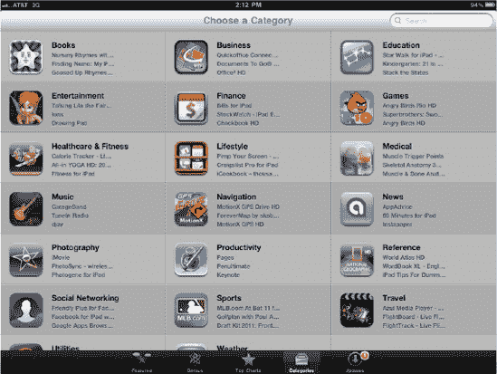

**图 8-8.** *在寻找特定类型的应用吗？类别列表将功能相似的应用归类在一起。*

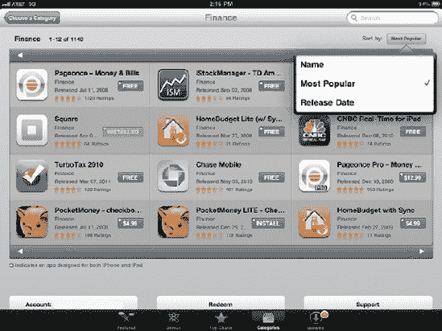

**图 8-9.** *查看 App Store“财务”类别中最热门的应用*

通过使用类别，你可以将浏览的应用数量缩减到可管理的范围。这是充分利用 App Store 购物时间的好方法。

#### 搜索

如果在 App Store 中浏览仍然找不到你想要的那款产品怎么办？如果遇到这种情况，就该进行搜索了。

搜索框位于 App Store 屏幕的右上角。要搜索关键词，请在搜索框中输入关键词，然后按下 iPad 虚拟键盘上的`搜索`按钮。你会注意到，在输入关键词时，App Store 应用会提供一系列建议（参见图 8-10）。

当你记得应用的部分名称却记不清确切拼写时，搜索功能非常有用。例如，我们中的一位最近想找一个 iPad 笔记应用。他知道这个应用要么叫`DeskPaper`，要么叫`PaperDesk`，但拿不准。在搜索框中输入`paper`后，出现了许多建议，果然，`PaperDesk for iPad`赫然在列。他点了一下这个建议，就直接跳转到了该应用的描述页面。

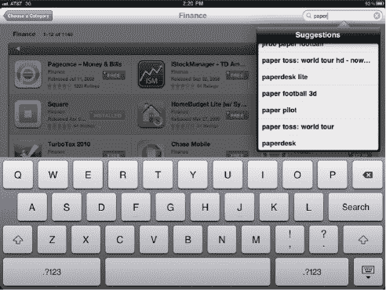

**图 8-10.** *当你在 App Store 搜索框中输入单词时，系统会列出建议的应用。*

#### 更新

通过电子方式购买所有 iPad 应用的一大好处是，每当有新版本软件发布时，App Store 会自动通知你。`更新`按钮位于 App Store 屏幕底部最右侧，它很可能是让你的应用保持最新状态的最重要按钮之一。

如果你的 iPad 上有某些应用有更新，你会通过 App Store 图标收到通知。一个红色的通知小圆圈会出现在图标上，显示有待安装更新的应用数量（参见图 8-11）。

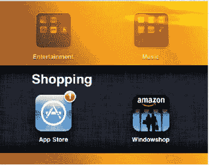

**图 8-11.** *当有应用更新可供下载并安装时，iPad 上的 App Store 图标上会出现一个红色的通知圆圈。*

App Store 中的`更新`按钮上也会显示相同的数字。要安装更新，请打开 App Store，然后轻点`更新`。屏幕上会列出所有可用的更新，并且屏幕右上角有一个`全部更新`按钮（参见图 8-12）。轻点该按钮即可开始下载并安装应用更新。

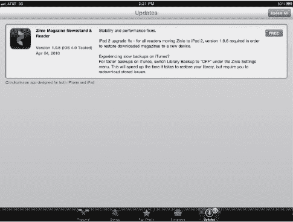

**图 8-12.** *当有应用更新可用时，轻点`全部更新`按钮可下载并安装所有更新。*

系统会提示你输入 iTunes 密码以验证请求。验证完成后，应用更新就会开始下载并安装。如果应用更新大小超过 20MB，而你使用的是带有 Wi-Fi + 3G 功能的 iPad，则会弹出警告，提示你必须在连接速度更快的 Wi-Fi 网络后才能下载更新。任何较小的更新都会立即下载并安装，甚至通过 3G 网络也能完成。

在本书出版时，应用更新是免费的。不过，也有过一些讨论，允许开发者对应用的主要版本更新收费，以便为持续开发提供资金支持。

#### iTunes Store

如果你在寻找游戏或其他软件，App Store 是你的购物场所；但如果你想购买音乐、电影或电视节目呢？那就要用到 iPad 上的 iTunes 应用了（参见图 8-13）。

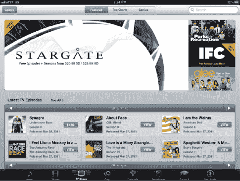

**图 8-13.** *iTunes Store。只需轻点 iPad 上的 iTunes 应用图标即可进入。*

你首先可能会注意到 iTunes Store 和 App Store 在设计上的相似之处。iTunes Store 诞生更早，并且经过多年完善，因此苹果将其相同的概念应用到了 App Store 和新的 iBookstore 中。iTunes Store 有一个 App Store 所没有的实用功能：预览。要预览商店中的任何歌曲、视频或电影，只需轻点它即可。歌曲预览时长为 90 秒，而视频、电影和电视节目的预览时长则各不相同。

两个商店的屏幕顶部和底部都有一排按钮。对于 App Store，这些按钮是`新品推荐`、`热门项目`和`发布日期`。在 iTunes Store 中，这些按钮则替换为`精选`、`排行榜`和`天才`。

屏幕底部是用于所有可通过 iTunes 下载的不同媒体类型的按钮。媒体类型包括：音乐（音乐人的单曲或专辑）、影片、电视节目（单集或整季）、播客、有声读物和 iTunes U。此外，还有一个进入 Ping（苹果的媒体社交网络）的按钮。

顶部和底部的按钮协同工作，向你展示所有不同媒体类型中的热门内容。我将解释它们如何以类似的方式适用于音乐、影片和电视节目。

#### 精选内容

当屏幕底部选中`音乐`时，点击`iTunes Store`顶部的`精选`按钮，便会显示熟悉的`最新与值得关注`列表。当然，这次我们讨论的不是应用，而是音乐。单曲和完整专辑都可以在`最新与值得关注`中找到。

屏幕下方将出现指向特价单曲、专辑、音乐视频以及可预购项目的按钮，随后是包含动态内容的部分。例如，在我们撰写此段落时，该部分展示了“$7.99 金属专辑特卖”。该部分内容会根据`iTunes Store`工作人员各时期决定的促销项目而变化，因此这一部分的标题也会时常更新。

在`精选`屏幕底部，是本章`App Store`部分已介绍过的熟悉的`快速链接`区域。此处链接各不相同且频繁变动。苹果在这里放置了`iTunes`免费项目的链接，并允许您凑齐完整专辑或购买特价专辑和歌曲。最后，`账户`、`兑换`和`支持`按钮同样位于页面底部，提供与`App Store`中大致相同的功能。

现在，当您点击`影片`按钮时，情况会略有不同。例如，`最新与值得关注`变成了`最新租赁或购买`。我们稍后会详细说明影片租赁，目前只需知道您可以从`iTunes Store`购买或租赁影片即可。

下方是动态更新的区域，类似于商店中`音乐`板块的结构。该区域通常具有时效性；本章撰写时正值女演员伊丽莎白·泰勒去世，因此出现了一个指向`iTunes Store`中她 20 部影片的按钮。`快速链接`和各类按钮照例位于页面底部，尽管这些内容同样与商店其他板块不同，并且经常更新。

此时，您可能会预期`电视节目`按钮会显示与`音乐`和`影片`类似的内容——确实如此。`最新与值得关注`列表出现在页面顶部附近，传统的`快速链接`和按钮则位于页面底部。`播客`、`有声读物`和`iTunes U`也是如此。

如果您不熟悉`iTunes U`，它是`iTunes Store`中一个创新的板块，提供来自全球大学的教育播客和视频。没错，您可以学习线性代数，探索沉积学和地层学概念，或追溯从奥古斯都到君士坦丁的罗马历史——所有这一切都能在舒适的家中通过您的 iPad 完成。

`Ping`按钮是通往苹果音乐社交网络的大门。`Ping`让您可以关注艺人和好友，并显示来自他们的实时动态。通过`Ping`，您可以告知关注者您喜欢或评论过的音乐，并对他们的动态发表评论。要使用`Ping`，请在 Mac 或 Windows 的`iTunes`应用中，点击右上角的`了解更多`按钮，使用您的 Apple ID 创建一个免费的个人资料。一旦`Ping`已为您的 iTunes 账户激活，您就可以在 iPad 的`iTunes`应用中点击`Ping`按钮查看好友和艺人的动态推送。

#### 流派与类别

在`iTunes`屏幕左侧顶部，您会看到一个按钮，根据您正在浏览的是音乐、电视节目、影片（`流派`）还是播客或有声读物（`类别`），它会从`流派`切换为`类别`。

无论哪种情况，点击此按钮都会显示媒体类型的列表。例如，播客类别包括艺术、商业、喜剧和教育等。音乐流派包括另类、布鲁斯、儿童音乐等。与`App Store`中的类别类似，`iTunes`商店中的流派和类别能使您更轻松地找到想要的内容。

#### 影片租赁

您可以随时从`iTunes Store`租赁一部影片并在 iPad 上观看。租赁与购买的区别在于，租赁的影片在设备上具有有限的生存期。当您点击`租赁`按钮时，计时便开始了。您有 30 天的时间开始观看影片，因此您可以在出行前将影片预载到 iPad 上。一旦开始观看，您有 24 小时的时间完成观影。想在 24 小时内把《星际迷航》看十遍？没问题。

当这 24 小时的反复重看期结束，或者您在 30 天内未观看影片而达到期限，影片便会从您的资料库中消失。您只能在 iPad 上观看已租赁的影片，因此无法将它们传输到其他电脑或 iPhone。在电脑上购买的影片可以传输到您的 iPad 或 iPhone 上。

如果您拥有我在第 1 章中提到过的可选视频输出线缆之一，便可以将 iPad 上正在播放的视频通过 HDMI、分量或复合视频输入传输到电视上。`Apple Digital AV Adapter`、`Apple 分量 AV 线缆`和`Apple 复合 AV 线缆`（每条$39）非常适合将小屏幕（iPad）上的视频转到大屏幕上观看。

当您直接从 iPad 租赁影片时，请考虑您的网络速度。Wi-Fi 连接通常比 3G 快得多，因此通过 Wi-Fi 下载影片时，您能更快开始观看。

#### 季票

对于正在播出的电视剧，苹果创造了`季票`的概念。季票允许您下载某一电视季的每一集。已播出的当前剧集会立即下载到您的 iPad，而未来剧集则在其电视首播日后，您下次登录`iTunes`时自动下载。

`季票`对于不希望错过心爱节目任何一集的剧迷来说是一大福音，也让粉丝们能轻松地为后代保留一份节目副本。与影片一样，电视剧也可以选择高清或标清版本购买。

#### 高清 vs. 标清

许多电影都提供高清（HD；参见图 8–14）或标清下载选项。如果你是高清电视爱好者，你可能会失望地发现，你无法在 iPad 上以真正的高清画质观看视频。这到底是什么意思呢？iPad 的`1024×768`像素显示屏并不符合常见`1080i`（宽`1920`像素，高`1080`像素）或`720p`（宽`1280`像素，高`720`像素）高清电视格式的宽高比（即屏幕宽度与高度的比值）。iPad 显示屏也不符合许多电影所采用的精确宽高比，通常是`16:9`或`2.35:1`。

**图 8–14.** *即便在动作场景中，iPad 上的高清视频也能让你看到令人惊叹的细节。此图像显示了信箱模式（屏幕顶部和底部的黑色条纹）。*

这并不是说你就不能在 iPad 上播放这些高清视频或电影——你可以播放，但会以信箱模式显示。这意味着视频屏幕的顶部和底部会有黑边，如图 8–14 所示。`720p`高清格式的电影也会被缩小到 iPad 屏幕的宽度。好处是，无论是否存在信箱模式，视频和电影在 iPad 的显示屏上看起来都很棒。部分原因在于苹果采用了`H.264`压缩方案，该方案能够在不牺牲画质的情况下，将数字视频压缩到相对较小的尺寸。

来自 iTunes 的标清电影采用的是名为`720xN 变形`的格式。文件会按比例放大以适配 iPad 屏幕的宽度，导致电影清晰度不如高清格式的电影。

高清 iPad 电影与标清 iPad 电影的另一个主要区别在于电影文件的大小。例如，标清格式的《游客》大小为`1.37GB`，而高清格式则为`3.25GB`（参见图 8–15）。`16GB`容量的 iPad 用户可能需要坚持选择标清电影，或每次只下载少量电影。

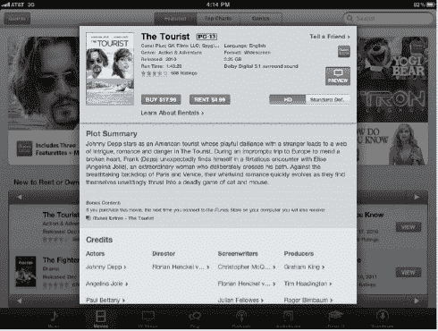

**图 8–15.** *《游客》的详细描述显示了购买和租赁按钮，以及选择高清或标清的按钮。描述中还显示了文件大小，如果你的 iPad 存储空间不足，这一点非常重要。*

电影的租赁和购买价格随着清晰度从标清升级到高清而增加。购买一部高清电影通常比其标清版本贵约`5 美元`，而租赁高清电影的租金通常比标清贵约`1 美元`。

#### 排行榜

在 iTunes 中浏览音乐时查看排行榜会显示两个列表：热门歌曲和热门专辑。在排行榜页面向下滚动会显示热门音乐视频，供你购买欣赏。

对于电影，排行榜会显示两列：热门电影租赁和热门电影销售。在电视节目类别中，排行榜会显示热门电视单集和热门电视季的列表。对于播客，iTunes Store 将排行榜分为热门音频播客和热门视频播客。

在有声读物类别中，仅列出排名前 12 的有声读物；而在 iTunes U 中，“热门 iTunes U 课程集”则会显示学术领域的热门内容。

#### Genius 功能

当你在浏览音乐、电影或电视节目时，页面顶部还有一个按钮：Genius（参见图 8–16）。

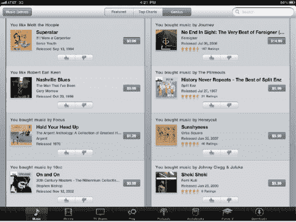

**图 8–16.** *iTunes Genius 就像拥有一个私人导购，为你推荐音乐或电影。当然，你首先得告诉你的私人导购你喜欢什么。*

你是否曾想过拥有一个私人顾问，它可以查看你喜欢什么音乐、看的电影或电视节目，然后建议你听听新专辑或看看新视频？这正是 iTunes 的 Genius 功能为你所做的。

Genius 会根据你通过 iTunes 购买或从电脑传输到 iPad 的媒体，推荐你可能喜欢的其他专辑、电视节目或电影。你可以偶尔查看这些推荐并用“赞”或“踩”来表达你的看法，从而提高 Genius 推荐的准确性。

Genius 推荐的准确性会随着购买和租赁次数的增加而提高。基于一次电影购买和一次租赁，电影 Genius 在挑选我们可能感兴趣的喜剧片方面表现出色，但它也掺杂了一些我们永远不会看的电影。在电视方面，我们购买了《星际迷航：原初系列》的整个第一季。于是 Genius 认为我们会喜欢《星际迷航：深空九号》，而我们实际上对此深恶痛绝。再说一次，对推荐电影投赞成或反对票是提高 Genius 推荐与你真实喜好匹配度的好方法。

#### iBookstore

什么？你还没花够钱？苹果数字商店新成员 iBookstore 能让你轻松解决这个问题。iBookstore 最初在 iPad 上推出，现在也支持 iPhone 和 iPod touch。

苹果选择在 iPad 上首发 iBookstore 是有原因的。iPad 如书本般大小的背光 LED 屏幕使其几乎在任何光照条件下都能完美阅读。iPad 的电池续航非常出色，除非你打算进行一场《*战争与和平*》的马拉松式阅读，否则阅读时无需连接电源。

要使用 iBookstore，你需要在 iPad 上安装免费的 Apple iBooks 应用。最简单的方法可能是点击 App Store 图标，然后在搜索框中输入 `iBooks`。该应用会出现在建议列表顶部，点击 iBooks 会显示一系列应用。找到免费的 iBooks 应用，点击“免费”按钮安装，然后点击“安装应用”按钮。你的 iPad 会下载并安装该应用。

**注意：** 在商店中搜索时不区分大小写。你可以用小写、大写或大小写混合的字母输入搜索词或短语，结果都是一样的。

在 iPad 上安装 iBooks 应用后，启动它。与 App Store 和 iTunes Store 不同，iBooks 不会直接在 iBookstore 中启动。相反，你会看到你的图书库——一个精美的木质书架，上面巧妙地陈列着书籍封面（见图 8-17）。曾有一段时间，苹果在 iBooks 应用中附带了一本 A. A. 米尔恩的插图版《*小熊维尼*》，所以启动应用时，你的书架上可能会有一本书。我们将在下一章详细讨论 iBooks；这里我们只关注 iBookstore 以及如何购买书籍。

**彩蛋预警！** 彩蛋是隐藏在计算机程序中的小惊喜。想看看 iBooks 中的彩蛋示例吗？用手指向下拖动书架。你会在最上面一排书的上方发现一些非常熟悉的东西。

书架左上角有一个“书店”按钮。这个按钮是你进入 iBookstore 的门户。点击它即可加载 iBookstore（见图 8-18），其界面与 App Store 和 iTunes Store 惊人地相似。操作方式也相同：点击价格即可看到“购买图书”按钮，然后点击该按钮登录 iTunes、支付书款并下载。

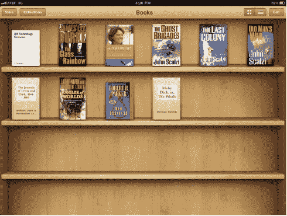

**图 8-17.** *你的 iBooks 图书库将书籍展示在一个熟悉的地方——书架上。*

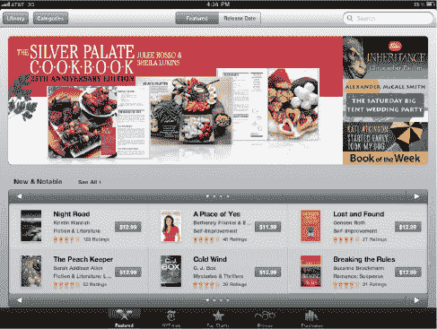

**图 8-18.** *iBookstore 内部。其外观和操作都与 App Store 和 iTunes Store 非常相似。*

苹果让 iBookstore 类似于实体书店，你可以浏览书籍。如果你对某本书不确定，可以寻找“获取样本”按钮，它会下载相当一部分内容供你阅读。这就像在书店里翻阅一本书。

要返回你的书架，请点击“资料库”按钮。“分类”按钮提供了一种缩小搜索范围到特定类型图书的方法。你知道现实中的书店会有指示牌，标明一个区域是悬疑惊悚小说，另一个区域是烹饪书吗？iBookstore 的分类功能与这些指示牌相同（见图 8-19）。

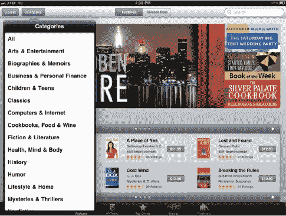

**图 8-19.** *分类就像实体书店中的分区。它们包含了按内容类型相似的书籍。*

与 iTunes Store 和 App Store 的总体布局一致，iBookstore 底部的按钮包括“精选”、“纽约时报”、“排行榜”和“已购项目”。iBookstore 顶部有按钮，可以即时列出仅限精选书籍或所有按发布日期列出的书籍。在我们编写本书时，iBookstore 包含超过 20 万本书。

#### 精选

正如你所料，“精选”按钮会显示“新书与值得关注”的书籍列表和图标，这些图标指向关于特定主题的书籍合集或 iBookstore 团队认为的必读书籍，然后是另一个定期更新的书籍列表。例如，在我们编写本书时，列表是“10 美元以下的畅销传记”，其中包含两本我们最终买下的书。

在 iBookstore“精选”页面底部附近，你会看到熟悉的“快速链接”框，其中不仅包含你的账户信息链接，还包含特价书籍链接（见图 8-20）。如果你是奥普拉读书俱乐部的粉丝，只需点击“快速链接”框中的特价链接，就会显示奥普拉·温弗里推荐的大部分书籍列表。“建立你的图书馆”会展示一批精选的新畅销书和经典著作，它们是你书架的绝佳补充；而“免费图书”则会生成一份经典公共领域作品的列表，作者包括简·奥斯汀、亨利·詹姆斯、奥斯卡·王尔德、查尔斯·狄更斯和威廉·莎士比亚。这些书籍免费下载，并且是任何图书馆的绝佳补充。通常还会有链接用于预订即将出版且已获得好评的书籍，此外还有一种方式，可以在你喜欢的作者即将出版新书时收到提醒。

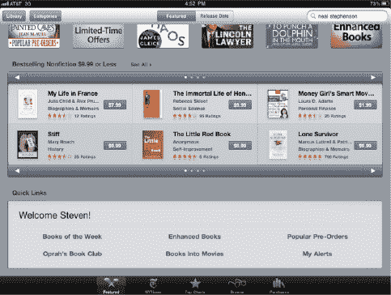

**图 8-20.** *奥普拉读书俱乐部的粉丝们会很高兴知道，这里有一个快速链接可以查看多年来为该俱乐部挑选的所有书籍。*

在页面最底部，你会找到熟悉的“账户”、“兑换”和“支持”按钮，它们的功能与 App Store 和 iTunes Store 中的相同。

#### 纽约时报

《纽约时报》畅销书排行榜被认为是美国最具权威的畅销书排行榜。该榜单每周在《纽约时报书评》杂志上发布，自 1942 年以来从未间断。

苹果选择这本出版界的权威来为 iBookstore 提供自动更新的虚构类和非虚构类畅销书榜，是再合适不过的了。点击 iBookstore 底部的“纽约时报”按钮，即可调出按类别显示前十名书籍的榜单（见图 8-21）。要查看更多虚构类和非虚构类畅销书榜单，页面底部有一个“显示更多”按钮，每次点击都会在榜单上增加十本书。

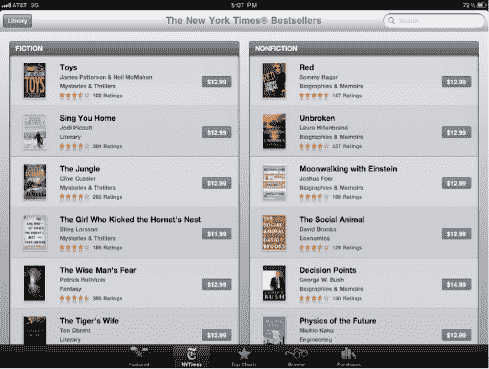

**图 8-21.** *《纽约时报》畅销书排行榜*

#### 排行榜

“排行榜”按钮提供的功能与 App Store 中的同名按钮非常相似。换句话说，它会显示付费和免费书籍的排行榜。付费书籍排行榜通常与《纽约时报》畅销书榜单不同，因为它是由 iBookstore 中图书的销售数据汇编而成的。

免费书籍排行榜不太可能频繁变化，不过对某本经典著作重新燃起的兴趣可能会使其排名上升或下降。

### 购买记录

`购买记录`屏幕会显示您在 iBookstore 中购买的所有书籍。正如您将在第 9 章中了解到的，您可能最终需要删除个人 iBooks 书库中的部分书籍。如果您想重新阅读这些书籍，或至少将其添加回书库以备将来参考，`购买记录`会在书名旁显示一个`下载`按钮（见图 8-22），点击即可重新下载之前购买过的书籍。

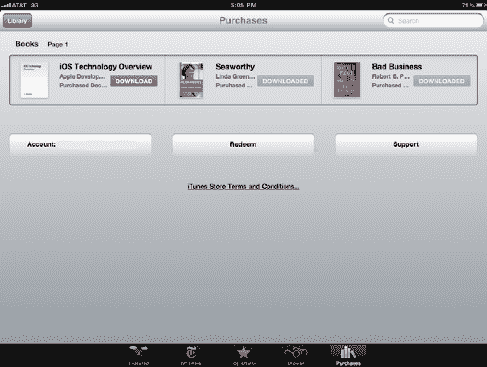

**图 8–22.** *如果您已从书库中删除某本书并希望重新添加，可以通过 iBookstore 中的`购买记录`屏幕实现。点击`下载`即可将书籍重新安装到书架上原本的位置。*

点击`下载`按钮后，iBookstore 会要求您输入 iTunes 密码以验证请求。输入密码并点击`确定`后，书籍便会下载并出现在 iBooks 书库中，并带有"新书"标记。

### 本章小结

iPad 让追看热门电视剧、发现新音乐和应用程序、欣赏喜爱的电影变得像点击按钮一样简单。通过`App Store`，您可以访问海量且不断扩充的、专为 iPad 功能优化的应用程序。`iTunes Store`为您带来了丰富多彩的视听娱乐内容，而`iBookstore`则足以让传统纸质书籍面临强劲挑战。

以下是本章要点：

-   `App Store`、`iTunes Store`和`iBookstore`都需要 iTunes 账户用于结算和验证。虽然您可以在 iPad 上直接创建账户，但在家用电脑上操作通常要简便得多。
-   所有商店都需要通过 Wi-Fi 或 3G 网络连接。
-   作为数字应用商店和 iTunes 商店入口的免费应用已预装在每台 iPad 上。`iBookstore`可通过`iBooks`访问，而`iBooks`是从`App Store`免费下载的。
-   在选择要看哪部电影、听什么音乐或追哪部剧集时需要帮助吗？`iTunes Genius`能提供推荐，并且您使用 iTunes 购买或租赁媒体的次数越多，推荐就越精准。
-   从 iTunes 购买或租赁视频和电影时，请务必考虑 iPad 的存储空间，因为高清内容比标清内容占用更多空间。
-   善用 iTunes Store 和 iBookstore 中音乐和书籍的免费预览功能，这相当于"购买前先试听/试读"。

