# 使用 iBooks

您的 iPad 不仅是玩游戏、上网和观看视频的绝佳设备，它还是一个强大的电子书阅读器。指尖之下，即可畅享超过 30,000 册免费书籍，以及数千册付费图书，其中包含众多《纽约时报》畅销书。但 iPad 的`iBooks`应用的功能远不止于此！您还可以将 PDF 文件添加到 iBooks 中，随身携带。这意味着您可以在与书籍相同的书库中访问所有 PDF 文件——对于经常处理或接收 PDF 文件的用户来说，这无疑是一项强大的功能。

在本章中，您将学习如何浏览 iBooks 书架和书籍本身。您还将了解如何为书中的精彩段落添加书签、创建笔记、将书籍整理到不同的收藏中，甚至可以让 iPad 为您朗读书籍。最后，我们将带您了解 iBooks 所有的 PDF 功能。让我们开始吧！

### iBooks 应用

正如您在第 8 章中了解到的，iBooks 应用并未预装在 iPad 上。要使用它，您需要先从 iTunes Store 免费下载。下载完成后，iBooks 图标就会出现在 iPad 的主屏幕上（见图 9–1）。

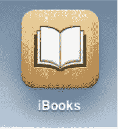

**图 9–1**. *iBooks 图标*

点击图标即可启动 iBooks 应用。启动后，您将看到 iBooks 书架（见图 9–2）。书架上将显示您已添加到 iTunes 书籍库中的所有电子书（稍后将详细介绍）。

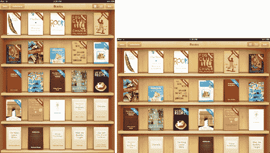

**图 9–2.** *横屏和竖屏视图下的 iBooks 书架*

### 同步书籍

在同步书籍之前，您需要先获取一些书籍。我们在第 2 章中讨论过如何将书籍同步到 iTunes 资料库，但这里我们再次提及。有几种方法可以为您的 iPad 获取书籍进行同步。

#### iBookstore

在书架的左上角，您会看到一个`书店`按钮（见图 9–3）。点击此按钮，您的书架会像秘密通道一样翻转过来。在书架的背面，您会看到 iBookstore。在上一章中，您学习了如何从 iBookstore 购买书籍和免费下载 Project Gutenberg 的书籍。您从商店下载的任何书籍都会出现在书架上，并在您用 iPad 连接到电脑时自动与电脑同步。关于在 iBookstore 中购买书籍的完整指南，请参阅上一章。

#### ePub 电子书

将书籍添加到书架的第二种方法是从其他网站下载 ePub 格式的电子书，然后将其拖放到电脑上 iTunes 源列表中的书籍资料库中。您添加到 iTunes 资料库中的任何 ePub 电子书，下次将 iPad 连接到电脑时都会自动同步。

##### 什么是 ePub？

ePub 是一种通用的电子书文件格式。任何能够打开和显示 ePub 文件的设备都能显示该书籍，无论您从何处购买。换句话说，您不必只能在 iBookstore 购买书籍。有几个网站销售与 iPad 兼容的 ePub 格式电子书。ePubbooks ([`www.epubbooks.com/buy-epub-books`](http://www.epubbooks.com/buy-epub-books)) 提供了一个出色的网站列表，其中提供 ePub 书籍的购买和免费下载。下载了 ePub 书籍后，只需将其拖入 iTunes 资料库，下次连接时，该书就会同步到您的 iPad 上。

**注：** 亚马逊的 Kindle 书店是另一个购买电子书的热门去处。然而，Kindle 书籍不使用 ePub 格式。如果您从 Kindle 书店购买了电子书，则需要下载亚马逊免费的 iPad 版 Kindle 阅读器应用来阅读这些书籍。您将无法在 iBooks 应用中阅读 Kindle 书籍。Barnes & Noble 的 iPad 版 Nook 是在 iPad 上购买电子书的另一种方式，其 BN eReader 应用支持标准的 ePub 格式。这意味着您可以在各种 ePub 阅读器之间来回移动书籍。


### 浏览你的书库

好，你已经下载并同步了一堆书籍。在开始阅读之前，我们先来熟悉一下如何在书库中浏览所有书籍。


**图 9–3.** *从 iBooks 书库的标题栏，你可以访问 iBookstore、在各个藏书分类间切换，以及访问视图和编辑模式。*

iBooks 书库的标题栏上有五个按钮：

- `Store`：如前所述，点击此按钮将进入 iBookstore。
- `Collections`：`收藏`按钮会显示 iBooks 中所有藏书分类的列表。默认情况下，你会看到两个分类：
    - `Books`：点击`图书`，你会看到自己的书架。这里包含你在 iBooks 应用中拥有的所有电子书。
    - `PDFs`：点击`PDF`会进入你的 PDF 书架。我们将在本章后半部分详细讨论 iBooks 的 PDF 功能。

我们稍后在本章中还会详细讨论收藏分类。

- `Icon View`：这是书库的默认视图。这个带有四个白色方块的按钮会以较大的、易于辨识的缩略图形式显示所有书籍的封面。
- `List View`：这是`图标视图`按钮旁边的按钮，上面有三条白色横线。点击它可查看 iBooks 书库的列表视图（参见图 9–4）。

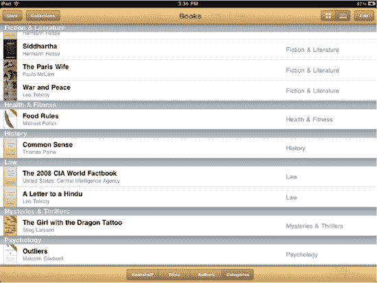

**图 9–4.** *带有按书架、标题、作者和类别排序选项的列表视图*

当你点击`列表视图`按钮时，你会注意到书籍的名称旁边会显示其体裁。你还会注意到，在屏幕底部有四种排序方式：

- `Bookshelf`：按书籍在图标视图中的显示顺序排列。
- `Titles`：按书名首字母顺序排列。
- `Authors`：按作者姓名的字母顺序排列。
- `Categories`：按体裁分组显示。书籍在每个分组内按字母顺序排列。

列表视图的标题栏中还有一个搜索框。点击搜索框可调出键盘并输入搜索关键词。你可以通过书名或作者名中的词语来搜索整个书库。点击搜索结果中的书籍即可打开。请注意，在图标视图中也可以搜索书籍。你只需向下拉书架，搜索框就会显示出来（参见图 9–5）。

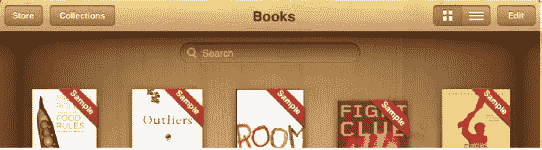

**图 9–5.** *图标视图中的搜索框*

- `Edit`：`编辑`按钮位于书库的右上角。点击此按钮将进入编辑模式。编辑模式允许你重新排列书籍顺序，或彻底删除书库中的书籍。
    - **重新排列书籍**：在图标视图的编辑模式下，只需长按书籍封面，然后将其拖到书库中的新位置。这与你在 iPad 主屏幕上排列应用的方式无异。在列表视图的编辑模式下，你只能在“书架”排序类别中重新排列书籍。长按书籍体裁右侧的拖动手柄，然后将书籍拖到你想要的位置。
    - **删除书籍**：当你在图标视图中点击`编辑`按钮时，你会看到书籍封面的左上角出现黑白相间的 *X*。点击 *X* 可打开删除确认窗口。点击`删除`即可从 iPad 中移除该书。在列表视图的编辑模式下，你可以在四种排序视图中的任意一种下删除书籍。只需点击红色圆圈中的白色减号 (–) 按钮，然后点击屏幕另一端出现的`删除`按钮确认删除即可。

**注意：** 从 iPad 上删除书籍并不会将其从电脑上的`iTunes`资料库中删除。你随时可以重新同步该书。

你可能会注意到，有些书籍封面右上角带有蓝色或红色的书签。红色书签显示为`Sample`，表示书架上的这本书是你从 iBookstore 下载的样章。样章会保留在你的 iPad 上，直到你删除它或购买完整书籍，但它们不会同步回你的 iTunes 图书资料库。

蓝色书签显示为`New`，表示你尚未开始阅读该书。`New`书签会一直显示，直到你在书中翻过至少一页（参见图 9–6）。

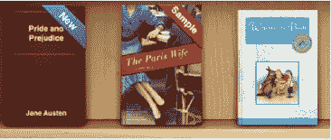

**图 9–6.** *带有“新书”和“样章”书签的书籍，旁边是一本已读过的书*

### 将书籍整理到收藏中

iBooks 在电子书架上展示你的书籍和 PDF 方面做得非常出色；然而，当你的藏书量变得非常庞大时，把它们全部显示在一个 iBooks 书库里可能就不会带来最轻松的浏览体验了。

幸运的是，苹果有一个内置功能叫`收藏`，它允许你将书籍分类到不同的书架上，以便更好地整理。在 iBooks 屏幕的左上角，你会看到`收藏`按钮。点击它可调出 iBooks 中的藏书分类列表（参见图 9–7）。

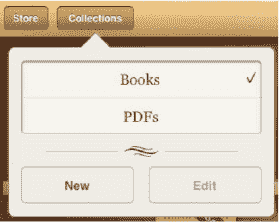

**图 9–7.** *收藏菜单*

默认情况下，你会看到两个分类：`Books`（图书）和`PDFs`（PDF）。你拥有的所有电子书都会出现在`图书`分类下的专属书架上，而所有 PDF 文件则会出现在`PDF`分类下的专属书架上。

#### 创建新收藏

如果你想创建新的收藏来更好地管理你的资料库，可以轻松做到：

1.  点击`收藏`按钮，调出收藏菜单。
2.  点击`新建`按钮。
3.  将会出现一个新的收藏字段（参见图 9–8）；输入新收藏的名称。

    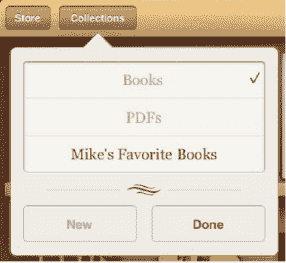

    **图 9–8.** *创建一个新收藏*

4.  输入收藏名称后，点击`完成`，你的新收藏就创建好了。

##### 向收藏中添加书籍和 PDF

创建好新收藏后，你需要向其中添加一些书籍或 PDF。按照以下步骤将书籍或 PDF 添加到收藏中：

1.  点击 iBooks 书库右上角的`编辑`按钮。
2.  点击你想要添加到收藏中的一本书或 PDF。被选中的书籍或 PDF 封面会变淡，并在其右下角出现一个蓝色的勾选图标（参见图 9–9）。
3.  点击 iBooks 书库左上角的`移动`按钮。收藏列表将会显示出来（参见图 9–9）。
4.  通过点击收藏的名称，选择你想将选中的书籍或 PDF 添加到的目标收藏。这时会有一个动画显示选中的书籍飞入所选收藏中，然后你会进入该收藏的书架，在那里就能找到你选中的书籍或 PDF。

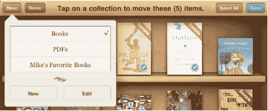

**图 9–9.** *将书籍分入不同的收藏*

**注意：** 同一本书或 PDF 一次只能放置在一个收藏中。当你将 PDF 或书籍添加到一个收藏时，它会从其先前的收藏中移除。

#### 在收藏间切换

iBooks 让你可以轻松地在不同收藏间切换。事实上，它提供了两种方式：

- 点击`收藏`菜单，然后点击你想要查看的收藏。
- 或者，在任何收藏的书架上，向左或向右滑动手指，即可切换到上一个或下一个收藏。


### 编辑精选集

iBooks 允许您编辑现有精选集的名称、按特定顺序排列精选集以及删除精选集。

请按照以下步骤编辑精选集名称：

1.  点按 `Collections` 按钮，调出 `Collections` 菜单。
2.  点按 `Edit` 按钮。
3.  点按您想要编辑名称的精选集。
4.  输入该精选集的新名称。
5.  完成后点按 `Done` 按钮。

请按照以下步骤排列精选集顺序：

1.  点按 `Collections` 按钮，调出 `Collections` 菜单。
2.  点按 `Edit` 按钮。
3.  使用拖拽控制柄在精选集列表中向上或向下拖动您的精选集（请参见图 9–10）。您无法移动 `Books` 或 `PDFs` 精选集。
4.  完成后点按 `Done` 按钮。

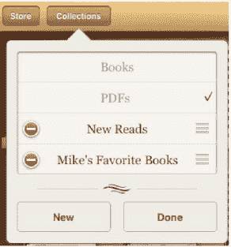

**图 9–10.** *编辑精选集*

请按照以下步骤删除精选集：

1.  点按 `Collections` 按钮，调出 `Collections` 菜单。
2.  点按 `Edit` 按钮。
3.  点按红色的 `减号` 按钮（请参见图 9–10）。
4.  会出现一个红色的 `Delete` 按钮。点按该按钮可删除精选集。将出现一个警告对话框，询问您是要从设备中移除该精选集中的项目，还是将这些项目移回其默认精选集。点按 `Remove` 可从 iPad 中移除这些项目，或点按 `Don't Remove` 以将它们保留在 iPad 上并移回其默认（`Books` 或 `PDFs`）精选集。

### 阅读图书

书架以精美且易于查找的布局展示您的图书，但图书是用来阅读的，而非观赏。让我们开始吧！

要阅读一本书，只需点按其封面。书会向前飞出并打开。如果您是首次打开这本书，您会看到第一页。如果您之前打开过这本书，它将打开到您上次阅读到的那一页。

阅读时，您可以选择横向或纵向模式。横向模式会并排显示两页，而纵向模式则显示单页（请参见图 9–11）。您只需旋转 iPad 即可在这两种模式间切换。

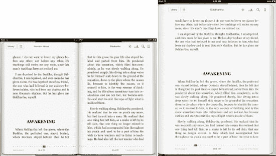

**图 9–11.** *在横向和纵向模式下阅读图书*

在任何图书页面的顶部，无论您处于哪种方向，都会看到一个包含一系列按钮的菜单（请参见图 9–12）。我们稍后会介绍所有这些功能的使用，但首先让我们看看各种菜单选项：

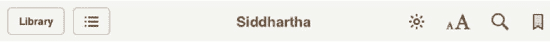

**图 9–12.** *图书的菜单按钮*

*   *Library*：点按此按钮会关闭图书并带您返回书架。下次打开这本书时，您会回到上次离开时的页面。
*   *Table of Contents/Bookmarks*：此按钮由三个点表示，每个点后面都有一条线。点按此按钮可进入书的`目录`和`书签`页面。
*   *Buy*：当您阅读从 iBookstore 下载的示例图书时，此按钮（未显示）会出现在`目录`按钮旁边。点按它可购买完整图书。
*   *Brightness*：此按钮看起来像太阳，仅可在 iBooks 应用内更改屏幕亮度。
*   *Font*：此按钮由一个大写和小写的 *A* 表示，允许您更改图书文本的字体以及字号。这对于阅读时需要更大字体的人（例如老年人或视力不佳者）非常有用。它还允许您将图书页面背景更改为深褐色调。
*   *Search*：`Search` 按钮看起来像一个放大镜，允许您在图书文本中搜索。
*   *Bookmark*：点按`书签`丝带按钮可在右上角放置一个红色书签。
*   *Page Scrubber*：这是沿着图书页面底部排列的一系列点（请参见图 9–14）。按住位于这些点上的方形按钮；然后向左或向右拖动，以快速浏览图书的页面。

阅读时，您可以点按图书页面的中央来显示/隐藏菜单和 Page Scrubber 栏。页面上方将仅保留书名和作者姓名（在横向视图中），底部则保留页码。

#### 翻页

您可以通过三种方式翻阅图书页面：

*   按住页面的一侧，然后拖动手指滑过；页面将在屏幕上卷曲（请参见图 9–13）。松开手指时，翻页即完成。

    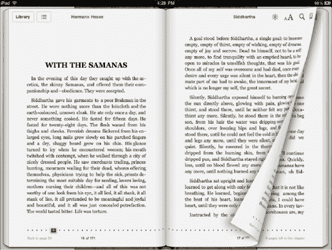

    **图 9–13.** *翻页时会有酷炫的视觉效果。*

*   点按屏幕的右侧或左侧可向前或向后翻页。其功能与前一种相同，但交互式视觉效果较少。
*   按住页面底部的 `Page Scrubber` 栏（请参见图 9–14），然后向任一方向滑动手指。滑动时，章节名称和页码会显示在 `Page Scrubber` 栏上方。找到正确的页面后，将手指从 scrubber 上移开，页面就会翻到您选择的页面。`Page Scrubber` 栏让您无需翻阅整本书即可快速跳转到特定页码。

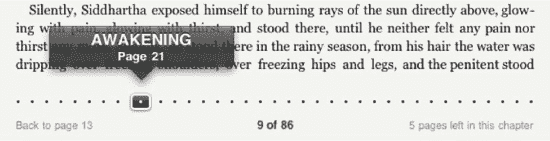

**图 9–14.** *Page Scrubber 栏显示页码和章节标题。*

**注意：** 许多人会在床上阅读。在床上使用 iPad 阅读没问题，但由于其内置的加速度计可以检测方向，您可能会发现屏幕根据您手持的角度来回旋转。为了在卧床阅读时将 iBooks 应用锁定在特定的页面视图，请拨动 iPad 侧边的开关以启用方向锁定。请注意，您需要确保已将侧边开关设置为`方向锁定`按钮，而非`静音开关`。请前往 `Settings`  `General`，然后在 `Use Side Switch to` 选项下选择 `Lock Rotation`。

#### 调整亮度

根据您的视力情况，您可能会发现在较亮或较暗的屏幕上阅读文本更轻松。要在阅读图书时调整 iPad 屏幕亮度，请点按菜单栏中的 `Brightness` 按钮（看起来像太阳的那个）。将出现一个包含滑块的下拉菜单（请参见图 9–15）。

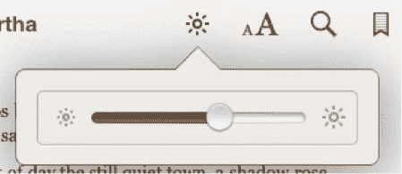

**图 9–15.** *亮度滑块*

向左滑动可降低亮度，向右滑动则增加亮度。在 iBooks 应用中调整亮度时，整个屏幕会随您的滑块设置而变亮或变暗；然而，一旦您离开 iBooks 应用，屏幕亮度将恢复为您在 iPad 的 `Settings` 应用中指定的设置。这是一个很棒的功能，因为您在进入或退出 iBooks 应用时可以即时切换亮度级别，而无需每次都重新配置。

要更改 iPad 的整体亮度级别，请前往 iPad 主屏幕上的 `Settings`，选择 `Brightness & Wallpaper`，然后调整滑块以设置您偏好的亮度。


```markdown
#### 调整字体、字号与页面颜色

根据您的视力情况，您可能希望调整文本的字号。点击`字体`按钮（显示为一大一小并排的 *A*），即可调出字体菜单（见图 9–16）。点击小写 *A* 可减小字号，点击大写 *A* 可增大字号。增大或减小字号将分别导致每页显示的字数变少或变多。

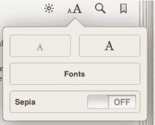

**图 9–16.** *字体面板*

在字号控制按钮下方，您会看到一个标有`字体`的按钮。点击此按钮可从六种字体中选择（见图 9–17）。不同的字体会略微影响屏幕上显示的字数。为什么要更换字体？有些人阅读不同字体时会更轻松，尤其是衬线字体或无衬线字体。无衬线字体类似于本书正文的字体：字母上没有多余的短横线。衬线字体则像 Times New Roman 那样。

在`字体`下方，您会看到`棕褐色`按钮。点击可开启或关闭此功能。开启时，整本书会呈现黄褐色调，类似于旧纸质书页随时间推移而泛黄的颜色。有些人认为在棕褐色屏幕下阅读对眼睛更友好，因为您不用盯着刺眼的亮白色背景。

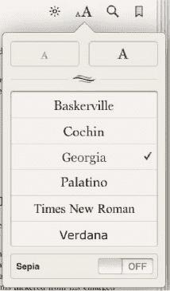

**图 9–17.** *可供选择的字体*

#### 搜索文本

您只需点击看起来像放大镜的`搜索`图标，即可在正在阅读的书籍中搜索任何单词或文本片段。此时会弹出一个搜索框和键盘。输入任意搜索词，您将看到按页码顺序排列的结果列表（见图 9–18）。点击任意结果即可直接跳转到该页面。在该页面上，您的搜索词会以棕黄色气泡高亮显示。

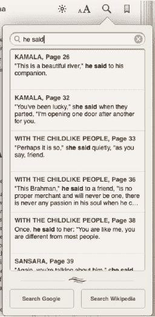

**图 9–18.** *搜索面板允许您进行文本内搜索，并可快速链接到 Google 和维基百科的网络搜索。*

您还可以对单词或短语执行 Google 或维基百科搜索。在搜索结果下方，您会看到`搜索 Google`按钮和`搜索 Wikipedia`按钮。点击任一按钮将离开 iBooks 应用，跳转至 Safari 浏览器，并显示相应的 Google 搜索结果或维基百科条目页面。

#### 添加书签

点击`书签`图标会在页面顶部放置一个红色书签（见图 9–19）。添加书签相当于为该页面创建了一个快捷方式，并存储在目录/书签页面中，方便您日后快速访问。在 iBooks 中，书签功能与实体书中的书签有所不同。在 iBooks 应用中，书签功能更类似于在实体书上折角，因为您不限于只使用一个书签。您可以为任意多个页面添加书签。要取消书签，请点击红色的书签丝带。

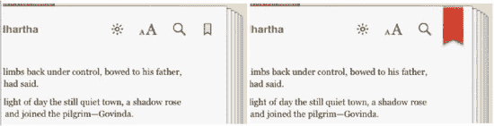

**图 9–19.** *点击书签按钮（左）可放置书签（右）。*

#### 与文本互动

您与书籍文本的交互不仅限于搜索。接下来我们将展示电子书优于传统纸质书的原因之一。不过，纸质书在许多方面仍胜过电子书。关于这两种格式的文章请参见：[`www.tuaw.com/2010/05/08/a-tale-of-two-mediums-despite-the-ipad-traditional-books-aren/`](http://www.tuaw.com/2010/05/08/a-tale-of-two-mediums-despite-the-ipad-traditional-books-aren/)。纸质书相对于电子书的一个优势是价格相对便宜（尤其是购买二手书时）。此外，您不必担心带它们去公园或海滩。沙子和泥土不会像影响 iPad 这类电子设备一样影响平装书的可用性。此外，在公共场合阅读时，纸质书作为盗窃目标的风险远低于苹果的最新科技产品。

在任何页面中，用手指长按屏幕，页面上会弹出一个放大镜图标。要移动它，只需拖动手指即可。放大镜图标下方，一个单词会以蓝色高亮显示。找到您想要的单词后，将手指从屏幕上移开。放大镜图标消失，该单词两侧会出现抓取条。拖动抓取条可选择多个单词，例如一个句子或整个段落。

确认选择后，您会看到黑色弹出菜单中提供了五个文本选择工具（见图 9–20）：

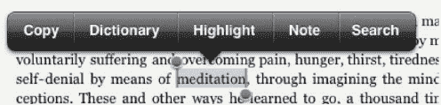

**图 9–20.** *文本选择工具*

*   *拷贝*：选中后可复制文本，以便粘贴到其他应用或搜索框中。注意，拷贝功能仅适用于 PDF 和无 DRM（数字版权管理）的电子书。由于 iBookstore 购买的书有复制保护软件，因此无法从中拷贝文本。
*   *词典*：这是我们在 iBooks 应用中最喜欢的功能，因为它展示了电子书相对于传统纸质书的一项重要优势——易用性。阅读平装书时，如果不认识某个单词，需要放下书本去查词典。在 iPad 上，如果不认识书中的某个单词，只需选中它并点击`词典`按钮。页面上会弹出一个窗口，显示该单词的定义（见图 9–21）。然后点击页面其他区域即可关闭词典窗口，继续阅读书籍。简单又方便。

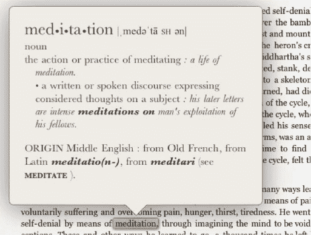

**图 9–21.** *词典面板*

*   *高亮*：点击高亮会如同用荧光笔标记一样为文本做标记（见图 9–22）。苹果在这方面做得非常出色，因为高亮效果看起来与纸质书上的完全一致。

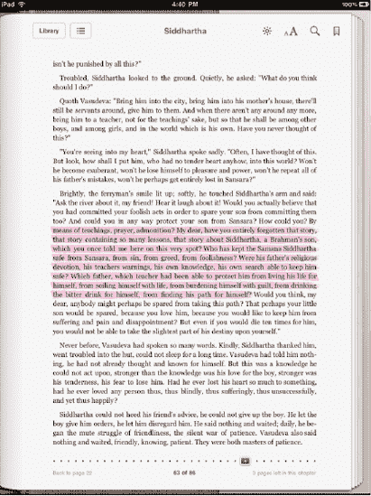

**图 9–22.** *高亮文本。高亮文本后，它会自动添加到书签页面。*

如果您点击彩色高亮，会弹出另一个菜单，允许您更改高亮颜色、为高亮文本添加笔记，或移除高亮（见图 9–23）。可选颜色包括黄色、绿色、蓝色、粉色和紫色。您选择高亮的任何新文本都将使用上次选择的颜色。您高亮的任何文本都会显示在书签页面的列表中（我们稍后会讲到）。

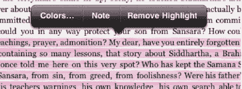

**图 9–23.** *高亮文本的选项*

*   *笔记*：点击笔记将自动高亮所选文本，然后一个便签样式的笔记会飞入屏幕，同时屏幕键盘会弹出（见图 9–24）。您可以在笔记中输入任意长度的文本，并用手指上下滚动。笔记的颜色取决于您为高亮选择的颜色。点击屏幕任意位置可关闭笔记。您会在页面边缘看到一个小笔记图标，上面显示笔记的创建日期（见图 9–24）。点击笔记图标可编辑笔记。点击文本的高亮部分并选择`移除笔记`即可删除笔记。

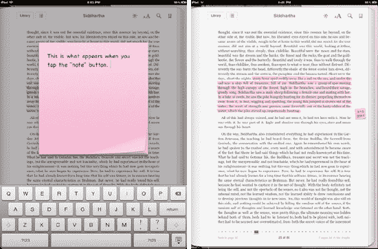

**图 9–24.** *创建笔记以及创建后页面边缘的笔记图标*

*   *搜索*：点击搜索将在页面右上角打开搜索窗口（看起来像放大镜）。您选中的文本会自动填入搜索框作为搜索查询。
```


### 访问目录、书签与笔记

点击页面顶部的`目录/书签`按钮（该图标为三个点后接三条横线，如图 9–12 所示），即可直接跳转到目录与书签页面（见图 9–25）。

目录与书签页面，顾名思义，分为目录和书签两个部分；每个部分都有对应的选项卡。

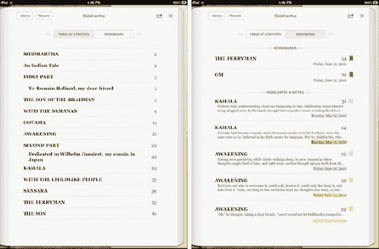

**图 9–25.** *目录与书签页面。通过点击相应选项卡可在两者之间切换。点击“继续阅读”按钮可返回书中上次阅读位置。*

目录选项卡以可滚动列表的形式显示本书的目录。点击目录中的任意条目，即可直接跳转到该位置。

书签选项卡显示您所有的书签、高亮和笔记。它们分为两个部分：*书签*与*高亮和笔记*。在“书签”标题下，您会看到包含书签的章节名称或编号列表，以及书签所在的页码和添加书签的日期。书签页码旁有一个代表书签的红色丝带图标。点击任意书签图标即可跳转到该书签所在页面。

在“高亮和笔记”标题下，您会看到您创建的所有高亮和笔记列表。对于每一条高亮和笔记，您会看到其所在第一个句子的开头部分，以及章节名称或编号。同时还会显示页码和标记日期。日期会以您选择的高亮文本颜色显示。如果您根据不同的书签分类使用不同的颜色，例如用蓝色标记反派的引文，用粉色标记主角的引文，那么这个功能会非常实用。

请记住，每当您创建一条笔记时，都会自动创建一个高亮。您可以轻松区分高亮和笔记。任何笔记的右侧页边距都有一个便签样式的笔记图标。要直接跳转到某个高亮或笔记，只需在列表中点击它。要阅读已创建的笔记而不离开目录页面，请点击页边距中的笔记图标。笔记会从屏幕中弹出（见图 9–26）。然后您可以点击该笔记调出屏幕键盘进行编辑。点击笔记外部区域即可关闭它。

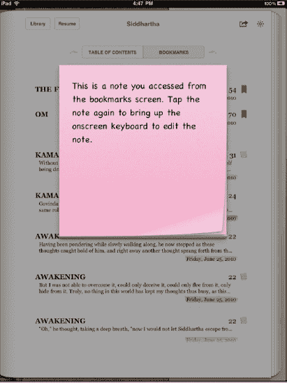

**图 9–26.** *在书签页面上阅读笔记。*

要退出目录/书签页面，点击“书库”按钮返回您的书架，或点击“继续阅读”按钮返回书中上次阅读位置。

#### 分享笔记

iBooks 应用允许您以两种方式分享您写的笔记：通过电子邮件发送或打印。要分享笔记，请点击目录页面顶部的“分享”按钮。“分享”按钮看起来像一个从盒子中射出的箭头。在出现的分享菜单中，点击“邮件”按钮创建一封包含所有笔记内容的新邮件，或点击“打印”按钮将笔记发送到支持 AirPrint 的无线打印机进行打印。

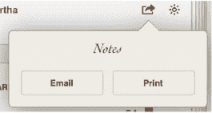

**图 9–27.** *通过电子邮件发送或打印来分享笔记。*

### 让书读给您听

您不仅可以在 iPad 上阅读书籍，还可以让 iPad 为您朗读书籍。使用 iPad 的 VoiceOver 屏幕阅读技术，您可以让 iPad 为您朗读任何文本，包括整本小说的内容。我们在第 2 章中讨论过 VoiceOver，但这里我们将介绍如何在 iBooks 阅读中激活它。请按照以下步骤操作：

1. 开启 VoiceOver。前往 iPad 的主屏幕，点击“设置”，然后依次选择“通用”  “辅助功能”  “VoiceOver”。连按三次主屏幕按钮，然后选择“切换 VoiceOver”。
2. 返回 iBooks 中的书籍。连按三次主屏幕按钮，会弹出一个窗口。点击“开启 VoiceOver”。
3. 现在您有两个选择。要让设备从页面顶部开始朗读所有内容，请用两根手指并拢向上滑动。屏幕顶部向下所有内容将被朗读。要让设备从您当前阅读位置开始朗读所有内容，请用两根手指并拢向下滑动。从您滑动位置开始的所有内容将被朗读。当 VoiceOver 到达页面底部时，它会自动为您翻页并继续朗读。
4. 要停止 VoiceOver 朗读，请用一根手指点击屏幕任意位置。除非您想继续使用 VoiceOver 手势，否则连按三次主屏幕按钮并选择“关闭 VoiceOver”也是一个好主意。

现在，您可能会想，既然可以直接购买有声读物并同步到 iPad，为什么还要让 VoiceOver 机械的声音为您读书呢？简单的答案是，并非所有书籍都有有声读物格式。还应注意的是，iBooks 的 VoiceOver 功能并非旨在吸引大量读者；相反，它是一项辅助功能选项，旨在帮助视力不佳的人阅读他们喜爱的书籍。

**注意：** 部分书籍可能与 VoiceOver 不兼容。

### 同步 PDF

当人们开始尝试使用 iBooks 时，对 PDF 支持的需求非常强烈。苹果倾听了用户的声音，并在 iBooks 1.1 版本中增加了这一功能。无需担心您的 iBooks 应用是否是最新版本。如果您最近更新或下载了该应用，您拥有的就是支持 PDF 阅读的最新版本。如果您不确定，请打开 iPad 上的 App Store 应用，检查您的应用是否有可用更新。

您有两种方式可以将 PDF 同步到 iPad 上的 iBooks：使用 iTunes 或使用 iPad 的“邮件”应用。要通过 iTunes 同步 PDF，只需将您想要同步的任何 PDF 文件拖入 iTunes 资料库。它们会自动添加到 iTunes 资料库的“图书”部分。下次将 iPad 与 iTunes 同步时，您的 PDF 也会随之同步。

您也可以通过 iPad 的“邮件”应用将 PDF 添加到 iBooks。为此，请打开“邮件”并选择一封带有 PDF 附件的电子邮件。点击邮件正文中的附件即可全屏预览。在全屏预览时，您会看到右上角有一个“打开方式…”按钮。点击此按钮，然后从下拉列表中选择 iBooks（见图 9–28）。“邮件”应用将关闭，PDF 会自动在 iBooks 中打开并添加到您的 PDF 书架。当您将 iPad 与 iTunes 同步时，任何以这种方式添加到 iBooks 的 PDF 都会被添加到您的 iTunes 图书资料库中。

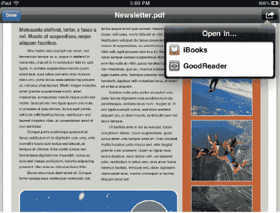

**图 9–28.** *通过邮件在 iBooks 中打开 PDF*

### 浏览 PDF 书架

要查看 iBooks 中包含的所有 PDF，请打开 iBooks，点击 iBooks 菜单栏中的“选集”按钮，然后点击“PDF”按钮（见图 9–7）。这将带您进入 PDF 书架。如图 9–29 所示，PDF 书架与普通书架类似。PDF 书架将填充您已添加到 iBooks 的所有 PDF。

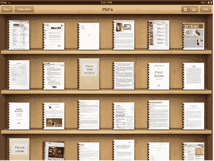

**图 9–29.** *PDF 书架与普通书架完全相同。如果您知道如何浏览一个，自然也就知道如何浏览另一个。*

与普通书架一样，您可以选择以图标或列表方式查看 PDF。在列表视图中，您可以按标题、作者、类别或书架（图标视图中的排列方式）对 PDF 进行排序。列表视图和图标视图都提供了一个搜索栏，因此您可以按名称或作者搜索 PDF。在编辑和删除项目时，PDF 书架的工作方式也与普通书架相同。只需点击“编辑”按钮即可重新排列或删除 PDF。


#### 导航与阅读 PDF 文件

要阅读 PDF，请轻点其封面。PDF 会向前飞出并打开。如果是首次打开该 PDF，您将位于第一页。如果之前打开过，则会跳转到上次阅读的页码。

您可以在竖屏或横屏模式下查看 PDF（见图 9–30）；但请注意，与图书不同，在横屏模式下查看 PDF 并不会并排显示两页。令人费解的是，苹果公司（在撰写本文时）并未添加此功能，但很可能在未来某个时候会加入。

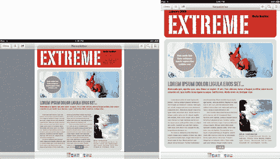

**图 9–30.** *在横屏和竖屏模式下查看 PDF*

无论处于何种方向，在任何 PDF 页面的顶部，您都会看到一个菜单，其中包含一系列按钮，中央显示 PDF 文档名称（见图 9–31）。这些按钮您应该已经熟悉，因为它们与阅读电子书时看到的按钮类似：

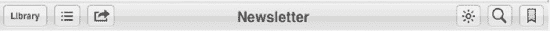

**图 9–31.** *PDF 的菜单按钮*

* **资料库**：轻点此按钮会关闭 PDF 并返回您的 PDF 书架。下次打开 PDF 时，将跳转到您离开时的页面。
* **缩略图**：此按钮由三个点表示，每个点后面有一条线。轻点此按钮可查看缩略图——即 PDF 中所有页面的缩略图系列。
* **共享**：轻点此按钮可将当前选定的 PDF 通过电子邮件发送，或通过无线 AirPrint 打印机打印。
* **亮度**：此按钮看起来像太阳，仅在 iBooks 应用内调整屏幕亮度。
* **搜索**：搜索按钮形似放大镜，允许您搜索 PDF 文本。它还提供*快速链接*，可针对所选搜索词搜索 Google 和维基百科。
* **书签**：轻点书签丝带可为当前页面添加书签。请注意，iBooks 中的书签与传统纸质书签功能不同。在 iBooks 中为页面添加书签，实际上相当于给页面“折角”。您可以在同一文档中添加多个书签。要删除书签，请再次轻点书签图标。
* **页面滑动器**：这是一系列沿 PDF 页面底部排列的页面图标（见图 9–32）。在缩略图上拖动手指可快速浏览 PDF 页面。您会看到当前选定页面编号浮在空中。您也可以直接轻点任意缩略图跳转到该页面。


**图 9–32.** *PDF 底部的页面滑动器栏*

阅读时，轻点图书页面的中央可显示/隐藏菜单和页面滑动器栏。在某一页面上，双指轻点可放大；如需更精准的控制，可使用捏合手势放大或缩小。要翻页，只需向左或向右滑动手指，即可向前或向后翻一页。您也可以轻点页面边缘来前进或后退，或使用页面底部的页面滑动器栏。此外，还可以通过缩略图浏览 PDF 文档中所有页面的大缩略图。

#### 使用缩略图

现在您已经了解，由于 PDF 菜单栏与电子书菜单栏非常相似，您已经知道如何使用它。唯一略有不同的功能是目录按钮，它已被替换为缩略图按钮（注意，两个图标完全相同——三个点，每个点后面跟着一条线）。

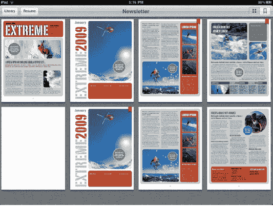

**图 9–33.** *缩略图让您以大型缩略图形式查看 PDF 的所有页面。*

轻点缩略图按钮，您会看到 PDF 文档中的所有页面以大型缩略图形式呈现，您可以通过滑动手指滚动浏览（见图 9–33）。当处理包含大量图表或图像的大型文档时，这非常有用。它允许您通过视觉快速搜索 PDF。找到所需页面后，轻点它即可立即跳转到文档中的该页面。

您还会注意到，某些缩略图右上角可能有一个红色小书签图标。这意味着您已通过轻点 PDF 菜单栏中的书签按钮为该页面添加了书签（见图 9–31）。要仅查看已添加书签的页面，请轻点缩略图菜单右上角的书签按钮（见图 9–34）。任何没有书签的页面将被隐藏。

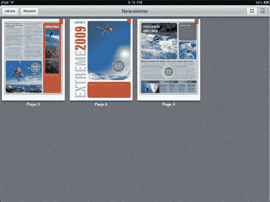

**图 9–34.** *缩略图的书签页面视图*

要离开缩略图，您可以轻点“资料库”按钮返回 PDF 书架，或轻点“继续”按钮返回到您导航至缩略图之前所在的页面。您也可以轻点任意页面直接跳转到该页。

**提示：** 在 Mac 上，只要您能打印的内容，都可以转换为 PDF。只需选择要转换为 PDF 的内容，然后从当前应用程序（如 Word 或 Firefox）的“文件”菜单中选择“打印”。在打印对话框的左下角会看到一个 PDF 按钮。单击它并从下拉菜单中选择`存储为 PDF...`。命名 PDF，单击“存储”，然后将其拖入 iTunes 资料库。在下次同步时，新 PDF 将出现在 iBooks 中。如果您使用 PC，有多种将文档转换为 PDF 的选项。用 Google 搜索“print to PDF”即可找到适合您的解决方案。

### 设置

iBooks 应用有少量外部设置。从 iPad 主屏幕导航至“设置”，然后在左侧的应用列表中选择 iBooks。您会看到五个设置选项（见图 9–35）：

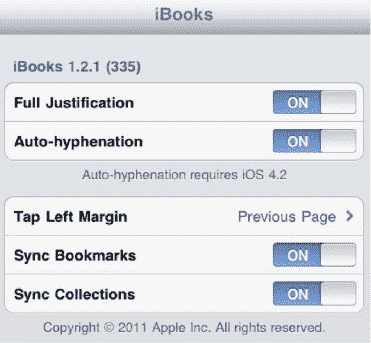

**图 9–35.** *iBooks 应用设置*

* **两端对齐**：当此选项开启时，图书页面上的文本将均匀填满页面宽度。当两端对齐关闭时，页面右侧的文本将呈参差不齐状（见图 9–36）。
* **自动断字**：当此选项开启时，iBooks 会自动对单词进行断字处理，从而允许在单页上显示更多单词。
* **轻点左边缘**：您可以将其设置为“上一页”或“下一页”。如果设置为*下一页*，轻点图书左边缘将使您前进到下一页，而非后退一页。此设置在 iPad 上以非常规角度（如躺在床上）阅读时可能很实用。选中“下一页”后，返回上一页的唯一方法是使用页面底部的页面滑动器栏。
* **同步书签**：当此选项开启时，会在设备之间同步图书的书签、高亮和笔记。如果您在 iPad 和 iPhone 上同时使用 iBooks，这项功能非常方便。当您在一个设备上为图书创建笔记或书签时，它会出现在另一个设备上。
* **同步合集**：当此选项开启时，会同步您的 iBooks 合集。如果您在 iPad 和 iPhone 上同时使用 iBooks，这项功能非常方便。当您在一个设备上创建或修改合集时，另一个设备上会完全相同地显示。

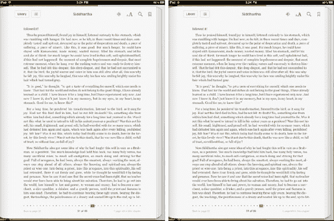

**图 9–36.** *同一页面：两端对齐开启（左）与两端对齐关闭（右）*


### 摘要

除了众多其他功能外，iPad 也是一款突破性的电子书和 PDF 阅读器。`iBooks`是一款集购买、阅读、搜索和标注书籍于一体的全能应用，它是发现新书并随身携带整个图书馆的精巧而强大的工具。以下是一些您可以带走的关键技巧：

- 您不限于从`iBookstore`购买书籍。许多网站销售`ePub`格式的书籍，您可以下载并同步到 iPad。一个很好的起点是[`www.gutenberg.org`](http://www.gutenberg.org)。此外，用谷歌搜索"free e-books"会返回大量可免费下载电子书的网站结果。
- `iBooks`拥有强大的字典查询功能，能直接在书页上显示单词的定义。
- `iBooks`的书架有多种视图和搜索功能，可帮助您浏览图书库。这些功能还能帮助您将书籍和 PDF 整理成集合。
- 使用 iPad 的物理方向锁定按钮固定`iBooks`屏幕，避免在斜靠在沙发上或躺在床上阅读时出现意外的屏幕旋转。
- 没有有声书？没问题。您可以使用 iPad 内置的`VoiceOver`技术让设备为您朗读任何书籍。
- 为您的笔记和标注选择不同的颜色。例如，您可以用蓝色标记喜欢的段落，用绿色标记以后想要参考的内容。您可以轻松地在同一位置（当然是书签页面！）查看所有书签、笔记和标注。您还可以轻点其中任何一个，立即跳转到书中的对应位置。
- `iBooks`不仅限于阅读电子书，它也是一款 PDF 阅读器。现在，您可以随时随地整理、查看和轻松浏览所有 PDF 文件！

## 第 10 章

## 充分利用您的办公套件

在 iPad 和 iPhone 问世之前，我们使用通常称为*办公套件*的工具。这套工具每年都有所不同，但通常包括一个用于记录会议纪要和提醒事项的笔记本、一个用于写日程安排的`Day-Timer`计划本，以及一个我们辛苦录入所有联系人姓名、地址和电话号码的通讯录。

在 20 世纪 90 年代，许多 Mac 用户以拥有一系列`Apple Newton MessagePads`而自豪。这些设备被称为*个人数字助理*（PDA），它们是第一批能将笔记、日历、待办事项列表和联系人同步到台式电脑上对应应用的电子管理器。遗憾的是，`Newton MessagePad`在当时过于超前且价格昂贵，苹果公司于 1998 年停产了该设备。

`PalmPilot`取代了`Newton`，随后是几款运行微软操作系统的掌上设备，再之后是第一批智能手机。所有这些设备都有各自的特性和奇特之处，并且都具备某种笔记功能、日历和通讯录。

2007 年，第一代 iPhone 上市，让苹果粉丝们再次感到生活的美好，并向世界介绍了一种新的手持计算形式。iPhone 一直内置三个应用——`Notes`、`Calendar`和`Contacts`——来执行常见的办公套件任务。如今随着 iPad 的推出，这三个应用已转移到了另一个平台。

得益于比 iPhone 更大的屏幕，`Notes`、`Calendar`和`Contacts`在 iPad 上真正大放异彩。在本章中，我们将向您展示如何充分利用这些内置应用，以及它们如何与其他设备同步。由于苹果的`MobileMe`服务可以将您的办公套件应用与其他电脑和设备上的对应应用同步，我们还将介绍如何注册并启用该服务。

#### 备忘录

在 iPhone 上，`备忘录`大致相当于一个小型的口袋记事本。您可能不会想用这个应用来做长篇笔记。尽管可以滚动查看笔记，但可用空间不大。打字很可能只能用一根手指，这会减慢输入速度并增加出错的几率。

iPad 上的`备忘录`应用则完全是另一回事。它无论在外观还是使用方式上都更像一个便签本（见图 10–1）。在横向模式下，`备忘录`看起来像一个皮面活页夹，左侧是一个白色纸质的索引列表，右侧是一个便签本（带有边线和顶部撕页的痕迹）。

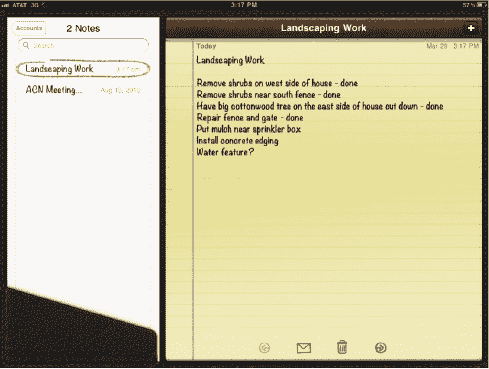

**图 10–1.** *您的 iPad 便签本，“备忘录”应用。左侧列表显示了您写过的所有备忘录。*

当您将 iPad 翻转至纵向模式时，`备忘录`看起来就像一个普通的便签本。我们个人认为在`备忘录`中录入数据时，横向模式更容易使用，因为我们可以使用几乎全尺寸的键盘进行盲打。

在纵向模式下使用`备忘录`时，索引列表会从活页夹的左侧消失，并在记事本顶部出现一个`备忘录`按钮。要显示索引列表，只需轻点`备忘录`按钮（见图 10–2）。

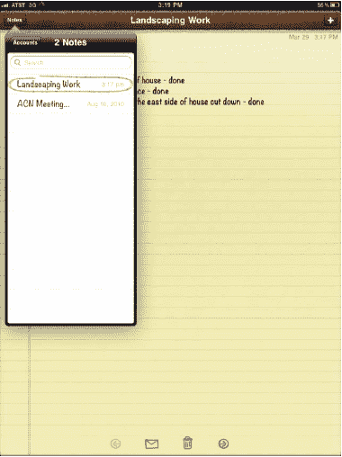

**图 10–2.** *纵向模式下的“备忘录”应用看起来真的很像便签本，带有黄色纸张。*

当`备忘录`在横向模式下使用时，轻点白色索引列表中的一条备忘录，会用红色铅笔状的椭圆形高亮显示它，并在便签本上显示完整的备忘录。无论您在横向还是纵向模式下使用`备忘录`，每页的顶部都显示备忘录创建的日期和时间，以及它是多少天前写的。如果是刚写的，记事本顶部会显示"今天"；如果是昨天写的，则会显示"昨天"。之后，数字会变为备忘录写成的天数。

每页底部有四个图标（见图 10–3）。轻点左右箭头图标可在记事本中翻页。轻点信封图标会创建一封包含该备忘录文本的新电子邮件，而轻点垃圾桶图标则会显示您在图 10–3 中看到的`删除备忘录`按钮。当以电子邮件形式发送备忘录时，备忘录的第一行会被用作主题行，从而加快将备忘录邮件发送给其他人的过程。

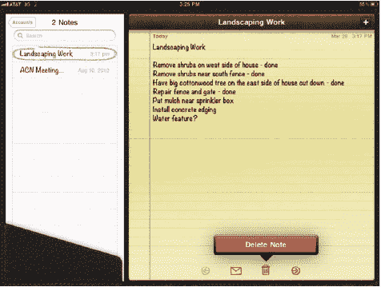

**图 10–3.** *每页底部的“备忘录”应用图标（从左到右）用于跳转到上一条备忘录、通过电子邮件发送备忘录中的文本、删除备忘录或跳转到下一条备忘录。*

#### 添加和删除备忘录

要创建新的笔记本页面，请轻点笔记本右上角的加号（`+`）。在备忘录页面上输入的第一行文本就是您的备忘录标题，它会同时显示在索引列表和记事本的顶部。要在任何备忘录中搜索单词或短语，请将其输入到索引列表顶部的`搜索`框中。列表会神奇地缩小，只显示包含该搜索词或短语的备忘录（见图 10–4）。

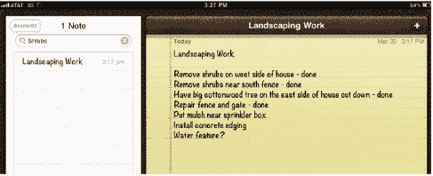

**图 10–4.** *在搜索栏中输入字母或单词，会将索引列表缩小到仅包含符合搜索条件的备忘录。*

您可以通过两种方式删除备忘录。第一种，如前所述，轻点每条备忘录底部的垃圾桶图标会显示`删除备忘录`按钮。轻点该按钮即可完成删除。

第二种删除备忘录的方法是在索引列表中，用手指在备忘录标题上向左或向右滑动。在横向模式下更容易操作，因为索引列表始终显示在`备忘录`窗口的左侧。在纵向模式下，轻点笔记本顶部的`备忘录`按钮可显示索引列表，然后您就可以滑动删除备忘录了。


#### 同步备忘录

如果你在 iPad 上记笔记，可能希望能在 Mac 或 Windows 电脑上使用这些笔记。有几种方法可以将它们转移到个人电脑上——要么使用我们之前提到的邮件按钮将它们发送给自己，要么使用备忘录同步功能。

要设置备忘录同步，请在你的电脑上启动`iTunes`，然后使用 USB 数据线将 iPad 连接到电脑，如第 2 章所述。当你的 iPad 名称出现在电脑`iTunes`窗口左侧的`设备`列表中时，点击它，然后点击`信息`标签。向下滚动窗口少许，你会看到一个含义不明的`其他`标题（参见图 10-5 和 10-6）。在该标题下方，就是你要找的复选框。

请务必注意图 10-5 中显示的警告。如果你的 iPad 正在通过`MobileMe`与电脑进行无线同步，并且你同时决定使用 USB 数据线进行本地同步，你的电脑上可能会出现重复的备忘录。

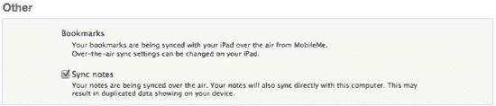

**图 10-5.** *iTunes 中“信息”下的“其他”部分包含一个用于将备忘录从 iPad 同步到 Mac 的复选框。*

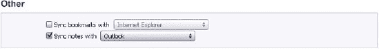

**图 10-6.** *在 Windows 版 iTunes 的“其他”部分下，你可以找到用于与 Outlook 同步备忘录的复选框。*

要将备忘录从 iPad 同步到电脑，选中该复选框，然后点击`iTunes`窗口右下角的`同步`按钮。

那么，现在你已经将所有备忘录同步到电脑上了——它们在哪里呢？奇怪的是，Mac 上并没有类似的应用程序，因此备忘录最终会出现在`邮件`中。在你的 Mac 上启动`邮件`，然后查看`邮件`窗口左侧的边栏（参见图 10-7）。

看到`提醒事项`标题了吗？它下面有一个来自 iPad 的`备忘录`图标的小型复制品。点击该图标，你会看到两个更多记事本——一个写着“在我的 Mac 上”，另一个写着“MobileMe”。点击`在我的 Mac 上`图标，你创建的备忘录就在那里。

在 Windows 电脑上，备忘录会同步到 Microsoft Outlook 2003、2007 或 2010（参见图 10-8）。要在 Outlook 中查看同步的备忘录，请点击`备忘录`按钮。

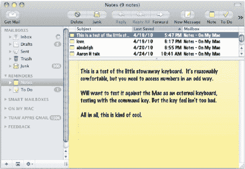

**图 10-7.** *在 iPad“备忘录”中创建的文本会同步到 Mac 的“邮件”。*

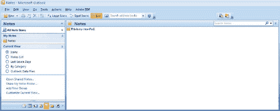

**图 10-8.** *在 iPad“备忘录”中创建的文本会同步到 Windows 电脑上的 Microsoft Outlook 2003、2007 或 2010。*

这些备忘录是完全同步的，因此如果你选择在 Mac 或 Windows 电脑上修改其中一个或创建一个新的，更改或新文件会在下次同步时转移到 iPad 上。同样，你在 iPad 上所做的任何更改、添加或删除，都会反映在你的电脑上。

那么，那个`MobileMe`图标是怎么回事？如果你拥有 Apple 的`MobileMe`账户，你可以在各种设备和不同位置同步你的备忘录。最初，在电脑和 iPad 之间同步备忘录的唯一方式是通过那种硬连线的 USB 连接。现在，备忘录是可以无线同步的另一种内容类型。

### 日历

像许多喜欢 Day-Timer 规划簿布局的人一样，我们很高兴看到 Apple 如何将单调的 iPhone 日历应用改造为 iPad 上的一款精美应用。在横屏模式下（参见图 10-9），日历看起来非常像那个老式的 Day-Timer。

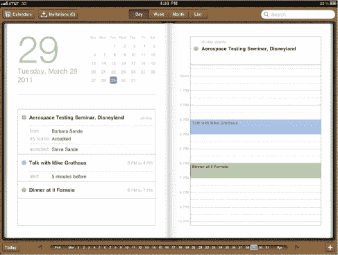

**图 10-9.** *处于“日”视图的 iPad 日历应用看起来像一本传统的纸质预约簿。*

日历有四种视图，每种视图提供略有不同的日历信息显示方式。要在它们之间切换，请轻点日历顶部的`日`、`周`、`月`或`列表`。

图 10-9 中显示的是“日”视图，它按小时列出当天将要发生的事件。

在“日”视图的日历应用左侧，有一个方便的月份日历和当天所有预定约会的列表。要翻到这本虚拟预约簿的下一页，请轻点页面底部的右箭头。转到上一页只需轻点左箭头。你也可以在两个箭头之间显示的当前月日期上，用手指来回拖动，以导航到特定日期。

如果在日历中这样来回切换让你感到迷失，应用左下角有一个“今天”按钮，可以快速跳转到当天。在我们讨论添加或搜索日历事件之前，先来看看其他可用的日历视图。

“周”视图（参见图 10-10）有助于规划特定一周内需要完成的任务。日历顶部列出的任何项目都是全天事件，而彩色方框则表示会议的起止时间和持续时间。一周中的各天横列在顶部，一天中的小时数则列在左侧。要滚动查看一天中更早或更晚的时间（日历一次只显示每天的 12 小时），请用手指向上或向下滚动。

看到大约下午 4 点处带有横线的小图钉了吗？那表示当前时间，这样你就能一眼看出距离下一次约会还有多少时间。日历的另一个功能是左上角的“邀请收件箱”。如果有人使用`iCal`或其他日历应用向你发送了活动邀请，当你轻点`邀请收件箱`按钮时，它就会被列出。你可以查看邀请详情、接受或拒绝邀请，所有这些操作都可以在 iPad 上的这一个地方完成。

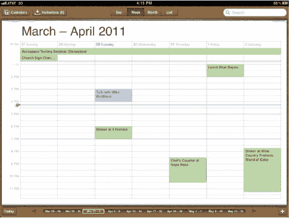

**图 10-10.** *使用日历应用的“周”视图，一览一周的安排*

“周”视图在页面底部列出了十个一周时间段，你可以轻点其中任何一周，或向左/右滑动手指来查看前几周或后几周。

“月”视图（参见图 10-11）提供了那种已作为桌面台历销售多年的“概览月历”风格。在这里，一个月中的每次约会都由特定日期上的一个小圆点表示。要获取约会的详细信息，只需轻点该圆点，就会出现一个弹出箭头，其中包含约会时间和一个编辑按钮。

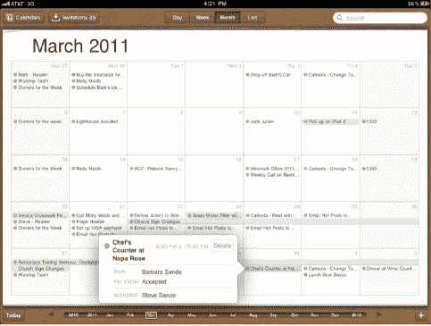

**图 10-11.** *你可以在日历应用的“月”视图中查看整个月的约会。轻点一个约会打开箭头弹出框，以查看详情或编辑该事件。*

页面底部的区域会变为一年中各月的列表，只需轻点一下手指即可跳转到特定月份。还有按钮可以轻点导航到上一个月和下一个月，以及指向之前和之后年份的链接。

最后一个视图是“列表”视图（参见图 10-12），它在页面左侧以可滚动列表的形式显示即将到来的约会，同时在右侧显示当前事件的详细视图。

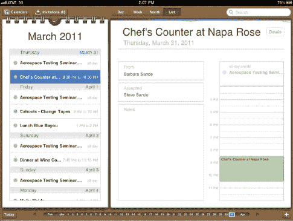

**图 10-12.** *iPad 日历应用中的“列表”视图显示即将到来的约会列表（左）以及你轻点任何约会的详细信息（右）。*

轻点左侧列表中的任何约会，将在右侧显示该事件的详细信息。设置的任何提醒都会被列出，以及与事件相关的备注。如果其他人向你发送了约会并且你已接受，详细视图还会显示最初是谁发送了该约会，并列出其他已接受活动邀请的人，以及已受邀但尚未回复的人。


#### 添加日历事件

在上述任一视图中，点击日历右下角的加号（`+`）图标，即可弹出“添加事件”对话框和标准的 iPad 虚拟键盘。若要输入事件信息，请轻点任意一个字段，然后在键盘上开始输入。轻点用于输入事件开始和结束时间的“开始与结束”字段，会显示一个日期和时间选择器（见图 10–13）。用手指上下滚动选择开始日期和时间，然后以同样方式选择事件的结束时间。如果事件将持续一整天（例如，全天会议或生日），则将“全天”按钮滑动至“开”。

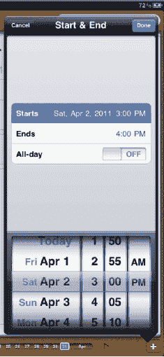

**图 10–13.** *在向日历添加事件时，你可以使用日期和时间选择器来选取开始与结束的日期和时间。*

如果你希望事件按固定间隔重复，只需轻点“重复”字段。你将看到选项（见图 10–14），可选择按每天、每周、每两周、每月或每年重复事件。每日重复的事件可用于提醒自己服用重要药物，而每年重复的事件则能通过提醒即将到来的纪念日来挽救你的婚姻。

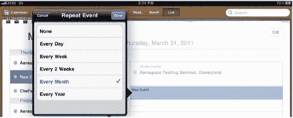

**图 10–14.** *任何事件都可以设置为你设定的不同时间间隔重复。*

每个事件最多可以设置两个提醒。iPad 上的提醒同时包含声音和视觉提示；与 Mac 不同，这里无法在两种提醒类型之间选择。轻点“提醒”或“第二个提醒”字段，会显示事件前可触发提醒的时间列表。这些时间从事件前五分钟到两天不等，你也可以让 iPad 在事件当天提醒你。

当提醒触发时会发生什么？屏幕上会出现一个小的视觉提醒（见图 10–15），带有一个“关闭”按钮（轻点即可关闭提醒）和一个“查看事件”按钮（带你进入日历查看详情）。如果 iPad 的音量已开启，你还会听到提醒铃声。

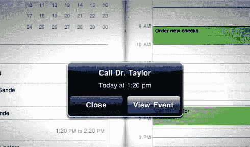

**图 10–15.** *你的 iPad 会通过提醒铃声和视觉提示来提醒你即将到来的约会。*

此外还有用于输入事件地点或备注的字段。完成事件信息输入后，轻点“完成”按钮，该事件便会显示在日历上。

#### 同步日历

与“备忘录”应用类似，当你将 iPad 与 Windows 电脑上的 Microsoft Outlook 2003、2007 或 2010 同步，或与 Mac 上的`iCal`或`Outlook`同步时，iPad 上“日历”应用的强大功能便会显现。设置同步的方法与设置“备忘录”类似。

使用基座接口转 USB 连接线将 iPad 连接到 Windows 电脑或 Mac，如果`iTunes`没有自动启动，请手动启动它。在电脑上的`iTunes`中，点击窗口左侧边栏“设备”下代表你 iPad 的图标。接着，点击“信息”标签页，向下滚动直到看到“同步 iCal 日历”（Mac；图 10–16）或“同步日历”（Windows；图 10–17）的字样。

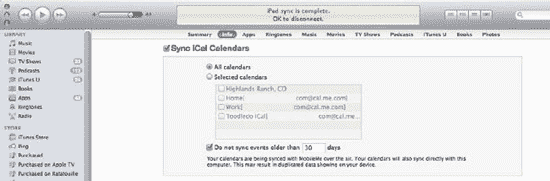

**图 10–16.** *在 iTunes 中设置日历同步。请注意，此 iPad 已通过 Apple 的 MobileMe 服务进行同步。*


**图 10–17.** *在 Windows 版的 iTunes 中设置日历同步*

要设置 iPad 上`iCal`与“日历”应用的同步，请选中“同步日历”（Windows）或“同步 iCal 日历”（Mac）复选框。复选框下方是单选按钮，用于将 Mac 或 Windows 电脑上的所有日历同步到 iPad，或仅同步选定的日历。如果你的电脑上有多个日历，并且确实不需要在 iPad 上查看或编辑所有这些日历，那么你可能希望选择特定的日历进行同步。

在图 10–16 中，你可以看到 Mac 上的四个日历——一个用于“家庭”，一个用于“工作”，一个名为“Highlands Ranch”（由 Bare Bones Software 的 Mac 应用程序`WeatherCal`创建，用于在日历上显示天气预报），第四个名为`Toodledo iCal`（来自在线待办事项服务 Toodledo）。若仅将“家庭”日历同步到 iPad，请选中“所选日历”单选按钮，然后仅勾选“家庭”日历框。

你可以通过选中“不要同步早于 30 天的事件”框，选择仅同步未来和近期的事件。如果你的日历上有许多事件，并且不想让日历数据占用 iPad 空间，这一功能非常有用。天数是可以编辑的，因此如果你只想同步过去两周及未来的事件，可以将数字 30 改为 14。

要应用更改并将日历同步到 iPad，请点击`iTunes`窗口右下角的“应用”按钮。同步完成后，在 iPad 上启动“日历”应用，然后为自己的成果鼓掌吧！请记住，这是双向同步，因此你在 iPad 上所做的任何更改或添加都会同步到电脑，反之亦然。

##### 通讯录

iPad 桌面工具的第三个组件是`通讯录`，即你的电子地址簿。地址簿左侧是联系人姓名的滚动列表，而右侧则显示特定个人或公司的详细信息（见图 10–18）。


**图 10–18.** *通讯录是你的个人地址簿，可根据需要同步到 Mac 或 Windows 电脑以及其他设备。*

与`日历`相比，`通讯录`应用非常简单。它没有多种信息显示方式，只有一种视图，且横屏和竖屏模式下的显示相似。这并不是说`通讯录`没有用处；事实上，`邮件`和许多其他 iPad 应用都会使用联系人列表来实现与他人的信息共享。


#### 添加联系人

若要添加联系人，请点击左页底部的加号 (`+`) 图标。通讯录应用中会显示一个空白页面（参见图 10–19），上面附有说明标签，指示每个字段需要输入哪些信息。若要开始向任意字段输入信息，点击该字段，iPad 的虚拟键盘就会出现。


**图 10–19** *从这张空白页开始，你的联系人信息可以简单，也可以复杂。*

苹果在通讯录编辑字段方面做得非常出色。输入一串数字作为电话号码，系统会自动生成格式美观的号码，并根据你所在的国家/地区在适当位置添加破折号和括号。在地址区域添加州或省代码时，大写锁定键会被锁定，以确保代码中的所有字母均为大写。正是这样的细节设计让 iPad 的使用体验如此愉悦。

你甚至可以通过点击`添加照片`框为每个通讯录条目添加照片。这会显示 iPad 上存储的照片专辑列表，你可以浏览直至找到正在录入信息的人的照片。点击该照片，你便可以使用常见的 iPad 手势来移动和缩放图像，直到照片看起来合适为止。最后，点击`使用`按钮，照片就被插入到页面中了。

完成人员或公司信息的录入后，点击通讯录应用右上角的`完成`按钮，即可在虚拟地址簿中看到完成的页面。

如果你需要随时添加或更改信息，点击`编辑`按钮即可显示通讯录的编辑字段。每个通讯录条目的底部还有一个`共享`按钮，它会生成一封包含 `.vcf`（vCard 文件格式）文件的电子邮件，该文件能被大多数地址簿应用程序打开。对于拥有第二代或更新版本 iPad 的用户，每个通讯录条目的底部会出现一个`FaceTime`按钮。只需轻点一两下，你就可以与朋友或家人进行视频通话。

要删除联系人，请点击`编辑`按钮，然后滚动到联系人信息的底部。那里有一个红色的大号`删除联系人`按钮。点击它，会出现一个小对话框，询问你是要删除该联系人还是取消删除。当你点击`删除`时，该联系人将从你的 iPad 通讯录列表中移除。

#### 群组与搜索

在通讯录左页的顶部有一个红色的小书签，上面写着*群组*字样。点击那个红色书签会列出你创建的所有群组……但不是在 iPad 上。你无法在 iPad 上创建联系人群组。该任务必须在你的 Mac 或 Windows 电脑上完成。

为什么要使用群组？这是一种很好的方式，可以让你更容易地找到某个特定群组中认识的人，或列出某个群组中的所有成员。换句话说，与其从 2000 个联系人中搜索一个你明知是某个特定群组成员的人，不如将范围缩小到该群组中的人。

说到搜索，你可以使用通讯录左页顶部的`搜索`字段来查找特定的人或公司。点击`搜索`字段，开始输入，通讯录就会提供符合搜索条件的人员或公司列表。例如，搜索 *Steve* 会列出通讯录中包含该名字的所有联系人（参见图 10–20）。


**图 10–20** *当你需要在大量联系人中快速找到某人时，搜索字段非常有用。*

#### 同步通讯录

还记得在本章前面部分你是如何设置日历和备忘录的同步的吗？你将用同样的方式来设置通讯录的同步。在 Windows 电脑上，配套应用程序可以是 Microsoft Outlook 2003、2007 或 2010；Windows 通讯簿（Windows XP），或 Windows 联系人（Windows Vista 和 Windows 7）。在 Mac 上，联系人同步可以通过通讯录程序和 Microsoft Entourage 2004 或 2008 来设置。你应该使用哪个应用程序？如果你在 Windows 电脑上使用 Outlook，则与 Outlook 通讯录列表同步。如果你使用网页邮件或除 Outlook 之外的应用程序管理邮件、联系人和日历，则根据你使用的 Windows 操作系统版本，选择使用 Windows 通讯簿或 Windows 联系人。

使用基座连接器转 USB 线缆将 iPad 连接到 Mac，如果 iTunes 没有自动启动，请手动启动它。在电脑上的 iTunes 中，点击窗口左侧边栏中“设备”下方代表你 iPad 的图标。接下来，点击“信息”选项卡并向下滚动，直到看到*同步通讯录中的联系人*（Mac；图 10–21）或 *Sync Contacts（同步联系人）*（Windows；图 10–22）字样。


**图 10–21** *若要同步 Mac 上的通讯录，请选中“同步通讯录中的联系人”复选框。请注意，此 iPad 已通过 MobileMe 进行同步。*


**图 10–22** *若要在 iTunes 中将通讯录与 Windows 电脑同步，请选中“同步联系人”复选框。*

与同步日历一样，你可以选择将所有联系人同步到 iPad，或者只同步选定的群组。在设置通讯簿同步时，还有其他几个复选框需要考虑。

首先，你可能希望将在 iPad 上创建的联系人添加到特定群组。这就是`将本 iPad 上群组之外创建的联系人添加到`复选框的作用。选中该框，然后选择一个群组。在 iPad 上创建的任何新联系人都将自动添加到该群组。

苹果还内置了与其他通讯簿的同步功能。接下来的两个复选框用于设置与 Yahoo! 通讯簿或 Google 联系人的同步。选中其中任何一个复选框，都会显示一份法律协议，允许 iTunes 与 Yahoo! 或 Google 同步。你可以同意或不同意该声明，但请注意，如果不点击`同意`按钮，你将无法与这些服务同步。

一旦你同意允许与 Google 或 Yahoo! 共享信息，就会出现一个配置屏幕，要求输入该服务的用户 ID 和密码。输入该信息，然后点击 iTunes 右下角的`应用`按钮，即可确保你的通讯录信息在 iPad、电脑的通讯簿或联系人应用程序以及 Yahoo! 通讯簿或 Google 联系人之间同步。


### MobileMe 同步

你刚刚完成的所有同步设置都基于一个前提——你没有订阅 Apple 的 MobileMe 服务。MobileMe 不仅能实现 Mac、Windows 电脑、iPhone、iPad 和网页之间的数据同步，还为你提供`me.com`邮箱地址、通过 iDisk 进行数据在线存储、在线相册，以及在丢失 iPad 时找回它的功能。真正神奇之处在于，这一切都通过 iPad 的 Wi-Fi 或 3G 连接完成，因此无需通过基座接口和 USB 线将设备持续连接到 Mac 或 Windows 电脑。

MobileMe 由 Apple 提供，年度订阅费用为 99 美元（[`www.apple.com/mobileme`](http://www.apple.com/mobileme)），不过 Amazon.com 上常有折扣订阅。如果你已从这些渠道购买了订阅，可以通过选择“系统偏好设置”``“MobileMe”并输入会员名和密码在 Mac 上启用该服务（参见图 10–23）。非会员则可通过同一“系统偏好设置”面板注册 60 天免费试用。Windows 电脑用户只需在浏览器中访问[`www.apple.com/mobileme`](http://www.apple.com/mobileme)即可注册 MobileMe 或申请相同的免费试用。


**图 10–23.** *MobileMe 不仅能出色地实现 iPad、iPhone 和 Mac 的无线同步，还具备在丢失 iPad 时进行定位和远程擦除数据的功能。*

从“MobileMe 系统偏好设置”面板登录 MobileMe 账户后，你可以点击“同步”按钮并确保勾选“与 MobileMe 同步”复选框，从 Mac 端设置同步（图 10–24）。


**图 10–24.** *与 MobileMe 同步可对日历和通讯录进行无线双向更新。*

复选框下方列出了 MobileMe 能在登录同一账户的不同设备之间同步的项目。其中最主要的是三个桌面应用——日历、备忘录和通讯录——但邮件账户和 Safari 浏览器书签也可以在 Mac、iPad、iPhone 或 iPod touch 之间同步。

我们建议设置自动同步，这样一旦 Mac 上的 iCal 或通讯录发生更改，或在邮件中添加了备忘录，这些更改会立即同步到 iPad。请记住，同步是双向的，因此在 iPad 上所做的更改也会同步到其他设备。

你会注意到，如果设置了日历、通讯录和备忘录信息的 MobileMe 同步，iTunes 中“信息”标签页上的这些项目会被取消勾选。iTunes“信息”标签页的“同步通讯录联系人”、“同步 iCal 日历”及其他区域底部会显示提示信息，表明这些数据正通过 MobileMe 进行无线同步。你可以选择同时使用直接同步和 MobileMe 同步，但如果你已使用 MobileMe，我们建议将其作为同步数据的唯一方式。

对于 Windows 用户而言，在 iPad 上设置 MobileMe 同步是最简单便捷的方法。在 iPad 上依次选择“设置”``“邮件、通讯录、日历”，然后点击标示你的 MobileMe 账户的按钮（该按钮以你的 MobileMe 邮箱账户名标注）。在出现的对话框中（参见图 10–25），你会看到用于开启通讯录和日历同步的开关。将这些开关滑动至“开”即可在 iPad 和 MobileMe 之间同步日历和通讯录。将 MobileMe 与 Windows 电脑同步超出了本书的范围，但你可以通过[`www.apple.com/mobileme/setup/pc.html`](http://www.apple.com/mobileme/setup/pc.html)了解更多信息。

我们将在下一章介绍如何在 iPad 上设置 MobileMe。


**图 10–25.** *将相关开关滑动至“开”即可在 iPad 和 MobileMe 之间同步日历和通讯录。*

### 本章小结

iPad 上最实用的应用程序包括日历、备忘录和通讯录——这是设备的桌面办公套件。在本章中，你学习了如何将 iPad 用作数字记事本、日程本和通讯录，以及如何将这些信息同步到 Mac 或 Windows 电脑。以下是本章需要记住的几个要点：

- 电脑上的桌面办公应用（Mac 上的 iCal 和通讯录，Windows 电脑上的 Outlook）可以与 iPad 上的同类应用同步。日历是 iPad 上强大的桌面日历，而通讯录可让你访问所有通讯录信息。备忘录应用则是快速记录文本并将其传输到电脑的便捷方式。
- 备忘录会同步到 Mac 上的邮件和 Windows 电脑上的 Outlook。目前，备忘录数据无法通过 MobileMe 进行无线同步。
- 查看日历信息有四种视图——日视图、周视图、月视图和列表视图。
- Apple 的 MobileMe 服务不仅是与其他电脑和设备同步日历和通讯录信息的绝佳方式，还能提供找回丢失 iPad 的功能。
- 虽然你无法在 iPad 上创建联系人分组，但通讯录支持显示在通讯录或 Outlook 中创建的分组。分组是组织大量联系人的强大工具。

## 第 11 章

## 设置和使用邮件

电子邮件，是我们与世界的连接，是我们融入更大社会的方式。它占据了我们一天中的大量时间，甚至比电话更能成为人们相互联系和更新的主要方式。如果问大多数人他们会用新 iPad 做什么，很多人会立刻回答“收发邮件”。能够离开办公桌，在移动中依然保持联系，是 iPad 使用中极具价值的部分。

iPad 使用“邮件”应用来撰写、发送和接收电子通信。它提供了一种便捷的方式，用于发送便签、共享文件以及查看他人与你分享的内容。许多 iPad 应用也将“邮件”作为与他人共享文档或文件的渠道，因此“邮件”是一个值得了解的好应用。

在本章中，你将学习如何在 iPad 上设置电子邮件账户，了解撰写和管理邮件的要点，并了解“邮件”如何与其他 iPad 应用配合，帮助你与他人分享信息。

### 设置邮件账户

iPad 的“邮件”应用图标非常容易识别：一个白色纸信封漂浮在蓝天背景上。默认情况下，“邮件”图标位于 iPad 屏幕底部的程序坞中。程序坞确保可以从主屏幕的任何一个页面轻松访问“邮件”。有时你会看到这个信封/天空图标上出现一个带有数字的红色气泡。这个气泡表示有多少新消息已到达，正等待你阅读。

第 10 章讨论了如何在 iPad 和电脑之间同步日历、通讯录和备忘录。iPad 和 iTunes 也让账户传输到电脑变得同样简单。如果你已经在 Mac 或 Windows 电脑上设置了多个电子邮件账户，则无需重新输入所有信息在 iPad 上进行设置。你可以使用第 10 章中相同的流程将邮件账户同步到 iPad，以快速设置邮件，也可以直接在 iPad 上设置账户——由你选择。接下来的两节将介绍这两种方法。


#### 同步邮件账户

使用 iTunes 中的“信息”选项卡同步邮件账户，是在 iPad 与 Mac 或 Windows 电脑上设置所有电子邮件账户的最快捷方式。使用`基座接口转 USB 连接线`将 iPad 连接到 Windows 电脑或 Mac 电脑，然后在电脑上启动`iTunes`（如果尚未打开）。在`iTunes`中，于源列表（屏幕左侧的蓝色列）中找到您的设备。点击代表您 iPad 的图标，然后打开屏幕顶部的`信息`选项卡。`信息`选项卡提供了一种将信息（包括邮件账户、通讯录联系人和日历）从电脑同步到设备的简便方法。向下滚动，直到看到`同步邮件账户`字样（请参见图 11-1）。


**图 11-1.** *您的 Mac 或 Windows 电脑上是否已经设置了多个电子邮件账户？`iTunes` 提供了一个易于使用的界面，用于将这些邮件账户同步到您的 iPad，从而实现快速可靠的设置。*

每个账户名称的左侧都有一个复选框。要启用电脑与 iPad 之间的邮件账户同步，请选中`同步邮件账户`复选框（参见图 11-1 屏幕截图的左上角），勾选您想要在 iPad 上设置的每个邮件账户的复选框，然后点击`iTunes`窗口右下角的`同步`或`应用`按钮。

关于同步邮件账户，需要记住重要的一点：此过程仅同步您的账户*设置*，而不是可能存储在邮件服务器上的账户*邮件*。这一点很重要，因为您的 iPad 检索邮件的方式取决于其设置所使用的协议。

`邮局协议版本 3`（`POP3`，通常简称为`POP`）邮件账户通常配置为将电子邮件下载到您的电脑或设备，并从邮件服务器上删除。这种“下载即删除”的过程意味着，当您在 iPad 上接收基于 POP 协议的电子邮件时，您将永远不会在电脑上看到它。

相比之下，当您的邮件账户未设置为从邮件服务器删除邮件时（如大多数默认的`IMAP`或`Exchange`账户设置），您将在 iPad 和电脑上都保留一份副本，并且从一台设备上删除邮件不会从另一台设备上删除。您可以在任一设备上阅读邮件，唯一改变的是邮件状态，从未读变为已读。

Apple 的`MobileMe`邮件，如同其他`互联网消息访问协议`（`IMAP`）邮件系统一样，会保留邮件，直到您手动删除它们。这意味着，使用`MobileMe`时，您将在多台设备上看到该邮件，且它们的状态都相同。未打开的邮件在所有设备上都将显示为未打开状态，已读邮件则在所有设备上都显示为已读。

微软的`Exchange Server`在企业中被广泛使用，因此了解 Mail 对此电子邮件标准提供了出色的支持非常重要。`Exchange`提供推送邮件功能（本章稍后讨论），可实现近乎即时地接收传入邮件。iPad 完全支持`Exchange Server 2003`和`Exchange 2007`的同步，并且也将支持`Exchange 2010`。

虽然在 iPad 上设置`Exchange`账户并不比其他类型的电子邮件配置更困难，但令人欣慰的是，大多数使用`Exchange`的组织也可以在您遇到问题时为使用 iPad 的客户提供技术支持。

如果您有兴趣使用`Exchange`来托管您的 iPad 电子邮件，但没有相应的技术专长来配置和维护`Exchange Server`，全球有许多可用的`Exchange`托管服务。在互联网上搜索`Exchange Server`会显示许多为您托管`Exchange`的公司。

#### 直接在 iPad 上设置邮件账户

当您只需要设置一两个电子邮件账户，并且您无法（例如，当您不在办公室时）或不想在 iPad 和电脑之间同步账户信息时，您*可以*直接在 iPad 上设置邮件账户。这虽然不如从电脑同步账户那样简单易行，但也不算太难，以至于您无法在需要时随时随地进行设置。

在开始设置账户之前，请确保手头有以下信息。这些信息通常可以在您的互联网服务提供商的支持页面上找到，位于有关配置电子邮件的部分下。

*   *您的电子邮件服务提供商名称*：常见的提供商包括 Apple 自家的`MobileMe`服务、Google 的`Gmail`、雅虎`Mail`、`AOL`，或`Comcast`和`Time Warner`等互联网服务提供商。
*   *您的电子邮件地址*：所有电子邮件地址都采用常见的`myname@domain.tld`格式，其中`myname`是个人或公司的名称或化名，`domain`是组织使用的域名，`tld`是该域名的“顶级域”（例如`.com`、`.gov`、`.edu`等）。
*   *您的电子邮件密码*：这是设置电子邮件账户最关键的信息，但令人惊讶的是，很少有人记得自己的密码！这是因为许多 IT 部门为了增强整体安全性，会创建包含数字和符号的特别复杂的密码。当然，最终结果是许多人将那个复杂的密码写在便利贴上，并贴在显示器上，从而完全违背了设置“复杂密码”的初衷。

如果您不记得密码，可能需要联系您的互联网服务提供商或 IT 部门来获取密码，或者将密码重置为更容易记住的内容。一旦在 iPad 上设置好，您就无需重新输入。密码会安全地存储在您系统的“钥匙串”中，这是 iPad 记住重要信息的一种私密方式。

*   *服务器信息*：某些账户将由 Mail 自动设置。换句话说，它会自动识别您的服务器是`Exchange`服务器、`POP`服务器还是`IMAP`服务器，并相应地调整设置。但是，在开始之前获取此信息并将其保留以备记录是一个非常明智的做法。

需要收集的信息包括您的接收邮件服务器（通常以`POP`或`IMAP`开头）和发送邮件（通常是`SMTP`）服务器的服务器地址（您的电子邮件提供商可能将其称为服务器`URL`）。出于安全原因，电子邮件提供商可能还会要求您的邮件通过特定的互联网协议端口进行传输，因此在设置前请求端口信息可以避免日后的麻烦。

虽然端口`587`是安全`SMTP`连接的标准端口，但某些连接使用端口`25`（`SMTP`）、`110`（`POP3`）、`143`（`IMAP`）、`993`（SSL 加密的`IMAP`）、`995`（SSL 加密的`POP`）和`465`（SSL 加密的`SMTP`）等。`Exchange`设置还需要一个域名，该域名可以简单如一个单词——`HOST`——也可以复杂如`host.admin.mycompany.com`。

以下步骤演示了如何设置一个`Gmail`账户，这是最常见的电子邮件账户类型之一。虽然每种电子邮件账户在设置时所需的信息量可能不同，但所有类型在 iPad 上的设置过程基本相同，因此您应该能够按照以下步骤设置除`Gmail`之外的账户：


1.  在尝试设置或以其他方式与邮件交互之前，请务必确保您的 iPad 已通过 Wi-Fi 或 3G 连接至互联网。
2.  在“设置”“邮件、通讯录、日历”中，找到“账户”；然后轻点“添加账户”。或者，如果您尚未设置任何其他账户，可以打开“邮件”应用，它将自动显示相同的设置界面。
3.  从出现的列表中选择正确的账户类型（请参见图 11-2）。本示例使用 Gmail。如果您在此处未看到您的电子邮件服务提供商，请轻点“其他”。使用预定义的账户类型可以简化设置过程，因为您通常无需添加服务器地址等额外信息。系统会自动为您提供 Yahoo、Gmail、MobileMe 和 AOL 的服务器信息。


**图 11-2.** *当您使用列出的任一主流电子邮件服务提供商时，“邮件”会为您完成大部分设置工作。*

4.  选择预设服务后，在设置窗口中输入您的信息（请参见图 11-3）。指定您希望收件人看到的名称。例如，如果您的姓名是 John Appleseed，您可以输入 John、Mr. Appleseed 或 “苹果树小哥”，收件人将通过此名称识别发件人的“真实姓名”。


**图 11-3.** *在“邮件”中设置新电子邮件账户非常容易，尤其是使用 MobileMe、Gmail 或之前列出的其他电子邮件服务提供商时。*

5.  输入电子邮件地址。对于此电子邮件账户，地址是 `ipadmaxbook@gmail.com`。
6.  现在输入电子邮件账户密码。与 iPad 上的所有密码字段一样，输入的密码几乎会立即被一系列圆点隐藏。
7.  输入此账户的描述。本示例使用“Gmail for Book”来描述该电子邮件地址的用途。始终为每个电子邮件账户添加有意义的描述，尤其是在同一设备上使用多个账户时。这些简短、具描述性的名称会显示在 iPad 上“邮件”的账户列表中，让您能够区分哪封邮件归属于哪个账户。当您使用五六个不同的 Gmail 账户时，仅靠“Gmail”这样的描述是没用的。
8.  轻点“存储”按钮。此时，您的 iPad 会进入一个验证过程，以确保存在与电子邮件地址对应的账户、密码正确且该账户的设置正确。进度轮会告知您该过程正在进行中。如果您的 iPad 无法建立该账户，您将在几分钟内得知，但在此步骤中您需要耐心等待。
9.  如果一切验证无误，您将看到一个账户服务列表（请参见图 11-4）。这些服务因提供商而异，您可以选择需要通过无线网络同步的服务。选择您的服务，然后轻点服务弹出窗口右上角的“存储”。选择服务并返回到“设置”中的电子邮件账户列表后，新账户将出现并添加到列表底部。


**图 11-4.** *账户服务因提供商而异。Gmail 允许您为账户激活邮件、日历和备忘录服务。*

如果设置过程中出现错误，您的 iPad 会通知您。在大多数情况下，是由于电子邮件地址或密码输入错误；或者，如果使用“其他”选项手动设置账户，可能是服务器地址输入有误。“邮件”在使 iPad 上的电子邮件设置变得简单方面做得非常出色，因此大多数情况下，您只需几分钟即可完成设置。设置完成后，大多数人无需再更新其账户。但是，如果您以后需要更改设置该怎么办？

在 iPad 的“设置”“邮件、通讯录、日历”下，您会找到每个电子邮件账户对应的按钮。轻点该按钮可打开详细显示视图，查看已启用服务的概况。轻点“账户”行可查看账户信息设置，以及“高级”选项的进一步链接（请参见图 11-5）。


**图 11-5.** *账户信息屏幕中列出了每个账户的信息，包括显示给收件人的名称、“邮件”中的账户名称以及完整的电子邮件地址。轻点“SMTP”或“高级”以调整您的账户设置详情。*

当您处于低带宽状态并希望关闭服务（无论是电子邮件账户、日历、备忘录还是其他无线服务）时，请轻点“邮件、通讯录、日历”屏幕中的账户名称以打开每个账户的设置。账户详情屏幕随即出现。将服务按钮（例如“邮件”）从“开”滑动到“关”。完成此操作后，“邮件”将不再检查该账户的电子邮件服务器，并且该账户会显示为“未激活”状态（该状态会显示在“账户”列表中每个账户名称下方）。要恢复该过程，只需将“邮件”按钮滑动到“开”即可。

有时，您的互联网服务提供商或 IT 部门可能会要求您更改电子邮件服务器的一些设置，或者您可能在发送、接收或配置邮件时遇到问题。我们建议您使用 Apple 的便捷速查表，可从[`http://support.apple.com/kb/HT1277`](http://support.apple.com/kb/HT1277)获取，它可以帮助您从电子邮件提供商处获取正确的电子邮件账户设置，并以一种便于使用、组织良好的方式进行记录。

对于特定电子邮件账户下的“外发邮件服务器”，可以编辑其设置。`SMTP`选项表示用作外发邮件主服务器的简单邮件传输协议服务器。轻点该选项，然后轻点主服务器名称，即可显示该服务器的设置（请参见图 11-6）。当设置像图 11-6 中那样呈灰色时，说明它们是预设的、正确的，并且无法编辑。当可以编辑时，您可以使用速查表将设置更改为正确的值。


**图 11-6.** *当“外发邮件服务器”设置像本图中那样呈灰色时，说明您的设置与服务器预设一致且正确，不应更改。*

出于安全原因，大多数邮件服务器现在都使用身份验证和特定的服务器端口。标准端口包括：POP3 服务器使用 110，POP3 over TLS/SSL 使用 995；IMAP 使用 143，POP3 over TLS/SSL 使用 993；密码信息提交使用 587；SMTP（外发）邮件使用 25。

身份验证意味着“邮件”必须向邮件服务器提交用户名（通常是您的电子邮件地址）和密码，然后才能将邮件下载到您的 iPad。有四种常见的身份验证类型：`MD5 Challenge Response`、`NTLM`、`HTTP MD5 Digest`和`Password`。如果您的密码未被正确接受，请务必向您的邮件提供商咨询此信息。

#### 其他邮件设置

您会在“设置”“邮件、通讯录、日历”中找到更多设置（请参见图 11-7），您可以根据个人偏好对其进行编辑。大多数设置无需修改，但了解您可以在必要时更改它们也是令人安心的。以下部分介绍其中一些设置，并讨论它们如何影响您在 iPad 上使用电子邮件的方式。


**图 11-7.** *更改邮件设置可以使阅读和发送电子邮件更加愉快和高效。*


##### 获取新数据

“获取新数据”按钮出现在列出的最后一个电子邮件账户正下方（图 11-7 显示了右侧面板向下滚动至账户列表之外的情况）。某些电子邮件账户（如 MobileMe 的 IMAP 服务）允许你设置所谓的*推送*服务。当推送功能启用时，新邮件在电子邮件服务器接收后，会立即传输到你的设备上。虽然这是尽快获取邮件的好方法，但它也需要 iPad 与电子邮件服务器之间进行更多通信。这可能会缩短电池续航时间，但更重要的是，它会增加设备使用的带宽。

尽管如果你使用的是 Wi-Fi 网络，这并非问题，但 3G 网络的数据套餐费用高昂，特别是当你使用的是计量账户时——这是大多数 iPad 运营商提供的标准服务。使用计量账户时，你会获得一定的带宽配额，例如每月 250MB。超出该带宽，你可能会被断网，被再次收取另一个配额的费用，或者可能按高昂的套餐外费率收费；具体细节因你所选的套餐和签约的运营商而异。

推送的替代方案，也是电子邮件账户最常用的一种方法，就是*获取*，也称为*拉取*。使用这种方法，你的 iPad 仅在你指示它或按预设时间间隔时，才会检查服务器上的新邮件。你可以设置电子邮件账户检查邮件的计划：每 15 分钟、30 分钟、60 分钟，或手动。手动模式意味着直到你在“邮件”应用中打开收件箱，或点击大多数邮箱底部的`刷新`按钮时，该账户才会检查邮件。这是节省带宽（尤其是在出国旅行时）的好方法，但你可能会错过在检查间隔期间到达的重要消息。

在大多数情况下，我们建议为 MobileMe 账户以及任何其他能够提供推送通知的电子邮件账户（如 Exchange）保持推送通知开启。对于其他账户，这取决于你希望打开收件箱时新邮件已在那里等待，还是希望 iPad 在你实际打开收件箱时才去获取。

“设置”中的 ` 邮件、通讯录、日历  获取新数据  高级` 按钮可用于配置 iPad 上的每个单独电子邮件账户。每个账户的单独按钮会引导至一个选项，用于在`获取`和`手动`之间进行选择。选择`获取`可将该账户添加到 iPad 的自动例行程序中，或选择`手动`以使你的账户保持离线状态，直到你决定检索邮件。

请注意，你无法单独设置轮询时间；你在“获取新数据”屏幕中选择的轮询时间将应用于所有被获取的账户。例如，如果你选择 15 分钟，则所有被轮询的账户每小时将被检查四次。

##### 显示

设置页面的下一部分更多是关于“邮件”应用程序的外观和感觉。第一个按钮`显示`提供了选项，让你可以随时在收件箱中看到多少封最近的消息。默认值是 50 封，但你也可以选择 25、75、100 或 200 封。

如果你收到的电子邮件不多，将值设置为 25 封就很好。当你收到大量电子邮件或一段时间未检查收件箱时，你随时可以通过点击收件箱底部的`加载更多消息`链接，从服务器拉取更多消息。有些人更喜欢简洁的外观，并愿意在需要时加载更多消息。选择更多的消息数量意味着你的邮箱将始终更加杂乱，但可以避免在获取额外邮件批次时的等待。

##### 预览

邮件收件箱中的每条消息都可以包含内容的简短预览，这样你不仅能看到发件人和主题，还能看到内容的简短片段。`预览`按钮允许你将预览长度设置为从无（无预览）到五行。

邮件的消息显示会更新以反映你在此处设置的预览大小。随着预览变大，你在屏幕上一次可以看到的条目会减少。随着预览变小，你会看到更多。凭借 iPad 慷慨的屏幕尺寸，这个选择对你的影响要小于在更小设备（如 iPhone 或 iPod touch）上管理邮件时的情形——在这些小设备上，该设置在使用中变得更加关键。iPad 的默认设置包含两行消息预览，这通常足以判断消息是否重要。

##### 最小字体大小

如果你戴双光眼镜或阅读小文本有问题，你会喜欢下一个设置。`最小字体大小`允许你将“邮件”中的文本大小从`小`更改为`巨大`，中间还有另外三种大小。与 iPhone 或 iPod touch 不同，在屏幕较大的 iPad 上增加字体大小不会影响可用性，所以不用担心。能够将 iPad 放在桌子上并站着查看，这是一件很棒的事情，即使你的视力在其他方面非常好。

##### 显示收件人/抄送标签

当`显示收件人/抄送标签`按钮启用（设置为`开`）时，收件箱中的每条消息旁边会出现一个小标签，指示该消息是直接发送给你的，还是你在发送给其他人的电子邮件中被抄送了（carbon copied）。如果你将此选项保持禁用状态，你仍然可以在撰写邮件时使用该功能——只是需要额外点击一两下。此选项仅用于设置默认值，即你开始撰写邮件时的起始状态。

##### 删除前询问

有时，你可能会意外删除一封电子邮件。启用`删除前询问`会强制你确认是否确实想要删除一封邮件。经常需要批量删除电子邮件的 iPad 用户可能应该禁用此设置，以避免在处理确认信息时陷入困境。如果丢失一封邮件的后果对你来说可能更严重，那么请启用此选项。

##### 载入远程图像

当你使用慢速互联网连接时，接收包含大量图像的电子邮件可能会令人沮丧，因为加载这些图像需要一段时间。当你处于 3G 信号较弱的区域时，Wi-Fi + 3G iPad 中的无线电会回退到速度慢得多的蜂窝网络，例如 EDGE 或 GPRS。即使是 Wi-Fi 网络也可能连接到一个慢速的互联网连接。例如，许多游轮上提供 Wi-Fi 网络，但却依赖于一条非常慢的卫星连接，船上的所有互联网流量都必须通过该连接。

图像也会消耗带宽，如果你正试图管理蜂窝数据使用量，这是一个问题。因此，你可能希望在移动中跳过图像加载，只在回到办公桌、离开计量互联网时再查看这些内容。

`载入远程图像`用于启用或禁用“邮件”自动加载图像的功能。图像不会立即加载，而是被一个占位图像替换。你仍然可以通过点击手动下载每个图像来查看它。这样，你可以跳过公司野餐的所有快照，同时仍然欣赏你姐姐宝宝的照片。

##### 始终密送给自己

你是否希望将自己发送的每封电子邮件都抄送给自己一份？将`始终密送给自己`设置为`开`，会自动将一封密送副本发送到你的收件箱。对于任何希望保留已发送邮件记录，而其账户并未自动提供此功能的人来说，此设置特别方便。尽管许多现代电子邮件服务提供“已发送邮件”存档，但仍有提供商不提供此选项。

*密送*是什么意思？它仅仅意味着电子邮件的收件人不知道你也同时收到了这封邮件的副本。当你希望将电子邮件副本发送给同事，但又不想让原始收件人知道你在发送这些副本时，密送非常有用。


##### 签名

你是否曾收到过从 iPad、iPhone 或其他 iOS 设备发送的电子邮件？通常，你一眼就能认出它们，因为每封邮件的末尾都附有“从我的 iPad 发送”的签名。在你的 iPad 上，你可以轻松地自定义外发邮件的默认签名，将其修改为你喜欢的任何文字。

许多人喜欢在签名中添加一句简短说明，解释他们邮件内容为什么很简短（例如“请原谅我回复的简洁”），有时还会为可能的拼写错误致歉（我们的技术编辑戴夫·卡洛的签名是：“请原谅拼写错误。我的手指有点大。别误会，不是特别大，只是对于一个身高 6 英尺的人来说是平均水平。”）。

一些使用 POP 电子邮件和转发账户的 iPad 用户也会在签名中反映这种情况（例如：“从我的 iPad 的电子邮件转发账户发送。请勿回复此地址。请改用我的日常办公邮箱，谢谢！”）。还有一些人则利用签名提供常规联系方式，让律师们履行职责（例如：“本电子邮件，包括附件，仅供指定的个人或公司查收，可能包含保密和/或法律特权信息。”），或者仅仅是为了炫耀他们的 iPad（例如：“从我的 iPad 发送。我有最好的玩具。我赢了！”）。

要自定义你的电子邮件签名，请点击 `Signature` 按钮。与大多数 Mac 或 Windows 电子邮件程序不同，iPad 上的 `Mail` 并不为每个邮件账户提供单独的签名。相反，你创建一个通用签名，该签名将被所有账户使用。根据需要编辑默认的“从我的 iPad 发送”文本。你可以将其更改为添加你的姓名、网址或任何其他你希望包含的内容。请记住，如果在签名中包含姓名，它将出现在所有账户中。当所有账户都属于同一用户时，这没有问题。但当乔恩和苏西共用同一台 iPad 时，写着“此致，强尼”的签名也会出现在苏西的电子邮件底部。因此，你可能需要避免在共享签名中使用姓名。

##### 默认账户

`Default Account` 设置允许你选择要用于发送外发邮件的账户。当你使用 iPad 上的其他应用编写邮件时，这些邮件将始终从默认账户发送。点击 `Default Account` 按钮查看 iPad 上的账户列表，然后选择你想要使用的账户。

### 查看和管理你的收件箱

在 iPad 上设置好 `Mail` 后，只要没有将所有设置都设为“手动”，你就会开始自动接收电子邮件。新邮件的第一指示标志是“新邮件音”。虽然有声音提示收到邮件是件好事，但如果你每天收到大量邮件，或者正在开会时收到消息，它可能会变得有点烦人。要关闭“新邮件音”，请前往 `设置`  `通用`  `声音`；然后将开关滑动到 `关闭` 位置。

你的 iPad 还会提供一个精巧的小指示器，通知你收件箱中有未读邮件。`邮件`应用图标会显示一个红色小椭圆形，其中包含你所有收件箱中的未读邮件数量（参见 图 11-8）。此数量涵盖所有收件箱，因此，如果一个账户中有 10 封邮件等待，另一个账户中有 5 封，红色椭圆形将显示你有 15 封未读邮件。


**图 11-8.** *有新邮件！看来是时候点击那个邮件图标，看看你各个邮箱中的那 57 封未读邮件了。*

#### 启动和查看邮件应用

要启动 `Mail` 应用，请点击其图标。启动后，你所看到的界面取决于你是在竖屏还是横屏模式下启动设备。这是因为 `Mail` 使用了一项 iPad 功能，称为*拆分视图*。如果你横向（横屏模式）手持 iPad，屏幕上有足够的空间同时在左侧显示邮箱和账户列表，在右侧显示邮件。

将 iPad 翻转过来，长边变为上下方向（竖屏模式），邮箱和账户列表会弹入一个 `收件箱` 按钮。你只能通过点击屏幕左上角的 `收件箱` 按钮来查看该列表。打开的小窗口被称为“弹出式”屏幕元素，因为它会从你点击的按钮上方弹出窗口。

图 11-9 显示了两种方向下的 iPad 屏幕。通常，在横屏模式下手持 iPad 使用 `Mail` 会*容易得多*。你不必一直从左上角的按钮打开弹出式列表。相反，你可以同时看到屏幕上的所有内容。


**图 11-9.** *邮箱列表包含了当前在 iPad 上设置的所有电子邮件收件箱和账户，以及每个账户的未读邮件数量。当你在竖屏模式下手持 iPad 时（左图），只能通过点击屏幕左上角的收件箱按钮来查看该列表。在横屏模式下（右图），该列表会整合到屏幕中，显示在任何选定内容的左侧。*

要查看任何一个收件箱或账户中的邮件，请在 `邮箱` 列表中点击该项。如果你已将特定电子邮件账户设置为手动获取邮件，此时 iPad 将检查服务器以获取新消息。邮箱和账户列表的左下角还有一个小的刷新图标。点击此图标将强制 `Mail` 立即检查服务器并检索任何已到达的新消息。这允许你绕过任何正常的获取间隔，随时检查邮件。

**警告：** 对于 IMAP 账户，已发送的邮件可以保存在服务器上。然而，对于 POP3 账户，情况可能并非如此。如果你发现已发送的邮件未被保存，并且希望保留已发邮件的存档，请使用密送功能给自己发送一份副本。

请注意 `收件箱` 列表顶部出现的 `所有收件箱` 项。`所有收件箱` 将所有账户中的所有项目合并在一起，让你可以在一个位置阅读新消息。这是 iOS 的新功能，也是近期为 `Mail` 添加的众多重大改进之一。

`收件箱` 列表与 `账户` 列表的不同之处在于，前者*仅*包含每个账户的收件箱——即你的账户已收到的邮件文件夹。大多数邮件账户允许你创建其他文件夹，用于存档和组织邮件，从而让你无需删除存档邮件即可整理收件箱。`账户` 列表中的每个条目不仅会引导你进入该账户的收件箱，还会进入该账户的完整文件夹集合，这些文件夹通常包含其他项目，如 图 11-10 所示。这些文件夹可能包括用于已删除邮件的 `废纸篓` 文件夹、用于外发邮件的 `已发送邮件` 文件夹、用于待办事项的 `待办事项` 文件夹等。Gmail 账户的默认文件夹包括 `个人`、`收据`、`旅行` 和 `工作`。


**图 11-10.** *此示例 Gmail 账户的收件箱包含一封未读邮件，其余邮件已被选中并查看。*

尽管 `收件箱` 屏幕可以快速方便地访问所有新邮件，但当你需要通过将邮件移动到其他文件夹来整理邮件时，使用 `账户` 呈现方式特别方便。它允许你在一个位置查看所有文件夹，从而简化了为邮件选择目标文件夹的过程。你将在本章后面阅读到更多关于编辑邮箱的内容。


#### 浏览您的邮件

您可以通过查看任意邮箱中每个列表项左侧的标记，快速判断哪些邮件已浏览、哪些尚未阅读。每个未读消息旁会显示一个蓝色圆点，如图 11-11 所示，其中三封邮件中有两封尚未阅读。收件箱顶部会以括号形式显示未读邮件数量。


**图 11-11.** *此示例 Gmail 账户的收件箱包含两封未读邮件，其余邮件已被选中并查看。*

要阅读邮件，请轻点邮箱中的邮件条目，然后在屏幕右侧（横屏模式）或全屏（竖屏模式）查看。您可以通过上下滚动来浏览邮件内容。

邮件右上角的`详情`选项可让您展开邮件头部，查看更多关于邮件发送对象的信息。展开后，您可以轻点`隐藏`返回原始显示界面。

#### 查看和打开附件

大多数人使用电子邮件在电脑之间发送文档或其他文件。假设有人想发送一个 PDF 文件供您查看，或者一个 Microsoft Word `.doc` 文件让您在 iPad 上进行修改。您需要知道如何接收该附件、查看附件，并可能在相应应用中打开它进行修改。

当带有附件的邮件到达时，收件箱中会显示一个微小的回形针图标，表示该邮件包含附件。在邮件正文中，附件以小图标形式呈现，并且在您轻点它们之前不会下载到 iPad。这减少了自动传输到您 iPad 的数据量。您将看到文件名、文件大小以及一个图标，如图 11-12 所示。


**图 11-12.** *一个微小的回形针图标表示该邮件带有附件，即随核心邮件一起发送的文件。附件会在邮件中显示其名称、大小和图标。轻点图标可尝试下载并查看附件文件，或长按图标以弹出包含其他选项的菜单。*

根据文件类型（并非所有附件都可查看），轻点图标通常允许您在邮件内置查看器（称为`快速查看`查看器）中打开文件，如图 11-13 所示。该查看器允许您浏览文档、播放媒体，并快速概览发送给您的材料，但查看器不允许您对文件进行修改。对于许多附件，您无需对文件进行任何进一步操作，此时您可以轻点`完成`按钮返回收件箱。否则，您可以在其他应用中打开该文件（例如，编辑 Word 文档），这可以通过`打开方式`菜单完成。您可以通过两种方式访问此菜单。


**图 11-13.** *邮件的`快速查看`附件查看器允许您查看作为邮件附件发送的多种文件类型。查看完毕后，您可以轻点`完成`退出查看器，或使用右上角的操作菜单在其他应用中打开该文件或执行其他系统功能。此处，邮件允许您将 PDF 表单打印到任何支持的 AirPrint 打印机上。*

iPad 邮件应用提供了两种将邮件项目重定向到其他应用的方法。如图 11-13 所示，您可以轻点`快速查看`查看器屏幕右上角的`操作`菜单按钮。这将弹出一个弹出式菜单，其中包含一个或多个选项（例如图 11-13 中的`表单工具`）用于在特定应用中打开附件，一个`打开方式`选项（轻点后可查看可打开该附件的应用列表），以及一个`打印`选项。

或者，您也可以直接长按邮件本身中的文件附件图标。附件上方会弹出一个类似的`打开方式`弹出窗口，提供相同的选项（如果文件可查看，还可能包含一个`快速查看`选项）。按钮上的名称会根据附件的文件类型以及您 iPad 上安装的应用而有所不同。如果`快速查看`选项可用，轻点它即可在与直接轻点图标相同的查看器中快速查看文档（参见图 11-13）。您无法对文档进行修改或执行其他操作；只能查看。

如果您在让邮件应用在正确应用中打开附件时遇到问题，请尝试先在`快速查看`中打开文档，然后轻点`快速查看`窗口右上角的`打开方式`按钮。它会列出您 iPad 上当前安装的所有能够打开和编辑该特定文件类型的应用。

##### 编辑您的邮件

邮箱列表右上角的`编辑`按钮提供了一种方法，可以对邮箱中的邮件进行批量删除或移动。请参考图 11-14，该图显示了轻点`编辑`后的邮箱状态。在每个消息旁边，您会看到一个空心圆圈或一个红色填充并带勾选的圆圈。初始状态下，这些圆圈是空心的。轻点一条消息会将该条目添加到选中集合（圆圈变为红色背景上带有白色勾选标记）或从集合中移除（圆圈恢复为空心）。

在批量模式下，您总是从选择要操作的项目开始。在选择时，右侧会出现一个消息“堆叠”，如图 11-14 所示，为您提供最近选中项目的简单视觉概览以及已选项目数量的大致指示。

要删除所有选中的消息，请轻点窗口底部的红色`删除`按钮。如果您使用的是 Gmail，`删除`按钮会替换为`归档`按钮（如图 11-14 所示），因为 Gmail 有 iPad 支持的“永不删除数据”策略。无论您是否使用 Gmail 账户，已删除的项目都会从您的邮箱中移除。它们会自动移至账户的垃圾桶、移至归档文件夹（如 Gmail），或者可能被彻底移除并处置。这完全取决于您的邮件账户设置方式以及您的邮件提供商如何处理删除操作。

要在非编辑模式下从任何邮箱中移除单条消息，请用手指在消息上向左或向右滑动。会出现一个红色的`删除`按钮，轻点它可将该消息发送至垃圾桶。除非您在`设置`中选择了该选项（如本章前面所述），否则您不会收到删除确认提示。


**图 11-14.** *要批量删除消息，请轻点消息列表顶部的`编辑`按钮；然后轻点消息列表左侧的圆圈以标记要删除的邮件。最后，轻点`删除`按钮（Gmail 中为`归档`按钮，该操作会存储您的所有邮件）。*


#### 恢复已删除的邮件

您是否不小心删除了消息？能否恢复已删除的邮件取决于您的邮件提供商。在某些情况下，您不必担心，因为您可以从其他邮箱（例如许多 IMAP 邮件账户使用的`废纸篓`邮箱）中找回它们。在其他情况下，您可能需要仔细查看邮箱，以查明已删除邮件的去向，例如归档文件夹。还有一些情况，您的邮件实际上会被永久删除。因此，请务必向您的账户提供商咨询，了解您电子邮件账户中已删除邮件的处理方式。

如果您的账户使用`废纸篓`邮箱，您可以从账户的邮箱列表中打开该邮箱（如之前的图 11-10 所示），并使用上一节中介绍的相同管理工具。点击`编辑`按钮，然后点击要恢复的邮件旁边的空白圆圈来标记它们，再点击窗口底部的`移动`按钮。这会显示邮箱列表，您可以将选中的邮件项移动回您选择的目标邮箱，例如该账户的收件箱。或者，点击`取消`（而不是点击某个邮箱），将邮件保留在`废纸篓`邮箱中。

#### 导航邮件

在每个邮件窗口的顶部，您会发现几个需要了解的按钮。在竖屏模式下，窗口左上角的上下箭头让您可以导航到上一封或下一封邮件。窗口右上角有用于将邮件移动到其他邮箱、删除邮件、回复或转发邮件，以及创建新邮件的按钮。

##### 移动和删除按钮

`移动`按钮看起来像一个带有向下箭头的文件夹。在其右侧，您会发现一个标准的`删除`按钮（垃圾桶图标），或者，在 Gmail 中，是一个`归档`按钮（指向箱子的箭头）。

点击`移动`按钮会显示邮箱列表；导航到一个邮箱，然后点击它，即可将邮件从其原始位置移动到选定的邮箱。点击`删除/归档`按钮提供了一种删除当前邮件的简单方法。如果支持，邮件将被移动到该账户的`废纸篓`/`归档`邮箱，在那里它要么最终被删除，要么（如果您误删了它）您可以将其找回。对于某些 POP 账户，邮件将被立即删除。

##### 回复/全部回复/转发/打印

`回复/转发`按钮看起来像一个弯曲的左箭头，位于`移动`和`删除/归档`按钮的右侧。当您点击此箭头时，会出现一个包含`回复`、`转发`和`打印`选项的小弹出菜单（参见图 11-15）。每个选项都允许您选择与当前显示的电子邮件相关的操作。

点击`回复`会打开一封新邮件，收件人为原始发件人，内容包含原始邮件，并允许您在原始邮件顶部撰写回复。邮件主题也会重复，并在开头添加`Re：`字样，以便让原始发件人知道您正在回复。

如果一封邮件同时发送给了您和其他几个人，还会出现另一个按钮——`全部回复`。点击此按钮会将回复发送给原始发件人以及邮件的所有其他收件人。

`转发`按钮将邮件转发给第三方，不限于原始邮件中包含的收件人。转发允许您将邮件传递给任何可能对其内容感兴趣的人。例如，您可以将一些家庭照片转发给朋友，或者向同事发送一个有趣的玩笑。当您点击`转发`时，邮件会出现在一个新窗口中，地址列表为空。主题会重复出现，前面加上`Fwd：`字样，以向收件人表明您正在转发他人的电子邮件给他们，然后还有一个位置供您向邮件的新收件人撰写简短说明。

`打印`选项允许您从 iPad 无线打印到支持的 AirPrint 打印机。此外，许多第三方解决方案（如针对 OS X 的 Printopia 和针对 Windows 的 AirPrint Activator）让您可以打印到大多数网络连接的打印机，即使它们不是官方支持的 AirPrint 打印机。


**图 11-15.** *您可以通过点击邮件窗口顶部的`回复/转发`按钮来回复或转发任何电子邮件。*


### 撰写新邮件

邮件窗口顶部最右侧的按钮看起来像一支搁在纸上的铅笔。这个`撰写邮件`按钮用于撰写新的电子邮件。点击该按钮会打开一封空白邮件，其中`收件人`行显示空白的地址列表，`主题`行为空，内容区域仅显示您的签名（参见图 11-16）。

要给某人发送邮件，只需在`收件人`字段中开始输入姓名。输入时，会弹出一个列表，其中包含来自通讯录或已收邮件中所有包含您所输入字母的联系人姓名。这些字母可能匹配真实姓名*或*电子邮件地址。在图 11-17 的示例中，请注意，仅输入字母 *jo* 后便出现了一个人员列表。


**图 11-16.** *在“邮件”中撰写新邮件。您的默认签名和电子邮件地址由“邮件”自动填入。*


**图 11-17.** *当您输入邮件收件人的姓名时，会显示一个可能姓名及相关电子邮件地址的列表。*

如果您只将邮件发送给一个人，并且该联系人出现在弹出列表中，轻点其姓名即可将其添加到邮件的`收件人`行。如果您想将邮件发送给多人或一个群组怎么办？轻点`收件人`行右端包含加号（`+`）的圆圈。这将显示您的通讯录（参见图 11-18），您可以通过在搜索框中输入姓名进行搜索，或通过手指轻扫滚动列表来查找个人。要跳转到字母表中的某个特定字母（例如，所有姓氏以 *S* 开头的人），请从弹出窗口右侧的列表中轻点相应字母。


**图 11-18.** *您可以通过轻点加号，然后一次添加一个姓名，将任意数量的联系人添加到您的收件人列表中。如果您想向某个群组发送邮件，请轻点“群组”并选择群组名称。*

与搜索列表中出现的姓名一样，只需轻点一个姓名即可将其添加到`收件人`列表。要为邮件添加抄送或密件抄送收件人，请轻点`抄送/密送，发件人`行，该行会展开为三行——`抄送`、`密送`和`发件人`。为什么 Apple 要隐藏这些项目？因为大多数邮件都是个人对个人发送，不需要抄送或密件抄送。如果您需要发送抄送或密送，这些收件人行很容易访问。

您的默认电子邮件地址会显示在`发件人`行，但如果您希望从另一个邮件帐户发送该邮件，只需轻点`发件人`行，便会显示您所有邮件帐户的列表。轻点其中一个帐户即可将其选为这封邮件的发送帐户。

接下来，您需要在`主题`行中输入内容。这通常是收件人首先看到的内容，因此请使其能够描述您邮件的内容。“这是给你的那篇文章”或“周五午餐”比“嗨”或“来自我”更有帮助一些。

最后，在邮件正文中输入您的消息。当您准备发送邮件时，轻点邮件右上角的`发送`按钮。如果您当前通过 Wi-Fi 或 3G 连接在互联网上，邮件会立即尝试发送到服务器。如果您没有互联网连接、退出了“邮件”应用或关闭了 iPad，邮件将被放入`发件箱`邮箱。下次 iPad 连接到互联网时，“邮件”将尝试发送所有在`发件箱`邮箱中等待的邮件。

### 在其他应用中使用“邮件”

您可以从 iPad 上的许多其他应用（包括 Apple 应用和第三方应用）发送电子邮件。通常，这些应用会显示一个信封图标或一个共享图标，后者看起来像一张带箭头的纸。本节讨论一些常见的 Apple 应用以及它们如何与“邮件”集成，让您与他人共享信息。

##### 通讯录

您可以通过“邮件”共享“通讯录”中的名片。每张名片的底部都有一个`共享联系人`按钮。与其费力地输入或复制粘贴某个人的联系信息列表发送给别人，不如轻点`共享联系人`按钮并发送一张 vCard 给他们，这要容易得多。每张 vCard 都包含您为该联系人记录的所有联系信息，包括电话号码、地址、电子邮件地址、网址，甚至还有照片（如果已添加到该联系人）。

轻点`共享`会打开一封新邮件，其中包含被共享联系人的 `.vcf` 文件。将邮件发送给某人，输入主题行（例如“史蒂夫的联系地址信息”），然后发送邮件。

任何在 iPad 上收到这封邮件的人都可以轻点表示附件文件的 `.vcf` 图标，会弹出一个小的弹出窗口（参见图 11-19），显示文件中包含的信息，以及创建新联系人或将该信息添加到现有联系人的选项（当人们更换手机号码或电子邮件地址时非常方便）。


**图 11-19.** *如果您收到某人的 vCard，请按住该图标以查看其包含的信息。您还可以选择创建新联系人或将此信息添加到现有联系人。*

同样，在 Mac 或 Windows 电脑上点击邮件中的 `.vcf` 文件，会启动电脑上相应的应用程序，并询问收件人是否要将该名片添加到他们的地址簿。

要快速轻松地与他人分享联系信息，请通过“邮件”发送 vCard。

#### 备忘录

正如第 10 章的“备忘录”部分所述，您可以轻松地将 iPad 备忘录的副本从此应用发送给自己或他人。

轻点页面底部的信封图标，一封新的邮件便会打开。`主题`行会自动填入备忘录的标题，备忘录会以文本形式复制到邮件正文中，您只需填写收件人地址并发送即可。

#### YouTube

没有什么比在 YouTube 上找到一个有趣或发人深省的视频，然后与朋友分享这个片段更棒的了。

当您在 iPad 的 YouTube 应用中使用搜索功能找到一个视频时，视频样本上方会出现一个`共享`按钮。轻点`共享`按钮，一封新邮件便会打开，主题为视频名称，正文中包含指向该视频的链接。输入收件人地址，轻点`发送`，让您的朋友一起分享这份乐趣。

#### iTunes

iTunes 包含一个快速链接，用于告诉朋友您在商店中找到的电影、音乐、电视节目、播客或其他内容。轻点 iTunes Store 中每条内容的右上角的`告诉朋友`链接，即可创建一封格式精美的邮件，其中包含商店内容附带的任何图片、一个将收件人链接到商店中该内容的按钮、评分等信息。

如果收件人没有 iTunes，他们可以使用自动包含的链接在他们的电脑上下载并安装该程序。

#### App Store

一旦您拥有 iPad，就很容易想让全世界知道这款设备上所有精彩的应用程序。Apple 通过在 App Store 的每个应用描述中包含同样的`告诉朋友`链接，使得宣传有趣或实用的应用程序变得轻而易举。与 iTunes 类似，通过`告诉朋友`链接生成的邮件会包含应用图标图片、应用评分、一个将收件人链接到 App Store 中该应用的按钮，以及一个用于下载 iTunes 的链接。


#### iBooks

如果 iPad 上的另外两家商店——iTunes 和 App Store——都包含“告诉朋友”链接，那么你可能会认为 iBookstore 也提供类似的链接。你猜对了——在 iBookstore 中，每本书的列表页面里，“告诉朋友”链接都出现在与 iTunes 和 App Store 相同的位置（列表右上角）。

#### iWork for iPad

iWork for iPad 的三个应用——Keynote、Pages 和 Numbers——都在主页上包含一个“分享”按钮。主页显示你在某个应用中创建的所有演示文稿、文档或电子表格。

要与朋友或同事共享文件，请将其拖到页面中央，然后点击文档图片下方的“分享”按钮。此时会弹出一个窗口，其中“通过邮件发送”是你可选的三个操作中的第一个。

点击“通过邮件发送”按钮，会弹出一个对话框，询问在发送前要将文件转换为哪种格式。对于 Keynote，可选格式为 Keynote 或 PDF。对于 Numbers，你可以选择 Numbers 或 PDF。而对于 Pages，则有三种格式可选——Pages、PDF 或 Microsoft Word 的 `.doc` 格式。

一旦选好文件类型，文档就会被格式化，然后作为附件添加到一封新邮件中，并将文档名称作为主题行。在收件人栏中输入一个或两个地址，点击“发送”按钮，你的文稿就会传递到另一个人手中。

#### 照片

没有什么比与朋友和家人分享照片更有趣的了，而 iPad 上的“照片”应用让你可以轻松地将一张或多张照片发送给任何拥有电子邮件地址的人。

在查看任何照片集、相簿或事件中的照片时，我们熟悉的“分享”按钮就藏在窗口的右上角。点击该按钮，窗口左上角会添加“电子邮件”、“拷贝”和“删除”按钮。要将最多五张照片作为附件添加到电子邮件中，请点击你想要发送的照片，它们上面会出现一个对勾。选择好照片后，点击“发送”按钮，即可将它们嵌入到邮件中。

与在 iPad 上执行的许多操作一样，在“邮件”中发送照片也有多种方法。浏览照片时，你可能会看到一张想要分享的图片。长按该图片，直到出现“拷贝”弹出窗口。出现后，点击该弹出窗口即可拷贝图片。然后将该图片粘贴到邮件中，填写收件人地址，最后发送邮件即可分享照片。

为什么一次只能发送五张照片？这完全是出于图片大小的考虑。根据拍摄照片的相机分辨率，照片的大小通常可达数兆字节（MB）。传输到 iPad 上的照片会被降采样到 iPad 显示屏的最大分辨率，即 1024×768 像素。这将产生大约 900KB 的文件大小。听起来不大，但五张照片嵌入到一封邮件中，就会将文件大小增加到大约 5MB。

为了方便从 iPad 发送图片，苹果设置了图片数量的限制。几乎所有电子邮件系统都接受大小在 5MB 以内的来信；而如果大小达到 10MB 或 15MB，许多邮件服务器会因邮件过大而拒绝接收。

如果你有很多较小的图片要发给某人，该怎么办？使用我们之前介绍的拷贝和粘贴方法，可以添加任意数量的照片，但要注意，如果邮件过大，收件人的邮件系统可能会拒绝接收。

通过电子邮件发送到 iPad 上的照片会怎样？当邮件出现在收件箱中时，你可能会看到照片本身，或者一个表示该照片仍需从邮件服务器下载到 iPad 的图标。

任何发送给你的照片都可以保存到“照片”中，或者拷贝后粘贴到其他应用中。要保存或拷贝照片，请长按它，此时会弹出一个带有两个按钮的窗口——“存储图像”和“拷贝”。要将图像保存到“照片”，请点击“存储图像”。iPad 会将该图像复制到“照片”应用中的“相机胶卷”里。如果你打算将图像直接粘贴到另一个文档中，请点击“拷贝”，这样图像就会被移动到剪贴板以供粘贴。

**提示：** 你有没有想过本书中那些精彩的屏幕截图是怎么来的？要截取 iPad 显示屏上的任何内容，只需按住主屏幕按钮，然后按下开/关/睡眠/唤醒按钮。你的屏幕会“闪一下”，并伴有一声快门音，告诉你屏幕截图已保存到你的照片库中。

### 总结

作为 iPad 上电子邮件的首要通道，“邮件”应用可以说是该设备上最重要的软件之一。设置邮件很简单，该应用在幕后处理了大部分配置工作，只需 iPad 用户提供最低限度的协助即可。

本章向你展示了如何设置该应用，然后如何使用它发送或接收电子邮件。我们讨论了邮件如何与 iPad 上的许多其他应用协同工作，以提供与他人共享信息的方式。以下是本章中需要掌握的重点：

-   要使用邮件，必须先在应用中配置账户。将账户信息从其他电脑转移到 iPad 的一个简单方法是，从电脑上的 iTunes 同步邮件设置。
-   在 iPad 上设置邮件账户时，使用苹果的邮件“速查表”有助于获取成功配置账户所需的所有设置。
-   收到带有附件的电子邮件后，长按邮件中的附件图标，即可在 iPad 上查看或打开该文件。
-   从“通讯录”应用发送 vCard 文件，可以快速与他人共享联系人信息。vCard 是一种近乎通用的文件格式，适用于 Windows、Mac 和 Linux 用户。
-   iPad 上的所有电子商店——iTunes Store、iBookstore 和 App Store——都包含“告诉朋友”链接，用于向朋友发送商店中你认为值得关注的商品的详细信息。
-   一次只能从“照片”应用发送五张照片，以避免与邮件服务器的邮件大小限制冲突，但可以通过将照片拷贝并粘贴到邮件中来解决这个限制。

