# 使用地图

iPad 上有一款功能强大的地图应用，叫做“地图”。它使用谷歌地图，通过地图和卫星图像来交互式地查找和显示位置。使用地图，你可以获取路线、查看交通状况等等。

在本章中，你将学习如何浏览地图、将位置添加书签、在街景中“漫步”街道，甚至将 iPad 用作指南针。地图不仅仅是一个强大的应用，它也是一个有趣的应用。让我们开始吧。

点击地图图标启动该应用（见图 12-1）。它看起来像一张显示 280 号州际公路某段的小地图。图标上的图钉恰好位于苹果公司总部所在地——加利福尼亚州库比蒂诺。这将带你进入地图应用，在这里你可以查看和探索世界各地的地理信息。

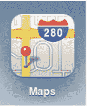

**图 12-1.** *地图图标*


### 地图屏幕

轻点图标即可启动`地图`应用程序。启动后，您将看到地图屏幕（请参见图 12-2）。

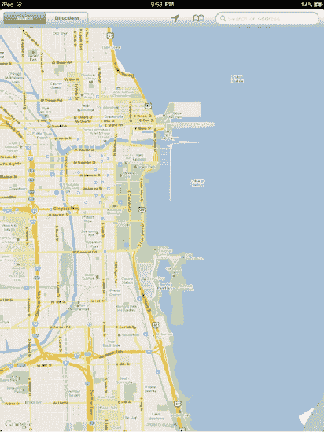

**图 12-2.** *地图屏幕。请注意屏幕右下角的页面卷曲效果。*

在地图屏幕顶部，您会看到地图工具栏（请参见图 12-3）。


**图 12-3.** *地图工具栏*

地图屏幕（包含工具栏）展示了基本的地图界面，该界面由以下部分组成：

*   *搜索/路线选项卡*：此选项卡允许您在`地图`应用的搜索和路线功能之间切换。您可以搜索本地商家、景点和具体地址，也可以轻松获取前往或离开这些地点的路线。
*   *当前位置*：此按钮外观像一个箭头，通过使用 iPad 内置的定位工具在地图上找到您的当前位置。这些内置工具因您使用的 iPad 型号而异。iPad Wi-Fi + 3G 同时使用全球定位系统（GPS）和 Skyhook Wi-Fi 定位来为您定位。Skyhook Wi-Fi 定位使用已知的无线热点位置来三角测量您当前的位置。iPad Wi-Fi 仅使用 Skyhook Wi-Fi 定位，因为其内部没有 GPS 芯片。
*   *书签*：位于搜索栏左侧的书签图标链接到您已保存的位置。轻点书签图标后会出现书签弹出窗口，在此窗口中您可以编辑书签、查看最近查看过的位置，或从您的通讯录中选择一个位置。
*   *搜索栏*：以放大镜图标标记，搜索栏允许您输入地址和其他查询内容。您可以输入完整地址（`1600 Pennsylvania Avenue, Washington, DC`）；可以查找联系人的地址（`Bill Smith`）或地标（`Golden Gate Bridge`）；甚至可以查找全国任何邮政编码区域的披萨店（`Pizza 11746`）。处于路线模式时，搜索栏会变成两个搜索栏，以便您输入起点和终点。
*   *地图*：地图本身占据了屏幕的其余部分。它是完全可交互的。您可以通过手指在地图上拖动来滚动，或者通过捏合和双击来放大或缩小。
*   *页面卷曲*：在地图的右下角（请参见图 12-2），您会看到角稍微翘起。轻点卷曲处，或者长按并拖动卷曲处，即可显示地图设置。这允许您更改地图视图、获取交通状况以及放置大头针。

#### 浏览地图

iPad `地图`应用让您足不出户即可探索世界。与其他应用一样，您可以使用手势来浏览地图。您还可以以不同模式查看地图。

#### 手势

在地图上，您可以使用手势进行放大、缩小、平移和滚动：

*   *放大*：您有两种放大方式。一种是用两根手指在地图上捏合放大；另一种是用一根手指双击地图上您想放大的位置。再次双击可进一步放大。
*   *缩小*：您可以通过两种方式缩小。一种是用两根手指在地图上反向捏合；另一种是用两根手指双击地图。再次用两根手指双击可进一步缩小。
*   *平移与滚动*：触摸并向上、下、左、右拖动地图，以移动地图并查看其他位置。

#### 更改地图视图

默认地图视图是谷歌经典的，以橙色、黄色和白色标示街道的路网图。但`地图`应用还允许您以另外四种视图以及叠加交通状况图层来查看地图（请参见图 12-4）。

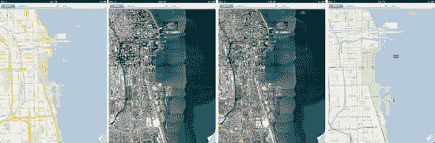

**图 12-4.** *四种地图视图，从左到右依次为：经典、卫星、混合和地形。*

要访问这些功能，请轻点或轻点并拖动地图屏幕底部的页面卷曲处。地图会向上卷起，您将看到设置页面（请参见图 12-5）。您的设置包括地图视图、叠加图层和一个特殊的放置大头针功能，该功能可以在地图上的任意位置放置（或称*落下*）一个大头针。这些放置的大头针让您可以轻松地在地图上标记一个商家、街角、海滩或任何其他类型的地点。

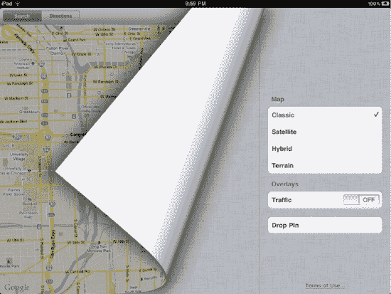

**图 12-5.** *地图设置页面位于地图的页面卷曲处下方。*

以下是基本的地图视图及其功能：

*   *经典*：这是默认的地图视图。它使用谷歌的标准路网图。
*   *卫星*：此视图使用卫星图像向您展示世界。它可能是最酷的地图视图，因为您可以放大街道，看到拍摄卫星图像当天人们走动的微小身影。卫星视图不显示任何标签。
*   *混合*：此视图结合了经典视图和卫星视图。您看到的是卫星图像地图，但上面叠加了标签、道路和边界。
*   *地形*：此视图显示给定地图的地形，包括地形的起伏图。地形视图还会叠加道路、边界和标签。如果您考虑进行一次越野骑行，此视图非常有用——您可以看到路线上丘陵地区的起伏程度。

**提示：** 经典视图使用橙色、黄色和白色对街道着色。橙色表示州际公路，黄色表示州道和县道，白色表示地方道路和私用道路。

*   *交通*：轻点以开启交通状况。开启后，当前交通状况将叠加显示在地图上。要查看当前交通状况，您需要连接到 Wi-Fi 或 3G 网络。我们将在本章稍后部分详细讨论交通功能。
*   *放置大头针*：轻点此按钮会使页面展开，并在地图中心放置一个位置大头针。使用放置的大头针可以轻松在地图上标记一个商家、街角、海滩或任何其他类型的地点。您也可以在地图上的任意位置长按来放置一个大头针。我们将在本章稍后部分详细讨论放置大头针。

您会注意到我们说过`地图`应用允许您以经典视图以及另外四种视图查看地图；因此，它总共为您提供了五种视图。第五种视图称为街景视图，您可以通过搜索结果或放置的大头针访问它。我们将在本章稍后部分详细讨论街景视图。

#### 查找位置

`地图`应用为您提供了多种查找位置的方式。您可以使用搜索栏搜索位置，利用 iPad 内置的 GPS 或 Skyhook 定位服务自动查找您的当前位置，甚至像飞鸟俯瞰一样放大并浏览地图。

根据您查找的内容不同，某些搜索类型会比其他的更合适。例如，如果您正在寻找海滩上最喜欢的地点，那它很可能没有地址或名称，因此最好的办法是导航到那个海滩，然后在卫星视图中放大并滚动，直到找到那个最喜欢的地点为止。


#### 搜索

你主要可以通过屏幕右上角工具栏中的 `搜索` 功能找到大部分地点（见图 12-2 和图 12-3）。轻点搜索栏，会弹出“最近搜索”窗口和键盘（见图 12-6）。请记住，如果你已将硬件键盘同步到 iPad，软件键盘将不会出现在屏幕上。

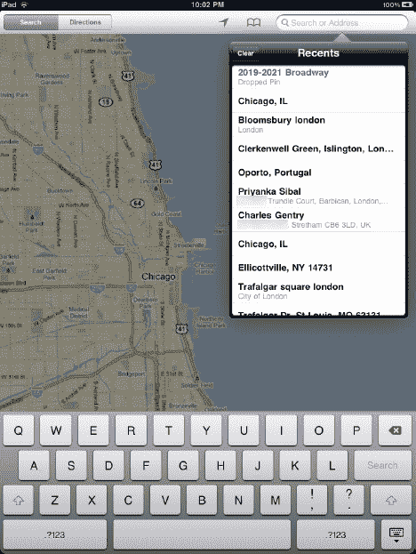

**图 12-6.** *搜索地图*

在 iPad 上搜索地点有多种方式。你可以输入完整地址（`1600 Pennsylvania Avenue, Washington, DC`）；可以通过输入联系人姓名查找其地址（`Bill Smith`）；也可以通过输入地标名称查找其地址（`Eiffel Tower`）。你甚至可以通过输入本地邮政编码和关键词 `pizza` 来查找披萨店（`Pizza 60605`）。

“最近搜索”弹出窗口会显示你所有的近期搜索记录，包括最近的路线（见图 12-7）。轻点“最近搜索”列表中的任一结果，即可跳转到该地点。轻点“最近搜索”弹出窗口中的“清除”按钮，可清空最近搜索结果列表。清空“最近搜索”列表可确保其他使用你 iPad 的人无法看到你搜索过的地点。例如，如果你查找了前往某家特色餐厅的路线，准备带妻子去那里庆祝生日，你自然不希望她看到这个行程。清空“最近搜索”列表就能确保她不会发现。不过，如果你经常需要查找同一条路线，请小心不要误清该列表。“地图”应用可保存任何类型的地点，无论其是否有地址；但它无法永久保存路线。尽管如此，这些路线会保留在“最近搜索”列表中——以便快速访问——直到你将其清除。

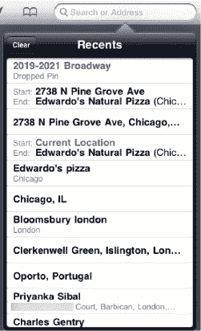

**图 12-7.** *显示“最近搜索”列表的搜索栏*

输入你的搜索查询内容，地图上会落下单个或多个红色图钉。假设你下周要去芝加哥旅行，想尝尝芝加哥风格的披萨。输入搜索条件 `Pizza Chicago`，地图上便会显示多个红色图钉，它们都代表该城市的披萨店（见图 12-8）。

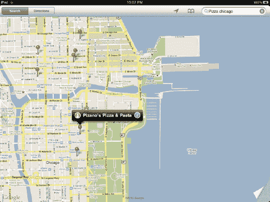

**图 12-8.** *地图上的搜索结果图钉*

当你触摸其中一个红色图钉时，会显示该图钉的信息栏（见图 12-9）。信息栏会显示该场所的名称（本例中为一家披萨店），并在两侧各显示一个图标。这些图标分别代表信息窗口和街景。

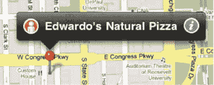

**图 12-9.** *搜索结果图钉的信息栏显示了场所名称，左侧为街景图标，右侧为信息图标*

你还可以将搜索结果以列表形式查看。图钉落到地图上后，搜索栏中查询词旁边会出现一个带三条横线的灰色圆形图标。轻点该圆形图标，你的搜索结果将以下拉列表的形式呈现（见图 12-10）。随后，你可以持续轻点列表中的名称，在地图上查看它们对应的位置动态显示。

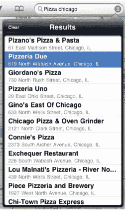

**图 12-10.** *搜索结果列表*

#### 信息窗口

轻点图钉信息栏上白色带蓝色的 `i` 图标，即可滑出信息窗口。信息窗口（见图 12-11）会显示该场所的详细信息，例如电话号码、网页和物理地址。

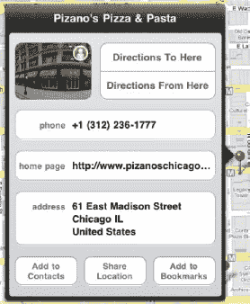

**图 12-11.** *信息窗口*

信息窗口为 iPad 上指定的地点提供以下选项：

- **图片**：根据场所不同，信息窗口中可能会显示该场所街景的缩略图图标。你可以轻点此缩略图进入街景模式。稍后会详细介绍。
- **路线到这里**：轻点此处可跳转到“路线”工具栏。该场所的地址会自动填入第二个（终点）路线输入框。我们将在本章后面部分详细讨论路线。
- **路线从这里出发**：轻点此处可跳转到“路线”工具栏。该场所的地址会自动填入第一个（起点）路线输入框。
- **电话**：显示该场所的电话号码。长按可复制号码到剪贴板。轻点电话号码可发起 FaceTime 通话。仅当该号码是有效的 FaceTime 号码时，FaceTime 通话才能正常工作。
- **主页**：显示该场所的网址。轻点可关闭“地图”应用，并在 Safari 浏览器中打开该网址。
- **地址**：显示该场所的地址。长按可复制地址到剪贴板。
- **添加到通讯录**：轻点此按钮可将该场所的名称、电话号码、网址和物理地址添加到某个联系人中。此操作会为你提供两个选项：`创建新联系人` 和 `添加到现有联系人`。

  如果你选择 `创建新联系人`，信息窗口中会滑出一个“新建联系人”窗口（见图 12-12），自动填入联系人字段的信息，并允许你向该联系人添加更多信息。轻点 `完成` 即可保存新联系人。

  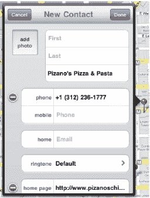

  **图 12-12.** *“新建联系人”窗口让你可以在“地图”应用内将搜索结果信息添加到你的通讯录中。*

  如果你选择 `添加到现有联系人`，信息窗口中会滑出你通讯录中所有联系人的列表。轻点你想要添加信息的联系人。信息会被添加，联系人列表随即消失。

- **FaceTime**：如果你选择查找通讯录中已有朋友的地址，你将看到 `FaceTime` 按钮，而不是 `添加到通讯录` 按钮。轻点 `FaceTime` 按钮会弹出一个对话框，询问你想通过哪个号码或电子邮件地址与该联系人进行 FaceTime 通话。选择你想要的方式，FaceTime 将打开并开始呼叫你的联系人。有关 FaceTime 的更多信息，请参阅第 15 章。
- **共享位置**：轻点此按钮，你可以通过电子邮件发送该场所名称的链接、添加谷歌地图链接，并附加一张 vCard（接收方可选择将其添加到通讯录的虚拟电子名片）。
- **添加到书签**：轻点此按钮，你可以将该地点保存到“地图”的书签中。你可以为书签命名，因此可以将 `Edwardo's Natural Pizza Restaurant` 更改为 `我最爱的披萨店`。我们稍后会详细讨论书签。

轻点地图上的任意位置即可关闭信息窗口。


```markdown
#### 街景视图

街景视图是我们之前提到的第五种地图查看方式。它利用谷歌技术显示指定地点的 360 度全景影像。要进入街景视图，请轻点图钉信息栏中的白色和橙色`街景`图标（见图 12-9），或轻点信息窗口中的图片缩略图（见图 12-11）。此时地图会开始放大图钉位置，随后视角倾斜，呈现街道级别的全景视图（见图 12-13）。

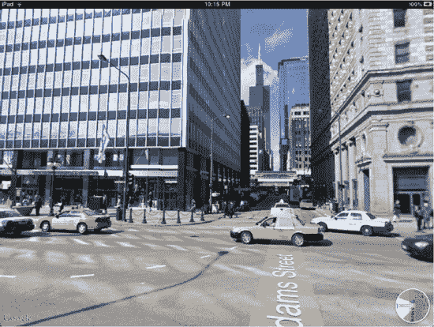

**图 12-13.** *街景视图充满整个屏幕。轻点道路上的白色`箭头`图标可沿街道向前移动。轻点地图的`导航`图标可返回地图视图。*

谷歌的街景视图在网络版上已存在一段时间，但在 iPad 上使用它则带来了截然不同的体验。你可以触摸、拖动、捏合和缩放，这种交互方式让街景视图拥有了前所未有的即时感。

在街景视图中，拖动手指即可体验 360 度全景视野。捏合或双击屏幕可放大，反向捏合则缩小。若要“行走”在街道上，请找到街道名称末端的大型白色`箭头`图标并轻点，你便会朝该方向移动。

圆形小`导航`图标位于街景视图的右下角，显示你正在观看的方向。轻点该图标可返回上次的地图视图位置。

街景视图目前尚未覆盖所有城市，但已涵盖北美和欧洲的大部分主要城市。街景视图是一款出色的工具，因为它能让你提前了解某个地方或区域的样貌。正在考虑搬到城市的新区域？你可以先在街景中虚拟地沿街滚动浏览，看看是否喜欢那里的环境，再决定是否费时费力地搜索该区域的房源。

#### 当前位置

想知道自己身处何方？地图应用让你只需轻点一下按钮就能找到当前位置。`当前位置`按钮位于屏幕顶部的工具栏中（见图 12-3），外观像一个箭头。轻点它，地图就会跳转到你当前的位置。

`当前位置`功能依赖于 iPad 内置的定位工具。这些内置工具因 iPad 型号而异。iPad Wi-Fi + 3G 同时使用 GPS 和 Skyhook Wi-Fi 定位技术来确定你的位置。而 iPad Wi-Fi 仅使用 Skyhook Wi-Fi 定位，因为其内部没有 GPS 芯片。

GPS 利用卫星定位技术，定位精度可达 16 英尺（五米）以内。Skyhook Wi-Fi 定位则利用已知的无线热点位置进行三角定位，精度在 60 到 100 英尺（20 到 30 米）之间。

如前所述，如果你使用的是 iPad Wi-Fi + 3G，它将同时利用这两种技术进行精确定位。尽管 GPS 的精度范围更高，但在某些区域 Skyhook 比 GPS 更有优势，尤其是在城市环境中。高大的建筑物会遮挡 GPS 卫星信号，因此 Skyhook 的无线网络三角定位在此处更具优势。

你的当前位置由一个蓝色圆点表示，如图 12-14 所示。如果`地图`应用无法确定你的精确位置，圆点周围会出现一个蓝色圆圈。圆圈的大小会变化——其大小取决于定位的精度。这个圆圈表示你位于地图上该圆圈附近的某个位置。圆圈越小，当前位置标记就越精确。

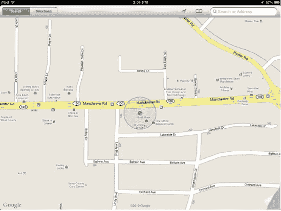

**图 12-14.** *被圆圈环绕的蓝色圆点代表你的大致位置。*

**注意：** 必须开启定位服务，iPad 才能找到你的当前位置。要开启定位服务，请前往设置 ` 定位服务`，并确保开关设置为`开启`。

当你处于`当前位置`模式时，工具栏中的`当前位置`图标会变为蓝色。找到当前位置后，如果你拖动地图，只需再次轻点`当前位置`按钮，地图就会重新居中显示。

你可以轻点地图上的蓝色当前位置圆点，打开当前位置的信息栏（见图 12-15）。其中会显示当前位置的地址。轻点`i`按钮可获取该位置的信息窗口，包括获取前往/来自该位置的路线、添加书签、添加到通讯录或通过电子邮件发送该位置。轻点`街景`按钮可进入街景视图（如果该区域可用）。

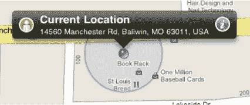

**图 12-15.** *当前位置的信息栏显示了你当前所在位置的地址。*

#### 数字指南针

你的 iPad 不仅能找到当前位置，还能在定位后用作指南针。找到当前位置后，轻点工具栏中的蓝色`当前位置`按钮即可激活`数字指南针`模式。

工具栏中的`当前位置`图标会变为`指南针`图标（见图 12-16），地图上的蓝色圆点会发出一束“射光”，指示你面对的方向（见图 12-17）。地图会随着你的转动而旋转，因此地图顶部始终显示你前方的景象，底部则显示后方的景象。屏幕右上角会出现一个指南针，指示正北方向。


**图 12-16.** *当您两次轻点`当前位置`按钮（左图）时，它会变为`数字指南针`按钮（右图）。*

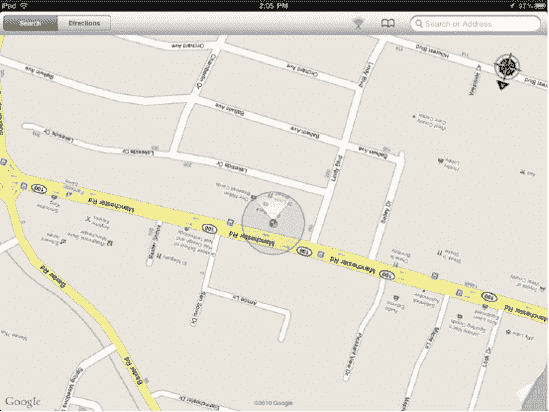

**图 12-17.** *数字指南针模式。此图与图 12-14 相同，但启用了`数字指南针`。注意地图指向了另一个方向；这是因为 iPad 正对着那个方向，在此例中是南方。留意右上角指向北方的指南针，以及蓝色当前位置圆点发出的“射光”。*

第一次使用`数字指南针`模式时，需要校准指南针。屏幕上会出现一个灰色图标，提示你以“8”字形移动 iPad（见图 12-18）。执行此操作即可完成校准。大量金属和磁铁（例如汽车音响系统中的磁铁）会影响指南针。你可能需要不时校准指南针，但 iPad 会在需要校准时提示你。

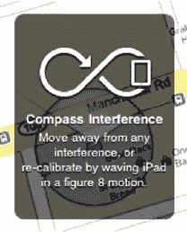

**图 12-18.** *数字指南针校准提示*

**提示：** `当前位置`和`数字指南针`功能很酷，但都需要开启`定位服务`，这会额外消耗电量。如果你不使用这些功能，请关闭`定位服务`以节省电池电量。要关闭`定位服务`，请选择设置 ` 定位服务`，并确保开关设置为`关闭`。

#### 书签与查看已保存位置

在“地图”应用中，你可以通过两种方式为浏览过的位置添加书签：放置图钉，或轻点位置信息窗口中的`添加到书签`按钮。放置图钉允许你标记地图上的任何位置，无论其是否有物理地址；之后你可以将图钉位置添加到已保存的书签中。一旦保存了位置，你就可以在便捷的`书签`菜单中查看所有已保存的位置。
```


#### 放置图钉

导航至地图上的兴趣点，无需进行搜索。在图 12-19 的示例中，我们在芝加哥谢德水族馆附近找到了一个可欣赏密歇根湖日出美景的位置。要放置图钉，只需在您想放置的位置用手指长按地图。一两秒后，一枚紫色图钉便会落下并固定在地图上。

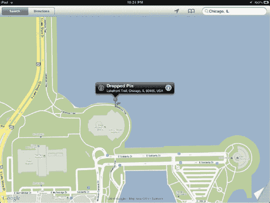

**图 12-19.** *放置的图钉及其信息栏，显示大致地址*

图钉的信息栏将显示其大致地址，以及“街景”和“信息窗口”的常用图标。如果图钉的位置并非完全符合您的预期，您可以按住紫色图钉的头部并将其拖拽至所需位置。松开手指即可将图钉固定在地图上。

点击`i`按钮可调出图钉位置的信息窗口（参见图 12-20）。该窗口提供的选项包括：获取前往/离开该位置的路线、将其加入书签、添加到通讯录或通过电子邮件发送该位置信息。您也可以点击“街景”按钮进入街景模式（如果该区域支持此功能）。

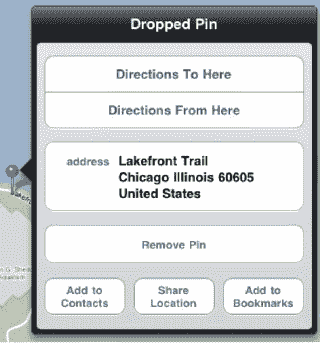

**图 12-20.** *放置图钉的信息窗口允许您查找路线、将位置添加到通讯录和书签，或分享该位置。*

您还可以通过访问“地图”设置页面（位于右下角的页面卷角后方，参见图 12-6）在地图中心放置图钉。点击或点击并拖拽“地图”屏幕底部的页面卷角，然后点击`放置图钉`按钮。设置页面将展开，一枚图钉会落在地图中心。随后，您可以点击并拖拽图钉，将其移动到地图上的任意位置。

一开始，放置图钉可能看起来是一个不错但非必要的功能。既然您可以使用应用强大的搜索功能来搜索地图，您可能会想为何还要手动添加位置。再次强调，图钉的妙处在于，它们允许您标记那些没有固定地址的位置，例如山间一条幽静的小径、初吻的地点（适合浪漫人士），甚至是中央公园里您最钟爱的长椅所在地。

#### 添加书签

到目前为止，本章已向您展示了多种添加书签的方法，无论是通过放置图钉，还是利用商家、朋友或您查询地址的信息窗口。但是，您保存的所有书签都在哪里呢？当然是在书签窗口中！

点击“地图”标题栏中的“书签”图标；该图标看起来像一本打开的书（参见图 12-3）。书签窗口将出现，提供三个视图：“`书签`”、“`最近`”和“`通讯录`”（参见图 12-21）。

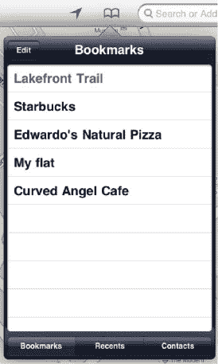

**图 12-21.** *书签窗口显示您已收藏的位置、最近位置以及通讯录位置。*

书签窗口的不同视图功能如下：

*   **书签**：此视图列出您在“地图”应用中保存的所有书签。轻点任意书签即可在地图上跳转至该位置。点击“编辑”按钮可删除书签、在书签列表中上下移动其位置或更改书签名称。
*   **最近**：此视图列出您所有的近期搜索查询、驾车路线和放置的图钉（参见图 12-22）。轻点列表中的任意项目即可在地图上跳转至该位置。点击“清除”按钮可移除列表中的所有项目。请记住：清除“最近”列表可确保使用您 iPad 的人无法窥探您搜索过的位置。但请注意，这也会清除您的路线。路线无法添加书签，因此快速访问路线的唯一方法就是通过“最近”窗口。如果您清空了该窗口，则需要从头开始重新搜索路线。
*   **通讯录**：此列表显示您所有的联系人（参见图 12-22）。轻点列表中的任何联系人即可在地图上跳转至其地址（前提是您的通讯录中有该联系人的地址）。如果某个联系人有多个地址，系统会要求您选择要导航到哪个地址。点击“群组”按钮可在您的联系人分组中导航。

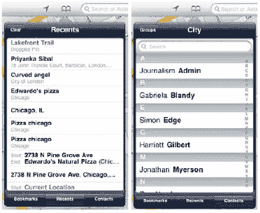

**图 12-22.** *“最近”和“通讯录”的书签窗口*

**提示：** 要关闭任何弹出窗口（例如书签窗口或搜索结果列表），请点击地图上的任意位置。弹出窗口将消失。

#### 路线与交通

iPad 的“地图”应用允许您搜索路线并查看实时交通状况。与“地图”应用本身一样，路线和交通功能需要互联网连接。如果您有 iPad Wi-Fi + 3G 版，在旅途中使用它查询路线不成问题。如果您只有 iPad Wi-Fi 版，则需要在离家前查好路线。

##### 路线

要获取路线，请点击“地图”工具栏中的“`路线`”标签（参见图 12-3）。您会注意到，搜索字段变成了一个双字段，用于输入您的起点和终点位置（参见图 12-23）。“地图”应用会将您的当前位置（如果可用）设为起点位置。如果您不想将当前位置用作起点地址，也请先点击进入第一个搜索字段。然后，您可以点击`X`将其移除，或从出现的“`最近`”弹出列表中选择另一个位置。

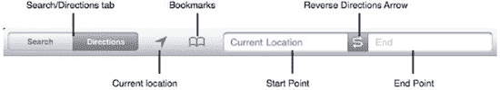

**图 12-23.** *当您点击“路线”按钮时，“地图”工具栏会变成接受路线输入的形式。*

**注意：** 您也可以从任意图钉的信息窗口开始搜索路线。

要从您的某个联系人输入地址，请点击“书签”图标，然后选择一个联系人。系统会询问您选择“路线（至此处）”或“路线（从此处出发）”。选择您需要的选项，联系人的地址将自动填入相应的路线字段。要反转起点和终点，请点击弯曲的`S`箭头以交换两点（并获得反向路线）。反向路线功能很不错，因为有时您前往某地时使用的路线并不是回程最快的路线。反向路线将向您显示是否有其他更快的路线回家。

当您同时选择了起点和终点后，地图上会出现一条蓝线。这条线显示了您将要行驶的路线（参见图 12-24）。地图上绿色的图钉代表您的起始位置，红色的图钉代表您的终点位置。您还会注意到屏幕底部出现了一条蓝色的“路线”栏（参见图 12-25）。该“路线”栏允许您选择驾车（汽车图标）、公共交通（公交图标）或步行（人形图标）的路线。对于相同的两个地点，这些不同的交通方式可能会在地图上给出不同的路线。这是因为，根据您所在的城市，行人不允许上高速公路，汽车不允许开上步行街或某些公交专用道。

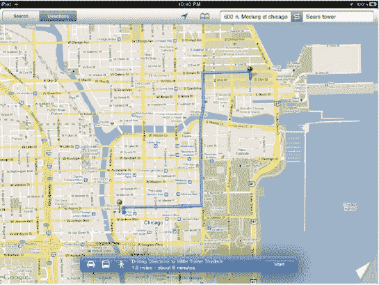

**图 12-24.** *显示路线路径的地图*


**图 12-25.** *“路线”栏允许您在驾车、公共交通和步行路线之间切换。*


##### 行车或步行路线

轻点行车或步行图标，即可看到路线长度以及预计抵达时间。如果交通数据可用，预计行程时间将相应调整。

要逐步浏览路线导航，请轻点蓝色的“开始”按钮。方向栏将变为图 12-26 所示的样子。轻点带有拖尾线条的三点图标，可以列表格式查看路线（参见图 12-27）。轻点列表中的任何步骤，即可在地图上跳转到该路线部分。要返回方向栏，请轻点方向列表窗口左上角的蓝色图标。


**图 12-26.** *轻点左箭头或右箭头图标，逐步浏览路线。*

如果希望在地图上逐步查看路线，请轻点方向栏上的右箭头图标。每次轻点都会将您向前移动一个步骤。要后退一步，请轻点左箭头图标。

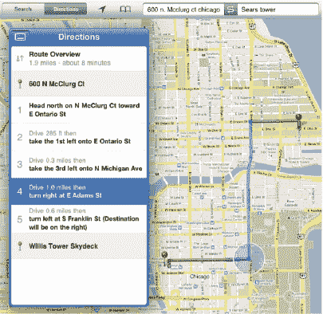

**图 12-27.** *以列表格式显示的路线。请注意，地图上会显示一个圆形，指示您当前处于路线的哪个步骤。*

##### 公共交通路线

轻点公交图标选择公共交通选项。在蓝色的方向栏中，您会看到预计抵达时间。如果交通数据可用，预计行程时间将相应调整。

轻点时钟图标，会弹出一个出发时间和时刻表列表（参见图 12-28）。轻点“出发”选择日期和时间。除非您更改，`Depart`字段默认为当前日期和时间。在出发时间下方，您会看到备选时刻表列表。选择一个，然后轻点“完成”按钮。

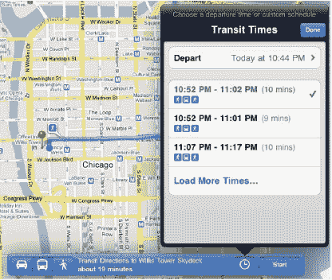

**图 12-28.** *方向栏显示公共交通路线。时钟图标允许您选择不同的公共交通时刻表。*

要逐步浏览路线导航，请轻点蓝色的“开始”按钮。方向栏将变为图 12-29 所示的样子。轻点带有拖尾线条的三点图标，可以列表格式查看路线。轻点列表中的任何步骤，即可在地图上跳转到该路线部分。要返回方向栏，请轻点方向列表窗口左上角的蓝色图标。


**图 12-29.** *轻点左箭头或右箭头图标，逐步浏览公共交通路线。*

如果希望在地图上逐步查看路线，请轻点方向栏上的右箭头图标。每次轻点都会将您向前移动一个步骤。要后退一步，请轻点左箭头图标。

**注意：** 我们之前已经提过，但遗憾的是您无法为路线添加书签。这很可惜，因为能够快速调出您最常走路线上的交通状况会非常方便。理想情况下，苹果公司会在未来添加此功能。

##### 交通

地图应用可以显示交通状况，帮助您规划即时行程。要打开交通状况，请轻点或轻点并拖动地图屏幕底部的翻页角，然后将“交通”开关切换为“开”（参见图 12-6）。返回地图后，您会注意到一些道路上出现了绿色、黄色和红色的线条（参见图 12-30）。

地图应用究竟是如何知道当前交通状况的？美国大多数主要城市的高速公路和主干道都嵌入了传感器。这些传感器将数据实时反馈给交通部 (DOT)。交通部利用这些信息更新数字交通标志，报告当地的交通状况（例如那些悬挂在大都市区高速公路立交桥上、类似百老汇风格的明亮标志牌，告知您到达某个出口需要多长时间）。交通部也与谷歌共享这些数据，谷歌收集并用于显示近乎实时的交通地图。

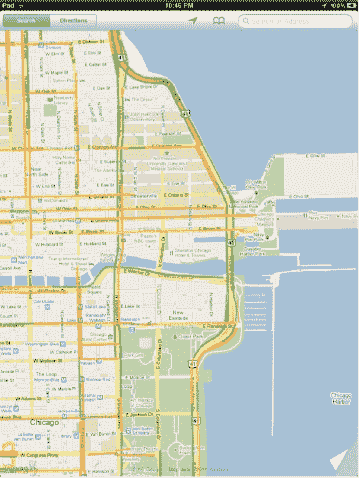

**图 12-30.** *地图上的交通覆盖层*

绿色线条表示交通流速至少为每小时 50 英里。黄色线条表示交通流速在每小时 25 至 50 英里之间。红色高速公路表示交通流速低于每小时 25 英里。灰色路线表示该街道或高速公路的交通数据不可用。

交通功能仅限于某些地区，主要是美国、法国、英国、澳大利亚和加拿大的主要大都市区；不过，会定期添加新的城市和国家。如果您看不到交通状况，请尝试放大地图。如果仍然看不到，则说明您所在的地区尚不支持此功能。

### 其他应用中的地图

如果您希望在 iPad 上查看或使用地图，并不局限于仅使用地图应用。其他几款 iPad 应用也允许您导航和搜索自有地图，并可出于其他目的使用地图。以下列举几个。

#### Flixster

Flixster 是一款流行的 iPad 应用，允许您查找您所在地区的电影。在其众多功能中，该应用会根据您的当前位置显示附近的影院列表，并在应用内置的谷歌地图上显示影院的位置。它可在 App Store 免费获取。

#### The Weather Channel

The Weather Channel 应用是一款多功能应用，向您展示您能想到的所有天气信息。它还使用内置的谷歌地图，显示包括多普勒雷达、云层覆盖、温度、降雨和紫外线指数在内的覆盖层地图（参见图 12-31）。它可在 App Store 免费获取。

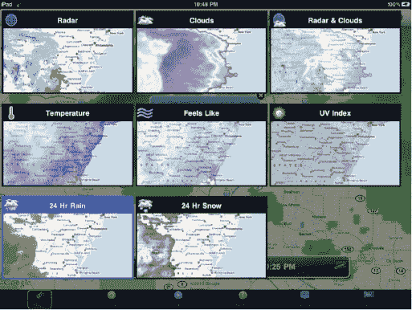

**图 12-31.** *Weather Channel 应用的地图覆盖层*

#### Ndrive US HD

Ndrive 是一款功能强大的 iPad 导航应用。它使用自有的内置地图软件，并将地图数据存储在您的 iPad 上，因此即使没有网络连接也可以使用。您可以使用该应用规划路线、获取逐步导航以及定位超过 150 万个兴趣点。它在 App Store 的售价为 $4.99。

#### UpNext 3D Cities

UpNext 提供纽约市、华盛顿特区和旧金山等城市的 3D 地图。在 3D 地图上滑动和缩放，并触摸建筑物以查找其内部的企业（参见图 12-32）。这是一款令人惊叹的应用，向您展示了个人地图应用的未来发展方向。它可在 App Store 免费获取。

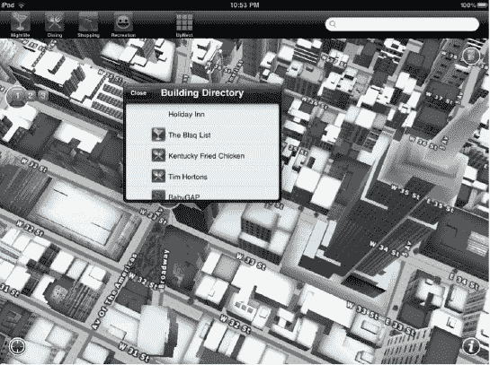

**图 12-32.** *UpNext 3D Cities 中可触摸的 3D 建筑*


### 寻找遗失的 iPad

你的 iPad 丢了吗？别担心！Apple 开发了一款免费应用，名为`查找我的 iPhone`。没错，它的名字里写着“iPhone”，但同样适用于 iPad 和 iPod touch。通过这款应用，你可以从任何 iPhone、iPad 或 iPod touch 上定位你所有的 iDevice 设备，也可以通过登录 [`www.me.com`](http://www.me.com) 上的 MobileMe 账户来实现。

在你能找到遗失的 iPad 之前，需要先确保你已经在设备上安装并设置好了`查找我的 iPhone` 应用。因此，最好在拿到 iPad 后就立即完成设置。一旦你在 iPad 和其他 iOS 设备上设置好`查找我的 iPhone`，启动应用并登录。之后你会看到如图 12-33 所示的界面。

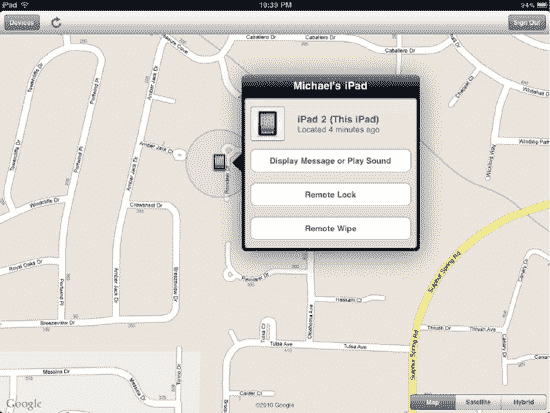

**图 12-33.** *`查找我的 iPhone` 应用会显示你的 iPad 和其他 iOS 设备在任何时刻的位置。*

通过左上角的`设备`按钮，你可以选择想要查看位置的 iOS 设备。选中一个设备后，它会显示在地图上。iPad 会由一个微小的 iPad 图标表示。点按该图标可查看设备名称，然后点按蓝色的`信息`按钮，会弹出一个窗口，显示你可以对该设备执行的各种操作（图 12-33）：

- **显示信息或播放声音**：这让你可以在 iPad 上显示一条文本信息，或者以最大音量播放声音两分钟（即使 iPad 处于静音状态）。如果你不知道 iPad 或 iPhone 落在家里哪个角落，声音功能会非常实用。
- **远程锁定**：用于在设备上设置远程密码锁定，或启用你当前的密码锁定。这可以确保任何不知道密码的人都无法使用该设备。
- **远程抹掉**：这是最坏情况下的功能。如果你的 iPad 被盗，且你不想扮演侦探追踪到窃贼家中，你可以远程抹掉 iPad。远程抹掉 iPad 会永久清除你设备上的所有个人数据，确保无论谁拿到或找到你的 iPad，都无法利用你的身份信息进行欺诈。

### 总结

地图应用将世界掌握在你手中。通过它，你可以找到前往最爱的披萨店的路线，即时获取你的当前位置，或者足不出户就能查看吉萨金字塔顶端的模样。你已经学会了如何使用地图查找公共交通时间和路线、获取实时交通状况，或者只是虚拟漫步在你正在考虑搬去的街区街道上。以下是一些可供参考的小贴士：

- 当一个人或商家在你的通讯录中时，可以节省时间。无需输入完整地址，只需输入名字的几个字母并选择该联系人即可。
- 点按路线列表上的各个项目，可以跳转到路线中的相应部分。
- `最近项目`列表（在`书签`中）会同时显示最近的地点 *和* 最近的路线。
- 链接到 Google 地图的 URL 会自动在地图应用中打开，无论是在 Safari 还是邮件中点按它们。
- 街景视图很有趣，而且如果你想探索城市中——或世界上几乎任何大城市中——你从未到访过的区域，它也非常有用。
- 大量其他应用都支持在 iPad 上使用地图功能。有些使用 Google 地图，有些则使用自己的地图软件。查看本章中的推荐，或在 App Store 中搜索“地图”或“导航”，可以找到大量利用交互式地图的应用。
- 别忘了下载并安装免费的`查找我的 iPhone` 应用。用它来追踪丢失或被盗的 iOS 设备。

