# 触摸你的数码照片

借助 iPad 的“照片”应用（从其图标启动，如图 13–1 所示），你可以将照片从家用电脑中解放出来，像昔日传递纸质照片一样在房间里传阅。把你的 iPad 递给朋友，他们就可以在手中滑动浏览你的照片，而无需围在一台台式电脑前。在本章中，你将了解如何浏览你的照片集、与朋友和家人分享照片，以及将 iPad 用作数码相框。

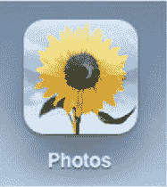

**图 13–1.** *“照片”应用图标*

### 将照片导入 iPad

在 iPad 上查看照片之前，首先需要将照片存入设备。有五种方法可以实现：从电脑同步照片、从数码相机直接导入照片到 iPad、从电子邮件中保存照片、保存网页上的图片，以及使用 iPad 内置摄像头拍照。我们在 第 15 章 中讨论了使用 iPad 摄像头拍摄照片的各种方式。

#### 从电脑同步照片

我们在 第 2 章 中讨论过如何将照片同步到 iPad，但现在让我们再简要回顾一下。iTunes 可以将你的 iPad 与存储在电脑上的图片进行同步。这让你可以随身携带你的照片集，并利用 iPad 独特的触控界面进行分享。当你拥有机身纤薄、显示屏鲜艳的 iPad 时，谁还需要随身携带厚重实体相册呢？

首先，将 iPad 连接到电脑，然后启动 iTunes。从来源列表（iTunes 窗口左侧的蓝色列）中选择你的 iPad，然后打开`照片`标签页。勾选“同步照片”复选框，接着选择你想要同步的照片的位置。你的选项取决于操作系统。

在电脑上，你的选项包括 Adobe Photoshop Elements 3.0 或更新版本，或者电脑上的任意文件夹（例如`我的图片`）。在 Mac 上，你的选项包括 iPhoto 4.0.3 或更新版本、Aperture 3.0.2 或更新版本，或者电脑上的任意文件夹。

选择好照片来源后，需要决定是同步整个照片集（对于相对较小的图库来说是很好的选择），还是同步单个相册（更适合于可能无法完全存入 iPad 有限存储空间的大型图库）。如果选择后者，则只挑选那些你想要复制到 iPad 上的相册。

如果你使用的是 Mac 以及 iPhoto 或 Aperture，你还可以选择同步面孔（iPhoto '09 或更新版本）、事件（iPhoto '08 或更新版本）和相册（参见图 2-38）。面孔是智能相册，其中包含所有含有特定人物面部的照片。这是通过 iPhoto 内置的面部识别软件实现的。事件是另一种智能相册，它将同一天拍摄的照片分组在一起。这有助于减少杂乱，保持照片库的有序。

最后，点击`应用`保存更改，然后进行同步。

#### 从数码相机或 iPhone 导入照片

你也可以通过任何支持 USB 连接或使用 SD 卡的相机，将照片直接导入到 iPad。为此，你需要购买 iPad 相机连接套件（Apple Store 售价 29 美元）。该套件包含两个适配器——一个用于通过 USB 2.0 线缆连接相机，另一个用于读取 SD 存储卡（参见图 13-2）。

iPad 支持标准照片格式，包括 `JPEG`、`GIF`、`TIFF`、`PNG` 和 `RAW`。你可以通过 iPad 相机连接套件中的 USB 适配器将大多数相机连接到 iPad，包括 iPhone，这样你就可以直接将 iPhone 上的照片传输到 iPad。你甚至可以连接广受欢迎的 Flip 相机系列到 iPad，但由于 USB 供电问题，你需要先为 Flip 相机连接外部电源，再通过 USB 将其连接到 iPad。

如果相机拍摄的视频片段是 iPad 支持的视频格式之一，你也可以通过 iPad 相机连接套件导入这些视频。iPad 支持的视频格式包括 `M4V`、`MP4`、`MOV`、`MPEG-4` 和 `H.264`。iPad 不支持许多流行视频格式，如 `AVI` 和 `WMV`，但有无数应用程序可以让你将 `AVI` 和 `WMV` 文件转换为 iPad 兼容格式。搜索“*WMV to iPad*”或“*AVI to iPad*”即可找到所有提供转换功能的软件。

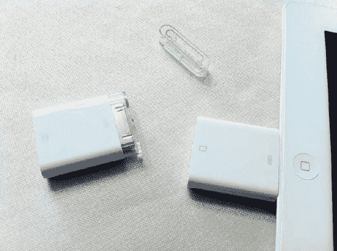

**图 13-2.** *iPad 相机连接套件配备了一个 USB 适配器和一个 SD 卡读卡器。*

要导入照片，请将 USB 适配器或 SD 卡适配器插入 iPad。使用 USB 适配器时，使用相机自带的 USB 线缆将数码相机连接到适配器，并将相机切换到传输模式（详情请参阅相机说明书）。要从 iPhone 的相机导入照片，请使用 iPhone 的基座接口转 USB 线缆将 iPhone 插入 USB 适配器。确保 iPhone 已开机。使用 SD 卡适配器导入时，将适配器插入 iPad，然后将 SD 卡插入其中。

连接好相机或 SD 卡后，滑动锁定屏幕底部的解锁滑块来解锁 iPad。照片应用会自动打开，显示可供导入的照片。你现在有两个选择：点击 `Import All`（全部导入）按钮导入所有照片（参见图 13-3），或者只导入选定的照片。

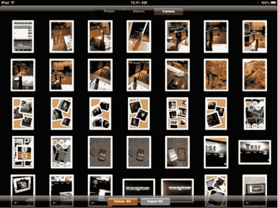

**图 13-3.** *点击屏幕底部的 `Import All` 按钮即可导入所有照片。*

若要导入选定的照片，请点按你想要包含的每张照片。照片上会出现一个勾选标记（参见图 13-4）。选定照片后，点按 `Import`（导入），然后选择 `Import Selected`（导入所选）。

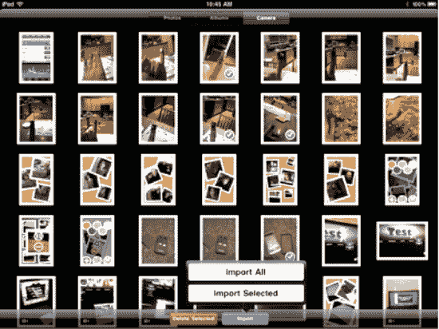

**图 13-4.** *导入部分照片*

成功导入后，iPad 会提示你决定是保留还是删除从源设备导入的照片（参见图 13-5）。

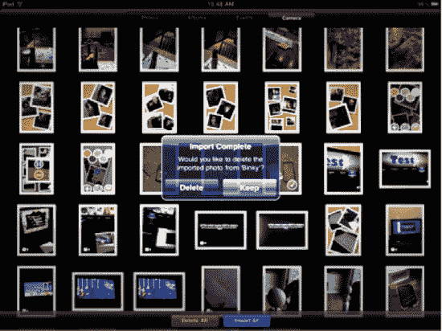

**图 13-5.** *选择保存或删除外部设备上的已导入照片。*

新导入的照片会出现在一个名为 `Last Import`（上次导入）的相册中（参见图 13-6），并作为一个新事件，其中包含上次导入的照片。在你多次导入照片后，你还会看到一个名为 `All Imported`（所有已导入）的相册。

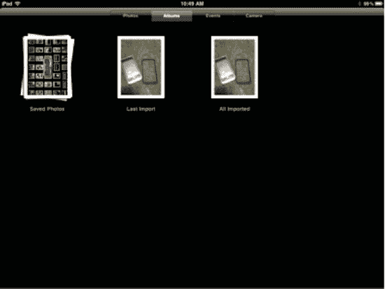

**图 13-6.** *从数码相机或 SD 卡直接导入 iPad 的照片将显示在 `Last Import` 相册中。*

照片传输完成后，你可以从 iPad 上断开相机连接适配器。

若要将已传输的照片从 iPad 导出到电脑，请连接 iPad 并打开照片应用程序，例如 Mac 上的 iPhoto 或 Image Capture，或 Windows 电脑上的 Adobe Elements。

#### 使用 U 盘将照片传输到 iPad

有时你可能需要快速将电脑中的一些照片添加到 iPad，而想避免整个同步过程。如果能使用 U 盘快速将图像导入 iPad，那岂不是很好？

好消息！你可以*非官方地*使用 iPad 相机连接套件连接某些类型的 U 盘，以便快速便捷地将照片从电脑传输到 iPad。为此，你需要欺骗你的 iPad，让它以为你的 U 盘是一台相机。

`DCIM`（数码相机图像）是相机厂商使用的一种通用标准，通过定义的文件系统和结构（包括文件命名规范、文件格式和元数据信息）来整理相机中的照片。在 iPad 连接到你的相机或 SD 卡之前，它会查找设备上的 `DCIM` 文件夹。该文件夹的存在使得 iPad 能够识别照片。

当你拍摄第一张照片时，相机的 SD 卡会自动创建一个名为 `DCIM` 的文件夹。由于 SD 卡和 U 盘之间并没有太大区别（两者都只是固态存储的一种形式），你只需在 U 盘上创建一个 `DCIM` 文件夹，即可欺骗 iPad，让它以为这是一个相机。

最简单的方法是在你的桌面上创建一个新文件夹，并将其命名为“`DCIM`”。将该文件夹拖到 U 盘上。文件夹放入 U 盘后，找到你想从电脑传输的照片，并将它们拖入 U 盘上的 `DCIM` 文件夹中。照片复制完毕后，将 U 盘插入 iPad 相机连接套件的 USB 适配器，iPad 会看到 `DCIM` 文件夹中的照片，并认为它正在与相机通信，从而允许你将这些图片从 U 盘导入到 iPad 的照片应用中。

#### 从邮件和 Safari 浏览器保存照片

你也可以不通过电脑或相机导入，直接在 iPad 上存储照片。如果有人通过电子邮件向你发送了照片，在 iPad 的邮件应用中，你会看到这些照片出现在邮件正文中。长按任意照片，你会看到一个弹出菜单，允许你保存该张照片或邮件中包含的所有照片（参见图 13-7）。你选择保存的照片将出现在 iPad 照片应用中一个名为 `Saved Photos`（已保存的照片）的相册中。

类似地，在 iPad 的 Safari 网络浏览器中，你可以长按网页上的任意照片，然后从出现的弹出菜单中选择 `Save Image`（保存图像）按钮（参见图 13-7）。该照片将被保存到 iPad 照片应用中的 `Saved Photos` 相册。

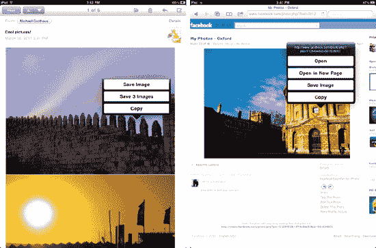

**图 13-7.** *从电子邮件（左）或网页（右）保存照片*

**注意：** 许多第三方应用（例如网络浏览器和杂志应用）也允许你将图像保存到 iPad。某些应用可能有其独特的保存图像方式，但大多数应该与你在邮件或 Safari 浏览器中保存图像的方式非常相似。

### 浏览你的照片

乐趣从这里开始。当你第一次触碰自己的数码照片时，会感觉终于迈入了 21 世纪——那个科技与珍贵记忆融合，让我们能以前所未有的方式回溯、重温并探索它们的乌托邦未来。当你开始对照片和相册进行捏合、拖拽和展开操作时，你会感觉自己像个刚把第一袋弹珠撒在地上，正睁大眼睛盯着眼前五颜六色、形状各异、大小不一且尽在掌控的孩童。

要启动`照片`应用，请点击主屏幕上的图标。启动后，`照片`应用会显示你照片图库中照片的缩略图，如图 13–8 所示。

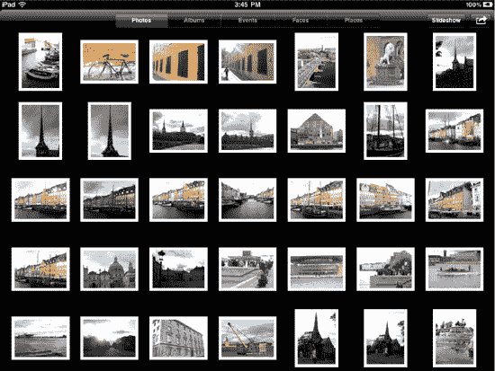

**图 13–8.** *照片应用*

在应用顶部、缩略图照片的正上方，你会看到菜单栏（见图 13–9）。此栏显示多个标签页，用于在不同照片整理方式之间切换。要选择视图，请点击菜单栏中相应的标签页。请注意，根据你同步照片的方式不同，你可能不会看到所有标签页。例如，仅同步单个相册的用户将看不到`事件`。同样，照片缺少地理标签数据的用户将看不到`地点`。

**图 13–9.** *iPad 上照片的多种整理方式。*

-   **照片**：这是你首次启动`照片`应用时看到的第一个视图。后续启动时，将显示上次关闭应用时处于活跃状态的视图（例如`地点`标签页）。在`照片`标签页（见图 13–8）中，你的照片完全不按相册分组，而是按拍摄日期顺序显示。如果你的 iPad 上同步了大量照片，滚动浏览列表可能需要相当长的时间。
-   **相册**：此视图按你在电脑上整理的方式，在相册中显示你的照片（见图 13–10）。如果你从网页保存过图片，或在 iPad 上接收过电子邮件中的图片，你还会看到一个`已存储的照片`相册。此外，如前所述，如果你直接从数码相机将照片导入 iPad，你将在`上次导入`相册中看到它们。

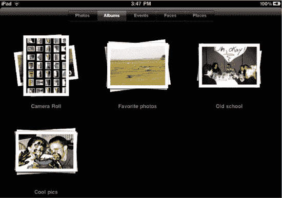

**图 13–10.** *相册视图*

**注意：** 你知道可以为 iPad 截屏吗？*屏幕截图*，或称*屏幕捕捉*，是指在你按下截屏键时，捕捉 iPad 屏幕上显示内容所生成的图像。要进行截屏，请按住 iPad 上的电源按钮，然后在按住电源按钮的同时按下并松开主屏幕按钮。iPad 屏幕会闪过一道白光，你会听到快门声。听到声音后，即可松开电源按钮。捕捉到的屏幕截图将出现在`已存储的照片`相册中。你可以使用屏幕截图保存整个网页的图像，或炫耀游戏中的高分。本书中的大部分图像都是使用 iPad 的屏幕捕捉功能拍摄的。

-   **事件**：此视图按事件显示你的照片（见图 13–11）。事件功能用于 Aperture 2 和 iPhoto '08 及更新版本，是一种根据照片拍摄日期自动整理照片的方式。这有助于用户轻松地将庞大的照片图库整理得易于浏览。`事件`标签页是 Mac 独有的功能。如果你使用 Windows 电脑同步 iPad，则不会看到此标签页。

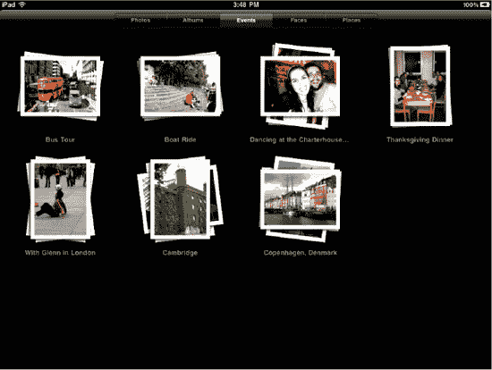

**图 13–11.** *事件视图*

-   **面孔**：此视图将你的照片分组到个人“面孔”相册中显示（见图 13–12）。如果你在 Mac 上使用 iPhoto '09 或 Aperture 3，这些程序内置了面部识别软件。Mac 软件会自动为每个人创建相册，并汇总所有包含该人的照片。这是一种查看某位朋友或家人所有照片的绝妙有趣方式。`面孔`功能在一定程度上也适用于猫和狗。如果你使用 Windows 电脑同步 iPad，则不会看到此标签页；`面孔`是 Mac 独有的功能。

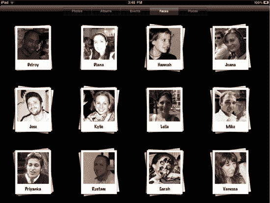

**图 13–12.** *面孔视图*

-   **地点**：如今许多相机都具备*地理标记*功能，能将照片拍摄地点的坐标编码到照片中。`地点`标签页的作用是提取照片的坐标，并将其显示在谷歌地图上（见图 13–13）。这可以说是 iPad 上“照片”应用最酷的功能，因为它允许你在地图上浏览照片，并且你可以从全球视图一直缩放到街道级别。这对旅行者来说尤其酷：你可以一眼看到自己去过哪里，以及世界上还有多少地方等待探索。

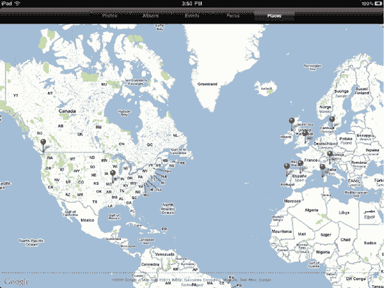

**图 13–13.** *地点视图*

地图上会出现红色大头针，代表照片的地理位置。你可以捏合和缩放地图以拉近距离。随着缩放，你可能会看到更多大头针出现在地图上（见图 13–14）。

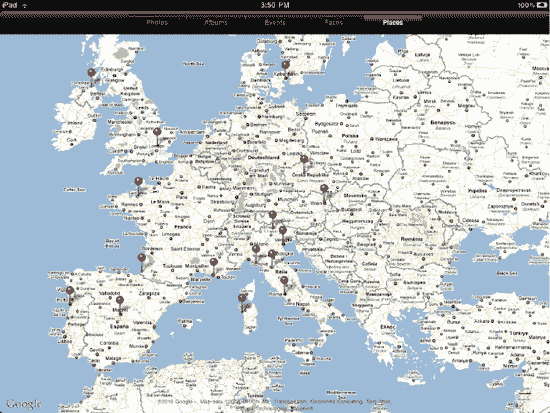

**图 13–14.** *请注意，当你放大地图的某个区域时，会出现更多大头针，表示照片坐标的精度更高。*

点击一个大头针，会弹出一个相册（见图 13–15）。然后你可以浏览在该位置拍摄的所有照片。`地点`功能需要互联网连接才能显示谷歌地图。

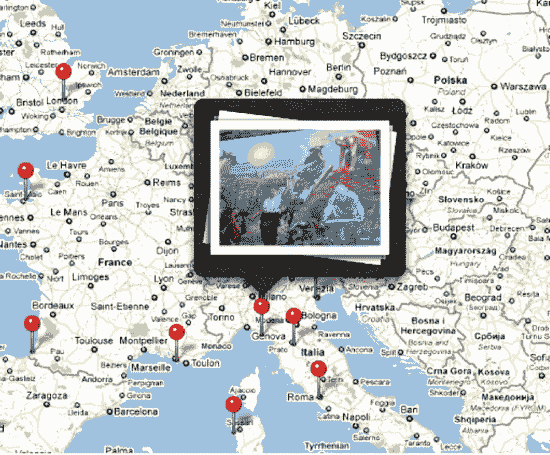

**图 13–15.** *点击大头针即可看到在该位置拍摄的每张照片的相册缩略图。*

正如你现在所见，iPad 的`照片`应用将你的照片整理成五种视图，便于浏览。需要注意的是，你的 iPad 上可能不会显示所有视图。你能看到的视图类别取决于：你使用的是 Mac 还是 Windows 电脑；你是否已选择同步每个类别视图中的相册；以及你的照片是否带有地理坐标标签。

只要你的 iPad 上有一张照片，你就能始终看到`照片`标签页。很可能你也会看到`相册`标签页，特别是当你从数码相机将照片导入 iPad 时（会自动创建`上次导入`相册），或者当你保存了电子邮件中收到的或网上看到的图像时（会自动创建`已存储的照片`相册）。要查看其他相册、事件或面孔，你需要从电脑同步它们。你无需执行任何操作来同步`地点`；如果你有任何带有地理坐标标签的照片，其标签页会自动出现。

#### 触摸与查看相册和照片

现在你知道了如何浏览你的照片集，接下来你将学习如何触摸和查看它们。还记得第 4 章中介绍的所有手势吗？在查看相册集合或全屏查看单张图像时，iPad 允许你使用其中多种手势与相册或照片进行交互。

#### 触摸与查看相簿

在本节中，*相簿*将指代普通相簿、活动相簿或面孔相簿，因为与它们的交互方式完全相同。如图 13-11 所示，有一系列活动相簿。相簿显示为其中所含部分照片的堆叠效果。要打开相簿，你有两种展开或打开相簿的方法：

-   轻点一次相簿，使其中的照片展开散开。
-   用两根手指合拢放在相簿上，然后慢慢反向捏合分开，你会看到相簿中的照片开始展开（参见图 13-16）。移开手指即可完全展开相簿。

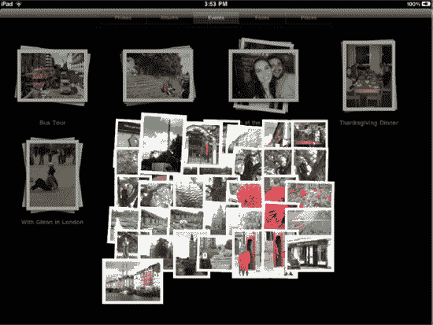
**图 13-16.** *通过反向捏合手势展开相簿*

你会发现，进入相簿后，屏幕顶部的菜单栏发生了变化（参见图 13-17）。现在它显示相簿名称，左侧有一个返回按钮，可带你回到之前的分类视图，以及一个“`幻灯片展示`”按钮和一个“`分享`”按钮，它们可以让你展示照片并与他人分享（稍后我们会讨论“`幻灯片展示`”和“`分享`”按钮）。

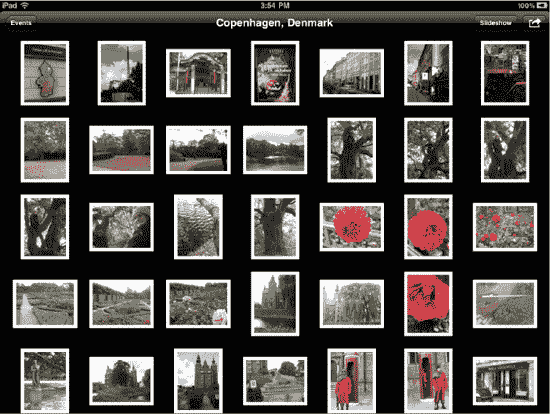
**图 13-17.** *相簿内的照片*

要退出相簿，请轻点返回按钮（该按钮的名称会以相簿所属的分类命名；在图 13-17 中，相簿*丹麦，哥本哈根*位于“`事件`”分类下，因此*事件*就是此示例中返回按钮的名称），或者将相簿中的照片捏合在一起。它们会相互折叠收起，你便会返回到相簿界面。

在“`地点`”标签页中，地图上的红色图钉充当着包含所有在该位置拍摄的照片的相簿。轻点图钉，会显示一个相簿缩略图（参见图 13-15）；然后轻点该缩略图，或对其执行反向捏合手势，即可将该地点的照片展开到屏幕上（参见图 13-18）。

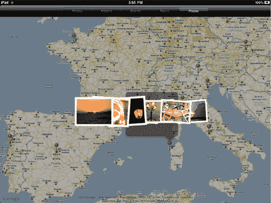
**图 13-18.** *在“`地点`”视图中展开同一位置拍摄的一系列照片*

#### 触摸与查看照片

在相簿中，你会看到其中所包含照片的缩略图（参见图 13-17）。要全屏查看照片，你有两种展开或打开照片的方法：

-   轻点一次照片，使其充满屏幕。
-   用两根手指合拢放在照片上，然后慢慢反向捏合分开，你会看到照片开始放大。移开手指即可让照片完全放大至全屏。

当全屏显示照片后，你有多种交互方式：

-   捏合以缩放照片。
-   双击放大照片。再次双击缩小。
-   当图像以正常的缩小尺寸显示时，向左或向右滑动可切换到相簿中的上一张或下一张图像。当放大图像时，拖拽照片可平移浏览。

轻点任意图像一次，即可打开图像覆盖层，如图 13-19 所示。图像覆盖层在屏幕顶部设有一个菜单栏，底部设有一个滑动条。

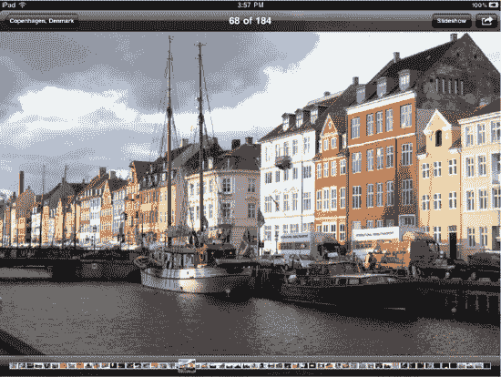
**图 13-19.** *查看照片。请注意图像覆盖层上的工具栏。*

屏幕顶部的图像覆盖层菜单栏会显示所选图像在相簿总图像数中的序号、返回相簿的返回按钮、一个“`幻灯片展示`”按钮以及一个“`分享`”按钮。如果你在某个也包含“`Apple TV`”的 Wi-Fi 网络范围内，并且你的 iPad 运行的是 iOS 4.3 或更高版本，你还会在这里看到“`AirPlay`”按钮（将在下一节讨论）。用手指划过屏幕底部滑动条中的照片缩略图，可快速浏览你的图像（参见图 13-20）。

在“`已存储的照片`”相簿中查看照片时，你会注意到“`分享`”按钮旁边有一个垃圾桶图标。这个垃圾桶图标仅出现在“`已存储的照片`”相簿中图像的菜单栏里。轻点此按钮将删除所选照片。我们将在本章后面进一步讨论删除照片。

**图 13-20.** *滑动条*

在查看单张照片时，将你的`iPad`侧放，照片会自动调整方向。如果照片是横向拍摄的，它会自动适应更宽的视图。

你可以用两根手指轻点一次全屏图像，即可返回相簿视图。

#### 通过 AirPlay 查看照片

iOS 4.3 及更高版本新增了`AirPlay`支持，可让你将音乐、照片和视频无线传输到苹果支持的设备上。对于图像而言，这仅限于苹果新更新的`Apple TV`媒体演示设备，以及一些自定义第三方应用程序，例如 Erica Sadun 为 Mac OS X 开发的`Banana TV`。

`AirPlay`图标（你可以在图 13-21 的右侧看到）看起来像一个矩形轮廓，内部有一个指向上方的三角形。轻点它，会显示可用接收设备的列表。每个名称左侧的电视图标表示该接收设备可以接收照片和视频。当你轻点除第一个对应你的`iPad`之外的任何项目时，照片将无线镜像到所选设备并在其上显示，并且你在浏览相簿时滑动到的任何照片也会如此。

要禁用`AirPlay`镜像，请选择第一个`iPad`选项。选中后，`AirPlay`传输将停止。

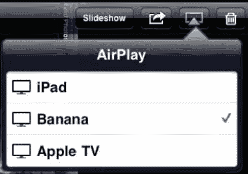
**图 13-21.** *AirPlay 选择菜单让你将照片从你的 iPad 重定向到 Apple TV 或计算机上运行的第三方应用程序。*

#### 以幻灯片形式查看照片

当查看任意相册的内容或相册中的单张照片时，您会在屏幕右上角看到`Slideshow`（幻灯片）和`Share`（共享）按钮（参见图 13-22）。顾名思义，`Slideshow`按钮会按顺序逐一显示相册中的照片。我们将在介绍完`Slideshow`按钮后，再讨论`Share`按钮。

**图 13-22.** 查看单张照片或任意相册内容时，菜单栏右侧会显示`Slideshow`和`Share`按钮。

幻灯片是与朋友和家人分享照片的绝佳方式。但请记住，我们的照片往往与个人回忆相关，因此我们自己观看时总会比他人觉得更有趣。您只需回想一下曾被迫观看他人照片时，度秒如年的感觉就明白了。为了让您的观众对幻灯片保持兴趣，请记住以下几点：

- *精简为佳*：如今电影或电视剧中，单个镜头的平均时长已不到两秒。回到 20 世纪 50 年代，平均镜头时长是 30 秒。看一集《老友记》，再看一集《我爱露西》，您就会明白我们的意思。按今天的标准，《露西》的节奏显得拖沓缓慢。随着世界和媒体的节奏加快，我们的注意力持续时间也缩短了。这同样适用于静态图像的观看。人们在两三秒内就能从一张照片中获取大量信息。如果他们被迫观看更长时间，就会开始感到无聊。因此，每张照片的显示时间要短，整个幻灯片的时长也要短。就像您在电影院观看电影预告片一样，其时长恰好是 2 分 20 秒，这被认为是激发兴趣、展示精彩片段、让观众感到满足但不疲惫的理想时长。
- *音乐总能加分*：在幻灯片的背景中播放合适的歌曲，能极大地增强氛围和感染力。音乐是传达情感、地点和情境的强大工具。在电影学院里，本书的一位作者曾上过一门剪辑课，课上我们观看了经典恐怖片《万圣节》的片段。我们观看了院线版——包含配乐、对白和音效——展示了迈克尔·迈尔斯手持大屠刀追杀受害者的场景，相当吓人。接着，我们观看了只有对白和音效的同一片段（去掉了配乐），结果从恐怖变成了近乎滑稽。音乐为画面增添的效果远超您的想象。
- *转场也有帮助*：转场是指在从一张照片切换到下一张时产生的视觉效果。它为画面切换增添了一些视觉趣味。照片幻灯片允许您在五种转场效果之间进行选择。把它们当作视觉甜点，让观众保持愉悦。
- *善用电视*：如果您要举办聚会，无需把所有客人聚拢并强迫他们坐下来观看，一个绝佳的方式是将幻灯片投射到电视上并设置为循环播放。这样，您的幻灯片会在背景中持续播放，客人们在社交时可以不时瞥见。背景中播放的幻灯片是绝佳的话题引子，并且您可以播放更长、每张照片显示更久的幻灯片，因为无需担心客人会感到厌烦。如果您打算在背景中播放幻灯片，可以选择几千张照片，每张显示 5 到 10 秒；这样一来，整个播放可以持续数小时，也不会显得无聊或乏味。

若要开始播放幻灯片，请轻点`Slideshow`按钮。此时会出现一个下拉菜单，提供若干幻灯片选项（参见图 13-23）。在顶部，您会看到与图 13-21 中相同的`AirPlay`接收器列表。从 iOS 4.3 开始，iPad 允许您通过无线方式将幻灯片播放到 Apple TV 和其他 AirPlay 接收器上。除了此 AirPlay 选项，您还可以在屏幕上直接显示幻灯片，或通过 HDMI、VGA 及其他视频适配器使用连接线将 iPad 镜像到电视屏幕。这些品牌适配器可从 Apple Store 购买，起售价为 29 美元。

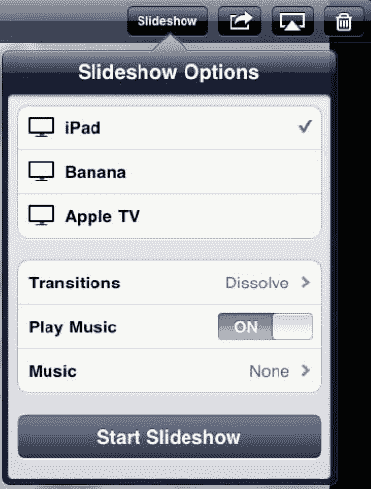

**图 13-23.** 幻灯片选项下拉菜单

在`AirPlay`接收器列表下方，是以下选项：

- *转场*：转场效果可在切换照片时提供视觉特效。可用的转场取决于所选输出设备的能力。内置的转场效果包括擦拭、波纹、溶解等选项。Apple TV 则增加了许多炫酷的额外效果，如 Ken Burns 效果、滑动面板、折纸、反射等。
- *播放音乐*：当切换至`ON`时，此选项会在幻灯片播放时播放背景音乐。
- *音乐*：轻点此按钮可浏览 iPad 音乐库中的所有歌曲。找到您想要的歌曲后，轻点它即可选中。
- *开始幻灯片播放*：轻点此按钮开始播放幻灯片。图像覆盖层消失，幻灯片开始播放，无论是在本地屏幕直接播放，还是通过`AirPlay`在远程设备上播放。使用`AirPlay`时，您的屏幕会变黑，并出现一条信息，提示“此幻灯片正在通过`AirPlay`播放”。要随时停止幻灯片，请触摸屏幕。这会停止播放并将您置于全屏照片显示模式。要重新开始播放，请再次轻点`Slideshow`按钮，然后轻点`Start Slideshow`。

幻灯片会按设定的时长显示每一张照片，您可以自行调整。如前所述，您可以通过从 Apple 购买一根特殊连接线将 iPad 连接到电视，从而将幻灯片输出到电视屏幕。Apple 提供了多种不同的连接线，这些将在第 7 章中讨论。

要自定义 iPad 显示幻灯片的方式，请前往主屏幕，依次进入`设置`  `照片`。如图 13-24 所示，此设置界面允许您精确指定幻灯片的显示方式：

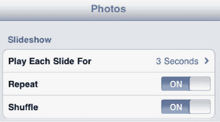

**图 13-24.** 幻灯片设置

- *每张幻灯片播放时长*：在此处，您可以设置每张照片的停留时间。可选参数有：2 秒、3 秒（默认值，对大多数人来说效果很好）、5 秒、10 秒（很快就会变得无聊）和 20 秒（国际特赦组织可能官方认定这对大多数人来说是一种折磨；说真的，别对您的朋友和家人这样做）。
- *重复*：将此选项设为`ON`可使幻灯片循环播放。
- *随机播放*：将`随机播放`从`OFF`切换为`ON`，可以随机顺序显示照片。当`随机播放`关闭时，照片将按照相册中的顺序显示。

#### 分享你的照片

你可以通过多种方式分享 iPad 上的照片。要查看所有分享方式，请将照片全屏显示，然后轻点`共享`按钮，该图标看起来像一个从方框中挣脱出来的箭头。随后将出现一个分享选项的下拉菜单（请参见图 13–25）：

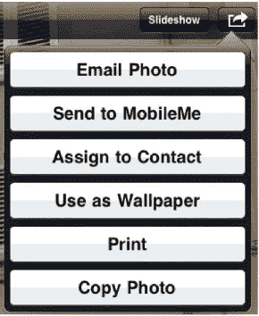

**图 13–25.** *共享下拉菜单*

- **电子邮件照片**：轻点此选项，屏幕上会出现邮件撰写窗口。你会注意到照片已被复制到邮件正文中（请参见图 13–26）。输入收件人邮箱地址、主题和正文，然后轻点`发送`，你的照片就寄出去了！

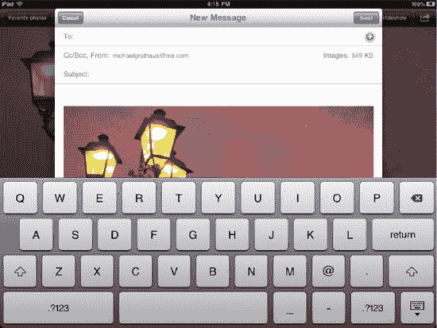

**图 13–26.** *新邮件撰写屏幕出现，邮件正文中已包含照片。*

此外，你也可以在`照片`应用内一次最多通过电子邮件发送五张照片。在相簿中时，轻点`共享`按钮，你会看到相簿菜单更名为`选择照片`。轻点你要发送的最多五张照片，然后轻点左上角的`电子邮件`按钮（请参见图 13–27）。屏幕上会出现一个邮件撰写窗口，邮件正文中已包含这些照片。请注意，尽管在`照片`应用中一次最多只能通过电子邮件发送五张照片，但你实际上可以复制任意数量的照片，然后打开`邮件`应用，撰写新邮件，并将它们全部粘贴到邮件正文中。

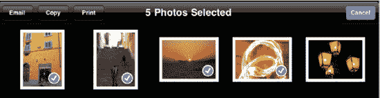

**图 13–27.** *你可以在照片应用中一次最多通过电子邮件发送五张照片。*

- **发送至 MobileMe**：`MobileMe` 是 Apple 的电子邮件服务，它还允许你在线发布和分享照片。`发送至 MobileMe` 选项让你可以直接从 iPad 将照片上传到你的在线 `MobileMe` 图库。轻点`发送至 MobileMe`。将出现一个窗口，要求你为照片命名，并根据需要编写描述（请参见图 13–28）。选择要发布照片的`MobileMe 图库`相簿，然后轻点`发布`。

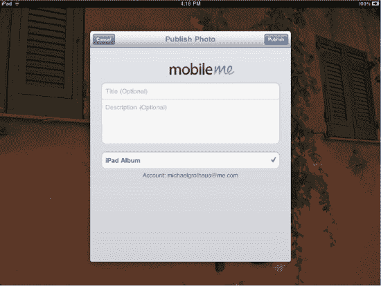

**图 13–28.** *将照片上传到 MobileMe 图库*

照片上传完成后会弹出一个提示，你可以轻点`在 MobileMe 上查看`，这将带你进入`Safari`浏览器中的 `MobileMe` 网络图库；或者轻点`告诉朋友`，这将打开`邮件`应用，并撰写一封包含照片链接的邮件。

要使用这些 `MobileMe` 功能，你必须拥有一个 `MobileMe` 帐户。详情请参见 [`www.me.com`](http://www.me.com)。

- **指定给联系人**：此选项允许你将照片指定给通讯录中的某个联系人。轻点`指定给联系人`，然后从下拉菜单中选择该联系人的通讯录条目（请参见图 13–29）。

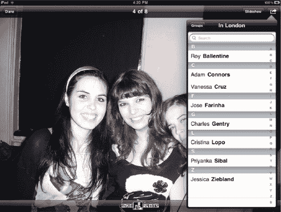

**图 13–29.** *选择要添加照片的联系人。*

移动和缩放出现在上下不透明条之间的照片缩略图，以便将联系人的脸部放大；然后轻点`使用`按钮（请参见图 13–30）。

**图 13–30.** *移动和缩放联系人的照片。*

下次你在 iPad 的`通讯录`应用中查看该联系人时，你为他们选择的图像将出现在其姓名旁边。此图像会与 Mac 上`地址簿`和`Entourage`以及 Windows 电脑上`Outlook`中的联系人信息同步。

- **用作墙纸**：轻点此按钮可将选定的图像用作 iPad 上的墙纸。在菜单栏中（请参见图 13–31），你可以选择将此图像用于 iPad 的锁定屏幕、主屏幕，或两者兼用。这不是设置 iPad 墙纸选项的唯一方法。我们稍后会介绍另一种方法。

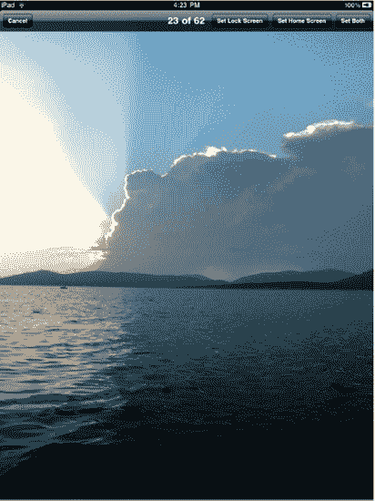

**图 13–31.** *墙纸菜单栏选项让你选择将照片用作哪个屏幕的墙纸。*

- **打印**：这允许你将照片打印到兼容 `AirPrint` 的打印机。轻点`打印`，然后选择要打印到的打印机以及要打印的份数。我们在第 3 章中介绍了 `AirPrint` 以及如何从 iPad 进行打印。

你还可以一次打印多张照片。浏览相簿时，轻点`共享`按钮。你会看到相簿菜单更名为`选择照片`。轻点你想要打印的任意多张照片。每张选中的照片上会出现一个勾选标记（请参见图 13–27）。选择完所有照片后，轻点左上角的`打印`按钮，然后选择要打印到的打印机以及每张照片的打印份数。

- **拷贝照片**：轻点`拷贝照片`来复制图像。这会将图像保存到剪贴板，以便稍后粘贴到其他应用（例如邮件或文档）中使用。

你还可以一次拷贝多张照片。浏览相簿时，轻点`共享`按钮。你会看到相簿菜单更名为`选择照片`。轻点你想要拷贝的任意多张照片。每张选中的照片上会出现一个勾选标记（请参见图 13–27）。选择完所有照片后，轻点左上角的`拷贝`按钮。这些照片随后可以被批量复制到电子邮件或其他应用中。

#### 删除你的照片

Apple 设计为你只能删除 iPad 上属于`相机胶卷`相簿中的照片。此相簿包含你从网页或电子邮件保存到 iPad 的任何照片，以及使用 iPad 2 相机拍摄的照片和视频。Apple 禁用了从其他同步到 iPad 的相簿中删除照片的功能，因为它不希望用户意外删除存储在电脑上的照片。

要删除照片，请导航到你的`相机胶卷`相簿，轻点`共享`按钮。轻点你想要删除的照片，它们上面会出现一个勾选标记；然后轻点红色的`删除`按钮（请参见图 13–32）。或者，在`存储的照片`相簿中以全屏显示照片时，你会注意到`共享`按钮旁边有一个垃圾桶图标（请参见图 13–33）。轻点此按钮会弹出一个`删除照片`确认窗口。轻点`删除照片`即可从 iPad 上删除选定的照片。

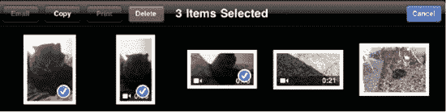

**图 13–32.** *你只能从 iPad 的“存储的照片”相簿中删除照片。*

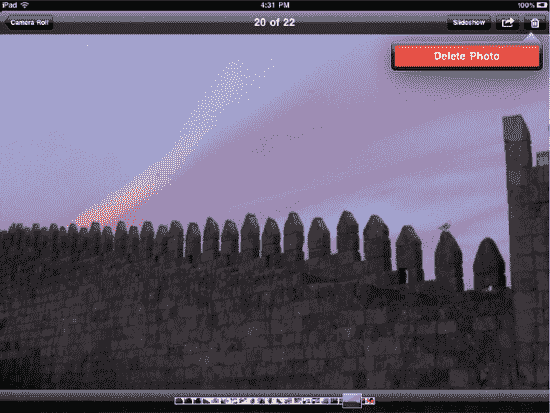

**图 13–33.** *“存储的照片”相簿中照片右上角的垃圾桶图标*

要删除 iPad 上的其他照片，你必须先在电脑上删除它们，然后重新同步 iPad。

#### 相框功能

在 iPad 的锁定屏幕（即开启 iPad 或将其从睡眠状态唤醒时出现的屏幕）上，`滑动来解锁` 条的右侧，你会注意到一个盒子形状内含花朵的小图标（参见 图 13-34）。这就是 `相框` 按钮。轻点此按钮，即可将你的 iPad 变成一个惊艳的电子相框。电子相框功能能将你的 iPad 变成你办公室或客厅里的一件互动家具，也是一种在你忙碌其他事务时仍能“使用”iPad 的好方法。你可以购买众多支持 iPad 的支架之一来更好地利用 `相框` 功能。

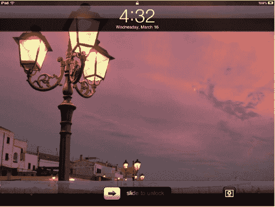

**图 13-34.** *右下角带有 `相框` 按钮的 iPad 锁定屏幕*

要启动相框，请短按电源键锁定 iPad。再次按下 iPad 的电源键或主屏幕按钮，即可进入锁定屏幕。轻点 `相框` 按钮进入相框模式。图标将变为蓝色，屏幕将填满照片，并一张接一张地显示。要暂停幻灯片放映，请轻点屏幕。当前图像会在背景中暂停，同时锁定屏幕逐渐显现。要关闭相框，请轻点蓝色的相框图标，你将返回到显示所选壁纸的锁定屏幕。

`相框` 功能有多个选项，如下所述，这些选项可以在 iPad 的 `设置` 应用中进行配置。导航至 iPad 主屏幕，轻点 `设置` 图标。选择 `相框`（参见 图 13-35）。

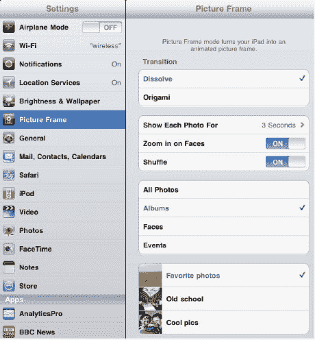

**图 13-35.** *`相框` 设置*

- **`过渡效果`**：选择 `溶解` 或 `折纸` 效果，让照片之间流畅切换。
- **`每张幻灯片显示时长`**：选择 2、3、5、10 或 20 秒。
- **`面部特写`**：将此选项设为 `打开` 后，相框中显示的照片将聚焦于画面中的人物面部。由于 `照片` 应用内置了 `面孔` 功能，它知道你喜爱哪些面孔。如果一张照片中有多张面孔，它会随机选择一张进行聚焦。面部放大功能仅在过渡效果设置为 `溶解` 时可用。
- **`随机播放`**：设为 `打开` 后，你的照片将按随机顺序显示。

默认情况下，`相框` 功能会显示 `照片` 应用中的所有照片。你可以通过选择特定类别，然后选择你想要显示的特定相簿、面孔或事件，来仅显示其中的部分照片。

#### 在不使用照片应用的情况下更改壁纸

我们之前展示了如何通过 `照片` 应用中的照片来设置壁纸，但你也可以在 iPad 的 `设置` 应用中直接设置。为此，请导航至 iPad 主屏幕，轻点 `设置` 图标。选择 `亮度与墙纸`。你会看到两张图片，一张代表 iPad 的锁定屏幕，另一张代表主屏幕（参见 图 13-36）。每张图片上显示的画面就是你当前为各自屏幕选定的壁纸。

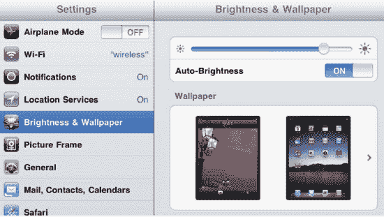

**图 13-36.** *`亮度与墙纸` 设置*

轻点这些图片，即可进入壁纸选择屏幕（参见 图 13-37）。在这里，你将看到 `照片` 应用中所有相簿的列表，以及一个标为 `墙纸` 的新相簿。

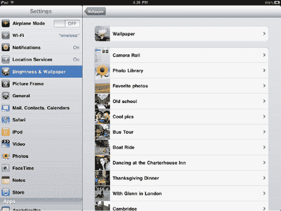

**图 13-37.** *你可以从苹果自带的壁纸中进行选择，或使用 iPad 上的任意照片作为壁纸。*

`墙纸` 包含了苹果预装在 iPad 上用作壁纸的图像。从任意相簿中选择一张图片，你将获得全屏预览。然后轻点 `设定锁定屏幕`、`设定主屏幕` 或 `同时设定`，即可将该图片用作锁定屏幕、主屏幕的背景，或者同时用作两者的背景（参见 图 13-31）。如果你选择仅将图片用于锁定屏幕，可以稍后返回选择另一张图片用于主屏幕。

### 观看视频

在 iPad 2 上，苹果增加了前后摄像头，除其他功能外，还允许你录制视频（有关 iPad 2 摄像头的所有功能，请参见第 15 章）。你也可以使用 `iPad 相机连接套件` 从数码相机导入录制的视频（参见本章前文）。所有录制或导入的视频都存储在 `相机胶卷` 相簿中。要观看你在 iPad 上录制或导入的任何视频，只需轻点 `相机胶卷` 中的缩略图。视频将显示出来，中间有一个大的播放按钮。轻点屏幕任意区域一次，即可调出屏幕视频控制项（参见 图 13-38）。

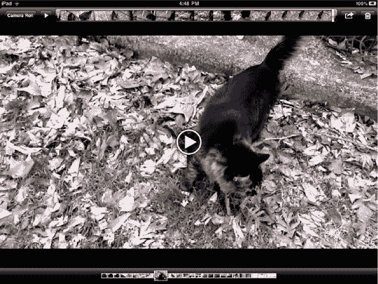

**图 13-38.** *从 `相机胶卷` 播放视频。轻点一次可调出屏幕菜单。*

一旦你全屏显示视频，有以下几种交互方式：

- 轻点视频一次即可播放。轻点左上角的播放/暂停按钮可暂停播放。
- 通过按住并拖动进度条中的银色拖动条来快速浏览视频。进度条会显示由缩略图表示的视频片段区域。
- 将手指在进度条上按住几秒钟，你会看到进度条展开。这让你能够更精细地控制定位视频中的特定位置。

屏幕顶部的视频叠加菜单栏显示了一个返回按钮，标为 `相机胶卷`，用于返回主 `相机胶卷`。你可以轻点 `完成` 按钮退出 `相机胶卷` 并返回 `相机` 应用。你还会看到 `共享` 按钮和垃圾桶图标，点击后会弹出删除确认菜单。轻点红色的 `删除视频` 按钮即可删除选定的视频。

#### 编辑你的视频

苹果在 `相机` 应用中包含了有限的视频编辑功能。不过，视频编辑这个词并不准确。*修剪* 更贴切，因为你可以缩短（或 *修剪*）视频片段的开头和结尾。

要修剪视频，请调出视频菜单覆盖层（参见 图 13-38）。接下来，抓住进度条的开头，将其向右拖动。这将激活修剪模式（参见 图 13-39）。

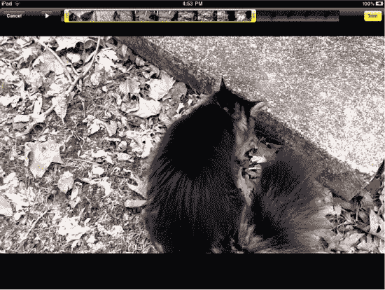

**图 13-39.** *视频修剪模式*

在修剪模式下，你可以将当前以黄色轮廓标示的进度条两端向中心拖动。拖动两端会缩短片段的开头和结尾。

修剪是一项很棒的功能，它可以让你只突出显示视频片段中真正精彩的部分。调整好修剪指令后，轻点黄色的 `修剪` 按钮，会弹出一个 `修剪` 弹出窗口（参见 图 13-40）。

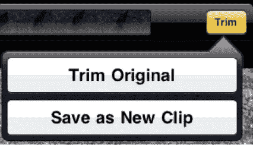

**图 13-40.** *`修剪` 弹出窗口让你可以修剪原始视频或将修剪部分保存为新片段。*

`修剪` 弹出窗口提供两个选项：

- **`修剪原片`**：这实际上会更改原始视频录制文件。它将永久删除你修剪掉的视频片段。
- **`存储为新剪辑`**：这会保留你的原始视频不变，并为你指定的修剪部分创建一个全新的视频文件。

要取消修剪，只需轻点 `修剪` 弹出窗口之外的任意区域。请记住，如果你选择保留原始片段，iPod 上的存储空间会很快填满。在我们的 iPad 上，一分钟的片段就占用了高达 120MB 的空间。

#### 分享你的视频

在观看任何单个视频片段时，你都有多种分享选项。要调出分享菜单，请轻点 `Share` 按钮，该图标看起来像一个从小盒子中挣脱出来的箭头。随后会弹出一个分享选项菜单（请参见 图 13–41）：

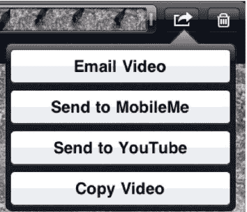

**图 13–41.** *视频分享选项*

- **Email Video（电子邮件视频）**：选择此选项会将视频片段压缩为 QuickTime 电影文件。随后会打开一个新邮件窗口，邮件正文中已附带该视频片段。

  根据视频片段的长度，你可能会看到一条错误信息，提示“Video is Too Long（视频太长）”。如果出现此提示，你的 iPad 会询问你是否想从视频中选择一个更短的片段来发送电子邮件。轻点 `OK`，你将进入修剪模式，该模式允许你缩短片段的长度。

  修剪模式的一个有趣之处在于：黄色的修剪选择条固定在 54 秒。你可以缩短它或拖动这个 54 秒的修剪选择条，但无法将修剪时长增加到超过 54 秒。因此，就目前而言，54 秒似乎是可通过电子邮件发送的最长片段长度。不过，苹果公司将来随时可以通过软件更新改变这一限制。

  修剪完视频后，轻点进度条上方黄色的 `Email` 按钮。随后应会出现一封空白电子邮件，邮件正文中已包含该视频。

- **Send to MobileMe（发送到 MobileMe）**：`MobileMe` 是苹果公司的电子邮件服务，同时也允许你在线发布和分享照片及视频。`Send to MobileMe` 选项让你可以直接从 iPad 将视频上传到你的 `MobileMe` 在线图库。轻点 `Send to MobileMe`。系统会弹出窗口，要求你为视频命名，并可根据需要撰写描述（请参见 图 13–42）。你还可以选择上传标清视频或原始高清版本。最后，选择你想要发布视频的 `MobileMe Gallery` 相册，然后轻点 `Publish`。请注意，你无法通过这种方式创建新相册，必须将视频添加到现有相册中。

  视频上方会出现一个表示上传进度的进度条。上传完成后，你将能轻点 `View on MobileMe`，它会带你进入 `Safari` 浏览器中的 `MobileMe` 网络图库；或者轻点 `Tell a Friend`，它会打开 `Mail` 应用，并撰写一封邮件，正文中包含该视频的链接。

  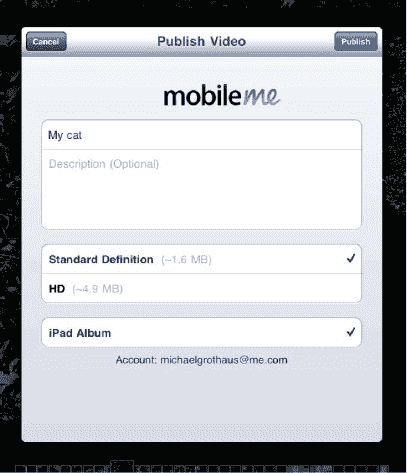

  **图 13–42.** *MobileMe 分享和上传界面*

  要使用这些 `MobileMe` 功能，你必须拥有一个 `MobileMe` 账户。详情请参见 [`www.me.com`](http://www.me.com)。

- **Send to YouTube（发送到 YouTube）**：选择此选项将允许你直接从 iPad 将视频上传到 `YouTube`。在出现的屏幕中（请参见 图 13–43），为视频输入名称和描述，选择上传标清或高清版本，添加标签，选择一个 `YouTube` 类别，然后轻点 `Publish`。你需要拥有一个 `YouTube` 账户才能将视频上传到 `YouTube`。

  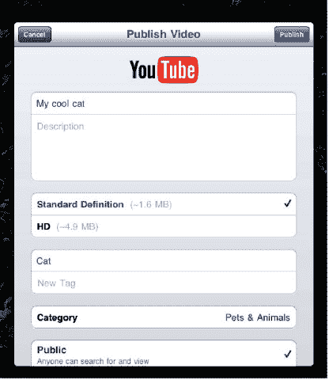

  **图 13–43.** *将视频发布到 YouTube*

- **Copy Video（复制视频）**：轻点 `Copy Video` 以复制视频。这会将视频保存到剪贴板，以便稍后粘贴到其他地方（例如电子邮件或文档中）。

  你也可以同时复制多个视频。在查看相册时，轻点 `Share` 按钮。你会看到相册菜单更名为 `Select Photos`。轻点你想要复制的多个视频（和/或照片）。每个选中的项目上会显示一个勾选标记。选择完所有视频和/或照片后，轻点左上角的 `Copy` 按钮。这些视频和照片即可被批量复制到电子邮件或其他应用中。

### 本章小结

本章向你介绍了 iPad 的 `Photos` 应用，并展示了如何浏览你的照片集、与亲友分享、更改 iPad 壁纸，甚至将你的 iPad 用作数码相框。一旦你在 iPad 上查看过数码照片，你可能会发现，你再也不想在电脑显示器或笔记本电脑屏幕上浏览和查看它们了。

以下是本章的一些总结性思考：

- iPad 的 `Photos` 应用提供了最能够即刻展示 iPad 强大功能的方式之一。你可以滚动浏览相册，通过捏合或双击来放大缩小，以及将设备侧向翻转。这些功能都带来了 iPad 令人惊叹的体验。
- 你可以直接从相机将照片导入 iPad。这对于可能在外拍摄的专业摄影师来说是一个巨大的帮助。他们可以将图像加载到 iPad 上，并立即在更大的屏幕上查看效果。甚至还可以放大以查看更多细节。
- 考虑投资购买一个廉价的名片盒和一个便宜的扬声器。它们能让在 iPad 上观看幻灯片变得更加轻松，尤其是当有多人同时观看时。苹果的视频输出线缆能将幻灯片发送到电视屏幕上，从而增添更多乐趣。
- `Photos` 应用还允许你观看录制或导入的视频。你甚至可以修剪视频片段，并轻松地将这些片段发送到 `YouTube` 或通过电子邮件发送给朋友。

## 第 14 章

## 使用 iWork 移动办公

在本书中，我们已经讨论过一些应用，它们能帮助你整理事务、与他人沟通，或以音乐、书籍、视频和照片的形式享受媒体内容。现在我们将来讨论三款能将你的 iPad 变成一个强大工作平台的应用。

这三款应用分别是 `Pages`、`Numbers` 和 `Keynote`，它们在 iPad 上统称为 `iWork`。这些由苹果公司开发的应用可以在 App Store 以每个 9.99 美元的价格购买，它们提供了高效工作者在移动办公时所需的大部分功能。话虽如此，我们也需要补充一点：对于严肃的工作任务，你应该考虑使用你的 iPad 来远程控制你的“真正”工作电脑。像 `LogMeIn Ignition` 和 `iTeleport` 这样的应用使这成为可能，尽管本书不包含对其配置和使用的详细说明。在本章中，我们仅介绍每个应用的基础知识，因为对 `iWork` 的深入探讨本身就可以轻松成为另一本书的主题。

### 购买并安装适用于 iPad 的 `iWork`

与 iPad 内置的许多应用不同，适用于 iPad 的 `iWork` 应用需要购买并在你的 iPad 上自行安装。在第 8 章中，我们向你介绍了`App Store`应用以及它如何协助你在 iPad 上浏览、购买和安装 iPad 软件。

如果你不需要某些功能，就无需购买全部三个应用。例如，如果你只需要一个优秀的文字处理应用，并且不需要处理电子表格或演示文稿的工作，那么你只需购买`Pages`。演示者可能只想购买`Keynote`，而预算管理者则可以只入手`Numbers`。

以下是你可以选择为每个应用做的几件事。

`Pages`：

*   书写信件
*   创建或更新简历
*   撰写项目提案
*   写学期论文
*   制作创意海报、贺卡、邀请函或传单

`Numbers`：

*   创建清单
*   比较抵押贷款或其他贷款方案
*   制定预算
*   创建费用报告和发票
*   记录商务及个人汽车里程
*   根据数据绘制图表

`Keynote`：

*   制作商务演示文稿
*   学生和教师创建课堂演示文稿
*   制作极具吸引力的个人幻灯片
*   将 iPad 用作演讲提词器

启动`App Store`应用，然后在`App Store`右上角的搜索框中输入`pages`一词。轻点键盘上的`Search`按钮，列表中将显示名称中包含`pages`的应用。在 iPad 应用下，找到`Pages`（归类在“生产力”类别中），然后轻点价格按钮。该按钮会变成绿色的`Install App`按钮。轻点它，系统会要求你输入`Apple ID`。`Pages`会下载到你的 iPad 并自动完成安装。`Numbers`和`Keynote`的安装流程与此相同。

这些应用体积较大——每个都超过 20 MB——因此请确保在安装前将 iPad 连接到 Wi-Fi 网络。如果在连接到 3G 网络时尝试安装任何`iWork`应用，系统会提示你连接到 Wi-Fi 网络后再安装，或者通过电脑上的`iTunes`安装。我们的建议是通过电脑上的`iTunes`购买并安装适用于 iPad 的`iWork`应用。

### `Pages`

`Pages`不仅仅是一个 iPad 文字处理应用——它还能用于创建包含图形、表格、图表和多种文本样式的复杂页面布局。Mac 版`Pages`在其发展过程中逐渐演变为强大的写作和桌面出版工具，而 iPad 版则天生具备了许多相同的功能。该应用针对 iPad 的触摸界面进行了优化，使用起来令人愉悦。

在本节中，我们将带你熟悉`Pages`的用户界面及其部分功能。

#### 创建新文稿

首次启动`Pages`时，你会看到一个标题为`轻点开始使用 Pages`的文稿。它不仅仅是一组漂亮的页面，更是一个交互式教程，涵盖了许多应用功能。它会引导你使用常见的 iPad 界面手势来移动、旋转、缩放和删除图像，重新设置文本样式，以及向文稿中添加对象。

`我的文稿`页面是你进入`Pages`后首先看到的内容，它看起来像一块灰色布料，上面整齐排列着你的所有文稿。要打开之前创建的文稿，只需轻点它一次。

如果你想从一张白纸或某个模板开始，可以轻点`Pages`窗口左上角的`新建文稿`按钮，或者轻点窗口底部中间的加号（`+`）图标。在`我的文稿`窗口中，如果轻点某个现有文稿下方的加号，你可以选择从头创建新文稿，或者复制现有文稿。

如果你轻点任一`新建文稿`按钮，首先会看到一个`选择模板`屏幕，上面列出了许多有用的文稿类型（见图 14–1）。你可以选择从一张完全空白的页面开始，也可以使用设计精美的文稿模板。模板在你希望快速创建一份专业外观的文稿，或者遇到写作瓶颈需要一些点子来激发想象力时非常有用。

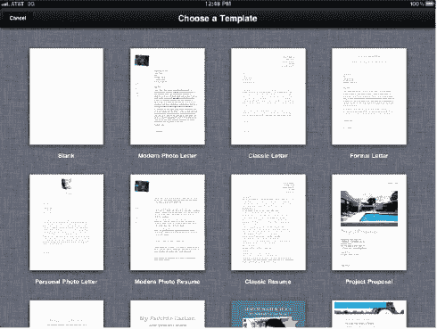

**图 14–1.** *在 iPad 版`Pages`中创建新文稿时，可以选择从空白页开始，也可以使用专业设计的模板。*

为了本书的讲解目的，我们将从空白页开始。轻点`选择模板`窗口左上角的空白页，就可以开始写作了。在开始之前，我们会先解释一下`Pages`窗口顶部的内容，如图 14–2 所示。

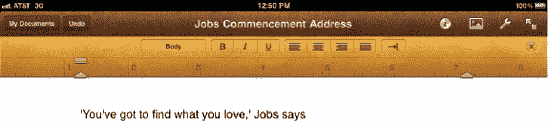

**图 14–2.** *`Pages`样式标尺*

#### `Pages`样式标尺

苹果将图 14–2 中所示的类似标尺的用户界面元素命名为`样式标尺`，因为它既提供了为文本设置样式的方法，又提供了用于对齐页面元素的标尺。你可以通过轻点右上角带圆圈的×来让`样式标尺`从页面上消失，也可以通过双击屏幕顶部几乎看不见的标尺边缘来让它重新出现。

`样式标尺`与其正上方的工具栏不同。工具栏包含一个返回`我的文稿`的按钮、一个`撤销`按钮（用于恢复文稿的先前版本），以及右侧一组按钮（稍后我们会介绍）。与`样式标尺`不同，工具栏始终可见，除非你切换到全屏模式（本章后续会描述）。全屏模式下，除文稿本身外，所有元素都会被隐藏。

标尺上有许多按钮。最左边的按钮（标有`正文`）用于将样式应用到当前选中的段落。要应用样式，请双击段落中的任意文本，然后轻点`段落样式`按钮。会出现一个滚动的弹出式菜单，其中列出了常见的段落样式——标题、副标题、不同大小的标题、小标题、正文、项目符号文本、说明文字、页眉和页脚等。选择其中一种样式会将其应用到整个文本段落。

##### 撤销/重做

你刚刚不小心对一段文字应用了错误的样式？没问题。轻点窗口顶部工具栏中的`撤销`按钮，文本就会恢复为原来的样式。如果后来你确定确实想进行某项更改，请再次轻点`撤销`按钮。可能会出现一个弹出菜单，允许你选择重做一个操作。与许多其他 iPad 应用不同，`Pages`不支持通过左右摇晃 iPad 来撤销或重做。

##### 常用样式

接下来的一组按钮——`B`、`I`和`U`——用于将常用样式应用到字符。`B`代表粗体，`I`代表斜体，`U`代表下划线。要选择一个词，请双击它。当你选中一个词时，它会以浅蓝色背景高亮显示，并出现一对选择手柄，分别位于两端（见图 14–3）。

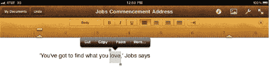

**图 14–3.** *在`Pages`文稿中双击任意单词会将其选中，并在两侧添加选择手柄以扩展选择范围，同时显示一个操作弹出菜单。*

通过向左或向右拖动手柄来扩展你的选择范围，或者通过三次轻点来选中整个段落。同时会弹出一个菜单，显示可应用于文本的操作。最常用的操作——`剪切`、`复制`和`粘贴`——会出现在弹出菜单中。轻点`更多`按钮会提供更多操作选项——`拷贝样式`、`替换`和`定义`。

##### 剪切、拷贝、粘贴与拷贝样式

`剪切`、`拷贝`和`粘贴`的操作方式与 Mac 或 Windows 电脑中的任何文字处理程序完全相同。你可以剪切一个单词或短语并将其粘贴到其他位置，也可以拷贝文本后再粘贴到其他位置。`拷贝样式`用于复制文本的现有样式。例如，如果你通过加粗和添加下划线为某个单词创建了自定义样式，那么你可以先拷贝该单词的样式，然后将该样式（拷贝样式后会出现）粘贴到其他选中的单词或短语上。

##### 替换与定义

`替换`功能假定你拼错了某个单词，并显示可应用的候选替换词。轻点其中一个替换词即可将其插入原单词所在位置。`定义`功能提供了一键查询词典的服务。选择`定义`后，会弹出一个显示该单词词典释义的窗口（参见图 14–4）。

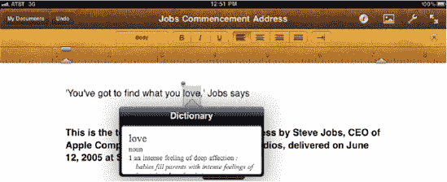

**图 14–4.** *定义功能提供了一种无需退出 Pages 并切换到其他应用即可查询任意单词含义的方法。*

##### 文本对齐

在样式标尺上继续向下查看，你会看到一组带有线条的图标。从左到右依次为：左对齐、居中对齐、右对齐和两端对齐。最后一个按钮（看起来像指向墙壁的箭头）会弹出一个菜单，你可以在其中应用制表符或分隔符（参见图 14–5）。

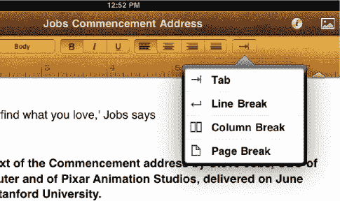

**图 14–5.** *样式标尺上的最后一个按钮用于应用制表符、换行符、分栏符和分页符。*

在文本行开头应用制表符，可以按半英寸的增量缩进文本。换行符会结束当前文本行，并将插入点（新文本出现的位置）移至下一行。分栏符仅在你将文档设置为多栏布局时生效，此时应用分栏符会将插入点之后的文本移至下一栏。最后，分页符会在新页面上开始写入文本。

**注：** 如果你使用的是外接蓝牙或 USB 键盘，或者 Apple 键盘底座，则可以使用键盘上的 Tab 键来代替制表符按钮。键盘顶部的其他按钮提供各种功能，包括设置音量和调节 iPad 显示屏亮度。

如果你想在标尺的多个位置设置制表位，只需轻点标尺，然后将制表符拖拽到适当位置即可。之后，当你连续多次按下制表符按钮时，光标会在你设置的各个制表位之间跳转。默认情况下设置的是**右对齐制表符**（文本位于制表位右侧）。轻点两次制表符可将其变为**居中对齐制表符**（文本围绕制表位居中），轻点三次则变为**左对齐制表符**（文本位于制表位左侧）。

样式标尺还显示了可调整的页边距和首行缩进工具。小的向上箭头（参见图 14–6）表示页边距，默认情况下，在传统的 8.5×11 英寸纸张上，页边距为纸张每侧 1 英寸。你可以根据需要向左或向右移动这些页边距。段落的首行可以通过将缩进工具（新页面中左侧页边距指示器上方的小矩形块）向右拖拽来进行缩进。

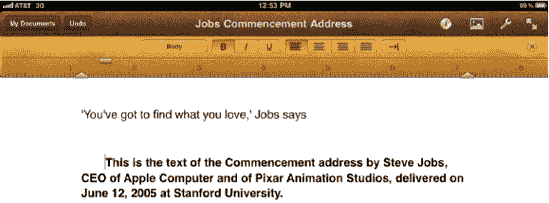

**图 14–6.** *通过向右拖拽缩进工具（位于 1.5 英寸处的矩形工具）来缩进段落首行。此图中还可以看到多个右对齐制表符。*

##### 重命名 Pages 文档

轻点`我的文稿`按钮返回“我的文稿”视图，然后轻点文档缩略图下方显示的名称，即可重命名“空白”文档。输入新名称，然后轻点`完成`保存名称（图 14–7）。

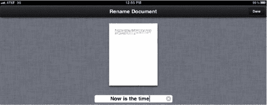

**图 14–7.** *重命名文档有助于在 Pages 的“我的文稿”视图中唯一标识该文档。*

### Pages 工具栏

现在，让我们看看样式标尺上方工具栏中的其他一些工具。正如我们之前提到的，`撤销`按钮可让你纠正错误。实际上，它可以纠正很多错误——每次轻点`撤销`，都会撤销你在 Pages 中执行的上一个操作。

在阅读完以下关于 Pages 中其他众多可用工具的描述并开始使用该应用后，你将会发现这款 iPad 文字处理与页面布局工具究竟有多强大。

#### 信息

在工具栏上越过文档名称继续向右移动，你会看到一个小圆形图标，它很像国际通用的信息符号——小写字母`i`。Apple 将此按钮称为`信息`按钮，根据你当前在 iPad 上选择的是文本还是对象，它能提供不同的功能。

对于文本，`信息`按钮会提供`样式`、`列表`和`布局`这三个标签页选项，如图 14–8 中从左到右所示。

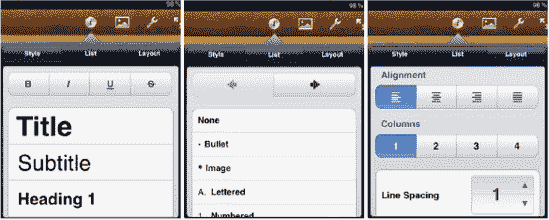

**图 14–8.** *信息按钮是更改样式、列表和布局设置的门户。*

`样式`标签页重复了你之前看到的文本样式；它允许对文本进行加粗、斜体、下划线或删除线处理，并且还提供文本选项（位于最底部；在图 14–8 中不可见），如字号、颜色和字体。`列表`标签页可将列表设置为项目符号列表、字母列表、编号列表或图像项目符号列表。使用大箭头来增加或减少格式化大纲中列表项的缩进量。`布局`标签页提供了另一种方式来对齐文档、将其设置为最多四栏，或调整行间距。

对于对象（图像、图表、表格或形状），`信息`按钮会变为显示`样式`、`文本`和`排列`标签页（参见图 14–9）。

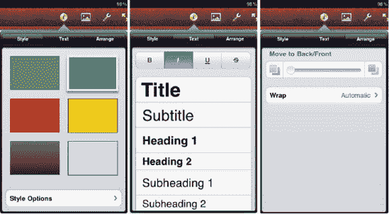

**图 14–9.** *使用信息按钮可以对对象和文本进行样式设置或排列。*

应用于对象时，`样式`标签页会添加各种边框、阴影和反射效果，为对象营造立体感。`样式`标签页提供多个选项，包括启用或关闭图像边框、缩放边框、将线条类型从实线改为虚线，以及从十几种不同的相框中选择。`文本`标签页将样式应用于输入到对象中的文本。`排列`标签页可将对象相对于其他对象向后或向前移动，允许垂直和水平翻转对象，允许使用蒙版对图像进行文档内裁剪，并允许设置文本如何环绕对象。

在讨论 Numbers 时，你将了解`信息`按钮的其他一些用途，例如为图表和形状设置选项等。

#### 插入

`Insert`按钮看起来像是一幅小型的风景画。你可以通过它在文档中插入来自**照片**图库的媒体、表格、图表或形状（参见图 14–10）。

`Media`选项卡可将`Photos`应用中的图片添加到文档。`Tables`提供了一系列精美且带有彩色阴影的预格式化表格，用于在文档中展示表格信息。使用`Charts`，你可以选择条形图、柱状图、面积图、折线图、散点图和饼图，共有六种鲜艳颜色可供添加到文档中。双击已插入的图表会显示一个简单的电子表格，用于编辑图表所反映的信息。最后，如果你需要在`Pages`文档中添加方框、卡通气泡、线条或几何形状，只需轻点`Shapes`。

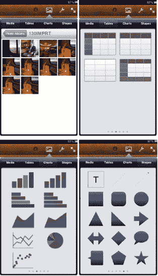

**图 14–10.** *使用`Insert`按钮将图片、表格、图表或形状添加到你的`Pages`文档中。*

一旦你向文档中添加了表格、图表或形状，轻点该元素，再轻点`Info`按钮，便会弹出一个窗口，让你可以轻松修改该元素的选项。我们将在介绍`Numbers`时更详细地描述表格和图表的选项。

#### 工具

工具栏上紧挨着的那个类似小扳手的图标就是`Tools`按钮（参见图 14–11）。它用于更改适用于整个文档的设置，如果你想打印`Pages`文档，也需要通过这里进行设置。

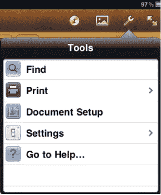

**图 14–11.** *`Pages`中的`Tools`按钮提供的功能适用于整个文档，而不仅仅是单个词语或段落。*

需要在文档中查找并替换某个词或短语吗？`Find`功能可搜索整个文档中的特定字符集，进行替换（如果你选择了`Find and Replace`选项），并且如果你需要更精细的搜索，它甚至可以区分大小写或仅匹配完整单词（参见图 14–12）。

**图 14–12.** *`Pages`中`Tools`按钮下的`Find`功能是一个强大的工具，可用于在整个文档中进行全局替换。*

随着 2010 年底 iOS 4.2 操作系统的发布，iPad 增加了打印功能。苹果的一项名为`AirPrint`的功能会在你的 Wi-Fi 网络上搜索兼容的打印机，并在你轻点`Tools`下的`Print`选项时显示这些打印机。选择要打印的份数并轻点`Print`按钮，即可将当前的`iWork`文档发送到所选打印机。

遗憾的是，在本文撰写时，开箱即能兼容`AirPrint`的打印机还很少。不过，已有几家软件厂商为 Mac 和 Windows 开发了应用程序，使任何共享打印机都能兼容`AirPrint`。

`Ecamm Network`为 Mac 开发了`Printopia`（售价 9.95 美元，[`www.ecamm.com/mac/printopia/`](http://www.ecamm.com/mac/printopia/)），它让 Mac 用户能够选择想要与网络中的 iPad 共享的打印机（参见图 14–13）。对于使用 Windows 电脑的用户，或者希望能够将照片直接发送到 iPhoto 的 Mac 用户，可以尝试`Collobos FingerPrint`（Mac 版 7.99 美元，Windows 版 9.99 美元，[`www.collobos.com/`](http://www.collobos.com/)）。这两款应用还具备其他功能，例如能够将文档发送到你的 PC 或 Mac，或将其保存到流行的`Dropbox`云存储服务中。

**图 14–13.** *`Pages`工具栏上`Tools`按钮下的`Print`功能，会显示由`Printopia`或`FingerPrint`等应用托管的打印机或打印到文件的服务。*

轻点`Tools`菜单上的`Document Setup`按钮，会显示一个类似蓝图的文档布局，你可以在上面轻点并编辑页眉和页脚，或调整文档页边距。

`Tools`下的`Settings`按钮可访问各项设置，例如打开或关闭中心参考线和边缘参考线。什么是中心参考线和边缘参考线？如果页面上有多个对象，拖动其中一个时，会显示对齐参考线，这样你就能看到对象的中心或边缘是否对齐。关闭边缘参考线意味着移动对象时只显示中心参考线，而禁用中心参考线则只显示边缘参考线。如果你不需要对齐参考线，也可以将其完全禁用。此外还有一个字数统计功能，启用后会在文档中显示实时更新的总字数。

`Settings`中的最后一项工具用于启用或禁用实时拼写检查。当你在`Pages`文档中键入文字时，可能拼写错误的单词会以红色虚线下划线显示。轻点该单词会显示可能的替换词，轻点其中某个词即可插入替换词。如果你觉得持续的提醒很烦人，可以禁用拼写检查。

轻点`Tools`下的最后一个按钮`Go to Help`，会启动 Safari 浏览器并跳转到苹果关于`iWork for iPad`套件的在线帮助。在线帮助中包含的信息量惊人，因此如果你在使用`Pages`、`Keynote`或`Numbers`的某个功能时遇到困难，一定要去查阅一下。

#### 全页显示

最后，工具栏上最后一个图标看起来像是一对指向对角线的箭头，点击它即可全页显示文档，隐藏工具栏、样式标尺等所有元素。这在阅读文档并希望尽可能多地查看内容时最为有用。

### Numbers

一旦你熟悉了 iPad 上的`Pages`，就很容易理解如何使用`Numbers`。对于需要整理数据和数字的人来说，`Numbers`应用可以创建、打开和保存与 Microsoft Excel 或 Mac 版`Numbers`兼容的电子表格。

`Numbers for iPad`不仅包含了其 Windows 电脑和 Mac 上同类软件的大量电子表格功能，还提供了用于以图形方式呈现信息的图表工具，甚至还有用于在电子表格中捕获数据的表单工具。

接下来，请跟随我们一起了解`Numbers`。

#### 我的电子表格

图 14–14 看起来眼熟吗？应该眼熟。`我的电子表格` 是 Numbers 中与 Pages 的 `我的文稿` 相对应的功能。事实上，`我的电子表格` 中用户界面的所有元素都与 `我的文稿` 完全相同。电子表格缩略图下方的 `共享`、`新建或复制电子表格` 和 `删除` 图标执行的功能与 Pages 中的对应功能相同，你可以轻点电子表格的名称来重命名它。

**图 14–14.** *`我的电子表格` 相当于 Pages 中的 `我的文稿`。它用于创建新的电子表格、重命名、删除以及与其他人共享。*

`新建电子表格` 按钮会打开一个窗口，这是 Numbers 版本的 `新建文稿` 窗口。与 Pages 一样，你可以选择空白电子表格，也可以从 Apple 精心提供的多个模板中进行选择。

Numbers 模板（见图 14–15）范围广泛，从简单的清单到抵押贷款计算器，从减肥与跑步日志到课堂考勤表。虽然并非每个人都需要 GPA 计算器，但它确实存在。许多模板旨在让你初步了解可以使用 Numbers 完成的各种任务。

**图 14–15.** *Apple 在 Numbers 中包含了 16 个模板，其中许多可用于执行有用的计算。*

Numbers 用户界面一个独特的功能是标签页的概念。如图 14–16 所示，标签页定义了电子表格的不同工作表或表单。例如，一个 Numbers 电子表格可以包含一个用于描述如何使用该电子表格的工作表、一个用于捕获数据的表单，以及另一个用于对捕获的数据执行计算的工作表。每个页面都在电子表格顶部显示自己的标签页，使得在页面之间导航就像轻点一个标签页一样简单。

**图 14–16.** *使用标签页在 Numbers 电子表格文件中命名各个工作表或表单。*

如果你熟悉 Microsoft Excel，只需将标签页视为工作表，并将这组工作表视为一个 Excel 工作簿。要添加新标签页，请轻点最右侧的标签页。它标有加号，轻点它会弹出一个带有两个按钮的弹出窗口——`新建工作表` 和 `新建表单`。双击现有名称然后输入新名称，即可重命名任何标签页。

与 Pages 一样，有一个非常有帮助的 `开始使用` 文档，它实际上是一个伪装起来的交互式 Numbers 教程。对于刚开始使用 Numbers 的 iPad 用户来说，花时间和精力通读 `开始使用` 页面是非常值得的。

#### 向电子表格添加元素

空白电子表格用处不大。尽管即使是“空白”模板也包含一个通用表格，你可以开始在其中输入数字或文本，但轻点标签页会创建一个完全空白的表格。你习惯的行和列在哪里？在 Numbers 中，你需要向表格中添加一个表格才能开始使用它。你会记得，Pages 中的 `插入` 按钮允许你向空白页面添加媒体、表格、图表和形状。这正是 `插入` 按钮在 Numbers 中的功能。`表格` 标签页略有不同，但 `媒体`、`图表` 和 `形状` 标签页与 Pages 中的对应标签页完全相同，因为它们都提供了在页面上添加图片、创建图表或绘制形状的方法。

在图 14–17 中，我们向一个空白表格添加了一个简单的五列表格。如你所见，第一列为每一行包含一个复选框，其余列则为空白。该表格有一个名称——`表格 2`——以及一些看起来像滚动条的东西，位于表格的顶部和左侧。

**图 14–17.** *在 Numbers 中向空白工作表添加的空白表格*

看到滚动条末端那些看起来像衬衫纽扣的小东西了吗？向右或向下拖动其中一个，将为表格添加一列或一行。向上或向左拖动一个按钮，则从表格中删除一行或一列。要移动整体表格在工作表上的位置，请拖动表格左上角的按钮。

表格右侧和底边的暗色圆点在被拖动时会拉伸表格，增加所有列和行的宽度，而不会添加任何新列或行。同样，通过将这些“手柄”向上或向左拖动，可以使表格变小。

虽然我们不会详细介绍 Numbers 中可供选择的众多电子表格函数，但让我们谈谈如何向电子表格单元格中输入信息。双击电子表格上的一个单元格会使其高亮显示，并带有深蓝色边框，同时屏幕上会出现一个浅绿色的数据录入字段以及一个合适的键盘（见图 14–18）和工具栏中的四个按钮。最左边你会看到一个标有“42”的按钮，这表明你使用此按钮向单元格中输入数字。数字可以格式化为纯数字、货币（使用下方数据录入键盘上的美元符号按钮）、百分比（使用百分号按钮）、1 到 5 星的评级（使用星形按钮）或复选框（0 或 1，使用复选框按钮）。键盘右侧的按钮可让你跳转到右侧的下一个单元格或下方的下一个单元格，以便在电子表格中快速导航。

**图 14–18.** *数字数据录入键盘*

**微妙笑话提醒！** 你是否好奇为什么数字录入按钮上标有“42”？在经典科幻系列《银河系漫游指南》中，42 是生命、宇宙以及一切终极问题的答案。我们猜测 Numbers 开发团队中的某个人是科幻迷。

使用 `下一个` 按钮（位于 `42` 右侧），该按钮看起来像一个时钟，用于向电子表格单元格输入日期、时间或持续时间。轻点此按钮会使键盘外观发生变化（见图 14–19），键盘上显示月份，并且有按钮用于表示你输入的是日期和/或时间，还是持续时间。日期或时间与持续时间有什么区别？日期是一个具体的日期，例如 2010 年 6 月 10 日；时间是一个具体的时间点，例如下午 4:32:06。持续时间是可以在两个时间点之间测量的时间长度。我们的一位作者在撰写此句时，其生命以持续时间衡量为 53 年 7 个月 29 天 1 小时 22 分钟。

**图 14–19.** *日期、时间和持续时间录入键盘*

沿着数据录入工具栏继续往下，有一个标有字母 `T` 的按钮。使用此按钮向单元格中输入文本。轻点该按钮后，会出现一个标准的文本录入键盘（见图 14–20）。

**图 14–20.** *文本录入键盘*

最后一个按钮上有一个等号（`=`）。轻点此按钮会显示公式录入键盘（见图 14–21）。一个对单元格中包含的数据进行运算的公式，通过函数键输入函数，被键入数据录入字段，并通过轻点字段末尾的复选标记按钮应用于该单元格。该键盘还包含一组数学运算符（括号、加、减、乘、除、指数和逻辑运算符），用于电子表格公式。

**图 14–21.** *公式录入键盘用于向电子表格单元格中输入简单和复杂的公式。*

#### 信息按钮

还记得 Pages 中的信息按钮吗？Numbers 里也有一个。选中表格时，轻点信息按钮会弹出一个用于更改表格设置的弹出窗口（参见图 14-22）。

第一个标签页“表格”可以从六种预设类型面板中选择不同的底纹颜色和类型应用于表格。此标签页上的“表格选项”按钮提供了以下选项：禁用表格名称、删除表格边框、为表格中的交替行添加底纹、关闭表格网格线，以及更改表格中任何文本或数字的字体和字号。

“标题”标签页可为表格添加标题行、标题列和表尾。你可以选择冻结标题行和标题列，这样即使向下或向右滚动表格，它们也始终可见。

**图 14-22.** *选中表格时信息按钮显示的各种标签页*

“单元格”标签页用于对表格中的文本单元格应用格式设置，对于配置标题行非常有用。最后一个标签页“格式”则对表格中的单元格或单元格区域应用特殊格式。单元格可以格式化为数字、货币、百分比、日期和/或时间、持续时间、复选框、星级评分（1 至 5 星）或文本。

选中图像时轻点信息按钮，会显示与前文关于 Pages 的章节中描述的相同的三个标签页（样式、文本和排列）。选中图表时，轻点信息按钮会显示一个完全不同的弹出窗口（参见图 14-23）。

**图 14-23.** *先轻点图表，再轻点信息按钮，即可访问图表选项。*

“图表”标签页为图表颜色提供了一些预设选项。轻点此标签页底部的“图表选项”按钮，会显示用于启用或禁用图表标题、图例和边框；更改文本字号和字体；打开或关闭数值标签；或更改图表类型的控件。

“X 轴”标签页仅在图表同时显示 x 轴和 y 轴时才可用——在饼图上用不到它。它控制类别标签和系列名称的可见性；允许你沿图表 x 轴水平、对角或垂直定向标签；允许你为轴添加网格线或刻度线；并允许你启用或禁用轴标题。

“Y 轴”标签页与“X 轴”标签页类似，但控制图表垂直轴的选项。“排列”标签页可相对于同一页上的其他对象向前或向后移动图表。

当你轻点已添加到工作表中的形状时，信息按钮会显示熟悉的“样式”、“文本”和“排列”标签页（参见图 14-24）。

**图 14-24.** *“样式”标签页的内涵远不止所见。“样式选项”按钮提供了一组填充、边框和效果来修改形状。*

轻点“样式选项”按钮后，会显示另一组标签页（参见图 14-25）。“填充”提供多种颜色和灰度填充，“边框”可启用或禁用形状周围的边框并更改边框样式，“效果”可创建阴影并确定形状的不透明度。信不信由你，你实际上可以将透明彩色形状用作令人兴奋的图像效果的“滤镜”。

**图 14-25.** *轻点“样式选项”会显示此处的“填充”、“边框”和“效果”标签页。请注意，在 Pages 和 Keynote 中，当选中一个形状并轻点信息按钮时，也会出现相同的标签页。*

例如，假设你想为照片添加彩色高亮以突出图片中的某个对象。创建一个红色椭圆形状，将其设置为透明，然后将其拖到照片中的对象上，就能做出一个实用且专业的亮点。

图 14-24 中与“样式”一起出现的另外两个标签页是“文本”和“排列”。“文本”标签页为键入形状的文本添加文本样式，而“排列”则再次将形状置于页面上其他对象的前面或后面。

#### 工具按钮

熟悉的扳手图标，也称为“工具”按钮，位于 Numbers 的工具栏中，是访问工具的门户。Numbers 的工具选项比 Pages 少，只有“查找”、“前往帮助”、“边缘参考线”和“拼写检查”。与 Pages 一样，Numbers 中也有一个全屏模式，通过轻点 Numbers 工具栏最右端的箭头图标启用。

请记住，通过新建电子表格并试用 Numbers，你并不会造成任何损坏。这是熟悉该应用的好方法，而且你会惊讶地发现，仅仅通过创建有趣或实用的电子表格就能学到很多东西。

### Keynote

如果你已经阅读了本章至此的内容，那么你应该熟悉 Pages、Numbers 以及这两个应用中许多常见的功能。现在你将学习 Keynote，它是 iWork for iPad 套件中的演示文稿应用。Keynote 是唯一一款可以与 iPad 的各种视频输出线配合使用以投射演示文稿的 iWork 应用，因此对于教师、商务人士以及任何需要向群体传达信息的人来说，它都是一个强大的工具。

本章的这一部分比 Pages 和 Numbers 的章节要短，因为我们假设你已经阅读了描述这两个应用的章节。如果你还没有，你可能需要回顾一下 Pages 和 Numbers 的信息，因为其中大部分内容也与使用 Keynote 相关。

在我们深入探讨 Keynote 主题之前，需要提一下，并非所有导入的 PowerPoint 或 Keynote 演示文稿都能完美地传输到 iPad 版 Keynote 中。图像可能缩放不当，导入文档中的文本字号可能过大或过小，并且过渡和构建效果通常会丢失。不要以为转移到 iPad 上的演示文稿会完美无缺——在“公开亮相”之前，请务必在 iPad 上检查转换后的演示文稿。最后，大型演示文稿的导入和转换非常耗时。

#### 我的演示文稿

轻点以启动 Keynote，你首先看到的是“我的演示文稿”（参见图 14-26）。这类似于 Pages 中的“我的文稿”和 Numbers 中的“我的电子表格”。与 iWork for iPad 中的同类应用一样，Keynote 也附带了一个“入门”演示文稿，这对于了解该应用的工作方式很有帮助。它是交互式的，在你按照演示文稿中提供的说明操作时，教你如何使用 Keynote。

**图 14-26.** *“我的演示文稿”窗口与 Pages 中的“我的文稿”窗口和 Numbers 中的“我的电子表格”窗口非常相似。*

当你轻点“我的演示文稿”窗口左上角的“新建演示文稿”按钮时，系统会要求你选择一个主题（参见图 14-27）。Apple 提供了十几个主题，从纯白到花哨，应有尽有。

**图 14-27.** *从 iPad 版 Keynote 内置的十几个专业设计主题中选取一个。*

轻点任意一个主题都会显示演示文稿组中的第一张幻灯片，默认情况下是一张标题幻灯片。图 14-28 展示了“文艺复兴”主题的标题幻灯片和工具栏。

**图 14-28.** *“文艺复兴”主题的默认标题幻灯片。文本和图像都是占位符，你可以用你的标题、副标题和图像来替换它们。*

#### 编辑与添加幻灯片

尽管幻灯片上的意大利烩饭看起来很诱人，但这可能不是你演示时想要的内容。没关系，因为那张图片只是一个占位符，就像“双击编辑”文字正等待你修改一样。要更改标题幻灯片图片，请轻点角落里的圆形小图片图标，熟悉的“照片图库”列表就会显示出来。从你的照片中选择一张图片，它就会替换掉占位符。

图片占位符可能比你的图片小，因此你的图片会被遮罩——部分区域会被处理成透明，看起来像是图片被裁剪了。如果你想更改图片的遮罩方式，请双击它，整张图片就会显示出来（参见图 14-29）。用手指上下滑动图片，或者使用滑块控件缩放图片。当效果达到你的要求后，轻点“完成”按钮。

文本占位符的编辑方式与此相同。双击它们，占位符文字会消失，同时会出现标准的 iPad 键盘。输入你的新标题和副标题，让你的标题幻灯片脱颖而出。

除非你准备进行一场非常简短的演示，否则你需要添加更多幻灯片。这就是左侧边栏底部加号图标的作用。轻点该按钮，会弹出一个幻灯片调色板（参见图 14-30）。所有这些幻灯片的设计都与你的标题幻灯片的颜色、字体以及整体外观和风格相匹配。

**图 14–29.** *遮罩图片有助于确保观众的注意力集中在图片最重要的细节上。*

**图 14–30.** *“添加幻灯片”弹出窗口以图形方式展示了八种不同的幻灯片类型。轻点任意一种幻灯片图片，即可将新幻灯片添加到你的演示文稿中，然后根据你的需求编辑该幻灯片。*

有些幻灯片显示项目符号文本，有些是空白或近乎空白的，有些则用于展示图片，还有一些幻灯片将文本和图片并排显示。为你的下一张幻灯片轻点合适的幻灯片类型，它就会被添加到标题幻灯片下方的幻灯片演示中。

和你的标题幻灯片一样，其他幻灯片类型也都包含占位符。双击文本进行编辑，轻点图片上的图片图标，用你自己的图片替换占位符图片。你不必非得添加图片；由于 Keynote 中的工具与 Pages 和 Numbers 中的类似，“插入”按钮也能让你添加表格、图表和形状。你可以使用本章前面讨论过的相同工具来编辑和配置所有这些对象。

在 Keynote 工具栏中不仅有“插入”按钮，还有“信息”按钮，其工作方式与在另外两个 iWork 应用中相同。我们熟悉的“工具”按钮也由扳手图标表示，它提供了访问查找、打印、演讲者注释、设置和“前往帮助”的途径。轻点“演讲者注释”会显示一张黄色横线记事本，你可以在上面写下注释，以便在演示时提示记忆。

“设置”提供了许多控制选项。“拼写检查”用于开关拼写检查功能，“幻灯片编号”则能够在演示文稿中每张幻灯片底部添加小数字。本章前面在 Pages 部分描述过的边缘和居中参考线也出现在“设置”中，此外还有一个名为“10% 参考线”的参考线。启用后，它会在幻灯片宽度和高度的每 10% 位置处水平或垂直放置对齐参考线。

#### 动画按钮

另一个 Keynote 特有的按钮是“动画”按钮，它看起来像一个菱形，位于 Keynote 工具栏右端的一组按钮中间。“动画”按钮用于为你的幻灯片演示添加动画切换效果，这确实可以增强演示的效果。作为 Keynote 用户，你可以使用的过渡类型因主题而异。

要为幻灯片添加过渡效果，请在侧边栏中轻点该幻灯片以将其选中，然后轻点“动画”按钮。一个黑色箭头会出现，初始状态标有 `None` 字样，并指向你正在添加过渡效果的幻灯片。轻点箭头上的蓝色圆圈，会弹出“过渡效果”弹出窗口（参见图 14-31）。这个可滚动的列表包含许多不同的动画过渡效果，它们都能为原本乏味的演示增添活力。要查看特定过渡效果在幻灯片上的效果，请轻点该过渡效果的名称，它会为你演示出来。

“过渡效果”弹出窗口上的“选项”按钮（参见图 14-32）可以设置方向、速度、延迟以及何时开始过渡等选项。每种过渡效果都略有不同，因此每种效果都有自己的选项可供设置。更改选项设置后，你可以轻点“过渡效果”弹出窗口右上角的小“播放”按钮，查看更改对过渡效果的影响。

**图 14–31.** *“过渡效果”弹出窗口包含了全面的、引人注目的动画列表，用于幻灯片之间的过渡。*

**图 14–32.** *每种效果都有一组独立的选项控件，用于自定义速度、延迟、方向和其他因素。*

如果你熟悉在 Microsoft PowerPoint 或 Mac 版 Keynote 中设置演示文稿，就会知道幻灯片过渡并非唯一可用来为演示增色的动画。动画构建效果也能吸引观众的注意力，它可以通过移动或旋转图形，或逐个添加文本项目符号来为幻灯片增添动感。

要为幻灯片上的对象（图形或文本）添加构建效果，请轻点“动画”按钮，然后轻点该对象或文本。会弹出一个双面弹出窗口（参见图 14-33），用于添加入场构建（文本或图形被添加到幻灯片的过渡）或出场构建（从幻灯片中移除文本或图形的过渡）。

**图 14–33.** *“构建”弹出窗口。轻点左侧的加号按钮创建一个文本构建，用于一次添加一个项目符号；轻点右侧的按钮创建一个构建，用于在移动到新幻灯片或对象时移除构建。*

轻点弹出窗口上的加号，你可以选择效果并更改选项。“构建”弹出窗口上还有两个“过渡效果”弹出窗口中没有的按钮——“发送”和“顺序”。“发送”通常仅适用于项目符号文本，它决定文本是全部同时出现还是一个项目符号接一个项目符号地出现。如果你在幻灯片上使用了多个构建效果，“顺序”允许你设置这些构建出现的顺序。

尽管幻灯片过渡和构建效果有助于打造吸引人的演示文稿，但请务必不要过度使用，以免分散观众对幻灯片核心目标的关注——向观众传递信息。

#### 播放按钮与演示者显示模式

工具栏最右端是`Play`按钮。点击该按钮后，工具栏和侧边栏会消失，演示文稿将以全屏模式显示。在演示过程中，点击屏幕或向左滑动手指可切换幻灯片或逐条显示项目符号。向右滑动手指则可返回上一张幻灯片或上一个项目符号。当使用视频输出线投射演示文稿时，iPad 显示屏能够提供大量实用信息（参见图 14–34）。

**图 14–34.** *Keynote 演示者显示模式。当你使用 iPad 进行演示时，此屏幕是一位出色的助手。演示者显示模式可预览上一张和下一张幻灯片、当前投影屏幕上的内容、你的演讲时长，甚至还能显示你撰写的备注。*

左上角的绿色指示灯表示演示内容正在发送至投影仪，旁边还显示幻灯片计数器。图中显示我们位于 20 张幻灯片的最后一张，屏幕左侧出现一条纵向幻灯片缩略图条。你可以在演示者显示模式顶部看到当前时间；点击该时间即可显示计时器，记录你的演讲时长。

右上角有一个小巧的`Layouts`按钮，点击后会出现四种不同的演示者布局选项。`Current`仅显示当前幻灯片，`Next`仅显示下一张幻灯片，`Current and Next`同时显示正在投射的幻灯片和下一张幻灯片，`Current and Notes`则显示当前幻灯片以及你使用`Presenter Notes`工具撰写的任何备注。顺便提一句，如果你把激光笔忘在了办公室，Keynote 能帮你解围。长按 iPad 屏幕会生成一个红色的虚拟"激光笔"，在突出显示幻灯片上的内容时十分实用。

演示结束后，点击`X`按钮即可返回 Keynote 幻灯片编辑器。

### 从电脑导入文档

很多时候，你可能需要处理已在电脑上创建或他人通过电子邮件发来的文档。在第 11 章中，我们展示了如何打开 Mail 中的附件，因此将文档通过电子邮件发送至 iPad 是移动办公的一种方式。

另一种方法是通过电脑上的 iTunes 将文档传输到 iPad。将电脑和 iPad 通过 Dock 接口转 USB 线连接后，在电脑上启动 iTunes。当 iPad 出现在 iTunes 窗口左侧边栏的设备列表中时，点击它，然后点击`Apps`标签页。

在`Apps`标签页中向下滚动过 iPad 上的应用列表，你会找到一个名为`File Sharing`的区域。这里列出了支持在 iPad 和电脑之间传输文档的应用，你已在 iPad 上安装的 iWork 应用也会出现在该列表中（参见图 14–35）。

**图 14–35.** *你可以通过电脑上的 iTunes 将文件传输到 iWorks 应用。*

要从电脑传输文档，请点击左侧相应的应用名称，然后点击右侧的`Add`按钮。此时会弹出电脑标准的文件`Open`对话框，你可以选择一个或多个文档进行传输。文档文件被添加到右侧列表后，点击 iTunes 中的`Sync`按钮即可将文档传输到 iPad。

在任何 iWork 应用中，点击`My Documents`、`My Spreadsheets`或`My Presentations`窗口右上角的文件夹图标，即可显示存储在 iPad 上的文档；点击文件名即可在应用中打开该文件。

许多 iPad 文件管理应用，例如`Air Sharing Pro`和`GoodReader`，提供了将文件移至 iPad 的另一种方式。这些应用可连接至`MobileMe`的`iDisk`、`Dropbox`及其他服务器；允许你查看服务器上的文件，然后下载并在 iWork for iPad 中打开。由于`Air Sharing Pro`内置了 iPad 打印支持，它成为 iWork 的绝佳搭档。

将文档移出 iWorks 则不那么简单，因为没有供这些文件管理器检索文件的公共文件存储区。在许多情况下，导出文档的唯一选择是通过电子邮件（参见第 11 章）、将文档保存至`iWork.com`（苹果用于共享 iWork 文档的在线存储库），或者使用之前介绍的 iTunes。

### 本章小结

适用于 iPad 的 iWork 三件套——Pages、Numbers 和 Keynote——是一组强大的应用，让你在旅途中也能创建用于工作或娱乐的文档。这些可选用的苹果应用与其 Mac 版本配合良好，并与 Microsoft Office 具有有限度的兼容性。

在本章中，我们介绍了 Pages、Numbers 和 Keynote 的用户界面及主要功能。虽然对每个应用进行更详细的讨论足以另成一本专著，但我们已为你提供了开始使用 iWork for iPad 所需的信息。本章需记住的一些要点包括：

*   Pages、Numbers 和 Keynote 不随 iPad 附带。要购买（每个应用售价$9.99）并安装它们，请在连接 Wi-Fi 网络时使用 iPad 上的`App Store`应用，或通过 iTunes 购买后再将 iPad 与电脑同步。
*   所有三个 iWork for iPad 应用都包含一个页面（`My Documents`/`My Spreadsheets`/`My Presentations`），显示你已有的文档，你可以选择在空白页上创建新文档，或使用专业设计的主题或模板。
*   三个应用的用户界面保持一致。一旦熟悉了其中一个 iWork 应用，你便能很快理解如何使用另外两个。
*   Pages 既可用作传统文字处理器，也可用作页面布局应用，具体取决于你的需求。
*   Numbers 标签页类似于 Excel 工作簿中的工作表。每个标签页上可以包含一个或多个表格（电子表格），以及媒体（图片）、图表和形状。
*   为你的 Keynote 演示文稿添加过渡和构建效果，能让其对观众更具吸引力和活力。
*   将文档从电脑传输到 iPad 是移动办公的好方法。你可以通过电子邮件、iTunes 或越来越多的文件管理工具进行传输。

## 第 15 章

## 使用 iPad 摄像头：Camera、Photobooth 与 FaceTime

第二代 iPad 最显著的升级或许体现在其两个摄像头上。这些摄像头为曾经没有摄像头的 iPad 引入了全新且引人注目的功能：拍摄照片和录制高清视频、使用 Photobooth 处理这些视频，以及发起和接收 FaceTime 视频通话的能力。

你是否足够幸运拥有最新的 iPad 之一？如果没有，本章其实并不适合你，至少在你准备好升级之前是这样。但如果你已购买了较新代的 iPad，那么本章将教你拍摄照片和录制视频的绝佳方法。

### 摄像头硬件

iPad 2 配备了两个摄像头——一个前置，一个后置。这些摄像头允许你拍摄照片和录制视频。然而，这两个摄像头并不相同。正如你将看到的，每个摄像头都为不同的用途而设计。

#### 前置摄像头

iPad 的前置摄像头位于设备顶部，正对 iPad 上部边框的中央，与机身上的`主屏幕`按钮相对。如果你拥有一台白色 iPad，这个小点会非常显眼；而在黑色机型上则不那么明显。这个点的背后便是前置摄像头。

前置摄像头主要用于 FaceTime 视频通话，但你也可以用它拍照和录制视频。例如，你可以用前置摄像头为你的 Facebook 账号拍一张头像，或者录制你和朋友为某个特别的人唱生日歌的视频。有了前置摄像头，你就不必在浴室的镜子里拍摄照片，也不必把相机转过来并希望自己能正好进入画面。前置摄像头让你在拍摄时就能看到并构图。

前置摄像头的性能不如后置摄像头；它无法录制高清（HD）视频。高清视频是指至少拥有 720 行分辨率的视频。在视频中，分辨率行数越多，画面就越清晰。尽管前置摄像头可以录制视频，但其分辨率仅限于标清（SD）。标清视频，又称视频图形阵列（VGA），采用 `640×480` 的分辨率。`VGA` 指的是一个旧的电脑显示器标准，实际上比最初 NTSC 标准中商业电视台广播的 525 行分辨率还要高。

为什么苹果不在前置摄像头中使用高清摄像头呢？嗯，因为没必要。前置摄像头是为 FaceTime 视频通话设计的，而非录制视频。在 iPad 这样的便携设备上进行视频通话时，使用标清摄像头的图像质量已经足够好了。

#### 后置摄像头

iPad 强大的后置摄像头让你可以拍照、录制视频，并使用第三方增强现实应用程序。当你把 iPad 翻过来时，可以很容易地在设备左上角找到后置摄像头。

后置摄像头可以以每秒 30 帧的速度录制 720p 高清分辨率的视频；即 `1280×720` 像素的宽度。虽然它的静态拍摄能力优于前置摄像头，但后置摄像头拍摄静态照片的分辨率仍然限制在 `960×720`。如果觉得这不算高，那是因为确实不高。`960×720` 的分辨率甚至比不上一个 100 万像素的摄像头；或者，具体来说，iPad 的静态照片拍摄能力为 0.69 百万像素。这远远低于你今天在市场上购买的大多数傻瓜数码相机的预期。

iPad 低于百万像素的分辨率对于简单的快照来说足够用了，比如用于电子邮件发送或发布到 Facebook，但当你参加像婚礼或孩子生日派对这样的重要活动，并想拍出一些适合装裱的高质量照片时，还是把 iPad 留在家里，带上你的傻瓜数码相机吧。

**注：** 你可能会问，720p 中的 *p* 代表什么？它代表逐行扫描。当高清视频在屏幕上显示时，要么一次显示全部 720 行分辨率，要么只显示其中一半。如果只显示一半，这被称为*隔行扫描视频*，并用 *i* 表示。简单来说，逐行扫描视频通常看起来更清晰，因为它一次在一帧中显示所有数据（或分辨率行），而隔行扫描一次只显示一半数据（随后快速显示另一半）。在带宽问题对电视接收影响更大的时期，隔行扫描视频曾是一种标准，但随着带宽的增加，逐行扫描视频逐渐占据了主导地位。

#### 实际使用

在实际使用中，iPad 在良好光照条件下录制高清视频的表现还算可以接受。在为本书撰写本章节时，白天在室外或室内光线充足的情况下拍摄的视频，在高清电视上播放时效果清晰可见。与基本共享 iPad 相机系统的新一代 iPod touch 一样，iPad 使用了光敏传感器，可以在多种光照条件下使用。该传感器使硬件能够录制出最佳质量的视频。由于这个传感器，即使在弱光条件下，视频画质也可用，尽管随着光照度降低，画面可能会显得有些颗粒感。

至于拍摄静态照片，当你外出时，如果未必随身携带数码相机，iPad 在身边会很方便。由于其 0.69 百万像素的图像以及缺乏摄像头闪光灯，iPad 绝不可能替代你标准的傻瓜数码相机，甚至无法取代 iPhone 4 及后续机型上搭载的高质量摄像头。话虽如此，苹果的目标并非设计出最好的摄像头；苹果的目标是以最合适的价格设计出最好的 iPad——在这方面，苹果表现出色。iPad 的意义不在于捕捉伟大的艺术；而在于社交用途，尤其在你通常会随身携带 iPad 的场合。所以说，这是一种权衡。如果你想要一个真正的好摄像头，那就买一台相机或一款较新机型的 iPhone。因为凭借其大尺寸机身和笨拙的操作，iPad 并非以拍照为核心。它的核心在于将摄像头和摄影功能融入 iPad 的用户体验之中。

### 浏览相机应用

要启动相机应用，请轻点`相机`图标。它是一个带有相机镜头的灰色按钮（参见图 15-1）。相机可以在竖屏或横屏模式下使用。只需旋转您的 iPad 即可在两种方向之间切换。

**图 15-1.** *相机应用*

图 15-2 展示了相机应用的标准布局。除了右上角的`切换摄像头`按钮外，所有相机控件都位于竖屏模式下屏幕底部的灰色条中。当您旋转到横屏模式时，`切换摄像头`按钮仍然位于右上角，但相机控制条会移到屏幕的左侧（或右侧）。控制条上的图标会旋转以匹配您 iPad 的方向。

**图 15-2.** *相机控件*

相机控件如下：

- **在静态相机和摄像机模式之间切换**：屏幕右下角出现一个微小的滑块。滑块有两个图标，一个静态相机和一个摄像机。要切换录制模式，请轻点此滑块。滑块的按钮位于所选模式图标的下方。当它在左侧时，您的 iPad 处于单拍模式。在右侧时，您准备录制视频。在图 15-2 中，滑块位于静态相机下方，因此您知道当前处于静态相机模式。
- **在摄像头之间切换**：轻点屏幕右上角的`切换摄像头`图标，可在前置和后置摄像头之间切换。该图标看起来像一个传统的静态相机，两侧有旋转的箭头。您会看到一个屏幕在摄像头之间翻转的 2D 动画。
- **快门按钮**：轻点控制条中央带有传统静态相机图标的椭圆形按钮，可拍摄静态照片。当您处于摄像机模式时，该按钮会变成一个中央带有脉动红点的椭圆形按钮。轻点该按钮可录制视频。再次轻点可停止录制。如果您的手指放在`快门/录制`按钮上，但随后改变主意不想拍照或录制对象，您可以将手指从按钮上滑开，这样既不会拍摄图像，也不会开始录制视频。
- **访问相机胶卷**：轻点控制条左侧的方形按钮。方形内会填充最后一张图像或最后一段视频的图标。轻点后，您的`相机胶卷`会从屏幕下方滑出。这是一个用于检查您最后拍摄的照片或视频的极佳功能。它为您节省了大量时间，因为您无需离开`相机`应用即可在`照片`应用中查看您的`相机胶卷`。轻点`完成`可从`照片`应用的相机胶卷返回到相机。

### 拍摄静态照片

拍摄静态照片再简单不过了。将相机对准您想拍摄的对象，然后轻点快门按钮。您会听到快门咔哒声的声效，并看到一个酷炫的镜头光圈快速闭合再打开的动画。之后，您刚刚拍摄的静态图像会跳入`相机胶卷`图标中。

**注意：** 有些人发现轻点屏幕上的快门按钮来拍摄静态照片会破坏他们的构图。苹果公司内置了一个巧妙的小技巧来抵消轻点快门按钮时可能产生的意外碰触：按住快门按钮，*然后*构图。当您准备好拍摄时，只需将手指从快门按钮上移开，照片就会被记录下来。

#### 调节曝光

您可以通过轻点屏幕上的任意位置来设定相机的曝光。您会看到一个带有十字准线的白色方框迅速出现。iPad 相机读取方框内图像部分的曝光设置，并相应地调整相机传感器。

例如，在拍摄多云天空的图像时，设置曝光会有所帮助。如果您希望天空看起来不是刺眼的白色，请轻点 iPad 屏幕上图像的区域，曝光会进行调整，以更好地突出该点的光照条件。

#### 放大和缩小

当您轻点屏幕设置曝光时，还会看到底部出现一个缩放条（图 15-3）。这个缩放条允许您调整照片的数码变焦设置；它可以让您放大和缩小拍摄对象。与光学变焦不同，数码变焦实际上并不会提高图像的清晰度。相反，它会利用已有的数据放大图像中较小的部分。因此，您放得越大，图像质量就越低。在缩放条上滑动手指即可放大或缩小。您也可以轻点`+`或`–`按钮以增量方式缩放。

**图 15-3.** *在静态相机模式下轻点屏幕时，缩放控件会出现在控制条上方。*

**注意：** 您只能在静态相机模式下使用后置摄像头进行缩放。您不能使用前置摄像头进行缩放。在摄像机模式下也无法进行缩放。

### 录制视频

要录制视频，请将控制条中的滑块设置为摄像机模式。相机的快门按钮将被录制按钮取代（参见图 15-4）。轻点录制按钮开始录制视频。录制按钮上的红点将开始发光，屏幕右上角会出现一个时间码标记，显示从录制开始已经过去的小时、分钟和秒数。要停止录制，请再次轻点录制按钮。

在您的 iPad 上可以录制多少视频？这取决于您 iPad 的容量以及您有多少可用空间。如果您有一台 32GB 的 iPad，但只有 10GB 的可用空间，那么您只能录制 10GB 的视频。

以下是一个简单的经验法则：720p/30fps 的视频每分钟大约占用 120MB。如果以 GB 为单位计算，一小时 720p/30fps 的视频将在您的 iPad 上占用大约 7GB 的空间。一小时视频量很大，但 7GB 的存储空间也是如此，特别是如果您拥有的是板载空间较小的低端 iPad 型号。如果您要录制大量视频，最好靠近您的电脑或随身携带笔记本电脑，以便您可以轻松地将视频转存到电脑的硬盘上，然后从 iPad 中删除，从而释放空间以录制更多视频。

您旅行时没有带笔记本电脑吗？目前，您还无法在旅途中使用 iPad 的相机连接套件将视频卸载到 SD 卡上，尽管这可能是苹果公司未来会在 iOS 更新中添加的功能。但是，您可以使用该套件在 iOS 设备之间传输数据。如果非摄像头设备上有额外空间，您可以在设备之间传输媒体文件。

是否要这样做则是另一回事。使用相机连接套件传输数据来清理 iPad 上的空间，可能比其实际价值要麻烦一些，但如果您很快就要用完空间，又想继续拍照和录像，那么在空间紧张时，这是一个可以帮助您解决问题的变通方法。

**图 15-4.** *视频录制屏幕在左上角显示录制过程中经过的时间。底部的红色录制按钮在视频拍摄期间会脉动。*

**提示：** 如果您计划将录制的视频用于电影制作或在电视上观看，您可能希望确保以横屏模式录制。虽然您也可以以竖屏模式录制，但竖屏模式提供的宽高比在观看视频时很奇怪，而且在 iPad 上使用`iMovie`编辑视频时也是如此。更重要的是，iPad 在竖屏模式下握持起来有点大且笨重，特别是如果您想腾出一根手指来轻点停止/开始录制按钮时。

#### 调整曝光

与静态照片一样，你可以设定录制视频的曝光值。屏幕上会快速出现一个带有十字准线的白色方框。iPad 的相机会读取该方框内图像部分的曝光设置，并相应调整视频的曝光参数。这能优化你触摸点所在场景的录制画质。

### 查看“相机胶卷”

要查看所有拍摄的照片和录制的视频，请轻点底部控制栏左侧的`“相机胶卷”`图标。你最后录制的图像或视频会融入按钮的预览图中，作为小小的提醒。这一点在图 15-4 中依稀可见，图中最后一张阴天的照片与取景器中的画面颇为相似。

轻点`“相机胶卷”`箭头，即可进入“相机胶卷”界面（图 15-5）。你可以立刻分辨出哪些是视频，哪些是静态照片。视频会显示一个小“摄像机”图标（一个右侧带有三角形镜头图案的矩形）以及表示录制时长的时长信息。图 15-5 中的第五项（倒数第二项）是一个时长五秒的视频片段。

**图 15-5.** *“相机胶卷”中包含了你用 iPad 相机拍摄的所有照片和视频。*

如图 15-5 所示，“相机胶卷”界面顶部的标签页允许你通过以下三种方式整理你的录制内容：

* *全部*：显示你拍摄的所有照片和录制的所有视频。
* *照片*：仅显示你拍摄的照片。
* *视频*：仅显示你录制的视频。

要查看某张照片或某个视频，只需轻点其缩略图。选中的项目会缩放展开，你便可以查看或回放。

#### 查看单张照片

在“相机胶卷”中，你会看到其中包含的照片缩略图（参见图 15-5）。若要全屏查看照片，请轻点该照片一次。如图 15-6 所示，你可以根据握持 iPad 的方向，以竖屏或横屏模式查看照片。

如果拍摄时的方向与当前 iPad 的方向相反，如右图所示，`“照片”`应用会使用“宽银幕加框”或“柱状加框”来填充图像显示。在图 15-5 中，“柱状加框”在竖屏照片的两侧添加了黑色竖条，让你能以原始宽高比查看整张图像。而用于横屏照片在竖屏方向显示的“宽银幕加框”，则会在图像的上方和下方添加黑色矩形条。

**图 15-6.** *以竖屏和横屏模式查看照片*

一旦全屏显示照片，你便有多种交互方式，详见第 13 章。这些方式包括：

* 双指捏合缩放照片。
* 双击放大照片，再次双击缩小。
* 当图像以正常缩小尺寸显示时，向左或向右拖动可切换至相册中的上一张或下一张图像。当放大图像时，拖动照片则可进行平移浏览。

查看单张照片时，你可以随时将 iPad 横过来。照片会自动调整方向。如果照片是横屏拍摄的，它会调整为更宽的视图；如果是竖屏拍摄的，则会调整为更长的视图。

轻点任意图像一次，即可调出图像叠加层，如图 15-6 所示。图像叠加层在屏幕顶部有一个菜单栏，底部有一个照片选择滑块。

屏幕顶部的图像叠加菜单栏会显示所选图像在“相机胶卷”项目总数中的序号，并显示返回按钮（此处标记为“相机胶卷”），用于返回此设备上拍摄的项目相册。你可以轻点`“完成”`按钮退出“相机胶卷”并返回“相机”应用。

你还会看到`“共享”`按钮（外观像一个从方框中挣脱的箭头）、`“隔空播放”`按钮（一个内含三角形的矩形）以及垃圾箱按钮。轻点垃圾箱按钮会弹出删除确认菜单。轻点红色的`“删除照片”`按钮即可删除所选照片。

`“幻灯片放映”`按钮提供了在本地播放幻灯片或使用`“隔空播放”`无线连接远程播放的选项。如果你已使用多种基座连接适配器（包括 HDMI、VGA、复合视频和分量视频适配器）将 iPad 连接到电视，便可以在这个更大的屏幕上播放幻灯片。

`“隔空播放”`不仅提供了无线解决方案（前提是你有一台 Apple TV 或购买了第三方解决方案，例如 Mac 上的 Banana TV (`bananatv.net`)），而且（以 Apple TV 为例）还提供了更丰富的幻灯片展示效果，让显示更加引人注目。

有关使用 iPad 进行幻灯片展示以及与他人共享照片和视频的更多详情，请参阅第 13 章。

### 观看视频

要观看你录制的任何视频，只需在“相机胶卷”中点按其缩略图。视频将以中央显示一个大播放按钮的形式出现。轻点屏幕上的任意区域一次，即可调出屏幕视频控制项（请参阅图 15–7）。

**图 15–7.** *从“相机胶卷”中显示视频。轻点一次以调出屏幕菜单。*

将视频全屏显示后，你可以通过多种方式与它交互。

-   轻点视频一次即可播放。再次轻点即可暂停。
-   通过点按并按住屏幕顶部进度条中的银色拖拽条来拖动浏览视频。进度条会显示由这些片段的缩略图所代表的视频片段。
-   将手指在进度条上按住几秒钟，你会看到进度条被拉伸。这能让你更精细地控制在长度超过几秒的视频中查找特定位置。
-   通过拖动视频概览滑块两端的滑块来调整视频的入点和出点。调整时，它们会变成金色。会出现一个“修剪”按钮，允许你保留视频的选定片段并丢弃其余部分。你可以原地修剪原始视频，或将修剪后的版本保存为一个新剪辑。使用新剪辑可以保持原始视频完整无损，但这会占用 iPad 上的额外空间（请参阅图 15–8），每分钟最多 120 MB。点按“取消”按钮可返回“图像/视频”浏览器而不应用你的编辑。
-   使用“AirPlay”菜单将视频重定向到支持 AirPlay 的设备。在 AirPlay 播放期间，你的屏幕会变黑并出现一条信息，让你知道视频正在发送到那个 AirPlay 目的地。
-   使用“共享”菜单通过电子邮件发送你的视频（如果足够短），将其发送到 YouTube，或者将视频复制到系统剪贴板以供在其他应用中使用。如果你是 Mobile Me 用户，你会从此菜单中找到将视频发布到 Mobile Me 画廊的选项。有关与他人共享视频和图像的更多详细信息，请参阅第 13 章。

屏幕顶部的视频叠加菜单栏会显示标记为“相机胶卷”的`返回`按钮。点按此按钮将返回到 iPad 上的主“相机胶卷”。在那里，你可以点按`完成`按钮退出“相机胶卷”并返回“相机”应用。

你可能在屏幕上看到的其他项目包括`垃圾桶`按钮，它会调出一个删除确认菜单，以及一个出现在屏幕底部的资源滑块。沿滑块拖动可以让你选择想要查看的图像或视频，以便轻松浏览你的“相机胶卷”图库。

**图 15–8.** *视频修剪模式。没错，那是本书写作过程的视频。看看你能不能找出它是在本章的哪个位置录制的。*

### 玩转 Photo Booth

凭借其亮红色的帷幕，很难错过代表 Photo Booth 应用的那个欢快图标（请参阅图 15–9）。Photo Booth 让你*在拍摄照片时*即可对照片应用特殊效果。Photo Booth 同时支持前置和后置摄像头，它虽不能治愈癌症或创造世界和平，但能为你使用摄像头和拍摄的照片带来很多乐趣。

**图 15–9.** *iPad 的 Photo Booth 图标指向一个用于玩转照片的有趣应用。*

Photo Booth 让你可以选择实时扭曲或以其他方式改变图像的效果。首次启动时，你会看到一系列特殊效果供你选择，如图 15–10 所示。选择你想要使用的效果（如果你想稳妥起见，中间的正常/无扭曲选项就在那里）并点按它。然后你会进入应用的拍照部分（请参阅图 15–11）。

**图 15–10.** *从 Photo Booth 的效果屏幕中选择八种图像效果之一（或选择中间的正常无扭曲图像）。效果包括：X 光、光隧道、拉伸、镜像（非反转，中心向两侧镜像）、旋转、热感相机、万花筒和挤压。*

如图 15–11 所示，在这里你可以操作、选择和分享你的照片。你可以随时通过点按“照片/相机”屏幕左下角看起来像`万花筒`的按钮返回到效果选择界面。

**图 15–11.** *Photo Booth 的“照片/相机”屏幕允许你拍摄新照片（点按底部中央的灰色相机按钮），控制正在使用的摄像头（点按右下角的摄像头选择按钮），以及选择、查看和分享你的照片。*

#### 拍摄照片

初始状态下，你会看到一个实时相机预览。在使用实时效果时，有时你可以用手指在屏幕上滑动——上下或左右——来影响特殊效果应用于图像的方式。

并非每种效果都支持调整；例如，它们不适用于“热感”图像，但它们可以设置光隧道的中心以及镜像效果的位置。最好通过在实时预览期间触摸屏幕来探索，看看你能如何影响结果。

要使用 Photo Booth 拍摄照片，只需将你要用的摄像头对准拍摄对象，然后点按相机按钮。你会听到快门声，表示照片已拍摄。通过点按屏幕右下角的摄像头翻转按钮，可以在前置和后置摄像头之间切换。

每次拍照时，Photo Booth 图库都会在屏幕底部按钮正上方的一行中添加一个新图像。点按每个图像即可查看。选中后，实时相机预览会停止，选中的图像会显示在屏幕上。图 15–12 展示了 Photo Booth 在图像查看模式下的样子。

要删除图像，请点按选中时出现在左上角的带圆圈 X（请参阅图 15–12）。会出现一个红色的“删除照片”确认菜单。点按“删除照片”可从图库中移除该照片，或点按屏幕上任意其他位置取消并关闭菜单。

点按底部中央的黑色“照片”按钮，可以从图库图像的静态显示返回到实时相机预览。

**图 15–12.** *点按图库列表中的任意项目，都会在图像查看模式下将该照片显示在屏幕上。点按底部中央的黑色相机图标可返回实时预览模式，或点按管理按钮（右下角）可一次性管理你的整个 Photo Booth 图库。*

##### 管理照片

在显示任何图像时，你可以点击图 15-12 右下角的`管理`按钮来选择照片。`管理`按钮看起来像一个带有箭头的矩形。进入图库管理模式后，你可以点击任何照片进行选择。会出现一个勾选标记表示选择，并且显示会变成一堆照片（如图 15-13 所示）。再次点击照片可将其从选择中移除，勾选标记也会消失。

选择完成后（屏幕底部会列出已选项目数量），可以选择**电子邮件发送**、**复制**或**删除**该选集。选择电子邮件发送后，iPad 会撰写一封新邮件并添加你的图像。请注意，每封电子邮件最多可附加五张照片。顾名思义，复制会将图像复制到 iPad 的系统剪贴板，以便粘贴到其他应用中。删除操作在确认后，会从图库中移除所有选定的图像。

请注意，Photo Booth 会与你的主照片应用图库同步。当你在 Photo Booth 中拍照时，它会自动添加到主图库中。当你删除 Photo Booth 中的图像时，它也会从主图库中删除。目前，Photo Booth 的图像不会在照片应用中收集到单独的相册中，不过苹果未来可能会朝这个方向发展。

##### 将 Photo Booth 照片上传到电脑

虽然你可以通过电子邮件将照片发送给自己，但在连接电脑时直接上传照片通常更简单。在 Mac 上，你可以使用 iPhoto 的“导入”和“下载”按钮。在 Windows 上，你需要按照所用照片应用程序附带的说明进行操作。

**图 15-13.** *点击“共享”按钮，并从屏幕底部滚动的图库中添加图像，来创建图像选集。勾选标记表示图像已被选中用于选集。*

### 使用 FaceTime 聊天

本章已经介绍了 iPad 的前置和后置摄像头。这些摄像头标志着 iPad 的一次重大硬件升级。它们不仅用于拍照和录制视频：你还可以将它们用于 FaceTime，这项技术为大众带来了简单直观的视频通话功能。

借助 iPad 上的 FaceTime 应用，你可以与任何运行 FaceTime 的电脑或设备进行视频通话。这包括第二代及更新版本的 iPad、第四代及更新版本的 iPod touch、iPhone 4 及更新版本，以及运行 FaceTime 软件的 Mac 电脑。希望 FaceTime 很快也能登陆 Windows 平台。

苹果希望让 FaceTime 成为视频通话的事实标准，为此，苹果已将 FaceTime 技术制定为开放标准。这意味着其他手机制造商可以在其手机中集成该技术，这样，理想情况下，有一天你将能够通过 iPad 与使用 Android 手机的人进行 FaceTime 视频通话。

要使用 FaceTime，除了 iPad 之外，你还需要 Wi-Fi 互联网连接和一个 Apple ID。与你通话的人也必须拥有 Wi-Fi 连接，即使你是通过 iPhone 4 与他们通话也是如此。在本书编写时，iPhone 4 用户只能通过 Wi-Fi 使用 FaceTime，而不能通过其服务提供商的数据网络。这很可能是服务提供商而非苹果公司施加的限制。通过蜂窝网络传输实时视频需要大量带宽——这对服务提供商来说成本高昂，同时对网络本身的负担也很大。

#### 打开 FaceTime

要开始使用 FaceTime，请点击主屏幕上的 FaceTime 图标。该图标看起来像一个带有蓝色镜头的白色摄像机，背景为金属质感（图 15-14）。如果这是你首次启动该应用，将会显示“FaceTime 入门”屏幕（图 15-15）。输入你的 Apple ID 和密码，然后点击`登录`以开始使用。如果你没有 Apple ID，则需要点击`创建新帐户`。

如果点击“了解有关 FaceTime 的更多信息”链接，Safari 浏览器将会打开，并导航至苹果网站上的 iPad FaceTime 页面。

#### 登录

要使用你现有的 Apple ID 登录，请填写电子邮件和密码字段，然后点击`登录`。如果你使用 iTunes Store、App Store 或 iBookstore，则你已经拥有 Apple ID。如果你有 MobileMe 帐户，你也会有一个 Apple ID。

如果你还没有 Apple ID，可以从 FaceTime 中设置新帐户。点击`创建新帐户`。创建屏幕（参见图 15-16）将会出现。系统会提示你输入姓名、有效的电子邮件地址（将作为你的新 Apple ID）、密码以及其他安全信息。

首次登录时，无论你是创建新帐户还是使用现有 ID，苹果都会通知你，其他人将使用你的电子邮件地址与你通话。系统会询问你想使用哪个电子邮件地址。你可以保留与你的 Apple ID 相同的电子邮件地址，也可以输入另一个电子邮件地址。

输入你想要与 FaceTime 通话关联的电子邮件地址后，点击`下一步`按钮。当苹果验证你的电子邮件地址真实性时，会短暂显示一个验证屏幕。然后会出现一个`检查邮件`按钮；点击后，系统会导航至 iPad 邮件应用中的选定电子邮件帐户。

查找一封主题为“请验证您 Apple ID 的联系电子邮件地址”的电子邮件。点击此邮件中的`立即验证`链接。Safari 浏览器窗口会打开，带你进入“我的 Apple ID”页面。在那里，你需要输入你的 Apple ID 和密码来验证你的 FaceTime 电子邮件地址。

当看到“电子邮件地址已验证”网页后，返回 FaceTime 应用。你会看到一个联系人列表，类似于 iPad 主屏幕上的“通讯录”应用。

**注：** *苹果现在要求使用电子邮件格式的 Apple ID。如果你习惯使用较旧的帐户名格式（例如 firstname_lastname），系统会提示你为现有帐户关联一个电子邮件地址。完成后，将来你需要使用该电子邮件登录，而不是你原来的帐户名。*

**图 15-14.** *FaceTime 图标*

**图 15-15.** *“FaceTime 入门”屏幕。你通常会在左侧区域看到前置摄像头的实时预览。*

**图 15-16.** *使用此屏幕为 FaceTime 创建新的 Apple ID。随着苹果软件的发展，FaceTime 的帐户创建和授权流程可能会发生变化。*

##### 创建账户

如果你尚未创建过 Apple ID，可以轻点 `创建新账户` 按钮来创建一个。此时会显示 `新账户` 屏幕（图 15–16）。在此屏幕上，你需要输入姓氏和名字、电子邮件地址（该地址将成为你的新 Apple ID）以及至少八位字符的密码。

此密码不必与你的电子邮件账户密码相同。Apple 要求你在密码中包含一个数字、一个大写字母和一个小写字母，以增强密码的安全性。

你还需要选择一个安全提示问题并输入答案。如果你忘记了 Apple ID 密码，可通过此问题和答案来重置。最后，输入你的出生月份和日期，选择你居住的国家/地区，并决定是否要订阅 Apple 电子邮件列表。

输入完这些信息后，轻点 `下一步` 按钮。你将返回到 `登录` 屏幕，此时系统已自动填入你的 Apple ID 和密码，随后将开始登录。

你需要完成上一节所述的相同电子邮件验证流程。在 Apple 验证你的电子邮件地址真实性时，会显示一个简短的验证屏幕。验证完成后，你就可以返回 FaceTime 并登录了。

#### 浏览 FaceTime 联系人

每次启动 FaceTime 应用时，一旦你确认身份并登录账户，系统便会显示一个联系人列表。联系人屏幕分为三个部分，可通过轻点屏幕底部联系人栏中的按钮来访问。

- **个人收藏**：此屏幕允许你添加最喜爱的联系人。作为常用联系人的快捷方式，十分便捷。
- **最近通话**：此屏幕列出了你最近拨打或接听的 FaceTime 通话。
- **通讯录**：此屏幕列出了你通讯录中的所有联系人。

下面来详细了解一下每个联系人部分。

##### 个人收藏

个人收藏屏幕（图 15–17）允许你创建和维护一个最喜爱联系人列表。收藏的联系人通常是你最常呼叫的人，比如家人、朋友以及重要的工作联系人。此屏幕充当了他们 FaceTime 电子邮件地址或电话号码的快捷方式。

**图 15–17.** *个人收藏屏幕（左）。选择收藏联系人的电子邮件或电话号码（右）。*

- **将联系人添加到个人收藏**：轻点右上角的 `+` 按钮，然后从屏幕上滑出的通讯录列表中选择你的联系人。
- **选择联系人的 FaceTime 信息**：从所选联系人的信息屏幕中，轻点该联系人的 FaceTime 电子邮件地址或电话号码。如果你的联系人使用的是 iPad，则必须选择其关联的 FaceTime 电子邮件。如果你的联系人使用的是 iPhone 4，则可以选择其 iPhone 4 电话号码。选择好联系人的 FaceTime 信息后，其 FaceTime 电子邮件或号码旁会显示一个蓝色星号。
- **呼叫收藏联系人**：设置好个人收藏后，只需轻点收藏列表中的联系人姓名，便会发起 FaceTime 通话。

你可以轻点收藏联系人姓名旁的箭头，查看或编辑其联系信息。

##### 最近通话

最近通话屏幕（参见图 15–18）列出了最近拨打或接听的 FaceTime 通话。此列表可通过屏幕顶部的标签页分为以下两类：

- **全部**：显示你所有已拨打、已接听或未接的 FaceTime 通话。未接来电以红色显示。通话时间显示在被呼叫者姓名的右侧。你可以轻点联系人姓名旁的箭头，查看或编辑其联系信息。
- **未接来电**：仅显示你未接的 FaceTime 通话。

要清除最近通话列表，请轻点屏幕右上角的 `清除` 按钮。

**图 15–18.** *最近通话列表*

##### 通讯录

通讯录屏幕展示了你的完整通讯录。其功能与独立的通讯录应用完全相同。找到要呼叫的联系人后，轻点其姓名，便会显示其联系人信息卡片。轻点其 FaceTime 电子邮件或 FaceTime 电话号码，即可开始通话（参见图 15–19）。

**图 15–19.** *从 iPad 发起 FaceTime 通话。发起通话时，屏幕上会显示前置摄像头的预览画面。轻点 `结束` 可在未接通的情况下终止通话。*

#### 拨打和接听 FaceTime 通话

要拨打 FaceTime 通话，请从个人收藏、最近通话或通讯录列表中选择一个联系人。轻点个人收藏或最近通话列表中的姓名将直接发起 FaceTime 通话（图 15–11）。要使用通讯录列表发起通话，你需要轻点联系人姓名，然后轻点其 FaceTime 电话号码或电子邮件。若要在对方接听前取消通话，请轻点图 15–19 中所示的 `结束` 按钮。

**注：** 你可以通过进入“设置”应用，然后依次选择 `声音`  `铃声` 来更改 FaceTime 来电铃声。

**图 15–20.** *接听 FaceTime 通话*

当你收到 FaceTime 通话时，屏幕上会显示一条信息，告知你有朋友想与你进行 FaceTime 通话（图 15–20）。前置摄像头会自动激活，让你看到自己的样子。要接听，请用手指在“滑动来回答”区域上滑动。

图 15–21 展示了你在 FaceTime 通话中的画面。对方的图像占据屏幕大部分区域，而你的图像则显示在屏幕角落的一个矩形框中。你的图像下方是 FaceTime 控制栏，为你提供以下几个选项。

**图 15–21.** *FaceTime 视频通话*

- **静音**：轻点麦克风图标可在静音和取消静音之间切换。通话静音时，你仍能听到对方的声音，但对方听不到你的声音。通话静音时，对方仍然能看到你，所以请注意你的行为！
- **切换摄像头**：轻点屏幕右下角的 `切换摄像头` 图标，可在前置和后置摄像头之间切换。该图标看起来像一个传统的静态相机，两侧有旋转的箭头。切换摄像头会改变通话对方所看到的画面。切换摄像头后，你的朋友将看到 iPad 后置摄像头所对准的画面。
- 通话期间切换摄像头是一项方便的功能。例如，它可以让你的朋友看到你正在看的东西，比如你刚会爬的宝宝。
- **结束通话**：要结束 FaceTime 通话，请轻点 `结束` 按钮。

**注：** 你知道 iPad 有两个摄像头，但你知道前置摄像头是专门为 FaceTime 设计的吗？Apple 确保其焦距和视野恰到好处，能够在手臂长度距离内聚焦于你的面部。

#### 其他 FaceTime 通话选项

FaceTime 在通话过程中为您提供了多项高级选项，有助于提升其易用性：

- **切换方向**：您可以将 iPad 旋转至横屏模式，对方看到的图像也会随之改变。如果您想使用后置摄像头向对方展示某个场景的广角画面，比如后院美丽的日落，那么在 FaceTime 通话时使用横屏模式会非常方便。

  **提示：** 为了避免移动摄像头时发生不必要的方向变化，请连按两次主屏幕按钮并向左滑动，直到看到方向锁定按钮，将 iPad 锁定在竖屏模式。

- **移动画中画**：角落里那个显示对方所见画面的小方块是可以移动的。按住该方块并拖拽至屏幕的任意四个角落。如果这个方块遮挡了屏幕上您想查看的内容，这个功能就会很有用。
- **在 FaceTime 通话期间进行多任务处理**：您可以在 FaceTime 通话时使用 iPad 上的任何应用。在 FaceTime 通话过程中，按一次 iPad 的主屏幕按钮即可返回主屏幕。然后您就可以启动想要的任何应用。要返回 FaceTime 通话，请点击屏幕顶部发光的绿色“轻点以继续 FaceTime”栏（图 15–22）。

**图 15–22。** *您可以在 FaceTime 通话时使用其他应用。完成后，点击屏幕顶部的绿色栏返回 FaceTime 通话。*

当您进行 FaceTime 通话时，多任务功能尤其好用。例如，与通话对象制定晚餐计划时，您可以同时查看 Yelp 应用来寻找餐厅。

在进行多任务处理时，您仍然可以与对方通话，但双方都无法看到彼此。

#### FaceTime 设置

FaceTime 有几项设置。您可以在“设置”应用的 FaceTime 选项中找到它们（图 15–23）。

**图 15–23。** *FaceTime 设置*

- **开启或关闭 FaceTime**：将 FaceTime 开关点击至“开”或“关”。关闭时，您无法拨打或接听 FaceTime 通话，这意味着在您忙于完成工作时，可能会错过一些特别的乐趣。但启用时，其他人可以随时呼叫您，打断您正在做的事情。
- **更改您的 FaceTime 地理位置**：点击您蓝色的账户电子邮件。在弹出的菜单中，点击“更改位置”。从地区列表中选择您所在地的新区域。
- **查看您的 FaceTime 账户设置**：点击您蓝色的账户电子邮件。在弹出的菜单中，点击“查看账户”。使用您的 Apple ID 和密码登录。图 15–6 中的账户设置屏幕将会显示出来。点击任意字段以更改您的账户设置，例如您的姓名或安全问题。
- **退出 FaceTime**：点击您蓝色的账户电子邮件。在弹出的菜单中，点击“退出登录”。这将立即将您退出 FaceTime，且不会再有更多警告。要重新登录，请在登录屏幕重新输入您的 Apple ID 密码。
- **移除 FaceTime 电子邮件地址**：您可以通过点击该地址，然后点击“移除此电子邮件”按钮来解除与 FaceTime 电子邮件地址的关联。
- **添加更多电子邮件地址**：FaceTime 允许您将多个电子邮件地址与您的 FaceTime 账户关联。如果您在生活中为不同目的使用多个邮箱，这会很方便。例如，您可能有一个朋友邮箱和一个工作邮箱，等等。当多个电子邮件与您的 FaceTime 账户关联后，他人可以使用其中任何一个向您发起 FaceTime 视频通话。

要添加更多电子邮件，请点击“添加另一个电子邮件”按钮，然后输入您的其他电子邮件地址。为您拥有的每个电子邮件地址重复此步骤。每添加一个电子邮件，您都需要检查该邮件账户中来自苹果的 FaceTime 验证邮件，并点击邮件中的链接，然后该电子邮件地址才能被添加到您的 FaceTime 账户中。

### 总结

前置和后置摄像头为 iPad 增添了一些出色的功能。高清视频录制能力令人惊叹，但静态摄影方面，即使考虑到 PhotoBooth，也仍有改进空间。此外，FaceTime 是一项极好的功能，随着更多设备兼容 FaceTime，其受欢迎程度必将增长。以下是使用摄像头和 FaceTime 的更多提示：

- 度假时，*不要*将您的普通数码相机留在家中。是的，您可以用 iPad 拍摄静态照片，但这更多是用于社交场合，例如快速抓拍朋友或自拍。如果您想捕捉海面上美丽的日落，请使用傻瓜相机。想扭曲自己的脸部并发送给朋友？iPad 加上 PhotoBooth 就能实现。
- 在静态相机模式下，您可以使用数码变焦进行放大，但不能使用光学变焦，但在录制视频时没有变焦选项。
- 一分钟 720p 视频大约占用 120MB 空间。如果您要录制大量视频，请记住这一点，因为您的 iPad 上需要大量可用空间。
- 苹果对通过电子邮件发送视频的大小有限制。在我们的测试中，视频片段必须为 54 秒或更短才能通过邮件发送。如果为 55 秒或更长，系统会要求您在发送前修剪该片段。
- 在 Wi-Fi 网络覆盖范围内拍照或录制视频时，或者如果您拥有支持 GPS 的 3G iPad，iPad 的“相机”应用可以为您的照片和视频添加地理数据标签。然后，诸如苹果 iPhoto 之类的应用可以将您的照片显示在地图上。如果您计划在家中或办公室进行大量的 FaceTime 通话，您可能需要投资购买一个 iPad 底座或一个简单的相框支架，这样就不必一直举着 iPad 了。底座有助于避免我们手持 iPad 时出现的鼻孔朝上或双下巴等糟糕视角。
- 在空中使用 FaceTime！如果您乘坐的飞机提供 Wi-Fi 服务，您可以使用 FaceTime 与地面上的朋友和家人通话。
- 别忘了使用后置摄像头向对方展示您正在看的内容。您不必把 iPad 转过去给他们看！
- 对于无法说话的人来说，FaceTime 是一项出色的功能。其屏幕分辨率足够大、足够清晰，手语可以轻松被识别。
- 当心明亮的背景。如果光线从您身后的窗户直射进来，可能导致对方看到您的剪影。要解决此问题，只需将 iPad 的摄像头稍微远离光源，您的脸就会清晰可见。

## 第 16 章：使用 iPad 的其他绝佳方式

在本书中，我们向您展示了如何使用 iPad 收听音乐、观看电影、撰写电子邮件和文档、使用地图导航以及展示照片，但所有这些（而且内容丰富！）仅仅是个开始。

在本章中，我们将向您展示在日常生活中使用 iPad 的许多其他方式，包括作为厨房帮手、教学工具、游戏设备、艺术家的画布等等！

### 将 iPad 用作游戏机

当您只想放松身心时，iPad 是一个很棒的设备。您可以轻松地听音乐、观看喜爱的电视节目以及浏览上次度假的照片。另一种在 iPad 上放松的方式是玩游戏。

无论您是喜欢纸牌游戏、史诗冒险还是体育游戏，总有一款适合您。事实上，在撰写本书时，App Store 中已有超过 4000 款专用的 iPad 游戏，这还不包括可以在 iPad 上运行的 90000 多款 iPhone 游戏。

这里我们重点介绍一些您可以在 iPad 上玩的游戏类型。

#### 弹球 HD

`弹球 HD`（参见图 16-1）让人回想起游戏存在于物理世界三维空间、而非电脑屏幕上的时代。不过，你会很快忘记自己并非在真实的弹球机上游戏，因为`弹球 HD`的真实感令人惊叹。你可以从三张弹球台中选择，包括狂野西部、丛林和深海。这款应用仅售 2.99 美元，物超所值。

**图 16-1.** *`弹球 HD`*

#### 空气曲棍球

`空气曲棍球`（参见图 16-2）是另一款让人回想起非数字游戏时代的 iPad 游戏。这款游戏酷炫之处在于，你可以和好友在同一台 iPad 上对战。由于 iPad 是一款多点触控设备，它能够识别多种输入，而且不仅仅识别你的手指。启动应用，选择一方，然后向你的朋友展示谁才是空气冰球台上的主宰。最棒的是，它仅售 0.99 美元。

**图 16-2.** *`空气曲棍球`*

#### i 鱼塘 HD

这并非传统意义上的游戏。哦，你与它的互动方式与任何游戏无异，但即使你不去触碰它，`i 鱼塘 HD`（参见图 16-3）也能带来乐趣。这款游戏在你的 iPad 屏幕上呈现一个虚拟鱼塘。轻点水面，看水波荡漾。看着五彩斑斓的鱼儿从你手指间匆忙游开，又慢慢回到平静的池塘中。你可以随心所欲地添加蜻蜓、青蛙和睡莲；然后坐下来，在 iPad 上享受大自然的宁静。售价 2.99 美元。

**图 16-3.** *`i 鱼塘 HD`*

#### 饥饿鲨鱼三部曲

也许是因为我们对鲨鱼怀有莫名的恐惧，才如此喜爱《饥饿鲨鱼三部曲》。它让我们能够控制我们恐惧的事物。在《饥饿鲨鱼三部曲》（参见图 16-4）中，你扮演鲨鱼，你的任务几乎模拟了鲨鱼的真实生活：唯一的目标就是吃，不停地吃。虽然单一目标看似单调，但事实绝非如此。`饥饿鲨鱼`的世界充满了可供探索的事物。当你一路吞食数十种鱼类、企鹅、潜水员和海鸥时，你会发现海底环境是如此丰富多彩。这里有隐秘的洞穴、水雷和大量秘密物品。作为鲨鱼，你吃得越多，长得越大，也变得越强壮，当你遇到任何 iPad 游戏中最棒的 BOSS——巨型螃蟹时，这就会派上用场。进食还能让你获得积分，用于解锁游戏中的其他`饥饿鲨鱼`章节或关卡。售价 4.99 美元。

**图 16-4.** *`饥饿鲨鱼三部曲`*

#### 镜之边缘

大型游戏开发商正纷纷为 iPad 推出游戏。全球最大的游戏开发商之一，美国艺电公司，已经推出了一系列游戏。《镜之边缘》（参见图 16-5）最初在 Xbox 360 和 PlayStation 3 上发行，而美国艺电公司已成功将其移植到 iPad 上，这充分展示了 iPad 作为游戏设备的强大性能。你扮演“信使”菲丝，她必须将秘密情报送达，避开极权警察的追踪。只需使用你的手指和 iPad 内置的倾斜传感器，你就能操控菲丝在她的世界中翻转、滑行、跳跃和奔跑。这是一款有趣的游戏，它只是未来你可以在 iPad 上看到的动作游戏类型的一个预览。售价 9.99 美元。

**图 16-5.** *美国艺电公司的`镜之边缘`*

### iPad 作为新闻和天气中心

iPad 是一款了不起的设备，它将互联网置于你的掌心。你随时可以打开 Safari 浏览器，查看世界上任何新闻网站。然而，网站不同于实体报纸。它们有不同的版式，你与它们的互动方式也不同。许多主流报纸都为 iPad 制作了应用，使你能够以更接近实体报纸的熟悉格式浏览新闻。此外，还有专门为 iPad 设计的天气应用，它们比你在网上查询天气预报更美观、更快捷。这里我们将介绍一些适用于 iPad 的新闻和天气应用。

#### 新闻应用

似乎每天都有新的新闻应用加入 App Store。我们从众多的应用中筛选出以下四款我们最喜爱的推荐给你。当然，还有很多其他应用——一些也非常不错——所以你也可以浏览 App Store，寻找其他能将最新头条新闻发送到你 iPad 上的应用。

##### 雅虎财经的 MarketDash

雅虎财经是网络上最受欢迎的财经网站之一。虽然花了一些时间，但雅虎财经最终以`MarketDash`（参见图 16-6）的形式发布了 iPad 应用。`MarketDash`以优雅且交互的方式为你呈现雅虎财经上的所有信息，让你能够及时了解全球金融市场的最新动态。它提供新闻、股票报价、价格图表等内容。你可以创建股票投资组合列表进行跟踪，监控市场货币，甚至可以用你的雅虎 ID 登录，自动同步你在网上跟踪的所有投资组合。雅虎财经的`MarketDash`在 App Store 中免费提供。

**图 16-6.** *雅虎财经的`MarketDash`*

##### iPad 版纽约时报

《纽约时报》常被称为“记录性报纸”，因为它拥有悠久的历史，报道“所有适合印制的新闻”（自 1897 年以来的口号）。当你浏览`iPad 版纽约时报`应用（参见图 16-7）时，你会感觉仿佛手里拿着实体报纸。点击一篇文章，它将以典型的报纸专栏视图显示。甚至连文章所在的“纸张”看起来都像是真正的《纽约时报》用纸。

`iPad 版纽约时报`提供来自报纸每个版块的最新新闻、观点和专题。你可以浏览文章的图片，甚至观看文章内嵌的视频。最棒的是，该应用会将文章本地存储在 iPad 上，因此一旦你下载了内容，无需连接网络即可阅读。这款应用在 App Store 中是免费的，虽然部分内容是免费的，但如果你想访问报纸的所有版块，纽约时报确实会收取订阅费。

**图 16-7.** *`iPad 版纽约时报`*

##### BBC 新闻

`BBC 新闻`应用（参见图 16-8）将 BBC 网站和新闻频道中的精华整合到一款设计精美的 iPad 应用中。你可以浏览头条新闻、科技、商业、科学与环境、地区等超过十几个类别的最新消息。只需轻点按钮，即可在应用内收听 BBC 广播直播；观看简短的新闻视频片段；通过电子邮件、Facebook 和 Twitter 轻松分享文章；甚至还可以阅读包括俄语、中文、阿拉伯语和葡萄牙语在内的其他语言版本的新闻文章。该应用在 App Store 中免费提供。

**图 16-8.** *`BBC 新闻`*

##### 《今日美国》iPad 版

《今日美国》在打造其 iPad 应用（见图 16–9）方面做得非常出色，使其看起来就像真正的报纸——从屏幕顶部锯齿状的报纸边缘就可见一斑。你可以浏览和阅读来自新闻、财经、体育、生活、科技和旅游板块的故事；查看本地和全国的天气预报；并随时了解所有最新比分。“今日图片”板块尤其有趣，让你可以滑动浏览当天新闻、体育和娱乐领域的最佳照片。你还可以将它们以幻灯片形式播放。该应用在 App Store 中是免费的。

**图 16–9.** 《今日美国》

#### 天气应用

正如新闻应用一样，iPad 上有数不清的天气应用，但以下两款是我们的最爱。

##### Weather HD

Weather HD（见图 16–10）并非功能最全面的天气应用，但它是最美观的。浏览你选定城市的 3 小时和 7 天预报，同时被一些代表当前室外天气、最精美的 3D 动画景观所吸引。Weather HD 应用向你展示了你的 iPad 屏幕可以有多么绚丽。当你穿梭在一片郁郁葱葱的草地和高耸的风力涡轮机之间，或是在远方升起一轮壮丽明月的云层中翱翔时，请尽情观赏。外面下雨了？你会发誓几乎能感觉到雨滴轻拂你的脸庞，因为 Weather HD 带你滑过一片绿色乡野，空气中悬浮着点点雨珠。它在 App Store 中仅售 0.99 美元，物超所值。

**图 16–10.** *Weather HD*

##### The Weather Channel Max

虽然它缺少 Weather HD 的美感，但天气频道的官方 iPad 应用在功能上足以弥补这一点。适用于 iPad 的 The Weather Channel Max（见图 16–11）提供详细的天气报告，包括当前、36 小时和 10 天预报。你可以在应用内观看最新的天气相关新闻故事和精选的天气频道原创节目。你甚至可以通过捏合和缩放来浏览天气地图。查看多普勒雷达、云层覆盖、体感温度，甚至紫外线指数地图。全世界的天气尽在你掌握。最棒的是，它在 App Store 中是免费的。

**图 16–11.** *The Weather Channel Max*

### 作为艺术家画板的 iPad

如你所见，iPad 不仅仅是消费数据的工具；你还可以用它来创作文档、电子表格和演示文稿等内容。但 iPad 上的内容创作能力并不仅限于商业领域的人士。iPad 是一个绝佳的艺术工具。它简直就是一个空白的画布，你可以用它创造出连毕加索都会羡慕的杰作。虽然有多款 iPad 绘画应用，以下是我们的两款最爱。

#### Brushes

Brushes 最初在 iPhone 上起步，后来在 iPad 上提升到了新的高度（见图 16–12）。Brushes 是一个使用 iPad 多点触控显示屏创作原创艺术品的强大工具。用手指拖拽和滑动，在空白画布上画出笔触。使用高级颜色选择器、无数种画笔、图层、吸管工具、撤销和重做控制等功能，创造出你所能想象的一切。你认为在 iPad 上创作艺术品不适合“严肃”艺术家吗？艺术家乔治·科伦坡曾著名地完全使用 Brushes（iPhone 版）创作了 2009 年 6 月 1 日的《纽约客》封面。现在想象一下，他——以及你——在一个 iPad 屏幕大小的数字画布上能做出什么。该应用售价 7.99 美元，但想想你省下了多少购买替换画布和颜料的钱吧。

**图 16–12.** *这看起来像是一个两岁小孩画的，但实际上是由其中一位作者在大约 30 秒内创作的。亲自尝试用 Brushes 在 iPad 上创作艺术吧。*

#### Adobe Ideas

如果说 Brushes 是画布，那么 Adobe Ideas 就是速写本（见图 16–13）。用你的指尖，草拟出你对那件即将风靡纽约和米兰的连衣裙的最新想法，测试明年最受欢迎的新超级英雄的设计，甚至可以在星巴克的咖啡桌会议上把它当作白板使用。该应用的一个好功能是，你可以将你创建的任何图像导出为 PDF，并通过电子邮件发送给自己或他人，以便在 Adobe 的专业应用（如 Illustrator 和 Photoshop）中编辑，或使用任何 PDF 查看器查看。Adobe Ideas 在 App Store 中是免费的。

**图 16–13.** *Adobe Ideas 让你能把想法落到纸上……呃，是落到多点触控屏幕上。*

### 作为电话的 iPad

iPad 刚推出时，有些人开玩笑说它不过是一个大号的 iPhone。现在你知道了，他们大错特错。然而，你实际上可以把 iPad 当作电话使用。你只需从 App Store 下载免费的 Skype 应用（见图 16–14），就可以从你的 iPad 向世界上任何一部电话拨打电话。

我们想指出的是，在撰写本文时，Skype 尚未发布 iPad 版应用。不过，由于大多数 iPhone 应用都能在 iPad 上运行，你可以毫无问题地下载并在 iPad 上使用 Skype for iPhone。要使用该应用，你需要一个免费的 Skype 帐户，你可以在[`www.skype.com`](http://www.skype.com)上进行设置。你还需要连接到 Wi-Fi 网络，因为 Skype 使用 VoIP（通过互联网线路拨打的电话）进行通话。

一旦你登录 iPad 上的 Skype 应用，就可以免费与其他 Skype 用户进行 iPad 对电脑的通话。如果你购买了 Skype 点数，就可以进行 iPad 对固定电话或手机的通话。其中一位作者在伦敦用他的 iPad 上的 Skype 给他在美国的母亲打家里的座机，因为这比常规的国际长途费用甚至购买电话卡都要便宜得多。所以，iPad 不仅仅是一个放大版的 iPhone，它还能像 iPhone 一样拨打电话。

**图 16–14.** *在 iPad 上运行的 Skype iPhone 应用*

### 作为厨房帮手的 iPad

这听起来可能有点奇怪，但 iPad 在厨房里非常实用。无论你是把它当作电子烹饪书，在等水烧开时上网冲浪，还是在做饭时听音乐，iPad 都是完美的厨房电脑。你需要确保你的 iPad 远离液体或热源，但如果你像对待心爱的烹饪书一样爱护它，那很可能就没事。

在厨房台面上保护 iPad 免受液体飞溅或污渍沾染的一个好方法是把它放进一个可重新密封的拉链式冷冻袋中。Chef Sleeve（[`www.chefsleeve.com`](http://www.chefsleeve.com)）也生产可重复使用的袋子，尺寸非常适合 iPad，由更透明的塑料制成，并且配有可兼作 iPad 支架的盒子。

由于你要切蔬菜和切肉，使用一个带有内置支架的保护套让 iPad 保持直立是个好主意。这样占用台面空间更小，只需快速瞥一眼屏幕，就能知道下一步需要在食谱里添加什么配料。Apple 的 iPad 保护套非常适合将 iPad 放置在合适的位置。我们还建议将`自动锁定`（`设置`  `通用`  `自动锁定`）设置为`永不`，这样你就不必频繁地重新打开 iPad。牢记这些提示，让我们探索一些适合厨房的应用吧。

#### 美食频道·厨房助手

如果你不确定是否要在厨房里使用 iPad，那么美食频道·厨房助手（见图 16–15）这款应用就是帮你尝试将设备用作厨房助手的绝佳选择。这款售价 `$1.99` 的应用汇集了美食频道各路明星的菜谱，提供了数千道菜肴，所有菜谱均由用户评分。特色菜谱列表会随季节更换，节日特辑对于家庭聚会来说总是非常实用。

**图 16–15.** *售价 `$1.99` 的美食频道·厨房助手应用，能将你的 iPad 变成一本附有适用于各种场合菜谱的智能食谱书。*

这款厨房助手应用提供了调整字体大小的功能，因此，如果你想把 iPad 放得离炉灶稍远一些，也能在厨房的另一端看清屏幕内容。它还内置了厨房计时器和单位换算器，每道菜谱都配有购物清单图标；点击该图标即可将食材添加至购物清单。当你准备去商店时，它能生成一份合并后的购物清单，并可发送邮件至你的 iPhone，毕竟你可能不想在杂货店里抱着 iPad 到处走。如果你想与朋友分享菜谱，你可以通过电子邮件发送，或者分享链接到 Facebook 或 Twitter。

#### 大烤箱

另一款能为你的 iPad 增添烹饪乐趣的电子食谱书是大烤箱（见图 16–16）。这款应用可以通过名称、关键词（例如 `瑞典芜菁`）甚至是你家中的剩菜食材，在 BigOven.com 数据库中搜索超过 17 万道菜谱。

**图 16–16.** *大烤箱是使用 iPad 的厨师们的又一绝佳资源。它能搜索利用家中剩菜食材的菜谱，这项功能弥足珍贵。*

菜谱以概览和操作两种格式显示。后者在一栏中列出食材，另一栏中列出准备说明。

大烤箱 Pro 会员（每年 `$15.99`）包含强大的同步功能，可以让你在 iPad、iPhone 以及 Web 网页上访问你的购物清单和其他信息。

#### 我的食谱书

有时菜谱并非来自电子资源，而是以传统方式提供给你的，比如由你的敏妮姨妈用她那难以辨认的笔迹潦草地写在便签卡上。一旦你有机会坐下来让她把菜谱翻译出来，可以考虑将其录入我的食谱书（见图 16–17）。

**图 16–17.** *最后，我的食谱书为你提供了一个地方，用于整理多年来收集的所有手写菜谱卡。*

这款售价 `$2.99` 的应用正是整理菜谱的绝佳工具，这些菜谱原本会塞满菜谱盒或塞进厨房抽屉。我的食谱书支持按准备时间搜索，甚至还内置了厨房计时器。

#### 为 iPad 打造的份量调整器专业版

你是否曾经因为某道菜做得太好，而被“自愿”为三十个人而不是四个人烹饪？为 iPad 打造的份量调整器专业版（见图 16–18）可以帮你解决这个问题。

**图 16–18.** *为 iPad 打造的份量调整器专业版是调整菜谱份量以适应不同规模群体的绝佳工具。*

在份量调整器专业版中为固定份量输入菜谱后，这款售价 `$4.99` 的应用不仅能保存你的菜谱，还能将其按任意份数进行缩放。

#### 为 iPad 打造的葡萄酒网

有一句古老的法国谚语：“Un jour sans vin est comme un jour sans soleil”，意思是没有葡萄酒的日子就像没有阳光的日子。对于许多国家的人来说，葡萄酒是餐桌上受欢迎的伴侣，没有什么比在享用特别餐点时来一瓶真正的好酒更棒的了。

免费应用为 iPad 打造的葡萄酒网会提供优质葡萄酒的名称、评分、酒瓶标签照片、佐餐建议、风味特征描述以及价格。如果你所在的州允许通过邮寄配送葡萄酒，甚至还有办法购买你喜爱的年份佳酿。

### 将 iPad 用作演示工具

教师、演讲者以及任何需要向观众传达观点的人，都可以使用 iPad 这一紧凑且成本低廉的工具。演讲者无需使用专用的 Windows 电脑或 Mac 来驱动投影仪，他们可以使用 iPad 搭配价格低廉的软件，制作出专业、美观的演示文稿或课程材料。

#### 讲演 Keynote

我们在第 14 章中已经讨论过讲演 Keynote，因此在此不再赘述。但重要的是要明白，iPad 版的讲演 Keynote 可以在电脑投影仪上同时显示 Mac 版讲演 Keynote 和 PowerPoint 的演示文稿。

许多在 Mac 或 Windows 电脑上创建的演示文稿，在传输到 iPad 后都能完美运行。在面向现场观众使用之前，请务必提前测试这些演示文稿以及任何支持视频输出的应用，并确保所有过渡效果、构件效果和字体都能正确地传输到 iPad 上。

#### 萨顿的白板

将 iPad 作为教学工具有一个缺点，或者我们应该说它*曾*有一个缺点？那就是无法直接在幻灯片上书写并通过视频输出线缆显示出来。

本书作者之一艾丽卡·萨顿，编写了这款恰如其名的萨顿的白板（见图 16–19）应用来解决这个问题。这款售价 `$2.99` 的应用启动时会显示一个纯白色背景，你可以使用黑色、红色、蓝色和绿色记号笔在虚拟白板上绘画或书写。萨顿的白板支持视频输出，因此你在白板上放置的所有内容都会显示在连接的电脑投影仪上。

如果这还不能满足你的需求，萨顿的白板还能显示你的讲演 Keynote 幻灯片，并且你也可以在上面进行“书写”。它还内置了一个网络浏览器，非常适合演示网站或网络应用，并且，你同样可以使用虚拟记号笔在网站上做标记。

**图 16–19.** *萨顿的白板是一款价格低廉的电子白板，非常适合需要在虚拟白板、网页或讲演 Keynote 演示文稿上展示手写笔记或标记的教师或演讲者。*

### App Store 中的教育类别

如果你是希望孩子在学校获得优势的教师或家长，不妨花些时间搜索 iPad 上庞大且不断增长的教育应用列表。在你的 iPad 上启动 App Store，点击页面底部的“类别”按钮，然后点击“教育”按钮。

屏幕上显示的内容（见图 16–20）是专为 iPad 编写的所有教育类 iPad 应用。在我们编写本书时，App Store 的教育类别中已有超过 8500 款应用。

**图 16–20.** *App Store 中的教育类别为从学龄前儿童到研究生等各类人群都提供了合适的应用。许多应用可以免费下载。*

根据应用的主题和类型，你可以免费下载许多教育应用。

#### iTunes U 大学

虽然它不是 iPad 专用的，但在讨论 iPad 的教育内容时，若不提及 iTunes U 大学（见图 16–21），将是我们的一大疏忽。通过 iTunes 应用（而非 App Store）底部的 iTunes U 按钮即可访问，这里汇集了由世界各地知名机构提供的大量免费视频课程资源。

**图 16–21.** *iTunes U 大学提供了涵盖几乎所有主题的丰富免费课程资源。*

这些视频的主题范围从农业到航天动力学，内容覆盖从幼儿园到研究生阶段的需求。对于任何渴望扩展知识的人来说，iTunes U 大学都是一个绝佳的目的地。

### iPad 作为旅行电脑

无论您是因公出差还是休闲旅游，您的 `iPad` 都是一款轻巧且不引人注目的旅行伴侣。如果您习惯了在旅途中携带沉重的笔记本电脑和各种零碎配件（电源适配器、一两个备用电池组、以太网线以及笔记本电脑包），您将会惊讶于 `iPad` 作为一款功能齐全的旅行电脑是多么有用和强大。

商务旅行者通常希望能够追踪并预订行程、与家中或办公室的人联系，并判断天气是否会影响到他们的出行计划。对于休闲旅行者来说，这些需求通常相同，此外还增加了编辑或修饰照片和视频的功能。让我们来看看一些非常适合旅行者的 `iPad` 应用。

#### FlightTrack

`FlightTrack`（参见图 16–22）是一款方便的应用，可用于查询大多数国内或国际航班的状态。其免费版本会显示精美的地图，展示正在飞行中的航班位置、出发和到达时间以及其他重要信息。

**图 16–22.** *免费的 `iPad` 版 `FlightTrack` 应用是追踪航班状态的神奇工具。升级到 `9.99 美元的 FlightTrack Pro` 应用后，会增加大量功能，包括与 `TripIt.com` 行程同步。*

升级到 `9.99 美元的 Pro` 版本，您将获得一个全新层次的功能。`FlightTrack Pro` 可与 `TripIt.com` 旅行计划服务同步行程，因此您的航班信息会自动录入应用。如果您计划了一次包含多个航段的旅行，`FlightTrack Pro` 可在同一屏幕上追踪所有航班，方便您随时了解航班动态。

如果航班延误或取消，即使应用未打开，`iPad` 上也会推送通知。对于已取消的航班，`FlightTrack Pro` 只需轻点一下就能找到替代航班。即使您身在飞机上并将设备切换至飞行模式，`FlightTrack Pro` 的地图仍能工作，在详细地图上显示您的位置。天气信息一目了然，实时雷达地图会显示您飞行路线上的任何风暴。

#### iPad 版 Kayak HD

`Kayak.com` 的座右铭是“一次搜索，搞定一切”，意思是只需一次搜索就能找到两个机场之间最优惠的机票价格。尽管您无法实际预订通过详尽且快速搜索找到的航班，但免费的 `Kayak HD` 应用（参见图 16–23）会提供一个链接，以便您*能够*在 `Orbitz`、`CheapTickets` 以及各航空公司的网站上预订航班。在很多情况下，它甚至会显示特定航班上某个价格的剩余座位数。

**图 16–23.** *`Kayak HD` 应用无需您在海量航空公司网站上搜索最优惠的机票，它会为您完成这一切。输入出发和到达机场，添加一些细节信息，几秒钟内您就能获得最低票价。*

如果您需要预订酒店或租车，`Kayak HD` 会为您链接到相应的网站。

#### iPad 版 Urbanspoon HD

人不能只靠飞机餐生存，因此旅行者在路上需要餐厅来维持生计。`Urbanspoon HD`（参见图 16–24）是一款受欢迎的免费应用，用于寻找几乎各种美食中受欢迎且品质好的餐厅。

**图 16–24.** *`Urbanspoon HD` 应用是一种有趣的方式，让您在 `iPad` 屏幕上探索所在地区或任何主要城市的餐厅。*

该应用会列出城市区域内的所有餐厅；在像`纽约市`这样的地方，经常会看到 `25,000` 家餐厅被突出显示。为了帮助您做出决定，有一个`热门`按钮可以将列表缩小到仅显示那些通过好评和食客反馈而获得成功的餐厅。`Urbanspoon` 还提供了一种方法，可以按特定街区、美食种类和价格来缩小搜索范围。

一件有趣的事情是使用`随机`按钮让 `Urbanspoon` 为您随机挑选一家餐厅。一旦您决定了这家餐厅是否真的是您想尝试的地方，轻点地图即可获取地址和电话号码、餐厅菜单以及更多评论和信息。

旅行时别再局限于客房送餐服务了；使用 `Urbanspoon` 找到当地人吃饭的地方，去享受一番吧。

#### iPad 内置 VPN 支持

需要安全互联网连接以访问办公室服务的商务旅行者，通常依赖虚拟专用网络 (VPN)。`VPN` 的工作原理可以描述为：它们在您的 `iPad`（可能放在酒店房间里，使用的是开放的 Wi-Fi 网络）和您的办公室之间创建一个安全、加密的隧道。

您的网络或 IT 支持团队可能已经为您的公司创建了一个 VPN 入口。您需要了解以下信息才能配置您的 `iPad`：

*   VPN 类型：`L2TP`、`PPTP`、`IPsec`
*   服务器地址
*   账户名称
*   是否使用 `RSA SecurID` 令牌
*   密码（如果不使用 `RSA SecurID`）
*   密钥
*   代理服务器信息（如果需要）
*   对于 `PPTP`：加密级别
*   对于 `IPsec`：组名称，以及是否使用证书

获取这些信息后，前往`设置`  `通用`  `网络`  `VPN`。添加一个 VPN 配置，并在相应位置输入信息，然后保存该 VPN 配置。

要连接到 VPN，请确保您有可用的互联网连接，然后打开 VPN 并选择您配置好的网络。`iPad` 会协商建立一个安全连接，之后您就可以自由地在办公室网络上工作了，就像您真的坐在办公室里而不是在泳池边一样。

正确设置 VPN 配置可能有些困难，如果您遇到问题，请向您的 IT 部门寻求帮助。

#### 摄影/摄像应用

经常可以看到旅行者在游览远方时使用小型数码相机或 iPhone 拍照和录像。

您的 `iPad` 可以充当便携式数字备份工具和编辑套件。使用 `iPad Camera Connection Kit` 将您的数码照片或视频传输到`照片`应用中，您的数字影像就备份到了另一台设备上。接下来，您可以使用以下其中一款应用来修饰或编辑您的作品，然后与远在家乡的朋友分享。

##### Photogene

`Photogene`（参见图 16–25；`$1.99`）是一款强大的 `iPad` 工具，能让您的好照片变得更好。从您的照片库中提取一张图片，`Photogene` 的工具让您可以裁剪或旋转它，调整照片分辨率，添加预设滤镜，调整颜色，去除人物照片中的红眼，甚至添加相框和注释。

**图 16–25.** *`Photogene` 的预设效果和滤镜调色板有助于让好照片大放异彩。*

完成摄影杰作的创作后，`Photogene` 可以轻松地通过 `Twitter`、`Facebook`、`Flickr`、`Dropbox` 和电子邮件分享照片。您修饰过的照片可以保存到您的照片库中，以供留存并最终同步到您的 Windows 或 Mac 电脑。

##### Masque

另一款照片编辑和增强应用是 `Masque`（参见图 16–26，`$5.99`）。它同样从照片库中获取您的作品，但执行一些不同的功能。例如，您可以对照片应用渐变效果并叠加滤镜，以创造出完全独一无二的图像。

**图 16–26.** *`Masque` 的工具集与 `Photogene` 的不同，这两款应用相辅相成。*

##### 适用于 iOS 的 iMovie

苹果的 iOS 版 `iMovie`（见图 16–27，售价 4.99 美元）是一款专为 iPad 设计的、极其易于使用的视频编辑应用。你不会想在 iPad 上编辑下一部长篇纪录片，但 `iMovie` 非常适合制作短片与家人朋友分享。

**图 16–27.** *无论您是在编辑商务会议的演示视频，还是仅仅在整理家庭视频的片段，iOS 版 `iMovie` 都是一个基于 iPad 的电影工作室应用。*

我们可以轻松写一本关于如何在 iPad 上使用 `iMovie` 的小书，所以这里我们只介绍其主要功能。要使用 iOS 版 `iMovie`，先用 `相机连接套件` 将相机或 iPhone 中的视频加载到照片库，或者直接用新款 iPad 的摄像头拍摄视频。在 `iMovie` 中，创建一个新项目，然后开始添加影片剪辑。在时间线上移动剪辑、修剪或分割它们，然后添加转场效果、配乐和标题。

当编辑完成时，`iMovie` 会将视频渲染成一个可播放的电影，其中包含您添加的所有元素。最终产品可以通过电子邮件分享，但由于大多数视频文件相对较大，您可能更愿意将它们同步到 Windows 电脑或 Mac 上。通过 YouTube、Vimeo、Facebook 和 CNN iReport 分享视频只需轻点一个按钮，项目也可以发送到 iTunes，导入到 Mac 版的 `iMovie` 中进行进一步编辑。

### 远程桌面计算

iPad 是技术支持专家或移动办公者的梦想之选。它轻薄且不引人注目，在解决技术问题或试图操作几个办公室之隔——甚至几个大洲之隔——的另一台电脑时，携带非常方便。有几款应用可以帮助您无需绑定在台式机或笔记本电脑上，就能处理办公室的工作或支持本地或远程用户。

本节首先讨论的两个工具用于远程控制 Mac 或 Windows 电脑。在这两种情况下，应用都需要一个对应程序在您想要控制的目标机器上运行。

#### Splashtop Remote

`Splashtop Remote`（见图 16–28；售价 4.99 美元）是所谓的*虚拟节点控制器*（`VNC`）客户端的绝佳范例。通过在 Mac 或 Windows 电脑上运行一个免费软件（`Splashtop Streamer`），iPad 就可以接管远程电脑的控制权。

**图 16–28.** *`Splashtop Remote` 的功能设置快速便捷，可提供对 Mac 或 Windows 电脑的远程控制或支持。*

一个屏幕按钮可以调出 iPad 的虚拟键盘用于文字输入，而您的手指在 iPad 屏幕上则充当远程电脑的“鼠标”。

#### LogMeIn Ignition

`LogMeIn Ignition`（见图 16–29；售价 29.99 美元）是另一款远程控制应用。它是 `LogMeIn` 的产品，这家公司专注于对各种类型的电脑进行安全控制。对于大型 IT 部门来说，使用 `LogMeIn`，`LogMeIn Ignition` 为支持人员提供了一种接管远程电脑进行故障排除的方法。该应用还具有一个 `Splashtop Remote` 所没有的功能——在 iPad 和台式电脑之间传输文件的能力。

**图 16–29.** *`LogMeIn Ignition` 更适合需要控制更多电脑的大型组织。*

在 `Splashtop Remote` 和 `LogMeIn Ignition` 之间，前者最适合用于需要控制的电脑数量很少的情况，而 `LogMeIn Ignition` 则更适合需要访问大量电脑，或者需要在 iPad 和台式电脑之间传输文件的用户。

与 `SplashtopRemote` 一样，您的手指在远程电脑上充当鼠标，并且可以使用熟悉的双指缩放手势来查看屏幕上的细节。

#### NetTools

很多时候，电脑问题并非电脑本身的故障，而是网络引起的。正因如此，大多数技术支持人员都熟知那些能帮助他们排查网络问题的工具。

`NetTools`（见图 16–30；售价 3.99 美元）将三种最流行的网络工具——`Ping`、`Traceroute` 和 `DNS`——集于 iPad 一身。`Ping` 用于确定网络上的另一台设备是否可见，`Traceroute` 查看您的 iPad 与另一台机器之间的各个网络跳点，而 `DNS` 则提供与互联网地址相对应的域名服务（`DNS`）服务器的信息。

**图 16–30.** *使用 `NetTools`，ping 网络设备、运行 `Traceroute` 或查询 `DNS` 条目都非常简单。任何测试结果都可以通过电子邮件发送或打印。*

虽然它并非市场上功能最强大的网络工具包，但 `NetTools` 的功能对于使用 iPad 的 IT 支持人员来说已经足够实用了。

### 本章小结

在本章中，我们讨论了 iPad 用户的多种使用场景。无论您是游戏玩家、旅行者、艺术家、美食家还是 IT 极客，或者只是喜欢了解身边发生的事，总有一款应用适合您。

不要止步于此——您的 iPad 是一款不可思议的工具和玩具，它会随着每一款应用而变化。将快速浏览 App Store 作为您日常习惯的一部分，您会发现更多令人愉悦且有用的应用可供享受。以下是本章需要记住的一些要点：

*   有超过 4000 款 iPad 专用游戏，您的 iPad 还可以运行超过 90,000 款 iPhone 游戏。
*   免费或便宜的新闻和天气应用在您的 iPad 上很容易获得，其功能和速度往往能与基于网页的同类应用相媲美甚至超越它们。
*   您的 iPad 不是电话，但它可以使用也适用于 iPad 的免费 `Skype` iPhone 应用进行 VoIP 通话。
*   iPad 是完美的厨房帮手。只是要确保保护您的 iPad 远离热源和液体。
*   对于使用 iPad 的教育工作者来说，`基座连接器转 VGA 线缆` 是一个有用的配件。
*   旅行者不再需要担心携带笔记本电脑及其配件的体积和重量。iPad 应用以更小的外形提供了笔记本电脑式的功能。

