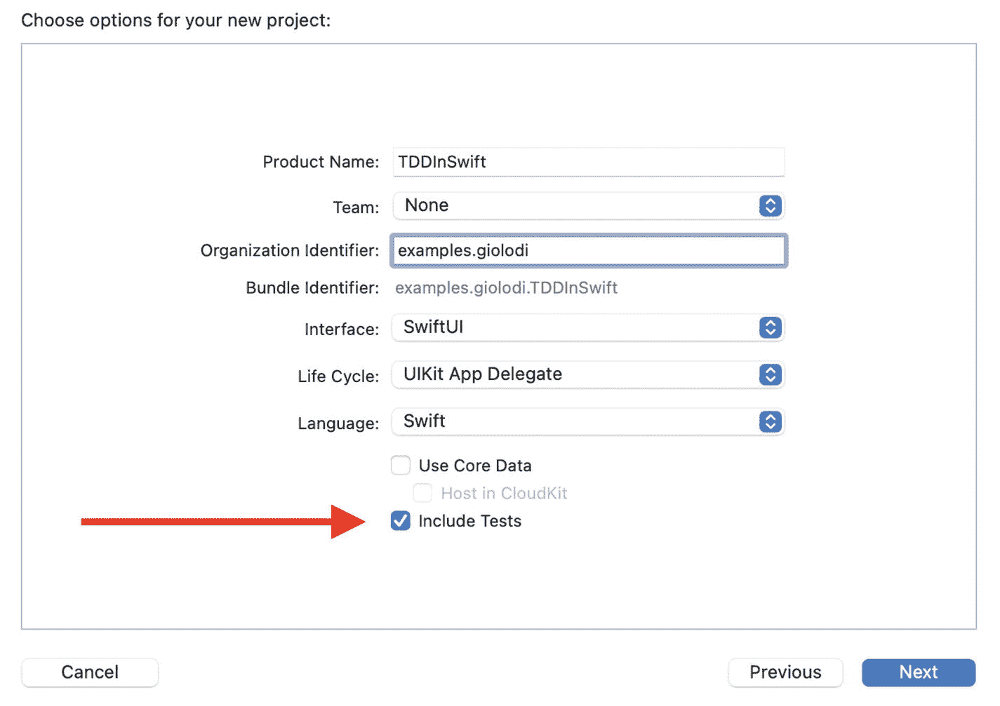
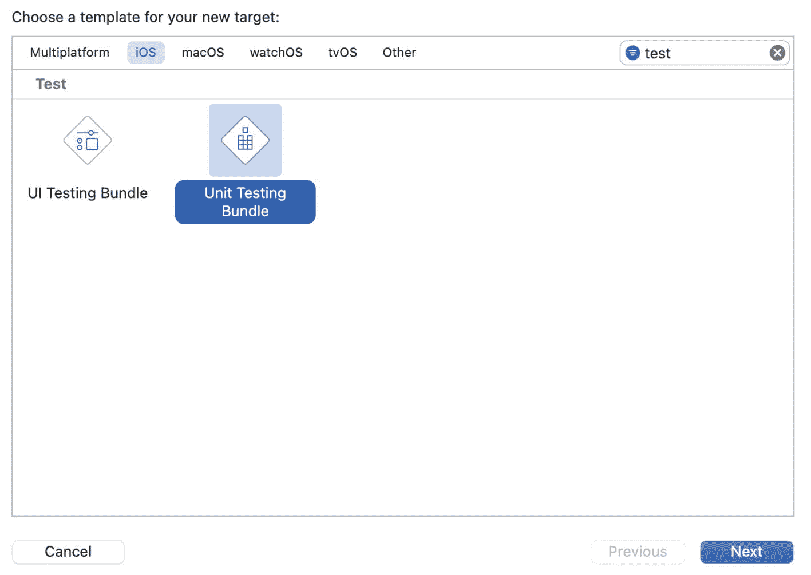
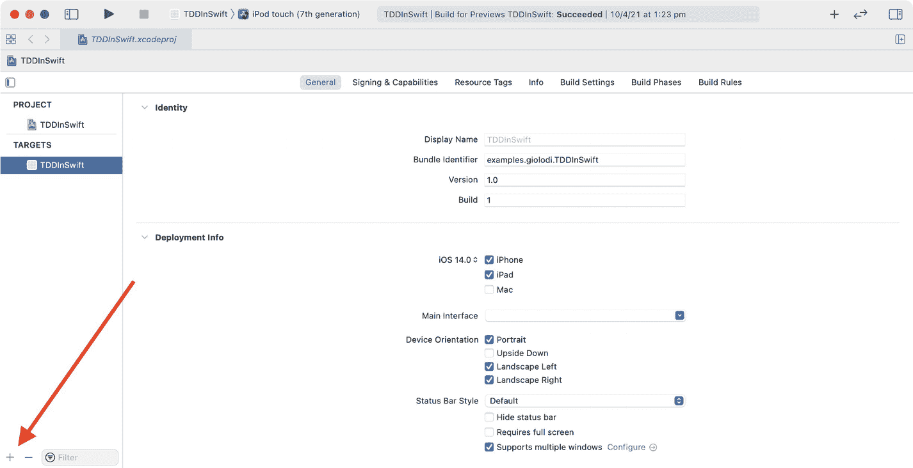

# 2. `XCTest` 简介

在上一章中，我们学习了如何编写测试代码的代码。虽然构建几个辅助函数来完成这项工作很有趣，但为了提高效率和专业性，使用测试库会更好。

一个测试库（在 Swift 术语中称为框架）提供了构建测试、运行测试并收集测试结果所需的脚手架。在 Apple 生态系统中，`XCTest` 是默认的测试框架，它随 Xcode IDE 一起提供。

如果你喜欢在开始使用工具之前先了解它们，那么你会喜欢下面的 `XCTest` 概述。另一方面，如果你迫不及待地想编写一些*真正的*代码，可以随时跳到下一章，需要时再回来阅读。

Swift 开源社区还提供了其他测试框架，但在本书中，我们只专注于使用纯 `XCTest` 编写的测试，因为它是标准的 Apple 技术，无需任何额外设置。无论你是仅使用普通的 `XCTest`，还是通过其他测试库增强设置，测试驱动开发的应用方式都相同。请前往附录 B 了解开源框架 [Quick](https://github.com/Quick/Quick) 和 [Nimble](https://github.com/Quick/Nimble)。

## Xcode 单元测试 Target

`XCTest` 提供了一个与 Xcode 集成的测试工具，使得在 IDE 中运行测试并查看结果变得非常容易。

当你创建新项目时，Xcode 会让你选择是否添加测试。如果选择添加，Xcode 将基于 `XCTest` 为你创建两个额外的 target，一个用于单元测试，一个用于 UI 测试。

图 2-1 展示了在创建新应用时如何添加测试。



图 2-1

Xcode 新应用向导，高亮显示了向项目添加测试 target 的选项

正如我们在上一章中讨论的，单元测试和 UI 测试的区别在于，UI 测试将应用程序作为一个黑盒进行交互，就像用户一样，而单元测试则针对单个组件进行测试。UI 测试有其用武之地，但你不能用它们来驱动软件的实现；要对一个功能进行 UI 测试，你需要已经编写了它的大部分代码。

相反，单元测试 target 中的测试在宿主应用中运行，并且可以访问其源代码中的所有对象和类型。这正是我们编写测试优先并将其用作实现正确性的快速反馈机制所需要的。

在 Xcode 单元测试 target 中，你不仅限于测试对象与被测程序其余部分隔离的场景；你还可以编写集成测试以及任何其他可能需要直接实例化源代码中某些对象的测试，例如快照测试或基于属性的测试。

如果你的应用没有单元测试 target，你可以从项目编辑器添加一个，选择图 2-2 中高亮的按钮。这将弹出一个向导，见图 2-3，让你选择 target 的类型。如果你筛选 "test"，就会找到单元测试和 UI 测试 target 的选项。



图 2-3

Xcode 新建 target 对话框，已筛选项仅显示测试 target



图 2-2

Xcode 项目编辑器，高亮显示了添加新 target 的按钮

现在我们知道了如何为应用添加测试 target，让我们通过将上一章中编写的定制测试转换为 `XCTest` 来充实它。

## `XCTestCase` 和相等性断言

每个测试的起点是 `XCTestCase` 类，它提供了运行测试和报告其结果所需的所有基础设施和钩子。要创建一个新测试，你需要创建 `XCTestCase` 的子类，就像你创建 `UIViewController` 的子类一样：

```swift
import XCTest
class FizzBuzzTests: XCTestCase { }
```

不过，`XCTestCase` 只是测试的容器。要定义测试，你需要向该类添加一个以 "test" 开头的实例方法：

```swift
class FizzBuzzTests: XCTestCase {
    func testFizzBuzzDivisibleBy3ReturnsFizz() { }
    func testFizzBuzzDivisibleBy5ReturnsBuzz() { }
    func testFizzBuzzDivisibleBy15ReturnsFizzBuzz() { }
    func testFizzBuzzNotDivisibleBy3Or5ReturnsInput() { }
}
```

我们可以用 `XCTAssertEqual` 函数替换我们自定义的检查两个 `String` 是否相等的函数：

```swift
func testFizzBuzzDivisibleBy3ReturnsFizz() {
    XCTAssertEqual(fizzBuzz(3), "fizz")
}
```

`XCTAssertEqual` 适用于遵循 `Equatable` 协议的类型，因此你可以将其用于多种类型，而不仅仅是 `String`。

如果值不相等，断言将失败，框架会显示一条消息：

```swift
func testFizzBuzzDivisibleBy3() {
    XCTAssertEqual(fizzBuzz(4), "fizz")
}
// XCTAssertEqual failed: ("4") is not equal to ("fizz")
```

## 其他断言

你会发现自己经常使用 `XCTAssertEqual`，但这并不是该框架提供的唯一断言。

你可以测试 `Bool` 值：

```swift
XCTAssertTrue(true)
XCTAssertFalse(false)
```

你可以测试 `nil` 值：

```swift
XCTAssertNil(nil)
XCTAssertNotNil("this is not nil")
```

有一些断言可用于比较遵循 `Comparable` 协议的类型的值：

```swift
XCTAssertLessThan(1, 2)
XCTAssertGreaterThan(2, 1)
XCTAssertLessThanOrEqual(2, 2)
XCTAssertGreaterThanOrEqual(2, 1)
```

你甚至可以测试某段代码是否会抛出错误：

```swift
XCTAssertThrowsError(try aFunctionThatThrows())
XCTAssertNoThrow(try aFunctionThatThrows())
```


## 解包可选值

Swift 提供了一种名为 `Optional` 的类型，用于封装那些可能为 `nil` 的值。

假设你正在为 `UserRepository` 对象的 `getUserWithId(_:)` 方法编写测试，该方法若找到匹配给定 ID 的 `User` 实例则返回该实例，否则返回 `nil`。因此，该方法的返回类型是 `Optional<User>`，或者等效的简写形式 `User?`：

```
let user: User? = userRepository.getUserWithId(1)
XCTAssertEqual(user?.firstName, "John")
XCTAssertEqual(user?.lastName, "Appleseed")
```

由于 `user` 是`Optional`，上述代码使用后缀可选链操作符 `?` 来访问其属性。如果 `userRepository` 无法找到 ID 为 `1` 的用户，测试将出现两次失败，每个断言各一次。

XCTest 提供了一个特殊的 API，用于尝试解包可选值，并在值为 `nil` 时使测试失败，我们可以用它来改进上述测试：

```
let user: User = try XCTUnwrap(userRepository.getUserWithId(1))
XCTAssertEqual(user.firstName, "John")
XCTAssertEqual(user.lastName, "Appleseed")
```

使用 `XCTUnwrap` 后，如果 `getUserWithId` 返回 `nil`，测试将在此处立即失败。这不仅让问题原因更清晰，而且只出现一次失败而非两次。作为额外好处，省略 `?` 后语法也更简洁。

`XCTUnwrap` 也优于使用 `!` 强制解包可选值。如果测试遇到一个为 `nil` 的强制解包 `Optional`，会导致崩溃。当测试套件中的某个测试崩溃时，整个套件会停止运行，因此你只能获取到崩溃前已执行的测试信息。更重要的是，崩溃测试的错误信息不如失败测试清晰，尤其是在 Xcode 之外运行时。防止你的测试套件因意外发现 `nil` 的 `Optional` 值而崩溃，将有助于更轻松地排查测试失败原因。

## 异步代码的期望

测试异步逻辑需要额外几个步骤。考虑一个通过回调异步计算两个 `Int` 之和的函数：`asyncSum(_ a: Int, _ b: Int, @escaping (Int) -> Void)`。如果我们像之前编写测试那样为 `asyncSum` 编写测试，它会失败：

```
var sum = 0
asyncSum(1, 2) { result in
sum = result
}
XCTAssertEqual(sum, 3)
XCTAssertEqual failed: ("0") is not equal to ("3")
```

失败的原因是：由于 `asyncSum` 是异步的，将求和结果赋值给 `sum` 的回调会在断言**之后**执行。

如果使用同步断言来检查异步代码的行为，代码可能在断言执行之前就已运行，最佳情况下会导致误报，最坏情况下会让你花费大量时间调试行为不一致的测试。

以下是在 XCTest 中测试异步代码的方法：

```
var sum = 0
let expectation = XCTestExpectation(description: "Async sum completed.")
asyncSum(1, 2) { result in
sum = result
expectation.fulfill()
}
// 这段代码等待 `expectation` 被满足（即
// 其 `fulfill()` 方法被调用），超时时间为
// `timeout` 秒。
wait(for: [expectation], timeout: 0.2)
XCTAssertEqual(sum, 3)
```

在运行异步代码之前，你需要实例化一个 `XCTExpectation`，它将异步地被满足。然后你可以指示测试在继续执行之前，等待期望被满足或超时时间到期，之后再运行你的断言。

编写上述测试的更好方式是在回调中直接执行断言。这省去了在回调外部定义变量来保存值的麻烦，使测试更简洁：

```
let expectation = XCTestExpectation(description: "Async sum completed.")
asyncSum(1, 2) { result in
XCTAssertEqual(result, 3)
expectation.fulfill()
}
wait(for: [expectation], timeout: 0.1)
```

由于我们在测试中包含了 `wait`，因此可以保证断言会执行，否则测试会因超时而失败。

需要测试异步代码的常见场景包括网络操作，我们将在第 10 章中看到。

在 WWDC 2021 上，Apple 引入了一种新的编写异步代码的替代方式，即使用 Swift 5.5 中提供的 async/await 模式，适用于目标系统为 iOS 15 或 macOS 12 的应用程序。在撰写本书时，该实现仍处于测试阶段，并且由于操作系统版本要求，发布后只有有限的应用程序子集能够采用它。因此，本书不涵盖 async/await。


## `XCTestCase` 生命周期

关于 `XCTest` 在入门阶段还有一个值得了解的特性，尽管我强烈建议你除非万不得已，否则尽量不要使用它。`XCTestCase` 提供了一些方法，用于在所有测试运行之前或每个测试之前运行代码，以及在所有测试运行之后或每个测试之后运行代码：

```
class LifeCycleExampleTest: XCTestCase {
    override class func setUp() {
        print("This runs before all tests")
    }
    override func setUpWithError() throws {
        print("This runs before each test")
    }
    override func tearDownWithError() throws {
        print("This runs after each test")
    }
    override class func tearDown() {
        print("This runs after all tests")
    }
    func testA() throws {
        print("This is test A")
    }
    func testB() throws {
        print("This is test B")
    }
}
```

这是运行 `LifeCycleExampleTest` 后我们在控制台看到的输出：

```
Test Suite 'LifeCycleExampleTest' started at ...
This runs before all tests
Test Case '-[Tests.LifeCycleExampleTest testA]' started.
This runs before each test
This is test A
This runs after each test
Test Case '-[Tests.LifeCycleExampleTest testA]' passed ...
Test Case '-[Tests.LifeCycleExampleTest testB]' started.
This runs before each test
This is test B
This runs after each test
Test Case '-[Tests.LifeCycleExampleTest testB]' passed ...
This runs after all tests
Test Suite 'LifeCycleExampleTest' passed at ...
Executed 2 tests, with 0 failures (0 unexpected) in 0.003 (0.003) seconds
```

随着代码变得越来越复杂，你可能会倾向于通过在 `setUp` 方法中准备所需组件来简化测试，或者在测试运行后通过 `tearDown` 方法来清理应用状态。

当你的测试设置变得复杂时，这其实是在向你发出信号：软件设计也正在变得复杂。在大多数情况下，使用 `setUp` 和 `tearDown` 并不是保持测试整洁的正确解决方案。

更好的做法是退一步，简化你的设计。例如，将职责过多的对象拆分为两个，或者通过注入配置而不是依赖全局状态来实现。我将在本书中向你展示这些以及其他的技巧。

不过，我认为 `setUp` 和 `tearDown` 在两种情况下是有用的。第一种情况是，在为依赖于全局状态且在修改前没有测试的代码添加测试时。在这里，你应该在对代码进行任何修改之前添加测试，因此生命周期方法有助于开始编写测试。一旦测试就位，你就可以放心地进行重构，消除对全局状态的依赖以及挂钩测试生命周期的需要。

第二种适合使用 `setUp` 和 `tearDown` 的场景是 UI 测试。我们在引言中提到，UI 测试将应用视为一个黑盒：你无法访问单个组件，并且操纵应用的全局状态要困难得多。`setUp` 和 `tearDown` 对于准备应用以执行某些 UI 测试，并在测试后清理其状态非常有用。

`XCTest` 还有更多功能，例如跳过测试、定义执行上下文，或者在 Xcode 中定义多个测试计划，以在不同条件的组合下测试应用。不过，目前的理论知识已经足够了。

现在你已经熟悉了这些工具，是时候使用它们了。在下一章中，我们将了解在 Swift 中使用 `XCTest` 进行测试驱动开发的基础知识。

## 关键要点

*   `XCTest` 是 Apple 提供的用于在 Swift 中编写测试的框架。
*   `XCTest` 中的测试是通过 `XCTestCase` 的子类创建的，方法名以 "test" 开头。
*   `XCTest` 提供了多种用于测试代码的断言函数，例如 `XCTAssertEqual`、`XCTAssertTrue` 和 `XCTAssertFalse`。
*   使用 `XCTUnwrap` 来解包 `Optionals`；如果值为 `nil`，则测试将会失败。
*   要测试异步代码，定义一个或多个 `XCTExpectation`，测试将等待它们，并在异步逻辑中调用它们的 `fulfill()` 方法。
*   使用 `XCTAssertThrows` 测试会抛出错误的代码。
*   使用 `setUpWithError` 和 `tearDownWithError` 在每个测试之前或之后运行逻辑。请谨慎使用这些方法；尽量编写不需要额外设置或清理的测试。
*   使用类方法 `setUp` 和 `tearDown` 在所有测试运行之前或之后运行逻辑。同样要谨慎使用这些方法。

