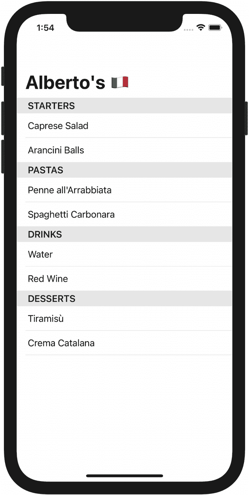

# 4. 真实世界中的测试驱动开发

*如何从使用测试驱动实现像前几章中那样小巧且独立的问题，过渡到构建一个完整的应用程序？*

*通过取巧。与其将应用程序视为一个整体问题，不如将其分解为越来越小的问题。最终，你会达到一个规模，其中每个问题都是小巧且独立的。*

在本章中，我们将开始构建一个真实世界的应用程序，它将在本书中作为我们的实验场。我们将应用*分解问题并顺序解决*技术来识别初始功能集，并决定从哪一个开始。然后，我们将使用测试来驱动第一个核心功能，学习为什么要使用最严格的断言，以及为什么不应该让测试崩溃。

## 菜单点餐应用

Alberto 是你当地意大利餐厅的老板，他雇佣你来构建他的新点餐应用。

你们做的第一件事是定义最小可行功能集。在 1.0 版本中，客户将能够浏览菜单、选择菜品、提交并支付订单。

这个初始版本是最小且精简的，但仍有若干问题需要回答。以下是一些问题，在开发过程中可能还会出现更多：

*   菜单数据来自哪里？
*   顾客如何构建他们的订单？
*   他们如何付款？
*   订单如何发送到厨房？
*   如果出现错误会发生什么？

好消息是，你现在不需要回答所有这些问题！

试图提前回答每个设计问题可能会妨碍架构的有效性。随着软件实现需要答案时，逐一处理每个决策，能让你有更多时间理解需求并发现项目的细微差别。随着你不断开发应用，你会对要解决的问题获得更多背景和经验。这能让你处于更有利的位置，做出最优的设计决策。

如果编写代码有助于产生指导应用设计的理解，那么你应该从编写哪些代码开始呢？

## 从哪里开始？

关于从何处开始构建应用，有几种选择。一种是从最难的事情开始，也就是你学习最多的地方。未知领域是项目风险的主要来源，因此提前处理它们有助于避免后续出现令人讨厌的意外。

你也可以从最容易的事情开始——也就是说，从你已经知道如何做的事情开始。这样做的好处是你能快速启动并建立开发过程的动力。

另一种选择是从能够使后续工作成为可能的事情开始。在我们的应用中，显示菜单正好介于一个直接了当且涉及较少变动的任务，以及作为其他功能的前置条件之间；没有菜单，顾客就无法下单。

从显示菜单开始还有一个优势，那就是我们可以尽早向 Alberto 展示一些成果：一个不完整但可运行的应用版本来展示我们的进展。


## 问题分解与顺序解决

践行测试驱动开发本身就是一种**分解**与**顺序性**的练习。你需要将方法需求分解为一系列测试，并逐一顺序执行。针对每个测试，你都要将**让测试通过**和**清理实现代码**这两个步骤分开。首先编写刚好能让状态变为绿色的必要代码，然后继续优化生产代码。

我将这种方法称为*问题分解与顺序解决*。这个策略具有分形特性；我们可以反复应用它，从宏观的应用整体架构，到微观的单个测试。上一节的设计决策列表，难道不就是构建应用这一高层级任务的分解视图吗？

让我们将“问题分解与顺序解决”应用于应用的起点——显示菜单。将其拆解为需要回答的核心问题：

- 用户界面长什么样？
- 数据从哪里来？
- 数据在 UI 中如何组织？

我们不需要立刻给这些问题一个最终答案。我们关心的是尽快构建出可用的东西，以便从过程中学习。

*用户界面长什么样？* 先用标准 UI 就好；等我们奠定了坚实的功能核心后，再来打磨外观和交互。

*数据从哪里来？* 远程 API（这样数据总是最新）？还是应用内打包的文件？为了显示数据，我们无需现在就决定数据来源：先用一个硬编码的列表即可。

*数据如何组织？* 我们首先仿照实体菜单的做法。菜品按类别分组：开胃菜、意面、饮品和甜品。

通过暂时搁置 UI 和数据源的问题，我们可以完全专注于实现应用内数据组织的核心任务。

不要把推迟给这些问题最终答案的行为与懒惰混为一谈。通过简化问题，我们为自己设定了一个可实现的目标，并能在其上取得具体进展。这样我们就能尽早拿出成果与客户分享。

Henrik Kniberg 将这种方法称为[最早可测试/可用/可爱版](https://blog.crisp.se/2016/01/25/henrikkniberg/making-sense-of-mvp)。假设我们的任务是为用户构建一种高效的交通工具。更好的做法是从一块滑板开始，逐步迭代升级到电动汽车，而不是先造轮子、再造车架……我们可以更快地交付滑板而非汽车。人们可以用滑板移动；而一个孤零零的汽车轮子哪儿也去不了。

另外请注意，这些简化并不会限制系统，反而使其更灵活。通过暂缓决定数据来源，我们为所有可能性都留出了空间。

经过这样的分解过程，我们现在有了“最早可测试版本”的规格：一个用标准列表视图显示按类别分组的硬编码菜单的应用。开始编码吧。

## 构建菜单

假设我们的菜单数据是一个扁平的菜品数组。要按类别排序显示，我们需要一个函数：它接收一个菜品数组，返回一个分区数组，每个分区包含某个单一类别的所有项目。

这个行为是否存在边界情况？

- 如果数组中的所有菜品都属于同一类别，则应当只有一个分区。
- 如果输入数组为空，输出的分区数组也应为空。

让我们在测试目标中创建一个新文件，并将这些需求转化为测试列表：

```swift
// MenuGroupingTests.swift
@testable import Albertos
import XCTest

class MenuGroupingTests: XCTestCase {
    func testMenuWithManyCategoriesReturnsOneSectionPerCategory() {}
    func testMenuWithOneCategoryReturnsOneSection() {}
    func testEmptyMenuReturnsEmptySections() {}
}
```

我们应该从哪个测试开始？如前一章所述，一个有把握让它通过的测试是很好的起点。行为边界通常更简单；“空输入产生空输出”这个测试应该很直接。

从边界向内部推进，也让我们有机会先构建函数骨架，然后逐块铺设组成完整行为的砖块。

我们应该从哪里开始编写测试呢？从行为实现后能通过的断言开始。在这个测试中，我们要断言分区数组为空：

```swift
func testEmptyMenuReturnsEmptySections() {
    // 准备输入：空菜单
    // 对被测系统执行操作，获取输出：分区数组
    XCTAssertTrue(sections.isEmpty)
}
```

`sections` 从何而来？它是我们正在编写的函数的返回值：

```swift
func testEmptyMenuReturnsEmptySections() {
    // 准备输入：空菜单
    let sections = ???
    XCTAssertTrue(sections.isEmpty)
}
```

返回 `sections` 的函数长什么样？它应该接收一个空数组作为输入，其作用是将扁平菜单按类别分组：

```swift
func testEmptyMenuReturnsEmptySections() {
    let menu = [MenuItem]()
    let sections = groupMenuByCategory(menu)
    XCTAssertTrue(sections.isEmpty)
}
```

此时测试已就绪，但无法编译：

```swift
let sections = groupMenuByCategory(menu) // 编译器报错：
// 找不到作用域中的 'groupMenuByCategory'
```

编译器错误提示了我们下一步该做什么：需要定义 `groupMenuByCategory()`：

```swift
func groupMenuByCategory(_ menu: [MenuItem]) -> [MenuSection] {
    return []
}
```

在定义函数的同时，我们也写出了它涉及的类型名称，但由于尚未定义这些类型，代码仍然无法编译。

我使用了第 3 章介绍的*愿望驱动编程*技术，以便更清晰地展示完整的测试驱动流程。

随着你对 TDD 越发熟练，你可以在测试之前就写出空的函数和类型定义，并利用 Xcode 的自动补全功能来略微提速。

编译器报错：

- 找不到作用域中的类型 `MenuItem`
- 找不到作用域中的类型 `MenuSection`

让我们在应用目标中创建专用文件来定义这些类型：

```swift
// MenuItem.swift
struct MenuItem {}

// MenuSection.swift
struct MenuSection {}
```

现在代码可以编译了。使用 `Cmd U` 快捷键运行测试，你会看到它们通过了。

为什么我们没有给 `MenuItem` 或 `MenuSection` 添加任何属性？当然，这些类型需要属性才能有用，但我们应等到出现需要它们的测试时再添加。TDD 推动你小步前进，尽快获得反馈，并且只写刚好够用的代码。

写恰好足够的代码也是防止过度设计的绝佳护栏。因为我们在生产代码之前编写测试，并且只为当前应用所需的行为编写测试，最终的生产代码恰恰正是我们需要的，不多不少。


## 单元测试的严格断言与清晰断言

继续从边界情况向内推进，下一个要处理的测试是：输入项全部来自同一类别：

```swift
func testMenuWithOneCategoryReturnsOneSection() {
    let menu = [???]
    let sections = groupMenuByCategory(menu)
    XCTAssertEqual(sections.count, 1)
}
```

如何构建一个所有菜单项都属于同一类别的输入数组？在测试中，我们可以这样写：

```swift
let menu = [
    MenuItem(category: "pastas"),
    MenuItem(category: "pastas")
]
```

但这段代码无法编译：

```swift
let menu = [
    MenuItem(category: "pastas"),         // Compiler says: Argument passed to call
    // that takes no arguments
    MenuItem(category: "pastas")        // Compiler says: Argument passed to call
    // that takes no arguments
]
```

因为我们的`MenuItem`没有属性，编译器生成的初始化器不接受参数。我们可以通过定义所需的属性来让代码通过编译：

```swift
struct MenuItem {
    let category: String
}
```

现在测试能够编译，但仍然是红色的。是时候第一次尝试返回`MenuSection`数组了。

这个测试的唯一要求是返回值包含一个元素。我们可以简单地使用所有输入的`MenuItem`来创建`MenuSection`数组，等到某个测试要求我们按类别分组时再考虑分组逻辑：

```swift
func groupMenuByCategory(_ menu: [MenuItem]) -> [MenuSection] {
    guard menu.isEmpty == false else { return [] }
    return [MenuSection()]
}
```

现在两个测试都通过了，但你可能会注意到当前行为中有些奇怪的地方：给定一个所有`MenuItem`都属于同一类别的输入数组，我们得到了一个只包含单个`MenuSection`的数组，但这个分段没有任何信息，因为该类型没有属性。从返回值中，我们只能知道输入项数大于零。

我们的目标是在从一个测试推进到下一个测试的过程中，逐步实现*可工作的*实现。目前我们做得还不够。我之所以让大家走到这一步，是因为我使用了不够严格的断言。

## 尽可能使用最严格的断言

在审查单元测试时，一个有用的思维实验是：思考你是否能编写出虽然错误但依然能让测试通过的代码。如果你能做到，那么测试网络中就有了漏洞。

这正是我们目前所处的状态：从测试的角度看代码是正确的，但它并没有实现预期的行为——无论现阶段这个行为多么不完整。

我们如何让测试更严格？给定我们提供的`[MenuItem]`输入，正确的`[MenuSection]`输出应该具有哪些属性？

返回的`MenuSection`应该包含输入`[MenuItem]`中的所有元素。正如我们刚才看到的，仅仅计算数组中的元素个数是不够的；我们还需要一种方法来比较分段中的`MenuItem`，确保它们全部出现在输出中。

我们需要为`MenuSection`添加一个`items: [MenuItem]`属性，并为`MenuItem`添加一个`name: String`属性。我们从一开始就知道需要这些属性，但现在才添加，因为我们终于有了一个可以验证它们的测试。

像往常一样，第一步是在测试中编写我们希望存在的代码：

```swift
func testMenuWithOneCategoryReturnsOneSection throws {
    let menu = [
        MenuItem(category: "pastas", name: "name"),                  // Compiler says: Extra argument
        // 'name' in call
        MenuItem(category: "pastas", name: "other name"),                  // Compiler says: Extra argument
        // 'name' in call
    ]
    let sections = groupMenuByCategory(menu)
    XCTAssertEqual(sections.count, 1)
    let section = try XCTUnwrap(sections.first)
    XCTAssertEqual(section.items.count, 2)                               // Compiler says: Value of type 'MenuSection'
    // has no member 'items'
    XCTAssertEqual(section.items.first, "name")                        // Compiler says: Value of type 'MenuSection'
    // has no member 'items'
    XCTAssertEqual(section.items.last, "other name")                   // Compiler says: Value of type 'MenuSection'
    // has no member 'items'
}
```

在处理编译器错误之前，我们先来看看测试中的断言。

在检查`sections`只包含一个元素之后，我们使用`XCTUnwrap`来获取一个非可选引用，从而避免使用`?`后缀可选链式操作符访问其元素。更多关于`XCTUnwrap`的信息请参见第 2 章。

接下来，我们检查`section.items`是否包含两个元素，也就是说分段包含了输入中的所有元素。

我们本可以就此打住，但为了确保结果不仅包含该类别*所有*的`MenuItem`，而且*只包含*这些菜单项，我们还通过比较它们的名称来验证分段中的项是否与输入一致。

要实现严格的检查，我们需要这两个断言。检查名称可以确保分段包含所有输入的`MenuItem`；检查数量可以确保分段*只包含*给定类别的输入`MenuItem`。

编译器错误都是因为值类型的定义中还没有这些新属性：

```swift
// MenuItem.swift
struct MenuItem {
    let category: String
    let name: String
}

// MenuSection.swift
struct MenuSection {
    let items: [MenuItem]
}
```

这个更改之后，我们又遇到了一个新的编译器错误：

```swift
func groupMenuByCategory(_ menu: [MenuItem]) -> [MenuSection] {
    guard menu.isEmpty == false else { return [] }
    return [MenuSection()]     // Compiler says:     // Missing argument for parameter 'items' in call
}
```

因为我们更新了`MenuSection`的定义，编译器生成的初始化器也发生了变化。让测试通过编译的最简单方法是返回一个空数组：

```swift
return [MenuSection(items: [])]
```

现在我们的测试失败了，错误信息如下：

```
XCTAssertEqual(section.items.count, 2)
// XCTAssertEqual failed:     // ("0") is not equal to ("2")
XCTAssertEqual(section.items.first?.name, "name")
// XCTAssertEqual failed:     // ("nil") is not equal to ("Optional("name")")
XCTAssertEqual(section.items.last?.name, "other name")
// XCTAssertEqual failed:     // ("nil") is not equal to ("Optional("other name")")
```

为了完成这部分行为，只需将输入菜单作为`items`的值即可：

```swift
return [MenuSection(items: menu)]
```

现在我们回到了绿色状态；行为尚不完整，但我们知道它是正确的。

断言的严格程度会影响测试的准确性，因此请记住尽可能深入地进行检查。

## 尽可能使用最清晰的断言

在使用测试断言时，还要注意另一件事：使用哪种断言会影响测试失败信息的可理解性。

考虑以下两个验证相同条件的断言：

```swift
XCTAssertTrue(sections.count == 1)
XCTAssertEqual(sections.count, 1)
```

如果`sections`数组包含多个元素，第一个断言会失败并显示：

```
XCTAssertTrue failed
```

而第二个断言会失败并显示：

```
XCTAssertEqual failed: ("1") is not equal to ("2")
```

你觉得哪一个更能体现出数组数量并非预期？

测试失败的方式是修复失败问题的起点。让测试失败信息越清晰，就越容易找到失败的原因。


### 不要让测试崩溃

我们只需要编写最后一个测试：针对主路径（happy path）行为的测试。

之前的测试帮助我们定义了最终行为的脚手架——即类型和方法签名构成。现在我们可以专注于核心逻辑本身了。

任务是要验证：给定一个包含不同类别条目的数组，该函数应返回每个类别对应的一个分区。为此，我们可以采用与之前测试相同的方法：

```
func testMenuWithManyCategoriesReturnsOneSectionPerCategory() {
let menu = [
MenuItem(category: "pastas", name: "a pasta"),
MenuItem(category: "drinks", name: "a drink"),
MenuItem(category: "pastas", name: "another pasta"),
MenuItem(category: "desserts", name: "a dessert"),
]
let sections = groupMenuByCategory(menu)
XCTAssertEqual(sections.count, 3)
// 我们如何验证每个类别都有一个分区？
}
```

与之前的测试类似，仅仅断言 `sections.count` 等于 `3` 并不足以验证完整的行为。我们如何确保这三个 `MenuSection` 各自持有不同的类别？

`MenuSection` 之间如何区分？`MenuSection` 将用于在视图中渲染每个类别。它应该拥有一个保存类别名称的属性：

```
XCTAssertEqual(sections[0].category, "pastas")                     // 编译器说：'MenuSection' 类型
// 没有成员 'category'
XCTAssertEqual(sections[1].category, "drinks")                     // 编译器说：'MenuSection' 类型
// 没有成员 'category'
XCTAssertEqual(sections[2].category, "desserts")                   // 编译器说：'MenuSection' 类型
// 没有成员 'category'
```

我们是否还应该为每个分区的内容添加断言？这样做会让测试更加彻底，但考虑到我们在之前的测试中已经验证了给定类别的所有条目都属于该类别的分区，这感觉像是重复劳动。如果我们在处理最终实现部分时破坏了这一预期，那个测试会告诉我们。

编译器告诉我们，需要向 `MenuSection` 添加 `category`：

```
struct MenuSection {
let category: String
let items: [MenuItem]
}
```

做了这个更改后，`groupMenuByCategory` 函数现在会编译失败：

```
return [MenuSection(items: menu)]     // 编译器说：
// 调用中缺少参数 'category'
```

为了让编译通过，我们能做的最简单的事情就是放一个硬编码的值：

```
return [MenuSection(category: "", items: menu)]
```

代码可以编译，但测试崩溃了：

```
XCTAssertEqual(sections.count, 3)
XCTAssertEqual(sections[0].category, "pastas")
XCTAssertEqual(sections[1].category, "drinks")    // Xcode 说：
// Thread 1: Fatal error: Index out of range
XCTAssertEqual(sections[2].category, "desserts")
```

当我们的测试崩溃时，我们会丢失有价值的信息。我们目前的代码只返回了一个分区，所以当我们试图访问索引为 `1` 的对象时，程序崩溃，但 Xcode 并没有在 `section.count` 的断言上报告测试失败。虽然崩溃本身可以被视为测试失败，但关于失败的信息越多，就越容易解决它。

为了避免测试中出现索引越界崩溃，我喜欢添加这个用于安全下标访问的扩展：

```
// Collection+Safe.swift
extension Collection {
/// 如果给定索引在范围内，则返回该索引处的元素，否则返回 nil。
subscript(safe index: Index) -> Element? {
return indices.contains(index) ? self[index] : nil
}
}
```

使用安全下标后，如果索引超出范围，我们会得到 `nil`，这会使测试失败但不会崩溃：

```
XCTAssertEqual(sections.count, 3)
// XCTAssertEqual 失败：    // ("1") 不等于 ("3")
XCTAssertEqual(sections[safe: 0]?.category, "pastas")
// XCTAssertEqual 失败：    // ("Optional("")") 不等于 ("Optional("pastas")")
XCTAssertEqual(sections[safe: 1]?.category, "drinks")
// XCTAssertEqual 失败：    // ("nil") 不等于 ("Optional("drinks")")
XCTAssertEqual(sections[safe: 2]?.category, "desserts")
// XCTAssertEqual 失败：    // ("nil") 不等于 ("Optional("desserts")")
```

测试失败告诉我们，我们的代码只返回了一个 `MenuSection`，并且 `category` 值错误。为了让测试通过，我们需要编写按类别将条目分组到分区的生产逻辑。

我们可以使用这个便捷的 `Dictionary` 初始化器，根据给定的标准对 `Array` 的元素进行分组：

```
Dictionary(grouping: menu, by: { $0.category })
```

一旦我们有了一个将 `MenuItem` 按 `category` 分组的字典，我们就可以将每个键值对转换成一个 `MenuSection`：

```
MenuSection(category: key, items: value)
```

`Dictionary` 不保证其键的顺序，因此我们还需要为我们的分区强制执行一个顺序。

很巧的是，Alberto 的菜单类别是按反向字母顺序排列的：starters, pastas, drinks, desserts。我们可以暂时采用这个顺序；如果随着应用开发的推进，出现自定义排序策略的需求，我们到时再添加逻辑。

整合起来

```
func groupMenuByCategory(_ menu: [MenuItem]) -> [MenuSection] {
guard menu.isEmpty == false else { return [] }
return Dictionary(grouping: menu, by: { $0.category })
.map { key, value in             MenuSection(category: key, items: value)         }
.sorted { $0.category > $1.category }
}
```


### 测试命名约定

测试方法的名称应始终反映其验证的行为。由于我们引入了逆字母排序来优化这一行为，因此有必要更新测试名称：

```
func testMenuWithManyCategoriesReturnsAsManySectionsInReverseAlphabeticalOrder()
```

诚然，这是一个*很长的*方法名。命名是编程中最复杂的部分之一，测试也不例外。

使用特定的测试名称能让控制台中的测试输出信息更丰富，有助于在 Xcode 之外（例如在持续集成服务中）进行检查。

XCTest 缺乏对测试描述注释的支持，使得这些描述无法出现在测试输出中，这是一个遗憾。

折中方案是像苹果在 [XCTest 文档](https://developer.apple.com/documentation/xctest/defining_test_cases_and_test_methods) 中提供的少数示例那样，使用不太具体的测试名称，并辅以文档注释：

```
/// 给定一个包含多个类别的菜单，按逆字母顺序返回相应数量的分区
func testMenuWithManyCategories()
```

Swift 文档注释与标准注释不同，因为它以 `///` 开头并支持 Markdown 格式。生成文档的工具会查找以 `///` 开头的注释，而忽略以 `//` 开头的注释。

苹果的做法牺牲了测试输出的清晰度，换取了更简洁的测试方法名称。

另一种选择是采用 Roy Osherove 在《单元测试的艺术》中推荐的流行约定，按照以下公式命名测试：

```
[工作单元名称]_[测试场景]_[预期行为]
```

需要注意的是，XCTest 需要 `test` 前缀来识别一个方法为要运行的测试，因此我们示例中的名称将变为：

```
func test_groupMenuByCategory_MenuWithManyCategories_ReturnsAsManySectionsInReverseAlphabeticalOrder()
```

这比我们刚开始的命名*还要长*！不过，下划线将名称分段，对某些读者来说更容易解析。如果你能接受混合驼峰命名法（`FooBar`）与蛇形命名法（`foo_bar`）的别扭感，这种命名约定可以帮助读者浏览你的测试。

还有一种选择是采用开源库 [Quick](https://github.com/Quick/Quick)，它提供了一个使用字符串描述测试方法的 DSL。附录 B 概述了如何使用 Quick 编写测试。

我们刚刚讨论的每种方案都有其优点和权衡。每个方案可能非常适合某个项目，同时又不适合另一个项目。

在团队中工作时，不同成员可能有不同的偏好风格，但关键是要选择一种并坚持使用。一致性消除了为了理解代码含义而去解析其结构的思维负担，让你的队友和未来的自己都能更快速理解代码。

在本书中，我们将继续使用纯驼峰命名法命名测试方法。这并非对这种风格的评判，而是为了保持测试代码和生成代码的一致性，从而减少我们学习过程中的额外负担。

### 红、绿，别忘重构

现在所有测试都通过了，但我们还没有完成。是时候考虑是否可以改进代码了。

让我们看一下生产代码：

```
func groupMenuByCategory(_ menu: [MenuItem]) -> [MenuSection] {
    guard menu.isEmpty == false else { return [] }
    return Dictionary(grouping: menu, by: { $0.category })
        .map { key, value in MenuSection(category: key, items: value) }
        .sorted { $0.category > $1.category }
}
```

由于我们是在操作序列，因此无需在处理前检查输入是否为空。即使输入空数组，序列操作仍会运行，但不会进行任何实际处理，最终输出一个空数组。

以下是函数的最终版本：

```
func groupMenuByCategory(_ menu: [MenuItem]) -> [MenuSection] {
    return Dictionary(grouping: menu, by: { $0.category })
        .map { key, value in MenuSection(category: key, items: value) }
        .sorted { $0.category > $1.category }
}
```

如果我们重新运行测试，它们仍然会通过。

一旦你建立了单元测试的框架，尝试修改生产代码的实现细节就变得很容易：进行你想要尝试的修改，然后如果测试仍然通过，你就可以确信没有破坏任何东西。

现在我们拥有了一小段纯粹的业务逻辑核心，我们知道它能正常工作，因为在构建它的过程中，我们见证了测试从红色变为绿色。让我们把它和用户界面连接起来。

## 连接用户界面

在 Apple 生态系统中构建应用时，有两种编写 UI 代码的选择：新兴的 SwiftUI 或更早的 UIKit、WatchKit 和 AppKit。你可以在两者之间混合使用，但在本书中，我们将只使用 SwiftUI。

SwiftUI 仍然年轻——当我编写本章时，距离它在 WWDC 2019 上推出还不到两年——但毫无疑问，它将成为我们未来构建用户界面的主要方式。

我们将学习的测试策略也适用于较旧的框架。如果你想知道更多关于 TDD 和 UIKit 的内容，请前往附录 C。

没有直接的方式为 SwiftUI 视图编写单元测试。我们将在第 6 章和第 7 章了解更多关于为什么会出现这种情况，以及为什么我们不必为此担忧。

目前，我们只需要观察到生成视图内容的所有逻辑都已在 `groupMenuByCategory(_:)` 中定义。我们不需要测试来指导实现菜单视图，因为我们要做的只是在 SwiftUI 中描述布局，并将 `groupMenuByCategory(_:)` 的返回值传入。让视图不包含展示或行为逻辑，可以使它们更容易编写，并允许你使用 TDD 在其他地方构建这些逻辑。

以下是视图的实现：

```
// MenuList.swift
import SwiftUI
struct MenuList: View {
    let sections: [MenuSection]
    var body: some View {
        List {
            ForEach(sections) { section in
                Section(header: Text(section.category)) {
                    ForEach(section.items) { item in
                        Text(item.name)
                    }
                }
            }
        }
    }
}
```

为了让 `MenuItem` 和 `MenuSection` 能在 `ForEach` 中工作，我们需要让它们遵循 `Identifiable` 协议：

```
// MenuItem.swift
extension MenuItem: Identifiable {
    var id: String { name }
}
// MenuSection.swift
extension MenuSection: Identifiable {
    var id: String { category }
}
```

最后，我们可以在根 SwiftUI `App` 中将它们整合在一起：

```
// AlbertosApp.swift
import SwiftUI

@main
struct AlbertosApp: App {
    var body: some Scene {
        WindowGroup {
            NavigationView {
                MenuList(sections: groupMenuByCategory(menu))
                    .navigationTitle("Alberto's ")
            }
        }
    }
}
```

```
// 在第一次迭代中，菜单是一个硬编码的数组
let menu = [
    MenuItem(category: "starters", name: "Caprese Salad"),
    MenuItem(category: "starters", name: "Arancini Balls"),
    MenuItem(category: "pastas", name: "Penne all'Arrabbiata"),
    MenuItem(category: "pastas", name: "Spaghetti Carbonara"),
    MenuItem(category: "drinks", name: "Water"),
    MenuItem(category: "drinks", name: "Red Wine"),
    MenuItem(category: "desserts", name: "Tiramisù"),
    MenuItem(category: "desserts", name: "Crema Catalana"),
]
```

在图 4-1 中，你可以看到 SwiftUI 代码在模拟器中的渲染效果。



图 4-1 使用了模拟数据的 SwiftUI 视图在 iPhone 模拟器中的渲染效果


## 纯函数

我们在本章及前一章中研究的函数有两个共同点：

1.  如果使用相同输入调用，每次都会返回相同结果。这是因为它们不会在调用间跟踪内部状态，也不会考虑任何外部状态（例如调用时的时间日期）。
2.  它们没有副作用。无论你调用函数一次、两次还是从不调用，应用状态都不会改变。

具备这些特性的函数在数学意义上等同于函数。因此，我们称它们为*纯*函数。

纯函数是你最好的朋友。因为它们的输出仅依赖于输入（特性 1），所以测试它们只需要一个能产生期望输出的输入。并且由于它们不会改变调用程序的自身状态（特性 2），你可以在测试用例中无需进行任何状态管理的情况下使用它们（参见第[2]章(#501287_1_En_2_Chapter.xhtml)中的“`XCTestCase 生命周期`”）。

不幸的是，我们无法只使用纯函数构建整个应用。在某个时刻，我们不得不与有状态组件（如数据库或网络）进行交互。

尽管如此，我们仍可以尝试将尽可能多的逻辑实现在纯函数中，并只使用一个薄薄的*非纯*层将它们粘合起来。先编写测试的压力恰恰会促使你这样做。

我们构建了一个可运行的应用，却从未在模拟器中启动过它，而是使用测试来获得更快的反馈。

因为我们把问题分解成了小块，现在我们有了一个能独立运行的成果，尽管还远未完成。我们可以将其作为早期进展的标志与客户分享。这使我们能够像处理代码那样，加快与他们的反馈循环。

在下一章中，我们将研究一种技术，以保持测试的清洁和专注，并让我们能够轻松地迭代构成应用的各个类型。

## 关键要点

-   **分解问题并依次解决**：应用由功能构成；功能由协作的对象构成；对象由可独立审视的方法和类型构成。

-   **从边界情况开始构建行为**。这让你能够构建出支撑完整实现的基础。

-   **在测试中使用尽可能严格和清晰的断言**。它们能为你提供更清晰的下一步构建方向指引，并使未来的测试失败分类变得更容易。

-   **不要让测试崩溃**。当测试崩溃时，你会丢失有价值的信息。使用`XCTUnwrap`和安全`Collection`下标访问等技术来避免崩溃。

-   **纯函数易于测试，因为它们没有外部依赖和副作用**。先编写测试有助于你以纯函数的思维进行思考。

-   **保持 SwiftUI 层无行为**。将逻辑从 SwiftUI `View`中分离出来，以便你能利用更快的测试驱动反馈循环来对其进行处理和改进。

