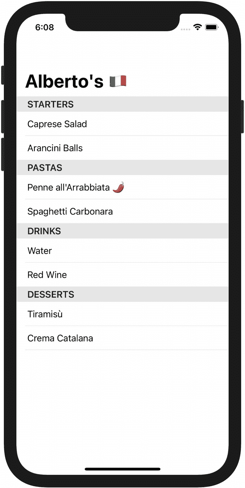

# 6. 测试静态 SwiftUI 视图

*当没有直接的方法来测试 SwiftUI 视图时，你该如何在视图层运用测试驱动开发？*

*通过将所有视图配置逻辑提取到一个专用对象中，并转而测试该对象。*

Xcode 预览和手动测试并非确保视图行为正确的唯一途径。在本章中，我们将学习如何利用测试来指导我们实现视图行为。关键在于让视图变得*谦逊*，剥离所有逻辑，并让它向一个不绑定 SwiftUI 的对象询问显示内容，这样我们就能轻松地以测试优先的方式实现它。我们将这个对象称为 *ViewModel*，并探讨如何为我们的两个视图构建它。

## 视图层呈现逻辑的问题

在上一章中，我们为 `MenuItem` 添加了一个 `spicy` 属性，以开始实现 Alberto 提出的视觉提示需求，用以标识哪些菜品是辣的。该功能 UI 的第一个迭代可以是一个简单的辣椒表情符号：。

我们可能会忍不住在现有的 `MenuList` 代码中添加所需的呈现逻辑，从而将

```
Text(item.name)
```

改为

```
Text(item.spicy ? "\(item.name) 🌶" : item.name)
```

这种方法首先面临一个实际问题：将呈现逻辑嵌入视图层会迅速使其臃肿不堪，难以阅读。添加辣度指示符的代码虽然只有一行，但情况并非总是如此；有时可能需要处理一个枚举进行分支判断，或读取多个值。

即使你不介意臃肿的视图文件，测试这些代码也是问题。截至目前，苹果并未提供直接对 SwiftUI 视图编写单元测试的方法，而是鼓励开发者使用 Xcode 预览进行迭代。

预览虽然是了解布局效果的绝佳反馈机制，但无法像测试那样，以同等精细度告诉你逻辑是否正确。

为 SwiftUI 视图编写测试并不方便，因为我们唯一能检查的出口是其*不透明*（[`opaque`](https://docs.swift.org/swift-book/LanguageGuide/OpaqueTypes.html)）的 `body` 属性。我们可以这样定义一个视图：

```
import SwiftUI
struct ExampleView: View {
var body: some View {
VStack {
Text("Title").bold()
Text("Subtitle")
}
}
}
```

但在运行时访问 `body` 属性时，它实际上是一个非常复杂的对象：¹

```
VStack>(_tree: SwiftUI._VariadicView.Tree<SwiftUI._VStackLayout, ...
```

这看似是一种限制，但该框架的声明式哲学使得使用者无需担心 `body` 的内容。

“视图是状态的函数，而非事件的序列，”苹果的 SwiftUI 工程师 Luca Bernardi 在 WWDC 2019 的演讲 [*SwiftUI 中的数据流*](https://developer.apple.com/videos/play/wwdc2019/226/%253Ftime%253D589) 中解释道。SwiftUI 的单向数据流架构意味着，开发者影响视图的唯一旋钮就是作为输入提供状态。

编写测试来检查视图本身价值不大，因为 body 的运行时值是 SwiftUI 工作方式的实现细节。只要我们遵循框架的规则，就可以相信，如果为视图提供正确的状态，它就会按预期渲染在屏幕上。

**SwiftUI 并未限制可测试性，反而增强了它！** 它使应用 *划分问题并顺序解决* 变得既简单又安全。

## 从视图实现中解耦呈现逻辑

在上述内联方法中，`MenuList` 负责两件事：定义菜单行的布局，以及决定是否为每个菜品添加辣度指示符。它承担了两项职责，也即在解决两个问题。

布局定义是 SwiftUI 领域的问题；`MenuList` 是解决它的最佳位置。然而，评估是否添加 🌶 符号的呈现逻辑没有理由与 SwiftUI 框架绑定：我们可以独立构建它。

让 `MenuList` 既负责定义布局又决定其内容，这会膨胀其“自我认知”。我们最好让它变得*谦逊*²，只处理它最擅长的事情：定义布局。

为了限制 `MenuList` 的野心，我们可以将决定其显示内容所需的逻辑提取到一个专用对象中，并使用 TDD 构建该对象。完成后，我们将让 `MenuList` 向这个新组建询问显示内容。

## 预备重构：缩小工作范围

添加辣度提示是对单个菜单行级别的改动，但我们访问行的唯一途径是 `MenuList`。为了简化工作，让我们重构视图，隔离出需要处理的部分：

```
// MenuList.swift
import SwiftUI
struct MenuList: View {
let sections: [MenuSection]
var body: some View {
List {
ForEach(sections) { section in
Section(header: Text(section.category)) {
ForEach(section.items) { item in
MenuRow(item: item)
}
}
}
}
}
}
// MenuRow.swift
import SwiftUI
struct MenuRow: View {
let item: MenuItem
var body: some View {
Text(item.name)
}
}
```

缩小代码作用范围使得推理和操作都更加容易。

由于我们目前还没有视图的测试，确认这次重构是否成功的唯一方法就是查看 Xcode 预览或启动应用。


## ViewModel

下一步，我们将为 `MenuRow` 编写一个测试，该测试针对一个用于承载展示逻辑的对象。我们应该如何称呼这个对象？

`ViewModel` 是这类对象的一个常见名称。该术语源自 MVVM 模式，该模式用于构建 UI 应用程序，[由微软在 2005 年提出](https://docs.microsoft.com/en-us/archive/blogs/johngossman/introduction-to-modelviewviewmodel-pattern-for-building-wpf-apps)，它代表了“视图的模型，[...] 是视图可用于数据绑定的模型的一种特殊化”。

另一个可选名称是“展示模型”（Presentation Model），如同 [Martin Fowler 所定义](https://martinfowler.com/eaaDev/PresentationModel.html)。我更倾向于使用 `ViewModel`，特别是考虑到 SwiftUI 提供的数据绑定能力——更多内容将在下一章中介绍。

像往常一样，我们从测试列表开始：

```
// MenuRowViewModelTests.swift
@testable import Albertos
import XCTest
class MenuRowViewModelTests: XCTestCase {
func testWhenItemIsNotSpicyTextIsItemNameOnly() {}
func testWhenItemIsSpicyTextIsItemNameWithChiliEmoji() {}
}
```

最应该先处理的最简单场景是什么？是那种我们无需做任何额外工作的场景：

```
func testWhenItemIsNotSpicyTextIsItemNameOnly() {
let item = MenuItem.fixture(name: "name", spicy: false)
let viewModel = MenuRow.ViewModel(item: item)
// 编译器报错：         // Type 'MenuRow' has no member 'ViewModel'
XCTAssertEqual(viewModel.text, "name")
}
```

编译器指出还没有 `ViewModel` 类型。由于 `ViewModel` 与单个视图绑定，使用[嵌套类型](https://docs.swift.org/swift-book/LanguageGuide/NestedTypes.html)可以清晰地表明这种一对一关系。当然，使用独立的 `MenuRowViewModel` 也同样可行。

当使用嵌套类型方法时，我们仍然应该将 `ViewModel` 放在一个专用文件中，以便在使用 Xcode 的“快速打开”功能时更容易找到它：

```
// MenuRow.ViewModel.swift
extension MenuRow {
struct ViewModel {
let text: String
init(item: MenuItem) {
text = ""
}
}
}
```

现在第一个测试可以编译，但由于我们将 `text` 值设置为空字符串而失败。

让我们更新 `MenuRow.ViewModel init` 来让测试通过，修改为：

```
init(item: MenuItem) {
text = item.name
}
```

现在，我们来为添加辣椒表情编写测试：

```
func testWhenItemIsSpicyTextIsItemNameWithChiliEmoji() {
    let item = MenuItem.fixture(name: "name", spicy: true)
    let viewModel = MenuRow.ViewModel(item: item)
    XCTAssertEqual(viewModel.text, "name 🌶")
}
```

测试失败了。我们可以复用在章节开始时使用的三元运算符来让它通过，并完成实现：

```
init(item: MenuItem) {
    text = item.spicy ? "\(item.name) 🌶" : item.name
}
```

我们现在处于绿色通过状态。是否有任何可以重构的地方来改进实现？暂时想不出来，那么让我们继续将 `ViewModel` 连接到它的视图。

## 在视图中使用 ViewModel

是时候更新 `body` 结果构建器来从 `ViewModel` 中读取数据了。这将使视图保持谦逊，将所有展示逻辑委托给它的 `ViewModel` 实例：

```
// MenuRow.swift
struct MenuRow: View {
let viewModel: ViewModel
var body: some View {
Text(viewModel.text)
}
}
// MenuList.swift
struct MenuList: View {
let sections: [MenuSection]
var body: some View {
List {
ForEach(sections) { section in
Section(header: Text(section.category)) {
ForEach(section.items) { item in
MenuRow(viewModel: .init(item: item))
}
}
}
}
}
}
```

图 6-1 显示了带有辣度指示器的菜单列表。



**图 6-1** iPhone 模拟器中渲染的带有辣度指示器的菜单列表

## 超越可测试性

得益于 `MenuRow.ViewModel`，我们实现了条件逻辑，可以在隔离环境中、并在测试反馈的指导下向用户显示辣度的视觉提示。再次强调，我们只需要在实现过程的最后阶段运行应用程序，作为最终检查以确保所有内容都连接在一起。

视图本身仍然没有专用的测试，但其中不太可能出错。因为它没有行为，唯一可能出现的错误是读取了错误的 `ViewModel` 属性，这是一个相对容易发现的问题。

由于 `ViewModel` 已经就位，我们将来可以为 `MenuRow` 的任何新展示细节使用 TDD，而无需额外的设置成本。

解耦还意味着我们可以轻松地调整 UI 布局，因为它已经精简，并且没有冗长的行为代码。

将展示逻辑与布局实现分离，在团队协作时可以实现并行化。根据一个视图的规格说明，两名开发人员可以结对定义其 `ViewModel` 的属性，然后并排工作。一个可以使用 TDD 实现设置这些属性的展示逻辑，另一个可以使用反馈驱动的 Xcode 预览流程来定义 `View` 布局。

我们在 SwiftUI 视图和数据模型之间插入 `ViewModel` 所额外编写的代码，其价值会随着时间的推移而体现。类型是廉价的。在一个由许多高度内聚、松散耦合的小对象组成的代码库中工作，远比处理几个包含所有代码的大型组件要愉悦得多。


## ViewModel 无处不在！

视图模型让我们能够将呈现逻辑与布局定义解耦。将逻辑放在独立对象中，使代码更易于测试和修改，因为它既不依赖 SwiftUI 的实现要求，也不依赖 UIKit 视图的生命周期。

如果你的视图除了一对一显示模型对象的数据之外还有任何其他动作，就应该为其创建一个 `ViewModel`。

我们知道菜单列表视图需要比加载静态分组列表更复杂的行为。在第 4 章分解最小可行功能集时，我们确定菜单可能来自文件或远程 API 等来源。

现在是重构 `MenuList` 以使用 `ViewModel` 的最佳时机。

由于 `MenuList` 显示分组，其 `ViewModel` 应负责生成这些分组。也就是说，`MenuList.ViewModel` 应该暴露一个 `sections` 属性供 `MenuList` 读取，就像 `MenuRow.ViewModel` 为 `MenuRow` 暴露一个 `text` 属性一样。

一种选择是将调用 `groupMenuByCategory` 的责任从 SwiftUI app 的实现转移到 `MenuList.ViewModel`。我们可以更新该函数的现有测试，使其实例化一个视图模型并读取其 `section` 属性，并将测试从 `MenuGroupingTests` 重命名为 `MenuListViewModelTests`。

另一种方法是将菜单分组逻辑移入一个专用对象，然后将其传递给 `MenuList.ViewModel`。这将简化测试 `ViewModel` 的工作：我们只需验证它使用了给定的对象来生成分组。

还有一种方法，也是我想向你展示的，就是使用*函数注入*。由于函数是 Swift 中的一等公民，我们可以将它们用作其他函数的参数。这样，我们可以通过让 `ViewModel` 要求传入一个闭包来生成分组，从而构建一个与分组实现细节无关的 `ViewModel`。

## 依赖注入

在学习软件设计和测试时，最终都会遇到“依赖注入”（Dependency Injection，简称 DI）这个术语。它听起来可能令人生畏，但正如 James Shore [所说](http://www.jamesshore.com/v2/blog/2006/dependency-injection-demystified)，依赖注入是“一个价值 5 美分的概念，却用了个 25 美元的词”。

注入依赖关系，简单来说就是将依赖作为值传递给需要它们的对象或方法，而不是在对象或方法内部自行获取依赖。当一个组件明确要求其所有依赖时，它的接口就变得诚实，代码阅读者不会因为隐藏的副作用而感到意外。

虽然存在允许运行时依赖注入的框架，但它们带有相当大的配置开销，只有在少数情况下才值得投资。

函数注入是 DI 的一种情况，其中依赖关系封装在单个函数中。

以下是利用函数注入编写测试的方法：

```
// MenuList.ViewModelTests.swift
@testable import Albertos
import XCTest

class MenuListViewModelTests: XCTestCase {
    func testCallsGivenGroupingFunction() {
        var called = false
        let inputSections = [MenuSection.fixture()]
        let spyClosure: ([MenuItem]) -> [MenuSection] = { items in
            called = true
            return inputSections
        }
        let viewModel = MenuList.ViewModel(menu: [.fixture()], menuGrouping: spyClosure)
        let sections = viewModel.sections
        // 检查给定的闭包是否被调用
        XCTAssertTrue(called)
        // 检查返回值是否由闭包构建
        XCTAssertEqual(sections, inputSections)
    }
}
```

此测试通过使用“间谍”闭包来检查 `MenuList.ViewModel` 的行为。闭包在调用时设置一个标志并返回一个常量值。然后我们可以通过检查该标志变为 `true` 并且返回值来自该闭包，来断言 `ViewModel` 使用了该闭包生成分组。我们将在第 12 章中进一步讨论代码中的监视（spying）技术。

为了让 `XCTAssertEqual` 在 `[MenuSection]` 上生效，我们需要让 `MenuSection` 和 `MenuItem` 都遵循 `Equatable` 协议：

```
// MenuItem.swift
extension MenuItem: Equatable {}

// MenuSection.swift
extension MenuSection: Equatable {}
```

以下是使测试通过的 `MenuList.ViewModel` 实现：

```
// MenuList.ViewModel.swift
extension MenuList {
    struct ViewModel {
        let sections: [MenuSection]

        init(
            menu: [MenuItem],
            menuGrouping: @escaping ([MenuItem]) -> [MenuSection] = groupMenuByCategory
        ) {
            self.sections = menuGrouping(menu)
        }
    }
}
```

函数注入与 Swift 的默认参数值相结合，意味着生产代码中的调用者无需关心要为 `menuGrouping` 传递什么值。

最后一步是更新 `MenuList` 以使用其 `ViewModel`，并更新 `AlbertosApp` 为 `MenuList` 提供一个 `ViewModel`：

```
// MenuList.swift
import SwiftUI

struct MenuList: View {
    let viewModel: ViewModel

    var body: some View {
        List {
            ForEach(viewModel.sections) { section in
                Section(header: Text(section.category)) {
                    ForEach(section.items) { item in
                        MenuRow(viewModel: .init(item: item))
                    }
                }
            }
        }
    }
}

// AlbertosApp.swift
@main
struct AlbertosApp: App {
    var body: some Scene {
        WindowGroup {
            NavigationView {
                MenuList(viewModel: .init(menu: menu))
                    .navigationTitle("Alberto's ")
            }
        }
    }
}
```

函数注入对于解耦需要协调不同行为的对象与这些行为的具体实现细节非常有用。ViewModel 通常扮演这种协调角色；它们是视图与提供要显示数据的各种业务逻辑组件之间的*粘合剂*。

这种方法现在看起来可能有点大材小用，但一旦 `MenuList.ViewModel` 需要负责协调视图与数据加载逻辑，它就会派上用场。

我们已经看到，使用 ViewModel 模式如何让我们能够将 SwiftUI 视图仅专注于布局，并让纯 Swift 对象负责呈现逻辑。由于 SwiftUI 视图是状态的函数，该框架与 TDD 完美契合。你通过测试优先的方式编写逻辑来提供输入，以保证其正确性，而 SwiftUI 则确保屏幕上的输出保持一致。

本章中构建的 ViewModel 都是静态的，但实际情况并非总是如此。大多数应用程序从一个或多个来源加载数据并用其更新视图。数据和视图都会随时间变化。

Apple 的 Combine 框架提供了优雅地管理随时间变化的数据流的工具，并与 SwiftUI 紧密集成。在下一章中，我们将了解如何演变我们的 ViewModel 来处理应用状态的动态变化。

## 关键要点

- **视图不必同时负责决定*如何*显示数据和*显示什么*数据。** 它可以保持谦逊，只声明布局，同时将呈现逻辑委托出去。
- **使用 `ViewModel` 来容纳所有呈现逻辑。** 通过将其与 SwiftUI 实现分离，你可以像对待其他业务逻辑对象一样使用 TDD。
- **让 `View` 询问 `ViewModel` 要显示什么。** 这使视图仅专注于布局，非常适合利用 Xcode 预览进行快速迭代。
- **使用函数注入将非平凡行为与依赖它的组件隔离开来。** 这让你可以将 `ViewModel` 仅用作协调层，从而更容易为其及其视图添加更多功能。
- **许多各自只做一件事的独立对象，比少数做许多事且相互依赖的对象更容易处理。**


## 尾注

1.  作为参考，这是通过 Xcode 控制台中 `lldb` 的 `po` 命令打印出的 `body` 完整内容：

    ```
    ▿ VStack>
    ▿ _tree : Tree>
    ▿ root : _VStackLayout
    ▿ alignment : HorizontalAlignment
    ▿ key : AlignmentKey
    - bits : 140735441946104
    - spacing : nil
    ▿ content : TupleView
    ▿ value : 2 elements
    ▿ .0 : Text
    ▿ storage : Storage
    ▿ anyTextStorage : 
    ▿ modifiers : 1 element
    ▿ 0 : Modifier
    - anyTextModifier : 
    ▿.1 : Text
    ▿ storage : Storage
    ▿ anyTextStorage : 
    - modifiers : 0 elements
    ```

2.  让难以测试的对象摆脱行为束缚的想法，由 Michael Feathers 在其论文 *The Humble Dialog Box* 中首次提出，随后由 Gerard Meszaros 在 *xUnit Test Patterns*（第 695 页）中将其形式化为 **Humble Object** 模式。

