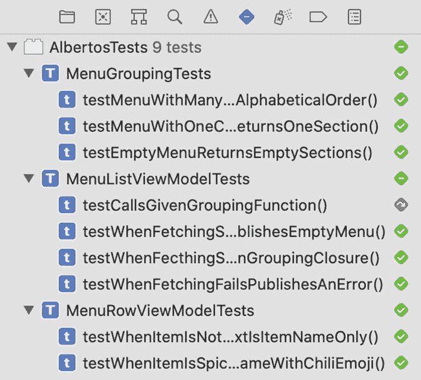
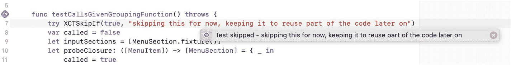

# 测试动态 SwiftUI 视图

*如何测试视图在接收新数据时的更新行为？*

*将更新过程封装在 ViewModel 的* `@Published` *属性中，并使用异步预期进行测试。*

在前一章中，我们看到 SwiftUI 视图难以测试，而解决之道在于绕开它们，将所有展示逻辑迁移到专门的对象——ViewModel 中。当所有展示逻辑都位于 ViewModel 时，你既能测试动态视图，也能测试静态视图。

SwiftUI 和 Combine 能让你在数据可用时无缝更新视图。你可以让 ViewModel 使用 Combine *发布*属性，如果将视图订阅到这些属性，那么每当新值被发布时，SwiftUI 都会触发重新渲染。

由于 SwiftUI 管理视图更新，你只需测试 ViewModel 是否发布了正确的值。

在本章中，我们将探讨如何运用测试驱动开发（TDD）让 ViewModel 通过 Combine 暴露数据，以及如何利用*依赖倒置原则（DIP）*将其与具体数据源解耦。

我们将处理异步代码；如果你需要回顾这种执行模式与我们之前使用的同步逻辑有何不同，请前往第 2 章的“异步代码的预期”部分。

Alberto 喜欢根据当季食材和农产品市场能买到的便宜货频繁更换菜单。你决定从远程 API 读取菜单，这样无需发布新版本应用就能更新菜单。

从远程 API 加载菜单涉及以下步骤：

*   通过 HTTP 从 API 获取数据
*   将 API 响应中的数据转换为应用可理解的格式
*   在用户界面中展示获取到的数据

让我们从 UI 工作开始。其余任务将在后续章节中处理。

从面向用户的层开始，能让我们更快地获得功能的最早可测试版本，这与我们在第 4 章的做法类似。我们可以与 Alberto 共享一个动态加载虚拟数据的应用版本，看看他的想法。如果我们先构建网络组件，就无法与他共享，因为它需要有 UI 才能供用户操作。

我们将编写的代码高度依赖 `SwiftUI` 和 `Combine`。在开始之前，先快速了解一下 `SwiftUI` 中的数据流。

## SwiftUI 与 Combine 如何实现无缝视图更新

`SwiftUI` 与其前身 `UIKit` 和 `AppKit` 的一个主要区别在于，它的视图是不可变的。正如我们在前一章所见，视图是状态的函数，而非事件序列。状态是框架推导视图的唯一数据源。我们的代码无法直接改变视图；我们只能改变应用的状态。仅凭这一特性，SwiftUI 就消除了由视图中状态不一致导致的整类错误。

`SwiftUI` 的不可变性与 `Combine` 的流式处理能力相结合，提供了优雅的方式来保持视图与*流动*的数据同步。

异步操作的工具之一是 `Combine` 的 `Publisher`（发布者）类型，它可以随时间流式传输新值，并且对象可以订阅它。创建 `Publisher` 的一种便捷方式是：获取一个对象，使其遵循 `ObservableObject` 协议，并在其一个或多个属性上使用 `@Published` 包装器。该包装器会生成一个 `Publisher`，每当属性发生变化时，它就会发送一个新值。

而这两个框架之间的集成在此处真正大放异彩：`SwiftUI` 为遵循 `ObservableObject` 的类型提供了一个 `@ObservedObject` 属性包装器。每当 `@ObservedObject` 的 `@Published` 属性发出新值时，`SwiftUI` 就会自动触发视图的重新渲染。

理论已经足够，让我们开始编码吧。


## 使用 `ObservableObject` 让 ViewModel 流式更新

为了让 SwiftUI 能够承担繁重工作，使视图与我们从 API 加载的数据保持同步，我们需要为其提供一个 `ObservableObject`，该对象通过一个或多个 `@Published` 属性来公开数据。

在第 6 章中，我们了解了如何使用 ViewModel 让视图摆脱展示逻辑。ViewModel 是成为视图 `@ObservedObject` 的最佳候选者。这是其职责的自然延伸：从保存供视图读取的静态数据，扩展到保存供视图读取并同步的静态和动态数据。

当从远程 API 获取菜单时，`MenuList.ViewModel` 应该如何表现？以下是一个初步方案：

-   获取开始时，应发布一个空的 `[MenuSection]`。
-   获取成功时，应发布接收到的菜单，并将其转换为 `[MenuSection]` 并进行适当分组。
-   获取失败时，应发布一个错误。

我们可以将这些需求转化为测试列表：

```swift
// MenuList.ViewModelTests.swift
// ...
class MenuList.ViewModelTests: XCTestCase {
    // ...
    func testWhenFetchingStartsPublishesEmptyMenu() {}
    func testWhenFecthingSucceedsPublishesSectionsBuiltFromReceivedMenuAndGivenGroupingClosure() {}
    func testWhenFetchingFailsPublishesAnError() {}
}
```

让我们从最简单的场景开始，为构建实现打下基础：

```swift
func testWhenFetchingStartsPublishesEmptyMenu() {
    let viewModel = MenuList.ViewModel(menu: [.fixture()])
    XCTAssertTrue(viewModel.sections.isEmpty)
}
```

这个测试失败了，如果我们查看 ViewModel 的当前实现，原因显而易见：`MenuList.ViewModel` 尚未获取或发布数据。我们为静态屏幕编写的 `MenuList.ViewModel` 版本使用其 `init [MenuItem]` 参数来生成 `sections`：

```swift
// MenuList.ViewModel.swift
extension MenuList {
    struct ViewModel {
        let sections: [MenuSection]
        init(
            menu: [MenuItem],
            menuGrouping: @escaping ([MenuItem]) -> [MenuSection] = groupMenuByCategory
        ) {
            self.sections = menuGrouping(menu)
        }
    }
}
```

为了让测试通过，我们能做的最简单的事情就是将 `menuGrouping` 应用于空数组的结果赋值给 `sections`：

```swift
// MenuList.ViewModel.swift
extension MenuList {
    struct ViewModel {
        let sections: [MenuSection]
        init(
            menu: [MenuItem],
            menuGrouping: @escaping ([MenuItem]) -> [MenuSection] = groupMenuByCategory
        ) {
            self.sections = menuGrouping([])
        }
    }
}
```

我们刚刚所做的更改是*最简单*的做法，而非*最佳*做法。这是一个小的改动，使我们的新测试通过，建立了一个绿色基线，在此基础上我们可以进行更实质性的改动：移除 `[MenuItem] init` 参数。

新测试可能通过了，但针对原始行为的测试现在失败了。这没关系：我们有意识地改变了该测试所断言的行为，使其过时。当测试过时时，删除它们是合适的。然而，与其删除它，不如暂时跳过它，因为我们稍后可能在测试成功路径时需要用到其中的一些代码：

```swift
func testCallsGivenGroupingFunction() throws {
    try XCTSkipIf(true, "暂时跳过此项，保留它以便稍后复用部分代码")
    // ...
}
```

跳过测试比注释测试更好。对于每个跳过的测试，你会在 Xcode 的测试导航器以及内联通知中看到一条记录。而被注释的测试则不易察觉。被注释的代码容易被遗忘并在代码库中腐化；而跳过的测试则更难被忽略。

图 7-1 和 7-2 展示了 Xcode 如何在代码编辑器中内联显示以及如何在测试导航器中显示跳过的测试。



图 7-2：Xcode 在测试导航器中报告跳过的测试



图 7-1：Xcode 在代码编辑器中内联报告跳过的测试

我们对 ViewModel `init` 的修改使其忽略了 `menu` 和 `menuGrouping` 这两个参数。通常，我会鼓励你在达到绿色状态后，在重构步骤中移除未使用的代码。在这种情况下，我们可以预期在后续实现中会用到这些代码，因此最好保留它们。

我们可以利用绿色测试作为安全防护，对 `MenuList.ViewModel` 进行重构，使其符合 `ObservableObject`。如果在重构过程中，我们的某个更改破坏了行为，测试会告诉我们。

让我们让 `MenuList.ViewModel` 遵循 `ObservableObject`，并将 `sections` 包装在 `@Published` 中：

```swift
// MenuList.ViewModel.swift
import Combine
extension MenuList {
    class ViewModel: ObservableObject {
        @Published private(set) var sections: [MenuSection]
        init(
            menu: [MenuItem],
            menuGrouping: @escaping ([MenuItem]) -> [MenuSection] = groupMenuByCategory
        ) {
            self.sections = menuGrouping([])
        }
    }
}
```

这次更改中有几点需要注意。首先，我们必须 `import Combine`，因为正是这个框架定义了 `ObservableObject` 协议和 `@Published` 属性包装器。

`MenuList.ViewModel` 必须成为一个 `class`，因为 `ObservableObject` 要求遵循它的类型必须是类。

`sections` 属性必须从 `let` 改为 `var`。这是使用 `@Published` 包装的要求。这很合理：被发布的值会随时间变化。

最后，为了确保只有 `MenuList.ViewModel` 内部的代码才能修改 `sections`，其访问级别现在设为 `private(set)`：消费者可以读取它，但不能更新它。

完成这些更改后，测试仍然通过。重构成功了。

现在我们已经将 `MenuList.ViewModel` 配置为一个带有 `@Published` 属性的 `ObservableObject`，是时候开始通过它发布值了。为此，我们还需要编写两个测试：一个用于请求成功的正向路径，另一个用于后端返回错误的失败路径。

我通常建议先处理失败场景，以避免忽视错误处理，因为一旦完成正向路径的实现，很容易就转向下一个功能。然而，在本例中，正向路径与我们已实现的获取开始行为类似：从一个空数组变为包含元素的数组。从这里入手门槛较低，是向前迈进的一小步：

```swift
// MenuList.ViewModelTests.swift
// ...
func testWhenFecthingSucceedsPublishesSectionsBuiltFromReceivedMenuAndGivenGroupingClosure() {
    // 安排 ViewModel 及其数据源
    // 对 ViewModel 执行操作以触发更新
    // 断言预期行为
}
```

编写这个测试的结构引出了两个问题：

-   当我们没有真实的网络组件作为数据源时，如何模拟成功的获取操作？
-   预期行为是 `@Published` 的 sections 会更新；我们如何测试 `@Published` 的值？

让我们先集中讨论如何在菜单获取中模拟接收一个值。


## 依赖倒置原则

为了模拟获取菜单时接收一个值或错误，我们需要一个能首先获取菜单的对象。最终那会是网络组件，但我们尚未构建它。由于我们正在处理获取行为的 UI 侧，构建网络组件就太绕远了；这会拖慢我们的反馈循环。为解决这个先有鸡还是先有蛋的问题，我们需要退一步审视我们的设计。

与其在`MenuList.ViewModel`中期待一个具体的菜单获取类型，不如定义一个抽象并与它交互。在 Swift 中实现这一点的方法是使用`protocol`：

```
// MenuFetching.swift
import Combine
protocol MenuFetching {
func fetchMenu() -> AnyPublisher
}
```

`fetchMenu`方法返回一个`AnyPublisher`，其输出为`[MenuItem]`。Combine 将`AnyPublisher`定义为一种仅供消费的专用`Publisher`；你无法从中`发送`新值，只能订阅。

在《敏捷软件开发：原则、模式与实践》中，罗伯特·C·马丁将这种定义组件间抽象的技术称为**依赖倒置原则**，简称 DIP。

DIP 指出：“高层模块不应依赖低层模块。两者都应依赖抽象。”也就是说，`MenuList.ViewModel`不应依赖执行网络请求的对象，而应依赖菜单获取操作的抽象。在我们的上下文中，这意味着定义一个`protocol`来表示抽象——`MenuFetching`，并让`MenuList.ViewModel`将其作为菜单获取组件所期待的类型使用。

“倒置”一词指的是从该原则提出时面向对象设计方法中使用的依赖关系转变，那时高层模块依赖低层模块。在传统模型中，由于直接依赖，低层模块的变更会要求高层模块也随之变更。“这种困境荒谬至极！”马丁感叹道。“应该是设定政策的高层模块去影响低层的具体模块。包含高层业务规则的模块应优先于并独立于包含实现细节的模块。”

应用依赖倒置在生产代码和测试代码中都会带来积极的实践后果。在生产代码中，我们可以在等待网络组件就绪时，构建一个简单的符合`MenuFetching`协议的对象供 ViewModel 使用。在测试中，我们可以创建一个符合该协议的对象，并用它模拟获取操作的不同结果，以验证 ViewModel 的行为。测试中用于模拟生产对象的对象被称为*测试替身*，我们将在下一章学习它们。

## 依赖倒置 vs. 依赖注入

尽管名称相似，但切记不要混淆依赖*倒置*与*注入*。

依赖倒置原则指出，你应该为组件定义其所依赖的抽象，以便低层组件的变更不会影响使用它的高层组件。

依赖注入则是指让你的对象要求系统内它们需要交互的其他组件的实例，而非在内部创建这些实例。

DIP 和 DI 都能让你的软件设计更灵活，但方式微妙不同：一个涉及对象应如何交互，另一个涉及对象应如何构建。

## 用 DIP 将 ViewModel 与数据获取解耦

我们已经看到，要将 ViewModel 与数据获取实现细节解耦，需要让它依赖`MenuFetching`抽象。我们从生产代码开始实现这一更改。

你可能会问：“为什么不从测试开始？”在实践 TDD 时，你是在优化快速反馈循环。正如我们在第 3 章所见，编译器也是 TDD 工作流的一部分。在这种情况下，从生产代码而非测试开始变更能提供更快的反馈，因为编译器会指出所有需要更新的代码：

```
// MenuList.ViewModel.swift
extension MenuList {
class ViewModel: ObservableObject {
@Published private(set) var sections: [MenuSection]
init(
menuFetching: MenuFetching,
menuGrouping: @escaping ([MenuItem]) -> [MenuSection] = groupMenuByCategory
) {
self.sections = menuGrouping([])
}
}
}
```

如果你尝试使用键盘快捷键`Shift Cmd U`构建应用及其测试目标，你会在`AlbertosApp.swift`中看到一个编译器错误：

```
MenuList(viewModel: .init(menu: menu))
// 编译器报错：
// - Extra argument 'menu' in call
// - Missing argument for parameter 'menuFetching' in call
```

编译器告诉我们`AlbertosApp`需要向`MenuList.ViewModel init`提供一个符合`MenuFetching`的类型实例。

这意味着，为了让应用能编译，我们需要更新 ViewModel 的调用点，为其提供一个`MenuFetching`实例。为此，我们首先需要创建一个符合`MenuFetching`的对象。

正如我们讨论过的，与其提供“真正”的实现，不如快速构建一个占位符，这样我们就能专注于动态更新 UI。由于最终实现也会符合`MenuFetching`，我们可以在它就绪后轻松替换，而`MenuList.ViewModel`毫不知情：

```
// MenuFetchingPlaceholder.swift
import Combine
import Foundation
class MenuFetchingPlaceholder: MenuFetching {
func fetchMenu() -> AnyPublisher {
return Future { $0(.success(menu)) }
// 使用延迟模拟异步获取
.delay(for: 0.5, scheduler: RunLoop.main)
.eraseToAnyPublisher()
}
}
```

[`Future`](https://developer.apple.com/documentation/combine/future) 是 Combine 中一种便捷类型，用于创建“一个最终产生单个值然后完成或失败的发布者”。`Future { $0(.success(menu)) }` 创建了一个发出`menu`然后完成的`Publisher`。`menu`是我们在第 4 章中作为应用第一次迭代的一部分硬编码的全局`MenuItem`数组。

现在我们有了更新源代码中`MenuList.ViewModel`调用点所需的一切：

```
// AlbertosApp.swift
@main
struct AlbertosApp: App {
var body: some Scene {
WindowGroup {
NavigationView {
MenuList(
viewModel: .init(
menuFetching: MenuFetchingPlaceholder()
)
)
}
}
}
}
```

如果再次运行`Shift Cmd U`，你会看到构建仍然失败，但这次是在测试目标中。我们之前没有看到这些错误，因为 Xcode 只会在生产代码构建成功后尝试构建测试目标。

这些新的编译器错误同样是由于`MenuList.ViewModel init`调用未使用`MenuFetching`。我们可以像处理生产代码一样修复它们：使用`MenuFetchingPlaceholder`。

从这样：

```
let viewModel = MenuList.ViewModel(menu: [.fixture()])
```

改成这样：

```
let viewModel = MenuList.ViewModel(
menuFetching: MenuFetchingPlaceholder()
)
```

现在测试可以构建了，如果你运行它们，你会看到它们也通过了。

我们已经建立了抽象层，并且回到了绿色状态：让我们继续前进，实现当菜单获取成功时 ViewModel 如何更新其 sections 的测试。


## 测试 `@Published` 属性的异步更新

我们要验证的是，当菜单获取成功时，由接收到的 `[MenuItem]` 生成的各个 section 会更新 `@Published` 属性值。

当用 `@Published` 包装一个属性时，编译器会为该属性创建一个 `Publisher`。这个 `Publisher` 会在每次属性更新时发布一个新值，你可以通过 `$` 前缀来访问它。因此，测试 `@Published` 属性如何更新，实际上就是测试其 `Publisher` 的行为。

`Publisher` 随时间传输一系列值；它们的行为是异步的。正如我们在第 2 章讨论过的，XCTest 中测试异步代码的主要工具是 `XCTExpectation`。

以下是该测试：

```swift
// MenuList.ViewModelTests.swift
// ...
class MenuListViewModelTests: XCTestCase {
    var cancellables = Set<AnyCancellable>()
    // ...
    func testWhenFecthingSucceedsPublishesSectionsBuiltFromReceivedMenuAndGivenGroupingClosure() {
        var receivedMenu: [MenuItem]?
        let expectedSections = [MenuSection.fixture()]
        let spyClosure: ([MenuItem]) -> [MenuSection] = { items in
            receivedMenu = items
            return expectedSections
        }
        let viewModel = MenuList.ViewModel(menuFetching: MenuFetchingPlaceholder(), menuGrouping: spyClosure)
        let expectation = XCTestExpectation(
            description: "Publishes sections built from received menu and given grouping closure"
        )
        viewModel
            .$sections
            .dropFirst()
            .sink { value in
                // 确保分组闭包接收到了正确的菜单数据
                XCTAssertEqual(receivedMenu, menu)
                // 确保发布的值是分组闭包的执行结果
                XCTAssertEqual(value, expectedSections)
                expectation.fulfill()
            }
            .store(in: &cancellables)
        wait(for: [expectation], timeout: 1)
    }
    // ...
}
```

我们来解析一下这段测试代码。该测试：

1. 像在静态版本测试中一样，设置了一个 spy 闭包。
2. 实例化了 `MenuList.ViewModel`，并向其传递了一个 `MenuFetchingPlaceholder` 实例。这使我们能够模拟菜单获取成功的场景。
3. 定义了一个 `XCTestExpectation` 来测试异步发布行为。
4. 通过 `$` 前缀，访问 ViewModel 中 `@Published sections` 属性的 `Publisher`。
5. 调用 `dropFirst()` 来跳过接收到的第一个值。第一个发布的值是属性定义中设置的默认值。忽略它之后，我们就可以读取下一个到达的值，并检查它是否符合我们的预期，而无需追踪 `Publisher` 发出的多个值，从而简化了测试设置。
6. 使用 `.sink` 将一个订阅者闭包附加到 `Publisher` 流上。
7. 在观察者中，断言 `value` 是 `MenuFetchingPlaceholder` 返回的 `menu`，并且是使用给定的分组闭包构建的，然后满足 `expectation`。
8. 将 `sink` 调用返回的 `AnyCancellable` 存储到一个 `Set` 中。我们需要这样做，以便持有事件流的内存引用，否则，在其有机会发出值之前，其分配的内存就会被释放。

该测试目前会失败，错误信息是“异步等待失败：超过了 1 秒的超时时间，且存在未满足的期望：'Publishes sections build from received menu and given grouping closure'。”为了使测试通过，让我们添加代码来订阅菜单获取器的 `Publisher`，并在新值到达时更新我们的 sections：

```swift
// MenuList.ViewModel.swift
// ...
init(
    menuFetching: MenuFetching,
    menuGrouping: @escaping ([MenuItem]) -> [MenuSection] = groupMenuByCategory
) {
    sections = []
    menuFetching
        .fetchMenu()
        .sink(
            receiveCompletion: { _ in },
            receiveValue: { [weak self] value in
                self?.sections = menuGrouping(value)
            }
        )
        .store(in: &cancellables)
}
```

测试现在通过了。我们只剩下一步：让 `MenuList` 观察这个 ViewModel，以便 SwiftUI 能在数据可用时更新它。这只需将 `viewModel` 属性用 `@ObservedObject` 包装一下即可：

```swift
@ObservedObject var viewModel: ViewModel
```

如果你现在运行这个应用，你会看到它的行为跟之前一样，只有一点小区别：菜单会在屏幕上延迟片刻后出现——准确地说，是 0.5 秒，即我们在 `MenuFetchingPlaceholder` 中设置的值。

当前流程中明显缺少的一个东西是加载状态的管理。没有任何指示表明应用正在加载数据；用户只能盯着一个空白屏幕，直到菜单突然出现。

正确处理加载状态是每个应用必不可少的功能，但为了继续学习新概念，我们在此不会实现它。你可以将其作为练习自行尝试。

一个简单的实现方案可以是：利用菜单数组的内容作为加载状态的代理：如果数组为空，那么应用肯定在等待响应。一个更优雅、更健壮的解决方案是，使用一个 `enum` 来表示视图所有可能的状态（未请求、加载中、加载成功、加载失败）。可以查看 [`RemoteData`](https://github.com/mokagio/RemoteData) 获取这种做法的示例。

## 神秘访客

我们刚刚编写的测试中，有一些不够理想的地方。一个了解上下文较少的读者可能无法立即理解，为什么我们要断言接收到的菜单等于一个名为 `menu` 的全局变量。这个值在测试中就像一个神秘的访客；它从哪里来、为什么在那里，都不是一目了然的。

当测试输入和输出之间的因果关系不够直接时，理解测试就会变得更加困难，而且如果测试失败了，找到失败原因也会更难。你应该避免在测试中出现“神秘访客”，并始终努力为读者提供理解代码所需的所有信息。我们很快就会看到如何消除这个特定的“神秘访客”。

在本章中，我们将*分解问题，逐一解决*的方法应用到了从远程 API 获取菜单并将其加载到屏幕上的任务中。我们选择从更新 UI 的逻辑开始，以便在菜单数据可用时更新界面。我们的实现还很粗糙，也不完整，但它是可行的。这是一个坚实的根基，我们可以在此基础上继续构建。

我们将初期的静态 ViewModel 演进成了从一个异步源获取数据，并利用 SwiftUI 和 Combine 的原生数据流机制将其变更流式传输给使用者的 ViewModel。充分利用这些框架极大地简化了我们的工作，因为我们只需要关注请求数据和转换数据，而它们则负责保持视图的更新。

通过应用*依赖反转原则*，在 ViewModel 和网络层之间定义了一个抽象层，我们在没有真正从网络获取数据的情况下就实现了一个可工作的版本。通过在抽象层背后放置一个网络部分的占位符，我们得以先编写测试，然后实现了 `MenuList.ViewModel` 在 API 返回成功值时的期望行为。

我们还需要处理失败场景。至于如何消除“神秘访客”？这正是我们在下一章要解决的问题。

## 练习时间

我们为 `@Published` 属性编写的测试隐含了一个假设：在默认的初始值之后，只会发布一个值。这是我们期望从远程 REST API 的网络请求中得到的行为：发起一个 HTTP 调用，要么成功，要么失败。

另一方面，`Publisher` 可以随时间发出*多个*值。

为了学习如何处理 `Publisher` 发送的多个值，请尝试在不使用 `dropFirst()` 的情况下重写该测试，并验证接收到的第一个值是空数组，而第二个值符合菜单转换的预期。


## 关键要点

- SwiftUI 和 Combine 通过 `ObservableObject`、`@Published` 和 `@ObservedObject`，让视图在新数据出现时轻松更新。使用这些工具，框架会在每次发布新值时自动更新视图。
- 应用依赖倒置原则，通过抽象层将 ViewModel 与数据获取的实现细节解耦。你可以为 ViewModel 定义一个 `protocol` 来请求数据，而不是使用具体类型。
- 抽象层允许你为尚未准备好的组件提供占位实现。你可以专注于一次构建一个部分，而无需先绕道构建其依赖项。
- 你可以使用 `sink` 和 `XCTestExpectation` 测试 `@Published` 属性的异步更新。通过订阅与 `@Published` 属性关联的 `Publisher`，你可以测试其随时间的变化。
- 使用 `XCTSkipIf(_:, _:)` 代替注释那些你还没准备好删除的测试代码。此 API 会在测试报告中生成一条记录，从而更难忘记代码，并避免因过时注释污染代码库。

