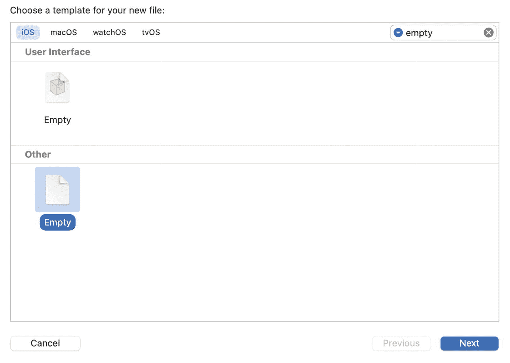
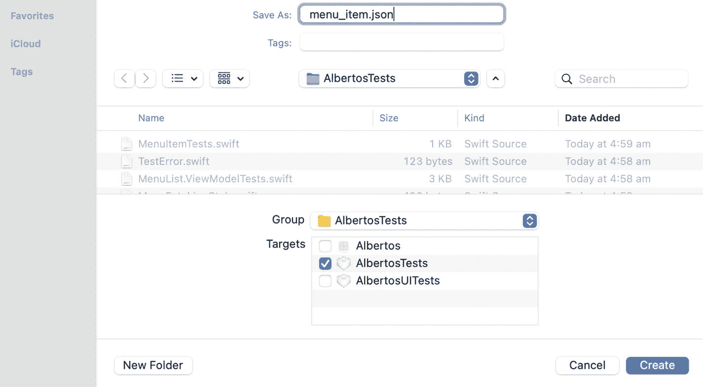

# 9. 测试 JSON 解码

*如何通过测试来驱动编写将 JSON 数据解码为模型对象的逻辑？*

*通过向测试提供预定义的 JSON 输入，并验证解码后产生的值与之匹配。*

Swift 的 `Decodable` 协议提供了一种类型安全的方式来描述如何将 `Data`（例如 HTTP 响应正文中的 JSON）转换为对象或值类型。既然 `Decodable` 承担了大部分繁重的工作，那么使用测试来驱动 JSON 解码逻辑的实现是否值得呢？

当 JSON 对象的键和值的名称与类型直接映射到 Swift 时，实际上并不需要编写任何解码逻辑。在这种情况下，你可能会觉得无需单元测试的帮助，直接编写源代码即可。但如果 JSON 对象结构复杂，或者你希望将其解码为具有不同结构的 Swift 类型，那么测试将助你一臂之力。

是否采用 TDD 来实现 JSON 解码逻辑是一个权衡问题。你在编写测试上多花的时间，是否值得它所带来的反馈？一旦测试就位，它能否防止那些可能被忽略的回归问题？

要回答这些问题，你首先需要知道如何编写这类测试。在本章中，我们将探索两种不同的技术来编写 JSON 解码测试，并进一步思考将 TDD 应用于应用程序这一部分实现的投资回报率。

我们正在稳步推进，让我们的应用程序能够从远程 API 获取菜单。在前面的章节中，我们已经构建了这个新功能的视图部分。现在是时候向技术栈下方再迈进一步，编写代码将网络请求返回的原始 `Data` 转换为 `MenuItem` 领域模型。

Swift 提供了通过 `Decodable` 协议将 `Data` 解码为不同类型的一种便捷方式。我们的任务就是让 `MenuItem` 遵守该协议，并验证解码是否成功。

作为你与 Alberto 应用程序开发协议的一部分，你也在构建他的后端服务。你选择使用一个 REST API，它会以以下形式返回 JSON 菜单：

```
[
{
"name": "spaghetti carbonara",
"category": "pasta",
"spicy": false
},
{
"name": "penne all'arrabbiata",
"category": "pasta",
"spicy": true
}
]
```

我们如何通过 TDD 从那个 JSON 得到 `MenuItem`？一如既往，我们从测试开始。在这个例子中，我们将为解码行为编写一个测试。

编写测试时要问的问题是，如何验证期望的行为是否发生。我们期望的行为是成功的 JSON 解码。为了验证它，我们需要设计一个测试，断言在给定特定 JSON 输入的情况下，解码后的 Swift 对象具有匹配的属性：

```
// MenuItemTests.swift
@testable import Albertos
import XCTest
class MenuItemTests: XCTestCase {
func testWhenDecodedFromJSONDataHasAllTheInputProperties() {
// 安排 JSON 数据输入
// 执行：从 Data 解码一个 MenuItem 实例
// 断言：MenuItem 与输入匹配
}
}
```

如果输入是：

```
{
"name": "a name",
"category": "a category",
"spicy": true
}
```

那么我们的期望应当是：

```
// MenuItemTests.swift
// ...
func testWhenDecodedFromJSONDataHasAllTheInputProperties() {
// 安排 JSON 数据输入
// 执行：从 Data 解码一个 MenuItem 实例
XCTAssertEqual(item.name, "a name")
XCTAssertEqual(item.category, "a category")
XCTAssertEqual(item.spicy, true)
}
```

Swift 的 `JSONDecoder` 是用来从输入的 JSON `Data` 中获取 `item` 实例的类型：

```
// MenuItemTests.swift
// ...
func testWhenDecodedFromJSONDataHasAllTheInputProperties() throws {
// 安排 JSON 数据输入
let item = try JSONDecoder()    .decode(MenuItem.self, from: data)
XCTAssertEqual(item.name, "a name")
XCTAssertEqual(item.category, "a category")
XCTAssertEqual(item.spicy, true)
}
```

我们如何为测试安排 JSON 输入呢？让我们看看两种不同的方法。

## 选项 1：内联字符串

生成 JSON 输入的一种方法是将其定义为测试中的内联 `String`，然后将其转换为 `Data`：

```
// MenuItemTests.swift
// ...
func testWhenDecodedFromJSONDataHasAllTheInputProperties() throws {
let json = #"{ "name": "a name", "category": "a category", "spicy": true }"#
let data = try XCTUnwrap(json.data(using: .utf8))
// 编译器说：实例方法 'decode(_:from:)' 要求
// 'MenuItem' 遵守 'Decodable'
let item = try JSONDecoder().decode(MenuItem.self, from: data)
XCTAssertEqual(item.name, "a name")
XCTAssertEqual(item.category, "a category")
XCTAssertEqual(item.spicy, true)
}
```

编译器指出我们的 `MenuItem` 没有遵守 `Decodable`。让我们来满足这个条件：

```
// MenuItem.swift
struct MenuItem {
// ...
}
// ...
extension MenuItem: Decodable {}
```

现在测试可以构建了。它也已经通过了，因为 `MenuItem` 中属性的名称与 JSON 输入中键的名称匹配，所以编译器为我们处理了所有解码工作。

测试在我们仅添加了遵守某个 `protocol` 而没有编写任何额外代码的情况下就通过了，这引发了一个问题：我们是在测试我们自己代码的行为，还是在测试 `Decodable` 的行为？

正如本章引言中提到的，在某些情况下，使用测试来驱动 JSON 解码实现可能是不必要的开销。我们正在学习如何编写这类测试，以便判断它们何时有用、何时无用。让我们看看“安排”阶段的另一个选项，然后讨论何时适合将 TDD 用于 JSON 解码。


## 选项 2：JSON 文件

为测试提供输入的另一种方式是使用 JSON 文件来保存输入值。

要向测试目标添加 JSON 文件：

1. 在项目导航器中选择测试目标文件夹。
2. 右键点击它，然后点击“新建文件…”或按下 `Cmd N`。
3. 选择“其他”➤“空文件”，然后点击“下一步”或按下 `Enter`。

图 9-1 展示了 Xcode“新建文件…”对话框中的“空文件”选项。



**图 9-1** Xcode“新建文件…”对话框，已筛选为仅显示空文件模板

4. 为文件名添加 `.json` 扩展名，然后选择“创建”或按下 `Enter`。

图 9-2 展示了“新建文件…”流程中的最终对话框，你可以在其中选择文件的名称、位置和目标。



**图 9-2** Xcode 中用于命名文件并将其添加到文件系统和项目目标的对话框

5. 用菜单项的 JSON 数据填充该文件：

```
// menu_item.json
{
"name": "a name",
"category": "a category",
"spicy": true
}
```

或者，你也可以使用你喜欢的文本编辑器创建 JSON 文件，并将其保存到测试目标文件夹中。然后，在 Xcode 中右键点击测试目标文件夹，选择“将文件添加到‘`<测试目标名称>`’…”或按下 `Cmd Alt A`，即可打开文件导航器来选择你的 JSON 文件。

一旦文件成为项目的一部分，你就可以像这样在测试中加载它：

```
// MenuItemTests.swift
// ...
func testDecodesFromJSONData() throws {
    let url = try XCTUnwrap(
        Bundle(for: type(of: self)).url(forResource: "menu_item", withExtension: "json")
    )
    let data = try Data(contentsOf: url)
    let item = try JSONDecoder().decode(MenuItem.self, from: data)
    XCTAssertEqual(item.name, "a name")
    XCTAssertEqual(item.category, "a category")
    XCTAssertEqual(item.spicy, true)
}
```

如果你还没有删除上一个示例中我们编写的源码更改，那么这个测试会立即通过。

通过将文件读取逻辑提取到一个辅助函数中，我们可以让测试代码更整洁。如果你有不止一两个用于模型解码的测试，这会很有用：

```
// XCTestCase+JSON.swift
import XCTest
extension XCTestCase {
    func dataFromJSONFileNamed(_ name: String) throws -> Data {
        let url = try XCTUnwrap(
            Bundle(for: type(of: self)).url(forResource: name, withExtension: "json")
        )
        return try Data(contentsOf: url)
    }
}
```

```
// MenuItemTests.swift
// ...
func testDecodesFromJSONData() throws {
    let data = try dataFromJSONFileNamed("menu_item")
    let item = try JSONDecoder().decode(MenuItem.self, from: data)
    XCTAssertEqual(item.name, "a name")
    XCTAssertEqual(item.category, "a category")
    XCTAssertEqual(item.spicy, true)
}
```

## 该选择哪个选项？

使用内联字符串的优势在于，你可以将输入值与其支持的期望值放在一起。使用 JSON 文件选项时，不清楚“a name”、“a category”和 `true` 来自哪里，唯一确认的方法就是同时检查 JSON 文件。

另一方面，使用 JSON 文件能让测试更整洁。随着输入 JSON 数据的规模增大，内联字符串方法会导致测试方法越来越长，而从文件加载数据的测试则无需更多的输入设置代码。

如果你能够从 API 自动生成 JSON 文件，那么使用 JSON 文件也很有用，这样无需建立完整的端到端集成测试套件，就能确保解码内容是最新的。

如果输入数据变化很大，最终你会有很多 JSON 文件，每种变化对应一个。在这种情况下，通过字符串插值生成输入可能更容易维护：

```
// MenuItem+JSONFixture.swift
@testable import Albertos
extension MenuItem {
    static func jsonFixture(
        name: String = "a name",
        category: String = "a category",
        spicy: Bool = false
    ) -> String {
        return """
        {
        "name": "\(name)",
        "category": "\(category)",
        "spicy": \(spicy)
        }"""
    }
}
```

```
// MenuItemTests.swift
// ...
func testWhenDecodedFromJSONDataHasAllTheInputProperties() throws {
    let json = MenuItem.jsonFixture(name: "a name", category: "a category", spicy: false)
    let data = try XCTUnwrap(json.data(using: .utf8))
    let item = try JSONDecoder().decode(MenuItem.self, from: data)
    XCTAssertEqual(item.name, "a name")
    XCTAssertEqual(item.category, "a category")
    XCTAssertEqual(item.spicy, false)
}
```

选择哪个选项取决于你的领域模型。如果你的 API 有许多实体，且每个实体都有丰富的属性，那么使用文件可能会让你更容易浏览测试套件。

除非你正在基于现有 API 构建应用，并且已经知道自己要处理什么，否则我建议先从内联字符串开始，并优先优化测试的可理解性。

现在我们已经探讨了 JSON 解码测试的*方式*，让我们退一步，看一下*时机*。什么时候 TDD 对实现 JSON 解码有用？


## 测试 JSON 解码值得吗？

视情况而定。与软件开发中的其他事项一样，这涉及权衡取舍。

在我们之前编写的测试中，大部分测试内容都是 Swift 的 `JSONDecoder` 的行为。这段代码我们无法控制，而且由于它来自 Swift 标准库，我们可以安全地假设它能按预期工作。

如果你需要做的仅仅是将 `Decodable` 添加到某个类型遵循的协议列表中，以解码来自 API 的 JSON 数据，那么测试可能不值得。如果你仍想为代码变更提供一道安全防线，可以编写一个更简单的测试，只需确保解码过程不会抛出错误即可：

```
func testWhenDecodingFromJSONDataDoesNotThrow() throws {
let json = #"{ "name": "a name", "category": "a category", "spicy": true }"#
let data = try XCTUnwrap(json.data(using: .utf8))
XCTAssertNoThrow(try JSONDecoder().decode(MenuItem.self, from: data))
}
```

如果你在解码过程中进行了某些非平凡的操作，那么编写一个测试来确保一切工作正常就很有价值了。

例如，假设 JSON 中 `category` 字段对应的是一个对象，而不是一个普通字符串：

```
{
"name": "tortellini alla panna",
"category": {
"name": "pasta",
"id": 123
},
"spicy": false
}
```

要将这个 JSON 解码成我们的 `MenuItem` 对象，我们需要在编译器通过 `Decodable` 为我们合成的代码之外，添加一些额外的代码：

让我们用这个输入更新初始测试，看看会发生什么：

```
// MenuItemTests.swift
// ...
func testWhenDecodedFromJSONDataHasAllTheInputProperties() throws {
let json = """
{
"name": "a name",
"category": {
"name": "a category",
"id": 123
},
"spicy": false
}
"""
let data = try XCTUnwrap(json.data(using: .utf8))
let item = try JSONDecoder()    .decode(MenuItem.self, from: data)
XCTAssertEqual(item.name, "a name")
XCTAssertEqual(item.category, "a category")
XCTAssertEqual(item.spicy, false)
}
```

测试失败，错误信息如下：

```
typeMismatch(
Swift.String,
Swift.DecodingError.Context(
codingPath: [
CodingKeys(stringValue: "category", intValue: nil)
],
debugDescription: "Expected to decode String but found a dictionary instead.", underlyingError: nil
)
)
```

错误信息很密集，但通过阅读，你可以理解解码过程正在为 "category" 键寻找一个 `String`，但实际却得到一个字典。这正是我们修改 JSON 输入后所预期的错误。

一种能使该测试通过的实现方案是引入一个嵌套的私有对象来解码 category，并将其名称转发给 `category` 属性：

```
// MenuItem.swift
struct MenuItem {
let name: String
let spicy: Bool
private let categoryObject: Category
var category: String { categoryObject.name }
enum CodingKeys: String, CodingKey {
case name, spicy
case categoryObject = "category"
}
struct Category: Equatable, Decodable {
let name: String
}
}
// ...
extension MenuItem: Decodable {}
// 这是为了让使用了 // 硬编码菜单的现有代码能够编译。
extension MenuItem {
init(category: String, name: String, spicy: Bool) {
self.categoryObject = Category(name: category)
self.name = name
self.spicy = spicy
}
}
```

对于像本例中这样非平凡的 JSON 结构，我认为测试是一种有用的反馈机制，可以指导解码的实现。

还需要记住的一点是，我们总是在网络请求或其他类型的数据传输过程中调用 JSON 解码；这不是我们可能在 ViewModel 中直接调用的东西。因为 `MenuFetching` 中 `fetchMenu` 的返回类型是 `AnyPublisher<[MenuItem], Error>`，从远程 API 获取菜单的组件也必须将接收到的数据解码为 `[MenuItem]`。只要解码过程没有自定义逻辑，那么如果出现问题，网络组件的测试就会失败。也就是说，测试网络代码会间接地执行 JSON 解码逻辑。

如果你的 API 可以通过很少甚至无需自定义代码就能解码，那么最好直接跳到实现网络代码，省下为解码逻辑编写测试的时间。这是因为 Swift 标准库负责处理解码；测试它不是你的责任。

然而，如果存在一定量的特定解码逻辑，就像前面的例子那样，那么一组有针对性的测试将帮助你实现它，并确保它不会出错。

一个 TDD 纯粹主义者现在可能会抓狂并对我愤怒地尖叫。我怎敢在一本关于测试驱动开发的书中建议不写测试也是可以的？！

**测试驱动开发是一种实践，而非一种生活方式。如果写某些代码的测试优先方法，无论短期还是长期回报都不值得，那么不为其编写测试也是可以的。**

我们已经探讨了何时适合应用 TDD 来编写 JSON 解码逻辑，并看到了几种实现方式。现在是时候通过构建我们功能中的最后一个组件——负责从 API 获取菜单数据的组件——来将这一逻辑付诸实践了。

## 实践时间

我们在本章中看到的 API 响应都是扁平的 JSON 数组，这意味着只要 `MenuItem` 本身遵循了 `Decodable`，我们就可以解码 `MenuItem` 的数组。如果响应是一个对象，你将如何解码 `MenuItem`？例如：

```
{
"items": [
{
"name": "spaghetti carbonara",
"category": "pasta",
"spicy": false
},
{
"name": "penne all'arrabbiata",
"category": "pasta",
"spicy": true
}
]
}
```

## 关键要点

- **测试 JSON 解码逻辑的一种方法是定义一个内联的 `String`，将其转换为 `Data`，并将其作为 `JSONDecoder` 的输入。** 这种方法适用于键较少且需要明确输入值到模型属性关系的输入 JSON。

- **另一种选择是在专门的 JSON 文件中定义输入，并在测试中将其转换为 `Data`。** 这种方法适用于具有许多键的输入对象，但会在输入和最终的 SUT 属性之间增加一层间接性。

- **通过将 JSON 转换为 `Data` 的逻辑提取到辅助函数中，保持测试的整洁性。**

- **如果需要自定义逻辑来遵循 `Decodable`，那么测试 JSON 解码逻辑就是有价值的。** 如果所有模型属性都与输入 JSON 的键匹配，Swift 会为我们处理一切，那么为其编写测试就是多余的。

## 尾注

1. 除了 REST 之外，还有其他用于 API 后端的选项。其中越来越受欢迎的两种是 [GraphQL](https://graphql.org/) 和 [ProtoBufs](https://developers.google.com/protocol-buffers)。两者都为 API 添加了一层类型安全层，你可以（并且应该）利用它来自动生成 API 响应与应用程序领域对象之间的所有转换逻辑。

   ProtoBufs 以一种自定义的、比 JSON 更高效的格式序列化数据。GraphQL 以 JSON 对象响应，但其查询语言脱颖而出。你无需为不同资源设置不同端点，而是通过向 GraphQL 后端发送一条描述所需信息的查询来请求数据。

   在我们这样的小型应用程序中，采用这两种解决方案所带来的开销，远大于我们在可维护性和效率方面能获得的好处。


