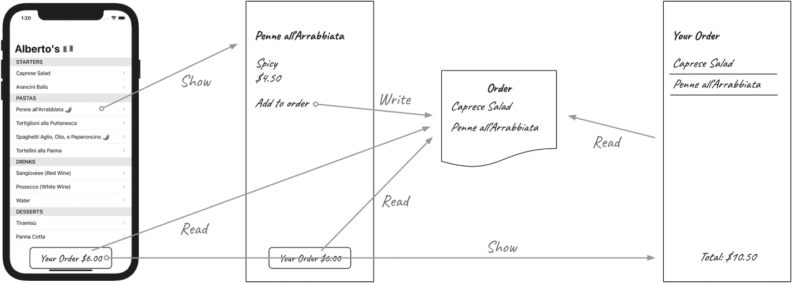
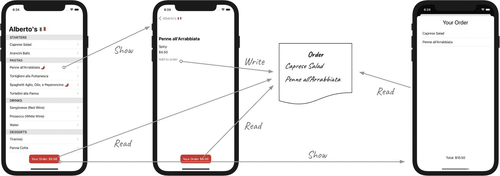

# 使用 `@EnvironmentObject` 注入依赖

*如何在不通过视图层级中所有共同祖先传递的情况下，在 SwiftUI 视图间共享对象的同一实例？*

*通过使用 `@EnvironmentObject` 从环境中（即所有视图所在的上下文）访问它即可。*

在本章中，你将学习如何使用 `@EnvironmentObject` 以可测试的方式在视图间共享业务逻辑组件。

我们的应用正趋近于功能完备。为此，我们需要构建用户界面和业务逻辑，让顾客能够选择菜品并下单。

我们能构建的最早可测试的下单功能是什么？我们可以先从在订单中添加和移除菜品开始，并通过一个只读视图向用户展示其订单，如图 11-1 所示。用户最终将能通过该屏幕提交付款。本章我们先实现订单的构建与展示，将提交功能留到下一章。



图 11-1

下单流程

为了让顾客通过菜单选择菜品来组装订单，我们需要：

* 每个菜单项的详情屏幕，包含价格及将其添加到订单的按钮
* 显示订单摘要的屏幕及提交按钮
* 一个用于保存和更新订单模型的对象

我们从一个负责提供接口并协调订单更新的对象开始，将其命名为 `OrderController`。

`OrderController` 的实现细节（仅接口除外）对本章而言并不重要。我将把使用 TDD 构建它留作你的练习。你可以在本书附带的源代码中找到其一个版本。

以下是 `OrderController` 及其 `Order` 模型的接口：

```
// Order.swift
struct Order {
    let items: [MenuItem]
    var total: Double { ... }
}
// OrderController.swift
import Combine
class OrderController: ObservableObject {
    @Published private(set) var order: Order
    init(order: Order = Order(items: [])) { ... }
    func isItemInOrder(_ item: MenuItem) -> Bool { ... }
    func addToOrder(item: MenuItem) { ... }
    func removeFromOrder(item: MenuItem) { ... }
}
```

你可以在本章附带的源代码中找到 `MenuItemDetail`、`OrderButton` 和 `OrderDetail` 视图及其 ViewModel 的初始版本。

为了访问同一个订单，这些视图需要与 `OrderController` 的同一实例交互。`MenuItemDetail.ViewModel` 将使用 `OrderController` 在订单中添加或移除其菜品，`OrderButton.ViewModel` 用于显示总金额，而 `OrderDetail.ViewModel` 用于读取并显示订单中的菜品。我们需要一种方式在所有组件间共享同一引用。

一种选择是在全局命名空间中定义一个 `static` 实例，或将其作为 `OrderController` 类型本身的 `sharedInstance` 属性。这确实能解决多个对象间共享同一值的问题，但我们该如何为其编写测试呢？

行为依赖于 `OrderController` 所持有的 `Order` 状态：如果所有测试都修改同一个共享实例，那么某个测试留下的订单状态将影响下一个测试的结果。测试会失去隔离性，变得相互依赖。当一个测试执行的操作改变了另一个测试的结果时，测试套件将变得脆弱且难以维护。

要隔离测试每个 ViewModel，我们需要在每个测试中使用不同的 `OrderController` 实例。

正如我们之前讨论过的，*依赖注入*是一种技术：为对象或方法提供其所有依赖项，而无需在其实现中创建这些依赖项。

通过将 `OrderController` 依赖项注入每个 ViewModel，我们将能够隔离测试它们。然后，在实例化 ViewModel 时，我们可以使用 SwiftUI 提供的 `@EnvironmentObject` 属性包装器来访问 `OrderController` 的共享实例。

接下来，让我们通过在新菜单项屏幕上实现添加和移除订单的功能，来看看这在实际中如何运作。


## 依赖注入如何保持每个测试的独立性

以下是测试列表，展示了`MenuItemDetail.ViewModel`应如何通过`OrderController`管理用于更新订单的按钮：

```
// MenuItemDetail.ViewModelTests.swift
// ...
func testWhenItemIsInOrderButtonSaysRemove() {}
func testWhenItemIsNotInOrderButtonSaysAdd() {}
func testWhenItemIsInOrderButtonActionRemovesIt() {}
func testWhenItemIsNotInOrderButtonActionAddsIt() {}
```

我们先从测试 ViewModel 的菜品已在订单中时按钮文本值的用例开始：

```
func testWhenItemIsInOrderButtonSaysRemove() {
    // 准备输入
    // 执行：从 ViewModel 读取按钮文本
    XCTAssertEqual(text, "Remove from order")
}
```

我们正在检查的`text`来自哪里？它来自 ViewModel 的一个属性，这个属性最终会被`View`读取：

```
func testWhenItemIsInOrderButtonSaysRemove() {
    // 准备输入
    let text = viewModel.addOrRemoveFromOrderButtonText()
    XCTAssertEqual(text, "Remove from order")
}
```

`MenuItemDetail.ViewModel`需要一个`MenuItem`来显示，以及一个`OrderController`来检查该菜品是否已在订单中。要得到“Remove from order”文本的状态，需要输入的`MenuItem`是`OrderController`中存储的订单的一部分：

```
func testWhenItemIsInOrderButtonSaysRemove() {
    let item = MenuItem.fixture()
    let orderController = OrderController()
    orderController.addToOrder(item: item)
    let viewModel = MenuItemDetail.ViewModel(item: item, orderController: orderController)
    // 编译器提示：调用中多了参数 'orderController'
    let text = viewModel.addOrRemoveFromOrderButtonText
    XCTAssertEqual(text, "Remove from order")
}
```

让我们用最简代码更新 ViewModel，使测试能够编译通过：

```
// MenuItemDetail.ViewModel .swift
// ...
extension MenuItemDetail {
    struct ViewModel {
        // ...
        let addOrRemoveFromOrderButtonText = "Remove from order"
        private let orderController: OrderController
        // TODO: 在开发 ViewModel 实现期间，
        // 为 OrderController 使用默认值。
        // 完成后将删除该默认值，并从视图中注入。
        init(item: MenuItem, orderController: OrderController = OrderController()) {
            self.item = item
            self.orderController = orderController
            // ...
        }
    }
}
```

注意，我为`OrderController`参数使用了默认值。默认值可以避免我们更新视图以向其 ViewModel 传递正确的值：那是额外的工作，只会延迟反馈循环。更好的做法是专注于 ViewModel，使其正常工作，然后再更新视图。

我还添加了一个以`"TODO"`为前缀的注释，以记录使用默认值所做的折衷。

`TODO`注释是一种在代码库中留下提醒的方式。你可以使用脚本或像[SwiftLint](https://github.com/realm/SwiftLint)这样的工具，添加一个构建阶段运行脚本步骤，为每个`TODO`注释生成警告，这样就不会忘记它们。

在 TDD 流程中，`TODO`很适合给自己留下快速笔记，但在认为工作完成之前，你应该处理掉所有`TODO`。避免向主分支提交包含`TODO`的拉取请求。如果由于超出范围或等待其他事项而无法处理某个`TODO`，则应将其移至项目管理系统：遗留的`TODO`警告会在代码库中产生额外噪音，可能掩盖新的真正警告。

如果现在使用`Ctrl Option Cmd U`快捷键运行`MenuItemDetail.ViewModel`的测试，你会看到测试通过。

建立绿色基线后，我们现在可以重构 ViewModel 实现，使其成为一个`ObservableObject`，并发布其`addOrRemoveFromOrderButtonText`属性，这样当用户向订单添加或移除菜品时，视图会自动更新：

```
// MenuItemDetail.ViewModel.swift
import Combine
extension MenuItemDetail {
    class ViewModel: ObservableObject {
        // ...
        @Published private(set) var addOrRemoveFromOrderButtonText = "Remove from order"
        // ...
    }
}
```

如果使用`Ctrl Option Cmd G`快捷键重新运行测试，可以看到测试仍然通过。不过，这里还没有任何真正的逻辑：属性值是硬编码的。编写菜品不在订单中的测试将迫使我们实现真正的逻辑：

```
// MenuItemDetail.ViewModelTests .swift
// ...
func testWhenItemIsNotInOrderButtonSaysAdd() {
    let item = MenuItem.fixture()
    let orderController = OrderController()
    let viewModel = MenuItemDetail.ViewModel(item: item, orderController: orderController)
    let text = viewModel.addOrRemoveFromOrderButtonText
    XCTAssertEqual(text, "Add to order")
}
```

以下是如何让测试通过：

```
// MenuItemDetail.ViewModel.swift
// ...
extension MenuItemDetail {
    class ViewModel: ObservableObject {
        // ...
        private var cancellables = Set<AnyCancellable>()
        // TODO: 在开发 ViewModel 实现期间，
        // 为 OrderController 使用默认值。
        // 完成后将删除该默认值，并从视图中注入。
        init(item: MenuItem, orderController: OrderController = OrderController()) {
            // ...
            self.orderController.$order
                .sink { [weak self] order in
                    guard let self = self else { return }
                    if (order.items.contains { $0 == self.item }) {
                        self.addOrRemoveFromOrderButtonText = "Remove from order"
                    } else {
                        self.addOrRemoveFromOrderButtonText = "Add to order"
                    }
                }
                .store(in: &cancellables)
        }
    }
}
```

对于视图层中`Button`要执行的操作方法，采用相同的方法：

```
// MenuItemDetail.ViewModelTests.swift
func testWhenItemIsInOrderButtonActionRemovesIt() {
    let item = MenuItem.fixture()
    let orderController = OrderController()
    orderController.addToOrder(item: item)
    let viewModel = MenuItemDetail.ViewModel(item: item, orderController: orderController)
    viewModel.addOrRemoveFromOrder()
    XCTAssertFalse(orderController.order.items.contains { $0 == item })
}

func testWhenItemIsNotInOrderButtonActionAddsIt() {
    let item = MenuItem.fixture()
    let orderController = OrderController()
    let viewModel = MenuItemDetail.ViewModel(item: item, orderController: orderController)
    viewModel.addOrRemoveFromOrder()
    XCTAssertTrue(orderController.order.items.contains { $0 == item })
}

// MenuItemDetail.ViewModel.swift
func addOrRemoveFromOrder() {
    if (orderController.order.items.contains { $0 == item }) {
        orderController.removeFromOrder(item: item)
    } else {
        orderController.addToOrder(item: item)
    }
}
```


### 依赖注入 vs. 直接访问共享实例

使用依赖注入比在 ViewModel 实现中访问共享的 `OrderController` 好在哪里？因为后者会导致每个测试都更新同一个 `Order`，从而将测试结果与前面测试的执行耦合在一起。

为了验证这一点，你可以像这样定义一个共享的 `OrderController` 实例：

```
// OrderController.swift
// ...
class OrderController: ObservableObject {
    static let shared = OrderController()
    // ...
}
```

更新 `MenuItemDetail.ViewModel`，将 `init` 中的参数访问替换为 `OrderController.shared`，从而使用共享实例而非传入的参数。接下来，更新针对按钮动作行为的断言，使其检查共享实例中的值。现在运行测试，你会发现它们全部失败。

你可以通过添加 `setUp` 和 `tearDown` 调用来解决这些失败，在每次测试前将 `OrderController.shared` 恢复到干净状态。另一种选择是对测试进行排序，使得某个测试对 `OrderController` 的更新恰好为下一个测试准备好所需状态。这两种替代方案都需要额外的工作，并且使测试设置更加僵化；使用依赖注入是更好的选择。

依赖注入让你的代码变得诚实。共享实例和单例允许你的对象获取并与其接口未声明的组件进行交互。正如 Miško Hevery 所说，它们让你的 API 变成了一个[*病态的骗子*](https://web.archive.org/web/20190618100426/http:/misko.hevery.com:80/2008/08/17/singletons-are-pathological-liars/)。在允许随意读取全局状态的代码库中，你无法信任调用的方法没有副作用，或者只与其签名中的依赖项协作，除非你检查它们的实现。代码推理变得困难，因为你永远不确定方法是否如其所述，或者背后是否还有更多操作。

TDD 引导你使用依赖注入。如果传入所有依赖项，而不是在实现中访问它们，那么从测试开始编写代码会更容易。这种从"先写测试、快速获得反馈"的需求中涌现出的软件设计，只包含显式依赖，因此更容易推理。

ViewModel 的实现现已完成。是时候将其与视图层连接起来了。

### 使用 `@EnvironmentObject` 进行依赖注入

`MenuItemDetail.ViewModel` 可以独立运行，但正如 `TODO` 注释提醒我们的，它使用的是专用的 `OrderController` 实例，而不是共享实例。我们需要用与应用程序其余部分将使用的相同 `OrderController` 引用来实例化 `MenuItemDetail.ViewModel`。

当用户选择一个菜品时，`MenuList` 负责创建 `MenuItemDetail` 及其 ViewModel，因此它需要传入一个 `OrderController` 实例。`MenuList` 如何获取一个实例呢？我们可以应用相同的思路，让负责创建 `MenuList` 的组件为其提供 `MenuItemDetail` 所需的 `OrderController` 实例。`AlbertosApp` 创建了 `MenuList`，并且由于它是视图层次结构中的顶层元素，我们可以让它构建并持有 `OrderController` 值，以便在应用程序中共享。

正如我们已经讨论过的，这种方法并不理想。在 Alberto 应用相对扁平的视图层次结构中，这看起来还行，但你会看到这是一个滑坡：视图层次结构越深、越复杂，你就需要编写更多代码来向下传递依赖。更重要的是，让 `MenuList` 在其 `init` 中要求一个 `OrderController` 会给人错误的印象，以为它需要使用它，而实际上它只是将其传递下去，从未与之交互。

SwiftUI 的 [`@EnvironmentObject`](https://developer.apple.com/documentation/swiftui/environmentobject) 有助于扩展应用程序，而无需用长长的依赖注入链使视图层次结构臃肿。视图可以使用这个属性包装器从它们的环境中加载一个符合 `ObservableObject` 协议的属性值。我们可以在视图访问它的某个祖先中，使用 [`environmentObject(_:)`](https://developer.apple.com/documentation/swiftui/view/environmentobject%2528_:%2529) 方法将对象注册到环境中。

`@EnvironmentObject` 让我们可以干净地共享对共享对象的访问，而无需将它们传递到视图层次结构的每一层。需要读取或与 `OrderController` 交互的 ViewModel 可以在其 `init` 参数中请求一个引用。实例化它们的视图可以通过 `@EnvironmentObject` 从环境中获取共享实例并提供给它。

让我们开始更新 `MenuItemDetail`，以使用其 ViewModel 中的新逻辑来驱动按钮行为：

```
// MenuItemDetail.swift
import SwiftUI
struct MenuItemDetail: View {
    @ObservedObject private(set) var viewModel: ViewModel
    var body: some View {
        // ...
        Button(viewModel.addOrRemoveFromOrderButtonText) {
            viewModel.addOrRemoveFromOrder()
        }
        // ...
    }
}
```

如果你现在运行应用，点击按钮时会看到"添加到订单"按钮变为"从订单中移除"。再次得益于 TDD，我们在第一次尝试时就得到了一个可工作的应用。

我们继续处理之前遗留的 `TODO` 注释，并移除默认的 `OrderController` 值：

```
// MenuItemDetail.ViewModel.swift
init(item: MenuItem, orderController: OrderController) {
    // ...
}
```

现在编译器无法构建 `MenuList`：

```
// MenuList.swift
var body: some View {
    // ...
    List {
        ForEach(sections) { section in
            Section(header: Text(section.category)) {
                ForEach(section.items) { item in
                    NavigationLink(destination: MenuItemDetail(viewModel: .init(item: item))) {
                        // 编译器说：调用中缺少参数
                        // 'orderController'
                    }
                }
            }
        }
    }
}
```

让我们从环境中获取一个 `OrderController` 的引用，并用它来实例化 ViewModel：

```
// MenuList.swift
// ...
@EnvironmentObject var orderController: OrderController
var body: some View {
    // ...
    List {
        ForEach(sections) { section in
            Section(header: Text(section.category)) {
                ForEach(section.items) { item in
                    NavigationLink(destination: destination(for: item)) {
                        // ...
                    }
                }
            }
        }
    }
}

func destination(for item: MenuItem) -> MenuItemDetail {
    return MenuItemDetail(viewModel: .init(item: item, orderController: orderController))
}
```

应用现在可以编译了，但如果你运行它，会看到它崩溃：

- 致命错误：未找到类型为 `OrderController` 的 `ObservableObject`。作为此视图的祖先，可能缺少 `View.environmentObject(_:)` 的调用以提供 `OrderController`。


### `@EnvironmentObject` 的缺点

我们刚刚收到的崩溃信息清楚地指出了问题所在：我们没有在 `MenuList` 的祖先视图上调用 `environmentObject(_:)`。当 SwiftUI 运行时试图访问 `OrderController` 属性时，未能找到它，从而导致崩溃。

发生崩溃的可能性是使用 `@EnvironmentObject` 的一个缺点。如果你忘记调用 `environmentObject(_:)`，或者有人不小心移除了一个现有的调用，应用就会崩溃。

不过在实践中，你不太可能交付一份没有为每个 `@EnvironmentObject` 注册对应值的代码。这种类型的崩溃在你手动测试已完成功能时就会立即被发现。

你*可以*采用另一种方式来创建 ViewModel，即在不使用 `@EnvironmentObject` 的情况下传递它们的依赖。例如，你可以使用一个 ViewModel 工厂对象，该对象负责实例化并持有所有依赖，视图可以从中获取预构建的 ViewModel。不过，这种选择需要额外的工作，并且会“对抗”框架本身。

`@EnvironmentObject` 是一个好用得让人无法不用的 API。

此外，这种崩溃只可能因开发者错误而发生。正如我们在第 10 章中关于对硬编码字符串调用 `URL(string:)` 的返回值进行强制解包的讨论一样，开发阶段的早期崩溃是发现开发者错误的一种可接受方式。

与其使用不同的依赖注入策略，你更应该投资于自动化和流程，来捕获缺失的 `environmentObject(_:)` 调用。

让应用正常工作的最后一步是在视图环境中注册一个 `OrderController`。最佳的位置是在根视图组件中：

```swift
// AlbertosApp.swift
import SwiftUI @main
struct AlbertosApp: App {
    let orderController = OrderController()
    var body: some Scene {
        WindowGroup {
            NavigationView {
                MenuList(
                    viewModel: .init(
                        menuFetching: MenuFetcher()
                    )
                )
                .navigationTitle("Alberto's ")
            }
            .environmentObject(orderController)
        }
    }
}
```

### `@EnvironmentObject` 与直接访问共享实例

在视图的实现细节中，使用 `@EnvironmentObject` 看起来与访问一个共享实例非常相似。

区别在于 `@EnvironmentObject` 被限制只能用于 SwiftUI 视图；如果你尝试在非视图类型的类型上通过这个属性包装器访问一个值，应用将会崩溃。在我们基于测试驱动开发的 SwiftUI 方法中，视图是薄层组件，不包含任何展示逻辑。虽然使用 `@EnvironmentObject` 确实能让它们在底层访问某些值，但它们仅用这些值来初始化其子视图的 ViewModel。

除此之外，请记住我们需要通过 `environmentObject(_:)` 在环境中显式注册对象。如果你在你的 `App` 实现中注册了所有共享对象，那么总会有一个单一的位置可以去查看和发现环境中所有可用的内容。相比之下，并没有直接的方法可以了解有多少个共享实例属性可用，以及应用实际访问了多少个。

随着我们应用的成长，视图和业务逻辑组件的数量也会随之增长。许多独立的小型视图组件在单独处理时更舒适，但这也会导致视图层级变得深且复杂。通过这样的层级结构手动传递视图完成其工作所需的每一个依赖会变得繁琐且难以维护。

`@EnvironmentObject` 为视图提供其依赖的方式既干净又易于维护，无论它们在层级结构中处于多深的位置。

菜单项详情屏幕现已完成。图 11-2 展示了图 11-1 中的订单流程，其中新屏幕已替换了原来的占位符。



图 11-2：使用正式界面的应用内订单流程

更新其余视图的过程类似，所以我将把它留作练习给你。在本章中，我们为用户提供了组合订单的方式；在下一章中，我们将让他们能够进行支付。

## 练习时间

一旦订单状态发生变化，`OrderButton` 和 `OrderDetail` 都应该反映这一变化。当顾客未选择任何东西时，`OrderButton` 的文本应为 "Your Order"；当订单中有商品时，文本应为 "Your Order $ `<订单总额>`"。`OrderDetail` 中的菜品列表和总价摘要也应反映订单状态的变化。

为此，两个 ViewModel 都应该期望接收一个 `OrderController` 引用，并用它来读取这些信息。

请使用 `@EnvironmentObject` 注入方法来实现。

## 关键要点

-   **使用依赖注入将同一个对象共享给不同组件，而不是让它们在内部访问一个共享实例。** DI 通过使所有依赖关系显式化，让你的代码更易于测试和推理。
-   **在 SwiftUI 视图中使用 `@EnvironmentObject` 来获取共享资源的引用。** 这个属性包装器允许你将依赖注入到层级结构深处的组件，而无需通过所有祖先视图传递它们。
-   **实例化子视图 ViewModel 的视图可以使用 `@EnvironmentObject` 为其提供依赖。**


