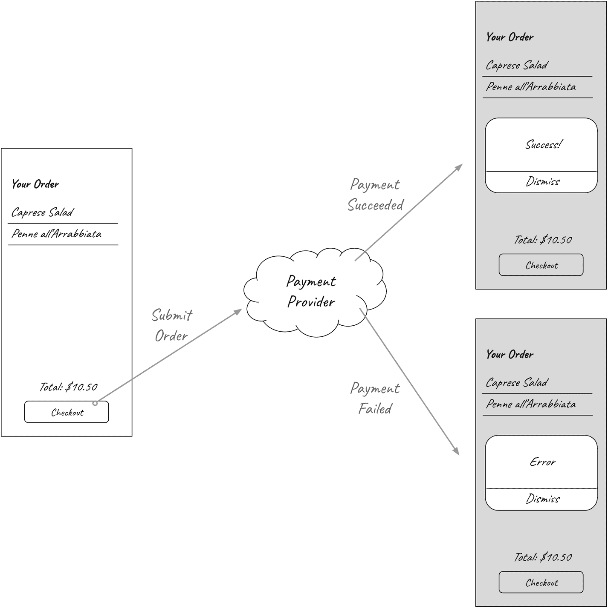

# 12. 测试副作用

*如何为一个不返回输出、而是改变另一个对象状态的系统编写测试？*

*通过* *监视* *受被测系统影响的对象。*

如果你能控制发生副作用的对象，你可以检查它的状态以验证是否符合预期，但如果不能呢？例如，你如何验证一个对象在特定操作后调用了第三方 SDK 的方法？

本章介绍一种新的测试替身，它允许我们精确地做到这一点：*间谍*。使用间谍，你可以将被测系统的真实依赖替换为一个能够记录它收到哪些方法调用以及传递给它们的参数的依赖，这样你就可以断言交互是否按预期发生。

自从接手 Alberto 的应用开发以来，我们已经取得了长足的进步。一次一个测试，我们从显示硬编码菜单的应用，发展成为能够从远程 API 加载菜单并允许顾客选择他们想要订购的菜肴的应用。

最后的拼图是提交订单并支付。图 12-1 显示了支付流程：当用户点击结账按钮时，应用向处理支付并将订单排入厨房队列的远程服务提交订单。当服务完成时，应用通知用户结果。使用警报是在屏幕上显示结果的一种简单方式。这是“分解问题并顺序解决”技巧的一个应用。首先，构建流程的一个可用版本，然后你可以迭代并优化其用户体验。



图 12-1

支付流程

管理支付是出了名的困难：有必要的安全措施，以及用户期望从一开始就能使用的不同供应商。作为一个单人团队，你决定将管理支付的责任外包给第三方服务。

你选择的提供商 Hippo Payments 提供了一个 Swift SDK，用于将所有支付作为黑盒管理；你调用它，它负责身份验证、供应商选择和订单履行。

以下是 Hippo Payments SDK 接口：

```
class HippoPaymentsProcessor {
    init(apiKey: String)
    func processPayment(
        payload: [String : Any],
        onSuccess: @escaping () -> Void,
        onFailure: @escaping (HippoPaymentsError) -> Void
    )
}
```

我们可以在 `OrderDetail` 视图中添加一个按钮，当点击该按钮时，会触发支付流程，最终调用 SDK 的 `processPayment`。

此行为的测试列表包含一个测试：

```
// OrderDetail.ViewModelTests.swift
// ...
func testWhenCheckoutButtonTappedStartsPaymentProcessingFlow() {}
```

实现方式可以类似于我们为用户交互所做的：将 SDK 实例传递给 `OrderDetail.ViewModel`，并公开一个方法供 `OrderDetail` 用作按钮操作，其中包含调用 SDK 的逻辑。

当结账按钮操作在 `HippoPaymentProcessing` 中不会导致任何可见状态更改时，我们如何测试它启动了支付流程？

让我们更新 `OrderDetail.ViewModel` 的初始化方法，使其期望一个 `HippoPaymentsProcessor`，看看是否能给我们一些提示。尝试是解决编码问题摆脱困境的好方法。我们全面的测试套件赋予我们在代码库中进行尝试的自由和信心。

## 第三方依赖与其他所有依赖相同

以下是 ViewModel 包含 `HippoPaymentsProcessor init` 参数和属性时的样子：

```
// OrderDetail.ViewModel.swift
import Combine
import HippoPayments
extension OrderDetail {
    struct ViewModel {
        // ...
        private let paymentProcessor: HippoPaymentsProcessor
        // ...
        // TODO: 仅为使代码编译通过而使用 HippoPaymentsProcessor 的默认值。
        // 完全集成后将移除它。
        init(
            orderController: OrderController,
            paymentProcessor: HippoPaymentsProcessor = .init(apiKey: "A1B2C3")
        ) {
            self.paymentProcessor = paymentProcessor
            // ...
```

如果你不知道 `HippoPaymentsProcessor` 来自不同的 Swift 模块，你会说它与 `OrderController` 有什么不同吗？

从 `OrderDetail.ViewModel` 的角度来看，第一方和第三方依赖没有区别：它们都是外部对象。

第三方依赖与第一方依赖或 Apple 框架没有区别，依赖注入原则同样适用于它们。如果第三方依赖与其他依赖没有区别，那么我们可以应用相同的策略来测试与它们交互的代码：定义一个抽象层并构建一个测试替身。

## 抽象化第三方依赖的好处

抽象化第三方依赖特别有益，因为它使从一个供应商迁移到另一个供应商变得更容易。如果你能将特定供应商的实现细节抽象到特定于你领域的 `protocol` 之后，那么采用不同的选项只需使其同样符合该 `protocol` 即可。

另一个优点是，由于你可以控制抽象层的外观，因此可以使第三方依赖适应你的代码库风格。`HippoPaymentsProcessor` 为成功和失败处理程序有两个闭包参数，但代码库使用 Combine 的 `Publisher` 来管理异步工作。我们可以使用我们喜欢的人体工程学来定义我们的抽象层，然后扩展 `HippoPaymentsProcessor` 以使其符合该抽象层。

## 为第三方依赖构建包装器

```
// PaymentProcessing.swift
import Combine
protocol PaymentProcessing {
    func process(order: Order) -> AnyPublisher
}
```

为了使 `HippoPaymentsProcessor` 符合 `PaymentProcessing`，我们可以使用 Combine 的 `Future` 类型：

```
// HippoPaymentsProcessor+PaymentProcessing.swift
import Combine
import HippoPayments
extension HippoPaymentsProcessor: PaymentProcessing {
    func process(order: Order) -> AnyPublisher {
        return Future { promise in
            self.processPayment(
                payload: ???,
                onSuccess: { promise(.success(())) },
                onFailure: { promise(.failure($0)) }
            )
        }
        .eraseToAnyPublisher()
    }
}
```

`payload` 值应该用什么？假设 SDK 文档说明它应该是一个字典，包含订单中所有项目名称的数组，键为 `"items"`：

```
[ "items": [ "Arancini Balls", "Penne all'Arrabbiata" ] ]
```

我们需要一个测试来指导我们实现 payload 逻辑。我们无法直接为 `HippoPaymentsProcessor` 编写测试，所以让我们在我们控制的地方构建这个功能：

```
// Order+HippoPayments.swift
extension Order {
    var hippoPaymentsPayload: [String: Any] { [:] }
}
```

我们可以对这个逻辑使用 TDD，我将把它留作练习。

现在，让我们更新 `OrderDetail.ViewModel`，使其期望一个符合 `PaymentProcessing` 的类型，而不是具体的 `HippoPaymentsProcessor` 实例。这样做是依赖倒置原则的一个应用——我们使不同的组件依赖于抽象而不是具体类型：

```
// OrderDetail.ViewModel.swift
extension OrderDetail {
    struct ViewModel {
        // ...
        // TODO: 仅为使代码编译通过而使用 HippoPaymentsProcessor 的默认值。
        // 完全集成后将移除它。
        init(
            orderController: OrderController,
            paymentProcessor: PaymentProcessing = HippoPaymentsProcessor.init(apiKey: "A1B2C3")
        ) {
            // ...
```

多亏了依赖倒置，我们现在可以构建一个测试替身来验证结账按钮操作启动了支付流程。


## 间谍测试替身

我们如何验证点击结账按钮会启动 `OrderDetail.ViewModelTests` 中的支付流程？

我们无法访问 `HippoPaymentsProcessor` 来检查其状态或是否向其后端发送了请求。此外，我们在第 10 章已经讨论过在测试中发出真实网络请求的弊端。我们也没有办法检查应用程序状态的变化，因为我们是隔离测试 `ViewModel` 的。我们*可以*做的是利用我们创建的抽象作为接缝（seam），从而在测试中插入我们可以控制的内容。

我们可以编写一个符合 `PaymentProcessing` 协议的测试替身（Test Double），它能够记录对启动流程的方法的调用，以便我们后续进行检查：这就是*间谍（Spy）*。Spy 这个名称指的是替身“暗中监视”消费者如何调用依赖项：

```
// PaymentProcessingSpy.swift
@testable import Albertos
import Combine
class PaymentProcessingSpy: PaymentProcessing {
private(set) var receivedOrder: Order?
func process(order: Order) -> AnyPublisher {
receivedOrder = order
return Result.success(()).publisher.eraseToAnyPublisher()
}
}
```

我们可以编写一个使用该 Spy 来验证期望行为的测试：

```
// OrderDetail.ViewModelTests.swift
func testWhenCheckoutButtonTappedStartsPaymentProcessingFlow() {
// 创建一个 OrderController 并向其中添加一些商品
let orderController = OrderController()
orderController.addToOrder(item: .fixture(name: "name"))
orderController.addToOrder(item: .fixture(name: "other name"))
// 创建 Spy
let paymentProcessingSpy = PaymentProcessingSpy()
let viewModel = OrderDetail.ViewModel(
orderController: orderController,
paymentProcessor: paymentProcessingSpy
)
viewModel.checkout()
XCTAssertEqual(paymentProcessingSpy.receivedOrder, orderController.order)
}
```

为了让测试通过，我们只需要在视图模型中调用 `process(order:)` 方法：

```
// OrderDetail.ViewModel.swift
func checkout() {
paymentProcessor.process(order: orderController.order)
}
```

测试通过了，但 Xcode 会给出一个警告：“Result of call to ' `process(order:)` ' is unused。” 这是一个很好的提醒：即使我们发起了处理订单的调用，我们并没有将结果告知用户。我们将在下一章处理这个问题。

接下来，让我们使用刚刚编写的逻辑，为 `OrderDetail` 更新一个按钮：

```
// OrderDetail.swift
// ...
struct OrderDetail: View {
// ...
var body: some View {
VStack(alignment: .center, spacing: 8) {
// ...
Button {
viewModel.checkout()
} label: {
Text(viewModel.checkoutButtonText)
.font(.callout)
.bold()
.padding(12)
.foregroundColor(.white)
.background(Color.crimson)
.cornerRadius(10.0)
}
// ...
```

## 使用 Spy 的缺点

得益于 Spy，我们实现并验证了订单提交和支付启动的行为。

Spy 是验证导致其他对象中方法调用或内部状态变化的行为的有用工具。然而，使用 Spy 有一个缺点：它将测试与代码的实现细节紧密耦合在一起。

编写可维护测试的一个关键规则是：你应该*测试行为，而非实现*。专注于行为的测试允许你多次重构实现，但过度依赖实现细节的测试一旦开始重构就会出错。为了让你的测试套件发挥最大价值，请保持它专注于断言行为。

Spy 违背了行为与实现的准则，因为它们完全依赖于其所模拟类型的接口。

这就是为什么你应该只有在没有其他设计选项可用时，才考虑使用 Spy 或任何其他测试替身。在本章的示例中，无法通过返回一个值的方法来实现我们的行为，也无法询问 `HippoPaymentsProcessor` 处理是否已启动，因此使用 Spy 是唯一的选择。

## 练习时间

假设你想要从应用中记录事件以进行数据分析，例如追踪顾客查看商品详情与下单次数的比率。为此，你决定使用 Hippo Payments 的姊妹产品 Hippo Analytics，你可以在本章的配套源代码中找到它。

你将如何使用 TDD 来集成事件并确保它们记录了正确的数据？

## 关键要点

*   **你可以像对待第一方依赖一样，将依赖倒置原则应用于第三方依赖**。
*   **抽象第三方依赖使得更换供应商更容易，并允许你使用与代码库其余部分一致的 API**。当你让第三方 SDK 符合你的抽象时，就可以使其采用你代码库的编码风格。
*   **使用 Spy 测试替身来确保你的组件按预期与第三方交互**。借助 Spy，你可以记录方法调用和状态变化，以验证其按预期发生。

