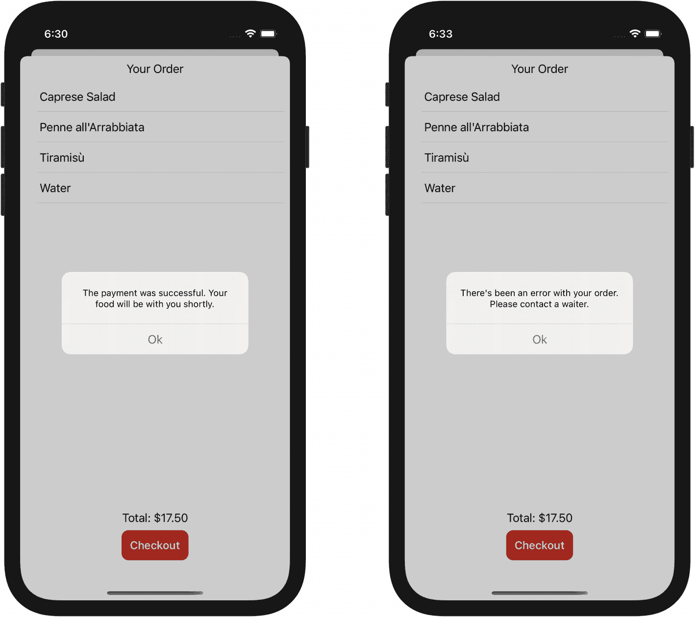
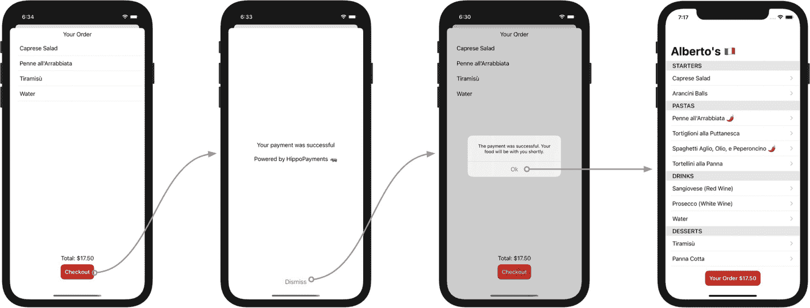

# 13. 测试条件性视图展示

*当展示视图的代码需要存在于 SwiftUI 层时，如何测试其条件逻辑？*

*通过将尽可能多的逻辑提取到 ViewModel 层，并保持 SwiftUI 实现足够精简。*

有时，展示视图是直接明了的，例如从列表中选择一个项目时加载详情页面。其他时候，则会涉及逻辑，比如用户应该根据操作结果看到不同的警告（Alert）。

每当展示视图涉及逻辑时，使用测试来驱动其实现是确保其正确性的最佳方法，并且比将逻辑保留在 UI 中并手动验证要高效得多。

在本章中，我们将学习如何使用测试驱动开发（TDD）来根据不同的支付处理结果展示不同的`Alert`。为此，我们将把条件逻辑的核心部分移到`ViewModel`层，并基于 SwiftUI 的`Binding`机制来修改视图的展示状态。


## 告知用户结账完成

在上一章中，我们编写了代码，通过让 `OrderDetail.ViewModel` 的 `checkout()` 方法调用 `PaymentProcessing` 的 `process(order:)`，并传入 `OrderController` 中存储的 `Order`，从而启动订单处理流程。

我们需要一种方式来告知用户订单结果：支付是否成功、厨房是否已收到订单，或者流程中是否出现错误。

测试驱动开发的核心在于小步迭代。这个流程中“最早可测试”的版本是什么？我们可以先尝试在支付完成后简单显示一个弹窗。

SwiftUI 拥有专门用于显示弹窗的类型和 API。展示弹窗的最简单方式是在 `View` 中拥有一个 `@State` 包装的属性，用于表示弹窗是否应显示在屏幕上，然后使用 `View` 的方法 `alert(isPresented:, content:)`，在该属性为 `true` 时定义要展示的 `Alert`：

```
struct ExampleView: View {
@State var showingAlert = false
var body: some View {
Button {
self.showingAlert.toggle()
} label: {
Text("显示弹窗")
}
.alert(isPresented: $showingAlert) {
Alert(
title: Text("你好"),
message: Text("嗨，我是一个弹窗"),
dismissButton: .default(Text("再见"))
)
}
}
}
```

`alert(isPresented:, content:)` 期望 `isPresented` 的值为 `Binding<Bool>`。 [`Binding<Value>`](https://developer.apple.com/documentation/swiftui/binding) 是 SwiftUI 的一种类型和属性包装器，它创建了“存储数据的属性与显示并更改数据的视图之间的双向连接”。

通过 `Binding`，当用户点击关闭按钮时，`Alert` 可以改变 `showingAlert` 的值。

我们刚刚讨论的选项是介绍弹窗展示的好方法，但所有逻辑都集中在视图中，并且不支持条件逻辑。为了根据支付处理的结果显示不同的弹窗，我们可以使用更精细的 `alert(item:, content:)` API。`alert(item:, content:)` 期望 `item` 是一个 `Binding<Optional<Identifiable>>`。`Binding` 包装器允许 SwiftUI 在弹窗展示或关闭后更新被包装的值。`Optional` 告诉框架：当值从 `none` 变为 `some` 时，应该显示弹窗。`content` 参数必须是 `(Identifiable) -> Alert` 闭包，SwiftUI 会调用它来获取要显示的 `Alert`。

得益于这个 API，我们可以将所有与弹窗展示相关的条件逻辑提取到独立于 SwiftUI 的类型中，从而能够使用测试驱动开发来构建它们。

1.  为弹窗定义一个 ViewModel。
2.  向 `OrderDetail.ViewModel` 添加一个 `@Published` 属性，其类型为 `Optional` 的弹窗 ViewModel。
3.  让 `OrderDetail.ViewModel` 根据支付处理结果更新此属性。
4.  让 `OrderDetail` 读取与 `@Published` 属性关联的 `Binding` 值（使用 `$` 前缀）。

弹窗的 ViewModel 可以是一个简单的 `struct`：

```
// Alert.ViewModel.swift
import SwiftUI
extension Alert {
struct ViewModel: Identifiable {
let title: String
let message: String
let buttonText: String
var id: String { title + message + buttonText }
}
}
```

下一步是向 `OrderDetail.ViewModel` 添加一个 `Alert.ViewModel @Published` 属性：

```
// OrderDetail.ViewModel.swift
// ...
extension OrderDetail {
class ViewModel: ObservableObject {
// ...
@Published private(set) var alertToShow: Alert.ViewModel?
// ...
}
}
```

如果你在此更改后使用快捷键 `Shift Cmd U` 构建测试代码，你会发现即使我们没有更新 `OrderDetail.ViewModel` 的 `init` 方法，代码仍然可以编译。原因是 Swift 编译器可以将 `Optional` 变量（如 `var alertToShow: Alert.ViewModel?`）的默认值推断为 `none`。这正是我们想要的值，因为我们只应在支付处理完成后才显示弹窗。

让我们为这个行为编写测试列表：

```
// OrderDetail.ViewModelTests.swift
@testable import Albertos
import XCTest
class OrderDetailViewModelTests: XCTestCase {
// ...
func testWhenPaymentSucceedsUpdatesPropertyToShowConfirmationAlert() {}
func testWhenPaymentFailsUpdatesPropertyToShowErrorAlert() {}
}
```

我们从失败场景开始，以确保我们对错误处理给予了应有的重视。

为了测试支付处理失败，我们需要在 `PaymentProcessing` 依赖中模拟这个场景。我们可以使用桩测试替身来实现，正如我们在第 8 章中学到的那样：

```
// PaymentProcessingStub.swift
@testable import Albertos
import Combine
import Foundation
class PaymentProcessingStub: PaymentProcessing {
let result: Result
init(returning result: Result) {
self.result = result
}
func process(order: Order) -> AnyPublisher {
return result.publisher
// 使用延迟模拟真实世界的异步行为
.delay(for: 0.01, scheduler: RunLoop.main)
.eraseToAnyPublisher()
}
}
```

通过桩对象，我们可以安排被测系统的输入，并通过调用 `checkout()` 方法来触发操作：

```
func testWhenPaymentFailsUpdatesPropertyToShowErrorAlert() {
let viewModel = OrderDetail.ViewModel(
orderController: OrderController(),
paymentProcessor: PaymentProcessingStub(returning: .failure(TestError(id: 123)))
)
viewModel.checkout()
// 断言结果：？？？
}
```

当支付处理失败时，我们如何验证持有 ViewModel 的 `@Published` 属性已改变为我们期望的值？

我们正在处理的代码是异步的，但它没有回调或 `Publisher` 来让我们附加处理器以完成 `XCTestExpectation`，就像我们在第 10 章测试网络行为时那样。

一个简单的选择是移除桩对象中的人为延迟，使测试变为同步。

不过，我想借此机会向您展示另一种测试异步代码的方法。


## 如何在没有回调时测试异步代码

`XCTest` 提供了一种基于给定谓词来验证其满足条件的异步期望：`XCTNSPredicateExpectation`。当被测异步代码没有回调，导致我们无法显式满足期望时，就可以使用它：

```
func testWhenPaymentFailsUpdatesPropertyToShowErrorAlert() {
    let viewModel = OrderDetail.ViewModel(
        orderController: OrderController(),
        paymentProcessor: PaymentProcessingStub(returning: .failure(TestError(id: 123)))
    )
    let predicate = NSPredicate { _, _ in viewModel.alertToShow != nil }
    let expectation = XCTNSPredicateExpectation(predicate: predicate, object: .none)
    viewModel.checkout()
    wait(for: [expectation], timeout: 2)
    XCTAssertEqual(viewModel.alertToShow?.title, "")
    XCTAssertEqual(
        viewModel.alertToShow?.message,
        "您的订单出现错误，请联系服务员。"
    )
    XCTAssertEqual(viewModel.alertToShow?.buttonText, "好的")
}
```

注意，`NSPredicate` 仅仅验证 `alertViewModel` 是否不为 nil，而关于内容属性的断言则只在期望满足后才执行。这样做比将所有检查都放在谓词中，能提供更细粒度的失败信息。

使用 `Cmd U` 运行测试，会显示类似 "异步等待失败：超出 2 秒超时，存在未满足的期望：..." 的错误。这并不意外：我们还没有处理支付流程。

现在，我们来订阅支付处理器 `Publisher` 以处理错误，让测试通过：

```
// OrderDetail.ViewModel.swift
func checkout() {
    paymentProcessor.process(order: orderController.order)
        .sink(
            receiveCompletion: { [weak self] completion in
                guard case .failure = completion else { return }
                self?.alertToShow = Alert.ViewModel(
                    title: "",
                    message: "您的订单出现错误，请联系服务员。",
                    buttonText: "好的"
                )
            },
            receiveValue: { _ in
            }
        )
        .store(in: &cancellables)
}
```

现在测试通过了。

你可能注意到了测试中奇怪的超时设置。为什么要设为 2 秒？根据我的经验，当使用基于 `NSPredicate` 的期望时，等待 1 秒有时会导致意外的超时。

不幸的是，`XCTNSPredicateExpectation` 的性能不如其他异步测试方案，因为它使用了轮询机制，正如苹果工程师 Stuart Montgomery 在 2018 年 WWDC 演讲 [*测试技巧与窍门*](https://developer.apple.com/videos/play/wwdc2018/417/%253Ftime%253D2073) 中所指出的。匹配器库 [Nimble](https://github.com/Quick/Nimble/)（参见附录 B）提供了性能更好的方式来编写这些期望。如果你的代码需要多次使用这种方式，不妨考虑采用 Nimble。

当使用非标准超时时，将其提取为常量可以在其他测试中复用，并让未来的读者明白你为何选择这个特定值：

```
// XCTestCase+Timeouts.swift
import XCTest
extension XCTestCase {
    /// 使用大约 1 秒的等待时间，在使用
    /// `XCTNSPredicateExpectation` 时似乎会导致
    /// 偶发的测试超时失败。
    var timeoutForPredicateExpectations: Double { 2.0 }
}

// OrderDetail.ViewModelTests.swift
wait(for: [expectation], timeout: timeoutForPredicateExpectations)
```

接下来，我们来处理支付成功时显示提示框的逻辑。我们可以采用与上一个测试相同的策略：

```
// OrderDetail.ViewModelTests.swift
func testWhenPaymentSucceedsUpdatesPropertyToShowConfirmationAlert() {
    let viewModel = OrderDetail.ViewModel(
        orderController: OrderController(),
        paymentProcessor: PaymentProcessingStub(returning: .success(()))
    )
    let predicate = NSPredicate { _, _ in viewModel.alertToShow != nil }
    let expectation = XCTNSPredicateExpectation(predicate: predicate, object: .none)
    viewModel.checkout()
    wait(for: [expectation], timeout: timeoutForPredicateExpectations)
    XCTAssertEqual(viewModel.alertToShow?.title, "")
    XCTAssertEqual(
        viewModel.alertToShow?.message,
        "支付成功，您的美食很快就会送到。"
    )
    XCTAssertEqual(viewModel.alertToShow?.buttonText, "好的")
}

// OrderDetail.ViewModel
func checkout() {
    paymentProcessor.process(order: orderController.order)
        .sink(
            receiveCompletion: { [weak self] completion in
                guard case .failure = completion else { return }
                self?.alertToShow = Alert.ViewModel(
                    title: "",
                    message: "您的订单出现错误，请联系服务员。",
                    buttonText: "好的"
                )
            },
            receiveValue: { [weak self] _ in
                self?.alertToShow = Alert.ViewModel(
                    title: "",
                    message: "支付成功，您的美食很快就会送到。",
                    buttonText: "好的"
                )
            }
        )
        .store(in: &cancellables)
}
```

ViewModel 的逻辑至此已经完成。我们通过单元测试验证了它的行为，确信它在隔离环境中能够正常工作。现在是时候将其与视图层连接起来了。

## 连接视图

由于 ViewModel 负责配置和触发提示框显示的所有条件逻辑，我们在视图中呈现提示框唯一要做的，就是将 ViewModel 连接到合适的 SwiftUI API 上：

```
// OrderDetail.swift
// ...
struct OrderDetail: View {
    @ObservedObject private(set) var viewModel: ViewModel
    var body: some View {
        VStack(alignment: .center, spacing: 8) {
            // ...
        }
        .alert(item: $viewModel.alertToShow) { alertViewModel in
            Alert(
                title: Text(alertViewModel.title),
                message: Text(alertViewModel.message),
                dismissButton: .default(Text(alertViewModel.buttonText))
            )
        }
    }
}
```

就是这样。你可以运行应用来验证集成效果。本章源代码中的 `HippoPaymentsProcessor` 总是返回成功，但如果你想验证失败场景，可以修改它让其返回错误。

图 13-1 展示了成功和失败场景的提示框。



图 13-1

通知支付成功（左）或失败（右）的提示框

`Alert.ViewModel` 并不依赖于 `OrderDetail`。如果你希望对整个提示框展示流程有更多信心，可以将根据 `Binding<Alert.ViewModel?>` 值展示提示框的逻辑提取到 `View` 的扩展中，并为它编写一个专门的 UI 测试。


## 测试警告框关闭行为

目前，当用户点击警告框的“确定”按钮时，订单页面仍然保留。更好的用户体验是让屏幕与警告框一同关闭。

纯 SwiftUI 的做法是在 `OrderDetail` 上定义一个 `@Binding` 属性，用于追踪 `OrderButton` 的 `showDetail` 值，并在需要关闭屏幕时切换它：

```
// OrderDetail.swift
// ...
struct OrderDetail: View {
// ...
@Binding private(set) var isPresented: Bool
// ...
}
// OrderButton.swift
// ...
struct OrderButton: View {
// ...
@State private(set) var showingDetail: Bool = false
var body: some View {
// ...
.sheet(isPresented: $showingDetail) {
OrderDetail(
viewModel: .init(orderController: orderController)),
isPresented: $showingDetail
)
}
}
}
```

想必您现在知道，我不推荐纯 SwiftUI 方案，因为我们无法用测试来辅助实现。为 `OrderDetail` 添加一个属性来告知其是否被展示，也会降低其可复用性：这隐含了它应该始终以表单（sheet）形式被呈现。

有一种方法可以让 `OrderDetail` 不受导航和展示层级结构的影响，并使部分展示逻辑可测试：将尽可能多的逻辑从纯 SwiftUI 组件中分离出来。

首先，我们为 `Alert.ViewModel` 添加一个属性来追踪操作闭包：

```
import SwiftUI
extension Alert {
struct ViewModel: Identifiable {
// ...
let buttonAction: (() -> Void)?
// ...
}
}
```

这次对代码库的改动属于重构，因为我们没有改变实际行为，只改变了实现。编译器会帮助我们识别所有需要更新的文件，而测试会告诉我们是否有任何破坏。

其次，我们更新 `OrderDetail.ViewModel`，使其在警告框关闭时获得一个可执行的闭包：

```
// OrderDetail.ViewModel.swift
// ...
struct OrderDetail: View {
class ViewModel: ObservableObject {
// ...
let onAlertDismiss: () -> Void
// ...
init(
orderController: OrderController,
onAlertDismiss: @escaping () -> Void,
paymentProcessor: PaymentProcessing = HippoPaymentsProcessor.init(apiKey: "A1B2C3")
) {
// ...
```

我们可以暂时在初始化 `OrderDetail.ViewModel` 时将其值设为 `{}`，以使代码能够编译：

```
// OrderButton.swift
// ...
struct OrderButton: View {
// ...
var body: some View {
// ...
.sheet(isPresented: $showingDetail) {
OrderDetail(
viewModel: .init(
orderController: orderController,
onAlertDismiss: {}
)
)
}
// ...
```

下一步是验证生成的 `Alert.ViewModel` 是否将给定的闭包作为其 `buttonAction` 的一部分来运行。我们可以使用与之前相同的方法：传递一个模拟对象（Stub）来模拟成功或失败的行为，使用谓词期望等待支付处理完成，然后断言生成的 ViewModel 调用了给定的闭包：

```
// OrderDetail.ViewModelTests.swift
// ...
func testWhenPaymentSucceedsDismissingTheAlertRunsTheGivenClosure() {
var called = false
let viewModel = OrderDetail.ViewModel(
orderController: OrderController(),
onAlertDismiss: { called = true },
paymentProcessor: PaymentProcessingStub(returning: .success(()))
)
let predicate = NSPredicate { _, _ in viewModel.alertToShow != nil }
let expectation = XCTNSPredicateExpectation(predicate: predicate, object: .none)
viewModel.checkout()
wait(for: [expectation], timeout: timeoutForPredicateExpectations)
viewModel.alertToShow?.buttonAction?()
XCTAssertTrue(called)
// 测试失败：XCTAssertTrue failed
}
```

像往常一样，我们为这个新行为编写了专门的测试。由于 `XCTNSPredicateExpectation` 的轮询速度较慢，最好将这个测试与我们之前为 `Alert.ViewModel` 配置编写的测试捆绑在一起以节省时间。为了保持示例易于理解，我们在此不这么做。

为了让测试通过，我们需要将回调传递给 `Alert.ViewModel`：

```
// OrderDetail.ViewModel.swift
// ...
func checkout() {
paymentProcessor.process(order: orderController.order)
.sink(
receiveCompletion: { [weak self] completion in
guard case .failure = completion else { return }
guard let self = self else { return }
self.alertToShow = Alert.ViewModel(
title: "",
message: "您的订单出现错误，请联系服务员。",
buttonText: "确定",
buttonAction: self.onAlertDismiss
)
},
receiveValue: { [weak self] _ in
guard let self = self else { return }
self.alertToShow = Alert.ViewModel(
title: "",
message: "支付成功，您的餐食将很快送达。",
buttonText: "确定",
buttonAction: self.onAlertDismiss
)
}
)
.store(in: &cancellables)
}
```

最后，我们需要更新 SwiftUI 代码，以使用 ViewModel 中的操作：

```
// OrderDetail.swift
// ...
.alert(item: $viewModel.alertToShow) { alertViewModel in
Alert(
title: Text(alertViewModel.title),
message: Text(alertViewModel.message),
dismissButton: .default(
Text(alertViewModel.buttonText),
action: viewModel.buttonAction
)
)
}
```

我将为失败场景编写测试留作您的练习。

如果您现在运行应用并提交订单，您会发现在关闭确认警告框时，订单详情表单也会一并关闭。图 13-2 展示了最终流程。



图 13-2

生产环境下的支付流程

恭喜！您现在已完成 1.0.0-beta.1 版本。是时候与阿尔贝托和他的一些最忠实的客户分享，以供测试了。如果他们提出在正式发布前还需要实现一些最终调整，我也不会感到惊讶。

SwiftUI 是一个出色的框架，能以声明式方式构建应用的视图层，并且只需很少的工作即可使其与所需显示的数据保持同步。其不可变架构——视图是状态的函数，而非一系列事件——帮助我们将所有展示和行为逻辑隔离到专用对象中，并通过测试驱动开发（TDD）进行扩展。在本章中，我们看到了这样一个例子。我们将生成确认`警告框`和配置其回调的所有逻辑移入一个专用的 ViewModel，然后编写了一个轻薄的、谦逊的 SwiftUI 层来消费它。

## 关键要点

*   **每当需要条件逻辑来呈现视图时，应将其从 SwiftUI 层中提取出来**。这样您就可以使用 TDD 来实现它，以获得更快的反馈和更高的信心。
*   **通过为警告框配置构建 ViewModel，您可以将其与 SwiftUI 解耦**。
*   **`XCTNSPredicateExpectation` 对于测试没有回调的异步代码很有用，但性能较差**。考虑在同一个测试中使用谓词期望来批处理多个断言，或者如果测试中有多个此类断言，则采用 Nimble。

## 使用 TDD 修复 Bug 和更改现有代码

*如何应用测试驱动开发来更改现有代码的行为或修复 Bug？*

*与编写新代码的方式相同：利用测试的反馈来确定需要做出的更改。*

在更新现有行为时，您可以先编辑其测试。相反，如果要修复 Bug，您首先编写一个重现该 Bug 的失败测试，然后通过使测试通过来修复它。


## 通过测试驱动修复 Bug

Beta 测试者的早期反馈报告了应用中的一个 bug。提交订单后，客户仍然能看到“结账”按钮，这让他们不确定付款是否成功。

让我们通过在支付成功后清除存储在 `OrderController` 中的订单来修复这个 bug。我们应该从哪里开始？

在 TDD 圈子里有句老话：“一个 bug 就是一个尚未编写的测试。”

要使用 TDD 修复 bug，你首先要编写一个能复现该 bug 的失败测试。从那里开始，工作流程与我们一直在实践的完全相同。跟随测试失败来识别需要编写的代码，使其通过，从而修复 bug：

```swift
// OrderDetail.ViewModelTests .swift
// ...
func testWhenPaymentSucceedsDismissingTheAlertResetsTheOrder() {
    // 用有效的订单（包含商品的订单）安排输入状态
    let orderController = OrderController()
    orderController.addToOrder(item: .fixture())
    let viewModel = OrderDetail.ViewModel(
        orderController: orderController,
        onAlertDismiss: {},
        paymentProcessor: PaymentProcessingStub(returning: .success(()))
    )
    // 执行结账并等待其成功
    let predicate = NSPredicate { _, _ in viewModel.alertToShow != nil }
    let expectation = XCTNSPredicateExpectation(predicate: predicate, object: .none)
    viewModel.checkout()
    wait(for: [expectation], timeout: timeoutForPredicateExpectations)
    // 执行警报解除代码
    viewModel.alertToShow?.buttonAction?()
    // 验证订单已被重置
    XCTAssertTrue(orderController.order.items.isEmpty)
}
```

如果你使用聚焦测试的快捷键 `Ctrl Cmd U` 运行此测试，你会看到它失败。

为了使测试通过并修复 bug，我们需要让 `OrderController` 在警报解除动作中重置其 order 属性：

```swift
// OrderController.swift
// ...
func resetOrder() {
    order = Order(items: [])
}
// OrderDetail.ViewModel.swift
// ...
func checkout() {
    paymentProcessor.process(order: orderController.order)
        .sink(
            receiveCompletion: { [weak self] completion in
                // ...
            },
            receiveValue: { [weak self] _ in
                guard let self = self else { return }
                self.alertToShow = Alert.ViewModel(
                    title: "",
                    message: "支付成功。您的食物很快就会送达。",
                    buttonText: "好的",
                    buttonAction: {
                        self.orderController.resetOrder()
                        self.onAlertDismiss()
                    }
                )
            }
        )
        .store(in: &cancellables)
}
```

现在测试通过了，bug 已被修复。如果你运行应用程序并提交订单，你会看到在订单详情界面消失后，“您的订单”按钮显示一个空的订单。

## 通过测试驱动修改现有代码

早期的测试者认为辣度指示器不清晰，因此你决定用火焰表情（）替换辣椒表情（）。我们如何利用测试来驱动代码库中的这一改动？

我们已经有一个关于辣度指示器行为的测试。测试是你代码预期行为的活文档。要修改现有行为，从修改其测试开始：

*// MenuRow.ViewModelTests .swift*
*// ...*

```swift
func testWhenItemIsSpicyTextIsItemNameWithFireEmoji() {
    let item = MenuItem.fixture(name: "name", spicy: true)
    let viewModel = MenuRow.ViewModel(item: item)
    XCTAssertEqual(viewModel.text, "name ")
        // 测试失败，因为：
        // XCTAssertEqual 失败: ("name ") 不等于 ("name ")
}
```

现在我们有一个针对更新行为的失败测试，可以跟随它的指引来实现改动：

*// MenuRow.ViewModel.swift*
*// ...*

```swift
init(item: MenuItem) {
    text = item.spicy ? "\(item.name) " : item.name
}
```

运行测试，你会看到它们通过了。

通常情况下，软件开发意味着编辑现有代码，而不是编写新代码。这些简单的例子展示了持续实践 TDD 将如何帮助你维护不断成熟的代码库，以及当你从绿地开发转向既有代码库时如何应对。

当你需要修复一个 bug 时，很可能存在一个现有测试，你可以复制并调整它以复现错误的运行行为。相反，如果你需要修改现有行为，那么只需查看它的测试。用新的预期结果更新断言，并观察它们如何失败。现有测试为你提供了修改行为的清晰起点。

当代码库和团队规模增长时，拥有一套测试套件作为探索工具极具价值。当你需要修改不熟悉的代码区域时，优先查看其测试：它们会指引你需要前往的方向。

## 关键要点

* **TDD 不仅有助于编写新功能，还能帮助你维护现有代码。**
* **要使用 TDD 修复 bug，先编写一个能复现它的测试，然后使其通过。**
* **要更新现有代码，请更新测试以断言新行为，然后跟随其反馈来实现它。**

