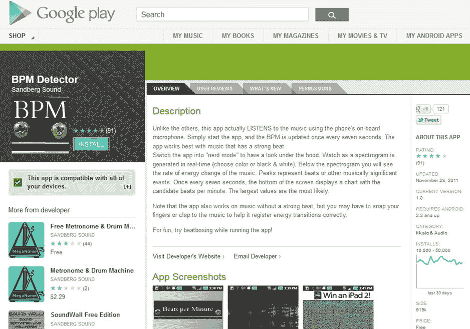
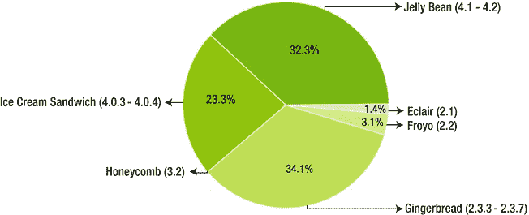

# 第一章：安卓市场背景

写书时，作者总要考虑读者群体。如果您是经验丰富的安卓程序员，本书的技术部分可能看起来相当基础。若果真如此，我们在此提前致歉。我们之所以这样安排，是因为这本书的主题是安卓应用开发的*商业*层面，部分读者可能完全没有安卓编程经验。

如果您对安卓毫无经验，我们会尽力为您指引方向。每个人都是从零开始起步的，而在技术领域，这种情况屡见不鲜。很难想象，在撰写本书时，"移动应用"这个概念问世还不到十年。十年前，如果您谈论"应用"这个词，人们可能都不确定您指的是什么。

## 智能手机革命

想想您日常做的所有事情——在公交车上查收邮件、在等待下一个预约时上网冲浪、运行最新的应用程序——您很可能会认同，智能手机已成为我们日常生活的一部分。我们确信，那些 Facebook 和 Twitter 的重度用户，都会惊叹于从前没有智能手机的日子是怎么过来的。如今，我们对这项技术已习以为常，尤其是因为手机作为计算机的绝大多数技术都相对新颖且不断变化。

从历史角度看，计算机是一项相对较新的发明。如今在各类商业领域都堪称巨头的计算机产业，其历史还不到一个世纪。二战期间开发的最早通用计算机——图灵巨人计算机——最初设计用于空气动力学计算。1947 年贝尔实验室发明晶体管，1969 年德州仪器和仙童半导体开发出集成电路，这些突破帮助计算机在 20 世纪 50 年代和 60 年代取得了巨大进步。不久，IBM System/360 成为标准的大型机构主机。英特尔联合创始人戈登·摩尔曾做出著名预测：集成电路上的元件数量大约每两年翻一番。摩尔的预测经受住了时间的考验，这个简洁的论断后来被称为"摩尔定律"。由于集成电路能以更小的空间为用户执行更多计算，计算机变得越来越小。Z3 计算机曾是占据整栋楼的庞然大物，而这台巨型计算机的处理能力，与我们今天最简单的智能手机相比都微不足道。

经过几十年的技术发展，计算机变得足够小，可以放在家中或办公室的桌子上。很快，台式机的性能移植到了笔记本电脑上，计算机变得更轻、更薄，轻松地从办公桌转移到本地咖啡馆的 Wi-Fi 热点。

随着计算机技术的进步，蜂窝电话技术也在发展，引发了一场手机革命。手机曾经只有富人才能负担得起的玩具，因为它们的价格高达数千美元。比如 1983 年的摩托罗拉 DynaTAC 8000x，因其近两磅的重量成为用户的负担。曾有一段时间，手机重量成为制约因素，但在 90 年代，车载手机非常流行。幸运的是，1989 年的摩托罗拉 MicroTAC 9800X 等手机轻到可以放入夹克口袋，而摩托罗拉 StarTAC 等机型则因其翻盖设计广受欢迎。

接下来合乎逻辑的一步是在手机上添加更多功能，而不仅仅是通话和短信，手机很快变得"更智能"。如今，连接互联网的所有能力都尽在掌中。爱立信率先将其手机称为"智能手机"，诺基亚 9000 Communicator 具有类似功能，并由英特尔 386 CPU 驱动——这款 CPU 此前曾用于英特尔台式电脑。

大多数科技爱好者都记得史蒂夫·乔布斯发布 iPhone 时的情景，这款智能手机是以消费者为中心设计的。我们经常问科技界朋友："iPhone 发布时你在哪里？"科技爱好者们还记得乔布斯拿出他的新玩具时，其单键设计的优雅以及"应用程序"如何永远改变了移动世界。

过去十年智能手机技术的快速发展可以用库梅定律来解释（与摩尔定律有些相似）。斯坦福大学的乔纳森·库梅博士证明，电力需求（电池容量）每 1.6 年减半。这意味着计算机不仅变得更快（得益于晶体管数量的增加），而且变得更小、更便携！由于电池在智能手机中占用的空间越来越小，智能手机可以在剩余体积内塞入大量计算能力。

但计算能力只是等式的一半。另一半是连接性。智能手机几乎始终在线。始终在线的连接创造了无限可能。应用商店——所有现代智能手机的标准配置——正是始终在线连接的直接产物。

如今，得益于应用革命，我们可以用手机做任何事情。想想像 Instagram 这样的企业如何在这个新的智能手机时代蓬勃发展——这在十年前甚至是不可能的！

每一项新技术都创造新的机遇。如前所述，计算机的尺寸在不断减小。随着尺寸的减小，计算机的整体价格也在下降。智能手机也是如此，由于运营商提供的合约优惠，消费者的购入成本越来越低。如今，许多买不起台式机或笔记本电脑的国家的用户也能使用智能手机，移动网络将他们带入万维网乃至更广阔的世界。

虽然我们并非在世界上任何地方都能接收到信号，但这种情况正在迅速改变。事实上，即使今天，全球每三个人中就有一人能访问互联网，其中许多人正是通过蜂窝网络上网的。

根据 Strategy Analytics 的最新研究，2012 年第三季度智能手机数量突破十亿。这距离第一批智能手机上市仅过去了 16 年。很少有发明能如此迅速地席卷全球。

这对应用开发者来说是个好消息。智能手机已经改变了我们工作和娱乐的方式，但我们确信，还有许多未被发现的创意，正等待聪明的应用开发者将它们带给世界。

而对于您，亲爱的读者，好消息是：安卓是迄今为止最流行的智能手机操作系统。事实上，2012 年第四季度，70%的智能手机出货量都是安卓手机！

## 安卓的起源

许多人将 iPhone 誉为第一款智能手机，但如前所述，事实并非如此。iPhone 的 iOS 操作系统独树一帜，而安卓操作系统看似只是模仿。然而，早在 2007 年 iPhone 向公众发布之前，安卓操作系统的基础工作就已经开始了。被誉为安卓创始人之一的安迪·鲁宾（安卓后来被谷歌收购），自 2000 年 1 月以来就一直在进行智能手机设计。他在创办安卓之前创立的公司叫 Danger, Inc.，该公司于 2002 年 10 月发布了 Hiptop（也称为 T-Mobile Sidekick），比苹果发布其第一款智能手机早了数年。

### Android 的历史与崛起

安迪·鲁宾与里奇·迈纳、尼克·西尔斯和克里斯·怀特于 2003 年共同创立了 `Android, Inc.`。用鲁宾的话来说，开发“更智能、更能感知主人位置和偏好的移动设备”蕴含着巨大潜力（`http://www.businessweek.com/stories/2005-08-16/google-buys-android-for-its-mobile-arsenal`）。该公司曾一度资金耗尽，但在 2005 年被谷歌收购时，已经为手机开发出了一套开源操作系统。`Android` 在其移动操作系统上低调研发了大约两年时间。

谷歌协助成立了开放手机联盟（OHA），这是一个由 `HTC`、`摩托罗拉`、`三星`、`Sprint Nextel`、`T-Mobile` 等众多电信行业巨头组成的联盟。该联盟最终推出了我们今天所熟知的移动操作系统 `Android`。`Android` 的首个公开测试版于 2007 年 11 月发布，距离 iPhone 首次上市仅五个月。

`Android` 和 `iOS` 目前是手机操作系统领域的两大主要玩家。尽管 `诺基亚` 推出了像 `Lumia 920` 这样成功的旗舰手机，但微软的 `Windows Phone 8` 操作系统仅占据极小的市场份额。`黑莓` 市场曾一度举足轻重，但根据 `comScore MobiLens` 的数据，其市场份额已不足 6%。

然而，`黑莓` 近期发布了搭载新操作系统的新设备，其命运或许会有所改变。新 `黑莓` 设备支持“Android 应用运行时环境”，这充分说明了 `Android` 的重要性。这是一系列工具，能让您轻松地将现有的 `Android` 应用重新打包，使其能在 `黑莓` 手机上运行。我们将在本书后续章节对此进行更详细的讨论，但请放心，即使 `黑莓` 大获成功，您选择为 `Android` 开发应用也是正确的决定！

### 为什么选择 Android？

`Android` 无疑是全球使用最广泛的手机操作系统。如果您想通过单一代码库触达最多用户，`Android` 是首选。正如我们刚才提到的，您甚至可以轻松地将您的应用呈现在 `黑莓` 用户面前！

在用户采纳率方面，`Android` 完全碾压了 iPhone。根据 `Strategy Analytics` 的数据，2012 年，每售出一部 iPhone，就有超过 3.5 部 Android 智能手机出货。`Android` 增长迅猛。2010 年，每天有 10 万部新设备被激活。2011 年，这个数字增长到每天 50 万部。据谷歌董事长 `埃里克·施密特` 称，截至 2013 年 4 月，每天激活的新 Android 用户超过 150 万 *之多*！

更棒的是，曾在收入上落后于 `苹果 App Store` 的 `Google Play` 正逐渐崭露头角。与 2012 年第四季度相比，2013 年第一季度 `Google Play` 收入增长了 90%。同期，`苹果 App Store` 的收入仅增长了 25%。尤其在亚洲，`Google Play` 的收入增长率惊人。日本在 `Google Play` 收入上已超过美国！韩国的表现也极为强劲。按照这样的增长速度，`Google Play` 商店成为主导应用商店似乎只是时间问题。在应用市场方面，`Google Play` 目前拥有超过 70 万个应用，下载次数已超过 250 *亿* 次！

大多数成功的 `Android` 应用故事都耳熟能详。例如，`Rovio` 公司开发的 *愤怒的小鸟* 对 Android 用户免费，这款移动游戏巨头为公司带来了巨额资金。该游戏在 Android 平台发布后的三天内，下载量就超过了两百万次；一个月后，下载量达到了七百万次。游戏开发商 `Rovio` 仍在通过推出衍生作品甚至周边产品，想方设法从 *愤怒的小鸟* 系列中盈利。

当然，成功的应用不仅仅局限于游戏领域。例如，*Car Locator* 应用的作者 `Edward Kim` 最初因每天能赚 20 美元而兴奋不已。五个月内，他的月销售额就超过了一万三千美元。

您很快就会发现，市场上数量庞大的 `Android` 应用可能会对开发者不利，因为 Android 市场充斥着各种类型的应用。每个月出现两万个新应用的情况并不少见。

这意味着，一个应用无论多么出色，都可能“淹没在人群中”，很难被目标用户注意到。即使一个功能更丰富的免费应用唾手可得，Android 用户也可能付费下载某种类型的应用。这一切都是因为一些更好的应用在众多 Android 应用中无法脱颖而出。

但请记住，`苹果 App Store` 的应用数量与 `Google Play` 大致相同，因此 iOS 应用开发者在如何脱颖而出方面也面临着同样的问题。请记住，与苹果不同，谷歌是凭借其搜索能力的优势建立起品牌的。可以肯定的是，谷歌的工程师们正在努力寻找最佳方法，为 `Google Play` 用户提供搜索功能，让他们能够精确找到所需的应用。

事实上，`Roy` 很高兴地告诉大家，在谷歌中搜索他的应用会出现在首页的列表里（参见 图 1-1）。

图 1-1. Google Play 市场截图，显示了 Roy Sandberg 的应用

### Android 与 iOS 对比

iPhone 首次亮相时，为消费电子产品建立了一种全新的商业模式。尽管 `史蒂夫·乔布斯` 及其在 `苹果` 的同事并非触摸屏的首创者，但他们成功地创建了一种兼具个性化与实用性的新型软件企业。苹果的“这个应用可以做到”这句口号向用户承诺，他们所需的移动软件随时随地都能方便地获取。它既适用于最聪明的工程师，也适用于最普通的消费者，并开创了一种新型的软件市场。从历史上看，`苹果 App Store` 在应用数量和下载量方面一直遥遥领先。然而，这种情况即将改变。`Google Play 应用市场` 在应用数量和下载量上几乎与苹果持平。截至 2012 年 10 月，iOS 的下载量仅比 Android 多 10%。

尽管 iOS 在总收入方面仍保持着可观的领先优势，但差距也在迅速缩小。如果趋势线按当前速度发展，到 2014 年初，Android 可能会在总收入上超越 iOS。在不久的将来，我们可以预期 Android 将在应用总量、应用下载量以及应用收入方面全面领先。如果我们好赌的话，我们会把赌注押在 Android 上！

#### Android 与 iOS 的区别

作为开发者，您至少应该在某种程度上了解 Android 与 iOS 的区别。

苹果的 iOS 是专有操作系统，而 Android 是开源的，这使得用户有权通过获取源代码来研究、修改和改进其设计。Android 内部使用了 Linux 内核。

Android 开发者工具的一大优点是免费。这也是为什么该操作系统在智能手机和平板电脑上如此受欢迎，并且很可能在不久的将来在电视领域占据重要地位的原因之一。

Android 与苹果的另一区别在于，Android 对上传至 Google Play 的应用没有审核流程。用户注册后，上传和发布应用就变得相对简单。还记得我们之前提到 Android 市场充斥着大量应用吗？简化的审核流程确实意味着低质量的应用可能在市场中泛滥，这使得优质应用难以脱颖而出。另一方面，除了 Google Play，Android 开发者还可以选择其他许多应用商店。其中不少商店的审核流程更为严格。例如，Roy 发现 SlideMe 商店的效果非常好——尽管该商店规模远小于 Google Play，但目前为他的一款应用带来了超过 15% 的下载量。

Android 应用主要用 Java 编写，而 Java 是一种非常知名的语言。在 `langpop.com` 的计算机语言规范化对比中，Java 是最受欢迎的语言。开放标准意味着大量的开源资源。Java 是 Google Code 上第三受欢迎的语言（数据来源：`langpop.com`），这足以说明有多少新代码正在用 Java 编写。此外，Java 在所有智能手机操作系统中拥有最大的可寻址用户基础。它易于编写、测试和部署，并且能通过多个市场覆盖全球用户。Google Play 和 Amazon Appstore 都是蓬勃发展的应用市场，我们将在后续讨论“将应用发布到市场”的章节中介绍其他市场。

BlackBerry 应用是 Android 应用的一个新市场。将现有的 Android 应用（v.2.3.3 或更高版本，即将更新至 Jelly Bean 4.1）移植到 BlackBerry 平台非常容易。

Android 应用程序编程接口（API）文档完善，大多数用户能很快上手。相比之下，iOS 的学习曲线更为陡峭。iOS 应用通常使用 Objective C 编写，而该语言在 iOS 开发之外很少使用。相比之下，Java 非常知名，这使得现有 Java 开发者能轻松学习 Android 开发。

例如，Roy 在编写第一个应用前只掌握一些基本的 Java 知识，但他仅用几周时间就编写出了一个复杂的多线程应用。学习曲线中最大的挑战在于 Android 应用生命周期——这与 PC 或服务器端 Java 编程截然不同。但一旦理解了这一生命周期，它就能促进代码复用，并让你能够利用其他开发者编写的应用功能。此外，Android 应用生命周期还促进了能“与其他应用友好协作”的节能型应用的开发。

但 Android 生态系统让应用开发变得容易的方面，并不仅限于编程流程。作为新手开发者，Roy 还对其进入国际市场的便捷性印象深刻。他的第一款商业应用 Sandberg Sound BPM Detector 能让用户识别任何听到的歌曲的每分钟节拍数，全球的 DJ 和音乐家都在使用它。只需几次点击，Roy 就能将应用部署到全球。更令人惊叹的是，描述应用的文字会自动翻译成数十种语言。不懂英语的用户能看到以母语列出的 Roy 的应用，应用本身也能以用户母语显示文本。类似地，Android 生态系统还处理了国际银行业务和支付的后勤工作。一旦 Roy 以美元设定了应用价格，Android 会自动建议世界各地对应本地货币的定价。即使他的应用在全世界 190 个国家/地区上架，购买收入也会以美元形式出现在他的银行账户中，无需他做任何干预。这就是 Android 的力量。

免费第三方工具也让 Android 更易用，即使对非 Java 程序员也是如此。Scripting Layer for Android（SL4A）允许 Ruby、Python、Perl、JavaScript 以及其他多种解释型语言在 Android 设备上运行。这些语言能访问大部分 Android API，且不要求开发者遵循应用生命周期。如果你的应用最好以简单脚本的形式实现，这可能是一个选择。目前 SL4A 仍处于 Alpha 阶段，但已经开发多年。

如果你是 Ruby 程序员，可以尝试 Ruboto（`www.ruboto.org`）。Ruboto 使用 JRuby 编译器（将 Ruby 代码转换为 Java 虚拟机字节码）将 Ruby 语言代码转换为 Android 应用代码。由于 JRuby 支持即时（JIT）编译，Ruboto 生成的 Ruby 代码运行速度相当快。

因此，我们认为 Android 是更易于开发的平台。但别光听我们的一面之词。在 2013 年《开发者经济学》调查中，1200 名同时为 iOS 和 Android 开发的应用开发者中，大多数人表示 Android 开发的学习曲线比 iOS 更平缓，且开发成本更低。

### Android 版本

Android 起步缓慢，首款设备是 HTC Dream（也称为 T-Mobile G1）。此后，随着每个新版本的发布，Android 越来越受欢迎。在开始开发 Android 应用时，了解这些版本非常重要，因为新版本比旧版本包含更多功能。在编程层面，这些版本有明确的数字编号。我们将在讨论如何下载 Android SDK 和 Eclipse 等开发工具时介绍具体编号。目前你只需知道，除了版本号，每个版本还有一个非正式的甜点名称。这一可爱传统始于版本 1.5。

图 1-2\. 各平台版本在 Android 生态系统中的占比

以下是部分最新 Android 版本的简要总结：

#### Android 版本历史

- **Version 1.5 (Cupcake):**
    - 支持通过摄像机录制视频
    - 启用蓝牙功能
    - 主屏幕支持小部件
    - 支持动画屏幕
    - 支持“即时”上传 YouTube 视频和 Picasa 照片
- **Version 1.6 (Donut):**
    - 集成摄像机、相机和图库
    - 语音搜索
    - 语音拨号
    - 书签
    - 历史记录
    - 联系人搜索
    - WVGA 屏幕分辨率
    - 配备 Google 逐向导航
- **Version 2.0/2.1 (Éclair):**
    - 支持 HTML5 和 Exchange ActiveSync 2.5
    - 速度提升
    - Google Maps 3.1.2
    - 集成 MS Exchange 服务器
    - 相机闪光灯
    - 集成蓝牙 2.1
    - 可选的虚拟键盘
- **Version 2.2 (Froyo):**
    - 屏幕支持 320dpi 和 720p 分辨率
    - JIT 编译器
    - 搭载 JavaScript Engine version 8 的 Chrome 浏览器
    - Wi-Fi 热点共享
    - 蓝牙联系人共享
    - 支持 Adobe Flash 10.1
    - 应用可安装到 SD 卡等可扩展存储
- **Version 2.3 (Gingerbread):**
    - 改进的游戏图形和音频效果
    - 支持 SIP VoIP
    - WXGA（超大屏幕尺寸和分辨率）
    - 近场通信
    - 复制粘贴功能
    - 大型下载管理器
    - 更好的应用控制
    - 支持多个摄像头
- **Version 3.0, 3.1, and 3.2 (Honeycomb):**
    - 首个仅针对平板电脑的版本
    - 配备更新小部件的 3D 桌面
    - 标签页式网页浏览和匿名浏览“隐身”模式
    - Google Talk 视频聊天
    - 硬件加速
    - 支持多核处理器
    - 多窗格导航
- **Version 4 (Ice Cream Sandwich):**
    - 针对平板和手机优化的精简用户界面
    - 高级应用框架
    - 面部识别
    - 更好的语音识别
    - 支持最多 16 个标签页的网页浏览器
    - 可调整大小的小部件
- **Version 4.1 and 4.2 (Jelly Bean):**
    - Google Now
    - 语音搜索
    - Android Beam
    - 性能提升
    - 支持 HDR 的相机应用增强功能
- **Version 5 (Key Lime Pie):**
    - 目前对该版本的功能知之甚少；后续版本可能会带来更多信息。

你会发现，特定 Android 设备最初基于某个特定版本，而升级对于某些设备来说往往来得较慢。这是因为 Android 发布新版本后，硬件厂商和移动运营商需要修改源代码以满足自身需求。事实上，即使硬件完全具备支持能力，移动运营商也可能不会为旧手机更新新版本的 Android。

#### 使用 Android 的挑战

我们已经提到，Android 开发工具的一大优势是免费，并且与 Apple 不同，官方的 Google Play 市场在应用上架时没有审批流程。用户注册后，上传和发布应用就变得相对简单。

虽然 Android 应用开发相对容易，部署也简单，但这并不能保证你的应用能在所有 Android 设备上完美运行。你可以想象，那些手机不支持你应用的用户，绝不会给你好评！

典型问题可能包括简单的屏幕尺寸适配问题。即使你遵循了所有最佳实践，有些手机的分辨率仍然可能很奇葩。你的应用也许能运行，但布局可能让用户感到不悦，从而导致差评。

使用免费的 Android 手机模拟器可以测试不同的屏幕分辨率。但这个模拟器在处理计算密集型应用时通常运行得太慢。此外，模拟器中存在一些 bug，可能导致某些应用在模拟时行为异常。尽管模拟器适合简单测试，但它并非万无一失。

另一个常见问题与 Android 手机的不同硬件能力有关。例如，并非所有手机都有前置摄像头。有些手机处理计算密集型图形时“马力”不足。每个硬件制造商都可以自由地为手机添加自定义功能和特性，这意味着并非每部手机都具备所有功能。Android 为开发者提供了确保手机拥有所需功能的方法，但这些硬件平台之间的差异是 Android 编程面临的主要挑战之一。iPhone 只是一款手机，而 Android 是一个真正的操作系统，支持来自数十家制造商的数百种不同设备。

作为开发者，你应该始终思考如何以覆盖最多用户的方式编写应用。通常，使用较旧版本的 Android 而非最新版本、避免采用最新炫酷的硬件功能，是更明智的选择。这能让你触达更多用户。Android 拥有庞大的用户基础，但其中使用最新版本的用户寥寥无几。

如果你认真对待 Android 开发，除了你的主力手机（我们假设它也是 Android 手机！）之外，你可能还想购买一两部二手 Android 手机。开发能在旧版 Android 上运行的应用，可以确保你覆盖大多数市场。唯一能确定应用在多个版本上运行良好的方法就是进行测试。如果你致力于开发高质量的应用，你至少需要在几款不同的手机上测试你的应用。

如果你负担得起，另一种选择是使用像`www.perfectomobile.com/`这样的服务。它允许你通过云端接口在数百部真实 Android 手机上进行测试。

#### 移植的难点

对于那些希望将 iOS 应用转变为成熟的 Android 应用（反之亦然）的人，我们想介绍一下其中的过程和陷阱。如果你只专注于 Android 市场，可以安全地跳过本节。然而，许多开发者为了最大化收入，目标是同时为 Android 和 iOS 开发应用。我们将在本章末尾介绍如何做到这一点。

假设你已经编写了一款正在市面上销售或正在等待应用审批的 iOS 应用。若要将其转变为 Android 应用，你必须对软件进行适配，以便能针对一个与原始设计不同的计算环境创建可执行程序。这被称为*移植*。

iOS 应用通常用`Objective-C`编写，而 Android 应用通常用`Java`编写。尽管这些编程语言的逻辑非常相似（因为它们都是线性的、过程式的，并且使用面向对象的概念），但在操作系统支持、GUI 对象和应用生命周期方面，它们差异巨大。遗憾的是，Android 不支持`Objective-C`。

据我们所知，目前还没有任何神奇的程序能让你把 iPhone 应用输入，然后直接输出 Android 应用（除非你从一开始就使用为此而设计的开发工具）。稍后我们会讨论跨平台开发工具，但首先我们将解释你可以为 Android 和 iOS 做些什么。

### 将 iOS 应用移植到 Android 平台

虽然你的 iOS 代码无法在 Android 上直接复用，但也不必从头重写所有 Android 代码。例如，图标、图片以及 SQLite 数据库代码都可以完全复用。此外，iPhone 应用中的某些 C 语言代码（如图像处理或数字信号处理代码）可以通过 Android NDK（原生开发工具包）直接移植到 Android 平台。你可能会认为用户界面（UI）设计也可以复用，但 iOS 和 Android 的界面元素截然不同，强行让 Android 应用模仿 iPhone 的行为不仅耗时，而且成本高昂。在某些情况下，你可以复用为 iOS 应用编写的用例，但需考虑 Android 界面对这些用例的影响。另外，与 iOS 相比，Android 生态更倾向于免费应用加广告或应用内购买的商业模式。换句话说，当移植到 Android 时，可能需要调整整体商业计划。

将 iOS 应用移植到 Android 所需的工作量通常与重新开发一个应用相当。具体取决于应用的规模、代码的复杂性、对图形用户界面（GUI）工具的依赖程度，以及开发者的能力。

顺便提一句，有些开发者专门从事应用开发服务，这可以减轻你的工作量。由于你的应用已有一个现成版本，将移植工作外包出去相当容易；开发者始终可以将原始应用作为参考。

如果你的 iOS 应用是用 ANSI C 或 C++ 编写的，例如使用了为此设计的众多游戏引擎之一，那么你的工作可能会简化。Android 拥有 NDK，允许从 Android Java 代码调用 ANSI C 或 C++ 代码，反之亦然。

### 跨平台开发工具示例

你很可能希望自己的应用被尽可能多地下载，这意味着你希望它能运行在尽可能多的设备上。如果你想让应用同时支持 iOS、Android 以及其他移动平台，可以考虑使用跨平台开发工具包。

尽管我们认为应用市场正朝着通用解决方案发展，但目前尚未完全实现。本书专注于使用 Android SDK（Android 软件开发工具包）来构建 Android 应用。不过，为了完整性，我们也会讨论几个跨平台开发工具包，让你了解还有其他的选择。

#### LiveCode

LiveCode 由 RunRev 公司开发，这是一家专门制作开发工具的公司。用 RunRev 产品经理 Ben Beaumont 的话来说，LiveCode 是“一个现已迁移到移动领域的多平台元素环境”。LiveCode 最初是为 Mac、Windows 和 Linux 设计的，并号称“免编译编码”。免编译编码意味着当你对程序做出修改时，可以立即在编程过程中看到效果。这与通常的编辑、编译、运行、调试流程不同。

LiveCode 还提供了一个可视化开发环境，用户可以通过拖放构成最终界面的对象和图片来设计界面。随后，用户可以为这些对象附加脚本，使它们真正“活”起来并提高运行速度。LiveCode 使用一种非常高级的语言，允许用户编写接近英语的代码，这使得编写和阅读代码都变得更容易。所有这些特性使得创建能在设备上实际运行的实时原型成为可能，并承诺让你能够快速迭代和优化应用，因为你可以立即看到工作的成果。

#### Appcelerator

Titanium 创建了一个免费且开源的应用开发平台，允许用户打造原生的移动、平板和桌面应用体验。其 Appcelerator 程序让用户能够构建功能丰富的应用，效果如同用 Objective-C 或 Java 编写的一样。最终生成的是原生应用，可通过大量功能进行自定义，并且全部使用 JavaScript 这一网络技术构建。

Appcelerator 允许开发者专注于构建应用本身，并为多种平台提供了一整套工具。

#### appMobi XDK

appMobi 移动应用开发 XDK 专为 Web 开发者设计，它声称：如果你能使用 HTML5、CSS3 和 JavaScript 为网页构建应用，那么你也能在 iPhone、iPad 以及 Android 手机和平板上构建同样的应用。据 appMobi 称，开发者可以使用偏好的编辑器，在几小时内开发出健壮的、100% 原生 API 兼容的移动应用，并且只需编写一次代码，即可部署到所有目标平台。

该 XDK 包含一个屏幕模拟器，配有简单易用的工具面板来模拟用户与测试设备的交互。它还允许你通过本地 Wi-Fi 发送应用项目，或上传到云端，以便在任何地方进行测试。

**注意** 运行 appMobi 移动应用开发 XDK 需要 Java 6 和 Google Chrome 6.0。

appMobi 还提供一项名为 MobiUs 的服务，允许任何应用发布者从 Web 的任何位置发布其应用。这可能意味着向传统应用分发商提交和审批的繁琐复杂流程的终结（同时也意味着开发者无需再与这些分发商分享利润）。该服务基于云端，这意味着可以在 Windows PC 上创建 iPhone 应用，在 Mac 上创建 Android 应用。

#### PhoneGap

根据其网站介绍，`PhoneGap` 允许用户使用基于 HTML 5.0 的 Web 标准构建应用。`PhoneGap` 用户还可以访问原生 API，为多个平台创建应用，包括 iOS、Android、Windows、BlackBerry、webOS 等。`PhoneGap` 当前版本为 1.0.0。

## 小结

在过去的几年里，Android 应用市场发展迅速。在不久的将来，它很可能会超越苹果 App Store，成为应用开发者的主要收入来源。然而，市场上 Android 应用数量庞大，开发者必须拿出真正与众不同且卓越的产品才能获得可观的收入。除此之外，仅仅拥有一个出色的应用还不够。你还必须确保应用能触达正确的用户群体，并保证你的商业案例是合理的。

接下来，让我们看看如何让你的应用在众多应用中脱颖而出，并通过有说服力的商业案例触达正确的用户。

