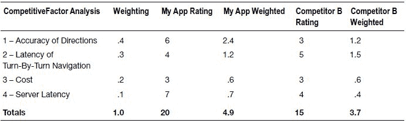
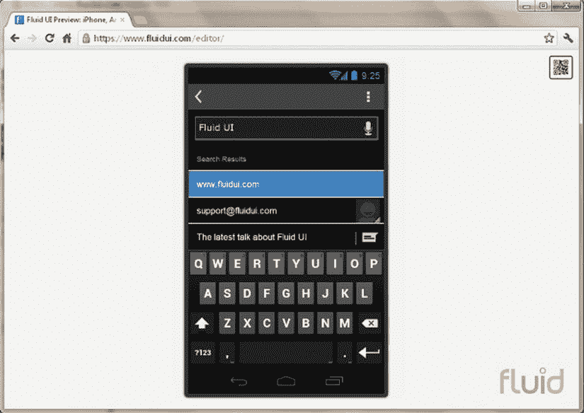
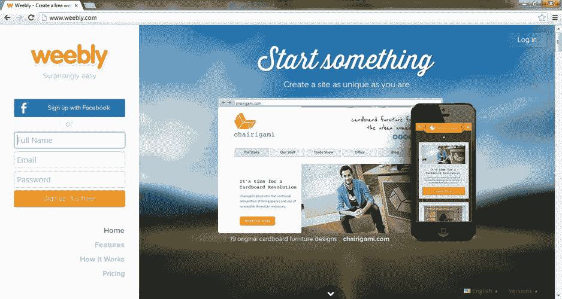

# 第 2 章：确保你的应用能够成功

我们相信你一定听过那句老话：“罗马不是一天建成的。” 如果你想构建一个成功的应用，根据其复杂程度，可能需要几天、几个月甚至几年。不过，我们也确信罗马的建造并非毫无规划。如果你想要建立你的应用帝国，你需要一份商业计划，将应用开发过程中的各种障碍都考虑在内。

## 你的应用与商业计划

*商业计划* 是一份文件，阐明企业的目标、这些目标为何可以实现，以及如何实现这些目标。商业计划没有固定的模板。如果你打算筹集风险投资，你可能需要考虑比我们建议的更正式的方法。不过，大多数应用开发者并不需要筹集资金。因此，我们将坚持采用一种非正式的商业计划来帮助你评估你的想法。

为什么你需要一份商业计划？也许更好的问题是：如果没有商业计划，会发生什么？

### 我们在第 1 章中已经阐述，Android 领域正在蓬勃发展。尽管可能拥有数亿 Android 用户，但在一个拥有数十万款应用的世界里，一款应用要想脱颖而出是非常困难的。

虽然 Android 让开发和发布应用变得容易，但坏消息是，如果没有经过深思熟虑并执行的计划，应用很难实现可观的销量。一份商业计划能为你提供关键洞见，让你了解自己的应用在当前 Android 市场中能否成功。

也许你怀疑自己是否有足够的能力制定一份商业计划，或者认为自己无法预见那些会影响 Android 应用的条件，直到为时已晚。是的，我们不可能预知所有可能影响应用成功的变量，但这正是你需要一份商业计划的原因！

撰写商业计划的最大好处在于，这个过程迫使你深入思考自己究竟想要实现什么目标。你投入多少，才能从中获得多少，所以请不要只是草草浏览接下来的几段文字；打开一个文本编辑器，开始记录这些内容具体如何应用于*你的*应用。

因为你可能并非为了提交给投资者而撰写商业计划，所以我们将聚焦于几个关键因素，它们能帮助你在开始编写代码之前就看清关键问题。我们将这种精简后的商业计划称为*微型商业计划*。让我们把它分解为七个部分：

1.  明确你正在解决的问题。
2.  分析你的竞争对手。
3.  确定目标市场。
4.  评估技术、执行和市场风险。
5.  思考盈利模式和定价。
6.  预估时间表。
7.  测试你的市场需求假设。

把这份商业计划想象成一个烤箱，它将你的应用创意烘焙至成熟。在你的想法还没有“半生不熟”之前，切勿开始编码！企业家（以及作家）最终总免不了要做一次*电梯游说*，这是一种在电梯运行这么短的时间内快速推销想法的浓缩方式。希望你能在电梯门为他们打开时，引起听众的兴趣。在制定商业计划的过程中，问问自己，你会如何向客户做“电梯游说”。这是检验你商业计划是否可行的有效方法。

### 明确你要解决的问题

关于开发一个像样的应用，第一条规则是：好的应用解决问题。你应该问自己这样一个问题：我的应用能为世界带来什么？即使是最简单、易学的游戏，也能消除用户的无聊感；玩几关《愤怒的小鸟》，就能让公交车上的时光或排长队的等待变得快得多。

你的应用是“维生素”还是“止痛药”？“维生素”是“有则更好”的解决方案，人们想起来才会用，但绝不会在绝望时迫切寻找。“止痛药”则是“必须要有”的应用，是我们为了使用它们而特意购买智能手机或平板电脑的理由。

如果你有 Android 设备，我们建议你把它拿出来，翻看屏幕上的应用。很有可能，你最近使用的大部分应用都是“止痛药”。“维生素”往往是那些你一时兴起下载下来，但几乎不怎么用的应用。

显然，我们的建议是开发一款“止痛药”类的应用，而不是“维生素”类的。虽然游戏应用通常是“维生素”，但也有例外。娱乐市场可能变幻莫测，但某些娱乐形式比其他的更像“止痛药”。如果你像马克一样，甚至可能对游戏应用上瘾。你可以思考一下你的游戏能解决什么问题，这会使你受益。例如，如果你的游戏在短时间的游玩中依然有趣，那么它就解决了短暂无聊的问题。有些游戏需要花时间去学习，用户可能需要玩上几个小时才能真正享受其中。你肯定不想在当地公交线路上推广这样的游戏。

### 分析你的竞争对手

每一个创意，无论多么原创，都必须与其他创意争夺用户的关注度。在将你的应用发布到世界之前，了解你的竞争对手是谁，是件好事。*如果你搞不清竞争对手是谁，那你就是在盲目飞行。*

想象一下，如果你制造了一种类似于《星际迷航》中的传送装置。你可能会认为这个想法如此原创且重要，足以主导市场，因此无需进行竞争分析。但如果每次使用需要花费 1 万美元呢？即使这个传送装置能安全快速地将人们送达目的地，大多数人仍然会选择他们最喜爱的航空公司（或他们的汽车）进行国内旅行。但竞争分析会揭示，长途头等舱商务旅行的费用也差不多，因此，这也许是最佳的目标市场。

类似地，如果市场上已经有一款应用能以更低的价格（或免费）实现同样的功能（并且在某些情况下做得更好），那么没有人会愿意使用你的应用。在应用的世界里，这个问题比其他竞争环境更为尖锐。热门的应用在 Google Play 列表中的排名更靠前，因此现有的热门应用往往会形成垄断地位。你必须问自己，为什么人们会使用你的应用，而不是类似的竞争应用。除非你的应用更好，否则你无法取代长期占据用户心智的热门应用。为了成功，你必须*显著地*比你的竞争对手做得更好。否则，你或许应该考虑让你的应用去做些别的事情。

了解竞争对手的方法有很多，但至少你应该在应用商店中搜索你所属类别的应用。阅读用户评论，试用它们，并让你的朋友给你反馈。你甚至可以开展一项调查。你还应该更广泛地思考你的竞争对手。有没有功能类似的 PC 软件？那电子设备呢？你的首要目标是了解市场上已经存在什么。

在收集了一些原始数据后，分析竞争对手的最佳方法是制作一张名为“竞争对手阵列”的图表。这张图表应该根据多个因素对你的业务和竞争对手进行排名。这些因素因行业而异，但你可以从表 2-1 中找到一个简化的竞争对手阵列示例。这里对两款逐向导航应用在四个因素上进行了比较。请注意，这些因素是有权重的。你需要自行决定哪些因素最重要，从而得出合适的权重。一旦你整理好这些信息，它就能为你决策提供依据，帮助你了解在你的应用具备竞争力之前需要做出哪些改变。

**表 2-1.** 使用竞争对手阵列对两款移动导航应用进行排名

### 确定目标市场

你可能会担心自己的应用永远无法与竞争对手抗衡。别担心！我们并不是说你必须创建一个新的应用类别才能成功。理想情况下，你会找到一个你的竞争对手未能充分服务的目标市场。通过专门针对这个市场，你可以吸引那些被竞争对手忽略的客户。

如果你最终发现分析有误，目标市场并不奏效，别灰心！通常你只需做些小改动，就能将现有应用聚焦到竞争对手尚未关注的细分市场。无论哪种方式，通过瞄准特定利基市场，你的应用会更早出现在该子市场相关的搜索结果中。然后你就可以将应用定位为专为这一细分市场设计进行推广。在前面的例子中，假设其他移动导航应用对骑行者的支持有限。或许你可以增加针对骑行者特有问题的功能。这样一来，即使其他逐向导航应用为汽车驾驶员提供了更好的性能，你的应用也会成为理想选择。

我们来谈谈如何确定你的目标市场。你会发现很少有事物能吸引所有人。回想一下你喜爱的电影，你很可能就能找到讨厌这些电影的人或群体。如果你足够聪明，在应用被创建出来之前，就能发现什么样的人会喜欢它。

理想情况下，你希望产品被所有人使用，但这在现实世界中很少发生。通常，最终会发现某个特定的细分市场或群体会大量使用某个产品。广告商意识到这一点，并经常针对这一群体定制他们的商业广告或其他形式的广告。想想你看过的所有广告，从超级碗价值数百万美元的广告到本地低预算广告：它们总是针对特定人群。如果你能弄清楚哪类人更有可能使用你的应用，那么你就已经迈出了寻找目标受众的第一步。

换句话说，很可能有特定的群体，无论是剪贴簿爱好者、邮票收藏家、体育迷，还是其他任何类型的爱好者，他们会比普通消费者更渴望使用你的 Android 应用。在决定如何营销你的 Android 应用时，这可能是一个需要考虑的最重要问题。

如前所述，Google Play 商店有数十万个 Android 应用，因此要让某个应用脱颖而出需要付出很多努力。思考一下接触你的受众需要投入多少时间和金钱。如果接触他们所需的成本超过了你预期的收入，那就有问题了。我们将在第 9 章中详细解释如何接触你的受众。

简而言之，你应该确定你的销售对象。设身处地为客户着想，想象他们在寻找什么。缩小目标群体是否让你更容易接触到他们？缩小目标群体是否让你更容易专注于他们的需求？缩小市场并不是坏事；它有很多营销优势，而成为一个利基产品也是从竞争中脱颖而出的绝佳方式。

事实上，大多数专业风险投资家在听说一家公司正在开拓一个以上市场时会感到担忧。当你刚刚起步时，专注于不止一种类型的客户实在太难了。如果你已经确定了不止一个目标受众，你应该认真考虑只从中挑选出最好的一个，并将你最初的努力集中在那里。

当然，你可能会担心目标市场太小，但请确保你对市场规模的理解是正确的。假设你正在开发一个让人们调音卡祖笛的应用。你可能会认为会吹卡祖笛的 Android 用户数量相当少。但从市场角度思考，这其实是一种错误的方法。问题不在于有多少携带卡祖笛的 Android 用户；问题在于你能接触到多少用户，以及他们愿意为卡祖笛调音应用支付多少钱。例如，假设有一个非常活跃的卡祖笛兴趣论坛，几乎每个卡祖笛演奏者都会访问，并且该论坛公开抱怨缺乏卡祖笛调音应用。在这种情况下，你实际上可能拥有一个非常好的市场，因为很容易接触到他们。如果你在那里发帖，几乎每个卡祖笛用户都会知道你的应用。

另一方面，你可能有一个非常适合有车一族的好应用，但无法让大多数车主了解它。考虑到超过 95%的美国家庭都拥有一辆汽车，你的目标市场似乎足够大。但如此高的潜在受众并不一定意味着庞大的用户数量。不要忽视让潜在用户了解你的应用的难度。创建一个具有真正巧妙功能的应用，通常足以吸引记者的兴趣，这能让你免费接触到用户。我们将在第 9 章中对此进行更多讨论。

我们来谈谈在构想目标市场可能是什么样子时，你可以考虑的一些因素。自然，你可以从思考基本的人口统计信息开始，可能包括年龄、地点、性别、收入水平、教育水平、婚姻状况、职业和种族背景。这些因素可以在你脑海中勾勒出一个特定客户的印象，但会非常模糊。

尝试更详细地想象你的目标客户。思考个人特征，例如他们的个性、态度、价值观、兴趣、爱好、生活方式和一般行为。继续思考，直到你能想象出一个典型的客户。你是否认识某个熟人或电视角色符合这一描述？记住那个形象。

现在想象你的典型客户将如何使用你的应用。你想象他们会在何时以及如何使用你的应用？他们会认为你的应用的哪个方面最重要？你将如何接触到他们？他们是读报纸还是用 Facebook？他们是你可能联系到的某个组织成员吗？

既然你已经缩小了对客户的想象范围，请确保你的市场足够大。记住，有时市场的大小并不绝对，更重要的是你接触这些客户的能力。但当然，世界上必须有足够数量的人符合你的客户画像，以便你能够实现收入目标。当然，你需要确保你的典型客户能买得起你的应用！最后，你需要能够通过某种营销技巧接触到他们。

---

评估技术、执行和市场风险

任何时候你想做某件事，都存在风险。每一次风险都伴随着失败的可能——这是一个我们讨厌听到的词，尤其是当它与我们的名字联系在一起的时候。我们要告诉你一个小秘密：快速失败。提前评估风险是确定你可能会在哪里失败的好方法。然后你可以决定这些风险是否可控；如果不能，可以尽早止损。

导致失败的原因有三个：

*   技术风险
*   执行风险
*   市场风险

我们将在接下来的章节中逐一审视这些风险。

技术风险

### 技术风险

**技术风险**简单来说就是：能否利用安卓提供的技术和工具来实现某个功能。理想情况下，技术能够满足你的需求，但有些应用会挑战其极限。如果你正在编写一个计算量非常大的应用（即非常耗用处理器资源的应用），就需要特别关注这一风险。运行速度较慢的安卓手机可能根本无法运行你的应用，而即使是运行速度最快的手机，如果你的应用持续运行，也会出现明显的电量消耗。当通过网络传输大量数据时，你也可能遇到类似的技术风险。你应该问自己：网络连接较慢时，能否处理你的应用？其他技术风险领域包括麦克风灵敏度、扬声器音量以及屏幕空间或分辨率不足。从更普遍的角度来看，有些算法根本无法在所有情况下都正常工作。例如，词汇量非常大的语音识别系统经常会遇到问题。视觉对象识别应用可能会混淆某些物体。这类问题需要在开发早期就加以解决，以避免浪费大量时间和金钱。

如果你已经识别出技术风险领域，那么在编写完整的应用之前，应确保你已经掌握这些领域的情况。一个简单的原型，甚至粗糙的拼凑软件，通常能让你更清楚地了解这个想法是否可行。始终努力消除商业计划中的风险！

### 执行风险

**执行风险**是一个简单的问题：你是否能完成你计划要做的事情？例如，你的应用可能需要非常复杂的算法，但你却是个新手程序员。你的应用可能没有高质量图形就无法成功，但你又并非经验丰富的图形设计师。你的应用在技术上或许是可行的，但你可能缺乏实现它的能力，从而导致项目严重延期。如果你是一名新手程序员，你真的应该请一位专家来评估你的计划。如果你无法方便地接触到专家，本书作者之一罗伊（Roy）总是乐于听取同行企业家的意见。即使他本人无法帮助你，他也可能认识能帮你的人。你可以通过他的网站（`www.sandbergsound.com`）联系他。请记住，那些看似简单的事情，通常只是因为我们对其细节知之甚少，才会觉得简单。

### 市场风险

**市场风险**本质上是要弄清楚市场是否会以你所期望的规模使用你的应用。应用开发者面临的一个非常普遍的问题是，无法承担广告费用。如果你的应用售价为`1.00 美元`，但获取一个用户的广告成本是`1.05 美元`，那你就面临问题了。虽然广告成本因你使用的媒介（谷歌、Facebook、杂志、电视、广播等）而异，但你可以粗略估算一下：假设通过印刷媒体接触到一位读者的成本是几美分（名义上的`0.05 美元`）。你可以大致估算出，将一次点击引导到你的网站的成本也是这么多。多少次浏览或点击会产生一次销售？嗯，这无法提前预知，但如果你必须猜测，你的预估不应超过 1% 左右。

幸运的是，你不必猜测。在你的网站上出售你的产品，并记录下有多少独立访客表达了购买意愿（他们点击了`购买`按钮）。你甚至不需要准备好产品就可以这么做；只需记录下潜在购买者的联系信息，并告诉他们产品准备好后会通知他们。除了广告之外，我们将在第 9 章中探讨获取用户的其它方法，但你应该确保你有一个吸引目标受众的策略。

你*不应该*做的是这样想：“只要我建好了，他们就会来。”这在棒球场或许行得通，但绝对不适用于应用。将你的应用上架到 Google Play 商店可能会让一些人安装它，但如果不采取额外措施，你无法获得足够多的用户来取得哪怕是适度的成功。解决这个问题的一个方法是思考你用户的兴趣，以及如何利用这些兴趣来接触他们。是否有他们聚集的在线论坛？他们是否阅读某些杂志？你能通过病毒式传播（朋友的朋友）接触到他们吗？简而言之，如果你想不出如何接触你的客户，你就不可能拥有大量客户。

### 思考盈利与定价

任何业务的关键一步都是为你的产品定价。顾客总是想要不劳而获，而安卓上有许多应用是可以免费获取的。作为开发者，你仍然可以通过免费应用投放广告来赚钱。或者你也可以为你的应用收费。实际上，有多种选择可供考虑。现在是时候考虑这些选项，并评估哪种选择最适合你的应用了。

#### 付费应用

你可以直接销售你的应用，你的应用会有一个明确的价格标签。请记住，大多数市场会收取你标价 30% 的佣金。你必须说服顾客，让他们仅仅凭借你产品的描述和评价就掏钱，而这在没有营销的情况下是很难做到的。你可以忘掉那种把应用往 Google Play 上一放，就能坐等利润增长的美梦了。好的一面是，你不必非常频繁地更新你的应用，因为用户购买后，你无需再维持他们的兴趣；你无法再从他们身上赚到额外的钱。当然，你确实希望用户给你好评，所以确保你的应用高质量运行且没有任何缺陷，对你是有好处的（也符合你的最佳利益）。

难点在于持续向新用户展示你的应用。虽然你肯定会得到一些通过搜索关键词找到你的用户，但总的来说，你需要持续寻找宣传渠道才能产生真正的收入。对于低价位应用，除非获取新用户的成本非常低，否则广告可能行不通。如果你的应用非常专业，并且可以支撑较高定价（比如`10 美元`或更高），你可以预期通过传统广告渠道取得一些成功。

#### 免费应用

世上或许没有免费的午餐，但确实存在免费的应用。然而，我们大多数人不会毫无回报地免费赠送东西。所以，即使你可能不向用户收取运行应用的费用，也有可能通过广告来赚钱。

你需要找到一个服务商，愿意为你在应用中投放广告而付费给你。通常，你会在用户每次点击广告时获得报酬。我们将在第 6 章中进一步讨论这一点。

与付费应用相比，免费应用可能会获得多得多的下载量，轻松达到十倍或更多。不幸的是，通常你从每个用户身上赚到的钱会更少，至少短期内如此。一个广告投放服务商（例如 Google AdMob）会定期投放一个新广告，可能每分钟一次，尽管这个频率开发者可以调整。因为任何一个广告都可能是用户感兴趣的，所以你的应用投放的广告越多，就越有可能获得点击。这意味着，用户会长时间交互的应用非常适合采用免费的、由广告支撑的模式。相反，如果你的应用解决了一个非常重要的问题，但用户只使用一次或很少使用，那么你最好把它做成一个付费应用。

#### 免费增值应用

### 变现模式

免费增值应用是完整版应用的轻量版本，旨在促使用户为升级付费。免费版本甚至可以显示广告。如果你采用这种模式，应明确告知用户何时需要付费升级。不要将应用伪装成免费应用，之后又让用户感到意外。

当然，这种方式可能会变得复杂，因为你必须维护同一应用的两个版本，这意味着需要向 Google Play 提交两个应用。

确定免费版与付费版之间的临界点可能很困难。*愤怒的小鸟*之所以能盈利，是因为免费版提供了少量关卡，但这些关卡足以让玩家渴望更多。这是理想的情况：当用户被吸引住时，再让他们从免费版切换到付费版。这时，他们更愿意花钱。

除此之外，通过免费版建立用户的信任，会让他们更愿意选择升级到付费版。关键在于，付费版应提供用户开始使用应用后真正需要的功能。你通常可以在免费版中人为地限制某些功能，使其足够有用，但对高级用户来说又不够用。

#### 服务模式

这种技术让用户在下载应用时为特定服务付费。作为开发者，你甚至可能不是提供该服务的人，但每次你为用户连接服务提供商时，都可能从中赚取一定费用。

可能涉及订阅模式，例如 Kindle Fire 上的许多应用。Kindle Fire 提供杂志订阅功能，但某些期刊、书籍甚至节目会选择以应用形式提供，用户通过订阅来获取最新“期号”。

正如这个例子所示，当应用被用作提供某种底层能力（例如频繁更新的内容）的载体时，这种变现技术效果最佳。由于应用用户对价格非常敏感，你需要让他们相信，他们得到的不仅仅是一个应用。几乎没有人会愿意为不能提供现实价值的应用每月持续付费。

#### 应用内购买

应用内购买是指让用户为应用内的某些功能付费。这在游戏中很常见，角色可以为更大的武器甚至一些看似表面的东西（如不同的皮肤）付费。另一个例子是免费的翻译应用，但要求用户为特定的语言模块付费。

实际上，这种变现策略与免费增值模式非常相似：用户免费获得应用，然后被说服为更多功能付费。应用内购买的优势在于，用户可能会随着时间的推移进行多次购买；因此，对于需要反复使用的应用来说，这可以带来持续的购买收入流。

#### 其他盈利模式

一些最好的商业模式涉及创造性的变现策略。仔细想想，有些移动应用仅仅是实现商业交易的手段。例如，eBay 提供了一个免费的应用程序，有助于查看拍卖状态。任何在 eBay 上拍卖的人都向 eBay 支付少量佣金；这是其商业计划的核心。eBay 应用程序有助于随时随地进行拍卖；它通过让更多用户更轻松地买卖商品来收回成本，这意味着更多的拍卖交易会发生。

Flywheel、Lyft 和 Uber 通过让用户从 Android 手机叫车（出租车、拼车或专车）来盈利。用户下载免费，没有广告，也没有需要付费的服务。那么它们如何赚钱？它们从司机接到的每笔订单中收取费用！通常，如果你能将应用插入买家和卖家之间，你可以向卖家收取少量费用，他们会很乐意支付，因为你为他们带来了客户。

尽管市场应用内购买库不支持实物商品的销售（参见第 7 章），但你完全可以在应用内链接到实物商品。无论是通过联盟计划（参见第 6 章），还是仅通过链接到你网站上的产品，你都可以利用应用来促进实物商品的销售。

### 估算进度表

正如我们在第 1 章中所述，Android 开源开发工具是完全免费的。但正如谚语所说，时间就是金钱。当然，你可以花大量时间制作完美的应用，但谁来付钱给你？此外，如果你真的创建了这款完美的应用，万一别人也在做同样的事情呢？花时间制定项目进度表，这样你就能知道需要多少时间；这将让你更好地判断开始是否值得。

你不必使用复杂的图表或特殊软件来制定进度表，尽管如果你愿意也可以。这里的关键点在于，将你的想法分解成一系列步骤。然后，将这些步骤进一步分解。当每个步骤的实施时间不超过一天时，你就有了一个合适的进度表。

如果你不知道某项任务需要多长时间，就说明你识别出了一个执行风险（如前所述）。你应该咨询专家，看看能否从他们那里得到估算。他们应该能够将问题分解为一系列步骤；如果他们不能，那他们就不是他们声称的专家。你也可以让他们估算为你实施解决方案需要多长时间以及多少成本。这可以帮助你判断对其中涉及的复杂性是否有现实的把握。

在很多情况下，你可以为应用编写一些伪代码，通过尽可能详细地分解每个子程序，并估算每个例程的代码行数，来获得对实现复杂性的相当清晰的认识。

比尔·盖茨说过：“用代码行数衡量软件生产力，就像用重量衡量飞机的制造进度一样。”因此，提到这一点是有争议的，但一些程序员喜欢估算他们每天能写出 80 行高质量代码（完全经过测试，包括单元测试）。在某些情况下，这可能有助于你更好地估算进度表。

不过，你的进度表不应仅限于编码。你还应该考虑为网站开发内容所需的时间（本章后面以及第 9 章会讨论）。市场推广和销售任务所花费的时间也应包含在内。随着你对这些主题了解得更多，你可以重新审视你的进度表。

即使是相当复杂的项目进度表，也可以写在纸上，或用文字处理器或电子表格实现。然而，如果你不熟悉项目管理，并想以专业的方式管理进度表，你应该考虑使用项目管理软件。至少，项目管理软件允许你安排任务，以便自动计算任务持续时间，包括休息日。涉及许多可变因素的复杂进度表将最受益于这类软件。Microsoft Project 几乎是项目管理的行业标准软件包。幸运的是，你不需要投资昂贵的 Microsoft 产品才能入门。

`ProjectLibre` 是 Microsoft Project 的一个免费开源替代品，可在 Windows、Mac 和 Linux 上运行。它提供了 Microsoft Project 中的许多相同功能，并且在世界各地都有用户组，你可以在那里获得帮助。你可以在其官方网站上了解更多信息：`http://www.projectlibre.org/`

### 测试你的市场需求假说

#### 实际上，如果不真正制作、推广和发布一款应用，根本无法测试其是否成功。要是能放一个假应用出去，看看有多少人下载就好了。可惜这样做既不道德，还会招致极差的评价，甚至可能被应用商店和安卓开发者计划扫地出门。

是的，这根本不值得冒那个风险。不过，你可以退而求其次，建立一个销售应用的网站。先让访客知道你的应用尚未就绪，但要在观察他们的反应之后再说。如果发现应用需求不足，你就省去了大堆麻烦，只需告诉那些注册的人项目取消了就行。你的网站可以利用在线工具轻松免费地设计。我们将在本章后面讨论如何快速搭建网站。

确保你的网站包含应用的详细描述，如果可能的话，还要贴上（模拟的）截图。有不少在线工具可以快速免费地制作用户界面（UI）原型，你的工作不会白费，因为之后你还会用到这些成果。我们将在下一节讨论这些工具。

在撰写描述和制作截图时，你应该回答以下几个问题：

*   你在商业计划的前面部分做了哪些假设，这些假设现在可以验证吗？
*   你的描述是否能精准聚焦于目标市场？
*   你的截图能否暗示出盈利策略？

除了包含详细描述和截图外，非常重要的一点是，你要向读者提供下载应用的选项。如果应用不是免费的，这个选项还应列出价格。通过模拟真实用户会经历的实际情况，你可以筛选掉那些只是出于好奇的人，从而聚焦于真正的潜在客户。

当用户尝试下载应用时，你应引导他们进入一个注册页面。这个页面会告诉他们应用目前还不可用，但一旦可用就会立即联系他们。如果你添加一个字段让他们留下评论，那就有了一个从潜在用户那里获取反馈的绝佳方式。利用我们将在下一节讨论的免费网站构建工具，这很容易实现。

待你的假设测试网站准备就绪后，你需要吸引一些访客来浏览。这时，你之前定义目标受众所做的基础工作就开始发挥作用了。你之前想好了如何触及你的受众，对吧？那么，就在你的潜在用户经常出没的（众多）论坛中的某一个上发帖，吸引一些用户访问你的页面。你不需要太多人，但确实要追踪有多少人看到了你的帖子，有多少人点击进入了你的网站，以及有多少人到达了注册页面。这将让你了解你的应用在目标受众中的受欢迎程度。

如果你正在多个目标受众之间做选择，那么对每个受众都重复这个过程，是基于硬数据选出优胜者的绝佳方法。算出一些百分比后，你就能推算出当规模扩大、触达更广泛受众时，会获得多少用户。

仅凭反馈，这个过程就值得去做。有一个想法是一回事，但当真实的人告诉你他们对你的想法有何看法时，又是另一回事。通常你会发现，仅仅通过阅读他们发来的几条评论，就能更好地理解你的目标受众。利用所有这些信息来判断你是否具备成功的条件。请记住，在你与预期的目标受众接触后，最初的想法往往会发生巨大变化。无论做什么，一定要倾听你的潜在客户。他们的意见才是最重要的。

#### 用于制作截图原型的工具

在测试市场需求假设时，让你的截图看起来尽可能真实非常重要。幸运的是，有许多工具可用于制作截图原型。如果你确定应用前景光明，那么在截图上投入的时间将物有所值。在某些情况下，这些原型制作工具可以生成可用的安卓 XML 代码。

网上有大量的原型制作工具。以下是你可以选择的几种：

*   `Fluid UI` (`http://fluidui.com`)：`Fluid UI` 让你无需担心代码就能快速模拟应用。图 2-1 展示了一个安卓的模拟示例。

图 2-1。使用 `Fluid UI` 制作的用户界面模拟示例

*   `Android GUI Prototyping` (`http://www.artfulbits.com/products/free`)：如果你是微软 Visio 用户，可以考虑使用这个模板。你需要 Visio 2003 或更高版本。
*   `DroidDraw` (`http://www.droiddraw.org/`)：一个基于网页的设计器/编辑器/构建器，用于安卓平台上的手机和平板应用编程。目前处于测试阶段，它甚至能生成与你构建的 UI 相对应的 XML 文件。在你开始编写代码后，这能为你节省大量时间。
*   `Pencil` (`http://pencil.evolus.vn/en-US/Home.aspx`)：由 Pencil 项目设计，是一个免费开源的工具，可用于图形用户界面（GUI）原型设计。`Pencil` 包含一个用于安卓模拟的模板。它作为一个应用程序提供，适用于 Windows、Macintosh 和 Linux 系统，也可作为 Firefox 扩展使用。
*   `Fireworks Template for Android` (`http://unitid.nl/2009/11/fireworks-template-for-android/`)：如果你是 Adobe Fireworks 用户，可以考虑这个模板，它将安卓用户界面元素重新绘制为矢量图像。
*   `Android Wireframe Templates` (`http://gliderguns.files.wordpress.com/2010/01/android_wireframe_templates3.pdf`)：如果你还处于构思阶段，想先对整体创意做些探索，你总是可以用纸和笔开始。这些线框模板能帮助你制作出更逼真的布局。包含实际的安卓手机插图，涵盖 HTC Dream、HTC Hero、HTC Magic、HTC Tattoo、HTC Nexus One 和 Motorola Droid。

你可能会考虑创建一个完全原创的界面。例如，你可以非常大胆地做出像立体书那样古怪的风格；或者做出不仅仅是常见的按钮、下拉菜单和手指滑动组合的东西。你应该意识到，安卓的 UI 有特定的范式，如果违反，可能会破坏用户的思维模型，从而引起困惑。如果你要违反标准的设计规则，必须有充分的理由。请谨慎行事。

#### 用于搭建网站的工具

为了测试你的市场需求假设，你需要搭建一个网站，作为放置截图和应用描述的地方。毕竟，你不能把一个假的应用放到真正的应用市场里！

由于关于网站构建的书籍已有很多，我们就不详细讨论如何创建一个很酷的网站了。只需确保它看起来专业即可。如果你的网站看起来太业余，你无法准确判断市场需求。我们都曾访问过一些给人留下坏印象的网站，而这种印象会影响我们的购买决策。如果你是网站开发新手，你可能想使用像 Weebly（见图 2-2）这样的服务来搭建你的网站。

图 2-2。Weebly 是众多可用于快速搭建网站的免费工具之一

  
