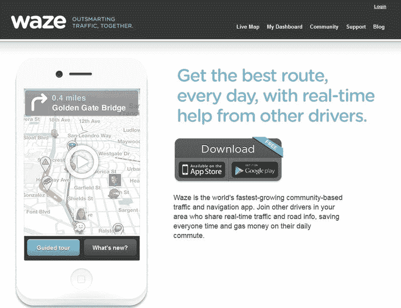

# 第 2 章  

虽然你的网站必须看起来专业，但不必非得复杂精美。只需几个页面，甚至可能一个页面就足够了。只需确保你的网站与你的应用性质相匹配。在这里，你可以选择包含你的图标、Logo、截图以及应用的任何其他风格元素。你或许可以前往`Google Play`随便选一款应用。每款应用下方都应有一个指向开发者网站的链接，这样你可以看看它们长什么样。例如，图 2-3 展示了`Waze`应用的网站。这个网页传达了应用的精髓。`Waze`是一款极为知名的应用，但你会发现它的着陆页其实非常简单。要搭建出同等完成度的应用网站，并不需要花很长时间。  

  

图 2-3。Waze 网站  

有大量工具可以帮你快速搭建网站。为了能快速建站来测试你的商业计划，我们只讨论那些免费提供网页托管服务的在线建站软件。这些工具让你可以免费设计网站，不花一分钱。此外，我们选择的工具不会在你的网站上塞满不专业的广告。遗憾的是，它们都会在页面底部加上一个小页脚，不过并不太碍眼。  

*   **Weebly**（`www.weebly.com`）：罗伊在使用`Weebly`（如图图 2-2 所示）托管自己的网站时效果不错。`Weebly`非常易用，并提供了大量模板可供选择。  
*   **SnapPages**（`www.snappages.com`）：这个网站构建器简单又省心，包含许多网站模板。  
*   **Webnode**（`www.webnode.com`）：这款工具对个人网站免费，有上百种模板可供选择。你完全可以用个人网站来承载你的市场需求假设，其付费服务从`$4.95/月`起。  

## 你的“宝宝”或许很丑  

当别人对你花了很长时间才拼凑起来的东西迅速提出批评时，总是很伤人。就像父母养了个丑宝宝一样，开发者往往不顾外界的挑剔眼光，依然深爱着自己的应用。请务必记住，尽管你孕育了一个新想法，但应用*不是*一个宝宝。优秀的企业家能够接受批评。有时，事实就是对你不利，而你的时间最好花在寻找新想法上。  

## 你才是老板  

我们希望本章为你提供了所需的工具，让你能判断自己的想法是否具备成功的条件。前面列出的七个要点应促使你对你的 Android 应用提出尖锐的问题，我们也陈述了一些关于在 Android 应用世界里什么能成功、什么不能成功的规则。这些规则值得考虑，但不要钻牛角尖；实际上，它们只是指导方针。换句话说，规则可以被打破，但你得自担风险。我们试图阐明该遵循哪些规则，但这段旅程终究要靠你自己走。  

## 总结  

现在你了解了情况，让我们来过一个简单清单：  

*   你正在解决什么问题？  
*   这是止痛药还是维生素？  
*   你的竞争对手是谁？你有什么是他们没有的？  
*   目标市场是谁？  
*   你将如何接触目标市场？  
*   开发这款应用需要多长时间？你能把任务分解成各个里程碑吗？  
*   你必须解决哪些技术风险？你如何向自己证明它们可以被解决？  
*   你是否有时间和资金来实现这一切？是否需要请一位顾问评估你的想法？  
*   市场是否足够大，能提供你所需的收入流？  
*   市场是否足够小，以至于你能精准满足其需求？  
*   你的目标客户愿意付费吗？  
*   你针对的是哪个 Android 版本？  
*   你采用什么定价模式？  
*   你是否测试过你的市场假设？  
*   你是否不想再回答问题，只想打破规则？这由你决定，但后果自负。  

