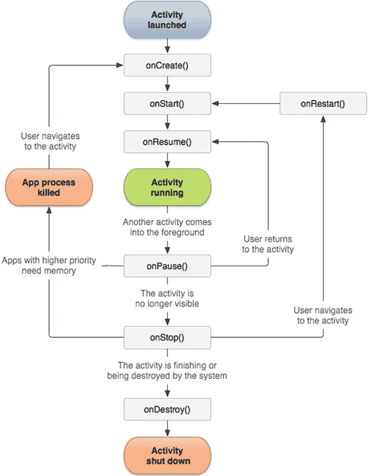
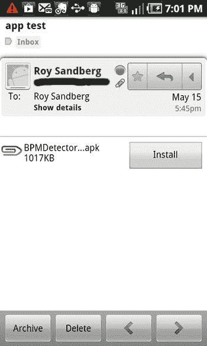

# 第四章：Android 开发简介

至此，你已经看到 Android 应用营销的混乱中是有章可循的。第 2 章讨论了如何构思那个百万美元的点子，第 3 章则涵盖了一些法律细节。本章将带你了解实际创建 Android 应用的第一步。

如果你是一位经验丰富的程序员，可能会觉得本章内容过于基础，更像是复习回顾。如果是这样，不妨快速浏览后继续阅读后续专注于 Android 应用营销的章节。

如果你是初次接触开发的程序员，则应仔细阅读本章以理解相关概念。我们编写本书是为了让每个人都能在当前的 Android 市场上获得成功，因此在为你的应用编写第一行代码之前尽可能多学习将大有裨益。

如果你刚开始为 Android 编写应用，可能会发现大量专业术语充斥其中，在这片缩写词的海洋中导航可能困难重重。尽管我们无法在一章内教你如何编写 Android 应用，但我们可以提供一份非常宏观的概述，希望这能为你自行深入学习提供指引。

### 作为开发者的第一步

如果你刚开始成为 Android 开发者，你需要 Android 开发者工具（`ADT`）包。你还需要 Java 开发工具包（`JDK`）才能使用`ADT`，因为 Eclipse 集成开发环境（`IDE`）是用 Java 编写的。如果你的电脑上尚未安装`JDK`，应在安装`ADT`之前先安装它。你可以从 Oracle 网站下载`JDK`：`http://www.oracle.com/technetwork/java/javase/downloads/index.html`

安装标准 Java `JDK`后，你可以从 Android 软件开发工具包（`SDK`）网站安装 Android `ADT`包。该包几乎包含了开始使用`SDK`和 Eclipse IDE 所需的一切。它还包含其他开发工具，例如可用于模拟 Android 设备进行测试的模拟器。`ADT`还包括 Android 应用程序编程接口（`API`）的文档、Android 平台的源代码，以及演示如何使用许多`API`元素的示例。只需一键点击，即可下载所需的一切：`http://developer.android.com/sdk/index.html`

`ADT`包支持 Windows（提供 32 位和 64 位选项），但也提供适用于 Ubuntu Linux（8.04 或更高版本）和 Mac OS X（10.5.8 或更高版本）的其他包。适合你的操作系统（`OS`）的包应会作为默认选项显示。

安装`ADT`包后，我们建议你浏览 Android 的在线开发者资源。获取 Android 信息的最佳途径是官方一手资料：`http://developer.android.com/index.html`

花些时间四处浏览。关于 Android 设计、开发和分发所需了解的一切都在该网站上。如果感到困惑，可以回到本章。我们的目标是为你提供一些基本方向，但在线材料更为详尽。

如果你需要特定于 Android 应用的信息，以下链接也很有帮助：`http://developer.android.com/guide/components/fundamentals.html`

安装 Android `ADT`包后，你可以查看一份很棒的应用开发入门指南：`http://developer.android.com/training/index.html`

### 集成开发环境（IDE）

作家倾向于使用文字处理器写作；开发者则倾向于使用 IDE 编码。`IDE`是一种应用程序，与文字处理器有些相似，它使你能够查看和修改源代码。源代码通常采用颜色编码，以突出显示关键字和语法。此外，IDE 会在你编写代码时检查语法（结构），并与编译器和调试器等开发工具集成（因此得名）。IDE 拥有许多非常有用的功能，使编写软件变得更容易、更愉快。

Eclipse 是一个著名的开源 IDE，主要用 Java 编写，并围绕插件理念构建。Eclipse 几乎拥有适用于所有功能的插件，包括多种编程语言的开发、调试和版本控制。尽管这与 Android 开发没有直接关系（就像知道如何使用文字处理器与写作没有直接关系一样），但它非常强大，值得了解。你可以在此处了解更多信息：`http://help.eclipse.org`

Android 提供了一个非常适合开发 Android 应用的 Eclipse 插件。`ADT`插件将你的 Eclipse 工作区定制为适用于 Android。它包含引导式项目设置、Android 配置文件的专用编辑器、调试输出等功能。它能完成你所需的一切，甚至包括创建可上传到 Google Play 和其他市场的发布包。

或者，你可以使用商业 IDE，如 JetBrains 的 IntelliJ IDEA。IntelliJ 有免费的社区版和商业的终极版。一些开发者对终极版推崇备至，认为其拥有卓越的代码索引功能，从而带来更好的代码补全、重构和导航体验。IntelliJ 也支持插件，使其成为 Android 开发的良好选择。你可以在此处了解更多关于使用 IntelliJ IDEA 进行 Android 开发的信息：`http://www.jetbrains.com/idea/features/android.html`

### Android 操作系统的优势

如第 1 章所述，Android 是一个基于 Linux 的操作系统，依赖 Java 来简化软件开发。它还大量使用可扩展标记语言（`XML`）来进一步简化编码任务。

Android 基于 Linux 开源操作系统内核。由于 Linux 使用 C 语言和汇编语言编写，因此您可以使用操作系统的“原生”语言开发部分应用程序。Android 原生开发套件（NDK）为开发者提供了这一能力。请注意，通常没有必要使用 C 或 C++ 进行原生应用开发，除非特定的性能问题要求这样做。在其他问题中，C/C++ 开发依赖于底层硬件，因此如果使用 C/C++ 元素，您的应用将无法保证可移植性。

将应用中的软件与底层硬件连接起来的软件库统称为应用程序编程接口（API）。Java API 用于与所有设备硬件进行交互。典型的智能手机拥有相当多的硬件需要支持。当然，还有多点触控用户界面功能，如滑动、轻点和捏合。内部硬件设备和传感器，如加速度计（用于检测手机运动和旋转），由操作系统直接支持。摄像头、GPS、麦克风以及现代手机提供的几乎所有其他功能都可以通过 Java API 访问。

作为移动操作系统，Android 从设计之初就致力于最小化功耗。这一点体现在用于管理多个应用程序的技术中。当前未使用的应用程序会被挂起——它们会在后台等待，直到再次被需要。这意味着通常只有当前应用会消耗电池电量。这也意味着没有理由关闭应用。用户可以简单地开始使用新应用，而被挂起的应用会等待，直到再次被需要。如果内存不足，Android 会删除那些用户最不可能用到的应用（那些使用频率最低的应用）。这种管理应用程序的方式与桌面操作系统的工作方式截然不同。我们在本章后面讨论应用生命周期时会进行更详细的介绍。

在 Android 中，新应用通常通过在线连接到 Google Play 商店进行安装。用户可以通过 Google Play 应用搜索和浏览新应用。如果用户选择安装新应用，他们会被告知该应用需要访问的所有资源。例如，它可能需要访问用户的电话簿联系人或手机的位置信息。因此，用户在下载应用之前会被告知其影响。虽然并非万无一失，但此过程为防范恶意开发者提供了一定的保护。

应用下载到设备后，Android 的安全模型能进一步保护用户免受恶意应用的侵害。每个应用都在自己的*沙箱*中运行，这意味着应用对系统资源的访问权限有限，并且其通过意外错误或故意恶意攻击对用户造成伤害的能力也受到限制。

在实践中，安全沙箱通过多种措施实现。Android 的核心是 Linux，而 Linux 支持多用户。Android 将这种支持扩展到应用。正如一个用户在访问其他用户数据时受到限制一样，Android 中的应用也是如此。从技术角度讲，每个应用都在自己的进程中运行。对于用 Java 编写的应用，每个应用也在自己的 Dalvik 虚拟机实例中运行。我们将在本章后面详细解释 Dalvik，但现在您应该知道，它阻止了应用之间在没有专门设计的消息传递的情况下相互交互。安全沙箱还有许多其他技术方面，但关键在于 Android 实现了最小权限原则：应用只能访问其所需的系统资源——而且仅此而已。

## Java 语言

Java 是移动应用开发的合理选择。根据 `langpop.com` 的数据，它是世界上第二流行的计算机语言，这意味着许多开发者已经熟悉它，并且存在庞大的软件开发资源基础设施。

从某种意义上说，Android 使用 Java，因为为 Android 编写的代码遵循所有 Java 语法要求。然而，Android 版本的 Java 无论在执行方式还是支持的库方面，都与 Oracle 的标准 Java 版本有显著不同。我们将在下一节讨论这些差异，但首先让我们谈谈所有 Java 变体共同的特性。

即使您对 Java 一无所知，任何程序员学习它都相对容易。其语法类似于 C、C++、C# 和 Objective C。如果您了解这些语言中的任何一种，并理解面向对象编程（OOP）的基础知识，那么您将比其他初学者拥有更大的优势。

Java 的一个显著特点是在虚拟机内执行。与 C 或 C++ 等传统编译语言不同，只要为特定平台编写了 Java 虚拟机，相同的 Java 二进制文件（由 Java 字节码组成）就可以在任何硬件平台上运行。这使得 Java 代码具有极高的可移植性。

与许多现代编程语言一样，Java 是面向对象的。因此，作为开发者，您应该将软件编写为一系列相互交互的对象，每个对象解决一个特定问题。面向对象范式鼓励良好的编码实践，并使您的软件易于重用。正如您所料，Android API 积极支持并推广这种开发风格。

与 C、C++ 和 Objective C 不同，Java 自动在后台管理计算机的内存（仅带来轻微的性能损失），因此您无需记住删除不再使用的数据结构。实际上，Java 不要求程序员操作指针，而这在许多低级语言中很常见。对于任何曾与指针和内存泄漏作斗争的开发者（包括 Roy）来说，这是一个可喜的变化，无疑会减少开发和调试时间。

Java 的另一个优秀特性是反射：程序可以在运行时查看自身的软件对象并修改它们。这有点像对自己进行操作，但唯一痛苦的是它可能会让您头晕目眩。反射对作为开发者的您有许多实际好处。许多测试框架（如 JUnit，在后续章节中讨论）使用反射来提供对所测试代码的更高智能。

反射好处的另一个有力例子可以在 Eclipse 中找到。使用反射，Eclipse 环境可以在您编写代码时理解它。因此，它可以实时指出代码中的错误。

Java 功能齐全。一套全面的 API 意味着您可能需要的几乎所有数据结构或软件框架都可以随时获得。在许多情况下，非 Android 的 Java 软件包可以简单地作为预构建包（称为 Java 存档（JAR）文件）放入您的开发环境中。

尽管我们可以用整本书来学习 Java，但我们不会这样做，因为我们的出版商已经在销售这些书了。以下是一些很好的起点：

*   *为 Android 开发学习 Java*，Jeff Friesen 著（Apress，2013）
*   *使用 Eclipse 开发 Android 应用*，Onur Cinar 著（Apress，2012）
*   *Android 秘籍：问题解决法*，Dave Smith 和 Jeff Friesen 著（Apress，2012）

许多免费的在线资源只需点击几下鼠标即可获得，包括 `http://www.oracle.com/technetwork/java/index-jsp-135888.html` 和 `http://mobile.tutsplus.com/tutorials/android/java-tutorial/`。

### Android 上 Java 的特殊性

### Android 与传统 Java 的差异

Android 以其自有的虚拟机 `Dalvik` 而闻名。传统上，Java 使用 Java 虚拟机（`JVM`）执行 `.class` 文件。`Dalvik` 将 `.class` 文件转换为 Dalvik 可执行文件（`DEX`）。`Dalvik` 针对低内存需求进行了优化，并在许多方面与传统 JVM（例如 Oracle 支持的 JVM）有所不同。幸运的是，由于 Android 构建工具会自动将非 Android 的 `.class` 文件转换为与 Dalvik 兼容的可执行文件，这些差异对开发者来说基本不可见。

不幸的是，熟悉传统 Java 的开发者会遇到一些实际差异。Android 使用其自己的图形用户界面（`GUI`）库。Java 标准版（`SE`）提供了 `Swing GUI`，这是主要的 Java GUI 组件工具包，但在 Android 上完全不受支持。任何 `Swing` 代码都需要完全重写。但 Android 的 GUI 确实有实际的好处。通过高度依赖 XML 定义，Android 简化了 GUI 设计，并促进了更易读的界面。

Android 大量使用 `XML`，这是一种设计为人类和机器都能理解的文本格式。作为开发者，每当你在文本文件中向操作系统传递标准信息时，你都在使用 XML。除了在 GUI 设计中使用外，XML 文件还可以存储你的应用程序使用的文本字符串。虽然不将文本字符串存储在 XML 中也能应付，但这样做的好处值得付出一点努力。

一个编写良好的 Android 应用会将其字符串存储在位于 `/res/values` 目录中的 XML 文件中。XML 格式包含标识符，让操作系统知道文件中包含字符串文本数据。每当你在应用程序中需要访问一个字符串时，可以通过标识符 `R.string.*string_name*` 在代码中引用它。这不仅提高了代码的可读性，还允许 Android 工具自动国际化你的应用程序。

在你发布应用之前，Android 工具可以自动翻译你的 `/res/values/strings.xml` 文件。它会被自动翻译成不同的语言，以便世界各地的用户可以用他们的母语使用你的应用。当然，翻译可能不完美，因此在大多数情况下，你需要找人检查每项翻译并清理任何问题。此外，你需要将翻译后的文件复制到一系列目录中，每种你计划支持的语言对应一个目录。例如，法语翻译可以放在名为 `values-fr` 的目录中。花点额外的功夫也不算太差，对吧？你可以在以下网址了解更多关于自动翻译的信息：`http://googledevelopers.blogspot.com/2012/03/localize-your-apps-and-content-more.html`

我们提到字符串 XML 文件存储在 `/res/values` 目录中。`res` 代表 `resources`（资源），这是 Android 中一个非常强大的概念。Android 大量使用资源文件，并将其与 Java 紧密集成。你刚刚看到了如何通过标识符在代码中访问资源文件字符串。类似地，可绘制资源（如图标和图像）也可以通过 Java 以编程方式访问。用于 GUI 布局的 XML 文件也是资源。最后，诸如声音样本之类的任意文件也可以作为资源访问。

Android API 与传统 Java 使用的 API 之间还有许多其他差异。值得注意的是，以下原本属于 Java 2 平台标准版的包是缺失的：

*   `java.applet`
*   `java.awt`
*   `java.beans`
*   `java.lang.management`
*   `java.rmi`
*   `javax.accessibility`
*   `javax.activity`
*   `javax.imageio`
*   `javax.management`
*   `javax.naming`
*   `javax.print`
*   `javax.rmi`
*   `javax.security.auth.kerberos`
*   `javax.security.auth.spi`
*   `javax.security.sasl`
*   `javax.swing`
*   `javax.transaction`
*   `javax.xml`（除了 `javax.xml.parsers`）
*   `org.ietf.*`
*   `org.omg.*`
*   `org.w3c.dom.*`（子包）

此外，还包含了以下第三方包：

*   `org.apache.commons.codec`：编码和解码工具
*   `org.apache.commons.httpclient`：HTTP 认证、Cookie、方法和协议
*   `org.bluez`：蓝牙支持
*   `org.json`：JavaScript 对象表示法（JSON）

整个 Android API 的详细描述可以在 Google 的 `developer.android.com` 网站上找到：`http://developer.android.com/reference/android/package-summary.html`

### 应用生命周期

当你从传统 Java 编程背景转来时，会遇到的最大差异就是 Android 应用生命周期。如果你有开发个人计算机应用程序的背景，Android 应用生命周期将是一种全新的体验。

在 Android 从 Google Play 下载应用程序之前，它会先收集一些关于该应用的信息。这些信息存储在一个名为 `AndroidManifest.xml` 的 XML 文件中。这个文件**必须**位于你的应用程序的根目录中。清单文件包含关于应用程序包名和名称、其组件、应用程序需要的权限、运行应用程序所需的最低 Android API 级别以及应用程序需要访问的软件库的信息。

Google Play 使用此信息来决定是否可以向最终用户展示应用程序。例如，如果你的手机不支持应用程序所需的最低 API 级别，那么你在搜索时将看不到该应用。

如果你可以下载该应用，清单文件还会规定应用的运行方式。一个应用程序由四个基本的构建块组成，称为应用组件。可能的组件有 `Activity`、`Service`、`Content Provider` 和 `Broadcast Receiver`。

以下是这些构建块的简要说明：

*   `Activity` 是一段代码，输出一个单独的屏幕。如果你的应用有电话本和配置页面，它们是独立的 `Activity`。
*   `Service` 为你的应用程序提供后台任务。例如，如果你的应用程序需要在非活跃状态下持续监听数据，你需要使用 `Service`。
*   `Content Provider` 允许你的应用程序与其他应用程序共享数据。对于基本应用来说，可能不是必需的。
*   `Broadcast Receiver` 让你的应用程序监听来自操作系统或其他应用程序的公告。例如，如果你的应用需要知道屏幕已从竖屏模式切换到横屏模式，你可以使用 `Broadcast Receiver`。

清单文件包含对你应用程序中所有应用组件的引用。通过清单文件，操作系统还可以确定在启动应用程序时应运行哪个应用的 `Activity` 组件。

假设你启动了应用，并且操作系统确定一个名为“电话本”的 `Activity` 是应该最初启动的组件。每个 `Activity` 都遵循一个活动生命周期，以支持 Android 的节电、始终可用的应用模型。

即使是最基本的 Android 应用也遵循一个管理应用生命周期的 `Activity` 生命周期。再次强调，Android 应用的设计目标不是退出。操作系统决定应用何时被强制进入后台以及何时被停止。

因此，与传统应用开发不同，你的应用程序没有“退出”或“关闭”选项。相反，你必须编写支持特定操作系统钩子的代码。这些钩子对于每个应用组件都不同，但 `Activity` 组件是最常用且或许也是最复杂的。

以下是 `Activity` 生命周期中的关键阶段，同样在图 4-1 中展示。

图 4-1. Activity 的重要状态路径¹

### Android Activity 生命周期

### Activity 生命周期方法

- `onCreate` : 当 Activity 首次创建时调用。Activity 在创建后可能会启动和停止，但这个阶段处理的是当前不在内存中且必须初始化的 Activity。
- `onStart` : 在`onCreate`之后立即调用，也在`onRestart`之后立即调用（参见后面的`onRestart`条目）。当应用程序对用户可见时，也会调用此方法。
- `onResume` : 在`onStart`之后调用，此时 Activity 能够接受用户输入。
- `onStop` : 当 Activity 不再可见（因为另一个 Activity 已在前台替换了它）时调用。操作系统现在可能选择删除应用程序当前使用的内存以回收系统内存。如果发生这种情况，如果再次调用应用程序，必须使用`onCreate`重新运行。
- `onRestart` : 在 Activity 恢复时于`onStop`之后调用。
- `onPause` : 当当前 Activity 被另一个 Activity 替换时调用。这是保存状态信息的地方，但必须快速完成以避免延迟。这不仅会延迟即将启动的应用程序，而且如果等待时间过长，还可能触发“应用程序无响应”（ANR）错误。存储持久数据并迅速退出。
- `onDestroy` : 当 Activity 完成时调用。操作系统现在可能选择删除您的应用程序以节省内存。

如您所见，这个过程对于新手来说可能相当复杂且令人困惑。我们建议您花时间研究生命周期图，并通过示例应用程序进行练习，以掌握这一基本概念。幸运的是，对于简单的应用程序，您只需要一个或两个 Activity 组件。

请注意，我们尚未讨论实际的“Application”组件。这是因为它并不存在。不过，确实有一个`Application`类对象，但它会在后台自动创建。只有当您需要跨多个应用程序组件跟踪全局信息时，才需要关注`Application`类。

### 应用程序部署

Android 应用程序开发的主要优势之一是应用程序部署的便捷性和灵活性。如果您准备部署到市场，第 8 章将告诉您所需的一切。

但使用市场只是分发应用程序的一种方式。特别是如果您的产品仍处于测试阶段，您可能希望通过电子邮件或网站上的受保护页面发布它。

Android 应用程序会被开发环境自动打包为 Android 应用程序包（APK）文件。Android 使得通过电子邮件安装 APK 文件变得异常简单。如果您只是将 APK 文件作为附件发送到电子邮件，收件人在安卓设备上的 Gmail 中打开该邮件时，会看到一个“安装”按钮。这个技巧在 Gmail 应用程序中有效（参见图 4-2）。当您通过浏览器访问 Gmail 时，没有“安装”按钮，但应用程序可以毫无问题地下载和安装。

图 4-2 通过 Gmail 发送的 APK 文件示例

请注意，电子邮件的收件人可以自由地将电子邮件（以及您的应用程序）转发给他人。如果您的应用程序不打算公开披露，请确保收件人同意（书面形式）不分发您的 APK。关于保密协议的信息，请参阅第 2 章。

从您的网站上分发 Android 应用程序也非常简单。只需在您的网站上包含一个指向 APK 文件的链接。当用户从安卓设备点击该链接时，设备会提示他们安装应用程序。当然，您也可以将应用程序放在 DropBox、Google Drive 或任何其他文件共享服务上。Android 操作系统知道 APK 文件是可以安装的应用程序，然后会相应地操作。

但是请注意，Android 通过阻止来自未知来源的电子邮件和基于网页的分发来保护用户免受恶意应用程序的侵害。在用户安装您的应用程序之前，他们需要启用设备以允许安装来自 Google Play 以外的应用程序。这很简单：在“设置”应用程序中，他们点击“应用程序”或“安全”，然后勾选“允许未知来源”选项。只需在电子邮件或网站上说明这一点即可。当然，用户在完成后禁用“未知来源”选项是最安全的。

### 这太复杂了！有更简单的方法吗？

开发软件并非易事。软件开发人员收入丰厚，这并非没有道理。这些技能不是一夜之间就能学会的。但是，如果您不是程序员并且没有时间学习，这里有一些替代方案。这些选项对于复杂的应用程序没有帮助，但如果您的应用程序简单，它们可能能让您更快地上手。

- **MIT App Inventor** 是一个拖放式的 Android 应用程序开发工具。它确实由 MIT 支持，并且是免费的。您可以在此了解更多信息：`http://appinventor.mit.edu/`

- **Appnotch** 是另一个拖放式服务，允许您为 Android（和 iOS）开发应用程序。Appnotch Lite 的基本版本是免费的，但它也有付费版本——Appnotch Elite、Pro、Team 和 Enterprise：`http://www.appnotch.com/`

- **Appery.io** 是另一个允许您为 Android（和 iOS 及 Windows Phone）开发应用程序的服务。Starter 版本是免费的，但 Appery.io 也提供 Pro、Premium 和 Enterprise 版本：`http://appery.io`

还有许多其他在线应用程序构建器。如果您选择这条路，我们建议您花一些时间在线探索。这是一个快速发展的领域，我们无法推荐某一个特定的解决方案是最好的。

## 总结

如果您想学习 Android 编程，以下是一些您应该首先回答的问题：

- 您是否已经设置好了 Android ADT？
- 您是否了解 Java 编程的基础知识？
- 您是否遵循了 Android 提供的在线教程？
- 您是否了解 Android 应用程序生命周期？
- 您是应该学习 Android 应用程序开发，还是最好将工作外包或使用应用程序构建器？如果您正在寻找 Android 开发人员，本书作者之一 Roy 很乐意提供帮助！

¹ 图 4-1 复制自 Android 开源项目创建和共享的作品，并根据 Creative Commons 2.5 署名许可条款使用。[`developer.android.com/reference/android/app/Activity.html#ActivityLifecycle`](http://developer.android.com/reference/android/app/Activity.html#ActivityLifecycle)

---

