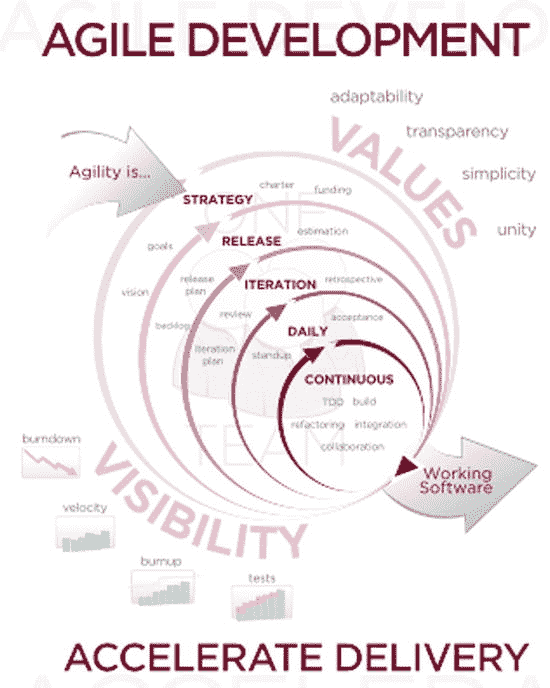
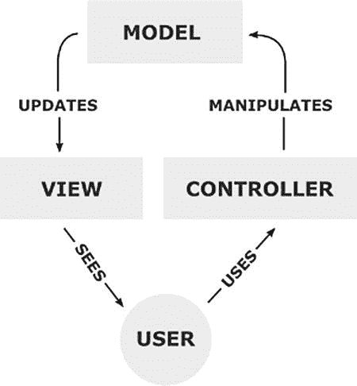
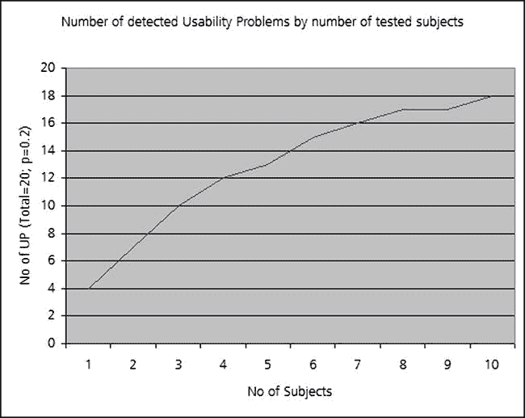

# 第 5 章：像专业人士一样开发应用程序

第 4 章 简要介绍了 Android 开发。类似地，我们想向您简要概述专业的软件开发技术。无论您是在学习编码，还是只是想评估您正在招聘的开发人员的技能，本章都将为您提供足够的知识来开始提出正确的问题。

我们将涵盖软件工程方法论、调试、版本控制、问题跟踪、单元测试和系统测试。如果您认真对待软件开发，您应该熟悉所有这些主题。如果您正在面试开发人员，如果他们对这些主题无法做出权威性的发言，您可以确定他们缺乏经验。

## 软件工程


### 软件工程与 Android 应用调试

软件项目因预算超支和进度延误而臭名昭著。一门名为软件工程的学术领域致力于创建和研究能够防止这些情况发生的过程。让我们花点时间讨论一下常用的过程。

### 瀑布模型

在传统的瀑布式软件开发模型中，一系列步骤按顺序依次进行，就像多层瀑布一样。

第一步是**需求分析**，在此阶段收集项目需求。可以详细说明软件的目的，并尝试定义其接口，而不涉及编码问题。第 2 章中讨论的许多与商业计划相关的原则，都可以视为需求分析。

第二步是**设计**，在此阶段确定软件组件之间的交互。现代软件设计经常使用“设计模式”，这些是构建代码的既定方式。例如，Android 大量使用了模型-视图-控制器（MVC）设计模式。如果你的 Android 用户界面（UI）不符合 MVC 原则，那么你可能没有编写干净的代码。在 UI 方面，你可以使用第 2 章“用户界面”部分提到的软件包来设计原型。

第三步是**实现**，在此阶段实际编写代码。你需要理解第 4 章中讨论的技术和概念才能完成此步骤。

接着，必须对设计进行**验证**，即测试。我们将在本章后面部分讨论如何完成此操作。最后，在持续的流程中，代码必须在其有效生命周期内得到**维护**。

瀑布模型常被批评为过于僵化，无法准确反映软件设计的过程。例如，在完成设计阶段后添加新功能是常见情况。新需求通常只在代码被部分测试后才出现。

### 敏捷软件开发

敏捷软件开发是一种更现代的方法，试图解决上述一些问题。在敏捷开发中，软件发布非常频繁，这引入了更多的检查点来测试是否符合客户需求，也提供了更多添加新客户需求的机会。敏捷开发侧重于在客户和开发人员之间建立紧密的反馈循环（参见图 5-1）。敏捷软件开发有多种流派，包括 Scrum 和极限编程（XP）。



图 5-1. 软件开发模型
来源：[`en.wikipedia.org/wiki/File:Agile_Software_Development_methodology.svg`](http://en.wikipedia.org/wiki/File:Agile_Software_Development_methodology.svg)

可用的软件工程方法论有很多，我们鼓励你阅读相关材料。作为入门，我们推荐以下书籍：Mario E. Moreira 所著的 *Being Agile: Your Roadmap to Successful Adoption of Agile*（Apress, 2013）。在撰写本文时，这本书处于 alpha 阶段，是 Apress Alpha 计划的一部分（参见 `http://www.apress.com/9781430258391`）。

### 为代码编写文档

另一个专业的开发技巧（绝非可选项）是为你的代码编写文档。文档编写是至关重要的一步。即使你是唯一的程序员，在编写完代码后很快也会忘记它的作用。把编写文档看作是为未来的自己写笔记。如果你有不止一位开发人员，或者计划将来有不止一位开发人员，那么文档是必须的。没有文档的代码对于新程序员来说学习起来极其困难。

为代码编写文档不一定很困难。只需在代码中加入一些精心挑选的注释，并使用一些命名良好的变量，你就可以顺利进行了。如果你是 Java 新手，应该了解一下 Javadoc 工具。通过遵循其格式编写注释，你可以自动生成格式精美的 HTML 页面，完整地记录你的代码。大多数 Java API 文档都是使用 Javadoc 生成的。你可以在 `http://www.oracle.com/technetwork/java/javase/documentation/index-jsp-135444.html` 了解更多关于 Javadoc 的信息。

### 调试 Android 应用

在实现和验证代码（请参阅前文“软件工程”部分中的软件开发瀑布模型）时，开发人员不可避免地会遇到错误。任何编写过代码的人都知道，追踪错误所花费的时间比实际编写代码的时间还要多。简单的语法错误是一回事；这类错误通常使用现代集成开发环境（IDE）就能轻松找到。真正的挑战在于那些代码编译完全正常，但存在一些微妙的隐患不断出现的情况。你尝试了各种方法去追踪，却无济于事。如果你想以专业方式开发应用，就应该使用 Android 的日志记录和调试功能。

#### 日志记录器

Android 的日志记录功能由内置于操作系统中的 `Log` 类实现。使用日志记录器就像这样调用一样简单：

```
Log.d(MY_APP, "Hello, world.");
```

如果你是日志记录的新手，其基本思想是将调试信息输出到控制台，这是调试软件运行的基本方法。通过阅读代码输出到控制台的日志消息，你可以弄清代码执行时发生了什么。你只需在希望了解代码运行状况的任何位置添加对日志记录器的调用即可。`Log` 对象可以通过多种方式调用。`Log.d(...)` 方法发送 DEBUG 日志，`Log.e(...)` 方法发送 ERROR 日志，`Log.i(...)` 方法发送信息日志，`Log.v(...)` 方法发送 VERBOSE 日志，而 `Log.w(...)` 方法则发送警告日志消息。

这些日志类型可用于表示不同类型的信息，并且它们还被分配了优先级。例如，ERROR 日志的优先级高于 DEBUG 日志。你可以将这些优先级视为水印，并根据需要配置软件水印。如果你正在测试软件，你可能希望同时看到 DEBUG 日志和 ERROR 日志。但如果你的软件即将发布给客户，你可能希望避免日志记录带来的性能影响，因此只记录 ERROR 消息。

注意，示例 `Log.d(...)` 中的 “Hello world” 引用了 `MY_APP`。`MY_APP` 是你创建的 `String` 类的占位符。该字符串应在你的应用中按如下方式声明：

```
private static final String MY_APP = "MyActivity";
```

你可以使用任何想要的字符串，之后可以在日志输出中搜索该字符串。你甚至可以使用多个字符串来表示不同类型的日志数据。

你可以使用内置于 Android ADT 版 Eclipse 中的 Dalvik 调试监视服务器（DDMS）调试器来查看日志字符串。只需进入 Eclipse 的 DDMS 透视图，你应该会看到一个 LogCat 窗口，你的日志消息将显示在其中。你可以通过为该窗口创建过滤器来按文本进行过滤。

#### 调试器

正如你可能已经猜到的，DDMS 调试器的作用远不止列出日志消息。顾名思义，调试器就是用于调试的。典型的调试器允许你逐行单步执行代码。你还可以运行程序，并在你设置的断点处暂停，通常可以检查内部变量的状态。最后，正如我们刚刚解释的，调试器通常允许你在代码的特定点输出日志消息。由于 Java 语言固有的反射机制，Java DDMS 调试器提供了更多功能。


### DDMS 调试器集成开发环境

`DDMS` 调试器集成开发环境（IDE）为您提供应用当前正在运行的线程列表以及当前堆使用情况。它还使您能够追踪分配给不同对象的内存，并允许您浏览设备的文件系统。

要了解更多关于调试的信息，请参见 `http://developer.android.com/tools/debugging/debugging-projects.html`。

### 版本控制

当您遇到一个特别棘手的错误时，您可能会对代码进行大量的小修改来测试不同的假设。有时您最终会让情况变得更糟，只希望代码能恢复原样。在其他情况下，您希望能够比较不同版本之间的差异，看看这些差异是否能解释您正在看到的错误。基于这些原因，您应该以能够追踪变更并能回退重新开始的方式保存程序的每个版本。这个过程被称为*版本控制*。

初级开发人员常常认为版本控制只对大型共享项目有用，在这些项目中，许多开发者会修改相同的代码库。但这忽略了版本控制在调试过程中所提供的价值。有许多软件工具可以帮助管理这个过程。尽管它们都服务于相同的基本功能，但工作方式却可能大相径庭。

一个常见特性是*文件锁定*。它在大型开发环境中大显身手，在这种环境中，限制同一时间只有一个开发者访问特定文件非常有用。然而，如果您要修改其他开发者正在处理的代码，当您尝试更改时，收到该文件正在别处使用的提醒可能会让您感到欣慰。

另一种版本控制机制是*合并*。合并机制允许多个开发者同时编辑同一个文件。需要修改特定文件的开发者必须先检出文件。这会在她的机器上创建一个本地副本。当开发者完成文件修改后，她必须检入她的更改，这也被称为执行*提交*。第一个检入任何更改的开发者会更新公共副本。当第二个开发者准备检入他的更改时，他需要将自己的更改与共享副本中已有的更改进行合并。版本控制系统会自动注意到该文件因被检出而已被其他人修改，并提示用户执行合并。版本控制系统通常为源代码提供半自动的合并功能。当两位开发者处理同一个文件时，他们通常会修改文件的不同部分，因此合并通常是一件轻松的事情。

大多数版本控制系统允许您标记或标注特定的文件集。这与创建分支的概念相关，这是版本控制系统中的一个常见特性。例如，如果您已经检出了一组吃豆人文件，并对吃豆人源代码做了一些修改，使其变成了女版吃豆人，您就可以用 Ms-Pacman-Branch 来标记您的文件集。这样，如果您以后想要回顾那组更改，就能做到。否则，您就必须记住您修改过的每一个文件，以及每个文件的每个版本号。而现在，您只需使用一个人类可读的标签。

一些版本控制系统允许您显式地创建一个分支。系统会基于您从中分支出来的原始文件集创建一个新的文件集。对新分支所做的任何更改只会影响新创建的文件。

许多版本控制系统提供了与 IDE 集成的机制。例如，假设您计划使用 Git，这是最著名的版本控制系统之一。在 `GitHub`（`https://github.com`）上有一个完整的开源文件共享社区，它使用 Git 作为其版本控制系统。`GitHub` 允许您的仓库在网络上共享，并且如果您进行开源开发，它是免费的。如果您正在使用 Eclipse IDE 环境，它是前面章节讨论过的 Android ADT 捆绑包的一部分，可以尝试使用 `EGit`。`EGit` 是 Git 的一个版本（基于 JGit），旨在集成到您的 Eclipse 开发环境中。有关 `EGit` 的概述，请参见 `http://www.eclipse.org/egit/`。您可以在 `http://wiki.eclipse.org/EGit/User_Guide` 找到关于使用 `EGit` 的完整教程，包括如何将其与 `GitHub` 一起使用。

另一个用于 Android 开发的流行版本控制环境是 Subversion。您可以通过使用 Subclipse 插件将 Subversion 集成到 Eclipse IDE 中。Subclipse 不仅紧密集成到 Eclipse IDE 中，还会集成到您的 Windows shell（如果您使用 Windows）。要了解更多信息，请参见 `http://subclipse.tigris.org/` 或 `http://eclipse.org/subversive/`。

如果到目前为止还不明显的话，版本控制系统的最后一个好处是它们提供了一种制作工作备份副本的方法。在许多情况下，您可以自动将文件上传到远程服务器。如果您善于检入文件，即使硬盘损坏，也只会导致几小时的工作时间损失。在某些情况下，实际的存储可以由第三方免费托管，对您这位开发者来说没有成本。当然，您也应该为自己的重要工作创建备份，例如备份到便携式硬盘或通过您自己的网络。这样，您就不必依赖第三方来维护数据的完整性。

#### 版本控制系统的常见选择

以下是版本控制系统的一些常见选择。我们为 Android 开发者推荐 Subversion 或 Git，但您可能已经有自己偏好的系统：

*   **Git：** 这是一个开源的版本控制系统，旨在处理分布在多个仓库中的大型项目。它有着令人印象深刻的血统，因为它最初由 Linux 的缔造者 Linus Torvalds 编写。要开始使用 Git，请参见 `http://git-scm.com/`。
*   **Repo：** 这是一个基于 Git 构建的仓库管理工具。如果您在查看 Android 源代码（可在 `http://source.android.com` 获取），可能会遇到它。Repo 旨在根据需要统一 Git 仓库，并上传到 Android 版本控制系统，以自动化 Android 开发工作流程的部分环节。
*   **Mercurial：** 这是一个分布式版本控制系统，能够高效地处理任何规模的项目，并提供扩展以提供直观的界面。您可以在 `http://mercurial.selenic.com/` 下载它。
*   **Subversion：** 也称为 SVN，由 Apache 软件基金会维护，该基金会也是 Apache Web 服务器的创始者，因此您知道它是一流的开源软件。实际上有数十种 Subversion 客户端。我们建议您选择与您的 IDE 集成最好的客户端。您可以在 `http://subversion.apache.org/` 找到代码和详细信息。

##### 延伸阅读

关于版本控制系统的专著已经有很多，如果您对这个领域不熟悉，可以考虑买一本。*Foundation Version Control for Web Developers*（Chris Kemper 和 Ian Oxley 著，Apress，2012 年）是一个不错的起点。您还可以在网上找到学习更多知识的绝佳资源。如果您对 Git 感兴趣，最好的一本是 Scott Chacon 编写并由 Apress 出版的 *Pro Git* 书。它可以在线上免费获取，采用知识共享许可协议，网址为 `http://git-scm.com/book`。


最后，值得一提的是，Atlassian 旗下的 Bitbucket 可为你的版本控制仓库提供免费托管服务，只要用户数不超过五人即可。Bitbucket 同时支持 Git 和 Mercurial。更多信息，请参阅 `https://bitbucket.org/`。

### 缺陷与问题追踪

专业人士会追踪他们的缺陷和功能请求。如果没有缺陷与问题追踪，问题几乎必然会被遗忘。事实上，有时一个长期未解决的老缺陷会以新的形式重现。一份过往问题的记录是对所谓“新缺陷”进行溯源调查的绝佳方式。无需费力回忆过去发生了什么，你现在拥有一份可以查阅的实际记录。通常，缺陷和问题会在缺陷或问题跟踪器中逐一编号。常见的做法是，将缺陷与问题追踪与版本控制结合使用，根据正在修复的缺陷编号创建开发分支。通过这种方式，开发者可以将他们的实际工作直接与应该处理的问题或缺陷关联起来。

追踪缺陷的另一个好处是，它能让你轻松地确定问题的优先级。有些缺陷可以暂时容忍，而有些则不能。但在向公众发布应用之前，你必须要了解它们之间的区别。

你绝对必须追踪你的缺陷和问题，否则你将不清楚哪些工作有待完成。当然，你总可以用文本文档或电子表格来记录。然而，如果你想以专业水准进行开发，就应该考虑使用众多专为追踪缺陷和其他未解决问题而设计的程序。许多程序都托管在线上，只需支付象征性的费用，就能免去安装方面的麻烦。以下列表提供了一些示例：

- **JIRA：** Atlassian 的 JIRA 是一款流行的问题跟踪器，能与 Eclipse 很好地集成。对于不超过 10 人的小型团队，其费用为每月 10 美元（这笔钱会捐给“阅读空间”慈善机构）。如果你采用敏捷开发，其配套产品 Greenhopper 每月需额外支付 10 美元。
- **Bugzilla：** 一款免费的、基于服务器的缺陷跟踪软件，旨在帮助用户管理软件开发。如果你只需要小规模部署，可以使用自己的计算机作为服务器。许多知名开源项目内部都使用 Bugzilla，包括 Firefox、Apache 和 Eclipse。
- **Redmine：** 一款免费、开源、灵活的项目管理 Web 应用程序。
- **Trac：** 一款免费、开源的缺陷跟踪器，也与流行的版本控制系统（包括 Git、Subversion、Mercurial 等）紧密集成。它专注于提供一种极简主义的软件项目管理方法；尽量少地干预团队既有的开发流程。
- **MantisBT：** 一款免费、流行的基于 Web 的缺陷跟踪系统，同样是开源的。Mantis 还提供了针对智能手机（包括 Android 系统！）优化的 MantisTouch 客户端。
- **FogBugz：** 一款商业缺陷跟踪器，提供在线托管版本和自行管理的客户端-服务器版本（它们可以是同一台计算机）。它对大学生和（一人或两人的）小型初创公司免费。如果你不介意在取得成功后为商业版本付费，它或许值得一看。你可以在 `http://www.fogcreek.com/fogbugz/StudentAndStartup.html` 找到代码和详细信息。

最后，如果你在使用 Eclipse，那么 Mylyn 是一款值得一提的优秀工具。Mylyn 能追踪你所有的开发任务，并直接集成到 Eclipse 中。它与这里提到的大多数工具都能协同工作，包括 Bugzilla、Trac、Redmine、JIRA 和 GitHub。一些开发者非常推崇 Mylyn，声称其任务聚焦的界面能显著提升开发者的生产力。Mylyn 通过自动化的上下文管理，将你的缺陷/问题跟踪软件集成到 Eclipse 中，从而只向您呈现与当前任务相关的信息。

### 测试

新开发者通常认为测试就是手动对应用程序进行各项功能检验的过程。虽然手动测试作为第一步可能很有用，但仅凭这一项是远远不够的。一位优秀的开发者会在创建应用程序之前编写测试用例，然后在应用程序开发过程中构建更多的测试用例。这个过程被称为测试驱动开发。测试用例可以编写为能够自动运行的形式。当你的应用程序完成时，你就拥有了一组测试用例库，可以在每次发布新版本时运行它们。建立一个能够自动测试应用程序的测试用例库的想法被称为*回归测试*。通常，一个缺陷修复可能很脆弱，后续的改动可能导致该缺陷再次出现。通过为每个功能和缺陷修复编写测试用例，开发者可以增加捕捉到之前缺陷复现的可能性。

开发者经常谈论*代码覆盖率*，它指的是被回归测试“覆盖”的代码的百分比。理想情况下，你应该力求为每个函数、语句、决策分支、布尔表达式、内部状态以及常见的方法参数值都编写测试用例。完全的代码覆盖率代表着巨大的工作量，通常难以达到，但了解你的代码有多少覆盖率是评估回归测试有效性的一个好方法。

现代软件工程通过一种称为*持续集成*的开发流程，将回归测试的概念进一步深化。尽管许多开发者可能满足于在发布应用前运行一下测试套件，但持续集成涉及每天自动编译和测试整个应用程序一次或多次。通过与版本控制系统紧密结合，最新的主分支代码会被自动编译并针对所有测试用例运行。如果新提交的代码导致构建失败，整个团队通常会收到一封邮件，提醒他们注意这个故障。没有人愿意成为那个“搞砸了构建”的开发者。

对于一个简单的应用程序来说，这种能力可能并非必需。仅仅拥有回归测试本身就能显著降低你的软件缺陷率。但如果你预计你的代码库会非常庞大，特别是当工作由多位开发者共同分担时，你或许应该考虑一下持续集成。如果你对此类能力感兴趣，可能会发现阅读以下书籍很有价值：《持续集成：提升软件质量与降低风险》（作者：Paul M. Duvall, Steve Matyas, Andrew Glover，Addison-Wesley，2007 年）以及《持续交付：通过构建、测试和部署自动化发布可靠的软件》（作者：Jez Humble 和 David Farley，Addison-Wesley，2010 年）。这两本都是软件开发的经典之作。

如果你想为你的项目实现持续集成，许多 Android 开发者推荐使用 Hudson 或其分支项目 Jenkins。详情请见以下链接：`http://hudson-ci.org/` 和 `http://jenkins-ci.org/`。不过，让我们先聚焦于第一步，即编写优秀测试用例的过程。

#### Android 为测试而生

正如我们之前提到的，为 Android 操作系统编程有很多好处。其中非常重要的一点就是，编写优秀的测试用例很容易。

开发者面临的一个经典难题是测试用户界面，它的改变方式可能不会影响应用程序的逻辑。例如，一个图标可能从一个版本移动到下一个版本，或者改变大小。屏幕尺寸和宽高比也可能会改变。这类变化很难进行可靠的测试。如果你的测试在特定位置查找特定类型的图标，那么只要图标有任何变化，测试就会失败。每当你的程序外观发生最细微的改变时，你就必须重写测试用例。


幸运的是，Android 用于 UI 开发的 XML 布局使得将 UI 从代码逻辑中抽象出来变得容易。Android 可以轻松支持著名的软件设计模式——MVC，如图 5-2 所示。你的模型（Model）代表系统内部的状态，而视图（View）则代表最终用户所看到的内容。这就是你的 UI，在 Android 开发中通常用 XML 编写。控制器（Controller）在需要时操纵模型以改变其状态。模型更新视图以改变其外观。用户看到视图的结果，并与控制器进行交互。这种功能划分允许为控制器或模型编写测试，而无需了解视图的任何细节。由于更改视图（即事物在屏幕上的渲染方式）不会破坏测试，因此测试更加健壮。



图 5-2. 模型-视图-控制器范式  
来源：[`en.wikipedia.org/wiki/File:MVC-Process.png`](http://en.wikipedia.org/wiki/File:MVC-Process.png)

Android 也采用了 Java 开发中常用的 JUnit 单元测试框架。JUnit 与 Android 紧密集成。实际上，Android 甚至提供了一个派生自 JUnit 的 `TestCase` 类的 `AndroidTestCase` 类。`AndroidTestCase` 使你可以访问许多内部的 Android 结构（具体来说是 `Context` 类），从而简化了测试用例的构建。在 Eclipse 中，为你的应用程序创建新的测试环境就像从 Android Tools 菜单中选择“新建测试项目”项一样简单。你编写的测试用例实际上是在 Eclipse IDE 中运行的。

### 单元测试与系统测试

区分单元测试和系统测试非常重要。*单元测试*指的是测试软件的一个小组件。在像 Java 这样的面向对象语言中，通常每个类都独立进行测试。*系统测试*指的是将整个应用程序作为一个功能实体进行测试。虽然单元测试非常适合确保软件的每个功能组件都能正常工作，但你需要使用系统测试来确保所有组件能够正确交互。除非你已经进行了系统级别的测试，否则无法确保一切都能正常运行。这通常需要在手机或模拟器上运行应用程序。由于 Android 设备种类繁多，最好还是在两种设备上都运行系统测试。

在编写单元测试时，当开发者的类需要与 Android API 交互时，常常会遇到问题。Android 开发环境提供了一个 `android.jar` 文件，Eclipse 用它来确保你调用 Android 库的代码可以在你的计算机上编译。但是 `android.jar` 文件只包含桩代码；如果你尝试在 PC 上实际执行代码，那么第一次调用 Android API 时就会失败。你需要在手机（或模拟器）上运行应用程序才能访问完整的 API。

`AndroidTestCase` 类可以帮助实现这一点。开发者在使用 Android SDK 手机模拟器模拟代码时，可以使用 `AndroidTestCase` 来调用部分 API。但在模拟器上运行大量测试用例可能会花不少时间！虽然这个过程对于系统级测试来说效果不错，但如果你要对一个大型代码库进行单元测试，它可能会慢到无法高效工作。

一种解决方案是使用模拟框架（mock frameworks），这些框架提供了在模拟器或手机上运行代码时所看到的全部相同 API 调用。但你可以在本地桌面开发机器上运行这些模拟框架，并且*无需*模拟器！这可以大大加快测试速度。两个著名的模拟框架是 Mockito 和 Android Mock，分别位于：`http://code.google.com/p/mockito/` 和 `http://code.google.com/p/android-mock/`。

有时模拟类可能会变得复杂；你需要编写大量代码才能得到一个有意义的测试。针对*这个*问题的解决方案是 Robolectric。它提供了一个非常巧妙的系统，能够自动重写 Android 函数的内部部分，使你能够在无需依赖模拟器的情况下测试它们。当你发现编写和执行测试变得费力时，值得去看看：`http://pivotal.github.com/robolectric/`

关于测试还有很多内容可以讲，但我们只能给你做一个简短的介绍。如果你想了解更多关于 Android 测试的知识，Android 官方网站是最好的起点：`http://developer.android.com/tools/testing/index.html`

你也可以考虑找一本关于 JUnit 测试的书来读读。

### 用户体验测试

开发应用程序或创造任何事物的问题之一，就是你与该项目的距离太近了。最终，你必须了解当其他人参与使用时，应用程序的表现如何。这时，你可以通过寻找愿意帮你测试的外部人员来开始优化你的应用。

在寻找测试人员时，你需要找到那些从未试用过你的应用的人，并且尽可能少地告诉他们关于应用的信息。尝试涵盖各种专业水平的测试者，比如那些甚至从未使用过 Android 设备的人。理想情况下，你的团队中应该包含开发者、设计师以及一些潜在用户。正如洗发水广告中的那句老话所说，你没有第二次机会来留下第一印象，因此确保你立刻捕捉到他们的第一印象非常重要。

最基本的可用性测试形式有时被称为*走廊测试*。想象一下，在走廊里随机找一些路过的人，请他们测试你的应用。这对于测试的早期阶段来说是一个好方法，可以快速发现严重问题。你可以将这种用户体验测试视为*Alpha 测试*；换句话说，就是第一次让潜在用户或客户参与的测试。如图 5-3 所示，有证据表明，小规模的测试组已经足够，增加更多的测试者其价值会逐渐减少。



图 5-3. 增加更多测试对象带来的收益递减  
来源：[`en.wikipedia.org/wiki/File:Virzis_Formula.PNG`](http://en.wikipedia.org/wiki/File:Virzis_Formula.PNG)

一个良好的实践是保持你的测试环节相对简短，这样就不会疏远那些不愿在你的测试上浪费太多时间的测试者。你希望测试者能积极地与应用程序互动，如果他们感到无聊，你的结果就不会那么有意义。

通常，只需观察测试者使用你的应用程序而不给予任何提示，就能获得最佳的反馈。但要注意，即使是越过他们的肩膀观看也可能使测试产生偏差，因为很难抑制自己通过身体语言将他们引向正确解决方案的冲动。

如果你打算在测试环节之后，就他们的体验提出一系列问题，请尽量使用可以量化回答的问题。例如，你的测试者可以从以下选项中选择一个：非常同意、同意、无意见、不同意、非常不同意。然后你可以收集他们的答案并得出平均分。如果你在另一轮测试中向测试者提出相同的问题，就可以看出是否有可衡量的改进。

### 没有应用商店的 Beta 测试


### 应用程序开发中的关键环节

应用程序开发过程中一个至关重要且关键的环节是**Beta 测试**，这涉及将正式版本发布给有限的内部人员之外的用户群体。外部用户可能会以你从未预料到的方式使用你的应用程序，而且他们使用 Android 设备的方式也可能超出你的测试范围。在应用程序公开发布之前解决任何问题，将确保应用程序运行时出现更少的意外问题，从而获得更好的评价。当然，你应该提醒 Beta 测试用户该软件可能存在缺陷，以便他们正确设定预期。

第 8 章将讨论如何通过亚马逊应用商店或 Google Play 进行 Beta 测试。你可以在不将应用程序发布到公共论坛的情况下进行 Beta 测试。最简单的方式是直接将 APK 文件通过电子邮件发送给你选定的 Beta 用户。当你的 Beta 用户在 Android 设备上打开邮件时，他们将收到一封包含“安装”按钮的邮件。你也可以将 APK 文件放置在网站的密码保护区域，点击下载链接的用户将自动在设备上安装该应用程序——前提是他们已允许安装来自未知来源的应用程序。

## 总结

如果你是一位经验丰富的开发者，我们在本章讨论的大部分内容应该都已是老生常谈。但如果你是新手，我们希望你能从中了解让软件开发顺利进行的工作流程。

回顾一下，我们强烈建议采用正式的软件开发方法论，比如我们讨论过的瀑布模型或敏捷方法。你还应该为代码编写文档，哪怕只是为了确保自己未来能理解当初的意图。你需要熟悉 Android 调试工具，并使用版本控制系统保存代码的增量更改。为了确保不遗漏重要的错误和问题，请建立正式的问题追踪流程。在测试代码时，我们建议使用`JUnit`和 Android 的`AndroidTestCase`类进行单元测试。你还应该对应用程序进行系统测试，而 Android 平台让这两项测试都相对轻松。此外，请务必使用真实用户测试你的应用程序，既包括非正式的“走廊”测试，也包括 Beta 测试。

以下是一些需要自查的问题清单：

*   你是否遵循了软件工程流程？
*   你是否将应用程序设计得易于测试？
*   在应用程序开发之前或期间，你是否考虑过合适的测试？
*   你是否拥有完整的回归测试套件？所有测试是否都通过？
*   你的应用程序是否受版本控制？
*   你是否建立了错误和问题追踪系统？
*   你是否进行了用户体验测试？
*   在公开发布应用程序之前，你是否进行了 Beta 测试？

---

