# 第六章：通过应用内广告盈利

移动广告正在蓬勃发展！全球移动广告收入预计在 2013 年将达到 114 亿美元，并有望在 2016 年达到 245 亿美元。机遇就在眼前，让我们赶紧上车吧！

自然，如果你对移动广告感兴趣，你希望赚到钱。移动广告是一场数字游戏；你从每个用户身上赚到的钱非常少，因此必须拥有非常庞大的用户基础才能获得可观的收入。

值得注意的是，在你的付费应用中植入广告通常是一个致命的组合，因为没有人愿意花钱购买应用后还要忍受广告。此外，为了获得可观的利润，你需要大量的下载量，而付费应用很少能达到产生有意义广告收入所需的下载量。

图 6-1 让你大致了解通过应用内广告盈利需要多少用户。

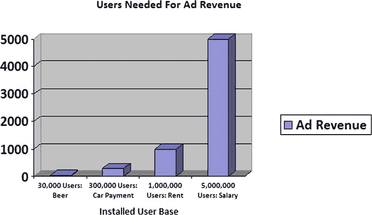

图 6-1. 广告收入与你的应用用户群成正比

这些数字仅作为估算。实际数值将严重依赖于你应用的具体情况。我们很快就会介绍一些数学计算，让你能为自己的应用算出这些数字。话虽如此，正如你所见，通常需要数量惊人的用户才能产生足够的广告收入，从而超越“啤酒钱”阶段。

首先，你需要在至少一个广告网络注册。这些网络，如`AdMob`、`Mobclix`和`Leadbolt`，连接着广告商和内容发布商。从广告商的角度来看，作为应用开发者的你就是一个内容发布商。从技术层面来说，广告网络会为你提供一个应用程序编程接口（API），用于投放其广告。

关于这一点我们稍后会详细说明，但先来谈谈你可以使用的广告类型。

## 移动广告的类型

尽管广告形式五花八门，但主要有两种基本类型：横幅广告和插屏广告。

**横幅广告**是你在移动设备上看到的那种小矩形广告。它们有多种尺寸，可以针对智能手机和平板电脑的竖屏和横屏模式进行定制。`320x50`和`300x50`是目前业界最接近标准尺寸的规格，尽管新尺寸层出不穷。一个有用的进展是，`AdMob`（可能还有其他网络）已开始支持“智能横幅”，它能自动调整大小以适应其所渲染设备的屏幕尺寸和方向。图 6-2 展示了一个`AdMob`智能横幅广告的例子。你可以在`https://developers.google.com/mobile-ads-sdk/docs/admob/smart-banners`了解更多关于智能横幅的信息。

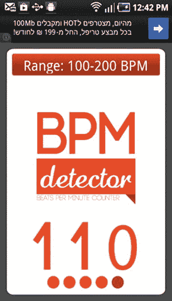

图 6-2. BPM 检测器截图。这个 AdMob 智能横幅广告会自动以当地语言投放；本例中是希伯来语

**插屏广告**是一种功能更强大的广告。它们是全屏广告，通常在将用户返回应用程序之前持续固定的一段时间。具体时长（通常以秒计）通常可由开发者配置，以适应应用程序的节奏。或者，插屏广告也可以配置为强制用户点击才能返回应用程序，或者包含流媒体视频。正如你所想，它们的付费高于横幅广告，但对用户体验的干扰也大得多。一种常见的策略是向用户提供虚拟货币（例如在游戏应用中使用）作为观看插屏广告的回报。另一种选择是仅在极少数情况下显示它们（例如每隔几天一次）。使用插屏广告需谨慎；它们每次展示能赚很多钱，但如果所有用户都卸载了你的应用，你就一分钱也赚不到。

图 6-3 展示了一些插屏广告的例子。请注意，广告完全遮挡了应用程序视图，必须“清除”后才能将控制权返回给应用程序。

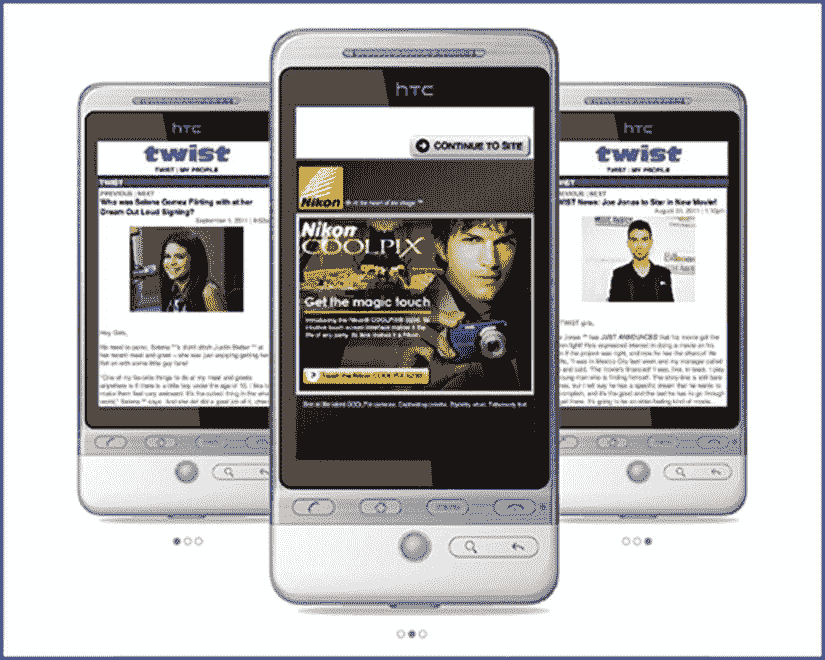

图 6-3. 插屏广告示例

## 移动广告数字分析

我们来讨论一下如何像本章开头图表所示那样进行收入分析。移动广告有其独特的术语，在理解任何财务计算之前，你需要先了解这些行话。在图 6-4 中，请注意 AdMob 截图中对收入、`eCPM`、请求数、展示数、填充率和点击率等统计数据的关注。

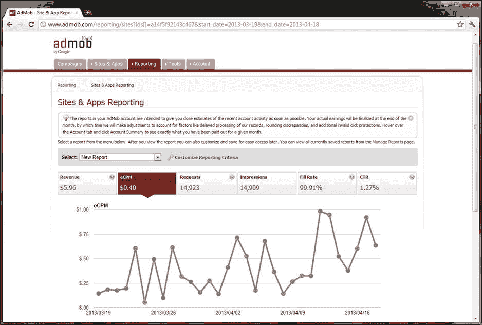

图 6-4. AdMob 统计截图


### 理解移动广告收入指标

你会经常听到`eCPM`这个词，它代表“每千次展示估算成本”（“M”是罗马数字中的千，请记住）。`eCPM`是评估广告收入的基本指标。这个缩写指的是你每获得 1,000 次展示所能获得的收入。一次*展示*是指一则广告在世界某个地方的你的应用中显示出来。因此，你可以立刻看出，维持高`eCPM`有两个关键因素：你需要有很多人使用你的应用，并且需要他们使用你的应用一段时间。毕竟，你的应用保持打开的时间越长，展示的广告就越多。

作为发布商，你通常看到的`eCPM`范围在低至 0.20 美元和高至 1.25 美元之间。这是典型的范围，但并无保证。通常，广告主按滑动比例付费，费用取决于所投放广告的价值。广告网络只是将部分收益转交给你，而广告主愿意支付的金额取决于他们做广告的市场。例如，与视频游戏制造商相比，保险提供商通常愿意为获取客户支付高得多的费用。

此外，`eCPM`可能具有季节性。你通常在节假日，尤其是十二月底的节假日期间，收入会更高。

### 点击率（CTR）

点击率（`CTR`）让你了解用户实际点击应用中展示广告的频率。一些广告网络会向你隐藏这些数据，只让你知道`eCPM`，而不考虑点击率。但你应该明白，用户点击广告越多，你赚的钱就越多。自然，这意味着你应该始终让用户有广告可点击（取决于填充率，将在下一段讨论）。如果你的应用有多个屏幕，考虑在每个屏幕都放置广告！你甚至可以在“设置”屏幕中放置广告，我们稍后会展示如何操作。但请记住，广告太多可能会疏远用户，所以要注意“过度广告”。你需要进行试验来找到最佳平衡点。

### 刷新率与填充率

广告网络的*刷新率*是指向你的应用发送新广告进行展示的频率。许多广告网络允许开发者调整这些数值。你需要试验来确定哪种方式最适合你。考虑到每个新广告都是用户找到足够有趣的内容并点击的新机会。另一方面，如果你过于频繁地投放广告，你的用户会觉得它们分散注意力，甚至可能因此感到恼火而卸载你的应用。令人惊讶的是，至少对于新手来说，你的应用即使想要展示广告，也常常无法获取到广告。*填充率*指的是你的应用在准备好展示广告时，实际上有广告可展示的时间百分比。有些填充率可能极低，这会直接影响你的收入。

`AdMob`并非以其行业最高的`eCPM`而闻名，但有利的一面是，如果你启用`AdSense`选项（当横幅广告不可用时，它会为你投放`AdSense`广告），`AdMob`将提供接近 100%的填充率。不幸的是，`AdSense`广告的报酬并不高。

解决低填充率问题的一个办法是让你的应用同时集成多个广告网络。然后你可以展示最先发送广告的那家网络提供的广告。

### 收入预测

好了，以上就是移动广告业务运作方式的背景知识。那么，你如何进行收入预测呢？你必须估算你的`eCPM`。正如我们提到的，0.20 美元到 1.25 美元之间通常是比较安全的范围。现在你需要估算你的填充率。这取决于你的广告网络，但如果你想随机取一个数字，可以从 75%开始。你每 1,000 次请求的收入是你的`eCPM`乘以你的填充率（以分数形式表示）。所以现在你只需要估算你将获得多少次请求，就能得到一个粗略的收入估算。

你的请求次数取决于你的用户数量、他们使用应用的时间以及你的刷新率。如果你有 10,000 名用户，他们每人每月使用你的应用 5 分钟，并且你的应用每分钟请求一次广告，那么你每月总共有 10,000 x 5 = 50,000 次请求。在填充率为 0.75 且`eCPM`为 0.50 美元的情况下，你将产生 50,000 * 0.75 * (0.50/1000) = 18.75 美元/月的收入。这并不高。但请注意，如果你将用户在你的应用上花费的时间翻倍，你的收入也将翻倍。用户在你的应用上的时间与用户基础规模同样重要。这些计算再次表明，你需要非常庞大的用户基础才能仅靠广告收入为生。

## 选择移动广告网络

有许多移动广告网络都希望能与你合作。它们各自通过强调其高`eCPM`数值、独特的广告格式以及易于集成到你的应用中来区分自己。然而，特别是对于`eCPM`而言，这些数值极度依赖于你所开发的应用类别。下面的图表使用来自`DoubleClick Ad Exchange`的数据编制，清楚地说明了这一点。请注意，这些数据包括所有形式的数字广告，而不仅仅是移动广告：

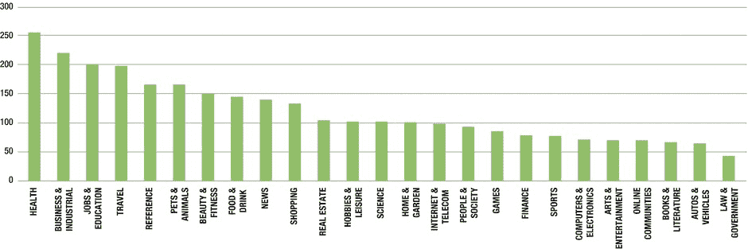

*图 6-5. 按垂直领域分类的 CPM 对比指数*

根据这张图表，平均而言，医疗健康领域的应用的`CPM`将是法律和政府领域应用的五倍以上。

不难想象，某个广告网络的客户名单中可能正好有一个广告主，由于你的应用精准地定位了该广告主的目标受众，因而能为你的特定应用带来大量点击。如果不实际尝试一下这个广告网络，可能无法确定这种结果。话虽如此，你或许能了解到一些关于广告网络的信息，从而推断它可能对你的应用效果良好。

以下是一些可供你考虑的广告网络列表。这个列表绝非详尽无遗：

- **`AdMob`**: 被谷歌收购，`AdMob`可能是你起步的最佳选择。集成很容易，很多人都在使用它，因此网上有大量帮助资源可以带你入门。我们的技术示例将引用`AdMob`，但许多其他软件开发工具包（`SDK`）都相当类似。
- **`LeadBolt`**: 作为最具创新性的公司之一，`LeadBolt`以其创意广告格式而闻名，据称能提供更高的`eCPM`。值得一看。
- **`MobFox`**: 如果你的用户高度集中在欧洲，`MobFox`值得一试。据称它能向欧洲发行商提供高`eCPM`。
- **`Jampp`**: 总部位于布宜诺斯艾利斯，`Jampp`是拉丁美洲领先的广告解决方案。它也声称能提供拉丁美洲最高的`eCPM`。
- **`Airpush`**: `Airpush`专注于`Android`，但颇具争议。它将广告放置在用户的任务托盘中，许多用户认为这非常烦人。另一方面，它据称拥有非常高的`eCPM`。
- **`Buzz City`**: 它专注于亚洲市场，因此如果你的亚洲用户高度集中，`Buzz City`很可能会带来良好效果。
- **`Mobclix`**: 最初只专注于`iPhone`，`Mobclix`现在也支持`Android`。它据称有高`eCPM`，并提供视频广告和其他非标准格式。

### AdMob

如果你打算从某个地方开始，不妨就从`AdMob`入手。让我们带你逐步了解使用其广告托管`SDK`的过程。图 6-6 显示了`AdMob`的主页。

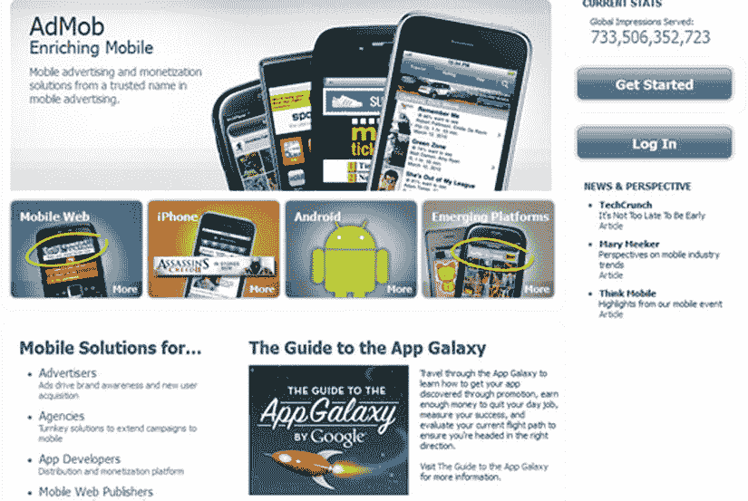

*图 6-6. `AdMob` 主页*


AdMob 的网站位于 `http://www.admob.com/`。当 Mark 访问该网站时，AdMob 从他的 Gmail 账号识别出了他，这很合理，因为 AdMob 归谷歌所有。如果你没有 Gmail 账号，也可以直接登录其网站。不仅 Android 专区不错，你或许还想看看《应用银河指南》（The Guide to the App Galaxy）。注册很简单，你会收到一封包含许多有用链接的确认邮件。特别是，你应该会看到一个指向 AdMob 帮助中心（`http://helpcenter.admob.com/`）的链接。

帮助中心是开始学习 AdMob 的好地方。如果你点击帮助中心里的“发布商”（Publishers）部分，你会发现大量有用的入门资料，包括如何开始、如何向应用添加广告以及付款方式如何运作。请记住，AdMob 将你视为发布商，因为你将在自己的应用中“发布”他们的广告。

广告商也可以在帮助中心找到信息。简单介绍一下背景：广告商会发起一个广告系列，指定其广告将如何在应用程序上展示。广告商需要输入开始日期、结束日期、预算和投放方式。然后，系统会要求他们选择一个广告组以满足广告目标，并允许他们添加多个广告组。之后，他们可以自定义希望广告投放的设备，更不用说指定的国家或运营商了。广告商甚至可以自定义用户人口统计特征。广告商可以投放文字广告单元或横幅广告单元，并按他们认为合适的方式进行设计。随后广告开始投放，广告商可以监控广告系列的效果。

好了，以上是广告商方面的运作方式，但我们还是回到你，也就是开发者这边。对于应用集成，请按以下步骤操作：

1. 在 `http://www.admob.com/` 注册和/或登录。
2. 点击“站点和应用”（Sites and Apps）。
3. 点击“添加站点/应用”（Add Site/App）。
4. 提供关于该 Android 应用的信息。
5. 下载 SDK。
6. 在 SDK 下载期间，返回“站点和应用”（Sites & Apps）标签页，将鼠标悬停在你的应用上，然后点击出现的“管理设置”（Manage Settings）按钮。在出现的页面顶部附近，有一个名为“发布商 ID”（Publisher ID）的十六进制长数字。复制该数字并粘贴到某处。稍后你需要在 XML 布局文件中用到它，以便你的应用能让 AdMob 知道你是谁。
7. 你也可以花点时间探索一下 AdMob 的控制面板。你会在“站点和应用”（Sites & Apps）标签页上花费大量时间。该标签页会显示你所有应用的收入，以及你的 eCPM 和填充率。它还允许你查看收入随时间变化的趋势。
8. SDK 下载完成后，将 zip 文件解压到一个新目录。该目录现在包含 AdMob 库，你需要将其链接到你的应用程序中。
9. 为此，在 Eclipse 左侧的包资源管理器（Package Explorer）窗格中右键单击。点击“属性”（Properties），然后点击“Java 构建路径”（Java Build Path）属性。在“Java 构建路径”部分，点击“库”（Library）标签页。现在，只需添加你之前解压到目录中的 JAR 文件即可。
10. 现在切换到“排序和导出”（Order and Export）标签页。你应该会看到 AdMob JAR 文件列在那里。确保它被选中，并为了保险起见将其移动到列表顶部。这可以确保 AdMob 在构建路径中排在首位，从而避免出现任何依赖性问题。
11. 将 AdMob JAR 文件添加到项目后，你需要授予你的应用 AdMob 所需的所有权限。你的应用的`manifest`文件中可能已经使用了这些或其他权限，但请确保至少包含以下权限：

```
    <uses-permission android:name= "android.permission.INTERNET" />
    以及
    <uses-permission android:name= "android.permission.ACCESS_NETWORK_STATE" />
```

12. 你还需要在你的应用的`manifest`文件中引用 AdMob 活动。将以下内容放置在`AndroidManifest.xml`文件的`application`标签内：

```
    <activity android:name = "com.google.ads.AdActivity"
              android:configChanges = "screenSize|smallestScreenSize|keyboard|keyboardHidden|orientation|screenLayout|uiMode" />
```

13. 这会让你的应用知道你将使用 AdMob 活动。你需要在至少一个布局中显示广告，理想情况下是在足够多的布局中显示，以便广告始终对用户可见。在每个布局中，广告只是一个视图，恰如其分地命名为`AdView`。以下是一个`AdView`布局元素的示例：

```
    <RelativeLayout
        [...]
        xmlns:ads= "http://schemas.android.com/apk/lib/com.google.ads"
        [...]>
    <com.google.ads.AdView
           android:id= "@+id/adView1"
           android:layout_width= "wrap_content"
           android:layout_height= "wrap_content"
           ads:adUnitId= "1234567890abcde"
           ads:adSize= "BANNER"
           ads:loadAdOnCreate= "true" />
```

14. 注意`adUnitId`标签。这个数字就是我们之前讨论过的`发布商 ID`。这就完成了！现在你的应用中应该已经启用了广告。可能需要几分钟才能收到第一个广告，所以请耐心等待。一个托管 AdMob 的应用示例见图 6-7。

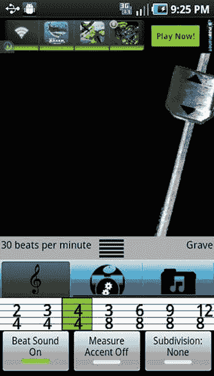

图 6-7. Sandberg Sound Free Meganome，通过 AdMob API 展示广告

与 AdMob 一同出现的还有 AdWhirl，后者已被 AdMob 收购。AdWhirl 是一个开源的广告中介工具，它允许用户尽可能有效地实现库存变现。用户可以将库存分配给自有广告（House Ads）、AdMob 广告以及其他网络的广告。

### Mobclix

用 Mobclix 自己的话说，它是“业界最大的移动广告交易网络，通过其复杂的开放市场平台和针对 iPhone 应用开发者、广告商、广告网络及代理机构的全面账户管理解决方案。”不要因为“iPhone”这个词就对尝试 Mobclix 望而却步，因为它也适用于其他平台，比如 Android。Mobclix 与许多广告网络合作，从其网站（见图 6-8）可以看出来。

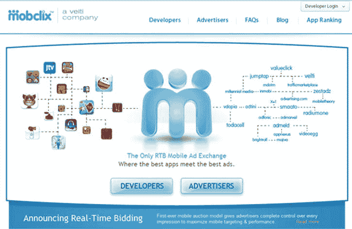

图 6-8. Mobclix 主页，网址为 [`mobclix.com/`](http://mobclix.com/)

该公司声称拥有最高的 eCPM，并且其月度信息图可以揭示用户行为的洞察，以便你能策划出更具思考性的广告活动。

注册 Mobclix 很简单，注册自己的应用程序也同样简单。Mark 发现，当我注册时，收到了一封确认邮件，上面说我必须“将 Mobclix SDK 集成到我的应用中并提交到 iTunes”。我觉得这很奇怪，因为我想开始使用 Android。

我发现，你应该可以从 `http://groups.google.com/group/mobclix-android-sdk?pli=1` 下载最新的 Mobclix Android SDK。从那里开始，你可以利用其 100% 的填充率和分析工具来开始赚钱。

### 联盟计划

虽然不完全是移动广告，但联盟计划与之类似，都是利用你的应用将用户的注意力引向移动网站。联盟计划的想法是，广告商鼓励开发者将流量导向其零售网站，并根据产生的销售支付微薄的佣金。作为一个在网络上做过一点工作的人，Mark 偶尔会通过亚马逊（Amazon）等联盟计划获得一些收入。注册和设置它们非常容易，并且有可能在 Android 应用内部使用这些相同的联盟计划。


### 超越单个联盟（如 Amazon）
除了像 Amazon 这样的单个联盟，你还可以找到联盟网络。这些公司为联盟做的事情，就如同广告网络为广告商做的事情一样。换句话说，它们将联盟与发布商连接起来。提供的不是广告，而是指向联盟网站的链接，并且只有在发生购买时才会产生支付。从某种意义上说，联盟网络是一种广告网络，其支付方式是根据推荐产生的销售额来决定的。

你应该权衡联盟计划与传统广告网络的利弊。广告网络在移动应用中更为常见，并且通常更容易集成到你的应用程序中。虽然联盟计划每笔交易能赚取更多利润，但完成一笔销售比仅仅让用户访问网站要困难得多。换句话说，只有当你的应用有某些特点，使得用户极有可能通过你的联盟完成销售时，联盟营销才有意义。例如，如果你有一个音乐播放器应用，那么向用户推荐一家销售 Android 手机优质扬声器的硬件提供商，可能会带来很高的销售转化率。

### 主要联盟网络
Rakuten Linkshare（位于`http://mthink.com/affiliate/`）是全球顶级的联盟网络。虽然它没有专门针对 Android 的 API，但可以通过 HTML API 从 Android 应用程序内部调用它。这与发布商在网页上链接到联盟的方式相同。Rakuten Linkshare 已在其服务中测试了多个移动平台，包括 Android。要了解更多信息，请访问其网站`http://www.linkshare.com/advertisers/publishers/`。

还有许多其他联盟网络。你可以通过以下网站了解几个：

- Commission Junction：`http://www.cj.com`
- ClickBank：`http://clickbank.com`
- ShareASale：`http://shareasale.com`
- AvantLink：`http://avantlink.com`
- RevenueWire：`http://revenuewire.com`

尽管 Amazon 本身不是一个联盟网络，但其庞大的规模使其成为第三大联盟服务商。你可以在`https://affiliate-program.amazon.com/gp/associates/join/landing/main.html`了解 Amazon 的联盟计划。eBay 也拥有庞大的联盟服务。你可以在`https://ebaypartnernetwork.com/files/hub/en-US/index.html`了解相关信息。

### AdMobix SDK
AdMobix 最近发布的一项公告允许将广告集成到 Android 应用程序中。它似乎是少数几个拥有专为 Android 设计的 SDK 的联盟网络之一。这个 SDK 允许在关卡之间、页面加载时或页面上的任何位置集成广告。

AdMobix 计划提供了一个“按安装付费”选项，允许开发者和广告商获得更多用户，并且仅在用户设备上安装了他们的产品时才付费，而不是按展示或点击付费。其他选项包括“按通话付费”和“按潜在客户付费”。

你可以在 AdMobix Android SDK 网站`http://blog.adcommunal.net/admobix-sdk-for-android`上找到更多信息。在撰写本文时，它目前处于测试阶段。

图 6-9 显示了注册 AdMobix Android SDK 测试版的电子邮件地址。

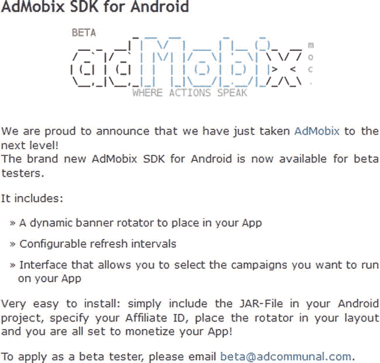

图 6-9. 用于注册 AdMobix Android SDK 测试版的电子邮件地址，这是一个针对 Android 应用的联盟计划

我们不会对 Android 联盟市场在不久的将来增长感到惊讶。如果我们从互联网商业中学到了一件事，那就是只要足够多的人呼吁，总会有人制作出相应的产品。

### 技术技巧
提高广告收入的一个非常实用的技巧是在应用的每个屏幕上都放置一个广告。许多应用都有一个用于选择用户偏好的设置屏幕。

图 6-10 显示了在设置屏幕中带有广告的 Free Meganome 截图。

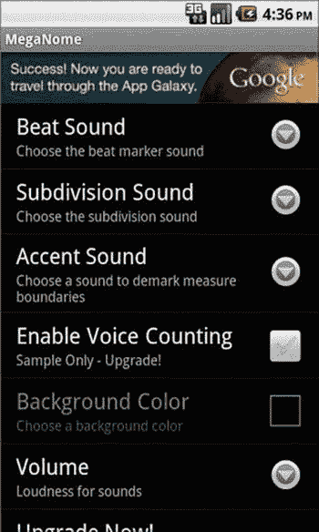

图 6-10. 在设置屏幕中带有广告的 Free Meganome 截图

Android 为偏好设置提供了一个标准框架，你的广告可以与该框架协同工作。首先，你需要一个支持广告的自定义偏好设置。请注意，以下示例扩展了`Preference`，这是一种在 Android 3.0 中已被弃用的技术，取而代之的是`PreferenceFragment`。此示例继续使用`Preference`以支持大约 40%尚未使用 Android 3.0 或更高版本的市场。如果你只针对 Android 3.0 及更高版本，你应该考虑修改你的代码，以遵循此处的示例：`http://developer.android.com/reference/android/preference/PreferenceActivity.html`

```java
public class AdmobPreference extends Preference
{
    public AdmobPreference(Context context) {
        super(context, null);
    }
    public AdmobPreference(Context context, AttributeSet attrs) {
        super(context, attrs);
    }
    @Override
    protected View onCreateView(ViewGroup parent) {
            //override here to return the admob ad instead of a regular preference display
        LayoutInflater inflater = (LayoutInflater) getContext().getSystemService(Context.LAYOUT_INFLATER_SERVICE);
        return inflater.inflate(R.layout.admob_preference, null);
    }
}
```

这个自定义的偏好设置只是查找一个用于膨胀的`admob_preference`布局。所有的工作都在那里完成。`.xml`文件（不含 XML 头部）在此复现（注意其中包含熟悉的`AdView`布局）：

```xml
<RelativeLayout
    xmlns:android="http://schemas.android.com/apk/res/android"
    xmlns:ads="http://schemas.android.com/apk/lib/com.google.ads"
    android:layout_width="fill_parent" android:layout_height="fill_parent"
    >
            <com.google.ads.AdView
            android:id="@+id/adView1"
            android:layout_alignParentTop="true"
            android:layout_centerHorizontal="true"
            android:adjustViewBounds="true"
        android:layout_width="wrap_content"
        android:layout_height="wrap_content"
        ads:adUnitId="1234567890abcde"
        ads:adSize="BANNER"
        ads:loadAdOnCreate="true" />
</RelativeLayout>
```

就是这样！你只需要这两个文件。只需将你的`AdmobPreference`放入你现有的偏好设置列表中，你就会在偏好设置屏幕中看到广告！

## 总结
如果你的应用类型合适，广告是一种很好的赚钱方式。请记住，理想的广告应用是那些使用频率高、且每次使用会话持续时间较长的应用。这是因为你的广告收入与展示的广告数量成正比。无论你的应用具体是什么，你都可以通过确保应用的每个屏幕上都有一则广告来最大化广告收入。我们已经向你展示了如何在偏好设置屏幕中添加广告，所以至少要做到这一点。你还可以考虑尝试插页式广告，但务必确保它们在你的应用中合理，否则可能会疏远用户。最后，一定要尝试不同的广告网络。

以下是处理应用内广告的检查清单：

- 你是否做了广告收入预测，并且它们符合你的期望？
- 你是否选择了一个或多个广告网络？
- 你是否选择了最适合你应用的广告类型？

## 第七章 应用内购买：在应用中开设商店
应用内购买允许开发者在用户下载应用后对其功能收费。想象一下向用户收取游戏额外关卡的费用，或者向他们收费虚拟物品（例如游戏中的魔法剑）。对于非游戏应用，你可以对特殊功能收费，甚至如果使用场景足够强，也可以按次收费。


应用内支付的一个示例是来自于 Comixology 的`Comics`应用（见图 7-1）。`Comics`这个应用旨在让安卓智能手机和平板电脑用户能够阅读他们最喜欢的漫画书的数字版本。下载该应用是免费的，但大多数漫画书需要用户付费。我们确信 Comixology 为了提供这项服务，肯定与漫画公司达成了某种协议，但在这些公司分得利润之后，我们也确信 Comixology 从漫画读者支付的数字漫画内容费用中获得了可观的利润。用户只需在线创建一个账户，这款应用就能很好地同步。

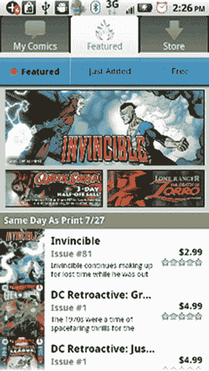

图 7-1。来自 Comixology 商店的截图，用户可以在其中购买他们最喜欢的数字形式漫画书

`Tap Tap Revenge`也使用同样的营销方式来销售乐曲。`Tap Tap Revenge`（见图 7-2）是一款音乐游戏，玩家需要跟随喜爱的旋律节奏点击屏幕。游戏免费提供几首歌曲，但如果你想获得更多，就必须付费。我们确信音乐行业会与开发者一道获得其应得的份额。

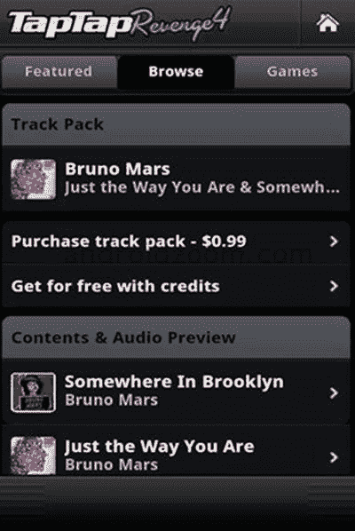

图 7-2。`Tap Tap Revenge 4`使用应用内支付，以便用户可以为这款音乐游戏购买更多曲目

许多游戏应用，例如`Tap Tap Revenge`，都有某种代币经济体系，允许用户在玩游戏后，使用在游戏中赚取的点数或金币来购买奖励。

在`Gun Brothers`（见图 7-3）中，用户有机会玩一款射击游戏并获得大量积分。这些积分可以用来购买武器升级等物品。然而，如果用户想走捷径直接购买升级道具，借助应用内支付功能，他们也完全可以这样做。


图 7-3。来自 Glu Mobile 的`Gun Brothers`应用内支付功能允许用户购买可用于换取护甲、武器或能量提升的战争币或金币

你可能会对这类游戏虚拟物品存在市场感到惊讶，但人们确实会花钱购买游戏奖励。这正是游戏应用的魅力所在：有许多玩家愿意为自己在虚拟游戏世界里才存在的东西掏钱。对开发者来说，这无疑是一个积极的趋势。

## 应用内支付市场参与者

如果你想使用应用内支付，Google Play 商店并非唯一的选择。亚马逊可能是最知名的替代者，除此之外，本章稍后还会讨论其他一些平台。

现在，我们将简要谈谈 Google Play 商店和亚马逊应用商店，因为它们是最大的两个参与者。通常，所有应用内支付商店都会从你的标价中抽取 30% 作为应用内购买的交易费。这与一般应用商店的交易费标准一致。正如你所见，使用除 Play 商店以外的应用内支付商店的主要原因并非交易费用。

实际上，你最终会使用其他应用内支付商店的主要原因仅仅在于兼容性问题。亚马逊不允许你在从其商店下载的应用上使用其他任何人的应用内支付。同样，Google 也不允许你在从 Play 商店下载的应用上使用其他任何人的支付系统。像 SlideME 这样较小的市场则有更宽松的规则，但通常如果你的应用需要应用内支付，并且你计划在多个市场上架，你就必须支持多个应用内支付供应商。

你可能会想，为什么还要费心去理会那些较小的应用商店呢？要记住的是，其中一些不太知名的应用商店拥有独家协议，或者在某些特定设备上具有很高的知名度。例如，亚马逊应用商店是所有 Kindle 设备的独家应用商店，而 Kindle 设备占美国安卓平板电脑销量的 33%。如果你的应用在平板上表现出色，却不在亚马逊上架，你就会错失一大部分市场。

同样地，三星应用商店预装于几乎所有三星安卓设备上。SlideME 是超过 2000 万台安卓设备上的独家应用商店。Nook 应用商店是所有 NOOK 平板的独家应用商店，而这些平板占美国平板电脑市场的 10%。

因此，这些应用商店中的许多不仅能迎合可观数量的用户，而且如果你花时间将应用置入它们的生态系统中，你面临的竞争也会比在 Google Play 商店中少，从而在该市场中获得更高的可见度。

关于 Google Play 与亚马逊应用商店的对比，本章稍后会有更多讨论，但现在，我们先提供一些其他参与者的信息。

### GetJar

GetJar（`http://developer.getjar.com`）是最大的独立跨平台应用商店。它也因运营着 Google Play 上最大的虚拟货币（Getjar Gold，可供超过 1 亿用户使用）而闻名。如果你想了解如何使用 GetJar 应用商店进行应用内购买的开发信息，可以在此查阅：`https://developer.getjar.com/android/getjar-app-commerce-solutions/`

### SlideME

SlideME（`http://www.slideme.org`）为超过 140 家原始设备制造商（OEM）提供支持，其设备预装了 slideME 市场。对开发者方便的是，SlideME 应用商店支持除 Google Play 和亚马逊之外的所有应用内支付解决方案。其开发者网站是：`http://slideme.org/developers`

### 三星应用市场

作为排名第一的智能手机品牌，三星（`http://apps.samsung.com/`）为安卓应用提供了广阔的市场，支持超过 60 个国家。其应用内支付库名为`Plasma`。开发者可以在此了解更多信息：`http://developer.samsung.com/android/tools-sdks/In-App-Purchase-Library`

### 黑莓市场

安卓应用可以被重新打包，以适用于黑莓 10 和黑莓平板操作系统。使用黑莓市场（`http://appworld.blackberry.com`）的前提是你已经使用 BlackBerry Runtime for Android 将你的应用移植到了黑莓平台。之后，你就可以通过 BlackBerry World 使用应用内支付功能。更多信息请访问：`http://developer.blackberry.com/android/apisupport/apisupport_inapp_payments_support.html`

### Nook/Fortumo

巴诺公司的 Nook 电子阅读器拥有自己的应用商店（`http://fortumo.com/nook`）；并且，通过与 Fortumo（一家支付处理公司）合作，Nook 最近才开始提供应用内支付功能。你可以在此了解更多信息：`http://fortumo.com/countries`

### SK T Store

SK T 商店（`http://www.skplanet.com/Eng/services/Tstore.aspx`）自称是韩国排名第一的移动内容开放商店。它拥有超过 1800 万用户，并支持应用内支付。其开发者网站是：`http://dev.tstore.co.kr/devpoc/main/main.omp`

### Google Play 商店 对比 亚马逊应用商店

Google Play 商店同时支持应用内购买和订阅，因此你可以产生持续的收入流。亚马逊应用商店也支持应用内购买和订阅。


#### 无论是 Google 还是亚马逊，都不允许你使用应用内结算来销售实体产品、个人服务或任何需要实物交付的商品。要实现这一点，你需要搭建自己的商店。例如，你可以将应用链接到你用 `http://www.shopify.com` 或类似服务商创建的在线商店。这并不困难；只需在应用内链接到你的商店即可。或者，你也可以将 PayPal SDK 集成到应用中。更多相关信息可参考这里：`http://androiddevelopement.blogspot.co.il/2011/04/adding-paypal-payment-in-android.html`

如果你使用亚马逊，你将受益于其广泛普及的一键支付系统。此外，亚马逊的 Kindle 电子书均可在所有安卓设备上运行。如果你的应用特别适合在 Kindle 上使用，那应该额外考虑亚马逊市场。亚马逊的解决方案可能比 Google Play 的解决方案更容易实现。

但请注意，亚马逊的应用内结算不能用于从 Google Play 商店下载的应用中。同样，Google Play 的应用内结算也不能用于从亚马逊应用商店下载的应用中。Google Play 商店的使用率远高于亚马逊应用商店，因此如果你将应用发布在 Google Play 上，可能会获得更多下载量。另一方面，有证据表明，亚马逊应用商店在应用内购买方面能带来更高的总收入。

一些开发者不愿只选择其中一家，而是实现了同时使用两种应用内结算方案的应用，具体取决于应用是从哪个商店下载的。目前，这是可用的最佳方案（尽管也是最复杂的方案）。如果选择这条路线，有一些开源辅助函数可以让你更轻松地编写同时支持多个应用商店的软件。此链接详细介绍了它们的使用方法：`http://www.techrepublic.com/blog/app-builder/juggling-in-app-purchasing-from-multiple-markets/1824`

### 何时应该使用应用内购买？

既然你已经熟悉了应用内购买市场的主要参与者，让我们来思考一下何时应该以及何时不应该使用应用内购买。

#### 何时使用应用内购买

- 当你的应用提供真正有价值的内容，但你需要让用户意识到它物有所值时。就像“免费增值”商业模式一样，你可以让用户免费试用你的应用，但现在每次他们在你的应用中购买东西时，你都能获得持续的收入流。但请记住，只有当用户看到你所售内容的价值时，这才有效。
- 当你的应用有大量相关创意，但你只想从第一个创意开始实施时。你可以不断向现有应用添加内容，并对每块新内容收费。与构建大量独立应用相比——它们各自都需要建立自己的用户基础。
- 当你提供的服务适合订阅模式时。也许你正在为用户托管内容，并且很容易向他们证明持续收费的合理性，因为你为托管他们的内容产生了持续的成本。

#### 何时不应该使用应用内购买

- 应用内购买实现起来可能很复杂。你需要进行大量测试以确保一切正常。如果用户付了钱却得不到预期的结果，他们会发出响亮且合理的抱怨。你肯定希望能将应用的目标定位为安卓 2.2 及以上版本，该版本支持 Google 应用内购买应用编程接口（API）的简化版 3.0。幸运的是，这涵盖了近 98% 的安卓用户群体。
- 与其他商业模式相比，需要更多的用户支持。用户可能不熟悉应用内购买流程，因此预计需要花更多时间回答他们的问题。
- 一些用户可能会因为你的“免费应用”需要付费才能使用额外功能而感到不满。这可能导致负面评价。你必须谨慎地在用户下载应用之前就充分解释这一点。

### 应用内购买的要求

如果你选择实施应用内结算，需要满足一些要求。对于 Google Play 应用内结算：

- 你必须拥有一个 Google Wallet 商家账户。用户购买产生的收入将存入该账户。
- 对于 2.0 版的应用内购买 API，需支持安卓 1.6 或更高版本。更易用且功能更强大的 3.0 版 API 需要安卓 2.2。
- 你只能销售数字内容。这意味着你不能销售实体商品、个人服务或任何需要向最终用户进行实物交付的物品。
- 你的用户必须拥有活跃的网络连接才能购买应用内商品。
- 你必须自行交付内容；Google 不提供集成的内容交付服务。在许多情况下，你可以简单地将额外内容预先构建到应用中，然后在用户购买了访问权限后再开放这些额外功能。

对于亚马逊应用内购买 API：

- 需要安卓 2.3.3 版本。
- 你只能销售数字内容。这意味着你不能销售实体商品、个人服务或任何需要向最终用户进行实物交付的物品。
- 你的用户必须拥有活跃的网络连接才能购买应用内商品。
- 你必须自行交付内容；亚马逊不提供集成的内容交付服务。在许多情况下，你可以简单地将额外内容预先构建到应用中，然后在用户购买了访问权限后再开放这些额外功能。

### 产品类型

如前所述，Google 和亚马逊都支持购买和基于订阅的模式。在 Google 的 3.0 版 API 和亚马逊 API 中，购买也可以被消耗。例如，你可能希望第一人称射击游戏的用户购买额外的生命值，这些生命值可以在游戏过程中被消耗。使用 Google API 时，订阅可以按月或按年续订。亚马逊允许续订周期为每周、每两周、每月、每两个月、每季度、每半年或每年。

托管应用内产品是指其所有权由 Google 服务器跟踪的产品。Google 存储这些项目的所有权状态，以便你的应用在每次运行时都能访问它们。如果产品是可以被消耗的，你的应用必须通知 Google 服务器该产品已被使用。亚马逊服务也提供相同的功能，尽管存储产品状态是开发者的责任。如果你购买了所谓的“授权内容”，亚马逊服务器会持续反映用户使用该内容的权利。例如，获取游戏新关卡权限就属于这种情况。另一方面，如果你的内容可以被消耗，你的应用仍然发起购买，但亚马逊不将其记录为授权内容。你需要在内部跟踪产品的使用情况，并在消耗完毕后发起新的购买请求。当然，如果你的应用没有正确记录可消耗购买的状态，用户可能会失去对其的访问权限。

### 交付你自己的内容


你可能已经注意到，Amazon 和 Play 的应用内购买都需要你自行交付内容。当你的客户完成应用内购买后，他们期望看到新的功能或内容出现。如果你已经将这些内容构建在了应用内部，那么只需启用它即可。如果能这样做，那当然更简单。

有些原因可能导致你无法以这种方式处理。也许你的内容会在应用发布后生成。例如，你可能计划为游戏编写更多关卡，并在之后将其作为应用内购买添加。如果是这样，你就需要考虑内容交付的问题。这通常通过私有远程服务器来实现。可以想象，这一要求会显著增加代码库的复杂性以及应用的成本。远程服务器需要一些后端开发工作，并且你还需要支付运行服务器相关的费用。

简化内容交付的一个选择是使用移动后端服务。这些是托管的解决方案，为开发者提供移动 API，使他们能够利用后端服务器，而无需实际部署和维护服务器。

`Parse`就是这样一个服务。它的基础套餐是免费的，并且可以扩展到每月最多一百万个请求。`Parse`最近被 Facebook 收购，但种种迹象表明，它将继续向公众提供服务。你可以在这里了解更多信息：`https://www.parse.com/products/data`

其他移动后端服务包括：

*   `Kinvey`（`http://www.kinvey.com`）。
*   `AWS SDK for Android`（`http://aws.amazon.com/sdkforandroid/`）。
*   `StackMob`（`https://www.stackmob.com/`）。

### 将你的应用与 Google API 集成

Google Play 提供了出色的在线帮助，帮助你实现应用中的应用内购买。一个好的起点是它的示例应用程序，它为你提供了一个可以开始使用的运行模型。要开始使用它的示例应用程序，请访问：
`http://developer.android.com/training/in-app-billing/preparing-iab-app.html#GetSample`

旧的 2.0 版 API 包含一个名为 `Dungeons` 的示例应用程序。在 图 7-4 中，你可以看到该应用的购买界面，展示了如何购买药水（“让龙入睡。”）。

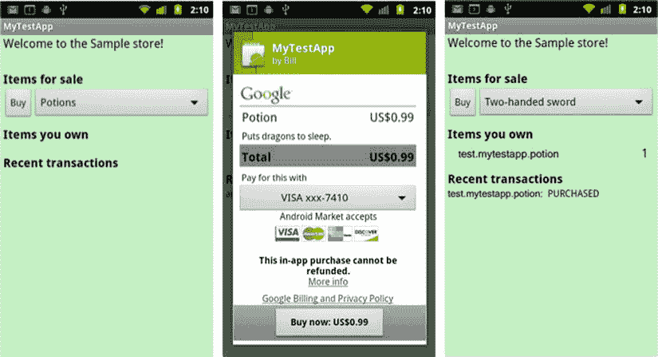

图 7-4. 演示 Google Play 上旧版应用内购买 API 的示例程序

如果可能的话，你应该集成更新、更简单的 3.0 版 API，它使用了一个名为 `Trivial Drive` 的不同示例应用程序（参见 图 7-5）。

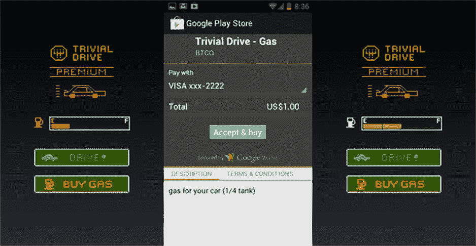

图 7-5. 使用名为 `Trivial Drive` 的示例程序演示的 Google Play 应用内购买 API 3.0 版

至于在你自己应用中启用应用内购买，以下各节详述了需要遵循的步骤，从下载应用内购买库开始。（我们假设你已选择使用 API 的 3.0 版。）

#### 让你的应用启用应用内购买

要下载应用内购买库，请打开 Android SDK 管理器。展开 `Extras` 部分，选择 `Google Play Billing Library`，然后安装该库。

在使用应用内购买之前，你必须在项目中包含一个`IinAppBillingService.aidl`文件。这是一个 Android 接口定义语言文件，定义了与 Google 计费服务的接口。

首先，右键单击项目的 `src` 目录，选择 `New ➤ Package`。将你的新包命名为`com.android.vending.billing`。将`IinAppBillingService.aidl`类（位于`<sdk>/extras/google/play_billing/`以及计费库提供的上一个示例应用程序中）移动到这个包中。

将你的产品添加到 Google Play 开发者控制台。为此，请在开发者控制台中选择你的应用程序，然后选择左侧的 `In-app Products` 选项卡。然后你可以添加新产品。`In-app Product ID`在你的应用的命名空间中必须是唯一的。你的产品类型可以是 `Managed per user account`、`Unmanaged` 或 `Subscription`。你还需要添加描述和价格。

### 应用内购买的初始设置

你可以在此处遵循关于设置过程的详细说明：`http://developer.android.com/training/in-app-billing/preparing-iab-app.html#GetSample`

简而言之，你需要通过你的清单文件，授予你的应用与计费服务交互的权限。你还需要创建一个`Iabhelper`，这是一个应用内购买的辅助类。这个类实现了一种简化的同步通信风格，这是应用内购买 API 3.0 版的优点之一。`Iabhelper`类使用回调与你的代码通信。实际上，设置过程使用了一个`onIabSetupFinished`回调函数来返回成功或失败。

### 使用应用内购买：请求可购买物品列表

同样，此处详细描述了这一过程：`https://developer.android.com/google/play/billing/billing_integrate.html`

在高层面上，你需要构建一个你正在查询的可购买物品列表。前面的链接使用了这个示例：

```
List additionalSkuList = new List();
additionalSkuList.add(SKU_APPLE);
additionalSkuList.add(SKU_BANANA);
inAppBillingHelper.queryInventoryAsync(true, additionalSkuList,
   mQueryFinishedListener);
```

正如你所料，`mQueryFinishedListener`是一个回调函数，它会被传入一个可用库存（包括其价格）的列表进行调用。

### 使用应用内购买：进行购买

类似地，进行购买需要调用应用内购买辅助类，并通过一个回调监听器函数处理响应：

```
inAppBillingHelper.launchPurchaseFlow(this, SKU_APPLE, REQUEST_CODE_VALUE,
   mPurchaseFinishedListener, "developerPayloadString");
```

`SKU_APPLE`是要购买的物品。`REQUEST_CODE_VALUE`是一个正整数，将被返回给调用者。`developerPayloadString`是一个便利字符串，供开发人员发送补充信息。它可以为空。

### 使用应用内购买：确定哪些物品已被购买

延续这种模式，你可以通过对应用内购买辅助类进行查询来确定哪些物品已被购买，查询结果由回调监听器捕获：

```
inAppBillingHelper .queryInventoryAsync(mGotInventoryListener);
```

你需要在每次应用重启时确定哪些物品已被购买，以便你的用户能够访问他们已经购买的功能。

### 使用应用内购买：消耗性购买

要消耗用户已购买的物品，你可以按如下方式调用应用内购买辅助类：

```
inAppBillingHelper .consumeAsync(inventory.getPurchase(SKU_APPLE),
   mConsumeFinishedListener);
```

### 将你的应用与 Amazon API 集成

如果你已经玩过 Google Play 应用内购买 2.0 版 API 的示例应用程序（`Dungeons` 程序），那么你已经有了一个很好的基础来学习如何与 Amazon API 集成。此链接教你如何修改 `Dungeons` 应用程序，使其与 Amazon 应用内购买 API 兼容：
`https://developer.amazon.com/sdk/in-app-purchasing/reference/google-to-iap.html`

Amazon 声称其 IAP 解决方案所需工作量更少，开发周期更短。但请注意，Amazon 并未将其解决方案与更新的 3.0 版 API 进行比较。

Amazon 在 图 7-6 中提供了两个 API 的可视化对比：

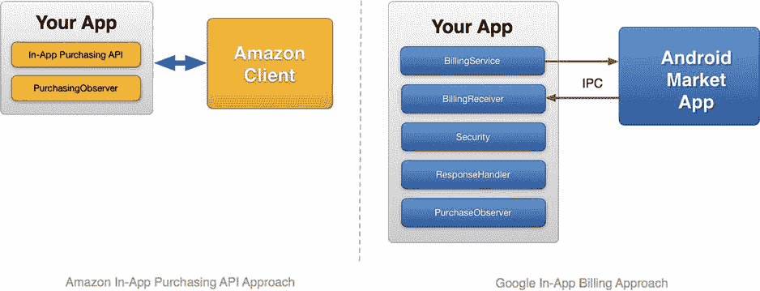

图 7-6. Amazon 应用内购买 API 与 Google Play API 的可视化对比

#### 让你的应用启用应用内购买


#### Amazon Mobile App SDK 集成指南

请从此处下载 Amazon Mobile App SDK 包：`https://developer.amazon.com/sdk.html`

将 ZIP 文件解压到计算机上的一个目录中。在该目录下，您会找到 `/In-App-Purchasing/lib` 文件夹。此文件夹包含一个名为 `in-app-purchasing` 的 JAR 文件，这是应用内购买库，必须将其添加到 Eclipse 项目的库路径中。您可以通过进入项目属性菜单并访问 Java 构建路径来实现此操作。在那里，您可以选择“库”选项卡并添加该 JAR 文件。

在您能够从应用内购买产品之前，必须先将您的产品添加到亚马逊的分发门户中，具体操作是登录分发门户并选择“我的应用”选项卡。从应用下拉菜单中选择“管理应用内商品”选项。接着，您需要选择创建消耗型、权益型还是订阅型产品。您还需要添加价格、描述和缩略图。

#### 在您的应用中进行应用内计费的初始设置

正如您所料，必须授予您的应用程序访问亚马逊应用内购买库的权限。该购买库以广播接收器的形式实现，您需要在清单文件的 `<application>` 部分添加以下内容来声明它：

```xml
<receiver android:name = "com.amazon.inapp.purchasing.ResponseReceiver" >
    <intent-filter>
        <action android:name = "com.amazon.inapp.purchasing.NOTIFY"
                android:permission = "com.amazon.inapp.purchasing.Permission.NOTIFY" />
    </intent-filter>
</receiver>
```

在您的 Java 代码中，您可以通过注册 `com.amazon.inapp.purchasing.PurchasingManager` 来访问该广播接收器。

此类会发起所有应用内计费请求。要捕获来自 `PurchasingManager` 的回调，您必须创建一个 `PurchasingObserver` 类并将其注册到 `PurchasingManager`。为此，您需要继承 `BasePurchasingObserver`。（我们将在本章后面讨论需要被子类化的各个方法。）与 `PurchaseManager` 的注册发生在您的 `onStart` 方法中，代码如下所示：`PurchasingManager.registerObserver(new MyPurchasingObserver());`

您还需要向亚马逊服务注册使用您应用的用户。这也发生在您的 `onStart` 方法中：`PurchasingManager.initiateGetUserIdRequest()`

您必须在您的 `PurchasingObserver` 类中为此请求实现一个回调：`PurchasingObserver.onGetUserIdResponse(GetUserIdResponse)`

#### 使用应用内计费：请求可购买的商品列表

类似地，通过 `PurchasingManager` 发起请求以获取可购买商品的列表：`PurchasingManager.initiateItemDataRequest(java.util.Set skus)`

您需要在 `PurchasingObserver` 中实现以下回调：`PurchasingObserver.onItemDataResponse(ItemDataResponse itemDataResponse)`

#### 使用应用内计费：进行购买

要进行购买，请调用以下方法：`PurchasingManager.initiatePurchaseRequest(java.lang.String sku)`

您需要实现的回调函数如下：`PurchasingObserver.onPurchaseResponse(PurchaseResponse purchaseResponse)`

#### 使用应用内计费：确定哪些商品已被购买

在以下回调中，当商品已被购买时，`PurchaseResponse` 字段会被设置为 `ALREADY_ENTITLED`（当然，所涉及的商品必须是分发门户中设置的 `ENTITLEMENT` 类型产品）：

#### 使用应用内计费：消耗型购买

消耗型购买就是非权益型购买。一旦购买，应用必须跟踪其使用情况。此类商品可随时重新购买。

### 支持通过多个应用商店进行应用内计费

截至撰写本文时，尚无成熟的解决方案能够抽象处理多个应用商店进行应用内购买所带来的问题。不过，一个名为 OpenIAB 的开源项目正在开发中，可能会改变这一现状。OpenIAB 是 One Platform Foundation 的一部分，这是一项全球性倡议，旨在帮助开发者在多个替代应用商店提交他们的应用。


