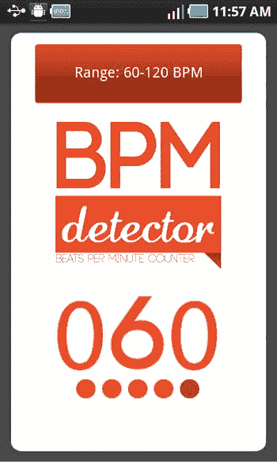
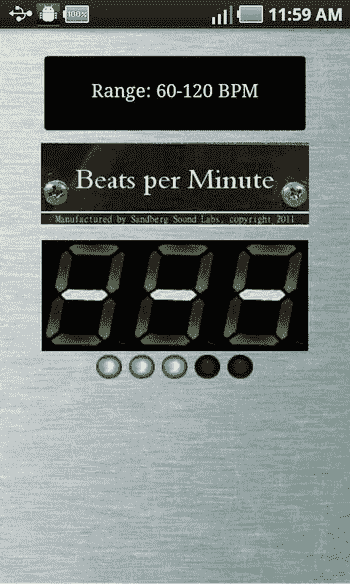
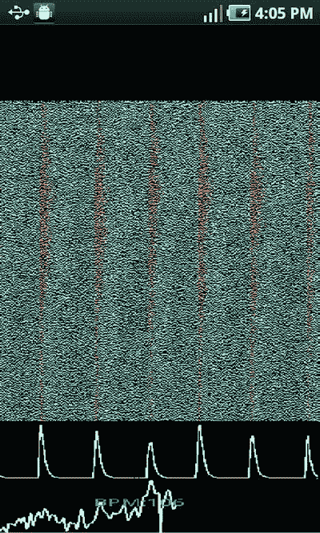
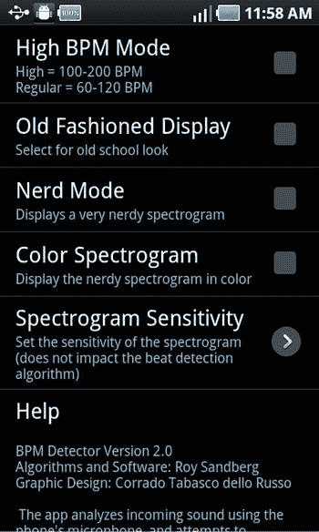

# 第 8 章：让应用市场为您所用

至此，我们假设您已完成应用的编写、测试工作，一切进展顺利。现在，您的应用即将加入 Android 平台已有的 70 多万款应用之列。如何让您的应用脱颖而出？如何最好地争取全球超过 5 亿 Android 用户的关注？让我们一起来探索。

### 上传到应用商店

本章将介绍您需要了解的所有关于将应用上架至 Google Play 及其他应用商店的知识。我们假设您的应用已能无错误运行，这是上架 Google Play 的必要条件。其他应用商店可能有更严格的要求。相信您已发现，让应用无错误运行只是第一步。您可能会发现，应用确实按照您的编程逻辑运行，但结果却并非您所期望的。这两者可能截然不同。

最终，您必须赶在发布截止日期前完成，若无法让应用尽善尽美，至少也应使其运行流畅。如果应用未能满足您的所有期望，请放松！您随时可以在后续进行更新。

如第 1 章所述，提交到 Google Play 比苹果 App Store 更简单，因为无需任何审批流程，这意味着您无需等待 Google 的反馈。同时，这也意味着在您完成本章所有步骤后不久，您的应用即可供全球 Android 用户下载。

此时将令人十分激动，因为您即将为应用举行盛大的发布仪式。用户与利润的潜力正在等待，您的应用也将在 Google Play 上接受评价。您最好确保它值得五星好评！

### 您的 Android 应用有多完善？


#### 如果答案是否定的，那或许该暂缓营销计划

营销的核心，是向人们展示你最出色的产品，让他们爱上它并渴望拥有。如果你的产品平平无奇，这段关系可能在开始前就已结束。安卓用户是一群善变的群体；即使是免费应用，他们也期望一切运行顺畅。如果你在销售付费应用，哪怕是最微小的问题，也可能疏远你的潜在客户。此外，许多应用商店根本不会接受运行不佳的应用。

马克的第一个应用就曾面临这种情况。他知道自己希望某个时间点发布应用，即便它尚未完全准备好，他还是发布了。马克在启动画面上添加了一条免责声明："此应用仍在建设中，更多功能即将推出，请暂勿评价。"

尽管这条声明显得有些不够专业，但却是必要的。你最不希望发生的事，就是因为应用尚未完善而收到一星评价。

最终，马克得以进行必要的更新来改进应用。当所有功能都正常运行后，他感觉可以撤下那条"抱歉，尚未完工"的免责声明了。在拥有值得夸耀的成果之前，他没有开启营销攻势。

就营销而言，从发布前的造势过渡到发布后的口碑传播，你需要调整策略。我们将在下一章详细讨论这一点，但在此，我们想简要地给那些初次进入市场的开发者一些建议。

### 提交到应用市场前该做什么

在将你的应用提交到安卓市场之前，你需要提前处理好以下事项：

-   应用应能无任何缺陷运行。这听起来显而易见，但有时发现这些缺陷并不容易。你绝对不希望应用出现哪怕一次强制关闭窗口。如果这种错误出现一次，你的用户就可能给应用打一星。在提交到安卓市场之前，你应该测试每一个按钮、每一项功能、每一个活动，确保其运行无误。理想情况下，你已经遵循了我们第 5 章中讨论的最佳调试实践——包括单元测试。你可能还想进行一轮内测，相关内容也在第 5 章中有所讨论。
-   在竖屏和横屏模式下测试应用布局。你的应用可能看起来很棒，但你最好确保当你将安卓设备横过来时，它看起来同样出色。自动横屏是安卓一个很棒的內置功能，但它可能无意中扭曲应用的外观。开发者可以关闭此功能；模拟器能向你展示应用在两种视图下的样子。同样，你的应用在手机上可能看起来很棒，但在较旧的低分辨率手机或拥有巨大屏幕的平板电脑上会是什么样子呢？在正式发布之前，请务必在几台真实的安卓设备和几个安卓版本上仔细审视你的应用。在针对不同设备测试布局时，你也可以更改模拟器的屏幕分辨率。请注意，为竖屏和横屏模式设置完全不同的布局是可能的。只需在你的应用的`res`目录下创建一个名为`layout-land`的目录，当手机处于横屏方向时，这些布局文件将被优先选用。
-   让用户可以方便地为你评分。如果你有一个好应用，并且认为它值得五星好评，务必确保用户能轻松地给出你认为应得的评分。你可以在应用中设置提示，引导用户为你评分。

虽然无法直接跳转到 Google Play 中的评分页面，但可以做到在你的应用市场中打开你的应用。实现这一功能的基本代码如下：

```
Uri marketUri = Uri.parse("market://details?id=" + getPackageName());Intent intent=new
Intent(Intent.ACTION_VIEW);
Intent.setData(marketUri);
startActivity(intent);
```

添加足够的逻辑，这样你的评分请求才不会惹恼用户。幸运的是，其他人已经构建了能够精确满足需求的库。`AppRate` 是一个几乎可以实现你想要的所有功能的 jar 文件。你可以在此了解更多信息：`https://github.com/TimotheeJeannin/AppRate`

或者，这段小代码片段也能完成工作：`http://www.androidsnippets.com/prompt-engaged-users-to-rate-your-app-in-the-android-market-appirater`

如果你和你的公司还有其他想要销售的应用，你可以从你的应用内链接到商店中的这些应用。此技术与我们刚才描述的非常相似，只是`YOUR_OTHER_APP`是一个字符串，设置为清单文件中声明的另一个应用的包名：

```
Uri marketUri = Uri.parse("market://details?id=" + YOUR_OTHER_APP);
startActivity((new Intent(Intent.ACTION_VIEW)).setData(marketUri));
```

设置好你的广告。如果你想最大化利润，请确保使用 AdMob、Mobclix 或你决定采用的任何广告方式，并让它们就位。有关如何设置，请参阅第 6 章。

如果你计划在自己的应用内推广其他应用，或在你的应用内内置一个市场，请设置好你的应用内支付（有关如何设置，请参阅第 7 章）。请记住，每个市场都可能使用自己的应用内支付解决方案，它们通常彼此不兼容。如果你需要应用内支付，你只能坚持使用一个应用商店，或者在你的应用中构建逻辑，根据应用是从哪个商店购买的，以不同方式处理应用内购买。

准备一份好的描述。你的安卓应用需要一份少于 4,000 个字符的描述。明智的做法是准备一份经过深思熟虑的描述，而不是听起来像是即兴发挥的。请记住，你的描述是关键性的营销工具。不要害怕在描述中推销你的应用。

### 截图

提交到应用市场的过程包括为你的应用截图。虽然应用市场对你可以使用多少张截图有不同的规则，但假设你至少需要三张，而且通常来说多些更好。你的截图应该讲述应用背后的故事。理想情况下，潜在用户只需扫一眼你的截图，就能拼凑出你应用的目的。此外，你还应该准备好一段视频（我们将在第 9 章讨论如何制作视频）。说到截图，你不应使用任何非应用屏幕截取的内容。你需要向潜在用户精确展示他们下载你的应用后将得到什么。

如果你使用官方的安卓 IDE，截取屏幕截图很容易。只需将你的应用切换至 DDMS 模式（窗口 ➤ 打开透视图 ➤ DDMS）并运行你的应用。在设备面板的顶部，你会看到一个相机图标。按下此按钮即可为你截取屏幕截图。然后你可以将这张截图保存到你选择的位置——这样你就拥有了安卓设备在特定时刻屏幕内容的完美快照。

#### 选择合适的截图

我们都知道那句老套的说法：一张图胜千言。大多数安卓用户在安卓市场上不是看描述，而是"读"应用图片。对于开发者来说，在截图方面尽力展示最好的图像至关重要。


换句话说，不要只是浏览你的应用，然后截取主菜单界面的截图。你的目标是尝试找到应用中运行状态的最佳视觉示例。因此，你可能不想使用菜单界面，因为菜单界面通常只是一个静止的按钮布局。你要寻找的是能展示应用动态运行状态的截图。如果你有一个游戏应用，你希望展示一个非常刺激的关卡。关键是要用你的截图来讲故事。

例如，`BPM Detector` 使用了四张截图来展示其功能。第一张截图展示了默认皮肤在运行中的状态（见图 8-1）。一眼就能看出该应用正在检测每分钟节拍数（BPM），范围在 60 到 120 之间，当前 BPM 为 60。



图 8-1. BPM Detector 的一张截图

下一张截图使用另一种皮肤大致展示了相同的内容，只是 BPM 范围是空的（见图 8-2）。现在很清楚了，该应用支持多种皮肤。



图 8-2. BPM Detector 的另一张截图

第三张截图展示了“极客模式”，该模式会显示声音数据的频谱图。这是另一个运行中的界面（见图 8-3）。



图 8-3. BPM Detector 的又一张截图

最后，第四张截图显示了偏好设置对话框，它解释了如何在所有这些模式之间进行选择（见图 8-4）。



图 8-4. 可用来演示偏好选项的 BPM Detector 截图

总的来说，你应该思考你在宣传哪些功能，并找到能体现这些功能的截图。例如，如果你在销售一个使用安卓设备摄像头的文档扫描仪，那就用一张显示正在扫描文档的摄像头视图的截图，并配上文字“点击摄像头扫描文档”。

请注意，为了获得一张像样的截图，你可能需要稍微修改编程代码。有时为了不让截图看起来枯燥乏味，这是必要的。当你的应用出现在安卓市场上时，你希望截图在视觉上引人注目。你希望用户看到它们时会说：“哦，我明白了，我得下载这个。”

你还需要确保截图尺寸正确且文件格式合适。安卓市场规定的尺寸为 320×480、480×800、480×854 或 1280×800，格式为 24 位 PNG 或 JPEG。安卓集成开发环境（IDE）会以手机原生分辨率获取截图。我们在运行 IDE 时插入了我们的 Droid X 手机，立刻就得到了 480×854 的截图。如果你的手机使用非标准屏幕分辨率，你需要使用诸如 Microsoft Picture Viewer 之类的程序来调整截图尺寸。你也可以使用模拟器来获取截图，当然，你可以将其设置为你想要的任何屏幕分辨率。不幸的是，对于某些应用，模拟器的图形渲染速度不够快，会导致截图模糊。

### 应用描述

除了截图之外，应用描述是用户了解你的应用的主要途径。最好的着手点是分析竞争对手的描述。看看你认为哪些描述有效，并努力做得比他们更好。

你可能希望明确指出为什么你比竞争对手更优秀。务必加入任何你认为有助于用户在搜索时找到你应用的关键词。

如果你有幸获得过任何奖项，一定要写进去。如果没有，你仍然可以引用一些来自满意用户的评价。

在某个地方，你应该包含一个功能列表，这样人们就能确切地知道他们能得到什么。

如果你的用户能从如何使用你的应用的说明中受益，你也可以在描述中加入这些内容，但可能应该放在接近底部的位置。

许多应用商店不允许在描述中使用花哨的格式代码，所以你可能只能使用纯文本。已知 Google Play 支持基本的强调标签，例如 `<b>`、`<i>` 和 `<u>`。嵌入式链接似乎不被支持。

### 图标

曾经有一款去屑洗发水，其口号是“你永远没有第二次机会给人留下第一印象”。无论是在市场里还是安装在手机上，你的应用都是通过图标给人留下第一印象的。记住，应用市场可不喜欢“头屑”般不起眼的东西。假设有人在浏览应用市场，发现了你的应用。他们会看到什么呢？除了你的应用名称、设计公司、评分和价格之外，还有以视觉形式呈现的第一印象：图标。尽管“不能以貌取人”，但事实是大多数人都会这么做。不仅如此，他们还会看着图标，希望能大致了解这个应用是做什么的。这个图标不仅仅是用户点击以访问你应用的那个方块；它是你应用的象征。国家有国旗，公司有标志，应用则有图标。

你选择的图标应该体现你应用的核心功能。以公司 `Waze` 的图标为例（见图 8-5）。注意那个笑脸，它太出名了，用一句通俗的话说，已经成了标志性的符号。然后你会注意到，这个笑脸不在一个黄色的圆上，而是在一个对话框里，就像大多数漫画里的那种对话框。接着你会注意到，这个对话框有轮子。你甚至可能注意到对话框旁边的曲线，这是表示正在接收信号的世界通用符号。太阳也出来了，这意味着外面天气很好。还要注意，它的微笑不是一张嘴，而是你在调头标志上可能看到的那种形状。


图 8-5. Waze 图标，一幅图胜千言

初次使用的用户能从这幅简单的图画中了解到什么呢？这个开心的对话框正在进行一次悠闲的旅行——但它并非孤身一人；它处于连接状态。它让人联想到 `Waze` 所推销的文化：这是一个“免费的社交交通与导航应用，它利用来自附近司机的实时路况报告来节省通勤时间，并改善你的日常驾驶。”尽管这个描述（基于其在安卓市场上的实际描述）并没有被图片完全传达出来，但这足以让潜在用户对其实际功能有所了解。

`Waze` 图标代表了一种描述底层应用功能的创造性方法。然而，大多数应用非常简单，使用更直接的方法也能奏效。例如，如果你正在创建一个名为 `僵尸棒球` 的游戏应用，只需放一张僵尸拿着棒球棒的图片即可。你可以决定是显示完整的僵尸身体挥棒更好，还是只显示一只抓着球棒的骷髅手更好。`Halfbrick` 公司有一个实际的应用叫做 `僵尸时代`，它使用的图标如图 8-6 所示。


图 8-6. 《僵尸时代》的图标

正如你所见，这只恐龙部分骨架化，这意味着它是一只僵尸恐龙。这也意味着你将面临一个充满僵尸恐龙敌人的游戏，这些敌人是相当不寻常的视频游戏对手。

很可能会这样，你会想出好几个图标的点子，然后不得不从中选出一个来。


图 8-7 是另一个显而易见的图标示例。它来自一款名为“炼金术”（Alchemy）的游戏应用，这是一款非常容易上瘾的应用程序。该游戏涉及将多种元素（以图标形式呈现给用户）混合在一起，以合成新事物。考虑到炼金术与药剂使用之间的明显关联，为什么不使用这样一个烧杯作为图标呢？


图 8-7。热门应用“炼金术”的图标。

在确定图标的视觉风格时，参考竞争对手的做法会有所帮助。请注意，你并非要模仿竞争对手的所作所为；相反，应始终尝试找出他们尚未想到的点子。你当然不希望复制受版权或商标保护的图像，因为这样做可能导致诉讼。你要尽可能创造全新的内容，并研究竞争对手，以确保你的图标与他们的图标没有太多相似之处。你绝对应该尝试做的一件事是，使图标的风格与你应用的总体风格相匹配。例如，如果你为图标选择了红色和黑色作为主色调，那么很可能也应在你的应用中突出使用这些颜色。统一风格同样有助于设计你的徽标，你应该对于诸如此类的“琐碎细节”进行深思熟虑。

谷歌要求你的高分辨率图标采用 32 位 PNG 格式，分辨率为 512x512 像素，并带有 Alpha 通道。你可以使用大多数图形编辑软件输出此格式。其他应用商店可能要求其他分辨率。

### 其他图形资源

许多应用商店（包括 Google Play）都允许可选地添加推广图和功能图。如果条件允许，你应强烈考虑包含这些图形资源。

### 视频

你的视频应展示你的应用能做什么，并突出其所有精巧功能。不幸的是，当你还没有多少可展示的内容时，制作关于你应用的视频会很困难，除非你能制作某种预告片/宣传片。

如果你还没有 YouTube 账户，请注册一个。你需要一个地方来存放所有关于你应用的视频素材，所以最好选择在最流行的视频分享网站上做这件事。

制作视频可能很棘手，而发布低质量的视频可能会损害你应用的声誉。如果你能弄到一台可以拍摄高清视频的摄像机，你应该能够将其安装在三脚架上并固定在一个位置，以便你能拍摄一些在 Android 设备上运行应用的镜头。PlayOn 公司就是一个很好的例子。他们的视频很简单，就是一个人展示该应用如何在 Android 设备上工作。毫不奇怪，这是视频演示中最好的类型。你可以在此处观看该视频：`http://www.youtube.com/watch?v=Ei1otuNk8oM`。

某些智能手机，如三星 Galaxy S 系列，支持视频输出。通过录制这种视频输出，你可以制作视频屏幕截图，用于替代或补充你外部拍摄的视频。

有许多视频编辑软件包可以帮助你制作出精致的最终成品。请随意使用你最喜欢的软件。如果你是视频编辑新手，微软的 Windows Movie Maker 是免费的、易于使用的，并且对于新手电影制作者来说已经足够用了。你可以在此处下载：
`http://www.microsoft.com/en-us/download/details.aspx?id=34#Overview`

### 多个市场

尽管 Google Play 拥有最大的市场，但有很多理由将你的应用上架到其他商店。例如，你可以选择亚马逊应用商店（Amazon Appstore），它能让你接触到全球受众。亚马逊应用商店规模较小，但增长迅速。事实上，据说它每个日常用户产生的收入要高得多。另一方面，亚马逊的日常用户数量要少得多。Kindle Fire 是一款非常流行的设备，每天能带来大量下载量，但其整体规模无法与整个 Android 用户群相匹敌。亚马逊目前免除了其 99 美元的年费开发者费用，只要这一点仍然有效，就值得一试。但请注意，亚马逊的应用审批过程比 Google Play 慢得多。此外，亚马逊团队会为你的应用撰写他们自己的描述。与 Google Play 一样，亚马逊的开发者保留其应用销售价格的 70%。

如果你正在开发平板电脑应用，你应该考虑到，在亚马逊应用商店和巴诺书店（Barnes and Noble）的 Nook 应用商店之间，超过 40%的平板电脑用户只使用*非*Google Play 的应用商店。你最好考虑将你的平板电脑应用上架到那些商店。

还有其他一些值得考虑的应用商店：

*   GetJar 是最大的独立跨平台应用商店，也因其在 Google Play 上运营最大的虚拟货币（GetJar Gold，可供超过 1 亿用户使用）而闻名。与其他应用商店一样，GetJar 给开发者其应用销售价格的 70%。你可以在此处了解更多信息：`http://developer.getjar.com`
*   SlideME 为超过 140 家原始设备制造商（OEM）提供支持，这些设备预装了 SlideME 市场。它支持多种支付处理商，包括亚马逊和 PayPal。开发者通常保留应用购买价格的 80%，减去 10 美分的手续费。其开发者网站在此处：`http://slideme.org/developers`
*   作为排名第一的智能手机品牌，三星为 Android 应用提供了一个巨大的市场，支持超过 60 个国家。独立开发者目前保留其 100%的销售收入。在应用上架 6 个月后，这个比例将降至 80%，然后在 2015 年 3 月之后降至 70%。开发者可以在此处了解更多信息：`http://developer.samsung.com/distribute/app-submission-guide` 
*   Android 应用可以重新打包以用于 BlackBerry 10 和 BlackBerry 平板电脑操作系统（OS）。使用 BlackBerry 市场的前提是你已经使用 Android 的 BlackBerry 运行时将你的应用移植到了 BlackBerry 平台。BlackBerry 开发者保留其销售收入的 70%。你可以在此处找到更多信息：`http://appworld.blackberry.com`

在大多数情况下，你应该将你的应用上架到 Google Play，然后再考虑哪些其他应用商店值得你投入时间。一旦你开发了应用并准备好了所有图形资源，只要你不需应用内购买功能，将应用上架到多个商店实际上相当容易。

如果你拥有自己的网站，将应用提交到多个应用商店还有另一个理由：搜索可见性。每个应用商店通常都允许你链接回你的官方网站，这会在大多数搜索引擎上带来更高的排名。

### 市场的常见问题


### 应用商店上架指南：描述、关键词与市场特定要求

#### 描述与关键词策略

思考你的应用在应用商店列表中会如何呈现，以及它将如何吸引用户。大多数应用是通过用户主动使用关键词搜索而被发现的。请确保你的描述使用了多样化的关键词，但注意不要仅仅罗列关键词——谷歌尤其会对单纯罗列关键词的页面进行惩罚。以自然的方式将重要词汇融入到描述中。如果你不确定应该使用哪些关键词，请让朋友在不接受任何输入的情况下描述你的应用，他们可能会以意想不到的方式进行描述。当应用开始获得评价后，你可以观察用户使用了哪些关键词来评价你的应用，并记得修订你的描述以包含这些关键词。选择合适的名称和描述非常重要，这对于扩大用户基础大有帮助。

你的应用描述在 Google Play 中会自动翻译到你选择营销的每个地区。在描述中，你应谨慎避免使用那些翻译效果不佳的习语表达，以免在这些市场中赶走潜在用户。对于其他应用商店，你的文本可能不会自动翻译，但非英语用户仍然可以从简洁的语言中受益。

#### Google Play 特定问题

应用描述的前 167 个字符最为重要，应包含明确描述你的 Android 应用功能的关键词。当用户在 Google Play 网站上执行搜索时，167 个字符的描述会与应用图标一同显示，这是你（在应用图标之后）抓住用户注意力的第二次机会。在移动设备上，Google Play 描述由应用的标签行和剩余的 4,000 个字符组成，但在用户点击“更多”之前，只显示 6 行（约 257 个字符）。

谷歌要求产品描述不得具有误导性，也不得堆砌关键词以试图操纵商店搜索结果中的排名或相关性。请务必遵守谷歌的要求，否则你可能会发现自己被应用商店封禁。

一般来说，应优先考虑应用描述的前 257 个字符，因为它们在 Google Market 中会突出显示（即你在手机上运行 Google Play 应用时看到的内容）。

- 同时，将相关关键词集中在 167 个字符内，因为这些字符会在 Android Market 网站上显示。
- 谷歌建议描述区域的其余部分以易于阅读的项目符号列表形式概述应用的主要功能。

如需额外帮助，你可以访问 Android Asset Studio 的图标生成器（`http://android-ui-utils.googlecode.com/hg/asset-studio/dist/index.html`），它允许用户从现有图像、剪贴画或文本快速轻松地生成图标。请务必选择“Generate Web Icon”选项以获取所需的高分辨率图标。

#### Amazon App Store 特定问题

与 Google Play 非常相似，Amazon App Store 也需要图标和屏幕截图。视频是可选的。在浏览 Amazon App Store 时，用户在点击你的图标之前是看不到描述的。实际上，在点击应用图标之前，用户看到只有图标、应用标题、作者和评分。请确保你的图标传达出正确的信息！

需要一个 114x114 像素的小图标图像，以及一个 512x512 像素的相同图像的大缩略图。图像必须以 PNG 格式存储。

至少需要三张屏幕截图，但最多可以使用十张。屏幕截图必须为 1024x600 像素或 800x480 像素，可以采用横向或纵向模式。屏幕截图的图像格式可以是 JPG 或 PNG。

需要一张包含应用名称的推广图片（非屏幕截图）。这张图片在缩放到 300x146 像素后应仍清晰可读，并且设计为横向模式显示。推广图片的尺寸应为 1024x500，且必须为 PNG 或 JPG 格式。所有文字应距离边缘至少 50 像素。推广图片*不应*包含定价信息、屏幕截图、描述性文字、评分或任何其他呈现在别处的内容（应用标题除外）。

产品详情页面最多可以放置五个视频。每个视频宽度应至少为 720 像素，大小不超过 5 兆字节。支持的视频格式包括 MPEG-2、WMV、Quicktime、FLV、AVI 和 H.264 MPEG-4。

亚马逊的审核流程通常比 Google Play 慢得多，而且亚马逊以更具选择性而闻名。你可以在此处找到更多信息：`https://developer.amazon.com/help/faq.html`

#### SlideME 商店特定问题

开始使用 SlideME 商店非常容易。首先，你必须创建一个账户，然后你将获得上传应用的选项。你需要设定价格、列出关键词（以帮助 SlideME 用户找到你的应用）并为你的应用选择一个类别。

与其他应用商店一样，你需要包含一个描述。SlideME 要求提供简短描述和详细描述。简短描述限制为 500 个字符。

如果你的应用针对手机或平板电脑进行了优化，你可以通过复选框向 SlideME 用户提示这一事实。你必须声明你的应用是否使用应用内购买或广告。如果你的应用使用广告，你必须描述你所使用的广告网络。

更多细节——例如你的软件许可证、条款和条件以及隐私政策——是可选的。

一个小问题是：SlideME 会解析你的`AndroidManifest.xml`文件以查找你的应用名称。Google Play Store 可以很愉快地从你的`activity`标签（它查找`android:label`标签）中提取应用名称。不幸的是，SlideME 只搜索`application`标签中包含的`android:label`。如果此标签缺失，SlideME 无法识别你的应用名称，并且不允许你上传应用。这是一个非常小的修改，但确实有点烦人。

当用户搜索应用时，SlideME 至少显示 12 行文本（可能更多）。屏幕截图和图标也是必需的。SlideME 对应用的审核流程可能需要长达四天。要开始，你需要在此处创建一个开发者账户：`http://slideme.org/developers`

#### 其他应用商店

当用户搜索应用时，GetJar 会显示 2 行（约 15 个词）的描述。这前两行对于获得关注至关重要。屏幕截图和图标也是必需的。关于如何将应用上传到 GetJar 的详细教程可以在这里找到：`http://blog.getjar.com/developer/tutorial-upload-your-app-to-getjar/`

当用户搜索应用时，Samsung App Store 不显示描述。屏幕截图和图标是必需的。你可以在此处了解如何将你的应用提交到三星：`http://developer.samsung.com/distribute/app-submission-guide`

当用户搜索应用时，BlackBerry World 应用商店显示两行（约八个词）的描述。屏幕截图和图标是必需的。在此处了解如何将你的 Android 应用提交到 BlackBerry 市场：`https://developer.blackberry.com/android/`

## 总结

- 你的应用准备好投放市场了吗？
- 你是否有至少三张能够解释应用精髓的精美屏幕截图？
- 你是否有能够解释你的应用并吸引读者注意力的应用描述？
- 你的图标和其他图形资源是否看起来专业并符合所有正确的格式要求？
- 你是否已决定哪个市场最适合你？或者你已决定使用多个市场？

