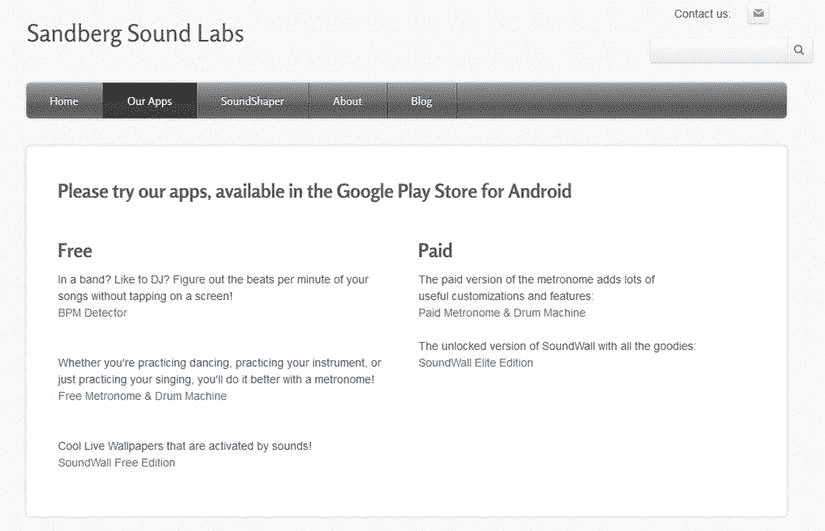
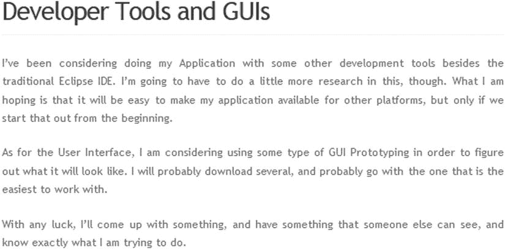

# 广而告之

作为开发者，你会发现仅仅将应用上架到 Google Play 和其他应用市场，然后坐等大量下载是远远不够的。将应用发布出去只是第一步，你还需要制定一个利用合适推广渠道的营销计划。本章将讨论如何制定营销计划，以及你可以选择的推广渠道。

制定计划总是有益的。本章将介绍多种你可以使用的营销技巧，但并非所有技巧都适合你的应用。你可能没有足够的预算来采用成本较高的技巧，或者某些技巧可能无法触达你的目标市场。例如，如果你的市场面向国际用户，那么本地电台广告可能收效甚微。

对于只有一款应用的公司而言，制定完整的营销计划可能有些小题大做。但在决定如何最好地切入市场时，营销计划中的要素仍然非常有用。

营销的核心在于向潜在客户传达产品的价值。在传达用户为何应该使用你的应用之前，你首先需要确保*你自己*理解了这一点。

你在第 2 章中为定义迷你商业计划所做的大量工作（好吧，我们希望你真的做了），也能对你的营销计划有所帮助。还记得你当时如何确定应用解决的问题、分析竞争对手以及确定目标市场吗？现在是时候从不同的角度来思考这些问题了。SWOT（优势、劣势、机会、威胁）分析是一种有用的方法，可以帮助你思考如何向客户传达信息。通过理解自身的内部优势和劣势，以及外部机会和威胁，你可以围绕自己在市场中的定位来精心设计信息。当然，在考虑优势和劣势时，应当结合你试图解决的问题以及你的竞争对手。你的竞争对手也帮助你定义了市场中的威胁和机会。

你公司的优势和劣势是内部问题。因此，反思公司的文化和目标，有助于你发现那些能让你专注传达信息一致性的优势和劣势。

虽然竞争对手会影响你对威胁和机会的看法，但你的客户也同样如此。那么，你的目标市场如何影响你的营销策略呢？在分析客户时，你应该思考是什么驱动了他们的决策过程。什么样的人会购买你的产品？这个人认为什么是好的“价值”？这些关于目标受众的问题，在第 2 章中已经讨论过，它们能帮助你更好地向客户传达信息。

当你了解了自己、竞争对手和客户，你就能明白如何最好地推广你的产品。如果你的应用面向商业用途，那么 Facebook 可能不如 LinkedIn 有用。如果你的用户不常上网，那么争取在纸质期刊上获得报道可能是个好方法。如果你的竞争对手在年轻黑人群体中未能获得良好反响，而你看到了机会，那么或许你应该在 Twitter 上投入大量精力，因为该平台在非裔美国人和年轻成年人中都颇受欢迎。如果你的应用售价很高，在线广告可能是个不错的选择。如果你的应用依赖广告支持，你可能需要依赖免费的广告形式。这里有无限的可能性，但它们都始于 SWOT 分析。在讨论推广渠道时，请牢记你的 SWOT 分析。有些推广技巧适合你，有些则不然。

制定营销预算将帮助你决定哪些项目可以负担，哪些无法承担。我们将讨论一系列可供你采用的营销活动，其中许多是完全免费的。其他一些则可能相当昂贵，但有时这些钱花得也很值得。无论如何，你需要为营销和销售成本做预算。如果你真的想通过应用赚钱，你至少应该在预算中为网站和一些名片留出空间。这些是成本极低的物品，却能极大地帮助你建立专业形象。如果资金紧张，你可以使用个人电话号码处理业务，并在家办公。将省下来的钱投资于广告。我们稍后会讨论这一点，但让我们先从你的网站开始，它是互联网时代任何推广活动的核心。

## 准备你的网站

如果你想被认真对待，拥有一个网站至关重要。你做的任何推广都应将用户引导至你的网站，在那里他们可以了解更多关于你的应用，并（希望）下载或购买它。幸运的是，如今搭建一个基本网站非常容易，即使你技术不精通也没关系。许多在线工具让你可以轻松创建自己的网站。在第 2 章中，我们讨论了如何设置一个网站来测试你的市场需求假设。你可以使用同样的工具来创建你的正式网站。或许现在是时候升级到付费账户并托管你自己的域名了。

即使你的网站已经存在，目前可能看起来也不太像样。也许你曾用它来建立社区，或者仅作为一个占位符，直到你的应用上线。换句话说，你的网站可能仅仅是一个挂着“即将推出”招牌的商店。现在，你需要让它成为一个有效的应用销售工具。请记住，你的目标是将访客转化为应用用户。

现在是时候准备你的网站，让它为销售做好准备了。这意味着你需要清楚地表明你在从事应用业务。请注意图 9-1 中的几个元素，它们展示了如何在你的官方网站上展示应用。

图 9-1。随着发布日期的临近，你的网站需要准备好迎接用户涌入。

图 9-1 展示了 Roy 的网站。如你所见，顶部的任务栏让网站访客能轻松找到应用。其设置方式也让用户只需点击鼠标即可轻松获取这些应用。除了应用描述之外，在设备上展示应用运行画面是应用网站的一种惯例。例如，你可以放置一张应用在 Android 手机上运行的图片，但如果你的应用针对平板电脑进行了优化，你的网站也可以展示平板电脑上的效果。

如果你愿意，你可以在网站上放一个视频，我们将在本章后面讨论如何制作你的应用视频。毕竟，你不如直接向用户展示你的应用在实际 Android 设备上运行的样子。

如果你想，可以划出一个区域来列出功能，并包含好处和系统要求。你也可以放上一些评价和推荐语。例如，你可以创建一个链接，让用户能轻松地在 Facebook 和 Twitter 上分享。我们强烈建议你在应用内创建一个触摸屏按钮，直接链接到你的网站。参考那里的代码示例，以便你的应用用户可以从你的应用内访问你的官方网站，并在 Facebook 和 Twitter 上分享（本章后面会讨论）。

### 提升搜索排名与网络影响力

可想而知，如果潜在用户能通过搜索引擎轻松找到你的网站，那将是最好的情况。如今，提升搜索排名的最佳方式是发布真诚且有用的内容。因此，你应尽可能在网站中添加更多有价值的内容。

此外，你还需要制作网站的移动版本。实现方法有很多，可以参考以下网站：

- Google 转换工具 (`http://www.google.com/gwt/n`)
- Mobeezo (`http://www.mobeezo.com/`)
- Mobify (`http://mobify.com/`)
- mobiSiteGalore (`http://www.mobisitegalore.com/`)
- Winksite (`http://winksite.com/site/index.cfm`)
- Zinadoo (`e-mail.zinadoo.com/`)

### 博客写作

即使你不喜欢写博客，甚至不擅长写作，博客依然是建立网络影响力的免费工具之一。一个包含相关博客文章的网站，在搜索结果中的排名几乎总是更高。所以，开始写博客吧！这并不难——大多数免费建站工具都支持博客功能。随着你产品上线日期的临近，你应该更频繁地更新博客。开发应用程序的最后阶段通常非常有趣，这正是开始分享你所克服的激动人心挑战的好时机。

图 9-2 是马克网站上一篇博客文章的截图。请注意，文章的写法既展现了你作为开发者的身份，也让你显得有血有肉。它表明你是在努力让产品运转起来，而非纯粹为了赚钱。你可能会注意到，有些内容即便属实，也不适合写进博客。例如，不宜提及合作公司给你带来了困扰，因为这会损害对方的声誉。同时，也应避免使用不适合工作场合的语言。

图 9-2. 应用程序网站博客文章可能呈现的样子。此例使用 WordPress 制作

如有需要，你可以一次性撰写多篇博客，然后设置好发布时间，让它们在指定时间自动上线。这个小技巧能让你不必在周内每天花时间写博客。如果你使用的是 WordPress 模板，操作非常简单——只需在右侧`发布`栏下的`立刻发布`部分，点击`编辑`，就可以设定博客的发布日期和时间。

这引出了另一个问题：你该写些什么？要回答这个问题，你需要思考公司的文化和目标。想想你的 Twitter 和 Facebook 粉丝会对什么内容感兴趣。一个不错的主意是聊聊你一直承诺的功能。开发应用程序就像制作电影，相信你肯定看过很多 DVD 上关于电影制作的花絮。因为只有少部分幕后纪录片真正有趣，所以类比一下，你要确保自己的文章有“钩子”——能吸引读者。如果你能以有趣的方式讲述开发应用的过程，博客自然会吸引读者。

### 高效的产品发布

网站搭建完成后，你就可以开始规划产品发布事宜了。应用程序正式上线的那一天是绝佳的宣传时机，因为你将有实际的移动软件可以向媒体成员展示。即使你的发布只是 beta 测试版，同样可以从推广中获益。只要确保你正确设定了用户的预期即可。请记住，beta 版本不能成为软件质量低劣的借口；如果你的软件已知存在大量缺陷，你压根就不应该向公众发布。我们的观点是：当发布日来临，你应该拥有一款值得向全世界介绍的应用程序。

你的发布日推广策略取决于你想达成的目标。如果你只是低调发布一个 beta 版本，你可能需要一些关注，但又不能太多。毕竟，如果评测者在 beta 测试期间发现了你应用中的严重问题，你肯定不希望全世界都知道。至少，你应该从你的网页开始，在主页上宣布产品发布的消息。在博客上发布相关文章，并确保访问者一进入你的网站就能看到这条消息。

你的推广策略还取决于你在本章开始时（我们希望如此）所做的市场分析。本章的剩余部分将介绍你可以考虑的不同推广渠道。我们推荐的多数渠道都是免费或低成本的。它们包括社交网络、在线媒体联系人、线下媒体联系人、在线论坛和游击营销技巧。付费推广策略并非人人适用，但如果预算允许，你可以考虑在行业展会上设立展位，以及使用在线广告和传统广告。

### 利用社交网络营销：Facebook、Twitter、LinkedIn

我们生活在互联网时代，这带来了诸多便利。例如，你若有话要说，无需制作视频在电视上播放，也无需打印成文字发表。如今，你只需发布一条信息，全世界的人都能看到你的动态。然而，互联网的庞大规模对那些试图宣扬个人成就的个体来说是一种挑战。任何精通网络营销的人都会告诉你，拥有良好的社交媒体影响力至关重要。

社交媒体是推广应用的好方法。它免费，且读者正使用着电脑或智能手机，距离下载你的作品仅需点击几下。现在，我们来谈谈不同类型的社交媒体平台，以及如何利用它们为你服务。

#### Twitter

也许你已经是 Twitter 用户了。如果是这样，你或许早在应用发布前就通过推文向公众透露了开发进程。到目前，你可能已经关注了许多人，也拥有了一些粉丝。那么，你应该登录 Twitter，确保你已发布推文告知发布日期，让你的粉丝知道可以期待什么——就像电影预告片预热一样。如果还没做，现在开始培养 Twitter 粉丝也为时不晚。

虽然刚开始使用 Twitter 时可能有些困难，但你应该熟悉在电脑和移动设备上使用它。如有需要，你可以使用专门的客户端应用，如 Twitterrific、Echofon、TweetDeck 或官方的 Android 版 Twitter 应用来追踪所有动态。你甚至可以访问 oneforty 的综合性 Twitter 应用目录 `http://oneforty.com`，探索各种 Twitter 追踪工具。

你应该像使用博客评论区一样使用 Twitter。了解潜在用户对你的应用有何评价，并直接回应他们。然后，你可以通过推文分享应用开发的进展——微博客，一种通过简短帖子沟通应用状态的方式，是在不透露过多细节的情况下解决问题的绝佳媒介。

当你回复评论时，你为产品赋予了人性化的一面，向世界表明你并非一台只以赚钱为目的的冰冷机器。同理，不要持续不断推销你的应用，否则你就像是 24/7 不间断的广告，会让人反感。

同时，你必须避免过度宣传的风险，保持话题的相关性。不要发起一系列与你的应用无关的推文。偶尔偏离话题也无妨，但过度如此可能会吸引另一类观众——或者更糟，根本没有观众。

