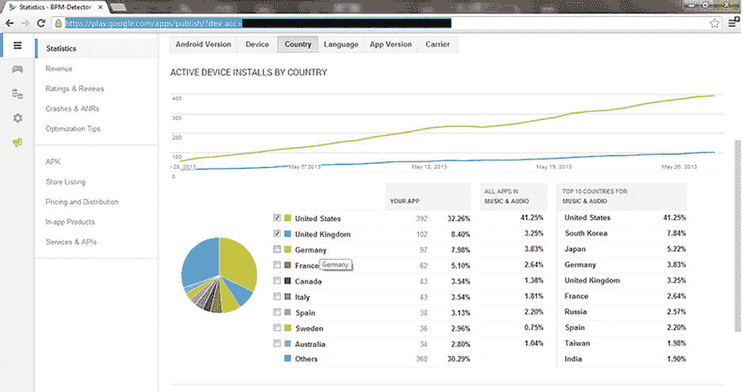
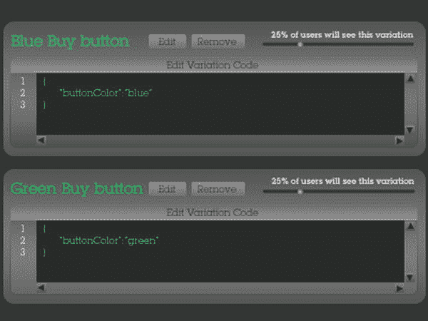
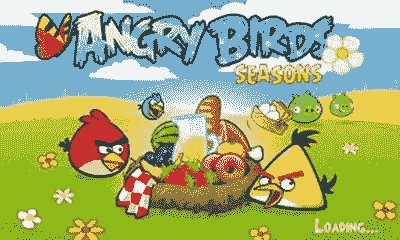

# 排版后的内容

另一个实用的 Twitter 工具是*话题标签*。话题标签由井号符号（`#`）表示，用于标记推文中的关键词或主题。用户在推文中的相关关键词前加上`#`，以便对这些推文进行分类，从而更容易搜索。其他 Twitter 用户可以点击任意消息中带有话题标签的词语，然后就会看到该类别下的所有其他推文。变得非常流行的带话题标签的词语最终可能会成为热门话题。

关于 Twitter 和其他社交网络，需要理解的重要一点是：质量永远比数量重要。你拥有多少粉丝，远不如这些粉丝是谁来得重要。这就好比是拥有一万个 Facebook 好友和拥有一百个真正朋友之间的区别。

同样地，不要仅仅为了让人关注自己就去关注别人。你应该关注那些能让你学到东西的人。任何 Android（甚至 iOS）开发者都是合适的关注对象，因为你将不得不处理类似的问题。你绝对应该关注记者，因为他们是有影响力的人。也不要忘记你的朋友和同行。最后，关注那些正在关注你的人。

你还应该花时间转发他人的帖子，尤其是当你的受众可能会喜欢这些内容时。你转发得越多，最终其他人也会越多地转发你的帖子。将其视为 Twitter 上的因果循环。

你也应该花些时间创建一个 Twitter 列表。这样，你就可以将用户分组，每天快速浏览一下他们发布的内容。例如，你可以将一组命名为`开发者`，然后看看 Android 开发社区正在流行什么。

#### Facebook

Facebook 是社交媒体中的宠儿。如果你的应用面向消费者（而非商业用户），那么你需要在 Facebook 上露脸。

务必为你的业务创建一个单独的 Facebook 页面。过去，企业在 Facebook 上创建自定义 URL 之前需要拥有 25 个“赞”。现在不再是这样了，所以务必从一开始就在 Facebook 上创建一个好记的 URL。

如果你已经在 Facebook 上有个人主页，请确保让你的朋友“赞”你的业务页面。我们人类有从众行为，所以让读者知道你的页面很受欢迎是获得认可的好方法。这被称为“社会认同”——人们会参考他人来决定哪种行为是正确的。如果访问你页面的人看到很多“赞”，他们就会认为你的应用正在蓬勃发展。通过你的 Facebook 页面传播信息很容易。只需执行以下操作：

1.  点击你的 Facebook 页面的 `编辑信息` 链接。
2.  点击 `营销` 链接。
3.  点击 `发送更新`。

你应该谨慎使用这种传播信息的方法，因为这类消息会在互联网上被*令人作呕地*反复广播。在你的产品发布日之前，也是开始使用 Facebook 洞察（一项免费的分析服务）的好时机。当你以管理员身份登录你的 Facebook 页面时，可以点击 `查看见解` 链接来查看关于你 Facebook 页面的指标数据。通过研究这些信息，你可以了解谁在关注你的行动，这些信息未来会很有帮助。

#### LinkedIn

Facebook 可能是消费者领域的大佬，但如果你的应用是面向商务应用的，那么你一定要在 LinkedIn 上露脸。你可以在此处阅读更多关于如何在 LinkedIn 上建立公司形象的信息：`http://marketing.linkedin.com/sites/default/files/attachment/LinkedInCompanyPages_5Steps.pdf`。

如果你参加过很多商业研讨会或会议，你可能已经积攒了一大堆名片。我们强烈建议你登录 LinkedIn，并根据每张名片上的信息搜索联系人；然后向他们发送邀请，添加他们到你的 LinkedIn 人脉网络。

如果你在 LinkedIn 上获得了超过 500 个联系人，你就成为了 500+ 俱乐部的一员，这会让其他搜索你 LinkedIn 个人资料的人看到你的人脉很广。当然，你也会有超过 500 个联系人，以备不时之需。

### 让媒体为你所用

媒体是获得免费宣传的巨大来源。记者们总是在寻找好故事，你的应用可能正是那个故事。务必寻找专门报道你应用所属领域的媒体渠道。定位更精准的出版物更有可能对你的应用感兴趣，也更容易让你联系到潜在客户。

当你准备发布应用时，你应该撰写一份新闻稿，提醒那些可能选择报道你应用的媒体。

#### 撰写新闻稿

新闻稿是为分发给媒体而准备的声明。

需要考虑的一个重要问题是谁会收到你的新闻稿。作为一名专业博主，马克每天都会在收件箱中收到大量新闻稿。其中许多来自公关公司，有些则来自每天发布新闻稿的网站。

#### 遵循新闻稿格式

新闻稿有固定的格式。虽然并非真正的标准，但记者每天都会收到大量此类稿件，他们知道要寻找什么：

-   **公司标志：** 你应该将全彩的公司标志居中放在页眉位置。即便别的没记住，你至少也要让记者记住你的公司名称，所以要让它显眼。一些资料表明公司名称、网址、地址和电话号码应放在页眉，但我们通常看到这些信息放在页脚。
-   **标题：** 我们听说有些资料说标题应该全部大写，但至少应该使用粗体。不必担心标题太长，但它应该足够简短地说明你的应用是什么。
-   **副标题：** 这不是标题的一部分；它居中且不使用粗体。在这里你可以添加一句话，详细讨论你的产品。
-   **日期和城市：** 使用粗体，写明新闻稿的来源日期和城市。
-   **第一段：** 简要概述新闻稿的内容。
-   **第二段：** 这里是新闻五要素（何人、何事、何地、何时、为何以及如何）出现的地方。在你的情况下，你应该写上谁在乎、为什么要在乎、在哪里可以找到它、以及它何时会发生。
-   **引语：** 新闻稿通常会引用公司内部某人的话。引语通过个人视角，使新闻稿更具个性化和人性化。
-   **最后一段：** 作为一名科技和数码产品博主，马克总是以一段总结来结束他的文章，解释产品的价格以及任何关于销售点的细节。此信息放在末尾，是为了提供直接的参考价值，新闻稿的结构也是如此。
-   **公司描述：** 通常以`关于`（在此处插入公司名称）开头，然后介绍公司的成立日期和业务范围。之后，你应该在此放置你的网站 URL。

#### 新闻稿示例

以下是一份关于棒球卡整理移动应用的新闻稿示例：

您的公司标志放在此处

棒球卡整理器现已登陆 Android 设备——让用户能将卡片收藏放入他们的安卓设备中。

卡片收藏者现在可以随身携带他们的收藏品，无论走到哪里，只要有他们的 Android 手机或平板电脑就行。

**华盛顿州西雅图（2011 年 10 月 31 日）。** *公司名称*，一家以在多种移动平台上创建应用而闻名的公司，今天宣布其针对 Android 平台的棒球卡整理器应用正式可用。该应用允许用户利用其 Android 设备上的摄像头，将他们的棒球卡收藏存入手机或平板电脑。


##### 棒球卡整理器

棒球卡整理器内置数据库，允许用户拍摄卡片正面和带数据的背面。随后，用户可输入信息，并按球队或字母顺序整理卡片。

用户无需随身携带实物棒球卡收藏，即可轻松管理自己的藏品。只需在屏幕上轻滑，就能翻阅卡片。该应用同样适用于整理其他类型的卡片，例如电影交易卡。

“大多数棒球卡收藏者必须将卡片保存在防护套中，无法在不损坏品相的情况下享受翻阅的乐趣，”*Sample 公司*联合创始人杰克·杰克逊表示，“棒球卡整理器让用户既能享受浏览藏品的乐趣，又无需担心汗水损坏投资。最棒的是，用户随时随地都能使用。”

棒球卡整理器现已在 Android 市场及公司网站`http://www.samplecompany.com`上线。棒球卡整理器精简版免费，完整版售价 0.99 美元。

##### 关于 *Sample 公司*

*Sample 公司*于 2010 年作为初创企业成立，致力于开发各类移动应用。自成立以来，已推出多款应用，包括更多实用工具、实用应用合集以及更多精彩应用。

您会注意到，我们最终如何利用这篇新闻稿来推广其他应用。

### RSS 源与关注者

如果您和我们一样，会阅读大量在线期刊。我们发现，您并不想花太多时间逐个点击书签，再逐一阅读每个在线期刊或博客。没错，下载一个像`http://www.feedly.com`这样的 RSS 阅读器，以简短形式查看文章（如浏览报纸标题）要方便得多。这样，您就能了解今日热点，同时您的博客或在线期刊也应设置为任何人都能通过 RSS 阅读器查看您的最新动态。

现在，您的博客 RSS 源可能已有不少订阅者。您可以查看自己有多少 RSS 关注者，并在进行 SWOT 分析时了解客户画像。为了获得更多关注者，每次发布博文时，您可以在 Twitter、Facebook 等其他社交媒体上发布链接。

当然，如果您想走繁琐路线，也可以这样做。但我们建议设置 Tumblr 或 TypePad 等网络服务，让博文自动发布到社交媒体网站。此外，使用上述的 WordPress，以及 Blogger、LiveJournal 和 Movable Type 来搭建博客也是可行的。

您应该开始关注博客上的评论。使用 WordPress，从模板中就能轻松实现，这能让您在产品发布前听到潜在用户的反馈。从用户评论中，您可能会了解到在发布前需要哪些功能，或者应用上市后需要添加哪些内容。同时，您也应留意评论中表达的问题。例如，如果看到大量评论说应用太难用，那么重新审视用户界面（UI）可能是个好主意。

遗憾的是，许多博客评论可能是垃圾信息。马克有一个博客每天会产生大量评论，但其中一半与所评论的文章无关。例如，马克写了一篇关于某款小工具的文章后，有人添加了这样的评论：“写得不错的好文章；让我想起了男士假发。”然后附上明显的链接。有些评论感觉像是机器生成的——事实也的确如此。有些程序专门嗅探网站，并已设定程序留下“合法评论”式的垃圾信息。幸运的是，如果您使用带有 CAPTCHA 验证码和垃圾过滤器的博客服务，就能在污染扩散前阻止垃圾信息问题。

### 制作视频

我们在第 8 章讨论如何在应用市场中推广应用时，提到了用视频来推广应用的想法。但视频在应用市场之外同样非常有用。视频分享网站很像社交网络，而病毒视频是最有效的营销工具之一。

计划对视频进行一些剪辑，使其达到可发布到网上的标准。您可能只需将 Android 设备放在干净的桌子上，向人们展示应用的功能。正如我们在第 8 章中提到的，某些手机还可以通过视频输出接口直接录制屏幕视频。

之后您可以添加一些旁白，但可能需要在后期处理音轨。如果摄像机的麦克风无法捕捉到应用发出的声音，这点同样适用于应用可能有的任何音效。

我们在视频制作方面有一些经验，知道这总是比想象中更耗时。毕竟，大多数两小时的电影需要数年时间制作。不要错误地认为用几分钟就能制作出几分钟长的视频。事实上，如果预算允许，您或许应考虑聘请视频制作服务来拍摄您的应用。

视频制作完成后，务必将它放到网站上，让人们了解应用的工作方式。如果您有一个难以用文字解释的应用，这尤其有用。

### 在线论坛

几乎任何话题都有相应的在线论坛。无论您的应用是针对什么领域，总有一个论坛里的人们渴望了解您正在开发的内容。LinkedIn 是发现对您领域感兴趣的专业人士的好地方。Google Plus 也是专家聚集的平台。简单的网络搜索就能找到与您的应用相关的更多论坛。

在开发应用的过程中，您可能已经发现了一些相关论坛。务必在合适的时机向论坛发帖。保持谦逊，将论坛读者视为专家——他们花时间学习和讨论的是您的应用所涉及的内容。如果您尊重他们，他们也会回馈尊重，这能转化为页面访问量、好评，并最终带来收入。

### 公共关系与媒体

与媒体互动时，您需要戴好公共关系的帽子。虽然直接说出想法、让记者去处理剩余事情可能很诱人，但这通常不是最佳路径。记者的工作是挖掘故事，而他们对您故事的构想可能与您不同。您的任务是引导他们用准确的事实和数据描绘正确的形象。


在接受媒体采访前，务必起草几个关键要点。这些要点应能应对媒体可能提出的任何关切。请记住，记者的工作是报道事件的两面性。如果你所传达的信息存在不利的另一面，务必在要点中予以说明。如果你不主动提及，记者可能会替你做，而且方式可能让你难以接受。真正有水平的记者会想方设法让你偏离这些要点。请权衡偏离要点所需承担的风险，即使这样做能让对话变得轻松许多。

记者通常会遵循职业道德准则，他们知道偏离准则会严重影响自己的职业前景。没有人会向以歪曲事实闻名的记者敞开心扉。同样，请记住大多数记者会尊重你提出的“不公开”请求。当你希望告知记者某些信息，但又确保这些话不会被刊登时，这一手段会非常有用。一个相关的概念是“不具名”发言。如果你要求记者将你的话视为不具名，这意味着他们可以报道你的言论，但不能注明出处。

务必与媒体联系人保持后续跟进。通常只需稍加温和催促，就能让文章得以面世。激励媒体联系人的技巧之一是提供独家报道。只有在合情合理的情况下才使用这一手段，但若你绝对需要特定媒体的报道，独家报道便是你工具箱中的利器。从长远来看，你应努力建立个人媒体联系人档案。如果你在某个领域有专长，务必向联系人传达。久而久之，你可能会成为他们在这个知识领域的首选联系人。这能为你的应用带来频繁的附带报道。

与媒体打交道时，你必须将他们视为故事消费者。他们不一定对你的产品感兴趣，但他们对你的故事感兴趣——前提是故事足够精彩。例如，马克经常在他的博客“极客教堂”（The Geek Church）上评测应用，但那些包含有趣事实的应用才能写出最引人入胜的文章。比如，在评测应用 Speakerfy 时，开发者告诉马克，沙奎尔·奥尼尔为这个应用颁了个奖，而开发者甚至并未报名参赛。你最好相信，这类事实很容易出现在马克的文章中。你应该找出你的应用相较于其他应用有何独特之处，并确保将这些事实告知那些想了解的记者。

### 纸质期刊

那些说纸质媒体已死的人显然言之过早，因为目前仍有大量报纸和杂志在印刷发行。我们距离全数字媒体社会还很遥远，你应当留意那些报道数字科技话题的本地及全国性纸质期刊。

马克住在一个小镇上，如果他的应用需要一些媒体报道，他会先了解镇上的报纸是否有科技专栏甚至应用专栏。然后，他会查看报头，找出科技专栏的编辑是谁。如果报头未列出编辑姓名，他会打电话给编辑部，询问他/她是否有兴趣报道一款最新的安卓应用……也就是马克的应用！

对于发行量更大的报纸或杂志，上述规则同样适用，但你的沟通对象不应局限于科技版负责人。例如，如果你的应用是为股票市场设计的，难道你不认为报纸投资版的编辑会感兴趣吗？只要应用有用，答案就是肯定的。你可以查看周日报纸，看看你的应用能对应哪些版面。对于任何可能对你的应用感兴趣的杂志，也应采取同样的策略。

在仔细修改并审阅新闻稿后，你终于可以将精雕细琢的成果发送给一批媒体联系人。如果想省事，你可以新建一封电子邮件，直接复制粘贴新闻稿。如果你希望媒体人员将你的新闻稿复制粘贴到他们的文章中，应使用纯文本邮件格式。如果你不熟悉新闻博客领域，应当知道许多在线文章通常会附上官方新闻稿的副本。事实上，马克曾为一些科技和电子产品博客工作，这些博客坚持要求他将新闻稿附在文章中。

你还可以在邮件中包含几张截图（最简单的方法是使用你向安卓市场提交应用时所用的截图）。

你也可以发送其他类型的图片，但我们重点关注的是那些你希望出现在在线或纸质期刊中的图片。马克曾撰稿的所有科技和电子产品博客都要求他附带某种图片。因此，你绝对应该通过寻找适合文章配图的图片来方便科技记者。请将这张图片视为读者可能用来评判你的“书”的“封面”（再次套用老套的比喻）。

这张“完美照片”不一定是截图；它可以是展示安卓用户正在使用应用的照片。例如，如果你有一款能改善相机功能的应用，那么展示一位安卓用户用你的相机增强应用拍照，岂不很好？关键在于，你要找到那张能向潜在用户展示你的应用是什么的图片。

我们唯一不推荐的做法是，将新闻稿和/或截图作为电子邮件附件发送给媒体联系人。因为马克曾是桌子的另一边，他不太可能打开附件，尤其是 PDF 文件。PDF 文件会启动 Adobe Acrobat 或 Reader，这往往会拖慢电脑速度。不仅如此，附带 PDF 文件常常是垃圾邮件过滤器的触发标志，你肯定不希望自己的邮件进入那里。

在向媒体批量发送邮件时，不要将所有收件人姓名都放在“收件人”栏中。如果你这么做，所有收到你新闻稿邮件的人都会看到你同时发给了其他哪些人。这对任何媒体从业者来说都非常糟糕，因为他们会觉得自己只是名单上的一个名字。更糟的是，你将所有媒体联系人暴露给了每个人。你应该将所有地址放在“密送”栏，这样每位收件人收到你的邮件时都看不到其他收件人。

你还应考虑使用活动管理软件（campaign management software）。这类服务不仅能处理邮件营销，还能搞定社交媒体。你可以搜索“Campaign Management Software”找到许多可用服务，或许可以了解一下 Constant Contact（`http://www.constantcontact.com`）和 Swiftpage（`http://www.swiftpage.com/`）。

### 向媒体联系人赠送一份你的应用


媒体评论者如果收到免费的应用程序副本，会更倾向于对其进行评价。马克是一名专业科技博主和评论者，如果一份新闻稿中包含类似“请告知我是否可以将其寄送给您进行评测”的措辞，那么产品就有可能吸引他的注意。许多评论者会答应，因为他们喜欢时不时收到免费的东西。这一点，你可以相信马克的经验之谈。

向媒体人士发送免费副本其实非常简单。只需将你的`APK`（`Android Application Package`）文件作为附件添加到电子邮件中并发送即可。但请记住，你的媒体联系人可能会将邮件转发给朋友，从而把你的付费应用免费送人。这未尝不能转化为一个优势，因为你可以请媒体联系人对此保密。让他们知道你信任他们，这样你就能与他们建立比让他们输入特殊代码获取应用更牢固、更私人的关系。另一方面，如果你想营造一种专属感，也可以随时将`APK`文件放在你网站受密码保护的页面后面。还有一点显而易见，但必须强调：切勿向媒体发送任何商业机密信息；否则，你将无法在未来主张你的商业秘密权利。

尽管这看起来像是在用免费样品换取评测，但事实并非如此。你无法保证评论者仅仅因为收到了免费的东西就会给出好评。作为科技评论者，马克绝不会同意任何要求他对收到的评测样品给出正面评价的协议。（事实上，也从没有哪家公司有勇气向他提出过这样的交易。）

除了赠送免费样品，与媒体联系人保持良好的工作关系也至关重要。毕竟，这些人通过为你的应用提供急需的媒体报道而帮了你的忙。你至少可以做的，就是为他们发表你的文章而寄去一封感谢信。你未必需要与每位媒体人都成为至交好友，但至少可以建立`LinkedIn`联系。理想情况下，你还可以让他们关注你公司的`LinkedIn`页面！

作为一名科技和电子产品博主，马克发现他与科技公司及其公关团队之间建立了一种奇特的关系。存在一条不成文的规则：公司给科技评论者提供一些东西，然后评论者发表一篇文章作为回报。你可以将其视为一种“等价交换”（`quid pro quo`）关系，但记者只能给出诚实的评价。如果产品质量不是最好的，评测结果就会如实反映。因此，要把你最好的产品送给媒体，否则就要承受差评的后果——这可能比`Google Play`上的任何差评都更糟糕。作为一名科技作者，马克经常收到非常出色的产品，以至于他会联系应用开发者，要求评测他们更多的东西。

媒体人士常常会因为总是在同一个地方寻找新闻素材而感到厌倦。有时他们喜欢发掘独特的故事，而当这些故事通过新闻稿送达时，会非常有帮助。

作为媒体从业者，马克喜欢结交那些消息比他更灵通的联系人。他保留着公关人员和企业代表的联系方式，因为他们是获取他可能无法通过其他渠道获得的信息的来源。没有他们，这本书就无法完成，而且我们在涉及开发`Android`应用的问题上多次向他们咨询过。换句话说，你的开发者洞察力可能会让你成为媒体人士很好的信息来源，而这些媒体人士通过引用你的话可以为你带来一些媒体报道。通过这种方式，马克偶尔会联系他之前接触过的人，以获取新的故事创意。想象一下，你的某个媒体联系人告诉你，他或她正在寻找新素材，而你恰好正在开发一款新应用。这绝对比给媒体打陌生电话要好得多！

低成本宣传的其他例子：游击营销

“游击营销”（`Guerilla marketing`）这个短语含义广泛，但对我们而言，它意味着使用免费或廉价的、非常规的技巧来建立市场份额。其核心理念是通过投入时间而非金钱来开拓市场。有许多“游击”式创意，你可能将其融入营销计划。

最经典的例子是涂鸦。虽然这对应用来说可能不太合理，但如果你推广的是基于位置的产品，或许你可以在特定地点使用“反向涂鸦”。如果你不熟悉反向涂鸦（也称为“清洁标签”），这个概念非常巧妙。找一堵有涂鸦的墙，然后用一些清洁溶液、一把硬毛刷（或牙刷）和一块模板，以特定的方式清除原有的涂鸦，从而留下模板的图案。你的模板可以作为你应用的广告。因为你只是清除已有的涂鸦，所以反向涂鸦处于法律的灰色地带。毕竟，清理涂鸦不可能是违法的，对吧？

`Twitter`、`Facebook`、`LinkedIn`和博客都可以被视为游击营销。建立一个`Google+`页面也是游击营销，并且有助于提升你在谷歌搜索中的排名。

合作并非严格意义上的传统游击营销手段，但它成本低廉且效果显著。寻找那些拥有相关（显然不是完全相同）产品、并能从你的产品中获益的公司。他们通常会有兴趣与其他公司建立关系。你可以将客户推荐给他们，他们也可以将客户推荐给你。起初，这可能只是简单地从你的网站链接到他们的网站，但关系可以由此深化。在其他公司的博客上撰写“客座”文章，讨论他们的产品（也许与你的产品相关），也是建立关系的绝佳方式。公司很开心，因为你为他们做了事，而这些文章显然也增加了你产品的曝光度。

如果符合你应用的描述，撰写一篇“如何做”的文章，将你的应用作为解决某个问题的一部分提及，这是另一种免费推广应用的途径。例如，像`wikiHow`这样的网站邀请用户解释如何完成基本任务。假设你有一款帮助卡祖笛演奏者调音的应用。那么，你可以在`wikiHow`上写一篇关于卡祖笛调音的文章。你可以解释调音过程，并邀请用户下载你的应用。

游击营销要求你跳出常规思维。你应用的具体特点决定了哪些方式适合你。网上有很多资源可以给你提供灵感，但最终，你自己的创造力才是指导方向。

贸易展会


展会参展费用不菲。一个基本的展位可能耗资数千美元，这还不包括差旅费、展台搭建及宣传材料制作的成本。另一方面，一个定位精准的展会能带来大量潜在客户。如果你运作得当，常常可以跟随一家大公司一同参展。最理想的情况是，大公司意识到它能从你的业务中获益。这家公司可能认为你是业内备受瞩目的新秀，能从你的热度中获益，正如你能从其资源中获益一样。如果这条路走不通，你还可以在展会上使用游击营销策略。也许你只负担得起一张参观证。即便如此，你也可以在展会场地的各个地方悄悄留下名片。更好的做法是，制作一些人们会想要的小礼品（在上面醒目地印上你的标志和网址）。即使你无法亲临展会，你仍然可以通过确定参展嘉宾将下榻的酒店，并在此处让自己引人注目。一个绝佳的游击营销方案是，制作带有你标志和网址的“请勿打扰”牌，并将其挂在酒店房间的门把手上（或者如果你担心服务员会收走，可以从门缝下塞进去）。

### 在线广告

广告是传统的营销手段。简单来说，你为获取客户线索而付费。如今，在线广告蓬勃发展，而传统广告（平面媒体、电视和广播）则停滞不前，甚至市场份额正在萎缩。尽管如此，传统平面媒体尚未消亡，但在线广告正蒸蒸日上。

由于你的应用存在于在线世界，在大多数情况下，你应该从在线购买广告开始涉足广告领域。在线广告的形式包括`AdWords`（谷歌）、`Facebook`、其他搜索引擎、特定网站上的广告以及移动广告（包括自有广告）。第 6 章 讨论了作为发布者如何通过广告盈利，但现在你将处于方程式的另一端。你将成为广告主，付费给发布者以展示你的广告。但请记住，获取客户的成本是一个关键问题。特别是对于移动应用而言，其售价通常只有几美元，你必须仔细考虑获取新客户的成本。如果你花费 3 美元广告费来获取一个新客户，而你的应用售价仅为 2.99 美元，那将非常不划算。

典型的在线广告涉足始于谷歌。首先，你需要购买`AdWords`（`adwords.google.com/`）。最常用的广告词很热门，因此也最昂贵。为了从`AdWords`中获得最大收益，你需要选择那些能指向你的应用，但其他广告主不太可能使用的词。`AdWords`支持预付费选项，最低可以只付 10 美元。从小额开始，随着你对投放效果的信心增强，再逐步增加投入。要了解更多，请访问：`adwords.google.com`。

`Facebook`目前还不支持广告预付费，但也没有最低广告预算。在`Facebook`上投放广告时，你可以将广告定向到特定的用户群体。要了解更多，请访问：`http://www.facebook.com/help/326113794144384/`。

其他热门网站，如`YouTube`或`Yahoo`，也可以作为广告投放目标。但是，因为你的应用几乎肯定针对某个特定细分市场，你应该尝试寻找一个专注于该群体的网站。也许你开发了一款游戏，可以定位游戏玩家经常访问的网站。或者你有一个解决特定技术问题的实用工具。找到那些有此问题的人群经常访问的网站，那里就是投放广告的好地方。大多数在线媒体都接受广告，尽管在他们的论坛发帖或为他们的刊物撰写文章是可以让你在该网站上获得关注的游击战术，但如果你的预算允许，投放广告也无可厚非。你在开发移动应用，还有什么比在其他移动应用上做广告更好的方式呢？你可能已经作为发布者与移动广告网络建立了合作关系。在许多情况下，如果你在其网络内投放广告，广告网络可以给你折扣。此外，许多广告网络支持“自有广告”，即你选择在自己的应用中投放的广告。例如，你可能已经有一个相当成功的应用，并且又发布了一个新应用，该应用对你的现有用户群有吸引力。你可以使用自有广告向这些现有用户进行宣传。最重要的是，自有广告通常是免费的。

### 线下广告

尽管在线广告通常对应用最有意义，但某些应用也能从线下广告中获益。特别是当你的应用吸引的是那些上网时间较少的人群时，线下广告或许能帮你接触到大量受众。例如，假设你开发了一款帮助建筑承包商遵守建筑规范的应用。你可能期望能为这个应用定一个高价，因为它提供了有用且高度专业化的功能。不幸的是，建筑承包商上网的时间远不如程序员，因此他们不太可能在网络搜索中偶然发现你的应用。然而，在传统的行业期刊上做广告，你可能会非常有效地触达他们。

具有讽刺意味的是，互联网是寻找线下广告刊物的绝佳平台。如果你想寻找更狭窄的利基市场做广告，这篇维基百科文章按主题列出了美国杂志：

```
http://en.wikipedia.org/wiki/List_of_United_States_magazines
```

如果你的利基市场更狭窄，可能需要通过技术期刊来覆盖，你可以尝试搜索`Springer`，它目前是最大的期刊出版商。请注意，本书的出版商`Apress`隶属于`Springer`。其网站是：`http://www.springer.com`。

如果你正在寻找本地报纸，这篇维基百科文章按州列出了美国报纸：`http://en.wikipedia.org/wiki/List_of_newspapers_in_the_United_States`。

## 总结

在制定营销计划时，你应该回答以下与关键问题相关的问题：

-   你的营销计划是否有预算、时间表和里程碑？
-   你是否了解自己的优势和劣势？
-   你是否清楚外部的机会和威胁？
-   你是否已确定你的客户？
-   你的应用是否服务于特定区域（即使最初是这样），在该区域进行本地广告是否有效？
-   你是否已找出目标客户阅读的印刷品和在线刊物？
-   你是否已推出网站？
-   你是否已围绕你的应用写博客？
-   哪些社交网站对你来说值得利用？
-   游击营销对你是否适用？
-   你会参加展会吗？能否搭上你的供应商或客户的便车？
-   付费广告（在线或线下）是否符合你的预算和商业计划？

第 10 章

当你拥有用户基础之后

在这一点上，我们假设你的应用发布后，已经取得了一定程度的成功。现在，你需要一种方法来维护你的用户基础，尤其是在应用上线之后。

## 客户支持


### 客户支持最佳实践

一旦你的应用部署上线，用户必定会有疑问、投诉和建议。你至少应该为他们提供一个电子邮箱地址，以便他们发送问题。为了减少你处理这些问题所花费的时间，你绝对会想提供一些应用内或在线帮助。

无论你以何种方式与客户沟通，都应确保互动方式能满足他们的需求。虽然不断重复回答同样愚蠢的问题可能会令人烦躁，但为了你的业务成功，你必须专注于客户的需求，而非你自己的需求。顺便说一句，重复性的问题可以通过网站上的 FAQ（常见问题解答）来处理。

有许多因素有助于提升客户的体验。客户希望拥有控制权，因此他们应该感觉到你提供了符合其利益的选择。没有什么比听到客服代表道歉说无法满足一个完全合理的请求更让客户恼火的了；或者更糟的是，根本收不到任何回复。让客户感到自己拥有控制权的一个简单方法，就是同时提供信息和备选方案。如果你能巧妙花点时间解释事情为何如此，他们会感到被尊重。在解释了“为什么”之后，务必提供有意义的选项。例如，如果一个新版本导致某个功能失效，你可以说：“非常抱歉这个功能无法使用。我们的工程师正在努力修复。导致该功能失效的版本没有在您的手机上充分测试，因为我们的测试团队无法使用您的手机型号。如果您想要全额退款，我完全理解。如果您愿意，一旦新版本可用，我们可以免费为您升级到最新版本。”

保持友好的态度是常识，但在压力下面对愤怒的客户时，这一点很容易被遗忘。就像柔道是一种试图将对手的力量转化为己用的武术一样，面对愤怒的客户时，你可以运用“情绪柔道”。如果你积极地对客户的愤怒表示共情（“您看起来很生气，我能做些什么来为您处理好这件事？”），你就能化解愤怒，同时提供出色的客户服务。

如果你处理得当，甚至可以把愤怒的客户变成产品的宣传者。首先，不打断地仔细倾听他们的问题。确保他们感觉自己被听到了。听完问题后，感谢他们与你分享。这是赢得他们好感的第一步。让他们知道，他们在帮助你改进产品。毕竟，你无法改进那些你从未意识到的问题。记住要为他们遇到的不佳体验道歉。客户通常不是在寻找理由；他们只是想听到你的歉意，并知道你正在尽最大努力解决问题。

只有在你道歉之后，才应尝试解决他们的问题。记住要向客户同时提供信息和解决方案。如果不明显，可以询问他们期望的解决方案是什么。务必就解决方案达成一致。沟通很容易出现误解，所以向他们复述一遍解决方案，以确保你们在谈论同一件事。

达成解决方案共识后，要迅速解决问题。如果客户看到快速的结果，他们会感到被重视，并对你的业务产生好感。最后，在稍后的时间进行跟进，确认你的方案确实有效。你的跟进能让客户知道你确实关心他们。

记住，那些花时间投诉的客户通常是最有影响力的。毕竟，他们足够关心你的应用才会联系你；大多数客户不会这么做。即使你在某一位客户身上亏钱，如果他们获得了积极的体验，你可能会从后续的多笔销售中获益。

### 客户关系管理

客户关系管理（CRM）指的是帮助公司管理销售、营销和客户支持的软件。在客户支持的背景下，CRM 软件可以简单到只是一个帮助您跟踪客户问题的工单系统。通常，客户问题无法通过一次电话就解决，因此，能够跟踪客户问题的处理进度就成了一个后勤问题。对于公司的声誉来说，没有什么比在客户问题解决前就将其搁置更糟糕的了。CRM 软件可以跟踪问题的整个流程，从第一封邮件开始，到问题完全解决结束。

市面上有大量的 CRM 解决方案，我们鼓励你通过谷歌搜索来加深对此领域的了解。作为起点，我们可以推荐以下两个在线解决方案，它们都足以让你起步：

*   **`insightly.com`**：与 Google Apps 和 Gmail 集成，同时提供 CRM 和项目管理功能。最多支持 3 个用户（客服代表）和 2,500 个联系人，免费使用。
*   **`mojohelpdesk.com`**：基本的工单跟踪系统，支持通过电子邮件提交工单，并包含提醒和通知功能。基础版本（附带 30 天免费试用）费用为每月 24 美元。最多支持 11 个用户（客服代表），联系人数量不限。

### 在线帮助

在线帮助可以简单到只是关于如何使用你的应用的基本说明。你可能认为用户界面完全直观，但不太精通的用户可能仍然希望获得一份书面指南来了解如何使用你的应用。对于许多应用来说，一个基本的教程只需几段文字即可写完。你花在编写基本说明上的时间，将为你节省大量通过电子邮件帮助客户的时间。此外，许多用户如果搞不清楚如何使用你的应用，就会直接卸载它，这不仅会导致机会流失，还会带来差评。

一旦你有了在线帮助，从你的应用内启动一个指向该在线帮助的浏览器是相当直接的。这样做能为你提供应用内帮助，并且好处是你只需在一个地方更新你的帮助说明。你也可以考虑在网站上编写一个 FAQ，用以解答最常见的用户问题。有许多在线网站构建应用可以用来搭建你的在线帮助站点。我们在使用 `www.weebly.com` 方面取得了很好的效果。

许多应用会包含一个快速教程窗口，并提供选项让用户在首次使用后禁用该教程。如果你的测试组发现你的应用并不像你想象的那么直观，你可以考虑使用教程窗口这个选项。

### 电子邮件支持

电子邮件也许是应用开发者与客户互动的最常见方式。除非你拥有一个非常成熟且利润丰厚的应用，否则你无法承担提供电话支持的费用。务必保存好你与客户的所有互动记录。以往回复过的邮件常常可以被复用于解答新客户提出的类似问题或难题。在邮件中务必注意拼写和语法的正确性。没有什么比一个措辞拙劣的回复更能体现“业余”了。电子邮件支持中另一个显得“业余”的地方是使用诸如 `gmail.com` 或 `yahoo.com` 这样的邮件服务。如果你还没有这么做，请花时间为你的邮件服务创建一个自定义域名。由于电子邮件非常重要，可以考虑提供一种从你的 Android 应用内启动电子邮件应用的方式。这相对容易实现，如下所示：

```
Intent emailIntent = new Intent(android.content.Intent.ACTION_SEND);
emailIntent.setType("text/plain");
emailIntent.putExtra(Intent.EXTRA_EMAIL, new String[] { "your@email.address" });
startActivity(emailIntent);
```

### 论坛


### 论坛

论坛是帮助客户互助互惠的绝佳方式，可减轻开发者的工作负担。通过使用论坛，开发者可以发布帮助回复，这些回复将被整个用户社区阅读。利用本网站介绍的技巧，可将论坛添加到 Weebly 中：`http://weeblyforums.com/2011/07/how-to-create-a-forum-in-weebly/`。

### 倾听客户的声音

当你初次编写应用时，你对它的使用方式会有具体的设想。但客户常常会给你带来惊喜。通过倾听客户的意见，你可以按照他们真正想要的方式来构建应用，而不是仅仅靠猜测。

你应该始终在应用中显著列出你的联系信息，这样用户在有任何评论、疑虑或问题时，可以轻松地与你取得联系。最好是你已经建立了一个网站，并且该网站也提供了客户联系你的方式。如果你能承担相应的成本和开销，列出电话号码也是个好主意。你应该尽可能多地收集反馈！你甚至可以考虑使用一个来电呼叫中心。虽然这不便宜，但无疑会营造出一种专业感。请注意，虽然有些来电呼叫中心按分钟计费，但他们通常有最低收费标准，因此这个选项仅在你预期能从每个客户身上获得相当可观的收益时才有意义。

罗伊从客户那里得到了极好的反馈，并了解了他的一些应用从未想过的使用场景。事实上，他甚至有一位用户自愿免费为他的一款 BPMDetector 应用改进用户界面！仅仅因为倾听用户的声音，就获得了如此丰厚的回报！

### Google Play 统计数据

Google Play 的 Android Developer Console 是 Google 为 Android 开发者提供的绝佳资源。Developer Console 包含有关你应用的统计信息，使你能够了解你的客户。

Android Developer Console 的“统计数据”部分允许你查看活跃设备安装数和总设备安装数等图表。活跃设备安装数是指用户仍保留在手机上的应用安装数。总设备安装数包括后来被用户删除的安装数。活跃安装数与总安装数之间的比率让你了解有多少用户仍在继续使用你的应用。如果该比率（理论上）恰好为 1.0，则意味着每个已下载的应用都仍在使用中。你希望这个比率尽可能高，因为这表明你的应用吸引了目标受众。同时，这也表明你的客户确实认为你的应用有用并正在使用它，而不仅仅是出于好奇试用一次然后删除。

统计数据部分还包括按 Android 版本划分的使用情况统计。你可以将自己的统计数据与 `http://developer.android.com/about/dashboards/index.html` 上发布的整体设备统计数据进行比较。

如果你的统计数据与整体统计数据存在显著差异，这可能意味着你的应用在特定 Android 版本上运行时存在问题。

同样，关于 Android 设备的统计数据可以告诉你哪些硬件平台（手机和平板电脑）最受你的应用用户欢迎。你可以利用这些信息来确定测试的优先级；你应该尽力确保你的应用在最流行的平台上经过测试。

最后，关于国家和语言的统计信息可以让你了解你的应用在全球哪些地区最受欢迎。你可以将应用的受欢迎程度与你应用类别的平均水平进行比较。这些信息有助于发现语言问题（也许你应该添加经过人工翻译的外语 XML 文件，而不是依赖自动翻译？）。

此外，应用在某些国家的受欢迎程度可能意味着你应该支持当地语言，以进一步提升应用在该地区的市场适销性。你可以在图 10-1 中看到，罗伊的一款应用在英国的下载量高于正常水平，但在韩国的下载量百分比却低于其类别的平均水平。如果他提供高质量的韩语翻译，他很可能会提高在该国的下载量。



图 10-1. 罗伊一款应用按国家/地区划分的活跃设备安装数

你可以利用这些信息来了解关于应用进展的重要情况。例如，你可能会注意到你的应用在某些 Android 手机型号上未被下载。哦，不！这是否意味着你的应用在那种特定型号的手机上下载时遇到了问题？这绝对值得调查。

也许 Google Play Developer Console 提供的最有用的信息是你最不想看到的：崩溃和应用程序无响应（ANR）报告。ANR 通常发生在你的应用占用了某个资源，导致用户界面无法与用户交互时。这是一个严重的问题，需要立即解决。应用崩溃顾名思义，同样是需要立即纠正的问题。

Developer Console 不仅能向你显示每次崩溃或 ANR 发生频率的统计数据，还能提供崩溃或 ANR 在源代码中具体发生位置的信息，这使得追踪和修复问题更加容易。由于 Developer Console 会跟踪每种类型的崩溃或 ANR 发生的次数，你可以据此确定修复 bug 的优先级，并首先处理最常见的问题。

希望你能利用这些数据在用户开始通过负面评论抱怨之前就发现问题！

### 分析

虽然 Google Play 统计数据能为你提供一些关于应用的信息，但如果你真想了解用户在做什么，就需要使用 Google Analytics（谷歌分析）。适用于 Android 的谷歌分析软件开发工具包（SDK）让你能够轻松追踪关键的用户参与数据，包括活跃应用用户数、特定应用功能的使用情况、应用内购买以及应用内几乎任何其他内容。

谷歌分析支持一种 `EasyTracker` 实现，能让你的应用快速具备基本的分析能力并投入使用。默认的 `EasyTracker` 示例为你提供了一种方法来衡量应用的安装量、活跃用户及其人口统计数据、屏幕与用户参与度，以及崩溃和异常。尽管 Developer Console 已为你追踪了系统崩溃，但追踪异常的能力可能是一个非常强大的调试工具。只需在你的应用中添加如下代码：

```
try {
  ...
} catch (IOException e) {
        Tracker myTracker = EasyTracker.getTracker();      // 获取追踪器的引用。
        myTracker.sendException(e.getMessage(), false);    // false ➤ 非致命异常。
}
```

然后，每次发生此异常时你都会收到一条消息。这对于追踪代码中非致命异常的发生频率非常有用。你经常会对异常发生的频率（或罕见程度）做出假设，更好地了解其频率有助于你改进应用。

你可以在此处了解设置 `EasyTracker` 的步骤：`https://developers.google.com/analytics/devguides/collection/android/v2/#analytics-xml`


Google Analytics SDK 也能衡量你的移动营销活动的效果。例如，你可以衡量有多少用户是通过 Google Play 网站被引导下载你的应用。也许他们点击了你网站上的链接，点击了你购买的广告，或者他们是从你另一款应用中的链接发现你的。无论哪种方式，你都可以通过 Google Analytics 了解详情。如果你想量化营销活动的成功程度，这就是方法。从官方渠道了解详情：`https://developers.google.com/analytics/devguides/collection/android/v2/campaigns`

同样，你还可以了解用户与社交网络的互动情况。想知道他们是否点击了 Facebook 的“Like”插件？想知道他们是否使用了 Tweet 按钮？Google Analytics 也能做到。详情在此：`https://developers.google.com/analytics/devguides/collection/android/v2/social`

Google Analytics 是一个功能非常强大、可扩展的 API，包含了自定义指标的潜力。几乎所有你能想到的指标都可以被衡量。在此处了解自定义指标：`https://developers.google.com/analytics/devguides/collection/android/v2/customdimsmets`

你可以在此处下载适用于 Android 的 Google Analytics SDK：`https://developers.google.com/analytics/devguides/collection/android/resources`

该 API 仍处于测试阶段，因此可能存在一些不完善之处，并且随时可能发生变化。

#### A/B 测试

来自用户和分析工具的所有反馈可能会激励你添加大量新功能。但如何才能确定哪个功能最好呢？A/B 测试是一个科学地测试两个不同功能以确定哪个更受用户欢迎的过程。

A/B 测试背后的基本思想很简单。如果你部署同一应用的多个版本，每个版本的某个特定功能有所不同，并且让一批用户分别尝试这两个功能，那么通过比较两组用户的结果，你就可以知道哪个更好。

例如，如果你的应用中有一个“点击购买”按钮，那么标准尺寸的按钮效果更好，还是大的按钮能产生更多的点击率？你可以通过 A/B 测试来找出答案。如果有 1000 名用户看到标准尺寸的按钮，另外 1000 名用户看到大按钮，你可以比较点击率，从而确定哪种按钮尺寸能带来更好的结果。

特别是在衡量广告活动方面，Google Analytics 可用于进行 A/B 测试。不过，还有其他从零开始就为 A/B 测试设计的选项。

Arise.io (`http://arise.io`) 为开发者提供了一种对应用进行 A/B 测试的简便方法。通过在你的应用中安装一个 JAR 文件，然后编写简单的测试代码，你就可以非常轻松地将 A/B 测试引入你的应用中。请参见图 10-2 中的示例。Arise.io 目前处于测试阶段，并且目前对个人和非营利性应用免费。当正式发布时，商业版本可能会引入价格层级，尽管最低层级可能仍然相对实惠。



图 10-2。来自 Arise.io 网站的示例：[`arise.io/features/`](http://arise.io/features/)

Amazon 将 A/B 测试作为一项功能提供，但你需要将应用放在其应用商店中。Amazon 的 A/B 测试是免费的，这可能就是让你最终决定在其商店上架的原因。可以在此处了解更多信息：`https://developer.amazon.com/sdk/ab-testing.html`

#### 把握你应用的季节性

我们相信你对《愤怒的小鸟》非常熟悉，因为要谈论成功的应用，很难不提到 Rovio 的这款热门手机游戏。Rovio 认为《愤怒的小鸟》对粉丝来说还不够，于是它在 2010 年秋季推出了《愤怒的小鸟季节版》。《愤怒的小鸟季节版》遵循了原版游戏的相同规则，仍然使用弹弓并试图摧毁邪恶的绿色小猪。唯一的区别在于游戏场景是“季节性的”。首个版本是“不给糖就捣蛋”，采用了万圣节主题，配有南瓜以及各种其他黑橙色的道具（参见图 10-3）。



图 10-3。Rovio 的《愤怒的小鸟季节版》是一款与其非常受欢迎的前作《愤怒的小鸟》完全不同的应用，专为多个季节设计

因为首个《愤怒的小鸟季节版》大获成功，Rovio 随后推出了一个名为“季节的贪婪”的更新，采用了圣诞节主题。2011 年，Rovio 用“猪吻”（情人节主题）、“绿色出行，好运来”（圣帕特里克节主题）、“复活节彩蛋”（我们可能不需要告诉你它的主题）等对季节版进行了改进。Rovio 发布了夏季主题的《愤怒的小鸟季节版》（夏日野餐），以及更多带有鸟类和猪相关双关语的季节版本。它甚至发布了《愤怒的小鸟》的另一个版本，名为《愤怒的小鸟里约》。这款游戏是电影《里约大冒险》的联动作品，该片是一部关于鸟类的电脑动画电影。在另一个名为《愤怒的小鸟太空版》的版本之后，《愤怒的小鸟》现在甚至嵌入了另一个著名系列，即《愤怒的小鸟星球大战》的发布。

Rovio 意识到它需要让《愤怒的小鸟》成长和进化。我们赞同它不改变游戏玩法本身的决定，这也是它创建新版本并赋予新主题以预见季节变化的原因。Rovio 也计划与《里约大冒险》的上映同步，电影的成功也帮助推广了这款游戏。

同样地，你可以通过以反映季节变化的方式更新应用，为你的应用带来更多流量。像更新背景或启动画面这样简单的事情就能重燃用户对你应用的兴趣。几乎每个月都有节假日，你可以利用它们来定制你的应用。有些事件，比如节假日，发生在每年同一时间附近的特定日期。其他事件则更模糊，基于某个季节的氛围。利用好季节变化；任何能抓住用户兴趣的东西都有助于让你的应用下载源源不断。

#### 围绕节假日和氛围进行规划

当 Mark 在零售业工作时，商店里有某些区域是季节性的，并会根据一年中特定时期消费者的需求进行规划。

二月份是情人节，季节性过道被装饰成红色、粉色和白色，摆满了贺卡和糖果。然后转向复活节；糖果被换成了不同的包装，配上篮子和塑料草。夏天，这些过道里充斥着水枪、便携式游泳池、风筝和其他户外玩具。然后是八、九月的返校季，这些过道里堆满了铅笔、纸张和其他学习用品。十月，又到了糖果季，同时会加入恐怖的万圣节服装和道具。我们就不必描述十一、十二月为迎接圣诞节时过道里是什么样子了。

我们之所以提起季节性过道这个话题，是因为很容易就能预测在这些特定时间哪些商品会畅销。节假日只是你可以围绕规划的一个事件。它不仅仅是节假日，还有那个时期的大众情绪。


### 应用市场营销策略

一月，人们都在关注新年决心和自我提升，这是销售健康和生产力应用的好时机。由于情人节在二月，人们倾向于思考爱情和人际关系，因此营销与这种心情相关的应用是合适的。任何与假期规划相关的应用在春夏季节可能都卖得很好。至此，你已经能看到一种模式的形成，我们让你自己猜猜哪种应用在圣诞节期间会畅销。

因为你在第 2 章中明确了应用的目的，你应该能够判断出一年中它何时会卖得最好。可能是某个特定的节日，或者只是一年中人们会考虑做某件事——而你的应用正好能帮上忙的时候。为此做好规划，并在那个时候向你的联系人广而告之。

#### 确定你的“高峰期”（如果有的话）

你的应用上架后，你可能会发现它有一个“高峰期”，在这段时间内，无论出于什么原因，它的销量都异常好，但在该时间段之外则鲜有下载。

例如，如果你开发了一个关注 NCAA 大学篮球赛程的应用，你会在“疯狂三月”锦标赛期间看到下载量激增，但此后直到下一个篮球赛季才会再有动静。也许你的应用会有更长的峰值期。例如，对于一款报税准备应用，你会在 1 月到 4 月期间看到大量下载，因为人们都在为 4 月 15 日的美国个人所得税截止日期做准备，而只有少数拖延症患者在 5 月下载。在夏季或秋季，你的应用可能会被完全遗忘。

如果你的某个应用存在高峰期，你可能难以全年持续盈利。更好的策略是同时运营多个应用，并在每个应用的高峰期集中推广。你可以利用非高峰淡季来准备下一年的更新（或者干脆开发一个不那么依赖高峰期的应用）。另外，请记住，节假日几乎总是一年中最繁忙的时刻，而节假日后的头几个月可能会比较冷清。这类年度波动在许多市场中都很常见。

### 价格

此时，你的应用已经上架并有了定价，哪怕它是免费的。你可能正在采用第 6 章中关于同时提供付费版和免费版的建议。

虽然 Google Play 不允许你将免费应用改为付费应用，但你随时可以更改付费应用的价格。

由于价格可以调整，你可能想试验一下应用的价格，看看用户的反应。一位开发者告诉我们，他有一款售价 `$.99` 的应用，他先将价格从 `$.99` 提高到 `$1.99` 持续一周，然后提高到 `$2.99`，再提高到 `$3.99`。他了解到的情况是：在 `$.99` 时，他一周内有 100 次销售；在 `$1.99` 时，他大约有 45 次销售。总收入是下降了……但很接近。然后他将应用价格提高到 `$2.99`，结果仍然有 45 次销售——收入大约是 `$.99` 应用收入的 136%。这还不错。

#### 应用定价的经济学

因此，在某些情况下，你可以通过提高应用价格赚取更多利润。在其他情况下，提价可能会导致你的收入低于潜在水平。经济学家谈到“需求的价格弹性”。其理念是，对于某些购买行为，人们对价格非常敏感。随着价格上涨，需求会迅速下降。例如，如果你最喜欢的软饮料突然比其他所有品牌都贵，你很可能会换一种饮料。另一方面，有些购买行为则非常“缺乏弹性”。无论价格如何，人们*必须*进行这些购买。带孩子去看儿科医生的费用就是一个很好的例子。即使价格上涨，你也不得不付钱。

那么，你的应用更像软饮料，还是更像看儿科医生？嗯，这很像我们在第 2 章中讨论过的维生素与止痛药的对比。如果你的应用是止痛药，其定价就会更接近儿科医生的收费标准。另一方面，维生素的定价通常像汽水一样。你可以看出，客户愿意支付的价格通常取决于应用的*必要性*。

还有其他因素。如果你是这个领域的唯一选择，你就可以收取更高费用。因此，如果你是某个问题的唯一解决方案，用户就必须购买你的应用来解决这个问题。另一方面，如果存在很多其他同等的解决方案，最终将出现“竞相降价”的局面。这意味着所有提供解决方案的参与者都不得不在价格上相互竞争，随着时间的推移，这将推低所有人的价格。我们可以将这个因素称为*同等解决方案的可用性*。

用户群体的特征是决定价格的另一个因素。如果你的客户是律师事务所，你可以比卖给青少年的定价更高。显然，*谁在买单*是一个因素。

最后，*品牌*也是一个因素。如果你知道某款应用是由 Oracle、Microsoft 或其他大公司开发的，你就会期望达到一定的最低质量水平。这些公司是知名品牌，人们总是愿意为知名品牌支付更多。在将新应用推向市场时，务必创建并培育你的品牌形象。

#### 何时定价高

没有消费者喜欢涨价。但事实是，涨价可能对你非常有利。涨价在商业世界中屡见不鲜，如果涨价能让你赚更多钱，你就不应犹豫。自然，如果你的应用是必需品（止痛药），没有同等解决方案，并且你的客户财力雄厚、品牌过硬，你应该从高价开始。你随时可以降低价格，看看这会对你的需求价格弹性曲线产生什么影响。

你甚至可以在高峰期或应用的“季节”尝试提价。也许你的应用在高峰期需求弹性较低。如果是这样，通过制定更高的价格，你总体上会赚取更多利润。

#### 何时定价低

另一方面，如果你的应用并非真正的必需品（维生素），存在大量同等解决方案，客户购买力有限，并且你的品牌知名度不高，你应该从低价开始。你随时可以提高价格，看看这会对你的需求价格弹性曲线产生什么影响。

有时，你可能会发现你的应用表现不如预期。你可能会发现下载量极少。

除了尝试新的营销渠道让更多人了解你的应用外，你还可以通过降价来尝试增加销量。你甚至可以考虑将其做成广告支持的应用，免费提供。这总比完全没有销量要好。如果应用完全没有希望了，那么也许值得将其从市场上彻底下架，以免它仅仅因为与你关联而损害你的品牌。

你可能有一个有问题的“问题儿童”应用，它只是需要改进才能迎来真正的销售。如果是这样，我们建议对当前版本进行临时降价。你必须通过你的媒体渠道、社交网络和其他方式，告知你的目标市场你正在这样做。


我们已发现，降价的消息往往会导致产品即将消亡的传言。例如，当任天堂将 GameCube 的价格降至 99.99 美元时，该公司的情况看起来相当糟糕。但事实证明，这是在 Wii 发布之前与索尼和微软竞争的一种策略。换句话说，如果你散布应用降价的消息，那么当别人散布你的应用正在消亡的消息时，也就不足为奇了。不过，俗话说没有不好的宣传，对吗？这正是通过发布更新版本来证明他们错了的绝佳时机。

这样一来，Android 用户就能以更低的价格发现一些有价值的东西。然后，当应用恢复原价时，人们会更愿意为其付费，因为应用已经得到了改进。

## 继续前进

我们关于营销你的 Android 应用的讨论基本到此结束。最后给你一点建议：在你的应用方面，要不断前进。如果你想开启 Android 开发者的职业生涯，就必须持续创作新应用，同时不断改进旧应用。这可能是一个难以兼顾的挑战。

重要的是你要继续尝试、继续学习，并不断推进你的职业生涯。这是一个你需要铭记里程碑的时刻，比如你的第一百万次下载或第一千次下载。记住这些里程碑，不是为了炫耀，而是为了追踪自己的进步。

我们发现，编程应用很有成就感，因为创造新事物会带来一种独特的喜悦。虽然本书旨在教你成为一名成功的应用开发者，但当你全身心投入工作时，财务上的成功也最容易实现。创造一些你真正引以为傲的东西，你将会在财务和个人成长上双双获益。

我们祝愿你能够成功将应用创意变为现实，并希望你能发现，这段旅程和终点一样富有意义。

## 总结

*   你的用户是否有便捷的方式联系你？最好不止一种方式？
*   你是否跟进客户支持问题并减少了你的支持工作量？
*   你是否监控 Google 统计数据以了解趋势，并据此修改你的应用？
*   你是否在应用中集成了分析功能，以更好地了解用户动机？
*   你是否使用 A/B 测试来改进你的应用？
*   你的应用发布后是否需要调整？
*   你的应用是否有“旺季”？
*   你是否有提价或降价的需求？

最后一个也是最重要的问题：你是否在向前迈进？

## 索引

 A

*   AdMob
*   AdView 布局元素
*   应用集成
*   电子邮件信息
*   主页
*   Android 开发者工具 (ADT) 包
*   Android 开发
*   Android 开发者工具 (ADT) 包
*   Android 操作系统
*   应用程序编程接口
*   基于 Linux 的操作系统
*   新应用
*   功耗最小化
*   安全沙箱
*   应用部署
*   Appery.io
*   Appnotch
*   MIT App Inventor
*   应用生命周期
*   活动
*   AndroidManifest.xml
*   广播接收器
*   内容提供者
*   无“退出”选项


onCreate 阶段

onDestroy 阶段

onPause 阶段

onRestart 阶段

onResume 阶段

onStart 阶段

onStop 阶段

服务

集成开发环境（IDE）

Java

Android API

API

自动翻译

Dalvik

内存管理

面向对象范式

程序反射

资源

Swing GUI

第三方包

虚拟机

XML

Android Market

挑战

跨平台开发工具

Appcelerator

appMobi XDK

LiveCode

PhoneGap

发起

*与* iOS 对比

与 iOS 的差异

API

应用开发

开发语言

流程

第三方工具

移植困难

智能手机革命

在企业中的应用

技术

使用

游戏

Google Play

版本

Cupcake

Donut

Éclair

Froyo

Gingerbread

Honeycomb

Ice Cream Sandwich

Jelly Bean

Key Lime Pie

Android 操作系统

应用程序编程接口

基于 Linux 的操作系统

新应用

功耗最小化

安全沙箱

Appcelerator

Appery.io

appMobi XDK

Appnotch

 B

黑莓市场

博客

商业计划

在 Android 市场中

应用内购买

益处

竞争

电梯演讲

执行风险

免费应用

免费增值应用

假设检验网站

市场风险

微型商业计划


变现策略  
付费应用  
问题解决  
原型设计工具  
Android GUI 原型设计  
Android 线框图模板  
DroidDraw  
Android 的 Fireworks 模板  
Fluid UI  
Pencil  
进度估算  
服务  
目标市场  
技术风险  
网站工具设置  
SnapPages  
Webnode  
Weebly  

 C  
版权  

 D  
Dalvik  
Dalvik 调试监视器服务器 (DDMS)  

 E  
最终用户许可协议 (EULA)  

 F  
Facebook  
社会认同/合法性  
查看洞察链接  

 G  
通用公共许可证 (GPL)  
GetJar  
Google Play 市场  
Google Play 商店 *对比* Amazon Appstore  
游击营销  
线下广告  
线上广告  
贸易展会  

 H  
话题标签  

 I  
图标  
僵尸时代  
图形资源  
传统炼金术  
Waze 图标  
IDE. *请参见* 集成开发环境 (IDE)  
应用内计费 *另请参阅* 应用内购买  
Amazon API  
消耗性购买  
确定  
启用  
初始设置  
进行购买  
`PurchasingManager` 请求  
视觉对比  
Comixology  
Google API  
回调监听器函数  
消耗性购买  
确定项目  
启用  
初始设置  
旧版本  
可购买项目  
Trivial Drive  
Gun Brothers  
市场参与者  
Blackberry 市场  
GetJar  
Google Play 商店 *与* Amazon Appstore 对比  
Nook/Fortumo  
Samsung 市场  
SK T 商店  
SlideME  
多个应用商店  
Tap Tap Revenge


应用内购买

清单

(#9781430250074_Ch07.xhtml#cXXX.265)

不推荐使用

产品类型

要求

使用

集成开发环境 (IDE)

知识产权

版权

许可

专利

商标

商业秘密保护

 J, K

Java

Android API

API

自动翻译

Dalvik

内存管理

面向对象范式

程序反射

资源

Swing GUI

第三方包

虚拟机

XML

初级助理

 L

法律问题

律师

递延薪酬

初级助理

风险投资法

清单

最终用户许可协议

知识产权

版权

许可

专利

商标

商业秘密保护

隐私政策

宽松通用公共许可证 (LGPL)

许可

有限责任公司 (LLC)

领英

基于 Linux 的操作系统

LiveCode

 M

营销

博客

预算

游击营销

线下广告

在线广告

展会

媒体评论员

媒体

在线论坛

印刷期刊

公关与媒体

RSS 源

视频分享

新闻稿

示例

格式

产品发布

产品推广

社交网络

Facebook (*参见* Facebook)

领英

Twitter (*参见* Twitter)

SWOT 分析

网站

应用商店. *另请参阅* 图标

Android 应用


应用描述

应用市场

应用商店上传

常规问题

亚马逊应用商店

黑莓世界应用商店

GetJar

Google Play

三星

SlideME 商店

多个市场

适当的截图

另一张截图（BPM 检测器）

BPM 检测器

偏好设置选项（截图）

截图

视频

媒体评论员

微博

MIT App Inventor

Mobclix

移动广告

联盟计划

AdMobix 计划

优势

网络

技术技巧

网站

横幅广告

清单

插屏广告

网络选择

AdMob

列表

Mobclix

数字

AdMob 截图

CRT

填充率

免费 Meganome 截图

展示次数

刷新率

意义

移动营销协会

多个应用商店

 N

保密协议 (NDA)

Nook/Fortumo

 O

线下广告

在线广告

在线论坛

原始设备制造商 (OEM)

 P, Q

专利

PhoneGap

媒体

在线论坛

纸质期刊

公共关系与媒体

RSS 订阅

视频分享

新闻稿

示例

格式

公司描述

公司标志

日期与城市

结尾段落

首段

引用

副标题

第二段

标题

纸质期刊

专业应用

调试

DDMS 调试器


调试日志

错误日志

记录器

日志对象

文档

软件工程

设计

实现

开发模型

需求分析

验证

瀑布模型

测试

Alpha 测试

Android 设计

Beta 测试

代码覆盖率

持续集成

走廊测试

模型-视图-控制器(MVC)范式

单元 *vs.* 系统

用户体验测试

跟踪（错误和问题）

Bugzilla

FogBugz

JIRA

MantisBT

Redmine

Trac

版本控制

提交

文件锁定

Git

Mercurial

合并机制

Repo

Subversion (SVN)

系统

产品发布

程序反射

ProjectLibre

公共关系与媒体

  R

RSS 订阅源

  S

Samsung 市场

SK T Store

SlideME

社交网络

Facebook

社会认同/合法性

查看分析链接

LinkedIn

Twitter

专用客户端应用

话题标签

微博客

转发

软件工程

设计

实现

需求分析

验证

瀑布模型

Swing GUI

  T

商标电子搜索系统 (TESS)

商标

与贸易有关的知识产权协议 (TRIPS)

贸易展会

Twitter

专用客户端应用

话题标签

微博客

转发

  U

用户基础

分析

A/B 测试

愤怒的小鸟应用

应用配置

降价

EasyTracker

应用定价经济学

应用推广

Google

涨价

高峰期

围绕节假日和情绪进行规划

价格

客户规范

客户支持

客户关系管理 (CRM)

电子邮件

论坛

在线帮助台

Google Play 统计信息

Android 版本

应用无响应 (ANR)

安装量

  V

风险投资法

视频推广

  W

网站

  X, Y, Z

XML
