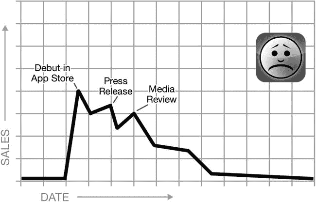
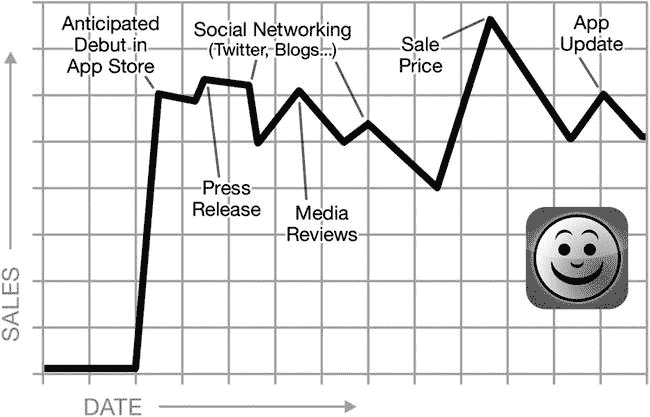
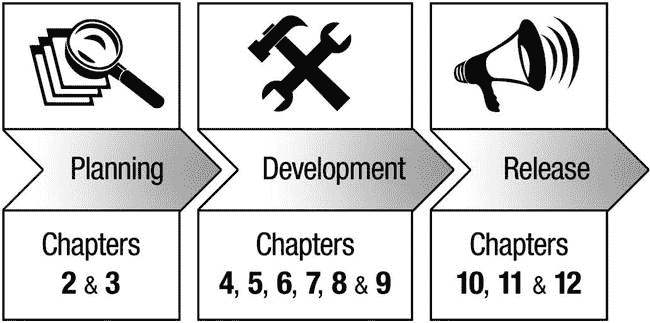
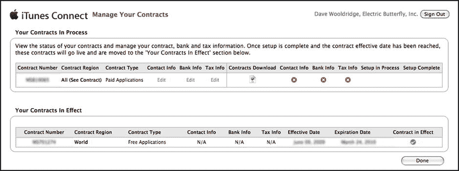

# 但别绝望，你的杀手级应用照样能赚大钱

但别绝望。即便没有得到苹果的推荐，你的杀手级应用也照样能赚大钱。就像生活中的其他事情一样，要在当前 App Store 的环境中取得成功，需要付出一些努力并做好规划，但谁说这个过程不能充满乐趣呢？你只需要知道一件关键的事情：你需要把应用当成一门生意来经营，而不是把它看作一台印钞机或某种快速致富的把戏。辛勤工作、优质的产品以及近乎天才的营销活动才是取胜的关键。本书正是为了教你这些而写就的。

### 应对移动营销的新世界

如果你有幸在一家资金雄厚的大型软件公司工作，那么公司很可能设有专门的部门来为你所开发的产品处理所有营销事务。但如果你是一个独立开发者，需要独自打理自己业务的方方面面，那么你对那些令人困扰的问题一定再熟悉不过了：如何才能实施有效的营销策略来提升应用销量？

而且，你并非孤军奋战。只需在网上浏览一下各种 iOS 相关的开发者论坛和邮件列表，你很快就会看到无数帖子（有些还夹杂着不少脏话）出自沮丧的程序员之手，他们都问着类似的问题：

-   如何推广我的应用？
-   我的应用刚在 App Store 审核通过。接下来该怎么办？
-   如何为我的应用获取评论？
-   天哪！我定价 99 美分的应用一周才卖出几份。我该怎么办？
-   有没有什么办法能避免用户给出一星差评？
-   怎样才能让我的应用获得推荐？
-   针对应用的最佳营销活动是什么？

虽然这一切看起来可能令人望而生畏，但请相信我——这其实并没有看上去那么难以招架。我的目标就是为这些问题以及更多疑惑提供答案。现在有许多创新的营销策略、工具和资源可供 iOS 开发者使用。正如你不会想在枪战中只带一把刀一样，成功的关键在于为手头的任务选择合适的武器。本书的主要目标就是为你提供所需的弹药，并谦逊地充当你在 iPhone、iPod touch 和 iPad 应用开发业务方面的权威参考指南。

### 放心——这可不是一本典型的商业书

如果一想到要再读一本关于泛化营销概念的枯燥书籍就让你翻白眼，那别担心！这可不是一本普通的商业书。你不需要拥有哈佛的 MBA 学位来理解这些内容。

和所有 Apress 的书籍一样，这本书也是由开发者写给开发者看的，它会一步步带你了解那些已被专业 iOS 应用创作者证明行之有效的营销解决方案。我不仅会告诉你需要做什么，还会手把手地教你如何去做。

这本书不涉及昂贵的广告活动，而且说到应用，那些高投入的广告活动鲜有如其宣传的那般奏效。本书关注的是那些能帮你卖出更多应用的、具有成本效益的营销替代方案！事实上，书中描述的大多数商业策略几乎不需要花费什么成本——这对我们所有预算拮据的独立开发者来说太完美了。"生活中最好的东西往往是免费的"这句话是我秉持的营销心态。你所需要的只是一些专注的时间、耐心、一点点创造力，当然，还有这本书。如同任何成功的营销活动一样，我们会教你如何有效地找到自己的利基市场。

### 规划你自己的成功故事

我知道你在想什么。这一切听起来都很耗时，而空闲时间恰恰是你没有的。作为一个全职开发者，我对此深有体会。无论是感受到自己设定的工作截止期限的压力，还是为了客户的项目赶工，时间常常感觉像是敌人。但我只想把节省下来的任何空闲时间都用来编程，开发下一个杀手级应用。我不希望被营销问题打扰，至少在我的应用完成之前不想。不幸的是，到那时就为时已晚了。

没有一个扎实的行动计划，你会发现应用发布时仅仅进行一次孤立的宣传推广，可能不足以带来可观的销量。曾几何时，发布新闻稿、获得几家杂志的评论、在流行的在线软件目录上列出产品更新，这些方法对于推广传统桌面应用来说效果不错。但很多那些旧的共享软件技巧在这里并不适用。在 App Store 这个独特的世界里，你很可能会在发布当天看到一个短暂的销售高峰，然后在接下来的一周里迅速暴跌（参见图 1-1）。然后你就会花费大量原本没有计划的时间，在绝望中拼命想办法提高销量。

图 1-1。如果没有一个长期的营销计划，你就有可能极大地缩短 iOS 应用的生命周期和盈利能力

如果没人知道你的应用，那么你将来添加再多的酷炫新功能也无济于事。你开发的应用是消费者想要的，能满足市场中的现有需求吗？你做了什么来在发布前为你的应用创造兴趣吗？你的应用在 App Store 中的长期生存能力又如何？你是否考虑过如何在初始发布之后维持并增长销量？你难道不希望你的销量曲线看起来更像图 1-2 那样吗？

图 1-2。你难道不希望你的销售图表看起来更像这样吗？

现实情况是，如果方法得当，从长远来看，你的营销努力实际上应该能帮你节省时间。这不仅仅是时间管理的问题。当然，每周抽出几个小时专注于推广你的应用很重要，但这只是解决方案的一部分。

在继续往下读之前，你需要确保自己意识到现在已经不是 2009 年了。如果你想让一个应用获得成功，你需要把它当作一门生意，并准备好投入所需要的时间和精力。

像营销人员一样思考。要有大局观。

这不仅仅关乎你的应用在 App Store 上架后该做什么。你知道吗，作为一个开发者，你可以直接将几个元素集成到你的应用中，它们能促进销售、创造额外的收入流、帮助用户通过内置的社交营销来传播口碑，并改善客户支持和评价？应用本身就是你最强大的推广工具之一，但要利用好这些宝贵的策略（以及其他更多策略），你应该在写第一行代码之前就开始规划你的营销策略。

事实上，这一点非常重要，我觉得有必要再说一遍：在写一行代码之前就开始规划你的营销策略。通过将营销和商业智慧融入开发过程的每一个环节，你才能给予你的应用在 App Store 中取得成功的最佳机会。在开始开发之前，先问问自己这些重要的问题：

-   我的应用是每个人都会用，还是只针对某个特定领域的人？
-   外面有大量类似的应用，还是说这是同类中的首创？
-   我的竞争对手是谁？
-   我的应用是一个产品还是一项服务？

社交网络是您在应用世界中的最佳伙伴；请务必为您的应用或应用公司创建专属页面。专注于积累粉丝并在发布前进行预热，这至关重要。如果操作得当，能在极短时间内带来数千次下载。务必与您的客户互动，确保他们在社交社区中感受到您的存在。没有人喜欢被冷落，所以请确保您的用户始终感觉与您和您的应用保持联系。

需要明确的是，我并非建议您将应用的界面变成流动广告牌——那是更适合放在`App Store`描述、网站和宣传材料中的任务（本书也会广泛涵盖这些内容）。我在这里讨论的是可以集成到应用功能与用户界面（`UI`）设计中的基本组件，这些组件能以非常微妙的方式推广您的应用，而您的用户只会将其视为便利且提升品质的功能。

`iOS SDK`提供了数千个省时的框架，其中许多实际上能让您的营销工作更轻松。例如，本书将探讨`In-App Purchase`（应用内购买）和`In-App Email`（应用内邮件）功能。

是的，您没看错。本书有好几个章节将聚焦于您最热爱的事情：设计和编程您的应用！现在吸引您的注意了吗？您还觉得营销不会有趣吗？

### 如何使用本书

章节的编排采用非常系统化的线性方法，逐步引导您完成`iOS`应用从规划、开发到发布的整个过程。在此过程中，每个阶段都会提出重要的商业解决方案，帮助您打造出一款畅销的应用！虽然您可能很想跳跃阅读，只读感兴趣的章节，但我建议按顺序阅读，以便从这种战略性、有条理的工作流程中受益（参见图 1-3）。

图 1-3. 为获得最佳效果，请遵循本书的线性工作流程

*   *第 2 章，《做好功课：分析 iOS 应用创意并进行竞争研究》*：您认为自己有一个很棒的移动应用创意？学习如何识别尚未开发的市场，并精炼您的应用概念，使其独一无二且极具市场价值，从而在竞争中脱颖而出。您将发现通过分析竞争对手做对了什么又做错了什么来进行老式侦探工作的巨大价值。我们还将探讨将目标定位在`iPhone`之外的多个`iOS`设备的优势，以及通用应用所面临的商业挑战。
*   *第 3 章，《保护您的知识产权》*：这可能就是本书最重要的章节之一！虽然我们可能都不喜欢处理法律事务，但保护自己并保护您原创概念与代码的知识产权，对您业务的长期健康与成功至关重要。由律师转行成为应用开发专家的`Michael Schneider`将为您讲解保护您的软件业务所需了解的一切。
*   *第 4 章，《您的 iOS 应用是最强大的营销工具》*：您的应用图标和截图通常是用户在`App Store`评估应用时首先看到的视觉元素。糟糕的第一印象可能会让您损失销量并招来负面评论，因此优化应用设计是成功的关键组成部分。第 4 章包含了关于原型设计、创建引人注目的应用图标、打造直观用户界面以及为多个`iOS`设备进行设计的有用技巧。
*   *第 5 章，《社交植入：在应用内部推广您的应用》*：在第 4 章将应用转变为自身营销动力源的基础上，本章将更进一步，集成便捷的分享和社交媒体元素，例如`In-App Email`、`Twitter`和`Facebook`。优雅地在您的应用内引导用户进行`App Store`评价，通过应用内交叉推广和第三方社交游戏平台建立协同效应，并学习如何有效实施这些不同要素。
*   *第 6 章，《免费也赚钱：何时免费才划算》*：与传统的桌面软件世界不同，`App Store`目前不允许有时间限制或功能受限的试用版。为了绕过这一限制，许多开发者提供了由`In-App Purchase`（应用内购买）支持的“免费增值”模式或免费“精简”版应用，希望用户能购买应用内内容或单独的付费版以获取高级功能。了解免费版在推广付费版方面的好处，以及联盟计划带来的额外收入机会。
*   *第 7 章，《通过 iAd 和其他应用内广告机会实现免费应用盈利》*：即使没有付费内容，免费应用本身也能赚钱。学习如何通过应用内广告、赞助和产品植入交易来挖掘替代收入流。本章将深入探讨应用内广告的世界，向您介绍适用于`iOS`应用的移动广告网络，以及通过应用内分析跟踪使用情况的价值。第 7 章还包含在您的应用中逐步实施苹果`iAd`框架的指南。
*   *第 8 章，《通过应用内购买探索免费增值模式》*：借助`In-App Purchase`（应用内购买），开发者可以在其应用中构建新的商业模式，例如提供订阅、销售附加内容和服务，以及解锁高级功能。有兴趣在为您持续的开发工作提供财务支持的同时，为用户提供额外价值吗？本章提供了关于何时以及如何在您的`iOS`应用中使用`In-App Purchase`及其相关`Store Kit`框架的详尽指导。

* **第 9 章：测试与可用性：展现最佳状态**：你知道吗，App Store 中许多一星差评都是因为用户对难用的应用界面或充满漏洞的功能感到沮丧？低分的用户评价会严重影响应用的口碑和销量，因此尽可能避免这种情况应是你的首要任务。第 9 章将全面介绍提供内置帮助、配置设备内测以及进行深入 Beta 测试的价值。
* **第 10 章：启动派对！创造预发布热度**：你的应用开发完毕，但在提交至 App Store 之前，是时候为其制造一些预发布热度了。第 10 章将向你展示最佳方法：通过在你的网站、博客、Twitter 及其他社交网络上进行推广，并尽可能让每一个人都来评论或讨论你的应用，从而为你的应用掀起兴奋与期待的热潮。
* **第 11 章：通往成功的钥匙：App Store 提交流程**：你在 App Store 中的产品页面是全球用户接触你应用的入口，因此其呈现方式对于正确传达应用价值至关重要。本章将引导你完成 iTunes Connect 中的应用提交流程，帮助你优化应用的文本描述、关键词、评级、截图及其他必需元素，并探讨如何设定价格以最大化销售潜力。
* **第 12 章：提升认知度：为你的 iOS 应用打造知名度**：一旦你的应用成功上架 App Store，就该启动宣传引擎了，以提高消费者对你应用可获取性的认知。即使你的预发布营销努力带来了初期的销售激增，后续仍有至关重要的工作要做。你的职责是确保你的 iOS 应用不会淹没在涌入 App Store 的成千上万款新应用中。第 12 章将揭示如何撰写高效的新闻稿、利用促销代码、通过采访增加曝光，并通过促销活动、赠品以及精心策划的限时促销活动来保持 App Store 中的发展势头。

本书假定你已熟悉 Objective-C、Cocoa Touch 和 iOS 应用程序编程。如果你希望在 Apple 开发者网站提供的文档和教程之外寻找更深入的指导，我强烈推荐以下几本 Apress 出版的书籍：

* 《在 Mac 上学习 Objective-C》，作者：Scott Knaster、Waqar Malik 和 Mark Dalrymple（`http://www.apress.com/9781430241881`）
* 《iOS 7 开发入门：探索 iOS SDK》，作者：Jack Nutting、Fredrik Olsson、Dave Mark 和 Jeff LaMarche（`http://www.apress.com/9781430260226`）

### 开始上手你的第一个 iOS 应用

我们需要涵盖的内容非常多，所以在深入之前，请确保你已经下载并安装了最新的 Xcode 工具和 iOS SDK（7.0 或更高版本）。如果没有，请前往 Apple 开发者网站 `http://developer.apple.com/`。

如果你还不是注册的 Apple 开发者，请先注册（免费），这样你就可以访问 iOS 开发中心（`http://developer.apple.com/devcenter/ios/`）提供的最新 SDK、工具、文档、教程和示例代码。

在你访问该网站时，花点时间申请所需的 iOS 开发者计划。不要等到你的应用准备提交到 App Store 时才去做这件事，因为收到 iOS 开发者计划的接受通知可能需要数周时间，这会不必要地延误你的进度。被接受后，支付相应的费用以完成注册。当你的付款处理完毕后，在登录 iOS 开发中心时，你会看到浏览器屏幕右侧有一个“iOS Developer Program”栏。点击列在那里的 `iTunes Connect` 按钮。

在 iTunes Connect 的主页上，请务必访问 `Contracts, Tax, & Banking Information`（合同、税务和银行信息）部分，以查看你当前生效的合同。默认情况下，你应该已经激活了“免费应用程序”合同，该合同允许你向 App Store 提交免费应用。但如果你想向 App Store 提交付费应用，则需要申请一份“付费应用程序”合同。Apple 需要你的银行和税务信息，以便在你有应用销售收入时向你付款。由于 Apple 通过安全的电子存款转账，你需要提供你银行的 ABA 路由号码、名称和地址以及你的账号，因此请确保你的银行支持与第三方供应商的电子交易。如果你计划在多个地区的 App Store 销售应用，为了接收国际付款，Apple 可能还需要你银行的 SWIFT 代码。虽然大多数大型全国性银行都支持 SWIFT 系统，但一些较小的独立银行和信用合作社可能不支持，因此请确保你的银行能够提供 SWIFT 代码。

在你完成所需步骤（参见图 1-4）之前，Apple 将托管其欠你的任何款项。由于这个过程也可能相当漫长，我强烈建议在将应用提交到 App Store 之前很久就完成“付费应用程序”合同的签订。

图 1-4. 为了获得 App Store 销售的收入，请确保你在 iTunes Connect 在线门户中完成 Apple 要求的“付费应用程序”合同

### 你的应用已经在 App Store 里了？提升销量永远不会太晚

即使你是一位资深的 iOS 开发者，目前在 App Store 中已经有一款或多款应用，你仍然可以采取许多措施来增加这些应用的曝光度和销量。你已经投入了宝贵的开发时间和金钱才走到这一步，现在放弃实在太可惜了！

但是，切勿犯下直接跳到本书发布后相关章节的错误。前面章节中介绍的许多解决方案都能产生显著效果，尤其是在为现有应用规划新版本和更新时。

