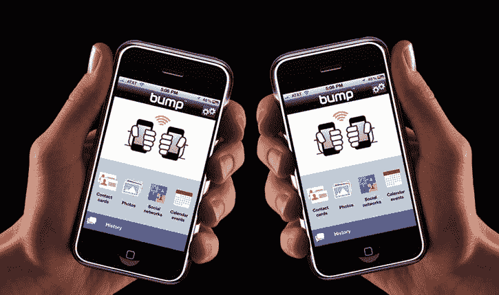
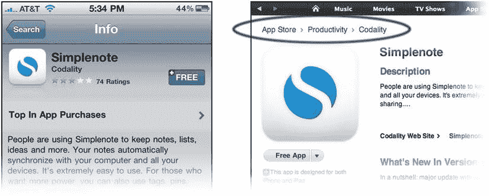
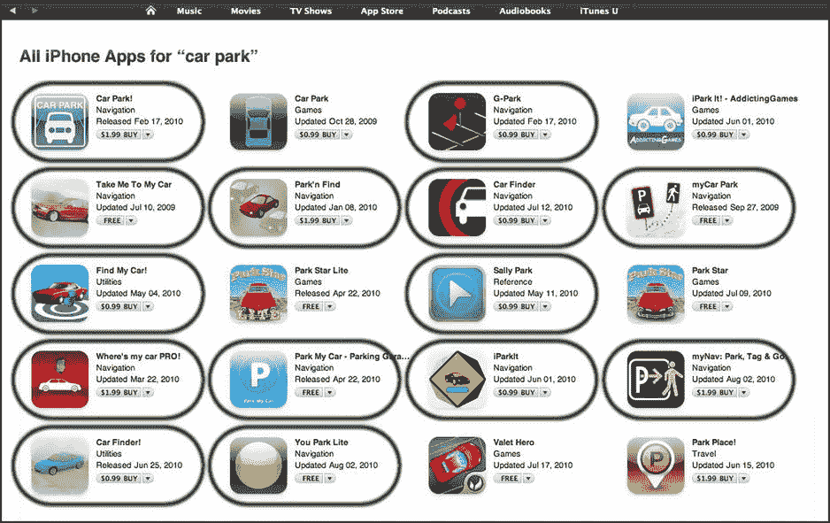
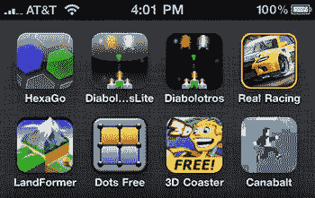

# 第 2 章

## 做好功课：分析 iOS 应用创意并开展竞争性研究

那么，你觉得自己有一个 iPhone 或 iPad 应用的好主意？请确保它是一个*绝佳*的主意。再多的营销也无法帮助销售一个糟糕的应用。当然，你可能拥有出色的编码能力，能够开发出性能优化、高质量的应用，但如果它基于一个构思欠佳的概念，在当今拥挤的 App Store 中它将毫无胜算。

在本章中，你将学习如何运用一些传统的侦探工作来检验应用概念的可行性和市场潜力。分析竞争对手做对了什么——*更重要的是，做错了什么*——将为你提供所需的洞察力，从而真正完善和改进你的想法，使其成为一款与众不同的独特应用。

即使做一点竞争性研究对你来说似乎很简单，也请继续读下去。你可能会惊喜地学到一些新技巧。我们还将探讨将目标瞄准 iPhone 以外的多个 iOS 设备的优势，以及通用应用面临的业务挑战。

### 满足需求

人们购买软件是为了解决问题或满足需求。待办事项列表让我们保持条理清晰。天气和新闻应用让我们了解信息。游戏满足了我们对娱乐的渴望。即使是那些新奇的小玩意儿应用，也能通过让人们分享欢笑而建立联系，满足我们对被接纳的基本需求。虽然这些普遍的例子很容易识别和理解，但更具体需求呢？

如果你正在考虑构建除游戏之外的东西，比如生产力或实用工具类应用，以下是需要考虑的几个因素：

*   它是否聚焦于现有应用尚未解决的需求或问题？
*   你的应用是否以显著简化移动体验的方式满足了该需求，使其比在台式电脑上执行相同任务更便捷？
*   如果你的应用与现有其他应用类似，你可以添加哪些功能来解决竞争对手当前未满足的需求？

### 发现未被开发的市场

成千上万的 iPhone 应用用户寥寥无几。早在 2009 年，苹果公司改变其第三方应用分析政策的之前（更多内容见第 7 章），流行的移动广告网络 `AdMob` 报告称，在积极展示嵌入式 `AdMob` 广告的 iPhone 应用中，高达 54% 的应用各自拥有不到 1000 名用户。诚然，与 App Store 庞大的规模（无论当时还是现在）相比，2009 年那份 `AdMob` 报告中的几千个应用只是一个很小的样本，但这仍然是一个令人震惊的警钟，尤其是当你考虑到 `AdMob` 网络中的大多数应用都是免费的时候。

即使应用是免费的，也不能保证人们会使用它。如果你期望人们为你的应用付费，那么你提供一项人们迫切需要的服务、功能或体验就更加重要了——用户会感到有动力去下载它。

虽然移动应用的价格相比传统桌面软件要便宜得多，但它们已不再是 App Store 早期那样的冲动消费品了。在过去的一年里，用户们的 iPhone、iPad 和 iPod touch 中塞满了大量应用，以至于他们在选择下载哪些应用时变得越来越挑剔。

想想你自己在购买新应用时的决策过程。你可能不会为一 张 12 美元的电影票而犹豫不决，但出于某种奇怪的原因，你更可能会深思熟虑是否要花区区 2.99 美元买一个 iPhone 游戏。我也犯过同样的错误，尽管作为程序员，我完全清楚开发一个 iOS 应用需要付出多少辛勤工作。

问题部分在于，为了提升销量并在 App Store 排行榜上获得更高排名，大量应用标价仅为 0.99 美元，这导致用户对应用价值的认知产生了扭曲。不幸的是，这种状况使用户习惯了以极低的价格期待极高的价值。为了突破这种购买障碍，你的应用*必须*与众不同，提供独特的体验和/或满足现有的需求。

App Store 中有超过 100 万个应用， 乍一看，似乎所有原创想法都已被占用，而且这在很大程度上是事实。当苹果公司说“总有一个应用能解决你的问题”时，这家公司没有开玩笑，或者看起来如此。但是，时不时地，就会有先驱者带着一款新应用出现，让全世界的开发者们拍着自己的额头大喊：“我怎么没想到呢？”

#### 寻找原创应用创意

有时最酷的创意思路往往是最简单的概念，就藏在我们眼皮底下。身为开发者，我们常常被同行们的成功故事深深吸引（并心生羡慕），因此脑海中最先闪现的冲动往往也是最致命的：如何借助流行趋势的东风来投机取巧。当 `iFart Mobile` 在 2008 年意外爆红时，大量山寨放屁应用如潮水般涌入 App Store，试图从这股新潮中分一杯羹。跟风的前几款山寨应用或许还能赚到足以回本的销售额，但到了某个节点，App Store 便已过度饱和。如今市面上有超过 500 款与放屁相关的应用，消费者找到并购买你新应用的几率微乎其微。面对如此庞大的选择范围，逐一浏览实在太困难，因此消费者更可能选择那些当前排名靠前的最热门应用。自 iOS 6 引入重新设计的应用商店以来，想获得关注变得难上加难。用户现在必须滑动浏览应用方块，而不是简单查看格式美观的列表；如今你的应用比以往任何时候都更需要脱颖而出。

难道你不想成为那个开发出被数百名开发者争相模仿的*那款*应用的远见者吗？当然，我们都想。那么，如何去寻找全新且未被挖掘的创意呢？

#### 审视自身需求与兴趣

首先，审视一下自己的需求和兴趣。没错，你是一名开发者，但首先你也是一名用户。你是否希望 iPhone 能增加某些缺失的功能？如果有，现有应用是否已提供该功能？没有？嗯，如果这是你想要的功能，那么很可能其他人也渴望同样的东西，甚至愿意为此付费——答案不就来了吗！

需要注意的是，某些愿望清单上的功能可能成为优秀的功能，但未必能成为出色的应用。例如，被强烈需求的复制粘贴功能最终在 iOS 3 中加入，但它本身并不适合作为独立的应用存在。

#### 探索你的业余爱好与兴趣

在科技之外，你有哪些兴趣？关于观鸟者、漫画收藏家、体育迷等题材的成功应用比比皆是。如果你对某个特定爱好充满热情，且尚未找到相关应用，那或许是一个值得填补的绝佳空白。只需记住，爱好越是小众（比如水下编篮——有人吗？），你的潜在客户群就越小。如果你为那个规模虽小却很忠实的北极裸泳爱好者群体开发一款日志应用，你或许能让一群冻得嘴唇发紫的个体感到开心，但可能赚不到多少钱。而将这一想法扩展至涵盖所有水上运动（包括为冲浪者、划船者、游泳者和潜水员提供自定义日志模板），你的日志应用就能大幅扩大潜在客户群，使其成为一个更可行的应用概念。

关于针对特定小众群体的应用，有一点需要注意：事实证明，用户更有可能为契合他们特定爱好的东西付费。如果你的应用满足了爱好者的需求或渴望，他们花上几美元连想都不会多想。去看看 App Store 中的“参考”类别，你就能明白我在说什么。

#### 向亲朋好友取经

如果你觉得特别缺乏原创想法，不妨向亲朋好友求助。看看他们有哪些具体需求和兴趣适合用移动应用来满足。但无论你做什么，请千万不要在博客、Facebook 页面或通过 `Twitter` 征求意见。虽然你的粉丝可能会提供一些好建议，但接受他们的反馈会让你面临法律风险。如果你的应用成功了，你可能会被陌生人起诉，指控你窃取了他的想法而未给予充分认可或补偿，而证据则可能是他发给你的存档推文或博客评论。最好只向信得过的亲朋好友征求意见。

#### 逛逛本地报刊亭

另一个获取原创想法的好来源是本地报刊亭。虽然这听起来可能有点“老派”，但不要低估翻阅最新杂志的便利性。互联网是一个巨大的数据宝库，但你需要知道自己在搜索什么才能找到相关的内容。在报刊亭，你可以快速浏览几十种流行杂志类型。纸质印刷成本高昂，所以如果有一本月刊专门关注某个主题，那很可能意味着有足够多的人对此感兴趣，值得进一步探索。真正的问题在于，要弄清楚这些读者中有多大比例是精通科技的，并且要么计划拥有要么已经拥有 iOS 设备。如果该杂志有网站，那是个不错的起点。查看它是否有活跃的在线论坛、RSS 订阅、播客或 `Twitter` 账号。只需花几分钟阅读那里的帖子，就能对该杂志的读者群有个不错的了解。

同时，看看杂志的广告商是否在推广计算机或移动相关的解决方案。例如，写作类杂志会刊登多款软件工具的广告，这些工具帮助作者处理写作业务和故事创作流程中的各种环节。App Store 中已有几款移动写作工具来帮助作者整理笔记和故事创意，但有没有应用能让自由撰稿人追踪向潜在出版商提交稿件后的处理状态呢？

#### 将调查转向线上

既然你大致了解了搜索方向，是时候将调查转移到互联网上了。早在 2009 年我编写本书第一版时，已有几款桌面软件程序和基于订阅的网站提供那种稿件追踪服务，但却没有任何 iPhone 应用来处理这一特定任务。当时看来，这个移动应用概念的市场似乎完全开放。

命运弄人，几个月后，Andrew Nicolle 发布了他的 iPhone 和 iPad 应用 `Story Tracker` 来满足这一需求。这里的关键点是，如果你确实偶然发现了一个未开发的市场，最好尽快开始开发你的应用。如果你发现了一个新领域，我保证*至少*有十几个其他开发者也在考虑类似的应用概念。时间至关重要。记住这句经典（且非常贴切）的话：“世上没有原创的想法，谁先做谁就赢。”

#### 关于营销的最后一点说明

当满足现有需求时，你是在向已知的目标受众销售。但如果你引入一个与 App Store 中任何东西都截然不同的全新产品概念，请注意，你的营销工作将需要教育消费者，为什么他们应该购买一款他们还不知道自己需要或想要的应用。你的任务就是让他们想要，甚至更好的是，让他们需要这款应用。

### 推广你的应用

你无法向人们推销他们尚未意识到的解决方案。这就是为什么你的营销重点必须揭示当前可用选项（或缺乏选项）的不足之处。展示你的应用如何填补这一空白，能为他们节省时间、改善工作流程、带来快乐，或提升他们的日常生活质量（所有软件都应致力于实现这一目标）。对于一个全新的应用类别，你需要通过展示问题来推销解决方案。

#### 提升移动端体验

在为 `iPhone`、`iPod touch` 或 `iPad` 等移动设备构建应用时，请记住，无论你的应用提供什么功能，都应尽可能以最精简、最便捷的方式实现。用户可能正在单手（或单指）操作你的应用，同时还在移动中。善用苹果提供的独特移动框架。思考如何通过直接访问内置技术（如加速计、定位服务、`Wi-Fi`、蜂窝网络，以及电话、邮件和日历支持）来简化应用的功能和易用性。

一个基本示例是搜索本地商家的应用。不要强迫用户总是输入邮政编码或地址（这在移动环境中通常非常不便），而是启用一个选项，让用户利用苹果的定位框架轻松发现他们当前的位置。只需确保应用首先请求他们的许可。出于隐私原因，一些用户可能不愿意透露他们的当前位置。

一个大规模提升移动体验的产品示例是 Bump——一款免费的 `iPhone` 应用，它让交换联系人信息（以及照片、日历事件和其他数据）变得像与其他 Bump 用户碰一下手一样简单（见图 2-1）。在智能手机上交换联系人信息并非新概念。多年来，众多移动应用试图简化手持设备上的这一过程，但它们通常涉及过多的按钮点击和复杂的“发送” vCard 格式数据的方法。有些甚至仅限于通过电子邮件发送 vCard，这又增加了更多步骤。Bump 的开发者利用内置的 `iOS` 技术，将这一需求简化为一个单一动作，即可即时且安全地交换联系人信息。

图 2-1. Bump 通过大幅简化两人之间的联系人信息交换，提升了移动体验

“我们在设计 Bump 时的首要目标是创造一种简单、有趣且直观的方式来连接两部手机，”Bump Technologies, Inc. 的联合创始人兼总裁 David Lieb 说道。“加速计和定位服务让我们能够做到这一点。Bump 会监控加速计的输出，并在感觉到物理碰撞时，将加速计的输出发送到全球的 Bump 服务器。然后，服务器会匹配在同一时间、同一地点感受到相同碰撞的任何一对手机。这使得只需简单地碰一下手，就能在两部手机之间建立连接。”

Lieb 补充道：“Bump 的想法源于一次挫败感（实际上，是两次）。早在 2005 年，我还是一名工程师，当时让我非常烦恼的是，为了将一些简单的数据（比如姓名和电话号码）从一部手机传到距离不足 12 英寸的另一部手机上，我不得不请对方读出他们的信息，然后手动输入。我希望只需将两部手机碰在一起就能传输信息——但 2005 年的手机还不具备实现这一功能的条件。快进到 2008 年，我去了商学院，发现自己又在输入几十位新同学的手机号码。同样的挫败感，但这次，我注意到每个人都带着智能手机，其中许多都配有加速计和定位功能。于是我们决定开发 Bump。”

尽管这个应用的创意源于开发者自身的需求，但它似乎满足了很多人共同的愿望。2010 年，Bump 在 App Store 的下载量突破了 1000 万次。

同样的移动任务简化逻辑，也适用于那些希望将自己 Mac 或 Windows 软件应用移植到配套 `iOS` 版本的开发者。不要仅仅在 `iPhone` 或 `iPad` 界面中重新包装相同的功能。通过将你的应用设计得更适合通常单手操作、快节奏的移动用户世界，你不仅能增强现有客户的忠诚度，而且你的 `iOS` 应用还可能为桌面版吸引新用户。

甚至有一些人闻名从其他移动设备（如 BlackBerry 或 Windows Mobile）转而使用 iPhone，仅仅是为了使用某个在其他移动平台上不可用的特定应用；如今这种情况已大为减少，但仍然存在。

#### 与同类应用竞争

这个世界真的还需要更多的待办事项列表、购物清单、小费计算器、音乐点唱机问答或放屁应用吗？如果你认为需要，那一定是因为你发现了一些其他应用尚未涉足的新功能——一个人们想要且需要的功能。如果不是这样，试图与成百上千个现有的小费计算器、待办事项列表等竞争可能是徒劳的，尤其是当一些真正出色的应用已经占据了特定利基市场，或在排行榜上名列前茅时。

在 App Store 中搜索 *tip*，你会发现目前 App Store 中有超过 2,200 个小费计算器应用。诚然，这对移动应用来说是个好主意，但当与这么多现有的小费计算器竞争时，你如何为你的新应用找到受众？尤其是其中一些做得非常好，并且得到了媒体的大量报道。其中最受欢迎的一个应用 Tipulator 甚至出现在苹果 iPhone 的广告中。关键在于，一个小费计算器能做的事情实际上非常有限，仅仅将你的版本扔进 App Store 可能并不是最好的主意。

诚然，快速炮制一个小费计算器应用可能比开发一个复杂的 3D 游戏容易得多，但面对这个领域的激烈竞争，如果你无法销售这个应用，那么开发这样一个简单的应用是否值得？如果一项投入最终被证明是糟糕的投资，那么无论多小，都很难证明投入时间是合理的。如果你无法提供新颖的方法或能激励用户从成百上千个其他类似应用中选择你的应用的新功能，那么你可能需要考虑另一个应用创意。

啊，但如果你确实知道如何制造一个更好的捕鼠器，那么这些知识，加上一些创造性的营销，可能足以在市场上站稳脚跟。看看有多少 Twitter 客户端应用吧，然而新的应用层出不穷，它们拥有更大、更好的功能或更直观的移动界面，导致用户不断切换。这是因为用户更有可能发现他们认为有趣或好玩的新的应用。

如果你认为自己的概念很有胜算，并且决定要涉足一个已经被类似应用饱和的特定细分市场，请知道你将面临艰巨的挑战。当用户有如此多的选择争夺他们的注意力时，要扩大你的客户群将是一场艰苦的战斗。我们稍后会在本章中更深入地探讨如何分析和智胜竞争对手。

如果发布应用后，你发现在如此拥挤的领域竞争太过困难，并选择放弃该应用，转而在一个不那么拥挤的类别中开发不同的产品，那么你可能面临损害自身声誉以及未来任何新应用前景的风险。如果用户无法信任你会持续通过更新和新功能来支持这些应用，他们为什么还要购买你的其他应用呢？

App Store 里充斥着数十款因销量不佳而被开发者放弃的应用。它们的商品页面满是愤怒的用户评论。虽然为损失 99 美分而小题大做听起来很幼稚，但这些抱怨实际上并非关乎金钱，而是关乎原则。你必须对自己的应用充满热情，并承诺长期持续维护它，以维护与客户的关系。

#### 何时避免过度饱和的类别

当需要将你的应用提交到 App Store 时，你会被要求选择一个合适的类别进行放置。有时最显而易见的选择并非总是最佳选择。

在 App Store 中研究类似应用时，要仔细查看它们位于哪些类别，以及它们在那些类别中的表现如何。仅仅是这一点侦查工作就能帮助你选择最佳类别，从而让你的应用在 App Store 中获得最大的曝光机会。

这方面的一个好例子是 DistinctDev 最畅销的趣味应用 `The Moron Test`。尽管该应用包含多个游戏关卡，但开发者有意避开了庞大的`Games`（游戏）类别，转而选择将其放在较小的`Entertainment`（娱乐）类别中。结果证明这是一个明智之举。`The Moron Test`迅速成为`Entertainment`类别中收入最高的应用。这种曝光推动了更多的销售，进而将其排名提升至美国 App Store 前 25 名的顶端。如果`The Moron Test`当初被放在`Games`类别中，它还能卖得这么好吗？也许不会。尽管`Games`主类别被划分为 19 个子类别（例如 Action（动作）、Arcade（街机）和 Board Games（桌游）），但要与那些占据整体游戏排行榜主导地位的沉浸式、高动作、有发行商支持的 3D 游戏竞争，仍然会非常困难。

但要小心。根据你的应用类型，这种策略有时可能会适得其反。显然，在你的应用名称中包含正确的关键词至关重要，这样你的应用才能出现在相关的 App Store 搜索结果中，但人们也喜欢浏览他们最喜欢的类别来寻找新应用。记住这一点，不要仅仅因为一个类别更小就选择它。要选择大多数人在寻找你这类应用时会想到的类别。因此，尽管 DistinctDev 避开了`Games`类别，但较小的`Entertainment`类别对于`The Moron Test`来说仍然是一个非常合适且直观的位置；如果他们决定把它放在`Weather`（天气）类别里，那可就完全说不通了。此外，众所周知，苹果会将不属于相关类别的应用从 App Store 中移除，所以请预先注意。

对于适合多个不同类别的应用，决定可能不那么显而易见。当这种情况发生时，最好去调查类似应用所选择的类别，尤其是那些销售情况良好的应用。例如，市面上有数十款笔记应用，但这类应用最适合放在`Utilities`（工具）、`Productivity`（效率）还是`Business`（商务）类别中？不妨在 App Store 中快速搜索一下`notes`，看看大多数此类应用都位于哪里。

强烈建议你使用桌面版 iTunes 进行所有竞争研究，因为它显示的信息比 iOS 设备上的移动版 App Store 要多得多。例如，如果你从搜索结果中选择一个应用，移动版 App Store 的列表不会显示该应用的类别，但桌面版 iTunes 会显示（参见图 2-2）。

**图 2-2**。如果从搜索结果中访问，应用的类别不会显示在 iPhone 的移动版 App Store 中（左），但会显示在桌面版 iTunes 的 App Store 中（右）

当我购买写作软件时，我的目标是找到能帮助我提高写作效率的工具，因此本能地，`Productivity`（效率）类别是我首先会查看的地方。显然，有这种想法的不止我一个。尽管有些笔记应用位于`Utilities`（工具）和`Business`（商务）类别，但大多数都位于`Productivity`（效率）类别。

有时，特定的类别会限制你的潜在受众。以本章前面提到的联系人交换应用 Bump 为例，开发人员希望该应用不仅限于商务用户。尽管类似应用牢牢扎根于`Business`（商务）类别，但 Bump 的简洁性使其成为任何人都可以轻松使用的数据共享解决方案，因此他们决定将其放在`Social Networking`（社交网络）类别中，尽管`Business`（商务）、`Entertainment`（娱乐）和`Productivity`（效率）也都是不错的选择。

“从核心来看，Bump 远不止是联系人信息交换；它是一种让两台设备直观交互的技术。我们不想把 Bump 局限于商务应用，也不想把它定位为仅限 iPhone 的实用工具，”Lieb 说道。“通过选择`Social Networking`（社交网络）类别，我们将 Bump 定位为一种与周围人建立联系的工具。此外，我们知道如果我们的应用成功了，身处`Social Networking`（社交网络）类别将使我们与 Facebook、MySpace、LinkedIn、AIM、Yahoo 和 Loopt 等世界级品牌为邻。”

所以，当你心存疑虑时，不妨查看一下竞争对手的类别选择，以及他们可能从这些位置获得的潜在优势。

#### 评估竞争

如果你的应用创意面临一些现有竞争，不要仅仅依赖于调查你所知道的竞争对手。你需要花些力气，在 App Store 中找到所有主要竞争对手。在进行了一些初步搜索后，你或许已经大致了解了有多少类似的应用存在，但现在你需要开始整理一份清单，以备日后参考。每当 App Store 中出现一个新的竞争对手时，你都应该将其添加到你的清单中。

密切关注竞争对手的动向，是作为开发者的主要工作之一。要扩大你的客户群并防止用户倒向竞争对手，唯一的方法就是确保你始终领先对手一步，而这需要时刻关注他们的更新。相信我，如果你的应用是一个有力的竞争者，你的竞争对手也正在密切关注着你的一举一动。

你需要使用不同的关键词和短语变体进行多次搜索，以找出所有存在的类似应用。值得花时间创建一个关键词列表，列出你作为用户可能会尝试用来寻找此类应用的词。同时，使用词典和同义词词典来发现更多相关的词汇。没人知道用户会搜索什么关键词，所以最好做到全面彻底。

##### 一款用于关注竞争对手的工具

我喜欢用来密切关注竞争对手的一款工具是 `Searchman SEO`。这个网站替你完成了大量基础工作，并追踪诸如 App Store 排名、关键词排名以及新的客户评论等事项。这是一款相当不错的软件，能让你在竞争中占据优势。另一款可选工具是 `appcod.es`；这个网站能让你追踪关键词的排名位置，并且，我们姑且称之为魔法，它实际上能猜测出你竞争对手的关键词。这可谓是占据了竞争的先机。

举例来说，假设你正在计划开发一款帮助人们找到自己停车位置的应用程序。因为忘记车停在哪里这种事（体育赛事后或漫长购物之后）似乎谁都会遇到，所以这确实是一个很适合做移动应用的概念——在 App Store 中，至少有 2000 款不同的应用是基于这个概念开发的。

为了找到所有这些寻找停车位置的应用，让我们在 App Store 中进行几次搜索。像 `car` 和 `park` 这样的关键词搜索结果包含了太多不相关的应用，所以我们把搜索范围缩小到一个短语。以下是针对不同关键词短语，在前 20 个搜索结果中列出的相关应用数量：`car park`（805 个）、`find car`（437 个）、`car locator`（343 个）、`car finder`（437 个）以及 `parked car`（41 个）。有趣的是，`car park` 提供了最佳结果（参见图 2-3），尽管你可能会预期 `car locator` 或 `car finder` 是更好的关键词组合。这正好说明了搜索词的主观性，所以请尝试所有可能性！

图 2-3。在 App Store 中搜索 `car park`，在前 20 个列出的项目中找到了 14 个相关应用

这个例子还表明了另一个重要观点。你是否注意到，少数特定应用几乎出现在所有相关搜索中？在这次搜索时，排名较高的应用出现得也更高、更频繁，这并非巧合。

但是，那些频繁被列出的应用能够超越竞争对手，并持续出现在大多数相关搜索中——而且至少是在前 20 个结果中——这证明了它们正在利用重要的关键词和战略性的应用名称来帮助实现这一目标。

当大多数消费者搜索某一类应用时，他们通常不会浏览前几屏结果之后的内容，而这通常意味着前三到五个图标。因此，研究主要竞争对手应用的描述和名称，以找出哪些关键词对你至关重要，这一点非常重要。虽然描述在 App Store 中已不再可搜索，但它们通常包含一些吸引眼球的文字短语，这些短语在你的关键词探索中可能很有价值。让你的应用出现在相关搜索结果的第一个屏幕中，将为你的应用提供急需的曝光度，最终也有助于提升销量，进一步提高应用的可发现性。

另一个挖掘竞争对手信息的技巧是阅读你已找到应用的客户评论。客户经常会在评论中比较应用，推荐一款胜过另一款。请务必将任何新提及的应用添加到你的竞争应用列表中，并仔细研究它们。评论者对于应用及其功能的比较是否正确？我非常喜欢使用的一个技巧是，查看用户说该应用缺少什么，或者该应用在哪些方面做得不好。如果你能提供当前用户所使用的应用所缺失的需求和愿望，那么让该用户转而使用你的应用就会变得非常容易。切记，切勿在你的竞争对手的应用中撰写那种低劣的“来看看我的应用吧”的用户评论；这会让你看起来非常、非常糟糕，而且苹果最终会删除你的评论。

#### 利用替代应用目录进行竞争研究

你大部分搜索都会在 iTunes 中的本地 App Store 里进行，但不要忘记那些可能仅在其他国家/地区可用的竞争应用。如果你计划最终在你本国之外的其他几个特定国家/地区的 App Store 发售你的应用，这一点尤其重要。

有几种基于网络的第三方应用目录值得探索。许多这类网站还会发布应用评论。你会在本书的附录中找到这些实用网站的列表。

#### 分析应用排名统计信息

在了解了针对你特定细分市场的竞争激烈程度后，找出竞争对手在 App Store 中的表现也同样重要。他们在 App Store 排行榜上排名高吗？是否有任何应用突破了其原始类别，在总下载量上排名靠前？那些应用在某些国家的表现是否优于其他国家？这些信息还能帮助你判断，某个特定的细分市场是否足够受欢迎或有利可图，从而值得你投入资金进行开发。

你的 iTunes Connect 账户限制你只能查看自己的应用统计数据，但值得庆幸的是，一些极好的替代方案可以协助你进行竞争研究探索：

*   `Mobclix`（`http://www.mobclix.com/appstore/`）：除了提供从嵌入式移动广告到复杂应用分析等一系列诱人的 iPhone 服务平台外，`Mobclix`还提供了美国应用商店的全面应用排名。想要调查竞争对手甚至自己应用的榜单趋势？您可以在这里找到大量有价值的信息。`Mobclix`网站应该是所有 iOS 开发者的必去之地。
*   `MajicRank`（`http://majicjungle.com/majicrank.html`）：Majic Jungle Software 的`David Frampton`创建了一个便捷的 Mac OS X 应用程序，让您能够轻松追踪多个地区应用商店的 iOS 应用排名统计。`David`在这个免费软件工具上投入了大量心血，因此如果您觉得它有用，可以考虑购买他的其他应用作为感谢。请注意，自 2012 年起，`Majic Jungle`已声明使用此应用可能导致您的 IP 地址被苹果应用商店和 iTunes 封禁。请自行承担使用风险。
*   `APPlyzer`（`http://www.applyzer.com/`）：`APPlyzer`是一个流行的基于网页的免费和付费应用排名统计来源。该站点为地区应用商店和全球总体统计提供了海量信息，因此，即使其免费的标准会员已提供很多功能，但升级到专业会员所需的小额费用也是非常值得的。
*   `Top App Charts`（`http://www.topappcharts.com/`）：`Top App Charts`通过绘制榜单上的重大变动者，为应用排名统计提供了独特的视角。与`APPlyzer`类似，这个免费网站使用视觉标记来标示重大首发、上升和下降，从而揭示应用在排名中的实际变动。
*   `PositionApp`（`http://positionapp.com/`）：想要一个用于检查应用商店排名的移动解决方案？由`ustwo`开发的`PositionApp`是一款强大的 iPhone 应用程序，使您能够追踪所有应用商店地区前 300 名应用的历史榜单变动。
*   `App Store Metrics`（`http://148apps.biz/app-store-metrics/`）：这是一个很棒的网站，充满了 iPhone 和 iPad 开发新闻和商业洞见。但除了其所有精彩内容之外，`148Apps.biz`可能以其全面的应用商店指标而闻名，这些指标包括活跃应用数量、提交量、批准量、应用价格以及应用在各个类别中的分布等统计信息。
*   `App Store Stats`（`http://www.yappler.com/Apple-iPhone-App-Store-Stats/`）：尽管`Yappler`主要是一个用于查找和分享应用的在线目录，但它也提供了一些值得一看的有趣的应用商店统计数据。
*   `AppTrends`（`http://appsfire.com/apptrends`）：`Appsfire`的`AppTrends`并非追踪顶级应用的应用商店排名，而是代表了一个哪些应用在 Twitter 和 Facebook 上最受欢迎的排名。这是一个有价值的网站，可以监控哪些类型的应用正在通过社交媒体口口相传被最多讨论。
*   `Searchman SEO`（`http://www.searchman.com`）：`Searchman SEO`是一个用于追踪应用商店排名、关键词排名、评论以及追踪竞争对手的绝佳工具。在寻找一体化解决方案时，`Searchman SEO`确实无出其右。

尽管还有其他几个应用分析服务、网站、软件工具，甚至一些酷炫的 iPhone 应用（例如`AppFigures`和`AppViz`）也会追踪应用商店排名，但它们更侧重于分析您自己应用的统计数据，并从您的 iTunes Connect 账户的销售日志中收集数据。因此，即使这些资源可能超出了竞争研究的范畴，也请放心——它们会在后续章节中详细介绍。

#### 从竞争对手的用户评论中寻找灵感

让我们继续以“停车位查找”应用为例进行竞争研究。现在您已经整理了一份所有类似应用的列表，是时候仔细研究它们各自的功能集和用户评论了。所有这些应用都使用 iPhone 内置的 GPS 定位功能，首先存储您停车的位置，然后再次定位您当前的位置，帮助您规划返回车辆的路线，并显示嵌入式地图框架，如`MapKit`。有些应用除了基本功能外，没有提供更多功能。另一些则提供了一些附加功能，例如保存您停车位置的文本备注、语音备忘录和/或照片，以记录实际的行、层、车位号等（非常适合多层停车场）。少数应用还包括记录您到达时间的功能，并且如果您把车停在计时器旁，它们可以追踪计时器剩余的时间，以便您在计时器到期前返回。

比较这些应用的有趣之处在于，它们都以截然不同的界面提供相似的功能。并且，根据发布的用户评论，您可以快速判断哪些界面被证明易于使用，哪些不够直观，从而导致用户沮丧。

现在，我不会在这里对任何特定应用发表批评。我也不会透露哪些应用收到了负面用户评论。本书的目标是帮助开发者利用他们的应用赚更多钱，因此我不想通过指出他们的弱点而无意中给他们制造更多困难。您可以轻松地自行查看哪些应用在应用商店中获得了低分评价。因此，为了这个示例的目的，我将向您展示用户评论的概况，以此衡量其中一些应用做得好和不好的地方，但不点名。让我们开始吧。

#### 从他人的错误中学习

对于那些记录停车计时器剩余时间的应用，一些客户发布了负面评论，疑惑为什么某个特定应用在没有设置计时器提醒的情况下，不会在他们计时器即将到期时发送通知提醒。例如，一位评论者给出了一星的低评价，理由是“需要一个可以在应用关闭时提醒你的计时器”。作为开发者，我们这类评论视为功能请求，但失望的消费者倾向于将它们视为缺失的功能。不幸的是，他们的“功能请求”以负面评分的形式发布，这损害了应用的整体形象，并可能影响销量。目标是从竞争对手的错误中学习，以期（尽可能）避免这类评论。当您查看竞争对手的用户评论时，要关注人们所说的是应用的哪些问题。一个不满意的用户是一个您可以通过您的应用满足其缺失需求来争取的用户。

这类应用中大部分（如果不是全部）也收到了大量关于 GPS 性能缓慢和 GPS 结果不准确的负面评论。通常情况下，这些问题并非由有缺陷的编程导致，而是由用户当前信号强度和较旧 iPhone 型号的 GPS 缺陷造成的。大多数人（尤其是非技术用户）不了解其移动设备的局限性，因此他们简单地将这些问题归咎于应用。

为了解决这些与 GPS 相关的投诉，大多数开发者在其应用商店描述中用非常清晰的语言声明，为了获得最佳效果，他们强烈建议使用 iPhone 3G、3GS 或 iPhone 4，这些设备提供了大大改善的 GPS 定位精度。但似乎许多用户并没有花时间阅读应用商店描述中的免责声明，然后当应用在他们的 iPod touch 设备（缺乏真正的 GPS 功能）上表现不佳时，他们会感到不满。

这些开发者还警告说，如果你身处地下多层停车场深处，头顶厚重的水泥障碍物可能会阻止应用精确定位你的位置。用户汽车内置的 GPS 在地下会丢失信号，但*iPhone*应用的 GPS 却被期望能完美运行？这并不总是关乎逻辑，但你必须预测用户的期望。

那些 GPS 相关投诉较少的应用，已经成功地从内部解决了这个问题。这些少数开发者没有仅仅依赖 App Store 的描述，而是采取了主动措施，在应用界面中集成了状态指示器。这些 UI 指示器既能向用户显示获取 GPS 位置数据的进度（用于应对信号缓慢时的不耐烦），也能显示位置精度评级（用于通知用户获取的 GPS 数据是否不准）。其中一些应用甚至更进一步，当获取的 GPS 结果不准确时，允许用户在地图界面上手动调整位置。这也有助于避免*iPod touch*和初代*iPhone*用户（那些忽略了开发者文本免责声明的用户）感到沮丧。

仅从我们找车应用的这个小例子，你就能看到用户评价可以让你深入了解用户对此类应用有何期望。通过监控他们对类似应用的喜好与厌恶，你可以更好地规划自己的应用需要构建哪些功能，从而在该领域保持竞争力。稍有不足，你就会收到来自客户的同样反馈。

#### 超越 App Store 的用户评价

尽管 App Store 的用户评价在开展竞品研究时很有帮助，但请记住，在很长一段时间里，苹果的评分机制存在一些缺陷。在*iOS 4*之前，当你从*iOS*设备上删除应用时，苹果会询问你是否要先给该应用评分。显然，如果你要删除一个应用，要么是你根本不喜欢它，要么是你再也用不上它了，所以这自然会招致负面评价。如果你想为你喜爱（并打算长期使用）的应用留下正面评价，你需要专门在 App Store 中找到该应用来发布你的评论。因此，请记住这一点，不要认为 App Store 的用户评价总能公平地反映应用的质量和价值。（幸好，苹果在*iOS 4*中移除了那个“删除时评分”的提示，所以这不再是未来的问题了。）

你还应该看看那些提供大量应用评测的网站和博客。其中许多网站还会发布带有音频解说的应用视频演示。除了应用目录列表，你可以在本书的附录中找到一份详尽的评测网站列表。自*iOS 7*起，评价的重要性被提升到了新的高度。此前，尚不清楚正面或负面评价是否在 App Store 的搜索算法中起作用。从*iOS 7*开始，正面评价有助于提升你的搜索可见性，而负面评价则会降低你的可见性。请记住这一点；苹果正在这里迈出一大步，以鼓励应用追求最高品质。

#### 亲身体验你的竞争对手

你已经花了数小时阅读评价，但你是否亲自试用过这些应用呢？不要仅仅相信别人的话。没有什么比第一手知识更可靠。下载你竞争对手的应用，好好体验一下。

我知道你可能不太愿意给竞争对手送钱，但鉴于应用价格大多在 0.99 美元到几美元之间，你无需担心他们靠你的小额购买发财。此外，亲自体验界面和功能，看看这些应用完成任务的优劣，这完全符合你的最佳利益。这是了解哪些 UI 组件好用、哪些元素感觉别扭或不直观的好方法——这些可能无法通过仅仅查看截图来正确评估。

即使存在免费或精简版的应用，下载付费版以试用高级功能（免费版没有的）同样重要。

好消息是，由于应用价格如此低廉，即使是预算紧张的开发者通常也能负担得起，因为购买一打*iPhone*或*iPad*应用可能不会比去电影院看场电影花更多钱。如果你无法或不愿购买竞争对手的应用，还有一个选择：*YouTube*。在过去几年里，许多人开始在*YouTube*上发布应用的上手评测。虽然这不如亲自体验应用来得有效，但它能帮你收集更多信息。

#### 定义你的差异化

模仿其他类似应用的功能，并不能让你的销售业绩脱颖而出。你需要提供更多的东西——比现有解决方案更好的东西；不要模仿，要创新。

你的应用能做什么，让它比竞争对手更出色？如果你在构建一个找车应用，你的应用与其他应用有何不同？你需要定义一个或多个独特的差异化因素，让你的应用在同类应用中更胜一筹。

通过阅读用户评价，你发现一些用于追踪停车计时器剩余时间的应用，（目前）还不支持在计时器到期前向用户发送提醒通知的功能。如果其他应用都没有提供这项功能，那么停车计时提醒功能将是你应用的一个很好的差异化因素，尤其是很多用户已经要求这个功能了。

假设你在商场和朋友们碰面，你想让他们知道你的确切位置，而无需逐一打电话或发短信。如果你的竞争对手没有解决这个潜在便利性问题，那么让你的应用只需点击一个按钮，就能通过*Twitter*、*Foursquare*、*Facebook*或短信服务（SMS）将你的当前地图位置广播给你的朋友们，这可能就是一个绝佳的差异化亮点。

基本上，你的差异化因素应该足够吸引人，以至于在推广你的应用时，这些独特的功能能让那些在评估你应用以及其他几个类似应用的人，非常轻松地做出购买决定。如果用户想要那个差异化功能，而其他应用都没有，那么购买你的应用就成了一个无需思考的选择。

但你绝不能止步于此。迟早（通常比你希望的要早），你的竞争对手会在他们的应用中添加相同的功能。而且他们很可能还会用自己的一些新功能“胜过你”，迫使你在后续更新中拿出新的差异化因素，以确保人们仍然对你的应用保持兴趣。

拥有多重差异化功能，并辅以一份大致勾画出您计划在未来版本中新增功能的路线图，将有助于您的应用保持相关性和竞争力。例如，早期版本的 iOS 在 `Mail`、`Notes` 和 `Messages` 中并不支持横向键盘。为了满足用户对更便捷的双指打字需求，大量宽屏键盘应用涌入 App Store，提供在横屏模式下输入电子邮件和笔记的功能。其中许多 iPhone 应用仅此一招，横向键盘就是它们唯一的核心卖点。当 iOS 3 为 `Mail`、`Notes` 及其他内置应用添加横向键盘支持后，这些单一功能应用的实用性瞬间丧失。幸存下来的应用是那些仍能提供独特价值的，例如将笔记与 Google Docs 同步、将笔记分组管理、将笔记发布到 Twitter 等。

请记住，您添加的功能越多，界面设计就需要越精简直观，尤其是在小巧的手机屏幕上。经过几次更新后，如果您的应用开始显得臃肿杂乱，那么它就未能完成其首要目标——提供易于使用的移动体验。看看官方 Twitter 应用（原名 `Tweetie`）。其开发者 Loren Brichter 持续在每次发布中增加数十项新功能，同时花费大量精力简化 UI 设计，以确保新功能永远不会干扰用户享受应用的核心 Twitter 功能。他实现的每一项新功能都能进一步赋能用户，同时又不会降低应用的可用性。许多开发者在构建出他们认为“完美”的应用后，便让其停滞不前。然而用户永远不会完全满足，iOS SDK 也总在变化。请务必尽一切努力，随着应用商店共同进化。

### 面向多种 iOS 设备

除非您的游戏或应用需要使用特定设备专属的硬件或 iOS 系统功能，否则让您的应用尽可能覆盖更多用户和设备，对您最为有利。这其实是简单的销售逻辑。更大的目标受众意味着更大的潜在客户群。虽然让您的应用适配多种设备需要您投入一些额外的开发工作，但这是提高您（时间和金钱）投资回报率的好方法。如果您的应用可以设计为与所有 1.2 亿台 iOS 设备兼容，为何只针对几百万 iPad 用户呢？随着苹果发布每一款新的 iOS 设备，您的潜在受众都应持续扩大。

由于仍有大量用户在较旧的 iPhone 和 iPod touch 上运行 iOS 5，一些开发者采取了偷懒的方式，仅仅针对这个“最低公分母”来开发应用。他们知道一个为 iOS 7 编译的应用可能在 iOS 5 甚至 iPad 上都能正常运行。唯一的问题在于，由于 iOS 7 进行了重大的重新设计，这些应用的视觉观感会截然不同。这类应用编码简单，并且与广泛的 iOS 设备兼容，但这绝非最优选择。沿着这条路走下去，您是在严重损害自家业务在 App Store 的未来。

iPhone 5 和最新款 iPod touch 的用户希望应用能够充分利用 Retina 显示屏增强的分辨率和额外的屏幕高度。如果您的竞争对手提供了令人惊艳的、针对 Retina 显示屏优化的 UI，而您的应用仍在使用陈旧、仅限 3.5 英寸屏幕的 iOS 5 界面，那么竞争对手的应用将对 iPhone 5 和新款 iPod touch 用户更具视觉吸引力。这可能导致您失去销售机会。只需增加一些额外的图形设计工作，您的应用就可以——而且*应该*——被精心打造，使其 UI 对 Retina 显示屏和老一代低分辨率屏幕都进行了优化。第 4 章 讨论了面向这两种显示屏的设计要求。

这一点同样适用于 iPad。尽管您的 iPhone 应用在苹果这款流行的平板电脑上可能运行良好，但请不要满足于次等的用户体验。诚然，iPad 包含一个“2x”按钮，可以将 iPhone 应用放大至全屏，但与竞争对手精美的原生 iPad 应用相比，这种放大效果像素感很强，相当丑陋。请记住，iPad 产品线目前有两个不同的设备家族：iPad 和 iPad mini。

由于 iOS 包含一些 iPad 专属的独特 UI 组件，一些 iPhone 开发者可能不想为了恰当地支持这两个目标平台，而维护两个独立的 Xcode 项目来开发本质上相同的产品。为了解决这个问题，苹果引入了一种新的通用应用程序格式，它可以在 iPhone 和 iPad 设备上运行。根据运行通用应用的设备，系统会启动相应版本的应用。这样一来，您可以维护一个共享源代码的 Xcode 项目，但为每个目标设备分别设计定制的 UI。例如，您的 iPhone 应用可能会使用导航控制器来组织内容，但在 iPad 上，您很可能更想显示一个分视控制器。两个版本使用相同的数据，但以最适合各自设备的方式呈现。

对于同时面向 iPhone 和 iPad 的开发人员，苹果强烈建议构建通用应用程序。在 App Store 中仅管理和更新一个应用程序，对于同时在 iPhone 和 iPad（甚至 iPod touch）上使用您应用的用户来说会方便得多。但是，如果您的 iPad 版本与 iPhone 应用差异巨大，包含数十项需要大量重写代码的新功能，那么通用应用程序可能就不是理想之选。如果两个版本在代码上没有太多共性，将它们作为两个独立产品来构建可能更有意义：一个针对 iPhone，一个针对 iPad。在决定是否创建通用应用时，业务和营销因素也会发挥作用。

### 从商业角度看通用应用程序

从开发的角度来看，创建通用应用程序有很多优点，但这是适合您的选择吗？如果您的应用是免费的，那么您的目标就是为用户提供最便捷、最友好的访问方式。通用应用程序让用户可以轻松地在其所有苹果移动设备上下载您的应用。但付费应用则是另一回事。暂且抛开技术上的好处，让我们来看看相关的业务因素。

当您创建了一个通用应用程序，现有 iPhone 应用的用户将能够免费获得 iPad 版本，因为通用应用程序不支持官方的升级机制。如果您的 iPad 应用代表了增强版，提供了您的 iPhone 版本中所不具备的数十项独家新功能，那么将该应用作为独立的 iPad 版本发布可能更有意义。

通过将 iPad 应用作为独立产品销售，您有机会收回开发成本。如果它提供了远超 iPhone 版本的价值，大多数客户不会介意为此付费，即使他们已经购买了 iPhone 版本。我说“大多数”是因为总会有少数用户抗议，他们认为应该免费获得适用于所有 iOS 设备的所有应用版本。具有讽刺意味的是，最响亮的抱怨往往来自那些只花了 99 美分购买您原始 iPhone 应用的人。但是，不要仅仅因为担心无法让所有人满意，就切断一个能够支持您持续开发的潜在收入来源。这里有个小秘密：你不可能取悦所有人。只需构建尽可能最好的功能和用户体验。如果您为客户提供了额外的价值，他们中的大多数人会很乐意为增强版的 iPad 应用付费。

另一方面，如果你的 iPad 应用除了在 iPhone 版功能集之上套用一个优化过的 iPad 界面之外，并没有提供任何新内容，那么你或许应该考虑将其制作成一个通用应用。如果你无法通过额外且 iPad 独享的功能来证明其定价合理，那么将其作为独立产品出售，必然会引来成群愤怒的用户，他们挥舞着“干草叉”，并写下差评！而苹果公司可能也会赞同他们的看法。众所周知，苹果曾拒绝过那些相较于 iPhone 版应用未增添任何显著价值的独立 iPad 应用。在这种情况下，苹果通常会建议开发者先将其转换为通用应用，再重新提交至 App Store。

另一个需要考虑的主要问题是应用的文件大小。通用应用将 iPhone 和 iPad 版本的增量代码、独立的 `*.xib*` 文件以及图像资源整合到一个软件包中，这意味着其文件大小往往是单一目标应用的两倍。尽管苹果最近将蜂窝 4G 网络下载限制从 20MB 提高到了 50MB 以便容纳通用应用，但一些内容密集型的游戏可能仍然会超出这个大小。如果你的通用应用大于 50MB，这会极大地将应用的潜在用户群体削减为仅限 Wi-Fi 覆盖区域内的用户。无论你的应用是免费的还是付费产品，单凭这个因素，可能就足以说服你发布独立的 iPhone 和 iPad 版本，以确保你的应用能够通过 Wi-Fi 和蜂窝 4G 网络两种方式下载。

### 应用名称有何讲究？

在研究竞品时，你无疑已经在 App Store 中进行了无数次搜索。在此过程中，你会发现应用名称和相关关键词中使用的词语会影响其在 App Store 搜索结果中的排名。第 11 章将讨论如何优化你的 App Store 显示名称、关键词和描述；现在，我们先聚焦于你的应用名称。在 App Store 中，你可以为应用的显示名称添加简短说明，以帮助其出现在相关搜索结果中，但我们暂时还不用为那些长长的 App Store 名称操心。

你的应用名称是你在 App Store 内外所有地方推广应用时使用的名字。连同图标一起，你的应用名称就是一个品牌——一个你希望打造成为知名品牌的名字，它既要象征其核心功能，又要足够吸引人以便用户记住。如果人们不能轻易记住你应用的名字，他们就不会向他人推荐。

此外，还有在 Xcode 项目的属性列表（`plist`）文件中分配的应用捆绑包显示名称。这个名称显示在 iPhone 或 iPad 主屏幕应用图标下方那个非常小的空间里。你大约有 12 个字符可供使用。名称一长，就有被截断（变成 `...`）的风险。例如，Rebisoft 的 Jack Nutting 开发了一款很棒的复古射击游戏，名为 `Diabolotros`，它出色地利用了 iPhone 的加速计。作为在 20 世纪 80 年代长大的人，我在游戏厅里花了不少时间玩《太空侵略者》，所以我很快就下载了免费的 `Diabolotros` `Lite` 版来体验。这是个令人上瘾且有趣的游戏，我很快就购买了完整版。我注意到，11 个字符长的 `Diabolotros` 在我 iPhone 主屏幕的应用图标下方显示得相当好。然而，`DiabolotrosLite` 就太长了，为了能放得下，名称被自动截断为 `“Diabol…sLite”`（见图 2-4）。

图 2-4. 尽量将应用名称控制在 12 个字符或更少，以避免在 iPhone 主屏幕上被截断显示

由于添加 `lite` 或 `free` 这个词会使大多数应用名称超过 12 个字符的限制，许多开发者选择在应用图标中加入一个 `lite` 或 `free` 标记，作为用户轻松区分其与完整版的视觉标识。这样就不需要用这些词来拥堵你的应用名称了。

相比之下，Digital Chocolate 的《3D Rollercoaster Rush》在 App Store 中有一个相当长的名称，但其实际的捆绑包显示名称被缩短为 `3D Coaster`，以确保它能适合 iPhone 主屏幕的应用图标下方。幸运的是，用户能认出缩写的 `coaster` 代表 `rollercoaster`。而对于免费版，Digital Chocolate 只是在其应用图标上增加了一个“FREE!”标记（如图 2-4 所示）。

如果你确实为应用的捆绑包显示名称使用了缩写名称，请务必确保它与 App Store 名称没有天壤之别。如果在苹果应用审核团队看来这两个名称看起来毫无关联，这可能导致应用被 App Store 拒绝。第 11 章将探讨与 App Store 提交相关的应用命名规范，但你现在就需要提前考虑这些问题。在确定应用名称时，要特别小心，不要使用那些无法简化为昵称或缩写的长单词。`Supercalifragilistic` 是个令人难忘的词，但无法将其压缩成一个 12 字符的应用名称。

既然你已经了解了长度限制，那么什么样的名称才算好呢？找到完美的名字可能极具挑战性，但花时间把名字起对是值得的。在之前的 App Store 搜索中，包含相关关键词的应用名称在搜索结果中排名靠前，但不要过分执着于将关键词融入应用名称。记住，你的应用在 App Store 中的名称可以长得多，并配有包含关键词的说明，所以你应该主要专注于创造一个独特且令人难忘的名字。

虽然像 `Parked Car Locator` 这样的名称描述性很强，富含关键词，并且在需要时可以轻松缩短为 11 个字符的 `Car Locator`，但它可能过于通用而无法注册为商标。由于美国商标法禁止对描述某项服务或功能的常用词（其他公司也需要使用这些常用词来描述类似事物）进行商标所有权保护，因此像 `Parked Car Locator` 这样的名称很难获得法律保护。

相反，试着想出一些更有创意的名字。为了不在森林中迷路，旅行者经常会在树枝上放置标记或留下一条面包屑小径，以便找到回家的路。由于找到你停车的地方涉及相似的策略，你可能会想用一个可爱的应用名称，比如 `Breadcrumbs`，它只有 11 个字符。为了确保能在 App Store 的相关搜索结果中有好的排名，你可以在提交应用时填满重要关键词，甚至可以将你的 App Store 名称扩展为 `Breadcrumbs—Parked Car Locator`。

如果其他 iOS 应用正使用类似的名称，你绝对需要想一个不同的名字。即使你已经锁定了一个在 App Store 中无人使用的名字，也不能就此止步。你还应该搜索互联网和所有主要的软件目录——例如 Mac App Store、`Google.com`、Android Marketplace、`MacUpdate.com` 和 `Download.com`——以检查在其他软件平台上是否存在任何可能的冲突。

你还需要在美国专利商标局的商标电子搜索系统（TESS）数据库（地址：`http://www.uspto.gov/trademarks/`）中搜索该名称是否有已备案的商标。搜索 TESS 绝不意味着你有义务申请商标。那是你以后准备好了再做的事情。现在，你只是想确保该名称尚未被另一方注册为商标。

**注意** 如果你计划将应用上架到本国以外的多个地区性 App Store，你还需要检查这些国家/地区的注册商标以及该名称的任何使用情况。如需在国际范围内保障和保护你的应用名称权利，建议咨询商标律师。

如果你计划只将其用于 iOS 移动应用，那么某个 Android、Mac 或 Windows 软件产品已经使用该名称又有什么关系呢？这会造成消费者的品牌混淆，他们可能会错误地认为你的应用是同名 Android、Mac 或 Windows 应用的 iOS 版本。如果另一家软件公司先使用了该名称并能证明在先使用权（该名称和标识的在先公开使用），特别是如果该公司已经注册了商标，你就会在法律上处于弱势。你肯定不希望花费数月开发应用后，却收到该公司律师的停止侵权函。更糟的是，如果你的应用在 App Store 中大获成功，你也不希望该公司起诉你商标侵权，并要求分走你应用收入的一部分。

我的目的并非吓唬你，而只是让你了解在为 iOS 应用选择独特名称时需要注意的潜在雷区。这是你应该为原创应用名称、图标和标识采取的法律保护措施，因此请查看第 3 章中 Michael Schneider 解释注册商标益处和流程的部分。

关于应用名称的最后一个思考是不同 iOS 设备目标之间的区别。如果你正在为 iPhone 和 iPad 分别开发独立版本的应用（而不是单个通用应用），你需要相应地加以区分。

当 iPad 首次发布时，iPhone 开发者发布了带有标识性`HD`名称后缀的 iPad 专用版本，巧妙地点明了平板电脑更大的高清屏幕尺寸。快速浏览 App Store 会发现不少使用这种命名规范的 iPad 应用和游戏，例如`Real Racing HD`、`Harbor Master HD`和`Flick Fishing HD`。不幸的是，在接下来的几个月里，苹果推出了配备 Retina 显示屏的 iPhone 4，这是一块真正的高清屏幕。对于那些已经凭借`HD`名称站稳脚跟的 iPad 应用来说，进行名称变更得不偿失。但在后 iPhone 4 时代，新的 iPad 开发者正逐渐远离`HD`标识符，因为无法确定未来哪些 iOS 设备会搭载 Retina 显示屏。许多近期发布的应用仅仅按设备区分其在 App Store 中的名称，例如`GoodReader for iPhone`和`GoodReader for iPad`——这是我强烈推荐的策略。在过去几个月中，苹果鼓励开发者开始使用通用应用，甚至有消息称，如果存在 iPhone 版本，苹果会拒绝这些`HD`应用。

### 注册网站域名

既然你已经决定了应用名称，你会希望在别人之前抢先注册一个对应的域名。为你的 iOS 应用拥有一个专属网站对其成功至关重要。该网站是推广应用和提供客户支持的中心场所。现在先不用考虑其设计和结构。我将在第 10 章中讨论如何将你的网站打造成一个有效的推广工具和支持中心。

当下的重要任务是为你应用确保一个好的域名。要了解你想要的域名是否已被注册（如果是，谁在使用它们），可以搜索 WHOIS 数据库。以下是几个可以进行此操作的网站：

- DomainTools WHOIS Lookup (`http://whois.domaintools.com/`)
- WHOIS Domain Search (`http://www.whois.net`)
- Network Solutions WHOIS Search (`http://www.networksolutions.com/whois/`)

仅仅在域名注册商处搜索域名，只能告诉你该域名是否已被注册。而 WHOIS 搜索通常会提供已注册域名所有者的详细信息。

如果你在寻找与应用名称匹配的可用域名时遇到困难，可以尝试在名称末尾加上`app`或`game`（如果它是游戏）。例如，对于流行的应用`Simplenote`，域名`Simplenote.com`已被注册，因此开发者注册了`SimplenoteApp.com`。

`Register.com`和`NetworkSolutions.com`是知名的域名注册商。我个人更喜欢`GoDaddy.com`。还有大量其他选择，其中许多提供更便宜的注册价格。先在网上做些购物调查，找到一家能提供你所需功能且价格符合预算的域名注册商。

如果你目前运营着自己的博客或网站，则无需为 iOS 应用创建一个独立的网站。你可以为你的 iOS 应用相关网页在现有网站上添加一个目录，然后将你的应用网址重定向到该新目录。如果你现有的网站或博客已经有了自定义网址，为什么还需要一个独特的应用网址？将消费者引导至`http://www.breadcrumbsapp.com/`，看起来要比`http://www.mywebsite.com/software/iphone/breadcrumbs/`专业得多。

此外，一个简短、专用的应用网址更容易让人记住。而且大多数域名注册商都提供网址转发服务，这样你可以轻松地将独特的应用网址设置为你想要的任何重定向目标。将流量导向你现有的网站也是交叉推广你提供的其他应用和服务的一个绝佳策略。

**注意** 在选择域名注册商时，请务必检查哪些服务需要额外收费。例如，`GoDaddy.com`在域名注册中包含免费网址转发，而其他注册商可能会对网址转发收取额外年费。

### 为 iOS 应用打造独特身份

完成了所有竞争性研究后，你就有机会看到你将与之竞争的各类应用图标。

拥有一个既独特又能反映应用核心功能和 UI 设计的应用图标非常重要。这听起来可能很明显，但令我惊讶的是，许多开发者在设计应用图标时，往往闭门造车，完全不顾及竞争对手已经在使用的图标。正因如此，许多类似的应用会无意中拥有相似的图标。在 App Store 中搜索特定类型的应用时，结果页面往往满是看起来非常相似的应用图标，这使得整个群体在表面上显得相当同质化。

如果你正在构建一个写作应用，而所有类似的应用都采用笔记本主题的图标，那就尝试想出一个既传达写作主题又与众不同的巧妙视觉设计。如果大多数竞争对手都使用蓝色图标，那么可以考虑为你的应用图标使用对比色（例如红色或橙色）。你是在尝试将应用打造成一个品牌，而要成功，你所推销的品牌形象必须独特且引人注目。

既然你手头有竞争应用的列表，那么在现在到第 4 章（涵盖有效的应用图标设计）之间，应用图标设计只是你可以思考的一个方面，尤其是下一章包含了关于为你应用名称和图标申请商标的有用信息。所以，好好琢磨一下吧。

### 取得进展

你在本章中涉及了众多内容，所以花点时间喘口气。下一章非常重要。是的，它将处理那些程序员们宁愿不去面对的法律难题，但这是保护你业务的关键知识。由资深律师转型为应用开发者的 Michael Schneider，将引导你掌握保护自身及知识产权的基本要点。

## 第 3 章

### 保护你的知识产权

本章由技术交易律师兼 iPhone 开发者 Michael Schneider 撰写。作为一名律师，Michael 帮助客户处理知识产权和技术相关合同，协助他们构建、实现盈利并保护其产品。作为一名 iPhone 开发者，Michael 发布了许多成功的应用，包括`TouchType`、`Private-I`以及 Andrew Johnson 系列自助应用。

当你构建一个 iOS 应用时，你就在创造知识产权。与传统企业不同，软件公司的价值通常不基于有形资产。随着业务增长，你可能不会建造工厂或购买卡车车队。你的企业价值不在于房地产或设备，而在于你所创造的无形资产。你的产品及其所有权将成为公司的核心资产，因此，理解如何识别和保护构成该所有权及公司价值基础的知识产权至关重要。

知识产权不仅能让你向他人出售或许可，还能防止竞争对手窃取你的劳动成果。即使你无意于通过将应用出售给最终用户之外的方式来将知识产权变现，了解你的权利也能帮助你抵御模仿者。

同样，作为应用开发者，你需要避免侵犯他人的知识产权。理解各类知识产权的优势和局限性，将帮助你了解法律允许和禁止的行为。掌握了这些知识，你就能更自信地构建应用，并抵御那些试图用虚假主张来欺压你的人。知道界限在哪里，能帮助你在不越界、不侵犯他人权利的情况下更接近这些界限。

在本章中，你将了解如何获得不同类型知识产权保护，并思考在应用开发的背景下哪些类型最有意义。你还会探讨一些可能损害你知识产权权利和企业价值的常见陷阱。

为了让你了解本章的来龙去脉，在涉足 iPhone 开发之前，我曾担任科技公司的律师，帮助构建、保护产品并实现其盈利。需要声明的是，即使在 iOS 开发者之间，每个人的法律需求也不尽相同。尽管我试图从一般意义上解释 iOS 应用开发和销售中的一些法律问题，但本章不应被视为法律建议。我的希望是，你能了解一些需要留意的法律问题，并利用这些信息与法律专业人士进行有意义的沟通。

### 什么是知识产权？

我与许多开发者交流过，他们听说过知识产权，并理解这是他们应该关心的事情，但不太清楚它究竟是什么。

*知识产权*（IP）指的是你或公司对其创造性工作所拥有的无形权利。在我们的语境中，这种创造性工作很可能是 iOS 应用，但也可能是该应用的组成部分，例如音乐或图形。

知识产权为你提供的主要好处是，有权阻止他人使用你受保护的作品。如果竞争对手或其他公司拿走了你已妥善保护的东西（例如，你的图标、图形或创意），知识产权赋予你起诉以阻止他们，并可能追回损害赔偿（即金钱）的能力。

每种知识产权以不同的方式保护内容：

- **版权：** 对于版权，作者被授予决定谁能复制、分发、公开表演、修改或从其原创作品中创作衍生作品的权利。
- **专利：** 对于专利，发明人被授予阻止他人使用、制造或出口发明主题的权利。
- **商标：** 商标旨在防止他人混淆你的客户，使其误以为其他公司是你（或者以某种方式与你有关联）。

### 确定你的知识产权策略

当你阅读本章时，请考虑在你的业务和你正在创建的应用的背景下，哪些类型的知识产权是有意义的。关于寻求哪些类型的保护以及为什么寻求这些保护，这些决策构成了你公司的知识产权策略。就像制定商业计划一样，定义和理解公司的知识产权策略将帮助你做出更好的决策，并避免可能危及你试图建立的知识产权资产的陷阱。

尽管每个公司在决定寻求哪些类型的知识产权保护时都有其需要考虑的特定因素，但其中一些因素对于 iOS 应用来说是特有的。在本章中，我将重点讨论大多数 iOS 应用开发者面临的共性问题。

### iOS 应用有所不同

尽管 iOS 应用与桌面软件有共同的起源，但某些差异会影响哪些类型的知识产权值得追求。这些差异将成为确定最合适方法的基础。

需要考虑的一个因素是，我们的应用通常市场导入时间很短，市场准入门槛极低。iOS 应用通常比其桌面版本便宜，iTunes App Store 中大多数应用的价格低于 5 美元。

iOS 平台为一人或两人的团队提供了前所未有的机会，让他们能够制作出与资金雄厚的大公司应用竞争的产品。在 Apple 注册开发者账户仅需 99 美元，而构建应用所需的工具已随每台新 Mac 捆绑提供。从技术角度来看，Apple 构建了极其强大的框架来创建引人注目的用户界面，这大大简化了动画等其他复杂功能所需的工作。

在移动设备上，简单的程序往往对用户来说比功能更丰富的应用更有价值。虽然最佳桌面应用的评判通常基于其功能和能力的丰富程度，但最佳 iOS 应用通常专注于将一件事做得非常好，有意识地限制功能范围。

Apple 工具所培养的简单性和易开发性意味着应用可以极快地从概念进入发布阶段。iOS 应用的开发周期通常以周和月计，而不是年，许多成功的应用甚至在短短一个周末内就完成了创作。

基于这些原因，独立开发者主导着 iOS 应用市场。iPhone 上一些最热门的应用都是相当简单的独立开发应用。我最初开发的`TouchType`应用花了不到一周时间，在 App Store 中连续一个月位居最受欢迎应用之列。其他简单的应用，如`The Moron Test`，目前也高居排行榜榜首。当我查看 App Store 的热门应用列表时，目前排名前 25 的应用中有 15 款是由没有已有品牌的独立开发者开发的。这种新格局需要对知识产权采取略有不同的方法。

### 制定 iOS 应用专属的行动计划

作为 iOS 应用开发者，传统的知识产权策略可能不适合你的业务。应用开发和发布的速度使得某些形式的知识产权在 iOS 应用环境下不太有用。你可能也缺乏寻求知识产权保护的财务资源。

