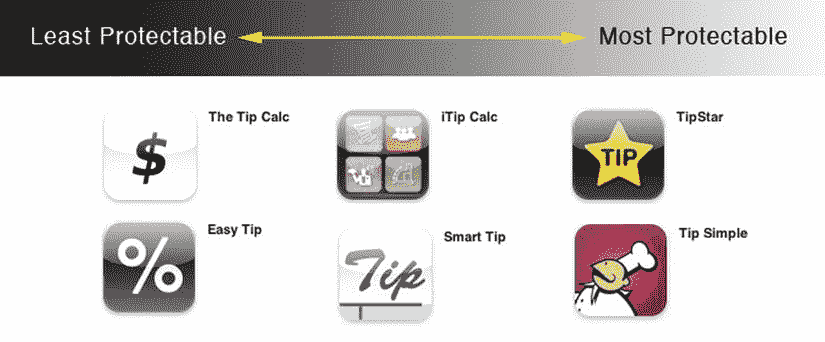

# 本章阐述的策略

本章阐述的策略基于一些与 App Store 特性相关的假设。这些策略并非适用于所有人，但应作为你分析的背景参考。

-   **速度:** 如果你的应用本质上很简单，竞争对手几乎会立即出现，因此你可能需要将重点放在能够快速建立的知识产权保护上。需要数年才能确立的权利可能不太适合这个平台。尽管你可能希望自己的应用在几年后仍能以某种形式销售，但移动设备和应用在五年内很可能会发生翻天覆地的变化。除了那些制定长期商业计划的应用开发者之外，开发者应将精力集中在能够立即获得保护的权利上，例如版权。
-   **成本:** 绝大多数应用在商业上都以失败告终。截至本书出版时，App Store 中已有超过 30 万个应用。当你将**所有类别**的付费应用总排行榜前 100 名与 40 个类别（包括游戏中的子类别）中每个类别的付费应用前 100 名合并计算时，在任何时刻，这些顶级应用列表中的应用数量都少于 4000 个。我估计，如今发布的 iOS 应用中有 98% 的收入未超过 5000 美元。这意味着，根据你的应用目标高低，你可能希望专注于低成本的知识产权保护。根据你的目标，在花钱为你的作品寻求可保护权利之前，先观望你是否取得了一定程度的成功，这也是合理的做法。
-   **区域:** 你还应考虑 App Store 的全球性，以及你是将知识产权策略仅集中在美国，还是也包括其他国家。本章主要关注美国知识产权法，但大多数其他国家也有某种形式的版权、商标或专利保护。每增加一个国家就会增加一层费用，因此在 App Store 所覆盖的全部 90 个国家寻求保护可能不切实际。从商业角度确定你最关心的司法管辖区，然后优先考虑在哪里投入资金。

大多数开发者的大部分销售额来自美国 App Store，因此在美国保护你的利益是一个良好的开端。如果你在美国境外开发你的应用，务必在美国进行商标搜索，以确定是否有其他人已经在使用该标志。你可以自己使用谷歌进行简单的商标搜索。然而，要进行更彻底的搜索，包括在美国专利商标局搜索记录，你可以付费使用商标搜索服务。是否支付全面搜索的费用，主要取决于你为你的新标志投入了多少。如果你可以更改公司或应用的名称，那么你可能只需要依靠谷歌搜索来判断是否有人在使用类似的标志。另一方面，如果你正准备投入大量资金进行广告或公关活动来建立你的品牌，那么在投资该品牌之前进行更彻底的搜索是合理的。

### 为你的应用注册版权

*注册应用版权*这个概念有些误导性，因为它暗示着要为你的作品获得版权保护，你需要主动采取保护措施。事实上，在美国和大多数遵循《伯尔尼公约》的其他国家，从你落笔（或开始在 Photoshop 或 Xcode 中工作）的那一刻起，假设你创作的东西对你是原创的，某种程度的版权保护就会自动建立。

版权保护原创的作者作品。这包括文学、戏剧、音乐和艺术作品，例如诗歌、小说、电影、歌曲、计算机软件和建筑。对于 iOS 应用，版权可以为你的应用源代码、图形和音效；说明文本；应用描述文本；以及你与应用打包在一起的创意视频或音频内容等提供保护。版权不保护事实、思想、系统或操作方法，但如果这些事实、思想、系统或操作方法以创意/艺术的方式实现，版权可能会对这些事物的表达方式提供一些保护。

#### 如何获得版权

当你创作一部作者作品并将其固定在有形媒介上时，版权就会自动产生。就应用开发而言，这意味着当你输入一行代码、绘制一些图形、录制声音或编写应用描述时，版权就开始了。假设该作品具有创意并被记录在某处（例如，在你的硬盘上或打印到纸上），版权就随之产生。

版权保护非常经济。在创作时就存在基本的保护级别，无需支付律师费或提交版权申请。不过，向美国版权局提交申请可以提供一些重要的额外好处。例如，如果你决定起诉侵权者，已注册的作品可能有资格获得法定损害赔偿和律师费。这意味着，虽然你可以保护未注册的版权，但你在诉讼中可能无法赢得像注册后那样多的赔偿。幸运的是，与专利或商标申请相比，版权申请的费用相对较低。

当前在美国提交版权申请的申请费是 65 美元，如果在线提交，最低可至 35 美元。作者和软件开发者付费请律师处理版权注册的情况相当普遍，但如果你对法律概念感到自在并且愿意在必要时提出问题，美国版权局支持你自己提交版权申请。可以从 `http://www.copyright.gov/eco/` 开始。电子版权局通过其网站很好地使申请过程变得快速简便。如果你有兴趣自己提交版权申请，电子版权局在 `http://www.copyright.gov/eco/eco-tutorial.pdf` 上发布了一份详细的教程。

#### 版权保护的局限性

版权是保护应用内容和代码的一种强大且经济的方式，但版权保护的是思想的创造性表达；它不保护思想本身。

例如，如果你有一个应用创意，可以根据用户 iPhone 上音乐库的内容向他们推荐新音乐，版权可以为你的创意图形或说明文本提供保护。然而，版权不会为应用的概念提供保护。在 iOS 应用的背景下，这是一个巨大的局限性。

### 为应用图标和标志申请商标

我认为商标代表着 iOS 开发者抵御竞争对手最经济且最有效的方式。在上一节中，我讨论了版权保护的局限性。其中一个重要的局限性是版权不保护思想，因此你的应用创意或概念不会受到版权法的保护。专利可以为概念和思想提供保护，但与走完版权或商标流程相比，获得专利相对昂贵且耗时。

商标不保护概念或思想，但如果你的应用标志或名称足够显著，它可以保护你赋予应用的标志或名称。商标是防止其他开发者利用你通过应用或概念建立的良好声誉的一种方式。

假设你有一个为 iPhone 开发的首个信用卡处理应用，你想保护自己。一个选择是为这个创意申请专利，但即便你的创意符合专利保护条件，也要等上几年才能拿到专利。

没有专利，你对该概念的保护有限，但你拥有先发优势。作为首款此类应用，它很可能获得媒体关注，甚至被苹果推荐。一旦你的应用取得一定成功，竞争者就可能开始模仿。没有专利，你或许无法阻止这种模仿，但可以防止竞争者误导用户以为他们就是你。

同样，苹果的审核流程不会过滤抄袭应用，所以你不能指望审核机制或苹果会阻止仿冒品上架。通过创建人们能关联到你公司的图标、名称和界面，你可以建立商标权。这些商标权能让你阻止他人在应用中使用易混淆的相似品牌。

如果竞争者以可能让用户混淆应用来源的方式抄袭你的应用，你的商标权应能让你阻止他们。但并非所有名称和标识都受同等保护。本节将介绍商标保护的基础知识，以及如何选择可受保护的商标来标识你的公司和应用。

如何获取商标

与版权类似，你只需将名称或符号用作应用来源的标识，就能自动获得一些商标权。但这些“普通法”商标权相当有限，而向美国专利商标局提交商标注册申请能带来显著好处。

联邦商标注册能向公众宣告你对该商标的所有权。注册还会在法律上推定你拥有该商标，以及在全美范围内就注册中列明的商品和服务类型享有独家使用权。最重要的是，联邦商标注册是向联邦法院提起商标诉讼的前提条件。

了解更多商标申请流程的最佳途径是访问`http://uspto.gov`。专利商标局网站上有大量关于该流程的信息，并提供在线提交商标申请的分步指南。

联邦政府甚至设有帮助热线，你可致电获取更多关于申请流程的信息。该热线不能提供法律建议，但它是极其有用且惊人的资源。商标援助中心的号码是`1-800-786-9199`。

但聘请律师协助准备申请也有好处。在流程中，通常需要与专利商标局反复沟通，有专业人士为你工作，能帮你为商标争取到最广泛的权利。

选择可受保护的商标

有些商标比其他商标更强。虚构名称（例如，Exxon 或 Google）或与公司没有字面关联的名称（例如，Apple 用于电脑公司）最有利于建立强大的知识产权。需要一点逻辑跳跃或仅暗示公司产品或服务的名称（例如，Titanium 用于旅行包公司，暗示强度和耐用性）是可受保护的，并且往往在打造强大品牌与向公众传达公司信息之间取得良好平衡。

另一方面，描述公司业务范围的名称（例如，Online Advertising, Inc.用于销售互联网广告的公司）通常最初不受保护。公司往往倾向于使用描述性名称，因为他们希望公众立即了解公司业务。然而，选择描述性名称可能会对公司的长期利润产生不利影响。原因如下：

*   可能无法阻止竞争者使用相同名称。
*   描述性名称（本质上可能与其他公司名称相似）可能需要额外的营销成本来从拥挤的领域中脱颖而出。
*   由于“监控”其他想使用相似名称的人负担加重，可能会产生额外费用。

作为应用开发者，你有两个重要的品牌塑造机会：应用名称和图标。你还可以指定公司名称。

首先，讨论应用名称作为品牌。App Store 对你选择的应用名称施加了一些不寻常的商业限制。在非 App Store 环境下，我通常建议选择一个不描述或暗示产品功能的名称。描述性或暗示性商标比任意或臆造性商标更难保护。

然而，对于 iOS 应用，任意性名称会带来发现难题。App Store 在列出应用时，只会显示应用名称的前 17 个左右字母。如果你给应用起一个任意性名称，App Store 目录的随意浏览者可能找不到你的应用，或者没意识到这是他们需要的东西。出于这个原因，选择可保护性较弱的商标有商业上的优势；但你仍应设法让你的应用名称在某些方面具有独特性。

例如，如果你销售一个小费计算器并将其命名为“小费计算器”，你几乎不可能成功获得该名称的商标保护。另一方面，如果你将小费计算器应用命名为“小费之星”，并添加一个带有星星的独特图标，你就有了可以主张该应用识别为来自你的依据，而不仅仅是描述其用途。

在“小费之星”的例子中，如果另一个开发者发布了一个带有星形标志或使用单词*星星*的小费计算器，那么“小费之星”的开发者 Ryan Rowe 将拥有合法的侵权索赔权。Ryan 的“小费之星”商标不仅仅描述应用，还添加了用于区分其应用与他人的独特性。星星的名称和符号与应用的目的无关，所以如果 Ryan 发布一个名为“体重之星”或“转换之星”的应用，他就可以建立在其初始应用所创造的良好声誉之上。

你的目标应该是创建一个独特且能标识应用来自你的名称，但又不完全掩盖应用的目的。这需要把握微妙的平衡。

如果你选择了一个暗示应用功能的名称，你可能需要额外努力使你的图标具有独特性。图 3-1 展示了一些独特图标的例子，并与一些不太独特的图标进行了对比。

图 3-1. 小费计算器名称和图标，从最不易保护到最易保护

商业秘密

作为开发者，你很可能有一些值得保护的秘密。可能是你下一款游戏或应用的概念、让你的应用更高效的算法，或者你某个应用功能背后的源代码。商业秘密法是保护这些秘密的一种方式，并且获得保护的条件相当简单。

#### 商业秘密法概述

商业秘密法各州规定不同，但通常为信息所有者提供保护，使其信息在市场上相对于竞争对手具有优势，且所有者采取的保密措施可合理预期能防止他人获取该信息（除非存在违约、盗窃等不当行为）。简而言之，如果你掌握一项能带来竞争优势的秘密，并已采取充分措施保密，那么当该秘密被盗用时，你可以提起诉讼。

#### 如何确立商业秘密？

商业秘密保护无需向政府提交任何申请或备案。事实上，你只需采取合理步骤维护秘密的机密性即可。保护源代码时，这可能意味着将代码保存在安全的服务器上；保护未公开的产品创意时，这意味着不向未签署保密协议的人透露你的应用构想。

以下是维护拟作为商业秘密保护的机密信息时应采取的最低限度措施：

*   **教育培训：** 务必对所有员工和承包商进行教育，使其了解维护公司信息机密性的重要性。能够证明你已采取措施确保每个人都知晓自身责任，将有助于表明你的公司行事合理。
*   **合同保护：** 每位全职、兼职员工及所有顾问（包括创始人及高管）均应在开始工作及公司商业秘密向其披露前，签署包含保护公司机密信息条款的雇佣协议。使用保密协议保护向任何其他第三方披露的机密信息。
*   **有形材料管控：** 机密文件和有形材料应标注为"机密"。这些文件和材料的访问权限应仅限于那些因履行对公司职责而需要知晓此类信息的员工和承包商。
*   **电子数据与代码管控：** 确保源代码及其他机密数据存储于需要登录名和密码才能访问的受控计算机上。

#### 保密协议

*保密协议*，也称为*机密性协议*，用于建立保密关系，在法律上约束一方保护另一方的商业秘密信息。尽管保密关系可通过口头协议建立或由双方行为默示形成，但我建议在披露机密信息时始终使用保密协议。口头或默示协议比书面协议更难证明。

大多数保密协议的核心义务是不使用或披露另一方的机密信息。

如果你和另一方将相互披露机密信息，则适用的协议应为*相互保密协议*。由于权利和义务对双方平等适用，相互保密协议的起草往往更显公平。

如果你预计仅披露机密信息而不会接收对方的机密信息，则应考虑使用单方保密协议，该协议保护你的机密信息，但不会为你的公司设定与从对方接收信息相关的任何义务。例如，当你向另一家公司推销产品创意或雇佣承包商为你工作时，单方保密协议是合适的。在这些情况下，你可能不希望在使用从对方接收的信息方面受到限制，因为这些信息很可能适用于你所推销的产品或你雇佣承包商所执行的工作。

保密协议是维护商业秘密保护的关键部分。商业秘密只有在保持秘密的前提下才受保护，因此，即使在披露商业秘密前仅有一次未能与第三方签订保密协议，也可能导致商业秘密权的丧失。

#### 商业秘密保护的限制

一个需重点考虑的限制是：商业秘密保护仅适用于非公开信息，这意味着他人通过简单检查你的产品就能获取的信息不受保护。可口可乐的秘方是著名的商业秘密，但它的商业秘密保护并不能阻止可口可乐的竞争对手购买一罐可乐并尝试对成品进行逆向工程。这一限制同样适用于你 iOS 应用中可被观察的元素。用户通过分析你的应用所能访问的信息不受商业秘密法保护，因为一旦你发布应用，这些信息就不再是秘密了。

为帮助阐明这一区别，假设你创建了一个在 iPhone 上运行的全新搜索引擎。再假设该搜索引擎由你发明的一个绝密且高效的算法驱动，该算法用于确定哪些搜索结果与用户最相关。如果该算法有效，它很可能成为你公司最有价值的知识产权资产。那么关键就在于，你在发布应用时，既要让用户受益于该算法，又不能暴露其具体工作原理。

现在假设谷歌获悉了你这款惊人的应用，并希望将该技术整合到其搜索引擎中。作为这项技术的开发者，你显然希望谷歌需要向你获得许可或购买该技术，或者更好的是，通过收购你的公司来获取这一秘密。在谷歌采取行动之前，你可以假设它很可能会购买一份你的应用副本，并试图弄清该算法的工作原理。假设你没有为算法申请专利，如果谷歌的工程师能通过测试和观察你的程序来弄清算法的工作原理，那么谷歌很可能无需收购你的公司就能实现类似的功能。

如果你采取足够努力保护该算法，且该算法无法通过简单观察你的产品而得知，那么你就能阻止竞争对手使用它。如果他们入侵你的电脑或贿赂你的员工以泄露算法，你可以就商业秘密盗用起诉他们。

商业秘密法仅涵盖你能保密的事物——这是一个需要重点考虑的限制。这意味着你需要寻求其他形式的知识产权保护（例如版权和/或专利）来保护你对用户可见的产品方面。

### 专利

如果你将各种形式的知识产权保护视为武器，那么专利保护就是末日装置。专利的获取成本高昂，诉讼费用也高，但它能为创新思想提供极其强大的保护，足以让竞争对手胆寒。整个商业模式或核心技术可能因一项覆盖公司现有业务的已有技术专利而遭受重创。出于这个原因，许多大中型公司纯粹为了防御目的而积累大量专利，这样在遭到诉讼时就能有反击的武器。

尽管专利强大，但对于大多数 iOS 开发者来说往往不太适用。费用各不相同，但通常聘请律师提交专利申请并完成发布流程的费用超过 1 万美元。整个过程通常需要两到三年，因此你的 iOS 应用需要是一项长期事业，专利才能产生实际意义。

#### 专利保护与 iOS 应用开发

游戏在 App Store 中拥有相当独特的销售曲线。如果一款游戏成功，它在发布时或发布前后会出现销售高峰，随后销售额通常会随时间推移而下降。要使一项专利物有所值，你的发明创意在三年后必须仍然有价值。

与此同时，正在申请中的专利在正式授权之前并不赋予你可强制执行的权利。告诉你的竞争对手，一旦你获得专利就会找他们算账，这或许能阻止他们在竞争性应用上投入过多。然而，如果开发竞争性应用的成本很低（或者竞争对手已经开发了它），他们很可能会继续销售该应用，直到你的专利正式授权。再结合一个事实：iOS 开发者遍布全球。你的专利可能吓不倒一个在印度的 14 岁孩子，他正在开发一款竞争性应用，而且被起诉对他来说也没什么好损失的。

尽管如此，在某些情况下，专利对 iOS 开发者来说确实非常有意义。寻求专利保护的最大弊端是成本。如果你正在开发一个预算特别大或雄心勃勃的应用，并且获取一项专利所需的 10,000 多美元在整个项目计划中并非巨额开支，那么获得专利可能是保护你在该项目上整体投资的一个明智之举。

另一个专利保护值得考虑的情况是，如果你的应用是一项长期事业。如果在你产品的预期生命周期的大格局中，三年时间并不算长，那么漫长的申请程序可能就不是问题。请认真思考你对你应用的抱负，并判断你认为三年后是否还会有人关心它。

#### 你的发明是否具备可专利性？

专利保护的是新的、有用的工艺、机器、制造品和物质组成，以及对这些事物的任何新的、有用的改进。概括来说，除其他要求外，要获得专利，你的发明必须是新颖且有用的，并且你必须能够以这样一种方式来描述它：使得在该发明领域具有合理技能的人能够使该发明工作。

要求发明是“新颖的”意味着你必须是第一个发明它的人。在美国，如果两个人对同一项发明申请专利，专利将授予最先构思出该发明的人，而不是最先提交专利申请的人。事实上，无论另一位发明者是否提交了专利申请，如果该发明者首先构思了这项发明，你后来提交的专利可能会被宣告无效。

即使没有人比你更早构思出这项发明，该发明本身对于在你发明相关技术领域具有普通技能的人来说也必须是“非显而易见的”。这可能是一个棘手的难题，因为往往最好的发明在发明出来之后看起来是显而易见的。关于这一点，判断标准是该发明在发明之时是否是非显而易见的。由于在发明已经公之于众后很难做出判断，所以通常会用这样一个事实作为证据来证明该发明并非特别显而易见：即尽管其他人与发明者拥有相同的信息，但此前却没有人构思出这项发明。

获得保护的另一个要求是，你的发明必须在你的申请中以这样一种方式描述，即证明你已经“将发明付诸实践”。这意味着你不仅构思了这项发明，还实际确定了如何使其工作，并且细节足够详细，以至于你技术领域内的熟练人员可以据此制造出来。例如，如果我声称发明了时间机器或传送装置，要获得专利，我必须能够以一种切实可行的方式，描述如何制造出这台机器或装置，从而使其他人能够制造它。

假设你的发明符合保护条件，美国专利赋予其所有者有权阻止他人在美国境内制造、使用、许诺销售或“销售”该发明，或将该发明“进口”到美国，期限为自该专利申请在美国提交之日起 20 年。与版权和商业秘密保护相比，这些权利尤其强大，因为你阻止他人制造或销售你发明的权利，无论他们是否从你这里复制或窃取了该发明。即使他们独立发明了相同的东西，如果你首先构思了它，你也可以阻止他们。

#### 避免“销售拦阻”

如果一项发明的专利申请未在其首次公开、公开使用或在美国销售之日起一年内提交，则该发明将不具备专利保护资格。这意味着，如果你向潜在投资者或客户演示你的发明或应用，你写了一篇关于它的博客文章，或者你的应用已提交给苹果，那么计时就开始了。如果你在一年内没有提交专利申请，你将失去这样做的权利。因此，如果你正在考虑寻求专利保护，你应该在流程的早期就联系专利律师，以便律师可以帮助你确定提交申请还有多少时间。

#### 如何提交专利申请

虽然你可以自行提交专利申请，但如果你与专利律师合作，几乎肯定会获得范围更广、更稳固的专利。与合同不同，在合同中，简单明了的协议实际上比复杂的协议更可取，而专利申请有其特定的词汇，专门适用于专利申请。使用错误的措辞来描述发明可能会导致你的专利权利要求出现弱点。

专利律师和专利局有他们自己的语言，聘请一位会说这种语言的人将你的发明翻译成恰当的术语，以最大化你专利的价值，是值得的。如果你确实试图自行起草申请，你至少可以在提交前聘请一位专利律师对其进行审查，看看是否有任何律师可以推荐的明显修正点。

#### 自行提交临时专利申请

尽管专利申请流程昂贵且通常需要律师，但有一个初步步骤你可以自行完成，只需支付适度的申请费。这个初步步骤被称为*临时专利申请*。

临时专利申请基本上是你向专利局提交的一份关于你发明的描述，目的是为了在你决定就该项发明提交正式专利申请时，确立一个较早的有效申请日。临时专利申请只是为你占个位，这样当你提交正式申请时，就可以获得更早申请日的权益。

一般来说，临时专利申请相当薄弱。它们不赋予你任何可强制执行的权利，也不会产生专利，除非你稍后在时间耗尽前提交正式专利申请（请参阅前面的“避免销售拦阻”部分）。

那么，为什么要费事呢？临时专利申请让你能够将*专利未决*这个术语与你的产品联系起来。*专利未决*这个术语并不意味着你有任何法律上可强制执行的权利，但它会让你的竞争对手和潜在竞争对手注意到你有一项正在申请中的专利。根据潜在竞争对手进入你的市场的成本有多高，让他们知道你正在寻求专利保护可能足以阻止他们。许多人根本不知道*专利未决*是什么意思，也懒得去搞清楚。

### 知识产权与合同管理

如果您未能在“销售禁止”条款规定的时间内提交非临时专利申请，您将失去主张“专利待决”状态的权利。但到那时，您应该已经清楚您的应用程序是否有前景，并决定是否值得花钱继续寻求专利保护。

您可以通过美国专利商标局网站在线提交临时专利申请，网址为 `https://efs.uspto.gov/efile/portal/efs-unregistered`。

美国专利商标局在其网站上提供了一些关于临时专利申请的说明和信息。此外，Nolo Press 等法律出版商也提供了一些资源。例如，Richard Stim 和 David Pressman 合著的 *Patent Pending in 24 Hours*（Nolo, 2009）可以指导您完成整个流程。

如果您打算后续提交非临时专利申请，您可能还想咨询将为您提交完整申请的专利律师。律师提交临时申请的费用远低于完整申请。此外，如果他们是基于您自己起草的临时申请来撰写非临时申请，其受到的约束可能会比后者更少。

#### 在承包商与员工协议中处理知识产权问题

如果您正在雇佣承包商或员工来帮助您创建应用程序，务必与他们签订协议，以明确他们为应用程序贡献的知识产权的所有权。一种常见的误解是，雇佣承包商或员工的人自动拥有其创建作品的权利。实际上，如果您雇佣承包商来编写应用程序代码或设计用户界面，除非您有一份书面协议表明您拥有该工作成果，否则您很可能无法完全拥有您期望的对交付成果的所有权利。

##### 雇佣承包商

起草一份能够保护您公司的独立承包商协议，不仅仅涉及必要的知识产权转让条款。您可能需要与律师合作，制定一份能够涵盖公司可能遇到的各种问题的标准合同。您可能希望加入针对交付成果的验收条款，以确保您能得到符合预期的成果。或者，您可能想加入延迟交付的违约金条款，以激励承包商按时交付工作成果。如果您的承包商位于知识产权保护不力的海外国家，您可能需要在保密性方面加入额外的保护条款。不过，本节的重点是确保您从独立承包商协议中获得您所期望的知识产权。

在独立承包的背景下，除非存在一份将知识产权转让给客户的书面协议，否则客户并不拥有承包商所创建工作成果的知识产权。这与许多雇佣承包商的人的预期相反。

您可能听说过“雇佣作品”原则。该原则并不意味着您雇佣某人做工作，您就拥有该工作成果。事实上，如果您在没有书面知识产权转让协议的情况下雇佣承包商，您很可能只获得有限的使用该工作成果的许可。这会产生若干问题。首先，由于您对工作成果的许可是非书面的，很难确定哪些行为是允许的，哪些是不允许的。例如，在这种非书面许可下，您是否有权雇佣其他承包商修改该作品，或者是否有权将其再许可给其他公司，这些都可能不明确。

如果您有幸遇到有人试图收购您的公司或应用程序的权利，缺乏书面的许可协议或知识产权转让可能会危及这笔交易。我曾见过一个首次公开募股以及多起并购交易因此差点告吹。在每种情况下，未能与承包商达成协议的公司都需要找到该承包商，并协商购买缺失的权利。这种谈判并不容易，因为处于清算事件前夕的公司几乎没有议价能力，特别是当承包商知道即将发生的收购时。指望事后补签协议也假设您能够找到该承包商。多年后，承包商的可能已不存在，或者承包商可能搬到了安第斯山脉的偏远地区。如果您找不到承包商，无论您有多少钱试图购买这些权利，都无法实现。

如果说您从本章中需要记住一件事，那就是：与您雇佣来创建任何将整合到应用程序中的内容的人，签订一份独立承包商协议。这包括编码人员、美术师、用户界面设计师等等——所有人。

我建议您与律师合作，创建一份符合您公司特定需求的独立承包商协议。但为了您的参考，我在 `http://www.bitwiselegal.com/iPhone` 上发布了一个示例独立承包商协议。它应该能让您大致了解，作为雇佣公司，您希望在协议中看到哪些类型的条款。

##### 雇佣员工

雇佣员工会为您的业务带来一系列复杂性。然而，从知识产权的角度看，这比雇佣承包商要简单。与承包商不同，雇佣员工时，您确实会获得他们创建的工作成果的部分所有权。但与承包商一样，您也无法获得您可能期望的所有权利。

特别是专利权，并不会自动随着雇佣关系而转让。如果没有书面转让协议，雇主仅获得所谓的“工场权”，这意味着雇主可以在其业务中使用该发明，但并不拥有该发明的底层知识产权。

与处理独立承包商关系时一样，您需要有一份书面的雇佣协议，将知识产权转让给您作为雇主。您应该让所有员工签署这份协议。

**注意**：知识产权转让同样适用于创始人。通常，当朋友们一起成立公司时，他们共同开发公司产品，却没有与公司签署雇佣（或承包商）协议。如果出现分歧，创始人分道扬镳，公司可能会失去对其技术的完整权利。未签署转让协议的创始人日后可能会起诉公司侵权，或者利用他们创建的作品来创建与原公司竞争的实体。

#### 知识产权的引入许可

所有开发者都讨厌重新造轮子，尤其是当其他程序员已经完美解决了某个问题的时候。有时候，从他人处获取代码在时间和成本上更为高效。第三方代码可能比您从头编写的代码经过更充分的测试且更稳定。它可能拥有您没有时间自己构建的有用功能。问题在于，这些代码不属于您。由于您不是自己构建它，也没有雇佣员工或承包商为您构建，您需要从创建它的个人或公司处获得使用该代码的权利。本节主要讨论如何获取使用他人拥有的内容和技术的必要权利。

##### 记录您的引入许可

### 应用程序开发中的许可与法律考量

每当你使用从第三方获取的代码或其他资料时，都应当确保已记录并理解所获许可的范围。有时这些内许可协议需要你与许可方协商并签署。在其他情况下，你可能会在购买过程中点击同意供应商的协议。至于在网上找到的代码，你可能需要受代码附带许可条款的约束。如果没有明确标注许可，你甚至可能完全没有使用该代码的权利。

#### 了解你所获取的内容

许可协议的主要目的是授予被许可方使用许可方代码或其他内容的权利，但许可协议也可以为许可方提供关于代码或内容质量的某些保证。

如果你正在协商一份内许可协议，你应当争取获得一些保证，确保许可方确实拥有授予你代码或内容许可的权利。如果因某些原因你的公司因所内许可的材料而被起诉侵权，你可能还希望许可方为你提供辩护。

许多点击同意或拆封即许可的协议并不包含此类保证或赔偿条款。其结果是，如果许可方提供的代码包含有害内容，你可能需要独自承担责任。

像乔·休伊特的 `Three20` 框架这类免费提供的代码是极好的资源。但理解像 `Three20` 这样采用 BSD 许可协议的代码并不附带任何保证，这一点至关重要。它实际上是"按原样"提供的，这意味着尽管它能为你的应用程序开发节省大量时间，但如果该代码出现故障、包含病毒或构成侵权，你仍需独自承担责任。令人惊讶的是，这同样适用于你通过 `iStockphoto.com` 等图库网站获得的大多数艺术作品。这并非说你不应该使用 `Three20` 或图库图片，而是你应该意识到你的公司因此承担的风险。

#### 避免病毒式许可

有些免费提供的软件采用具有病毒式传播特性的开源许可协议。这些开源许可协议，如 GNU 通用公共许可证（GPL）和较宽松通用公共许可证（LGPL），对软件进步贡献巨大，但对任何在自己的程序中使用其代码的人施加了相当严格的义务：即必须将最终应用以类似的开源许可协议发布。这意味着，如果你无意（或有意）将在网上找到的一些开源代码包含在你的应用中，你可能就有合同义务提供你的源代码，并允许其他人免费重新分发你的应用。对于商业软件来说，这是一个真正的问题。

关键要点是，你应确保审查整合到你应用中的任何第三方代码或内容的许可协议。你应用中的每项内容都应能追溯到原始许可方，并在你的记录中链接到一份你认可的许可协议，该协议能为你提供足够的保证，且不包含可能玷污你商业产品的病毒式条款。

#### 不要使用苹果的商标

务必了解，苹果的开发者协议禁止在你的应用中使用苹果的商标。这意味着你要避免使用看起来像 iPod 的工具栏图标，也不要在你的应用中包含 iPhone 的图片或图像。此外，你不应在你的应用名称或公司名称中使用 `iPod`、`iPhone` 或 `iPad` 等字样。

使用这些标志违反了你的开发者协议，可能导致你的应用被拒绝，或者陷入漫长且不可预测的审核周期。

#### 创建自定义最终用户许可协议

你的最终用户许可协议（EULA）是与用户达成的协议，授予他们使用你应用的权利。在知识产权方面，这份协议是你根据你的知识产权权利授予用户使用你应用的许可。

##### EULA 的目的

你的 EULA 是规范你与用户关系的文件。除其他事项外，它授予用户使用你应用的权利，并规定了你希望施加的使用限制。与任何许可协议一样，你的 EULA 可以根据你的目标授予狭窄或广泛的权利。大多数应用程序开发者只想授予用户非常狭窄的许可，仅限用户使用你的应用，不得修改或重新分发。这种模式在一定程度上已内置于 App Store 中，因为苹果在技术上限制了用户与他人分享应用的能力。

拥有 EULA 的最重要原因之一是，它可用于限制用户从你应用中获得的质量保证，从而限制你对最终用户的责任。

##### 免责声明

当客户购买一份你的应用时，他们应该期待什么？从法律角度来看，这些期望是通过*保证*来设定的。

当你在应用描述中说你的游戏有 20 个关卡，或者你的 Twitter 客户端允许用户从应用中发布推文时，这些就是关于应用的"明示保证"。如果客户购买了你的应用，但它无法实现你所说的功能，用户可能会声称你违反了保证。

大多数应用程序开发者并非要否认其明示保证，但如果在 EULA 中没有恰当的保证免责声明措辞，你最终可能会向最终用户提供你无意承诺的保证。这些是根据销售情况可能产生的默示保证。默示保证的例子包括"适销性保证"和"特定用途适用性保证"。这些保证的问题在于，它们通常基于客户期望你的产品能做什么，而不是你告知他们的产品功能。

无需详细描述各种默示保证及其产生方式，也能理解它们如何融入你的 EULA。关键在于，通过在 EULA 中加入恰当的免责声明，你可以免除这些默示保证，并限制用户因你的应用未达到其期望而起诉你的能力。当你在 App Store 上发布应用时，就会明白这有多重要。App Store 里有各种各样的客户。有些成熟，有些不成熟；有些理性，有些疯狂。一旦你开始看到人们为应用发布的评论，就会清楚，用户对应用功能的期望往往并不基于现实。

##### 责任限制

EULA 对开发者的另一个重要好处是，包含一项限制开发者因应用销售而产生责任的条款。责任限制条款是你与用户之间的一项协议，用于设定协议下的最高赔偿金额。大多数情况下，赔偿上限设定为客户为产品支付的金额。有时甚至设定得更低。

并非所有司法管辖区都承认责任限制条款。法官通常会评估责任限制条款对用户是否公平。然而，总体而言，美国法院会尊重人们自行决定同意哪些合同的权利，并且大多数情况下，责任限制条款被认为是可以强制执行的。

##### 责任限制

责任限制条款对于您的应用尤为重要，尤其是当您的应用（像许多 iOS 应用一样）仅售价几美元时。如果您的客户只为您的应用支付了一美元，您肯定不希望在他们认为因该应用而受到损害时，面临客户起诉您并索要数千美元赔偿的风险。您最终用户许可协议（EULA）中的责任限制条款有助于降低此风险，并允许您继续以低价（如一美元）销售应用，而无需为了应对客户起诉的风险而提高价格。客户以更优惠的价格获得应用，但同意如果应用无法正常运行，他们不会就超出某个固定金额（很可能是他们为应用支付的金额）的损失起诉您。

##### Apple 的最终用户许可协议（EULA）

您绝对应该拥有一份用于管理您与用户之间关系的 EULA，但您可能不需要为自己创建一份自定义协议。如果您不自行上传 EULA，Apple 会默认应用其标准 EULA。

Apple 的默认 EULA 包含所讨论的一些基本保护条款，例如有限许可授予、免责声明和责任限制。Apple 在其 App Store 条款和许可应用 EULA 的副本中公布了相关内容，网址为 `http://www.apple.com/legal/itunes/us/terms.html#APPS`。

Apple 当前的 App Store 条款和许可应用 EULA（日期为 2011 年 2 月 2 日）提供了您在此类协议中所需的大部分基本保护，并且无需额外操作即可实施。然而，出于某些原因，您可能希望创建自己的协议。

##### 使用您自己 EULA 的理由

在我看来，Apple 默认 EULA 的最大弱点在于，用户在下载或安装您的应用时，并未被提示接受该协议。用户作为 Apple 其他点击通过协议的一部分，已经同意了这些条款。然而，可以认为，如果要求用户在决定购买您的应用时同意这些条款，该协议将更有可能被强制执行。这并不是说 Apple 的默认协议不可强制执行，只是说它给用户提供了一个原本不存在的论点——如果 EULA 在下载时呈现给用户并征求其同意，这个论点就不会存在。

创建自己 EULA 的另一个充分理由是，如果您的应用或业务存在 Apple 默认协议未涵盖的特定风险。例如，如果您正在开发一款帮助医生评估患者需求的医疗应用，您可能需要包含一些特定的免责声明，提醒医生不应仅依赖您的应用来提供护理。如果您正在创建一款涉及用户生成内容的应用，您可能需要加入《数字千年版权法案》（DMCA）安全港条款，该条款有助于在您的用户上传侵权内容时保护您的公司。

最后，Apple 默认 EULA 中的隐私条款可能与您的公司使用和/或披露用户信息的方式不符。事实上，Apple 默认协议中关于开发者如何使用这些信息的表述相当模糊。如果您计划收集用户的任何个人信息，例如其姓名和电子邮件地址，或者将访问其设备上的数据，例如其音乐资料库或通讯录，您应该认真考虑实施带有针对您业务的特定隐私条款的 EULA。如果您计划将所获取的信息用于超出为用户提供其下载应用所对应服务之外的任何目的，或者如果您希望保留与其他公司共享这些信息的权利，这一点尤其重要。

##### 如何以及何时采取法律行动

那么，您已经采取了必要步骤为您的应用获得了某些知识产权。现在，竞争对手出现了，并且您认为他们可能侵犯了您的权利。您该怎么办？在本章的剩余部分，我将结合一个我认为侵犯了我某款应用商标权的案例，介绍诉讼前和诉讼中的选择方案。

这个故事涉及我早期的一款名为“Private-I”的应用，它帮助 iPhone 用户找回丢失或被盗的 iPhone。该应用以一个故意引人注目的图标为特色，该图标上以红色字母显示“*Private*”（私人）字样。该图标旨在诱使找到或偷走用户 iPhone 的人打开应用，以查看用户认为隐私的内容。当应用打开时，它会显示一个看似正在加载某些私人信息的屏幕，但实际上，它正在秘密地向 iPhone 主人发送一封包含手机位置地图的电子邮件。我对这款应用的期望并不高，因为它的本质局限在于，需要小偷打开应用，位置追踪功能才能被激活。令我惊讶的是，这款应用引起了人们的共鸣。它在许多知名博客上被报道，例如 TechCrunch 和 Engadget。

与所有取得显著成功的应用一样，在我的应用推出后不久，类似的应用便开始出现。该应用的整体市场不值得为该概念寻求专利保护，而且我也不确定该概念是否值得专利保护，因此我接受了其他人会利用这个想法开发应用的事实。然而，一个竞争对手决定使用与我完全相同的图标来销售其应用，这促使我考虑采取法律行动。以下是对一些诉讼前和诉讼中选择方案的说明，以及我如何针对自己的山寨事件评估这些方案。

##### 争议解决的第一步

根据我的经验，Apple 试图避免介入应用开发者之间的纠纷。尽管如此，在您考虑真正提起诉讼之前，值得通过 Apple 寻求补救措施。与 Apple 合作无需任何费用，如果公司响应迅速，可能会立即产生结果。另一方面，诉讼可能既耗时又昂贵。与商标相关的问题可以通过电子邮件地址 `appdisputes@apple.com` 提交给 Apple 审议。

在我的案例中，`appdisputes@apple.com` 这个电子邮件地址当时还不存在，但我向 Apple 的版权官员（已在美国版权局注册）发送了请求。我的请求没有得到回复，这让我得出结论：Apple 的律师更愿意避免介入开发者之间的纠纷。说实话，我不能责怪他们。版权和商标纠纷可能很复杂，Apple 需要在每个案例中就开发者各自的权利做出判定。可以理解为什么 Apple 更愿意简单地等待开发者通过诉讼或谈判解决纠纷，然后根据法院命令或开发者双方同意的指示采取行动。

尽管如此，向 Apple 发送电子邮件应该是您追究侵权者的第一步。您不应仅仅假设 Apple 会为您解决纠纷。

##### 诉讼前步骤

如果您认为竞争对手侵犯了您的知识产权，诉讼过程的第一步是确定其侵犯了哪些权利：

*   如果对方在其应用中使用了您的一些图形，您应关注您对这些图形的版权。
*   如果竞争对手为其应用起的名称与您的应用名称有令人混淆的相似性，您应关注您的商标权。
*   如果竞争对手的应用采用了您为您的应用创造的相同概念或想法，并且您已提交了专利申请（或者您仍有时间在“销售阻止”条款限制您的权利之前提交申请），您可能希望关注您潜在的专利权。

### 在此阶段与律师沟通，可以帮助您识别自身权利受到侵犯的具体方式。律师能够指导您了解：在向他人主张权利之前，是否需要采取额外措施来巩固这些权利，同时也能帮您评估权利的相对优劣势，以及在与竞争对手的诉讼中获得胜诉的可能性。

打官司的开销极为高昂。幸运的是，大多数纠纷在进入诉讼程序之前就能得到妥善解决。如果您和您的律师认定，对竞争对手的侵权指控成立，下一步很可能就是向对方发送一封停止侵权函。这封信函的目的是通知对方：您认为其行为侵犯了您的权利，并要求其立即停止。根据具体情况，您的竞争对手可能并未意识到自身的侵权行为。停止侵权函兼具双重作用：一方面告知对方被指控的侵权行为并要求其停止，另一方面留下书面证据，证明对方已知晓您的权利——以防其选择继续侵权。

那么，在我经营 Private-I 这款应用时是如何处理此类问题的呢？我评估了认为抄袭者侵犯的那些权利。就本案而言，我认为抄袭者侵犯了我图标的著作权，因为图标 artwork 被复制；同时商标权也受到侵犯，因为在另一款产品上使用相同图标必定会导致消费者混淆。更重要的是，我评估了侵权行为对我造成的实际损害，以及通过维权可能获得的潜在收益。最终结论是：追究抄袭者责任得不偿失。那款抄袭应用从未取得良好销量，对我的销售额影响甚微。虽然对有人如此卑劣地完全复制一款应用并上传至 App Store 感到愤慨，但我必须做出抉择：是花费时间写信，与一个令我反感的人周旋，还是更愿将精力集中于开发应用。我从不后悔这个决定。Private-I 始终是旅行类别中的强劲竞争者，而那款抄袭应用在商店中几乎毫无曝光度。

### 诉讼

在我的案例中，抄袭应用并未造成太大损害，但如果您的权利受到侵犯且对业务造成实质伤害，诉讼便是制止侵权并可能从侵权方获得金钱赔偿的途径。诉讼耗时费力且开销巨大，但它是一把极其锋利的武器。

如果潜在侵权方在收到您的停止侵权函后仍不停止侵权行为，且您与对方代表的沟通已破裂，下一步便是对竞争对手提起诉讼。这不是一项您单枪匹马就能完成的任务。如果您认为指控成立，应当聘请知识产权诉讼律师来起草并提交诉状。

### 总结

知识产权法以及运营软件业务所涉及的通用法律问题可能令人难以理解。幸运的是，您无需通晓所有知识产权知识，也能成为一位精通权利保护的开发者。即使是在该领域执业的律师，也往往专注于法律的特定部分。例如，我的执业重心主要在于协助他人起草合同，而其他律师则专攻诉讼领域。还有些律师则致力于帮助客户提交专利或商标申请。既然连该领域的律师都无法掌握知识产权的全部内容，您的目标只需是：对这些问题有足够了解，以便在需要深入探究某个特定主题时能够及时识别。

不妨将这些法律问题视为 Cocoa 框架中包含的类库。举例来说，在您编写需要调用摄像头或照片的应用之前，您无需懂得如何使用`UIImagePickerView`。但当那一刻来临时，了解该类是否存在以及其大致功能就变得至关重要。就像学习编程语言一样，拓展业务法律知识的关键在于：知晓现有资源以及如何获取它们。

