# 每年，苹果公司都会在北加州举办全球开发者大会（WWDC）。大会的主题演讲通常是苹果向热切期待的开发者群体介绍新产品和软件的论坛。2014 年的 WWDC 也不例外——会上宣布了 iOS 8 和新的 Mac OS X 系统 Yosemite。然而，对开发者来说，最重要的发布是苹果的新编程语言，名为 Swift。Swift 是`Objective-C`的替代品——开发者无需担心他们学习`Objective-C`的努力全都白费了，因为`Objective-C`和 Swift 代码都可以用于开发 iOS 和 OS X 应用程序。

苹果将 Swift 描述为“不带 C 的`Objective-C`”。Swift 是一种编译型编程语言，其语法与其他源自 C 的语言（如 C#和 Java）相似。Swift 用包含代码的`.swift`文件替代了`Objective-C`中的头文件（`.h`和`.m`文件）。在 Swift 中，不需要基于括号的语法和分号来终止语句。Swift 中的方法以`func`关键字为前缀，类方法则以`class`关键字为前缀。Swift 是一种类型安全的语言，编译器会执行类型检查，在编译时而非运行时捕获任何类型错误。要开始使用 Swift，请前往 iBooks Store 免费获取苹果公司的《*The Swift Programming Language*》一书。

#### iOS 8 中的差异

本节将帮助你熟悉 iOS 7 和 iOS 8 中发生的变化。虽然大多数设计变化是在 iOS 7 中进行的，但本节讨论的是作为最新 iOS 版本的 iOS 8。此外，本节将帮助你理解苹果引入的新设计标准，并告诉你哪些标准已被弃用。

如果你是在 iOS 7 之前就使用 iPhone 的用户，你自然会知道这种风格与之前的有何不同。现在，让我们讨论一下 iOS 6 和 iOS 8 之间的具体差异，以及这可能如何影响你设计应用的方式。

计算器应用是展示视觉方向变化的完美例子。图 4-1 左侧是 iOS 6 版本。可以看到它具有非常拟物化的设计风格，模仿了现实生活中的计算器。右侧则可以看到对字体和简洁性的极大强调。其理念不一定是展示你能把东西做得多么漂亮，而是如何专注于通过应用丰富用户的体验。

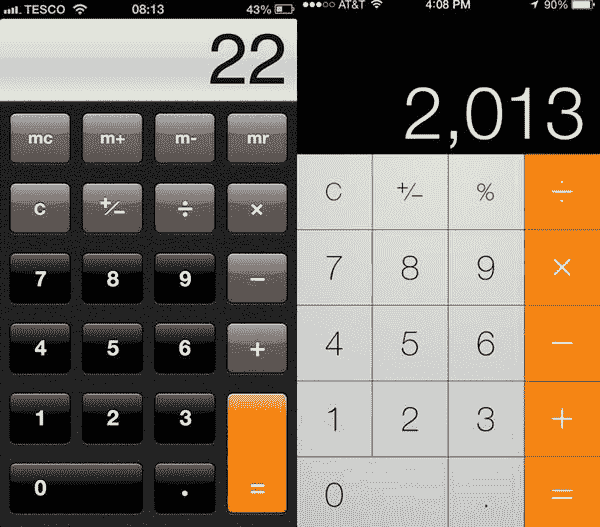

图 4-1. 苹果原生计算器应用（左：iOS 6，右：iOS 8）

邮件应用也经历了一些变化，它是展示`UIToolbar`和`UINavigationBar`之间差异的好例子。你可以在图 4-2 中看到，iOS 8 简化了大量渐变和颜色，并增强了邮件应用的排版。

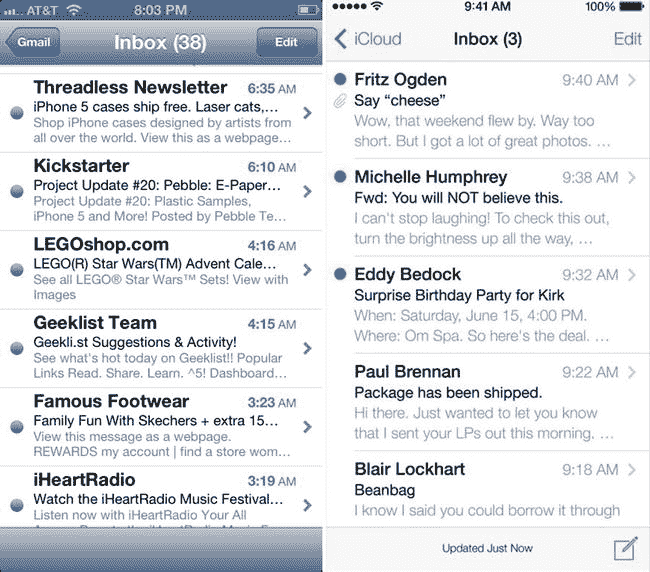

图 4-2. 苹果原生邮件应用（左：iOS 6，右：iOS 8）

但我想花点时间关注`UINavigationBar`和按钮。请注意，随着文本按钮（如 iCloud 或编辑）的引入，不再需要使用图片。这是一个很好的方法，因为随着时间的推移，随着设备分辨率的变化，应用可以轻松适应多种分辨率，而无需压缩或拉伸图片。为了与 iOS 8 保持一致，请考虑使用文本或图标来传达操作，而不是使用实体按钮。另外，请注意`UINavigationBar`现在与状态栏合为一体，不再是单独的项目。由于它不再是一张图片，你可以将`UINavigationBar`设置为不同的颜色。

现在我想把重点放在`UITabBar`上，以展示它如何影响图标（参见图 4-3）。

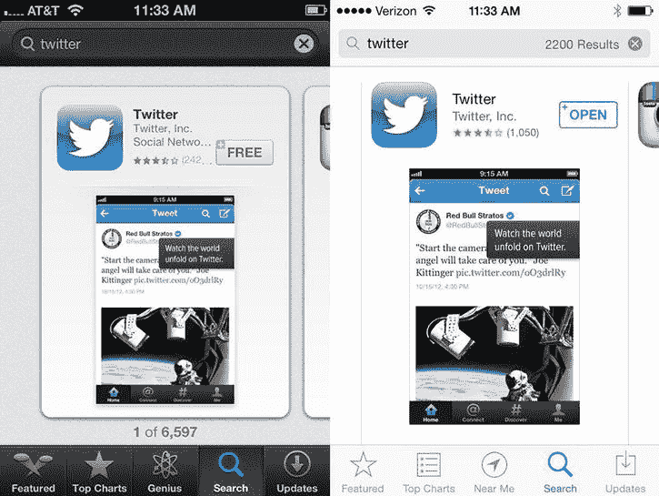

图 4-3. 苹果 App Store（左：iOS 6，右：iOS 8）

iOS 8 中的图标通常被称为*线形图标*；它们未选中时是细线条，选中时会变得“填充”。在 iOS 8 中，苹果允许通过编程方式更改图标的颜色。

最后，让我们看看 Facebook 应用。你可以在图 4-4 中看到，许多“效果”被移除，东西保持得更简洁，导航也扩展回到了`UITabBar`。展望未来，请将这些例子中的一些记在心里，为你想要实现的最终产品形成一个视觉蓝图。

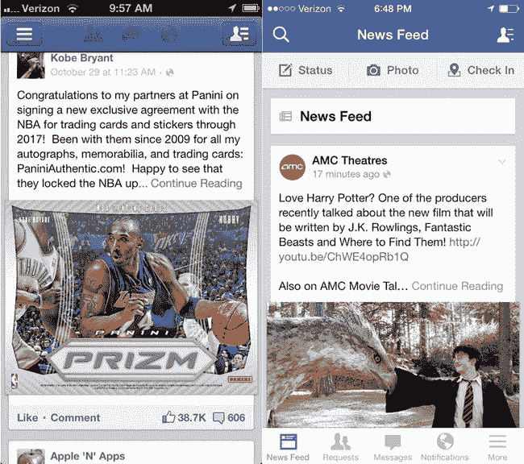

图 4-4. Facebook 应用（左：iOS 6，右：iOS 8）

### 为你的应用定义品牌

你的应用应拥有区别于其他竞争对手的主色调、图标和标志。你能提供给用户的最佳体验之一，就是在标志、应用和应用图标的设计上保持一致性。在构思应用的标志时，请保持创意源源不断。这是一个视觉元素，如果能借助专业设计师的魔力会更好，因此，如果你聘请了设计师来创建应用图标，那么应该让同一位专家来创建匹配的标志。但如果预算紧张迫使你不得不独自承担图形设计的重任，也无需担心。标志不必复杂。事实上，就像你的图标一样，标志越简洁，你在各种小尺寸下使用它的灵活性就越大，同时还能保持可读性。

你需要创建一个主标志，其尺寸至少几英寸长，分辨率为 300 dpi，这样它在你未来可能创建的任何与印刷相关的营销材料中都会看起来很棒。为了获得最佳效果，你可能希望选择基于矢量的 Illustrator 程序来创建你的标志，特别是如果你的图标也是在 Illustrator 中构建的。利用你已经完成的设计工作，将现有的图标融入标志设计中。这不仅为你节省了大量设计时间，还有助于强化你已经通过应用图标建立的品牌形象。

#### 你最强大的营销工具

**注意** 如果你在标志中使用第三方字体，务必购买适当的字体许可证以便在商业项目中使用。有些字体可能相当昂贵，因此如果资金是个问题，我建议尽可能使用免版税字体。请参考本章后面的“给艺术挑战者的提示”部分，获取一些有用的字体库资源。

在游戏的这个早期阶段，创建一个包含在`Xcode`项目中的应用图标似乎是显而易见的——但为什么要在应用尚未开发时就设计标志呢？显然，你会希望在应用的官方网站上准备好使用你的标志，并让它可用于你进行的任何发布前的宣传工作。但现在设计标志的最大原因是为了商标注册（正如 Taylor Pierce 在第 3 章中所解释的）。商标申请和审批过程可能需要几个月的时间，因此如果你计划为你的应用标志注册商标，最好尽快启动这一流程。如果一切顺利，理想情况下你可以在应用上架 App Store 之前就正式注册好商标。

#### 保持一致的品牌形象

为了强化你的品牌形象，你需要在所有的营销活动中使用相同的应用图标和标志。如果你使用太多视觉上的变体来推广同一个 iOS 应用，很可能引起消费者的困惑。

通过持续使用相同的图标和标识，你的应用品牌将逐渐为人们所熟知。这种熟悉感有助于消费者在搜索 App Store 或向亲友推荐你的应用时，轻松回忆起应用名称。

拥有一个知名品牌，还能帮助你向熟悉你此前应用视觉品牌的用户推广新的 iOS 应用。

例如，为强化知名效率应用 Evernote 的品牌形象，其应用内多个界面以及官方网站都使用了相同的图标和配色方案（见图 4-5）。请注意，尽管 Evernote 的图标设计极为简洁，但其一致的运用却非常有效（这对所有非艺术出身的开发者来说是个好消息）。

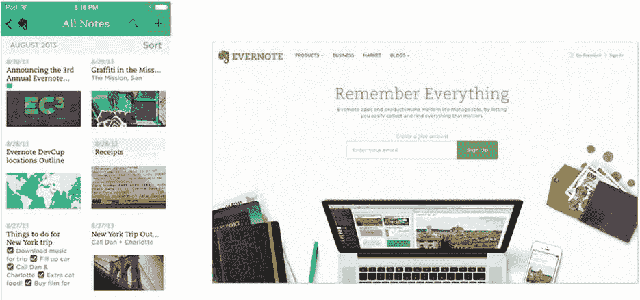

图 4-5。Evernote 在应用图标中使用了相同的 Evernote 图标和颜色。Evernote 应用（左）与其网站（右）展示了统一的品牌形象。

如果你正在将现有应用从其他平台（如 Mac OS X 或 Windows）移植到 iPhone 或 iPad，可以利用已建立的品牌资产，为 iOS 版本使用相似的图标和标识。这是吸引那些已从其他平台熟悉你应用的新用户的好方法。

例如，当 Flexbits 为其获奖 Mac 应用 Fantastical 创建 iPhone 版本时，它使用了相同的品牌形象，但略微修改了图标。该图标依然能让人一眼认出是 Fantastical，并巩固了 iPhone 应用与其 Mac 版本直接相关的联系。但对 iPhone 版本图标的细微设计调整起到了重要作用。这种改动不仅有助于图像作为带有圆角的小型 iOS 图标更好地显示，还有助于将 iPhone 应用定位为独立版本（见图 4-6）。

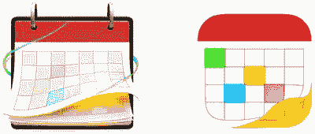

图 4-6。Fantastical Mac 版图标（左）与 Fantastical iPhone 版图标（右）

Fantastical 的 iPhone 图标是兼具简约与精致的绝佳范例。该图标的高品质感来源于设计中的细微之处，例如高对比度色彩、微妙的效果以及具有辨识度的日历设计。在我看来，Fantastical 的 Mac 版和 iOS 版图标都是高效应用图标设计的完美典范，体现了“少即是多”的原则——以视觉冲击力实现极致简约。

#### 创建高效的应用图标与标识

现在进入最后一步：制作一个高效的应用图标。如前所述，当消费者浏览 App Store 列表时，应用图标是你的应用呈现的第一个视觉线索。你的应用图标和名称将是决定用户是否感兴趣并点击进入应用产品页面的关键因素。由于图标代表了应用的品牌形象，其设计必须足够令人难忘且引人注目，才能从竞争对手的图标中脱颖而出。

在第 2 章末尾，我建议你审视竞争对手的应用图标，开始构思自己的应用图标。例如，如果你正在开发一款笔记应用，而大多数同类应用目前都使用与笔记本相关的图标，那么你就不应模仿这种外观。否则，你的应用可能会被视为缺乏原创性，只是跟风之作。但你的应用将会与众不同——更加出色。因此，让你的应用图标通过对比色和原创视觉主题来反映这一点，当它们一同展示在 App Store 列表中时，能让你的应用区别于同类应用。

尽管有些应用图标使用了摄影图像，但你会发现大多数应用采用的是基于插画的图标。照片通常包含过多细节，当缩小到 120×120 像素的小图标时，图像会显得杂乱拥挤。最成功的图标，以及那些与 Apple 新设计方向最为一致的图标，都以其简约、清晰、干净的设计著称，无论尺寸大小，都看起来充满活力且富有吸引力。插画通常能最好地实现这些设计目标。

#### 应用图标规则与工具

许多应用的图标图像看起来很像免版税的剪贴画。使用免版税的图库素材可以作为绘制图标初始原型设计的良好基础，但你最终应根据自己的需求制作原创艺术作品，特别是如果你打算为应用标识和图标注册商标的话。你不能将别人的艺术作品或图像注册为商标，除非你拥有其全部权利。

**应用被拒警告**   请勿在应用图标或 UI 中使用受版权或商标保护的艺术品或名称。这也包括任何 Apple 商标。iPhone 图像严格禁止使用，因此不要将其包含在你的图标或界面设计中。尽管少数精选应用在其应用图标或 UI 图标中展示了 iPhone，但这属于极少数例外。未经 Apple 事先许可而违反此规则，大多数新应用很快就会收到拒绝信。同样需要注意的是，如果你的应用使用了公众人物或名人的未经授权图像，Apple 也会拒绝你的应用。请相信我，Apple 在允许你的应用进入 App Store 前强制执行此规定是在帮你。你最不希望发生的事情就是被某个世界 500 强企业以商标侵权为由起诉。

由于我多年来一直是一名设计师和 Adobe Photoshop 的忠实用户，我将分享一些制作吸睛图标的小技巧。随着设计风格向简约化转变，制作应用图标变得更加容易。这就是设计简单图标的美妙之处。只要掌握一些图层和滤镜技巧，你就能创建出有吸引力的图标。你不需要成为米开朗基罗，但拥有良好的构图感——即如何安排图标的布局——绝对是一项宝贵的特质。但不必担心：即使你的图形技能只停留在幼儿园画作的水平，本章后面的“给艺术挑战者的建议”部分也提供了有用的建议和在线资源链接。

如果你不是一位有天赋的艺术家，那么在你的预算中预留资金聘请一位专业设计师绝对是值得的。经验丰富的图形专家的敏锐眼光将使你的应用图标受益匪浅。再次强调，你的应用图标是整个应用营销策略中非常重要的视觉组成部分。如果你真的想在 App Store 取得成功，聘请专业设计师来开发你的图标、标识，甚至部分 UI 元素，是一项明智的投资。

但如果你是一位预算紧张、苦苦挣扎的独立开发者该怎么办呢？让我们看看你自己能怎样制作出优秀、高质量的图标。

大多数专业设计工作都在 Adobe Illustrator 或 Photoshop (`http://www.adobe.com`) 中完成：

*   Adobe Illustrator 是一款基于矢量的绘图程序，这意味着它创建的插图可以设置为任何尺寸而不会丢失像素质量。它非常适合设计软件图标和标识，因为这些元素可能需要以多种不同尺寸呈现，从小型桌面图标到大型展会海报。
*   Adobe Photoshop 是一款基于位图的图形程序，但也包含许多基于矢量的工具。

我本人偏爱 Photoshop，但大多数设计师可能会推荐使用 Illustrator 来完成此特定任务。而且，由于 Apple 不断推出新的 iOS 设备和屏幕分辨率，创建基于矢量的图标设计能让你在未来灵活处理更大尺寸，同时不牺牲图像质量。

如果 Illustrator 或 Photoshop 的价格超出你的预算，市面上也有更便宜的图形工具可供选择。我推荐`Pixelmator`，它可以在 Mac App Store 上购买。它拥有许多类似 Photoshop 的功能，并且学习曲线更为平缓。但如果你计划为自己的所有软件产品、网站和营销材料创建图形，我强烈建议投资 Adobe 的应用。如果购买 Creative Suite 套装，你可以以优惠的打包价格获得所有 Adobe 最佳设计应用。

在向 App Store 提交应用时，你需要向 Apple 提供一个 1024 × 1024 像素的大图标。因此，如果你在 Photoshop 中创建图标，请确保你的主设计至少这么大。由于你可能也希望在营销材料中使用该图标，你应强烈考虑以更大的尺寸创建主图标。请记住，印刷广告（杂志广告、展会海报等）的分辨率至少应为 300 点/英寸 (dpi)，因此，如果你的最大图标只有 1024 × 1024 像素，那么在 300 dpi 的印刷材料中，你的图标将只有 1.7 英寸。

如果你以几英寸的大尺寸创建主图标，你将始终确保在任何场合都有合适的尺寸。你总是可以将图标缩小以获得出色的效果，但你不能增大现有基于位图的图标尺寸，否则会显得非常像素化。如果你在 Illustrator 中创建基于矢量的图标，则放大或缩小都不是问题。

不要犯仅在 iPhone 5s 或最新的 iPod touch 型号上预览应用图标的错误。在清晰、高分辨率的 Retina 显示屏上，几乎所有东西看起来都很漂亮。还要确保你的设计在最小的主屏幕应用图标尺寸（即 60 × 60 像素，非 Retina）下看起来也很好。诀窍在于让你的图标看起来专业而精致，同时保持足够简单，以便在任何尺寸下都能良好显示。这绝非易事，尤其对于非设计师而言，但我们将通过使用一些巧妙的小图形技巧来尝试一下。

**应用拒绝警告** *你的应用图标和 App Store 图标必须匹配！* 不要试图通过制作一个复杂、精细的 1024 × 1024 图标，然后针对 60 × 60 的应用图标制作一个大幅简化的版本来规避图标易读性问题。图标不需要完全一致，所以如果缩小导致某些元素模糊，你可以对小图标进行细微修饰。但当两者放在一起时，两个图标看起来应该是相同的设计。如果两者之间存在显著差异，你的应用可能会被 Apple 的应用审核团队拒绝。

关于规则和工具的讨论就到这里。让我们开始一些设计工作吧！

#### 设计自定义应用图标

你需要专注于一些本质简单，但同时又能传达应用功能的东西。务必研究竞争对手，让你的应用图标从同类中脱颖而出。在 iOS 7 中，许多知名应用简化了它们的图标以匹配新风格，这一趋势在 iOS 8 中得以延续。图标的风格也取决于你正在制作的应用类型；例如，如果是游戏，你需要确保它有足够的细节来吸引用户的兴趣。图 4-7 展示了 iOS 6 和 iOS 7 版本应用图标对比的示例。

图 4-7。左侧为 Duolingo iOS 6，右侧为 iOS 7。请注意，iOS 7 版本的图标使用了更明亮的调色板，并减少了阴影和细节

##### 开始绘制草图

首先，绘制关于你希望应用图标外观的想法草图。构思出几种不同的变体，直到找到你想要的方向。在构思不同布局时，你可能需要考虑几点。颜色在区分不同应用方面起着巨大作用；确保你在实际应用和图标中的调色板保持一致。如果你有品牌色或标志，请务必将它们融入到应用图标的概念中。你的概念应该传达应用的功能，无论是通过标志还是设计来体现。

##### 使其独一无二

确保你定义了一个既不过于复杂但依然独特的形状或图案。通常，标志会作为应用图标的独特形状，但有时需要自行创建。图 4-8 展示了一些近期应用图标设计的示例。注意这些图标如何将设计聚焦于单一元素，保持简洁和可识别性。

图 4-8。Evernote、Rise、Circle、Deliveries、YouTube（从左至右）

##### 简约之美

在制作图标时，请记住保持简单和切题。确保这一点的一个方法是限制你使用的颜色数量。你还应尽可能避免在图标上使用文字。务必遵循 Apple 最近引入的网格系统，以确保应用图标设计之间更具一致性（参见图 4-9）。这是一个建议指南，并非必须使用。

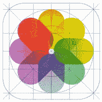

图 4-9。Apple 新引入的网格系统为应用图标带来了统一性

如果你有想要推广的品牌，请务必将你的品牌/标志元素融入应用图标中。作为参考，图 4-10 展示了一些大型零售商如何将他们的品牌融入应用图标。

图 4-10。Target、Twitter、Skype、Google Search 和 Nordstrom（从左至右）

##### 示例应用图标

如果你需要一些资源来帮助你创建不同分辨率的文件，请查看这些由慷慨的开发者捐赠给社区的实用 Photoshop 和 Illustrator 文件：

*   iOS 8 应用图标 PSD 模板：(`http://appicontemplate.com/ios8`)
*   Andex 设计的 iOS 7 应用图标 PSD 和 AI 模板（大致适用于 iOS 8）：(`http://www.andexdesign.com/ios-7-app-icons-template/`)

如果你正在寻找灵感，这里有一个不错的 iOS 应用图标设计汇编：

*   iOS 图标画廊：(`http://iosicongallery.com`)

现在，为了好玩，让我们制作一个天气图标。首先，使用模板并借助网格线来帮助你定位图标元素。在使用 Photoshop 或任何其他程序时，请确保将每个对象都设置为单独的图层。在下面的例子中，有三个主要图层：背景、太阳和云。为什么要费心维护这么多图层呢？将对象分开可以让你轻松移动单个图层或图层组，直到构图看起来平衡和完整。分开的图层还允许你修改每个对象的属性和应用滤镜效果。

第一步是绘制图标轮廓并将其定位到您想要的位置（参见图 4-11）。接着，您可以更改每个图层的颜色，使其更接近您的预期。最后一步通常耗时最长，因为在此阶段需要处理所有微妙的细节。您需要调整图标的渐变程度，使其更贴近 iOS 8 中普遍使用的渐变风格。我已在图标上添加了非常细微的阴影和不透明度，以营造生动而不失平衡的视觉效果，避免过多元素分散用户的注意力。焦点应始终放在您想传达的那一个核心元素上。这里使用的主色是蓝色。请选择一种与您的品牌相匹配且足够醒目的颜色，这样当我在主屏幕上寻找该图标时，就能轻松找到它；例如，我会将紫色与您的应用关联起来。

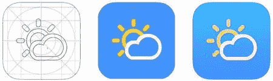

图 4-11。天气应用图标示例。分阶段设计图标：先制作低保真设计，再添加一些颜色，最后用细节完善

我强烈建议在着手制作数字版本的图标之前，先在纸上画出草图，但真正的考验在于将完成的图标缩放至所需尺寸。如果设计在 `1024 × 1024` 像素和 `60 × 60` 像素这两种图标尺寸下都表现良好，那么您就完成了任务。无需担心 iOS 应用图标通常带有的圆角外观。iOS 系统和 App Store 会为您自动添加这些元素。

### 界面设计：像用户一样思考，而非开发者

因为我在本章前面强调了其重要性，所以您已经花时间阅读了苹果的 iOS HIG，对吧？没有？那就去吧。我等着……

您回来了？太好了！既然您已了解苹果为 iOS UI 建议的边界和推荐的设计实践，那么您在开发流程中的第一步就是善加利用这些知识。不，我并不是说现在就要编写代码。请思考您应用的核心功能以及它包含的关键特性。您如何将这些特性集打包成一个紧凑、用户友好的界面，以适应小型移动设备？回答这个问题应是您的首要开发任务。您可能已经是经验丰富的 iOS 程序员，精通 `Objective-C` 和 `Cocoa Touch`（如果您还不精通，Apress 出版了大量优秀的 iPhone 和 iPad 开发书籍可供参考），但许多开发者在将其应用概念转化为直观易用、高效的用户界面时仍会遇到困难。

当您的应用在 App Store 中展示时，用户希望看到的是界面。这是他们使用应用时将要与之交互的前端，因此他们会检查它是否满足其特定需求且易于学习。由于消费者可能有许多替代品可供选择，您的应用需要比竞争对手更具视觉吸引力。这不仅仅是成为功能最多的应用。提供消费者想要的功能最初可能会吸引他们的注意力，但提供最佳整体用户体验的应用才能赢得他们的真金白银。

以下是一些有助于您理解 iOS 设计之道的资源：

*   iOS 设计入门指南（`http://taybenlor.com/2013/05/21/designing-for-ios.html`）
*   Bjango，为 Retina 显示屏进行设计（`http://bjango.com/articles/designingforretina/`）

#### 了解你的用户

暂时摘下您的“开发者帽子”，思考一下您自己的购买习惯。当您比较几款类似的应用以决定购买哪一款时，首先启动的是您的视觉感官。您会查看应用在 App Store 中的截图，甚至可能在开发者的网站上观看视频演示预告片，或者试用免费的精简版。显然，用户评分和评论在您的决策中扮演着重要角色，但假设两款相似的应用提供相同的功能，并且获得了大致相同的五星好评。当并排比较时，如果一款应用界面非常朴实无华，而另一款界面精美且富有吸引力，消费者自然会倾向于视觉上更诱人的那款应用。

这种思维方式不仅仅适用于需要独特界面和原创玩法的游戏。即使您正在开发一款执行平凡任务的实用或效率应用，也不意味着它不能令人兴奋且使用起来充满乐趣。您的用户会因此感激您。

要进入这种思维模式，您应该从编写*用户故事*开始。用户故事本质上是一种练习，有助于您设身处地为用户着想。用户故事的写法如下：“作为一名[某类用户]，我想要[某个目标]，以便[某个原因]。”因此，如果您正在创建一款追踪健身目标的应用，您需要为应用的所有不同任务和用户创建多个用户故事。例如：“作为一名注册用户，我想要能够登录，以便查看我的健身目标和进度。”

这个练习看似重复，但却是许多人所采纳的方法，因为它能确保焦点始终放在用户身上。它还能帮助您将某些任务可视化并确定优先级，这最终将有助于您为用户创造更相关的体验。一旦您竭尽全力创建完这些用户故事，就可以将其作为任务列表和指南，用于决定何时开始您的应用设计和开发。

#### 在纸上绘制你的想法

我见过许多开发者因过于兴奋而只想立即投入应用开发。您首先要做的，是真正从 A 到 Z 地定义您的应用：您想要的功能，您希望用户从中获得什么，他们将如何与它交互，等等。这不必尽善尽美，但一旦您对自己想要的东西有了清晰的愿景，就可以开始思考用户将如何与应用交互。

不要忽视在方格纸上画草图的价值！将您的想法落实到纸上是快速勾勒应用基本外观和感觉的一种方式。您正在设计一款需要完全自定义界面的游戏吗？在纸上绘制您的概念可能是您唯一快速的选项，因为仅使用 `Interface Builder` 中提供的标准控件是无法做到的。先手动绘制草图以解决设计上的问题，然后在 `Photoshop` 或 `Illustrator` 中构建最终的自定义美术作品。

#### 创建应用流程/故事板

您已经定义了用户故事，因此现在对于您希望应用如何运作有了更清晰的想法。如果我正在开发一款健身应用，我会利用我的用户故事开始设想用户如何从一个屏幕导航到另一个屏幕，或者用户如何到达他们想要去的屏幕。

如果您有兴趣找到一种简单的方法来创建这些线框图和用户流程图，我强烈推荐 `Balsamiq Mockups` 和 `Axure` 这类程序。这些工具通常用于原型设计，但也可以帮助开发低保真线框图，从而在您的脑海中描绘出一幅图景。另一个值得在 iPad/iPhone 上尝试的程序是 `Graffio`。它允许您使用标准形状和图标创建视觉流程图，这对于理解您的应用最终将如何运行尤其有用。

厌倦了没完没了地绘制相同的按钮和其他标准界面元素？得益于几位杰出的设计师和开发人员，网上提供了预绘制好的 iPhone 和 iPad 草图模板（参见图 4-12），具体包括：

*   Interface Sketch (`http://www.interfacesketch.com`) 提供 PDF 格式的 iPhone 和 iPad 应用线框图模板，可打印为 Letter 或 A4 尺寸。
*   UI Stencils (`http://www.uistencils.com`) 提供耐用的不锈钢 iPhone 和 iPad 模板。你也可以从网站上下载可打印的 PDF 格式速写本页面。

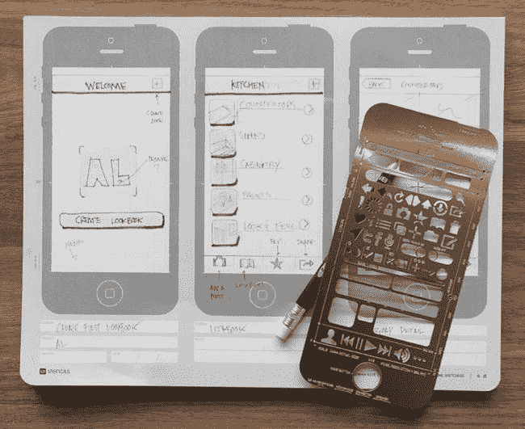

图 4-12. 如果你计划定期设计应用，UIStencils 的线框画板和不锈钢模板绝对值得投资。

#### Illustrator 和 Photoshop 中的精美模型

如果不习惯在纸上绘图，而更擅长使用 Adobe 的 Photoshop、Illustrator 或 Fireworks，那么其他足智多谋的设计师们已慷慨地向 iOS 开发者社区贡献了全面的界面元素集。这些元素被方便地保存在分层文件中，使得创建像素级完美的模型变得极其容易（参见图 4-13）。

*   Meng To 的 iPhone UX 草图线框模板 (`http://blog.mengto.com/how-to-wireframe-an-iphone-app-in-sketch/`)
*   Teehan+Lax 的 iPhone GUI，适用于 Photoshop (`http://www.teehanlax.com/tools/iphone/`)
*   Teehan+Lax 的 iPad GUI，适用于 Photoshop (`http://www.teehanlax.com/tools/ipad/`)

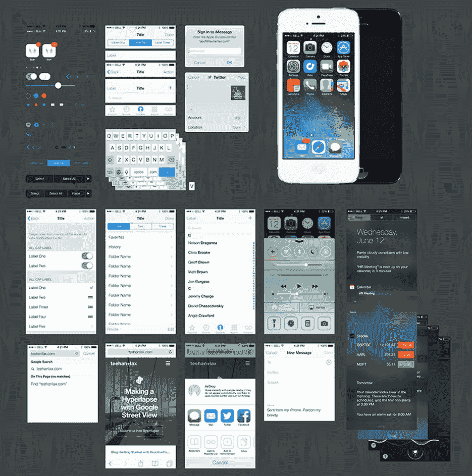

图 4-13. 仅展示了来自第三方设计师的分层 Photoshop 文件和基于矢量的 Illustrator 文件中所提供的众多 iOS 元素的一小部分。

在设计设备上的实际图稿时，请记住始终使用两像素网格系统，以避免在非 Retina 设备上出现任何问题。如果你在 Retina 设备上制作了一个尺寸为 `120 × 51` 像素的按钮，但现在想制作非 Retina 版本，它不能是 `60 × 25.5` 像素。你需要确保在保存非 Retina 图像时，尺寸不会产生半个像素。Eddie Lobanovskiy 的这个指南对于在 Photoshop 中设计应用很有帮助：iPhone 5 网格模板 (`http://dribbble.com/shots/865767-iPhone-5-Grid`)。

#### 用于设计模型的其他软件工具

Balsamiq Mockups (`www.balsamiq.com/products/mockups/`) 是我个人最喜欢的工具之一。它是一个强大、跨平台的 Adobe AIR 应用程序，拥有大量“手绘”风格的 UI 元素工具集，适用于桌面应用和 iOS 应用。这种独特的方法能生成非常干净且专业的模型，同时仍然保留着纸上绘制的感觉。

如果你没有 Photoshop 或 Illustrator 的许可证，或者正在寻找更经济实惠的原型设计选项，以下是一些用于设计模型的其他工具：

*   OmniGraffle (`www.omnigroup.com/applications/omnigraffle/`)：对于 Mac 用户来说，这是一个价格合理的解决方案。虽然最初是作为图表工具开发的，但 OmniGraffle 已成为构建线框图和界面设计模型的热门选择。
*   Graffletopia (`www.graffletopia.com`)：这个第三方网站提供了一个庞大的、由用户贡献的免费 OmniGraffle 模板库。可以下载多个与 iPhone 相关的模板。
*   Keynotopia (`www.keynotopia.com`)：如果你更倾向于在客户会议中使用演示软件，可以看看那些用于制作 iPhone 和 iPad 应用原型的各种 Keynote 模板。

#### 使用移动应用设计应用

当灵感在你离开办公桌时涌现，这种频繁发生的情况该怎么办？一些创新的 iPhone 和 iPad 应用提供了强大的线框和原型制作功能，让你随时随地都能方便、舒适地使用。

如果你对导出模型的 Xcode 项目感兴趣，那么你一定要看看 AppCooker 和 BluePrint。如果你已经是 Mac 版 OmniGraffle 的粉丝，那么 iPad 版 OmniGraffle 对你来说可能是一个显而易见的选择（不过值得注意的是，目前在 `Graffletopia.com` 上可用的一些第三方模板可能不支持当前 iPad 版本的 OmniGraffle）。

以下是一些可用的移动模型制作工具：

*   iPad 版 OmniGraffle (`http://www.omnigroup.com/products/omnigraffle-ipad/`)
*   iPad 版 AppCooker (`http://www.appcooker.com`)
*   iPad 版 Blueprint（iOS 模型）(`http://groosoft.com`)

#### 开始制作原型

当然，如果你只是作为一个独立开发者为自己设计应用，那么这一步可能显得有些多余，特别是当你技术足够娴熟，能在 Interface Builder 中快速拼凑出原型时。但如果你是在为一个以要求无数 UI 更改而臭名昭著的客户合作，那么创建功能性的纸质原型可以让你快速完善设计并获得客户批准，而无需浪费任何实际的编程时间。

原型制作可以揭示应用中笨拙的工作流程和不直观的架构。一个界面构思在脑海中可能是个好主意，但一旦你在纸上绘制出来并仔细审视一个半工作原型后，你可能会改变主意。事实上，有时原型可以引导你产生新想法，最终提升你应用的市场竞争力。至少，原型制作会暴露出过于复杂的操作，促使你寻找新的解决方案来简化用户交互——这对移动应用的成功至关重要。

原型制作还能为你节省大量的开发时间，并防止你编写不可用的代码。“怎么可能呢？”你可能会问。“现在直接跳到 Xcode 开始快速敲出一个简陋的演示不是更快吗？”

如果你是为客户或老板开发应用，他可能希望在批准项目之前看到你的想法。这里的关键词是*看到*。很多时候，许多企业高管——尤其是那些没有创意背景的人——很难想象出一个界面。无论你在会议上多么清晰地表达你的想法，他们就是无法在脑海中描绘出来。将你的界面构思组合成线框图或截图模型，是一种简单且节省时间的方法，能快速向客户或老板展示你的提议。这样，如果他回过头来找你要求大量更改，或者（天哪！）要求方向上的重大转变，你也不会在 Xcode 和 Interface Builder 中浪费大量宝贵时间。

如果你将应用开发外包，那么原型制作在向第三方程序员正确传达你的 UI 构思方面也极具价值，尤其是在存在严重语言障碍的情况下。当他们按小时收费时，你花在解释想法和目标上的时间越少，外包开发的成本就越低。一张图胜千言。

即使你是一个独立开发者，单独开发一个应用，原型制作最重要的好处在于它能在后期的测试阶段为你节省大量宝贵时间并避免潜在的麻烦。你肯定不想花费数月辛勤工作开发一个应用，结果却从测试人员那里收到铺天盖地的反馈，说 UI 难以理解，他们很难弄清楚如何使用应用或访问某些功能。这些问题最好在你的开发进程深入之前就解决掉。

##### 制作一个原型

我个人非常喜欢使用一款名为 POP（纸上原型设计）的应用（见图 4-14）。它仅适用于 iPhone，但能让您用相机拍下 App 草图，并通过这些草图创建一个可运行的 App。您可以快速绘制几个界面，设定屏幕的特定区域链接到其他页面，并设置相应的过渡效果。将原型交给任何用户，就能快速获得反馈。

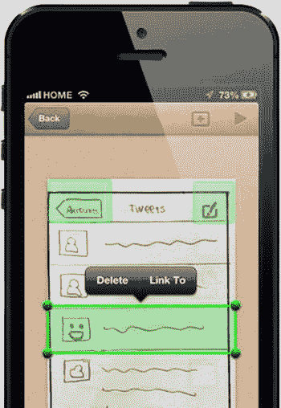

图 4-14. POP——纸上原型设计，目前仅适用于 iPhone/iPod

请记住，归根结底，您的目标是获得有价值的反馈，以提升用户体验。在 App 的整个创建过程中，要尽量多接触用户。根据我的经验，如果我想快速测试某个功能，我会用 POP 或其他软件制作低保真原型。但如果我想针对一个重要的流程获得更深入、更具启发性的反馈，我会将模拟图制作得保真度更高，并让原型具备功能性。

您可以通过仅编写模拟预期操作流程所需的最少 UI 元素代码，快速创建一个 App 的半功能性原型。尽管您可能认为这需要为 App 中的大部分控件编写至少基本的代码，但实际上有很多方法可以“假装”来实现，从而避免编写代码并节省时间。如果您只是想快速在 iOS 模拟器中测试一个 UI 概念，或者编译并分发一个快速原型给其他人以获取反馈，这种方法尤其方便。这一步在发现 App 导航流程中可能存在问题、可能需要简化或精简操作的区域时，具有极大的价值。当您让一个精选的测试小组试用这种早期原型时，您能获得关于哪些界面元素对其他人来说不够直观的重要见解，从而在投入数月时间走向错误方向之前，对设计做出重要更改。

例如，如果您的 App 由导航控制器或标签栏控制器管理，那么在 Interface Builder 中，将该控制器添加到您的窗口中。在 Xcode 中，仅编写实现从一个界面跳转到下一个界面所必需的控制器代码。不必担心在每个界面中重新创建单个 UI 控件。如果您已经在 Photoshop、Illustrator 或其他图形编辑器中创建了 App 各个界面的模拟图，那么只需将这些界面截图并保存为 PNG 文件，再将 PNG 文件导入到您的 Xcode 项目中即可。通过添加带有 `UIImage` 的新子视图来显示每个 PNG 文件，这些临时的 `UIImage` 就可以在 Interface Builder 中作为那些界面的虚拟占位符（见图 4-15）。

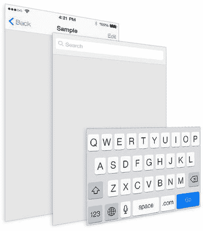

图 4-15. 通过添加从一个界面跳转到下一个界面所需的最少导航代码来创建快速原型。每个界面的子视图可以通过显示您用 Photoshop 制作的界面模拟图的 PNG 文件来模拟，并放置在 `UIImages` 中

通常，导航控制器会配置足够的代码，以便在 App 的各个界面之间切换。在示例中选定的子视图上，添加了一个图像并将其设置为显示 PNG 模拟图——带有模拟文本字段的默认背景。为了给原型增加更多功能，您可以添加几行代码，使得点击该图像时能触发显示一个新的子视图层，该层显示一个模拟 iOS 键盘的 PNG 图片。根据您的需求，您可以决定为原型添加多少额外的交互性。

在测试原型、获得有价值的反馈并对 App 设计进行改进之后，您可以移除少量临时代码和相关的 `UIImage` 元素。现在，您就可以在现有的控制器代码基础上，构建真正的子视图和控件，开始充实您新优化过的 App 架构的界面和功能集了。

另外，如果您已经使用 Photoshop 或类似的图形工具创建了 App 各个界面的 PNG 或 JPEG 模拟图，并且希望在真实的 iOS 设备上预览它们，那么以下解决方案值得探索：

*   Axure RP (`http://www.axure.com`)
*   Briefs (`http://github.com/capttaco/Briefs`)
*   Mockabilly (`http://www.mockabilly.com`)

我强烈推荐从 Axure 开始，因为它既可以制作低保真原型，也可以制作高保真可运行原型。您的原型会生成为 HTML/JS/CSS 文件，您可以在设备上的 Safari 浏览器中运行它们。要了解更多关于如何在您的 iOS 设备上生成原型的信息，请访问 `www.axure.com/learn/iphone-app/viewing-and-settings`。

Briefs 也允许您将交互指定给每个界面的特定区域（例如按钮和表格视图行），以便在设备上进行可用性测试。它是一个强大的工具，并且有一个配套的 iPad 应用。Briefs 作为可视化 App 流程的工具也非常方便。

##### 使用原型测试用户交互

在您创建并调整好设计，最终对自己的界面外观感到满意后，就该启动 Xcode 和 Interface Builder 了。创建一个新的 Xcode 项目后，您可以立即开始工作，在 Interface Builder 中使用真实的 UIKit 组件或您自己的自定义控件重新创建 UI 设计。但是，在您投入过多精力编写大量代码之前，您可能想先测试一下新 UI 设计的可用性。

##### 跳出框架思考

为非游戏 App 创建自定义 UI 可以带来丰厚的回报。为什么只有游戏才能充满乐趣？实用性和效率型 App 同样可以具有视觉吸引力。独特且令人兴奋的 UI 能引起人们讨论，从而为您的 App 带来免费的宣传。Mac OS X 用户见证了这种策略对 Delicious Monster 产生的奇效，该公司凭借其成功的 Delicious Library 软件应用的前沿 UI 取得了巨大成功。

如果您下定决心要创建自定义界面，请记住一个重要规则：不要过度设计。创新是好事，但前提是不能让您的 UI 变得不够直观。对于移动设备上如此小的屏幕而言，少即是多。要特别注意，您的自定义设计不能给界面增加额外的复杂性。

FiftyThree 的 Paper 应用以其完全独特的界面设计打破了常规（见图 4-16）。该应用让用户能够直接启动应用，开始精美地勾勒他们的想法。通过简化 UI 以专注于核心功能，它已成为任何需要绘制草图人士的首选应用。Paper 还融入了独特的手势操作，有助于消除后退、撤销、缩放等操作按钮带来的杂乱感。Paper 曾多次被苹果公司推荐，并获得了苹果设计大奖。

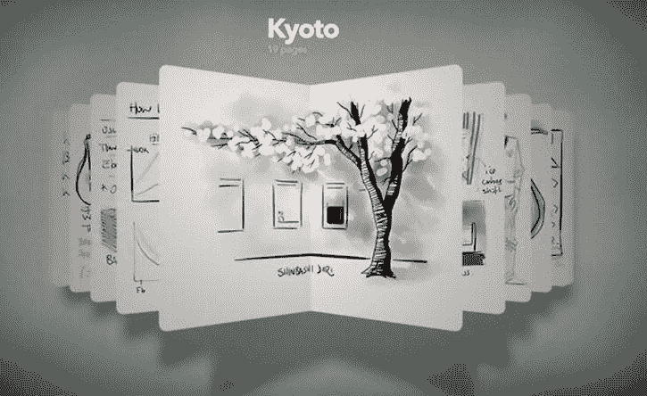

图 4-16. FiftyThree 的 Paper 应用巧妙地平衡了美感与简洁性，提供了令人满意且直观的用户体验

Paper 的设计之所以如此有效且易于使用，是因为其精心打造的 UI 背后是一个极其简单的概念：一系列只需用简单的捏合手势就能打开和关闭的笔记本。因此，即使其界面不同于任何常见的 `UIKit` 元素，每个人都知道如何使用滑动和捏合手势。

另一个很好的例子是雅虎的天气应用，它提供了精美的自定义界面，同时保持着易用性。尽管 App Store 中已经有数十款天气应用，但大多数都没有抓住用户的真正需求。雅虎没有向用户灌输过多信息，而是仅提供用户想要查看的主要信息。用户的通常行为是每天可能打开一次天气应用查看天气预报，本质上只是为了快速了解当天的情况。雅虎还允许用户通过向下滚动来获取更详细的信息（参见图 4-17）。雅虎天气的自定义 UI 成功地在无需额外学习成本的情况下，提供了独特的用户体验。

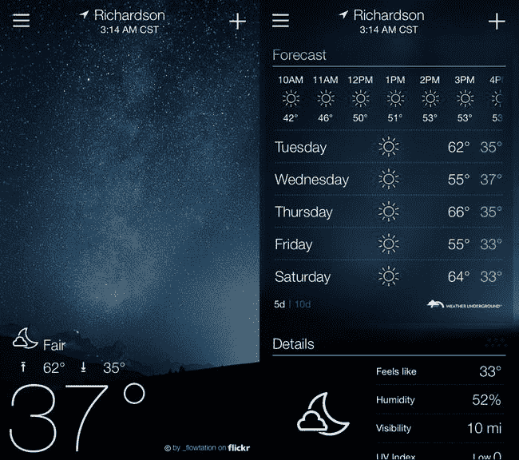

图 4-17. 雅虎天气令人惊艳的 UI 出奇地简洁，同时在一瞥之间提供了用户所需的一切。

只要你避免了那些可能导致应用被苹果拒绝的已知问题，并记住像用户一样思考，维护一个直观且易用的 UI，那么在界面设计上突破常规就能提供有吸引力的用户体验，并有可能获得更多的关注和销量。

有时，为特定页面或应用风格寻找灵感是很困难的。务必看看别人在做什么，并思考如何将富有创意且直观的交互融入到你自己的应用中。我推荐以下网站，以了解最新的应用和模式设计：

- Pttrns (`http://www.pttrns.com`)：iPhone 和 iPad 用户界面模式库
- Pattern Tap Library (`http://www.patterntap.com`)

#### 其他需要考虑的因素

希望现在你对如何着手设计应用有了更好的思路。请记住，视觉设计只是过程的一部分；从长远来看，应用的流程以及与用户的交互方式同样重要，甚至更为重要。一旦你专注于用户，你就可以在前进过程中不断改进设计。我们讨论了你可以为设计做出贡献以及识别优秀设计的方法；现在我们将介绍提升和贡献于设计的其他机会。

#### UIKit 的舒适熟悉感

在选择设计自定义界面而非使用苹果提供的标准 UIKit 控件之前，请确保你有非常充分的理由。如前所述，雅虎天气应用中的自定义控件有助于强化其独特的交互，同时忠实于类似 UIKit 组件的熟悉功能，例如屏幕右上角和左上角的导航元素。雅虎的设计意图似乎得到了很好的体现和印证，但请不要为了耍小聪明而重头造轮子。

如果你正在构建一个复杂、功能丰富且旨在存储大量数据的应用，你可能需要三思而后行，再引入带有新视觉隐喻的自定义 UI。如果你的应用界面显得过于杂乱和复杂，你就有让用户不知所措的风险。你的自定义设计元素可能因为你创建了它们而感觉直观，但对于新用户来说，你独特的视觉效果可能会显得陌生和令人困惑。任何导致用户沮丧的事情都可能导致负面的客户评分和评论，这显然不利于你的应用销售。

由于已有数千款应用使用了苹果的标准 UIKit 框架，用户已经知道如何操作那些标准组件。通过依赖 UIKit，你的应用可以最大限度地降低新用户的学习成本。这使得人们能够专注于应用的核心功能，而不会在琢磨如何使用你的界面上陷入困境。

苹果在其原生界面元素上投入了大量心思，以确保它们以高度紧凑、精简的方式在视觉上传达其功能。如果你不能创造出比 UIKit 已包含的组件更好的东西，那就不要这样做。

#### 可扩展性

在设计界面时，可扩展性是一个需要牢记的重要因素。如果你的应用有四个不同的部分，那么标签栏控制器似乎是方便访问每个部分的最佳 UI 选择。但在你决定走这条路之前，请考虑你为未来更新规划的功能。如果你计划以后集成更多部分，标签栏控制器可能不是最佳选择，因为在竖屏模式下它只能舒适地显示四到五个标签。为了给你的应用留出未来发展的空间，你可能需要考虑使用表格视图来列出这些部分。

可扩展性是你 UI 设计每个方面都需要考虑的因素，因为你不想因为空间不足，而在 2.0 或 3.0 版本中被迫彻底更改界面。要求你的客户在习惯了你原始 UI 之后再去学习如何使用新 UI，只会让他们感到厌烦。这甚至可能让你失去一些因为沮丧而决定改用竞品应用的客户。

如果你对在应用中使用 UIKit 元素感兴趣，但又担心界面看起来与其他类似应用太像，你可以采取一些措施来让你基于 UIKit 的界面变得独特。让我们来看看几个选项。

#### 图标与图像

你在应用界面中使用的图标和图像，对于赋予应用独特的视觉标识可以产生巨大的影响。尽量不要为你的图标使用剪贴画素材，这只会让 UI 显得廉价。你需要所有图标在设计上保持一致，而不是来自不同风格的杂七杂八的剪贴画集合。你也不希望任何用户认出你的图标是他们在其他地方见过的剪贴画，因为这会自动降低你应用的感知质量。

如果你自己没有设计能力来创作自己的艺术作品，正如我前面说过的，我强烈建议聘请一位专业的平面设计师。如果你已经请人创建了应用图标和 Logo，可以看看同一个人是否也能为你设计 UI 图标和图像，以实现一致的整体主题。

通常，图标与某个结果动作相关联。例如，当你显示一个垃圾桶图标时，它通常指的是删除操作。你的设计应该平衡图标和文字，文字仅用于向用户传达该图标将产生的动作。就像我们之前讨论过的，你会注意到图标用于标签栏，但对于全局导航，通常只会有像`Edit`或`Logout`这样的文字。

设计图标绝非易事，尤其是你试图通过点击图标来传达将要发生的整个动作或事件。当前的趋势是使用线型图标，或者说是内部为空且有描边的图标。你需要为每个图标制作两个版本：一个是空心的且带有描边，另一个是实心的。前者传达未选中状态，后者传达选中或已选择状态。我不是在重复老生常谈，但这又是一个简洁性最能确保用户轻松理解每个图标含义的场合。向选定的用户群体展示一个粗糙的原型，有助于找出用户难以识别的图标，这样你就可以在开始对成品应用进行 Beta 测试之前，相应地修改图标的设计。

#### 为多个 iOS 设备目标设计时

在为多个 iOS 设备目标设计时，您可能会发现，将 Retina 显示屏的工具栏和标签栏图标缩小以适配旧款 iPhone 和 iPad 时，效果并不理想。将一个本已小巧的白色图标进一步缩小，有时会使图标的某些元素显得模糊。我常常发现，为了针对每种目标尺寸完善图标，我最终要么在调整大小后对图标进行一些润色工作，要么干脆针对较小的尺寸从头重新创建。没错，这确实增加了不少额外工作，但从长远来看，为了让我支持的所有 iOS 设备上的应用更加美观，多花些时间是值得的。

**应用审核拒绝警告**：仅以用户预期的方式使用系统提供的图标。苹果在 iOS SDK 中慷慨地包含了多个图标供开发者在自己的应用中使用，例如“添加”、“撰写”、“回复”、“操作”、“搜索”等等。这可以避免你为那些已被苹果系统图标覆盖的常见任务创建自定义图标。请记住，苹果提供这些图标是为了在所有使用它们的应用中代表一致的行为。在你的应用中使用这些系统图标时，请确保你以它们预期的方式使用，否则你的 App Store 提交可能会被迅速拒绝。例如，不要将“回复”图标用作返回按钮，也不要使用“书签”图标来打开电子书。

#### 导航栏颜色

你可以通过 Xcode 轻松修改导航栏的颜色，这也是苹果希望开发者摆脱使用图像转而采用的方式。当你为应用定义了一种合适的颜色后，就可以在 Xcode 中进行设置。通过调整 `tintColor` 函数，你可以设置导航栏或工具栏上的任何文本或图标。

如果你浏览一下 App Store，你会注意到最近很多应用都专注于一种设定好的颜色，并在整个应用中保持其一致性。图 4-18 展示了一些示例，说明颜色在定义应用外观和感觉方面扮演着多么重要的角色。

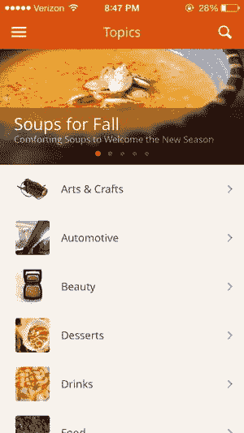

图 4-18. Snapguide 应用使用橙色工具栏和米白色背景图片来强化其品牌色彩

要设置导航栏和工具栏组件的颜色，首先在 Interface Builder 中打开您的 `.xib` 文件，并在检查器面板中选中导航栏或工具栏，使其属性可见。然后，在“属性”下，将“样式”（Style）保持为“默认”（Default），并使用“颜色选择器”（Color Picker）按钮将“色调”（Tint）更改为您想要的颜色。

如果您为导航栏和/或工具栏使用了自定义颜色，您可能还需要将视图的背景从默认的蓝色/灰色修改为您选择的新颜色或图像。

#### 使用文本

当屏幕分辨率或屏幕尺寸发生变化时，文本的使用似乎得到了优化。那些对图像依赖较少，而使用颜色和排版来吸引用户的应用更具适应性和可扩展性。当苹果推出配备 Retina 显示屏的 iPhone 4 时，许多开发者花了很长时间才将应用中的所有图像以旧分辨率的两倍重新制作。

因此，正如你应该拥抱颜色一样，也应该拥抱文本，以及它如何通过充当操作指令在吸引用户方面发挥重要作用。这也有助于避免为特定操作选择合适图标的困境。例如，要访问筛选界面，可以显示一个漏斗图标，但用户可能难以识别它，因为设备上没有与筛选操作相关联的既定标准图标。如果你仅用 *filter*（筛选）这个词来替换它，你就消除了用户的任何困惑，同时你也与 iOS 7 引入的设计变更保持一致。

#### 无障碍设计

另一个需要考虑的重要视觉设计因素是苹果的无障碍功能——“白底黑字”。它允许任何 iPhone 或 iPad 用户在任何应用中更改显示，使之成为黑底白字。启用后，这种高对比度功能会反转屏幕颜色，使某些视障人士更容易阅读文本。作为开发者，你应该在“白底黑字”模式下测试应用界面设计，以确保界面保持可读性，并且其可用性不会因颜色反转而受到影响。看起来 iPhone 模拟器不支持“反转颜色”模式，所以目前，你需要在一台真实的 iOS 设备上测试你的应用。在“设置”面板中，选择“通用”，然后选择“辅助功能”，最后将“反转颜色”开关轻点至“开”。

另一个常被软件开发人员忽视的重要主题是色盲。虽然完全色盲的情况很少见，但世界上有相当大比例的人口患有某种形式的色觉缺陷。这意味着他们的眼睛能看到全彩，但无法区分某些关键颜色，比如红色和绿色。尽管很少有女性表现出色觉问题，但你是否相信高达 8% 的男性存在某种形式的色觉缺陷？具体来说，大约每 12 名欧洲裔男性中就有 1 人患有色觉缺陷。考虑到许多 iOS 开发者专门为男性用户群体制作游戏和其他应用，在设计界面时意识到色觉缺陷问题，对于让你的应用尽可能覆盖最广泛的受众至关重要。

以下是一些用于检查无障碍性的有用资源：

-   **Vischeck**（`http://www.vischeck.com`）：所有软件开发人员都应该访问这个网站。它提供了有用的在线工具，用于揭示你应用中的颜色问题。将你的界面截图上传到在线 Vischeck 模拟器中，看看你的 UI 设计在色觉缺陷者眼中会是什么样子。将截图上传到在线 Daltonize 工具中，可以针对三种最常见的色觉缺陷校正你的界面颜色。该网站还提供 Vischeck 模拟器的免费 Photoshop 插件下载，可以直接在 Photoshop 中测试你的界面截图。
-   **适用于 Mac OS X 的 Sim Daltonism 色盲模拟器**（`http://michelf.com/projects/sim-daltonism/`）：这款由 Michel Fortin 开发的节省时间的桌面应用程序是一个简单的浮动调色板，允许你实时测试你的 iPhone 应用界面。在 iPhone 模拟器中运行你的 Xcode 项目，同时在屏幕一侧运行 Sim Daltonism 浮动调色板。从调色板菜单中选择一种色觉缺陷类型，然后将鼠标指针移到 iPhone 模拟器上，即可在调色板窗口中看到应用 UI 在色觉缺陷者眼中的样子。（如果你觉得 Sim Daltonism 有用，可以到 Michel 的网站上在线捐款，以支持其持续开发。）

#### 给艺术创作困难者的建议

自己动手的方法并不适合所有人，尤其是在设计像 iOS 应用图标、标志和 UI 的自定义艺术作品这样重要的东西时。请记住，Photoshop、Illustrator、Pixelmator 及其他图形程序仅仅是工具。这些工具的效用完全取决于你的使用能力。要善用这些工具，你必须具备创造力和耐心，将脑海中的想法转化为屏幕上的实际像素。需要一些帮助吗？在此，我将推荐一些省时的解决方案和资源，或许能为你提供所需的助力。

##### 寻找图形和图标

在寻找适合应用工具栏和标签栏的预制图标吗？对您来说很幸运，有许多专门为 iOS 应用设计的第三方图标集。这些图标集免版税且价格低廉（或免费），非常适合预算有限的商业应用项目。图形资源以位图图像、矢量图像或两者兼有格式提供，因此您一定能找到一些不错的图标来增强应用的用户界面。以下是一些资源：

- `Glyphish Icons` (`http://glyphish.com`)
- `Pictos Interface Icons` (`http://pictos.drewwilson.com`)
- `Default Icon Repository` (`http://www.defaulticon.com`)

就全色图标（用于表格视图和其他相关 UI 元素）而言，有几十个网站提供图标设计教程、免费库存图标、商业图标集和自定义图标设计服务。

如果您确实找到了一些想在应用中使用的免费库存图标，请务必检查许可条款，以确保这些图标免版税且可用于商业软件。有些免费图标需要在您的应用或文档中注明设计者。

此外，如前所述，如果您决定在 iOS 应用中使用库存图标，请考虑修改它们，以便您的应用保留独特的感觉（前提是您仍然遵守相关的许可条款）。您不希望因为使用人们已在其他软件和网站上见过无数次的相同库存图标，而降低应用质量的感知度。以下是一些精选的在线资源：

- `Icon Archive` (`http://www.iconarchive.com`)
- `FreeIconsWeb` (`http://www.freeiconsweb.com`)
- `The Noun Project` (`http://www.thenounproject.com`)
- `iStockphoto` (`http://www.istockphoto.com`)

**注意**  尽管大多数人都知道`iStockphoto`是购买廉价库存照片的地方，但它也拥有丰富的精美矢量背景图像和图标库。

#### 选择字体

对于大多数 iPhone 和 iPad 应用，使用原生的 iOS 系统字体就足够了，因此字体许可将不成问题。如果您正在开发一款在界面图形中使用特殊字体的游戏、儿童应用或娱乐应用，您需要确保所选的特有字体具有可承受的许可条款。只要允许用于商业项目，免版税字体显然是最具成本效益的。

请仔细关注您想使用的每种自定字体的许可协议。乍一看，许多字体库似乎是免费或免版税的，但通常细则会指定仅供个人使用，而商业用途（如网站、软件等）则需要单独的许可（且价格更高）。在您为 iOS 应用购买专用字体之前，请做好功课。

以下是一些可供探索的字体目录：

- `dafont.com` (`http://www.dafont.com`)
- `MyFonts` (`http://www.myfonts.com`)
- `Discover Fonts` (`http://www.discoverfonts.com`)
- `Fonts.com` (`http://www.fonts.com`)
- `FontSpace` (`http://www.fontspace.com`)
- `UrbanFonts` (`http://www.urbanfonts.com`)

#### 添加音频

如果您正在构建游戏或娱乐应用，音频通常是其娱乐性的重要因素。如果您不是声音设计师，或者没有什么作曲和编辑音频的经验，您可能需要雇佣某人来制作音乐和音效提示。如果您负担不起雇佣数字音乐家或声音设计师，您可以考虑许可库存音效库。与字体一样，请确保您购买的任何库存音频或音乐都是免版税并且已获商业使用许可。

以下是一些音频和音乐目录：

- `AudioJungle` (`http://audiojungle.net`)
- `iStockphoto Audio Tracks` (`http://www.istockphoto.com/audio`)
- `The Music Bakery` (`http://www.musicbakery.com`)
- `StockFuel` (`http://stockfuel.com/stock_audio.html`)
- `Soundrangers` (`http://www.soundrangers.com`)

#### 使用专业设计服务

如果创建图稿或自定义音频对您来说异常困难，那么与其让这种体验变得极其沮丧和得不偿失，您或许应该考虑雇佣一名专业设计师。如果您的应用可能会因您自身的创作局限而受到影响，请勿屈从于任何自负的想法，认为您必须创造并控制设计和开发过程的每个方面。应用的成功至关重要。

了解自己作为开发者的局限性将使您能够自由地引入外部帮助，从而构建出质量最佳的应用。即使将工作委托给专业设计师，您仍然负责项目。

如果钱是个问题，那么就发挥创意。您有任何专业设计师可能需要的才能吗？也许设计师需要一些网站或软件编程方面的帮助？如果是这样，那么就有机会进行服务交换。

另一种选择是用一小部分应用销售收入来换取设计师的持续图形支持。从本质上讲，设计师正在成为合伙人，共同分担风险。如果应用未能吸引到受众，那么参与其中的人都不会赚钱。一些设计师，取决于他们的空余时间，可能不愿意接受这种赌博。即使您有一个很好的概念，他们可能也倾向于提前获得报酬。但如果利润分享是您的最佳选择，提出这个方案也无妨。

在本书范围内，无法列举出所有专业设计服务和自由职业艺术家。以下是一些值得考虑的值得注意的资源：

- `They Make Apps` (`http://theymakeapps.com`)
- `99designs` (`http://99designs.com`)
- `oDesk` (`http://www.odesk.com`)
- `Elance` (`http://www.elance.com`)
- `Guru.com` (`http://www.guru.com`)
- `Get Apps Done` (`http://www.getappsdone.com`)

在探索外包市场、在线搜索引擎甚至本地黄页时，永远不要满足于找到的第一个列表。请直接或通过开发者邮件列表和在线论坛向同行征求推荐。您想从其他开发者那里了解哪些公司和顾问在图标、标志、音乐、音效和其他外包创意元素的设计工作上是值得信赖和受人尊敬的。即使找到了喜欢的设计师，也请要求查看她的作品集，以确保她的设计风格和技能能够将您的特定愿景变为现实。

与设计师合作时，沟通是关键。尽管他们可能技艺精湛，但他们无法读心。您提供给他们的关于创意需求的信息越多，他们就越有能力准确交付您想要的东西。我们涵盖了线框图、原型设计和模型，所有这些都有助于您更好地理解您的应用，同时也对您需要向他人解释应用流程时很有用。

#### 创意助推

哇，一个章节中包含了这么多信息！您现在是否充满了新想法和足够的灵感，可以启动您自己的应用界面设计工作了？很好！将您的 iOS 应用转变为强大的营销工具并不止于此。

