# 第五章

## 社交植入：在应用中推广您的应用

基于第四章将您的应用转变为其自身营销强机的探索，本章将进一步引导您。您将学习如何集成便捷的分享和社交媒体元素，例如应用内电子邮件、Twitter 和 Facebook。您还将探索在应用内优雅地鼓励 App Store 用户评论的策略，以及通过应用内交叉推广和第三方社交游戏平台来提高应用发现度的技巧。本章的示例代码演示了如何实现这些不同要素以获得有效结果。

### 在应用中鼓励用户评论

为了完善应用的用户体验，您投入了大量工作，希望您的努力能带来销量和正面的客户评价。


#### 在运行时征求反馈

正如我在前几章中提到的，在 iOS 4 之前，当用户从主屏幕删除应用时，苹果会自动提示用户先为该应用评分。虽然这是征求客户反馈的一种便捷方式，但这显然不是询问意见的最佳时机。如果用户选择删除你的应用，那么他很可能不喜欢它，或认为它没有用。无论哪种情况，如果他真的选择发布评分，很可能是个负面评价。

值得庆幸的是，苹果在 iOS 4 中移除了那个删除时评分的功能。但即使有了这个受欢迎的改进，不满意的用户通常也比满意的用户更有动力主动前往 App Store 并手动发布评论。他们心中有不满，想让所有人都知道。接下来，我们考虑如何鼓励那些对你的应用感到满意的用户进行评分。

我们都深知，App Store 中的客户评分和评论会极大地影响应用的销量。甚至还有各种传言称，在 iOS 7 中，评论会影响你的应用在特定搜索词上的排名。那么，开发者该如何应对这种对负面反馈的偏重呢？显然，首要答案是打造一款深思熟虑、精良完善的应用。但除此之外，你还能做什么呢？

何不在应用内部提示你的满意用户给出积极反馈呢？这就像让你的应用显示一个自定义的 `UIAlertView`，请求喜欢该应用的用户为其评分一样简单。你只需几行代码就能做到这一点。

首先，启动 Xcode 并创建一个新的 iPhone 项目，使用“基于视图的应用”模板作为基础。（如果你更倾向于针对 iPad 设备，也可以轻松地将其创建为 iPad 项目。）我们将项目命名为 `AskForRating`。在这个示例中，你只需在 `AskForRating` 项目的主屏幕上添加一个按钮。在你自己的应用中，你可能希望通过在“设置”或“信息”屏幕上包含一个按钮，让用户在任何时候都可以选择为你的应用评分。

接下来，你需要在 `AskForRatingViewController.h` 头文件的 `@interface` 调用中添加对 `UIAlertViewDelegate` 的引用。你还需要为稍后将在 Interface Builder 中创建的按钮添加一个 `IBAction` 方法。你的 `AskForRatingViewController.h` 文件现在应包含以下代码：

```
#import <UIKit/UIKit.h>

@interface AskForRatingViewController : UIViewController <UIAlertViewDelegate> {

}

- (IBAction)buttonPressed:(id)sender;

@end
```

保存该文件后，打开 `AskForRatingViewController.m` 实现文件并添加以下代码：

```
- (IBAction)buttonPressed:(id)sender {
    UIAlertView *buttonAlert = [[UIAlertView alloc] initWithTitle:@"帮忙宣传" message:@"如果你喜欢这个应用，请在 App Store 中为它评分。谢谢！" delegate:self cancelButtonTitle:@"稍后再说" otherButtonTitles:@"立即评分", nil];
    [buttonAlert show];
    [buttonAlert release];  // 此行可删除
}

- (void)alertView:(UIAlertView *)alertView clickedButtonAtIndex:(NSInteger)buttonIndex {
    if (buttonIndex == 1) {
        NSURL *url = [NSURL URLWithString:@"你的 APP STORE URL"];

NSURL *url= [NSURL URLwithString:@" http://itunes.apple.com/WebObjects/MZStore.woa/wa/viewContentsUserReviews?pageNumber=0&sortOrdering=1&type=Purple+Software&mt=8&id=你的应用 ID
"];
        [[UIApplication sharedApplication] openURL:url];
    }
}
```

`(IBAction)buttonPressed` 方法接收按钮点击动作，并显示 `UIAlertView`，请求用户为应用评分。当用户在 `UIAlertView` 对话框中选择“稍后再说”或“立即评分”按钮时，会调用 `alertView` 代码。如果选择了“立即评分”按钮，则会启动你的 App Store URL，将用户直接引导至你的应用在 App Store 中的页面。

别忘了将占位符字符串 `"YOUR APP STORE URL"` 替换为你独特的 App Store URL。

**提示** 要获取正确的 App Store URL，只需在 Mac 版桌面 iTunes 中找到你的应用，从“购买”按钮旁边的弹出菜单或按住 Ctrl 键点击应用图标时出现的上下文菜单中选择“复制链接”，然后将其粘贴到代码中的 URL 字符串里。

在 Xcode 中保存文件，然后继续最后一项任务：创建你的按钮。双击 `AskForRatingViewController.xib` 文件以在 Interface Builder 中打开它。向视图中添加一个“圆角矩形按钮”。将按钮标题重命名为 `为这个应用评分`。如果需要，你也可以创建自己的自定义按钮。然后将按钮的“Touch Up Inside”连接器连接到文件所有者的 `buttonPressed` 连接器。保存并关闭 XIB 文件。

如果你在 iOS 模拟器中运行你的 Xcode 项目，你会看到按下 `为这个应用评分` 按钮会成功弹出一个 `UIAlertView` 对话框提示你为应用评分（参见图 5-1）。然而，如果你点击“立即评分”按钮，App Store URL 将无法在 iOS 模拟器中加载，因此你需要在真实的 iPhone、iPad 或 iPod touch 上测试你的应用，以确保它能正确地在设备上的 App Store 中获取你的应用页面。

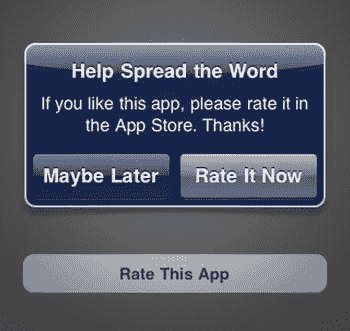

图 5-1. 通过内置的自定义提示鼓励用户为你的应用评分

请注意我们示例中 `UIAlertView` 的措辞。通过使用标题“帮忙宣传”作为行动号召，你是在邀请粉丝们帮助推广你的应用。而消息“如果你喜欢这个应用，请在 App Store 中为它评分”，则是专门针对你的满意用户。当然，这并不能阻止讨厌你的人使用这个功能，但这种措辞确实定下了一个积极的基调。甚至取消按钮也被标记为“稍后再说”，让用户知道他们的反馈随时都受欢迎。

#### 何时请求评分

尽管我们之前的示例提供了一个不错的解决方案，但它仍然是被动的，依赖于用户点击 `为这个应用评分` 按钮来启动操作。如果你将按钮放在“设置”或“信息”屏幕上，用户可能只有在寻找关于应用的帮助时才会偶然发现它。而如果他们正在寻求帮助，可能已经很沮丧了——这时候向他们索要评论可不是个好时机。

你想在用户心情最好的时候请求他们为你的应用评分，比如当他们正在享受你的应用时。你可能需要考虑采取更主动的姿态，在战略性的时刻显示你的 `UIAlertView`，例如：

- 使用几天后，如果用户还没有删除你的应用，他们一定在其中发现了某些积极的价值。包含代码来检查 `NSUserDefaults`，在应用启动时确定应用已安装了多少天。根据你的应用可能被使用的频率（每天或每周），选择一个合适的时间弹出评分请求对话框——也许在安装后 5 到 15 天。
- 如果你的应用是游戏，可以在用户感觉良好时显示评分请求对话框，比如在完成一个困难关卡或获得高分之后。
- 如果它是一个生产力应用，你可能希望在用户有积极成就感时显示评分请求对话框——比如在写完一份文档、编辑完一张照片、勾选完任务列表等等之后。

Lima Sky 广受欢迎的《涂鸦跳跃》在游戏主菜单屏幕上使用了一个有趣的弹出横幅图片来征求积极的 App Store 评分（参见图 5-2）。注意横幅中显示的五颗星，暗示着对好评的请求。你可以看到标题“喜欢《涂鸦跳跃》吗？”专门针对这款游戏的快乐用户。这些是微妙但有效的策略，能够激励用户提供帮助。


### 优化排版后的内容

图 5-2. Lima Sky 在《 doodle Jump》中自定义了应用评分请求，以匹配游戏的趣味风格

无论采用哪种方法，都要注意不要过于激进。如果你不断向用户索要评分而惹恼他们，这一策略会适得其反。被你惹恼的用户会发表负面评分，抱怨他们多么讨厌被纠缠着提供反馈。为了获得最佳效果，只在一处或极少数精选位置请求一次。如果用户选择了“稍后再说”，他们随时可以通过访问“设置”或“信息”屏幕上的`评分此应用`按钮，在方便时对你的应用进行评分。

如果你希望在特定天数之后和/或应用启动一定次数后提示用户，但不想花时间实现额外的代码并使其支持多任务处理，可以查看 Arash Payan 的开源`Appirater`类，网址为 `http://github.com/arashpayan/appirater/`。（如果你觉得免费的`Appirater`代码有用，可以下载他的 iPhone 应用 Jabeh 作为回报。）

#### 通过应用内邮件和社交网络“告诉朋友”

与`评分此应用`按钮的概念类似，你也可以在应用中包含一个`告诉朋友`按钮，让你的客户能够向他们的朋友和家人推荐你的应用。这是一种经典的草根营销方式。通过为用户提供便捷的选项来讨论你的应用，你便主动迈出了一步，希望通过已被验证的口碑力量来增加应用的曝光率和销量。没有什么比来自可信赖同伴的推荐更能有效地销售产品了。

你想提供哪些选项？你可以使用 iOS SDK 的应用内邮件功能，直接从应用内部发送电子邮件，因此这是一个既简单又强大的功能。而随着 Twitter 和 Facebook 成为如此受欢迎的社交网络平台，你可能需要考虑也对这些平台提供支持。在 iOS 7 中，通过内置的 Social Framework，这变得前所未有的简单。只需几行代码，用户就可以通过 Tweet 和 Facebook 帖子谈论你的应用。如果操作得当，由此产生的流量绝对物超所值。

#### 使用第三方网络服务

如果你决定连接第三方网络服务，首先需要阅读 API 许可协议，以确认它允许你在商业移动设备软件应用中访问该 API。即使它允许商业使用，也要考虑到该公司的条款未来可能会发生变化，或者它可能停止运营，迫使你移除该功能。如果你的应用将支持的 Web 服务作为按钮列在`UIActionSheet`上，那么你可以在未来的应用更新中灵活地轻松移除其中一个按钮。

除了许可条款之外，第三方网络服务还可能进行 API 变更，从而破坏你的应用，导致你不得不匆忙向 App Store 提交一个新的修复更新。还记得 Twitpocalypse 事件吗？那是 2009 年 6 月一次 Twitter API 变更，曾短暂地导致许多 iPhone Twitter 客户端应用无法使用。与你网站上可以即时发布新软件下载不同，你可能需要等待数天，让你的更新版本通过 App Store 的审核流程，之后客户才能使用。

依赖第三方网络服务还会使你容易受到任何 API 中断或因服务器维护、错误或流量过大而出现的故障的影响。你需要以防御性编码方式编写应用，以便在支持的服务暂时不可用时能够优雅地处理。如果你的应用的社交网络功能无法正常运行，而应用未能通知用户第三方服务已宕机，他们会自动认为问题出在你的应用上，而不是 Twitter 或 Facebook。

Web 服务提供了非常适合移动应用消费的精彩内容，但在决定你的应用有多少功能将依赖第三方网络服务时，务必将这些潜在问题牢记在心。

#### 通过应用内分享连接用户

闲话少说，让我们动手尝试一点代码，好吗？在 Xcode 中创建一个新项目，但这次选择“基于窗口的应用程序”模板，并在其产品下拉菜单中选择“通用”，并将其命名为`TellAFriend`。这样，你可以为 iPhone 和 iPad 使用相同的共享代码，同时你将看到界面在两个设备上略有不同。

在开始处理`TellAFriend`的主要功能之前，你首先需要进行一些基础 UI 元素的设置。由于许多应用使用标准的操作按钮来呈现这类分享功能，让我们构建一个带有操作按钮的导航控制器。这需要几个额外的步骤，你可以按照以下步骤操作，或者从本书配套的代码示例中下载完成的项目，网址为 `http://iPhoneBusinessBook.com/` 或 `http://www.apress.com/`。

在 Xcode 项目中选中*Shared*文件夹，选择“文件  新建文件…”，然后添加一个带有 XIB 文件和 `.h` 文件的新`UIViewController`子类。将新类命名为`RootViewController`，先将其放在一边。我们稍后会用到它。

打开`AppDelegate_iPhone.h`文件，添加两行新代码（以粗体显示）：

```
#import <UIKit/UIKit.h>

@interface AppDelegate_iPhone : NSObject <UIApplicationDelegate> {
    UIWindow *window;
    UINavigationController *navigationController;
}

@property (nonatomic, retain) IBOutlet UIWindow *window;
@property (nonatomic, retain) IBOutlet UINavigationController *navigationController;

@end
```

你还需要将这些粗体代码行添加到你的`AppDelegate_iPad.h`文件中相同的位置。这段代码用于我们即将添加到用户界面中的导航控制器。

接下来，打开`AppDelegate_iPhone.m`文件，用几行新代码修改其内容（以粗体显示）：

```
#import "AppDelegate_iPhone.h"
#import "RootViewController.h"

@implementation AppDelegate_iPhone

@synthesize window;
@synthesize navigationController;

#pragma mark -
#pragma mark Application lifecycle

- (BOOL)application:(UIApplication *)application didFinishLaunchingWithOptions:(NSDictionary *)launchOptions {

[self.window addSubview:navigationController.view];

[self.window makeKeyAndVisible];

return YES;
}
// 对于 ARC，可以移除这个 DEALLOC
- (void)dealloc {
    [navigationController release];
    [window release];
    [super dealloc];
}

// 此文件中还包含了其他几个默认的应用程序方法，
// 为了节省页面空间我们在此代码清单中省略了它们，
// 但请勿从实际文件中移除它们。

@end
```

与头文件一样，你还需要将这些粗体代码行添加到你的`AppDelegate_iPad.m`文件中的相同位置。这段新代码本质上是将导航控制器的视图添加到窗口并显示它。

现在，所有代码基础工作已经完成，在 Interface Builder 中打开`MainWindow_iPhone.xib`，并添加一个`UINavigationController`。将应用委托的引用出口`navigationController`连接到`UINavigationController`。然后，在属性检查器面板中选择`UINavigationController`的视图，将视图的 NIB 名称指定为`RootViewController`，并选中“从 NIB 调整视图大小”选项（参见图 5-3）。并且，在身份检查器面板中，将类设置为`RootViewController`。保存该文件。然后对`MainWindow_iPad.xib`文件执行相同的步骤。

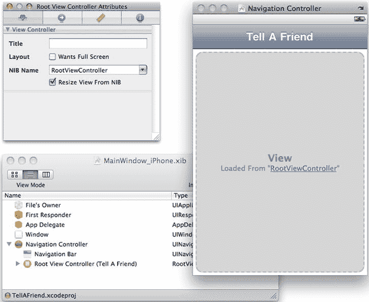

图 5-3. 在 Interface Builder 中为 iPhone 用户界面设置导航控制器。在这个通用应用示例中，也需要为 iPad 用户界面执行相同的步骤


```markdown
您希望应用包含一个“推荐给朋友”按钮，该按钮会显示一个带有邮件、Twitter 和 Facebook 等不同选项的 `UIActionSheet`。为什么要使用 `UIActionSheet`？它允许您通过一个按钮添加“推荐给朋友”功能，从而避免对现有界面设计造成干扰。同时，它将所有支持的社交网络服务整合到一个列表中，方便按需添加或移除选项。想要支持其他社交平台？只需在 `UIActionSheet` 中增加一个按钮，而无需改动应用的主要 UI 设计。

打开 `RootViewController.h` 头文件，将代码修改如下：

```
#import <UIKit/UIKit.h>

@interface RootViewController : UIViewController <UIActionSheetDelegate> {

}

- (IBAction)showShareOptions:(id)sender;

@end
```

注意新增的对 `UIActionSheetDelegate` 的委托引用，以及您将在 Interface Builder 中创建的按钮对应的 `IBAction` 方法。保存该文件，然后打开 `RootViewController.m` 实现文件。将代码修改如下：

```
#import "RootViewController.h"

@implementation RootViewController

- (void)viewDidLoad {
    [super viewDidLoad];

// 在导航栏中添加操作按钮。
    UIBarButtonItem *actionButton = [[UIBarButtonItem alloc] initWithBarButtonSystemItem:UIBarButtonSystemItemAction target:self action:@selector(showShareOptions:)];
    self.navigationItem.rightBarButtonItem = actionButton;
    [actionButton release];
}

- (IBAction)showShareOptions:(id)sender {
    // 操作按钮被点击，显示操作列表。
    UIActionSheet *actionSheet = [[UIActionSheet alloc] initWithTitle:@"喜欢这个应用？推荐给朋友！" delegate:self cancelButtonTitle:@"稍后再说" destructiveButtonTitle:nil otherButtonTitles:@"发送邮件", @"发布到 Twitter", @"分享到 Facebook", nil];
    [actionSheet showInView:self.view];
    [actionSheet release];   // 可移除

}

- (void)actionSheet:(UIActionSheet *)actionSheet didDismissWithButtonIndex:(NSInteger)buttonIndex {
    if (buttonIndex != [actionSheet cancelButtonIndex]) {
        if (buttonIndex == 0) {
            // 在此处添加邮件代码。
        }
        if (buttonIndex == 1) {
            // 在此处添加 Twitter 代码。
        }
        if (buttonIndex == 2) {
            // 在此处添加 Facebook 代码。
        }
    }
}

- (void)didReceiveMemoryWarning {
    [super didReceiveMemoryWarning];
}

- (void)viewDidUnload {
    [super viewDidUnload];
}

- (void)dealloc {
    [super dealloc];
}

@end
```

在 `viewDidLoad` 中，一个操作按钮被动态添加为导航栏的右侧按钮。由于 `RootViewController` 在 iPhone 和 iPad 界面中都是分配给导航控制器的视图，因此这个新操作按钮会同时显示在 iPhone 和 iPad 版本的应用中。

如果用户点击操作按钮，会调用 `showShareOptions` 方法。正是在这里，您会显示一个标题为“喜欢这个应用？推荐给朋友！”的 `UIActionSheet`，其中包含邮件、Twitter 和 Facebook 按钮（见图 5-4）。作为 `UIActionSheetDelegate`，当用户从操作列表中选择一个选项时，`RootViewController` 会收到通知。用户的选择会通过操作列表的 `didDismissWithButtonIndex` 事件进行捕获。

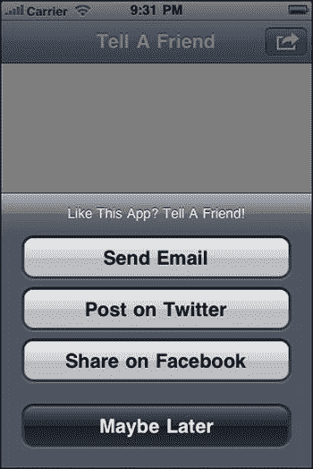

图 5-4。在 iPhone 上运行的“推荐给朋友”示例应用

在 iPad 上运行该应用时，您会注意到 `UIActionSheet` 会以 iPad 专属的弹出窗口形式显示（见图 5-5）。系统会忽略“稍后再说”（取消）按钮，因为点击弹出窗口外的任意位置即可关闭弹出窗口。

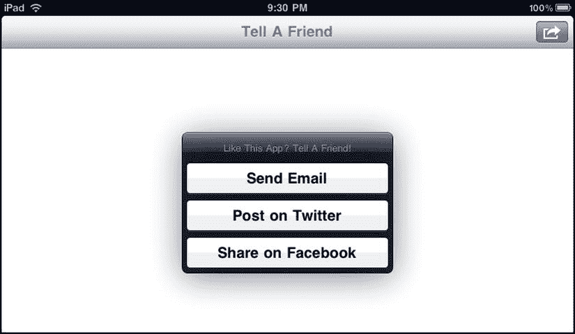

图 5-5。在 iPad 上运行的同一个“推荐给朋友”示例应用

点击“发送邮件”、“发布到 Twitter”或“分享到 Facebook”按钮目前没有任何反应，只会关闭 `UIActionSheet`，这是因为您尚未添加相关功能。接下来进入下一步……

### 添加邮件支持

“推荐给朋友”应用的基本框架搭建完成后，现在需要为“发送邮件”按钮添加功能。iOS SDK 包含对应用内邮件功能的框架支持，允许用户直接在您的应用内撰写和发送邮件！苹果公司让开发者可以相对轻松地实现应用内邮件功能，因此添加此功能所需的精力比您想象的要少得多。

在编写任何代码之前，必须先将所需的 MessageUI 框架添加到 Xcode 项目中。要添加它，请按住 Ctrl 键点击项目的 `Frameworks` 文件夹，在出现的上下文菜单中选择“添加”→“现有框架”（见图 5-6）。从出现的列表中选择 `MessageUI.framework`。

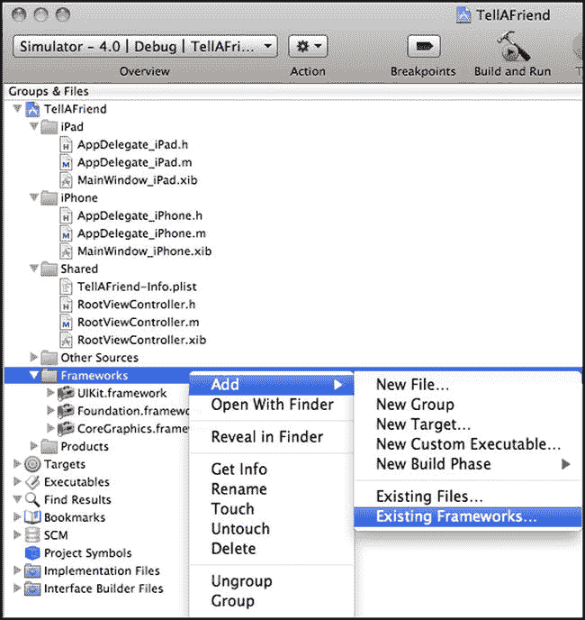

图 5-6。要添加新框架，请从上下文菜单的“添加”子菜单中选择“现有框架”，然后从出现的列表中选择 `MessageUI.framework`

一旦将 `MessageUI` 框架包含到项目中，您就可以着手编程了。打开 `RootViewController.h` 头文件，将代码修改如下：

```
#import <UIKit/UIKit.h>
#import <MessageUI/MessageUI.h>
#import <MessageUI/MFMailComposeViewController.h>

@interface RootViewController : UIViewController <UIActionSheetDelegate, MFMailComposeViewControllerDelegate> {

}

- (IBAction)showShareOptions:(id)sender;
- (void)showMailComposer;

@end
```

从以粗体高亮显示的新代码元素可以看出，已导入 MessageUI 框架类，在 `@interface` 中新增了一个邮件委托，并且引用了一个 `showMailComposer` 函数。保存该文件。

现在打开 `RootViewController.m` 实现文件，在不更改现有代码的情况下，添加以下两个方法：

```
// 在应用内显示邮件撰写界面
// 并填充所有邮件字段。
- (void)showMailComposer {

Class mailClass = (NSClassFromString(@"MFMailComposeViewController"));
    if (mailClass != nil) {
        // 测试以确保设备已配置为可发送邮件。
        if ([mailClass canSendMail]) {

MFMailComposeViewController *picker = [[MFMailComposeViewController alloc] init];
            picker.mailComposeDelegate = self;

[picker setSubject:@"看看这个很酷的新应用！"];

// 填充邮件正文
            NSString *emailBody = @"来看看这个适用于 iPhone、iPad 和 iPod touch 的酷炫新应用——现在已在 App Store 上线！\n\n 面包屑 - 停车位置记录器\n\n 观看视频并了解更多信息，请访问：\nhttp://www.breadcrumbsapp.com/";
            [picker setMessageBody:emailBody isHTML:NO];

[self presentModalViewController:picker animated:YES];
            [picker release];

} else {
            // 设备未配置为可发送邮件，通知用户。
            UIAlertView *alertView = [[UIAlertView alloc] initWithTitle:@"无法发送邮件" message:@"此设备尚未配置为可发送邮件。" delegate:self cancelButtonTitle:@"好的，稍后再试" otherButtonTitles:nil];
            [alertView show];
            [alertView release];
        }
    }
}

// 当用户点击“取消”或“发送”时关闭邮件撰写界面。
- (void)mailComposeController:(MFMailComposeViewController*)controller didFinishWithResult:(MFMailComposeResult)result error:(NSError*)error
{
    NSString *resultTitle = nil;
    NSString *resultMsg = nil;
```


`switch (result)`
```
{
    case MFMailComposeResultCancelled:
        resultTitle = @"邮件已取消";
        resultMsg = @"您已选择取消发送邮件";
        break;
    case MFMailComposeResultSaved:
        resultTitle = @"邮件已保存";
        resultMsg = @"您已将邮件保存为草稿";
        break;
    case MFMailComposeResultSent:
        resultTitle = @"邮件已发送";
        resultMsg = @"您的邮件已成功发送";
        break;
    case MFMailComposeResultFailed:
        resultTitle = @"邮件发送失败";
        resultMsg = @"抱歉，邮件编写器出现故障。请重试。";
        break;
    default:
        resultTitle = @"邮件未发送";
        resultMsg = @"抱歉，发生错误。您的邮件无法发送。";
        break;
}
```

```
// 通过警告视图通知用户收到的任何邮件编写器错误。
UIAlertView *mailAlertView = [[UIAlertView alloc] initWithTitle:resultTitle message:resultMsg delegate:self cancelButtonTitle:@"好的" otherButtonTitles:nil];
[mailAlertView show];
[mailAlertView release];
[resultTitle release];
[resultMsg release];
[self dismissModalViewControllerAnimated:YES];
```

让我们逐步分析这段新代码，以便你准确了解其运行机制。`showMailComposer` 函数负责完成撰写邮件并显示在新嵌入的 `MFMailComposeViewController` 中的所有繁重工作。在此示例中，邮件内容为告知朋友查看 App Store 中的虚构应用 Breadcrumbs，并且还包含一个指向官方网站的链接。为用户提供所有这些内容使得分享变得极其方便和简单。用户只需在“收件人”字段中输入朋友的电子邮件地址，然后轻点“发送”按钮即可（请参阅插图 5-7）。

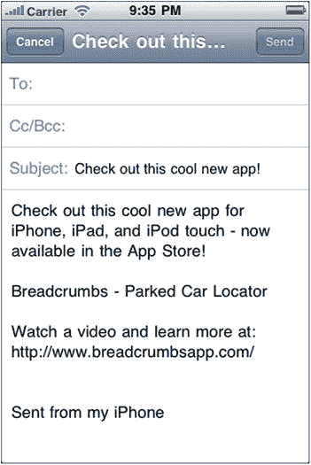

插图 5-7。当用户轻点“发送电子邮件”按钮时，邮件编写器将显示在应用内

继续向下看，`showMailComposer` 方法的下方是 `mailComposeController` 事件，当用户按下 `MFMailComposeViewController` 的“取消”或“发送”按钮时，系统会调用该事件。这是添加代码以通知用户其邮件操作状态的地方。从列出的代码可以看出，你可以测试接收到的结果以获取邮件的状态，然后向用户报告邮件已成功送达，或者由于某种原因发送失败。

**提示** 经常向用户提供状态更新是一个好习惯，尤其是在通过在线连接发送数据时。如果用户点击“发送”按钮后，`MFMailComposeViewController` 在没有进一步通信的情况下被关闭，用户就会一直等待，并疑惑邮件是否已送达。在示例 `mailComposerController` 事件中，如果收到的结果表示成功送达，则通过 `UIAlertView` 通知用户。如果邮件无法发送，也会通知用户。在你为避免 App Store 中出现负面客户评价而不懈努力的过程中，传达邮件操作的当前状态将有助于防止用户感到沮丧。

最后一部分是让“发送电子邮件”按钮在被点击时调用 `showMailComposer` 方法。通过在操作表的 `didDismissWithButtonIndex` 事件中添加一行代码即可轻松实现（请参阅以粗体突出显示的代码）：

```
- (void)actionSheet:(UIActionSheet *)actionSheet didDismissWithButtonIndex:(NSInteger)buttonIndex {
    if (buttonIndex != [actionSheet cancelButtonIndex]) {
        if (buttonIndex == 0) {
            // 应用内邮件，需要 iOS 3.0 或更高版本
            [self showMailComposer];
        }
        if (buttonIndex == 1) {
            // 在此处添加 Twitter 代码。
        }
        if (buttonIndex == 2) {
            // 在此处添加 Facebook 代码。
        }
    }
}
```

在 iOS 模拟器中运行 `TellAFriend` 项目时，应用会报告你的邮件已成功发送，但实际上它并不会真正发送你的消息。为了获得最佳效果，请在至少已在“邮件”应用中设置一个电子邮件帐户的实际 iOS 设备上测试你的应用内邮件代码。

就是这样！与你获得的功能相比，为应用添加应用内邮件支持实际上只需要很少的代码行。

### 集成 Twitter 和 Facebook

除了发送邮件，你可能还想让用户能够将消息发布到他们的 Twitter 和 Facebook 帐户。虽然用户直接推广你的应用是好事，但另一种更微妙的方式来提高应用的知名度，是将社交网络与你的应用的其他核心功能深度集成。例如，如果你正在构建一个游戏，让用户能够通过 Twitter 和 Facebook 分享他们的高分，不仅能在玩家之间产生协同效应，还可能吸引想要参与其中的新客户。Lima Sky 的 Doodle Jump 包含一个无缝的用户选项，用于通过 Twitter 和 Facebook 分享高分（请参阅插图 5-8）。

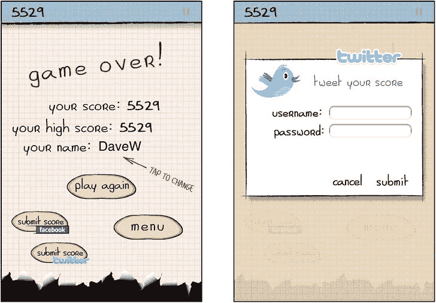

插图 5-8。在 Lima Sky 的 Doodle Jump 中完成一局游戏后，会提示用户通过 Twitter 和 Facebook 分享他们的高分

发布的消息内容如下：“我刚刚在 #DoodleJump 中达到了 5,529 分！！！来超越我吧！ `http://bit.ly/DoodleJump-App`。”

除了炫耀你的高分，它还向任何认为自己能超越的人发起挑战，并附上 Doodle Jump 在 App Store 中的便捷链接。这是一个很好的方式，让你的客户在忙于与朋友分享高分时，帮助推广和销售更多的游戏副本！

社区建设的一个更全面的扩展是集成当前可用于 iOS 游戏的众多社交游戏平台之一，正如本章后面所讨论的那样。现在，我们先来看看 Twitter 和 Facebook。

在构建像上面那样的预填充推文时，请确保使用合适的主题标签和好的 URL 跟踪器，例如 `goo.gl`。这将显示点击链接的人数，你就能看到你的用户为你推广应用的效果如何。与此同时，使用好的主题标签有助于新用户通过浏览标签来发现你的应用。

#### 访问 Twitter 的 API

社交框架在 iOS 5 中引入，并在 iOS 6 中进行了扩展，允许你仅用几行代码集成 Twitter 和 Facebook。

请查看此链接以获取更多信息：`https://dev.twitter.com/docs/ios`。

Twitter API 通过 OAuth 执行身份验证，这使 Twitter 能够知道已发布推文的来源。如果你希望推文的来源归属显示为“来自 [*我的应用名称*]”，则需要向 Twitter 注册你的应用。已注册的应用会获得一个唯一的 API 密钥和秘密令牌，以便在向 Twitter 发布内容时正确标识自己。

在 `http://dev.twitter.com/apps/new` 向 Twitter 注册你的应用。

#### 使用适用于 iOS 的 Facebook SDK

与我们讨论过的 Twitter 集成方式类似，Facebook 也有一个非常相似的方法，可以使用社交框架进行简单的帖子发布。如果你想深入探索更多功能，Facebook SDK 是你的首选工具。


好的，作为高级文档工程师和翻译员，我将严格遵循您的注意事项和示例格式，将给定的英文文本翻译成中文。


Facebook 允许 iOS 开发者使用其开源 Objective-C 软件开发套件（SDK）来访问其平台，该 SDK 可从 `http://github.com/facebook/facebook-ios-sdk` 获取。能够访问你的好友列表及其个人资料信息，并实时与他们连接，可将 Facebook 平台的全部能力引入你的 iOS 应用。

仅仅为了让用户向他们的 Facebook 页面发布状态更新，就将如此庞大的框架集成到你的 Xcode 项目中，或许显得有些大材小用。但如果你正在开发一款 iOS 游戏或任何类型的点对点社区应用，你很快就会发现自己在项目的其他部分也需要使用更多的 Facebook 功能。

在你的 iOS 应用中使用 Facebook SDK 之前，需要获取一个 API 密钥和一个密钥令牌，以便对你的 Facebook 请求进行身份验证。这要求你拥有一个自己的有效 Facebook 账户。登录你的账户后，访问 Facebook 开发者创建应用页面（`http://www.facebook.com/developers/createapp.php`）并注册你的应用。

在设置新的 Facebook 应用时，请务必为其赋予与你正在构建的 iOS 应用相同的名称，因为当用户从你的 iOS 应用发布状态更新时，该应用名称将作为来源列出。与应该向 Twitter 注册你的应用同理，这是一种巧妙但有效的方式，可以让你的应用名称显示在用户的 Facebook 页面上——这对你的应用来说是极好的曝光机会。

一旦你的新 Facebook 应用在 Facebook 开发者网站上创建完成，该应用的资料页将会列出你唯一的 API 密钥和密钥令牌。请将这两个文本字符串保存在安全的地方，因为在你自己的 iOS 应用中定制 Facebook 代码时会用到它们。

**应用拒绝警告** 你的应用必须在在线连接尝试失败时通知用户。如果你的应用依赖于与第三方网络服务的连接，你必须包含适当的错误处理代码，以便在连接或数据请求失败时，你的应用能优雅地处理故障并通知用户当前状态。如果错误的数据请求导致你的应用冻结，或者让用户等待却没有任何状态提示，App Store 审核团队很可能会拒绝你的提交。如果你为审核过程提供了一个演示账户，请确保该演示账户能正常工作！或者提供两个演示账户，以防其中一个在审核期间出现故障。同样，一个良好的实践是，始终在应用需要在线连接时通知用户，尤其是考虑到 iPad 和 iPod touch 设备可能并不总是连接到 Wi-Fi 网络。

现在，你已经准备好将社交网络集成到你自己的 iOS 应用中了！请参照 `MGTwitterEngine` 和 Facebook iOS SDK 附带的文档和示例代码，看看能否在现有的 Tell A Friend 示例项目中添加对发布到 Twitter 和 Facebook 的支持。我相信你很快就能让它跑起来！

### 使用 ShareKit

如果你觉得深入研究 `MGTwitterEngine` 和 Facebook iOS SDK 过于复杂或耗时，那么你很幸运。备受尊敬的开发者 Nate Weiner 制作了一个交钥匙式的开源类库，名为 `ShareKit`，它支持一系列服务，例如电子邮件、Twitter、Facebook、Delicious、Google Reader、Tumblr、Pinboard、Instapaper 和 Read It Later。除了分享 URL，`ShareKit` 还支持分享图片、文本和文件。因为它是开源的，其用户界面是可定制的，并且任何人都可以随时向 `ShareKit` 添加服务。从 `http://www.getsharekit.com/` 下载 `ShareKit`。

既然你已经创建了 Tell A Friend 示例项目，让我们逐步完成将 `ShareKit` 添加到项目的过程（或者你可以从本书的配套代码示例中打开已经完成的 Tell A Friend with ShareKit 项目）。你需要将项目的基础 SDK 设置为 iOS 4 或更高版本。由于这是一个通用应用，通过将项目的 iOS 部署目标设置为 iOS 3.2，仍然可以支持运行 iOS 3.2 的 iPad。

下载 `ShareKit` 后，在 Xcode 中打开 `ShareKit` 示例项目，并将其 `ShareKit` 文件夹（位于 `Classes` 组内）拖入你打开的 Xcode 项目。当提示时，请确保勾选“将项目复制到目标组文件夹（如果需要）”。`ShareKit` 还需要一些额外的 Apple 框架。你应该已经从之前的应用内邮件示例中包含了 `MessageUI` 框架。使用相同的方法，添加 `SystemConfiguration` 和 `Security` 框架。完成后，你的项目的 Groups & Files 列表应类似于图 5-9 所示。

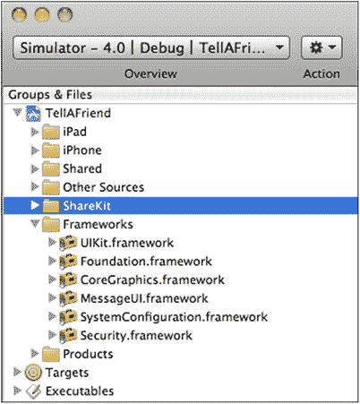

图 5-9. 向你的项目添加所需的框架和 ShareKit 类

在前面的章节中，我提到需要向 Twitter 和 Facebook 注册你的应用，以获取 API 密钥和密钥令牌。使用现成的 `ShareKit` 并不能免除你这两项任务。你需要将这些唯一的 API 密钥存储在 `ShareKit` 的 `SHKConfig.h` 文件中。Nate 已在该文件中以代码注释的形式包含了详细的说明，使得这一步尽可能易于遵循。

最后但同样重要的是，从项目的操作按钮调用 `ShareKit`。为此，打开 `RootViewController.m` 文件，并在顶部添加以下代码行，以导入 `ShareKit` 的头文件：

```
#import "SHK.h"
```

接下来，删除 `showShareOptions` 方法中的现有代码，并将其替换为以下新代码（以粗体显示）。这将分配要发布的文本和 URL，并启动 `ShareKit` 的自定义操作表。

```
- (IBAction)showShareOptions:(id)sender {
    // Action button was tapped, so launch ShareKit.

    // Create the item to share (in this example, a url)
    NSURL *url = [NSURL URLWithString:@"http://breadcrumbsapp.com/"];
    SHKItem *item = [SHKItem URL:url title:@"Check out Breadcrumbs, the new parked car locator app for iPhone and iPad!"];

    // Get the ShareKit action sheet
    SHKActionSheet *actionSheet = [SHKActionSheet actionSheetForItem:item];

    // Display the action sheet
    [actionSheet showFromToolbar:self.navigationController.toolbar];
}
```

既然所有工作都由 `ShareKit` 来完成，你就不再需要之前添加的任何用于处理 `UIActionSheet` 和应用内邮件的代码。现在可以从 `RootViewController` 类中安全地移除所有这些未使用的代码。当运行 Tell A Friend 应用时，你不再看到原始的 `UIActionSheet` 实现，而应看到 `ShareKit` 的自定义操作表（见图 5-10）。

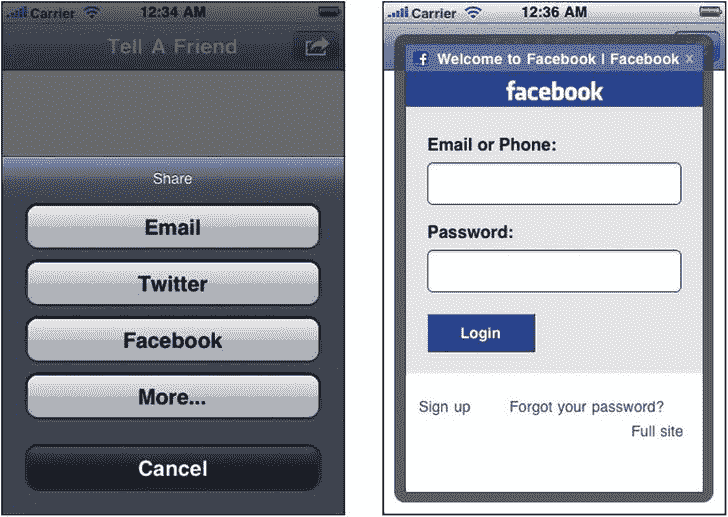

图 5-10. 将 Tell A Friend 应用配置为使用 ShareKit 后，你应该能够将数据发布到 Facebook 和其他几个社交网络服务

**提示** 当你阅读本书时，可能会有更新版本的 `ShareKit` 可用。由于 `ShareKit` 持续不断地增加新功能和服务，我强烈建议你从其官方网站（`http://www.getsharekit.com/`）下载最新版本的 `ShareKit`，并在你计划提交到 App Store 的应用中使用它。与此同时，不妨给 Nate Weiner 发一封电子邮件，感谢他出色的开源贡献，并告诉他你的哪些应用使用了 `ShareKit`。

### 人多力量大：通过应用内交叉推广建立协同效应


#### 应用内交叉推广的成功之道

Optime Software 旗下应用成功的一个重要因素，便是其对应用内交叉推广的大量运用。当用户启动 Optime 的一款免费广告支持型应用时，一个启动画面会短暂出现。在用户等待应用加载的过程中，启动画面不仅会推广当前免费应用的高级版本，还会列出 Optime 的其他几款免费应用（见图 5-11）。列出的每个应用都是一个实时链接。点击该应用名称，便会跳转到 App Store 中相应的页面，以便用户了解详情并进行下载。

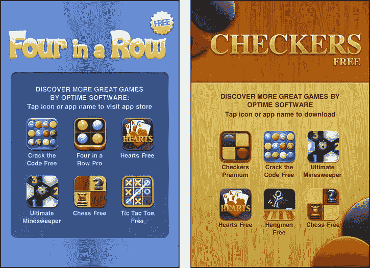

图 5-11. Optime Software 免费应用的启动画面有效地交叉推广了其其他应用

虽然 Optime Software 通过在应用内广告网络中交叉推广其应用，使销售额增长了四到五倍（这将在第 7 章中探讨），但其自身的应用内交叉推广也被证明是提升现有用户对其所有免费应用认知度的宝贵方法。下载量越多，公司最终从广告收入和高级应用销售中获得的收益就越多。

“启动画面交叉推广对我们来说是一种非常有效的工具，” Optime Software 的创始人兼 CEO Jon Schlegel 表示。“我们会追踪启动画面广告的点击率，但不会追踪转化率。我们某些启动画面广告的点击率高达 10%。不过，启动画面广告的点击率往往会随着时间的推移而下降，因为普通用户会逐渐适应这些广告并开始忽略它们。我们正在研究如何让启动画面广告更具动态性，以提高其效果。”

**应用被拒警告**   尽管苹果的 iOS 人机交互指南（HIG）表示不赞同使用启动画面做广告，但在 App Store 的无数应用中，这种做法似乎很普遍。然而，当你通过 iTunes Connect 提交应用时，如果因为启动画面而被拒，那就说明你的做法有些过头了。如果你确实在应用中使用了启动画面，那么在提交之前，请确保它不会在屏幕上停留过长时间，并且不要进行过于直白生硬的推销。由于启动画面处于审核流程中那个神秘的灰色地带，因此，在设计启动画面作为交叉推广工具时，务必小心谨慎，使其在视觉上保持有效的同时，又不会过于引人注目。

许多游戏发行商选择了另一种方法，即在应用的主屏幕上放置一个“更多游戏”按钮。在某些应用中，点击“更多游戏”按钮会在移动版 Safari 中打开发行商的网站。这会让用户离开他们正在玩的游戏，这绝非最佳体验。

#### 开店设铺

为了让用户更沉浸于应用之中，NimbleBit 选择在其游戏中嵌入自定义的“应用商店”。点击其应用中的“更多游戏”按钮，会显示 NimbleStore 屏幕，该屏幕会交叉推广其所有可用的应用（见图 5-12）。点击 NimbleStore 屏幕上的应用图标，不会自动将用户重定向到 App Store 中的相应页面，而是会显示该应用的一个嵌入式自定义屏幕。这使得 NimbleBit 能够定制其增强版的销售宣传，并提供指向其 App Store 页面的链接。

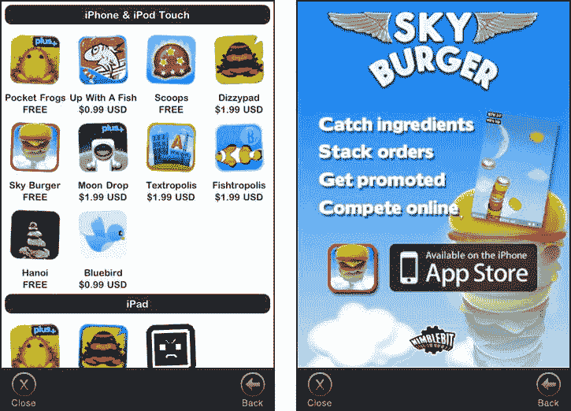

图 5-12. 在 NimbleBit 的游戏中点击“更多游戏”按钮，会显示其嵌入式的 NimbleStore，该商店通过视频预告片等素材交叉推广其全部应用目录

嵌入式 NimbleStore 的精妙之处在于它是一个托管在`UIWebView`中的远程迷你站点。这不仅允许 NimbleBit 修改位于`http://m.nimblebit.com/`的 NimbleStore 页面，而无需更新 iPhone 和 iPad 游戏本身，还让公司能够使用 Google Analytics 追踪用户正在访问哪些商店页面。根据 NimbleBit 的统计数据，大约 85% 访问其应用内 NimbleStore 的用户会继续浏览某个特定的游戏页面。仅在最初的九个月内，NimbleStore 就获得了略高于 160 万的页面浏览量，并促成了 13,170 份游戏销售！

远程托管的 NimbleStore 使 NimbleBit 能够根据地区和限时优惠动态调整定价。苹果倾向于拒绝那些显示应用定价的应用，所以我不确定 NimbleBit 是如何逃脱这一特定限制的（除非远程托管页面是其中的区别）。因此，为了安全起见，你在自己的应用内交叉推广中可能不应列出价格。

当用户选择从 NimbleStore 购买应用时，点击“App Store”按钮会将用户引导至 iTunes App Store 完成购买。正如任何聪明的 iOS 开发者都会设置的那样，所有重定向到 App Store 的链接都是 iTunes 联盟链接，因此，每当用户购买 NimbleStore 中列出的任何游戏时，NimbleBit 都能获得联盟佣金。iTunes 联盟计划还使 NimbleBit 能够追踪所赚取的佣金，从而报告通过 NimbleStore 引导购买的游戏总数。

NimbleStore 中列出的“我们喜爱的应用”游戏（如 Harbor Master）并非 NimbleBit 的游戏。虽然这些特定的购买不会给 NimbleBit 带来 App Store 的版税，但能为公司赚取联盟佣金。因此，如果你的应用数量不足以填充你自己的嵌入式迷你商店，你总是可以列出一些来自其他发行商的你最喜欢的应用。你既支持了同行开发者，又能从推荐中获得一点收益。你将在第 6 章中了解更多关于 iTunes 联盟计划的信息。

如果你只有少数几个应用，并且更愿意将交叉推广努力局限于精简版应用的“关于”屏幕（你目前在那里向上销售付费版本），那么请注意不要过分稀释你的营销信息。如果鼓励用户升级到付费版本是你的首要任务，请确保同一屏幕上关于你其他应用的任何提及都不会抢了付费版本销售宣传的风头。

#### 联合则兴

如果你喜欢在应用中集成自己的迷你商店以交叉推广其他应用的想法，但又没有足够多的应用来填充它，那么可以考虑与少数几位同行开发者合作。当多个开发者在其所有应用中集成一个共享的“社区”商店时，你将从一个内容丰富的店面中受益。同时，你还能获得增强的协同效应，不仅在你自己的应用内，还能在这个社区网络的所有其他应用中进行交叉推广。这对所有参与的开发者来说都是一个双赢的局面。

这正是几位独立的 iOS 游戏开发者联合起来组建 App Treasures 时想要实现的策略。最初参与 App Treasures 的开发者包括 The Blimp Pilots (Koi Pond)、Imangi Studios (Harbor Master)、Snappy Touch (Flower Garden)、Streaming Colour Studios (LandFormer) 和 Veiled Games (Up There)。他们将 App Treasures 这个标签定位为消费者可以信赖的质量保证。如果玩家喜欢其中一款游戏，他们很可能也会喜欢 App Treasures 家族中的其他游戏。


`App Treasures`可从所有参与游戏的“更多游戏”按钮中访问，它是一个嵌入式视图，用于展示这些开发商的应用程序。如 iPad 版`Harbor Master HD`中所示（参见图 5-13），在“更多游戏”屏幕上，`App Treasures`按钮与`Imangi Studios`推广的应用程序并列显示。

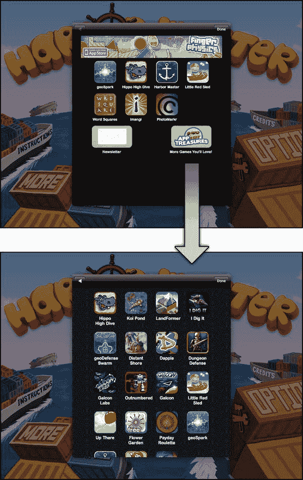

图 5-13：在任何参与开发者的应用中探索“更多游戏”部分，以访问交叉推广的`App Treasures`屏幕。

由于应用商店的游戏类别通常由`Electronic Arts`和`Gameloft`等大型游戏发行商主导，小型独立开发者认为他们更难获得同等程度的曝光度。`Imangi Studios`的首席执行官`Keith Shepherd`表示，`App Treasures`“是我们整合资源、成为更大玩家的方式，同时保持我们的独立性，且没有与发行商合作所带来的任何弊端和附加条件。”

这种共享式交叉推广网络的价值在于，当某个合作伙伴的应用成功时，其他合作伙伴也能从曝光度的提升中受益。当`Harbor Master`迅速攀升至应用商店前 25 名时，嵌入式`App Treasures`屏幕每天多达 10,000 次浏览，这导致其他列出的`App Treasures`游戏销量激增。

如果你觉得在应用网络中交叉推广自己的游戏这个概念很有吸引力，但你并不认识其他开发者，或者没有时间构建自己的应用内迷你商店，那么有一些第三方解决方案可用。其中一种替代方案是`PlayHaven`，这是一项免费的移动推广服务，它提供现成的、嵌入式应用目录，其外观和功能与`NimbleBit`和`App Treasures`使用的自定义目录相似。你可以通过`http://www.playhaven.com/`注册`PlayHaven`。

使用`PlayHaven`的好处是，随着越来越多的应用开发者加入这项免费服务，网络不断壮大，发现你列出的游戏的潜在受众群体也会越来越大。当一些参与游戏成为畅销品时，比如`The Playforge`的`Zombie Farm`，尤其如此。这些热门作品极大地增加了点击“更多游戏”按钮、浏览`PlayHaven`网络以及查看一些不太知名游戏的用户数量（参见图 5-14）。

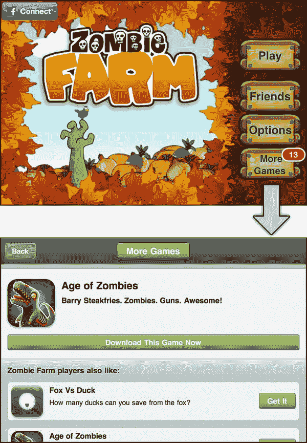

图 5-14：`PlayHaven`提供免费的应用内交叉推广服务，让你的游戏在其整个参与应用网络中获得曝光。

对于游戏开发者而言，另一个用于应用内交叉推广和提升应用发现度的绝佳解决方案是将众多第三方社交游戏平台（如`OpenFeint`和苹果的`Game Center`）集成到你的游戏中。请继续阅读……

### 让你的用户借助第三方社交游戏平台互动起来

如果你是游戏开发者，你很可能熟悉适用于 iOS 的社交游戏平台，例如`OpenFeint`、`Scoreloop`、`Plus+`以及苹果自己的`Game Center`。使用这些平台之一的明显好处是，它们提供了现成的托管服务——比如高分排行榜、多人游戏连接和社交挑战——这减轻了你自行编写这些复杂功能代码的需求。通过将第三方社交平台集成到你的 iPhone 和 iPad 游戏中，你可能会节省数百小时的编程时间。这似乎是一件轻而易举的事，尤其是大多数这些平台都可以免费使用。

#### 热情是会传染的

一些开发者没有意识到的是，许多社交游戏平台也提供了提升应用发现度的强大环境。使用同一社交平台的游戏越多，它们就越能共同受益于该平台固有的交叉推广协同效应。除了它们大多支持 Twitter 和 Facebook 之外，有些还提供“虚拟大厅”，用户可以看到其他人在玩什么游戏，以及哪些游戏与该平台相连。这些领域中当前流行内容的巨大影响力有助于推动新的应用销售，因为感兴趣的用户想要参与其中。

“如果朋友让你看一部电影或听一首歌，你很可能会基于朋友的推荐去购买那部电影或那首歌。这就是 Facebook 应用平台如此成功的原因，也是构建`OpenFeint`的基本原则之一，”`Aurora Feint`的创始人兼首席执行官`Jason Citron`说道。“`OpenFeint`提供类似`Xbox Live`风格的托管游戏服务，如多人游戏、排行榜、挑战、聊天、成就等，当玩家与之互动时，就会产生交叉推广事件。因此，例如，通过使用`OpenFeint`为你的游戏添加成就和排行榜，你将卖出更多游戏。需要指出的是，这并非空洞的推销话术——我们今天看到这种情况发生在数百万玩家和数百款游戏中。听起来可能有点离谱，但你做的工作更少，你的玩家更开心，你卖出更多游戏，而苹果会支付我们联盟佣金，所以你无需为此付费。”

事实上，应用发现是这些社交环境中一个非常强大的组成部分，以至于运营这些免费平台的公司正通过收取 iTunes 联盟佣金来实现其服务的货币化。`Aurora Feint`的`OpenFeint`和`ngmoco`的`Plus+`在其应用中内置了突出的游戏目录，推广各自网络上所有参与的游戏（参见图 5-15）。`OpenFeint`甚至正在尝试为开发者提供额外的推广机会，例如其“每日免费游戏”功能。

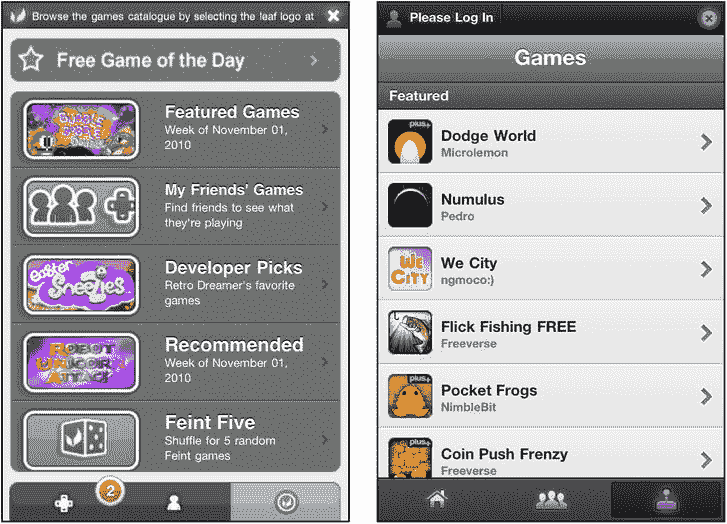

图 5-15：除了众多社交功能外，`Aurora Feint`的`OpenFeint`（左）和`ngmoco`的`Plus+`（右）为游戏开发者提供了极具吸引力的交叉推广机会，使用户能够看到其他人在玩什么，甚至购买列出的游戏以加入其中。

#### 选择社交游戏平台

那么，哪个社交游戏平台适合你的游戏呢？在选择平台时，有两个主要因素需要考虑：

*   被更多高知名度畅销游戏采用的平台将吸引更广泛的受众。聚集在一个在线社区中的玩家越多，你的应用获得的曝光度就越高。
*   尽管应用发现无疑是一个至关重要的组成部分，但你的首要任务应该是选择最适合你应用特定玩法的平台。它需要让你的游戏变得更有趣，而不是更复杂或更令人沮丧。如果你的玩家玩得很开心，这种热情会体现在在线社交社区中，进而推动额外的销量。

随着苹果`Game Center`内置到 iOS 4.1（及更高版本）中，许多第三方社交游戏平台迅速适应，引入了新功能，使其超越了`Game Center`当前的基本功能集。事实上，像`OpenFeint`这样的平台已经通过提供深度兼容性来拥抱`Game Center`。`OpenFeint`的策略是，通过让开发者能够混合搭配`OpenFeint`和`Game Center`的最佳功能，最终结果对`OpenFeint`及其庞大的现有游戏玩家用户群来说是双赢的。


# 排版后

由于 Game Center 已深度集成到 iOS 中，并且苹果正通过特殊徽章和精选推荐，大力推广 App Store 中支持 Game Center 的应用，因此为你的游戏添加 Game Center 支持应是明智之举。但 Game Center 毕竟是后来者。它比某些竞争对手的功能更少，且尚未积累起像流行的 OpenFeint 等现有网络那样庞大的用户群。许多开发者正在集成对 Game Center 和 OpenFeint 的双重支持，以便他们的应用能提供更全面的社交游戏功能，并触达尽可能广泛的玩家群体。

如果你是一名 iOS 游戏开发者，我强烈建议你探索所有社交游戏平台的网站和易用的 SDK，以找到最适合你特定开发和营销需求的平台。可以从以下列表开始：

* 苹果面向开发者的 Game Center（`https://developer.apple.com/devcenter/ios/gamecenter/`）
* OpenFeint（`http://openfeint.com/`）
* Scoreloop（`http://scoreloop.com/`）
* AGON Online（`http://developer.agon-online.com/`）
* ngmoco 的 Plus+（`http://plusplus.com/`）
* Chillingo 的 Crystal SDK（`http://www.crystalsdk.com/`）

### 赢得你的荣誉

本章和前一章涵盖了众多主题，你甚至动手尝试了一些代码（是的，我想你会喜欢这一点）。我之前说过，我们讨论的将不仅仅是研究和营销概念。

在完成了这么多内容之后，你绝对值得表扬自己一番，并理应得到一次休息。那么，去放松一下，畅玩几关你最喜欢的 iOS 游戏吧。

当你准备好学习更多内容时，只需翻到下一页，进入下一章。

## 第 6 章：免费午餐：免费的价值

与传统的桌面软件世界不同，App Store 目前不允许提供限时或功能受限的试用版。为了绕过这一限制，许多开发者提供了通过应用内购买支持的“免费增值”模式，或推出应用的免费“精简版”，希望用户能购买应用内内容或单独的付费版，以获取高级功能。在本章中，你将学习何时以及如何利用免费的力量来获得有效成果，以及如何挖掘联盟计划带来的额外收入机会。

### 从免费应用中创收

在第 4 章中，你探讨了设计引人注目的应用图标和优雅用户界面的价值，这有助于让应用在 App Store 中更具视觉吸引力。但一旦你吸引了人们的注意力，你的截图是否足以说服他们购买你的应用？不要以为你的应用仅售 99 美分，所有人就会自动购买。排行榜前 25 名的应用大多售价 99 美分，那么消费者为何要选择你的应用，而不是其他数千款价格相同的应用呢？不幸的是，当前的 App Store 生态系统的定价观念非常扭曲，每个人都竞相降价以冲进前 100 名。

那么，开发者该怎么办？别忘了前几章的重要教训：你的应用本身就是强大的营销工具。让我们通过免费向消费者提供一些东西，将这一概念提升到一个新的水平。

免费？是的，你没看错。别担心。这里的最终目标仍然是赚钱。免费是促使人们下载你的产品的强大动力。谁不喜欢免费的东西呢？我就喜欢，而且根据 App Store 的统计数据，我并非个例。尽管免费应用仅占 App Store 目录的 25%，但它们却占据了总下载量的 95%！

### 免费策略

你可以通过采用以下一种或多种策略来利用对免费应用的需求：

* 提供应用的免费精简版以推动付费版的销售，或使用通过应用内购买提供高级功能的免费增值模式。
* 免费赠送你的应用，让尽可能多的人使用它。在你培养了一个依赖你应用的大型忠实客户群之后，利用这个基本免费版来向上销售一个独立的高级版本或提供额外“必备”功能的应用内购买项目。
* 让你的应用免费，通过应用内广告支持。在你的应用中实施移动广告将在第 7 章中讨论。

这些方案中哪一种适合你的具体情况，很大程度上取决于你正在开发的应用类型。例如，应用内广告可能不适合儿童教育类应用。父母可能不会容忍向年幼的孩子投放广告的应用。此外，大多数用户可能是在 iPod touch 上安全地离线运行应用，广告网络服务器无法触及。

别忘了联盟计划。如果你的应用当前链接到提供联盟计划的外部网站，你应当从你为联盟伙伴带去的流量中获益。你是否有一个音乐应用，其中包含购买 iTunes Store 中选定歌曲的链接？你的应用是否包含指向 Amazon.com 上书籍或 eBay 上商品的网页链接？如果你的应用利用了联盟链接，你可以从你为这些网站带来的所有销售中获得佣金。

### 先试后买

作为一名 iOS 开发者，你无疑对免费精简版的概念并不陌生。和我一样，你的 iPhone 或 iPad 主屏幕上可能散落着从 App Store 下载的“几页”精简版应用。在评估之后，你可能已经购买了其中至少几个的付费版本。如果没有先尝试精简版的能力，你会购买付费版吗？可能不会。因此，很容易看出免费精简版在提升付费应用销售方面的巨大价值。

桌面软件的开发者几十年前就已经知道这个重要事实。提供可供免费下载的试用演示版是销售商业软件的主要营销工具之一。大多数现代 Mac 和 Windows 应用的试用版都内置了购买机制。这使得用户可以轻松地在线购买许可证，并收到一个解锁演示应用的序列号，从而立即将试用版转变为全功能应用。

先试后买。听起来对 App Store 来说是显而易见的事，对吧？不幸的是，苹果目前不允许 iOS 应用开发者提供功能受限、可通过购买应用解锁的免费试用演示版。这一限制迫使开发者通过制作两个独立版本来解决此问题：一个免费精简版和一个提供精简版所没有的额外功能的付费版。在 App Store 的第一年，这是最接近“先试后买”概念的做法。

早在 2009 年，当苹果宣布在 iPhone SDK 3.0 中包含新的应用内购买功能时，开发者们曾希望它最终能解决这个问题，但事实并非如此。尽管应用内购买确实允许用户在 iOS 应用内购买 App Store 项目，但苹果对应用内购买的使用方式有非常具体的规定。免费应用可以提供应用内购买，但这个内置的电子商务 API 不能用于解锁之前受限的功能，因为应用仍然被禁止将功能显示为禁用状态。如果免费应用包含一个功能——比如工具栏中的一个按钮——那么它必须是一个可用的功能。当前的应用内购买实现允许开发者提供当前应用中未包含的额外功能，例如订阅服务、新内容和附加的游戏关卡。

### 选择路径：精简版 vs. 应用内购买


随着应用内购买（In-App Purchase）的出现，许多开发者曾迅速预测它将使精简版（lite version）变得过时。然而，考虑到实现应用内购买的复杂性，以及应用在 App Store 排行榜中的定位方式，免费的精简版仍然是一种非常有效且可行的商业模式。再次强调，哪种方法最适合您取决于您正在开发的应用类型。

许多开发者仍选择同时发布免费精简版和独立付费版，最明显的原因是这比实现应用内购买要简单得多。如果您曾花时间浏览过苹果的 Store Kit 文档，您会发现应用内购买需要大量的额外编程和后端基础设施。对于 iOS 开发者平台的新手来说，Store Kit 的 API 可能显得有些令人生畏。而在 Xcode 内编译您的应用的两个版本（一个作为精简版，另一个作为功能更强大的付费版）是相当容易的。

如果您应用的功能可以清晰地划分为一组免费功能和一组只需支付少量升级费用即可获得的额外高级功能，那么应用内购买可能是更适合您需求的模式。例如，如果您的免费应用是一款包含五个游戏关卡的的第一人称射击游戏，那么额外的关卡和武器可以作为应用内购买项目提供。

ngmoco 在其广受欢迎的 Eliminate Pro 应用中成功采用了这种模式。该应用免费提供，而额外的游戏关卡、武器和盔甲则可通过应用内购买获得。事实上，ngmoco 对应用内购买的尝试已证明非常有效，以至于在随后的所有应用发布中（如 Touch Pets、We Rule 和 We Farm），都转向了免费增值（freemium）商业模式。

**注意**：您不能通过应用内购买用新的应用二进制文件替换现有的二进制文件，因此对于大多数游戏来说，这需要在免费应用中以隐藏或锁定状态包含额外的游戏关卡和内容。当客户购买该项目时，您的应用会解锁该新武器或游戏关卡。

但应用内购买可能并不适合所有类型的应用。一些单一功能的实用工具应用的结构，使得尝试针对特定功能通过应用内购买提供会很成问题。

对于大多数游戏而言，应用内购买似乎是一个很好的选择，但请记住，通过应用内购买解锁额外内容需要您的应用变得更大（以存储那些隐藏内容）。而且，在处理移动设备上的下载带宽限制时，免费应用的文件大小对其作为促销工具的有效性会产生巨大影响。

许多手机运营商，如 AT&T，限制通过其移动网络下载的文件大小仅为 20MB。因此，如果用户想要将您 35MB 的免费游戏下载到他们的 iPhone 上，他们需要等到登录到本地 Wi-Fi 网络才行。这挫败了潜在的冲动购买和一时兴起的下载。等到他们进入 Wi-Fi 网络范围时，可能早已忘记了您的应用。

使用精简版，只包含免费提供的内容，因此其编译后的文件大小远小于体积更大、功能齐全的付费版。如果免费精简版应用的二进制文件小于 20MB，它将能够接触到更广泛的潜在客户群，因为他们无需 Wi-Fi，便可通过运营商的移动网络将其下载到 iPhone 上。

话虽如此，免费精简版模式的一个主要缺点是，购买付费版需要单独下载一个应用，因此将任何现有用户数据从精简版迁移到付费版对开发者来说是一个相当令人头疼的物流问题。应用内购买则直接在应用内解锁新功能或内容，因此无需转移现有用户数据。

另一个重要的考虑因素是，付费应用需要为现有客户提供免费更新。App Store 目前不支持对更新收费的机制。因此，即使您的精简版成功说服用户购买了您的付费应用，那也只是该客户为应用付出的唯一一次费用。这意味着您需要不断吸引新客户来支持发布更新所需的持续开发成本。如果您的应用仅定价 99 美分且销量不持续走高，那么遵循这个模型来维持和发展您的业务将非常困难。

使用应用内购买，如果您始终让客户可以选择购买额外的功能和附加内容，那么您就给了他们一种以其便利性和舒适度持续购买项目的方式。他们可以想花多少就花多少（或少花），这对您的利润非常有利。灵活性赢得人心！您收入的很大一部分将来自一小部分忠诚客户购买多个应用内购买项目。一个有效的、长期的商业模式是永远不会限制客户消费金额的模式。

尽管免费增值应用包含应用内购买项目，但它们本身是免费下载的，这意味着您的应用只适合出现在 App Store 的“免费 App 排行榜”上。另一方面，同时发布免费精简版和付费版，能让您的产品有机会同时出现在 App Store 的“免费 App 排行榜”和“付费 App 排行榜”上。

诚然，出现在 App Store 排行榜上能带来更高的应用发现率和销量，但这对您业务生存的重要性已不像过去那样至关重要。Snappy Touch 的 Noel Llopis 在将他广受好评的应用 Flower Garden 集成应用内购买后，收入出现了指数级增长。

“过去，在 App Store 上赚钱的常识性做法是不惜一切代价登上排行榜。应用内购买改变了这一切，”Noel 在他 `GamesFromWithin.com` 网站最近的一篇博客文章中写道。“好的应用内购买可以让你的应用即使不在任何排行榜上也能盈利，并且是独立开发者最大的希望。”

我确实相信应用内购买是移动销售的一条非常强大的途径，并且很快将成为在 iOS 平台上实现应用开发盈利的最流行方法。如果这种模式非常适合您的应用功能集和架构，那么敬请期待！第 8 章将详细讨论何时以及如何实现应用内购买。

精简版方法：口味更佳，热量更低

本书后面的章节将致力于介绍如何制作通过应用内广告和应用内购买盈利的免费应用。在此，我们将介绍当您的产品创意最适合作为付费应用时的情况，并探讨如何使用免费精简版来推广您的付费应用。但在深入探讨有效的营销策略之前，让我们先了解一些开发精简版应用的指南。

安全第一：精简版的限制

为避免被 App Store 拒绝，请确保您的精简版遵循以下指南。尽管这些规则可能并非铁板钉钉，但这份清单似乎对当前 App Store 中无数成功的精简版都适用。


#### App Store 精简版指南

-   精简版必须是一款功能完整的应用。你的免费精简版可以比付费版功能更少，只要有限的功能集能让用户将精简版视为一个完整、独立的体验来使用。应用的核心功能应在两个版本中均可访问。例如，如果你的应用主要功能是撰写文档，那么精简版和付费版都应包含创建、编辑和保存文档的功能。为了吸引用户购买付费版，你可以添加仅限付费版的额外增强功能，例如文件同步服务、额外的样式格式选项等。你甚至可以限制用户在精简版中存储的文档数量（精简版：十个文件；付费版：无限制），只要核心功能保持完整。

-   精简版不能包含功能残缺的特性。免费精简版不得包含已禁用的功能，当用户访问这些功能时，会被告知所选功能仅限付费版使用。例如，如果你的应用是一款游戏，且保存高分的功能仅限于付费版，请不要在精简版的界面中包含高分的相关引用。不要在精简版中添加“高分榜”按钮，当用户点击该按钮时，会通知用户高分功能是完整版、付费版专属功能，并附带一个显眼的“立即购买”按钮。在苹果看来，这被认为是功能残缺的特性。如果你的精简版包含“高分榜”按钮，则必须提供该功能。

-   精简版不能提醒用户购买付费版。虽然你可以在精简版的主信息屏幕中包含“购买完整版”按钮，但不能在用户使用应用期间，通过`UIAlertView`或自定义弹出视图提示用户升级。这种持续不断的“骚扰”窗口在桌面共享软件中或许可以接受，但很快会让你收到苹果应用审核团队的拒绝信。

-   精简版不能限时使用或禁用功能。在桌面软件领域，加速用户购买完整版的常见方法是创建一个限时演示版，该版本在安装一定天数后禁用某些功能或整个应用。这在 App Store 中是绝对不允许的。iOS 应用不得以任何方式过期或限时。

-   精简版不能被称为演示版。由于所有 iOS 应用都需要功能完整，如果你在应用名称或用户界面中的任何地方使用像“演示”或“试用”这样的词，将很难在 App Store 中获得批准。你的应用可以使用*精简*或*免费*来表示精简版。

-   免费版货币化潜力的最佳范例之一是《部落冲突》和《糖果粉碎传奇》等付费游戏。这些游戏完全免费游玩。如果你选择不在应用上花一分钱，你将明显落后于其他人。现在你可能会认为人们会花钱以在竞争中取得优势……*错*。看看 App Store 的收入排行榜；你会发现，几乎这里所有的应用都采用这种模式。你先用免费版让他们上瘾，然后提供选项，让他们付费以做得更好、更快或更有效率。

#### 免费精简版真的能促进付费应用销售吗？

如果操作得当，你的精简版可以成为一台精准的销售机器，将成千上万（甚至数百万）用户转化为付费客户。那么，究竟需要多少次免费精简版下载才能看到付费应用销量的激增呢？

平均而言，大多数 iOS 开发者报告的转化率在 0.5% 到 3% 之间。这意味着，每 100 次免费精简版下载，他们大约能售出 1 到 3 个付费版本。如果你的付费版售价为 99 美分，而你的精简版每天只有 100 次下载，那么你的应用销售每天可能只带来几美元。这产生的收入不足以在经济上支持你或覆盖你的开发成本。

这就是成功真正变成数字游戏的地方。流量为王。你需要大力推广你的精简版，以增加其下载量。精简版的下载量越多，付费应用的销量就会越高。

畅销应用 iShoot 的开发者 Ethan Nicholas 报告称，转化率高达 8%。Ethan 的 iShoot 精简版的流行，帮助 iShoot 攀升至 App Store 付费应用排行榜的榜首位置。尽管 8% 看起来可能不多，但如果你精简版变得流行起来，这个数字很快就会累积起来。免费的 iShoot 精简版获得了数百万次下载，考虑到当时（2009 年 1 月）iShoot 的售价为 2.99 美元，据报道，这个看似不高的转化率在发布后的头几周内就为 Ethan 带来了超过 70 万美元的收入。但请记住，那还是在 App Store 应用数量不到 10 万个的时候。现在苹果的移动应用商店已挤满了超过 30 万个应用，因此大多数应用和游戏永远不会看到如此高的转化率。

专业小众应用的转化率通常高于主流应用，因为感兴趣的用户正在寻找只有少数应用才能提供的特定功能。一款受欢迎的小众应用可能排名不够高，无法进入前 100 名，但它却有可能受益于 10% 到 20% 的转化率。为什么会有如此大的差异？

徘徊在前 100 名的流行主流应用拥有更高的曝光度，吸引了更广泛的大众用户，他们可能纯粹出于好奇下载许多免费精简版。专业小众应用通常是被那些对该特定功能有真正兴趣或需求的消费者找到的，因此他们购买完整版的可能性要大得多。这就是为什么许多小众应用的定价高于游戏和新奇应用的原因。它们在销量上的不足，试图通过更高的单品利润率来弥补。

无论实际转化率如何，在发布付费应用的同时提供精简版至关重要。这能让你充分利用首次发布带来的关注度和曝光度。2010 年最成功的案例之一，并非一开始就是畅销品。Rovio 的《愤怒的小鸟》在 2009 年 12 月作为付费应用首次发布时，销售情况并不理想。直到几个月后免费精简版推出，销量才开始飙升（参见图 6-1）。随着越来越多的人尝试免费精简版，口碑迅速传播开来，《愤怒的小鸟》最终成为 App Store 的特色推荐游戏。这股由大众关注引发的热潮，加上其令人上瘾且有趣的游戏性，将《愤怒的小鸟》推向了今天的现象级地位，其 iPhone 和 iPad 的精简版与付费版总下载量超过 4000 万次。

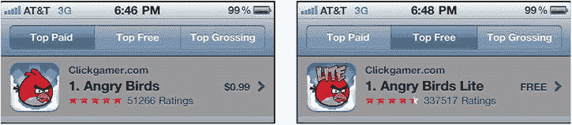

图 6-1。Rovio 的《愤怒的小鸟》销量直到免费精简版发布后才飙升至付费榜榜首，随后苹果将其选为 App Store 的特色推荐游戏


#### 如何制定有效的 Lite 版应用策略

很少有开发者能像 Ethan Nicholas 或 Rovio 那样成功，尤其是在 App Store 中应用数量惊人、竞争激烈的当下。但如果你制定一个扎实的 Lite 版策略，仍然有很大的赚钱潜力。打造一个有效的 Lite 版涉及众多因素。注重细节之处才能真正带来回报。

#### 他们不会为免费牛奶而购买奶牛

大多数开发者立即就理解了提供免费 Lite 版的市场价值，但由于 Apple 要求 Lite 版应用功能完整，一个主要担忧就是免费提供的内容过多。如果你的 Lite 版包含了足够满足人们需求的功能，那为什么还有人会去购买付费版呢？

答案在于第 2 章中讨论的所有市场分析和竞争研究。如果你了解应用的目标受众、竞争对手是谁以及他们提供了哪些功能、哪些关键功能对用户很重要，那么规划你的 Lite 版策略就会容易得多。

诀窍在于要明白哪些功能可以包含在 Lite 版中，而又不至于蚕食付费应用的销量。如果你的竞争对手在他们的 Lite 版中提供了特定功能，你也应该采取类似的做法，尤其是当用户期望这些功能时。但如果你应用有一些很酷的新功能是别人没有的——那种让你应用与众不同的创新“法宝”——那么你需要找到一种方法，让用户能在 Lite 版中试用该功能，同时在付费应用中提供更全面的版本。

你要吊起他们的胃口，但不要全盘托出。

#### 生产力工具和实用工具的 Lite 版本

对于生产力、实用工具和非游戏类应用来说，选择 Lite 版的功能可能颇具挑战，这也是为什么很多这类应用不提供免费 Lite 版的原因。相反，它们依靠评测、外部宣传、视频预告和截图来帮助销售应用。如何将 Lite 版的功能限制到足以鼓励付费应用销售，同时又能通过 App Store 的审核呢？

如果你正在开发一款创建文档或笔记的应用，你的 Lite 版需要功能完整，允许用户创建、编辑和保存这些文件。既然用户希望能够通过电子邮件导入/导出文档，或将文件与远程服务器（如 Google Docs 或 Dropbox）同步，那么显然这些功能是你的应用在 App Store 中保持竞争力所必需的，但它们可以作为仅在付费版中提供的高级功能。

如果你的应用允许用户创建某种待办事项或清单，一种有效的方法是限制在 Lite 版中可以创建的项目数量。为了正确设定用户预期，你的 Lite 版应明确告知当前限制，鼓励用户升级到付费版以获得完整、无限制的体验。

Marco Arment 为他广受好评的 `Instapaper` 应用的 Lite 版——`Instapaper Free` 采用了这一策略。`Instapaper` 是一款用于保存网页以便稍后阅读的有用工具。`Instapaper Free` 将存储限制为十个网页文章——这足以让人们相信这项服务的益处和便利性。一旦他们上瘾并需要更多空间，他们就更倾向于升级到付费版，后者提供无限存储、iPad 兼容性以及大量附加功能（见图 6-2）。

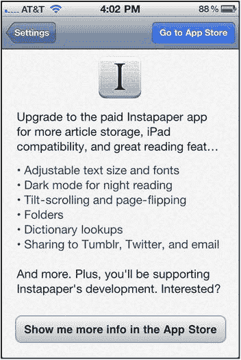

图 6-2. Marco Arment 的 `Instapaper Free` 限制用户只能保存十个网页文章以供稍后阅读，以此鼓励用户升级到付费版以获得无限文章存储、iPad 兼容性和附加功能

#### 游戏的 Lite 版本

对于游戏来说，设计免费 Lite 版通常要简单得多。游戏开发者通常会包含前几个关卡在 Lite 版中。如果用户想玩更多，就需要购买付费版，在那里他们会获得数十个额外关卡、增强功能和特色玩法。

根据你的应用玩法，将 Lite 版限制在仅包含少量入门关卡可能不足以充分展示游戏的真正价值。Matt Rix 在为他的畅销游戏 `Trainyard` 开发 Lite 版时就遇到了这个问题。

“付费游戏有大约 150 个谜题，起初，我想只包含前几个谜题在 Lite 版中，希望用户能看到潜力并想购买完整版，”Matt 说。“但问题在于，在前 10 或 15 个谜题中，玩家才刚刚开始熟悉操作机制。那些‘啊哈！’的时刻要到游戏进行到 40 或 50 个谜题时才会出现，那时你才能感受到这些谜题到底有多酷。这让我陷入了有点棘手的境地。我可以在 Lite 版中免费提供前 50 个谜题，但如果用户决定购买付费游戏，就没有顺畅的升级路径了。他们必须在完整版中再次解决那 50 个谜题。我考虑过在完整版中添加一个可以跳过前 50 个谜题的作弊功能，但这似乎仍然不是最好的解决方案。”

于是，Matt 想出了一个巧妙的替代方案。他为 Lite 版创建了 60 个全新的谜题。他选择不使用 *lite* 或 *free* 这样的词，而是将这个版本命名为 `Trainyard Express`，并将其称为完整付费版 `Trainyard` 的“前传”（见图 6-3）。

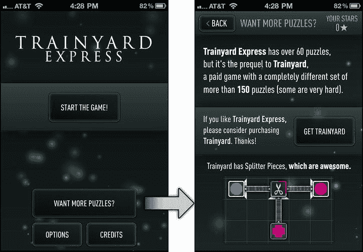

图 6-3. Matt Rix 的免费版 `Trainyard Express` 提供了 60 个独特的谜题，以避免与付费版 `Trainyard` 的 150 个谜题重叠。这一策略提升了两个版本在用户眼中的价值

Matt 承认，这种非传统路径需要大量的额外开发工作，但此举背后有着相当多的战略思考。他补充道：“我真心希望人们爱上这个游戏机制，我认为这可能是最好的方法。我还大幅提高了难度曲线，所以免费 `Express` 中的第 60 个谜题的难度与完整版中的第 100 个谜题相当。”

通过将 `Trainyard Express` 定位为完整付费游戏的独立前传，`Trainyard` 的粉丝会想下载这两个版本，以便玩到全部 210 个谜题。这反而有助于同时提升游戏在付费榜和免费榜的排名，从而在 App Store 中获得更高的曝光度。

#### 何时发布 Lite 版本

免费提供如此多的内容似乎是一场冒险的赌博，但根据你特定应用的功能或玩法，这可能是制胜的一步，能为你赢得一批忠实的用户。

对于任何新兴的应用业务来说，担心 Lite 版可能会阻碍付费应用销售，这是一个可怕的前景。由于这种担忧，许多独立开发者对 Lite 版敬而远之。一些开发者会等到应用销量下滑，认为在应用生命周期的尾声推出一个免费的 Lite 版有助于重振销量。虽然这可能会带来一些额外的业务，但他们并没有真正最大限度地发挥 Lite 版作为推广工具的潜力。时机完全不对。

那些采取这种延迟策略的开发者发现，在这么晚的阶段推出免费 Lite 版时，付费应用的销量确实会增加，但到那时，最初发布时产生的所有免费宣传早已消退，所以销量上的新增长往往不足以将付费版推回 App Store 的前 200 名。要是这些开发者当初能在应用发布、享受首波宣传浪潮时就推出免费 Lite 版，那该多好啊！


### 排版后内容

如果你计划发布免费的精简版，你应该在首次推出付费版时，就让精简版可供下载。这样一来，你的免费精简版就能借应用初始发布时产生的所有宣传和口碑效应获得优势。你驱动下载免费精简版的流量越多，付费应用的转化率就越高。许多在网络推广应用的开发者，会将广告链接到免费精简版，以鼓励用户点击。这能使他们的广告活动更有效，因为人们都喜欢免费的东西。然后，让你的精简版发挥魔力，让用户小小体验一下购买付费版后能得到什么。

如果你担心付费版的专属功能吸引力不够，无法促使用户从免费精简版切换过来，那么你需要重新考虑两个版本之间的功能划分，让升级更具吸引力；或者，你也可以考虑在免费精简版中加入应用内广告。提供一个完全无广告的付费版，这本身就是一种强大的诱惑，同时也能通过广告收入为你带来免费精简版的变现途径。第 7 章详细介绍了应用内广告的相关内容。

当然，并非所有应用都适合做免费精简版。但如果你能想出一个方法，让它对你有利并带动应用销售，那么从长远来看，这将是一项会有回报的赌注。

### 完善你的应用内销售话术

要设计一个更有效的精简版，你需要把它看作一个虚拟的销售助理。你不可能亲自到场，向每位用户逐一介绍你应用的优势，所以你需要让你的精简版替你去“推销”。这意味着你需要在精简版内精心设计销售话术，以恰当地传达你的信息。你已经知道了精简版的指导原则，所以现在，请先摘下开发者的帽子。是时候像你的用户一样思考，设身处地去感受了。

#### 放置购买按钮

许多精简版会在启动画面（即应用启动后的头几秒内显示的界面）上宣传付费版。虽然这是在用户短暂等待应用加载时，充分利用他们全神贯注的注意力来推销的好方法，但这不应该是放置`购买`按钮的唯一位置。

用户在完成一次应用使用后，如果他们对了解更多付费版信息感兴趣，他们会查看应用的主界面、信息界面和/或设置界面（具体取决于你的应用包含了哪些界面）。这听起来像是常识，但我总惊讶地发现，有些精简版并没有让购买按钮在应用内便于点击，或者更糟的是，根本就没放进这个按钮！

如果人们找不到购买按钮，他们就没法购买你的应用。别指望他们会自己记住去手动访问 App Store。很有可能，他们会忘记，而你就白白失去了那些潜在客户。

任何销售，尤其是软件销售，都应该让购买行为尽可能简单和轻松。不同于大多数在线电商系统那样步骤繁琐、过于复杂，苹果公司将 iTunes App Store 设计成了最简单、最便捷的购买软件方式，所以你实在没有任何借口。如果有人喜欢你的免费精简版，并有意升级到付费版，那么下一步操作应该只是轻点指尖就能完成。

那么，既然你已经在精简版的主界面或信息界面集成了一个购买按钮，这个按钮上该写什么字呢？这个问题听起来可能有点蠢，但答案其实比你想象的更微妙、更复杂。

像`购买`和`购买`这样的词，传递给 iPhone、iPad 和 iPod touch 用户的信息只有一个：点击这个按钮会带他们去 App Store。没错，你精心准备的销售话术已经在 App Store 里了——配有详细的描述和截图——从开发角度来看这非常方便。如你在第 5 章所学到的，在应用内启动 iTunes 商店的 URL 仅需几行代码。ZeptoLab 广受欢迎的《Cut the Rope Lite》采用了类似的策略，在常见的`Available on the App Store`标志上方，放置了一个`完整版`按钮。这个按钮出现在游戏的主菜单界面，也会在用户玩完免费关卡后显示（见图 6-4）。点击这些按钮会直接把你带到 App Store 中《Cut the Rope》付费游戏的页面。你也会在 Rovio 的《愤怒的小鸟》中找到同样的 App Store 按钮。

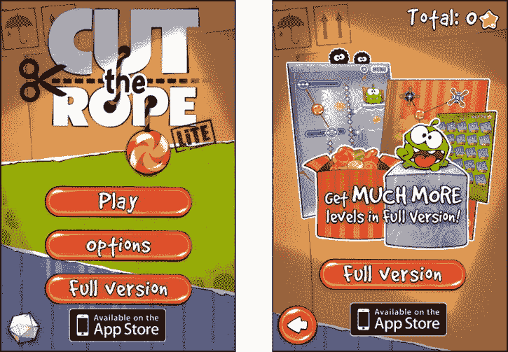

图 6-4。在 ZeptoLab 的《Cut the Rope Lite》中，`完整版`按钮和`Available on the App Store`标志直接链接到 App Store 中《Cut the Rope》付费游戏的页面

尽管一些应用通过这种简单的方法取得了成功，但它不一定是最有效的，尤其对于一款不知名的新产品。尽管我们都愿意相信自己的应用像《Cut the Rope》和《愤怒的小鸟》一样令人上瘾，但这两个现象级的畅销品是规则之外的例外。很有可能，我们这些凡夫俗子需要在应用内营销策略上更积极一点。

#### 在精简版中添加升级信息

从那个购买按钮直接跳转到 App Store，会让用户离开你的应用，而他们可能并不想在那一刻离开，尤其是当他们误以为这会自动开始一笔购买时。作为开发者，我们明白在用户先在 App Store 输入他们的 iTunes 密码之前，这是不可能的，但一些消费者可能不够了解技术，意识不到这一点。为什么他们会在不知道付费版本会带来哪些额外功能的情况下就想要购买这个应用呢？他们不会，所以他们可能会忽略这个按钮。如果那样的话，你的免费精简版就未能完成它唯一且最重要的使命。

任何可能导致用户点击购买按钮时犹豫不决的已知原因，都应该尽可能消除。只要你能做些什么来消除这种犹豫或恐惧，那么投入额外的开发时间来实现它都是值得的。

那么，如何解决眼前的问题呢？与其立刻将用户重定向离开你的应用去到 App Store，为什么不直接在应用内部包含你的销售话术呢？一旦你成功说服他们升级到完整版，你就可以用一个链接到 App Store 的购买按钮稳妥地完成交易。

我最喜欢的一个例子是 Digital Chocolate 的《3D Rollercoaster Rush Free》。在应用的主界面，`完整版有什么？`按钮会引导至一个界面，精确地告诉你选择它后会得到什么。你期待看到关于付费版所包含功能的详细信息，而这正是你所得到的（见图 6-5）。这个出现的促销界面设计得非常好，与游戏的视觉主题相匹配。截图和关键卖点都经过精心打造，以求达到最大影响力。所有这些信息都是在不强迫用户离开应用的情况下传达的，让人们可以选择购买付费应用，或者点击`返回`按钮回到游戏。我被说服并点击了`获取完整版`按钮，而且我是一个很少玩游戏、品味非常挑剔的 iPhone 用户，所以这个销售话术绝对有效。


图 6-5。《3D Rollercoaster Rush Free》是一个绝佳的上行销售范例。


#### 关于 iPad 的更大显示屏

在 iPad 的更大显示屏上，你拥有更多的屏幕空间，因此更容易在弹出窗口（`UIPopover`）或居中的模态视图（`UIModalPresentationFormSheet`）中插入付费版本的升级信息，而不会占据整个屏幕。在 Illusion Labs 的《迷宫 2 HD Lite》中，免费迷宫菜单包含一个用于付费版本的小型横幅广告。点击该横幅，会弹出一个弹出窗口，其中包含高级功能的可滚动描述、截图以及一个 App Store 购买按钮（参见图 6-6）。

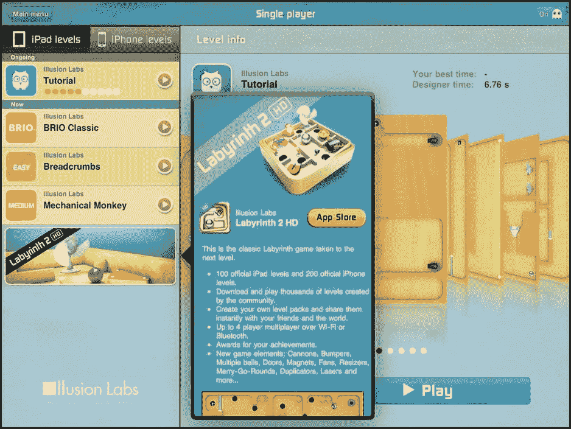

图 6-6。Illusion Labs 的《迷宫 2 HD Lite》在 iPad 的弹出窗口中展示付费版本的升级销售信息。

`UIPopover` 的美妙之处在于，它所显示的 `UIView` 可以轻松重复使用，并可在应用的其他地方通过另一个 `UIPopover` 再次显示。除了 Illusion Labs 提供的迷宫外，该公司还托管了一个免费的在线社区，用户可以在其中上传和分享自己创作的迷宫。在免费的《迷宫 2 HD Lite》应用中，用户可以浏览第三方迷宫列表，但他们很快就会注意到，需要购买付费版本才能下载和游玩这些社区迷宫。这是升级到完整版游戏的一个巨大动力。在精简版中，下载按钮被方便地替换为“完整版信息”按钮。点击该按钮时，它会像之前在应用其他部分看到的那样，在一个 `UIPopover` 中显示相同的付费版本信息（参见图 6-7）。这个弹出窗口在需要时提供升级信息，同时不会干扰界面的其他部分。

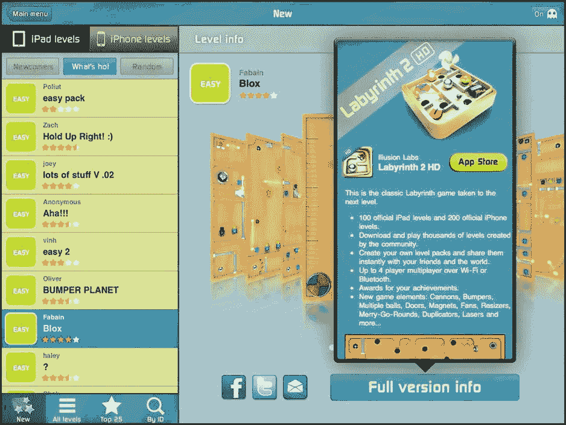

图 6-7。要求《迷宫 2 HD Lite》用户购买付费版本才能下载由迷宫社区贡献的数千个免费第三方迷宫，这是一个极好的升级激励。

#### 应用被拒警告

你不应在应用内显示应用的价格。在免费精简版中推广完整版时，不要列出价格。Apple 在世界许多国家/地区拥有本地化 App Store，支持多种不同货币，因此它不欢迎在应用中显示硬编码的价格。Apple 的应用审核团队并不总是将此标记为被拒原因，但这种情况时有发生，因此你应避免这样做。除了被拒风险外，不在应用中列出价格也很重要，这样你就可以灵活地随时为特殊促销活动更改 App Store 价格，而无需提交更新。

#### 加入分析功能

在精简版中加入分析功能非常重要，这样你就可以追踪有多少人点击了购买按钮。这些分析报告结合你的 iTunes Connect 统计数据，将帮助你确定精简版作为推广工具的有效性。你将了解有多少人下载你的精简版应用、他们使用的频率、有多少用户点击了购买按钮，以及你的付费版本带来了多少销售额。掌握了所有这些数据后，如果精简版到付费版的转化率远低于预期，你可以尝试在后续更新中调整措辞和按钮位置，以改善效果。

当然，了解用户如何使用你的付费应用同样有价值。因此，如果你将分析功能纳入开发策略，请确保将其接入你的所有应用——无论是精简版还是付费版——以获得关于它们表现的最全面图景。Apple 最近更改了关于第三方分析工具允许收集哪些信息的规则。要了解应用内分析的相关事实，请查看第 7 章。

**提示** 如果你是 iOS 开发者，应加入 iTunes 联盟计划。你指向 App Store 的任何链接都应是联盟链接。没有理由不为你导向 Apple 的所有流量赚取一些联盟佣金。这意味着你精简版中的所有购买按钮、交叉推广、网站等都应使用 iTunes 联盟链接进行编码。我们将在本章后面探讨利润丰厚的联盟计划世界。

#### 让精简版无懈可击

作为开发者，我们努力创造高质量的产品，因此没有人会故意发布有漏洞的软件。即使是顶尖开发者也会遇到致命的错误，但如果有一个时刻需要加强你的测试和质量控制工作，那便是针对你的免费精简版。

由于用户会通过评估你的精简版应用来判断付费版本是否值得他们辛苦赚来的钱，因此他们会用非常挑剔的目光来试用它。因为是免费的，该应用会吸引更广泛的受众，其中许多人只是出于好奇而“试驾”。由于在这方面没有任何情感投入，人们常常会迅速做出草率的判断。正如大多数精简版应用与对应的付费版本相比评分更低所证明的那样，人们会毫不犹豫地因为最微不足道的原因给一个应用打出凄惨的一星评分。即使精简版是免费的，如果体验让用户感到沮丧，评论往往也会很苛刻。

确保你的精简版包含充足的内置说明，以帮助减轻因有人不知如何使用应用而可能产生的任何潜在困惑。许多精简版应用会在启动时询问用户，是否希望在探索应用之前观看或阅读一个简短的教程。虽然这确实需要额外的开发工作，但这是一个非常主动的方法，可能有助于避免许多不应出现的一星差评。如果你认为你的应用会从提供应用内教程中受益，请参阅第 9 章了解此主题的详细信息。

#### 将数据从精简版迁移到付费版

如果用户购买了你的应用，他们不应因丢失免费精简版中的数据而受到惩罚。如果发生这种情况，准备好迎接 App Store 中大量负面用户评论吧。

对于大多数游戏来说，没有什么可丢失的，因为高分排行榜通常存储在远程服务器上。但如果这是一个将信息保存在 plist 文件或数据库记录中的效率应用呢？

与桌面操作系统更灵活的环境不同，iOS 限制每个应用只能在其自己的数据“沙盒”中存储文件。应用 A 不能访问应用 B 保存的文件，反之亦然。这可以保护每个已安装的应用免受恶意行为的影响，但也使得在应用之间共享数据变得极其困难。

从 iOS 3.2 开始，Apple 引入了一种新的内置文件处理机制，称为“文档支持”，它允许开发者向 iOS 系统注册他们的应用，以创建和/或打开特定的文件类型。这对于需要其独特文件类型（例如文字处理器）或支持流行文件类型（例如 PDF、图像和视频格式）的应用来说非常棒。这使得一个应用中的文件可以被打幵或复制到另一个也注册支持相同文件类型的应用中。如果你需要从精简版的 plist 文件或少量数据库记录中传输一些信息到付费版应用，这种“文档支持”功能显得有些大材小用，在这种特定情况下增加了不必要的编程开销。


#### iOS 3.2 数据迁移方案

iOS 3.2 还增加了一项桌面同步功能，使应用能够在桌面版 iTunes 的特殊文件共享列表中显示其文件目录，当你的 iOS 设备与电脑同步时即可使用。从技术上讲，如果你的应用支持此功能，用户可以从精简版中复制存储的数据文件到桌面，然后将其拖回 iTunes 的付费应用文件共享目录中。但这要求客户完成大量额外工作，处理他们本不该遇到的问题。如果你重视客户并希望他们获得满意的用户体验，应避免使用此方案。

显然，应用内购买（`In-App Purchase`）能让你的生活轻松得多，避免了将数据从精简版传递到独立付费应用的麻烦。但别灰心——还有其他方法可以完成此任务。

#### 云端同步

一些开发者通过在应用中实现同步服务来解决数据迁移问题，让客户能够将应用数据同步到远程服务器。诸如 `Flixoft` 的 `Grocery Gadget` 等流行应用鼓励用户注册免费群组账户，以便数据能从精简版轻松传输到付费版。

如果你的应用存储大量复杂数据，或者你只是想给客户一种从其他位置和设备（如他们的 iPad 或台式电脑的网页浏览器）访问数据的方式，那么维护一个同步服务可能是最佳选择。如果这对你的应用需求来说是个吸引人的解决方案，以下是一些值得考虑的实惠云服务：

*   `Dropbox` 开发者平台（`http://www.dropbox.com/developers`）
*   `Google App Engine`（`http://code.google.com/appengine/`）
*   `Amazon S3`（`http://aws.amazon.com/s3/`）
*   `Rackspace Cloud`（`http://www.rackspacecloud.com`）
*   `Parse`（`http://parse.com`）

如果你不想开发并维护一个服务器端 Web 应用来管理原生应用与云端之间的数据同步，可以首先考虑 `Dropbox` 的 iOS SDK。`Dropbox` 已成为需要在多设备间同步数据的移动开发者的热门选择。但如果你只需要在应用间传输非常少量的数据，还有另一种选择。

#### 通过 URL 传输数据

一些开发者成功通过唯一的 URL 命令传输数据。例如，如果 iOS 应用发起一个 HTTP 网站的开放 URL 请求，`Mobile Safari` 会自动启动并处理该请求，因为它是注册处理 HTTP 的默认应用。简而言之，应用刚刚将数据传输给了 `Mobile Safari`。你可以通过设置一个唯一的 URL 协议处理器，将同样的概念应用到你自己的应用。

要使你的 URL 协议生效，它需要使用一个尚未被任何其他应用使用的前缀。由于你不知道其他 iOS 应用可能为此使用哪些唯一协议，你应该设计一个足够独特的前缀，以防止与其他应用冲突。

出于本练习的目的，让我们为虚构的停车位置定位应用 `Breadcrumbs` 创建一个唯一协议。我们希望精简版用户能将保存的停车位置传输到付费版。由于数据量非常小（仅几个 GPS 坐标），且不包含任何机密信息，通过开放 URL 命令传输数据效果很好。

对于我们的 URL 前缀，我们将使用`bcrumbs`。如果你的应用有一个独特的名称（应该如此），那么该名称（或其变体）可能很适合作为唯一前缀。首先，`bcrumbs` URL 协议需要注册到 iOS 系统中，并分配给 `Breadcrumbs` 的完整版。这通过在 Xcode 中向付费应用的`Info.plist`文件添加新的 URL 类型来完成（参见 Figure 6-8）。

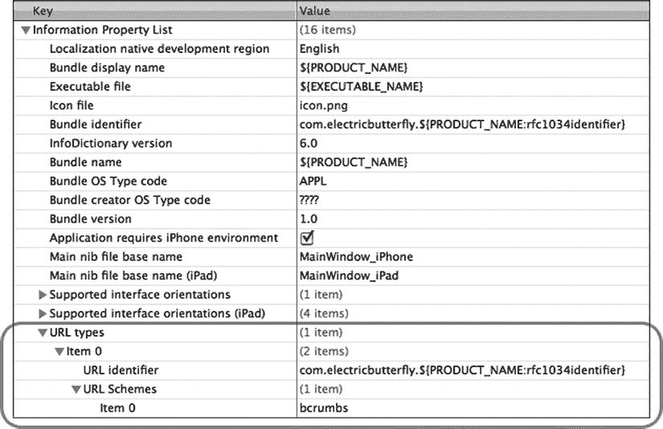

Figure 6-8。在 Xcode 的 plist 编辑器中打开完整版的`Info.plist`文件，添加新的 URL 类型

要向`Info.plist`文件添加新条目，请在 plist 编辑器中选择最后一行，然后点击右侧的灰色加号（`+`）按钮。在新的空白行中，从左侧键（`Key`）列出现的上下文菜单列表中选择`URL Types`。

添加新 URL 类型后，打开其展开三角形以配置嵌套属性。在其`Item 0`键下，你需要将付费应用的唯一属性`com.company.Application`添加到`URL identifier`字段。对于虚构的 `Breadcrumbs` 应用，这很可能是`com.electricbutterfly.Breadcrumbs`。

接下来，再次点击加号按钮，在`URL identifier`正下方添加另一个嵌套键，并从新键的上下文菜单中选择`URL Schemes`。`URL scheme`是你定义唯一 URL 协议处理器的地方，因此对于 `Breadcrumbs` 示例，它是`bcrumbs`。

**注意**：如果你有一个 Xcode 项目设置了两个编译目标（一个目标用于精简版，一个目标用于付费版），则需要为每个目标创建单独的 plist 文件。只有应用完整版的 plist 文件可以包含唯一的 URL 协议处理器定义。如果你的精简版 plist 文件引用了相同的 URL 类型，那么精简版最终将接收自己的 URL 请求，这会导致冲突。当精简版发送唯一的 URL 请求时，你只希望付费版来响应它。

现在，唯一的`bcrumbs` URL 协议已分配给 `Breadcrumbs` 的完整版，下一步是为精简版添加通过 URL 传输数据的代码。假设你已在精简应用的设置屏幕上添加了一个新按钮，名为`Transfer My Data to Full Version`（将我的数据传输到完整版），并且它已在 Interface Builder 中连接好。还假设事件处理器已包含从精简版沙盒获取数据的代码（例如来自 XML 文件或纯文本文件的内容）。

你不能在 URL 查询中发送原始数据，因此必须首先进行 Base64 编码和/或 URL 编码。iOS SDK 不包含 Base64 编码和解码，但一些第三方 Objective-C 库（例如`Google Toolbox for Mac`，`http://code.google.com/p/google-toolbox-for-mac/`）为 iOS 提供 Base64 支持。如果仅 URL 编码就能满足需求，你可以轻松调用原生 iOS `NSString`方法`stringByAddingPercentEscapesUsingEncoding`。

一旦数据经过 Base64 编码和/或 URL 编码并存储在`NSString`中（我们称之为`encodedData`），就可以作为唯一 URL 查询的一部分发送：

```objectivec
NSString *urlQuery = [NSString stringWithFormat:@"bcrumbs://localhost/importData?%@", encodedData];
NSURL *url = [NSURL URLWithString:urlQuery];
[[UIApplication sharedApplication] openURL:url];
```

当用户点击`Transfer My Data to Full Version`按钮时，精简版发起该 URL 请求。iOS 识别出`bcrumbs` URL 协议处理器已注册到 `Breadcrumbs` 的完整版，因此该唯一 URL 被传递给付费应用。`Breadcrumbs` 的完整版启动以接收并解析该 URL 命令。

要使最后一步成功，付费应用必须在应用委托的实现中包含`application:handleOpenURL`处理器。例如，`BreadcrumbsAppDelegate.m`文件包含以下代码：

```objectivec
- (BOOL)application:(UIApplication *)application handleOpenURL:(NSURL *)url {
     if([@"/importData" isEqual:[url path]]) {
         NSString *urlData = [url query];

// 首先，你应该询问用户是否愿意
         // 用新导入的精简版数据替换现有数据。
```


// 随后，根据字符串的初始编码方式，
// 你需要通过第三方库解码 Base64
// -或- 调用 `NSString` 方法
// `stringByReplacingPercentEscapesUsingEncoding:` 来解码 URL 编码。

// 最后，你需要解析并保存数据
// 到完整版本自身的应用沙盒中。

```
return YES;
     }
     return NO;
}
```

就这么简单！只需记住，通过 URL 传输数据仅适用于少量数据，例如小于几百千字节的 XML 文件或文本文件。你还需要通过编写 `application:handleOpenURL:` 处理程序来保护付费应用，使其仅接受你想要的特定数据，并忽略无效的 URL 字符串，从而防御那些破解你独特 URL 协议的黑客。

### 保护市场份额：先免费赠送，再后续升级

你的 iOS 应用的成功是否依赖于尽可能多的人采用，例如需要多个参与者才能发挥作用的社会化网络应用？如果是这样，你可能需要考虑免费赠送该应用。要让数百万人在如此宏大的全球规模上采用你的服务，唯一的办法就是让所有人都能免费使用。想想 Facebook、Foursquare 和 Twitter。

目标是让每个人都能足够频繁地使用你的应用，以至于它最终成为他们日常生活中不可或缺的一部分。使用门槛越低，实现这一目标就越容易。除了免费之外，为了获得最佳效果，你的应用还应避免出现任何潜在的阻碍因素，比如广告。

当你的应用培养了一大批忠实的追随者后，你可以推出付费版的应用，提供额外的功能。另一种选择是将高级功能作为应用内购买项目提供（如第 8 章所述）。基础版将始终免费提供，这也是大多数用户会选择的方式。

那么，如果大多数人只使用免费的入门版，你如何赚钱呢？这是另一个关于“规模”如何最终决定你成功的例子。如果你创造了创新的用户体验，并且作为营销人员做得足够出色，那么你的免费应用就会作为“必备”应用渗透主流市场，并被数百万人使用。例如，假设有 1000 万人经常使用免费的基础版。如果其中只有 8% 的用户决定升级到 1.99 美元的付费版，减去苹果 30% 的应用商店抽成后，你的净收入将超过 110 万美元。更保守地估计，即使只有 5% 的用户升级到付费版，也能产生 70 万美元的收入。

再说一次，规模是这个策略奏效的关键。大多数应用并不适合这种商业模式。但如果你的应用依赖于用户之间的点对点互动，这种方法或许就是你在特定细分市场占据最大份额的通行证。如果你的应用是市场领导者，你将更成功地引导更多用户升级到付费版。

在第 2 章中，我提到了 Bump Technologies, Inc. 公司推出的很酷的 Bump 应用，它允许用户通过互相碰击手掌来即时发送联系信息。但要使其工作，两个人都必须在他们的 iPhone 或安卓手机上安装 Bump。拥有 Bump 的人越多，它就越有用。希望是它最终能在手机中变得足够普及，成为用户交换虚拟名片和其他数据的标准方法。这个计划似乎正在奏效。就目前而言，该应用在 iPhone 用户中已经变得相当流行，甚至出现在了苹果的一则 iPhone 广告中。

Bump 会永远免费吗？为了保持这种普及势头，这将是可预见的未来的目标。Bump Technologies, Inc. 并未走传统的付费版路线，而是希望通过将其核心的碰撞技术授权给其他能从该功能中受益的大型商业开发者来实现盈利。只要不 overload Bump 服务器或通过每次碰撞产生增量收入，你就可以免费在你的应用中使用 Bump API。如果你的应用通过碰撞功能赚钱，或者需要 Bump 服务器提供大量带宽，你可以购买相应的授权层级。

通过为 iOS 和安卓提供易于使用的 SDK 来开放此 API，Bump 不仅在移动世界中巩固了自己作为点对点数据共享事实标准的平台地位，而且还在为其核心优势的货币化建立长期基础设施。随着 Bump API 已被独立开发者以及像 PayPal 和 ABC Family 这样知名客户开发的数十款移动应用所采用，Bump 的策略显然正在获得回报。

报业是另一个通过提供免费服务来试图培养忠实移动受众的商业模式的好例子。随着印刷报纸的广告销售和发行量持续快速下滑，处境艰难的报纸正寻求向拥有可持续收入模式的数字平台转型。由于要与大量免费在线内容竞争，付费报纸应用在过去一直难以成功，尤其是在小手机屏幕上重现报纸阅读体验已被证明颇具挑战性。但随着 iPad 的广泛普及，以及平板电脑鼓励与阅读报纸类似的向后倚靠式观看行为，这一媒介终于有了一个可行的移动平台。

诸如《*纽约时报*》和《*华盛顿邮报*》等主要报纸已开始尝试新的专用 iPad 应用，这些应用在限定时间内免费提供其全部日报内容。借助 iPad 更大的屏幕，这些应用能够提供令人满意的、可与印刷版相媲美的数字阅读体验，同时充分利用现代触摸屏技术。它们连续几个月提供 100% 的免费内容，希望消费者会逐渐依赖这种接收“报纸”的方式。这样，当免费服务结束时，用户很容易决定切换到应用内购买订阅模式（见图 6-9）。

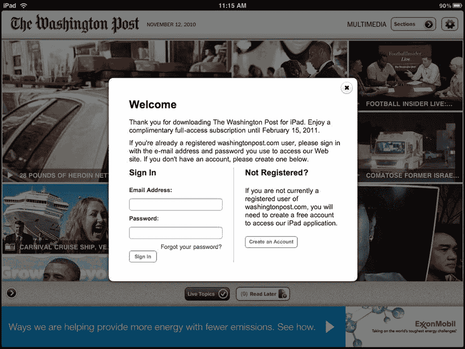

图 6-9. 《华盛顿邮报》是几家希望通过在限定时间内提供 100% 免费内容，最终将忠实读者转化为付费订阅者的报纸之一

如果你需要尽快获得收入来为开发工作提供资金，这些免费策略可能不适合你。但如果你的开发目前由投资者、赞助商或其他来源的现有现金流支持，并且你能够等待几个月让你的应用在移动市场站稳脚跟，那么在正确实施的情况下，免费可以是一种有效的商业模式。

### 通过联盟计划挖掘额外收入

在本章前面部分，我提到了在将用户引导至 iTunes Store 时使用 iTunes 联盟链接。在这里，我们将更深入地探讨联盟计划如何为你创收。

#### 联盟计划的工作原理

联盟计划的运作方式相当简单。参与公司希望鼓励软件和网站所有者将流量引导至其零售网站。作为激励，联盟会员可以从产生的销售中获得一小笔佣金。这是通过使用包含唯一联盟 ID 的特殊 URL 来追踪的。联盟会员赚取的佣金基于通过其链接而来的客户所产生的销售额的百分比。


大多数博主和网站所有者都非常熟悉亚马逊联盟（Amazon.com Associates），这是历史最悠久、最受欢迎的在线联盟项目之一。如果你的网站访问者通过你的联盟链接进入亚马逊并购买商品，你将获得该笔销售的部分佣金（通常为 4%或更高，具体取决于商品）。

尽管有成千上万个联盟项目，但你最应该关注的是苹果的 iTunes 联盟计划（iTunes Affiliate Program）。由于 iTunes Store 和 App Store 内置于每一台 iPhone、iPad 和 iPod touch 中，应用可以轻松链接到音乐、电影、电视剧、有声读物甚至其他应用的商店页面。免费的精简版应用经常这样做，引导用户到 App Store 中的完整付费版本，希望他们购买。

因此，这里并不缺少链接。成千上万的 iOS 应用及其相关网站充斥着指向 iTunes Store 和 App Store 的链接。我觉得奇怪的是，这些链接中有很大一部分不是联盟链接。我经常惊讶于有多少开发者仍然没有利用这个免费的收入机会。

从可能仅售 99 美分的数字商品上赚取 5% 的佣金听起来并非一笔意外之财，但就像低价的应用程序销售一样，这种商业模式全靠走量。如果你正在将应用用户或网站访问者引导至 iTunes Store，并且苹果正通过这些链接获利，那么你为苹果带来的销售为何不应得到补偿呢？如果你的应用不在前 200 名之内，在 App Store 里赚钱已经很困难了，为什么还要忽略这个轻松赚取额外现金的选择呢？作为软件业务所有者，你应该寻找 iOS 应用和网站能够（合法地）带来的所有可能的收入流。在这种情况下，你只需要免费注册联盟计划并修改现有的 URLs。

还不相信这值得一试吗？这里有一条小信息可能会激起你的兴趣。

Pandora 是在线最受欢迎的网络广播服务之一，其 Pandora iOS 应用常年受到青睐，一直徘徊在 App Store 免费音乐应用前十名。喜欢当前播放歌曲的听众可以轻松点击“从 iTunes 购买”按钮来购买该曲目（见图 6-10）。该按钮使用了一个联盟链接，将用户引导至 iTunes 中相应的歌曲页面。如果该用户购买了这首曲目，Pandora 就能赚取佣金。

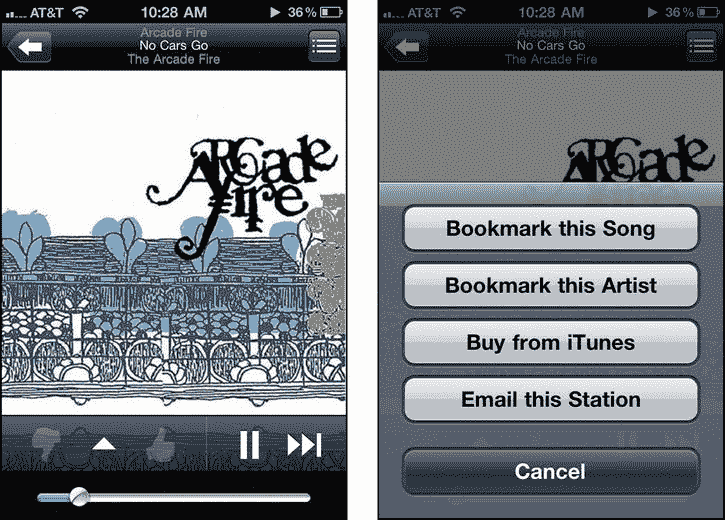

**图 6-10.** Pandora 网络广播应用包含了指向 iPhone 内嵌 iTunes Store 的联盟链接，使听众能够轻松购买当前播放的歌曲

Pandora 的首席技术官 Tom Conrad 透露，通过 Pandora 网站和 iOS 应用，Pandora 的听众每月通过他们的联盟链接购买约 100 万首歌曲！而在这些歌曲销售中，Pandora 的 iOS 应用占据了其中的 20%。

不难看出，庞大的客户群如何能为 iTunes Store 带来巨大流量，将这些联盟链接转变为主要的收入来源。从 iTunes 联盟链接赚取的佣金是许多社交游戏平台（例如 OpenFeint，已在第 5 章讨论）的主要收入来源之一，这也是它们能够免费向 iOS 开发者提供那些功能丰富的游戏服务的原因。

iTunes 联盟计划的一大优点是，当用户通过你的联盟链接进入 iTunes Store 后，在 24 小时内（或直到他们点击另一个联盟链接之前），他们购买的所有商品你都能获得 5% 的佣金。Pandora 发现，许多听众不仅通过他们点击的联盟链接购买了歌曲，还会继续购买其他几首歌，这无疑增加了 Pandora 的佣金收入。

诚然，你的 iPhone 或 iPad 应用可能没有 Pandora 那么多的用户（没有多少应用能达到那种受欢迎程度），所以让我们来看一个更现实的场景。假设你的应用每个月引导约 5 万人进入 iTunes Store。即使只有一半的人最终购买了一两件 99 美分的数字商品，按照 5% 的联盟佣金计算，你每月将赚取 1250 到 2500 美元。这仅仅是通过一次性更改你嵌入的 iTunes Store 链接就能获得的收入，不费吹灰之力。

**加入 iTunes 联盟计划**

要注册 iTunes 联盟计划，请访问`http://www.apple.com/itunes/affiliates/`。

不同地区有不同的联盟网络。目前，你的选择包括 `LinkShare`（美国）、`TradeDoubler`（欧洲）、`LinkShare Japan`（日本）以及 `dgm`（澳大利亚和新西兰）。不要注册代表你所在地区的联盟网络，而是选择最适合你应用目标受众的网络。

这里，我们将使用主要面向美国的联盟网络 `LinkShare` 来逐步演示流程。点击 `LinkShare` 链接将带你进入 `LinkShare` 的注册表单。如果你已有 `LinkShare` 账户，只需登录 `http://www.linkshare.com`。

完成注册流程并登录到你的 `LinkShare` 账户后，还有一个步骤。`LinkShare` 是数百家零售商的联盟网络，因此你需要在 `LinkShare` 账户中申请加入你感兴趣的各个联盟计划。在 `LinkShare` 的广告商网络中搜索关键词 `iTunes`，搜索结果中会显示 iTunes 联盟计划（见图 6-11）。点击“申请”按钮，并同意苹果的条款和条件。

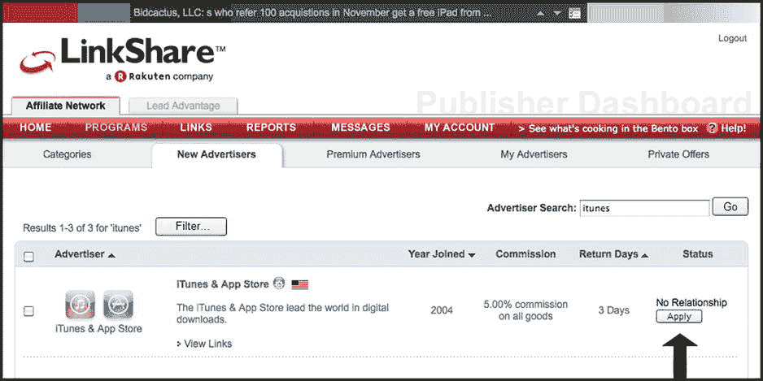

**图 6-11.** 注册 `LinkShare` 后，你需要在 `LinkShare` 账户中申请 iTunes 联盟计划。搜索 `iTunes`，然后点击“申请”按钮

由于苹果会手动批准所有联盟成员，你需要等待收到批准确认电子邮件后，才能创建任何联盟链接。

一旦被苹果批准成为官方 iTunes 联盟成员，请重新登录你的 `LinkShare` 账户，并导航至 iTunes 联盟计划页面（列在“我的广告商”部分）。你应该会看到一个蓝色的 iTunes 创建链接横幅，下方有一排按钮（见图 6-12）。

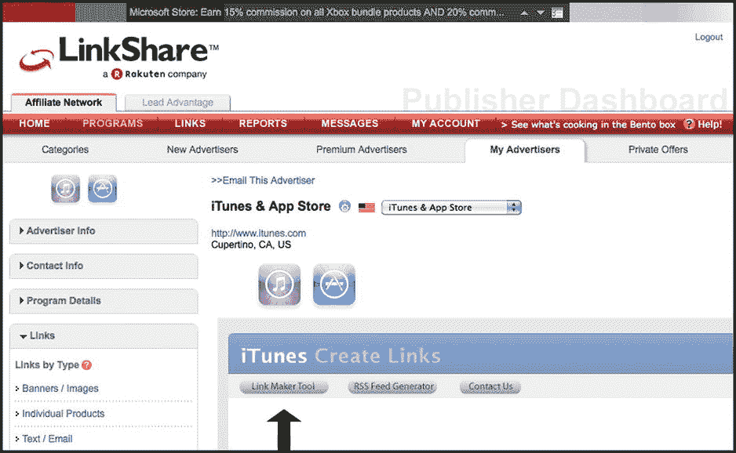

**图 6-12.** 要为 iTunes Store 中的商品生成联盟链接，你需要使用苹果的专用链接生成器工具

要为你的 iOS 应用和网站生成 iTunes 联盟链接，请点击“链接生成器工具”按钮。（不要使用 `LinkShare` 的链接构建功能。）苹果的链接生成器工具非常易于使用。你可以轻松搜索特定产品，然后复制在线工具提供的自定义联盟链接。

就是这么简单。在你的应用和网站中使用这些特殊的链接（它们包含你的联盟 ID），就能开始通过你为 iTunes Store 带来的流量赚取额外收入了。

**免费的力量**


#### 免费应用的变现方式

免费应用的最后一种变现方式可能大多数开发者都想不到，而且这种模式具有一定的赌博性质。如今，许多大型企业会仅凭一款应用的用户数量就收购其所有权。这类情况正日益增多。最典型的例子当属 `Instagram`。

`Facebook` 在极易受影响的青少年群体中发现了一个新兴市场。这款照片分享应用从未、也永远不会产生任何直接收益——没有广告、没有内购、也没有升级到高级版本的营销。`Facebook` 纯粹是为了其用户基础，以十亿美元现金收购了 `Instagram`。没错，是十亿美元（Billion）。

另一款采用完全相同策略的应用是 `Snap Chat`。这款应用允许用户发送“阅后即焚”的图片消息。它在青少年群体中非常流行，并曾收到过多次数十亿美元的收购要约。

这里的核心在于确定你的终局战略：你是想直接从用户身上赚钱，还是致力于被第三方收购？如果目标是那笔巨额收购，那么让你的应用永远免费可能是最佳选择。

### 转变思路

付费应用并非移动领域中唯一的盈利途径。你是否想真正利用“免费”的力量来创造更多收入？本章讨论的推广版精简版应用和其他商业模式只是冰山一角。接下来的两章将深入探讨应用内广告和内购模式。

## 第 7 章：利用 iAd 及其他应用内广告机会实现免费应用变现

移动广告被广泛视为下一个重要的营销前沿，广告商们竞相瞄准不断增长的用户群体。本章将深入剖析应用内广告的世界，为你介绍适用于 iOS 应用的移动广告网络，以及通过应用内分析追踪使用情况的价值。同时，还会探讨其他替代广告模式，如赞助和植入式广告合作。

### 何时使用应用内广告

我们都有过下载显示某种应用内广告的免费应用的经历，其中不少人甚至点击过这些广告。根据当前趋势，研究专家`Gartner`预测，到 2014 年移动广告支出将超过 170 亿美元。就连苹果公司也通过推出在 iOS 应用中投放广告的 `iAd` 平台，涉足这一利润丰厚的市场。但关键问题在于：应用开发者真的能从中赚钱吗？

应用内广告是一种无需依赖付费内容销售就能实现免费应用变现的有效方式，但它并非对所有应用都是可行的商业模式。你需要深入审视自己正在构建的是哪种应用，以及用户将如何使用你的应用。

#### 了解你的受众

如果你开发的免费应用能吸引广泛的主流市场，并且用户使用频率很高，那么你或许能从应用内广告中获得可观的收入。关键在于*流量*。

这方面最经典的案例是昙花一现的游戏神作 `Flappy Bird`。这款游戏免费，通过在主屏幕和游戏结束画面展示 `iAd` 广告来创收。该游戏的设计初衷就是成为一种潮流，吸引所有人，因此免费应用的思路完全合理。`Flappy Bird` 仅凭 `iAd` 每天就能产生超过 5 万美元的收入。

使用你应用的人越多，累积的广告展示次数和点击量就越高。如果你的应用足够“粘人”，能长时间吸引用户的注意力，它就能展示更多的横幅广告，从而为你带来更多的广告分成收入。

如果你的免费应用面向小众市场，吸引力有限，那么它可能无法产生足够的广告收入来支撑你的业务。另一方面，服务于小众市场也可能让你从优质广告网络获得更高的费率，因为那些品牌广告主渴望精准触达这些受众。尽管这类小众应用最终吸引的用户数量不如大众市场应用，但它可以通过每个广告赚取更多收入来弥补差距。

以下是一些需要考虑的因素：

- **使用网络的应用：** 如果你的应用需要网络连接（例如访问 GPS 信息、网络服务或在线社交网络），那么添加应用内广告不会给用户带来不便，因为他们在运行你的应用时已经在线。请务必牢记这一点，因为尽管 iPhone 通常有持续的网络连接（通过 Wi-Fi 或蜂窝网络），但 iPod touch 和 iPad 用户可能并非随时都有 Wi-Fi 连接。如果你的大部分用户倾向于离线使用你的应用，那么应用内广告就无法为你带来任何收入。如果应用无法与广告网络服务器通信，它就无法展示广告。
- **面向年轻用户的应用：** 如果你的应用是面向青少年的游戏或教育应用，应用内广告可能并不合适。一方面，家长可能不喜欢那些直接向孩子做广告的应用。此外，在部分地区向幼儿投放广告可能是非法的，因此做好法律方面的功课至关重要。
- **娱乐应用和休闲游戏：** 许多娱乐应用，尤其是休闲游戏和棋类游戏，非常适合采用应用内广告模式，特别是那些需要联网登录在线排行榜或游戏网络的应用。如果用户界面设计得当，插入在屏幕顶部或底部的横幅广告应该不会影响游戏体验。一个例子是《愤怒的小鸟免费版》（`Angry Birds Free`），它通过应用内广告盈利。其开发公司 `Rovio` 通过创造性地将广告横幅滑入和滑出屏幕顶部，避免了遮挡实际的游戏画面（参见图 7-1）。


图 7-1. 《愤怒的小鸟免费版》将广告横幅滑入和滑出屏幕顶部，以避免遮挡实际的游戏画面

- **沉浸式游戏：** 在全屏、沉浸式的 3D 游戏中整合应用内广告非常困难。通常，在这种情况下唯一的选择是在游戏关卡之间展示广告。这通常并不理想，因为那样会大幅减少应用能够产生的广告展示次数，尤其是在游戏关卡需要用户花费很长时间才能完成的情况下。

如果你决定通过应用内广告来变现你的免费 iOS 应用，请务必从最初 1.0 版本发布时就这样做。如果你的应用从一开始就包含广告，用户会自然而然地将其视为免费下载的代价。如果你的应用已经积累了一批忠实用户，他们享受了多个无广告版本，那么在后续更新中突然引入应用内广告必然会令许多粉丝反感。一如既往，你需要避免在 App Store 收到负面用户评价，因此请提前仔细规划你的免费应用策略。

#### 作为销售工具的应用内广告


如果你不完全依赖广告收入，并决定发布一个免费的精简版来推广付费应用，那么可以考虑仅在精简版中使用应用内广告。根据你正在开发的应用类型，这不仅可以有效地将该免费应用变现，还能促使用户升级到付费应用以获得无广告的体验。这就是《愤怒的小鸟免费版》（参见图 7-1）背后的商业模式，它提供了十几个免费游戏关卡并带有应用内广告。为了获得更多游戏关卡和无广告体验，用户被鼓励购买《愤怒的小鸟》付费应用。

即使你不提供单独的付费应用，一些用户也会更喜欢你应用的无广告版本。许多免费应用，例如 Tweakersoft 的 `AroundMe`（参见图 7-2），通过应用内购买提供了一个移除广告的付费选项。这样，你的应用保持免费下载，可供任何想要尝试的人使用。忠诚的客户可以继续使用带有广告的免费版本，也可以选择支付少量应用内费用来移除广告。这使得你的应用无论用户选择哪种方式都能产生收入。有关应用内购买的深入介绍，请参见第 8 章。

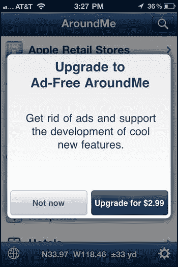

图 7-2. Tweakersoft 的免费应用 `AroundMe`，提供了一项通过应用内购买移除广告的无广告选项。

### 选择移动广告网络

苹果公司在 2010 年推出的 `iAd` 引起了巨大的媒体轰动。有关参与应用通过广告展示和点击获得可观利润的新闻，吸引了大量 iOS 开发者加入 `iAd` 网络。对于设计用来容纳横幅广告的应用界面来说，`iAd` 是一个诱人的选择。苹果公司一直在努力增加 `iAd` 网络的广告库存，并将其可用性扩大到美国以外，以提升其对开发者的价值和覆盖范围。但 `iAd` 显然不是唯一的选择，并且可能不是你特定应用需求的最理想广告解决方案。

#### 调查可用选项

彻底调查所有兼容 iOS 的广告网络，以找到提供你所需解决方案的选项，这一点至关重要。尽管市面上有数十个移动广告平台，但此处我将重点限于那些为 iOS 开发者提供应用内广告 SDK 的主要平台。

以下是一些值得探索的广告网络网站：

*   `iAd` (`http://developer.apple.com/iad/`)
*   谷歌的 `AdMob` (`http://www.admob.com`)
*   `Greystripe` (`http://www.greystripe.com`)
*   `Millennial Media` (`http://developer.millennialmedia.com`)
*   `InMobi` (`http://www.inmobi.com`)
*   `iVdopia` (`http://www.ivdopia.com`)
*   `Jumptap` (`http://www.jumptap.com`)
*   `Medialets` (`http://www.medialets.com`)
*   `MobFox` (`http://www.mobfox.com`)
*   `Mojiva` (`http://www.mojiva.com`)
*   `Rhythm NewMedia` (`http://www.rhythmnewmedia.com`)
*   `Say Media` (`http://saymedia.com`)
*   `Smaato` (`http://www.smaato.com`)
*   `YuMe` (`http://www.yume.com`)

归根结底，一个成功的广告支持型应用最重要的因素是确保 100% 的填充率（始终有广告可供展示），并为你的应用广告空间赚取最优费率。实现这些目标可能需要在你的应用中支持多个广告网络。许多开发者利用广告中介层和广告交易平台，例如以下服务提供的平台：

*   `AdWhirl` (`http://www.adwhirl.com`)
*   `Burstly` (`http://www.burstly.com`)
*   `Mobclix` (`http://www.mobclix.com`)

#### 哪个广告网络适合你？

除了易于使用、可在五到十分钟内集成到应用中的 SDK 之外，所有这些广告网络也都是免费的，并提供类似的功能，那么你应该选择哪一个呢？这实际上取决于你应用的切实需求。你应该根据以下标准来做决定：

*   支持的广告尺寸和格式
*   报告和分析功能
*   全球可用性和定向能力
*   收益和填充率

让我们更仔细地看看这些因素会如何极大地影响你的应用在应用内广告方面的成功。

请记住，这些广告网络总是在发展和变化，有时会损害开发者的利益。请密切关注 `http://iphonedevsdk.com/forum/business-legal-app-store/`，因为那里总是有关于不同广告网络以及它们做得对与错的帖子。

### 支持的广告尺寸和格式

首先也是最重要的，你选择的移动广告网络必须支持能够很好地适配你 iOS 应用 UI 和屏幕尺寸的广告尺寸。例如，有些广告网络只为 iPhone 和 iPod touch 提供固定的竖屏和横屏横幅广告尺寸，这对于 iPad 应用的更大屏幕来说可能会出现问题。

如果横幅广告不适合你应用的特定界面需求怎么办？有些广告网络专注于全屏富媒体广告或视频广告，这更适合游戏和传统横幅广告不实用的自定义 UI。

如果交叉推广对你的免费广告支持型应用来说是一个有价值的功能，那么请特别注意那些允许你将部分广告库存分配为自定义“内部广告”的广告网络。你可以使用这些内部广告来推广你的其他应用和/或应用内购买项目，同时还可以作为交换网络的一部分，与其他第三方应用交换广告。虽然你不会从这类交叉推广广告中赚取任何广告收入，但如果你的免费应用拥有庞大的用户群，它们可以帮助带动大量流量和销售，流向你的其他付费应用和内容。

### 报告和分析功能

为了正确评估应用内广告业务模式的有效性，你必须能够衡量的你应用内广告展示的频率和效果。所有广告网络都提供基于网页的报告，用于报告应用内投放的广告情况，但有些报告比其他报告更全面。在做决定之前，你应该尝试查看一份报告示例。

但赚取的广告收入并不是唯一值得追踪的统计数据。大多数（如果不是全部）移动广告网络也提供作为其 SDK 一部分的集成化分析包。这对于追踪应用使用情况以及找出你应用的哪些部分获得最多流量至关重要。这些信息将帮助你优化应用内广告的放置位置以提高广告收入，并改进应用的总体性能和设计，使其更好地匹配用户的使用方式。2010 年，苹果公司更改了其关于分析的政策，仅允许在用于跟踪和改进应用内广告投放时使用第三方分析工具。我将在本章后面更详细地讨论应用内分析。

### 全球可用性和定向能力

单一广告网络可能无法覆盖你的应用所销售的所有 App Store 地区，因此请考虑如何为所有用户提供应用内广告，无论他们身处何地。这可能需要组合使用多个广告网络，或者利用一个支持多个广告网络和中介层的服务。

当苹果公司的 `iAd` 网络首次推出时，最初仅限于北美大陆。在接下来的几个月里，苹果开始在其他地区（例如欧洲和日本）逐步推出 `iAd`。当你读到本文时，`iAd` 可能在足够多的地区已经建立完善，使其成为面向全球应用的一个可行的应用内广告解决方案。

但如果你担心某些地区或国家得不到服务，你可能需要在你的应用中支持一个以上的广告网络。许多开发者将他们的应用编程为：为美国用户提供 `iAd`，为欧洲用户提供 `MobFox` 或 `InMobi`，为世界其他地区提供 `AdMob`。这就是位置感知和应用内分析可以帮助确定为每个用户调用哪些广告网络的地方。


#### 用户定向与广告收入

你成功的另一个关键要素是广告定向。确保你选择的广告网络能够将合适的广告与你的应用特定受众群体相匹配。例如，如果你的应用主要面向男性用户（如 `iPad 版 Maxim HD`），那么女性时尚和化妆品的广告很可能不适合这个人群。无法吸引用户注意力的不相关广告将不会被点击。点击量越少，你的广告收入就越低。

#### 收入与填充率

广告分成收入基于有效的每千次展示成本（eCPM）。苹果的 iAd 网络目前拥有移动广告领域最高的 eCPM 费率，这得益于其知名品牌广告主。

作为一项新业务，在运营的头六个月内，iAd 的广告库存量很小。因此，尽管广告费率很高，但并没有足够的广告来填充网络中参与应用的广告位。结果，批评者抱怨 iAd 的填充率低。尽管苹果此后通过增加更多品牌广告主并推出 iAd 开发者计划，努力扩充其广告库存，但支持多个广告网络以确保你的应用达到 100% 的填充率始终是个好主意。

由于 iAd 的高 eCPM 费率，许多开发者将 iAd 设置为第一个请求广告的广告网络。如果没有可用的 iAd，应用会自动从第二个广告网络（如 Google 流行的 `AdMob`）请求广告。

使用像 `AdWhirl` 或 `Burstly` 这样的广告中介层服务的一个主要优势是，它能确保最佳的填充率和良好的平均 eCPM。`AdWhirl` 和 `Burstly` 不仅支持一长串领先的广告网络，它们也支持 iAd。`Mobclix` 是另一个有吸引力的平台，它支持多个主要广告网络。

要区分哪些广告网络仅根据广告的实际点击次数付费，哪些也对广告展示（曝光）付费。一些广告网络宣称拥有高 eCPM 费率，却不提这些诱人的费率通常只占其广告库存的一小部分，并且仅适用于覆盖特定人群的精选应用。

再次强调，在选择广告网络之前，务必做好功课。请记住，如果你的应用没有庞大的用户基础或没有吸引到令人垂涎的用户群体，那么你的应用可能无法获得高 eCPM 费率。

### 通过广告支持的应用构建业务

iOS 开发者能否仅依靠应用内广告的收入维持生计？在决定你的产品是作为付费应用发布，还是作为免费广告支持应用发布时，做好计算很重要。一个付费应用销售将为你带来至少 70 美分（基于 0.99 美元的价格）。如果它是一个广告支持的免费应用，它能否产生足够的广告展示和点击，使每个用户为你带来超过 70 美分的净收入？对于一个使用频率高的应用，你可以自信地回答“是”，但对于用户很少的应用，答案可能是令人惊讶的“否”。

如果你的平均 eCPM 在 1 美元左右，那么要赚到超过 1000 美元，你的应用内广告需要至少获得 1,000,000 次广告展示。考虑到市面上有超过 1.6 亿台 iOS 设备，你的免费应用获得 100 万次广告展示应该不难，对吧？

仅仅因为你的应用是免费的，并不能保证会有海量的下载。App Store 中的应用实在太多，都在争夺人们的注意力。只有一小部分应用拥有数十万用户的健康客户群，一些顶尖应用更是拥有数百万用户。但这不是常态。App Store 中超过一半的免费应用只有几千人下载。如果你的应用属于后一类，那么你每天可能只能获得区区几美元的广告收入——这绝对不足以支撑你的全职薪资。

虽然这听起来可能有些黯淡，但请记住，你的应用不一定非得是畅销榜前十的爆款才能通过应用内广告赚钱。有不少免费、广告支持的应用，由于开发者们深思熟虑的战略规划和营销创意，而获得了稳定的收入。

### 平衡 UI 设计美学与广告

你需要考虑广告的展示将如何影响你的 UI。无论你是提供一个可移除广告的单一版本，还是提供两个版本（一个带广告的免费版和一个不带广告的付费版），你的 UI 设计都需要适应你所选择的方法。

#### 设计带可移除广告的免费应用

Hog Bay Software 的 Jesse Grosjean 通过发布他的免费写作应用 `PlainText`（同时适用于 iPhone 和 iPad），首次涉足移动广告领域。他之前的 iOS 产品，流行的 `TaskPaper` 和 `WriteRoom`，都是以付费应用的形式发布的。但由于 `PlainText` 中基于云端的 Dropbox 文件同步选项，用户需要联网。这为 Jesse 尝试应用内广告提供了一个独特的机会。

`PlainText` 的目标是为写作者提供一个极简、无干扰的 UI，因此对 Jesse 来说，不让丑陋的横幅广告弄乱屏幕非常重要。大多数 iAd 横幅设计精良，因此，与其为了利用最佳的 eCPM 和填充率而同时使用多个广告网络，他更看重保持应用 UI 设计的完整性，并决定只支持 iAd。当有 iAd 可用时，整个 `PlainText` UI 会向上移动，在底部为 iAd 腾出空间。如果没有 iAd 显示，`PlainText` UI 会恢复到正常状态，隐藏广告横幅框架（参见图 7-3）。

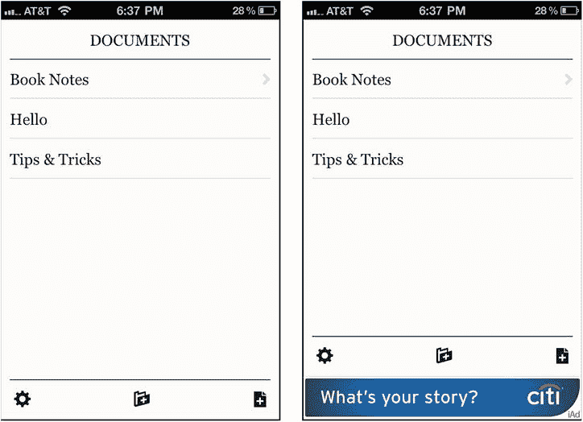

图 7-3。Hog Bay Software 的 PlainText 根据屏幕底部是否有 iAd 显示，动态调整应用 UI 的高度

Jesse 承认，他独家使用 iAd 的决定并未让他真正优化其应用内广告效果，尤其是因为 iAd 需要 iOS 4，所以在 iOS 3 上运行 `PlainText` 的用户根本看不到任何广告。尽管有这一限制，他对结果还是满意的。这款免费应用还提供了一个应用内购买选项来移除广告。

“与我的付费应用相比，`PlainText` 的下载量要多得多，但利润却更少，”Jesse 透露。“在略多于两个月的时间里，`PlainText` 获得了大约 225,000 次下载，通过应用内购买赚了大约 3,000 美元，通过 iAd 赚了大约 7,000 美元。”

尽管选择购买“移除广告”应用内购买项目的人数仅占 `PlainText` 总用户的大约 1%，但这仍然是该应用收入的重要组成部分。这种免费、广告支持应用结合用于移除广告和/或销售附加功能的 IAP 组件的混合模式，可以是一个非常强大的组合。

#### 设计两个版本：带广告版与无广告版

一些开发者不提供移除广告的应用内购买选项，而是简单地发布两个版本的应用：一个带广告的免费版和一个无广告的付费版。这是 Optime Software 采用的策略，这家公司完全建立在移动广告收入的基础上。该公司最初只发布了免费应用——`Checkers Free`、`Dots Free`、`Chess Free`、`Tic Tac Toe Free`、`Four in a Row Free` 以及其他经典游戏。他们的许多免费应用在 App Store 排行榜上持续名列前茅。


应客户要求，Optime Software 开始提供其游戏的无广告高级版本。CEO Jon Schlegel 解释道：“美国以外的许多用户没有无限数据套餐，他们担心广告下载带来的成本。用户对高级版本的反应非常积极。如果用户经常使用某款游戏，他们大多会购买其高级版本。”

与通过`PlainText`调整 UI 大小来动态显示或隐藏广告横幅框架不同，Optime Software 在设计其免费应用界面时，会特意为横幅广告预留空间。无广告的高级版本则能够利用整个屏幕，拉伸各个游戏元素之间的间距，为整体 UI 设计提供更多呼吸空间（参见图 7-4）。

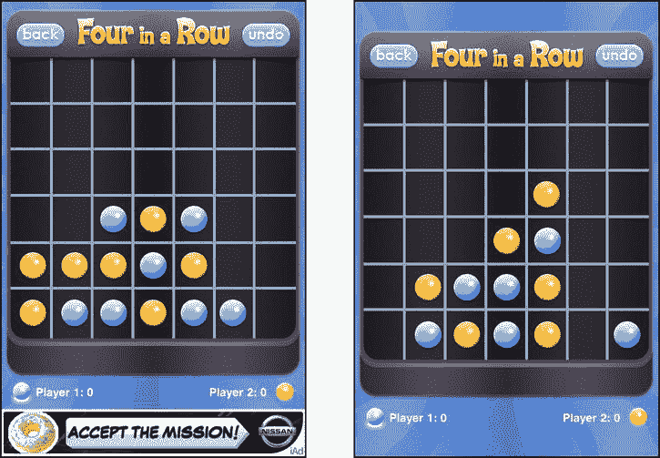

图 7-4. Optime Software 根据版本不同，调整其游戏中各种 UI 元素的位置。免费应用需要在屏幕底部为广告横幅留出足够空间（左图），而付费高级版本则无需如此（右图）

这种方法的明显缺点是开发和维护两个独立版本。Optime Software 在引入应用内购买之前很久就在使用这一策略，但这样做的一个显著好处是，在 App Store 中拥有两个应用，而不是只有一个。在免费和付费应用排行榜上都有应用，这种可见度的提升有助于推广两个版本。Jon 承认：“我们从广告支持的免费应用中获得的收入远高于高级应用，但免费应用也有助于提高可见度，并为我们的高级应用创造提升。我们许多高级应用能够进入其类别的前 100 名，完全依赖于免费版本的用户升级转化。”

---

找到广告网络的最佳组合

Focused Apps 的 Mark Johnson 在其众多免费应用（包括`Focus for Facebook`、`Hit Tennis 2`和`Santa's Lil' Zombies`）中，对应用内广告有着相当丰富的经验。他慷慨地分享了一些从大量实验中获得的宝贵见解，这些实验旨在找到 eCPM（有效每千次展示成本）和填充率的最佳组合。

“通过第三方广告赚钱很难。对我们来说，这只是收入的一小部分。要让‘免费+广告’模式奏效，你需要足够的用户量和一款粘性高的应用，”Mark 表示，“换句话说，你需要大量的下载量，一个用户经常使用的应用，并且他们会将应用保留在手机上，在很长一段时间内反复使用（而不是玩了一周后就删除）。”

`Focus for Facebook`展示了来自`iAd`、`AdMob`等领先广告网络的广告。广告横幅框架出现在屏幕底部，表格视图在其后方滚动（参见图 7-5）。这种布局使广告始终保持高度可见，同时不妨碍用户阅读 Facebook 信息流。

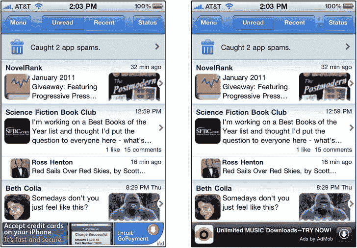

图 7-5. 免费的`Focus for Facebook`应用由应用内广告支持，展示来自`iAd`（左图）、`AdMob`（右图）及其他广告网络的广告

“在我们的一个应用中，我们使用`Burstly`作为广告网络集成商，这样如果`iAd`没有为我们提供广告，`Burstly`就会从其他广告网络中投放一个广告，”Mark 说。“不同的广告网络在填充率、eCPM、广告质量等方面各不相同，而且所有这些因素都因国家而异。我们大约一半的广告库存展示在美国，另一半在其他国家。我们一直在尝试不同的广告网络，以了解在不同国家能获得怎样的填充率和 eCPM。没有哪个广告网络在所有国家都表现最佳。自然，富裕国家的 eCPM 更高，但广告网络在每个国家的销售团队会影响他们能销售的量与价值，当然，英文文本广告不如当地语言的广告效果好。目前`iAd`在美国的回报不错，而且还在增长。我建议开发者优先考虑`iAd`，辅以`AdMob`和你自己的自有广告（`AdMob`有很好的内置自有广告解决方案）。也可以考虑使用`AdWhirl`或`Burstly`。”

---

利用自有广告的力量

正如我在本章前面提到的，自有广告是你为在应用广告横幅框架中展示而创建的自定义广告。如果你愿意放弃一些第三方广告来展示自己的自有广告，这将是推广其他创收服务和产品（如付费应用）的绝佳方式。Mark Johnson 就此话题分享了大量见解：

“免费应用自然会获得更多下载量，这是一个巨大的优势。我们在免费应用中的广告空间用途远不止展示第三方广告。我们通过展示自有广告来做很多事情，例如：引导用户升级到付费版本；推广应用内购买；宣传我们的其他应用；征求用户反馈以帮助我们规划下一版本；吸引人们加入我们的邮件列表；让用户为我们发推文宣传。我认为制作免费应用的最大优势并非广告收入，而是能够接触到大量用户，然后创造性地利用自有广告来辅助其他业务线。这非常有效。我们邮件列表约 95% 的注册来自‘加入邮件列表以解锁免费关卡’这样的自有广告，而只有 5% 来自我们的‘联系我们’页面。”

在免费应用中展示自有广告以交叉推广其他付费应用和应用内购买产品，这一策略也让`Backflip Studios`受益匪浅。其许多应用，例如超受欢迎的`Paper Toss`（参见图 7-6），都是常年热门，在 App Store 排行榜上名列前茅。凭借超过 4700 万次的 iOS 应用下载量，`Backflip Studios`通过在其多个免费应用中的应用内广告，每月收入达 50 万美元。而且这仅是将 60% 的广告展示机会分配给第三方广告（如`AdMob`）的结果。其余 40% 的广告展示机会是由`Backflip Studios`分配的自有广告，用于推广其所有其他应用，无论是免费还是付费版本。

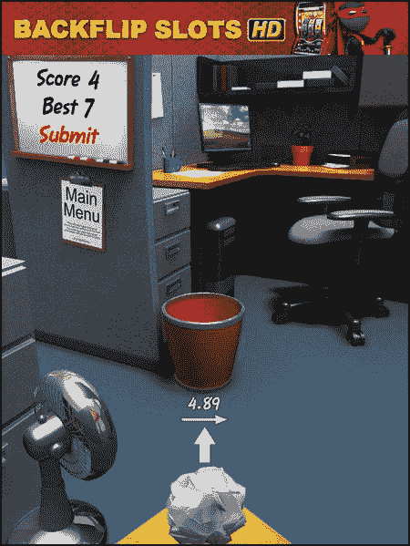

图 7-6. 适用于 iPad 的`Paper Toss HD Free`利用专用广告空间，不仅展示第三方广告，还展示`Backflip Studios`用于推广其他应用的自有广告

免费应用的平均使用率在下载后的前几周内会急剧下降，30 天后，只有不到 5% 的用户会重新使用该应用。要使应用内广告成为一项有利可图的收入来源，你的应用需要尽可能多地展示广告，这需要大量用户的持续使用。


如果你的应用完全依靠应用内广告来盈利，制定营销和开发策略就至关重要——这些策略不仅要能吸引新用户，还要能让应用的生命周期超过最初的 30 天平均值。因此，即使是提供免费应用，开发者也不能固步自封，坐等广告收入滚滚而来。你应该像对待付费应用一样，投入同样多的精力来推广和持续更新一款免费、由广告支持的应用，以确保你的应用内广告解决方案能够带来回报。

但如果你的免费应用一炮而红，冲进 App Store 前 100 名，那么通过应用内广告赚取大笔收入是可能的。如果你同时拥有多款排名靠前的免费应用都在产生广告收入，那么你手上就可能拥有一项非常有利可图的业务。

### 在你的 iOS 应用中集成苹果的 iAd

在了解了其他开发者通过应用内广告取得的成功后，你可能也迫不及待想亲身体验一下。由于篇幅所限，本书无法为每个第三方移动广告网络都提供集成说明，因此在示例中，我们将以 iAd 为例。一旦你掌握了如何在 iOS 应用中使用苹果的 iAd 框架，再自行学习其他第三方 SDK（例如 AdMob）就会变得非常容易。

我们将从使用 iAd 网络的基础知识开始，然后深入讲解设计和编程应用以支持 iAd 的完整流程。所以，卷起袖子，我们开始吧。

**注意**：如果你想了解更多关于 iAd 的信息，请查看以下苹果官方开发者链接（可能需要登录你的 iOS 开发者账号）：iAd 开发（`http://developer.apple.com/iad/`）和面向 iAd 的 App Store 资源中心（`http://developer.apple.com/appstore/resources/iad/`）。

#### 加入 iAd 网络

在开始使用 iAd 之前，即使是在 Xcode 的 iOS 模拟器中进行测试，你都需要先加入 iAd 网络。这是在 iTunes Connect 中完成的，请登录——`http://itunesconnect.apple.com`——然后导航至“合同、税务和银行”部分，以申请加入 iAd 网络（参见图 7-7）。

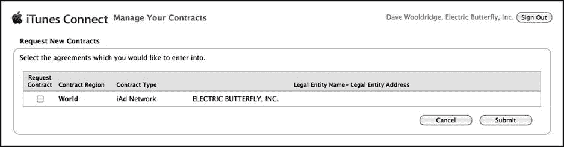

图 7-7. 在开始在你的应用中使用 iAd 框架之前，你首先必须在 iTunes Connect 中加入 iAd 网络

一旦你的 iAd 网络合同请求被苹果批准，你将能够使用 iAd 框架成功开发和测试你的应用。

需要注意的是，在 iOS 模拟器和你的测试设备上运行应用时，你唯一会看到的广告是默认的 iAd 测试广告。点击测试 iAd 横幅只会显示测试广告视图。你的应用不会显示真实的 iAd 横幅，除非你将该应用提交到 iTunes Connect 并在其中为该应用启用了 iAd。

#### 设计你的应用以展示 iAd 横幅

iAd 广告有两种类型。一种是典型的 iAd 横幅视图，在许多由广告支持的 iOS 应用中都能看到（例如，参见图 7-3 和 7-4）。另一种是全屏沉浸式广告，称为 iAd 插页视图，在 iOS 4.3 中引入。为简单起见，我们将在本书中只关注更流行的 iAd 横幅视图类型。如果你想了解更多关于实现 iAd 插页视图的信息，请查阅苹果 iOS 开发者中心的在线文档。

如果你已经在 iOS 应用中见过 iAd，那么你对它们的基本运作方式应该不陌生。一个 iAd 横幅被策略性地放置在应用的用户界面（UI）中，当用户点击时，不会离开当前应用。取而代之的是，一个全屏广告会以模态视图的形式在应用内部显示。关闭这个模态广告视图会将用户带回应用。

正如你所料，iAd 横幅的大小与其他移动广告尺寸非常相似：

*   竖屏 iPhone iAd 横幅：宽 320 点 × 高 50 点
*   横屏 iPhone iAd 横幅：宽 480 点 × 高 32 点
*   横屏 iPhone 5/5S iAd 横幅：宽 568 点 × 高 32 点
*   竖屏 iPad iAd 横幅：宽 768 点 × 高 66 点
*   横屏 iPad iAd 横幅：宽 1024 点 × 高 66 点

目标是将广告横幅插入到你应用的 UI 中，同时不干扰用户体验。但与此同时，你也希望将广告放在用户容易看到的位置，以获取展示次数和点击量。

如果你计划将 iAd 横幅框架放在屏幕顶部，苹果建议将其放置在顶部导航栏或工具栏的上方。如果你计划在屏幕底部附近显示 iAd 横幅框架，苹果也建议将其添加到工具栏或标签栏上方，但这并非在所有情况下都适用。例如，如果一个 iPad 应用使用底部带有工具栏的分割视图控制器，则无法将横屏广告横幅放置在这些工具栏上方，因为此时本质上存在两个不同的视图（在横屏模式下，主面板和详细面板是并排的）。在这种场景下，你需要将广告横幅放置在工具栏下方。

可能让许多开发者感到惊讶的是，`iAd` 横幅视图必须作为子视图添加到 `UIView` 中。如果你知道你的应用总是在屏幕上的某个固定位置显示广告，为什么不在 Interface Builder 中直接将 `iAd` 横幅视图添加到一个已有的 `UIView` 中呢？如果你的应用支持多个广告网络，你总是有广告可展示，那又为什么不这么做呢？实际上，有三个非常重要的原因，要求你确保广告视图可以在应用运行时动态地从 UI 中移除，正如 Hog Bay Software 的 PlainText 所演示的那样（参见图 7-3）：

*   如果用户的设备失去了蜂窝网络或 Wi-Fi 连接，你不希望你的应用显示一个空的广告横幅框架。一个大而空白的矩形占据 UI 中宝贵的屏幕空间，既难看又非常不专业。
*   当 `iAd` 横幅不可用或无法连接到 iAd 网络服务器时，苹果的应用审核团队会拒绝任何显示空白广告位的应用。苹果的 `iAd` 框架使得在代码中检测这一点变得很容易，它会在无法获取广告时通过 `iAd` 横幅代理向你的应用发送消息。
*   如果你计划提供一个应用内购买选项，让那些希望获得无广告体验的忠实用户能够移除广告，你肯定不希望购买后还有一个未使用且空的广告横幅框架留在屏幕上，毫无理由地扰乱应用的 UI。

对于那些计划在 `UITableView` 上方或某个特定 `UIView` 中的游戏画布上显示 iAd 的人，通过代码让 iAd 横幅在屏幕上可见是相当简单的。但对于那些需要调整多个控件尺寸以便为 iAd 横幅框架腾出空间的开发者来说，这无疑需要对 UI 组件和父控制器的设计进行一些改造。

不要轻易妥协你的应用设计来迁就 iAd 横幅，从而走上捷径。花时间弄清楚如何在不牺牲应用 UI 完整性的前提下集成 iAd 横幅。如果你还没有构建你的应用，那么这仅仅是在规划 UI 时就考虑好广告横幅的问题。但对于现有应用，这可能意味着需要重建许多视图，以包含新的父级 `UIView`，例如一个底层视图来容纳 iAd 横幅框架的嵌套子视图，以及包含你应用 UI 组件的顶层视图（参见图 7-8）。

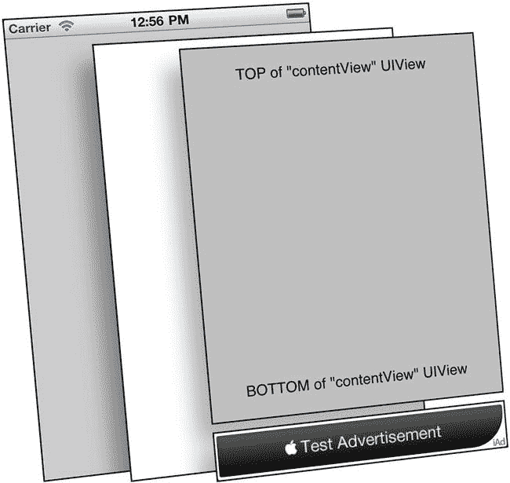


图 7-8. 某些应用可能需要重新设计视图层级，以便容纳必须作为`UIView`子视图的 iAd 横幅框架。

在图 7-8 中，顶部的`UIView`（在代码中赋值为`contentView`）充当应用 UI 控件的外部容器视图。如果你需要此父视图调整自身大小，以便在屏幕底部为 iAd 横幅腾出空间，则应设置嵌套 UI 控件的自动调整蒙版，从而使它们也能相应地调整大小或移动位置。如图 7-8 所示，文本内容为“BOTTOM of ‘contentView’ UIView”的`UILabel`已将其自动调整蒙版设置为在父视图`UIView`高度变化时向上移动。

图 7-8 中最底层代表应用的主窗口，其中嵌入了一个视图控制器。中间的白色图层是由该视图控制器调用的主`UIView`。此`UIView`默认被分配了出口`view`。名为`contentView`的`UIView`和 iAd 横幅框架都是父`UIView`（即`view`）的子视图。

如果这对你来说有点难以理解，别担心。当我们接下来逐步演示如何在 Xcode 示例项目中集成 iAd 时，一切都会变得清晰明了。当你看到实际运行效果时，就会理解`UIView`层级设计背后的逻辑。

就视觉效果而言，我们不希望 iAd 突然弹出，导致所有内容瞬间移位。这可能会让用户感到突兀。更优雅的方式是让 iAd 平滑地过渡到屏幕上，使用`UIView`动画将其滑入和滑出视图。当我们构建图 7-8 的通用应用示例（同时适用于 iPhone 和 iPad）时，你将看到如何将`UIView`动画与 iAd 横幅框架结合使用。请继续阅读...

### 编写应用以支持广告

让我们开始编写代码！首先，在深入 Xcode 之前，重要的是要确切理解我们这个示例项目需要实现什么功能。以下是基本功能概要：

*   检查设备的互联网连接。如果没有连接，则不执行任何操作，让应用的 UI 保持在正常的全屏状态。
*   如果设备有互联网连接，则向 iAd 网络请求一个 iAd 横幅。
*   如果 iAd 网络发来消息表明 iAd 横幅请求成功，则准备 iAd 横幅框架，广告横幅即可显示。
*   如果 iAd 网络回复说没有可用的 iAd 横幅，则准备一个备用广告横幅来显示。在本示例中，我们将展示一个内置的自家广告，但你也可以很容易地修改示例代码以支持第二个广告网络（例如 AdMob）。
*   当广告横幅（无论是 iAd 还是自家广告）准备好显示时，使用`UIView`动画将广告从屏幕底部滑入视图，并调整受影响的 UI 元素的位置，为广告横幅框架腾出空间。
*   如果应用之前正在显示广告横幅，但设备失去了互联网连接或没有新的广告横幅可显示，则使用相同的`UIView`动画技术将广告框架滑出视图，将应用的 UI 恢复为正常的全屏状态。

如果你只想在现有 UI 上方显示一个 iAd 横幅，可能会觉得这个详尽的教程有些大材小用。对于简单的 iAd 代码示例，请查看苹果的示例项目 iAdSuite，可从 iOS 开发中心在线获取：`http://developer.apple.com/library/ios/#samplecode/iAdSuite/`。

但对于那些对我上面列出的功能感兴趣的读者来说，我们即将构建的高级示例项目可能正是你所寻找的解决方案。本教程包含大量代码（与本书其他示例相比），因此为了避免大量手动输入，我强烈建议你下载本书配套的示例代码（来自 `http://www.iPhoneBusinessBook.com` 或 `http://www.apress.com`），然后在 Xcode 中打开包含的 `InAppAdv` 项目。即使你想自己逐步操作，从 `InAppAdv` 示例项目中复制粘贴一些代码也能为你节省宝贵的时间。

#### 创建新的 Xcode 项目

自 iOS 4.0 起，iAd 便可用于 iPhone 和 iPod touch，但直到 iOS 4.2 才在 iPad 上获得支持。为了兼顾所有读者，我们将构建一个通用应用示例，展示如何为 iPhone 和 iPad 目标设备实现 iAd 代码。

启动 Xcode 并创建一个新的 iOS 项目，选择“基于窗口的应用程序”模板。在选择该项目模板时，确保其“产品”下拉菜单设置为“通用”，但取消勾选“使用 Core Data 存储”复选框。将新项目命名为 `InAppAdv`。

#### 向项目添加 iAd 框架

要成功运行和编译带有 iAd 相关代码的应用，必须使用苹果的 iAd 框架。要将此框架添加到项目中，请按住 Control 键点击项目的 *Frameworks* 文件夹，然后从出现的上下文菜单中选择“添加” “现有框架...”（参见图 7-9）。接着从出现的列表中选择 `iAd.framework`。

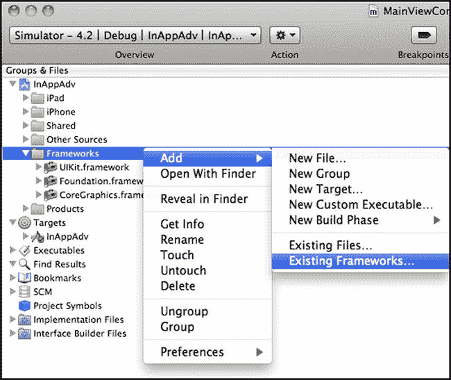

图 7-9. 将所需的 iAd.framework 添加到你的 Xcode 项目中。

为了专注于当前任务，本示例项目要求 iOS 4.2 或更高版本。如果你的应用需要支持更早的 iOS 版本，可以在项目中弱链接 iAd 框架。为此，请在“目标”组中选择项目的应用名称，点击“获取信息”按钮，然后在出现的“通用”标签页中，为 `iAd.framework` 选择“弱”作为链接方法（参见图 7-10）。

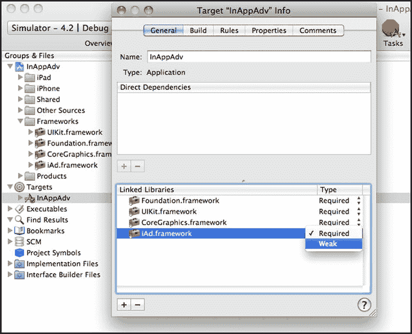

图 7-10. 弱链接 iAd.framework 以实现与 iOS 4 之前版本设备的向后兼容。

你可能还需要在应用内使用条件编码，以便在 iOS 4 设备上显示 iAd 横幅广告，而在较旧版本的 iOS 上显示自家广告或其他第三方广告横幅。有关实现向后兼容的更多信息，请查阅 iOS 开发中心。

#### 向项目添加苹果的 Reachability 类

当应用运行时，你需要代码来检查互联网连接。如果没有网络连接，请求广告横幅就毫无意义。无需花时间编写自定义的网络检测代码，苹果建议使用其 `Reachability` 类，该类可以作为 `Reachability` 示例项目的一部分从 iOS 开发中心下载，地址为 `http://developer.apple.com/library/ios/#samplecode/Reachability/`。

下载 `Reachability` 项目后，在 Xcode 中打开它。将 `Reachability` 项目中的 *Reachability.h* 和 *Reachability.m* 类文件拖放到你的 `InAppAdv` Xcode 项目窗口的 *Shared* 文件夹中（选择复制文件选项，而非移动文件）。

我们稍后将添加与 `Reachability` 类交互的代码。目前，只需按照与先前示例相同的框架插入说明，将 SystemConfiguration 框架添加到你的项目中。不出所料，`Reachability` 类需要 SystemConfiguration 框架中的网络功能。

#### 构建应用基础

在编写项目的核心功能之前，我们需要创建一些初始文件并编写一些基本代码。


在“Groups & Files”列中选择`iPhone`文件夹后，基于`UIViewController`子类创建一个新文件。通过勾选“带有 XIB 的用户界面”复选框为该类分配一个界面，并将新类命名为`MainViewController_iPhone`。

接着，在项目中选择`iPad`文件夹，创建另一个新的`UIViewController`子类，并恰当地命名为`MainViewController_iPad`。与其 iPhone 版本类似，确保勾选了“带有 XIB 的用户界面”复选框。尽管我们使用此类用于 iPad，但请取消勾选“Targeted for iPad”，以便默认`UIView`的自动调整大小掩码保持解锁状态。这将在稍后需要修改`UIView`自动调整大小掩码时发挥作用。

现在我们已经创建了必要的新类，打开`AppDelegate_iPhone.h`文件并添加以下以粗体显示的新代码：

```
#import <UIKit/UIKit.h>

@class MainViewController_iPhone;

@interface AppDelegate_iPhone : NSObject <UIApplicationDelegate> {
    UIWindow *window;
    MainViewController_iPhone *viewController;
}

@property (nonatomic, retain) IBOutlet UIWindow *window;
@property (nonatomic, retain) IBOutlet MainViewController_iPhone *viewController;

@end
```

如您所见，粗体代码行为`MainViewController_iPhone`类分配了一个新的`viewController`属性和`IBOutlet`。

同时，将相同的代码添加到`AppDelegate_iPad.h`中，注意将所有`MainViewController_iPhone`引用替换为`MainViewController_iPad`。

保存这些头文件后，打开`AppDelegate_iPhone.m`实现文件并添加以粗体显示的新代码：

```
#import "AppDelegate_iPhone.h"
#import "MainViewController_iPhone.h"

@implementation AppDelegate_iPhone

@synthesize window;
@synthesize viewController;

#pragma mark -
#pragma mark Application lifecycle

- (BOOL)application:(UIApplication *)application didFinishLaunchingWithOptions:(NSDictionary *)launchOptions {

// Override point for customization after application launch.

[window addSubview:viewController.view];
    [self.window makeKeyAndVisible];

return YES;
}

- (void)applicationWillResignActive:(UIApplication *)application {
}

- (void)applicationDidEnterBackground:(UIApplication *)application {
}

- (void)applicationWillEnterForeground:(UIApplication *)application {
}

- (void)applicationDidBecomeActive:(UIApplication *)application {
}

- (void)applicationWillTerminate:(UIApplication *)application {
}

#pragma mark -
#pragma mark Memory management

- (void)applicationDidReceiveMemoryWarning:(UIApplication *)application {
}

- (void)dealloc {
    [viewController release];
    [window release];
    [super dealloc];
}

@end
```

这段新代码将`viewController`作为子视图添加到应用的主窗口中。

同时，在`AppDelegate_iPad.m`中插入相同的新代码，注意将`#import` `MainViewController_iPad.h` 替换为 `MainViewController_iPhone.h`。

在添加了正确的代码后，是时候进行一些界面工作了。请按照以下步骤操作：

1.  在 Interface Builder 中打开`MainWindow_iPhone.xib`。
2.  从库面板中拖拽一个`UIViewController`到浏览器窗口中，并将其引用的输出口`viewController`连接到应用委托模块。
3.  在浏览器窗口中选择`UIViewController`后，在检查器面板的“属性”选项卡中，将其 NIB 分配给`MainViewController_iPhone.xib`，并勾选“从 NIB 调整视图大小”（参见图 7-11）。

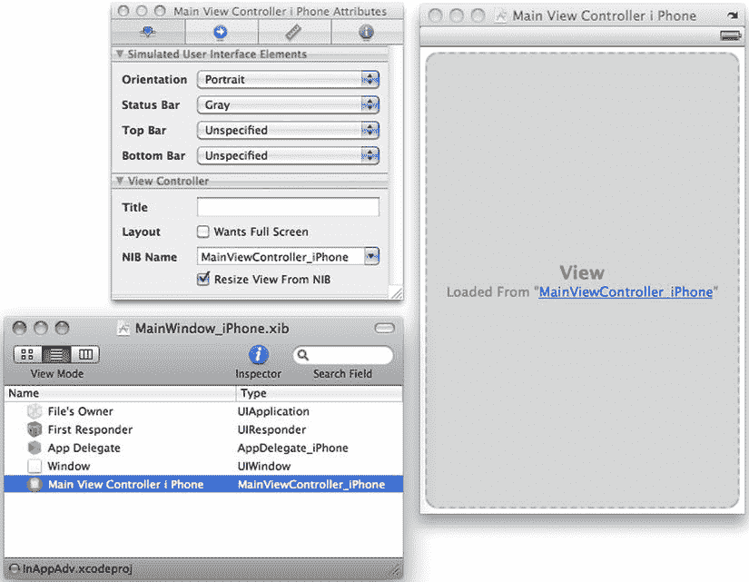

图 7-11. 通过新的 UIViewController 配置 MainWindow_iPhone.xib，该 UIViewController 加载 MainViewController_iPhone

4.  在检查器面板的“标识”选项卡中，将其类更改为`MainViewController_iPhone`。

您需要在 Interface Builder 中对`MainWindow_iPad.xib`执行相同的步骤，只是`UIViewController`的 NIB 应分配给`MainViewController_iPad.xib`，并且其类更改为`MainViewController_iPad`。

#### 检查 iOS 设备的网络连接

还记得将苹果的`Reachability`类添加到项目中吗？现在您需要编写代码，利用这个便捷的网络检测类。在 Xcode 中打开`MainViewController_iPhone.h`文件，并添加以下粗体代码：

```
#import <UIKit/UIKit.h>

@class Reachability;

@interface MainViewController_iPhone : UIViewController {

UIView *contentView;
    Reachability* netReachable;
    BOOL isNetAvailable;
}

@property (nonatomic, retain) IBOutlet UIView *contentView;

- (void)reachabilityChanged:(NSNotification*)note;

@end
```

本质上，这段代码设置了一些与`Reachability`相关的属性和一个方法，以及一个名为`contentView`的新`UIView`属性和`IBOutlet`引用。您还需要将相同的新代码行添加到`MainViewController_iPad.h`中。

接下来，转到`MainViewController_iPhone.m`实现文件，添加以下以粗体显示的新代码：

```
#import "MainViewController_iPhone.h"
#import "Reachability.h"

@implementation MainViewController_iPhone

@synthesize contentView;

// Uncommented viewDidLoad and added Reachability code.
- (void)viewDidLoad {
    [super viewDidLoad];

// Check the current device's Internet connection
    // using Apple's Reachability classes. When the status
    // changes, a notification is posted, calling the
    // reachabilityChanged method.
    [[NSNotificationCenter defaultCenter] addObserver: self selector: @selector(reachabilityChanged:) name: kReachabilityChangedNotification object: nil];
    netReachable = [[Reachability reachabilityWithHostName: @"www.apple.com"] retain];
    [netReachable startNotifier];
}

// Uncommented and return YES.
- (BOOL)shouldAutorotateToInterfaceOrientation:
                (UIInterfaceOrientation)interfaceOrientation {
    // Return YES to support both Portrait and Landscape orientations.
    return YES;
}

//Called by Reachability whenever status changes.
- (void) reachabilityChanged: (NSNotification* )note {

NetworkStatus netStatus = [netReachable currentReachabilityStatus];
    switch (netStatus)
    {
        case NotReachable:
        {
            isNetAvailable = NO;
            break;
        }
        case ReachableViaWiFi:
        {
            isNetAvailable = YES;
            break;
        }
        case ReachableViaWWAN:
        {
            isNetAvailable = YES;
            break;
        }
    }
}

- (void)didReceiveMemoryWarning {
    [super didReceiveMemoryWarning];
}

- (void)viewDidUnload {
    self.contentView = nil;
    [super viewDidUnload];
}

- (void)dealloc {
    [contentView release];
    [[NSNotificationCenter defaultCenter] removeObserver:self];
    [super dealloc];
}

@end
```

新添加的代码设置了访问`Reachability`功能和`NSNotificationCenter`的权限，以便该类可以检查设备网络连接的当前状态，并在状态发生变化时始终收到通知。这决定了您的应用是否有互联网访问权限，是在尝试与广告网络服务器通信之前必须了解的重要信息。如果检测到可行的网络连接，则布尔值`isNetAvailable`被设置为`YES`。

与本教程前面的步骤一样，您还需要将相同的粗体代码行添加到`MainViewController_iPad.m`中。

#### 构建应用的界面和 UIView 层次结构

您可能注意到了`MainViewController_iPhone`和`MainViewController_iPad`类中名为`contentView`的新`UIView`属性。现在`IBOutlet`代码已就位，让我们在 Interface Builder 中完成该`UIView`的配置，以及本示例中的其他一些 UI 元素。


1.  在 Interface Builder 中打开 `MainViewController_iPhone.xib`。
2.  在浏览器窗口中，你应该已经能看到一个 `UIView`，它已经连接到了默认的 `view` 引用插座。从库面板中拖拽一个新的 `UIView` 到浏览器窗口，并小心地将其定位为现有 `UIView` 的嵌套子视图。将 `contentView` 的插座从 File's Owner 模块连接到这个新的、嵌套的 `UIView`。嵌套的 `UIView`（名为 `contentView`）和 iAd 横幅框架都将作为主父视图 `UIView`（名为 `view`）的子视图。
3.  选中该嵌套的 `UIView`，导航到检查器面板的视图大小标签页，并修改其自动调整大小遮罩，使其自动全屏扩展（参见图 7-12）。父 `UIView` 也应设置相同的自动调整大小遮罩（如果默认情况下尚未设置）。

    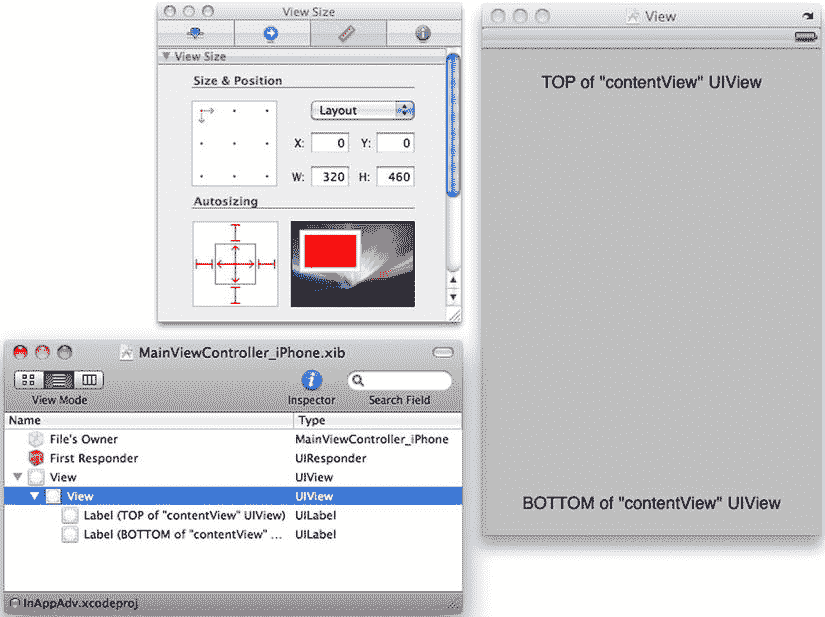

    图 7-12。在 `MainViewController_iPhone.xib` 中，构建嵌套的 `UIView` 层次结构、UI 元素和自动调整大小遮罩

    **注意** 尽管库面板确实提供了一个 iAd `BannerView` 组件，但*不要*在 Interface Builder 中将其添加到视图。在本例中，至关重要的一点是 iAd 横幅框架只能通过编程方式添加，这样 iAd 就可以根据运行时广告可用性和其他因素动态地滑入和滑出屏幕。你很快就会看到如何编写那段 iAd 代码。

4.  选中嵌套的 `UIView`（名为 `contentView`），在检查器面板的属性标签页中将其 Color Tint 更改为 75% 灰度，这样我们在屏幕上显示时，可以轻松地将这个 `UIView` 与其白色的父 `UIView` 区分开来。这个灰色的 `UIView` 将是你放置此屏幕所有 UI 元素的地方。可以将其视为应用界面的容器，其高度会根据需要调整，以便为屏幕底部的广告横幅框架腾出空间。
5.  为了演示方便，从库面板中向该嵌套的 `UIView` 添加两个 `UILabel`。
6.  将一个 `UILabel` 移动到视图顶部，其标签文本设置为 **TOP of “contentView” UIVIew**。将该 `UILabel` 的自动调整大小遮罩设置为始终固定在屏幕顶部。
7.  将第二个 `UILabel` 移动到视图底部，为其设置标签文本 **BOTTOM of “contentView” UIView**。将第二个 `UILabel` 的自动调整大小遮罩设置为始终固定在屏幕底部。

    **注意** 如果你不确定如何配置自动调整大小遮罩上的括号，请查看本书可下载的 `InAppAdv` 项目，了解如何设置的示例。

记得也要将这些添加和修改应用到 `MainViewController_iPad.xib`。

为什么使用 `UILabel`？它们用作可见标记，指示在通过代码调整灰色 `contentView` 所分配的 `UIView` 的大小以为广告横幅框架腾出空间时，其顶部和底部的具体位置。当你在 iOS 模拟器或测试设备上运行应用并看到实际效果时，这一点会非常明显。但我们还没有准备好执行这一步。

最后一步是项目中最重要的一部分：编写管理整个应用内广告流程（从广告横幅请求到屏幕显示）的代码。

**注意** 你可能会发现一些 UI 组件，例如 `UINavigationController`，无法在 Interface Builder 中添加到 `UIView`。对于这些情况，解决方案是在 Xcode 中以编程方式创建这些 UI 组件，并通过代码将它们作为子视图添加到 `UIView`。

##### 将您的自有广告图片文件复制到项目

如果出现没有 iAd 可供显示的情况，您需要显示一个替代广告横幅。在本例中，我们显示一个自有广告。在开始编写处理 iAd 和您替代广告横幅的代码之前，您需要为您的自有广告创建实际的图像文件，并将它们作为资源添加到 Xcode 项目中。

为了支持 iPhone 和 iPad 的所有设备方向及显示分辨率，您需要按照下面列出的确切文件名和 PNG 格式，创建六种不同尺寸的自有广告，以便它们能与示例代码配合使用：

*   `adbannerportrait-iphone.png`（320 像素 × 50 像素）
*   `adbannerportrait-iphone@2x.png`（Retina：640 像素 × 100 像素）
*   `adbannerlandscape-iphone.png`（480 像素 × 32 像素）
*   `adbannerlandscape-iphone@2x.png`（Retina：960 像素 × 64 像素）
*   `adbannerportrait-ipad.png`（768 像素 × 66 像素）
*   `adbannerlandscape-ipad.png`（1024 像素 × 66 像素）

为了保持一致性，自有广告使用与 iAd 支持的相同横幅尺寸。iAd Network 会动态地为 Retina 显示设备提供高分辨率 iAd 横幅，因此为了保持相同的分辨率质量，您也应该为您的自有广告创建 Retina 显示横幅尺寸。

如果您不想仅仅为了完成本教程而设计自己的自有广告，那么作为占位符，请将本书可下载的 `InAppAdv` 项目中的六个自有广告 PNG 图像文件复制到您的 Xcode 项目的 `Shared` 文件夹中。

##### 编写应用内广告代码

在最后一步中，您将最终添加用于管理 iAd 横幅框架和替代自有广告的代码，以及用于适应广告横幅而动态调整应用 UI 大小的代码。这部分需要添加*大量*新代码。为了避免繁琐的手动输入，我再次建议您下载本书的配套代码示例，以便您可以将包含的 `InAppAdv` 项目中的相关代码复制并粘贴到您的 Xcode 项目中。

打开 `MainViewController_iPhone.h` 并添加以下新代码行（以粗体显示）：

```
#import <UIKit/UIKit.h>
#import <iAd/iAd.h>

@class Reachability;

@interface MainViewController_iPhone : UIViewController <ADBannerViewDelegate> {

UIView *contentView;
    ADBannerView *adBannerView;
    UIButton *altAdBannerButton;
    Reachability* netReachable;
    BOOL isNetAvailable;
}

@property (nonatomic, retain) IBOutlet UIView *contentView;
@property (nonatomic, retain) IBOutlet ADBannerView *adBannerView;
@property (nonatomic, retain) IBOutlet UIButton *altAdBannerButton;

- (void)reachabilityChanged:(NSNotification*)note;
- (void)prepareAdBannerView;
- (void)prepareAltAdBanner;
- (void)adjustAdBannerPosition:(BOOL)animated;
- (void)tappedAltAdBanner;

@end
```

简而言之，这段新代码导入了 `iAd.h` 头文件，并初始化了几个新的与广告相关的属性和方法，用于处理 iAd 和替代自有广告。

请注意，使用的 iAd 横幅类型是 `ADBannerView`。为了接收来自 iAd Network 的消息，该类被分配为 `ADBannerViewDelegate`。为了确保自有广告像真实广告横幅一样可点击，它将通过代码创建为一个基于图像的 `UIButton`。当我们把这些相应的方法添加到 `MainViewController.m` 文件中时，我将解释 iAd 和替代自有广告的准备和显示是如何编程的。

当然，您还需要将相同的粗体代码添加到 `MainViewController_iPad.h`：

```
#import <UIKit/UIKit.h>
#import <iAd/iAd.h>

@class Reachability;

@interface MainViewController_iPad : UIViewController <ADBannerViewDelegate> {

UIView *contentView;
    ADBannerView *adBannerView;
    UIButton *altAdBannerButton;
    Reachability* netReachable;
    BOOL isNetAvailable;
}

@property (nonatomic, retain) IBOutlet UIView *contentView;
@property (nonatomic, retain) IBOutlet ADBannerView *adBannerView;
@property (nonatomic, retain) IBOutlet UIButton *altAdBannerButton;

- (void)reachabilityChanged:(NSNotification*)note;
- (void)prepareAdBannerView;
- (void)prepareAltAdBanner;
- (void)adjustAdBannerPosition:(BOOL)animated;
- (void)tappedAltAdBanner;

@end
```


现在我们来处理到目前为止最大的一段代码，它添加了应用内广告功能的主体部分。打开 `MainViewController_iPhone.m` 实现文件，插入以下以粗体**加粗**高亮的新代码：

```
#import "MainViewController_iPhone.h"
#import "Reachability.h"

@implementation MainViewController_iPhone

@synthesize contentView;
@synthesize adBannerView;
@synthesize altAdBannerButton;

- (void)viewDidLoad {
    [super viewDidLoad];

// 使用 Apple 的 Reachability 类检查当前设备的互联网连接
    // 当状态变化时，会发送通知，调用 reachabilityChanged 方法。
    [[NSNotificationCenter defaultCenter] addObserver: self selector: @selector(reachabilityChanged:) name: kReachabilityChangedNotification object: nil];
    netReachable = [[Reachability reachabilityWithHostName: @"www.apple.com"] retain];
    [netReachable startNotifier];

// 配置并请求一个 iAd 横幅广告。
    [self prepareAdBannerView];

// 在 iAd 横幅广告不可用时，配置一个备用广告横幅。
    [self prepareAltAdBanner];

// 调整应用 UI，使广告横幅显示在屏幕底部。
    [self adjustAdBannerPosition:NO];
}

-(void)viewWillAppear:(BOOL)animated
{
    [super viewWillAppear:animated];
    [self adjustAdBannerPosition:NO];
}

- (void)willRotateToInterfaceOrientation:(UIInterfaceOrientation)toInterfaceOrientation duration:(NSTimeInterval)duration {

[self adjustAdBannerPosition:YES];
}

- (BOOL)shouldAutorotateToInterfaceOrientation:
                (UIInterfaceOrientation)interfaceOrientation {
    // 返回 YES 以支持竖屏和横屏两种方向。
    return YES;
}

// 当网络状态改变时，由 Reachability 调用。
- (void) reachabilityChanged: (NSNotification* )note {

NetworkStatus netStatus = [netReachable currentReachabilityStatus];
    switch (netStatus)
    {
        case NotReachable:
        {
            isNetAvailable = NO;
            break;
        }
        case ReachableViaWiFi:
        {
            isNetAvailable = YES;
            break;
        }
        case ReachableViaWWAN:
        {
            isNetAvailable = YES;
            break;
        }
    }
}

- (void)prepareAdBannerView {
    // 此方法在屏幕外创建并配置 iAd 横幅视图。

// 根据设备当前方向计算横幅视图的大小。
    NSString *adBannerSize = UIInterfaceOrientationIsPortrait([UIDevice currentDevice].orientation)    ? ADBannerContentSizeIdentifierPortrait : ADBannerContentSizeIdentifierLandscape;

// 初始时，此 iAd 横幅视图将放置在屏幕外。
    // 一旦广告准备好显示，横幅视图才会显示出来。
    CGRect adFrame;
    adFrame.size = [ADBannerView sizeFromBannerContentSizeIdentifier:adBannerSize];
    adFrame.origin = CGPointMake(0.0, CGRectGetMaxY(self.view.bounds));

// 创建 iAd 横幅。
    ADBannerView *adBanner = [[ADBannerView alloc] initWithFrame:adFrame];

// 将 iAd 横幅的代理设置为 self，以便接收 iAd 通知。
    adBanner.delegate = self;

// 告知 iAd 网络本应用支持的广告尺寸
    // （本例中，同时支持竖屏和横屏）。
    adBanner.requiredContentSizeIdentifiers = [NSSet setWithObjects:ADBannerContentSizeIdentifier    Portrait, ADBannerContentSizeIdentifierLandscape, nil];

// 将 iAd 横幅视图添加到父视图中。
    // 此时它正在向 iAd 网络请求广告。
    [self.view addSubview:adBanner];
    self.adBannerView = adBanner;
    [adBanner release];
    [adBannerSize release];
}

- (void)prepareAltAdBanner {
    // 此方法在屏幕外创建并配置一个自定义的内置广告横幅，
    // 用于 iAd 横幅不可用的情况。但下面的代码可以轻松替换，
    // 以显示来自其他广告网络（如 AdMob）的广告。

// 根据设备当前方向创建备用广告横幅。
    UIImage *altAdImg = [[[UIImage alloc] init] autorelease];
    NSString *adBannerImage = [[NSString alloc] init];
    if (UIInterfaceOrientationIsLandscape([UIDevice currentDevice].orientation)) {
        adBannerImage = @"adbannerlandscape-iphone.png";
    } else {
        adBannerImage = @"adbannerportrait-iphone.png";
    }
    altAdImg = [UIImage imageNamed:adBannerImage];

UIButton *altButton = [[UIButton buttonWithType:UIButtonTypeCustom] autorelease];
    [altButton setBackgroundImage:altAdImg forState:UIControlStateNormal];
    [altButton addTarget:self action:@selector(tappedAltAdBanner) forControlEvents:UIControlEvent    TouchUpInside];
    self.altAdBannerButton = altButton;

// 初始时，此广告横幅将放置在屏幕外。
    // 一旦广告准备好显示，广告横幅才会显示出来。
    CGRect adFrame = CGRectMake(0.0, CGRectGetMaxY(self.view.bounds), altAdImg.size.width,     altAdImg.size.height);
    self.altAdBannerButton.frame = adFrame;

// 将备用广告横幅添加到父视图中。
    [self.view addSubview:self.altAdBannerButton];
    [adBannerImage release];
}

- (void)tappedAltAdBanner {
    // 用户点击了备用广告横幅，因此执行相应操作。
    // 在这个简单的示例中，备用广告横幅链接到一个 URL。
    NSURL *url = [NSURL URLWithString:@"http://www.iPhoneBusinessBook.com/"];
    [[UIApplication sharedApplication] openURL:url];
}

- (void)adjustAdBannerPosition:(BOOL)animated {
    // 设置一些用于计算位置和动画的初始属性。
    CGFloat animationDuration = animated ? 0.3 : 0.0;
    CGRect viewFrame = self.view.bounds;
    CGFloat iAdPosition = self.view.frame.size.height;
    CGFloat iAdHeight = 0.0;
    CGFloat altAdPosition = self.view.frame.size.height;
    CGFloat altAdWidth = 0.0;
    CGFloat altAdHeight = 0.0;
    UIImage *altAdImage = [[[UIImage alloc] init] autorelease];

if (UIInterfaceOrientationIsLandscape([UIDevice currentDevice].orientation)) {
        // 横屏 iPhone 高度：320 - 20 像素状态栏 = 300。
        adBannerView.currentContentSizeIdentifier = ADBannerContentSizeIdentifierLandscape;
        iAdPosition = 300.0;
        // 横屏 iAd 横幅尺寸：宽度 480，高度 32。
        iAdHeight = adBannerView.frame.size.height;
        altAdImage = [UIImage imageNamed:@"adbannerlandscape-iphone.png"];
        altAdPosition = 300.0;
    } else {
        // 竖屏 iPhone 高度：480 - 20 像素状态栏 = 460。
        adBannerView.currentContentSizeIdentifier = ADBannerContentSizeIdentifierPortrait;
        iAdPosition = 460.0;
        // 竖屏 iAd 横幅尺寸：宽度 320，高度 50。
        iAdHeight = adBannerView.frame.size.height;
        altAdImage = [UIImage imageNamed:@"adbannerportrait-iphone.png"];
        altAdPosition = 460.0;
    }
    [altAdBannerButton setBackgroundImage:altAdImage forState:UIControlStateNormal];
    altAdWidth = altAdImage.size.width;
    altAdHeight = altAdImage.size.height;

// 检查互联网连接状态，决定是否显示广告。
    if (isNetAvailable) {
        // 是，互联网连接可用，因此显示广告横幅。

if (adBannerView.bannerLoaded) {
            // iAd 已成功加载到广告横幅中，
            // 因此将其滑入视图。同时调整 contentView 的高度，
            // 为底部的广告横幅腾出空间。

// 调整 iAd 横幅上方 contentView 的高度。
            viewFrame.size.height -= iAdHeight;

// 由于未使用备用广告横幅，
            // 将其位置调整到屏幕外。
            altAdPosition += altAdHeight;

// 现在调整 iAd 横幅的屏幕内位置。
            iAdPosition -= iAdHeight;
```


```objective-c
} else {
    // iAd 不可用或发生错误，
    // 因此显示备用广告横幅。
    // 在此示例中，显示的是自定义的内部广告，
    // 但以下代码可以轻松替换为
    // 显示来自其他广告网络（如 AdMob）的广告。

    // 调整备用广告横幅上方内容视图的高度。
    viewFrame.size.height -= altAdHeight;

    // 由于未使用 iAd，将 iAd 位置移出屏幕。
    iAdPosition += iAdHeight;

    // 现在调整备用广告横幅的屏幕显示位置。
    altAdPosition -= altAdHeight;
}

} else {
    // 不，网络连接不可用，因此隐藏广告横幅。

    // 将两个横幅视图都移出屏幕。
    iAdPosition += iAdHeight;
    altAdPosition += altAdHeight;
}

// 将请求的广告横幅滑入视野，
// 并将另一个广告横幅视图移出屏幕。
[UIView animateWithDuration:animationDuration animations:^{
    contentView.frame = viewFrame;
    [contentView layoutIfNeeded];
    adBannerView.frame = CGRectMake(0.0, iAdPosition, adBannerView.frame.size.width, adBannerView.frame.size.height);
    altAdBannerButton.frame = CGRectMake(0.0, altAdPosition, altAdWidth, altAdHeight);
}];
```

```objective-c
// 作为 ADBannerViewDelegate，此类将接收来自 iAd 框架的消息，
// 通知您的应用 iAd 横幅是否已加载。
#pragma mark ADBannerViewDelegate 方法

- (void)bannerViewDidLoadAd:(ADBannerView *)banner {
    [self adjustAdBannerPosition:YES];
}

- (void)bannerView:(ADBannerView *)banner didFailToReceiveAdWithError:(NSError *)error {
    [self adjustAdBannerPosition:YES];
}

- (BOOL)bannerViewActionShouldBegin:(ADBannerView *)banner willLeaveApplication:(BOOL)willLeave {
    return YES;
}

- (void)bannerViewActionDidFinish:(ADBannerView *)banner {
}
// ADBannerViewDelegate 方法结束

- (void)didReceiveMemoryWarning {
    [super didReceiveMemoryWarning];
}

- (void)viewDidUnload {
    self.contentView = nil;
    adBannerView.delegate = nil;
    self.adBannerView = nil;
    [super viewDidUnload];
}

- (void)dealloc {
    [contentView release];
    adBannerView.delegate = nil;
    [adBannerView release];
    [altAdBannerButton release];
    [[NSNotificationCenter defaultCenter] removeObserver:self];
    [super dealloc];
}

@end
```

我在该代码中穿插了一些有用的注释，因此快速阅读 `MainViewController_iPhone.m` 后，您可能已经对这里所涉及的概念有了很好的理解。但为了确保详尽无遗，让我们逐步过一遍，看看每个部分是如何运作的。

除了在相应部分对与广告相关的属性进行合成和释放之外，您会注意到 `viewDidLoad` 事件调用了 `prepareAdBannerView`、`prepareAltAdBanner` 和 `adjustAdBannerPosition`，因此我们从这些方法开始。

`prepareAdBannerView` 方法会创建一个新的 `ADBannerView` 实例，根据设备当前方向设置其广告框架尺寸，然后向 iAd 网络发送 iAd 请求。最初，这个 iAd 横幅框架被放置在屏幕之外。只有当从 iAd 网络成功接收到 iAd 横幅后，iAd 横幅框架才会显示在屏幕上。将 iAd 移入视野的操作是在 `adjustAdBannerPosition` 方法中完成的。

那么，您的应用如何知道何时有 iAd 横幅可以显示？作为 `ADBannerViewDelegate`，此类在 `prepareAdBannerView` 方法发送请求后会从 iAd 网络接收消息。当收到 iAd 网络回复时，`bannerView:didFailToReceiveAdWithError:` 事件会被触发。如果无法加载 iAd 横幅，则布尔值 `ADBannerView.bannerLoaded` 会被设置为 `NO`。如果 iAd 成功加载，则该布尔值会被设置为 `YES`。当接收到的 iAd 完成加载到 `ADBannerView` 框架时，`bannerViewDidLoadAd` 事件会被触发。当 `bannerView:didFailToReceiveAdWithError:` 或 `bannerViewDidLoadAd` 事件中的任意一个被触发时，无论是否有 iAd 要显示，都应该调用 `adjustAdBannerPosition` 方法。

为了应对 iAd 网络无法提供 iAd 的情况，此示例项目包含了一个备用方案，即显示内部广告。`prepareAltAdBanner` 方法会创建一个新的基于图像的 `UIButton` 实例，用于在 iAd 不可用时显示替代的内部广告。这个 `UIButton` 被配置好并放置在屏幕之外，直到需要时才使用。当然，如果您更愿意使用第三方广告横幅作为备用选项而不是内部广告，您可以轻松地使用自己的代码自定义此方法，以从其他广告网络（如 AdMob 或 InMobi）请求和配置广告。

`adjustAdBannerPosition` 方法负责所有繁重的工作，包括将适当的广告横幅移动到屏幕上，以及调整现有 UI 元素的大小以适应广告横幅框架。同时，它还在网络连接丢失时负责移除广告横幅并将应用的 UI 恢复到正常的全屏状态。这种将广告横幅滑入和滑出视野的过渡是通过使用 `UIView` 动画实现的（参见图 7-13）。

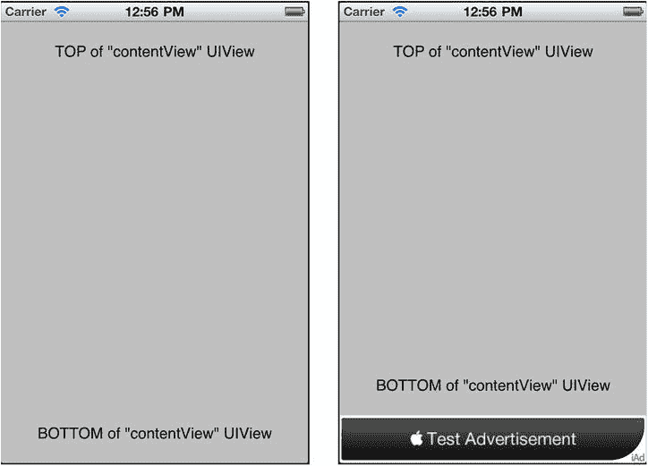

图 7-13. 使用 UIView 动画，`adjustAdBannerPosition` 方法负责将广告横幅滑入和滑出视野，并根据需要调整应用其余 UI

`adjustAdBannerPosition` 方法配置并协调 iAd 横幅框架和内部广告 `UIButton` 的放置。如果 iAd 可用，那么 iAd 横幅框架会被分配屏幕上的像素位置，而内部广告则被赋予屏幕外的位置。如果没有 iAd 可显示，则情况相反，内部广告获得屏幕上的位置，而 iAd 横幅框架被降级为屏幕外的坐标（参见图 7-14）。如果设备失去网络连接，则 iAd 横幅框架和内部广告 `UIButton` 都会被赋予屏幕外的像素位置。

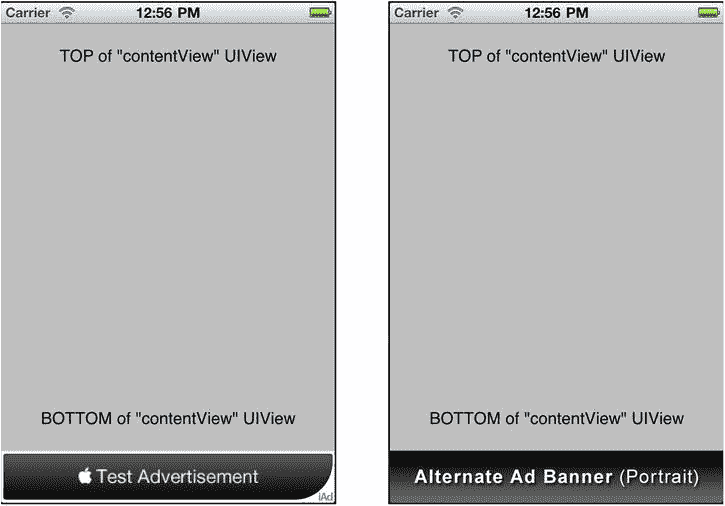

图 7-14. 如果 iAd 可用，则在屏幕上显示它。在缺少 iAd 横幅的情况下，则显示替代的内部广告

为了确保当设备方向改变时，所显示的广告横幅和受影响的 UI 元素能够正确放置（并具有正确的广告尺寸），您还需要将原生的 Cocoa Touch 事件 `viewWillAppear` 和 `willRotateToInterfaceOrientation` 添加到 `MainViewController_iPhone.m` 代码中。当这两个事件中的任意一个被触发时，都应该调用 `adjustAdBannerPosition` 方法。

如果 iAd 横幅被点击，则会显示 iAd 的模态视图广告，并占据整个屏幕（宿主应用在后台闲置，直到 iAd 被关闭）。但是，当显示替代的内部广告时，用户点击该横幅会发生什么？作为一个 `UIButton`，其动作选择器被设置为调用 `tappedAltAdBanner` 方法。目前，该方法中的示例代码会在 Mobile Safari 中启动 `http://www.iPhoneBusinessBook.com`，但您可以轻松地将该代码替换为您选择的自定义操作。


要完成该项目，请务必将 `MainViewController_iPhone.m` 中的新代码添加到其 iPad 版本的 `MainViewController_iPad.m` 中。所有新代码应该是相同的，但 `prepareAltAdBanner` 和 `adjustAdBannerPosition` 方法除外，这两个方法包含 iPad 专用代码，如下所示：

```objc
- (void)prepareAltAdBanner {
    // 此方法在屏幕外创建并配置一个自定义的内置广告横幅，
    // 以便在 iAd 横幅不可用时使用。但下面的代码可以
    // 轻松替换为显示其他广告网络（如 AdMob）的广告。

    // 根据设备的当前方向创建备用广告横幅。
    UIImage *altAdImg = [[[UIImage alloc] init] autorelease];
    NSString *adBannerImage = [[NSString alloc] init];
    if (UIInterfaceOrientationIsLandscape([UIDevice currentDevice].orientation)) {
        adBannerImage = @"adbannerlandscape-ipad.png";
    } else {
        adBannerImage = @"adbannerportrait-ipad.png";
    }
    altAdImg = [UIImage imageNamed:adBannerImage];

    UIButton *altButton = [[UIButton buttonWithType:UIButtonTypeCustom] autorelease];
    [altButton setBackgroundImage:altAdImg forState:UIControlStateNormal];
    [altButton addTarget:self action:@selector(tappedAltAdBanner) forControlEvents:UIControlEventTouchUpInside];
    self.altAdBannerButton = altButton;

    // 初始时，此广告横幅将放置在屏幕外。
    // 当广告准备好显示后，再将广告横幅显示出来。
    CGRect adFrame = CGRectMake(0.0, CGRectGetMaxY(self.view.bounds), altAdImg.size.width, altAdImg.size.height);
    self.altAdBannerButton.frame = adFrame;

    // 将备用广告横幅添加到父视图。
    [self.view addSubview:self.altAdBannerButton];
    [adBannerImage release];
}

- (void)adjustAdBannerPosition:(BOOL)animated {
    // 设置一些用于计算位置和动画的初始属性。
    CGFloat animationDuration = animated ? 0.3 : 0.0;
    CGRect viewFrame = self.view.bounds;
    CGFloat iAdPosition = self.view.frame.size.height;
    CGFloat iAdHeight = 0.0;
    CGFloat altAdPosition = self.view.frame.size.height;
    CGFloat altAdWidth = 0.0;
    CGFloat altAdHeight = 0.0;
    UIImage *altAdImage = [[[UIImage alloc] init] autorelease];

    if (UIInterfaceOrientationIsLandscape([UIDevice currentDevice].orientation)) {
        // 横屏 iPad 高度：768 - 20 像素状态栏 = 748。
        adBannerView.currentContentSizeIdentifier = ADBannerContentSizeIdentifierLandscape;
        iAdPosition = 748.0;
        // 横屏 iAd 横幅尺寸：宽 1024，高 66。
        iAdHeight = adBannerView.frame.size.height;
        altAdImage = [UIImage imageNamed:@"adbannerlandscape-ipad.png"];
        altAdPosition = 748.0;
    } else {
        // 竖屏 iPad 高度：1024 - 20 像素状态栏 = 1004。
        adBannerView.currentContentSizeIdentifier = ADBannerContentSizeIdentifierPortrait;
        iAdPosition = 1004.0;
        // 竖屏 iAd 横幅尺寸：宽 768，高 66。
        iAdHeight = adBannerView.frame.size.height;
        altAdImage = [UIImage imageNamed:@"adbannerportrait-ipad.png"];
        altAdPosition = 1004.0;
    }
    [altAdBannerButton setBackgroundImage:altAdImage forState:UIControlStateNormal];
    altAdWidth = altAdImage.size.width;
    altAdHeight = altAdImage.size.height;

    // 检查网络连接状态，以决定是否显示广告。
    if (isNetAvailable) {
        // 是，网络可用，因此显示广告横幅。

        if (adBannerView.bannerLoaded) {
            // iAd 已成功加载到广告横幅中，
            // 因此将其滑入视图。同时调整 contentView 的高度
            // 为底部的广告横幅腾出空间。

            // 调整 iAd 横幅上方 contentView 的高度。
            viewFrame.size.height -= iAdHeight;

            // 由于未使用备用广告横幅，
            // 将其位置调整到屏幕外。
            altAdPosition += altAdHeight;

            // 现在调整 iAd 横幅在屏幕上的位置。
            iAdPosition -= iAdHeight;
        } else {
            // iAd 不可用或发生错误，
            // 因此改为显示备用广告横幅。
            // 在此示例中，显示的是自定义的内置广告，
            // 但下面的代码可以轻松替换为
            // 显示其他广告网络（如 AdMob）的广告。

            // 调整备用广告横幅上方 contentView 的高度。
            viewFrame.size.height -= altAdHeight;

            // 由于未使用 iAd，将 iAd 位置调整到屏幕外。
            iAdPosition += iAdHeight;

            // 现在调整备用广告横幅在屏幕上的位置。
            altAdPosition -= altAdHeight;
        }
    } else {
        // 否，网络不可用，因此隐藏广告横幅。

        // 将两个横幅视图都移出屏幕。
        iAdPosition += iAdHeight;
        altAdPosition += altAdHeight;
    }

    // 将请求的广告横幅滑入视图，
    // 并将另一个广告横幅视图移出屏幕。
    [UIView animateWithDuration:animationDuration animations:^{
        contentView.frame = viewFrame;
        [contentView layoutIfNeeded];
        adBannerView.frame = CGRectMake(0.0, iAdPosition, adBannerView.frame.size.width, adBannerView.frame.size.height);
        altAdBannerButton.frame = CGRectMake(0.0, altAdPosition, altAdWidth, altAdHeight);
    }];
}
```

这里的区别在于，这两个方法已根据 iPad 专用的广告横幅尺寸和屏幕坐标进行了定制，以适应平板电脑显示屏更大的尺寸（参见图 7-15）。

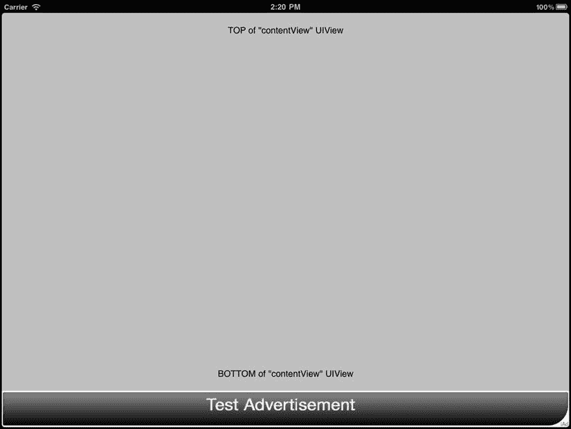

图 7-15. iPad 目标需要修改 `prepareAltAdBanner` 和 `adjustAdBannerPosition` 方法，以适应 iPad 专用的广告尺寸和位置

**注意** 经验丰富的 iOS 开发者可能会觉得 iPhone 和 iPad 代码之间的相似性相当重复。我第一个承认，很多代码本可以重构以在两个目标之间共享，从而减少重复。但这种看似疯狂的做法自有其道理。本书的读者群体非常多样化，从入门级新手到高级程序员。通过将所有相关代码保留在每个目标的同一个位置，这种方法使读者更容易跟随代码并快速了解项目的工作原理，无论其技术水平如何。

如果在将示例代码整合到自己的应用程序项目中遇到任何障碍，或者需要构建更高级的解决方案，请查看 Apple 在 iOS Dev Center 在线提供的详尽 iAd 文档：

- *iAd Programming Guide* (`http://developer.apple.com/library/ios/#documentation/UserExperience/Conceptual/iAd_Guide/`)
- *iAd Framework Reference* (`http://developer.apple.com/library/ios/#documentation/UserExperience/Reference/iAd_ReferenceCollection/`)

### 在您的应用中启用实时广告

在将应用提交到 App Store 之前，Optime Software 的 Jon Schlegel 提供了一些可靠的建议：“别忘了在上线 App Store 之前禁用‘测试广告’模式。我知道有几个开发者忘记这样做，结果损失了不少钱（因为显示的测试广告不会产生收入）。我们在所有应用中，当‘测试广告’模式启用时，都会触发编译器警告，以确保我们不会带着测试广告上线。”

如果您使用的是第三方广告网络（如 AdMob），请务必在 App Store 发布应用之前，查阅其相应的 SDK 文档，了解如何禁用测试广告模式（如适用）。


#### 关于 iAd

要在你的应用内启用实时广告横幅，需要在`iTunes Connect`中执行几个步骤。首先，你需要将应用上传到`iTunes Connect`，然后在该在线门户的“管理你的应用程序”部分，为该应用列表启用`iAd`。一旦你的应用在`App Store`上架，你就能通过`iTunes Connect`中的`iAd Network`模块来监控和追踪你的`iAd`表现及收入。

### 知识就是力量：通过分析追踪应用使用情况

任何成功的 Web 开发者都深知使用像`Google Analytics`这样的工具来追踪网站流量统计数据的巨大价值。移动应用也不例外。尽可能多地了解你的用户人口统计数据和使用模式，将有助于你做出更好的开发和营销决策。他们在你的应用上花费多少时间？哪些功能受欢迎，哪些功能很少被访问？掌握这些知识将赋予你能力，从而改善应用的用户体验和销售潜力。

2010 年，苹果公司修订了其关于应用内分析的政策，禁止应用收集并向第三方（如分析服务商）发送设备相关数据。苹果仍然允许应用内分析，但前提是传输的数据必须与应用内广告或应用的使用直接相关。由于这一重大政策变化，似乎只有那些集成了某种应用内广告解决方案的分析服务才能保持合规。

以下是一些可以考虑的分析服务：

-   Flurry (`http://www.flurry.com`)
-   Mobclix (`http://www.mobclix.com`)
-   Medialets Analytics (`http://www.medialets.com`)
-   App Annie (`http://appannie.com`)
-   Parse (`http://parse.com`)
-   Google App Analytics (`https://www.google.com/analytics/mobile/`)

`Mobclix`和`Medialets`都提供移动广告解决方案，因此如果你目前使用这些公司中的一家进行应用内广告，你还可以受益于集成在其各自 SDK 中的全面应用分析功能。`Flurry`提供了一个创新的`AppCircle`广告选项，用于应用推荐和交叉推广，作为其流行的分析 SDK 的一部分，以符合苹果的条款。

尽管应用内分析服务收集的是匿名的聚合数据，但消费者越来越保护自己的隐私。如果你确实计划在应用中集成分析功能，我建议你提前让用户知道你正在收集哪种信息，并为他们提供一个便捷的应用内选择退出的方法。流行的广告支持免费应用`AroundMe`提供了这种便利（参见图 7-16）。

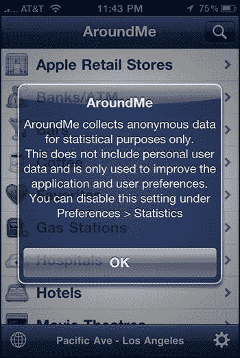

图 7-16。`AroundMe`通知用户该免费广告支持的应用收集了哪些分析数据，并提供了一个便捷的应用内选择退出方法

即使有苹果的限制，可接受的应用内分析仍然在`App Store`中获得批准，所以不要让这次政策转变阻止你探索分析如何能改进你自己的开发工作。`App Store`中成千上万的应用仍然在积极采用应用内分析。

花时间规划一个有效的分析策略，这不仅会为你提供有价值的应用使用数据，也会让你安心，确保你的应用符合苹果的条款并满足消费者的隐私需求。

### 思考赞助与植入式广告

与应用内广告类似，赞助和植入式广告为免费精简版应用提供了创新的变现方式，但它们通常比传统广告与应用结合得更紧密。这为用户提供了更优雅的解决方案，同时使赞助商能够直接与高度针对性的受众建立联系。由于赞助商会急于推广其与应用的关系，额外的营销支持有助于重新激发对现有应用的兴趣，带来大量新用户，之后你可以向他们追加销售额外的付费内容和其他应用。

`Firemint`的`Real Racing`是`App Store`中最受欢迎的赛车游戏之一。可能是担心蚕食付费版本的销售额，开发者最初选择不发布免费的简化版应用。但这种情况很快就改变了。通过与`Volkswagen`合作，`Firemint`得以在`App Store`中提供免费的`Real Racing GTI`版本。`Real Racing GTI`采用了与原始`Real Racing`应用相同的游戏引擎，但所有赛车都是新款 2010 年款`Volkswagen GTI`。甚至赞助商贴纸和赛道广告牌也都是`Volkswagen`的广告（参见图 7-17）。游戏还包含一个虚拟展厅，可以更近距离地观看`GTI`。


图 7-17。`Firemint`的免费`Real Racing GTI`游戏以 2010 年款`Volkswagen GTI`赛车和赛道上的赞助广告牌为特色

通过这次赞助植入式广告交易，`Volkswagen`可以向这个高度针对性的受众推广其 2010 年款`GTI`，而`Firemint`现在也有了一种将免费简化版变现的方式。随着免费的`Real Racing GTI`游戏面向更多用户，这也为`Firemint`提供了一个更大的受众群体，可以用来追加销售付费版本`Real Racing`及其续作`Real Racing 2`中的额外功能。

甚至`Real Racing`的应用图标也被定制，以便更好地推广赞助版本。修改后的应用图标不仅有助于将免费版本与原始付费游戏区分开来，而且也是`App Store`中一个重要的视觉元素，有助于强化赞助商的品牌（参见图 7-18）。


图 7-18。定制的应用图标（右）有助于将免费版本与原始付费游戏（左）区分开来，并作为`App Store`中强化赞助商品牌的重要视觉元素

从`Real Racing GTI`的成功可以看出，与赞助商合作可以为现有应用注入新的活力，通过免费版本将其影响力扩展到更广泛的受众。事实上，这种方法非常受欢迎，以至于`Firemint`在付费续作中扩展了这一概念。`Real Racing 2`拥有 30 辆官方许可的赛车供你在游戏中竞速，包括`BMW`、`Chevrolet`、`Ford`、`Jaguar`、`Lotus`以及其他几个品牌。

显然，这类赞助交易并非适用于所有应用。例如，如果你的 iOS 应用是一个介绍最新电影和当地影院的移动指南，那么招募`Warner Bros.`作为独家赞助商，在列出来自其他制片厂（如`Universal`和`Paramount`）的新电影时就会产生利益冲突。而且，如果你的应用主题过于宽泛，或者你的应用目前没有覆盖足够多的人，你可能很难找到感兴趣的赞助商。公司的业务是销售更多产品，因此只有当你的应用能够在高度针对性的市场中带来大量受众时，赞助提案才会有吸引力。

### 临界点

呼！这一章很长，包含了大量需要消化吸收的信息。但是，面对消费者对免费应用永不满足的需求，学习如何通过移动广告将你的开发工作变现是非常值得花时间的。准备好迎接更多内容了吗？


### 探索使用应用内购买的免费增值模式

曾经，传统应用销售和应用内广告是 iOS 开发者主导的商业模式，而应用内购买正迅速成为 App Store 中收入最高的收入流之一，尤其是对于免费应用和游戏而言。第 8 章将向您展示原因，并解释如何利用应用内购买的力量。在深入本章之前，快速浏览一下 App Store 中收入最高的应用，它们几乎*全部*都使用了应用内购买。兴奋了吗？

## 第 8 章 探索使用应用内购买的免费增值模式

应用内购买是 iPhone SDK 3.0 中引入的最令人兴奋且备受期待的功能之一。在免费和付费 iOS 应用中集成电子商务的选项为开发者开辟了新的领域，创造了超越传统应用销售的额外收入机会。应用内购买使您能够销售订阅、服务、虚拟商品和附加内容，例如高级功能或额外的游戏关卡——所有这些都在您的应用内完成。

由于平均应用价格如此之低，并且附带免费更新，因此您必须拥抱新的商业模式，以便更好地将持续开发成本货币化。是时候发挥创造力了！在本章中，我们将探讨如何利用应用内购买的力量来帮助您的业务长期持续发展。

### 忠诚度有回报：现有用户是最好的客户

在桌面软件的世界中，对使用您的应用感到满意的客户更有可能购买后续升级，尤其是当他们频繁使用您的产品时。他们保持最新版本的动力通常来自对用户体验的满意度或对您软件提供的独特功能的依赖（如果幸运的话，两者兼有）。

这就是为什么 Mac 和 Windows 软件开发者花费大量时间加强与客户关系的原因。当然，寻找新客户至关重要，但向现有客户销售升级产品才是支持特定应用持续开发的关键。开发者能够以低廉的入门价格（甚至免费）提供产品来吸引新客户，因为他们知道将来能够向这些用户销售额外的升级。除此之外，已经对产品质量认可的忠实客户通常比不熟悉您产品的新用户更倾向于购买您的其他应用。

向上销售新产品和升级是桌面软件行业的命脉。开发者们已经开始在较小规模上将这种模式移植到移动平台。微交易是移动经济的关键。但 App Store 拥有自己独特的购买文化，并伴有严格的应用指南，这两者都给 iOS 开发者带来了新的挑战，他们必须克服这些挑战才能维持长期业务。

### 支持长尾：将持续开发货币化

App Store 对“长尾”概念并不陌生，这一概念由著名作家克里斯·安德森提出。新产品会经历一个初始的销售高峰，然后，在达到平台期或饱和点后，其销售额会逐渐下降。这种最终的销售下滑趋势，即长尾（在图表上看起来如此），正是应用开发者开始争先恐后地想办法增加销售额或寻找替代方法来将应用开发货币化的地方。

由于 App Store 最初设立的方式，一旦用户购买了应用，任何更新都必须是免费的。与传统的桌面软件不同，无法向现有 iOS 应用客户收取升级版本的费用。这对用户来说非常划算，尤其是当应用仅售 99 美分时。但这对于开发者来说在经济上很困难，因为他们被期望频繁更新应用，却无法为这些开发工作提供资金。

一些游戏开发者通过将新版本作为完全独立的应用发布来绕过这个限制。Firemint 在其成功的《真实赛车》游戏之后，投入大量时间和金钱开发了第二代。Firemint 没有将其作为免费更新发布，而是明智地决定将《真实赛车 2》作为独立的独立应用推出，从而使公司能够为这个有价值的续作收取费用。

对于游戏来说，独立应用的策略更容易被消费者接受，因为这已经是 Xbox 和 PlayStation 等其他游戏平台多年来的标准做法。对于其他类型的应用，例如生产力应用，现有客户习惯于在 Mac 和 Windows 软件上获得免费更新或折扣升级价格，因此他们通常期望移动应用也能提供类似的路径。由于 App Store 没有付费升级选项，iOS 开发者只能通过两种购买机制来支付新功能或附加内容的费用：传统应用销售和应用内购买。

以 Bolt Creative 广受欢迎的《口袋上帝》游戏为例，其早期成功的一个重要因素是公司几乎每周都会向客户提供新玩法的免费更新。每一个新剧集都包含大量新鲜内容，这不仅有助于吸引新客户，还能通过每次更新的冒险保持用户的参与度。仅售 99 美分（包含所有已发布的剧集），它仍然是 App Store 中最超值的应用之一。

但是，包含大量新内容和数小时游戏时长的频繁更新可能会变得成本高昂。由于有如此多新游戏涌入 App Store，除非您的游戏像《愤怒的小鸟》或《口袋上帝》一样是常青畅销作品，否则很难通过每次新更新带来足够的销售高峰，从而在财务上无限制地支持相同水平的加速开发。

尽管《口袋上帝》继续销售得很好，但为了更好地支持产品的持续开发成本，Bolt Creative 开始提供皮肤包和其他附加项目的应用内购买。鉴于《口袋上帝》的客户已经习惯了免费获得如此多的新内容，Bolt Creative 的 Dave Castlenuovo 承认，引入应用内购买项目的主要挑战在于正确传达：增加微交易并非贪婪之举，而仅仅是帮助补贴持续免费更新新剧集的手段。

### 改变用户认知的挑战

由于 App Store 的基础设施培育了一种购物文化，即 iOS 用户期望为他们购买的应用获得终身的免费更新，因此转变他们的思维模式以接受应用内微交易所花费的时间比大多数开发者预期的要长一些。Streaming Colour Studios 在其第一款免费增值游戏 `LandFormer` 发布时迅速发现了这一点。

`LandFormer` 于 2010 年 6 月发布，获得了媒体的一致好评，被誉为一款创新且令人上瘾的益智游戏。我本人并非重度游戏玩家，但它无疑是我最喜欢的 iOS 应用之一。它是一个执行良好的免费增值策略的绝佳范例。

Streaming Colour Studios 的创始人 Owen Goss 评论道：“我的其他游戏（`Dapple` 和 `Monkeys in Space`）都是付费游戏，而 `Dapple` 有一个单独的精简版，供人们‘先试后买’。我不喜欢精简版模式的一点是，如果用户想购买游戏，他们需要下载两个单独的应用。对我来说，这总感觉很笨拙。”

最终，Owen 决定将 `LandFormer` 作为一款免费应用发布，包含 12 个关卡。另外 70 多个关卡可通过应用内购买获得（参见图 8-1）。为了帮助围绕游戏建立社区，`LandFormer` 还允许用户创建和分享自己的关卡。

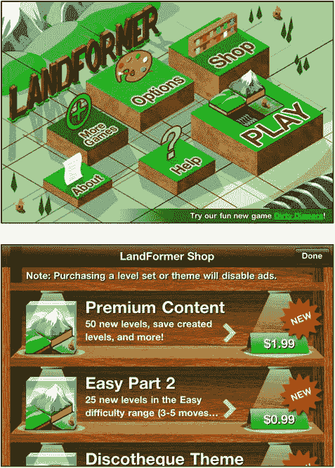


Figure 8-1. Streaming Colour Studios 开发的 `LandFormer` 是一款出色的免费增值应用典范，它允许用户免费玩前 12 关，然后通过应用内购买从游戏的虚拟商店中购买额外的关卡和主题。

“出于几个原因，这真是一条令人兴奋的盈利途径，”Owen 说道。“游戏内商店让我可以继续发布新的关卡包和主题，而无需更新应用程序的二进制文件本身。作为一款免费游戏，它在 App Store 中能获得最大的曝光率和更多的下载量。但通过横幅广告和应用内购买，我仍然有办法赚一些钱。而且，如果玩家在游戏内商店购买了任何内容，广告就会被禁用。”

“然而，这并非一帆风顺，”Owen 补充道。“有一件事我完全没有预料到，那就是用户对定价模式的强烈反对。我以为玩家会很高兴有机会在花钱之前先试玩游戏。然而，一些玩家的反应却是‘嘿，一个免费游戏！’，但随后当他们发现自己不能免费玩所有关卡时，他们就很生气。我的应用描述清楚地写着，你只能免费获得初学者关卡，必须购买其他关卡。App Store 中的应用页面也列出了热门应用内购买项目。但我学到的是，没人会看那些东西。”

应用内购买和付费游戏总会让用户感到不快。关键问题是：这会让用户放弃使用应用吗？看看 EA 的许多游戏——它们充斥着应用内购买，如果不购买，用户就会被困在当前关卡。这种试图从客户身上创收的方法无论如何都不理想。你需要找到一个平衡点，让免费用户仍然可以玩游戏，但可能无法那么快或那么频繁。这个概念的一个例子在 SuperCel 的 `Clash of Clans` 中得到了很好的实现。这款游戏可以永远免费玩下去，你最终也能通关；然而，如果你想在游戏中玩得开心并具有竞争力，你就需要花点钱升级。这种模式效果极佳，`Clash of Clans` 通常是 App Store 中收入排名第一或第二的应用。

应用内购买早在 2009 年中期就已推出，但消费者适应在已购买或免费下载的应用内为内容付费这一概念的速度很慢。即使一年后，像 `LandFormer` 这样的新游戏和其他免费增值游戏仍然遭到部分用户的抵制。但随着 2010 年下半年众多精彩的免费增值应用的激增，潮流逐渐转变，大多数 iPhone、iPad 和 iPod touch 用户终于张开双臂接受了小额交易。

曾经，传统的应用销售和应用内广告是 iOS 开发者的主要商业模式，而现在，应用内购买已成为 App Store 中最大的收入来源之一。2011 年 1 月，App Store 监控公司 Distimo 报告称，收入最高的 iPhone 应用中近 50%的收入来自应用内购买项目！

这种演变很大程度上要归功于像 `FarmVille`、`We Rule Quests`、`Zombie Farm` 和 `Pocket Frogs` 这样的热门游戏。这些免费增值应用基于使用虚拟货币来推进游戏进程。用户很快了解到，为了发展他们的农场、建立他们的帝国或照顾他们的宠物，他们需要使用游戏点数在虚拟市场购买作物、工具、食物和其他必需物品（见 Figure 8-2）。这些反复前往游戏内市场的经历让用户习惯于在应用内购物。因此，更进一步使用真实货币购买其他市场物品，如 `Mojo` 或魔法药水，就成了一小步额外的操作（见 Figure 8-3）。


Figure 8-2. ngmoco 的 iPad 版 `We Rule Quests` 是一款王国建设游戏，使用赚取的点数在虚拟市场中购买各种物品。

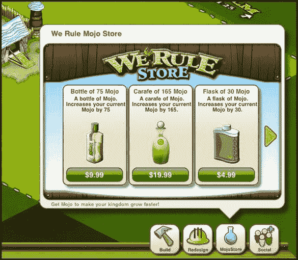

Figure 8-3. `We Rule Quests` 在诸如 `Mojo` 这样的虚拟物品需要花费真实货币时，会通知用户，要求进行应用内购买交易（此处展示的是 iPad 版本）。

重要的是，消费者永远不应对他们所选择的东西感到被误导。例如，`We Rule Quests` 会细致地在虚拟市场中为每件物品清晰显示其货币类型，以便用户能够看到该物品是用数字点数购买，还是通过应用内购买用真实货币购买。如 Figure 8-3 所示，为了获取 `Mojo`，会显示一个真实价格，要求进行应用内购买交易。此外，应用内购买项目被归类为“We Rule Store”产品，以便在视觉上与其他虚拟市场物品区分开来。

尽管小额交易现在已被 App Store 用户社区广泛接受，但开发者可能偶尔会遇到一些用户的强烈反对，他们反感应用内购买的单点定价结构。请记住，他们只代表你整体客户群中的一小部分。通常，这些用户就是那些抱怨一款全功能游戏价格超过 99 美分，而在 Xbox 或 PlayStation 上同等游戏要贵 50 倍的意见强烈的少数派。虽然尽可能让更多客户满意很重要，但这些人通常只对免费感到满意。除非你财务独立，否则你的生意负担不起把一切都免费赠送，所以记得在免费版本中加入一些广告，以便从那些永远不会为应用付费的用户那里获取一些收入。

应用内购买成功的一个关键因素是提供用户渴望购买并令人兴奋的附加项目。如果你的应用能够有效区分核心功能的免费更新与应用内购买提供的额外内容之间的差异，那么你就有可能建立一个可以维持持续开发盈利的商业模式。

考虑到这一点，尽早考虑你的应用如何能从应用内购买中受益永远都不嫌早。忠诚会带来回报！从长远来看，即使你的应用最终吸引的新客户越来越少，你满意的用户也可能通过应用内购买继续支持你！

### 何时以及如何使用应用内购买

那么，你已准备好要在你的应用中处理应用内购买，但它可以用来做什么呢？解锁额外的游戏内容和新关卡是显而易见的选择，但如果你不是在开发游戏呢？最好的处理方法是仔细审视你应用的当前功能和未来的特性路线图，看看应用内购买是否有助于延长其产品生命周期和销售潜力。

应用内购买是创造额外收入来源和支持持续开发的绝佳方式，但它并不适用于所有应用。如果没有充分的理由，不要试图将这一功能强行加入你的应用。不应将它视为一种寻找需求的解决方案。你当然不想让忠诚的客户失望，为了那些他们本期望作为最初购买价格一部分的核心功能，而对他们进行无休止的“小钱”收费。

另一个很好的例子是许多 Xbox 和 PlayStation 游戏如何采用高级 DLC 模式。你以 59.99 美元购买游戏，然后每隔几个月，你可以支付少量费用获得额外的地图、角色、游戏模式或武器。这里的理念不是占购买游戏玩家的便宜，而是允许他们增强和扩展他们的体验。

#### 理解基本原理


#### 应用内购买类型

应用内购买分为四种不同的产品类型：`非消耗型`、`消耗型`、`自动续期订阅`和`订阅`。你必须理解这些产品类型之间的区别，因为你的选择会影响应用内已购项目的处理方式。此外，还有一些需要遵循的规则。

以下是四种应用内购买产品类型的快速概述：

- **`非消耗型`**：仅需购买一次，并且应始终在客户 iTunes 账户关联的所有设备上的应用中保持可用。通常，非消耗型是附加功能或补充内容。因此，如果 Johnny 在 iPhone 上的游戏中购买了一个新关卡，那么不仅每次 Johnny 在 iPhone 上运行游戏时该新关卡应持久存在，而且当 Johnny 在同款游戏安装到 iPod touch 上时，该关卡也应可用。`Store Kit` 框架支持向 App Store 查询已购项目，因此你的应用可以被编程为在特定设备上恢复这些项目，即使它们最初是在同一用户拥有的另一台设备上购买并安装的。稍后在本章中，我们通过一个 Xcode 项目示例来探讨时，我会更详细地介绍这一点。

- **`消耗型`**：可以被用完或耗尽，然后可以再次多次购买。消耗型物品的一个很好的例子是游戏中的武器弹药。一旦客户耗尽了购买的弹药库存，就无法再次取回。要继续使用该武器，客户需要购买新一轮的弹药。由于这种类型的可消耗特性，消耗型物品无需在客户的所有关联设备上可用。如果你计划提供此类应用内购买项目，你应始终在应用内用非常清晰的语言说明：一旦用完即消失，但可以购买新的。

- **`自动续期订阅`**：类似于非消耗型物品，但设定了有限期限。如果客户在你的应用内购买了一项服务的 30 天订阅，当该期限到期时，App Store 会自动续订，并从客户的 iTunes 账户扣费。与非消耗型一样，自动续期订阅必须始终在客户 iTunes 账户关联的所有设备上的同一应用中可用。因此，如果 Johnny 在他的 iPhone 和 iPod touch 上都安装了你的应用，他购买的订阅应在两台设备的应用中持久存在。客户可以选择取消未来的续订，这将在当前付费订阅期到期后停用订阅。

- **`订阅`**：一种早于自动续期订阅产品类型的较旧机制。这种较旧订阅类型的一个限制是它目前不支持期限——没有自动续费扣款（尽管订阅可以像消耗型一样多次购买）。需要由你的应用自行监控客户的订阅到期日期和续订通知。由于这个限制，Apple 建议使用自动续期订阅替代。

酷吧？这有没有让你对自己应用内的用途产生一些想法？

附加功能通常被归类为非消耗型。附加内容——取决于它是消耗性物品（弹药、种子、魔法药水等等）还是永久性添加物（例如新游戏关卡）——可能分别是消耗型或非消耗型。

如果你计划在应用内解锁服务（例如对网络服务的高级访问权限、报纸和杂志内容或通知服务），这些通常被归类为自动续期订阅。或者，某项服务可以作为非消耗型的一次性应用内购买提供。但在采用这种方式之前，请确保此类模型能产生足够收入来经济地支持该服务的持续维护。

#### 应用内购买指南

在开始用应用内购买规划你的下一个主要杰作之前，你需要了解一些必须严格遵守的规则：

- 应用内购买项目必须是可在应用内交付的数字元素。你不能使用应用内购买在应用外销售实体产品和服务。例如，你不能用它来销售印刷书籍，但你完全可以销售电子书，只要它能在购买确认后立即在你的应用内交付即可。
- 应用内购买项目不得包含禁止内容，例如色情或仇恨言论。
- 应用内购买项目不能代表虚拟货币，除非它直接与应用内游戏玩法相关，如《僵尸农场》、《我们统治任务》和《部落冲突》这类应用所示。如果 Apple 认为你的应用内购买项目表述不当，使用户对所购买的商品或服务感到困惑，你的应用可能会被拒绝。
- `Store Kit` 框架不能用于创建试用版软件。正如我在第 6 章中所提到的，应用内购买并非用于解锁先前被限制的功能，因为 Apple 仍然禁止 iOS 应用呈现被禁用的功能。当前的应用内购买实现允许开发者提供当前应用中未包含的附加功能。
- 最重要的是，你在应用内完成完整的支付交易时，不能绕过应用内购买。在应用内实现你自己制作版本的应用内购买，必将导致来自 Apple 应用审核团队的拒绝通知。

#### 简约的力量

应用内购买最棒的一点是，除了少数几条指南外，它没有强加任何预定义的商业模式。为应用内购买提供动力的 `Store Kit` 框架不过是一个安全的支付收集网关。它不包含像 App Store 那样的预制店面，这赋予了你终极的创意灵活性，能够以最适合你应用当前 UI 的任何方式集成应用内购买。

如果你的应用只提供一项应用内购买项目，这种灵活性尤其有用。显示整个商店窗口仅列出单个项目并不是屏幕空间的有效利用。如果只有一两个应用内购买项目，你可以轻松地将这些购买按钮无缝集成到现有 UI 中。这听起来可能留给你很多需要自己编程的工作，但事实上，应用内购买需要的代码比你想象的要少得多。稍后在本章中，我们将逐步完成向 Xcode 项目添加应用内购买的步骤。

由于所有应用内购买交易都通过 App Store 完成，它们保留了与在商店中购买标准应用相同的商业条款。你，作为开发者，获得应用内购买价格的 70%，而 Apple 保留 30% 作为服务费。尽管一些开发者可能对放弃应用内购买的 30% 感到不满，但你需要记住，这不仅涵盖了信用卡费用、欺诈保护和退款相关的退单费用，而且还提供了一个在安全、可信的 App Store 环境中的优雅微交易模型。


#### 应用内购买的设置与使用

您无需自行维护客户账户管理系统和电子商务系统。`Store Kit` 框架能够为您的顾客提供无缝的交易流程，使他们能使用现有的 `iTunes` 登录账号，享受快捷无痛的购买体验。

您想通过应用内购买销售的每件商品，都需要在 `iTunes Connect` 中配置为独立的“应用内购买产品”，这与提交标准 iOS 应用的方式类似。每个应用内购买项目都会被分配至其关联的父级应用，以便 `iTunes App Store` 知晓产品之间的关联关系。与常规应用一样，每个应用内购买项目在上架到您的应用之前，都需要通过 Apple 应用审核团队的批准。本章后续部分将详细描述这一完整的设置过程。

### 销售更多内容

那么，对于消费者来说，典型的应用内购买是怎样的呢？我最喜欢的应用之一，ComiXology 出品的 *Comics*，就是一个绝佳的例子。*Comics* 是一款免费的电子漫画阅读器，其创新的浏览引擎让用户在 iPhone 或 iPad 屏幕上轻松阅读漫画。该应用预置了来自 DC、漫威（Marvel）和 Image Comics 等热门出版商提供的数十部免费数字漫画。

大多数免费漫画都是热门系列的第一期，这为新读者提供了极佳的入门机会。*Comics* 不仅给顾客带来了立竿见影的价值，这些免费漫画还让人们迷上了各种系列。当他们想要更多内容时，应用内购买就登场了。

在 *Comics* 内部，有一个易于使用的商店目录，陈列着从免费到每本 1.99 美元不等的漫画。所有付费漫画都在 `iTunes Connect` 中被配置为单独的应用内购买项目。如果您决定购买某一期特定的漫画书，`App Store` 会显示一个默认对话框，请求您确认对此项目的购买请求（参见图 8-4）。

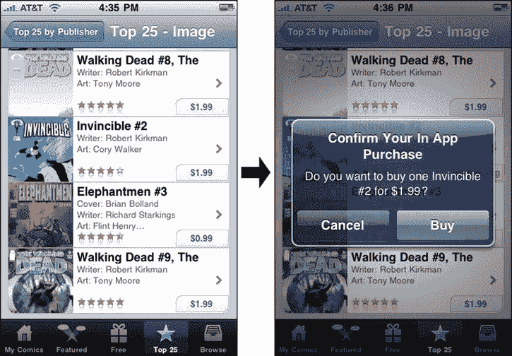

图 8-4. 在 *Comics* 应用中购买数字漫画时（左图），`App Store` 会显示一个默认对话框，请求确认您对此项目的应用内购买请求（右图）。

如果点击对话框中的“购买”按钮，系统会要求您输入 iTunes 登录信息，这与通过 `iTunes Store` 进行的任何其他购买流程类似。一旦登录信息确认无误，安全交易便会使用您现有 iTunes 账户的账单信息完成，您购买的项目会立即开始下载到 *Comics* 应用中（参见图 8-5）。仅此而已！无需应付繁琐的订单表格。这是一个极其简单的购买流程，只需轻点几下手指。

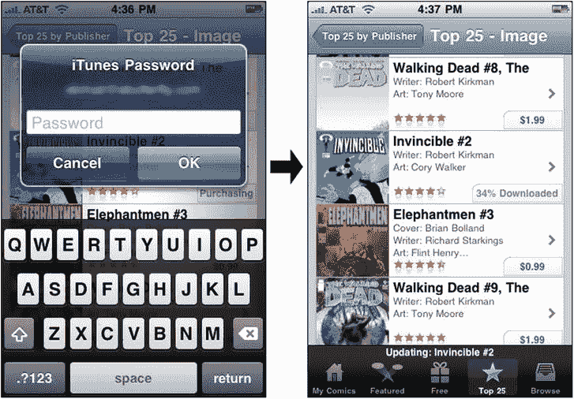

图 8-5. 在确认购买和您的 iTunes 登录信息后（左图），交易完成，您购买的数字漫画会立即开始下载到 *Comics* 应用中（右图）。

您可能已经注意到，*Comics* 的目录列表看起来与 `App Store` 相似。但您可以自行设计应用内商店的外观，以模仿您自己的用户界面设计。正如您在之前的例子（如 LandFormer 和 We Rule Quests）中看到的那样，`Store Kit` 框架为您提供了完全的灵活性，可以自定义这些项目在应用中的显示方式。

大多数人认为游戏和娱乐类应用将成为应用内购买的主导力量，因为销售数字漫画、电子书、新游戏关卡和其他虚拟世界组件看起来非常适合微交易。但事实上，只要稍加创意，应用内购买几乎可以成为任何类别（旅行、生活、生产力等）应用的有效收入引擎。*《男士健康》* 杂志就是一个很好的例子。

*《男士健康》* 杂志的健身应用 Men's Health Workouts，初始售价为 1.99 美元，包含了大量的训练和锻炼项目。但它也提供额外的训练包，可以通过应用内购买获得（参见图 8-6）。这里有一个巧妙之处：每月会免费上传一个附加训练包（可在应用内访问），这不仅鼓励了用户的持续参与，也有助于推广其他可供出售的附加内容。除此之外，Men's Health Workouts 中提供的应用内购买项目，其展示设计主题与应用其余自定义界面保持一致，从而提供了无缝的用户体验。

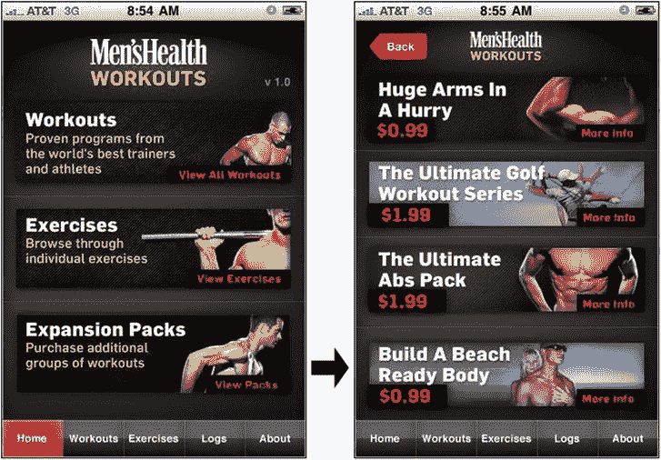

图 8-6. 并非只适用于游戏！像 Men's Health Workouts 这样的应用证明了，应用内购买在其他类别中同样可以发挥强大作用。并且 `Store Kit` 框架为您提供了完全的灵活性，可以自定义这些项目的显示方式。

### 提供服务与订阅

我们已经看到了几个可下载内容的例子，但服务和订阅呢？Simplenote 是两者的绝佳范例，它为其年度高级服务采用了应用内订阅模式。除了 Simplenote 免费提供的笔记同步基本功能外，高级服务还提供额外的同步功能、增强的支持，并隐藏了应用内广告（参见图 8-7）。

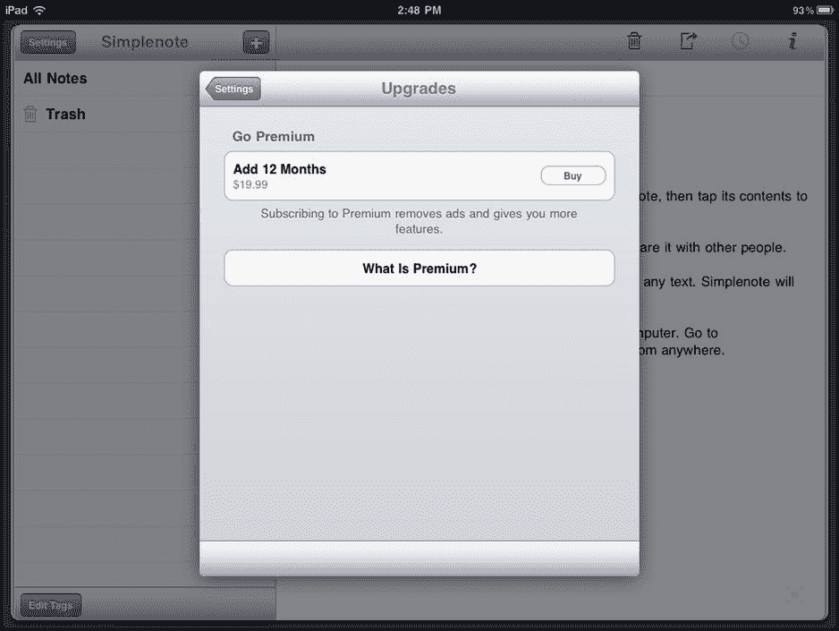

图 8-7. 免费笔记同步应用 Simplenote（此处显示的是 iPad 版本）使用应用内购买来销售订阅服务，鼓励用户升级到其年度高级服务。

对于这个原本优秀的 Simplenote，我有一点小意见：升级界面（参见图 8-7）并未包含高级服务所提供的具体优势的详细信息。若要了解更多信息，您必须点击“高级服务包含什么？”按钮，该操作会从应用跳转到 Mobile Safari 浏览器，并加载 Simplenote 网站上的一个页面。诚然，Simplenote 的笔记同步服务也可作为基于 Web 的应用以及通过众多第三方应用使用，因此将所有查询引导到一个集中的高级服务网页，使得开发者只需为所有相关应用管理一个信息来源。但是，有多少 Simplenote 用户会真正花时间去点击那个按钮呢？

便捷性是冲动购买的重要因素。Simplenote 在高级服务方面做得很好，但试想一下，如果高级功能的详细信息就在应用内的升级界面上进行宣传，还能多卖出多少订阅计划呢？

### 展示是成功的关键

如何让用户购买您的应用内购买产品？方法跟最初让用户购买您的应用是一样的：提供一个他们想要的、有吸引力的产品包。除了创造出色的附加内容，您还必须向潜在客户传达他们为何需要购买它。

还记得第 6 章中免费精简版应用的促销完整版截图吗？由于应用内购买项目本质上是它们自己的产品，您也需要为它们设计类似的应用内推销说辞。这些项目的视觉呈现，与推广母应用本身同样重要。不要仅仅依赖一行文字或说明再加上一个购买按钮。用户想知道通过购买那个应用内购买项目，他们到底能得到什么。但这并不意味着您应该写出冗长、啰嗦的描述。移动用户想要快速得到答案，因此简洁可以非常有效，只要提供的细节足够吸引人。


`Ramp Champ by The Iconfactory and DS Media Labs` 以一种非常直接的方式出色地完成了这项任务，占用的屏幕空间极少。`Ramp Champ` 是一款有趣的投球得分风格游戏，内置了多个主题斜坡。附加的斜坡包可在应用的“附加内容”部分购买。每个附加包都以非常紧凑的方式列出，使用户能够快速滚动浏览可用项目列表。简洁的要点说明准确地描述了每个包中买家能得到什么，并附有来自包含斜坡的诱人视觉图片（见图 8-8）。

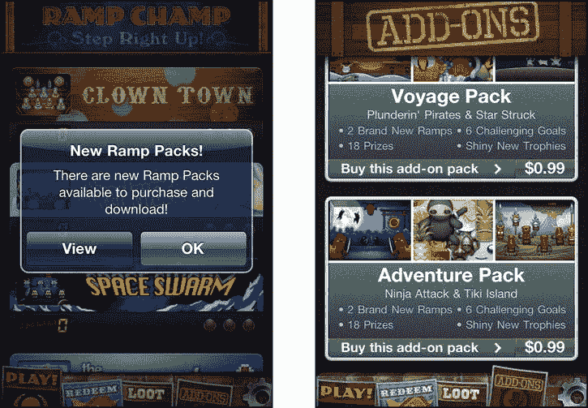

图 8-8。当有新的附加斜坡包可用时，`Ramp Champ` 会通知用户（左图）。简洁的要点说明和截图有效地描述了每个附加斜坡包中买家能得到的内容（右图）

在撰写应用内购买项目描述时，你需要非常清楚地说明用户将收到什么。模糊的描述常常会导致用户感到沮丧。他们可能会为你的应用发布负面评论，抱怨购买的附加项目并非他们所期望的。沟通对于防止混淆至关重要。

顾客喜欢在点击购买按钮之前就清楚知道商品的价格，因此你应尽可能在应用内商店中显示定价。你可以在应用内动态列出可用应用内购买项目的价格，这在跨多个区域本地化你的应用时尤其有用。事实上，由于 App Store 会针对不同国家货币对价格进行本地化处理，苹果强烈反对使用静态价格。

如果你频繁为游戏发布新的应用内购买项目（例如额外的关卡），不要指望你的顾客会定期检查游戏的虚拟商店。当新的附加内容可供购买时，应通过显示 `UIAlertView` 或自定义通知（例如 `Ramp Champ` 在 图 8-8 中显示的那样）来让用户知晓。

### 找到最佳平衡点

尽管你的应用核心功能是吸引新顾客的主要亮点，但只有当你以对消费者合理且有吸引力的价格提供诱人的附加内容时，你的应用内购买策略才会成功。即使 App Store 的购物者已经习惯以低至 99 美分（甚至免费）的价格获得功能齐全的游戏和应用，只要内在价值对顾客来说是显而易见的，你的应用内购买项目定价高于相关主应用也完全没问题。

### 包含正确的元素组合

对于付费应用，了解哪些功能是顾客认为的主要吸引力至关重要。这些功能应包含在应用的价格中。那些增强核心产品的附加功能则更适合作为潜在的应用内购买项目。你不应该对用户认为应包含在原始应用价格中的功能（即他们以为开箱即用就能获得的核心功能）收取应用内费用。

`Networks in Motion` 在 2009 年首次发布其 GPS 导航应用 `Gokivo` 时就遇到了这个问题。该应用仅售 99 美分，包含了许多功能，例如 Yahoo! 本地搜索、地图、交通信息和收藏夹。但若要解锁逐向导航这一完整的 GPS 导航服务，则需通过应用内购买支付每月 9.99 美元的订阅费。消费者认为逐向 GPS 功能是应包含在应用中的核心功能。尽管其他功能也不错，但逐向导航服务才是他们最初购买该应用的主要原因。当发现需要额外每月支付 9.99 美元才能获得他们认为已经购买的功能时（尽管该应用仅售 99 美分），许多用户感觉受到了欺骗。

`Networks in Motion` 竭尽全力在 App Store 描述中明确说明了其定价结构，但部分顾客似乎并未接收到这个信息。许多人在购买应用前并未花时间仔细阅读描述。

该公司对该问题的最终解决方案是将应用价格提高到 9.99 美元，并附带一个 30 天的逐向导航服务订阅。这样，顾客在购买应用后就能立即使用他们想要的核心功能。30 天后，他们可以通过应用内购买按月续订。

尽管在这两种情况下涉及的是相同金额，但用户的感知却大相径庭。这归结于购买的原则以及满足用户期望。

进入 2011 年，`Networks in Motion` 进一步改进了其商业模式。为了在饱和的导航市场中保持竞争力，`Gokivo GPS Navigator` 被作为一款免费的 iPhone 应用提供，并且仍然包含 30 天的逐向导航服务订阅。作为免费下载，这能让更多用户接触到该应用，并让用户有机会试用并依赖该服务。续订选项是每月仅需 4.99 美元或每年 39.99 美元的应用内购买。

### 允许用户随心所欲地花钱

`Snappy Touch` 的 `Noel Llopis` 对应用内购买并不陌生。他广受欢迎的通用应用 `Flower Garden` 允许用户培育数字鲜花并向朋友发送虚拟花束。这款应用非常适合提供消耗性附加组件，例如额外的肥料和种子包（见图 8-9）。得益于付费和免费版本中都包含的应用内花店，`Flower Garden` 的大部分收入来自应用内购买也就不足为奇了。事实上，付费应用销售额仅占 `Flower Garden` 收入的 17%；其余收入均由应用内购买推动。

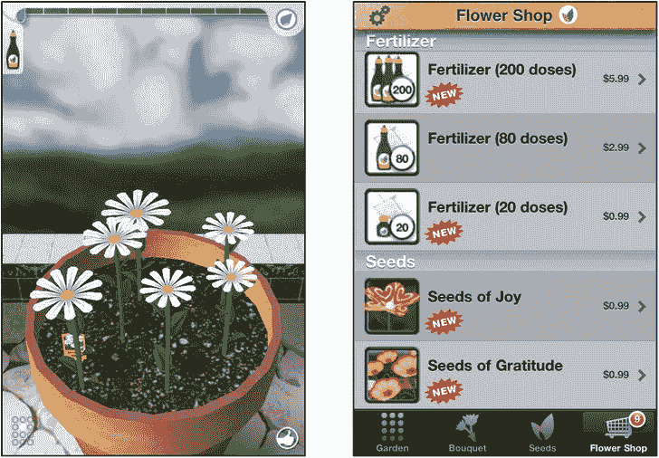

图 8-9。`Snappy Touch` 的 `Flower Garden` 在其应用内花店中提供了多种肥料捆绑包，让用户可以选择他们愿意花费的金额

看到像 `FarmVille` 和 `We Rule Quests` 这样的游戏通过销售分级捆绑的消耗品获得成功后，`Noel` 开始思考，他只在 `Flower Garden` 中提供一种 99 美分的肥料选项，是否低估了玩家愿意花费的金额。他惊讶地发现，App Store 上许多热门游戏销量最高的应用内购买项目从来都不是 99 美分的。人们在花费 4.99 美元甚至更多来购买武器、弹药、Mojo 瓶、魔法药水、农场金币以及其他虚拟货币。一些排名靠前的应用内购买项目定价高达 29.99 美元、49.99 美元，甚至 99.99 美元。


“我决定做个小小的实验，在《Flower Garden》中增加两种肥料选项：80 剂肥料售价 2.99 美元，200 剂肥料售价 5.99 美元，”诺埃尔说道。“每个捆绑包都能让您以更优惠的价格购买肥料。这与我看到的那些游戏中的标价相比仍微不足道，但我不想因为标上荒谬的高价捆绑包而疏远用户。”

结果如何？根据销售数量，最受欢迎的应用内购买项目仍然是 99 美分的肥料选项，但也有不少顾客购买了另外两种肥料捆绑包。

即使高价商品的销量不高，它们仍然可能占总收入的很大比例。诺埃尔的捆绑包实验取得了成功。仅肥料一项的应用内购买就占了《Flower Garden》总收入的惊人 45%。

在向不断增长的种子包产品系列中添加多种肥料捆绑包后，诺埃尔发现，《Flower Garden》的顶级用户在该游戏中的消费超过了 100 美元。

只要应用内购买项目物有所值，并且用户持续喜爱该游戏，那么用户的消费金额就没有上限。

诺埃尔指出了捆绑包对消耗性应用内购买非常有用的两个充分理由：选择权和承诺。他解释说：“提供不同级别的捆绑包让玩家在决定如何购买某样东西时有更多选择。而且，每当用户购买更大的捆绑包时，他们就会对你的游戏更加投入。他们会继续玩下去，以从这次购买中获得应有的价值。即使他们原本就有意回到你的游戏而不进行购买，这笔花费也会是一个很好的提醒。而让用户回到你的游戏正是这一切的核心。他们会探索更多游戏内容，更加着迷，进行更多的应用内购买，并向更多的朋友推荐你的游戏。”

### 交付与管理应用内购买

应用内购买的内容可以内置于你的应用程序中，待购买后再解锁，也可以从远程服务器下载。选择哪种方法取决于你要交付的内容类型以及你的应用所需的扩展性。

#### 解锁内置内容

解锁内置内容是目前最简单的途径，需要的步骤少得多，且所有这些步骤都可以在你的应用内部完成。你无需维护服务器，也无需担心应用与服务器通信时的安全问题。只需与 App Store 进行几次交互，购买的内容即可在你的应用中解锁（参见图 8-10）。

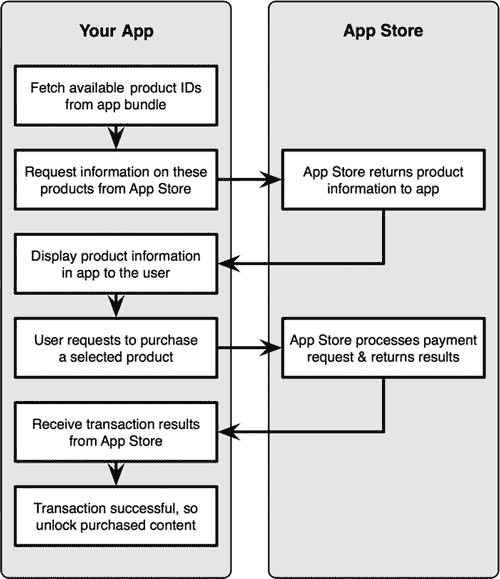

图 8-10. 内置应用内购买交付模型

如果你是 iOS 开发新手，图 8-10 中展示的流程可能看起来相当令人生畏，但实际上并没有那么复杂。诚然，配置应用以使用应用内购买涉及几个步骤，但不用担心。在本章后面，我将引导你完成整个设置过程以及一个基本 Xcode 项目的创建，这样你就能确切地看到所有这些部分是如何组合在一起的。

使用这种内置模型要求你所有的相关应用内购买内容都已嵌入应用中，并对用户隐藏。当顾客购买特定项目时，你的应用只需解锁其访问权限即可。这种方法非常适合提供集成的功能，例如游戏中的新关卡或效率应用中的附加功能，或者用于激活基于订阅的功能。

Store Kit 并不支持通过从远程服务器下载的更新来“修补”你的应用二进制文件。如果你的应用要求购买的内容集成在应用包内，则应在提交到 App Store 之前将其包含在你的应用中。之后，当顾客购买后，你的应用只需解锁这些内容即可。

你的应用记录并记住已解锁内容的最简单方法是将信息存储在你的应用偏好设置中。当用户通过 iTunes 将设备与电脑同步时，这些设置会被备份。备份应用的偏好设置有助于防止购买记录丢失，即使应用在用户设备上被删除。你的应用需要记住哪些项目已被购买，以便用户下次运行你的应用时，已购买的内容仍然可以轻松访问。

使用这种内置解锁模型的一个主要缺点是，如果你决定将来提供更多的应用内购买项目，你将需要提交一个包含新内容的、更新后的应用二进制文件到 App Store。

#### 从你的服务器下载内容

如果你在不断为你的应用添加新的应用内购买项目，推荐使用服务器下载方式。这需要更多的步骤，并给你带来相当多的服务器管理责任，但它为你的应用提供了最大的灵活性和未来增长的可能性（参见图 8-11）。

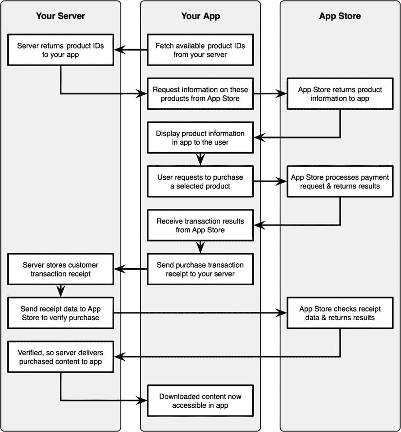

图 8-11. 基于服务器的应用内购买交付模型

ComiXology 公司的 Comics 应用（本章前面介绍过）就是这种模型的完美范例。该应用会从服务器获取可用数字漫画的产品 ID 列表。当用户购买特定的数字漫画书时，应用会从服务器下载文件。该应用可以打开和查看用户已购买下载收藏中的任何选定数字漫画文件。

这种方法使新的数字漫画每周都能作为应用内购买项目提供，而无需对实际的 Comics 应用进行任何更新。新的应用内购买项目会通过 iTunes Connect 提交审核。一旦获批，ComiXology 只需将其产品 ID 添加到其服务器上的数据库中。然后，下次 Comics 应用检查新项目时，它会从服务器检索最新的新数字漫画列表。

你不能通过从远程服务器下载的应用更新来修补你的应用二进制文件。如果你的应用要求购买的内容集成在应用包内，那么从你的服务器交付购买内容就不是合适的途径。你需要使用内置模型，在提交到 App Store 之前将内容嵌入你的应用中。然后，在顾客购买后，你的应用只需解锁这些内容即可。

如果你计划向不仅仅是 iOS 用户交付相同的内容，那该怎么办？如果你允许顾客在多个平台上访问他们购买的内容，例如通过 iPhone、安卓手机、网页浏览器等，那么推荐使用基于服务器的模型。这样一来，所有内容和顾客记录都可以在一个中心位置（例如你服务器上的一个数据库）轻松管理，所有支持的设备都可以连接到该位置。

从服务器下载内容的另一个好处是，它给了你灵活性，可以在提供应用内购买产品的同时，也提供免费项目。如果顾客选择了一个免费项目，你的应用可以直接绕过应用内购买流程，直接从你的服务器下载该项目。如果你的用户知道你的应用虚拟商店中经常提供免费内容，这将激励他们更频繁地浏览你的附加产品，并可能增加应用内购买项目的销量。


基于服务器的模型的一个主要缺点是，Store Kit 没有提供任何与你的服务器进行通信的基础设施。你需要自己开发和实现自定义的服务器端应用程序，以便与你的 iOS 应用进行交互。

不过，Store Kit 确实提供了一种方法，让你的服务器能够验证收到的交易收据。这个额外的验证层是一个推荐的安全机制，有助于防止你的基于服务器的下载内容被非法盗版。当你的 iOS 应用通知服务器某笔购买已成功完成时，它应该向服务器发送一个交易收据。正如我将在本章后面详细讨论的那样，当应用内购买交易完成时，App Store 会向你的 iOS 应用返回一个交易收据。通过将此交易收据发送到你的服务器，你的服务器就获得了所需的数据，以便通过 JavaScript Object Notation（JSON）与 App Store 通信来验证购买。这可以防止黑客欺骗你的服务器，让其提供从未被合法购买的内容的免费下载。这在处理使用越狱设备的客户时是一个巨大的优势。拥有越狱设备的用户可以免费获得任何应用内购买——如果它已经存在于当前应用中——通过使用内置内容解锁来实现。如果你的应用内购买涉及虚拟货币，或者能够以某种方式为用户提供优势，请确保在你的服务器上下载这些内容。

如果你不是一个有经验的 web 开发者，那么创建自定义 web 应用和服务器端基础设施来与你的 iOS 应用进行通信，至少可以说会令人感到畏缩。这种基于服务器的模型还将可靠的可扩展性和安全性的负担放在了你的肩上。如果你的应用拥有庞大的用户群，那么测试你的服务器以承受大量流量和潜在的安全威胁是至关重要的。与服务器相关的问题不仅会影响你的 iOS 应用的感知性能质量，还会影响你的商业声誉（以及责任）。

**注意**：如果你对基于服务器的模型感兴趣，Apple 提供了一个全面的教程，介绍如何通过 JSON 验证应用内购买交易。请阅读官方《应用内购买编程指南》中的“验证 Store 收据”部分，该指南位于以下 URL：`http://developer.apple.com/library/ios/#documentation/NetworkingInternet/Conceptual/StoreKitGuide/`。

#### 在云端寻找帮助

我们中的许多人是软件程序员，最习惯在 Xcode 中编写 Objective-C 代码。如果仅仅是花无数时间学习、开发和维护 web 应用以及昂贵服务器系统的想法就让你大汗淋漓，那么请放心。如果你需要为应用内购买采用基于服务器的下载模型，有几家第三方服务提供了全面的应用内购买支持：

*   Urban Airship（`http://urbanairship.com`）
*   Push.IO（`http://push.io/`）
*   Burstly（`http://www.burstly.com`）
*   iLime:Purchase（`http://www.ilime.com/in-app-purchase/`）
*   dodaii（`http://dodaii.com/en/`）
*   Parse（`http://parse.com`）

这些第三方服务负责处理相关的服务器管理难题，例如可扩展性、安全性、性能监控、App Store 收据验证、内容交付以及应用集成。Urban Airship 甚至为你提供了一个方便、即用的商店界面 UI，以及在你的应用中提供免费下载的能力（这两项目前均未通过 Apple 的 Store Kit 框架提供）。

除非你有令人信服的理由自己托管、排除故障和管理自定义 web 应用及服务器，否则让专家来处理这种后端架构将为你节省时间和金钱（并有助于减轻那些压力引起的头痛）。这能让你专注于你最热爱的事情：创建应用。

### 在 iTunes Connect 中配置应用内购买

在本章后面，我们将在 Xcode 中编写一个应用内购买示例。为此，你需要创建一个 iTunes Test User 账户和你的应用内购买项目。这两项都需要在 iTunes Connect 中在线创建。如前所述，应用内购买项目是作为独立产品添加到 iTunes Connect 中的，因此在你测试购买它们之前，需要先创建它们。

#### 设置 iTunes 测试用户账户

为什么需要一个测试用户账户？你希望在将应用提交到 App Store 之前，全面测试其应用内购买功能。使用测试用户账户可以让你进行测试购买，而无需实际付费。呼！这绝对是个好消息。现在你可以随心所欲地进行所有应用内购买测试，而无需担心在这个过程中掏空腰包。

登录到位于`https://itunesconnect.apple.com`的 iTunes Connect。在 iTunes Connect 主页上，点击“Manage Users”链接，然后选择用户类型“Test User”（参见 Figure 8-12）。在“Manage Test Users”页面上，点击“Add New User”按钮。

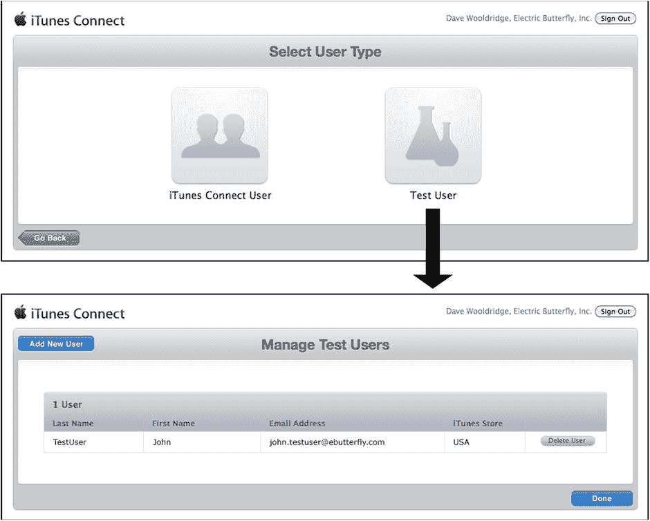

Figure 8-12. 在 iTunes Connect 的“Manage Users”部分添加一个新的测试用户账户

填写所需的表单字段时，请确保使用一个有效但未与任何现有 iTunes 账户关联的电子邮件地址。这一点非常重要。使用一个已分配给 iTunes Connect 或 iTunes Store 账户的电子邮件地址将使你的测试用户账户失效。此外，你也不希望你的测试购买意外地被收费到一个现有且已启用信用卡的 iTunes 账户上。

创建新的测试用户账户后，你可以在 iTunes Connect 的“Manage Users”部分查看或删除它。似乎没有办法编辑现有的用户账户，因此如果你想修改电子邮件地址或密码，你需要删除该测试用户账户，然后创建一个新账户来替换它。

#### 创建应用内购买项目

既然你已经有了一个测试用户账户，下一步就是将你的应用内购买项目作为独立产品添加到 iTunes Connect 中。

你可以在 iTunes Connect 的“Manage Your Applications”部分中的应用列表里，或者在“Manage Your In-App Purchases”部分中创建应用内购买项目。如果你的 iTunes Connect 中没有列出“Manage Your In-App Purchases”，那么你可能尚未向 iTunes Connect 提交你的付费应用程序合同，而这是创建应用内购买项目所必需的。

只有当你在 iTunes Connect 中已经有一个应用列表时，iTunes Connect 才会允许你添加新的应用内购买项目。这样，在创建应用内购买项目时，你可以适当地将列出的应用分配为其父级应用。但如果这是你的第一个应用呢？别担心。测试应用内购买并不要求你的应用已经在 App Store 中。但是，为了创建和测试应用内购买项目，你必须先将你的应用信息添加到 iTunes Connect，并为该应用分配一个唯一的捆绑包 ID（`bundle ID`）。

**注意**：捆绑包 ID（`bundle ID`）基于你已在 iOS 配置门户中创建的应用 ID（`app ID`）。为了让应用内购买在你的应用中正常工作（即使在测试期间），你必须使用一个已启用应用内购买功能的特定应用 ID。不要使用通用的通配符应用 ID（包含星号），例如默认团队配置描述文件中找到的那个。你还需要根据该应用 ID 和你将用于测试 Xcode 项目的应用内购买的 iOS 设备生成一个配置描述文件。如果你不熟悉在在线 iOS 配置门户中创建应用 ID 和配置描述文件的过程，请阅读 Chapter 9 中的详细教程。


### 在 iTunes Connect 的“管理您的应用”部分添加新应用时，请勿立即上传应用二进制文件。没有应用二进制文件，您的 iOS 应用不会过早地提交审核，但您仍然可以设置相关的应用内购买项目并测试购买。您在“管理您的应用”中的应用列表应显示状态为“准备上传”（请参见图 8-13）。关于如何在 iTunes Connect 中添加新应用列表的详细信息，请参阅第 11 章中的全面说明。

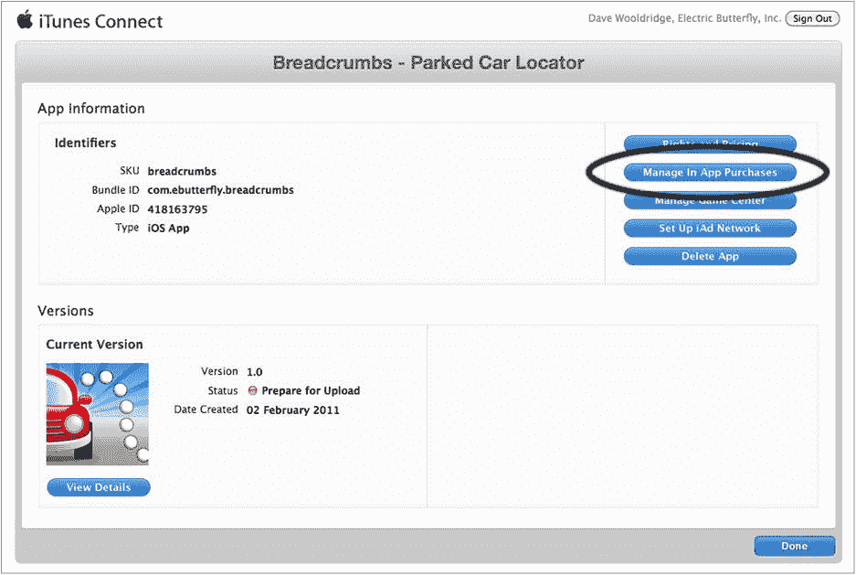

图 8-13. 在 iTunes Connect 的“管理您的应用”部分选择您的应用，然后点击“管理应用内购买”按钮以创建新的应用内购买项目。

在应用的主页面中，点击“管理应用内购买”按钮（请参见图 8-13），然后点击“创建新项目”按钮为该应用添加一个新的应用内购买项目。填写出现的网页表单（请参见图 8-14）。您需要填写所有字段，但“供审核的购买过程截图”除外。该截图仅供应用审核团队使用，因此您可以等到准备提交时（在完成测试后）再上传。

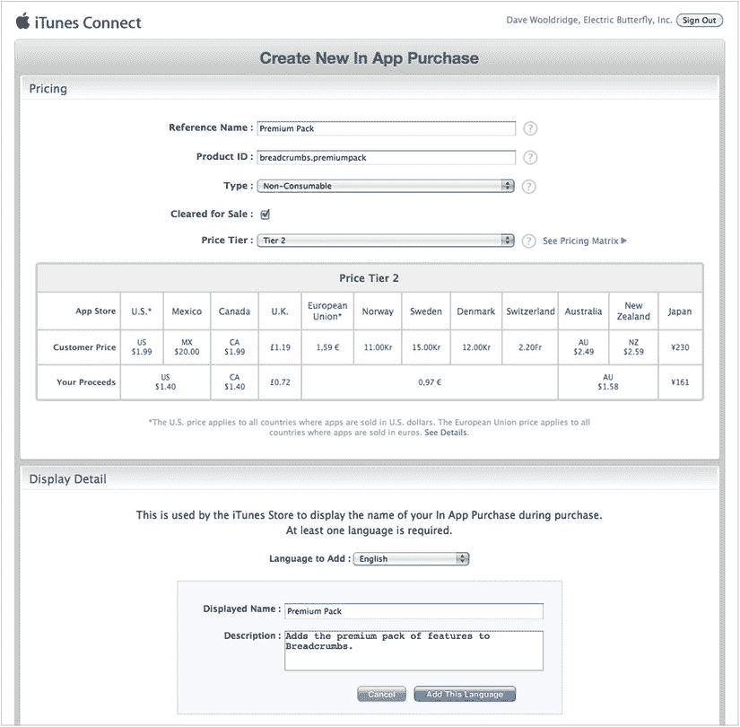

图 8-14. 在 iTunes Connect 中为您的应用创建新的应用内购买项目。

让我们逐一了解图 8-14 中的表单字段。

*   **`Reference Name`**：该字段表示您的应用内购买项目在 iTunes Connect 中的名称，但它不一定是 App Store 中显示的名称（如果客户设备的语言设置与您的 iTunes Connect 默认语言不同）。请参阅语言字段描述以了解项目的实际显示名称。
*   **`Product ID`**：iTunes Connect 中的每个产品都需要一个唯一的 ID，应用内购买项目也不例外。任何 UTF-8 字符串都可以用来标识此产品，但建议在您的所有产品中使用通用的 ID 系统。许多 iOS 开发者使用 `com.company.appname` 作为所有应用 SKU 编号的命名方案，而相关的应用内购买产品 ID 可以使用该方案的扩展，例如 `com.company.appname.productid`。由于我们示例截图中的虚构应用 Breadcrumbs 使用 `breadcrumbs` 作为其 SKU，因此高级包的应用内购买产品 ID 可以是 `breadcrumbs.premiumpack`，以直观地体现其与父应用的关系。这个简单的系统为您提供了一种易于使用且在所有产品中保持一致的命名方案，同时也确保了 ID 的唯一性（其他人无法使用）。这是一个重要因素，因为 iTunes Connect 不允许任何两个产品拥有相同的 ID。
*   **`Type`**：这是提交此表单前需要理解的最重要字段，尤其是在您保存新的应用内购买项目到 iTunes Connect 后，该字段将无法编辑。`Type` 定义了您要创建的应用内购买项目的类型。如本章前面所述，目前有四种类型：非消耗品、消耗品、自动续期订阅和订阅。如果选择了“自动续期订阅”，您还需要为订阅定义一个期限（例如每月或每年），以便 App Store 知道何时向客户收取续期费用。
*   **`Cleared for Sale`**：如果此复选框未选中，您的应用内购买项目将无法在您的应用中列出。但即使选中了此框，也并不意味着您的应用内购买项目可以公开购买。作为独立产品，所有应用内购买项目在 App Store 中可用之前，都需要经过 Apple 的审核和批准。但出于测试目的（以及当您准备上线时），您肯定希望选中此框。
*   **`Price Tier`**：此下拉菜单提供了一系列可用的定价等级，用于为您的应用内购买项目分配特定价格。您可以修改应用内购买项目的价格以进行特价促销活动，但它们绝不能免费提供——即使是限时免费也不行。应用内购买项目必须定价，最低为 99 美分。若要在您的应用中提供免费的可下载内容，您需要实现自己的系统，从您的服务器上（而非 App Store 之外）获取这些项目。
*   **`Language to Add`**：此处用于选择您要支持的语言。对于每种选择的语言，您需要填写应用内购买项目的本地化显示名称字段和描述字段。请仔细填写，因为您在此处提交的应用内购买项目名称和描述是 Apple 在 App Store 和您的应用中向客户显示的内容。您的应用内购买项目必须至少支持一种语言。如果您只列出了一种语言，请确保其与相关父应用设置的语言一致。
*   **`Screenshot`**：此字段仅用于审核目的，绝不会在 App Store 中显示。首次创建新的应用内购买项目时，请将此字段留空。在您对应用内的购买功能进行充分测试后，需要截取购买过程的截图。将该图像上传到此“截图”部分。

此图像将帮助 Apple 在审核您的应用内购买项目时进行参考。因此，请在项目成功通过您自己的测试并准备提交后，再上传截图。


#### 管理你的应用内购买项目

在 `iTunes Connect` 中保存新的应用内购买项目后，你可以通过应用程序列表的 `管理应用内购买项目` 部分进行后续修改（参见 图 8-15）。在将项目提交给苹果审核之前，其状态为 `待开发者批准`，你可以自由编辑或删除它。

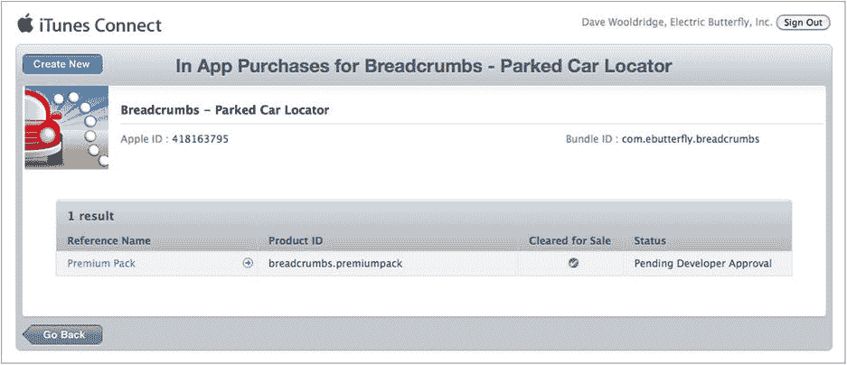

图 8-15。创建应用内购买项目后，它将会列在 `iTunes Connect` 中应用程序的 `管理应用内购买项目` 部分。

完成测试并上传应用内购买功能的截图后，点击 `批准` 按钮以提交你的应用内购买项目进行审核。系统会提示你从以下两个选项中选择其一：

*   *立即提交*：如果你的现有 iOS 应用程序已支持应用内购买，并且你只是想向现有产品列表中添加另一个应用内购买项目，你可以选择 `立即提交` 将其直接送入审核队列。
*   *随二进制文件提交*：如果你的应用内购买项目需要应用程序的新版本或更新版本，则应选择 `随二进制文件提交`，以确保两个产品同时被审核并同时在 App Store 上线。

当应用内购买项目的状态为 `等待审核` 或 `正在审核` 时，在审核过程中你将无法进行任何进一步修改。

在应用内购买项目被苹果拒绝或批准后，你所做的任何额外修改都需要重新进行审核。如果项目被拒绝，那么苹果要求你在重新提交审核之前，将其作为新的应用内购买项目重新创建。

每个父级应用程序最多可以创建 3000 个应用内购买项目。如果你从 `iTunes Connect` 中删除了一个应用内购买项目，该唯一的产品 ID 将永远无法再用于其他项目。即使你要用类似的应用内购买项目替换已删除的项目，也需要为其使用不同的产品 ID。

#### 准备测试设备

遗憾的是，iOS 模拟器不支持应用内购买。要正确测试应用内购买交易，你需要在 iOS 设备上使用新创建的测试用户账户来完整执行一次。

为避免账户问题，你必须先在测试设备上退出所有现有的 iTunes 账户。操作方法是：启动设备的 `设置` 应用，然后轻点 `商店`。在 `商店` 界面，点击 `退出登录` 按钮以退出 iTunes Store（参见 图 8-16）。我再怎么强调这一步的重要性也不为过。清理设备 `商店` 设置中的现有账户可以防止在应用内购买测试交易中意外使用非测试账户。只需让 `商店` 设置保持空白即可。不要在此处使用你的测试用户账户登录，否则可能会使其作为测试账户失效。

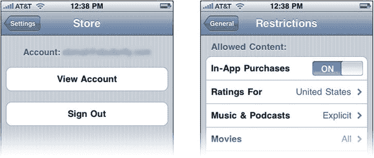

图 8-16。在测试应用内购买之前，你必须先在测试设备上退出你的 iTunes 账户（左图）。你还需要在测试设备的 `允许的内容` 设置中打开 `应用内购买`（右图）。

在测试设备的 `通用设置` 的 `限制` 部分，确保 `允许的内容` 下的 `应用内购买` 功能已开启（参见 图 8-16）。

现在设备已准备就绪，只需将其连接到你的开发电脑。为了在设备上编译和测试项目，请确保在 Xcode 的下拉菜单中选择 `设备` 作为 `活动的 SDK`。正如我之前提到的，你还需要确保已在 `Xcode Organizer` 中正确安装了为此设备和相关 App ID 分配的配置文件。

当你在测试设备上运行 Xcode 调试构建的应用时，`Store Kit` 框架会与一个特殊的“沙盒”测试环境通信，而不是真实的 App Store。如果发起应用内购买请求，`Store Kit` 会提示你确认购买。然后，`Store Kit` 会显示一个 iTunes 登录界面。选择 `现有账户`，并使用你的测试用户账户登录。在这个特殊的测试环境中，成功完成交易将返回一份订单收据，但不会发生资金转移，也不会生成发票。

切勿在生产环境中使用你的测试用户账户。你的测试账户仅应在 Xcode 中调试应用程序时使用。否则会导致你的账户凭据失效。确保你在苹果沙盒测试环境中运行应用的唯一方法是从 Xcode 启动应用到测试设备上。如果你从设备主屏幕启动应用，`Store Kit` 将连接到真实的 App Store 并使你的测试用户账户失效。

#### 接入 Store Kit 框架

开始编程吧！启动 Xcode 并创建一个新的 iOS 项目，选择 iPhone 的 `基于视图的应用程序` 模板。你也可以轻松地将示例代码应用到 iPad 或通用应用程序中，但为了专注于当前任务，我们保持简单。将示例项目命名为 `InAppPurchase`。如果你想节省时间直接跟着做，可以从本书配套的代码示例中下载并打开已完成的 `InAppPurchase` 项目，网址为 `http://iPhoneBusinessBook.com` 或 `http://www.apress.com`。

**注意**  我们即将构建的示例项目不应被视为一个独立可运行的应用程序。要使它正常工作，你需要在代码的各处插入自己的应用内购买项目产品 ID 和其他相关数据。在概述完成示例购买所需的步骤时，我将解释在哪里插入你的自定义应用内购买信息。

#### 为应用内购买配置项目

在编写任何代码之前，必须将所需的 `Store Kit` 框架添加到 Xcode 项目中。操作方式与你之前在本节中看到的例子相同。按住 Ctrl 键点击项目的 `Frameworks` 文件夹，选择 `添加  现有框架...`，然后从出现的列表中选择 `StoreKit.framework`。

由于 iOS 模拟器不支持应用内购买，请在 Xcode 主项目窗口左上角的 `概览` 下拉菜单中选择 `设备`，以反映你连接的测试设备。

接下来，打开 `InAppPurchase-Info.plist` 文件，将捆绑包标识符更改为现在在 `iTunes Connect` 中分配给此应用的标识符。例如，我们虚构的 Breadcrumbs 应用的捆绑包 ID 是 `com.ebutterfly.breadcrumbs`（如 图 8-13 所示）。

最后一个配置任务是指定 Xcode 项目的配置文件，以便在 Xcode 在连接的测试设备上运行应用时使用正确的配置文件。为此，请在 `组与文件` 窗格顶部选择项目名称，然后点击 `信息` 工具栏按钮。在出现的窗口中，选择 `构建` 标签页，向下滚动到 `代码签名` 部分。在 `代码签名身份` 下的 `任何 iOS` 中，选择分配给应用捆绑包 ID 的配置文件（如前文“创建应用内购买项目”部分所述）。

如果列表中未显示该配置文件，你需要在苹果的在线 iOS 配置门户中生成它，下载到你的电脑，并在测试设备连接时将其安装到 `Xcode Organizer` 中。如果你以前从未创建过配置文件，请阅读 第 9 章 中的教程，这样就可以在继续之前完成此步骤。

##### 设置基础内容


首先，你需要向项目中添加一个新类，因此请在“Groups & Files”列中选择“Classes”文件夹，然后选择“File”  “New File…”。接下来，在弹出的“New File”对话框中，从“Cocoa Touch Class”类别中选择“Objective-C Class”模板，并将“Subclass”下拉菜单配置为`NSObject`的子类。点击“Next”按钮，让 Xcode 创建`.h`和`.m`文件，并将它们都命名为`InAppPurchaseObserver`。我们稍后会在本章中向这个类添加一些代码，届时会解释其用途。

现在，让我们继续处理`InAppPurchaseViewController`类。你需要设计自己的商店前端界面，特别是当你在应用中提供多个应用内购买产品时。不过，对于这个基本示例，你将使用一个简单的`UIButton`来表示单个应用内购买项目。

打开`InAppPurchaseViewController.h`头文件，并按如下方式修改代码：

```
#import <UIKit/UIKit.h>
#import <StoreKit/StoreKit.h>
#import "InAppPurchaseObserver.h"

@interface InAppPurchaseViewController : UIViewController <SKProductsRequestDelegate> {
    InAppPurchaseObserver *inappObserver;
    UIButton *inappButton;
}

@property (nonatomic, retain) InAppPurchaseObserver *inappObserver;
@property (nonatomic, retain) IBOutlet UIButton *inappButton;
-(IBAction)buyInApp:(id)sender;

@end
```

以粗体突出显示的代码是新增内容。`StoreKit`框架已被导入，并引用了新的`UIButton`和`buyInApp`方法。这使得你可以通过代码修改按钮的属性，并在按钮被点击时调用`buyInApp`函数。

你还会注意到`SKProductsRequestDelegate`的指定。这允许`InAppPurchaseViewController`从`StoreKit`框架接收响应，这在你稍后开始向项目添加`StoreKit`代码时会发挥作用。

新的`InAppPurchaseObserver`类也已被导入，并可以通过`inappObserver`属性进行引用。这将使`InAppPurchaseViewController`能够将`StoreKit`事务响应发送给`InAppPurchaseObserver`类。我们将在本章稍后部分对此进行更多讨论。现在，请保存你的更改。

接下来，打开`InAppPurchaseViewController.m`实现文件，并添加以下粗体代码，以完成对`inappObserver`属性、`UIButton`和`buyInApp`方法的设置。

```
#import "InAppPurchaseViewController.h"

@implementation InAppPurchaseViewController
@synthesize inappObserver;
@synthesize inappButton;

- (void)viewDidLoad {

inappObserver = [[InAppPurchaseObserver alloc] init];

[super viewDidLoad];
}

// 当购买按钮被点击时，启动应用内购买流程。
-(IBAction)buyInApp:(id)sender {
    // 在这里与 StoreKit 交互。
}

- (void)didReceiveMemoryWarning {

[super didReceiveMemoryWarning];
}

- (void)viewDidUnload {
    // 释放主视图的任何保留子视图。
    // 例如：self.myOutlet = nil;
}

- (void)dealloc {
  [inappButton release];
  [inappObserver release];
  [super dealloc];
}

@end
```

保存这些更改后，在 Interface Builder 中启动`InAppPurchaseViewController.xib`。向视图中添加一个“Rounded Rect Button”（圆角矩形按钮），并将其“Touch Up Inside”连接器连接到文件所有者的`buyInApp`连接器。然后将文件所有者的`inappButton`输出口连接到该“Rounded Rect Button”。另外，添加一个标签，文本设置为“**Purchase Additional Features**”，并将按钮的默认标题更改为“**None Available**”（参见图 8-17）。确保通过取消选中“Enabled”属性来禁用该按钮。当我们开始与`StoreKit`交互时，这一切就会变得有意义。

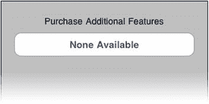

图 8-17. 在 Interface Builder 中设置简单的示例。取消选中按钮的“Enabled”属性

### 让应用内购买启动并运行

现在你已经完成了基本 UI 的构建和连接，是时候与`StoreKit`互动了。只需五个步骤，你就可以在应用中启动并运行应用内购买功能！

#### 步骤 1：消费者是否允许应用内购买？

由于用户可以在设备设置中禁用应用内购买功能，你需要在执行任何其他操作之前检查是否可以进行应用内购买。在 Interface Builder 中保存更改后，返回 Xcode，并再次打开`InAppPurchaseViewController.m`实现文件。将以下新的粗体代码添加到`viewDidLoad`中：

```
- (void)viewDidLoad {

inappObserver = [[InAppPurchaseObserver alloc] init];

if ([SKPaymentQueue canMakePayments]) {
        // 是的，此设备已启用应用内购买！
        // 继续获取可用的应用内购买项目。

} else {
        // 通过按钮文本通知用户应用内购买已禁用。
        [inappButton setTitle:@"应用内购买已禁用" forState:UIControlStateNormal];
        inappButton.enabled = NO;
    }

[super viewDidLoad];
}
```

这里，快速调用了`StoreKit`的`SKPaymentQueue`类中的`canMakePayments`方法。如果返回“是”，则表示该设备上允许应用内购买功能，并且可以访问 App Store。如果返回“否”，你可以通过按钮的标题标签通知用户他们已禁用应用内购买功能。请记住，按钮的初始状态已在 Interface Builder 中设置为禁用，所以目前只需保持其禁用状态，仅用于向用户传达信息。

#### 步骤 2：获取可用的应用内购买项目

在应用内购买功能可访问后，你现在可以检查 App Store 中你的项目是否可用。在执行此检查之前，你的应用必须已经知道相关的应用内购买产品 ID。

如果你只提供一个或两个应用内购买项目，并且不打算添加更多，最简单的方法是将应用内购买产品 ID 存储在应用内部。当然，每当你向应用添加新的应用内购买产品 ID 时，你需要通过更新使其对客户可用，这将需要你再次提交应用以供审核/批准。

由于 iTunes Connect 要求应用内购买产品 ID 是唯一的，请不要在父应用中预先分配不存在的 ID，并计划将来在 iTunes Connect 中创建这些 ID。如果其他开发者在你有机会在 iTunes Connect 中创建该产品 ID 之前就拥有了该产品 ID，那么这种策略可能会适得其反。

当然，你可以提前规划，现在就在 iTunes Connect 中创建所有已知的应用内购买项目，并将其标记为“Pending Developer Approval”（待开发者批准）。这样，你就知道了要包含在应用程序二进制文件中的产品 ID，当你准备好让消费者使用这些未来的应用内购买项目时，你可以提交它们以供批准。

如果你希望灵活地添加新的应用内购买项目而无需构建新的应用版本，则需要使用基于服务器的应用内购买模型（本章前面已讨论过），在该模型中，你的应用可以从你的服务器获取所有相关的产品 ID。如你所知，`StoreKit`不为此提供任何基础架构，因此配置应用与你的服务器通信是你的责任。虽然这需要你额外的工作，但这是检索大量产品 ID 的推荐方法，特别是如果你不断添加新的应用内购买项目。每次发布新的可购买附加内容时都提交新的应用更新，苹果的审批过程太耗时了。

相关的应用内购买项目需要获得批准并在 App Store 中准备好销售，之后客户才能在你的应用中购买它们。在项目获得批准之前，它们仅在你的父应用开发版本中可供你的测试用户账户使用。


一旦您的应用获取了应用内购买产品 ID（本例中仅使用一个），即可向 App Store 请求该产品，以确保其当前可供购买。

```
- (void)viewDidLoad {

inappObserver = [[InAppPurchaseObserver alloc] init];

if ([SKPaymentQueue canMakePayments]) {
        // 是，此设备已启用应用内购买！
        // 继续获取可用的应用内购买项目。

// 将"Your IAP Product ID"替换为您实际的应用内购买产品 ID，
        // 该 ID 可从远程服务器获取或存储在您的应用本地。
        SKProductsRequest *prodRequest= [[SKProductsRequest alloc] initWithProductIdentifiers:        [NSSet setWithObject: @"Your IAP Product ID"]];
        prodRequest.delegate = self;
        [prodRequest start];

} else {
        // 通过按钮文字通知用户应用内购买已禁用。
        [inappButton setTitle:@"应用内购买已禁用" forState:UIControlStateNormal];
        inappButton.enabled = NO;
    }

[super viewDidLoad];
}
```

在添加到 `InAppPurchaseViewController.m` 的 `viewDidLoad` 方法中的新代码（粗体显示）里，您需要将占位符字符串 `"Your IAP Product ID"` 替换为您自己的实际应用内购买产品 ID。例如，我们虚构的 Breadcrumbs 应用中售价 1.99 美元的 Premium Pack 的应用内购买产品 ID 是 `breadcrumbs.premiumpack`（如图 8-15 所示）。

还记得您之前添加到头文件中的 `SKProductsRequestDelegate` 代码吗？通过将 `InAppPurchaseViewController` 指定为 `SKProductsRequest` 的委托，您可以直接将 `self` 赋值给 `Delegate` 属性。Store Kit 随后会向此委托返回响应。为了接收该响应，请在 `InAppPurchaseViewController.m` 文件中添加以下代码：

```
// StoreKit 返回来自 SKProductsRequest 的响应。
- (void)productsRequest:(SKProductsRequest *)request didReceiveResponse:(SKProductsResponse *)response {

// 使用接收到的产品信息填充 inappBuy 按钮。
    SKProduct *validProduct = nil;
    int count = [response.products count];
    if (count>0) {
        validProduct = [response.products objectAtIndex:0];
    }
    if (!validProduct) {
        [inappButton setTitle:@"没有可用的产品" forState:UIControlStateNormal];
        inappButton.enabled = NO;
        return;
    }

NSString *buttonText = [[NSString alloc] initWithFormat:@"%@ - 购买 %@",     validProduct.localizedTitle, validProduct.price];
    [inappButton setTitle:buttonText forState:UIControlStateNormal];
    inappButton.enabled = YES;
    [buttonText release];
}
```

Store Kit 会返回一个包含可用应用内购买产品的数组。由于此处只有一个产品，因此您使用该产品的本地化标题和价格填充 `inappBuy` 按钮（见图 8-18）。如果您还想显示本地化描述，可以通过 `localizedDescription` 属性访问。现在按钮显示的是有效的应用内购买项目，请不要忘记通过代码启用该按钮。

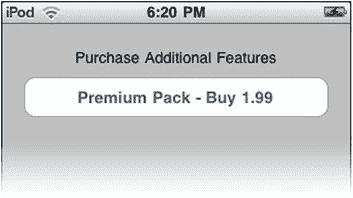

图 8-18。Store Kit 用关于可用应用内购买项目的信息回复产品请求。随后示例代码使用项目的本地化标题和价格填充按钮

既然您已经知道产品 ID，为什么还要费力通过 Store Kit 检查应用内购买项目？这一关键步骤可确保您的应用程序不会尝试销售当前在 App Store 中不可用的项目。例如，如果您同时提交了您的应用程序和一个应用内购买项目进行审核，但只有您的 iOS 应用获得了批准，该怎么办？强制您的应用在列出应用内购买项目之前首先检查其可用性，可以防止潜在的客户购买问题。切勿想当然。在您的应用内显示任何待售项目之前，请务必执行此检查。

如果您在 iTunes Connect 中成功设置了一个应用内购买项目，但您的应用在将其作为有效产品检索数据时遇到问题，请确保您应用的 `.plist` 文件中的捆绑标识符与您在 iTunes Connect 中分配给应用内购买项目的主应用捆绑 ID 相匹配。

在进行产品请求之后，不要丢弃该应用内购买产品 ID。它很快又会派上用场。如果用户点击购买按钮，您将需要该产品 ID 来向 Store Kit 提交购买请求。

#### 第 3 步：请求购买

在示例中，点击购买按钮会触发 `InAppPurchaseViewController.m` 文件中的 `buyInApp` 方法。因此，下一步是通过向 Store Kit 发送支付请求来处理该操作。

```
// 当点击购买按钮时，开始应用内购买流程。
-(IBAction)buyInApp:(id)sender {

// 将"Your IAP Product ID"替换为您实际的应用内购买产品 ID。
    SKPayment *paymentRequest = [SKPayment paymentWithProductIdentifier: @"Your IAP Product ID"];

// 将观察者类分配给 SKPaymentTransactionObserver，
    // 以便其可以监控交易状态。
    [[SKPaymentQueue defaultQueue] addTransactionObserver:inappObserver];

// 请求购买所选项目。
    [[SKPaymentQueue defaultQueue] addPayment:paymentRequest];
}
```

使用用户想要购买的应用内购买产品 ID 创建 `SKPayment` 实例后，您需要将观察者类分配给 `SKPaymentQueue` 的交易观察者。这正是您的 `InAppPurchaseObserver` 类发挥作用的地方。还记得 `inappObserver` 属性是如何创建来引用该类的吗？通过将 `inappObserver` 指定为 `SKPaymentTransactionObserver`，您的项目中的 `InAppPurchaseObserver` 类可以在支付请求发送到 `SKPaymentQueue` 后监控其交易状态。

由于支付交易不会在应用退出时丢失，您可能希望在应用启动时将观察者分配给支付队列，以便任何现有的交易可以在下次运行应用时继续被监控和处理。这为什么重要？一种可能的情况是，用户在购买过程中接到电话。通话结束后，当用户返回您的应用时，交易可以继续。

当支付请求被送达时，App Store 会提示用户确认购买，然后输入 iTunes 账户登录信息。在此沙盒环境中测试您自己的应用时，您需要选择“使用现有账户”，然后输入您的测试用户账户电子邮件地址和密码（见图 8-19）。

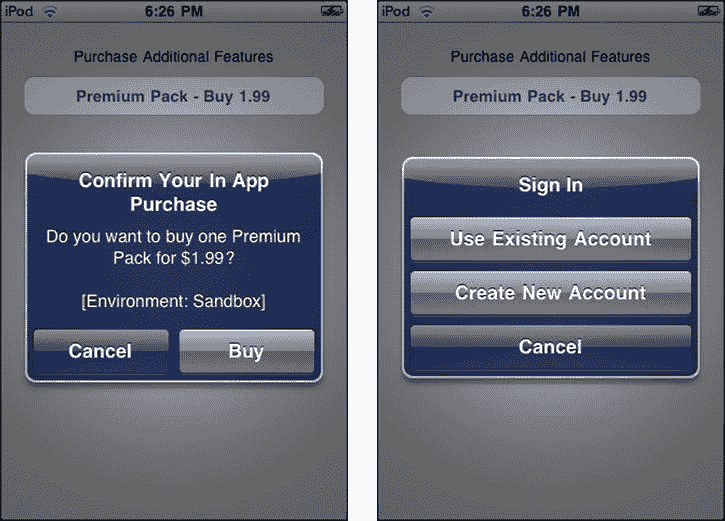

图 8-19。系统会要求您确认购买请求（左图）。选择“购买”按钮后，系统会提示您通过“使用现有账户”按钮以测试用户身份登录（右图）

#### 第 4 步：接收支付状态

在用户取消或确认购买后，交易状态会发送回您的 `InAppPurchaseObserver` 类。现在是时候向该类添加代码来处理此任务了。打开 `InAppPurchaseObserver.h` 头文件，并按照以下方式更新代码：

```
#import <Foundation/Foundation.h>
#import <StoreKit/StoreKit.h>
```


```objectivec
@interface InAppPurchaseObserver : NSObject <SKPaymentTransactionObserver> {

}

- (void)paymentQueue:(SKPaymentQueue *)queue updatedTransactions:(NSArray *)transactions;

@end
```

正如您将注意到的，加粗代码导入了 Store Kit 框架，并将这个 `NSObject` 子类指定为 `SKPaymentTransactionObserver`。完成这些设置后，再加上对 `paymentQueue` 的引用，保存并关闭这个头文件。

为了接收支付交易状态更新，您的 `InAppPurchaseObserver.m` 实现文件应包含以下代码：

```objectivec
#import "InAppPurchaseObserver.h"
#import "InAppPurchaseViewController.h"

@implementation InAppPurchaseObserver

// SKPaymentQueue 的交易状态会发送到这里。
- (void)paymentQueue:(SKPaymentQueue *)queue updatedTransactions:(NSArray *)transactions {
    for(SKPaymentTransaction *transaction in transactions) {
        switch (transaction.transactionState) {

case SKPaymentTransactionStatePurchasing:
                // 商品仍在购买过程中。
                break;

case SKPaymentTransactionStatePurchased:
                // 商品已成功购买！
                break;

case SKPaymentTransactionStateRestored:
                // 已验证用户已为这个商品付过费。
                // 非常适合在客户的所有设备上恢复商品。
                break;

case SKPaymentTransactionStateFailed:
                // 购买被用户取消或发生错误。

if (transaction.error.code != SKErrorPaymentCancelled) {
                    // 发生交易错误，因此通知用户。
                }
                break;
        }
    }
}

@end
```

在 `paymentQueue` 状态接收器中，您可以检查交易的当前状态。正如之前的代码所示，`SKPaymentTransactionStatePurchasing` 表示购买仍在进行中，因此您暂时无需执行任何操作。您需要密切关注 `SKPaymentTransactionStatePurchased` 或 `SKPaymentTransactionStateRestored` 的返回，因为这将表明您的应用需要解锁或下载已购内容（参见图 8-20）。

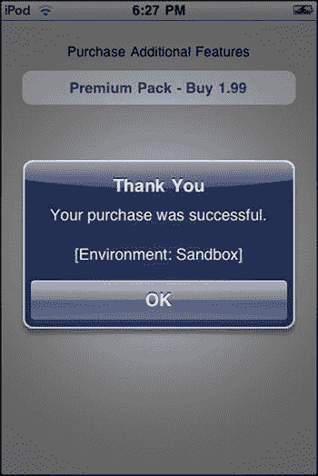

图 8-20。如果应用内购买交易成功，App Store 会显示一条感谢信息，并将 `SKPaymentTransactionStatePurchased` 返回给 `paymentQueue` 接收器

如果购买被用户取消或发生交易错误，则会返回 `SKPaymentTransactionStateFailed`。如果用户点击了取消按钮（如 `SKErrorPaymentCancelled` 所示），则可以安全地忽略这次中止的购买。但如果交易因其他原因失败，您应该让用户知道购买未完成。

#### 第 5 步：提供对已购内容的访问权限

如果收到的交易状态是 `SKPaymentTransactionStatePurchased`，这确认了用户的购买成功。此时，您应该立即向客户提供对已购内容的访问权限作为奖励。正如您所学到的，您可以选择在应用内解锁商品，或从远程服务器下载内容。在已购内容成功交付给用户后，您需要做的最后一件事是通过调用 `finishTransaction` 将交易从支付队列中移除：

```objectivec
- (void)paymentQueue:(SKPaymentQueue *)queue updatedTransactions:(NSArray *)transactions {
    for(SKPaymentTransaction *transaction in transactions) {
        switch (transaction.transactionState) {

case SKPaymentTransactionStatePurchasing:
                // 商品仍在购买过程中。
                break;

case SKPaymentTransactionStatePurchased:
                // 商品已成功购买！

// --- 在此处解锁功能或下载内容 ---
                // 已购商品的 ID 可通过
                // transaction.payment.productIdentifier 访问

// 在客户成功接收已购内容后，
                // 将完成的交易从支付队列中移除。
                [[SKPaymentQueue defaultQueue] finishTransaction: transaction];
                break;

case SKPaymentTransactionStateRestored:
                // 已验证用户已为这个商品付过费。
                // 非常适合在客户的所有设备上恢复商品。

// --- 在此处解锁功能或下载内容 ---
                // 已购商品的 ID 可通过
                // transaction.payment.productIdentifier 访问

// 在客户在此设备上恢复已购内容后，
                // 将完成的交易从支付队列中移除。
                [[SKPaymentQueue defaultQueue] finishTransaction: transaction];
                break;

case SKPaymentTransactionStateFailed:
                // 购买被用户取消或发生错误。

if (transaction.error.code != SKErrorPaymentCancelled) {
                    // 发生交易错误，因此通知用户。
                }
                // 完成的交易应从支付队列中移除。
                [[SKPaymentQueue defaultQueue] finishTransaction: transaction];
                break;
        }
    }
}
```

由于交易是持久的，将完成的交易从支付队列中移除非常重要。从加粗代码中您会注意到，这不仅在成功交易后执行，在失败交易后也需要执行。但只有在您从交易中获取完所需信息之后才能这样做。

在成功交易的情况下，您需要在移除交易之前通过 `transaction.payment.productIdentifier` 捕获已购商品的 ID。这将告诉您应该向用户提供哪个特定的应用内购买产品，如果您的应用程序提供多个应用内商品销售，这一点尤其有用。您应该将此 ID 存储在应用程序的某个位置（例如 plist 文件中），以便跟踪哪些商品已被购买，并确保用户下次运行您的应用程序时内容仍然易于访问。

应用程序的首选项文件是存储已购产品 ID 的好地方，因为当用户通过 iTunes 将设备与电脑同步时，应用程序的首选项会被备份。对于非消耗品和有效的订阅商品，您的客户每次运行应用程序时都应能访问他们已购买的商品。

如果已购内容是从您的服务器下载的，您还需要在从支付队列中移除交易之前获取 `transaction.transactionReceipt`。您的服务器需要接收此收据数据，以便在授权来自您应用的下载请求之前，与 App Store 验证其真实性。

最后但同样重要的是 `SKPaymentTransactionStateRestored` 的交易状态。这通常是在向支付队列发送恢复请求时返回的。

### 恢复已支付内容

乍一看，确保客户拥有的所有兼容设备上都能访问已购商品听起来像是一项相当艰巨的任务，但 Store Kit 提供的支持可以自动完成其中的大部分工作。对于自动续期订阅和非消耗性应用内购买商品，您可以通过调用以下代码向支付队列发送恢复请求：

```objectivec
[[SKPaymentQueue defaultQueue] restoreCompletedTransactions];
```


`SKPaymentTransactionStateRestored`结果会返回给交易观察者类中的`paymentQueue`接收器。在示例项目中，`paymentQueue`位于`InAppPurchaseObserver.m`文件中。与普通应用内商品购买一样，你可以检查恢复交易记录中的产品 ID，然后向用户提供对这些已购商品的访问权限。恢复交易的主要区别在于不会再次向用户收费。这些商品已经支付过，因此此方法只是标识你的应用应向用户提供哪些应用内商品。

同样，如果用户意外尝试购买已拥有的非消耗型商品，结果将返回为`SKPaymentTransactionStatePurchased`，但不会对此交易收费。在你向用户提供对其已购商品的访问权限后，应从支付队列中移除此交易。

遗憾的是，较旧的订阅类型和消耗型商品交易无法通过 Store Kit 恢复。要恢复这些类型，你需要采用基于服务器的应用内购买模型，并在自己的服务器上保存原始购买交易记录。然后，你的服务器端 Web 应用程序可以协调将这些商品恢复到用户的设备上。

无论你在后端需要做什么来支持这一点，都应尽可能让恢复过程对用户便捷简单。许多开发者通过在应用的逻辑位置添加“恢复已购内容”按钮来实现这一点。一个视觉上吸引人的示例是 Iconfactory 的 Astronut 游戏，该游戏在关卡选择屏幕上提供了此功能，效果显著（参见图 8-21）。

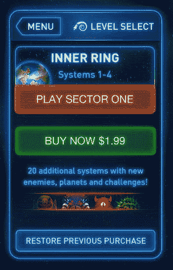

图 8-21。Iconfactory 的 Astronut 游戏提供了一个方便的“恢复之前购买”按钮，用于恢复用户的已购内容

**深入挖掘**

介于第 7 章讨论的应用内广告机会与本章探讨的通过应用内购买实现的新商业模式之间，在 iOS 平台上有许多超越传统应用销售之外的盈利方式。

本章为你理解并在应用中使用应用内购买提供了一个良好的起点。如需深入了解整个 Store Kit API，我强烈建议阅读相关的 iOS SDK 文档。登录 iOS Dev Center，然后查看以下资源：

*   *In-App Purchase Programming Guide* (`http://developer.apple.com/library/ios/#documentation/NetworkingInternet/Conceptual/StoreKitGuide/`)
*   *Store Kit Framework Reference* (`http://developer.apple.com/library/ios/#documentation/StoreKit/Reference/StoreKit_Collection/`)

## 第 9 章 测试与可用性：展现最佳状态

当你阅读了各种从应用内部提升应用市场推广性的技巧后，你可能已经注意到贯穿本书的一个主题：你的应用必须出色！拥有一个绝妙的应用创意是不够的。那么，什么才是卖点？美丽、直观的界面，易于使用，并提供按预期工作的功能。

再多的营销和宣传也无法挽救一个构思糟糕的应用。漏洞百出的性能和粗糙的可用性会迅速毁掉应用的口碑，引发负面口碑、差评以及 App Store 中灾难性的用户评分。

在任何发布之前，尤其是最初的 1.0 版本，实施全面的测试流程应是你开发周期中的关键步骤。本章将讨论提供内置帮助、为设备测试配置应用以及从 Beta 测试者处获得宝贵反馈的优点。

### 避免大多数一星差评

表面上，App Store 中的许多负面用户评论似乎都只是在抱怨价格。有无数评论声称，购买应用后，用户觉得不值这个价。如果应用只花费几美元甚至更少，这类评论显得相当小气，但理解这些用户为何感到受骗是很重要的。

当然，无论你交付的应用有多好，总会有一些特立独行的人对价格大加抱怨。但对于很大一部分不满意的用户来说，背后有一个根本原因在起作用。对他们而言，这实际上与金钱无关——他们在星巴克买一杯拿铁的花费都比应用贵。相反，这完全关乎他们的购买满意度。

在阅读了 App Store 的描述并浏览了截图后，用户会带着特定的期望下载一个应用。无论对错，如果这些期望没有得到满足，挫败感就会产生——即使应用是免费的！显然，有些期望注定是不合理的，你不可能让每个人都满意，但你可以采取一些步骤来尽量减少不满意的用户数量，正如你将在本章中学到的那样。

### 避免常见陷阱

以下是导致用户挫败感的三大因素：

*   性能不佳
*   缺乏可用性
*   界面不精致

好消息是，通过进行一些边缘情况测试，你可以在将应用发布到“野外”之前修复其中两个致命问题。

当然，没有人想发布难以使用的有漏洞软件。尽管避免性能不佳和可用性问题对你来说似乎显而易见，但令人惊讶的是，有大量 App Store 应用都栽在了这些问题上。那么，这是如何发生的呢？如果你在一个孤立的环境中工作，既是唯一的开发者又是唯一的测试者，这比你想象的要容易。

即使你积极使用 Instruments（包含在 Apple 开发工具下载中）和 Xcode 的“构建与分析”功能来剔除 Bug 和内存泄漏，这也还不够。

遗憾的是，太多开发者在将应用提交到 App Store 之前，没有花时间在多种设备和用户间进行广泛测试。一个应用可能在你的 iOS 模拟器中运行良好，但在实际的 iPhone、iPad 和 iPod touch 上呢？许多性能、内存和可用性问题只能通过在设备本身上测试应用才能发现。在模拟器中，你的应用可能在配备高速宽带互联网连接的强劲 Mac 上运行飞快，但真正的性能测试是在较慢的无线网络和真实 iOS 设备处理器上运行的。

并且别忘了，iOS 模拟器的显示尺寸比设备紧凑的屏幕要大得多。在大的 Mac 显示器上，应用的界面设计看起来可能具有欺骗性的大，但在小巧的高分辨率 iPhone 屏幕上可能会急剧缩小。UI 元素在 iOS 模拟器中看起来功能正常，但当在 iPhone 小屏幕上测试时，你可能会发现自定义按钮太小且距离过近，导致精确的手指点击极其困难。

Apple 拒绝了近 60% 的应用提交至少一次。你在各种技术博客上读到的那少数几起高调被拒事件，因其模糊或荒谬的拒绝理由而成为了新闻素材。然而，大多数日常被拒事件——那些没有成为头条新闻的——仅仅是在审核过程中无法工作、出现 Bug 或崩溃的应用。因此，你不仅要在 iOS 模拟器中测试你的应用，还要在尽可能多的设备上进行测试，这一点至关重要。


如果你是一名独立开发者，可能无法接触到所有搭载 iOS 系统的硬件型号，比如初代 iPhone、iPhone 3G 和 3GS、iPhone 4、iPad 以及 iPod touch。但你最好能拥有不止一台测试设备，这是一项值得的投资。我通常使用 iPod touch、初代 iPhone、iPad 和 iPhone 4 来测试应用。这样我就能在旧款硬件和 iOS 5 上，以及在最新处理器、Retina 显示屏和 iOS 7 上分别检查应用的兼容性。如果预算允许，尽量保留一台 iPhone 4 作为测试设备。大多数情况下，如果应用能在 iPhone 4 上流畅运行，那么它在当前最新的 iPhone 和 iPad 上运行效果会更好。

为了覆盖尽可能广泛的用户群体，你应该以最低配置的通用设备为目标。如果应用的网络功能在初代 iPhone 较慢的 EDGE 网络下都能良好运行，那么在 iPhone 5S 上更快的 4G LTE 网络下，它的速度只会更快。对于内存密集型应用，建议你在 RAM 较小的旧款 iPhone 型号上进行测试。如果你计划让应用向后兼容旧版 iOS，我建议使用安装了这些旧版本系统的测试设备，例如几款不同型号的 iPod touch。

你有没有让别人试驾过你的应用？如果没有，那你必须这么做！招募 Beta 测试人员来评估你的应用，是发现难以定位的漏洞和其他关键问题的最有效方法之一。作为应用的创建者，你已经和它朝夕相处了数月，经历了艰苦的设计和开发过程。它的完成是你的骄傲和喜悦。你离它太近了，这意味着你可能会错过别人一眼就能看出的明显问题。潜意识里，你可能不想发现任何缺陷，因为那意味着要推迟发布。但在 App Store 严酷的竞争环境中，无知可不是福。

Beta 测试不仅仅是为了消灭漏洞。每个人接触一个应用时，都会带着独特的心态和不同的期望。你对自己的应用了如指掌，所以自然觉得它的设计很直观。然而，对于那些不熟悉它的人来说，弄清楚如何使用它可能会困难得多。

此外，其他人使用你的应用的方式可能与你的预期大相径庭。了解这一点非常重要，它能帮助你填补可用性的漏洞，并发现你之前未曾考虑过的新目标市场。例如，一个普通的笔记应用，在发现 Beta 测试人员表达出的特定需求后，可能会演变成一个定义更明确的日记撰写工具。

如果你对设备端测试或 Beta 测试还不熟悉，请继续阅读，因为这两个主题都将在本章后面详细讨论。

毫无疑问，市场上用于向 Beta 测试人员分发应用的最佳工具是 `Test Flight`（`www.testflightapp.com`）。这个强大的网页门户允许你随时向测试人员分发 iOS Beta 版本。它还提供了非常详细的崩溃报告。

### 征求直接反馈

在应用内部提供一个让客户能轻松向你发送直接反馈的机制，有助于减少许多负面的应用商店评论。还记得我们在第 5 章中是如何将应用内邮件集成到一个示例项目中的吗？尽管那是为了给用户提供“告诉朋友”功能，但同样的应用内邮件功能也可以用来征求客户的直接反馈。

为用户提供一个专门用于从应用内给你发送邮件的渠道，能为你的客户带来极大的便利。不要指望用户会花时间去查找你网站上的支持页面，尤其是当他们正使用 iPhone、iPad 或 iPod touch 时（远离他们的电脑）。对他们来说，表达意见最方便的方式就是直接在 App Store 上发布评论——除非你给他们提供一种更简单、更快捷的方法，就在你的应用内部！

PumpOne 的 `FitnessBuilder` 提供了一个很好的应用内反馈表单示例。通过在应用主屏幕上设置一个“Ask”按钮来访问此表单，开发人员为客户提供了一种极其简便的方式，可以直接从应用内部提交反馈（参见图 9-1）。

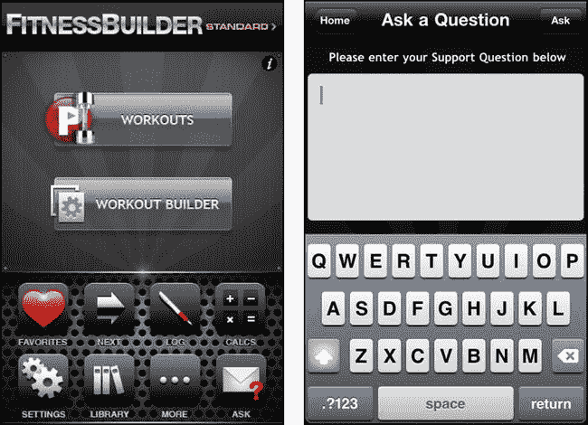

图 9-1. PumpOne 的 `FitnessBuilder` 提供了一个便捷的应用内反馈表单，可通过应用主屏幕上的“Ask”按钮轻松访问

那么，如果你有兴趣为自己的应用添加直接反馈功能，该从哪里开始呢？看看第 5 章的“告诉朋友”示例项目。将那个应用内邮件代码修改为应用内反馈表单应该很容易。如果你不想自己构建解决方案，也有一些第三方替代方案，比如 `Crittercism`（`http://www.crittercism.com`）。

如果你还提供了免费应用或付费应用的精简版，那么同样重要的是（甚至更为重要）也要为这些版本添加应用内反馈表单。由于免费和精简版应用没有使用门槛，它们会吸引更广泛的用户群体，其中多数只是出于好奇，想先“试驾”一下。与付费应用的客户不同，这些用户没有既得利益，因此往往会是更严厉的批评者。免费和精简版应用通常在 App Store 上获得的评分低于其付费版本。考虑到这一点，你的目标是让用户直接在应用内向您提交反馈，而不是在 App Store 上公开发布他们的负面言论。

通过提供应用内反馈表单，你是在告诉用户：他们的意见对你很重要。如果让你选择，是直接与应用开发者沟通，还是等待并希望开发者看到他们在 App Store 的评论，很可能他们会选择应用内反馈表单，尤其是当他们真的希望看到应用改进和发展时。这当然不会阻止那些喜欢在 App Store 的“在线演讲台”上抱怨一切的小众用户，但这将有助于减少那些仅仅只是功能请求和支持问题的负面 App Store 评论。

但是，应用内邮件表单不也会把正面反馈直接引导到你这里，而不是公开发布在 App Store 上（这样有助于促进销售）吗？当然，这种情况可能会出现一些，但你总是可以通过电子邮件回复这些客户，感谢他们，并礼貌地询问他们是否愿意将正面评论发布在 App Store 上。如果他们喜爱你的应用，通常情况下，他们会对此请求感到荣幸并乐意帮忙。

与客户建立直接联系对所有参与者来说总是一个双赢的局面。如果客户支持你作为一名独立开发者的个人成功，那么他们更有可能在与朋友的线上互动中（通过 Twitter、Facebook 等）为你的应用进行宣传。

### 通过应用内帮助预防用户挫败感

用户受挫的一个主要原因是无法弄清楚你的应用是如何工作的。在桌面电脑的世界里，人们已经习惯了需要“圣经”般厚重手册的庞大、复杂的软件应用。

而在移动环境中，应用通常只用一只手（有时甚至只有一根拇指）来操作，用户期望应用拥有直观的界面，能够一目了然。iOS SDK 通过提供一套通用的原生 UI 控件来处理常见功能，在这方面有所帮助。如果你在一个应用中用过导航控制器，那么你就会知道如何在所有其他 iPhone 应用中使用它。


#### 应用内帮助指南

对于大多数移动应用，如果需要手册来解释如何使用最基本的功能，你应该认真考虑重新设计当前的界面。用户应该能够下载你的应用并立即开始使用核心功能，而无需被告知如何使用。但话虽如此，即使是操作最直观、最简单的用户界面，对所有人来说可能也并不明显。为了安全起见，提供内置的演示或教程来引导需要帮助的用户总是一个好主意。

游戏通常需要说明如何激活各种控制和命令。更复杂的生产力应用经常需要向高级用户展示高级技巧和窍门。在这些情况下，在你的应用中让这些信息易于访问非常重要。不要仅仅将信息发布在网站或支持网站上，认为用户会自己找到它们。如果用户已经到了那个地步，他们早已因为四处寻找你似乎刻意隐藏的说明而感到沮丧了。还要记住，你的应用可能在飞机上或没有无线连接的地方使用，因此在应用中包含文档对用户来说会方便得多。

在应用中包含指南也有助于减少你花在客户支持上的时间，这反过来为你节省了金钱（以及无数的烦恼）。如果用户能轻松地在你的应用中找到问题的答案，你需要处理的支持请求就会减少。如果你是独立开发者，你会知道花在应对客户支持查询上的时间越少，你就越有时间进行实际的编程。

在你的 iOS 应用中，有四种常见的应用内帮助类型可供使用：

*   屏幕提示
*   教学视频
*   视觉演示
*   基于文本的帮助

我们将看看每种方法的优缺点，以便你决定哪种类型最适合你的应用。无论你选择哪种方法，包含某种形式的应用内帮助都能提升应用的整体用户体验。

#### 用屏幕提示播下知识的种子

假设你的应用易于使用，不需要专用的帮助屏幕或教程，但它确实包含一些高级功能。在`UIAlertView`弹出窗口中显示屏幕提示是快速教育用户的好方法。

流行的电子书阅读器应用 `Stanza` 在启动时会显示一个有用的提示（见图 9-2）。该应用在每次启动时自动随机选择一条提示。用户可以通过点击“显示下一条提示”按钮选择查看更多提示，或选择“关闭”开始使用应用。

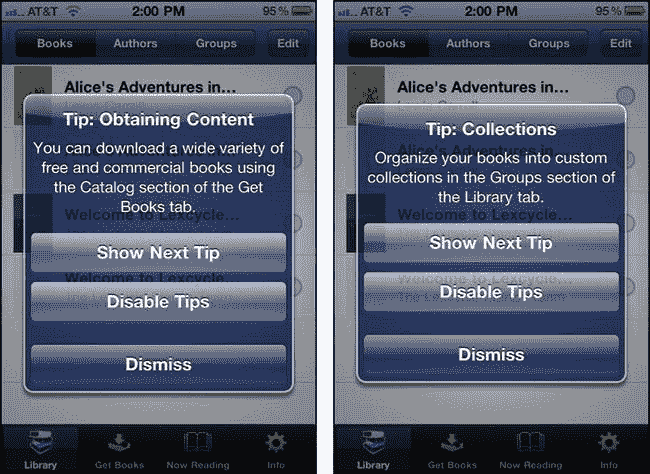

**图 9-2.** 启动时，`Stanza` 电子书阅读器会显示有用的屏幕提示，指导如何使用应用。提供了方便的选项来禁用提示或显示更多提示。

注意还有一个“禁用提示”按钮。这是一个关键选项，允许已经熟悉所有提示的高级用户轻松地在提示变得烦人之前将其关闭。提示功能可以在应用的“设置”面板中打开和关闭，但为什么让用户去寻找呢？让用户只需轻点一下即可快速禁用提示，可以防止用户对本来应该只提供帮助的功能感到沮丧。

#### 教学视频：双刃剑

对于许多游戏（甚至应用）来说，展示实际游戏过程的视频通常是最容易解释如何游玩的方式。尽管这非常有效，但也存在一些缺点。

由于视频剪辑的典型文件大小，你可能不希望将其包含在应用的下载包中，以免使移动应用变得过大。这给你留下两个主要选择：

*   将视频上传到像 YouTube 这样的视频分享网站。
*   将视频托管在你自己的网络服务器上。

由于许多开发者将预告片和教学视频上传到视频分享网站来推广他们的应用，一个简单的解决方案是直接从应用内的按钮链接到那些“如何游玩”的视频之一。然而，这种方法存在几个问题。

大多数视频分享网站使用 Flash 视频，而 iOS 平台目前不支持。你可以使用 YouTube，因为它的视频会从 Flash 视频动态转换为 iOS 兼容的 H.264 视频格式。但你必须确保你的应用不是链接到视频的 YouTube 页面，这会导致视频在 YouTube 应用或 `Mobile Safari` 浏览器中加载，从而将用户带离你的应用。由于用户起初并未意识到他们离开了应用，他们可能不明白为什么看完视频后没有返回应用。是的，我知道将所有流量导向那个 YouTube 视频页面会增加观看次数和你的 YouTube 排名，但在这种情况下，用户体验应该优先于你的在线社交营销努力。

只要有可能，你应该直接加载媒体文件，以便在原生 iOS 电影播放器控制器中播放。当剪辑播放完毕或用户点击控制器的“完成”按钮时，用户会自动返回到你的应用。这提供了无缝的过渡，使消费者在观看完教学视频后能立即开始使用应用。流行的联系人数据共享应用 `Bump` 在其“关于”屏幕上的简短教学视频中很好地做到了这一点（见图 9-3）。

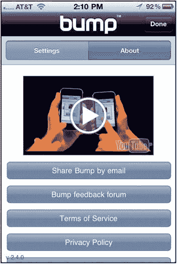

**图 9-3.** 在 `Bump` 的“关于”屏幕中点击视频缩略图，将在 iOS 电影播放器控制器中播放教学视频。剪辑播放完毕后，用户会自动返回应用。

当然，制作教学视频需要一些数字电影制作技巧，但如果你是游戏开发者，这在如今几乎是营销的必备条件。似乎每款 iPhone 和 iPad 游戏都有用于推广目的的流畅视频预告片。制作另一个解释如何游玩的视频可能同样重要。

#### 视觉演示：展示，而非告知

你知道那句老话：“一图胜千言。”这在教导人们如何使用你的应用时同样适用。虽然视频很好，但由静态图像或短动画组成的视觉演示也同样有效。由于这类演示通常由简短的截图或插图幻灯片构成，它们的文件大小通常比视频文件小得多，这意味着加载速度更快，占用内存更少——这是构建移动应用时需要考虑的重要因素。

流行的 `Convertbot` 应用拥有美观而独特的界面，但由于它不使用熟悉的 `UIKit` 控件，如何操作它乍一看可能并不明显。开发者 `Tapbots` 通过在首次启动时询问用户是否想要查看快速演示来解决这个问题。如果这个提示被关闭，演示仍然可以通过“信息”面板访问。

`Convertbot` 拥有我在 iOS 应用中见过的最好的演示之一。它不是将演示加载到不同的视图中，而是将应用的实际主界面全屏显示，自动执行操作，并用弹出气球描述不同的 UI 元素如何工作以及执行特定单位转换需要采取哪些步骤（见图 9-4）。

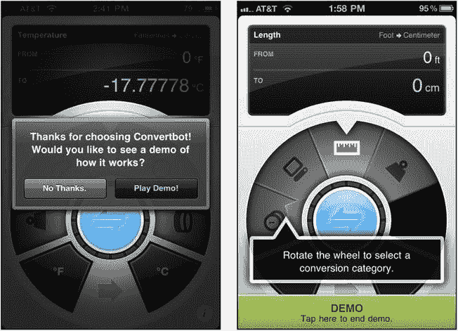

**图 9-4.** `Convertbot` 包含一个非常有效的演示。它将主界面置于自动演示模式，通过弹出气球描述向你展示如何使用独特的 UI 元素。


另一个很好的例子是 Rovio 公司《愤怒的小鸟》中的演示。首次启动游戏时，用户可以选择查看快速操作指南（见图 9-5）。这些仅展示详细图片而无文字的可视化说明，能够无障碍地适配任何语言和年龄段的用户。

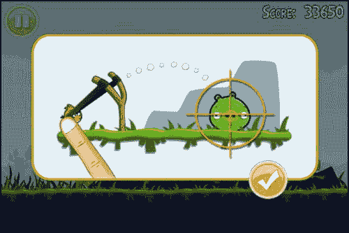

图 9-5。仅通过展示图片，《愤怒的小鸟》的游戏玩法说明就能被任何语言和年龄段的用户轻松理解

构建有效的应用内演示的唯一缺点在于所需的时间和开发精力。将教程演示制作成一系列插图或带有指导性注释的修改版截图，通常比制作视频简单得多，尤其是在你视频剪辑技能有限的情况下。你可以编写一个非常简单的幻灯片视图控制器来循环播放 PNG 截图。如果你的应用能从嵌入演示中受益，那么投入这些精力是完全值得的。

#### 通过基于文本的帮助提供移动手册

尽管简单的图片通常足以解释游戏玩法，但许多效率和生活类应用需要更详细的说明来指导用户使用高级功能和服务。如果其他类型的应用内帮助不适用，并且你真的需要提供全面的文档，那么经典的传统文本帮助可能是你唯一的选择。

但不要只满足于纯文本。请按照以下基本准则，以吸引人的格式呈现信息：

*   通过将文本组织成带要点的章节，用更少的文字快速解释步骤。
*   使用**加粗**的较大字号来反映主题标题。
*   插入截图或插图作为文本的视觉辅助。

热门健身应用 RunKeeper Pro 在其"关于"屏幕上的帮助指南中实现了这一点。由于内容被组织成带有样式文本、编号列表和裁剪截图的各个章节，说明文字易于理解且可以快速阅读（见图 9-6）。

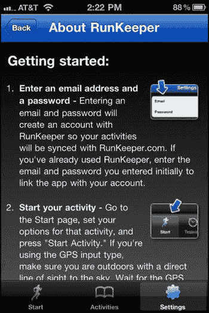

图 9-6。RunKeeper Pro 的基于文本的帮助以样式化、有条理的方式呈现，既美观又易于阅读

别担心！无需为了显示图 9-6 中那种样式化的帮助而去处理复杂的 Core Text。使用`UIWebView`，你可以通过 HTML 来显示样式化文本和图像！

#### 一点 HTML 就能带来大不同

HTML 的美妙之处在于它易于创建和维护。只需在你的帮助视图控制器中添加一个`UIWebView`，并让它加载你想要显示的 HTML 页面或 HTML 字符串即可。你甚至可以编译好的应用中包含 HTML 帮助页面，这样就不需要远程获取任何内容——这对于未连接互联网的设备（例如没有 Wi-Fi 的 iPad 或处于飞行模式的 iPhone）来说非常完美。在开发过程中，修改文档只需对 HTML 进行几次简单的文本更改即可，无需摆弄 Objective-C 代码。

对于那些核心功能需要持续网络连接的应用，帮助面板的`UIWebView`也可以轻松加载外部网站的 URL。这让你能够灵活地更新帮助内容，而无需修改或重新编译实际的 iOS 应用。

如果您收到大量用户反馈，远程托管帮助内容会特别有用。你可以持续更新帮助页面，添加额外常见问题的解答，从而改进现有 iOS 应用内的支持。这也允许你在 Web 服务器上维护一个单一的帮助内容源，并可供多个平台访问。根据同一帮助内容是在桌面网页浏览器、iPhone、iPad 还是其他移动设备上呈现，可以采用不同的 CSS 样式。

由于许多用户在小屏幕上用单指点击访问应用内帮助，请务必确保帮助内容组织紧凑且易于导航。如果你正在构建一个需要大量文档的复杂效率应用，一长串滚动文本屏幕可能会显得有些笨拙。将其拆分成较小的主题。这份帮助主题列表可以用`UITableView`呈现。选择某个主题会加载一个新屏幕，该屏幕在`UIWebView`中显示该主题的文本和图像 HTML 页面。

如果你不想创建包含多个`UITableView`和`UIWebView`屏幕的导航控制器基础架构，另一种方法是使用单个`UIWebView`内部的第三方移动 Web 框架。

#### 仅需一次的操作指引

在过去一年中变得非常流行的一种新指导方法是图形覆盖层，仅在首次调用应用代理时启动。图 9-7 展示了一个示例，其中包含一个清晰简洁的覆盖层。请记住，无论你的应用多么简单，你都是一位经验丰富的开发者和技术专家——但并非所有人都是。

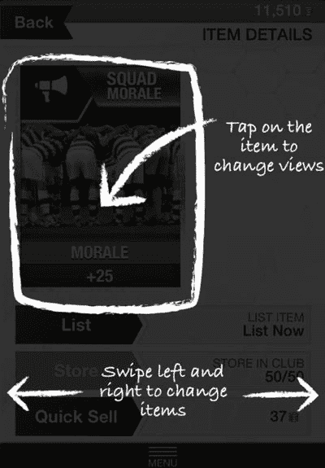

图 9-7。仅需一次的操作指引

#### 使用移动 Web 框架构建应用内帮助

大多数开发者在想到编写任何文档时都会抱怨。如果你缺乏网页设计技能，那么需要创建一组 HTML 页面会让事情变得更糟。幸运的是，有一些出色的第三方 iOS WebKit 框架可以用来简化这个过程。以下是其中几个：

*   iUI，一个 iPhone UI Web 框架（`http://code.google.com/p/iui/`）
*   Sencha Touch，一个功能丰富的移动 JavaScript 框架（`http://www.sencha.com/products/touch/`）
*   jQTouch，一个用于 iPhone Web 开发的 jQuery 插件（`http://www.jqtouch.com`）
*   iWebKit，一个 iPhone 网站工具包（`http://snippetspace.com/projects/iwebkit/`）
*   WebApp.Net，一个 iPhone Web 开发框架（`http://webapp-net.com`）
*   Magic Framework，一个 iPhone HTML5 框架（`http://www.jeffmcfadden.com/projects/Magic%20Framework/`）
*   SaFire，一个 iPhone Web 应用框架（`http://code.rememberthisguy.com/safire/`）
*   UiUIKit，一个通用 iPhone UI 工具包（`http://code.google.com/p/iphone-universal/`）

这些工具包不仅针对 iOS 屏幕尺寸进行了专门优化，而且还提供了可模拟原生 UI 控件和行为的省时模板。这有两大好处：

*   Web 设计看起来像 iOS 界面，因此能与你应用的其他部分良好融合。
*   UI 是用户熟悉的，因此用户完全无需学习成本。

一个像 iOS 应用一样工作的即时帮助系统！你需要做的只是编写文本。

那么，你应该使用哪个框架呢？它们各自都有独特的优势和长处，所以请查看他们的网站，看看哪个最适合你的特定需求。

所有这些框架都包含完整的源代码，并且可以免费下载。使用权限可能有所不同，因此在将第三方 Web 框架添加到你的应用之前，请务必阅读许可条款。

### 配置：设置开发设备

当需要测试 iOS 模拟器不支持的某些功能时（例如加速度计、多点触摸手势和应用内购买），你应该在真正的 iPhone、iPad 或 iPod touch 上运行你的应用。


#### 开发阶段的初步测试

`Vimov` 公司巧妙的 iSimulate iPhone 应用及 SDK，能够通过无线方式，将同一 Wi-Fi 网络下 iPhone 或 iPod touch 上的 GPS 位置、多点触控、加速度计和指南针事件发送到 iOS 模拟器。这可以大大减少测试所花费的时间，因为在 iOS 模拟器中运行应用远比在测试设备上安装应用要快得多。请在 `http://www.vimov.com/isimulate/` 了解更多关于 iSimulate 的信息。

即使你未使用那些需要在真实移动设备上运行的特定功能，也强烈建议你在多台 iOS 设备上测试和调试你的应用，以确保在提交至 App Store 之前，一切功能都能按预期运行。为此，你需要设置一个开发者证书和配置文件来授权你的设备。

在真实的移动硬件上彻底测试你的项目，是应用能否取得成功的关键因素。然而，许多开发者因为苹果的配置过程看似复杂而回避这项任务。在热门开发者论坛上快速搜索一下，你就会发现无数（甚至成百上千）来自受挫程序员的帖子，他们无法让这个过程正确运行。

如果你从未做过这件事，设置测试设备可能会相当令人望而生畏。以下是一份分步指南，旨在帮助你理清整个过程。

#### 步骤 1：在 Xcode Organizer 中建立测试设备

首先，你需要在 Xcode Organizer 中指定一部 iPhone、iPad 或 iPod touch 作为测试设备。使用设备附带的 30 针 USB 数据线将其连接到你的 Mac。此操作通常会启动 iTunes。如果 iTunes 偏好设置配置为在连接时自动同步设备，那么只需等待同步完成即可。同步完成后，打开 Xcode 并选择 `Window`  `Devices`。

当 Xcode 设备窗口出现时，你应该会在左侧面板中看到已连接的设备。选择该设备，在主面板中，你应该会看到与设备相关的信息（参见图 9-8）。如果设备上出现“信任”对话框，请选择“信任”以授予 Xcode 访问你的设备的权限。为了验证请求，如果你之前没有登录过，系统可能会要求你提供 iOS Dev Center 的登录名和密码。

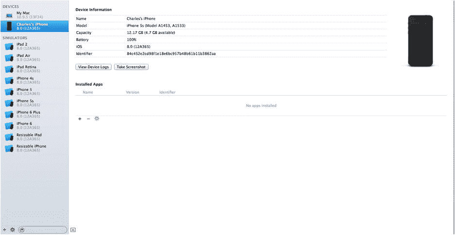

图 9-8. Xcode 设备中的设备相关信息

将你的主用 iPhone 作为开发设备是完全可以的。即使点击了“用于开发”按钮，该设备仍会像普通 iPhone 一样运行。只需记住，在 iTunes 中同步时，始终要备份设备数据。这样，如果在测试过程中出现任何问题，你总是可以借助最后一次保存的备份，在 iTunes 中恢复设备的操作系统、应用程序和设置。

完成此步骤后，请不要退出 Xcode 设备，因为稍后在配置过程中我们还会再次用到它。这里需要的一个基本信息是 40 位字符的设备标识符，它列在设备信息中。这被称为唯一设备标识符 (UDID)。

#### 步骤 2：获取你的开发证书

接下来，你需要请求一个证书。启动钥匙串访问应用程序，它位于你的 Mac 上的 `/Applications/Utilities/Keychain Access`。

在钥匙串访问实用工具中，通过选择 `Keychain Access`  `Preferences...` 来打开偏好设置窗口，并选择“证书”标签页。在关闭偏好设置窗口之前，请确保“在线证书状态协议 (OCSP)”和“证书撤销列表 (CRL)”都设置为“关闭”。

现在，从菜单中选择 `Keychain Access`  `Certificate Assistant`  `Request a Certificate from a Certificate Authority`。在出现的证书助理窗口中，输入你的 iOS 开发者计划电子邮件地址和你的证书名称（参见图 9-9）。在这个例子中，我简单地使用了我的全名，但我也可以轻松地使用更具描述性的标签，比如 Dave Dev Key。“请求是”选项应设置为“存储到磁盘”。点击“继续”按钮，钥匙串访问将生成你的证书请求文件并保存到你的硬盘上。如果你选择桌面作为保存位置，你应该会在那里看到一个名为 `CertificateSigningRequest.certSigningRequest` 的新文件。

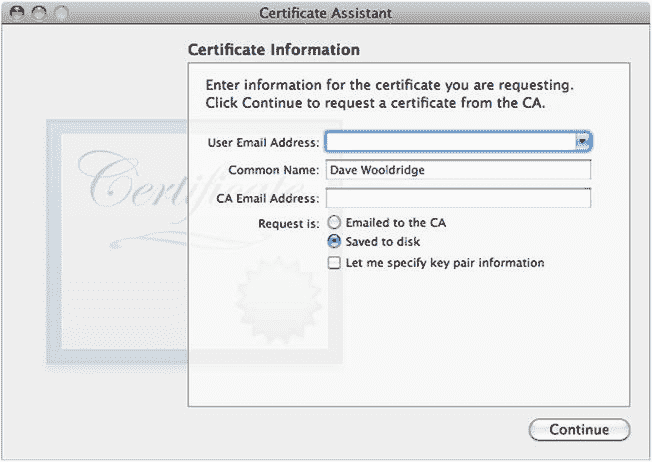

图 9-9. 在你的 Mac 上从钥匙串访问应用程序生成证书签名请求文件

打开你的网页浏览器并登录 iOS Dev Center，网址是 `http://developer.apple.com/devcenter/ios/`。然后，通过单击右侧列中相应的链接，导航到“证书、标识符和描述文件”页面。

在“证书、标识符和描述文件”页面上，选择“证书”部分下的“开发”。然后点击 `+` 按钮，并按照说明将你的 `CertificateSigningRequest.certSigningRequest` 文件上传到在线系统。一旦你的团队管理员（在大多数个人情况下就是你）批准了证书请求，你的新开发证书就可以从这个“证书”部分下载了（参见图 9-10）。

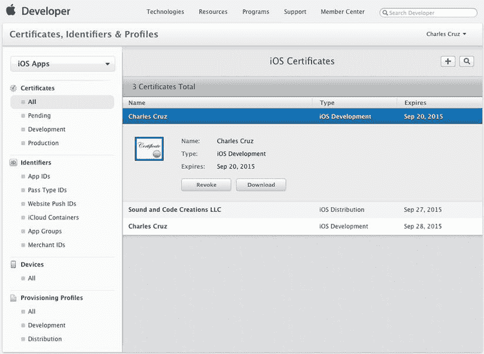

图 9-10. 将你的开发证书下载到 Mac 桌面

##### 验证苹果的 WWDR 证书是否已安装

当你最初在线注册 iOS 开发者计划时，你可能已经完成的首要步骤之一就是下载并安装苹果的全球开发者关系 (WWDR) 证书。如果你的 Mac 钥匙串中还没有苹果的 WWDR 证书，你需要在安装你的开发证书*之前*处理好这个问题。

`Xcode` 会自动安装 WWDR 证书。但是，如果需要重新安装此证书，请点击 iOS 证书页面上的加号 (+)，然后滚动到“中间证书”部分。点击“全球开发者关系证书颁发机构”链接以下载 WWDR 证书文件。

将 `developer_identity.cer` 文件下载到你的 Mac 桌面。双击下载的那个 `.cer` 文件，这将启动钥匙串访问应用程序（如果它尚未打开）。钥匙串访问将显示一个对话框，询问你是否要将此证书添加到钥匙串中。确保对话框的钥匙串菜单设置为“登录”，然后点击“添加”按钮。

在钥匙串访问主窗口的“密钥”类别中，验证你的私钥和公钥现在是否与你的开发证书配对在一起，以确保它在你的 Mac 上已正确配置。在这个例子中，我的 Dave Wooldridge 密钥（这是在生成同名的证书签名请求时创建的）现在与我导入的开发证书配对在一起（参见图 9-11）。

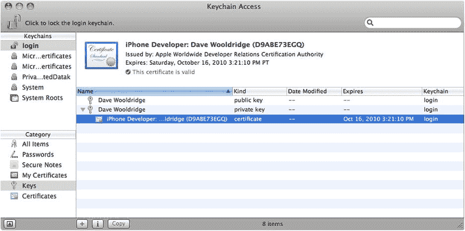

图 9-11. 验证你导入的开发证书是否已与钥匙串访问中的开发者密钥配对

开发者证书安装完成后，你现在可以退出钥匙串访问应用程序，并返回网页浏览器中的“证书、标识符和描述文件”页面。

#### 步骤 3：注册你的设备 ID


在`Certificates, Identifiers & Profiles`页面中，选择左侧`Devices`部分下的`All`。点击`+`按钮添加设备。此网页表单用于输入测试设备的名称和 ID。设备名称可以任意指定，但应足够描述性，以便与计划添加的其他设备名称区分开来。参考在`Xcode Devices`中选择的设备，复制 40 字符的设备标识符，并将其粘贴到`Device ID`字段中（参见图 9-12）。

对于标准 iOS 开发者计划成员，Apple 允许您分配最多 100 台设备用于开发和测试。100 台起初看起来很多，但随着您为多个应用收集测试人员，这个数字最终会显得有限，因此请明智地使用这些名额。

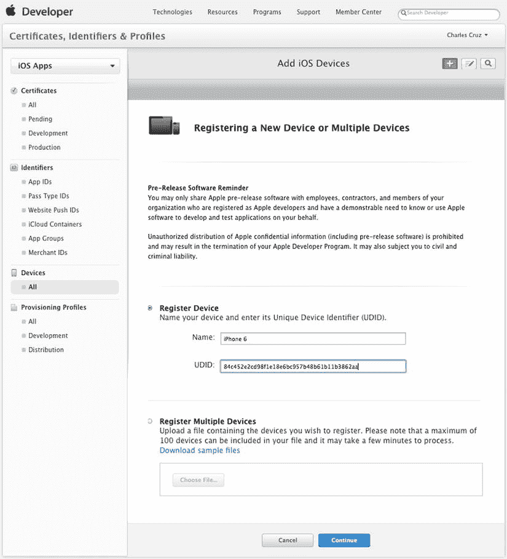

图 9-12. 设备 ID 应为测试设备在`Xcode Devices`中列出的 40 字符设备标识符

**步骤 4：创建应用 ID**

在注册测试设备 ID 后，导航到`Certificates, Identifiers & Profiles`页面的`App IDs`部分。点击`+`按钮添加 App ID。在出现的网页表单中，在`App ID Description`字段中输入名称（参见图 9-13）。此名称可任意指定。它是`Certificates, Identifiers & Profiles`页面中 App ID 列表的名称，因此请使用独特的描述，使其与您创建的其他 App ID 区分开来。

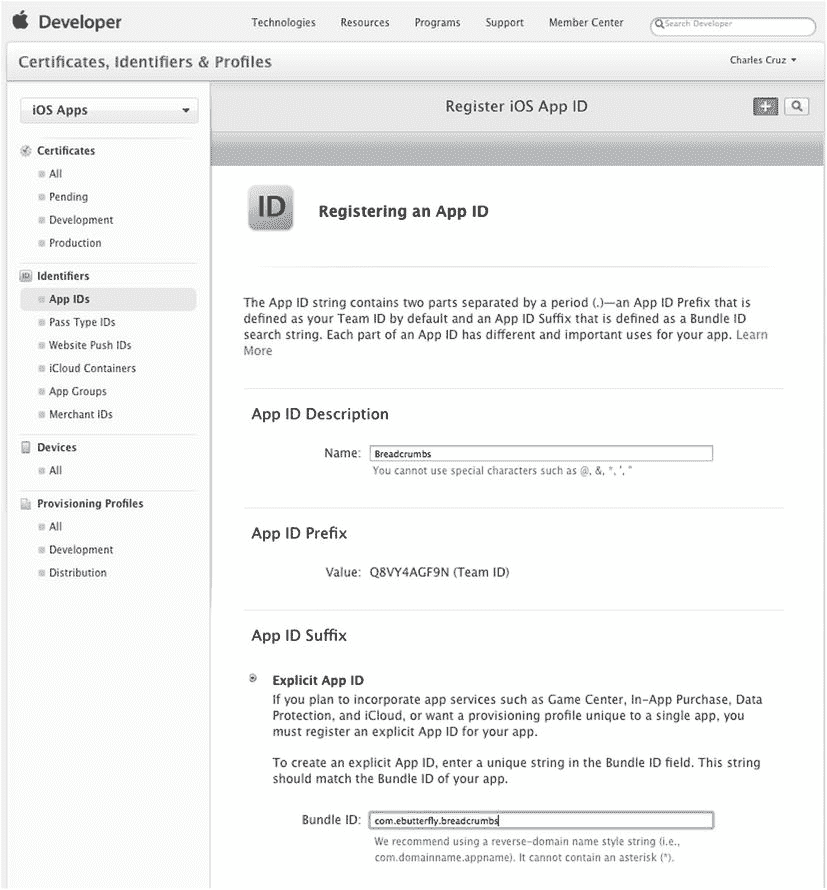

图 9-13. 使用特定于应用的包标识符创建显式 App ID

`Bundle Seed ID`（`App ID Prefix`）值由 Apple 动态生成，但您应将`Bundle Identifier`（`App ID Suffix`）值设置为与 Xcode 项目`Info.plist`文件中列出的值相同。例如，在我们虚构的`Breadcrumbs`应用中，包标识符是反向域名`com.ebutterfly.breadcrumbs2`（参见图 9-13）。

提交新的 App ID 后，您应该会看到它显示在您的 App ID 列表中（参见图 9-14）。点击名称以显示关于该 App ID 的更多信息。请注意，您的显式 App ID 可以配置用于测试`In-App Purchase`和`Game Center`。这是因为它包含一个特定于应用的包标识符，而您的应用需要此标识符才能与这些 Apple 服务正常通信。

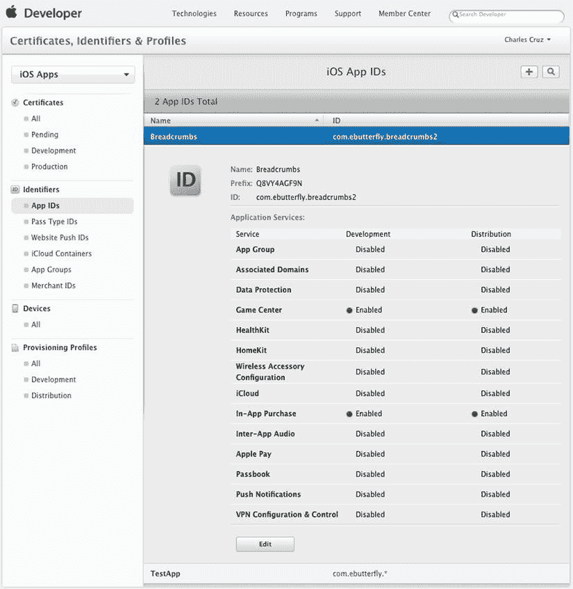

图 9-14. 显式 App ID 可配置用于测试`In-App Purchase`和`Game Center`

从 Apple 便捷的`Development Provisioning Assistant`向导和`Xcode`的`Automatic Device Provisioning`生成的配置文件，由于使用了通配符 App ID，因此在设备上测试应用时非常方便。不是分配特定于应用的包标识符，而是使用星号（`*`）作为通配符占位符。这样一来，相关的配置文件可以用于测试设备上的任何应用，无论其包标识符是什么。

正如您从`TestApp`的禁用选项中注意到的，通配符 App ID 的主要限制是它们不能用于测试特定于应用的功能，例如`In-App Purchase`和`Game Center`。

这就是我们执行额外步骤来创建显式 App ID 和配置文件的原因，以便在您的设备上测试任何 iOS 功能。

**步骤 5：生成并安装您的配置文件**

现在我们终于准备好生成配置文件了。这是所有步骤汇聚的地方。

从`Certificates, Identifiers & Profiles`页面的左列选择`Development`。点击`+`按钮添加新配置文件。在加载的网页表单上，选择配置文件类型（`iOS App Development`）并点击`Continue`。在下一页上，选择要为其创建配置文件的 App ID。在接下来的两页上，选择要包含在配置文件中的证书和设备。然后，在`Profile Name`字段中输入名称来为您的配置文件命名。然后点击`Generate`按钮。您的配置文件将被生成并显示出来（参见图 9-15）。

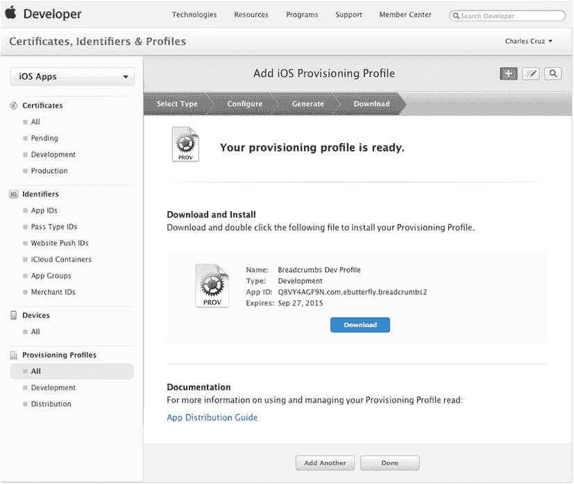

图 9-15. 使用在线`Development Provisioning Assistant`生成您的配置文件

生成配置文件后，您可以从配置文件列表中下载它（参见图 9-16）。点击`Download`按钮将`.mobileprovision`文件下载到您的 Mac 下载文件夹。

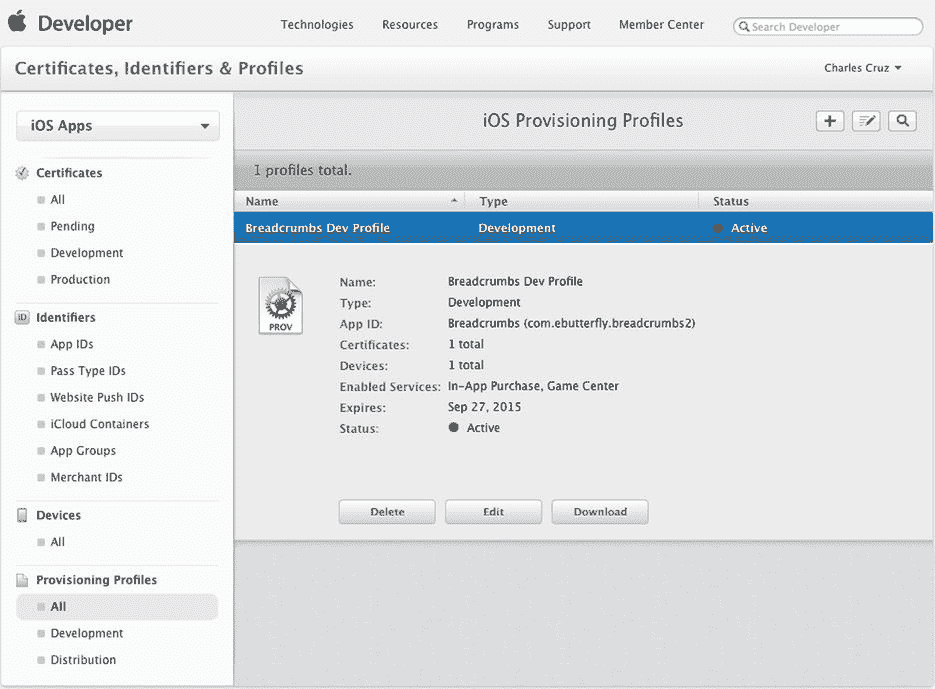

图 9-16. 将您的新配置文件下载到您的 Mac

在测试设备仍然连接到 Mac 的情况下，将`.mobileprovision`文件从下载文件夹拖到 Dock 中的 Xcode 图标上。Xcode 会自动将该配置文件安装到正确的位置。如果导入正确，您现在可以通过点击`Xcode`中的`View Details`按钮  `Preferences`  `Accounts`  来查看您的配置文件（参见图 9-17）。

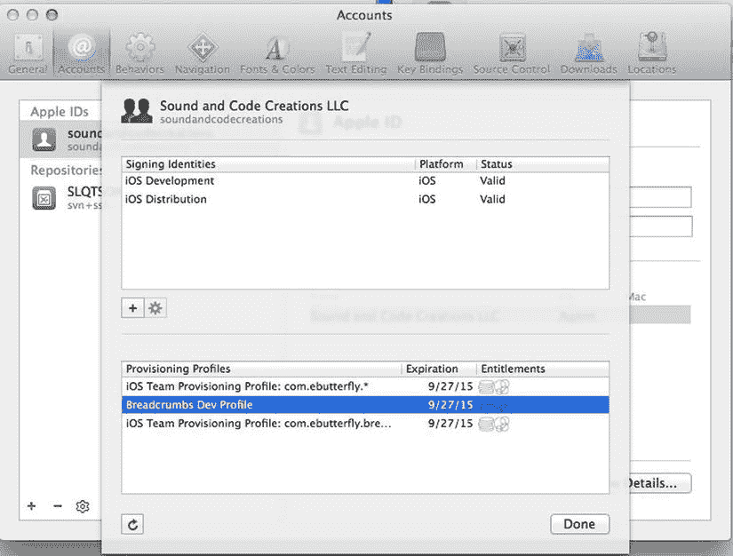

图 9-17. 如果您的配置文件安装成功，您应该会在`Xcode Preferences`中看到它列出

**步骤 6：在测试设备上运行您的 Xcode 项目**

现在您已拥有正确的配置文件和证书，终于可以在连接的设备上开始测试您的应用了。在运行项目之前，您需要修改构建设置以指定新的配置文件。在左侧窗格中选择`Target`应用，并在顶部中央窗格的菜单中选择`Build Settings`。在出现的`Target Info`窗口中，选择`Build`选项卡，并向下滚动到`Code Signing`部分。从弹出菜单中选择您想要的开发配置文件（参见图 9-18）。

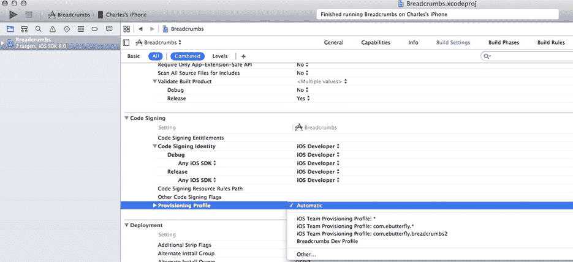

图 9-18. 为您的 Xcode 项目分配一个特定的配置文件以用于设备测试

作为最后一项任务，切换到中央窗格中`General`选项卡的`Identity`部分，并在`Bundle Identifier`字段中确认您应用 ID 的包标识符。例如，在图 9-19 中，我们虚构的`Breadcrumbs`应用的应用 ID 包标识符是`com.ebutterfly.breadcrumbs2`，它也在 Xcode 项目的`Info.plist`文件中列出。

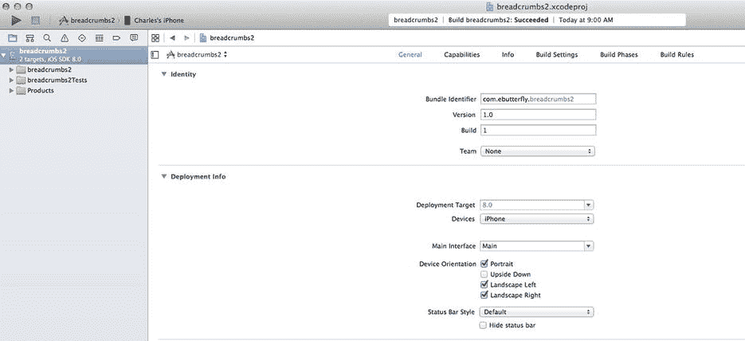

图 9-19. 在`Identifier`字段中确认您应用 ID 的包 ID

当您点击`Build and Run`按钮时，Xcode 将编译该应用并通过 USB 将其发送到测试设备，在那里它将安装并运行。第一次尝试此操作时，系统会弹出一个代码签名对话框，请求使用您的开发者密钥（参见图 9-20）。点击`Always Allow`按钮继续。

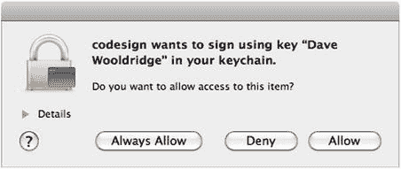


图 9-20。首次尝试在测试设备上运行应用时，系统会弹出代码签名请求提示，请点击“始终允许”按钮继续操作。

发射成功！你的 Xcode 项目现在应该已经作为编译好的应用在测试设备上运行了。

### Beta 测试：掌握 Ad Hoc 分发的复杂性

比你在 iOS 模拟器和真机上自行测试更重要的是，让多人测试你的应用。在完成充分的自行测试后，强烈建议你召集一群愿意在应用发布到 App Store 之前进行 Beta 测试的志愿者。

我们已经介绍了为在你的 iOS 设备上进行测试而设置证书和配置文件所需的步骤。为多个 Beta 测试者设置 Ad Hoc 分发所需的许多步骤看起来非常相似，只有少数例外。但不要搞错，为你的应用配置 Ad Hoc 分发包含一些非常微妙但重要的额外任务，必须遵循这些任务才能使流程顺利进行。这对许多新开发者来说又是一个绊脚石，所以让我们一步步仔细过一遍每个步骤。

#### 步骤 1：获取分发证书

启动钥匙串访问应用程序，它位于你的 Mac 的 `/Applications/Utilities/Keychain Access`。

首先，请确保在钥匙串访问偏好设置窗口的“证书”选项卡中，“联机证书状态协议 (OSCP)”和“证书吊销列表 (CRL)”均仍设置为“关闭”。

然后，从菜单中选择 `钥匙串访问`  `证书助理`  `从证书颁发机构请求证书`。在出现的证书助理窗口中，输入电子邮件地址以及你 iOS 开发者计划账户中列出的确切名称（请参见图 9-21）。

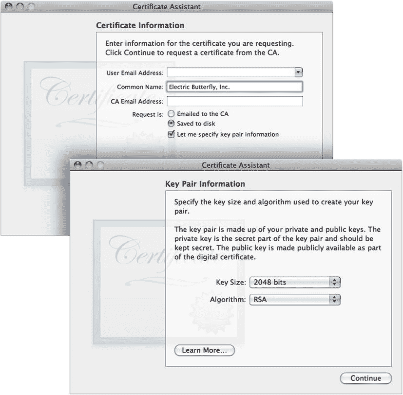

图 9-21。你的分发证书请求必须包含与你 iOS 开发者计划账户分配的名称和电子邮件地址完全相同。你必须分别将“密钥大小”和“算法”设置指定为 2048 位和 RSA。

由于此请求针对的是你的官方分发证书，该证书将同时用于 Ad Hoc 分发和 App Store 分发，因此电子邮件和名称必须与你 iOS 开发者计划凭证完全匹配。例如，我的公司名称 Electric Butterfly, Inc. 是我的账户中的官方名称，所以我用它来填写此表单。“请求方式”选项应设置为“存储到磁盘”。

还有一点使此请求与之前在开发证书过程中发出的请求不同。请确保选中“让我指定密钥对信息”复选框。由于勾选了该复选框，当你点击“继续”按钮时，证书助理将要求你分配密钥大小和算法，应分别设置为 2048 位和 RSA（请参见图 9-21）。

再次点击“继续”按钮，钥匙串访问将生成新的 `CertificateSigningRequest.certSigningRequest` 文件并将其保存到你的硬盘。

回到你的网页浏览器，导航到 iOS 成员中心的“证书、标识符和配置文件”页面。在“证书”部分下选择“生产”，然后点击 `+` 按钮并按照说明上传你的新 `CertificateSigningRequest.certSigningRequest` 文件。

提交后，证书请求必须由团队管理员批准。如果你是唯一管理你的 iOS 开发者计划账户的人，那么你可能就是团队管理员，因此请点击“批准”按钮。你的新开发证书将在此“证书”部分可供下载。点击“下载”按钮将生成的分发证书保存到你的 Mac 桌面上（请参见图 9-22）。

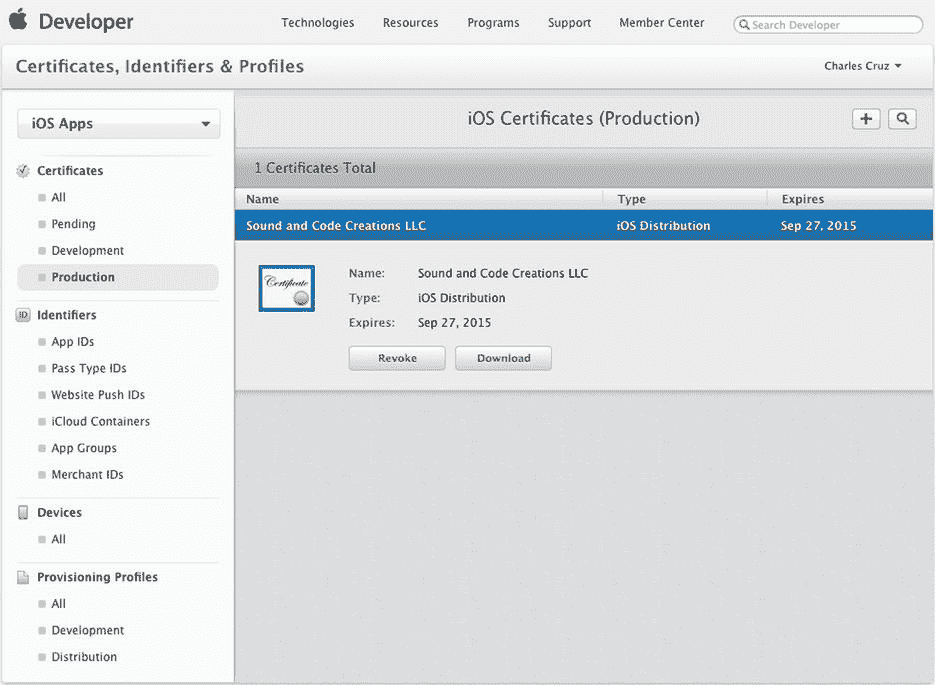

图 9-22。上传并批准你的证书请求。一旦获批准，你将能够下载生成的分发证书。

一旦 `distribution_identity.cer` 下载到你的 Mac，双击该文件，它将启动钥匙串访问应用程序（如果尚未打开）。钥匙串访问会显示一个对话框，询问你是否要将证书添加到钥匙串。确保对话框的钥匙串菜单设置为 `login`，然后点击“添加”按钮。在钥匙串访问主窗口的“密钥”类别中，验证你的私钥和公钥现在已与你的分发证书配对，以确保它在你的 Mac 上配置正确。在此示例中，我的 Electric Butterfly, Inc. 密钥（在我以相同名称生成证书签名请求时创建）现在已与我导入的分发证书配对（请参见图 9-23）。

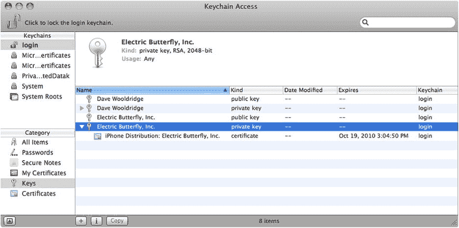

图 9-23。验证你导入的分发证书已与钥匙串访问中的正确私钥配对。

不要将多个 iOS 开发者计划账户的分发证书安装到同一个钥匙串中。这样做会在 Xcode 中引起问题。如果你正在为客户编译和提交 iOS 应用，那么请为你需要安装的每个分发证书创建一个单独的 Mac OS X 用户账户。你可以在你的主要 Mac 用户账户中进行所有开发工作，但要为分发而编译，你应该切换到安装了该客户端分发证书的用户账户。

##### 导出你的分发私钥以妥善保管

Xcode 需要你的分发私钥来签署编译后的应用二进制文件。如果没有正确的代码签名，该应用程序无法上传到 App Store，也无法用于 Ad Hoc 测试。此私钥无法重新生成，因此务必将其导出并保存在一个特殊的地方，以防日后切换到新 Mac 或重装操作系统时需要恢复它。

要导出你的分发私钥，请在钥匙串访问的“密钥”部分选择它。在图 9-23 的示例中，我的分发私钥已被选中。然后选择“文件”  “导出项目”。以“个人信息交换”(`.p12`) 格式保存文件，这需要你设置一个密码。

如果你将来需要重新安装此私钥，只需双击导出的 `.p12` 文件并输入你的密码即可。剩下的工作将由钥匙串访问处理。

#### 步骤 2：注册 Beta 测试者的设备 ID

还记得为了创建你的开发配置文件，你曾将你自己的测试设备的 40 位 UDID 作为新设备 ID 注册到 iOS 成员中心的“证书、标识符和配置文件”页面吗？创建分发配置文件时也是如此；因此，在此之前，你需要以相同的方式将每个 Beta 测试者的 UDID 作为新设备 ID 添加。

##### 召集队伍

让一群人专门花时间体验你的应用。他们不仅会发现你从未遇到过的错误，还会遇到你可能没有意识到的可用性问题，而你作为创造者却可能浑然不觉。


好的，作为高级文档工程师和翻译员，我将严格遵循您提供的注意事项和示例，将以下英文文本翻译成高质量的中文。


##### Beta 版测试者招募指南

在寻找 Beta 版测试者时，请避免招募你的密友和家人，因为他们的反馈不会像你期望的那样客观。很多时候，他们只会给出正面评价——而你在这个阶段需要的是严苛的真相。

另外，不要只让其他开发者来测试你的应用。也要招募一批不熟悉技术的新鲜人来全面测试你的应用。不熟悉编程的人能提供非常有价值的、客观的观点，而且他们很可能更能代表你应用的目标受众。你只需要准备好提出大量问题，以提取出相关的重要信息。

通常情况下，非技术用户能感知到他们不喜欢某个东西，但他们起初可能不明白为什么这个东西会让他们感到困扰。你可能需要付出极大的耐心，才能让他们恰当地沟通他们在报告问题背后的理由。

另一方面，开发者与你语言相通，所以他们能在非常技术性的层面上轻松描述问题，甚至可能提出修复方法。但是，由于开发者习惯于在即使是最不直观的界面中导航，他们可能无法识别出那些会让新手感到困扰的可用性问题。

你最好的选择是组建一个多元化的 Beta 版测试者团队，其中包含开发者、高级用户和非技术类的普通用户。

由于高质量的 Beta 版测试需要参与者投入相当多的专用时间，你应该提供某种形式的报酬，作为提供足够数量反馈的激励。这不一定是现金。对于预算紧张的开发者来说，奖励可以是所测试应用的免费副本，或者是你销售的另一个相关产品的免费许可证。只需确保仔细说明 Beta 版测试者需要完成哪些任务才能获得免费物品。一个好的易货体系对参与的每个人都是双赢。你获得了宝贵的反馈，而测试者获得了免费的周边和软件。

那么，除了你自己的开发者朋友之外，你还能在哪里找到更多的 Beta 版测试者呢？Imangi Studios（《港口大师》的开发商）和其他热门游戏开发者会从热门游戏网站（如 Touch Arcade 论坛）招募他们的许多 Beta 版测试者。在博客、Facebook 和 Twitter 上看到公司发布的寻找 Beta 版测试志愿者的在线查询请求并不罕见。

#### 从 iTunes 收集设备 ID

大多数用户不知道在他们的 iPhone、iPad 或 iPod touch 上哪里可以找到 `UDID`。你可以告诉用户遵循以下步骤：

1.  将你的设备与 iTunes 同步。
2.  选择设备的“摘要”标签页以显示其属性。
3.  如果列出了序列号，请点击它以切换显示列表，显示标识符 (`UDID`)。
4.  从“编辑”菜单中选择`编辑`  `拷贝`，将那 40 个字符的 `UDID` 复制到剪贴板。（即使无法在 iTunes 中选择 `UDID` 的文本，“拷贝”命令也会将其复制到剪贴板。）
5.  将其粘贴到电子邮件中，并发送给开发者（也就是你）。

在收到所有 Beta 版测试者的设备 ID 后，只需使用你之前注册自己测试设备时使用的相同流程，在“证书、标识符和配置文件”页面的“设备”部分在线注册它们即可。

许多开发者会采用一种命名方案来帮助保持其设备列表的条理性。我强烈建议不仅包括 Beta 版测试者的名字和姓氏，还要包括测试者的设备型号，例如“Joe Smith iPhone 4”或“Jane Walker iPad”。

不幸的是，你必须在生成分发配置文件之前，就了解所有 Beta 版测试者是谁，因为每个 Beta 版测试者的设备 ID 都必须绑定到该配置文件。如果你之后需要插入额外的设备 ID，就需要生成一个新的分发配置文件，然后重新分发更新后的配置文件和应用程序。这是一个非常繁琐且耗时的过程，所以最好不要重复经历这个过程超过一次。

还记得我之前提到的 Test Flight 吗？这就是它为你节省大量时间的地方。你只需登录 `www.testflightapp.com`，然后通过电子邮件邀请你的 Beta 版测试者。他们会收到一封电子邮件（必须在他们将要测试的移动设备上打开），该邮件会收集你需要的所有信息。然后，你可以直接导出到 iTunes Connect，就大功告成了。

**注意** 苹果当前系统的一个主要缺点是，标准的 iOS 开发者计划账户在每个会员年度内仅限注册 100 台设备。这看起来可能很多，但实际上，如果你正在开发多个应用程序，并且每个应用都有自己的 Beta 版测试者群体，那么很容易就会用尽你的设备 ID 配额。你确实可以选择删除旧的未使用的设备 ID，但在该会员年度内，它们仍会计入你的设备 ID 总数。因此，请注意明智地使用你的设备 ID 名额。只要有可能，只注册那些你知道会提供高质量反馈的 Beta 版测试者的设备 ID。

#### 步骤 3：生成并安装 Ad Hoc 分发配置文件

回到你网页浏览器中的“证书、标识符和配置文件”页面，在“配置文件”部分中选择“分发”。然后点击 `+` 按钮添加一个新配置文件。

在出现的页面中，请确保选择 Ad Hoc 作为分发方式。为你的应用程序选择正确的应用 ID，并选择要包含在配置文件中的分发证书。然后选择所有应包含在此配置文件中的 Beta 版测试者设备 ID（参见图 9-24）。如果某个 Beta 版测试者的设备 ID 未嵌入配置文件中，该测试者将无法在其设备上安装和运行该应用。任何意外的遗漏都将迫使你创建并安装一个新的、更新的配置文件，因此在点击“继续”按钮之前，请仔细检查所选设备。

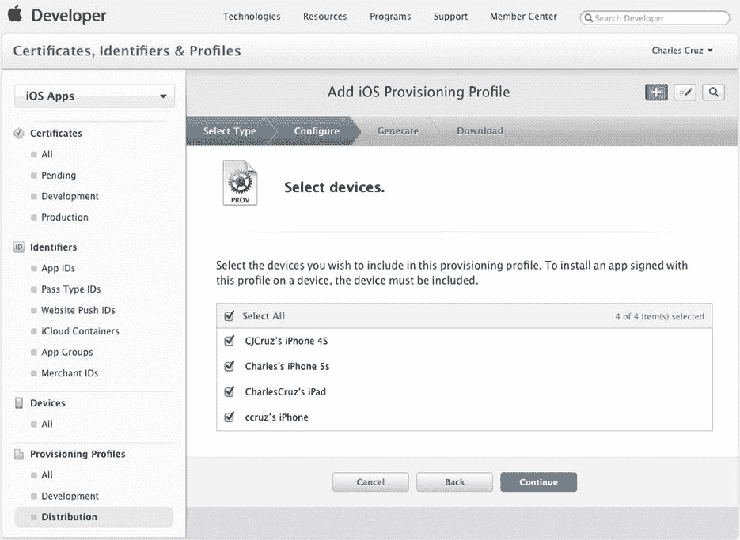

图 9-24. 在生成分发配置文件之前，仔细选择你的所有 Beta 版测试者设备 ID

最后但同样重要的是，输入一个能反映此配置文件性质的配置文件名称。在测试多个应用程序时，在“配置文件名称”字段中包含应用程序名称以及对分发阶段（Ad Hoc 或 App Store）的引用，有助于保持配置文件集合的条理性。

当你的分发配置文件生成完毕，并可以在“分发”标签页的配置文件列表中找到时，点击“下载”按钮将 `.mobileprovision` 文件保存到你的硬盘。在你的测试设备仍连接到 Mac 的情况下，将 `.mobileprovision` 文件拖放到 Dock 中的 Xcode 图标上。Xcode 会自动将该配置文件安装到正确的位置。

保存一份你存储在硬盘上的分发配置文件的副本。你需要将该 `.mobileprovision` 文件与你要交付给 Beta 版测试者的已编译应用一起提供。

#### 步骤 4：为 Ad Hoc 分发配置你的应用

现在你已经有了分发证书和配置文件，下一步是配置你的 Xcode 项目以进行 ad hoc 分发。在 Xcode 中启动你的项目，但在你做任何事情之前，请确保已将 57 × 57 像素的 `icon.png` 文件和 114 × 114 像素的 `icon@2x.png` 文件（用于 Retina 显示屏）添加到项目中。除了如果没有图标可能会遇到分发构建错误之外，视觉印象即使在 Beta 测试阶段也很重要，因此包含一个漂亮的应用图标非常重要。

通过在 Xcode 中选择 `产品`  `归档` 来创建项目归档。一旦你的归档创建完成，Organizer-Archives 窗口将打开（参见图 9-25）。


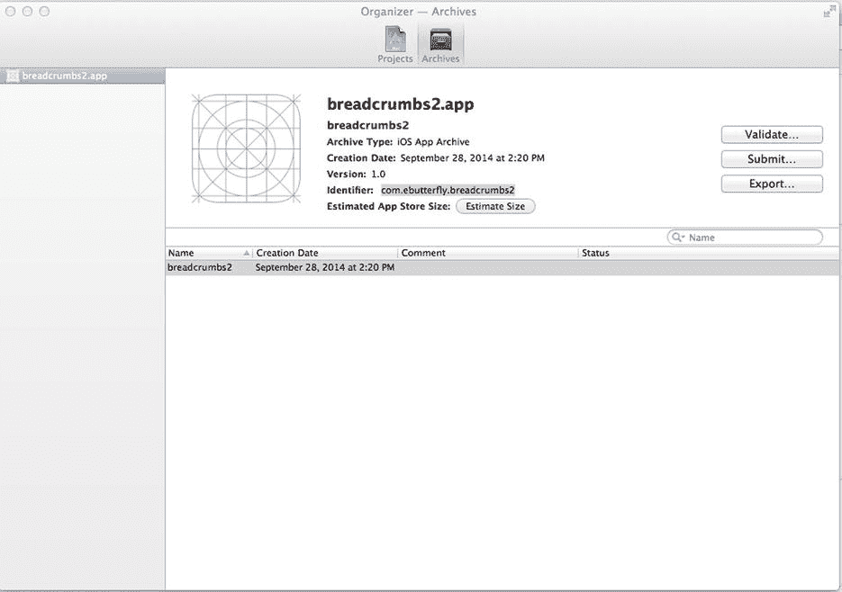

图 9-25. 档案管理器-存档窗口中的已归档项目

选择你项目的归档文件，然后点击`Validate`按钮。验证过程会找出应用中任何需要在分发给测试人员前修复的问题。一旦你的应用成功通过验证，会弹出一个提示验证成功的弹出窗口。点击`Done`按钮。

现在你需要保存归档文件以用于临时部署。点击`Export`按钮，然后选择`Save for Ad Hoc Deployment`（参见图 9-26）。

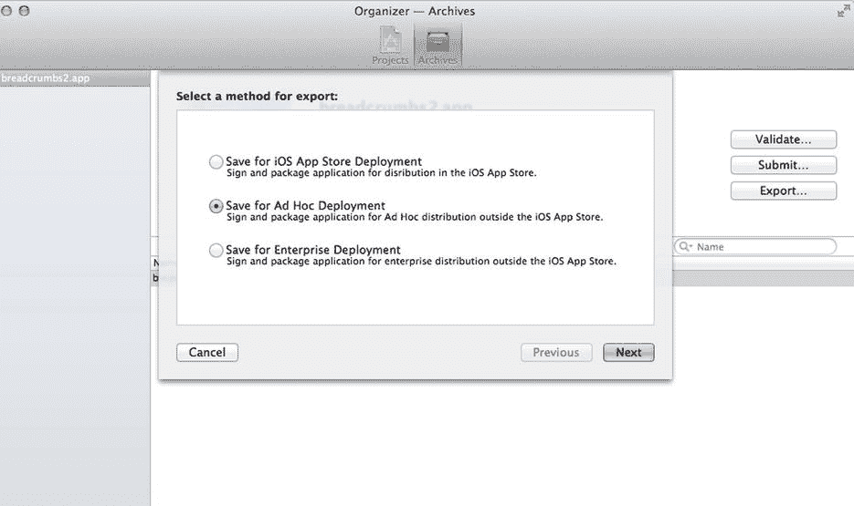

图 9-26. 选择导出打包应用文件的方法

然后选择`Next`。会出现一个对话框让你选择团队。选择一个团队并点击`Choose`按钮。`Xcode`会生成预置描述文件并显示摘要。点击`Export`按钮将文件保存到你的硬盘。该文件的扩展名为`.ipa`。

#### 第 5 步：将你的应用分发给 Beta 测试人员

现在你已准备好将应用发送给测试人员了！在你的硬盘上找到上一步保存的打包应用文件。将打包应用文件连同任何安装和测试说明一起发送给测试人员。

为了让测试人员安装你的应用，他们的设备需要已经挂载到`iTunes`（通过 USB 连接）。他们需要双击打包应用文件来打开`iTunes`。如果他们执行同步，你的应用和相关的预置描述文件就会出现在测试人员的设备上，并可以运行。让 Beta 测试开始吧！

#### 向测试人员无线分发

迫使测试人员为了在移动设备上同步一个临时版本而处理导入应用包到桌面版`iTunes`这件事，一直以来都让开发者感到烦恼，并且常常给新手测试人员带来问题。幸运的是，`iOS 4`引入了一种鲜为人知的新方法来无线分发你的临时构建版本。没错——再也不用为了安装 Beta 版本而同步`iTunes`了。

在`iOS 4`及更高版本中，Apple 支持`iOS`应用的空中安装，这意味着你可以通过点击网页或邮件中的`HTTP`链接来下载并安装一个临时应用构建及其相关的预置描述文件。这个功能最初是作为企业级 iOS 开发者计划成员的一项福利来推广的，但似乎对标准计划成员也同样适用。在`iOS 8`中，Apple 推出了一个基于`TestFlight`的 Beta 分发平台，允许你使用`iTunes Connect`将应用分发给测试人员。

幸运的是，这个新的空中下载功能省去了我们之前逐步介绍的临时分发步骤和收集测试人员设备 ID 的麻烦。关于如何将这种方法用于你的 Beta 测试分发的更详细的信息，请参考 Apple 的《应用分发指南》。

### 完美收官

到目前为止，这是本书中指令性最强的章节之一。由于预置描述文件和临时分发对许多新的 iOS 开发者来说都是极具挑战性的话题，我希望这些详尽的解释能够帮助那些在这两项任务上遇到困难的人阐明流程。

如果你的应用执行得不好，那么无论你的应用想法多么出色都无济于事。我无论如何强调应用的整体用户体验作为其潜在成功的主要因素之一都不过分。设备上测试和群组管理的 Beta 测试应该是每个应用开发周期中强制性的步骤。

# 第 10 章

## 派对开始！制造发布前的热度

开发完成？检查。测试完成？检查。准备上架`App Store`？快了。

我知道在数月的辛勤工作完成你的应用之后，你渴望将其发布到全世界，但先别急着行动。你还有一些非常重要的任务需要完成。

在提交你的 iOS 应用到`App Store`之前，你需要通过精心策划的在线形象开始制造一些发布前的热度。本章将探讨通过在你的网站、博客以及 `Twitter` 和 `Facebook` 等社交网站上进行推广，来为你的应用激起一些兴奋和期待的最佳方法。

### 最后倒计时：准备发射

我知道你在想什么：“为什么我不能在 Apple 审核我的应用的同时，顺便搭建我的应用网站和制造发布前的热度呢？既然`App Store`批准或拒绝一个应用可能需要几周时间，那应该足够我用了，对吧？”别指望这个。即使你的应用审核时间比平均的 7 到 14 天的周期要长，那仍然不足以培养出庞大的在线关注群体和有效的网络形象。

巧的是，当你真的指望 Apple 的应用审核团队花很长时间时，那无疑会成为你的应用在短短几天内顺利通过审批的一次。那会让你措手不及，连你的应用网站和社交媒体营销计划都没准备好。

### 花时间寻找你的受众

尽管开发一个有吸引力的网站总是比你想象的要花更长的时间，但如果你真的时间紧迫，你可能只需要几天时间就能搭建一个像样的网站（掌握一点网页设计专业知识）。但是，真正需要更长的酝酿期的工作是发展你的在线受众。营销需要受众，所以你需要花时间去寻找你的受众。

这个受众通常不仅包括有影响力的博主和记者，还包括你自己的`Twitter`粉丝、`Facebook`好友、`LinkedIn`联系人、博客读者和邮件通讯订阅者。对于一个社交媒体新手来说，这一切可能有点让人不知所措，但别担心。在本章后面，我将详细解释如何利用这些强大的工具和关系。

如果你还没有`Twitter`账户、`Facebook`粉丝专页，或者与知名博主和记者没有良好关系，现在开始行动永远不晚。你应该多早开始？通常需要几个月的时间才能在`Twitter`和`Facebook`上积累相当数量的粉丝，所以你至少应该在计划提交应用到`App Store`之前的三个月就投身到社交媒体的海洋中。一些开发者在应用还在开发中时就开始发推文介绍他们即将推出的`iPhone`和`iPad`应用。这里的目标是积累你自己的社交信息网络，以便轻松地分发关于你 iOS 应用的消息。所以，你开始得越早越好。

只是要小心在发布前的宣传活动中不要透露太多信息。你不希望过早地向你的竞争对手亮出你的底牌（是的，他们在盯着）。另外，如果你在应用发布前很久就用大量过度炒作的营销信息狂轰滥炸你的在线受众，你可能会在发布日之前失去大部分关注者。没有人喜欢一个过度热情、咄咄逼人的推销员，用过多的营销噪音塞满他们的`Twitter`信息流和电子邮件收件箱。关键在于温柔地添柴加火，建立期待和兴趣。只需吊起他们的胃口，让他们想要更多——要懂得挑逗！

### 精心打造你的电梯游说

为了快速而简洁地有效说明你即将推出的应用的功能和优势，你应该编写几个版本的应用描述。每个版本应该限制在特定长度以适应不同的用途。不要把这项工作误解为撰写一份正式的新闻稿。你以后会有充裕的时间为你的应用实际发布来做这件事。现在，考虑更短一些的描述。


在这个阶段，我通常会撰写三个版本：一句话描述、一段话描述，以及一篇几段话的详细描述。这样不仅能提供几乎适用于任何场景的应用描述长度，还能帮助我打磨营销信息。当你被迫用寥寥几句话解释你的应用时，就必须剔除冗余信息，只保留那些能吸引潜在客户的关键卖点。

“电梯演讲”这个老词，指的是在乘坐电梯的短暂时间内，向某人推销一个想法的能力。这个概念几乎适用于所有行业。在推销电影剧本时，编剧可能只有极短的瞬间来说服制片方高管认可其价值；出版商可能因为一本书的前几页未能吸引自己就将其退回；在电台广告中，广告商可能只有 15 秒来抓住听众的注意力。在快节奏的科技领域推广一款 iOS 应用，道理也是相通的。

通常，你只有一两分钟的时间向有影响力的记者介绍你的应用。热门科技博客每天都会被关于新移动应用的新闻稿和咨询淹没，那么你的应用又凭什么脱颖而出呢？无论是通过电子邮件被阅读，还是在会议上被快速讲解，你都希望记者在听完几句话后就能立刻“理解”它，并愿意撰写关于你的应用的报道。

首先，想出一个只用几个词就能描述你应用的有效标题。以我们虚构的“面包屑”应用为例，我们设定了“停车定位器”这个标题。没错，这很基础，但仅仅三个词就说明了应用的功能。考虑到 Twitter 有 140 个字符的限制，短小精悍才是王道。既然标题已经涵盖了基本功能，“面包屑”的描述就可以专注于主要特性和优势，以及让这款应用与众不同的关键差异化因素。

还记得我们在第 2 章讨论过如何确定应用的差异化因素吗？现在就是它为你带来回报的时候了。它不仅有助于吸引客户，还能帮助你在发布前阶段吸引媒体的注意力。当你向记者和博主介绍你的应用时，你绝不想让他们问“为什么？”既然 App Store 里已经有很多现有的停车定位器，为什么大家要在乎你的应用？如果你已经成功构思了你的推销词，你就已经回答了这个问题：描述你的应用是如何成为第一款利用 iPhone 内置摄像头实现增强现实功能的停车定位器。移动应用中的增强现实功能最近一直是新闻热点，这就是你的“钩子”。而媒体最喜欢一个好钩子。

在将任何声明纳入你的推销词之前，一定要确保其真实性。如果已经有一款现有的 iOS 应用宣称自己是第一款基于增强现实技术的停车定位器，你就不希望也这样宣传你的应用。和往常一样，先做好功课，确保在网上和 App Store 里进行充分的调研。

依赖广告支持的博客和新闻网站需要持续吸引读者来满足赞助商的需求，为此，他们对发布引人入胜、具有话题性的故事有着永无止境的需求。如果你的推销词未能引起媒体兴趣，你就需要重新思考你的策略了。在本章的后半部分，我会谈到何时以及如何与媒体沟通，以建立重要关系并为发布前的宣传造势。

现在打磨你的“电梯演讲”的另一个好处是，当你准备好向苹果提交应用时，它能帮助你写出更好的 App Store 描述。我见过太多冗长的 App Store 描述，为了解释一个简单的游戏概念，滚动条能拉好几天。那些冗长的描述实际上对应用有害无益，因为没人会花时间读完它们。

就像你的“电梯演讲”一样，你的 App Store 描述应该简明扼要，包含项目符号列出的关键特性、几个重点突出的评价引语（甚至包括获奖情况）。它应该快速告诉读者你的应用是做什么的，以及他们为什么要购买。任何多余的内容都只是妨碍你推销的噪音。

**收集更多发布前的营销素材**

除了拥有应用的长、短文本描述之外，你还应该准备以下物品用于你的营销活动（包括发布前和发布后）：

*   公司标志（高分辨率）
*   应用图标（高分辨率）
*   应用徽标（高分辨率）
*   截图
*   视频预告片
*   专用网站页面

这些物品不仅在你自己的网站和社交媒体推广中会派上用场，如果记者和博主提出要求，也可以提供给媒体。

### 公司标志

无论你开发何种产品，始终应该备有一个高分辨率版本的公司标志，以防媒体需要。许多公司实际上会在其网站上设置一个“媒体室”页面，或提供新闻资料包的下载链接，以便公司信息和标志能够 24/7 全天候获取。

科技是一个全球性的行业，来自不同时区的记者和博主可能会对你的公司或产品感兴趣并撰写报道。他们可能面临着紧迫的截稿日期，无法等到你早上查看邮件。在你的网站上提供新闻资料包或公司标志下载，将有助于简化他们的工作！

尽管大多数媒体报道可能是在线上，但也不要忽视印刷杂志和报纸的需求。确保你的公司标志是可缩放的矢量图像，并保存为`EPS`文件。或者，至少应该是一张以无损压缩格式（如`TIFF`或`PNG`）保存的大尺寸 300 dpi 位图图像。这将确保其在任何用途下都具有最大的灵活性。

如果你是一位与第三方开发公司合作开发应用的发行商，你还需要准备好对方的标志。这也是个检查合同的好时机，看看第三方是否也要求在与你的 iOS 应用相关的所有媒体报道中包含其标志和/或名称。

### 应用图标与徽标

你应该为你的 iOS 应用准备一个高分辨率的图标和徽标。理想情况下，你采纳了我在第 4 章中的建议，为了满足各种媒体和营销目的，以高分辨率设计你的应用图标。

可缩放的矢量`EPS`文件总是很不错，但大尺寸的 300 dpi 位图文件（如`PNG`或`TIFF`）也同样适用。如果你将图标或徽标保存为`PNG`文件，请确保背景是透明的。如果保存为`TIFF`或高质量的`JPEG`，则使用默认的白色背景。

由于你的大部分媒体报道和营销工作将主要聚焦于你的新应用，而不一定是公司本身，因此应用图标和徽标的 300 dpi 打印就绪版本将比你其他的任何标志都重要得多。你还会发现，高分辨率的应用品牌图形在设计其他相关元素时也很有用，比如你的应用网站和 Twitter 个人资料的背景图片。万一苹果公司要求提供超大的应用图标用于其印刷广告、全球开发者大会的墙面横幅，或者（天哪！）电视广告，你也能随手拿出一份（以后你可以感谢我）。

### 截图

有几张展示应用实际操作的优质截图可能看起来显而易见，但令人惊讶的是，我在 App Store 以及各种开发者网站和应用评测博客上遇到过太多糟糕的截图了。不要只是运行你的应用，然后随意截取一些主视图的图片。你向世界展示的截图应该是你应用的典范之作，充分展示它使用起来是多么有趣或高效。


如果你的应用是一款笔记本风格的写作工具，请不要给我展示一个空白的、未使用的列表，也不要展示几条标题泛泛的测试笔记，比如“笔记 1”或“示例 1”。如果我是一位正在寻找这类工具的作家，我想看到的是它被充分利用的样子。在你的应用笔记列表中，创建一些看起来真实可信的文档，比如“我的小说大纲”、“技术文章研究”和“周二会议记录”。这款应用需要看起来有价值，值得购买。

在房地产市场中，“装饰”有助于房屋销售。一些潜在买家难以想象空房子里摆上自己家具后的样子，因此他们会放弃购买，认为这并不真正符合他们的需求。“装饰”就是用吸引人的家具和室内设计细节填满房子，帮助这些人更好地想象其可能性。“看，你的房子可以变成这样！很棒，对吧？”

你需要对你的 iPhone 和 iPad 应用截图采取同样的“装饰”方法。这绝不意味着以任何方式伪造截图。只需花些时间亲自使用应用，在应用内设置一个能制作出视觉上引人入胜截图的场景。这种“实战”截图应该帮助潜在买家立刻看到购买你的应用的价值。虽然这非常适用于生产力和实用工具类应用，但对于所有其他类型的应用（比如游戏），这也是一个不错的通用法则。不要只展示任何随意的游戏过程示例。如果是一款第一人称射击游戏，就让玩家展示在激烈战斗中打出高分的情景。展示游戏的乐趣！

### 视频预告片

为你的应用制作一个引人入胜的视频预告片，是每位 iOS 开发者都应该认真考虑的事情。有些应用很难仅通过静态图像来描述。提供一个像电影风格般的视频预告片——配上标题特效、视觉效果和音乐——是一个非常强大的营销工具。YouTube 上那些引人入胜的视频预告片已经帮助了数百款 iPhone 游戏成为畅销品。

根据你开发的应用类型，在发布前的营销工作中，现在就制作预告片可能为时过早。因为你还没有将应用提交给苹果的审核团队，你不知道为了获得批准，是否需要修改主要部分。一个在 YouTube 和其他视频分享网站上流传的视频预告片，应该能够代表最终将出现在 App Store 里的实际应用。

如果你确实计划为应用制作视频预告片，我强烈建议在应用发布前完成它，这样它从一开始就能帮助提升知名度。制作自己的视频预告片有两个令人信服的理由：控制权和便利性。如果没有视频预告片，一些应用评测网站可能会选择自己拍摄视频演示，这未必能展现你应用的最佳效果。通过向他们提供你自己的视频预告片，你可以掌控应用在视觉上的呈现方式。同时，由于省去了评测者自己录制视频的需要，你实际上也让他们更方便地撰写应用评测。

用摄像机拍摄在 iPhone 或 iPad 上运行的应用是一项艰巨的任务，如果处理不当，往往效果不佳。采用这种方法有很多要求——比如捕捉合适的光线、确保设备的屏幕始终对焦、以及保持双手不抖动——这些都比想象中要难得多。除非你是一名专业电影制作人，或者能找到专业人士为你拍摄，否则这并非理想之选。

大多数开发者依赖屏幕捕捉软件来录制 iOS 模拟器中运行的应用程序视频。这提供了一个易于实现的高质量解决方案。

如果你想增强 iOS 模拟器的外观和功能，有几款值得探索的第三方软件产品：

*   要模拟对 GPS 定位、多点触控手势、加速计和指南针的支持，可以看看 Vimov 公司巧妙的`iSimulate` iPhone 应用和 SDK（`http://www.vimov.com/isimulate/`）。它能通过 Wi-Fi 网络从同一网络中的 iPhone 或 iPod touch 设备向 iOS 模拟器无线发送这些事件。
*   要自定义 iOS 模拟器主屏幕的外观，并使用半透明白点提高光标的可见性，可以试试`SimFinger`（`http://blog.atebits.com/2009/03/not-your-average-iphone-screencast/`）。atebits 将此工具作为捐赠软件提供。
*   如果你更愿意使用真实的手指图像作为 iOS 模拟器中的光标替代品，你会喜欢 Wonder Warp Software 公司的`PhoneFinger`（`http://www.wonderwarp.com/phonefinger/`），该工具也作为捐赠软件提供。

一旦优化了 iOS 模拟器，你就需要找到一个屏幕捕捉工具来录制视频。以下是几个可供评估的选项：

*   `ScreenFlow`（`http://www.telestream.net/screen-flow/`）
*   `iShowU HD`（`http://www.shinywhitebox.com/ishowuhd/main.html`）
*   `Sound Stage`（`http://soundstageapp.com`）
*   `Screenium`（`http://www.syniumsoftware.com/screenium/`）
*   `Snapz Pro X`（`http://www.ambrosiasw.com/utilities/snapzprox/`）
*   `Camtasia for Mac`（`http://www.techsmith.com/camtasia/`）
*   `Voila`（`http://www.globaldelight.com/voila/`）

在 iOS 开发者中，一些受欢迎的选择是 Telestream 的`ScreenFlow`、shinywhitebox 的`iShowU HD`和 New Leaders 的`Sound Stage`。一些可用的录屏产品提供一体化的综合录制和编辑解决方案。如果你选择的工具只提供屏幕录制，你还需要一个第三方编辑器，比如苹果的`iMovie`或`Final Cut Pro`，才能将录制的素材加工成一个精致的视频预告片。

制作一个引人注目的视频预告片取决于你自己，所以不仅要花时间规划在 iOS 模拟器中录制应用演示的过程，还要为任何画外音音频脚本做好准备。别忘了加入一些音乐来设定基调——确保使用已获许可或免版税的音乐。由于预告片可能会在各种视频分享网站和应用评测网站上播放，请务必在视频中嵌入你应用的图标和标识，以加强其品牌形象。

如果制作视频预告片完全超出了你的舒适区，不要犹豫，请一位专业编辑代劳。业余水平的视频无疑会损害消费者对你应用质量的看法。在可能的情况下，不要在制作价值上偷工减料。

一张图片胜过千言万语，但视频的影响力在为你即将发布的 iOS 应用或游戏营造期待感方面可能更为有效。只是注意不要在应用发布前过早地放出视频预告片。由于苹果的应用审核过程常常比预期的要长，你不想过早地对应用进行过度炒作，结果在应用在 App Store 上架很久之前就失去了这股势头。

### 专属网站展示

最后但同样重要的一点是，你需要为你的应用建立一个网站或专属页面。为消费者和媒体提供一个访问额外信息的核心在线站点，是每位软件开发者都应该利用的强大工具。接下来，我们将探讨一个用于推广 iPhone 或 iPad 应用的好网站应该具备哪些要素。

#### 你的 iOS 应用值得拥有一个精心设计的网站

在应用上架 App Store 之前，你就需要为它建立一个网站并提供在线支持并使其运行起来，那么何不在发布前阶段利用它的推广力量来激起人们的兴奋感呢？由于你的应用尚未进入 App Store，你的网站应该成为所有感兴趣的人访问的主要网址。即使在应用发布之后，一个精心设计的网站（如果做得好）也可以成为比 App Store 产品页面上有限内容更有效的销售工具。


每个 iOS 开发者都必须在网络上拥有强大的存在，无论 App Store 是否是封闭系统。App Store 允许从一个应用的介绍页面直接链接到开发者的网站和支持网站。对你的应用感兴趣的消费者可能在做出购买决定之前访问你的网站，寻找附加信息、视频预告片或动画教程。他们可能还想确认你是一家提供客户支持的合法企业。当人们购买你的应用时，从某种意义上说，这是对你公司的一项投资，所以他们想了解你会长期运营下去。

你不希望任何技术故障或错失良机毁了应用在 App Store 实际发布时带来的高曝光度。现在就理清所有头绪，你就能在应用上线前，从容应对任何可能出现的网络问题。

#### 网站托管

如果你还没有网站，第一步是在众多可用的网站托管公司中开设一个账户。只需在谷歌上快速搜索`web hosting`，你就会发现有不少公司可供选择。大多数公司都提供非常实惠的托管套餐，但真正的难点在于找到一家能满足你特定需求的公司。

向其他开发者打听他们推荐的网站托管商。了解他们在服务器正常运行时间和客户服务方面的体验很重要。他们的网站是否曾长时间宕机？他们的供应商是否提供 24/7 全天候支持并能快速解决服务器问题？

#### 格式之争：博客 vs. 定制网站

一旦建立了网站托管，接下来的问题就是：“我应该创建一个传统的网站，还是改用博客？”虽然博客当然更容易更新和维护，但在这种情况下，将博客格式作为主站存在明显的缺点。每个开发者都应该有一个博客来轻松发布更新和新闻，但它应该连接到静态网页，以便你可以自定义设计来推广你的应用，而不受博客文章结构的限制。

如果你对建站很熟悉，我建议为你的应用创建一个定制网站。如果 Web 开发不是你的强项，并且你更愿意使用像 WordPress 这样的博客平台，请确保它支持添加静态页面。你需要这个功能，以便你的应用可以拥有自己的一套永久页面，用于截图、视频、支持和其他典型的营销元素。对于所有 WordPress 爱好者，Cory Shaw 创建了一个名为`AppifyWP`的优秀 WordPress 主题，它为推广你的 iPhone 和 iPad 应用提供了省时且优化的页面模板。可以访问`http://appifywp.com`查看。

大多数成功的 iOS 开发者都为他们的应用配备了专门的网站，如果他们有博客，其网站也会链接到博客。一个罕见的例外是 Bolt Creative 的 Pocket God 网站，它完全由博客组成，免费托管在 Blogger 的`http://pocketgod.blogspot.com`上。在 Pocket God 这个独特的案例中，开发者更新应用新剧集的频率非常高，以至于博客格式对他们来说效果很好，让他们可以每隔几天轻松地为粉丝发布新信息。对于大多数应用和游戏来说，更新的频率要低得多，因此博客应该位于主应用网站之后。

#### 域名优势

在第 2 章中，我提到了为你的 iOS 应用网站注册域名的重要性，所以你已经做了，对吧？我不会重复之前的讨论，但我将再揭示一个理由，说明为什么一个独特的应用域名非常有价值。

你的网站 URL 长度在桌面版 iTunes 或 iPad 版 App Store 中可能看起来无关紧要，因为实际的 URL 分别被隐藏在一个基于文本的链接或按钮后面。例如，PopCap Games, Inc. 的热门游戏 Plants vs. Zombies 的 URL 是`http://www.popcap.com/games/pvz`，但在 iPad 上的 Plants vs. Zombies App Store 页面上，你只能看到一个名为“开发者网站”的活动链接按钮（参见图 10-1）。

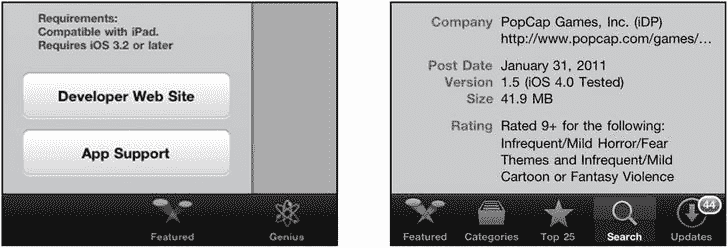

图 10-1. 长 URL 在桌面版 iTunes 或 iPad App Store（左）中无关紧要，但在 iPhone 版 App Store（右）中显示时会出现截断问题

问题在于 Apple 如何在 iPhone 版 App Store 中列出同一个网站链接，在该版本中会显示实际的 URL。在如此狭窄的手机屏幕上，长 URL 会被截断（参见图 10-1）。而且，由于 URL 仅仅被列出而并非一个活动链接，用户可能难以猜出完整的 URL 是什么。这看起来可能是个小问题，但根据 AdMob 的数据，超过 90% 的 iPhone 用户会在他们的移动设备上浏览和购买 App Store 的应用。因此，在 Mobile Safari 中轻松访问你的网站变得比许多开发者意识到的要重要得多（我将在本章后面更详细地讨论这一点）。

如果你已经为公司建立了一个现有网站，或者你当前为所有软件产品维护一个中心站点，那么很可能你已经将网站组织成将每个应用分配到其自己的目录。例如，Streaming Colour Studios 就是这样对其 iOS 游戏进行分类的。Dapple 游戏的网页位于`http://www.streamingcolour.com/games/dapple/`。尽管该 URL 看起来很简单，但在 iPhone 版 App Store 中它肯定会被截断。为了避免这个问题，开发者 Owen Goss 注册了域名`dapplegame.com`。这个较短的域名不仅在 iPhone 的 App Store 中显示良好（参见图 10-2），而且当用户在营销材料和广告中看到它时，也更容易记住。

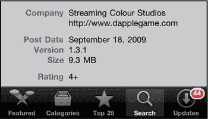

图 10-2. Streaming Colour Studios 没有为其官方 Dapple 网页使用长公司 URL，而是选择了一个更短的应用特定域名

别担心——这并不要求你维护两个独立的网站和托管费用：一个给公司，一个给应用。大多数域名注册商都提供网页转发服务，这样你就可以轻松地将你的应用 URL 重定向到你现有公司网站中的任何目录或页面。Streaming Colour Studios 就是这么做的。URL`http://www.dapplegame.com`只是简单地重定向到位于`http://www.streamingcolour.com/games/dapple/`的实际 Dapple 网页。

另一种选择是使用子域名。Smule 没有在其网站`http://www.smule.com`内使用嵌套目录，而是为每个产品使用唯一的子域名。例如，Ocarina 应用的网页位于`http://ocarina.smule.com`，I Am T-Pain 的网页位于`http://iamtpain.smule.com`。这使得 Smule 可以显示简短、易记的应用 URL，同时只维护一个中心公司网站。而且这一切都在无需支付额外域名注册和网页转发费用的情况下完成。

#### 搜索引擎优化策略

搜索引擎优化（SEO）是一个庞大的话题，它催生了一个由 SEO 顾问、研讨会和书籍组成的庞大产业。在这里，让我们来讨论一些你为了应用网站而应该了解的基础知识。


**提示** 如果您想了解更多关于 SEO 的知识，可以查看 Google 提供的免费 *SEO 初学者指南*：`http://www.google.com/webmasters/docs/search-engine-optimization-starter-guide.pdf`。

##### `<title>` 标签

`<title>` 标签位于 HTML 代码中的 `<head>` 标签内，用于在网页浏览器的顶部标题栏中显示页面标题。虽然这看起来没什么用，但 `<title>` 标签对于搜索引擎和社交媒体来说其实是一个非常重要的标签。

`<title>` 标签是搜索引擎结果中显示的主要链接标题。以虚构的 Breadcrumbs 应用为例：

```
<title>Breadcrumbs – Parked Car Locator App for the iPhone</title>
```

请注意，我不仅融入了应用的名称和说明，还提及了它是一款 iPhone 应用。在标题中使用策略性关键词对于提升搜索结果排名至关重要。当该页面出现在 Google 的搜索结果中时，用户仅凭链接标题就能立刻知道它是什么。

如果您利用众多免费分享服务（例如 AddThis 和 ShareThis）中的一种，让网站访问者能够与朋友分享该网页，那么您粘贴到 HTML 中的 JavaScript 代码会自动抓取页面的 `<title>` 标签，并将其作为随页面 URL 一起发送的消息的一部分。考虑到这一点，最好将字符数控制在 140 个字符以内，以便在 Twitter 上轻松转发。

##### `description` 和 `keywords` Meta 标签

虽然 `description` 和 `keywords` meta 标签并非必需，但绝不能将其视为可有可无。同样位于 HTML 的 `<head>` 标签内，它们是大多数搜索引擎在抓取网站时分析的重要元素：

- `keywords <meta>` 标签有助于提供网页主题的上下文信息。
- `description <meta>` 标签通常用作搜索引擎结果中标题链接正下方显示的文本描述。

以下是语法示例：

```
<meta name="description" content="Easily find your car in crowded parking lots with Breadcrumbs, now available in the iPhone App Store">
<meta name="keywords" content="iPhone, App Store, GPS, car finder, car locator, mobile, augmented reality, map, directions, lost car, parking, app">
```

为防止描述在搜索结果中被截断，请尽量将其长度限制在 25 到 30 个单词以内。

您可以在 `keywords <meta>` 标签中包含更多词语，但务必只包含与该网页相关的关键词。不要试图通过包含不相关的热门搜索词来“钻系统空子”，以期获得更广泛的曝光。那是 1998 年的老把戏了。如今，现代搜索引擎采用极其复杂的算法，会将您的 meta 关键词与正文中的关键词进行比较。任何发现的差异都会降低您当前的搜索引擎页面排名。

不确定使用哪些关键词才能获得最佳效果？试试 Google 的 AdWords 关键词工具（`https://adwords.google.com/select/KeywordToolExternal`）。虽然该工具是为帮助广告商优化广告系列关键词而设计的，但它也能帮助您确定搜索关键词的价值，从而使您的 `keywords <meta>` 标签包含最优化词语。

##### 关键词丰富的文本

与 `keywords <meta>` 标签一样，请确保网页主体中的可见文本包含优化的关键词，以帮助提升搜索引擎排名。如果您的应用目前有多个竞争对手，请查看他们的网站，了解他们使用了哪些关键词以及在搜索引擎中的排名情况。您的目标是在相似关键词的搜索结果中排名与他们持平，甚至更高。

确保所有网页图片都包含 `alt` 文本参数，以便搜索引擎仍能读取其预期的描述。恰当地命名图片文件也是一个好主意。例如，一个经过搜索引擎优化的购买按钮可能如下所示：

```

```

尽可能避免在网站上使用 Adobe Flash。虽然这是一项出色的网络技术，但它给 iOS 应用开发者带来了两个严重问题：

- iOS 原生浏览器 Mobile Safari 目前不支持 Flash。在 iPhone、iPad 或 iPod touch 上查看时，Flash 对象会显示为损坏状态。
- 一些搜索引擎难以正确搜索基于 Flash 的 SWF 文件，因此嵌入的文本关键词可能不会被索引。

如果您想在网站上使用流行的 Flash 视频格式，您需要在本章后面“为什么与 Mobile Safari 的网站兼容性如此重要”部分中了解更多相关信息。

##### 关键词友好的 URL

遵循策略性命名图片文件的思路，如果您的应用专属域名重定向到您现有的公司网站，您还应该尝试在 URL 中使用策略性命名的目录和文件。例如，使用如下网站命名结构：

```
http://www.mywebsite.com/iphone/breadcrumbs/
```

将比使用如下无特征的 URL（例如：`http://www.mywebsite.com/sw/0901/page01.html`）有助于您的网站在搜索结果中获得更高的排名。

##### 保持有效链接

确保在所有子目录中放置默认索引页面，以防止用户和搜索引擎爬虫遇到 404 错误或“禁止目录”警告。损坏的 URL 会严重影响您网站在主要搜索引擎中的索引方式。

##### XML 站点地图

XML 站点地图是 Google 几年前引入的一项标准。它使您能够向 Google、Yahoo! 和 Microsoft Bing 提交一个 XML 站点地图文件。该 XML 列表包含您希望被这些搜索引擎索引的所有网页 URL 的条目。在 XML 中，您可以指定每个页面的优先级（重要性）、最后修改日期以及更改频率。

此站点地图有助于 Google、Yahoo! 和 Bing 发现您网站上那些搜索机器人可能在抓取过程中未找到的页面。如果您在网站上添加或删除页面，只需更新 XML 站点地图文件，然后将其重新提交给 Google 和其他搜索引擎进行索引。

要开始使用，请访问 Google 的免费网站管理员工具网站（`http://www.google.com/webmasters/tools/`），了解如何创建和提交您自己的 XML 站点地图文件。Google 甚至还提供有关发现的任何抓取问题以及识别任何元标签问题的报告。

从未见过 XML 站点地图文件？以下是一个简短示例：

```
<?xml version="1.0" encoding="UTF-8"?><urlset xmlns="http://www.sitemaps.org/schemas/sitemap/0.9">
    <url><loc>http://www.ebutterfly.com/</loc><lastmod>2010–9-30</lastmod><changefreq>weekly</changefreq><priority>1.0</priority></url>
    <url><loc>http://www.ebutterfly.com/books/devsketchbook/</loc><lastmod>2010–9-30</lastmod><changefreq>monthly</changefreq><priority>0.9</priority></url>
    <url><loc>http://www.ebutterfly.com/books/iphonebusiness/</loc><lastmod>2010–9-30</lastmod><changefreq>monthly</changefreq><priority>0.9</priority></url>
    <url><loc>http://www.ebutterfly.com/company/</loc><lastmod>2010–9-30</lastmod><changefreq>monthly</changefreq><priority>0.6</priority></url>
</urlset>
```

看到语法有多简单了吗？在主要的父级 `urlset` 标签内，每个子 `<url>` 标签包含我网站中一个不同的、唯一 URL 的信息（但请记住，我实际的 XML 站点地图文件要大得多）。

如果您不习惯在文本编辑器中手动编写 XML 代码，您可能更喜欢使用站点地图自动化工具。以下是一些推荐工具：


# 高级文档工程师排版结果

- XML 站点地图 (`http://xmlsitemap.com`)
- XML-Sitemaps.com (`http://www.xml-sitemaps.com`)
- RAGE Sitemap Automator for Mac OS X (`http://www.ragesw.com/products/googlesitemap.html`)

创建 XML 站点地图文件后，请将其提交给支持该标准的主流搜索引擎：

- Google (`http://www.google.com/webmasters/tools/`)
- Yahoo! (`http://siteexplorer.search.yahoo.com/submit`)
- Bing (`http://www.bing.com/toolbox/webmasters/`)

#### 追踪网站流量

在第 7 章中，我强调了通过第三方应用分析工具（如 Flurry）追踪 iOS 应用使用情况的价值。同样，对你的网站进行类似操作也大有裨益。追踪网站流量可以揭示访问者来源、他们使用的浏览器版本、何时以及有多少人查看你的网站、哪些网页和链接最受欢迎等等。

通过监控网站的高峰流量时段，并结合应用商店中一周内哪几天为你的应用带来最多下载量，你可以确定发布限时优惠活动和相关应用新闻的最佳时机。另一方面，网站流量统计还可以通过列出导致最多访客离开（退出你的网站）的页面，帮助定位设计缺陷。

由于英语是一种全球通用语言，你的英文应用可以在苹果各个地区的应用商店取得成功。但如果你有兴趣制作应用的本地化版本，以增加在你所在国家以外的销量，你应该优先针对哪些语言？良好的网站流量统计可以告诉你访问者来自哪些国家。除了美国，你的大部分网站访问者是否来自意大利、法国或德国？或者可能是日本和中国？结合你的国际应用商店下载/销售报告和网站流量统计，可以帮助你确定应将翻译工作重点放在哪些国家。

大多数网站托管公司都会将流量追踪作为其服务包的一部分。如果你的网站主机不包含流量统计（或其捆绑的解决方案缺乏强大的功能），不妨看看可用的第三方分析服务。其中许多服务是免费或费用极低的。以下是几种流行的服务：

- Google Analytics (`http://www.google.com/analytics/`)
- Site Meter (`http://www.sitemeter.com`)
- Mint (`http://haveamint.com`)

如果你已经在 iOS 应用中使用了移动版 Google Analytics，那么为你的网站设置免费的 Google Analytics 应该是轻而易举的事！能够在同一个基于网页的控制面板中同时监控你的网站和 iOS 应用的使用情况统计，是一项非常方便且强大的解决方案。

### iOS 应用网站的构成

现在你已经准备好设计你的应用程序网页了，但应该包含哪些元素呢？以下是一份常见要素清单供你参考：

- 一致的品牌标识，展示你的应用图标和名称/标识
- 标题和/或快速推销描述
- Apple 应用商店的官方标识徽章
- 购买按钮
- 定价
- 截图和视频
- 其他详情，如功能、优势、要求、用户评价和评论
- 分享机制，便于通过 Twitter、Facebook 等社交媒体与他人分享你的页面链接
- 通过博客、RSS 和电子邮件通讯建立的社区
- 客户支持和联系信息
- 公司标识
- 交叉推广你其他产品的链接
- 额外下载内容（可选）

虽然这看起来是一长串元素，但真正有效的网站会以一种非常简洁、清晰的布局呈现信息，方便访客阅读。如果你评估过你最喜欢的 iOS 应用和游戏的网站，你应该已经看到了其中的许多（如果不是全部）项目。

图 10-3 提供了一个概念模型，展示了如何将这些组件整合到一个网页中。在评估了几个领先的 iOS 应用网站后，这个示例大纲会让你感到相当熟悉。

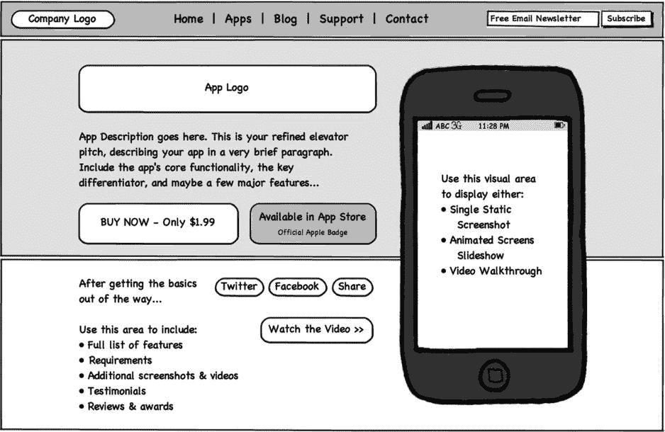

图 10-3. 这个网页模型展示了如何将必要的内容整合到一个清晰、易读的布局中（使用 Balsamiq Mockups 设计，`http://balsamiq.com/products/mockups/`）

与印刷页面不同，网页可以垂直滚动，因此可以包含更多内容。关键在于避免一次性向用户展示过多信息，使其不堪重负。实现方法是只将最重要的“快速推销”数据放在屏幕顶部中央位置。有兴趣了解更多信息的用户可以向下滚动页面以获取更多细节。这使你能够分散内容，使设计在页面上有“呼吸空间”。

如果页面顶部区域过于拥挤，会显得杂乱，难以阅读。通过保持设计简洁，你可以让页面更容易被人的眼睛快速浏览和处理。一个基于产品的网站不过是一份在线营销手册，因此必须快速有效地传达其信息。网络是一种高度视觉化的媒介，所以不要用过多的文字压垮页面。当然，你需要包含足够丰富且相关的关键词，以便向消费者和搜索引擎成功描述应用，但通过吸引人的图像来吸引访问者同样重要。

既然你已经有了一个概览，让我们更仔细地看看你的网站应该包含的每个元素。

#### 应用品牌标识

图 10-3 中显示的极简模型几乎可以作为任何 iPhone 应用或游戏网页的布局模板。使其对你的应用独特的是你融入的视觉效果。网站图像应直接反映你的应用图标和界面主题。品牌一致性至关重要。

永远、永远、永远要展示你的应用图标！这个图标在应用商店中视觉上代表你的产品，所以你需要在你网站上强化相同的图像。目标是让消费者习惯将该图标与你的应用程序名称和功能联系起来。每当他们在应用商店中看到这个图标时，你希望他们能立即认出它。这就是为什么我在第 4 章中建议将应用图标整合到整体标识设计中。同样，应用图标也应该是你网页设计中的一个突出部分。

举个例子，我基于图 10-3 的通用布局，为虚构的 Breadcrumbs 应用设计了一个假想网页。正如你从图 10-4 中看到的，页面结构与模型大纲完全相同，但底层设计主题中独特的品牌元素使其与众不同。

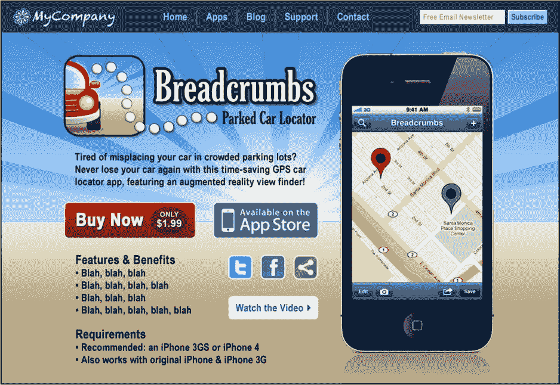

图 10-4. 基于图 10-3 所示的模型，这个 Breadcrumbs 网页强化了应用的品牌标识

请注意，在图 10-4 中，应用图标是如何成为 Breadcrumbs 标识的组成部分的。通过使用图标的蓝天地平线作为网页的背景图片，进一步支持了品牌形象。

互联网的好处在于其可访问性真正地为开发者提供了公平的竞争环境。你可能没有大型发行商那样庞大的营销预算，但如果你精通使用 Adobe Photoshop 和网页编辑器，你可以让你的网站看起来同样令人印象深刻。


如果你的图形设计经验有限，请不要担心。只需少量关键视觉元素，你就能设计出令人惊艳的网站。看看 Shiny Development 公司为其 Balloons! 应用制作的网页，网址为 `http://balloonsapp.com`（参见图 10-5）。尽管页面设计相当简约，纯白背景上只有黑色文字，但应用的核心艺术元素——漂浮的气球——却非常醒目、引人注目。这是页面上唯一的图像，然而这种简洁性有力地巩固了已建立的品牌形象，并以非语言的方式传递了易用性，这两者对于一款社交媒体应用的成功至关重要。

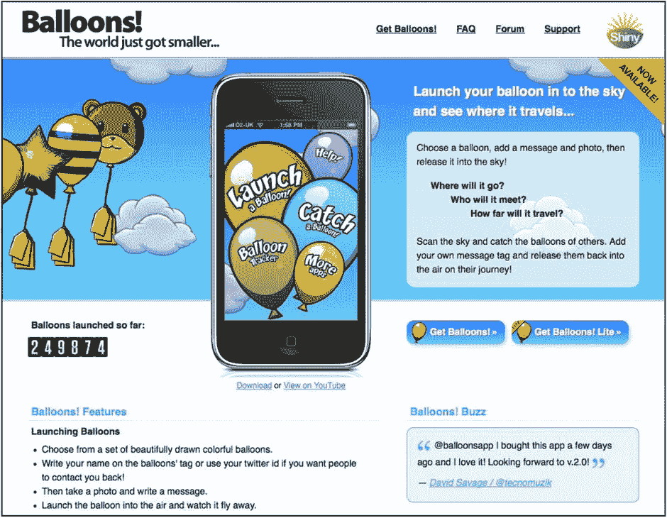

图 10-5。你无需成为 Photoshop 大师也能搭建出有吸引力的网站。Shiny Development 为其 Balloons! 应用制作的网页仅以一张居中图片为背景，这种简洁的设计既抢眼又高效。

尽管 Balloons! 的应用图标并未显示在标志旁边，但它被整合进了“Get Balloons!”购买按钮中。如果你点击该按钮，那个红色气球与你将在 App Store 图标中看到的完全相同。

就像设计应用界面一样，对应网站的外观和感觉也应当具有吸引力。如果你聘请了专业设计师来创建应用的图标和标志，你应该考虑继续与同一个人签约，为你的网站和所有其他推广需求生成视觉元素，这样你的品牌形象在所有营销材料中才能保持一致。

#### 快速推介：这是什么？为什么我要关注？

还记得本章前面我谈到的如何构思电梯演讲吗？你需要将其放置在网页顶部，通常位于应用名称下方。这将快速告知访客你的应用是做什么的，以及它能如何让他们受益。你的应用可能具备大量优秀功能，但不要一次性全部罗列出来，以免让读者感到信息过载。那样只会让页面显得杂乱且头重脚轻。

在图 10-5 中，Balloons! 的主视觉区域内只显示了一句简短的说明文字和几句话。几秒钟内，你就能大致了解这个应用的功能以及使用它可能带来的乐趣。这就是吸引你的钩子，促使你继续阅读。想了解更多？只需向下滚动页面，即可查看完整的功能列表。

#### App Store 身份标识

你会在大多数 iPhone 和 iPad 应用相关网站上看到的最常见元素，就是标有“Available on the App Store”字样的官方 App Store 身份标识。要获取此图形，你需要访问 Apple 的 App Store 资源中心，网址为 `http://developer.apple.com/appstore/resources/marketing/`。你会在“App Store Badging and Artwork”部分看到这个身份标识。

你需要下载并签署《App 市场营销图稿许可协议》表格，然后邮寄回 Apple。尽管身份标识和 iOS 设备图形下载链接已在那里提供，但在使用这些图像之前，请务必下载并阅读 *App 营销与身份标识开发人员指南* PDF 文档。这份文档解释了如何正确使用 App Store 身份标识以及经授权的 iPhone 和 iPad 图像的相关规则。由于如果你未能遵守指南，Apple 保留撤销使用这些提供图形权限的权利，因此阅读该文档并确保你理解如何保持合规，对你最有利。

图形下载内容包含标识的网页版和印刷版分辨率，以及以分层 Photoshop PSD 文件形式提供的几种不同版本的 iPhone、iPad 和 iPod touch 图像。这使你能够灵活地在所有营销材料中使用这些图形。

#### 购买按钮

尽管 App Store 身份标识通常从你的网站链接到 App Store 中你的应用产品页面，但不要依赖它作为你唯一的购买按钮。有些人可能仅仅将其视为一个官方标志，并不理解它实际上会链接到 App Store。由于你网站的主要目标是销售更多应用单位，因此你还应包含一个专门的购买按钮，以帮助将流量引导至 App Store。

在我们虚构的 Breadcrumbs 网页示例中（参见图 10-4），巨大的“Buy Now”按钮使用了与图标中红色汽车相同的**高对比度红色**，使其作为一个突出、引人注目的元素真正“凸显”出来。

任何时候链接到 App Store，别忘了使用 iTunes 联盟链接，这样你就能从你带给 Apple 的所有销售中赚取额外收入。（读完第 6 章后，你已经加入了免费的 iTunes 联盟计划，对吧？）

#### 定价

在你的网站上包含应用价格，似乎是 iOS 开发者中争论不休的话题。一些人认为标出价格可能会阻止人们点击进入 App Store，而另一些人则认为价格实际上有助于推动销售。尽管双方的论点都有其道理，但我认为在所有营销材料（包括你的网站）中标明价格，对销售的增长作用大于可能造成的损害。

如果你不断尝试不同的定价点，以改善你的应用在 App Store 畅销排行榜上的位置，那么我可以理解你对于在网站上显示波动的价格有所顾虑。但这是一项你正努力发展成成功事业的尝试，因此投入额外的时间来频繁更新你网站上的定价是值得的。而且，如果你的应用正在促销，你当然希望全世界都知道。

如果你的应用在多个地区的 App Store 销售，请尽量注意这些国家的货币。许多与应用相关的网站会同时以美元和欧元显示价格，以迎合大部分目标受众。FutureTap 公司将这一理念推进一步。由于其 Where To? 应用支持多种语言，他们对其网站进行了本地化处理，为应用支持的主要地区提供了相应的定价和文本描述翻译。如果你访问 `http://www.futuretap.com/home/whereto-en/`，你会看到屏幕左侧有多个标签，每个标签代表一个不同国家的旗帜。点击一个旗帜图标，即可显示该国家翻译后的产品页面和定价。在图 10-6 中，英文产品页面以美元显示价格，而法文产品页面则以欧元显示相应价格。

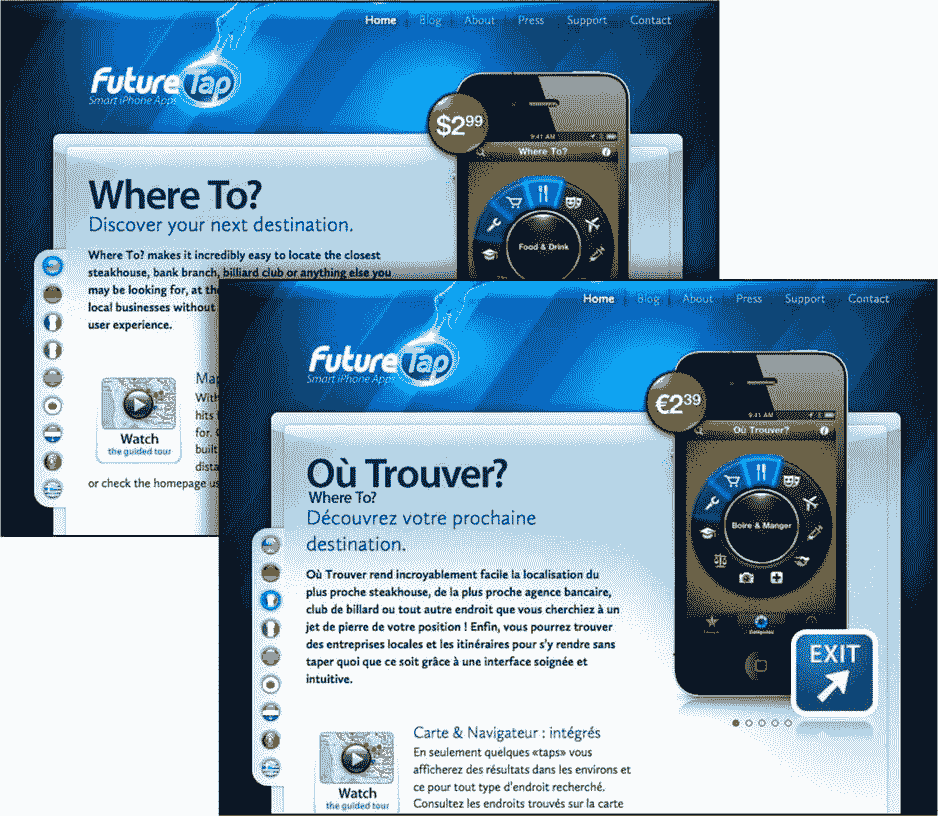

图 10-6。FutureTap 为其 Where To? 应用制作的网站，在每个本地化产品页面上以相应货币显示价格，例如英文描述使用美元，法文描述使用欧元。

为获得最佳效果，请将应用价格显示在购买按钮内（如图 10-4 中 Breadcrumbs 示例所示），或显示在你网页上 iPhone 或 iPad 图像附近（如图 10-6 中 FutureTap 的做法）。你不能将价格包含在 App Store 身份标识上或内部，因为 Apple 的指南明确禁止修改该标识。

#### 截图与视频

除了将网页设计得能模仿应用的品牌形象外，其他关键的视觉元素就是展示应用运行状态的截图和视频。人们需要看到你的应用长什么样以及它是如何工作的，才能做出购买决定。除了提供免费的试用版软件之外，做到这一点的最佳方式就是通过截图和视频演示。


##### 利用富媒体吸引用户

感兴趣的博主和记者在撰写评测时，可能会从你的网站引用内容，因此尽可能同时包含视频和截图总是个好主意。如果你还未完成应用视频预告片的制作，那么至少也要放上一些高质量截图。

尽管多数开发者会在网页的大尺寸 iPhone 或 iPad 图片中显示应用主截图，但更有效的网站实际上会将视频或截图动画轮播嵌入到 iOS 设备图片中。这种方式极具吸引力，能让用户对应用的功能或游戏玩法有更身临其境的体验。FutureTap 在其 Where To? 网站上就采用了这一做法（参见图 10-6）。每隔几秒钟，显示的 iPhone 内就会出现一张不同的截图。如果你想回到特定画面，网站甚至还加入了 iOS 风格的页面“圆点”标记，供你手动切换到指定图片。

要实现类似效果，你可以使用 JavaScript 代码在 iPhone 或 iPad 的图片框架内运行静态截图的幻灯片播放。不是 JavaScript 高手？没问题。网上有大量优秀的幻灯片脚本可供使用，其中很多都是免费的。只需在网络上搜索 *JavaScript 图片幻灯片*，或查看以下网站提供的优秀 JavaScript 解决方案合集：

*   Dynamic Drive (`http://www.dynamicdrive.com`)
*   Hot Scripts (`http://www.hotscripts.com`)

一些幻灯片脚本能在图片之间实现非常流畅的过渡效果，使得幻灯片播放起来几乎像电影一样，却无需承担大型视频下载的开销。

在 `http://putthingsoff.com` 的 Put Things Off 网站上显示的 iPhone 中嵌入了一段 QuickTime 视频。点击播放按钮，视频就会在 iPhone 框架内加载并播放，模拟 Put Things Off 应用的实际运行效果（参见图 10-7）。视频与简单的四步文字说明相结合，突出了该应用的易用性。

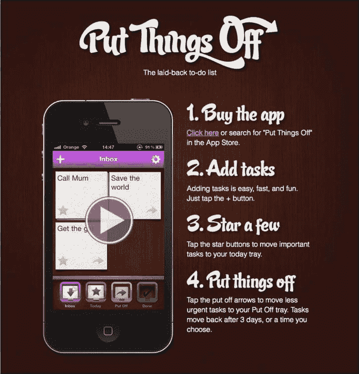

图 10-7。Put Things Off 网站上嵌入的视频和简短的四步说明，凸显了该应用的易用性

这种引人注目的技术营造了一种错觉，让人以为 iPhone 图形正在你的网页浏览器中实时运行该应用。为了维持这种错觉，请将 HTML QuickTime 代码的 `controller` 参数设置为 `false`，以确保播放控制器栏不可见。同时应将 `bgcolor` 参数设置为 `#000000`（黑色），以避免视频画面周围出现难看的边框。你可能还想将 `autoplay` 和 `loop` 参数设置为 `true`，以便网页加载时视频立即开始播放并无限循环。要了解用于自定义视频播放的其他数十种 QuickTime 参数，以及在网页中嵌入 QuickTime 视频的最佳方法，请查看 Apple 的官方文档《*QuickTime 的 HTML 脚本编写指南*》（`http://developer.apple.com/library/safari/#documentation/QuickTime/Conceptual/QTScripting_HTML/QTScripting_HTML_AIntroduction/Introduction.html`）。

如果你已经制作了应用视频预告片，还应该将其上传到像 YouTube 这样的主要视频分享网站，以便从其庞大的受众群体和社交媒体分享功能中获益，获得更多曝光。但不要做一个懒惰的网页设计师，仅仅直接链接到你在 YouTube 或 Vimeo 上的视频页面。这样做或许能增加视频的观看次数（和人气排名），但会将访问者从你的网站引开。你的目标应该是让用户在你的网站内保持活跃，这样你的购买按钮就始终只需一次点击即可触及。你可以通过简单地将视频嵌入到自己的网页中来达到这一目的。即使你的视频预告片更像广告而非纯粹的模拟，不适合框在大尺寸 iPhone 或 iPad 图形中，它仍然应该在你自己的网站上可观看。

例如，在你的 YouTube 视频页面上，有一个“嵌入”按钮，你可以复制并粘贴一段简短的 HTML 代码到自己的网页中。

请务必自定义 YouTube 生成的嵌入代码，关闭“包含相关视频”选项和“使用旧的嵌入代码”选项。YouTube 过去使用的旧嵌入代码只能播放 Flash 视频格式，而 iOS 设备不支持该格式。新的嵌入代码同时支持 Flash 和 HTML5 视频，具体取决于加载视频的浏览器。这使得 iPhone、iPad 和 iPod touch 用户能够观看你的视频，因为 YouTube 的嵌入代码会在 Mobile Safari 中自动切换到 HTML5 视频格式。

#### 附加详情

应用网页的下半部分是添加附加文本的理想区域，例如功能、优势、需求的详尽列表，甚至推荐和评测的引文。

大多数人的生活都非常忙碌，人们的注意力持续时间越来越短。不要指望任何人会花时间阅读冗长、密集的信息段落。应将这些数据组织成易于阅读的要点列表。

#### 社交媒体

我将在本章后面详细讨论如何扩大你在社交媒体上的影响力，但吸引新关注者关注你社交网络身份的一个主要方法是在你的网站上大力推广它们。

查看大多数 iOS 开发者的博客和网站，你会发现其中绝大多数都显示了指向其 Twitter 和 Facebook 页面按钮链接，希望你能在那里关注他们。这两个社交媒体巨头的图标都非常知名，因此如果你更喜欢节省空间的方法，可以选择只显示它们的链接图标，就像虚构的 Breadcrumbs 网页所示（图 10-4）。

你可能在图 10-4 中注意到的另一个图标按钮是那个小小的绿色分享徽章。你不仅希望人们关注你，还希望他们能与朋友和家人分享你网站的 URL。正如我之前所说，口碑是社交媒体提供的最强大的营销力量之一。人们信任他们的朋友，因此通过口碑传递的推荐比你自己做的任何广告或自我推销都更具销售力。

在前面的章节中，我已经向你展示了如何在你的应用内构建对 Twitter、Facebook 和“告诉朋友”功能的支持。你的网站也应该提供这些相同的功能，但多亏了一些优秀的第三方服务，你甚至不需要编写一行代码！这些服务提供自定义的“分享”小部件，只需复制并粘贴它们提供的代码片段（通常只有几行 JavaScript），即可轻松安装到你的网页上。以下是其中一些服务，你可能在数以百万计的网站上见过它们的身影：

*   AddThis (`http://www.addthis.com`)
*   ShareThis (`http://sharethis.com`)
*   AddToAny (`http://www.addtoany.com`)


这些分享按钮的美妙之处在于，它们能让网站访问者将特定网址收藏或分享到数十个热门社交媒体网站，如 Twitter、Facebook、Digg、Delicious、StumbleUpon、LinkedIn、MySpace、Slashdot、Reddit、Technorati 等，甚至可以通过电子邮件“告诉朋友”。它们的分享按钮小巧紧凑，便于放置在网页的任意位置。将鼠标悬停在按钮上时，会弹出包含分享选项的下拉菜单（参见图 10-8）。

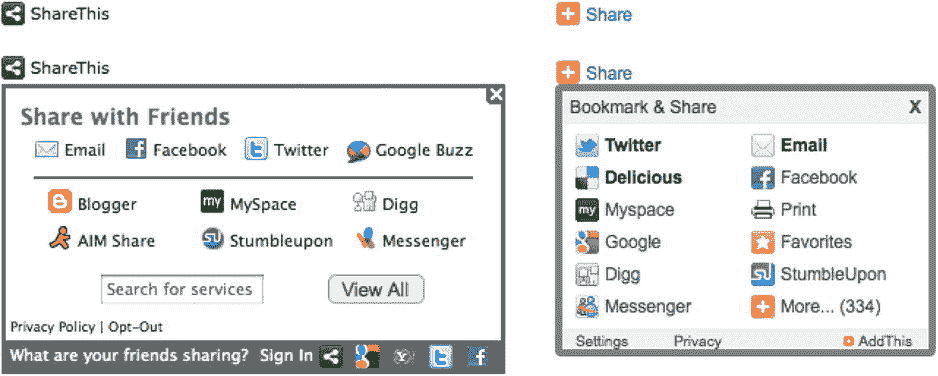

图 10-8。ShareThis（左）和 AddThis（右）提供的默认按钮，均带有全面的下拉菜单，便于进行网址分享

不喜欢它们的默认按钮样式？有些分享服务甚至允许你使用自定义按钮图片。这样你就能更好地将其服务融入网站现有设计，例如在面包屑导航示例（图 10-4）中，我修改了分享图标，使其与配套的 Twitter 和 Facebook 图标尺寸一致，以保持视觉统一。

你可以轻松地从这些分享服务获取所需代码，然后直接使用。不过，如果你想追踪分享按钮的表现，我建议免费注册这些服务的账号。与网站分析工具类似，你可以登录 AddThis 或 ShareThis 账户，监控哪些网页被收藏和分享最多，以及它们被分享到了哪些社交媒体网站。这是非常有价值的信息。了解访问者经常使用哪些社交网站，有助于你确定线上营销的重点方向。

如果你的大部分网络受众都在使用某个特定社交媒体网站（例如 Facebook），你可能更希望将分享按钮专门针对该网站，而不是采用像 AddThis 这类第三方分享服务“包罗万象”的方式。如果你经常阅读博客，肯定见过流行的 Twitter、Facebook Like 和 Digg 按钮（参见图 10-9）。


图 10-9。Twitter、Facebook 和 Digg 提供的针对性分享按钮能大幅提升网址分享量，但可见的计数器也可能暴露出不受欢迎的网页

这些高知名度的按钮将分享操作简化为一次有针对性的点击，从而带来更多网址分享。你让访问者分享越容易，他们就会分享得越多。

如果你的网页很受欢迎，分享计数器上累积了可观的大数字，如图 10-9 中的 Tweet 按钮（最左侧）所示，那么你的内容对新访问者会显得更具吸引力，让他们也渴望分享该页面。

但另一方面，可见的计数器对新网站或访问量少的网站也存在不可避免的劣势。转推数低得可怜本身就够令人沮丧了，还要让它对每个访问你网页的人广而告之，这简直是种尴尬。而且，没人喜欢跟不受欢迎的家伙待在一起。

如果你的网站仍在努力增加流量，你可能想先使用像 ShareThis 这样的一站式分享聚合器，直到你能提升数字为止。

所以，如果你的网站已经拥有健康的流量，那么高影响力、有针对性的分享按钮就是有价值的补充。以下是一些例子，通过复制粘贴一小段 JavaScript 代码即可轻松安装到你的网页或博客上：

*   Tweet 按钮（`http://twitter.com/about/resources/tweetbutton`）
*   Facebook Like 按钮（`http://developers.facebook.com/docs/reference/plugins/like/`）
*   Smart Digg 按钮（`http://about.digg.com/downloads/button/smart`）

无论你决定使用哪种分享按钮选项，务必确保你的网页拥有足够简短的 HTML `<title>`标签，以便于轻松转推。如果你的网站访问者为了通过 Twitter 分享而被迫编辑标题文本，他们很可能会放弃分享网址，因为不愿意费这个额外的功夫。

那么，合适的标题长度是多少？Twitter 将推文限制在 140 个字符以内，但对你的标题而言，这个长度也太长了，因为转推还需要包含你网页的网址。为网址预留空间后，我们来看看标题文本还能剩下多少字符。

为了说明这一点，我们来为虚构的面包屑导航应用构建一个易于转推的可行网页标题。网站网址`http://www.breadcrumbsapp.com`虽然简短，但 Twitter 可能会使用其内置的网址缩短功能自动将其转换为更短的网址。你可能希望追踪来自那条推文的点击量，所以与其依赖 Twitter 的原生网址缩短服务，不如在 Bit.ly（`http://bit.ly/`）这类网址缩短服务商处免费注册自己的账号，并提供自定义的短网址。这样，你既能减少网址所需的字符数，又能通过 Bit.ly 的分析功能监控该链接的受欢迎程度。

Bit.ly 的短网址大约占用 20 个字符（`http://bit.ly/3EmvfN`），这样就给我们留下了 120 个字符，以避免超过 Twitter 的 140 字符限制。为了安全地容纳用户可能添加到推文中的任何额外评论（例如“很酷的应用！”），我们不妨把标题控制在 100 个字符或更少。

“Breadcrumbs for iPhone - Never misplace your car again with this new parked car locator app!” 只有 92 个字符，所以完全可行！网页的 HTML `<title>`标签现在如下所示：

```
<title>Breadcrumbs for iPhone - Never misplace your car again with this new parked car locator app!</title>
```

这会生成以下 113 个字符的分享信息：

```
Breadcrumbs for iPhone - Never misplace your car again with this new parked car locator app! http://bit.ly/3EmvfN
```

完美！我们网页的`<title>`标签包含了像*iPhone app*和*car locator*这样的重要关键词短语，有利于搜索引擎优化，同时它又足够简短，便于在热门社交网站上进行网址分享。这一切看似是对琐碎细节的过分关注，但正是这种精细程度，能将一个普通的网站转变为强大的营销工具。

你的博客与 RSS feed

你们大多数人应该已经维护了一个博客，用于发布软件发布和开发更新的新闻。如果没有，那你真的应该开设一个！这是培养读者群、吸引用户访问你网站的好方法。没什么可说的？没关系，你不需要把它当成每日日记来写。

博客在你和客户之间建立了一种直接联系，读者可以通过它随时了解你的最新动态并发表评论。对于博客新手，我将在本章稍后部分讨论博客在构建社区方面的力量。

目前，如果你确实维护着用于讨论软件开发或 iOS 新闻的博客，请确保你的应用相关网站上包含一个直接链接。除了 Twitter 和 Facebook 之外，你要让网站访问者知道，你的博客是让他们随时了解应用动态的又一个可用资源。


由于大多数博客软件（例如 WordPress）都会自动为最新博文生成 RSS 订阅源，许多博主除了提供必要的订阅链接外，并没有在订阅源上投入太多精力。尽管 Twitter 等令人兴奋的新平台似乎让这种基于 XML 的标准热度有所下降，但 RSS 仍然是一种非常强大的信息分发机制。要真正利用 RSS 满足你的营销需求，我强烈建议你注册谷歌的免费服务 FeedBurner，其网址为 `http://www.feedburner.com`。

乍一看，FeedBurner 可能只是一个华而不实的分析服务，用来追踪谁在订阅你的 RSS 订阅源，以及使用了哪些浏览器或客户端应用来阅读它。虽然 RSS 数据监控非常有用，但 FeedBurner 的功能远不止于此。

FeedBurner 的其中一项功能是 `FeedFlare`，它能在你的订阅源中插入社交媒体链接。这样一来，RSS 订阅者只需点击一下，就可以在 Digg、Delicious、Facebook 和其他社交网站上分享单篇博文。除此之外，当你发布新博文时，FeedBurner 会自动向所有主要的订阅源聚合器和搜索引擎发送 ping 通知。

该服务还提供 JavaScript 小部件，可以轻松地在任何网站上以 HTML 形式发布订阅源内容，这对于那些希望转载你的博客内容但又不想麻烦地解析 XML 的第三方网站来说非常理想。虽然有些博主可能担心他人会如何重新利用自己的内容，但既然你正在用博客和 RSS 订阅源来营销你的 iOS 应用，那么你的订阅源被转载得越广，你的应用获得的曝光就越多。这对你来说是一个双赢的局面，因为你的首要目标是尽可能多地为 App Store 中的应用产品页面引流。

不过，目前最有价值的功能是 FeedBurner 的免费邮件订阅服务。这项服务能让你的网站访客通过电子邮件接收你的博文。想想看，你无需在自己的服务器上安装和维护复杂的邮件列表软件来管理订阅者并发送广播邮件，FeedBurner 会为你代劳所有这些工作。你甚至不需要浪费时间配置 SQL 数据库和构建邮件模板。只需发布一篇博文，它就会被添加到你的 RSS 订阅源中，然后通过电子邮件发送给你的邮件订阅者。我刚才是不是提到这是免费的？你甚至可以使用自己的 Logo 和字体样式来自定义邮件。利用 FeedBurner 提供的简单易用的“复制粘贴”式邮件订阅 HTML 表单代码，人们可以轻松地从你自己的网站进行订阅。

但是，如果你不想让每一篇博文都发送到邮件列表怎么办？如果你需要对邮件设计有更多控制权怎么办？如果要从以前的营销活动中导入现有邮件列表又该如何？为了满足这些需求，你需要一个更强大的邮件营销解决方案。

#### 邮件新闻订阅列表

你是否想通过电子邮件直接将新闻、公告和特别优惠发送给你的客户？如果你和我一样，可能不想费心去摆弄自己的邮件列表软件，也不愿应对咄咄逼人的垃圾邮件过滤器、保护 SQL 数据库安全以防黑客入侵以及其他耗时的麻烦事。幸运的是，一些易于使用且价格实惠的第三方邮件营销服务可以处理所有这些繁重的工作。

邮件营销服务可以处理以下任务：

-   在其安全的服务器上维护你的邮件列表数据库和邮件营销活动
-   支持自定义 HTML 格式的邮件
-   邮件列表的导入和导出
-   提供广泛的基于 Web 的管理后台，并为每次营销活动提供全面的分析报告
-   提供自定义的 HTML 表单代码，供你复制粘贴到自己的网站上，方便访客订阅

这些服务与主要的互联网服务提供商（ISP）和电子邮件供应商签订了“白名单”协议，有助于防止你的营销活动被服务器端的垃圾邮件过滤器拦截。仅此一点就使得这些第三方服务成为比安装自己的 PHP/MySQL 解决方案更好的选择。

目前有数百家邮件营销公司，但以下是经过筛选、在软件开发人员中颇受欢迎的服务：

-   Campaign Monitor（`http://www.campaignmonitor.com`）
-   MailChimp（`http://www.mailchimp.com`）
-   Constant Contact（`http://www.constantcontact.com`）
-   iContact（`http://www.icontact.com`）
-   StreamSend（`http://www.streamsend.com`）
-   Vertical Response（`http://www.verticalresponse.com`）

我对 Campaign Monitor 的经验最为丰富，它提供了对邮件推送外观和感觉的完全设计控制权。我最喜欢 Campaign Monitor 的一点是，你只需按邮件营销活动付费；没有月费。所以，如果我这月没有发送邮件营销活动，我就不需要支付任何费用。当我发送营销活动时，费用也很合理。对于拥有庞大邮件列表但发送邮件非常少的开发者来说，这是一个很好的解决方案。

对于订阅者少于 2,000 人的低用量账户，MailChimp 免费提供其服务。随着订阅者基础的增长，你可以升级到更大容量的方案。MailChimp 还提供 `ChimpKit`，这是 MailChimp API 的一个 Objective-C 封装，让你能够直接在 iOS 应用内提供一个邮件新闻通讯注册表单！

无论你选择免费的 FeedBurner 邮件订阅服务，还是更全面的邮件营销解决方案，都请告知你的网站访客，每封邮件新闻通讯的底部都设有退订链接，以方便他们操作。

在你的网站某处包含一个隐私政策的链接也很重要。人们已经厌倦了处理垃圾邮件，因此他们对提供自己的电子邮件地址变得谨慎起来。一份简单的隐私政策声明可以安抚网站访客，让他们知道你不会出售或与任何人分享他们的电子邮件地址。如果你不确定如何措辞，可以在线搜索 `privacy policy`。你会找到数百个样本。只要确保遵守你所设定的任何隐私政策，以避免责任问题即可。撇开大多数国家现在都有严格的反垃圾邮件法律这一事实不谈，来自愤怒订阅者的负面口碑传播对你的业务造成的损害可能更大。

如果邮件新闻通讯如此麻烦，为什么还要费心使用它们呢？面对咄咄逼人的垃圾邮件过滤器，它仍然是一种有效的分发机制吗？诚然，由于贪婪的垃圾邮件过滤器，相当一部分收件人可能永远看不到你的邮件。但电子邮件仍然是传递新闻的一个非常强大的渠道。

虽然你可能只倾向于在 Twitter、Facebook 或你的博客上发布公告，但这依赖于用户在那里关注你并严格地查看你的最新消息。这将责任推给了你的受众，尽管你可能很警惕地阅读每一条推文和 Facebook 更新，但大多数人不会。为什么要冒着你重要的帖子被忽略的风险呢？

仍然有很多消费者更喜欢被动的方式。他们宁愿将请求的信息直接发送给自己，而不是被迫自己去寻找。关键是要在你的网站上提供尽可能多的沟通渠道，以便任何对你的 iOS 应用感兴趣的人都能以他们选择的格式或平台接收相关新闻。

#### 客户支持与联系信息

虽然我会在第 11 章中更多地讨论客户支持选项，但这里我要提一下，你应该始终从应用的主网站链接到你的支持页面。至少，要给网站访客提供某种联系你的方式——无论是通过电子邮件还是 HTML 表单。


# 尽管桌面版 iTunes 和 iPad 版 App Store 为你的应用页面提供了专属支持链接...

尽管桌面版 iTunes 和 iPad 版 App Store 会从你的产品页面提供一个指向你支持网站的专属活跃链接，但 iPhone 版 App Store 却并非如此。iPhone 版 App Store 仅会列出所选应用的网站 URL（请参见图 10-1）。由于超过 90% 的 iPhone 和 iPod touch 用户会直接在设备上浏览和下载应用，当他们遇到支持问题时，会在 Mobile Safari 中查找你的网站，希望能找到在线帮助。因此，让你的用户能从你的应用网站上轻松找到支持页面，这对你和你的客户来说都会轻松许多。

#### 公司身份

如果你的应用网页是你现有公司网站的一部分，这似乎是显而易见的；但如果你是一位独立开发者，决定为你的 iOS 应用建立一个独立的网站，那么请不要忘记包含你的公司名称和“关于我们”页面。

如果你只是在构建一个售价 99 美分、三个月后就会被遗忘的新奇应用，那么建立公司身份可能并不重要（如果真是这样，你可能也不会读这本书了）。但如果你开发了一个价格高于平均应用售价（比如 3.99 美元或更高）的、坚如磐石的小众应用，消费者在做购买决定前，会想确认你是一位严肃的开发者，并计划长期支持该应用。

当人们购买一个价格较高的应用，尤其是一个他们可能每天都会依赖的应用时，他们实际上是在对该产品的未来进行投资。你希望你的网站能散发出一种繁荣自信的专业气息。看到你的商业标志并在线阅读你的公司/开发者简介，有助于让你的客户感到安心。

#### 其他产品的交叉推广

你是否正在尝试销售多款软件应用？如果你正在为推广一款新的 iOS 应用而吸引流量到你的网站，那么请利用这个机会同时推介你的一些其他产品，尤其是那些能吸引同一批受众的应用。`http://www.taptaptap.com` 的 Tap Tap Tap 就是这样做的。

Tap Tap Tap 的网站设计将交叉推广作为核心要素。通过一个巧妙的寿司菜单主题，所有产品的应用图标都放置在一张虚拟的木桌上。选择一个应用，其图标会向前滑动，展示出完整的描述、截图、视频演示及其他相关信息。但其他应用的图标仍然在左侧可见。点击另一个，当前的应用图标会滑回原位，而新选中的图标则滑向前方（请参见图 10-10）。这一切都在同一个屏幕内完成。这是一个优雅的动画设计，通过层叠样式表（CSS）和 JavaScript 的复杂混合实现——没有使用 Flash。

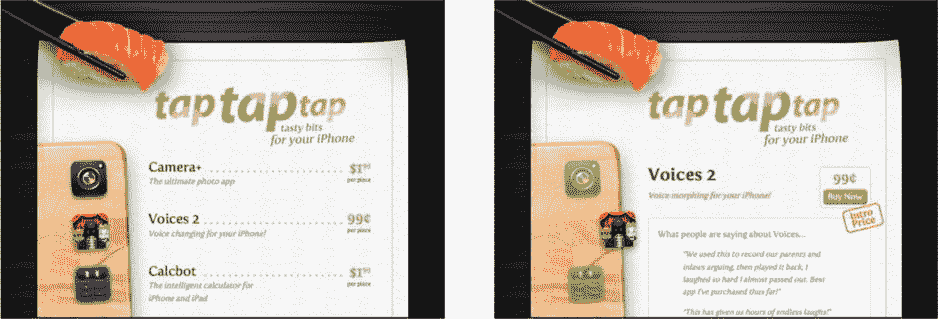

图 10-10. Tap Tap Tap 采用了一个巧妙的网站设计，在单个屏幕内对其所有 iPhone 应用进行交叉推广

你还可以交叉推广其他产品和服务。尽管人们来到你的网站是对一款 iPhone 或 iPad 应用感兴趣，但他们肯定也有其他兴趣，可能涉及书籍、桌面软件、相关咨询服务等等。但要非常小心，不要过度推广那些其他项目，否则你有显得过于广告中心化的风险，把你的 iOS 应用当作诱饵。同时要记住，你不想让网站访问者偏离你的主要目标：说服他们在 App Store 中购买你的 iOS 应用！

#### 可下载的附加内容

人们喜欢免费赠品！在你的网站上提供有趣的下载内容是推广你应用的简单方法。例如，你可以包含 Twitter 头像图片、桌面壁纸以及 iPhone 和 iPad 壁纸。

但仅仅因为你制作了免费赠品，并不意味着你的网站访问者就会想要它。由于这些本质上是你产品的数字广告，你需要让它们在视觉上足够引人注目，让人们每次打开电脑或移动设备时都愿意看。人们不想盯着界面组件或公司标志看，所以如果你在推广一个效率类应用，这类基于图片的免费赠品可能不太合适。但如果你的应用是一个拥有酷炫场景和角色的游戏，那么游戏的视觉元素可能非常适合用于头像图标和数字壁纸等促销性下载内容。

#### 在销售之前，先开始收集

你的 iOS 应用还未在 App Store 上线，所以此时在你的网站上添加购买按钮和 App Store 身份徽章（如图 10-4 中的 Breadcrumbs 示例所示）还为时过早。虽然设计好这两个图片并准备就绪是好事，但你现在应该把它们从网页上拿掉。

在预发布阶段，利用你的网站来扩大你的在线受众。你可以保持简单，直接让人们关注你的 Twitter 或访问你的 Facebook 页面，以便及时了解你即将推出的 iOS 应用的最新消息。但如果你还不是一个知名的开发者，可能没有令人信服的理由让人们关注你。他们可能决定晚些时候再查看你的网站。当然，随着时间的推移，记忆会淡化，他们可能不记得再回来。把球踢给他们的做法，会让你有损失这些潜在应用销售的风险。

在这里，提供免费的电子邮件通讯可以真正有益于你的预发布营销工作。感兴趣的网站访问者可以订阅，然后一个月后，当他们已经忘记了你的应用时，你可以给他们发一封电子邮件，宣布该应用已在 App Store 上架！

不要依赖位于导航菜单或网站其他位置的微小订阅链接。把订阅表单放在你应用网页的中心位置，取代购买按钮和 App Store 身份徽章。邀请访问者提交他们的电子邮件地址，以便在您的应用在 App Store 上架时第一时间得到通知（请参见图 10-11）。

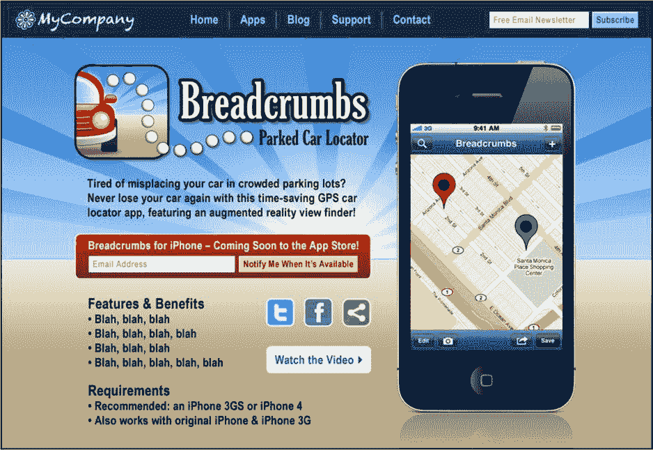

图 10-11. 在预发布阶段，用“上架时通知我”的电子邮件订阅表单替换购买按钮和 App Store 身份徽章

这个策略的便利之处在于，网页上的其他任何内容都不需要移动或修改。一旦你的应用在 App Store 上线，你可以轻松地移除那个显眼的“通知我...”电子邮件表单，重新添加购买按钮和 App Store 身份徽章（如图 10-4 所示）。

#### 为何网站与 Mobile Safari 的兼容性如此重要

AdMob 报告称，高达 93% 的 iPhone 用户直接在移动设备上的 App Store 浏览和购买应用，而只有区区 7% 的用户通过桌面版 iTunes 进行。由于消费者很可能在做购买决定前查看你的应用官网，确保你的网站与 iOS 中的 Mobile Safari 浏览器兼容，对你最为有利。

Mobile Safari 底层使用了强大的 WebKit 引擎，因此它对 JavaScript、CSS 和其他现代网络标准有广泛支持。实际上，大多数网站在 Mobile Safari 中渲染得相当好。但你可以使用一些优化技巧，让你的网站对 iOS 用户更具吸引力：

*   使用 `viewport` meta 标签控制页面缩放。
*   从浏览器的用户代理检测平台。
*   解决 Mobile Safari 缺乏 Flash 支持的问题。
*   增强主屏幕书签功能。

#### “视口先生，我已准备好特写了。”


大多数网页开发人员根据桌面屏幕的平均尺寸来设计页面布局。为了适应大多数网站的典型宽度，`Mobile Safari` 的默认缩放设置为 980 像素的屏幕宽度。这使得所有网站在初次加载时都能很好地适配 `Mobile Safari` 浏览器窗口。

在 `iPad` 的大屏幕上以横屏模式查看网站，其体验与桌面网页浏览器无异，但对于屏幕较小的 `iPhone` 或 `iPod touch` 来说则并非如此。在竖屏模式下，浏览器窗口非常狭窄，因此页面会被大幅缩小，导致文本几乎无法辨认。为了阅读内容和点击文本链接，用户不得不捏合屏幕进行放大。

但是，如果你想设计一个能够适应 `iPhone` 和 `iPod touch` 上 `Mobile Safari` 浏览器独特尺寸的网站，从而免除手动缩放的需要呢？

以 `Tap Tap Tap` 的网页布局为例，其宽度仅略大于 600 像素（见图 10-10）。它被设计成在桌面电脑浏览器的宽屏格式和 `iPhone` 的 `Mobile Safari` 的窄竖屏模式下都能良好显示。然而，`Mobile Safari` 默认的 980 像素宽的屏幕缩放比例仍会将页面的主要内容渲染为屏幕中央的一个微小对象，两侧留下大量未使用的黑色背景边距。解决方案是一个名为 `viewport` 的 `HTML` 标签。在 `Tap Tap Tap` 网站 `http://www.taptaptap.com/` 的 `<head>` 标签内，包含以下 `meta` 标签：

```
<meta name="viewport" content="width=device-width" />
```

`viewport` 标签能被 `Mobile Safari` 识别，但会被所有其他浏览器忽略，因此它只会影响你的网站在具有小屏幕的 `iOS` 设备上的显示效果。将 `content` 参数设置为 `width=device-width`，会告诉 `Mobile Safari` 适当地缩放页面内容的宽度以匹配浏览器的宽度。这使得 `Tap Tap Tap` 的网站呈现出为 `iPhone` 优化过的效果，并且易于阅读（见图 10-12）。它只影响应用的缩放量以及页面定位，网页的原始宽高比保持不变。

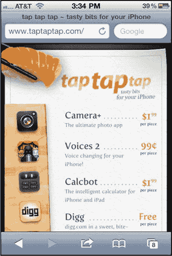

图 10-12. `Tap Tap Tap` 将 `viewport` 标签的宽度设置为匹配设备宽度，这增强了其网站在 `iPhone` 和 `iPod touch` 上的 `Mobile Safari` 中的外观和可读性。

还可以分配其他几个 `viewport` 属性来影响缩放和用户的缩放能力，所有这些属性都由 `Apple` 在 `http://developer.apple.com/library/safari/#documentation/appleapplications/reference/safarihtmlref/Articles/MetaTags.html` 在线文档中记录。如果你希望对 `viewport` 宽度有比设置 `device-width` 值更大的控制，你可以将 `width` 属性设置为特定的像素数。这会在什么情况下派上用场呢？

假设你的页面背景图像是整个设计的组成部分。当 `viewport` 标签设置为 `width=device-width` 时，前景网页内容将填满屏幕；几乎没有边距空间来显示背景图像。如果你的主要内容宽度为 400 像素（并且居中显示），并且你希望在屏幕的左侧和右侧至少看到 50 像素的背景图像，那么将你的 `viewport` 标签设置为以下内容：

```
<meta name="viewport" content="width=500">
```

**注意**  我确实注意到 `Tap Tap Tap` 酷炫的 `JavaScript` 驱动的应用图标动画在 `Mobile Safari` 中滑动效果不佳；它们在 `Mac OS X` 版本的 `Safari` 中完美流畅。我并非批评其精美的页面设计，而是指出一个困扰许多 `iOS` 相关网站的常见问题。即使两个浏览器都使用 `WebKit`，`JavaScript` 和 `CSS` 的支持也存在细微差别。在你的网站中使用复杂的脚本或第三方 `Web` 框架时，请务必在 `Mobile Safari` 中测试你的代码，以确保桌面电脑和移动设备上的浏览体验相似。

如果你需要在 `Mobile Safari` 中调试网页，请打开位于 `iOS 设置` 应用中 `Safari` 的“开发者”面板下的“调试控制台”。`Mobile Safari` 的调试控制台能极大节省时间，因为它能精确定位错误并推荐优化技巧。

#### 使用浏览器检测来提供目标内容

对于为多个不同平台开发应用和游戏的软件发行商来说，修改其主网站以仅适应其中一个平台可能并不合适。`PopCap Games` 就是一个完美的例子，它为 `Mac`、`PC`、`Web`、`Nintendo`、`Xbox`、`PlayStation` 以及各种移动设备（如 `iPhone` 和 `iPad`）开发游戏。

为了在单个网站内推广其所有最新游戏和支持的平台，`PopCap Games` 必须利用桌面网页浏览器的大屏幕优势，这很可能占据了其网站流量的绝大部分。当缩放以适应 `iPhone` 的 `Mobile Safari` 浏览器窗口时，`PopCaps.com` 的主页将变得非常难以导航和阅读（见图 10-13）。`PopCap` 并未尝试根据访问的浏览器动态地更改现有网站设计，而是使用一个简单的重定向将 `iPhone` 用户发送到一个专门针对移动设备优化的网站，该网站仅展示其 `iPhone` 游戏。在 `Mobile Safari` 中访问 `http://www.popcap.com` 会自动将你重定向到 `http://www.popcap.com/iphone/`（见图 10-13）。

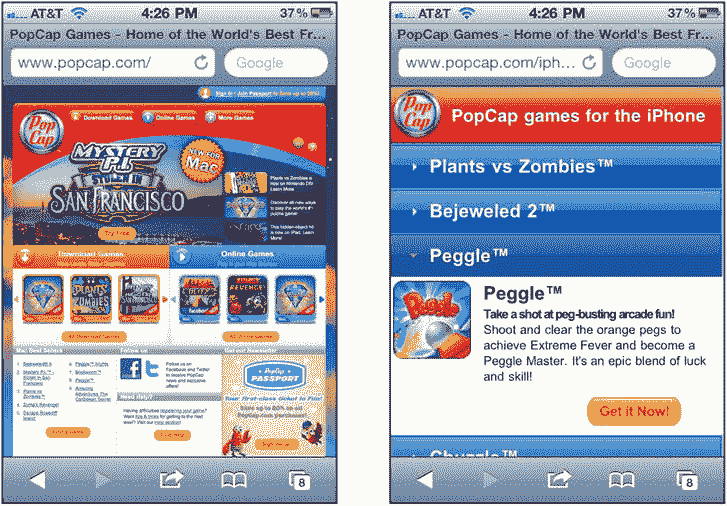

图 10-13. `PopCap Games` 主首页服务于多个平台，在小移动屏幕上难以阅读（左图），因此 `iPhone` 用户会被自动重定向到一个特别的 `iPhone` 专用网站（右图）。

这个简单的重定向技巧是通过首先检测浏览器的用户代理来实现的。以下是来自运行 `iOS 4.2.1` 的 `iPhone 4` 的 `Mobile Safari` 用户代理：

```
Mozilla/5.0 (iPhone; U; CPU iPhone OS 4_2_1 like Mac OS X; en-us) AppleWebKit/533.17.9 (KHTML, like Gecko) Version/5.0.2 Mobile/8C148 Safari/6533.18.5
```

以下是来自运行 `iOS 3.1` 的 `iPod touch` 的 `Mobile Safari` 用户代理：

```
Mozilla/5.0 (iPod; U; CPU iPhone OS 3_1 like Mac OS X; en-us) AppleWebKit/528.18 (KHTML, like Gecko) Version/4.0 Mobile/7C144 Safari/528.16
```

以下是来自运行 `iOS 4.2.1` 的 `iPad` 的 `Mobile Safari` 用户代理：

```
Mozilla/5.0 (iPad; U; CPU OS 4_2_1 like Mac OS X; en-us) AppleWebKit/533.17.9 (KHTML, like Gecko) Version/5.0.2 Mobile/8C148 Safari/6533.18.5
```

浏览器的用户代理可以从任何现代 `Web` 脚本语言中获取。如果用户代理描述显示用户的浏览器来自 `iPhone` 或 `iPod touch`，你的 `Web` 代码可以将用户发送到不同的 `URL`。如果用户代理来自任何其他平台或设备（例如 `Mac` 或 `iPad`），则不执行任何操作，保持在当前网页上。让我们看看如何用 `JavaScript` 和 `PHP` 仅用几行代码来实现这一点。

##### 用于浏览器检测的 JavaScript

将以下代码放在 `HTML` 页面的 `<head>` 标签内。这将导致在页面其余部分加载完成之前，为 `Mobile Safari` 用户执行重定向，从而使过渡快速且无缝。


```html
<script type="text/javascript">
<!--
var os = navigator.userAgent.toLowerCase();
if (os.indexOf('iphone')!=-1) {
    window.location.href = "http://www.mywebsite.com/iphone/";
}
// -->
</script>
```

在 JavaScript 中，用户代理可通过`navigator.userAgent`访问。尽管当前 iPhone 和 iPod touch 上 Mobile Safari 的用户代理都包含`iPhone`，但最好使用 JavaScript 的`toLowerCase()`函数将整个字符串转换为小写字母。这能确保代码始终有效，即使苹果未来更改了大小写。

将用户代理字符串转换为小写格式后，使用`indexOf()`函数搜索`iphone`，因为*iPhone OS*同时被 iPhone 和 iPod touch（但不包括 iPad）所列出。该函数会返回该词首次出现的整数位置。如果未找到该搜索词，则返回`-1`。若返回任何其他数字，则表示与 iPhone 或 iPod touch 匹配，此时 JavaScript 代码会将浏览器重定向至您针对 iPhone 优化的网页 URL。

##### 用于浏览器检测的 PHP

在本示例中，您必须将以下 PHP 代码放在 HTML 页面的最顶部，甚至放在`<html>`标签之前。这段 PHP 代码需要在任何 HTML 代码执行之前运行。

```php
<?
$os = $_SERVER['HTTP_USER_AGENT'];
if (stristr($os, 'iphone')) {
    header("Location: http://www.mywebsite.com/iphone/");
    exit;
}
?>
```

在 PHP 中，用户代理从`$_SERVER`数组的`HTTP_USER_AGENT`属性中获取。与 JavaScript 版本的工作方式类似，此 PHP 代码使用不区分大小写的`stristr()`函数在用户代理字符串中搜索`iphone`。如果未找到搜索词，则`stristr()`返回`False`，网页其余部分继续加载。但如果找到`iphone`这个词，则 PHP 会将识别出的 iPhone 或 iPod touch 的 Mobile Safari 浏览器重定向到您专用的 iPhone 网站 URL。

通过`header()`函数调用重定向后，您应包含`exit()`函数，这将在重定向处理过程中阻止 HTML 页面的其余部分加载。

#### 动态替换 Flash 为 iOS 兼容内容

如果您不需要重定向到独立的 iPhone 网站，而只是希望替换网页上的单个元素（例如 Flash 视频）以使其符合 iOS 规范，该怎么办？您也可以在此处应用浏览器用户代理检测技术。

由于 Mobile Safari 不支持 Flash，如果您的网站包含 Flash 视频或 Flash 动画，您需要为 iOS 设备上的观看提供替代内容（例如 QuickTime 兼容视频或基于 HTML5 的动画）。

这种内容替换可以在网页上动态完成，只需对 JavaScript 和 PHP 浏览器检测示例进行微小调整。

##### 用于 Flash 替换的 JavaScript

将以下 JavaScript 代码放置在您网页中需要根据浏览器型号切换两种内容格式的任何位置。与之前的 JavaScript 示例一样，获取用户代理并检查是否包含`iphone`和`ipad`（因为您也想识别 iPad）。如果找到其中任一单词，则页面正通过 Mobile Safari 浏览，因此显示 iOS 兼容格式。如果计算机上使用的是其他网页浏览器，则安全起见，可加载 Flash 文件。

```html
<script type="text/javascript">
<!--
var os = navigator.userAgent.toLowerCase();
if (os.indexOf('iphone')!=-1 || os.indexOf('ipad')!=-1) {

// 是，通过 Mobile Safari 浏览，因此显示 iOS 兼容的网页内容。
    document.write("在此处放置 QuickTime 或 HTML5 代码");
}
else {
    // 否，其他浏览器，因此改为加载 Flash 文件。
    document.write("在此处放置 Flash HTML Object/Embed 代码");
}
// -->
</script>
```

##### 用于 Flash 替换的 PHP

您可以将以下 PHP 代码放置在您网页中需要根据所用浏览器交换内容的任何位置。如果 PHP 判断用户代理来自 Mobile Safari，则显示 iOS 兼容的网页内容。如果用户代理显示为其他网页浏览器，则您可以加载 Flash 文件。

```php
<?
$os = $_SERVER['HTTP_USER_AGENT'];
if (stristr($os, 'iphone') || stristr($os, 'ipad')) {
?>
    <!-- 是，通过 Mobile Safari 浏览，因此显示 iOS 兼容的网页内容。 -->
<?
}
else {
?>
    <!-- 否，其他浏览器，因此在此处放置 Flash HTML Object/Embed 代码。 -->
<?
}
?>
```

当然，如果您网站没有特定需求必须使用 Flash，最简单的解决方案就是为所有网页视频统一使用 QuickTime 兼容格式。任何拥有 iOS 设备的用户都必须在电脑上安装桌面版 iTunes 以进行设备同步。由于 QuickTime 随 iTunes 一同安装，即使是 Windows 用户也能观看您网站上的 QuickTime 视频。

#### 让主屏幕书签更美观

您可以方便那些频繁访问您网站的忠实粉丝，让他们将网站书签添加到 iOS 主屏幕。

在 Mobile Safari 中为 URL 添加书签时，其中一个选项是“添加到主屏幕”，这会将书签以应用图标的形式保存到 iOS 设备的主屏幕上。点击该图标，它会在 Mobile Safari 中显示该网站。默认情况下，网页的缩略图快照会显示为应用图标，但这个缩略图太小，以至于网站可能无法识别。

幸运的是，您不必接受这种默认设置。

您可以设计自己的自定义图像，用作主屏幕书签图标。与 iPhone 或 iPad 应用图标一样，不要添加圆角或光泽斜面，因为 iOS 会自动为图标添加这些效果。只需为每种 iOS 屏幕分辨率尺寸创建并保存 PNG 格式的图标：

*   旧款 iPhone 和 iPod touch：57 × 57 像素
*   iPad：72 × 72 像素
*   Retina 显示屏 iPhone 和 iPod touch：114 × 114 像素

默认的 57 × 57 像素图标应命名为`apple-touch-icon.png`，但其他两个文件可以任意命名（例如`apple-touch-icon-72px.png`和`apple-touch-icon-114px.png`）。然后将这些 PNG 图像上传到您网站的根目录，并在网页的`<head>`标签内添加以下 HTML 代码行：

```html
<link rel="apple-touch-icon" media="screen and (resolution: 163dpi)" href="apple-touch-icon.png" />

<link rel="apple-touch-icon" media="screen and (resolution: 132dpi)" href="apple-touch-icon-72px.png" />

<link rel="apple-touch-icon" media="screen and (resolution: 326dpi)" href="apple-touch-icon-114px.png" />
```

用户的设备分辨率将决定主屏幕网站书签使用哪个图标尺寸。这对于避免在分辨率更高的设备上保存模糊的小图标至关重要。

如果 URL 指向您 iOS 应用的专用网站，那么不要使用您应用的现有图标，因为这可能会让主屏幕上同时拥有这两个图标的用户感到困惑。相反，应使用替代图像，以便用户能够轻松区分您的应用图标和网站书签图标。如果 URL 指向展示多个应用的公司网站，那么将公司徽标指定为书签图标是一个不错的品牌选择。

### 制造声势：博客、Twitter 和社交网络的力量

现在您的网站已经准备就绪，您终于有了一个在线目的地来推广即将发布的 iOS 应用。但要让人们知道您的新网站，唯一的方法就是走出去，开始建立您的在线受众。

#### 培养在线社区

虽然重要，但将您网站的 URL 和 XML 站点地图文件提交给主流搜索引擎是不够的。不要等待大众来找您。走出去，找到他们。您要开启对话，让人们讨论您的新应用。


##### 社交媒体营销策略

通过将初期营销工作集中在 Twitter、Facebook 和其他热门社交网络上，你可以利用它们的口碑传播力，将感兴趣的消费者吸引到你的网站。由于你的应用尚未在 App Store 上架，这个预发布阶段的目标就是建立产品的知名度和期待感。

我必须提前提醒你，深入社交媒体的世界可能会非常耗时。如果你已经在积极使用 Twitter 或 Facebook，你就会明白我在说什么。请准备好每天至少投入一小时进行在线营销。如果方法得当，你的互动应让人感觉更像是在建立社区，而非商业行为，从而与全球受众建立有意义的联系。

每天挤出一小时或更多时间进行在线营销，看似是一项艰巨的任务，但要在 App Store 中取得成功，每一秒都值得。而且，关键在于这一切都是免费的、自发的广告。加入这些社交网络都不需要费用，唯一的投资就是你的时间。

请务必记住，这一切方法奏效的唯一前提是尊重你的受众。如果你的推文和博客只包含新闻稿和销售宣传，没有人会愿意关注你。要扩大受众，你需要发布人们真正想读的内容。

顶级的社交媒体网站是 Facebook 和 Twitter。由于 iOS 平台上有可用的 Twitter 和 Facebook 第三方框架，毫不意外，它们是 iOS 社区中最为广泛使用的两大社交网络。因此，将大部分精力集中在这两个网站上是明智之举。

#### 博客

正如我之前提到的，维护博客是吸引流量到网站的关键要素。你的 iOS 应用主页面通常不会频繁变动，因为它主要用于向人们介绍你的应用是什么以及他们为什么要购买。而你的博客则是发布所有公告、特别优惠和最新动态的核心在线引擎。

你刚刚发布了一个新的视频预告片或一些截图？写博客吧。你的应用已提交给 App Store 审核团队？写博客吧。你的应用获奖或被其他网站点评？写博客吧。有关于开发经历的有趣故事要分享？是的，你猜对了——写博客吧。

##### 同步你的博客内容

每次发布新的博客文章时，相关的 RSS 源会随之更新，同时也会同步到 RSS 阅读器订阅者和任何转载你博客内容的网站。你还应该在 Twitter、Facebook、Digg、Delicious 以及其他所有能为你带来网站流量并提升应用知名度的主流社交媒体网站上，发布新博客文章的链接。

不要假设所有访问你网站的人都会订阅你的博客 RSS 源或邮件提醒（详见“iOS 应用网站解析”一节中关于 FeedBurner 邮件订阅的说明）。有些人更倾向于通过其他服务（如 Twitter）接收消息。

如果你觉得每次都必须在每个社交网络账号上手动发布博客更新很繁琐，可以使用一些免费的博客服务来自动完成这项任务。

你可以配置 Posterous、Tumblr 和 TypePad，让它们自动将你的博客文章同步到 Twitter 和 Facebook 账户，以及其他多个网站。你甚至还可以设置 Tumblr，让它从你的 Twitter RSS 源中拉取推文并自动发布到你的博客上。

如果你目前使用的博客服务不同，例如 WordPress、Blogger、LiveJournal 或 MovableType，你仍然可以将博客文章自动发布到 Facebook。在本章稍后部分，我将解释如何轻松地将你的博客 RSS 源同步到你的 Facebook 账户。

##### 邀请评论

真正让博客鲜活起来的一个功能是评论功能。赋予读者发言权，能将你的博客从单向阅读的文章转变为充满活力的双向对话。通过鼓励互动，你的博客读者会变得更加忠诚和支持。即使他们不同意你的某篇文章，他们仍然在讨论它、链接它。在建立社区的过程中，并非每个人都持相同观点，这很正常——正是这一点让对话保持趣味性。

不幸的是，大量垃圾评论堵塞了许多博客的评论区，这相当烦人。为了帮助消除来自自动机器人的垃圾信息，请务必使用带有 CAPTCHA 验证码和垃圾过滤器的博客服务，以确保发表评论的是真人。你可能还需要频繁地监控评论，并通过博客的管理后台删除有问题的评论。是的，这可能会耗费时间，但为了提供一个真正的博客环境，这些努力最终是值得的。

虽然有些人选择在 Facebook Page 上进行讨论以避免匿名垃圾评论，但博客评论的便利在于无需注册账号。它没有准入门槛。读者无需加入社交网络或登录任何系统。只需填写评论表单并点击提交按钮即可。

##### 自己搭建博客还是使用第三方博客服务？

如果你熟悉如何在自己的网络服务器上安装和修改博客软件（例如 WordPress 的开源下载版），你将能定制博客的每一个方面，以满足你的特定需求。

如果你不愿意处理配置 MySQL 数据库、安装安全更新补丁和编辑 PHP 文件等问题，可以考虑使用前面提到的众多免费博客服务之一。它们会自动更新服务器上的博客软件，并提供最先进的反垃圾工具来管理评论。如果需要，你还可以自定义博客的外观，使其与你网站的现有页面设计相匹配。例如，我使用 Blogger 远程托管我的公司博客，但其模板经过定制，模仿了我公司网站 Electric Butterfly 的相同设计，以实现两者之间的无缝过渡。

#### Twitter

由于很大一部分 iPhone、iPad 和 iPod touch 用户都在使用 Twitter，因此这是一个你绝对不能忽视的社交网络。如果你在 Twitter 上还没有任何存在感，那么在你继续阅读之前，请帮自己一个忙，立即注册一个免费账号（访问 `http://twitter.com`）。

虽然你可以通过电脑和移动设备上的网页浏览器轻松访问 Twitter，但你可能会更喜欢使用专门的客户端应用来随时掌握 Twitter 动态。受欢迎的选择有 Twitterrific、Echofon、TweetDeck 以及 Twitter 官方的 iOS 应用。要探索所有适用于 Mac、Windows、Linux 和 iOS 的选项，可以访问 oneforty 的综合 Twitter 应用目录：`http://oneforty.com`。

Twitter 的微博/即时消息功能不仅是一种与客户实时沟通（涵盖从技术支持到功能请求等一切）的绝佳方式，也是一个非常被认可的推广 iOS 应用和游戏的平台。除此之外，许多主要的应用评测网站和新闻博主都会密切跟踪 Twitter 上的相关趋势和话题，因此你的推文可能会为你的应用吸引更多的媒体报道！

根据 Kisky Netmedia 的 Jonathan Deamer 和 Katie Lips 撰写、并由 Northwest Vision and Media 支持的《致胜 iPhone 策略》报告（`http://www.scribd.com/winningiphonestrategies`），iPhone 用户发现应用的第四大最具影响力途径是 Twitter 上的推荐，仅次于前三大途径：口口相传、在线评测和浏览 App Store。这再度印证了 Twitter 作为 iOS 开发者强大营销工具的重要性。

##### 管理 Twitter 账号


在 Twitter 上建立你的存在感时，你应该决定如何使用该服务。

有些开发者会为自己创建一个 Twitter 账户，并为他们的 iOS 应用创建另一个独立账户。这样，他们可以使用应用专用账户发布相关新闻和处理支持查询，而个人账户则用于发布关于其他产品或杂项、非业务内容的推文。一些组织拥有一个专门发布公司新闻的账户，然后为公司的每位员工分配独立的账户。如果你的企业由不止一名开发者组成，或者你希望将一个 Twitter 账户仅用于个人用途，那么这两种方法都很有效。

如果你是独立开发者，你可能会发现将精力整合到一个单一的 Twitter 账户中会容易得多。而且，当你拥有几款 iOS 应用时，在一个 Twitter 信息流中交叉推广它们会非常有益。如果你的某款应用变得流行并为你带来大量 Twitter 关注者，这一点尤其有帮助，因为你将拥有一个渴望了解你发布任何其他产品的庞大受众。

##### 获取关注者

“关注者”是指那些选择关注你 Twitter 信息流的用户，这意味着你的推文会出现在他们的时间线（即他们所关注用户发布内容的流）中。你积累的关注者越多，你的受众群体就越大。

由于扩大受众群体是这里的主要营销目标，那么如何获得更多关注者呢？

啊，这可能是关于 Twitter 最常被问到的问题。

当然，很多第三方服务承诺，如果你同意关注他们要求的人，就能增加你的关注者数量，但这是一条错误的途径。关键不在于让任何人和所有人都关注你，以换取你关注他们。诚然，采用这种策略你的受众会呈指数级增长，但数量并不一定等于质量。通常，这些人只关心一件事：增加他们自己的关注者数量。你对他们来说只是一个数字。他们中的大多数（如果不是全部的话）并不真正关心你想说什么——他们甚至可能没有 iOS 设备。

不要担心有多少人关注你。专注于培养高质量的受众，即那些对 iOS 应用真正感兴趣的人。让我们看看实现这一目标的几种方法。

- **你关注谁很重要。** 建立受众群体从你自身开始。在 Twitter 上搜索那些对你影响最大的人——你最喜欢的应用开发者、发布商、博主、记者、朋友和同行。每当他们发布与你观点相关的有价值的内容时，转发它。他们可能会注意到你偶尔的转发并回复你。出现在有影响力的人的视野中绝对没有错！谁知道呢，他们甚至可能会回关你。即使他们没有回关，你关注谁也能说明很多问题。偶然发现你 Twitter 个人资料的人可能会在决定是否关注你之前，先看看你关注了谁。
- **关注你的粉丝。** 通过向忠诚的关注者回报一些关爱来与他们建立联系。没有什么比互相关注更让人愉悦的了。这并不意味着你需要关注每一个关注你的人，但如果他们的推文让你感兴趣，那将是感谢的终极姿态。
- **与你的社区互动。** 如果有人通过 Twitter 联系你并提出评论或问题，始终要回答他们。Twitter 不是 *对* 着人们说话，而是 *与* 人们对话。在 Twitter 上进行公开对话不仅能将其他人吸引到讨论中，还能展现人性化的一面，证明你不是一个只会吐出营销信息的自动垃圾邮件机器人。如果你觉得你的 Twitter 信息流被某一场对话主导了，你可能希望关注该用户并通过私信继续讨论，以避免疏远你的其他关注者。如果有人行为粗鲁，你可以选择屏蔽他们，但这永远应该是最后的手段。大多数情况下，人们只是希望被倾听。通过关注你，他们同意倾听你的声音，所以你也听听他们的声音，这才公平。
- **高质量的内容为王！** 不要只是不停地发布关于你应用的信息，没完没了地发送评论和公告的链接。如果你 24/7 只发布营销垃圾信息，没人会关注你。这很可能是让你失去现有关注者的一个万无一失的方法。给人们一个关注你的理由。你的推文应该展现出一个既有趣又有料、真实的声音。像博客一样，你的 Twitter 帖子应该反映你的个性甚至你的观点（只要它们不具冒犯性或对你的营销使命适得其反）。如果你发布了一篇博文，那么发一条推文并附上链接！关注者会传播和转发的是人，而不是企业实体，所以让他们看到产品背后的人。
- **忠于你的声音。** 为了留住你的关注者，保持话题专注很重要。如果你因发布关于 iOS 游戏开发的推文而闻名，那么花整整一个月时间只谈论房屋翻新，很快就会让你的关注者数量锐减。他们关注你，是为了向你学习宝贵的游戏编程专业知识，而不是为了在成百上千条关于铺设新浴室瓷砖的推文中跋涉。分享生活中的个人事件是好的，尤其是当你的受众有相似兴趣时，但这些帖子应该穿插在你的主要话题推文中。只专注于一两个主题也有助于吸引新的关注者。如果有人正在 Twitter 上搜索`iPhone dev`来学习和与其他程序员建立联系，并且他们偶然发现了你的一条推文，那么只有当你的大部分其他帖子也与 iOS 开发相关时，他们才最有可能关注你。
- **转发！** 如果有人发布了你认为你的受众会喜欢的内容，就转发它。Twitter 建立在因果报应的精神之上。善有善报。花时间推广他人的推文要超过推广你自己，这样你会与关注者建立更深的联系。他们甚至可能更频繁地 *转推* 你的帖子作为回报。记住，这不仅仅是找到你可以单向宣讲的人，而是在社区内建立协同效应。
- **把握推文时机。** 很少有人会整天都盯着 Twitter。而且每晚还有那个该死的睡眠障碍。除非你的关注者使用的客户端应用能跟踪他们在时间线中的当前阅读位置，否则他们可能会错过你的一些帖子。当然，错过的那条推文往往是你花了十分钟精心编写的完美推文，或者是你已经计划数周、至关重要的产品公告。我们都生活在不同的时区，有不同的作息时间表，因此你的时机选择至关重要。在洛杉矶时间早上 8 点发送一条推文，可以覆盖相当多地区白天时段。例如，那时芝加哥是上午 10 点；纽约是上午 11 点；伦敦是下午 4 点；巴黎、柏林和罗马是下午 5 点。Twitter 允许你每 8 小时重复发送一条推文，因此如果在洛杉矶时间下午 5 点再次发送同样的消息，那么香港是早上 8 点，东京是上午 9 点，澳大利亚悉尼是上午 11 点。由于你的一些关注者会看到你 *所有* 的推文，所以不要把重复发帖变成一种习惯。如果它开始变得像垃圾信息，你可能会失去关注者。但偶尔为了特殊公告而重复一条推文是可以容忍的，并且对于触达更多人来说非常有效。


##### 自定义个人资料

Twitter 提供了精美的背景图片和颜色选择，可用于美化你的账户页面。虽然颜色很容易修改，但不要满足于无数个人资料中都使用的相同默认主题。用自己定制的背景图片和头像图片，让你的页面独一无二、展现个性。利用这一免费的营销机会，直观地展示你的 iOS 应用和品牌形象！

关于你的头像图片，如果你维护两个 Twitter 账户——一个用于公司，一个用于个人使用——你很可能会想通过为公司资料使用公司标识、为个人资料使用自己的照片来区分两者。对于使用单个 Twitter 账户的独立开发者，我强烈建议使用你自己的照片作为个人资料图片。即使你会发布关于软件产品和 iOS 新闻的推文，照片也能增添个人色彩。人们喜欢看到自己关注的人是谁。

当我最初加入 Twitter 时，我将个人资料名称设为 Electric Butterfly，并上传了公司标识作为头像图片。我发的推文不多，结果很少有人关注我。在观察了其他人在 Twitter 上的运作方式几个月后，我决定效仿他们的做法。我将个人资料名称改为 Dave Wooldridge，并用我的照片替换了头像。当我为我的 Twitter 形象提供了一个真实面孔和姓名，并有意更频繁地发布推文后，我的关注者数量开始迅速增长。

虽然所有 Twitter 客户端都支持显示头像图片，但一个人的背景图片只有在访问 Twitter.com 上的个人资料页面时才能看到。即便如此，在 iPad 上查看 Twitter 网站时，主要内容会缩放以填充 Mobile Safari 屏幕的宽度，从而遮挡背景图片。而在 iPhone 上，Mobile Safari 会加载针对移动设备优化的 Twitter 版本，该版本排除了自定义背景。但这些都不会降低自定义个人资料背景图片的重要性。许多人会在决定是否关注你之前，通过桌面网页浏览器查看你的个人资料页面。

在 Twitter 设置页面的“设计”部分，你可以上传自己的自定义背景图片文件。由于这是宝贵的屏幕空间，背景的设计应能有效推广你的公司或 iOS 应用，而不会被浏览器中央的 Twitter 主要内容所遮挡。为了适应最常见的屏幕尺寸，这需要一个设计主题，该主题位于左上角，并向右侧和下方延伸。看看一些自定义背景。在有趣的网站 `http://twitterbackgroundsgallery.com` 上查看真实的 Twitter 账户的精彩集合，你就会明白我的意思。

对于分辨率为 1280 × 800、1900 × 1200 甚至更高的宽屏显示器，建议你的背景图片宽度至少为 1600 像素。由于网页浏览器在此类大屏幕上通常不会最大化至全宽，这个尺寸应该没问题。但网页会向下滚动，因此网页浏览器的高度很可能从上到下占满屏幕。为了获得最佳效果，请将图片高度设置为至少 1300 像素。

如果你的图片渐变为与背景颜色相同的纯色，那么图片可以短得多。当 Twitter 的“平铺背景”设置未被选中时，图片结束处会透出背景颜色，但由于颜色相同，在查看者看来会是无缝的。这正是为推广虚构应用 Breadcrumbs 而设计的示例背景图片所采用的方法（见图 10-14）。该背景图片仅有 700 像素高，但由于背景颜色设置为与汽车下方的地面相同的棕色，造成了地面在其下方无限延伸的错觉。


图 10-14. 为虚拟应用 Breadcrumbs 设计的 Twitter 背景图片，为中心显示的 Twitter 主要内容页面留下了充足的空白空间

查看 图 10-14，注意 iPhone 应用图形位于最左上角区域，图片其余部分相当空旷，只有简单的地平线和引向屏幕之外的导航面包屑路径。这是有意为之，以便为将在浏览器屏幕中央显示的 Twitter 主要内容页面留出充足空间。技巧在于创造出独特而引人注目的内容，同时又不至于在视觉上过于强势。

基于平均屏幕尺寸，我建议将主要设计元素限制在背景图片左上角宽 180 像素、高 660 像素的区域内。将主要图形限制在这个安全区域内，有助于防止你的背景视觉效果被 Twitter 页面内容遮挡（见图 10-15）。由于 Twitter 的内容区域相当宽，你可能想尝试将设计区域的宽度限制在 180 像素以内，以适应较小的屏幕，比如笔记本电脑。

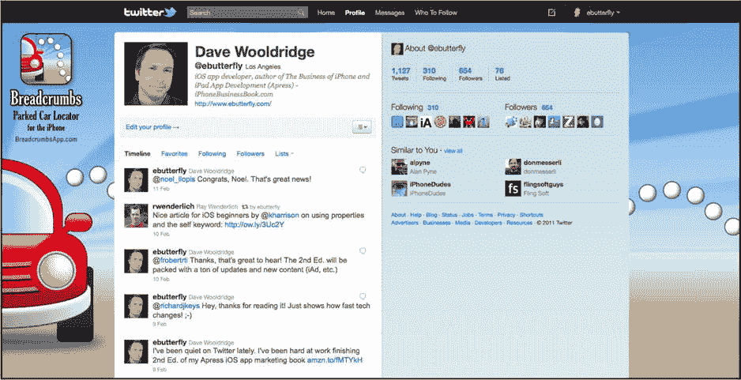

图 10-15. 将主要图形限制在左上角 180 像素宽（或更少）的范围内，可确保在大多数台式机电脑屏幕上查看时，图像不会被 Twitter 主要内容遮挡

对于你们中认为 图 10-15 背景中包含 iPhone 应用网站 URL 有些过分的人，让我第一个说这确实非常有效。不是因为似乎每个人都在这样做（他们确实如此），而是因为它确实管用！

在我将自己的 Twitter 背景图片更换为推广我的一些 Electric Butterfly 产品并列出网站域名后，我开始收到更多询问这些产品的推文。我还发现这些网址的流量显著增加。这让我很惊讶，因为你不能在 Twitter 背景图片中添加有效的超链接，这意味着人们必须手动将该网址输入浏览器才能访问该网站。但如果粉丝足够好奇，他们就会这么做，特别是如果网址短且容易记住（这也是为你应用网站注册专用域名的另一个原因）。

最后但同样重要的是，在自定义你的 Twitter 个人资料时，不要忘记在“简介”字段中添加一些关于你自己和应用的信息，并在“网站”字段中填入你的网站网址。人们想知道你是谁以及你做什么。我个人不会关注那些留空这些字段的人。你的个人资料简介文本和网站网址的妙处在于，它们在所有 Twitter 客户端应用和网页浏览器中都可以访问——即使是那些不支持 Twitter 自定义背景图片的应用和浏览器。

##### 关键词和主题标签

在你匆忙写下下一条推文之前，重要的是要知道你消息的措辞会极大地影响其成功触达目标受众。你需要使用那些能让阅读时间线的用户快速识别，并能通过搜索 Twitter 特定关键词找到的词语。

例如，如果在推文中谈论你的 iPhone 应用，不要将其称为一个泛泛的“应用”。你知道它是一个 iPhone 或 iPad 应用，但那些通过转发或 Twitter 搜索了解到你的新人，可能不知道你的应用支持哪个平台。大多数人会搜索 *iPhone* 或 *iPad*，因此请始终在与应用相关的推文中包含支持的设备名称。


# 排版后的 Markdown 文档

不要假设每个人都知道你的应用是做什么的。如果你在推特上分享应用在 iTunes App Store 的链接，不要只发布应用名称和网址。我知道字数限制是 140 个字符，但我相信你还能多挤出几个字符来（尤其是使用像 `Bit.ly` 这样的短网址服务时，正如本章前面讨论过的）。不要含糊其辞。哦，原来是一款用于定位停放车辆的 iPhone 应用？啊，那我正好需要这样一个功能。而且你还在网址后面贴心地标注了“(iTunes)”，提醒我这个链接会在我的电脑上启动 iTunes。这非常方便且尊重用户。

除了用恰当的关键词精心撰写推文之外，你还可以加入话题标签。`话题标签` 是前面带有数字符号（`#`）的关键词。它们的特别之处在于，推特和大多数第三方客户端会将话题标签显示为可点击的文本链接。

点击一个话题标签，就会列出近期包含该标签的一组推文。通过将你的推文加入热门话题标签组，是提高内容被发现率的绝佳方式。那些没有关注你、甚至不知道你推特 ID 的人，也可能通过话题标签列表偶然看到你的推文。

只是要小心不要过度使用话题标签。不要在每条推文中都插入话题标签，尤其不要用 `#多个` `#话题` `#标签` 来 `#污染` `#一条` `#推文`，否则你的帖子会难以阅读，看起来像垃圾信息。

对于那些特别重要、值得增加一点曝光度的精选推文，可以把其中一个关键词转换成话题标签。如果你的词语中没有热门的标签，那就把你想要的话题标签附加在推文末尾。例如，当我发布对 iPhone 开发者同行有益的价值链接时，我经常会加上知名的 `#iphonedev` 话题标签。

为了更精准地锁定已有话题标签和热门搜索关键词，可以查看以下便捷资源：

-   Twitter 搜索 (`http://search.twitter.com`)
-   Hashtags.org (`http://hashtags.org`)
-   What the Trend (`http://www.whatthetrend.com`)

##### Twitter 列表

列表代表了粉丝数量不再像过去那样重要的又一个原因。在你的推特账户中，你可以创建一个新列表并赋予其独特的名称。由于推特会为其分配一个域名——例如 `http://twitter.com/ebutterfly/iphonedev`——因此最好使用不带空格的名称。

列表提供了一种将用户分组的途径，让你更容易关注特定话题。列表之所以削弱了粉丝的重要性，是因为你可以关注一个列表，而不需要关注列表里的所有人。而且，你还可以创建一个包含你未关注用户的列表。

一些应用开发者创建了他们喜爱的 iOS 相关推特用户的列表，其中包括同行开发者、评测网站和博主。这是获取 iOS 开发者社区日常动态快照的绝佳方式。许多开发者会关注其他开发者的列表，以此来与有影响力的主要人物建立联系。

创建你自己的列表可以为你吸引新的粉丝，所以确保把你自己也加入你的列表中。这是很多人往往容易忘记的事情。

如果你整理出了一个很棒的列表，并将其提交到像 Listorious 这样的大型推特列表目录，那么新用户可能会关注你的列表，甚至可能也关注你的推特账户。这是在推特上被发现、让你的推文触及更广泛受众的另一种方式。

不要只创建与 iOS 相关的列表。如果你的应用与某个特定主题相关，比如音乐或写作，那就为那个主题创建一个列表。通过创建这样的列表，你可以吸引那些对这些主题感兴趣的新粉丝。如果他们拥有 iOS 设备，那么你在这些列表中的推文就会将你的应用展示给那些可能原本不知道它的潜在客户。

如果有人把你加入了他们的列表，这意味着他们认为你的推文提供了足够价值，值得成为特定群体的一员。一定要感谢他们的善意之举。同样，如果有人关注了你的列表，也要为此感谢他们。在这样一个缺乏人情味的网络世界里，你可能会惊讶于一个简单的“谢谢”能换来多少好感。

##### 管理信息流

你在推特上发布的所有内容（不包括转推）都应该引导用户访问你的网站。这包括你推文中的任何照片或视频。

诚然，许多推特客户端应用使得从你的 iPhone 相机上传照片到像 Flickr、TwitPic 和 yfrog 这样的媒体分享网站变得极其简单，但这并非推文的最佳用途。如果有人有兴趣查看你应用里的酷炫截图或视频演示，你应该将这些媒体文件托管在你自己的网站上，放在那些能提供你产品更多信息的网页内。

即使你展示的是你不想发布在主网站上的早期 Alpha 测试版截图，只需链接到你服务器上的一个独立页面，作为你推文的预览页面。这样，你就可以掌控页面上的信息和内容。此外，你可以将其设计成能体现你应用视觉品牌形象的样子，而不是使用第三方媒体分享网站的通用页面。

还记得我之前提到过，你应该在像 `Bit.ly` 这样的短网址服务上注册一个免费账户，以便追踪你在推特上发布链接的点击量和转推量吗？如果你尝试用两种不同的措辞来推文介绍你的 iOS 应用，那就使用两个不同的 `Bit.ly` 网址，这样你就能追踪哪种措辞在点击量方面更成功。这将帮助你精炼你的营销信息，使其成为有效且引人注目的推文！

对于那些准备好使用高级管理工具深入探索推特世界的朋友，可以查看 oneforty 庞大的第三方应用和服务目录，这些工具可用于追踪取消关注、推特营销活动、粉丝位置、垃圾邮件过滤器等等。基于推特，确实形成了一个令人惊叹的庞大细分产业——多到无法在此一一列举。其中一些工具不如其他工具实用，因此要谨慎选择。

#### Facebook

iOS 版 Facebook SDK 在应用开发领域被广泛使用。在当今的移动应用和游戏中，Facebook 登录与 Twitter 登录一样普遍。如果你还没有 Facebook 账户，你需要去 `http://www.facebook.com` 注册一个，并用它来与朋友和同事进行私人互动。

尽管 Facebook 使得在 iOS 项目中与其 API 对接变得极其简单，但你在该社交网络内的营销策略需要与在 Twitter 上略有不同。由于核心目标都是扩大你的受众，之前讨论的所有适用于 Twitter 的礼仪规则同样也适用于 Facebook。区别在于，虽然你可以在一个 Twitter 账户中混合发布个人和商业推文，但在 Facebook 上建议将两者分开。

在 Twitter 上，你可以选择不关注每一个关注你的人，但在 Facebook 上则不然。如果有人将你添加为 Facebook 好友，而你批准了请求，此人也会自动被添加到你的好友列表中。基于这个原因，你需要为你的业务创建一个 Facebook 主页。对于那些有兴趣关注你的 iOS 应用新闻和更新的用户，他们只需“赞”一下你的 Facebook 主页即可。这为你提供了一种扩大受众的方式，同时不必被迫将每一个这样的人添加到你的个人好友列表中，因为这些关注者会转而成为你 Facebook 主页的粉丝列表中的一员。

##### 创建 Facebook 主页


在社交网络巨头 Facebook 上为您的主页或公司主页创建一个粉丝主页是在这个世界最流行的社交网站上与人们建立联系的绝佳方式。唯一的要求是，您必须是您所创建的主页所反映的业务或产品的所有者或官方代表。

与 Twitter 不同，会员无法在帖子中搜索关键词。Facebook 的搜索引擎仅限于搜索会员姓名。如果您只有一个以自己名字命名的个人 Facebook 帐户，那么您在 Facebook 搜索中不会因为您的 iOS 应用名称或公司名称而被列出。但是，如果您为您的应用或公司创建了 Facebook 主页，相关的 Facebook 搜索就能找到它。

要创建一个 Facebook 主页，您必须拥有一个个人 Facebook 帐户，因为该帐户将被分配为该主页的管理员。如果您计划创建多个应用，我建议您将所有粉丝都聚集到一个公司 Facebook 主页下，而不是为每个 iPhone 或 iPad 应用分别开设独立的账户。一个集中的主页不仅更容易管理，还能让您向同一批受众交叉推广您的产品。

登录您的个人 Facebook 帐户，然后访问官方的“创建主页”网址 `http://www.facebook.com/pages/create.php`。

从提供的选项中选择“公司、组织或机构”来为您的业务创建主页，或者选择“品牌或产品”来为特定应用创建主页。然后，系统会提示您为新主页分配适当的类别。如果您是为您的应用开发业务设立主页，您很可能选择“计算机/技术”作为类别。如果您在“品牌或产品”下构建应用主页，您的类别应为“软件”。

新的 Facebook 主页创建完成后，在“简介”选项卡中添加您的公司描述，并为主页的主图添加您的徽标或应用图标。然后发布关于您应用的信息，包括开发新闻、更新和特别优惠。您甚至可以发布即将推出的新功能的预览截图，来激发粉丝对未来版本的期待。

##### 与粉丝建立联系

既然您的 Facebook 主页已经上线并运行，是时候宣传它了，鼓励人们点击“赞”按钮成为您主页的粉丝！要让您的页面获得一个酷炫的 Facebook 域名（例如 `http://www.facebook.com/iTunes`），至少需要有 25 个人为您的页面点赞。

向您现有的博客和 Twitter 受众进行推广完全没问题。让他们知道您有了一个专门的 Facebook 主页，并邀请他们通过点击“赞”按钮来表达支持。不出所料，Facebook 甚至提供了一种经济实惠的方式，让您在其整个网络中为您的页面做广告以吸引新粉丝。

与粉丝沟通时，请在您的 Facebook 主页时间线上发布状态更新、笔记、照片、链接等内容。为您主页点赞的人会在他们自己的 Facebook 信息流中看到您的帖子。有时，您可能需要向每位粉丝的收件箱广播重要公告。为此，请点击您主页的“编辑信息”链接，然后在“编辑信息”的“营销”选项卡中，点击“发送更新”。请记住，没有人喜欢收到一连串的新闻稿和营销信息，因此，为了留住粉丝，请尽量不要滥用这种直接的沟通渠道。

为了打破时间线上与应用相关的营销帖子的单调，请尝试穿插一些粉丝可能也感兴趣的各类相关新闻、照片和视频。如果有人在您的时间线上发表评论，请回复他们，以在您的 Facebook 主页内营造一种社区感。

##### 追踪您的 Facebook 营销效果

Facebook 为其主页和开发者提供自己的免费分析服务：Facebook 分析。当以管理员身份登录您的 Facebook 主页后，点击最右侧列中的“查看分析”链接，即可查看关于您主页的指标数据。

如果您正在投放 Facebook 广告或从其他营销材料将人们引导至您的 Facebook 主页，那么追踪访客流量会特别有用。

##### 导入博客，输出到 Twitter

随着您的营销范围扩展到越来越多的社交网络，首要问题是时间。在多个网站（如博客、Twitter 和 Facebook）发布相同的内容可能非常耗时。幸运的是，社交媒体近期的一个趋势是能够在网络间聚合内容，使发布更加便捷。您只需在一个地方发布消息，它就会在多个网站上发布。

正如我之前提到的，一些博客网站（如 Tumblr 和 Posterous）允许用户自动更新 Twitter 和 Facebook，并附上他们新博客文章的链接。Facebook 也通过其“导入博客”功能提供了一种实现方式。

您是否希望您的新博客文章自动发布到您的 Facebook 主页上？请按以下步骤操作：

1. 在您的 Facebook 主页资料中，在搜索字段中输入 **Notes**。
2. 从动态下拉菜单的结果中，选择 Facebook 的“记事”应用。
3. 在“记事”页面上，从左侧列中选择“编辑导入设置”。系统会提示您提供博客的 RSS feed URL（参见 图 10-16）。输入 URL 并点击“开始导入”。

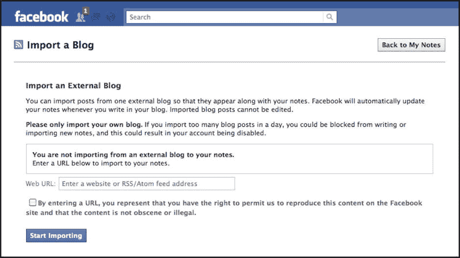

图 10-16. 提交您博客的 RSS feed URL，以将博客文章自动导入为 Facebook 记事

完成这些步骤后，Facebook 将自动将您的新博客文章发布到您的 Facebook 主页的记事中。

如果您希望您的 Facebook 帖子能自动发布到 Twitter，Facebook 在 `http://www.facebook.com/twitter` 提供了支持（参见 图 10-17）。将您的 Twitter 帐户关联到您的 Facebook 主页时，您可以选择分享您在 Facebook 上发布的所有内容，或者仅分享特定类型的帖子（例如状态更新和记事）。

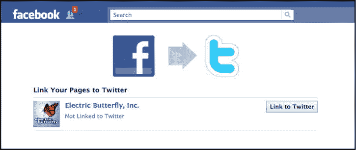

图 10-17. Facebook 提供了将您主页的帖子分享到 Twitter 帐户的功能

反过来，您也可以通过安装 Andy Young 的方便 Facebook 应用 Selective Tweets（`http://www.facebook.com/selectivetwitter`），将您的推文作为状态更新发布到您的 Facebook 主页。这个应用比将您的 Twitter RSS feed 作为博客导入要强大得多，因为它允许您通过使用特殊的 `#fb` 标签，来选择哪些特定的推文被发布到您的 Facebook 主页。这可以防止非业务相关的推文意外混入您公司的 Facebook 主页。要使 Selective Tweets 应用正常工作，您的 Twitter 帐户的推文不得被保护。

##### 其他社交网络和书签网站

显然，Twitter 和 Facebook 并不是镇上唯一的社交媒体巨头。根据您开发的应用或游戏的类型，其他一些网站可能提供更精准的目标人群。

虽然 Myspace 可能已被当前的王者 Facebook 夺走风头，但 Myspace 在音乐社区中仍然是一个流行的社交网站。无数新晋艺术家通过 Myspace 被发现，进而获得了丰厚的唱片合约和备受瞩目的音乐事业。如果您的应用与音乐相关，那么 Myspace 上的音乐人群可能正是您要接触的完美受众。是时候揭晓您自己的 Myspace 个人资料页面，与其他音乐爱好者建立联系，并推广您的 iOS 应用了！


如果你的应用面向企业用户，那么你绝对应该通过 `LinkedIn` 进行推广。除了在你的 `LinkedIn` 个人资料中包含应用网站的链接外，这个流行的商业社交网络还托管着数千个活跃的讨论组。挑选与你应用目标受众最匹配的群组，并通过发布应用相关的信息和博客文章的链接来推广它。这是一种接触企业高管的绝佳方式，他们可能不会在拥挤的 `App Store` 中自己找到你的 `iOS` 应用。

`LinkedIn` 也让你可以轻松地将你的 `Twitter` 帖子发布到 `LinkedIn` 页面。在你的 `LinkedIn` 个人资料中激活你的 `Twitter` 账户，然后在你的推文中附加 `#in` 或 `#li` 标签，这样这些精选消息也会作为 `LinkedIn` 状态更新发布。

为了获得更多曝光，别忘了将你的博客文章和已发布的网络文章提交到专注于分享新闻和社交书签的网站，例如 `Digg`、`Delicious`、`Technorati`、`Reddit` 和 `StumbleUpon`。

##### 在论坛、群组和博客上发表评论

做一些研究，找到与你 `iOS` 应用目标受众相关的在线论坛、留言板和博客。如果是一个音乐应用，去探索最流行的音乐论坛和群组。如果是一个写作应用，去调查哪些网站是作者们最常去的地方。既然你为一个特定的细分市场开发了一个应用，可以合理地假设你对该话题有所了解。通过在相关的特殊兴趣论坛上提供帮助或是在博客上发表评论，将你的知识好好利用起来。

是的，我这是在为你增加额外的工作，但这是有充分理由的。永远不要在这些网站上匿名发帖。大多数论坛、群组甚至博客都支持会员登录，以使频繁发帖更加方便和安全。在有要求时，注册成为免费会员并填写所有个人资料信息。你希望在这些网站上的存在能够通过姓名、`URL` 链接和照片被清晰地识别出来。

一些博客使用像 `Gravatar` 这样的第三方头像系统。提前注册并准备好一个 `Gravatar` 个人资料是值得的。如果支持签名，那么利用那一小段懂 `HTML` 的空间来推广你的应用和网站。

明白我的意思了吗？每次你在论坛帖子或博客文章下发表评论时，你的照片、姓名、网站链接以及一个含蓄的应用引用都会同时呈现。只要你不过度使用，用明显的销售宣传来垃圾轰炸，这对所有人来说都是一个双赢的局面。在帮助他人的同时，通过在你的会员 `URL` 和签名中提及它，你也在提高即将推出的 `iOS` 应用的知名度。

##### 但不要噪音太多：维护专业声誉

由于在像 `Twitter` 和 `Facebook` 这样的社交媒体网站上，非正式对话的数量巨大，人们往往很容易忘记，你所说的话不仅仅存在于你和参与者之间——它们实际上可以被你网络中的任何人看到。就 `Twitter` 而言，任何人都可以访问你的个人资料页面并阅读你的推文，无论他们是否关注你。你的在线行为是在一个非常公开的全球舞台上进行的。

虽然鼓励表现得平易近人，但你仍然代表你的产品和/或公司。你的在线行为应该是值得尊敬的，要知道你所说和所链接的内容会给全球的潜在客户留下持久的印象。如果你觉得这个建议显而易见，不值得一提，那么你已经领先了一步。你可能有足够商业头脑认识到这一点，但你会惊讶地发现，有多少专业开发者对自己所塑造的整体形象浑然不觉。

多年来，我见过一些开发者网站，他们将软件产品与他们对职业摔跤明星以及《太空堡垒卡拉狄加》中性感赛昂美女的在线“圣地”一起推广！是的，你自己心里清楚。如果你还在上大学，在车库里经营你的软件业务，这没问题，但世界不需要知道这个。事实上，你希望你的网站和社交媒体账户能够呈现出一种专业的形象，让消费者对你产生信心。他们想通过购买你的应用，知道他们是在投资一个会持续更新和支持产品的开发者。如果他们怀疑这对你来说仅仅是个爱好，你就可能会错失这些潜在的销售机会。如果对你没有信心，他们怎么能对你的产品有信心呢？

以下是一些需要考虑的指导方针：

-   **将自己塑造成专业人士。** 始终展现你希望在他人眼中呈现的专业形象。无论你是 18 岁还是 68 岁，是高中刚毕业还是最近退休，这都不重要。互联网拉平了竞技场。你网站的视觉设计、它所提供的内容类型，以及你通过电子邮件、推文和博客文章向他人展示自己的方式，都为你本人以及你的业务方式描绘了一幅生动的画面。这不是为了营造虚假的假象，而是要在专业的光照下展示真实的自己。
-   **NSFW？不适合发布！** 如果你正在使用博客和社交媒体账户来推广你的 `iOS` 应用和业务，请不要说脏话，也不要发布他人可能觉得冒犯的笑话、搞笑图片或视频。仅仅因为你加上 `NSFW`（不适合上班时间观看）的警告并不能让它变得可接受。你觉得有趣的东西，别人可能会觉得极其冒犯。而那些人正是你刚刚失去的潜在销售额。我不想扫兴。我们都想找点乐子，但目标是卖出更多的应用，对吧？
-   **不要将商业与政治或宗教混为一谈。** 最能引起人们强烈反应的两个话题是政治和宗教。无论你的观点如何，总是有同样激情的人在反对的那一边。这是一场你无法赢得的对话。如果你正在使用像 `Twitter` 和 `Facebook` 这样的社交网络来推广你即将推出的 `iOS` 应用，利用你的受众，宣扬你自己的政治或宗教议程，是疏远潜在客户最快的方式。
-   **控制你的情绪。** 永远不要在愤怒时发推文、评论或发布博客文章。虽然你通常可以在事后删除大部分内容，但它们的副本会留在网络上，在未来多年困扰你。你可能已经删除了那篇糟糕的博文，但你博客的所有电子邮件订阅者仍然可以在他们的收件箱里找到它。别忘了 `Google` 缓存的“大象记忆”。你的在线咆哮可能会无限期地存在于 `Google` 的搜索数据库中。
-   **以牙还牙解决不了问题。** 如果有人对你的应用或博文发表了负面评论，不要恶语相向。对他人恶语相向——尤其是在网上，一切都被记录、缓存和存档——可能会让你惹上诽谤官司。你可能会笑，但这确实发生过。通过采取高姿态，保护你的声誉和个人资产。
-   **客户至上。** 客户可能并不总是对的，但他们应该始终得到你最大的尊重和关注。及时并以礼貌的方式回复你收到的每一封电子邮件和每一条推文。没有愚蠢的问题，只有愚蠢的回答。好吧，也许确实有愚蠢的问题，有些客户可能会让你恼火。但如果你在 `Twitter` 上以任何方式用讽刺的公开回复让对方难堪，你可能失去的不仅仅是一个客户——那个人现在可能会警告朋友和家人避开你的产品。要愿意不遗余力地让你的客户满意。如果他们感到被重视，他们会用忠诚来回报你。

### 人人都爱赢家：收集发布前的评价和推荐


虽然通过社交媒体制造预发布热度很重要，但你也应该开始联系那些你希望他们能报道你应用即将发布的公告并发表评测的有影响力的记者和博主。

正如我之前所说，如果你没有耐心或时间投入到预发布宣传中，那么聘请一家专注于移动应用营销的第三方公司可能是值得的。在谷歌搜索`iPhone app marketing`后，你会发现有很多选择。如果你选择这条路，请做好功课，与其中几家沟通，找到能满足你需求和预算的公司。

**准备一份“重点关注名单”**

无论你是聘请第三方公关人员还是自己动手，你都需要准备一些营销材料以备不时之需。幸运的是，这些内容我在本书前面已经讨论过，因此你应该已经准备好了：

*   公司 logo
*   你的 iOS 应用的图标和 logo
*   应用描述——简短的电梯演讲和完整的功能列表
*   几张最能代表你应用的惊艳截图
*   一个专门的应用网页
*   一个展示你应用的视频预告片

大多数科技记者会在网上发布报道，但万一你的应用引起了印刷杂志或报纸的兴趣，请确保准备好你的公司 logo 和 iOS 应用图标/logo 的高分辨率图像。

在联系媒体之前，完成你的应用网站至关重要，因为记者会询问你的网站 URL。

此外，如果你制作了视频预告片，请务必将其上传到像 YouTube 这样的视频分享网站，以便在线出版物可以轻松地将视频嵌入到他们的新闻文章中。

现在是在线做一些调研的时候了。要从最有影响力的媒体渠道获得新闻报道，你需要知道哪些科技网站和记者有兴趣撰写关于你特定应用的文章。准备一份你应联系的人员的“重点关注名单”。注意他们的目标受众以及他们专注于撰写哪些内容。如果你的应用不是游戏，那么花宝贵的时间向一个移动游戏网站推销它是没有意义的。如果该网站过去从未报道过效率类应用，它现在也不太可能开始。集中精力，只关注那些对你的应用类别感兴趣的人。

**建立关系**

当你在第 2 章进行竞品调研时，你探索了几十个应用评测网站。当你希望这些网站在你的应用程序在 App Store 上架后对其进行评测时，它们将再次证明其重要性。

不要忘记那些报道 iPhone 和 iPad 新闻的各种科技网站和杂志。即使那些不发布新闻稿的网站，如果你的应用提供了独特的功能或服务，被认为具有新闻价值且能直接让他们的读者受益，他们也可能有兴趣撰文。

我将在第 12 章中详细讨论如何为你的 iOS 应用争取媒体报道曝光和评测。然而，在现阶段，如果你与任何知名的科技记者和博主还没有建立关系，那么现在是时候介绍你自己了。你不想在你的应用发布时再给他们打冷电话。那时就太晚了，当你的营销引擎应该全速运转时，却浪费宝贵的时间在介绍上。

在这个预发布阶段，与你的媒体重点关注名单上的人建立联系。先瞄准最重要的，然后逐步推进。

尽管联系人的电话号码可能列在他们各自的网站上，但不要先打电话给他们。首先通过电子邮件介绍自己，这样他们可以在方便的时候了解你的公司和即将推出的应用。

请记住，大多数记者都有截稿压力，每天要撰写多篇文章，所以他们的时间非常有限。不要期望立即得到回复。他们可能需要几天甚至一周才能回复你的邮件，因此耐心是关键。这也是为什么你应该在应用在 App Store 上线前一个月左右就开始这个过程的另一个原因。

即使有些记者忽略了你的询问，在任何情况下都不要用一连串重复的信息轰炸他们的语音信箱或电子邮件收件箱。App Store 中有超过 30 万个应用，你并不是唯一寻求媒体报道的 iOS 开发者。坚持不懈没有错，但没有人喜欢被垃圾信息骚扰。

另一个让记者和有影响力的博主注意到你的好方法是在 Twitter 上关注他们。由于 Twitter 已成为媒体的主要新闻来源，你的推文不仅能提高潜在客户对你应用的认知，还可能吸引媒体的注意，引发采访和应用评测的请求。关注你最喜欢的科技记者，他们可能也会关注你！

你的应用网站和截图必须具有震撼的视觉效果，其关键原因之一是要让你从其他开发者铺天盖地的询问中脱颖而出。众所周知，一条推文中链接的引人注目的网站，或发布在热门 iPhone 论坛上的一张杀手级截图，可以开启一波良好的媒体报道和口碑传播。

科技媒体与数千个不同平台的应用程序和游戏的开发者及发行商打交道。不要以为那些过去报道过你产品的记者会记得你，当你发布新的新闻稿时。在发送那份新闻稿之前，重新介绍自己，感谢他们之前的报道作为提醒，然后再提及你即将推出的新应用。

通过询问他们的编辑日程以及发布一篇报道或评测需要提前多久通知，来体谅他们繁忙的写作日程和截稿日期。在处理纸质媒体时这一点尤其重要。在线博主通常可以在几天内完成文章，但印刷杂志通常有三个月的前置时间。

**提供独家报道和预先的 Ad Hoc 构建以确保报道**

如果你有新颖和令人兴奋的东西可以提供，记者们会希望成为第一个发布消息的人。如果这是独家报道，他们会对报道你的故事更感兴趣。显然，你不能给每个人提供独家报道，所以如果你确实以视频片段、截图甚至早期测试版的形式提供应用的特殊预览，请确保它是面向能吸引大量受众的主流媒体。

让一些关键博主在你的应用发布前试用它，对你是有利的。如果他们喜欢你的应用，他们更有可能谈论它。如果他们热爱你的应用，他们甚至可能成为非官方的布道者，为你提供一些很棒的引语，你可以将其包含在新闻稿和你的网站上。

大多数评测者和博主已经习惯了通过 Ad Hoc 分发方式来接收应用，因此在对你的应用进行 Beta 测试时，别忘了在分配的设备名额中预留一些用于预发布媒体报道。许多精通 iPhone 的记者甚至将他们的设备 UDID 包含在他们的联系人 vCard 或在线简历中。这很方便，因为你需要在 iOS Provisioning Portal 中为他们设置一个设备 ID。是的，为你选定的一群有影响力的媒体成员配置和提供应用的 Ad Hoc 构建版本可能有些麻烦，但潜在的宣传效果是完全值得的。如果你发送的是 Beta 版本，请务必让他们知道这一点，这样他们就不会将其视为最终版本的应用。


#### 传递接力棒

这是本书中篇幅较长的章节之一，但最终也是针对在线营销你和你的应用而言最重要的章节之一。

随着你的预发布营销工作全面展开，现在是时候将你的 iOS 应用交给苹果应用审核团队的能手了。接下来，我将带你走过令人生畏的应用提交流程。你已经读过网上关于漫长审核时间和令人沮丧的拒绝的恐怖故事，但不要因此气馁。你越快通过苹果的应用审核流程并获得批准，就能越快开始在`App Store`中销售。所以，深吸一口气，然后翻开下一页。

尽管应用在苹果审核过程中可能会发生变化或遇到意外延迟，但一些科技网站并不尊重保密协议。因此，即使你强调在其于`App Store`发布之前推迟发布应用评测文章的重要性，你的愿望也未必总能实现。

既然你无法总是控制评测文章的发布时间，那么切勿过早地向科技网站发送临时构建版本就显得至关重要。你肯定不希望在正式发布前很久就让市场充斥大量新闻报道——那只是白白浪费了在发布后能带来更大益处的宣传。人们通常对软件产品记忆短暂。你的大部分宣传应该在最能发挥作用的时候进行——即当消费者可以立即购买他们刚刚读到的应用时。

话虽如此，在你的应用发布之前，能有一些来自知名科技网站的正面评价文章总是好的。这样一来，当你的应用在`App Store`上线时，它就不会显得那么像一个未知实体了。基于预发布的轰动效应和网站上的推荐背书，你的新应用对消费者来说会显得更具吸引力。人人都爱成功者。

---

## 第 11 章：王国的钥匙：App Store 提交流程

经过数月的详尽规划、开发和测试，你终于准备好向`App Store`提交你的 iOS 应用了！恭喜你付出的所有辛勤努力！你的 Beta 测试者喜欢你的应用，但苹果的应用审核团队会竖起大拇指吗？

本章将带你了解`iTunes Connect`中的应用提交流程。如果你遵循了苹果的指导方针，你的应用提交很可能会顺利进行。只需记住，已有超过 30 万个应用获得批准，远超被拒绝的应用数量。

你在`App Store`中的产品页面是世界通往你应用的门户，因此其展示方式对于正确传达应用的价值至关重要。在`iTunes Connect`中提交应用之前，你需要准备好一些项目以填写在线提交表格。值得事先花时间精心打造以下内容：

*   你的应用标题
*   引人入胜的应用描述
*   吸睛的截图
*   优化过的关键词列表
*   定价策略

这些元素不仅会影响苹果的应用审核团队，还会影响你的产品在`App Store`中的市场适销性。

### 定价策略

在提交应用之前，你需要确定的最重要事项之一就是售价。尽管`App Store`前 25 名中的大多数应用定价仅为 99 美分，但不要认为这就是你应用的神奇定价点。在确定价格之前，实际上有很多因素需要考虑。

#### 分析类似应用

既然你已经研究了竞争对手（如第 2 章所述），你应该了解类似应用的价格和功能集。虽然将价格定在竞争对手之下似乎是显而易见的做法，但先别急着低估自己。

如果你的应用没有提供吸引人的差异化特性，例如增强的用户界面或杀手级功能，那么你可能会被迫将应用定价在类似应用之下，尤其是当它们已经享有成功的销售记录和积极的客户评价时。但如果你做好了竞争功课，这应该不是问题，对吧？

如果你的应用确实带来了一个令人向往的、使其与竞争对手区别开来的功能，那么你或许能在`App Store`中以相同价格甚至更高价格取得相当不错的成绩。如果你认为以`$1.99`出售的类似应用会很快复制你独特的杀手级功能，那么维持同样的`$1.99`价格点可能是答案。但如果你认为该功能可能会保持为你的应用独有——无论出于何种原因，例如技术难度或授权协议——你可能可以收取`$2.99`或稍高的价格。

如果你偶然发现了一个尚未开发的市场，你的应用目前没有任何竞争对手，那么这实际上归结为确定你的产品对潜在客户的价值是多少。通常，它服务的市场越细分，其能承受的价格上限就越高。例如，迎合科学家、医生或销售代表的应用通常定价在高端范围，从`$6.99`到`$99`不等。你需要研究你的应用所专攻的特定领域，以帮助计算潜在客户基于其提供的益处愿意为这样一款移动应用支付多少费用。你当然不想宰客，但同时也不想在桌上留下一分钱。

#### 回旋余地

生产力应用比那些昙花一现、追求热点的应用拥有更长的生命周期，因此定价稍微容易确定一些。但对于不具备同样长寿命的游戏和新奇应用来说，通常的目标是在发布后立即在`App Store`排行榜上获得高排名。尽管大多数这类追求热点的应用以 99 美分的最低价格首次亮相，以期跻身前 100 名，但在采用相同定价策略之前，你应该三思。

在发布时将价格定为 99 美分是一个不错的冲动购买诱因，但当发布宣传带来的初始销售增长最终放缓时会发生什么？当知名度和销量后来下降时（在某个时候，它们会下降），那时你会想通过限时促销优惠来重振你在`App Store`中的存在感。但你的应用已经以最低的 99 美分定价，你将没有回旋余地。而如果你的应用价格为`$1.99`或更高，你就有了空间，可以在需要时提供特别折扣促销，以保持你在`App Store`中的发展势头。

游戏在发布时如果定价高于 99 美分，经常会收到消费者的抱怨，但不要让少数人的声音影响你。如果你开发了一款高质量的游戏，那么撇开抱怨不谈，较高的价格将使你的利润受益。尽管大多数高价游戏来自像 Electronic Arts 和 Gameloft 这样的大型发行商，但许多小型独立开发者也获得了成功——例如，Semi Secret Software 的 Canabalt 售价为`$2.99`。

如果你的应用定价仅为 99 美分，你需要卖出大量拷贝才能赚到像样的钱，尤其是在苹果拿走其 30% 分成之后。这通常需要进入前 25 名，你的商业模式依赖于增加销量。如果你能做到，前 25 名的可见曝光量可以指数级地增加你的销量，使 99 美分的低定价变得物有所值。

如果你能获得高排名——那是一场赌博。由于无法保证你的应用能进入前 25 名，甚至前 100 名，如果你最终卖出的拷贝数低于预期，定价 99 美分是非常冒险的。当你对应用收费`$1.99`或更高时，你无需卖出那么多份就能赚到同样多的钱，这反过来使得`App Store`排名对你应用的盈利能力不那么至关重要。


假设你的应用在几个月内只卖出了 10,000 份：

- 10,000 × $0.99 = $9,900 – $2,970 (苹果抽成 30%) = $6,930
- 10,000 × $1.99 = $19,900 – $5,970 (苹果抽成 30%) = $13,930

即便整体销量令人失望，$1.99 或更高的价格仍能带来可观的销售收入，甚至可能收回产品的初期开发成本。而 99 美分的定价会让你的利润空间直接减半！

#### 维持长期业务

既然你购买了这本书，那么几乎可以肯定，你希望通过移动应用开发来赚钱。你不仅要靠单一应用获利，更理想的是建立一个能盈利的业务，持续产出多款 iOS 应用。要实现这一点，你给应用的定价不仅要具备与其他同类应用的竞争力，还要能提供足够的收入来支付每款应用的实际开发成本并维持公司运营。为了辅助定价决策，你首先需要算清你的业务每年需要赚多少钱才能生存。

作为一家初创企业，你的运营开销可能看起来非常低。和许多独立开发者一样，你也许在家办公，并亲自完成设计、编程、市场营销、会计以及其他所有业务工作。这是一种常见的模式，也成就了许多 iOS 应用开发者。但在计算财务需求时，不要只盯着广告、网站托管、网络接入、电话费、医疗保险、伙食和房贷/租金这些直接支出。给你的时间也定个价同样重要。你不想仅仅是“勉强度日”。你的计划应该是在辛勤付出后获得盈利，赚到的钱不仅要能支撑下一个应用项目，还应能为自己带来一点奢侈的奖励。

举个例子，假设你的 iOS 应用开发成本为 $5,000。这假定你亲自完成所有 UI 设计和编程工作，只留出少量预算用于许可图形、音乐或其他服务。为了维持生计并支付所有账单，假设你的每月开销为 $4,000。如果你计划在一年内发布三款应用，那么你的总开发预算和年度生活开销将约为 $63,000。为了给额外支出和意外紧急情况留出一点回旋余地，我们向上取整到 $70,000。

- $70,000 / $0.69 ($0.99 – 苹果抽成 30%) = 需要卖出 101,449 份应用
- $70,000 / $1.39 ($1.99 – 苹果抽成 30%) = 需要卖出 50,360 份应用
- $70,000 / $2.09 ($2.99 – 苹果抽成 30%) = 需要卖出 33,493 份应用

要产生 $70,000 的年收入，你三款 99 美分的应用需要在年底前卖出 101,449 份！如果你的三款应用都是畅销品，稳稳地待在 App Store 排行榜前 100 名，那自然不难。但如果它们排名在 100 名之外，那么每款应用只收 99 美分，可能根本无法让你接近 $70,000 的年收入目标。而且，如果你是从桌面软件开发与咨询领域转行而来，你可能习惯每年赚得比这个多得多。

算笔账你就明白了。你会很快发现，以 99 美分出售应用，要求它们必须是畅销品，且不容有失。

如果你管理着一个由设计师和程序员组成的小型内部团队，或者将开发工作外包给第三方公司呢？那么你的应用项目开发成本很可能会超过 $10,000 甚至 $20,000。我这里说得还算保守，因为有些应用和游戏的开发成本可能超过 $100,000。这完全取决于项目的复杂程度以及员工的日常开销和相关费用。

想让你的业务至少拥有 $300,000 的年收入流？

- $300,000 / $0.69 ($0.99 – 苹果抽成 30%) = 需要卖出 434,783 份应用
- $300,000 / $1.39 ($1.99 – 苹果抽成 30%) = 需要卖出 215,827 份应用
- $300,000 / $2.09 ($2.99 – 苹果抽成 30%) = 需要卖出 143,541 份应用

这意味着每年只需卖 99 美分一个的应用，你得卖出非常庞大的数量！你要么需要一个真正的爆款，要么就得更加努力，发布更多能产生收入的应用。请记住，你开发的应用越多，投入的开发成本就越高，这反过来又会增加你的运营开销。

不要因为你读过像《愤怒的小鸟》和《割绳子》这样的热门游戏卖出了数百万份，就想当然地认为卖出 50 万份应用是一个容易实现的目标。当然，这很美好，我们都希望能靠一款畅销应用中得头彩。但在计算你的开发预算和应用定价时，请记住，大多数应用在整个 App Store 生命周期内仅卖出几千份。你得付出极大的努力，才能确保你的应用比大多数同行更成功，所以不要因为定价过低而让自己的工作难上加难。

#### 感知价值与消费者抵触

你现在是否开始理解 99 美分定价背后的巨大风险了？如果你应用销量不佳，受影响的不仅是你的收入。价格与评分之间似乎也存在直接关联，但这种关联的方向可能出乎你的意料。你的定价越低，客户评分反而可能越低。

诚然，如果你的应用定价过高，消费者会在 App Store 中给出负面评价来发泄不满。那么，应用越便宜，评价就越好，对吗？不一定。更低的价格能吸引更广泛的客户群体，其中许多人是冲动购买。仅仅付了 99 美分，你可能觉得没人会抱怨，但实际却有人抱怨。相当一部分用户对 99 美分能买到的东西抱有不切实际的高期望。他们中许多人已经被大量优质的 99 美分游戏给惯坏了。那种将应用价格降至 99 美分以试图提升销量、升高 App Store 排名的流行策略，似乎已经在消费者心中培养了一种扭曲的应用价值观念。

2009 年，Hog Bay Software 的 Jesse Grosjean 决定对其广受赞誉的 WriteRoom 应用进行定价实验，将价格从常规的 $4.99 降至免费（周末期间），然后调整为 99 美分。这次实验是为了看看限时免费以及之后小幅涨价到 99 美分，能否显著提升整体销量，从而弥补单次销售利润的下降。虽然销量确实有所增长，但最终还是回落了——这证明对于这款小众生产力应用的长远发展而言，较高的价格最终在长期内带来了更多收入。

Jesse Grosjean 原本计划最终将价格定在 $1.99 或 $2.99 这样的较低价位，但在销售实验期间，他看到 WriteRoom 在 App Store 的星级评价“从大部分是四星和五星，变成了五星和一星均匀分布”。尽管降价确实增加了新用户数量，但也导致用户整体满意度似乎更低。这次实验揭示了 App Store 中的许多行为规律。促销结束后，Jesse 选择将价格恢复到最初的 $4.99。

定价较高时，你吸引的客户可能较少，但他们购买你的应用是出于真心想要。他们对应用的存续和成功有实实在在的兴趣，因此他们在 App Store 上发布的评价往往也更积极正面。较高的价格还能提升应用的感知价值。从心理上讲，许多人会将价格与质量挂钩，认为一分钱一分货。


##### 定价策略与应用商店优化

如果对于大多数应用来说 99 美分都太便宜，那么什么价位才算过高呢？普遍认为，0.99 到 1.99 美元的应用被视为冲动消费。2.99 美元的价格似乎是一个门槛，会促使人们在做购买决定前以更高的审视度来思考和评估应用。真正的抵触情绪出现在 4.99 美元及以上的价格，这需要一款具有强大功能的特别优质游戏或应用。在高端价位上，也有一些顶尖应用取得了成功，例如 The Omni Group 售价 19.99 美元的`OmniFocus`和 Cultured Code 售价 9.99 美元的`Things`。

我最喜欢的游戏之一，Firemint 的`Real Racing`，最初以 9.99 美元的价格发布，引起了巨大轰动。为了在发布数月后维持持续销量，Firemint 最终将价格降至 6.99 美元，随后又降至 4.99 美元。这使得 Firemint 能够延长产品的生命周期，并在 App Store 的新品发布中保持竞争力，同时没有牺牲太多收入。

当备受期待的续作`Real Racing 2`发布时，Firemint 再次尝试了 9.99 美元的定价。它最初表现相当不错，利用了那些迫不及待想要玩到的早期采用者和忠实粉丝。但销量最终开始缓慢下滑，Firemint 将价格降至 6.99 美元，以帮助维持其在 App Store 排行榜上的位置。

`Real Racing`并不是那种只需几千美元就能开发的游戏。它是一款最先进的虚拟赛车游戏，需要庞大的开发预算和数月的编程工作。它的定价应该与之匹配，以强化其感知价值。`Real Racing`降至 4.99 美元和`Real Racing 2`降至 6.99 美元的价格，对于那些在 9.99 美元时犹豫不决的消费者来说，简直就像捡了便宜。然而，这些游戏仍然保持着盈利的价格标签，以支持持续的更新和新游戏开发。

iPad 应用似乎比 iPhone 应用的平均价格要高得多。凭借其更大的平板屏幕，消费者将 iPad 视为上网本和笔记本电脑的移动计算替代品，因此人们认为 iPad 应用更强大、功能更丰富。这提高了整体的价格门槛，一款应用的 iPad 版本至少能比其 iPhone 对应版本多卖一到两美元（甚至更多）。例如，畅销游戏`Angry Birds`在 iPhone 上仅售 99 美分，而适用于 iPad 的`Angry Birds HD`在 4.99 美元的价格点上表现相当出色。

虽然你肯定能在每笔 iPad 应用销售中赚到更多钱，但其用户群仍然比 iPhone 和 iPod touch 小。即使在较低的价格点上，iPhone 应用仍然可以凭借纯粹的销量，在总收入上超过其 iPad 对应版本。但这只有在你提供应用的两种独立版本（一个用于 iPhone，一个用于 iPad）时才相关。

通用应用同时为 iPhone 和 iPad 设计，却只有一个定价。优化应用在两个设备上的用户界面需要大量工作。因此，除非你有充分的理由将通用应用定价为 99 美分，否则最符合你利益的做法是，根据感知价值、竞争对手以及该类别市场的承受能力来设定更高的价格。

请记住，一旦你的应用在 App Store 发布，后续降价远比提价容易得多。销售几周后，如果你在应用价格上遇到大量消费者抵制，你随时可以尝试促销价或永久降价。但如果你已经设定了较低的价格，后续提价往往会引发消费者的抵触情绪，令他们因价格上涨而感到愤怒。

### 提升应用发现率：关键词与命名的艺术

App Store 中的应用描述曾经是可搜索的，这使得开发者可以用大量优化过的关键词和短语填充应用描述。这也是一种被滥用的途径，因为许多开发者试图通过在其描述中包含竞争对手的应用名称以及不相关的热门关键词来“钻系统空子”，以期在搜索结果中获得更好的排名。2009 年夏季，苹果更改了 iTunes 的搜索算法，以防止此类滥用行为。取而代之，苹果引入了关键词功能，开发者可以为其提交的应用指定关键词。

现在，App Store 中唯一可搜索的元素是你的应用名称、关键词和公司名称。由于这一变化，你提交的应用名称和关键词是否针对搜索引擎优化，以提升应用在相关 App Store 搜索中的可见性，变得比以往任何时候都更重要。

#### 指定关键词

`iTunes Connect`将`关键词`字段限制为仅 100 个字符，因此要确保每个关键词都发挥作用！

关键词可以是单个单词或多词短语。为了获得最佳效果，苹果建议用逗号分隔多个关键词。

由于与应用一同列出的公司名称在 App Store 中已经是可搜索的，因此绝对没有必要将其包含在`关键词`字段中。这样做只会浪费你宝贵的 100 个字符。

虽然`关键词`功能似乎远比应用描述的长篇文本块更具局限性，但苹果帮了你一个小忙：关键词对公众隐藏。这防止了你的竞争对手轻易复制你所有的关键词！当然，这是一把双刃剑，因为你同样无法轻易获取他们的关键词。

由于你选择的关键词在应用在 App Store 中被发现的过程中起着至关重要的作用，因此大量进行自己的搜索实验，找出基于特定搜索查询哪些应用会出现在搜索结果中，这一点十分重要。我在第 2 章讨论开发应用前研究竞争对手的好处时提到过这一点。

你的目标是建立一个你认为有助于在消费者搜索中提升应用可见性的关键词列表。当然，你会想包含那些对你的竞争对手有效的关键词，但你也会想使用同义词词典来找出所有可能与你的应用功能集相关的关键词。你想覆盖用户可能搜索的所有关键词。如果你发现一些看起来是直观查询词、且竞争对手未使用的术语，这些可能就是值得包含的有价值关键词。用户搜索结果中出现的相似应用越少，你在用户决定探索哪些列出的项目时面临的竞争就越小。

以下是选择关键词的一些指南：

*   **使用相关关键词。** 坚持使用相关关键词以获得最佳效果。如果你在销售一款小众应用，比如写作工具或停车定位器，加入诸如*放屁*或*比基尼*之类的热门术语，试图将你的应用推给更广泛的受众，这似乎是个好主意，但这种策略在 App Store 中不会奏效。不相关的关键词不仅会损害你的搜索相关性——降低你在实际类别中的搜索排名——而且包含它们也是让你的应用在审核过程中被苹果标记的“好方法”。


**应用被拒警告**  
关键词中不得包含无关、具有攻击性、或提及竞品、品牌及注册商标的词汇。别耍小聪明在关键词列表里塞入竞品应用名称，更要格外小心，千万不要包含未经授权使用的商标名或名人姓名，否则你的应用只会被拒绝！例如，如果你的应用只是一个独立电影列表指南，在关键词中加入像`Moviefone`、`Netflix`、`Fandango`甚至演员姓名，都可能导致你的应用被 App Store 下架。苹果公司表示，“不当使用关键词是导致应用被 App Store 拒绝的第四大常见原因。”

-   **避免使用过于通用的关键词。** 常见且笼统的关键词会产生大量搜索结果，让用户更难发现你的应用。专注于更具体、能产生更少搜索结果的关键词，不仅能提高搜索相关性，还能让你的应用更容易出现在搜索结果列表的顶部。例如，如果你的应用是一款要求用户在三维星空行星迷宫中驾驶飞船的飞行游戏，就不要使用像`game`或`fun`这样基本能描述 App Store 里所有游戏的通用关键词。应将关键词缩小到游戏爱好者可能搜索的更具体词汇，如`spaceship`和`mission`。
-   **避免重复。** 由于你的关键词只有 100 个字符的限制，不要在你的应用名称和关键词中重复相同的词语，因为两者都会在 App Store 搜索中被索引。例如，如果你的应用名称中包含了`spaceship`，就没有必要再在关键词中浪费宝贵的字符来重复它。
-   **覆盖所有地区。** 如果你的应用已经本地化支持多种语言，那么在你的应用支持的每个地区的`iTunes Connect`的本地化部分包含本地化关键词就非常重要。如果你决定让你的应用同时在英文和德文 App Store 上架，你需要提交英文和德文的关键词，这样你的应用才能在这些相关的地区性 App Store 中被搜索到。

在向`iTunes Connect`提交关键词列表之前，要特别精心地制定它。你将只能在上传新的应用二进制版本，或者你的应用被拒绝需要重新审核时才能再次编辑它们。这种预防措施是为了让苹果在应用审核过程中批准你的关键词。它可以防止关键词系统被开发者玩弄或滥用。这也使得提交的关键词列表必须经过完美优化且没有拼写错误变得至关重要，因为直到你的应用下次被苹果正式审核之前，你都无法返回去修改关键词。

**提示**  
还不确定使用什么关键词才能获得最佳效果？正如第 10 章中提到的，谷歌的 AdWords 关键词工具 (`https://adwords.google.com/select/KeywordToolExternal`) 是一个有用的资源。虽然谷歌设计该网络工具是为了帮助人们优化他们的 SEO 计划和广告活动，但它也可以帮助你识别和比较特定关键词的热度。这些数据虽然与 App Store 无关，但它确实能让你很好地了解人们在线搜索什么与你的应用主题相关的内容。对于那些通过 App Store 搜索难以精准定位战略性关键词的人来说，谷歌的关键词工具能提供比你自己胡乱猜测好得多的答案。

#### 名称游戏

在第 2 章中，我强调了应用名称足够简短以至于能在 iOS 主屏幕上完整显示而不被截断是多么重要。拥有简短的应用名称在 App Store 搜索结果中显示时也对你有益。更短的应用名称能确保整个名称被完整显示而不被截断。Tap Tap Tap 的`Voices`和`Convert`应用名称非常易于阅读，并且为给标题添加描述性说明留出了空间（参见图 11-1）。

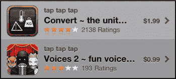

图 11-1。通过`Voices`和`Convert`，Tap Tap Tap 保持了应用名称的简短以便于阅读，并在 App Store 的名称标题中附加了描述性、富含关键词的说明。

没错，你的应用在 App Store 中的名称并不仅限于应用名称本身。在“应用名称”字段中附加一个描述性说明是完全允许的。只需确保你的应用名称在前，后面跟上任何附加的描述性文字，这样当在搜索结果中列出时，实际名称总能可见。图 11-1 中嵌入的说明被截断是没问题的，因为它在应用的产品页面（点击列表中的选项后）会完整显示。简单的应用名称`Convert`和`Voices`在 App Store 中显示如下：

-   `Convert`—the unit calculator
-   `Voices`—fun voice changing!

这种附加的说明（通常用简单的连字符或冒号与前面的应用名称隔开）有助于描述应用的核心功能。这种吸引眼球的技巧不仅能吸引观看者的注意力，还能让观看者无需先阅读冗长的描述就知道你的应用是做什么的。鉴于似乎没有多少人愿意花时间阅读冗长的应用描述，这种扩展的应用标题确实能帮助你进行营销推广。

这种“名称扩展”技术的另一个主要好处是，它让你有机会用相关关键词填满可被搜索的“应用名称”字段！举个例子，对比一下“`Convert`—the unit calculator”和它的一个竞争对手——Tapbots 的“`Convertbot`—The Amazing Unit Converter”：

-   如果用户搜索`convert`，`Convert`和`Convertbot`都会出现在搜索结果中，因为它们的应用名称都包含该词。
-   如果用户搜索`calculator`或`unit calculator`，只有`Convert`出现在搜索结果中，因为其应用标题通过扩展名称包含了这些词。（看起来`Convertbot`的关键词并没有针对`unit calculator`或`calculator`进行优化。）
-   如果用户搜索`converter`，`Convertbot`会出现在搜索结果中，而`Convert`则不会。

请记住，你为在 App Store 内显示而选择的应用名称，只能在提交新的应用二进制文件供审核时，或者你的应用被拒绝并需要重新提交时才能编辑。与你的关键词一样，你的应用名称也需经过苹果审核团队的审核，以确保没人试图利用未经授权的商标或无关、不当的词汇来滥用这个机会。因此，所有适用于提交关键词的规则同样适用于此。试图欺骗系统的行为会使你的应用无法通过审核。

将应用名称视为你相关关键词的一种营销延伸。当你的关键词列表和应用名称通过高度优化的词汇和短语协同工作时，你就在拥挤的 App Store 中增加了产品被发现的机会。

#### 完善应用描述中的销售话术


##### App Store 描述最佳实践

尽管产品的 App Store 描述不可搜索，但它仍然是吸引有兴趣了解您应用的用户的主要营销工具。用户已经进入了查看您产品页面的阶段，这是您说服他们“若不购买您的应用，人生便不完整”的唯一机会！产品页面上有三个具有影响力的元素：描述、截图和用户评论。在本章中，我们将从优秀应用描述的构成要素开始，逐一探讨这些内容。

##### 这是什么？

如果您没有使用扩展的应用名称（但您应该这样做），或者您的应用主要功能仍不够明确，那么描述中首先应包含的内容就是简要说明您的应用是做什么的，以及人们为何要购买它。还记得我在第 10 章中讨论的关于应用网站的“快速推销”吗？这里并无不同。

与您的网站一样，访问您 App Store 产品页面的用户只会花几秒钟浏览描述和截图，以判断应用是否吸引他们。您的任务是确保提供足够的销售亮点，促使用户继续阅读。

虽然 iPhone 版 App Store 会在产品页面上显示完整的应用描述，但 iPad 和桌面版 iTunes 中的 App Store 仅显示前三到四行文本，并带有一个`更多`链接来展开剩余内容。除非用户被您的截图所吸引，否则他们很可能不会花时间去点击那个`更多`链接。有鉴于此，优化您的应用摘要，将其浓缩为置于描述文本最顶部的简短几句话，使其能够显示在应用产品页面上，这比以往任何时候都更加重要。如果这段简短的文本摘要引起了用户的兴趣，他们很可能会点击`更多`链接来查看您的完整功能和优势列表。

##### 奖项与推荐

理想情况下，当您在发布前制造一些热度时（详见第 10 章），您已设法让一些知名媒体评论者体验了您的应用，并获得了他们精选的评语。当您的应用在 App Store 上线初期，用户评论会很少（如果有的话），因此最好在应用描述中包含一些精彩的推荐语，以帮助说服消费者认可应用的质量。即使您的应用收到了大量用户评分，来自备受尊敬的博主和杂志的赞誉也具有无与伦比的影响力。这也是提及您的应用所获奖项的绝佳位置。

您可能会忍不住将引人注目的奖项和推荐语放在应用描述的最顶部，但不应以牺牲您的快速推销式应用摘要为代价。如果能在 iPad 和桌面版 iTunes 中 App Store 显示的那几行文本里，将一段精彩的评语或获奖信息与您的应用摘要一同包含进去，那当然很棒！但如果这些赞誉占据了顶部太多空间，导致您的应用摘要被截断（通过`更多`链接），这可能就会带来问题。如果消费者不知道您的应用是做什么的，或者它如何能让他们受益，他们可能根本不在乎您的应用是否获奖。

##### 应用功能与优势

大多数人不愿意阅读密集的文本块，因此不要用冗长的段落来描述您的应用功能。将其分解为简短的章节，以便于快速浏览。更好的做法是，如果您有许多功能要提及，请将其结构化为易于阅读的项目符号列表。

不要长篇大论地列出关于应用的每一个细节。少即是多。空间和用户注意力都是有限的，所以请将列表精简到仅包含主要功能和优势。这包括消费者正在寻找的核心功能，以及使您的应用在竞争中脱颖而出的差异化因素。如果您认为某个特定功能是关键卖点，那么它就应该出现在这个列表中。

理解功能与优势之间的区别至关重要，这样您才能编写出更有效的应用描述：

*   **功能**代表应用或游戏中的具体能力。
*   **优势**则说明该功能如何提升您的幸福感、生活方式、生产力等。

例如，一个写作应用通过 Dropbox 同步文档的能力是一项功能。其优势在于，它允许您在任何能够登录在线 Dropbox 服务的设备或地点继续创作您的小说。

##### 整合所有要素

为了在各种版本的 App Store 中获得最佳效果，请按照以下从上到下的顺序组织您的应用描述要素：

*   应用摘要
*   奖项与推荐
*   功能与优势

阅读了前面的章节后，您应该不会感到意外：应用摘要应置于 App Store 描述的最顶部。这是您的快速推销，解释您的应用是什么。正如我所强调的，这段简短的文本应始终可见；不应需要点击`更多`链接才能看到摘要。

如果您的应用描述需要滚动很多次才能完整阅读，那说明它太长了。您不希望潜在客户的注意力分散。如果您包含了大量赞誉，请尝试将其削减到仅保留少数最有影响力的奖项和推荐语。如果您的功能和优势尚未以简短的项目符号列出，这样做也可以减少描述所占用的空间。

**应用被拒警告** 请勿在应用描述、名称或图标中包含价格信息。App Store 服务于多种区域语言和货币，因此显示静态的、基于文本的价格是被禁止的。如果您的英文应用描述中提到了美元价格，这可能会在英国 App Store 的顾客中引起混淆，因为那里的动态购买按钮显示的是以英镑计价的应用价格。为避免 App Store 拒绝，您可以在应用描述中推广限时促销优惠，但不要提及具体货币。例如，如果您售价`$1.99`的应用目前正以`99`美分促销，您可以将此促销称为“半价”或“5 折优惠”。

在提交您的应用描述之前，请务必使用一个好的拼写检查器进行校对！我再怎么强调这一点也不为过。没有什么比错别字和拼写错误更显得不专业的了！您想与 Electronic Arts 和 Gameloft 这样的大公司竞争吗？那么您需要在将内容上传到 iTunes Connect 之前，仔细检查您写的每一个字。担心自己会有遗漏？那就请几位朋友也帮忙校对一下描述。

确保您的描述通俗易懂，并且绝不歪曲应用的真实功能。不要忘记，这个描述不仅会被 App Store 的消费者阅读，首先它会被 Apple 的审核员看到。如果您的应用描述中有任何含糊不清或误导性的内容，或者审核员在短暂的审核时间内未能找到您列出的某个功能，都可能导致批准过程延迟，甚至被拒并需要进一步澄清。请记住，在您的应用获得批准后，您可以修改描述以添加额外信息。

### 一图胜千言：截图的重要性

由于 App Store 目前不支持展示视频演示，感兴趣的消费者能立即看到应用外观的唯一途径就是您产品页面上的截图。


#### 别指望用户会主动下载你的应用

不要以为你提供了免费或精简版应用，用户就会花时间下载，也不要以为他们会跳到 `YouTube` 或你的网站去观看视频预告。他们已经身处 `App Store` 中浏览，所以很可能懒得再跑去其他网站，尤其是在他们很忙的情况下（而大多数人确实很忙）。你的 `App Store` 产品页面需要说服用户下载你的应用，而该页面上最具影响力的元素很可能就是你的截图。

既然视觉效果如此重要，那么上传最能突出应用核心功能与质量的截图就变得至关重要。如果是游戏，你的截图最好能**大声喊出**趣味和刺激！如果是效率应用，那么你的截图需要强调使用该应用后，用户的生活能变得多么美好。你的截图必须具有冲击力！

#### 选择主截图

展示的第一张截图最为重要。如果消费者不想点击或滑动查看其余截图，那么他们可能只会看到这一张。所以，请确保这张主截图能最好地通过视觉方式描述你的应用。看到它的人应该能立即理解应用的大致概念，而无需阅读描述或加载其他截图。这是一张**一图胜千言**的图片！

花些时间浏览热门应用和游戏的 `App Store` 产品页面。分析每一个的主截图，特别是那些会与你应用竞争的同类应用。当你看到一张吸引眼球的截图时，试着分析究竟是什么让这张图片如此有效。

表面上看，获胜因素可能仅仅是惊艳的界面设计，但请再仔细看看。许多最佳主截图都是经过精心**布置**来呈现良好效果的！不，我不是指用 `Photoshop` 美化。我说的是展示应用的实际运行状态！如果是一款待办事项列表应用，不要显示一个空的新建列表。用它填满你的目标受众能理解的任务，向他们展示这个应用能让他们变得多么高效、节省多少时间。如果是一款太空大战游戏，就展示出核心乐趣因素，比如激光枪开火和外星飞船爆炸。你要让用户产生这样的反应：“哇，看起来真刺激……我必须现在就买！”

目标不一定是要在截图中塞满尽可能多的动作。一张引人入胜的主截图，是能瞬间吸引你的目光，并用单一视觉元素成功描述核心功能的截图。

Retro Dreamer 公司 `Sneezies` 游戏的 `App Store` 产品页面展示了一个有效主截图的绝佳例子（见图 11-2）。无需阅读应用描述，这张图片就让我很好地了解了它提供的游戏玩法。乍一看，目标似乎是让喷嚏精灵从漂浮的泡泡中解脱出来。果然，描述中的应用概要写着：“触摸屏幕，向漂浮的喷嚏精灵区域释放一阵喷嚏粉，看着它们打着喷嚏从泡泡中挣脱出来。尝试引发连锁反应，在这个家庭趣味解谜游戏中解救尽可能多的喷嚏精灵。” 截图甚至展示了喷嚏粉的作用效果，以及几个喷嚏精灵挣脱泡泡、打开降落伞安全降落的画面。

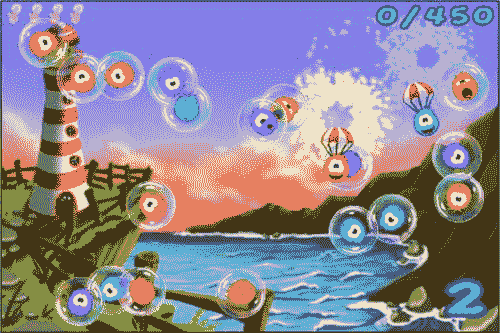

图 11-2。Retro Dreamer 的 `Sneezies`（由 Chillingo 发行）。无需阅读应用描述，这张主截图就告诉了我很多关于游戏玩法的信息，而且看起来纯粹就是好玩！

`Sneezies` 的截图展示了核心游戏目标，同时避免了屏幕过于杂乱。它看起来纯粹有趣，而且对于所有年龄段的玩家来说，掌握基本玩法似乎并不困难。

展示游戏运行状态似乎显而易见，但同样的策略也应该用于其他类型的应用。Rogue Sheep 公司 `Postage` 应用的主截图（图 11-3 左侧）提供了一个绝佳的例子，展示了你可以创建和发送的数字明信片。Imagam 公司的 `iFiles` 应用的主截图（图 11-3 右侧）则通过在一个填充了文件的列表上方显示其自定义弹出菜单，展示了其众多文件管理和导出功能。展示应用实际活动的截图，能直观地向用户演示这些应用如何改善他们的生活或帮助他们提高效率。

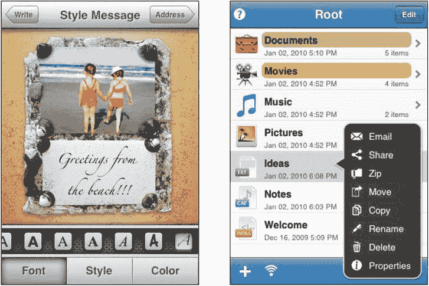

图 11-3。Rogue Sheep 的 `Postage`（左）和 Imagam 的 `iFiles`（右）的主截图，在单一图像中直观地展示了它们的许多功能和优势。

Apple 建议从截图中移除状态栏，但在 `App Store` 浏览一圈，显然这条建议并非总被采纳。

Apple 还建议直接从 `iPhone`、`iPad` 或 `iPod touch` 上截取截图，而不是使用 `iOS Simulator`。操作方法如下：当你准备截图时，同时按住设备的 `Home` 键和 `Power` 键。截图会保存到设备的 `Photo Library`（照片图库）中。虽然你可以轻松地通过设备上的 `Photo Library` 将截图通过电子邮件发送到你的桌面电脑，但你也可以将设备与桌面 `iTunes` 同步，然后启动 Mac 上的 `iPhoto` 应用来导入保存的 `PNG` 格式截图。

另一种选择是从 `Xcode Organizer` 窗口的 `Screenshots` 标签页中，从连接的设备上截取截图。然后，可以从那里将它们作为 `PNG` 文件拖拽到 Mac 桌面上。

#### 当截图不仅仅是截图时

尽管 Apple 称其为截图（screenshots），但此功能并不局限于其字面定义。如果你的应用核心功能利用了加速计或特殊的多点触控手势，那么完全可以在截图中展示一张真实人物在 `iOS` 设备上使用该应用的照片。

Smule 的 `Ocarina` 应用，它能将你的 `iPhone` 变成一种乐器。该应用使用主截图（图 11-4）来展示如何利用设备的麦克风和触摸屏来“演奏”它。这张照片在描述这款独特应用方面，比实际的屏幕截图效果要好得多。由于用户的手指会遮挡部分应用界面，Smule 巧妙地在这张照片中加入了 `Ocarina` 标志，以强化应用名称和品牌。


图 11-4。由于 Smule `Ocarina` 应用利用了 `iPhone` 的麦克风和触摸屏功能，展示一张用户实际操作的照片，作为主图像比实际的截图要有效得多。

如果你构建的应用功能极其丰富，简单的屏幕截图根本无法充分体现其优点，该怎么办？别担心。如果能在截图中加入文字有助于解释应用的工作原理，那么并没有规则禁止这样做。

Guided Ways Technologies Ltd. 的 `Groups` 应用的主截图（图 11-5 左侧）就是一个文字使用的典范。它用额外的文字和图标来补充内置的界面视图，以此在视觉上推广其大量的关键功能。它还骄傲地展示了来自 O'Reilly 的推荐。

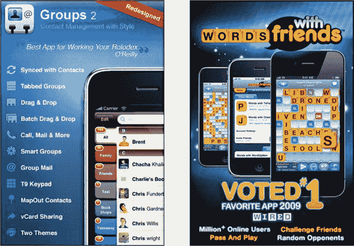


图 11-5。Guidled Ways Technologies Ltd. 出品的 Groups（左图）主截图使用文字和图标直观地展示了其海量核心功能。Newtoy 公司的 Words with Friends（右图）则展示了核心功能、来自《连线》杂志的惊人赞誉，以及它与多款 iOS 设备机型的兼容性。

另一个例子是 Newtoy 公司 Words with Friends 的主截图（图 11-5 右侧）。它展示了几个核心功能以及来自《连线》杂志的权威赞誉。此外，该截图还显示了运行该应用的几款不同 iOS 设备，直观地宣传了其社交游戏玩法与多种硬件型号兼容，从而让你的所有朋友都能加入游戏，共享欢乐。

如果你在截图中确实包含了文字，并且你的应用在多个地区的 App Store 中提供了本地化版本，请务必记得也相应地对截图进行本地化处理。在截取截图之前，请在设备上设置首选语言，该选项位于“设置”应用中的“通用”“国际”“语言”。如果你正在创建自定义图片（例如图 11-5 中展示的那些），请确保正确翻译文字。像谷歌翻译这样的在线网络翻译机器人有时可能会生成不正确的措辞或语法。为避免混淆，甚至可能因用词不当冒犯他人，你或许应考虑咨询专业翻译人员。当你的本地化截图准备就绪后，只需将它们上传到 iTunes Connect 中对应的应用语言版本即可。

**应用被拒警告** 如果提供的任何截图包含 iAd 测试广告，或显示了不符合 4+ 年龄分级政策的不当内容，Apple 审核团队将拒绝你的应用提交。如果你的应用显示 iAd 横幅，请在截取截图时隐藏该横幅视图。并且，如果你的应用包含面向年长受众的内容，请确保这些内容在截图中不可见。换句话说，不要展示成人媒体内容或暴力游戏画面。

### 准备向 App Store 提交的应用二进制文件

在了解了用于 ad hoc 分发的配置流程（详见第 9 章）之后，你会高兴地得知，编译你的 iOS 应用以便在 App Store 中分发的流程几乎相同。唯一的区别在于你在 Xcode 中为应用分配的配置描述文件。

你是否已完成应用的 Beta 测试和微调？准备好编译用于 App Store 的最终版本了吗？以下是准备要上传到 iTunes Connect 的应用二进制文件的步骤概要。

#### 第 1 步：确认你的分发证书仍然安装完好

为了编译用于 ad hoc 分发的应用，你需要从 iOS 配置门户生成你的分发证书，并将其安装到 Mac 的钥匙串系统中。此分发证书也用于编译 App Store 分发版本，因此请花点时间确保它仍然安装完好。启动钥匙串访问应用程序，它位于你的 Mac 上的 `/Applications/Utilities/Keychain Access`。

在显示的对话框中，从钥匙串列表中选择“登录”，从类别列表中选择“密钥”。在密钥列表中，只需仔细检查你的私钥是否仍然与你的分发证书配对。在图 11-6 的示例中，我的 Electric Butterfly, Inc. 密钥（先前为 ad hoc 分发创建）与导入的分发证书配对。如果你的分发证书没有以类似方式与相应的密钥配对，那么在继续之前，请重新访问第 9 章中描述的 ad hoc 分发流程的第 1 步。

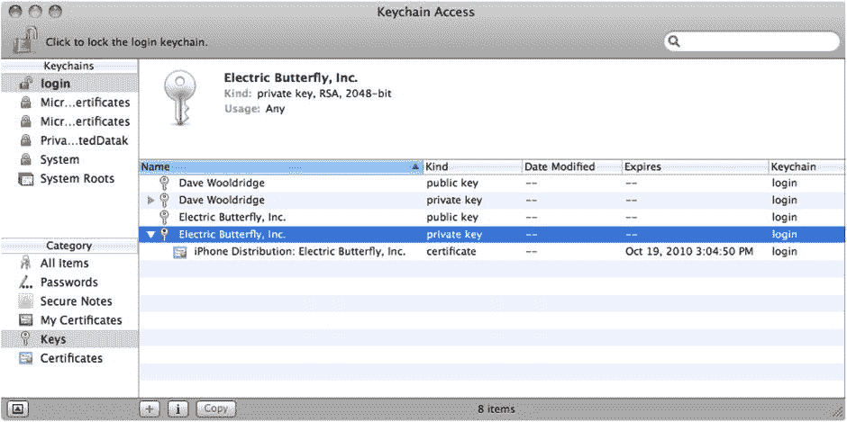

图 11-6。在钥匙串访问中确认你的分发证书仍然与正确的私钥配对。

#### 第 2 步：生成并安装一个 App Store 分发配置描述文件

登录 iOS 开发者中心网站，点击页面右上角的 iOS 配置门户链接，然后在主配置门户页面内，导航到“配置”部分。选择“分发”标签，然后点击“新建描述文件”按钮。

在出现的表单中，请务必选择“App Store”作为分发方式。为你的应用选择合适的应用 ID，并确认分发证书已正确分配。为便于参考，请输入一个包含应用名称并反映此配置描述文件特定用途的描述文件名称，例如 `Breadcrumbs App Store Profile`（参见图 11-7）。重要的是，你的 App Store 配置描述文件命名要与 ad hoc 分发配置描述文件不同，这样当它们在 Xcode 中列出时才易于区分。选择“提交”以生成你的 App Store 分发配置描述文件。

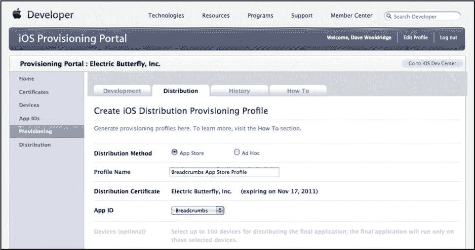

图 11-7。既然你已经完成了 Beta 测试，是时候在在线 iOS 配置门户网站中生成一个 App Store 分发配置描述文件了。

在“分发”标签的配置描述文件列表中，点击“下载”按钮将此新的 `*.mobileprovision` 文件保存到你的硬盘。将 `*.mobileprovision` 文件拖放到 Dock 中的 Xcode 图标上。Xcode 将自动将该配置描述文件安装到正确的位置。


好的，作为一名高级文档工程师和翻译员，我将严格遵守您的要求，将给定的英文文本翻译成中文。


#### 第 3 步：配置你的 Xcode 项目以进行 App Store 发布

现在有了合适的配置文件，下一步就是在 Xcode 中打开你的项目，并配置它以进行 App Store 发布。在主 Xcode 项目窗口中，在“组与文件”窗格顶部选择项目名称，然后点击工具栏中的“信息”按钮。在“信息”窗口的“配置”选项卡中，确认你仍然有一个名为“发布”（Distribution）的配置（你应在第 9 章的临时发布阶段已经创建了它）。如果没有，请复制现有的“发布”（Release）配置，并将副本命名为“发布”（Distribution）。现在关闭该“信息”窗口。

接下来，在“组与文件”窗格中选择“目标”应用，并再次点击工具栏的“信息”按钮。在出现的“目标信息”窗口中，导航到“构建”选项卡，再次确认“配置”下拉菜单设置为“发布”（Distribution）。向下滚动到“代码签名标识”行下方的“任意 iOS”字段，并将其分配给新的 App Store 发布配置文件。即使你的临时发布配置文件也可能出现在弹出菜单中，但最关键的是必须选中你的 App Store 发布配置文件（参见图 11-8）。

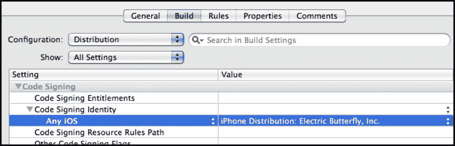

图 11-8. 修改你目标的“构建”选项卡，将新的 App Store 发布配置文件分配给“任意 iOS 代码签名标识”

切换到“属性”选项卡，确认正确的应用 ID 包标识符已填入“标识符”字段。该标识符应与你的 Xcode 项目 `Info.plist` 文件中列出的包标识符相同（例如示例 ID `com.ebutterfly.breadcrumbs`）。

完成以上所有步骤后，最后一步是导航到主 Xcode 项目窗口，确保左上角的下拉菜单中，分别为“活跃 SDK”和“活跃配置”设置了“设备”和“发布”（Distribution）。

#### 第 4 步：编译你的 iOS 应用

现在你已经准备好编译你的 Xcode 项目了！App Store 发布不像临时发布那样要求你的项目包含授权文件，所以保存你的项目。接下来，选择“构建”“构建并归档”。如果你的配置一切正确，你的应用应该可以成功编译。

如果你遇到与项目设置相关的构建错误，请回溯你的步骤，确保你已经遵循了此处概述的每一个任务，无论它看起来多么微不足道。构建错误常常由最小的错误引起，例如拼写错误的包标识符或误选了的复选框。如果问题仍然存在，并且你已经排除了代码错误和错误的配置设置，请清理项目的构建目录，在 Xcode 中重新打开项目，然后再次尝试构建。

**应用被拒警告** 不要在应用中使用未记录的私有 Apple API。Apple 已经拒绝了数十个应用，因为它们使用了未正式批准供公众使用的私有 iOS API。据传，应用审核团队正使用静态分析工具来查找对受限、私有 API 的调用。因此，即使你的应用包含了这些代码但并未执行，仅凭代码存在，你的应用仍可能被标记。为避免被 App Store 拒绝，请坚持使用官方授权的 API。

Apple 只接受使用 App Store 发布配置文件编译的 iOS 应用。不幸的是，App Store 发布配置文件以及使用该配置文件编译的应用无法在你的测试设备上运行，因此你无法在提交给 Apple 之前测试这个版本的应用。

考虑到这一点，在为 App Store 发布而配置和编译之前，尽可能多地测试——密切关注构建日志和错误信息——是非常重要的。

在你使用“构建并归档”选项编译后，你可以在 Xcode 的“管理器”窗口中找到该应用。在 Xcode 管理器的左窗格中，选择“已归档的应用”，你应该会在显示的应用列表中看到你新编译的应用。选中该应用后，你会在 Xcode 管理器屏幕底部注意到一个“提交到 iTunes Connect”按钮。但是，等等！先不要点击那个按钮。

在提交你的应用二进制文件之前，你首先需要在 iTunes Connect 中创建你的应用列表，并附带必需的元数据，我稍后会教你如何操作。提交流程的最后一步是上传你的应用二进制文件，所以我们很快就会再次回到 Xcode 管理器。

#### 确保 Apple 已处理你的合同和付款设置

在提交应用之前，请确保所有 Apple 要求的合同、税务表格和银行信息都已正确提交和处理。正如我在第 1 章中提到的，这个过程通常需要相当长的时间，所以最好在开发初期就处理妥当。这样，当你准备向 App Store 提交应用时，就不会有遗留的文书工作阻碍你。

要检查你的当前状态，请登录位于 `http://itunesconnect.apple.com` 的 iTunes Connect，在 iTunes Connect 的主页上，访问名为“合同、税务和银行”的部分，查看你当前生效的合同。如第 1 章所述，你默认应已激活“免费应用”合同，这允许你向 App Store 提交免费的 iOS 应用。要提交付费应用，你需要已经申请了“付费应用”合同，并完成了相关的银行和税务表格。如果没有提交这些信息，Apple 无法向你支付从应用销售中获得的任何收入。相反，它会将你累积的收入托管，直到你提交所需的表格。

### 我们到了吗？在 iTunes Connect 中提交你的应用

经过数月的开发和测试，你可能不敢相信终于到了这一步：准备将你的应用提交到 App Store。这是一个既充满兴奋又充满不安的时刻，你无法确定你的产品在 Apple 应用审核团队手中会面临何种命运。但别担心，你已经非常仔细地规划了你的应用，有条不紊地遵循了 Apple 的所有指导原则，所以你应该状态良好。现在你准备好全力以赴了。

计划在你拥有充足时间的日子里，在 iTunes Connect 中添加你的新应用。有几个屏幕的在线表格需要填写，因此你需要从容地、耐心地完成每个部分，以避免出现任何粗心的错误或拼写错误。

**注意** 你可以在 iTunes Connect 中添加一个新的应用列表，而不将其提交到 App Store。事实上，你需要提前这样做来测试某些功能，例如应用内购买。你的应用不会被提交给 Apple 的审核团队，直到你完成上传应用二进制文件的最后一步。如果你已经按照第 8 章中的这些说明为应用内购买测试在 iTunes Connect 中创建了应用列表，并且准备提交到 App Store，那么你可以跳到标题为“第 5 步：上传你的应用图标和截图”的章节。

#### 第 1 步：创建新的应用条目

准备好了吗？太好了，我们开始吧！前往 iTunes Connect 的管理你的应用部分。点击“管理你的应用”页面左上角的蓝色“添加新应用”按钮（参见图 11-9）。


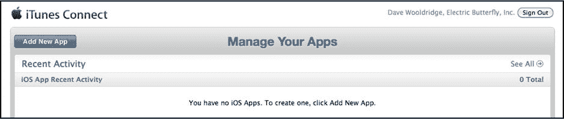    图 11-9。在 iTunes Connect 的“管理您的应用”部分，点击“添加新应用”按钮开始操作

##### 公司名称和主要语言

如果这是您首次提交 iOS 应用，第一个页面会要求您提供官方公司名称和应用的主要语言。请注意，这些信息后续无法更改，因此请务必确保此页面信息无误！

您提交的公司名称应是您希望在 App Store 中作为应用官方开发者显示的名称。出于对代码签名和 App Store 设置的谨慎考虑，我建议您在以下所有项目中使用相同的公司/开发者名称，以避免潜在问题：

*   您的 iOS 开发者计划账户
*   您的 iOS 分发证书
*   您的 iTunes Connect/App Store 公司名称

我在以上三项中均使用我的公司名称 Electric Butterfly, Inc.，并确保拼写和标点始终保持一致。

至于主要语言设置，这是在提交过程中用于输入所有应用数据的语言。例如，如果您从下拉菜单选择英语，其余在线表单将要求您用英语填写信息。在 iTunes Connect 中创建应用列表后，您将有机会添加对其他语言的支持，例如法语、德语、日语等。

点击“继续”按钮将进入下一个页面，您需要在此输入一些初始应用信息。

##### 应用信息

我们来逐一了解“应用信息”页面上的三个表单元素（见图 11-10），以便更好地理解其要求：

*   **应用名称：** 提交的名称最多可包含 255 个字符。如本章前文所述，此字段不限于应用的二进制名称或显示名称。建议使用带有说明文字的扩展应用名称（例如 Tap Tap Tap 的“Convert——单位换算器”）。但应用的实际名称应包含在该说明文字中（最好放在开头）。如果您的 App Store 名称与应用在 iOS 设备主屏幕上的显示名称差异过大，可能会引起消费者混淆，并在应用审核过程中引发问题。
*   **SKU 编号：** 这个字段通常是 iOS 开发者最困惑的来源，因为 Apple 并未对此字符串的正确格式或语法提供太多说明。与普遍看法相反，SKU 属性并没有定义的模板或编号系统。即使将其称为 SKU 编号也有一定误导性，因为它不一定要由数字组成。应用的 SKU 永远不会向客户展示，也不会公开列在 App Store 中。基本上，SKU 是 iTunes Connect 中应用的内部唯一标识符。通常使用一个易于识别的名称比仅使用数字串更方便，特别是当您有相关的 App 内购买项目时。例如，我们虚构的 Breadcrumbs 应用的 SKU 是 `breadcrumbs`，其 App 内购买高级包的 SKU 是 `breadcrumbs.premiumpack`。SKU 与版本号无关，因此不会随每次版本更新而改变。事实上，一旦提交，SKU 编号就永远无法修改，所以请选择一个适合您的好标识名。此外，如果您选择删除现有应用列表，该 SKU 也永远无法重复使用。
*   **Bundle ID：** 在为应用配置配置文件后，您的应用 ID 应已列在 iTunes Connect 中，因此只需从下拉菜单中选择即可。

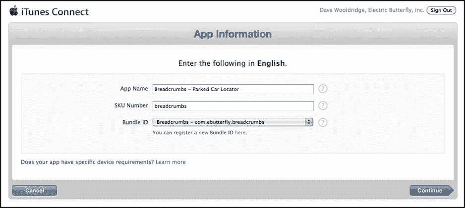    图 11-10。

“应用信息”表单要求提供唯一的应用名称和 SKU，以及应用的 Bundle ID

为避免在市场上引起消费者混淆，App Store 中不能有两款应用拥有相同的应用名称或 SKU。如果系统报告您请求的名称或 SKU 已被占用（即使该应用尚未获得 App Store 销售批准），您将被迫提供不同的应用名称或 SKU。

您可能无法将已“被占用”的应用名称用作您的 App Store 名称，但您可以在名称后添加包含关键词的说明文字来解决此问题。仅当 App Store 中没有其他可用（或即将上架）的同名应用时，才应选择这种方案。相同的应用名称可能在市场上造成混淆，让消费者无法确定哪一款是您的应用——尤其是当两款应用提供相似功能时。

尽管您添加的说明文字使提交的名称在技术上于系统中是唯一的，但在消费者眼中，应用的实际名称本质上仍与其他应用相同。如果您的应用名称侵犯了 App Store 中现有的商标应用名称，这还可能导致诉讼。如果您已为应用名称注册商标，那么法律将站在您这一边（至少在本国如此）。这就是为什么您必须进行充分的竞争研究并创建一个独特的名称（见第 2 章）。为应用名称避免使用常见词汇可以防止此类问题的发生。

**注意**  由于每个应用名称和 SKU 都必须是唯一的，Apple 已采取措施防止名称抢占——即在 iTunes Connect 中创建应用列表以阻止其他开发者获得该名称的行为。将应用添加到 iTunes Connect 后，您只有 120 天时间上传应用二进制文件（以便将应用提交至 App Store 审核）。如果 120 天期限已过而您未上传应用二进制文件，该应用名称将从您的账户中移除，供其他开发者使用。因此，如果您创建应用列表是为了测试 App 内购买等特定功能，请务必在 120 天到期前完成开发并提交应用二进制文件。

在“应用信息”页面的最底部，您会注意到 Apple 关于指定设备要求的一段简要提醒。特殊的设备要求是指那些需要硬件相关功能的要求，例如 GPS、网络访问、内置摄像头或加速度计。毫无疑问，您在阅读 Apple 的 *iOS 应用程序编程指南* 时，已经了解到如何通过应用 `Info.plist` 文件中的 `UIRequiredDeviceCapabilities` 键来定义这些设备要求。如果尚未完成，您需要在为提交至 App Store 编译应用时进行必要的修改。

与上一个页面一样，这些字段一旦提交便无法更改，因此确保拼写万无一失至关重要。

完成应用信息输入后，点击“继续”按钮进入下一个页面。

#### 步骤 2：设置可用日期和定价

“权利与定价”页面提供了选择应用可用日期、价格层级和其他销售选项的设置（见图 11-11）。

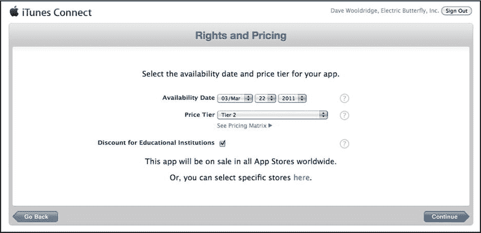    图 11-11。在“权利与定价”页面设置应用的可用日期和价格层级

##### 可用日期

“可用日期”设置已被证明是应用提交流程中最令人困扰的元素之一。在 App Store 的主要分类页面中，消费者可以按发布日期对列表进行排序，这对于新发布的应用来说是极佳的曝光来源。


曾几何时，开发者还能在应用获得批准后快速修改上架日期，从而掌控应用出现在那个宝贵列表中的时机。这使得开发者能够将新闻稿的发布时间与产品在 App Store 新上架列表中的曝光度紧密配合。不幸的是，苹果后来修改了 App Store 中显示的发布日期，导致那个小把戏失效了。现在，你的应用实际发布日期就是它被苹果批准的那一天。

那么，为什么苹果还要为开发者提供设置上架日期的选项呢？这仍然让你能够控制应用在 App Store 中上线的具体时间。例如，如果苹果在 3 月 1 日批准了你的应用，但你希望在 3 月 22 日首次亮相 App Store，以配合你的新闻稿和营销活动，那么就将上架日期设为 3 月 22 日。但请记住，App Store 中应用的发布日期仍会显示为 3 月 1 日，这样一来，你就错过了在新上架列表中的初次曝光机会，因为更新的应用早已把你的应用挤到了列表更靠下的位置。

如果出现在新上架列表顶部对你来说比预先计划的发布日期更重要，那么就把你的上架日期设定在未来的某一天（比如几个月后），远远超过预计的批准日期。除非你的应用审核过程异常漫长，苹果的批准日期通常都会早于你设定的未来发布日期。然后，在完成提交后，在你的 `iTunes Connect` 用户资料偏好设置中，设置当应用状态变更为 `Ready for Sale` 时通过电子邮件通知你。这样一来，如果你定期查看邮件，那么在你收到应用获批通知的那一刻，就能迅速登录 `iTunes Connect`，将上架日期改为苹果的批准日期。应用随即会立即出现在 App Store 中，并受益于新上架列表中稍纵即逝的曝光机会。这个邮件通知也能充当一个不错的提醒，让你可以紧随产品在 App Store 上架，准时发出你的新闻稿。

##### 价格等级

对于付费应用，你还需要选择一个价格等级。由于不同区域的 App Store 支持多种货币，下拉菜单强制你选择一个等级而不是实际价格。

当你选择一个等级时，相应的价格会自动显示。如果你点击 `See Pricing Matrix` 链接，会出现一个表格，不仅显示多个区域的货币换算，还会显示苹果扣除 30% 费用后你的收益。

##### 教育折扣与区域可用性

默认情况下，你的应用将在全球范围内上架，除非你选择只针对特定的个别国家。你也可以选择参与苹果的教育折扣计划，该计划允许教育机构以 App Store 价格 50% 的折扣批量购买你的应用。

在“权利与定价”页面点击 `Continue` 按钮，将带你进入“版本信息”页面。

#### 第 3 步：提交应用的元数据

在应用提交流程的所有表单中，你可能需要花费最多时间在“版本信息”页面上，详细说明应用的所有元数据（见图 11-12）。幸运的是，许多要求提供的内容你应该已经准备好了，例如应用描述、关键词和网站 URL。

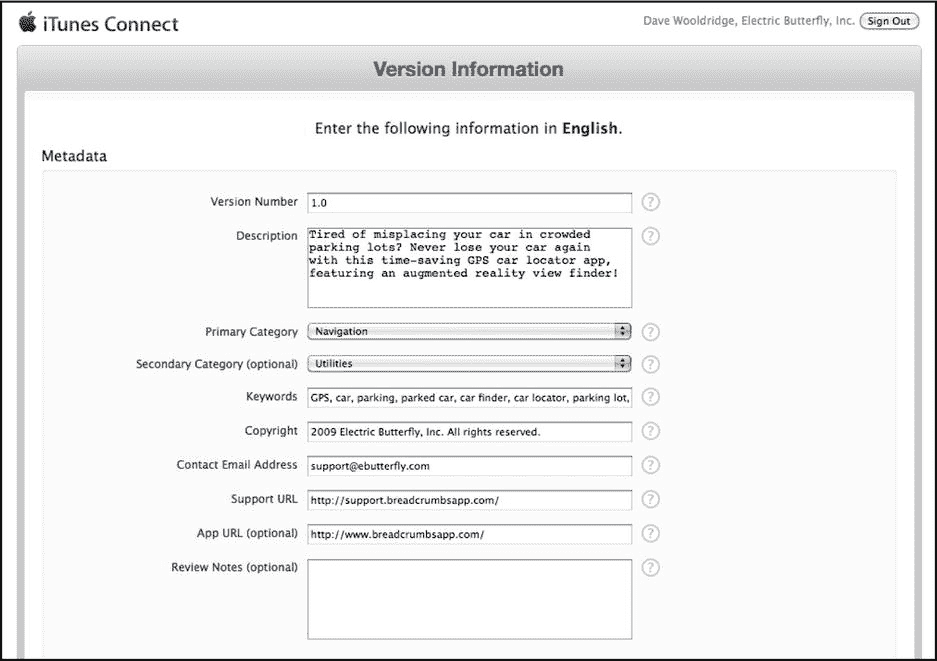

[图 11-12]。在提交流程的所有界面中，“版本信息”页面无疑是最长的，但幸运的是，你应该已经准备好了其中许多项目，例如应用描述、关键词和网站 URL。

正如你从[图 11-12]中所见，这是一个非常长的表单，所以让我们仔细看看每一项。

##### 版本号

这是一个比较直观的字段，用于列出应用的版本号，例如 `1.0` 或 `1.3.1`。你应该使用与应用 `Info.plist` 文件中 `CFBundleVersion` 属性相同的版本号，因此要避免包含“Beta 1”这类字母字符。

实际应用二进制文件的版本与你在此字段输入的版本号不一致，可能会导致应用审核过程中出现延迟或问题。

##### 描述

你在本章前面苦心编写的描述应粘贴到此字段中。请记住，桌面版 iTunes 和 iPad 版 App Store 最初只显示文本的前几行，并提供一个 `More` 链接来阅读剩余内容。这使得开头几行文本变得非常重要，因此务必明智地利用那有限的空间来说明你的应用是做什么的。由于允许最多 4000 个字符，你可以用剩余字符来列出功能与优势、所获奖项、用户评价以及其他关键卖点。

`HTML` 标签不受支持，但换行和特殊的 Unicode 字符是可以接受的。

##### 主要类别和次要类别

你必须为你的应用在 App Store 中选择一个主要类别。选择次要类别是可选的，但如果苹果根据你的应用功能认为主要类别选择不合适，那么次要类别作为备选会很有帮助。

如果你选择 `Games` 作为类别，则会出现另外两个菜单，允许你从 `Games` 父级组中选择两个子类别，例如动作、街机、棋类、益智、策略以及其他游戏类型。

##### 关键词

你在本章前面精心构思的关键词应粘贴到此字段中。正如我之前提到的，无论你是否为某些关键词使用了多词短语，始终建议用逗号将它们分隔开，以获得最佳效果。

##### 版权

按照你希望在 App Store 中显示的方式列出你的版权声明。无需包含 `©` 符号，因为 App Store 会自动将其放在你的版权声明之前。因此，例如提交“2009 Electric Butterfly, Inc. All rights reserved.”这一行，在 App Store 中将显示为：“© 2009 Electric Butterfly, Inc. All rights reserved.”

##### 联系邮箱地址

苹果要求你提供一个联系邮箱地址，但这个地址不会在 App Store 中公布。仅供苹果内部团队在审核过程中或你的应用在 App Store 上架期间需要联系你时使用。

##### 支持 URL

苹果要求所有开发者为 App Store 中列出的每个应用提供一个在线支持 URL。尽管桌面版 iTunes 和 iPad 版 App Store 会将你的支持 URL 作为产品 App Store 页面上的一个活动链接，但 iPhone 版 App Store 只包含你的应用 URL。考虑到这一点，你需要确保用户也能从你的应用网站上轻松访问到你的支持页面。

重要的是，你的支持 URL 必须指向一个有效的联系方式，因为苹果会在应用审核过程中检查该链接是否存在。至少，要为网站访问者提供某种直接联系你的方式，无论是通过电子邮件链接还是 HTML 反馈表单（如果你不想让垃圾邮件机器人获取你的邮箱地址）。

为了减少大量支持查询，并在你离线时也能提供全天候帮助，发布一个常见问题解答（FAQ）列表总是一个好主意，尤其是当你发现自己反复回答相同的邮件问题时。对于那些拥有活跃且充满活力的用户社区的 iOS 应用，自行托管一个在线论坛，例如流行的开源 `phpBB` (`http://www.phpbb.com`)，可能是对你的支持网站的一个有益补充。


###### 第三方支持服务

如果你没有时间或技能来构建自己的定制支持服务，有一些优秀的现成第三方服务可用，价格非常实惠。以下是一些选择：

- `Get Satisfaction`（`http://getsatisfaction.com`）
- `Tender Support`（`http://tenderapp.com`）
- `UserVoice`（`http://uservoice.com`）
- `Zendesk`（`http://www.zendesk.com`）

##### 关于支持的额外说明

即使提供了详尽的支持网站，如果你发现太多顾客滥用 App Store 的客户评价区域来发布功能请求和错误报告，那么在应用描述文本中添加一些支持信息可能会有所帮助。任何能将用户引导至你的支持网站的做法，都可能有助于减少那些仅仅是功能愿望清单的无谓一星评价数量！但绝不要指责这样做的顾客。应以积极的方式措辞，说服顾客相信你的支持网站是获得优质帮助的最佳、最快途径。

例如，你可以在应用描述文本底部插入这样的措辞：“如需快速支持帮助，请直接联系我们：`http://support.breadcrumbsapp.com`，或发送邮件至`support@breadcrumbsapp.com`。”如果你更倾向于通过 Twitter 与用户联系，还可以在该句子中添加你的 Twitter URL。

基本上，你提供的客户关怀选项越多，就越有可能减少 App Store 客户评价中与支持相关的帖子（这反过来可能有助于提高你应用的整体客户星级评分）。

##### 应用 URL

我在第 10 章中讨论了为 iOS 应用维护专用网站的重要性，因此，尽管应用 URL 字段是可选的，但你应在此处填写你的网站 URL。不这样做只会损害你应用未来的市场竞争力，尤其是在应用 URL 链接在 App Store 中显示得如此突出的当下。

##### 审阅备注

大多数开发者无需填写这个可选字段，但如果你担心审阅者可能会误解你的应用或难以访问其中的某些独特功能，那么在此处添加一些额外说明可能有助于加快审阅流程。

如果你的应用需要创建用户账户或登录到受密码保护的 Web 服务，则需提供苹果在审阅过程中可以使用的测试账户或登录凭据。这些登录功能肯定会被应用审阅团队测试，因此如果你忘记在审阅备注字段中提供这些信息，审阅者会向你请求这些登录数据，从而延迟审批流程。有些应用甚至仅仅因为审阅者无法成功登录测试账户或应用内的会员专属 Web 服务而被直接拒绝。因此，即使你在此字段中提供了所需信息，也要先确保这是一个有效可用的登录凭证。

务必确保你在此处包含的文本清晰简洁。你最不希望看到的就是，因为添加的额外备注反而造成更多困惑，而不是提供帮助，从而导致应用被拒绝。

#### 第 4 步：为你的应用指定分级

滚动“版本信息”页面，第二个部分涉及你应用的预期年龄分级。你会看到一个调查式的列表，其中包含你必须回答的问题（见图 11-13）。苹果要求所有 iOS 应用都指定一个与内容相关的年龄分级，以便 iOS 家长控制功能在孩子访问 App Store 时能够筛选出指定年龄段的适宜应用。

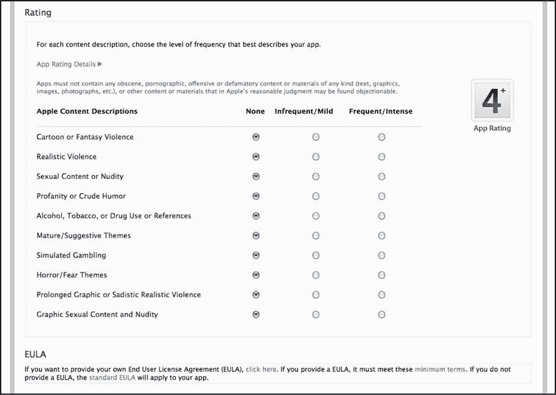

图 11-13

对所有内容问题均选择“无”，则会动态显示年龄评级为 4+，将应用标记为适合儿童和成人使用。

可能的年龄分级包括 4+、9+、12+和 17+。如图 11-13 所示，对所有内容问题均选择“无”，会动态显示年龄评级为 4+。尝试对某些内容类型选择“偶尔/轻微”和“频繁/强烈”答案，你将看到显示的评级变为 9+、12+甚至 17+。

诚实回答，选择适合你应用的分级，这最符合你的利益。即使你提交的 12+评级仅包含少数“偶尔/轻微”答案，但如果苹果审阅团队认为你的应用需要更严格的 17+评级，它完全可以并且会在批准在 App Store 销售之前重新分类你的评级。

分级可能看起来有些主观，尤其是面对诸如“成人/暗示性主题”这样模糊、泛泛的内容类型时，不同的人可能有不同的理解。尽管如此，苹果对其分级系统非常重视，因此如果你不喜欢应用获得的批准评级，也没有多少回旋余地可以申诉。

在设计 iOS 应用时，有三个主要的分级相关因素需要注意：

- **Web 浏览访问**：如果你的应用允许用户通过嵌入的 `UIWebView` 访问任何 Web 内容（其中可能包含对儿童不适宜的内容），你的应用很可能会被评定为 17+。
- **Web 服务数据**：如果你的应用从 Web 服务检索数据（例如在线数字漫画或电子书目录），尤其是可能包含不适宜内容的公共领域项目，你的应用极有可能被归为 17+评级。
- **暴力与色情**：如果你的应用包含“长时间的血腥或施虐性现实暴力”或“露骨色情内容和裸体”——即苹果内容类型列表中的最后两项——你的应用将被视为不适宜上架 App Store，不会获得批准。奇怪的是，似乎确实存在一个轻微的灰色地带，允许一定程度的色情主题内容，因为包含列表中第三项“色情内容或裸体”的应用通常会被给予 17+评级。

回答这十个分级问题时要格外小心，因为在应用提交审阅后，这些问题就无法修改了。还要记住，你为应用选择的评级也必须反映所有相关应用内购买项目的内容。

紧接在分级区域下方的是对最终用户许可协议（EULA）的简要说明。默认情况下，如果你没有提供自己的 EULA，那么苹果标准的 App Store EULA 将适用于你的应用。这似乎是大多数 iOS 开发者选择采用的 EULA。然而，如果在 Michael Schneider 的第 3 章中阅读关于最终用户协议的内容后，你确信应用中的特定功能需要自定义 EULA，那么只要它符合苹果的最低条款，苹果确实允许你上传自己的 EULA。由于苹果需要在提交时审阅自定义 EULA，这一选项可能会拖慢审批流程。

#### 第 5 步：上传你的应用图标和屏幕截图

继续向下滚动冗长的“版本信息”页面，接下来你会遇到一个名为“图像”的区域。这是你上传 1024×1024 像素的应用大图标和屏幕截图的地方。要上传特定元素，请点击其下方的对应“选择文件”按钮，从硬盘中选择文件（见图 11-14）。

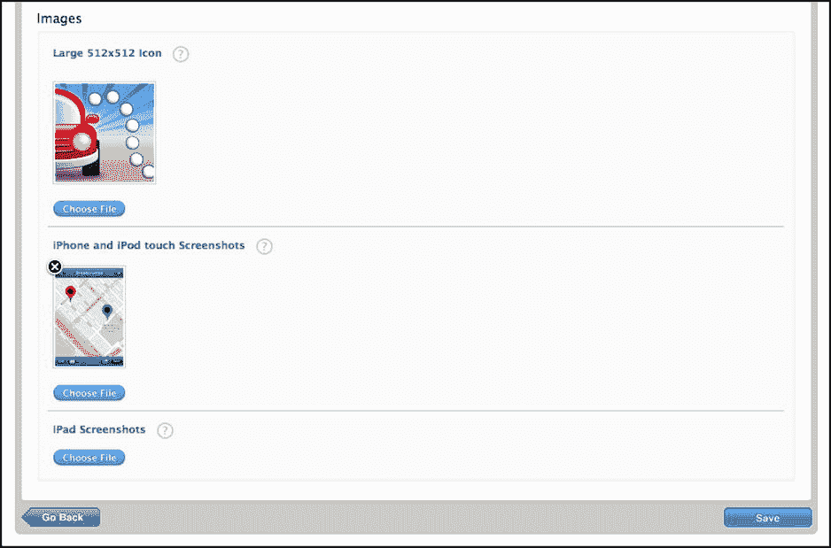

图 11-14


##### 版本信息页面

##### 图像部分

版本信息页面的“图像”部分允许您选择和上传用于在 App Store 中展示的 1024 × 1024 像素大型应用图标和应用截图。

###### App Store 图标

早在第 4 章中，我就讨论过创建高质量 1024 × 1024 像素大型应用图标的必要性，因此您应该已经准备好此图标文件并等待上传。请注意，此大型图标必须与您的 iOS 应用中编译的应用图标设计一致。提交设计不一致的应用图标会迅速导致您收到拒审通知。

1024 × 1024 像素的图标应以扁平的方形 PNG 图像形式提交，分辨率为 72 dpi，颜色模式为 RGB。请勿包含任何类型的图层、蒙版或透明度。

而这是最重要的一条规则：请勿自行添加圆角或斜面光泽。App Store 会自动动态添加这些图标效果，但会尊重您应用的 `Info.plist` 文件中 `UIPrerenderedIcon` 键的自定义设置。

###### 应用截图

提交截图时，无需按特定顺序上传。上传后，您应在“图像”部分看到它们以缩略图形式显示。要按特定顺序为 App Store 排列截图，只需用鼠标将图像缩略图拖放到所需顺序即可。您的主截图应始终是左侧的第一张图片。

如果您的应用针对 Retina 显示屏进行了优化，Apple 建议您提交 Retina 尺寸的截图。iPhone 和 iPod touch 可接受的截图尺寸如下：

- 1136 × 640 或 640 × 1136
- 640 × 960 或 960 × 640 像素（Retina 显示屏全屏）
- 600 × 960 或 920 × 640 像素（Retina 显示屏无状态栏）
- 320 × 480 或 480 × 320 像素（全屏）
- 300 × 480 或 460 × 320 像素（无状态栏）

以下为 iPad 可接受的截图尺寸：

- 768 × 1024 或 1024 × 768 像素（全屏）
- 748 × 1024 或 1004 × 768 像素（无状态栏）

与应用图标类似，截图也应采用 RGB 颜色、72 dpi 分辨率提交，且不包含透明度、蒙版或图层。支持的图像格式为 PNG、JPEG 和 TIFF。

不符合 Apple 规范的截图尺寸和图像格式可能不会被系统接受。

**注意** 如果您正在 iTunes Connect 中创建应用列表以测试某些功能（如 App 内购买），则完成该流程无需截图。上传 1024 × 1024 应用图标后，只需单击**保存**按钮。当您准备好提交应用以供 App Store 审核时，随时可以返回并将截图上传到 iTunes Connect 中的应用列表中。

完成版本信息页面后，单击**保存**按钮以完成应用列表的创建。

##### iTunes Connect 中的新应用列表

现在，当您访问 iTunes Connect 中的**管理您的应用**部分时，应会看到您的新应用列表显示出来。单击应用图标将转到其主摘要页面（参见图 11-15）。

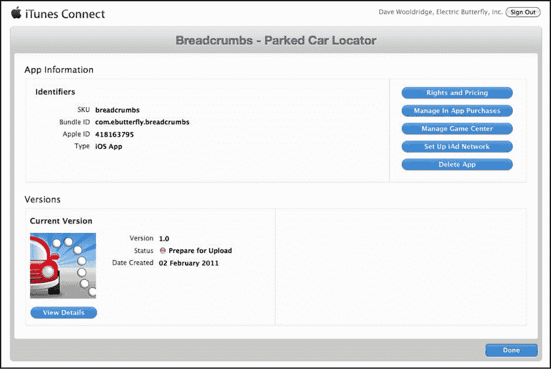

图 11-15. iTunes Connect 中您的新应用列表主摘要页面

在应用的摘要页面上，您可以管理任何相关的 App 内购买项目和其他属性。如果需要在提交应用二进制文件进行审核之前访问和编辑元数据或截图，请单击**查看详情**按钮（参见图 11-16）。

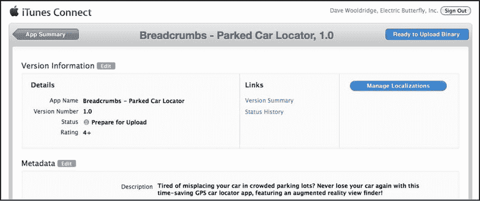

图 11-16. 在提交应用二进制文件进行审核之前，访问**查看详情**页面（可从应用主摘要页面访问）以编辑各种属性。

#### 步骤 6：支持多种语言

如果您的应用目前仅支持您的主要语言，则可以跳过此步骤。在您的应用实际包含对这些语言的本土化支持之前，请不要在 iTunes Connect 中选择其他语言。而那些确实在应用二进制文件中提供了多语言支持的请先留步！

在应用摘要的**查看详情**页面中，有一个**管理本地化**按钮（参见图 11-16）。单击该按钮将转到本地化页面，该页面允许您指定其他语言，以便在支持这些语言的地区性 App Store 中展示。例如，如果您的应用已同时支持英语和日语，您可以在此处添加日语作为其他语言。由于您在第 1 步中选择的主要语言是英语，因此无需再添加英语。

选择其他语言后，您将看到一个新的网页表单，该表单与您之前遇到的应用程序元数据表单几乎完全相同。唯一的区别在于，您需要为 App Store 元数据元素（如应用名称、描述、关键词、支持 URL，甚至可以选择上传本地化截图）提交本地化内容，而不是英语内容。如果您选择不为新语言提交新截图，则将默认使用主要语言的截图。

#### 步骤 7：上传您的应用二进制文件以供 App Store 审核

在本章前面部分，您为 App Store 分发编译了您的应用。现在您刚刚完成了在 iTunes Connect 中添加应用列表的操作，App Store 提交流程的最后一步就是上传您的应用二进制文件。

在继续之前，请花点时间仔细检查 iTunes Connect 应用摘要中列出的详细信息，非常仔细地检查是否有任何错误或拼写错误。一旦上传您的应用二进制文件，它将被添加到 Apple 审核队列中，并且之后只有少数应用元素可以在 iTunes Connect 中编辑（无需提交更新）。换句话说，现在是确保一切正确的时候了！

如果一切看起来没问题，那么请转到 iTunes Connect 中应用的**查看详情**页面（参见图 11-16），并单击屏幕右上角的蓝色**准备上传二进制文件**按钮。您将看到一个**出口合规**页面。

##### 出口合规

由于当前的出口法律，任何包含加密的产品都需要获得出口授权。**出口合规**页面会询问您的应用是否包含加密或访问加密（参见图 11-17）。

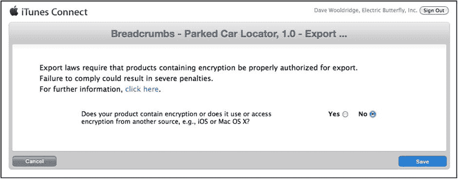

图 11-17. 在您上传应用二进制文件之前，iTunes Connect 要求您回答出口合规问题。

如果答案为**否**，您可以直接继续——只需单击**保存**按钮。

如果答案为**是**，则会出现更多加密问题，需要回答才能继续。根据您回答这些附加问题的方式，系统可能会要求您上传商品分类自动跟踪系统 (CCATS) 文件的副本。

由于出口合规部门必须在您的应用可在 App Store 上架之前审查并批准您的 CCATS 文件，如果要求提供 CCATS 文档，请做好应用审核期比平常更长的准备。如果您以前从未听说过 CCATS，那您的应用很可能不属于此类别。

### 等待上传应用状态

现在您已发起上传应用二进制文件的请求，您应用在 iTunes Connect 中的状态应从**准备上传**更改为**等待上传**（参见图 11-18）。


### 等待上传状态

您的应用状态变为*等待上传*，表示 iTunes Connect 已准备好接收您的应用二进制文件上传。

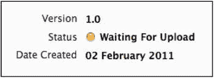
**图 11-18.** 您的应用状态变为*等待上传*，表示 iTunes Connect 现已准备好接收您的应用二进制文件上传。

只有当您的应用状态为*等待上传*时，您才能成功上传应用二进制文件。一旦在 iTunes Connect 的应用主摘要页面上确认了这一点，您就可以返回 Xcode Organizer 了。

##### 在 Xcode Organizer 中提交您的应用二进制文件

还记得本章前面您使用 Xcode 的*构建并归档*选项编译应用的过程吗？请确保您编译好的应用在 Xcode Organizer 的*已归档应用*部分中仍处于选中状态。在窗口底部，您应该会看到三个按钮（见图 11-19）。

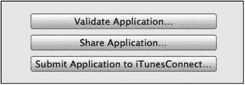
**图 11-19.** 当 iTunes Connect 等待您的二进制文件上传时，您可以在 Xcode Organizer 中验证并提交您的应用以供 App Store 审核。

**注：** 上传应用二进制文件的另一种方法是通过 Xcode 开发者工具下载中包含的 Application Loader 实用程序。在 Apple 文档的多个地方，会指引您使用 Application Loader 将应用二进制文件上传到 iTunes Connect。虽然这确实是一种有效的方法，但大多数 iOS 开发者建议使用 Xcode 的*构建并归档*选项编译应用，并通过最新版本的 Xcode Organizer 上传您的应用二进制文件。

首先，点击*验证应用*按钮。这将执行 Apple 在审核过程中会运行的相同验证测试。如果它通知您应用二进制文件存在任何问题，请借此机会修复问题并重新编译，然后再将应用提交给 Apple。

通过验证检查后，您现在可以点击*将应用提交至 iTunes Connect*按钮。系统将要求您提供 iTunes Connect 登录名和密码以完成提交请求。

就是这样！上传完成后，您的应用状态应变为*等待审核*。

##### 开发者拒绝状态

如果您发现问题，或需要编辑在提交队列中无法触碰的某些资源，那么您可以在 iTunes Connect 中点击应用列表的*拒绝二进制文件*按钮，将应用从审核中撤回。这会将您的应用状态更改为*开发者已拒绝*。

当您准备好后，您需要重新提交一个新的应用二进制文件，这将从头开始审核流程。显然，只有万不得已时您才会这样做。

##### 正在审核状态

当您的应用正在被 Apple 审核时，状态会变为*正在审核*。如果您被要求上传 CCATS 文档，在您的 CCATS 被评估期间，您可能会看到*等待出口合规性*状态。

##### 准备销售状态

如果您的状态显示为*准备销售*，那么您的应用已获批！是时候庆祝这一重要时刻了！

##### 管理您自己的预期

汤姆·佩蒂在唱“等待是最艰难的部分”时从未如此明智。您付出了巨大的努力才走到这一步，即使应用审核过程最终比预期短得多，但在 Apple 确认到来之前，时间的缓慢流逝也会让人觉得极其漫长。要有耐心，小蚂蚱。最好别老想着这事。相反，给自己找个项目忙起来。

您是否已经完成了所有营销材料的创作，比如新闻稿和视频预告片？以及像第 10 章讨论的那样，研究和联系潜在媒体网站以获取评论和新闻机会？

如果您已经处理好了营销任务，那太棒了！当您的应用在 App Store 上线时，您将准备好大展拳脚。但这仍然不是您闲坐无事、拼命看时钟的借口。

没有比现在更好的时间去着手开发您的下一个应用，或者开始为现有应用开发新功能了。无论您做什么，只要让自己忙碌起来，时间就会飞逝。

##### 获取应用状态通知

那些不想每天登录 iTunes Connect 一百万次、焦虑地等待状态信息变化的人，可以选择通过电子邮件直接接收状态更新。在您的 iTunes Connect 用户资料中，只需修改“通知”标签页中的设置，选择接收状态更新邮件即可（见图 11-20）。

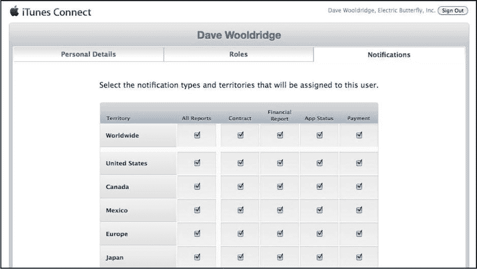
**图 11-20.** 通过更新 iTunes Connect 用户资料中的“通知”标签页，请求在您的应用状态发生变化时接收电子邮件通知。

但如果您担心错过那封至关重要的电子邮件通知，Apple 还提供了一个方便的“状态历史”功能。在 iTunes Connect 的应用列表主摘要页面上，点击*状态历史*链接，即可查看审核过程中已经历了哪些阶段，以及特定操作发生的时间和发起人（您或 Apple）。

**提示：** 为了提供更高的透明度和简化的沟通，Apple 还创建了 Apple 开发者新闻与公告网站，网址为 `http://developer.apple.com/news/`，作为应用提交技巧、iOS 开发者计划更新、SDK 新闻和推荐编程技术的在线资源。这个网站甚至会发布最新的应用审核周转时间，例如“过去 7 天内被审核的 iOS 提交比例：80% 的新应用和 92% 的应用更新。”

##### 再试一次：应对 App Store 拒绝

我们所有人都祈祷，拼命希望不要收到那令人恐惧的*被拒*通知，但如果您提交的 iOS 应用被 Apple 拒绝了，请不要绝望。尽管令人沮丧透顶，但这并非世界末日。软件的好处在于，它总是可以被修改并重新提交！

在 Apple 发送的拒绝信中，审核人员通常会解释您的应用被拒绝的原因，并且如果幸运的话，他们有时甚至会提供如何解决问题的建议。对于简单的问题，比如不恰当的图标或 UI 元素的错误使用，做出必要的调整应该是不费吹灰之力的事情。

无论您是否同意拒绝的理由，这都不重要。重要的是您按照要求进行修复并重新提交您的应用。幸运的是，您重新提交应用的次数没有限制，所以振作起来，继续尝试。您已经走了这么远，不应该让一个小小的争议阻止您在 App Store 赚钱。

对于那些不容易补救的重大拒绝问题，保持冷静并以专业企业主的身份处理此事至关重要。我知道，仅仅是因为一个不被接受的应用就让您几个月的心血付诸东流，这种想法足以让任何人抓狂。您的第一反应可能是写一篇尖刻的博文，试图为您的诉求集结支持者。像 Twitter 这样的社交媒体让召集一群愤怒的在线追随者变得太容易了，但对机器发火不会让您赢得 Apple 或应用审核团队的好感。是的，他们确实会阅读博文和新闻网站。虽然让 TechCrunch 报道您是如何成为又一个应用被拒的受害者，可能会让您个人感到满足，但这无助于您进入 App Store。

而如果 Apple 的拒绝完全合理，因为您的应用违反了其既定的条款和条件，那您真的没有理由抱怨。您的大声咆哮只会让您在同行——开发者社区——眼中显得不专业。


这肯定不会为你赢得任何关注你博客或在推特上关注你的消费者的好感。

如果你认为自己有正当理由认为应用被拒不公，那就和苹果公司沟通。尝试与应用审核你应用的人建立对话。如果行不通，你可以向官方的应用审核委员会提交申诉，网址是 `http://developer.apple.com/appstore/resources/approval/contact.html`。陈述你的理由时，务必深思熟虑、条理清晰，以帮助审核人员理解你的想法。不少被拒的应用，正是因为有说服力的开发者论证和快速重新评估而得以推翻判决。

没人说过应用审核流程是完美的。只需记住，App Store 仍是一个相对较新的市场——其规模增长速度远超苹果（或任何其他人）的预期。被拒很容易让人心烦，但面对超过 100 万款应用涌入 App Store，且每周有超过 45,000 个应用提交，苹果不堪重负的审核团队只是在巨大的压力下尽力做好本职工作而已。

错误确实会发生，但苹果在持续改进流程。虽然这种说法可能让我听起来像个夸夸其谈的粉丝，但请不要误解我的意图。作为开发者自己，当我的创造力和雄心受到商业世界的限制时，我当然会感到沮丧，但随后我会记得，这终究是一门生意。如果我想参与其中，以得体和专业的方式解决问题，才是长期真正成功的唯一途径。

苹果掌握着“王国”的钥匙，所以如果你希望有朝一日在 App Store 中蓬勃发展，那么与苹果公司及其审核团队保持良好的工作关系，才最符合你的利益。

### 通过审核！进入应许之地

所以，那个奇迹般的日子终于到来了。你的应用已通过审核，现在已在 App Store 上架！恭喜你！这确实是一项值得的成就，能为你带来巨大成功，尤其是当你已采取所有必要步骤来有效推广你的应用时。

在 App Store 中查看应用的性能非常简单，只需登录 iTunes Connect，按周或按日查看报告中的销量和下载量即可。注意：追踪销量可能会非常上瘾，并摧毁你每日的生产力。iTunes Connect 还会发布月度财务报告，汇总你的应用销售额和收入。

### 分析你的 App Store 销售统计数据

iTunes Connect 中的销售和趋势报告包含大量数据，可用于分析你的产品生命周期和在市场中的销售表现。但如果你需要更多帮助和像下面这样的附加功能呢？

*   通过桌面应用或移动设备追踪你的 App Store 统计数据
*   自定义统计图表以更好地指导你的营销工作
*   自动化检索和分析销量与下载数据的任务（当你忘记自己做时）

第三方工具和基于网络的服务可以提供这些功能。肯定有一种解决方案能与你的工作流程完美契合。虽然这可能不是一份详尽的清单，但以下是一些可供探索的选项：

*   苹果的 iTunes Connect Mobile (`http://itunes.com/apps/iTunesConnectMobile`) 是一款通用 iPhone 和 iPad 应用，可从 App Store 免费下载，能让你直接访问你的 iTunes Connect 销售和趋势数据。无论你是否使用其他服务（如 appFigures 或 App Annie），这款免费的苹果移动应用都是一种便捷的方式，让你随时随地追踪应用销量。
*   appFigures (`http://www.appfigures.com`) 是一款流行的基于网络的解决方案，支持自动导入你的 iTunes Connect 销售报告，并以动态图形和图表形式呈现数据。除了追踪销量、趋势、App Store 排名和评论外，appFigures 还会每天自动通过电子邮件向你发送报告摘要。你可以选择免费的 Basic 账户，或升级以访问所有 Premium 功能。虽然 appFigures 的网络报告兼容 iOS（在 Mobile Safari 中查看时），但也有一个第三方原生 iPhone 应用用于访问你的 appFigures 账户：由 David Knell 开发的 appTrends，可在 App Store 获取。
*   App Annie (`http://www.appannie.com`)，被称为“你的应用保姆”，是一个全面的应用销售追踪和趋势分析网络服务。它提供许多与 appFigures 相同的功能，以及所有应用的历史 App Store 排名数据。其吸引人的在线仪表盘界面，可以通过桌面浏览器或 iPad 的 Mobile Safari 访问和查看。
*   AppSales Mobile (`https://github.com/omz/AppSales-Mobile`) 是一款 iPhone 应用，可下载并分析你的 iTunes Connect 销售报告。由于它以 GitHub 上的开源形式提供，你需要先在 Xcode 中编译项目，然后以调试构建方式运行才能使用。但这为你提供了灵活性，可以自定义、编译并将软件安装到你自己的移动 iOS 设备上，以满足自身需求。
*   AppStar (`http://www.damabia.com/appstar.php`)，由 Damabia 开发的 Mac OS X 应用，是一款全面的桌面解决方案，用于追踪你的 iTunes Connect 销量和趋势报告、苹果的月度财务销售报告、App Store 排行榜排名和应用评论。它还为你提供了一个内置界面，可将所有应用图标、截图和营销资料整理到一个地方。AppStar 提供为期十天的全功能演示版供下载。
*   AppStore Clerk (`http://blog.fieryferret.com/2008/10/appstore-clerk.html`) 是一款免费的 Mac OS X 应用，可解析你的销售报告，并以简单易读的电子表格形式显示你的应用下载量。它可能不包含此处列出的其他解决方案的先进图表功能，但它作为免费软件慷慨提供（而且开发者甚至也提供了源代码）。
*   AppViz (`http://www.ideaswarm.com/products/appviz/`)，由 Ideaswarm 开发，是一款设计精美的 Mac OS X 应用，可以下载你的 iTunes Connect 销售数据，也可以导入你已经下载到硬盘的报告。与列表中的大多数其他工具一样，它可以通过可视化图表分析和追踪你的销量和下载量，以揭示趋势。它还监控多个应用和账户、App Store 类别排名、客户评论，以及应用内购买产品的销量追踪。这款功能丰富、广受欢迎的桌面应用提供试用版下载。
*   Distimo Monitor (`https://monitor.distimo.com`)，与 appFigures 和 App Annie 类似，是一款全面的基于网络的应用销售追踪工具。此解决方案与此处列出的许多其他产品的不同之处在于，Distimo Monitor 支持所有主要的应用商店，例如苹果的 App Store、谷歌的 Android Market、黑莓的 App World 等——非常适合跨平台移动开发者。
*   Heartbeat (`http://www.heartbeatapp.com`)，是 Mobclix 的一项服务，是一个非常流畅的远程托管网络应用，提供一整套销售追踪、趋势、崩溃报告监控、使用统计数据、App Store 排名、收入支付管理等功能。如果你正在寻找一个用于管理整个 App Store 业务的综合工具，那就注册一个 Mobclix 账户，以利用免费的 Heartbeat。
*   MyAppSales (`https://github.com/Cocoanetics/MyAppSales`) 是一款便捷的 iPhone 应用，类似于 AppSales Mobile，但由于创建者 Oliver Drobnik 的积极开发，它提供了更多的功能。尽管 MyAppSales 现在以开源形式提供，允许你将这款功能丰富的应用编译并运行在自己的 iOS 设备上，但 Oliver 仍然欢迎并感激捐赠。
*   Prismo (`http://positiveteam.`)


`com/products/prismo/mac/` 是 Positive Team 开发的 Mac OS X 应用程序，拥有简洁且简化的 iTunes 风格界面设计。它支持从 iTunes Connect 自动下载报告，以及追踪你的 iPhone 应用和 App 内购产品的排名与销量。Prismo 提供 30 天试用版可供下载。

除了这里已经提到的解决方案，请不要忘记查看 第 2 章 中介绍过的众多 App Store 排名工具，例如 APPlyzer 以及 David Frampton 出色且免费的 MajicRank。

#### 启动引擎

你的应用已在 App Store 中——接下来呢？不，现在还不是休息的时候。我知道你因数月的开发而感到疲惫，但你需要充分利用应用发布后短暂的势头。第 12 章 将启动宣传引擎，提高消费者对你应用上架情况的认知。

## 第 12 章：提高你 iOS 应用的知名度

你的应用已获批准并已在 App Store 中上架销售，那么接下来呢？首先，我想祝贺你取得了这一里程碑式的成就！如果你已经通读全书，并最终在 App Store 中列出了一个应用程序，这本身就是一项了不起的成就。只有同为开发者的人才能真正了解推出一款新软件产品需要付出多少努力和心血。经过数月的精心规划和编程，你值得庆祝一下。虽然此刻你或许最想享受一次迫切需要的假期，但不幸的是，你还不能休息。

是时候启动宣传引擎，以提高消费者对你应用上架情况的认知了。即使你已经实施了前面章节中的各种商业策略，且发布前的营销工作带来了最初的销售激增，但仍有至关重要的工作要做。你的任务是确保你的 iOS 应用不会被淹没在涌入 App Store 的成千上万款新应用中。本章揭示了如何撰写有效的新闻稿、使用兑换码、通过评测和采访获得曝光，以及通过促销、赠品和精心安排的打折活动来保持 App Store 中的发展势头。

### 投入与开发同样多的精力来营销你的应用

如果你购买本书时你的应用已在 App Store 中，并且你决定跳过前面的内容直接阅读本章，我强烈建议你先阅读第 10 章。事实上，我坚持如此。在你阅读完第 10 章 后，本章对你来说会显得更有用。

尽管第 10 章 侧重于发布前的营销，但其主要目标是帮助你在线建立一个坚实的基础。它涵盖了建立网站存在感、通过 Twitter 和 Facebook 建立社交媒体关注度，以及与知名博主和有影响力的 iOS 应用评测网站建立关系。所有这些元素也将作为你发布后营销工作的基础支撑，因此，在你的应用在 App Store 上线之前很久就建立好这些，对你的成功至关重要。

### 以宣传大爆发的方式发布

你希望充分利用应用在 App Store 发布时的初始关注度，因此诀窍是让尽可能多的消费者和新闻媒体同时谈论你的应用。可以将其视为一次宣传方面的“超新星爆发”，以期产生雪球效应。你希望消费者心想：“每个人都在谈论那个应用，它一定很棒！”基于此，在阅读本章时，不要每周只处理一项任务。通读所有主题，然后尝试在同一时间尽可能多地实施它们，以期在初始发布之后很长一段时间内都能维持这股热潮。

### 你应该投入多少时间用于营销你的应用？

最初，每天一两个小时是不够的。是的，我知道你渴望开始开发下一个伟大的应用创意，但在你投身于任何未来项目之前，你新发布的 1.0 版本应用需要关注。你应该准备好在发布后的头两周内，除了推广你的新应用之外什么也不做。请求评测，在 Twitter 和 Facebook 上宣传你的应用，安排媒体采访，发布博客文章，提交你的应用参与评奖，等等。一旦你的营销努力开始以销量增长和（或）在 App Store 排行榜上排名上升的形式获得回报，你就可以逐渐恢复到正常的工作节奏，每天只需花几个小时进行应用营销。

不幸的是，软件营销没有捷径可走。为了让你的 iOS 应用有机会获得成功，你必须愿意投入与开发它同样多的时间和精力来推广你的应用。

### 寻求专业人士的帮助

如果你无法抽出必要的时间进行发布后营销，那么雇佣第三方公司来处理这项工作最符合你的利益。在线搜索“iPhone 应用营销”或“iPhone 营销机构”。你会发现全球有数百家专门从事移动产品发布的营销和公关公司。以下是一些机构，供你了解可用的服务：

*   Appency (`http://www.appency.com`)
*   Appular (`http://appular.com`)
*   App2Market (`http://www.app2market.com`)
*   Apalon App Marketing (`http://www.apalon.com/iphone_marketing.html`)
*   Digital Automat (`http://www.digitalautomat.com`)
*   Mobility Public Relations (`http://www.mobilitypr.com`)
*   PR Mac (`http://www.prmac.com`)
*   TriplePoint PR (`http://www.triplepointpr.com`)

当然，除了这里列出的公司之外，还有很多其他的营销机构。根据你居住地的不同，你可能会觉得雇佣本地公司更合适，因此请进行多次在线搜索，找到能够满足你特定需求的公司。

正如我之前所说，当你雇佣第三方顾问或公司时，你应该在选择之前进行充分的研究。他们不仅应该是应对 App Store 独特挑战和营销 iOS 应用方面的专家，而且他们的做法、政策和绩效也应该非常透明。由于他们代表的是你的公司和产品，他们的行为会反映出你和你的应用形象。

例如，如果一家不道德的公关公司使用其内部的 iTunes 账户，为其所有客户的 App Store 应用批量刷相同的虚假五星好评，那么有人发现其中联系并揭发此事只是时间问题。即使你并不知道这种情况的发生，最终受到损害的还是你的声誉。

众所周知，苹果甚至会从 App Store 中移除那些滥用客户评价系统的应用。显然，大多数公关机构都非常认真地对待其道德责任，并且从不逾越那条界限。我提到这一点只是为了让你在选择一家移动营销公司来推广你的 iPhone 或 iPad 应用之前，做好功课并提出正确的问题。

根据提供的服务水平，经验丰富的第三方营销机构的费用至少为 1000 美元（甚至可能数千美元）。如果你是独立开发者，无法负担外包应用市场营销和宣传的费用，那么你需要在自己的日程安排中腾出必要的时间来亲自处理这项工作。因此，挽起袖子，让我们一起深入吧！

**提示** 及时了解人们何时在谈论你的应用！基于最新的相关搜索结果，Google 快讯是一项出色的免费电子邮件通知服务，它能让你监控特定名称或主题何时在网站、博客甚至 Twitter 上被讨论。我强烈建议你设置 Google 快讯来追踪你的应用名称和公司名称。


# 你甚至可以利用该服务密切关注竞争对手的动态！前往 `http://www.google.com/alerts` 免费注册。

### 撰写有效新闻稿的艺术

一旦你的应用在 App Store 上架，你自然希望全世界都知道它！当然，在 Twitter、Facebook 和你的博客上通知粉丝是重要的第一步。但除此之外，你还希望以更宏大的规模发布消息，以覆盖尽可能多的 iPhone、iPad 和 iPod touch 用户。实现这一目标的方法之一，就是向所有主流科技和移动新闻网站发送新闻稿。

即使你是 Mac 或 iOS 社区中资历深厚的开发者，也不要以为主流新闻媒体会一直关注你的博客或 Twitter 动态。由于记者们每天都要处理海量的科技新闻，你的消息必须能引起他们的注意。因此，请花些时间，将重要的公告直接发送到他们的电子邮箱中。

新闻稿并非仅限于新产品。你可以为任何有新闻价值的事件发送新闻稿，例如新版本应用、限时特惠活动或促销等。

#### 新闻稿的核心要素

那么，如何撰写一篇有效的新闻稿呢？千万不要简单地将你博客上的应用发布公告复制粘贴到邮件里！

新闻稿有其特定的格式要求。遵循新闻稿的标准规则和语法，能帮助记者们快速浏览你的故事并抓住关键信息。

**注意**  是否必须遵循标准的新闻稿格式？不一定。有些开发者通过独特巧妙的公告取得了成功，但务必谨慎，确保新闻稿仍易于阅读并包含所有必要信息。有时“过于创意”可能适得其反，例如，用 Objective-C 代码语法格式写成的新闻稿，可能会在开发者博客圈收获大量关注和赞赏，但对于非程序员背景的记者来说，可能极难解读。如果你执意要为特定收件人创作一份巧妙的新闻稿，请确保另备一份常规版本，发给那些可能“get 不到梗”或无法接受非标准新闻稿的新闻网站。

以 Streaming Colour Studios 为 Dapple 应用发布的新闻稿作为直观示例（参见图 12-1），我将带你逐一解读新闻稿中的每个关键要素，以及它们如何传递记者所需的信息。

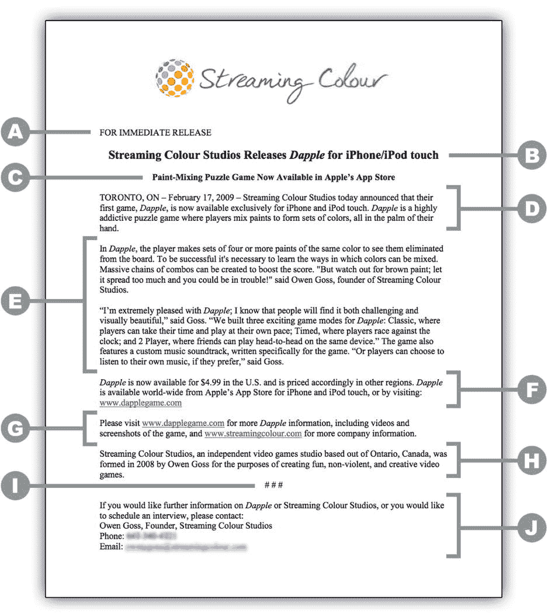

图 12-1. 以 Streaming Colour Studios 的 Dapple 应用公告为例，该图指出了高效新闻稿的核心组成部分

参照图 12-1，让我们逐一审视每个组成部分及其在新闻稿格式中的重要性。

**警告**  那些觉得这些新闻稿撰写规则纯属常识的人，已经领先了一步。但你会惊讶地发现，竟有那么多开发者会在新闻稿中遗漏关键信息——例如定价、网站链接，甚至联系方式。如果记者在撰写优质报道时，遇到额外问题却联系不上你，他们该如何下笔？答案是：他们不会写。不完整的新闻稿只会被直接丢弃，媒体会转向下一条新闻。千万别让这种事发生在你身上！

##### 发布说明 (A)

通常，如果你的应用已经上架，需使用“立即发布”（FOR IMMEDIATE RELEASE，全部大写）字样。

如果你想在产品正式发布前提前发送新闻稿，并希望媒体届时再发布，则可注明“禁发至”（UNDER EMBARGO UNTIL）并加上具体日期。

但请注意，许多新闻网站和博客会刻意无视禁发要求，总是急于抢先报道独家新闻。

如果务必确保你的公告在应用上线前保密，你可能需要等到应用在 App Store 实际亮相当天的早晨再发送新闻稿。一些公关人士建议在前一天晚上发送。问题在于，许多新闻网站是全天候报道的，你的新闻稿可能在你目标受众沉睡的午夜时分被报道。然后到了早上，这条新闻又被更新的新闻淹没了。因此，研究各个 iOS 相关新闻网站和博客的报道习惯是个好主意。这将有助于你更好地判断何时向他们发送新闻稿。

##### 主题行 (B)

新闻稿最重要的元素就是主题行。无论作为电子邮件的主题，还是新闻网站上超链接的标题，这个标题都必须能抓住任何阅读者的眼球。

传统上，主题行的公式是“公司发布适用于平台的产品”，将公司、产品和平台替换为你的具体信息。在图 12-1 中，这对应为“Streaming Colour Studios 发布适用于 iPhone/iPod touch 的 Dapple”。

切记，永远、永远不要在主题行中添加“令人惊叹的”或“激动人心的”这类营销形容词。这样做只会让你的新闻稿看起来像是出自业余人士之手。与其他营销资料不同，新闻稿应只陈述事实，无需华丽的营销行话。但与此同时，为了与每天收到的成百上千份新闻稿竞争，你的主题行既要信息丰富，又要引人入胜。如果你要发布的是某款曾获奖项的现有应用的新版本，那么在主题行中加入“获奖的”一词是完全可接受的。

由于目标是吸引媒体的注意，如果应用名称本身未能体现其独特、开创性的功能，那么请相应调整主题行。例如，与其说“Electric Butterfly 为 iPad 发布 XRayMed”，不如改成“Electric Butterfly 为 iPad 发布首款 X 光阅读器应用”这样的措辞更能吸引眼球。你可以在主题行下方的摘要行中提及你的应用名称。（如果你确实宣称是首个推出某款应用或功能的产品，请务必确保情况属实！）

##### 摘要行 (C)

这是新闻稿中第二重要的元素。如果记者对你的主题行产生了初步兴趣，这句简短的摘要将决定他们是否继续阅读新闻稿的其余部分。许多开发者选择省略这一行，直接用主题行引入开篇段落，但我强烈建议你添加一个摘要行，即使读者就此打住，也能了解基本信息。

以图 12-1 中 Dapple 的新闻稿为例，主题行和摘要行共同传达了以下信息：Streaming Colour Studios 发布了适用于 iPhone 和 iPod touch 的 Dapple，这款调色混合解谜游戏现已在苹果 App Store 上架。即使读者只读了这两行，他们也能掌握最重要的信息：你的应用是什么以及在哪里可以找到它。

##### 引言 (D)

第一段以你的所在地和发布日期开头，随后复述你的主题行和摘要行的内容。这段引言应仅为一个段落，包含寥寥几句。它应说明你的公司发布了某一具体产品，产品的功能、目标受众/平台，以及购买渠道。

##### 描述 (E)

还记得我在第 10 章中谈到的，为你的应用描述构思一个“电梯游说”吗？


紧随开篇段落之后的几段，本质上就是你的电梯演讲描述，无需华丽的营销形容词。新闻稿的主体部分应简明扼要地说明你的应用具体功能、它提供的特性和益处，以及人们为何应该关注。媒体喜欢在报道中引用原话，因此，加入一段公司高管（或许就是你本人？）关于产品创作初衷或它如何代表公司重要里程碑的精妙引语，也是一个好主意。请记住，少即是多。除非你的应用代表了某种需要长篇大论才能解释清楚的、惊天动地的技术突破，否则你的新闻稿不应超过一页。这意味着，如果你使用像 `Microsoft Word` 这样的文字处理软件来撰写新闻稿，整个文档应能适配在一张 8.5×11 英寸、页边距为 1 英寸的页面内。

#### 定价与上市信息

接下来的文本块应包含应用的价格、任何特定的设备硬件或 iOS 版本要求，以及应用的购买渠道。由于大多数 iPhone 和 iPad 应用在多个国家/地区都有售，如果价格以美元标价，请注明这是美国 App Store 的价格，并且应用在其他地区也相应定价。大多数新闻网站面向全球受众，因此，如果你的应用可在 Apple 所有区域 App Store 全球范围内提供，务必提及这一点。如果你还提供免费的精简版，也请务必包含此信息，以便感兴趣的读者可以无风险地下载和试用。

#### 网站 URL 及其他信息

由于一页纸的新闻稿不可能包含关于你新 iOS 应用的所有信息，因此，务必包含应用网站或公司网站的链接。这可以让感兴趣的消费者轻松获取更多信息、截图和视频演示。如果媒体有兴趣报道你的产品，他们也会访问你列出的 URL，以更好地了解你的公司。这也是确保在应用发布前，你拥有一个专业、设计精良的网站的另一个原因。

#### 关于公司

最后一段应描述你的公司。这也是简要提及你获得的任何相关奖项以及你制作的其他知名产品的好地方。记者也是消费者，如果他们认出并欣赏你的其他软件应用，他们可能会更倾向于报道你的新产品。

#### 新闻稿结束标志

页面居中排列的三个井号（`###`）代表新闻稿内容的结束。该标记下方包含的任何内容都视为不应公开发布的信息，例如你的电话号码和其他媒体联系方式。当然，对于那些只是原封不动地发布你发送的电子邮件公告的自动化新闻网站，无论是否有这些标记，整个消息都会被发布。对于这些自动化网站，务必省略任何你不想被发布到网上、供搜索引擎永久索引和缓存的个人联系信息。

#### 媒体联系方式

务必为媒体提供联系你的方式。电子邮件地址是必需的，同时建议提供电话号码。由于国际电话可能相当昂贵，你可以考虑创建一个`Skype`账户或即时通讯账户，并将其列出以代替电话号码。你提供的联系渠道越多越好，因此，附上你的`Twitter`账号也无妨。如果他们喜欢你的应用，说不定就会关注你！这部分也是加入截图图片、视频预告片、官方媒体资料包以及你为 iOS 应用制作的任何其他营销材料的下载链接的好地方。

记者没时间在你的网站上翻找截图，所以请始终包含媒体资源的直接链接。并且别忘了说明你欢迎所有的问题、采访和应用评测。让媒体知道，你随时欢迎他们提出更多询问，并能提供用于评测应用的促销码。（本书稍后会讨论促销码。）

#### 翻译你的新闻稿

大多数主流的 iOS 相关新闻网站都是英文的。如果英语不是你的母语，不要用外语给他们发送新闻稿。当然更不要尝试使用诸如`Google Translate`之类的自动化在线工具来翻译你的新闻稿。要么记者自己无法翻译，要么自动翻译过来的英文会包含大量错误的语法和措辞，让你的公告变得难以阅读。请聘请专业翻译人员将你的新闻稿转换成地道的英文，对于从英文翻译成其他语言也同样处理。与媒体打交道时，第一印象至关重要，因此这是一项值得的投资。

#### 虚拟 24 小时媒体室

虽然你会向尽可能多的 iOS 相关新闻网站发送新闻稿，但你也会希望在你的网站或博客上提供你的新闻稿。你不可能自己联系到所有人。对于那些不在你初始邮件列表中，但自行发现了你应用的记者，请让他们能在线访问你的新闻稿。并且不要只是以`HTML`页面的形式发布它。要让它作为一个独立的下载文件提供，方便记者保存到他们的电脑上以备日后参考。

看过图 12-1 中 Dapple 的新闻稿示例后，它带有公司徽标信笺以及各种字体大小和样式，你可能会想制作类似的——而且你应该这么做！使用大多数文字处理软件很容易做到这一点，并且能让你的新闻稿看起来专业得多。务必以几种流行的格式保存新闻稿，例如`DOC`（`Microsoft Word`）、`RTF`和`PDF`，以确保任何人都能轻松打开和阅读该文件。

在你的网站上创建一个专门的版块来发布你所有的新闻稿。通过在主导航菜单或页脚菜单中添加链接，使其在你网站的任何位置都能轻松访问。大多数开发者倾向于给这个版块起一个直观简单的名字，比如“媒体”或“媒体室”，以便于查找。

虽然在线提供可下载新闻稿的公共存档很好，但不要止步于此。应尽可能方便记者和评测者撰写关于你 iOS 应用的文章，同样提供截图、视频预告片、应用图标和标志，甚至你的公司徽标的下载链接！任何可能对媒体有用的材料都应包含在你的虚拟在线媒体室中。`Streaming Colour Studios` 的在线媒体页面 `http://www.streamingcolour.com/press/` 完美地实现了这一点，而且做得更多。它为每款 iOS 游戏提供了一个方便下载的媒体资料包，其中包含截图、应用图标、公司徽标和一份新闻稿——全部压缩在一个 zip 压缩包中。这个媒体页面还列出了相关奖项、采访和应用评测的链接，以进一步突出其游戏。

在你的网站上维护一个在线媒体专区，将成为那些有兴趣报道你公司或产品的记者和博主（无论他们身处哪个时区）的全面资源。记者们常常面临紧张的截稿时间，因此你的 24 小时虚拟媒体室可以帮助提供即时答案，即使在你无法联系到的时候。当然，也不要坐等媒体来发现你的网站。


建立一个专门的媒体联络板块固然是好事，但你也绝对需要主动向主流的科技和移动新闻网站发布你的新闻稿。

#### 与媒体建立联系

当你直接联系特定的记者和博主时，你的新闻稿不应是他们从你这里收到的第一封邮件。正如第 10 章中所讨论的，你应该在预售营销阶段就已通过一封简短的询问函与他们开启对话，询问他们是否会对独家预览或应用评测感兴趣。由于已经建立了初步联系，他们会对你的新闻稿和未来的公告更加接受。显然，你没有时间和每个人建立联系，但你应该为你列表中最重要、最有影响力的记者和博主做这件事。

除了初次介绍之外，与媒体沟通时需要掌握的另两个关键要素是：呈现方式、发送技巧和礼节。

#### 格式化你的邮件公告

一份带有公司标志、格式精美的新闻稿看起来很棒，但不要仅仅把它作为 PDF 附件，附在一封只要求记者阅读附件的邮件中发送出去。这不仅会确保你的邮件被忽略，而且也是垃圾邮件过滤器的常见标记。如果你的邮件地址尚未被你试图联系的媒体成员列入白名单（这是提前与他们建立关系的另一个原因），那么带有附件的邮件可能会被误标为垃圾邮件。此外，对于那些会自动发布通过邮件发送到其邮件机器人的新闻稿的网站，将新闻稿作为邮件附件发送，几乎使得它们的自动化脚本无法解析你的公告文本。

你的邮件应在正文中包含完整的新闻稿，并将标题行作为邮件的主题行。不要将文本格式化为样式化的富文本或花哨的 HTML 邮件。为了方便记者和邮件机器人轻松复制新闻稿，请使用经过验证的纯文本邮件格式。

由于 Microsoft Word 等文字处理器倾向于插入弯引号、弯撇号、长破折号和其他特殊字符，你需要确保你的新闻稿被转换为标准的 ASCII 纯文本。尽管你的邮件应用程序可能支持 Unicode 字符，但许多网站仍然使用与 ASCII 文本相关的内容类型（例如 `ISO-8859-1`）发布 HTML 页面。新闻网站通常会直接将你的文本复制粘贴到网络上，而不会事先将其转换为 HTML 实体。如果你的新闻稿包含特殊字符，它可能会以奇怪问号符号的形式出现在网上，代表无法识别的字符。这不仅让你的新闻稿看起来不专业，还可能使其难以阅读。

出于你为何不应将新闻稿作为邮件附件发送的相同原因，也不要将你 iOS 应用的截图作为附件发送。如果你认识接收邮件的记者，那么附上一两张截图是完全可以接受的。然而，在大多数情况下，你应该只包含指向截图和视频预告片的直接 URL 链接。这样可以直接访问你的截图和其他宣传材料，而无需面对经常困扰邮件附件的问题。

在邮件中列出 URL 时，一定要包含完整的 URL，包括 `http://` 前缀。大多数现代邮件程序会动态地将完整的 `http` URL 显示为可点击的链接，但对于仅以 `www` 开头的部分 URL，情况并非总是如此。

#### 通知谁？

现在你的新闻稿邮件已经准备好了，那么应该发送给谁呢？在线搜索"iPhone 新闻"和"iPhone 应用评测"，找到那些报道新 iOS 应用发布的网站和博客。

如果你发布的是 iPad 应用，你可能还想搜索与 iPad 相关的新闻网站（尽管大多数 iPhone 新闻网站会报道所有 iOS 相关的事物，包括 iPad）。浏览搜索结果后，你很快就能整理出一个比我本书附录中提供的网站合集更全面的列表。

我附录中的列表由专门报道 iPhone 和 iPad 新闻及应用评测的网站组成，应该能作为一个不错的起点。由于一些主要的 Mac 和 PC 新闻网站也会报道 iOS 应用新闻，我也在其中收录了几个。乍一看，这个长列表可能令人生畏，但请花时间将你的新闻稿发送到尽可能多的相关 iOS 新闻网站上。记住，它们不会全部报道你的新应用发布。你联系的网站越多，你获得的潜在报道就越多，这可以弥补那些忽略你邮件的网站。

在向任何网站或博客发送新闻稿和应用评测请求之前，先查看该网站，了解它们执行的特殊提交政策，以及哪些工作人员负责 iOS 应用新闻和评测。不要在不了解网站的情况下就发送新闻稿或应用评测请求。这样做不仅浪费你的时间，还会激怒那些不报道移动应用新闻或你特定应用类型的网站管理员。例如，不要向像 TouchArcade.com 这样的纯游戏网站发送生产力应用（如写作、瑜伽或高尔夫应用）的新闻稿或评测询问。你绝不想让媒体界的任何人将你的提交视为无知的垃圾邮件。在联系特定网站或个别作者之前，请做好研究。

如果你的应用针对某个特定的利基市场——例如写作、瑜伽或高尔夫——你也应该努力将你的新闻稿发送到这些领域的相关网站和杂志。这些网站和杂志喜欢让读者了解最新的相关产品。即使不是每个人都拥有 iPhone 或 iPad，在特定领域的有针对性的报道，也能帮助接触到那些通常不访问科技网站的新客户。

#### 触达大众

你发送新闻稿的人不会都发布你的公告，但如果你将新闻稿发送到大量的新闻媒体，你一定会得到一些报道。如果你心仪的新闻网站没有提及你的 iOS 应用，也不要气馁。

如果你难以接触到合适的人选，或者难以在 Google News (`http://news.google.com`) 等主流网站上发表，你可能需要寻求专门从事科技新闻的第三方新闻稿分发服务的帮助。在线搜索新闻稿分发服务，你会找到数十种免费和商业服务，例如：

- BeeSaved (`http://beesaved.com`)
- Business Wire (`http://www.businesswire.com`)
- Games Press (`http://www.gamespress.com`)
- The Indie Press Release Service (`http://www.gamerelease.net`)
- iSpreadNews (`http://ispreadnews.com`)
- Newswire (`http://www.newswire.net`)
- prMac (`http://prmac.com`)
- PRWeb (`http://www.prweb.com`)
- PR Newswire (`http://www.prnewswire.com`)
- SoftPressRelease (`http://www.softpressrelease.com`)

在注册特定服务之前，请核实它是否会向你想瞄准的主流新闻媒体分发你的新闻稿。但不要指望这样的服务能够充分覆盖较小的、针对特定领域的 iOS 新闻网站——这可能是一项最适合你亲自完成的工作。

#### 以感谢信强化关系

当记者和博主确实发表了你新应用的故事或评测时，务必给每个人发送一封个人感谢信。即使你的新闻稿没有在他们主要的新闻网站上获得一席之地，只是作为一条链接发布在他们的 Twitter 账户上，这仍然是一种报道，将为你的应用在 App Store 的产品页面带来额外的流量。


# 无论多么微小，任何第三方为你的应用所做的宣传都值得你表示感谢。

通过一封真诚的电子邮件表达谢意，还能帮助你加强与那些记者和博客作者的关系。与他们建立对话，可以保持这些宝贵联系的通畅，这样你就可以继续向他们发送新的应用发布公告。

### 发放促销码：在有影响力的博客和评测网站上争取应用评测

对于那些发布应用评测的网站，你不仅需要向他们发送新闻稿，还应该联系他们撰写关于你应用的评测，这需要一个略有调整的推介方式。

由于 App Store 中拥有超过 100 万个应用，每个人都希望自己的应用被评测，那么你如何确保自己的应用能从众多应用中脱颖而出？这正是与知名博主和应用评测者建立良好关系（如第 10 章所讨论的）能够帮助你的应用排到队列前列的地方。如果你在发布前的营销活动中，已经向他们展示了预览截图和视频预告片，并给他们留下了深刻印象，那么当他们有机会时，很可能会愿意评测你的应用。

#### 提供评测材料

你的应用评测推介应包含新闻稿中的所有信息，再加上额外的媒体材料，例如几张截图、一个视频预告片以及应用图标——基本上就是你网站“新闻页面”和/或可下载的媒体资料包中的所有元素。根据每个网站的具体提交规则，评测者可能要求你将截图和其他与应用相关的图片作为电子邮件附件发送，或者要求你提供材料的在线 URL。有些网站只接受通过在线表格提交的应用评测请求。

以下是大多数应用评测者要求的材料清单：

-   **你的电梯演讲：** 为什么评测者应该关注你的应用或游戏？你需要让他们认同你的新应用对其读者很重要。我在第 10 章中提到的如何撰写电梯演讲的技巧，在你几乎所有的营销工作中——你的网站、App Store 文字、新闻稿，以及现在的应用评测请求——都被证明非常有用！利用你的电梯演讲来构建一个吸引人的邮件主题行和应用描述。这两个元素需要传达出你作为应用创作者的激情和兴奋。评测者非常繁忙，因此简洁是关键。与新闻稿一样，你的应用描述应该简短。并且永远记得包含你应用的价格！

-   **三到五张截图：** 不要给评测者塞太多截图。挑选最能代表你应用的三张，只提交这些。如果一个网站要求你提交更多，那么把你已经上传到 App Store 的那五张截图发过去，因为这些显然是经过挑选最能代表你应用的图片。

-   **视频预告片：** 如果你制作了展示应用或游戏运行状态的视频预告片，也一定要附上观看链接的 URL。正如我在第 10 章中提到的，要密切关注制作价值，因为你的视频预告片直接反映了你应用的质量。一个制作精良的视频预告片可以在不到两分钟内让评测者了解你的应用——这比下载并试驾你的应用花费的时间还要少。这往往能成为决定你的应用是否会被评测的关键因素。

-   **应用图标和 App Store URL：** 尽管有些评测者不要求提供你的应用图标图片，但你始终应该附上指向你应用在 App Store 中的直接链接。这使他们能够查看你的 App Store 列表，并从他们的评测中链接到它。与其复制从 App Store 获得的又长又复杂的 URL，通常更容易的方法是提供苹果的短 iTunes 链接格式 `http://itunes.com/apps/APPNAME`，将 `APPNAME` 替换为你的应用在 App Store 中的官方名称。例如，流行的 Bump 应用的链接是 `http://itunes.com/apps/bump`。对于那些接受应用图标图片的评测者，请提供高质量 512 × 512 像素的版本以获得最大灵活性。

-   **应用网站 URL：** 一定要包含指向你应用网站的链接，以便评测者能够探索你提供的任何其他在线资源。如果评测中没有链接到你的网站，请不要失望。iTunes 联盟计划是许多评测网站的主要收入来源，因此通常评测只会通过联盟链接将读者引导到你在 App Store 中的应用。

-   **联系信息：** 与你的新闻稿一样，确保提供所有相关的联系信息，例如你的姓名、公司名称、电子邮件地址、电话号码、Skype、即时通讯工具和 Twitter 账号。你提供的选择越多越好。令人惊讶的是，有多少开发者会忘记包含这些至关重要的细节。如果评测者因有额外问题而联系不上你，仅此一点就可能阻止评测的撰写。

-   **促销码：** 许多网站会告诉你不要在应用评测请求中包含促销码，并声明如果他们在评估你的提交后有兴趣评测该应用，他们会向你索要促销码。他们不想为不打算评测的应用浪费促销码，这很好，但这里有个小秘密。如果你在最初的评测请求中就提供了促销码，那么你就为他们免费下载并立即试用你的应用提供了极大的便利。他们很可能会使用你提供的促销码，而你被评测的机会也会增加那么一点点！苹果限制了每个应用版本可以发放的促销码数量（50 个），所以你需要谨慎使用促销码。只在首次提交时向最流行和最有影响力的评测网站提供它们。

不确定什么是促销码？我将在下一节解释它们是什么以及如何获取。

#### 获取促销码

促销码是特殊代码，你可以用它们向别人提供你的应用的免费副本。促销码的工作原理与 iTunes 礼品卡代码完全相同，并且以相同的方式兑换。这是向记者、博客作者和应用评测者免费提供产品下载的简便推荐方法。

一个促销码被分配给 iTunes Store 中的特定项目。在这里，它对应的是你的 iOS 应用。如果用户兑换了你提供的促销码，只会免费下载相关的应用。该促销码不能用于下载任何其他项目。与礼品卡一样，一旦促销码被兑换，就永远无法再次使用，这可以防止盗版。

促销码不与个人的 iTunes 账户绑定，所以你可以像对待现金一样对待它们。你可以将促销码赠送给任何你想要的人。

每次应用更新，苹果只授予你 50 个促销码。因此，如果你在 1.0 版本中用完了所有 50 个促销码，那么在下一个应用更新上传并通过 App Store 审核之前，你将无法再请求任何促销码。

虽然 50 个听起来可能很多，但这些促销码消失的速度可能比你预期的要快得多。每个人都喜欢免费应用，所以会有很多人向你索要促销码，但请谨慎使用。

你的首要任务是确保你有足够的促销码用于媒体和应用评测。之后，你可以将剩余的用于赠品和推广活动。但我建议总是保留几个促销码，以防将来出现令人兴奋的应用评测或营销机会。

那么，如何为你的 iOS 应用获取促销码呢？与你的 App Store 产品相关的所有其他事务一样，促销码通过苹果的 iTunes Connect 网站进行管理。登录 `http://itunesconnect.apple.com` 的 iTunes Connect，在“管理你的应用”部分，选择你的应用。然后导航到你应用的“查看详细信息”页面。


此后，您可进入“促销码”界面，输入所需的促销码数量（只要不超过当前应用更新剩余的促销码配额）。若配额尚未用尽，随时返回 iTunes Connect 申请更多促销码即可。

如果应用“查看详情”页面上没有显示促销码的链接或按钮，说明该应用尚未获得 Apple 批准。由于促销码需通过 iTunes 兑换，您的应用必须在 App Store 上架销售后，才能申请促销码。

若想在应用上架 App Store 之前将预览版发给他人审阅，显然无法通过发放促销码实现。此时唯一的选择是利用“临时分发”将应用提供给审阅者。大多数（即便不是全部）应用评测网站都能提供设备 ID，且只要对方同意提前评测，便会接受临时分发版本。更何况，备受期待的应用的抢先预览和独家报道正是媒体渴求的内容，他们很乐意应对临时分发及配置文件过期等繁琐问题。

但请记住，您每年所有应用合起来只能注册 100 个设备 ID，而 Apple 为每次应用更新提供 50 个促销码，则慷慨得多。如果应用已在 App Store 上架，请勿浪费宝贵的临时分发设备 ID 配额，应改用促销码——这也是评测者更青睐的方式。

#### 宣传需要规划与耐心

不要以为发送了促销码就自动能换来一篇应用评测。即便评测者最终撰写了相关文章，时间也可能出乎您的预料。正如前面提到的，记者和评测者极其繁忙，每天都会收到数百条新产品发布和评测请求。他们可能需要数天甚至数周才能回复您的询问，请保持耐心。

我知道这听起来像是老生常谈，但这恰恰说明了为何在早期预发布营销阶段与媒体建立关系如此重要。凡事皆需时间，宣传也不例外，因此要提前规划。

如果某家重要的应用评测网站未能及时回复您的提交，无论如何，切勿行贿、乞求或博取同情。当然，也绝不要用铺天盖地的邮件和电话去骚扰他们。此类行为不仅会毁掉被报道的机会，甚至可能导致您和您的公司被该网站拉黑。

在初次联系博主和评测者时，不妨先问两个简单问题，以便提前消除许多不确定性：

* 收到新闻稿或应用评测请求后，通常需要多久才能撰写并发布文章或评测？
* 如果未收到回复，我是否可以在一两周后再次跟进？

如果您施压过猛，结果可能适得其反。如果您正与一位运营热门应用评测博客的开发者打交道，却难以让他承诺撰写评测，请谨慎行事。请记住，原因可能是他不喜欢您的应用，又不想写负面评价——作为开发者，他深知创作过程中的艰辛。若您继续纠缠，他或许会选择发布差评以摆脱您的打扰。这显然对您毫无帮助，因此对每个潜在机会都要保持耐心。

若您急于加快应用评测流程并插队，有些网站提供付费加急评测服务。但坦白说，我并不赞成购买评测，尤其当某些网站要求您同意赞助或购买高级评测套餐才肯撰写时。

由于我个人不认可这种策略，此处不列出这些网站的名称。您在申请应用评测时很容易发现它们。当然，我理解道德困境在一定程度上有所缓解，因为费用只保证会有一篇评测出炉，并不保证好评。您付了费，仍可能得到差评。

既然要走这条路，何不干脆为客观评测付费，将其发布在受众最广的地方——App Store 呢！Truevoo（`http://www.truevoo.com`）就提供这种按评测付费的服务，而且您甚至无需浪费任何促销码！您只需支付应用本身的费用加上每篇评测的小额服务费。当发布的评测出现在 App Store 后，评测者会获得应用费用报销，相当于免费获得应用。

即便您鼓励满意的用户发布 App Store 评测，在应用上架的头一两天也无济于事。您会大力推广应用发布，尽可能吸引流量到 App Store 的产品页面，但在最初几天可能只有寥寥几条用户评测。缺乏足够数量的评测，消费者可能会犹豫是否购买。而如果应用在 App Store 有十几条以上评测，似乎就能改变人们的观感，让他们更愿意下单购买。

如果您有几位愿意发布评测的朋友或同行，那么在应用上架后的关键头几天，牺牲十个促销码来确保 App Store 中有足够数量的评测是值得的。您还可以在 AppGiveaway（`http://www.appgiveaway.com`）或通过 Twitter 和 Facebook 账号赠送几个促销码，以换取一些 App Store 评测。只需确保参与者发布的是诚实、客观的评测。上架第一天就全是五星评价，会显得相当可疑！

### 利用促销与赠品提升应用被发现率

谁不喜欢免费的东西呢？赠送有价值的东西是吸引人们关注您的 iOS 应用的好方法，尤其是当免费赠送的就是应用本身！将应用价格临时降至免费（持续一天或一个周末），有助于提升它在 App Store“免费 App 排行榜”中的排名——尤其是在您将此限时优惠告知所有 iOS 相关新闻网站的情况下。这些网站热衷于报道降价和免费活动，因此这一举措能为您的应用带来大量曝光。如果您与流行的赠品网站（如下面这些服务）合作，额外的宣传将切实提升应用在 App Store 排行榜中的排名和可见度。

* FreeAppADay（`http://www.freeappaday.com`）及其相关的 FreeAppADay Store iPhone 应用（见图 12-2）
* Free App Calendar（`http://www.freeappcalendar.com`）
* GiveawayEZ（`http://www.giveawayez.com`）
* OpenFeint 的 Free Game of the Day 网站（`http://freegameoftheday.com`）及其相关的 Game Channel iPhone 应用（见图 12-2）

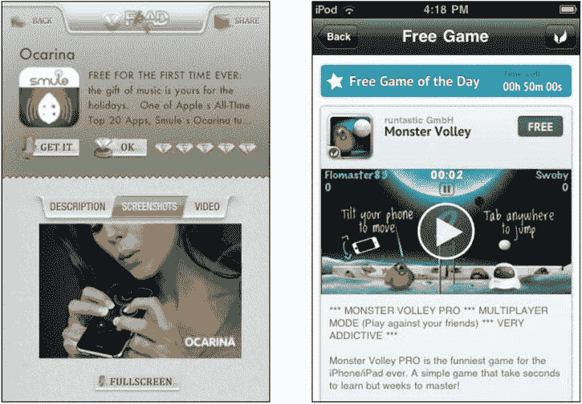

图 12-2。除了各自网站的访客外，FreeAppADay Store 应用（左）和 OpenFeint 的免费 Game Channel 应用（右）还能直接将免费应用优惠推广给移动用户

如果您抓耳挠腮，想不通免费赠送应用如何盈利，那说明您还没看到全局。没错，您无法从那些免费下载应用的用户那里赚到钱，而且免费活动结束后，付费应用销量也不会出现大幅飙升。那为什么还要这么做？此策略的核心在于“向上销售”。

通过限时移除价格门槛，您可能吸引数千名新用户享受免费下载。


这些新客户原本可能不会购买你的应用。因此，成千上万的新用户将首次发现你的应用。如果他们喜欢这款免费应用，你就扩大了客户基础，并有机会在未来通过应用内购买内容和其他新应用进行追加销售。即使你之前已经在免费精简版中这样做过，用户群体的规模也会存在巨大差异。你那款相对不知名的应用的精简版，可能数月内能触达 5 万用户；而一个大力宣传的周末限免活动，让你完整付费版在短短几天内就能为现有客户群增加超过 10 万新用户。

这种策略只有在你能找到方法，最终将大部分新用户转化为付费客户时才有效。在你的应用中提供应用内购买项目，或交叉推广另一款付费应用，可以降低此类免费赠送活动的风险。

Robert Szeleney 与 FreeAppADay 合作，将其广受欢迎的游戏《Rope’n’Fly》在 App Store 限时免费下载一天。他这样做明确是为了提高新作《Rope’n’Fly 2》的知名度。他利用这次免费下载的机会，在原始游戏的主屏幕上推广续作（参见图 12-3），从而接触到了更广泛的用户群。这种额外的曝光帮助《Rope’n’Fly 2》成功跻身 App Store 付费应用排行榜前 50 名。

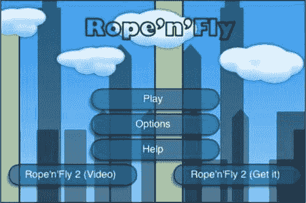

图 12-3。通过提供《Rope’n’Fly》的一天限免下载，游戏主屏幕帮助向更广泛的受众推广了新的付费续作《Rope’n’Fly 2》。

如果你目前只有一款应用，并且没有计划集成应用内购买，那么提供限时免费下载虽然有助于在 App Store 中发现应用并提高可见性，但可能无法提升你的销售额。《Candy Cane》是幸运的，它豪赌一把，短期赠送《Fling!》，将该游戏推到了 App Store 免费应用排行榜的榜首。当《Fling!》恢复原价后，用户们的积极口碑推荐带来了足够的销量，使其一举冲入美国付费应用排行榜前 50 名。

如果你对自己的应用质量有信心，那么限时免费策略可能奏效，但这有风险。对于大多数尝试这种方法的应用而言，开发者会在免费活动结束后看到销售额略有回升，但持续时间不长。如果没有办法通过应用内购买项目进行追加销售，或交叉推广其他产品，这种免费策略往往难以证明其合理性。

如果你担心会蚕食潜在的应用销售，那为什么不赠送点别的东西呢？Tap Tap Tap 就是这么做的。为了推广变声应用 Voices，Tap Tap Tap 与 Potion Factory 合作，免费赠送其 Mac OS X 平台下的 Voice Candy 应用程序。为了帮助推广 Voices 这款 iPhone 应用，用户必须在 Twitter 上发布关于此次特惠活动的推文，才能下载免费的 Voice Candy。Tap Tap Tap 通过 MacHeist 的邮件列表和 Twitter feed 宣布了这次“推文风暴”推广活动，最初覆盖了近 60 万用户。消息通过 Twitter 传播开来，越来越多的人找到了该网站。然后他们发布推文以获得这款免费的 Mac 软件。

Tap Tap Tap 成功开展了一场病毒式营销活动，激励了数万人在 Twitter 上发布该活动的消息，结果导致数十万人查看了 Voices 应用。该网站不仅提供了推广详情，还通过演示视频和 App Store 购买按钮精美地展示了 Tap Tap Tap 的 Voices 应用（参见图 12-4）。果然，这招奏效了。

凭借仅 99 美分的入门价格，在头几天内就有足够多的人购买了该应用，使得 Voices 迅速飙升至美国付费应用排行榜的第一名。

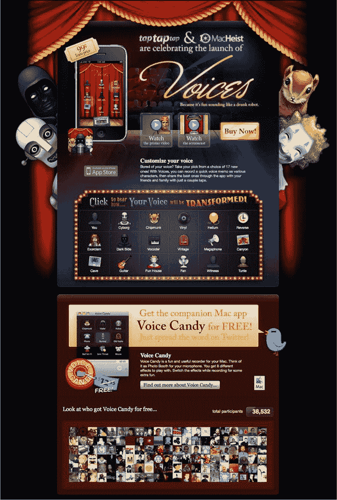

图 12-4。通过向任何发布特惠活动推文的用户免费赠送 Mac 版 Voice Candy，Tap Tap Tap 巧妙的推文风暴活动帮助 Voices 登顶美国 App Store 付费应用排行榜。

由于 Tap Tap Tap 的 John Casasanta 是 MacHeist 的创始人，该公司拥有接触极其庞大目标受众的独特渠道。显然，大多数独立开发者不会有像 MacHeist 那样庞大的邮件列表，但这种基于社交媒体的推广在较小规模上仍然有效。如果你遵循了我在第 10 章中的建议，并在过去几个月里通过 Twitter、Facebook、电子邮件新闻通讯和博客读者培养了自己的受众，那么你应该拥有一个足够大的基础，来沟通特惠活动、赠品以及其他应用相关新闻。

任何在线推广活动，尤其是利用社交媒体的活动，都应以扩大受众为目标。不要在没有获得有价值的回报联系的情况下，就免费赠送软件、推广码或奖品。即使人们发布了关于你应用的推文，也不能保证这些推文会转化为销量。但如果为了参与推广活动，人们必须关注你的 Twitter 或订阅你的免费电子邮件新闻通讯，那么无论结果如何，你的营销努力都将得到回报。

这正是 Tap Tap Tap 在其 Voices 推文风暴活动中所做的。为了获得免费的 Voice Candy 软件，参与者需要先注册一个免费的 MacHeist 帐户，在 Twitter 上关注 `@TapTapTap`，然后发布一条非常具体的消息。即使这次推广活动没有为 Voices 的销量带来大幅提升，它也增加了数千名新的 Twitter 关注者和 MacHeist 会员，使得 Tap Tap Tap 将来能够更轻松地通过特惠活动和新产品公告再次触达这些用户。

### 把握促销时机，重振应用下载量

与免费赠送一样，许多在线应用目录和应用评测网站也会大量报道促销价格，因此额外的宣传无疑会为你的应用在 App Store 中带来更多流量。精心策划的促销活动将吸引那些通常不会以正常价格购买你应用的新客户。在促销期间，你每笔销售的利润会减少，但理想情况下，销量的增长可以弥补这一差额。

目标是超过你通常的每日收入，并在 App Store 排行榜上攀升。你的排名越高，你的应用在 App Store 中的可见性就越高，尤其是当你的促销价格将应用推入前 100 名时。这种可见性将你的产品展示给那些以前可能不知道它的新消费者。看到你的应用在 App Store 中表现良好，会促使用户前去查看。这有点像是一个恶性循环。你必须卖出大量产品才能在 App Store 排行榜上排名靠前，但一旦进入前 100 名，这种可见性又会帮助你卖出更多。只要这个排名能维持，就继续提供折扣价格。当你的应用最终跌出排行榜时，你可以评估是否要恢复原价。

一些 iOS 开发者在他们的新应用一登陆 App Store 时就提供特殊的入门低价。如果这是一款生命周期短暂、依赖热门度的产品，比如游戏或新奇应用，需要依靠在 App Store 排行榜上的较高排名才能生存，那么即时促销价可以最大化其成功的机会。但是，如果你开发了一款针对特定受众的小众应用，那么一上市就打折可能被证明是一个糟糕的举动。


与许多依赖热度的游戏不同，效率类应用通常拥有更长的生命周期，因为它们满足了特定的需求。如果你的应用拥有独特功能且市场需求显著，早期用户会毫不犹豫地按原价付费。如果在发布当天提供折扣，你等于是以低于用户心理预期的价格卖给他们（这对消费者有利，但对你的利润不利）。由于大多数小众应用在 App Store 整体榜单上排名并不高，因此首日促销价只会减少你本可以按原价销售同等下载量所获得的收入。

当应用最初的热度开始下降，周收入逐渐滑入产品生命周期的“长尾”阶段（如第 8 章所述），这正是举办促销活动的最佳时机。降价有助于吸引新用户，重燃对应用的兴趣。如果你发现折扣能够维持可接受的销售水平，你甚至可以决定在应用剩余的 App Store 生命周期中永久保持这一价格点。

一款应用的促销活动如果反响良好，也能对你在 App Store 中的其他产品线产生积极影响。享受新购应用的用户会对你的其他产品感到好奇。如果你在每款应用内有效地进行交叉推广，那么折扣应用下载量的激增也会带动其他应用的流量，通常会带来更多购买。

### 应用内广告能否促进销售？

这是 iOS 开发者最常问的问题之一。答案可能比你预期的更不确定。如果你选对了媒介和市场，为应用投放广告所带来的销售额足以证明其花费是值得的，但这说起来容易做起来难。

除非你使用苹果的`iAd for Developers`项目或像`Tapjoy`这样的按安装付费激励方案，否则很难准确追踪你的广告活动的转化率。网页和移动广告网络会追踪指向 App Store 的点击量，苹果会追踪你应用的销售情况，但如何将这两份报告关联起来，准确判断有多少广告点击转化为了实际的应用销售呢？实现这一点的方法之一是使用`iTunes Affiliate Program`链接作为你的广告链接。除了能从通过 iTunes 联盟链接产生的所有销售额中获得 5%的佣金外（如第 6 章所述），这也是追踪哪些广告点击带来了应用销售的好方法。如果你已经在你的网站上使用了类似的联盟链接，`LinkShare`允许你为广告中使用的 iTunes 联盟链接分配一个唯一的签名 ID，这样就能在你的`LinkShare`报告中轻松识别来自广告的点击和销售。

#### 向移动受众投放广告

如果你打算尝试广告投放，应首先尝试移动广告，因为它们最具针对性。正如我多次提到的，超过 90%的 iPhone 用户直接从移动设备的 App Store 下载应用。这是你的目标受众，那么还有什么比在另一款 iOS 应用内或移动网站上投放广告更好的方式呢？

如果你已经使用`AdMob`在自己的应用中集成了应用内广告（如第 7 章所述），那么你将能够受益于其`Download Exchange`项目。该项目允许你通过出让一部分应用广告库存，在旗下网络的其他应用中对你的应用进行推广。Optime Software 的 Jon Schlegel 发现，这是一种测试初期广告非常经济有效的方式。“我们通常使用`AdMob Download Exchange`来推广新发布的应用，”Jon 说。“来自`Download Exchange`的额外下载量有时足以将应用推送到 App Store 排行榜的更高位置。”

当然，如果你的应用没有内置广告功能，你就需要为广告活动付费。由于是按点击付费，请在广告中包含价格和简短描述，以防止好奇的用户仅仅为了了解价格或应用功能而点击广告。由于广告通常相当昂贵，如果你的应用仅定价 99 美分，那么你需要非常小心，确保广告支出不超过新销售可能带来的收入。

在广告活动持续进行时，请密切关注`iTunes Connect`中的每日销售报告，看看是否能识别出由广告引起的销售高峰。如果你的广告使用了`iTunes Affiliate Program`链接，那么通过你的`LinkShare`报告来追踪广告的销售表现会容易得多。如果你没有看到任何显著的销售影响，你可能需要修改广告活动，看看效果是否有所改善。

不要害怕持续调整你的广告文案，直到找到一条证明行之有效的信息。重要的是在放弃广告活动之前，给它足够的时间来发挥作用。成功的广告宣传关键在于频率和数量。只投放几天的广告不足以恰当地评估其效果。重复是游戏的名称。人们可能需要看到一则广告数次后才会被激发去点击它，特别是当他们沉浸在当前应用中而没有太多注意嵌入的应用内广告时。

平均点击率通常徘徊在广告展示量的 2%左右，即便如此，也无法保证这些 App Store 访客会购买应用。你的广告活动需要被数百万 iOS 用户看到，才能为你 App Store 页面带来足够的流量。但如果这么大流量仍然没有带来销售，怎么办？

许多开发者发现，推广免费增值应用或免费版应用比推广付费应用产生的转化率要高得多，因为消费者下载免费应用没有任何风险。然后，免费增值应用或免费版应用可以充当催化剂，作为更好的销售工具来促进应用内购买项目或付费应用的销售。Focused Apps 的 Mark Johnson 透露：“我们曾通过仅花费 1000 美元移动广告就将一款免费应用推入 Top 100 榜单，并在许多国家进入 Top 10。这对于付费应用来说要难得多。”

如果你涉足网页广告，在搜索引擎和热门门户网站上购买关键词和广告对于低价移动应用来说往往过于昂贵，更不用说点击你广告的一些人可能甚至没有 iOS 设备。你最好的选择是将网页广告精力集中在专门针对你应用受众的细分网站上。例如，如果是一款游戏，可以在流行的 iOS 游戏网站如`TouchArcade`（`http://toucharcade.com`）上投放广告。

对于大多数移动应用来说，印刷广告很难证明其价值。它不仅昂贵，而且无法像可点击的在线广告那样立即将用户引导至你的 App Store 页面。你的 URL 被印刷在纸上，这要求感兴趣的读者在下次坐在电脑前或使用移动设备时手动将 URL 输入到浏览器中。到那时，他们可能已经忘记了你的广告。如果你是一个预算紧张的独立开发者，那么印刷广告可能超出了你的能力范围——坚持使用网页和移动广告吧。

如果你在一家拥有庞大广告预算的大公司工作，那么印刷广告在强化品牌身份方面可能非常有效。


#### 平面杂志广告与 App 生命周期

平面杂志通常需要三个月的提前量，因此当你的印刷广告刊出时，你的 App 可能已经进入了其生命周期的长尾阶段——而这正是广告重新激发消费者兴趣和 App 下载量的绝佳时机。只要瞄准正确的受众，广告就能发挥作用。不过在贸然投入之前，需谨慎评估它是否适合你的 iOS App。请记住，没有任何单一的营销策略能让你的 App 成为畅销品。如果你将本书学到的众多策略整合成一个精心策划的营销计划，你很快就能在 App Store 中走上成功之路。

## 善用面向开发者的 `iAd`

苹果面向开发者的 `iAd` 计划与其他应用内广告方案的不同之处在于，它能将 App Store 无缝融入展示你 `iAd` 的主机应用中。当用户点击面向开发者的 `iAd` 横幅时，他们会看到一个类似于 App Store 产品页面的屏幕，其中显示了你 App 的信息，包括描述、用户评分、截图，甚至购买按钮。

苹果已将此系统与 iOS 和 App Store 深度集成，用户无需离开当前主机应用，即可在该屏幕上购买你的 App。他们可以继续使用当前应用，而新购买的 App 会在后台下载到设备中。这对顾客毫无不便之处，而你则增加了一笔新销售！

由于苹果控制了从广告展示到购买再到下载的整个流程，你的面向开发者的 `iAd` 活动报告能提供从点击到实际购买的转化率的精确数据。由于你是按点击付费，这相当于你的每次获取成本——即基于你付费的点击次数计算，该活动获取新客户的实际成本。

尽管苹果设计面向开发者的 `iAd` 计划，是希望为独立应用创作者提供高性价比的解决方案，但 `iAd` 网络仍应被视为一个优质广告平台，因此其单次点击费用高于许多其他移动广告网络。由于 `iAd` 是消费者信赖的苹果品牌，如果你拥有合适的产品与价格组合，那么这份溢价可能物超所值。

由于大量的 `iAd` 点击未能转化为足够多的实际购买，一些开发者发现每次获取成本远高于 App 本身的价格。如果你销售的是 99 美分的 App，这笔广告费用很难合理化。除非你有应用内购买项目可以向上销售给这些新客户，否则你很可能在亏损而非盈利。

但价格较高的付费 App 和免费增值 App 可能更适合面向开发者的 `iAd`。对许多开发者而言，它产生的每次获取成本优于其他移动广告网络。苹果宣布，参与面向开发者的 `iAd` 计划的客户中，有 75% 续订了他们的广告活动。

与任何其他广告投资一样，如果你认为你的 App 能从面向开发者的 `iAd` 计划中受益，请用你能负担的试算预算先测试一下。通过密切监控广告活动的表现，你很快就能判断它是否为你的 App 带来了有利可图的销售工具。要了解有关面向开发者的 `iAd` 计划的更多信息，请查看 `http://advertising.apple.com/developers/`。

#### 按安装付费激励实现交叉销售

另一个有趣的广告概念是按安装付费激励。这种方法并非简单地在其他应用内按安装量付费（寄望于可观的转化率），而是提供激励措施来促使更多用户安装被广告的 App。这通常只在游戏中效果良好，用户通过下载特定 App 来换取某种游戏内虚拟货币奖励。

例如，NimbleBit 的《Pocket Frogs》向从 App Store 下载指定 App 的用户赠送一只免费虚拟青蛙（参见图 12-5）。

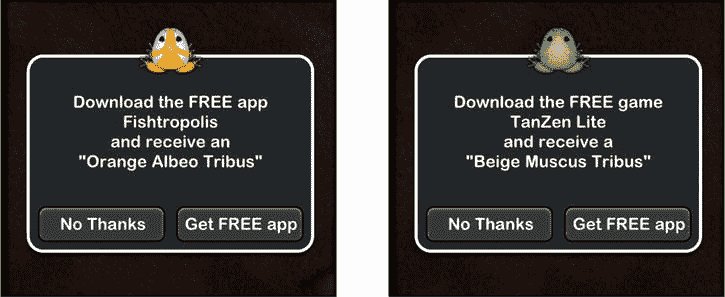

图 12-5。作为下载指定 App 的激励，NimbleBit 的《Pocket Frogs》用一只免费的稀有游戏内青蛙奖励这些用户

这种系统通常需要一种检测方法来验证参与的 App 已被下载并至少运行一次。主机应用需要得到任务成功完成的通知，然后用户应获得承诺的游戏内激励。

一些开发者之间建立了战略联盟，通过游戏内奖励作为下载激励来互相推广对方的 App。这对所有参与方都很有效，尽管结果规模通常较小。

要真正利用这个概念并覆盖更多游戏中的更广泛受众，你可能会想使用第三方服务——例如 Tapjoy (`https://www.tapjoy.com`) 或 Flurry 的 AppCircle Rewards (`http://www.flurry.com/product/appcircle/rewards/`)——这些服务专门从事按安装付费激励。通过将你的 App 推广与同类型 App 配对以触达高度定向的受众，这些计划已知能每天驱动数十万次新安装，从而将你的 App 推入 App Store 排行榜前列。尽管这类活动通常比传统横幅广告更昂贵，但它们能真正提升 App 销量。这在免费增值游戏中尤其有效，因为用户下载没有成本障碍，一旦对游戏玩法上瘾，应用内购买就能分摊按安装付费活动的费用。

### 与客户保持联系

维持消费者对你 App 的兴趣不仅在于吸引新客户，还在于让现有客户保持满意。还记得我在第 8 章中谈到忠实客户是最好的客户吗？建立客户忠诚度的方法是通过高质量的支持，并及时交付错误修复以及附加功能/内容。

#### 频繁发布 App 更新

不要等几个月才发布 App 的新版本。即使没有报告任何错误或崩溃，你也应该定期更新 App，以提供额外的优化和价值。缺乏更新可能会对客户在 App Store 中对你 App 的看法产生负面影响。如果消费者注意到你的 App 好几个月没有更新，他们可能会因担心该 App 不再得到积极支持而不愿购买。

通过持续更新 App，你不仅提升了用户体验，还让你的 App 保持在用户脑海中。即使由于新 App 购买的干扰，你 App 的整体客户使用率最终下降，但每当新版本出现在客户的更新列表中时，它都会巧妙地提醒用户你 App 的价值以及你对支持它的承诺。

如果客户对你的 App 感到满意，他们就会更有动力向你购买应用内购买项目和其他新产品。稳定的更新流也有助于维持客户使用率，如果你的主要收入来源是应用内广告，这一点就极其重要。只要你持续提供有回报且有趣的体验，人们就会继续谈论你的 App。持续的更新和高质量的客户支持是推动口碑传播的重要因素。

#### 提供高质量支持

在之前的章节中，我讨论过为需要帮助或有疑问的客户建立支持网站和电子邮件地址的重要性。你如何使用这一沟通渠道，最终将决定其作为商业工具的有效性。客户关系管理是最自然形式的直销和销售。


# 排版后的文本

那些对你的公司感觉良好的人会愿意回报你的支持，不仅通过购买你的应用和可下载内容，还会成为拥护者，在 Twitter、Facebook 和其他社交媒体平台上向朋友推荐你的应用和服务。即使是使用盗版应用的黑客，如果他们欣赏开发者的努力，后来也可能成为应用内购买内容的合法买家。

在线口碑是一把双刃剑，它可以双向影响。它有力量将产品从默默无闻推向一夜成功，也能在几小时内摧毁商业声誉。教训是要始终以绝对的尊重和关怀对待客户的咨询。

花时间实施一个组织有序的客户支持系统，使你不仅能够快速响应错误报告和问题，还能有效跟踪客户支持历史记录和联系信息。这通常超出了大多数电子邮件应用的能力范围，需要使用功能更丰富的客户管理解决方案，例如帮助台软件或基于 Web 的故障单系统。在线搜索`customer support software`，你会发现有数十种产品和服务可用。其中许多，如`Zendesk`（`http://www.zendesk.com`），提供可负担的定价层级，可满足从独立开发者到大型企业的不同需求。

关于`Zendesk`特别有趣的一点是，它为 iOS 开发者提供了几个吸引人的功能。如果你已经在使用`GetSatisfaction`（`http://getsatisfaction.com`）作为在线支持解决方案，那些社区评论可以与`Zendesk`同步。对于使用`MailChimp`发送电子邮件新闻简报的用户，这可以与`Zendesk`集成，用于基于电子邮件的客户支持管理。想要远程访问你的帮助台系统？只需下载适用于 iPhone 和 iPad 的免费`Zendesk`应用。`Zendesk`甚至提供了一个开源反馈表单，你可以将其嵌入到你的`Xcode`项目中，使客户能够直接从你的 iOS 应用内向你的`Zendesk`账户提交支持请求！你可以在`http://github.com/zendesk/zendesk-iphone-dropbox`下载`Zendesk`的 Cocoa 库。

通过跟踪客户支持历史记录，你将能够更好地满足每个客户的独特需求，并有效监控重复出现的问题。你应该回复收到的每一封支持邮件，即使只是一个功能请求。快速的感谢回复是与客户建立良好融洽关系的简单方法。人们喜欢知道自己的声音被听到了。

当重大错误确实出现时，迅速反应很重要。你应该做的第一件事是立即在 App Store 中更新你的应用描述，通知消费者你已意识到这个问题。让用户提前知道该问题正在处理中，并且更新版本将很快可用。这应该有助于减少大量重复的支持邮件，并——但愿如此——帮助阻止人们在可能损害你应用声誉的公共论坛上发泄不满。至少，这应该为你争取足够的时间来调查并解决这个阻止性的错误。

如果报告的问题是一个严重影响大部分客户的严重崩溃，并且你需要尽快将修复后的更新提交到 App Store，你可能会欣慰地知道，苹果公司会在特殊情况下提供加急审核。在 iTunes Connect 中提交你的更新应用后，发送一封电子邮件到苹果的审核团队`appreview@apple.com`，说明情况。在紧急情况下，苹果可以在一天或两天内加快应用审核，为你节省数天的等待时间。

苹果只会为你进行一到两次加急审核（并且苹果确实会记录），所以请非常明智地使用这张“免狱卡”。

这也是第 9 章如此强调在向 App Store 提交应用之前进行广泛测试的另一个原因。开发者社区很幸运能拥有这个直接联系苹果的电子邮件渠道，所以请不要用它来沟通除关键应用审核问题以外的任何事情。

### 在 App Store 中保持势头的额外建议

除了征求应用评论、参与 iOS 相关网络论坛、通过 Twitter 和 Facebook 在线增长受众，以及第 10 章和本章已概述的其他众多营销和推广策略之外，以下章节讨论了一些更重要的主题。

#### 依靠奖项和认可的声望

让你的应用尽可能多地参加高知名度的 iPhone 奖项评选。赢得奖项可以为你的应用和公司带来奇迹，带来大量的宣传和声望。随着所有媒体报道获奖者，被包括在内将提高消费者的认知度并推动应用销售。即使你只是半决赛选手，那些额外的曝光和认可也一定会让你的应用受益。以下是一些值得考虑的奖项：

-   苹果设计奖（`http://developer.apple.com/wwdc/ada/`）
-   148Apps 最佳应用奖（`http://bestappever.com`）
-   Appsfire 应用之星奖（`http://appsfire.com/appstar`）
-   应用名人堂（`http://www.apphalloffame.com`）

尽管这里列出的所有奖项都很有影响力，但获得著名的苹果设计奖（ADA）被认为是 iOS 开发者能取得的最高荣誉。将你的应用提交给 ADA 是吸引苹果注意力的绝佳方式。即使你没有获奖，如果你的应用给苹果留下了深刻印象，它也可能被选为 App Store 中的精选应用。我们都知道，被苹果在 App Store 中展示有能力将应用变成畅销品。

来自受人尊敬的开发者和媒体人士的认可也可以带来可喜的销售高峰。曾经鲜为人知的`Simplenote`被 John Gruber 公开在线推荐为他最喜欢的笔记应用。由于 Gruber 的`DaringFireball.net`网站拥有大量读者，`Simplenote`的销量在随后的几天里一飞冲天。

正如我在第 10 章中提到的，高知名度的奖项和专家推荐应该像荣誉勋章一样自豪地展示在你的应用网站和 App Store 描述中。奖项和认可提供了验证和认可印章，影响消费者对你应用的看法。

#### 分享你的知识

在第 10 章中，我讨论了在预发布阶段撰写关于你 iOS 应用开发经验的博客文章和帖子，作为在线增长受众的一种方式的价值。发表你的想法、见解和从过程中学到的经验教训，有助于在你和读者之间建立联系。理想情况下，他们会更加欣赏你的努力和最终产品。但不要因为应用在 App Store 上架就停止。

iOS 开发者喜欢阅读同行的经验，并且如果他们觉得博客帖子会对其他开发者同行感兴趣，往往会迅速转发你的 URL。记住，许多客户会关注他们喜爱应用创作者的博客和推文。因此，如果那些开发者传播了你应用的消息，他们的客户也可能成为你的客户！其他网站和博客也可能链接到你的文章。如果你足够幸运，在`Digg`、`Techmeme`、`Technorati`甚至`Slashdot`上获得一些链接喜爱，你可能会在几小时内看到网站流量呈指数级增长。

Streaming Colour Studios 的 Owen Goss 在发表了一篇关于他开发的`Dapple`游戏销售数据的博客文章后，亲眼目睹了这种情况。


#### Slashdot 效应与博客营销

`Slashdot` 发布了一篇关于他的故事，并链接到了他的博客，`Owen` 因此见证了著名的“`Slashdot` 效应”。在 `Slashdot` 发布帖子的当天，`Streaming Colour Studios` 的网站流量增长了 4000%，其应用 `Dapple` 的销售额达到了日常销售额的四倍！由此可见，在你的博客上发布有价值的、有趣的文章（并通过你的社交媒体账号分享链接），能够极大地提升产品知名度和应用销量。

#### 参与访谈与播客

毋庸置疑，当时间允许时，你应该接受媒体和开发者社区的邀请，参与故事访谈或成为热门播客的特邀嘉宾。这会产生与频繁发布博客文章和推文类似的效果，让消费者和同行更多地了解你作为个人和企业主的一面。这为你增加应用销量和知名度提供了又一个宝贵的受众群体。

在同意参与访谈或播客之前，请务必了解其拟定的主题。如果故事倾向于负面角度，你的参与最终可能会损害你的声誉。

在访谈中也必须非常注意你的言辞。一旦进入“记录在案”的状态，过于随意地评论其他产品、公司和个人，可能会让你陷入麻烦。请记住，大多数已发表的文章会无限期地保留在网上，因此你的言论可能会一次又一次地给你带来困扰。

如果你魅力十足且不畏惧公开演讲，那么这种额外的曝光有助于吸引新的粉丝支持你的事业。如果你性格内向（像大多数程序员一样）且对公开演讲有明显的恐惧，那么事先接受一些媒体培训可能会很有帮助。在向媒体发言或在播客中聊天时，能够留下良好的印象至关重要。当然，媒体培训顾问和研讨会需要花费金钱，但如果你搞砸了一场重要的访谈，代价可能会更大。

### 展望未来

首先，感谢你阅读本书。其次，我要祝贺你如此勤奋地学习了每一章。我们一起涵盖了大量重要的主题。你已经了解了竞争研究、应用内营销策略、替代商业模式、App Store 提交流程、在线推广等内容。甚至还有一章专门讲述如何利用应用内购买的力量！本书精心设计，旨在提供将你的 iOS 应用开发从一项有趣的爱好转变为成功且蓬勃发展的业务所需的基本工具、资源和知识。

除了你在本书中读到的内容之外，未来总会有推广应用的新途径。研究其他开发者如何营销他们的移动产品——不仅要关注哪些策略有效，还要关注哪些策略失败及其原因。但不要把你的视野局限于 iOS 社区。通过阅读所有最新的科技新闻网站和博客（例如 `TechCrunch`、`Techmeme`、`Daring Fireball` 和 `Mashable`，仅举几例），了解整个移动领域的最新动态至关重要。即使是针对 `Google Android`、`Windows Phone`、`HP webOS` 和移动网络应用的软件营销活动，也可能激发新的想法，这些想法同样适用于你针对 `iPhone`、`iPad` 和 `iPod touch` 用户的推广工作。目标是保持开放的心态，拥抱能够帮助你发展业务的新策略。

随着 App Store 取得如此巨大的成功，iOS 平台无疑将扩展到新设备上。而且即将推出的 SDK 更新将继续推出无穷无尽的创新功能。现在是移动软件领域一个令人着迷的时代，而苹果公司才刚刚开始探索各种可能性。对于 iOS 开发者来说，每天都有新的机会出现，未来注定是一段激动人心的旅程！

## 索引


### A

- `Ad hoc distribution`
- `beta testers`
- `configuration`
- `device Id registration`
- `distribution certificate`
- `provisioning profile`
- `AdMob report`
- `Advertising`. *另见* `In-app advertising`
- `iAd for developers`
- `mobile audience`
- `pay-per-install incentives, cross-sell apps`
- `Angry birds’ game-play`
- `appcod.es`
- `AppDelegate_iPad.h file`
- `AppDelegate_iPad.m`
- `AppDelegate_iPhone.h file`
- `AppDelegate_iPhone.m`
- `App discovery`
- `app store charts`
- `FreeAppADay Store app`
- `free download`
- `OpenFeint’s free Game Channel app`
- `Rope’n’Fly`
- `AppFigures and AppViz`
- `App ID creation`
- `Apple’s EULA`
- `Apple’s location-awareness frameworks`
- `Apple’s sandbox`
- `application submission feedback`
- `app store review guidelines`
- `convenient online resource`
- `factors`
- `iOS human interface guidelines`
- `Apple’s Worldwide Developer Relations (WWDR)`
- `APPlyzer`
- `App Store`
- `awards and endorsements`
- `customer ratings and review`
- `ecosystem`
- `In-App Purchase items`
- `iTunes Store`
- `lite versions`
- `no-brainer`
- `participation, interviews and podcasts`
- `ratings`
- `Rovio’s sales`
- `sharing knowledge`
- `statistics`
- `ZeptoLab’s Cut the Rope Lite`
- `App Store Metrics`
- `App Store Stats`
- `App store submission process`
- `ad hoc distribution`
- `App Store product page`
- `assigning keywords`
- `awards and testimonials`
- `build and archive option`
- `bundle identifier/check box`
- `contracts and payment settings`
- `description`
- `distribution certificate`
- `elements, product page`
- `entitlements file`
- `features and benefits`


## 索引

- iPhone
- iTunes Connect（*参见* iTunes Connect）
- 名称游戏
- 定价
- 回旋余地
- 类似应用分析
- 维持长期业务
- 价值与消费者抵触
- 主要营销工具
- 配置文件
- 截图
- App Store 产品页面
- 描述
- 设备的照片库
- 谷歌翻译
- Guided Ways Technologies Ltd
- Imagam 的 iFiles
- Newtoy 的 Words with Friends
- Retro Dreamer 的 Sneezies 游戏
- Rogue Sheep 的 Postage
- Smule 的 Ocarina 应用
- Xcode Organizer 窗口
- WriteRoom 应用
- Xcode 项目
- 编译
- 配置
- App Treasures
- AppTrends
- AskForRatingViewController
- B
- Backflip Studios
- Beta 测试人员。*参见* Ad hoc 分发
- Breadcrumbs 应用
- Bump Technologies, Inc.
- BuyInApp 方法
- C
- CanMakePayments 方法
- Cocoa Touch
- 承包商
- Convertbot 应用
- ConvertStar
- 自定义应用图标设计
- 简洁之美
- 多邻国 iOS 6 和 iOS 7
- 示例应用图标
- 草图绘制
- 独特性
- D
- Steve Demeter
- 桌面 iTunes
- Diabolotros
- E
- 有效每千次展示成本 (eCPM)
- 广告网络
- iAd 的
- 移动广告
- 电子版权局 (eCO)
- 员工招聘
- 最终用户许可协议 (EULA)
- Apple 默认协议
- Apple 的 EULA
- 数字千年版权法案安全港条款
- 责任限制
- 来自用户的个人信息
- 与用户的关系
- 免责声明
- F
- Facebook
- 博客，输出到 Twitter
- 与粉丝互动
- 描述
- 页面创建
- Facebook 应用
- 梦幻之地
- Firemint 的免费 Real Racing GTI 游戏
- 免费应用
- 联盟计划如何运作
- Apple 的 iTunes
- 博主和网站所有者
- iTunes
- iTunes Store 和 App Store
- 关于数字商品
- OpenFeint
- Pandora iOS 应用
- 鼓励参与公司
- App Store 统计数据
- Bump Technologies, Inc.
- 桌面软件
- 吸引眼球的应用图标和优雅的用户界面
- 免费基础版本
- 免费精简版与付费版
- 免费策略
- 应用内购买
- iOS 和 Android
- iOS 应用
- iOS 开发者
- 报业
- 无需多想，App Store
- 免费的力量
- 华盛顿邮报
- G
- 通用公共许可证 (GPL)
- H
- HD 名称
- Hog Bay Software 的 PlainText
- I
- iAd 横幅视图
- iAd 插屏视图
- iFart Mobile
- 应用内广告
- 分析服务
- 愤怒的小鸟免费版滑动广告横幅
- Apple 的 iAd
- ADBannerView
- AdMob
- 应用的基础
- 应用的界面与 UIView 层级结构
- 横幅视图
- 本书配套代码
- 设计与编程
- 开发者
- 框架
- 自有广告图片文件
- Xcode 中的 InAppAdv 项目
- iOS 设备的网络连接
- iTunes
- 实时广告
- MainViewController_iPad.h
- MainViewController_iPhone.h
- MainViewController_iPhone.m
- 创建新的 Xcode 项目
- 基本功能概述
- 可达性类
- iOS 开发者中心
- Xcode 的 iOS 模拟器


xhtml#cXXX.395) App Store AroundMe 横幅广告 广告支持的应用程序业务 eCPMs Facebook 展示广告 免费应用 iAd iOS 开发者 自有广告的力量 App Store 的竞争 第三方广告 UI 设计美学 娱乐应用和休闲游戏 《Flappy Bird》游戏 免费的 iOS 应用 Gartner 预测移动广告 沉浸式游戏 Mobclix 和 Medialets 移动端 移动广告网络 广告中介层和交易平台 广告网络站点 广告尺寸和格式 收益和填充率 全球可用性和定向 iOS 开发者 iAd 的媒体轰动 报告和分析 SDK 付费应用 优质广告网络 赞助和产品植入交易 追踪应用使用情况 Tweakersoft 的免费应用 年轻受众 应用内交叉推广 App Treasures NimbleBit Optime 软件 PlayHaven 网络 启动画面 应用内电子邮件和社交网络 描述 电子邮件功能 mailComposeController messageUI.framework RootViewController 分享 第三方网络服务 Twitter 和 Facebook 应用内购买 自动续订订阅 商业模式 云 公司的最终解决方案 消耗品 消费者 对话框 DLC 模式 演变 花园景象 免费漫画 “免费增值”模式 功能 游戏和娱乐作品 指南 iPhone SDK 3.0 iTunes Connect *对比*精简版 男性健康锻炼 微社区开发者 微交易 盈利路径 多种肥料包 动态网络 Noel 的捆绑包实验 非消耗品 付费漫画 付费即玩的应用 简洁的力量 展示 价格标签 I 盈利的商业模式 恢复 收入来源和支持 服务器下载方法 服务和订阅 购物文化 Snappy Touch 的 Noel Llopis 订阅 测试设备 解锁内置内容 解锁服务 虚拟市场 应用内销售推介 分析 购买按钮 云服务 开发者 指南 高分排行榜 iOS 3.2 付费应用同行 主动方法 升级信息 URL 协议 入站许可，知识产权 苹果商标 点击即同意/拆封许可 Joe Hewitt 的 Three20 框架 谈判与执行 代码/内容质量 再创造，程序员 病毒式许可 教学视频 知识产权 应用开发者 商业计划 竞争对手 承包商 应用版权注册 描述 给苹果发邮件 员工 EULA (*参见* 最终用户许可协议) 所有权归属 入站许可 无形资产权利 iOS 应用 (*参见* iOS 应用) 法律行动 appdisputes@apple.com 诉讼 诉讼前 Private-I


```markdown
921. `UIImagePickerView`（图像选择器视图）
922. 专利保护
923. 专利
924. 具有竞争力的应用
145. 文件
140. 游戏
143. 发明
138. 发明构思
139. iOS 开发者
146. 临时专利申请
142. 正在申请
144. 在美国销售
92. 主要优势
95. 商标
926. 商业秘密法
132. 合同保护
130. 描述
131. 教育
134. 电子数据和代码
137. 限制
135. 保密协议
133. 有形材料
97. 类型
32. iOS 3
66. iOS 4
76. iOS 5
31. iOS 6
69. iOS 7
927. iOS 8
209. Apple 的 App Store
207. Apple 的原生计算器应用
208. Apple 的原生邮件应用
205. 设计
210. Facebook 应用
928. iOS 应用
794. 广告（参见“广告”）
800. App Store
929. 博客 vs. 自定义网站
930. 客户
931. 版权
110. 作者身份
109. 概念
116. 电子版权局 (eCO)
111. 存在性
932. 限制
112. 专利/商标申请
114. 美国版权局支持
106. 成本
12. 经济高效的营销
933. 客户
799. 高质量支持
935. 更新
754. 描述
9. 开发者计划
102. 开发过程
786. 发现（参见“App 发现”）
936. 域名
758. 有效的新闻稿（参见“新闻稿”）
16. 功能性与用户界面 (UI)
937. 图标与标志
938. 应用创意/概念
939. 审核流程
940. 竞争对手复制
941. iPhone
942. 可保护的商标
943. 商标权
944. 无专利保护
2. iOS SDK
103. iPhone
945. iTunes App Store
20. iTunes Connect 在线门户
946. 长期营销计划
187. 营销工具（参见“营销工具”）
947. 营销
101. 移动设备
11. 移动营销
3. Objective-C 代码
948. 促销代码（参见“促销代码”）
793. 重新激活应用下载
15. 销售图表
949. SEO（参见“搜索引擎优化 (SEO)”）
105. 速度
22. SWIFT 系统
950. 网站托管
19. Xcode 工具与 iOS SDK（7.0 或更高版本）
951. iOS 应用创意
53. 替代应用目录
80. 应用名称
952. Bump
49. 竞争
953. 竞争对手的客户评价
954. GPS 相关投诉
955. MapKit
956. iOS 4 的“卸载时评分”提示
73. 差异点，定义
35. 移动体验
43. 傻瓜测试
75. 多个 iOS 设备
960. 名称
961. 需求
962. 支持 iPad 的设备
27. 生产力和实用工具应用
54. 排名统计
88. 独特标识
77. 通用应用程序
28. 未开发的市场
86. 网站域名
963. iOS 应用网站
593. 应用品牌标识
596. App Store
595. 基础线框图
597. Breadcrumbs 网页
598. Shiny Development 的 Balloons 应用
599. App Store 标识徽章
615. 博客与 RSS 订阅源
600. 购买按钮
619. 公司标识
620. 交叉推广
618. 客户支持与联系信息
591. 描述
621. 下载量
617. 电子邮件营销服务
601. 定价
594. 快速推介
970. 截图与视频
603. 应用的品牌标识
602. Future Tap 公司
606. HTML QuickTime
604. JavaScript 解决方案
605. Put Things Off 网站
607. YouTube 视频页面
971. 销售、收款
972. 社交媒体
616. 博客与 RSS 订阅源
610. 下拉菜单
613. 虚构的 Breadcrumbs 应用
610. 高亮按钮
```


`xhtml#cXXX.611)`    缩短的 Bit.ly 链接    推特按钮    推特与脸书    口碑    网页模型    iOS 开发者中心    iPhone 和 iPad 版本。*参见* iOS 应用构思    iTunes Connect    App Annie    appfigures    应用信息界面    苹果的 iTunes Connect 移动版    AppSales Mobile    应用截图    应用的元数据    应用 URL    联系邮箱地址    版权    描述    关键词    主要和次要类别    审核备注字段    支持 URL    版本号    AppStar    AppStore Clerk    应用商店图标    应用商店被拒    AppViz    上线日期设置    已批准销售    公司名称和主要语言    开发者拒绝状态    开发与测试    Distimo Monitor    教育折扣和地区可用性    电子邮件通知    出口合规    心跳检测    创建应用内购买项目    MyAppSales    新应用上架    在线表格    价格    Prismo    评级相关因素    审核状态    销售状态    支持多语言    版本信息页面    查看详情页面    等待上传应用状态    Xcode Organizer      J    Joe Hewitt 的 Three20 框架      K    钥匙串访问应用      L    迷宫 2 HD Lite    较宽松通用公共许可证 (LGPL)    Lieb, David    Liftoff    受众    电梯演讲    营销材料    应用图标和标志    公司标志    描述    截图    宣传视频    网站/专用网页    Lite 版本    广告    分析    加固    游戏    市场分析与竞争研究    迁移数据至付费版    付费应用销售    效率与实用应用    发布    限制    销售    升级信息      M    MainViewController_iPad.h    MainViewController_iPhone.h    MainViewController_iPhone.m    MainViewController_iPhone.xib    将新的 UIViewController 与 MainWindow_iPhone.xib 协同使用    MajicRank    营销工具    无障碍设计    添加音频    应用图标和标志    应用图标规则和工具    苹果的沙盒    品牌标识草图    印象笔记标志和颜色    Fantastical Mac 图标    iPhone/iPad    选择字体    创意激发    自定义应用图标设计 (*参见* 自定义应用图标设计)    图形和图标    图标和图片    界面设计    应用流程/故事板    模型设计（Illustrator 和 Photoshop）    资源，iOS 设计    纸上草图    软件工具，设计模型    用户    iOS 8 (*参见* iOS 8)    iPad，方向    移动应用设计    多款 iOS 设备    导航颜色    专业设计服务    原型设计 (*参见* 原型设计)    卸载时评分    视网膜显示屏    UI 艺术资源    UIKit    使用文本    视觉提示    Xcode 项目    Matt Rix 的免费游戏 Trainyard Express    Mobclix    移动手册    移动版 Safari    浏览器检测    运行 iOS 4.2.1 的 iPad    [运行 iOS 4.2.1 的 iPhone 4](#9781430262381_Ch10.xhtml#cXXX.


## 索引

- 运行 iOS 3.1 的 iPod touch
- JavaScript
- PHP
- 宝开游戏
- Flash 替代方案
- Flash 视频/动画
- 主屏幕书签
- iOS 用户
- iPhone
- 视口
- 莫朗测试
-  N
- 尼科尔，安德鲁
- NimbleBit
- 保密协议
-  O
- Objective-C 代码
- 设备端测试，应用
- 临时分发（*参见* 临时分发）
- 创建 App ID
- Beta 测试人员
- 开发证书
- 注册设备 ID
- 直接反馈
- 边界情况测试
- EDGE 网络
- HTML
- 教学视频
- iOS 模拟器
- 手机手册
- 屏幕提示
- 配置文件
- 防止用户受挫
- 视觉演示
- Xcode 管理器
- 一星评价
- OpenFeint
- Optime Software
-  P, Q
- 潘多拉网络电台应用
- Paper Toss HD Free，iPad
- 停车位置查找应用
- 美国专利商标局
- Hog Bay Software 出品的 PlainText
- PlayHaven 网络
- PositionApp
- 预发布造势
- 写博客
- 评论
- （#9781430262381_Ch10.xhtml#cXXX.638）
- 第三方博客服务
- 描述
- Facebook（*参见* Facebook）
- 论坛、群组与博客
- 启动（*参见* 启动）
- 领英
- 维护专业声誉
- Mobile Safari（*参见* Mobile Safari）
- MySpace
- 在线社区
- 媒体与用户评价
- 临时分发
- 元素
- 电子邮件
- 引人注目的网站
- iPhone 与 iPad
- iPhone 应用营销
- 记者与博客作者
- Twitter（*参见* Twitter）
- 新闻稿
- 建立联系
- 格式化电子邮件公告
- iPad 相关新闻网站
- 新闻稿分发
- 触达大众
- 关键要素
- 关于公司
- 描述
- 新闻稿结尾
- 引言
- 媒体联系信息
- 定价与可用性
- 发布指南
- 标准规则与语法
- Streaming Colour Studios
- 主题行
- 摘要行
- 网站 URL 与附加信息
- 翻译
- 虚拟全天候新闻室
- Private-I
- 推广码
- 获取推广码
- 宣传、规划与耐心
- 评审材料
- 应用图标与应用商店 URL
- 应用网站 URL
- 联系信息
- 电梯演讲
- 推广码
- 三到五个截图
- 视频预告片
- 原型设计
- 描述
- 设计线框图
- 因素
- iPhone/iPod
- 导航控制器
- Pattern Tap 库
- POP 原型设计工具
- Pttrns
- 快速创建原型
- 半功能原型
- 测试
- 测试用户交互
- UI Yahoo
- 独特界面设计
- 临时专利申请
- PumpOne 的 FitnessBuilder 应用
-  R
- Reachability 项目
- 视网膜显示屏
-  S
- 搜索引擎优化
- 描述与关键词元标签
- 禁止目录
- 关键词友好的 URL
- 富含关键词的文本
- `<title>` 标签
- 跟踪网站流量
- 有效链接
- XML 网站地图
- Searchman SEO
- ShareKit
- 社交游戏平台
- 强大的环境


282) `selection` `第三方` `社交网络分类` `SWIFT 系统` `` T `测试设备` `应用的偏好设置文件` `buyInApp 方法` `配置任务` `消费者` `对话框` `fetch` `InAppPurchaseObserver 类` `界面构建器` `支付队列` `支付交易` `配置文件列表` `接收支付状态` `Store Kit 框架` `交易` `3D Coaster` `3D Rollercoaster Rush Free` `小费计算器` `TipStar` `热门应用排行榜` `Twitter` `账户管理` `关注者` `iPhone、iPad 和 iPod` `关键词与话题标签` `列表` `管道` `个人资料定制` `"制胜 iPhone 策略"` `Twitter 应用` `Twitter API` `` U `UI 美术资源` `UI 设计美学` `广告展示` `可移除广告的免费应用` `含广告与不含广告` `UIImagePickerView` `UIKit` `UITableView` `唯一设备标识符 (UDID)` `美国版权局` `美国专利商标局的商标电子检索系统 (TESS) 数据库` `` V `视觉演示` `` W `免责声明` `WeightStar` `WHOIS 数据库` `面向 Beta 测试者的无线分发` `` X `Xcode 管理器` `Xcode 项目` `Xcode 工具` `` Y `YouTube` `` Z `ZeptoLab 的割绳子：Lite 版`
