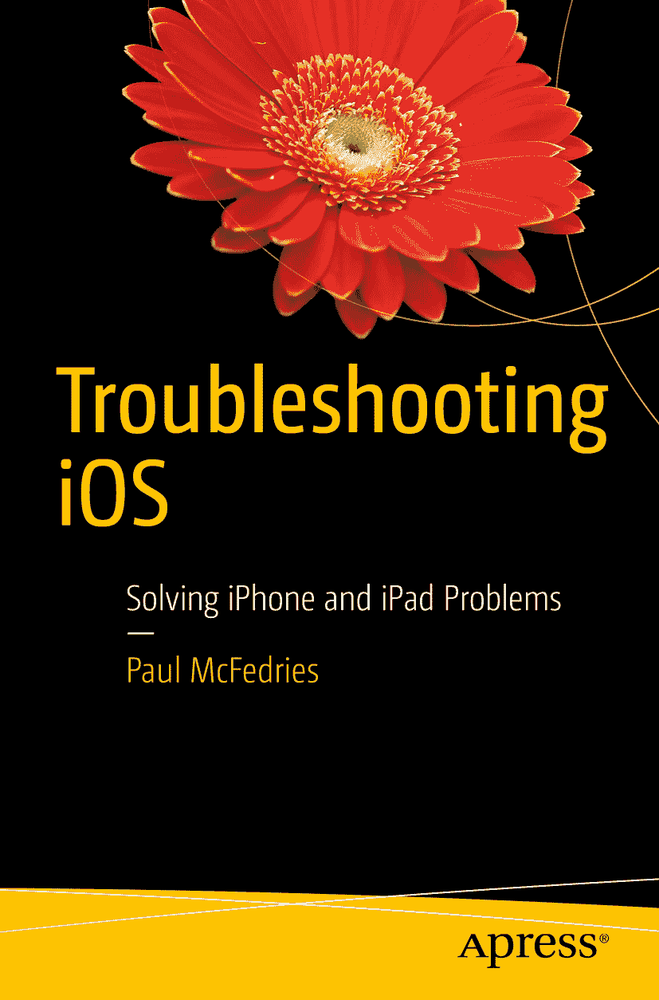

保罗·麦克费德里（Paul McFedries）

《iOS 故障排查》

解决 iPhone 和 iPad 问题

本书作者提及的任何源代码或其他补充材料，读者均可从[`www.apress.com/9781484219065`](http://www.apress.com/9781484219065)获取。有关如何找到本书源代码的详细信息，请访问[`www.apress.com/source-code/`](http://www.apress.com/source-code/)。读者也可以在 SpringerLink 上各章节的“补充材料”部分获取源代码。

ISBN 978-1-4842-2444-1  
电子书 ISBN 978-1-4842-2445-8  
DOI 10.1007/978-1-4842-2445-8  
美国国会控制号：2016962197

© 保罗·麦克费德里 2017

本作品受版权保护。出版商保留所有权利，涉及材料的全部或部分内容，具体包括翻译、重印、重用插图、朗诵、广播、微缩胶片复制或任何其他物理形式、信息存储与检索的电子传输、计算机软件，或目前已知及未来开发的任何类似或不同方法的权利。

本书中可能出现商标名称、标识和图像。我们并非在每次出现商标名称、标识或图像时都使用商标符号，而是仅以编辑方式使用这些名称、标识和图像，并服务于商标所有者的利益，无意侵犯商标权。本出版物中使用的商品名称、商标、服务标志及类似术语，即使未被明确标识，也不应被视为对其是否受专有权利保护的立场表达。

尽管本书中的建议和信息在出版时被认为是真实准确的，但作者、编辑和出版商均不对可能存在的任何错误或遗漏承担法律责任。出版商不对本书所含材料提供任何明示或暗示的保证。

本书采用无酸纸印刷。

本书通过 Springer Science+Business Media New York 向全球图书贸易发行，地址：233 Spring Street, 6th Floor, New York, NY 10013。电话：1-800-SPRINGER，传真：(201) 348-4505，电子邮件：orders-ny@springer-sbm.com，或访问 www.springeronline.com。Apress Media, LLC 是一家加利福尼亚有限责任公司，其唯一成员（所有者）为 Springer Science + Business Media Finance Inc (SSBM Finance Inc)。SSBM Finance Inc 是特拉华州的一家公司。

