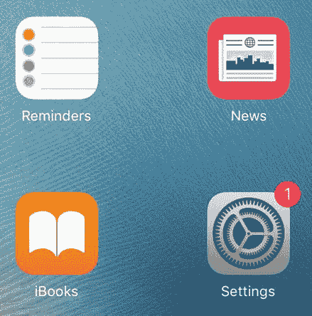
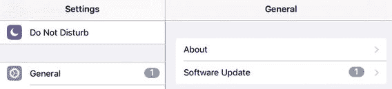
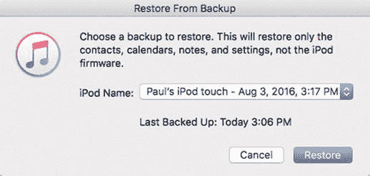
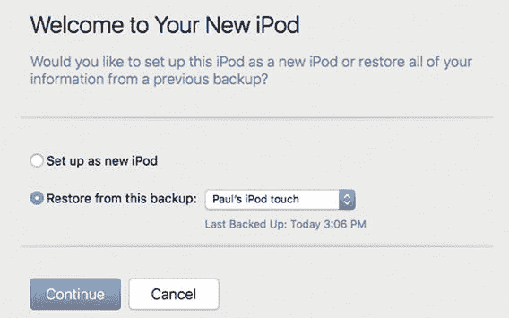
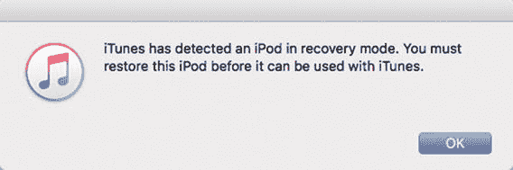

# 学习一些常规故障排除技巧

当你使用电脑时——尤其是 Windows PC，但 Mac 也不例外——一种莫名的紧张感始终潜藏在你的意识表层之下。这种惶恐源于经验：你的电脑过去不仅崩溃过很多次，而且最近也发生过。所以从某种意义上说，你只是在等待情况变糟，因为你知道它们终究会来。

而当你使用 iPhone、iPad 或其他 iOS 设备时，那种潜在的不安感却无迹可寻。这种令人愉悦的无焦虑状态同样源于经验：你的 iOS 设备几乎从不崩溃，所以你也不会期待它崩溃。不过请注意，我说的是“几乎从不”。现实情况是，尽管其发生频率远低于 Windows 或 macOS，但 iOS 问题确实存在。这并不意外，因为 iPhone、iPad 和 iPod touch 是极其精密的设备——实际上，它们是功能齐全的计算机。而任何精密设备由于其极高的复杂性，总会出现问题。幸运的是，iOS 设备的活动部件比常规电脑更少，所以总体上硬件出问题的可能性更小。你在软件方面也会遇到更少的问题，因为应用开发者只需让自己的产品适配相对少量的设备，而这些设备都是由同一家公司制造的。这确实简化了事情，结果就是更少的问题。但再次强调，并非零问题。

为了帮助你排查可能出现的任何硬件或软件故障，本章提供了一些适用于所有 iOS 设备（iPhone、iPad 和 iPod touch）的通用故障排除技巧。

### 重启与重新启动

如果你的 iOS 设备行为异常或运行不稳，可能是设备内部的某个特定组件导致的。这种情况下，你除了将设备留在天才吧，或寄回给 Apple 维修外，没有太多选择。不过幸运的是，大多数故障都是暂时性的，通常可以通过使用一些标准技巧来修复，特别是重启或重新启动你的设备。

如果你的 iPhone 行为异常或运行不稳，可能是手机内部的某个特定组件导致的。这种情况下，你除了将 iPhone 寄回给 Apple 维修外，没有太多选择。不过幸运的是，大多数故障都是暂时性的，通常可以通过使用以下一种或多种技巧来修复：

#### 重启你的设备

迄今为止，解决 iOS 设备问题最常用的方法是将其关机，然后再启动。通过重新启动设备，你重置了整个系统，这通常足以解决许多问题。

你可以使用`休眠/唤醒`按钮来重启 iOS 设备，该按钮的位置取决于你的设备：

*   对于 iPhone 6 及更新机型，该按钮位于手机右侧边缘，靠近顶部。
*   对于所有其他 iOS 设备，该按钮位于设备顶部边缘，靠右侧。

按住`休眠/唤醒`按钮几秒钟，直到出现“滑动来关机”屏幕（此时你可以松开按钮）。向右拖动“滑动来关机”滑块以开始关机。当屏幕完全变黑时，你的设备已关机。要重新启动，按住`休眠/唤醒`按钮直到看到 Apple 标志，然后松开按钮。

#### 重新启动你的设备硬件

当你通过按住`休眠/唤醒`按钮几秒钟来重启 iOS 设备时，你实际上是在重新启动系统软件。如果这仍然不能解决问题，你可能还需要重新启动设备硬件。为此，请同时按住`休眠/唤醒`按钮和`主屏幕`按钮。保持按住状态直到看到 Apple 标志（大约需要 8 秒左右），这表明重启成功。

**注意**

如果你的 iOS 设备真的卡住了，仅仅按住`休眠/唤醒`按钮无效时，硬件重启也是可行的方法。这种情况确实会发生。

### 更新软件

当 iOS 连接到互联网时，它会时不时地检查可用更新。如果有可用更新，你会在`设置`应用图标上看到一个角标，如图 1-1 所示。你也可能会看到一条“软件更新”通知，告知你新版本的 iOS 已准备好安装。

**图 1-1.** 当 iOS 检测到有可用更新时，它会通过在`设置`应用图标上显示角标来提醒你

要开始更新，请遵循以下步骤：

1.  如果显示了“软件更新”提醒，请轻点“立即安装”。否则，在主屏幕上，轻点“设置”。`设置`应用会打开。
2.  轻点“通用”。iOS 会显示“通用”屏幕。如图 1-2 所示，当有可用更新时，你也会在“通用”标签和“软件更新”命令上看到角标。

    

    **图 1-2.** 当更新就绪时，iOS 会在`设置`应用的“通用”标签和“软件更新”命令上显示角标
3.  轻点“下载并安装”。iOS 会下载更新，然后继续安装，这需要几分钟时间。

**警告**

仅当你的 iOS 设备在整个更新操作期间保持超过 50% 的电量时，它才会完成更新。为确保更新成功，请将设备插入交流电源插座，或仅在电池充满电时运行更新。

### 从备份恢复你的设备

通常，仅仅更改一个设置、添加一个应用或一些数据就可能导致你的 iOS 设备行为异常。理想情况下，修复方法是将设置恢复到之前的状态，或移除应用或数据，但并不总是能明确找出是哪个设置或内容片段出了问题。

一个解决方案是通过恢复最近的备份将设备恢复到较早的状态。如果追溯到足够早的时间，你应该能恢复到问题不存在的状态。（理想情况下，你不应回溯到超出必要的时间点，因为那样你冒失去其他设置、应用和数据等过多内容的风险。）

请遵循以下步骤来恢复最近的备份：

1.  在你的设备上，关闭“查找我的 iPhone”（如果已开启）。操作方法：打开`设置`，轻点 iCloud，轻点`查找我的设备`（其中`设备`是 iPhone、iPad 或 iPod），将`查找我的设备`开关轻点至关闭，然后输入你的 Apple 密码。
2.  将你的设备连接到电脑。
3.  在 iTunes 中，点击设备图标。
4.  点击“摘要”标签。
5.  点击“恢复备份”。iTunes 会要求你选择一个要恢复的备份，如图 1-3 所示。

    

    **图 1-3.** 选择在设备开始出现问题之前创建的较早备份
6.  选择你想要恢复的较早备份。这应该是在问题首次出现之前创建的最新备份。
7.  点击“恢复”。iTunes 会恢复备份并重新启动设备。

### 恢复出厂设置

有时你的 iOS 设备会完全瘫痪，因为其设置已损坏。在这种情况下，你可以通过将设备恢复为默认出厂设置来解决问题。

#### 通过 iTunes 恢复出厂设置

恢复出厂设置的最佳方法是使用 iTunes 中的`恢复`功能，因为这样你既可以备份，也能恢复你在设备上更改过的任何设置。这里有几点需要考虑：

- 如果损坏的设置是某个你从未更改过的 iOS 默认设置，那么恢复操作将会覆盖该损坏的设置，你的问题应该会得到解决。在这种情况下，你应该进行备份并恢复你自己的设置。
- 如果损坏的设置是你曾经更改过的，那么备份并恢复你的设置很可能会导致问题再次出现。在这种情况下，你不应该备份并恢复你的设置。

那么你应该选择哪条路径呢？首先，尝试通过备份并恢复你的设置来运行恢复流程。如果问题消失了，那你就搞定了；如果问题再次出现，则意味着你更改的某个设置是罪魁祸首，所以你应该重复恢复操作，但这次不要备份你的设置。

在继续之前，请注意，这些步骤要求你的设备能够连接到电脑，并在 iTunes 中可见。如果不是这种情况，请参阅下一节中重置设备的说明。否则，请按照以下步骤恢复你的设备：

1.  在你的设备上，如果`查找我的 iPhone`已打开，请将其关闭。你可以通过依次打开`设置`、轻点`iCloud`、轻点`查找我的设备`（其中“设备”指 iPhone、iPad 或 iPod）、将`查找我的设备`开关滑到`关闭`位置，然后输入你的 Apple 密码来完成此操作。
2.  将你的设备连接到电脑。
3.  在 iTunes 中，点击设备图标。
4.  点击`摘要`标签页。
5.  点击`立即备份`。这确保了 iTunes 拥有你设备和设置数据的备份副本。**注意：** 默认情况下，iTunes 不会备份敏感信息，例如保存的密码、网站历史记录和健康数据。要备份这些数据，请选中`加密设备备份`复选框（其中“设备”指 iPhone、iPad 或 iPod），然后运行备份。
6.  点击`恢复设备`（其中“设备”指 iPhone、iPad 或 iPod）。iTunes 会要求你确认要恢复。
7.  点击`恢复`，然后按照屏幕上的提示操作。iTunes 会下载 iOS 并恢复原始设置。当你的设备重新启动时，iTunes 会连接到它，并可能要求你输入你的 Apple ID 凭据。完成此操作后，iTunes 会显示`欢迎使用您的新设备`屏幕，如图 1-4 所示。

    

    **图 1-4.** 当您恢复出厂设置的设备重新启动时，iTunes 会提供恢复您已备份的设置和数据选项

8.  选择`从此备份恢复`选项。
9.  如果你碰巧备份了多个设备，请使用列表选择你的设备。
10. 点击`继续`。iTunes 会恢复你备份的数据，重新启动你的设备，并同步它。
11. 浏览各标签页，检查同步设置，确保它们按你想要的方式配置。
12. 如果你对设置做了任何更改，请点击`应用`。这确保你的设备恢复了所有数据。

#### 在设备上恢复出厂设置

如果你的设备出现问题，无法连接到电脑或被 iTunes 识别，你仍然可以直接在设备上恢复出厂默认设置。以下是操作步骤：

1.  在主屏幕上轻点`设置`。
2.  轻点`通用`。
3.  轻点`还原`。
4.  轻点`还原所有设置`。
5.  如果你的设备受密码保护，请输入密码以继续。
6.  当 iOS 要求你确认时，轻点`还原所有设置`。

### 排除已连接配件的故障

将配件连接到 iOS 设备的方式只有几种：使用耳机插孔、Lightning 接口或蓝牙。尽管你可以连接的配件数量相对有限，但这并不意味着你可能永远不会遇到这些配件的问题。

如果你连接到 iOS 设备的配件出现故障，好消息是很多这类问题的原因相对有限。你可以尝试一些经过验证的补救措施，或许能让配件恢复正常工作。如果问题原因不明显，那么你的硬件故障排除步骤应始终从这些非常基本的方法开始：

- **检查连接、电源开关等。** 一些最常见（也最令人尴尬）的硬件问题原因就是简单的物理因素，因此请确保已连接的配件已打开，并检查线缆（如果有）是否正确插入。例如，如果你无法通过 iOS 设备上的 Wi-Fi 连接访问互联网，请确保你的网络路由器已打开。同时确保路由器与 ISP 调制解调器之间的线缆（如果它们不是像现在常见的那样集成在一个设备中）正确连接。
- **更换电池。** 像耳机这样的无线设备确实很费电，因此如果此类设备工作不稳定（或完全不工作），请始终尝试更换电池，看看是否能解决问题。
- **先关闭配件再重新打开。** 你通过关闭设备，等待几秒钟让其内部完全停止运转，然后再重新打开来对设备进行断电重启。你会惊讶于这个简单的操作能让多少设备恢复运行。对于没有开/关按钮的设备，可以尝试将其从电源插座上拔下，或者取出并重新安装电池。
- **重置配件的默认设置。** 如果你可以配置该配件，那么可能是某个新设置导致了问题。如果你最近进行了更改，请尝试将该设置恢复为其原始值。如果这不起作用，大多数可配置设备都有某种`恢复默认设置`选项，让你可以快速将其恢复为出厂设置。
- **升级配件的固件。** 一些设备带有固件——一个在设备内部运行并控制其内部功能的小程序。例如，所有路由器都有固件。向制造商查询是否有新版本。如有，请下载新版本，然后参阅设备手册了解如何升级固件。

### 高级故障排除技巧

到目前为止，你看到的这些技巧在许多情况下能让你的 iOS 设备恢复运行。如果不行，你仍然可以尝试其他一些技巧。

#### 无法启动 iOS 时的恢复出厂设置

在极少数情况下，你的 iOS 设备会彻底失控，不仅`iTunes`无法识别该设备，甚至无法启动 iOS。如果出现这种情况，你仍然可以恢复所有内容，但必须使用一种名为设备固件升级（`DFU`）的特殊硬件模式。此模式实质上是绕过手机上当前安装的操作系统（这很好，因为在这种情况下你当前的操作系统已经报废），并指示`iTunes`安装一个全新出厂版本的 iOS。然后，你可以按照本章前面所述的方法（参见“从备份恢复你的设备”）来恢复你的数据。

请按照以下步骤将你的设备置于`DFU`模式：

1.  关闭设备电源。
2.  将设备连接到你的 Mac 或 Windows PC。
3.  启动`iTunes`。
4.  同时按住`睡眠/唤醒`按钮和`主屏幕`按钮，保持整整 10 秒钟。
5.  10 秒后，松开`睡眠/唤醒`按钮，但继续按住`主屏幕`按钮，再保持 10 秒钟。
6.  10 秒后，松开`主屏幕`按钮。此时`iTunes`会识别出你的设备，并显示如图 1-5 所示的对话框。

    

    图 1-5. 当你在`DFU`模式下启动 iOS 设备时，`iTunes`会识别该设备并显示此对话框，提示你进行恢复。

7.  点击`好`。
8.  点击`恢复设备`（其中`设备`指`iPhone`、`iPad`或`iPod`）。`iTunes`会要求你确认是否要恢复。
9.  点击`恢复并更新`。`iTunes`会下载并安装 iOS，然后将你的设备恢复到出厂默认设置。

#### 抹掉你的设备

如果恢复出厂设置未能解决问题，那么可能是某些顽固的内容导致了问题。在这种情况下，你不仅需要重置所有 iOS 设置，还需要重置所有内容。操作方法如下：

1.  轻点`设置`。
2.  轻点`通用`。
3.  轻点`还原`。
4.  轻点`抹掉所有内容和设置`。
5.  如果设置了设备密码，请输入密码。
6.  当 iOS 要求你确认时，轻点`抹掉设备`（其中`设备`指`iPhone`、`iPad`或`iPod`）。

警告

除非你确实想要从原始设置和无内容的状态重新开始，否则只有在你的设备已备份的情况下才能运行“抹掉所有内容和设置”命令。请参见第 8 章“保护你的设备”。

