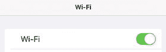
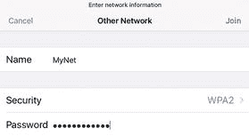
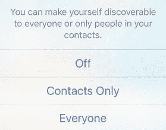
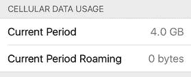
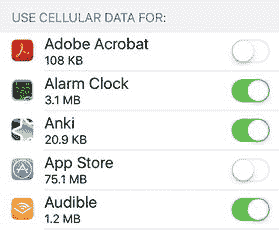
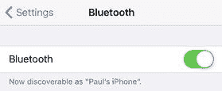
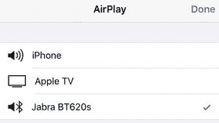

# 2. 修复网络和蜂窝网络故障

你的 iOS 设备让你在离线状态下也能执行大量令人满意的、有趣且有用的任务。你可以玩游戏、阅读已保存的文章、收听已下载的音乐或播客、阅读电子书、更新联系人等等。但是，iOS 和 iPhone、iPad 以及 iPod touch 只有在能够通过 Wi-Fi 网络或蜂窝信号访问外部世界时才真正大放异彩。建立连接后，你可以上网冲浪、收发邮件、发消息、发帖、上传、下载，以及执行所有其他在线活动——这些正是当今互联生活方式的标志性行为。

唉，如果你在将 iOS 设备连接到网络时遇到困难，你可能不得不回到令人满意但受限的离线娱乐世界。即使你能上网，iOS 处理网络或蜂窝连接的方式也可能让你头疼。本章将带你了解许多连接问题，并提供解决方案，帮助你让 iOS 和你的网络再次顺畅运行。

### 解决 Wi-Fi 问题

如果你的网络变成了“非网络”（有些人也把瘫痪的网络称为“无网络”），本章提供了一些可能有用的解决方案。不过，我并没有声称这里的内容是全面的；毕竟，大多数网络问题都是由多种因素共同造成的，相对比较复杂，难以复现。相反，我只是介绍一些排查问题的一般策略，并为一些最常见的网络故障提供解决方案。

#### 你无法访问 Wi-Fi 网络：第一部分

如果你在连接本地 Wi-Fi 网络时遇到问题，问题可能出在你的设备上，也可能出在网络本身。（这里我假设你拥有该网络的密码——如果需要的话。）我们在第一部分先假设问题出在你的设备上。

解决方案：先关闭 Wi-Fi 天线，然后再重新打开。这会重置天线，通常足以使连接成功。要切换天线，请打开`设置`，轻点`Wi-Fi`，将 Wi-Fi 开关（见图 2-1）拨到`关闭`，然后再将同一个开关拨回`打开`。

图 2-1. 将 Wi-Fi 开关关闭再重新打开通常可以解决 Wi-Fi 问题。

提示

你还可以通过从屏幕底部向上滑动打开控制中心，然后轻点两次 Wi-Fi 图标来切换 Wi-Fi 天线的开关。轻点控制中心外部即可将其关闭。

#### 你无法访问 Wi-Fi 网络：第二部分

如果你的 iOS 设备仍然无法连接到 Wi-Fi 热点，那么问题可能出在网络本身。不幸的是，由于干扰、兼容性和设备信号范围等问题，无线网络给故障排查工作带来了全新的一系列潜在问题。

解决方案：以下是一些你应该检查的故障排查项，以解决你遇到的任何无线连接问题：

*   **重启设备。** 关闭 Wi-Fi 网络的路由器，然后再重新打开，以此重置你的硬件。如果你的网络有单独的宽带调制解调器，也应该将其重启。
*   **检查干扰。** 使用 2.4GHz 射频（RF）频段的设备，例如婴儿监视器和无绳电话，可能会对无线信号造成严重干扰。如果这些设备靠近你的无线路由器，请尝试移开或关闭它们。

警告

你还应将无线路由器远离微波炉；微波炉可能会干扰无线信号。

*   **检查信号范围。** 如果你没有收到信号或信号很弱，可能是因为你的 iOS 设备距离 Wi-Fi 路由器太远。通常，一旦距离任何 Wi-Fi 接入点超过约 115 英尺，信号就会开始衰减（如果你使用的是 802.11n 设备，则约为 230 英尺）。要么靠近路由器，要么打开路由器的信号范围增强功能（如果有的话）。你也可以安装一个无线信号扩展器。
*   **更改信道。** 你可以配置你的无线路由器在特定信道上广播信号。有时一个信道比另一个信道信号更强，所以尝试更换信道。你可以通过登录路由器的配置页面，查找决定广播信道的设置来执行此操作。
*   **升级路由器的固件。** 某些网络问题是由路由器的漏洞引起的。如果制造商已经修复了这些漏洞，修复程序将出现在最新版本的路由器固件中，因此你应该升级到新版本。请查阅路由器文档了解如何执行升级。
*   **重置路由器。** 作为最后的手段，将路由器重置为出厂默认设置（请参阅设备文档了解操作方法）。请注意，如果执行此操作，你将需要从头开始设置你的网络。

#### iOS 自动连接到了你不再想用的网络

当你加入一个 Wi-Fi 网络时，iOS 会记住你的连接详情，并在下次进入该网络范围内时自动连接。这对于你想用的网络来说很方便，但对于你不再需要的网络来说却是个麻烦。一个常见的困境是，有多个网络可用，其中某一个更理想（例如，因为它更快或更便宜）。如果你之前连接过其他部分或全部网络，那么 iOS 很有可能会选择其中之一进行自动连接，让你不得不手动连接到你想要的那个网络，平添麻烦。

**解决方案：** 让 iOS 忽略你不想使用的网络：

1.  打开 `设置` app，然后轻点 `无线局域网` 以打开 `无线局域网` 界面。
2.  轻点你想忘记的网络右侧的蓝色 `更多信息` 图标。iOS 会显示该网络的设置界面。
3.  轻点 `忽略此网络`，如图 2-2 所示。iOS 会要求你确认。

   

   **图 2-2.** 如果你不再想连接某个特定网络，请轻点 `忽略此网络` 按钮

4.  轻点 `忽略`。iOS 会丢弃该网络的登录数据，并且不再自动连接到该网络。

#### 你频繁收到加入附近 Wi-Fi 网络的提示

默认情况下，当你的设备需要网络连接，而你又尚未连接到任何 Wi-Fi 网络时，iOS 会显示 `选取无线局域网` 对话框，列出附近网络。然而，当你穿梭于城镇之间时，可能会发现随着新的 Wi-Fi 网络进入范围，这个对话框弹出得过于频繁（尽管 iOS 足够智能，当你快速移动时——例如开车时——不会弹出提示）。这些不断的提示既烦人又不便。

**解决方案：** 让 iOS 停止提示你加入附近网络。打开 `设置` app，轻点 `无线局域网`，然后将 `询问是否加入网络` 开关轻点至 `关闭`，如图 2-3 所示。

**图 2-3.** 要关闭加入附近 Wi-Fi 网络的不停提示，请将 `询问是否加入网络` 开关轻点至 `关闭`

#### 你想要连接到一个隐藏的 Wi-Fi 网络

每个 Wi-Fi 网络都有一个网络名称——通常称为服务集标识符或 SSID——用于向 Wi-Fi 设备标识该网络。默认情况下，Wi-Fi 网络会广播其网络名称，以便你在 `选取无线局域网` 对话框或 `设置` app 的 `无线局域网` 界面中看到它。然而，有些 Wi-Fi 网络会出于安全考虑禁用网络名称广播。这是为什么呢？其思路是，如果未经授权的用户看不到该网络，就无法尝试连接。（但是，当授权计算机连接时，某些设备仍然可以捕获网络名称，因此这并非万无一失的安全措施。）然而，如果你是授权用户，又如何连接一个你看不到的网络呢？

**解决方案：** 你可以通过手动输入连接设置来连接隐藏的 Wi-Fi 网络。你需要知道网络名称、其安全性和加密类型以及网络密码。操作步骤如下：

1.  打开 `设置` app，然后轻点 `无线局域网`。
2.  在附近网络列表中，轻点 `其他`。iOS 会显示 `其他网络` 界面。
3.  在 `名称` 文本框中输入网络名称。
4.  轻点 `安全性` 以打开 `安全性` 界面，然后轻点该 Wi-Fi 网络使用的安全类型：`无`、`WEP`、`WPA`、`WPA2`、`WPA 企业级` 或 `WPA2 企业级`。如果不确定，大多数安全网络都使用 `WPA2`。
5.  轻点 `其他网络` 以返回 `其他网络` 界面。如果你选择了 `WEP`、`WPA`、`WPA2`、`WPA 企业级` 或 `WPA2 企业级`，iOS 会提示你输入网络密码。
6.  在 `密码` 文本框中输入密码，如图 2-4 所示。

   

   **图 2-4.** 要加入隐藏网络，请输入网络名称，选择安全类型，然后输入密码

7.  轻点 `加入`。iOS 会连接到该网络。

#### 你通过隔空投送发送文件时遇到问题

你可以通过 iTunes 同步在 Mac 和 iOS 设备之间传输文件。但是，如果你只想将单个文件从一台设备发送到另一台，同步过程就显得大材小用了。相反，如果你的 Mac 运行的是 OS X Yosemite 或更高版本，你的 iPhone 运行的是 iOS 8 或更高版本，并且你的 Mac 和 iPhone 连接到同一个 Wi-Fi 网络，你可以使用一个名为 `隔空投送` 的工具在 Mac 和你的设备之间直接发送文件。

但是，你可能会发现这两个设备互相看不到，或者文件无法传输。

**解决方案：** 如果你在 Mac 上看不到你的 iOS 设备，或者在 iOS 设备上看不到你的 Mac，请检查以下几点：

*   确保你的 Mac 和 iOS 设备都连接到同一个 Wi-Fi 网络。
*   `隔空投送` 需要蓝牙和 Wi-Fi，因此请确保你的 Mac 和 iOS 设备都已启用蓝牙：
    *   在 iOS 中，从屏幕底部向上轻扫以显示 `控制中心`，然后轻点以激活 `蓝牙` 图标。轻点 `控制中心` 外部以关闭它。
    *   在 macOS（或 OS X）中，打开 `系统偏好设置`，点按 `蓝牙`，然后确保 `蓝牙` 设置为 `打开`。（如果显示 `关闭`，请点按 `打开蓝牙`。）

> **提示：** 如果在 iOS 中关闭了 Wi-Fi 和/或蓝牙，快速同时打开它们的方法是打开任何共享表单并轻点 `隔空投送` 图标。你也可以从屏幕底部向上轻扫以显示 `控制中心`，轻点 `隔空投送`，然后轻点 `仅限联系人`。轻点 `控制中心` 外部以关闭它。

*   确保你的 iOS 设备和 Mac 彼此相距不超过 33 英尺，这样它们才能通过蓝牙发现彼此。
*   确保 iOS 设备已打开 `隔空投送`。从屏幕底部向上轻扫以显示 `控制中心`，轻点 `隔空投送`，然后轻点 `仅限联系人`（见图 2-5）。如果在 Mac 上仍然看不到你的设备，请改为轻点 `所有人`。

  

  **图 2-5.** 在 iOS `控制中心`中，轻点 `隔空投送`，然后轻点 `仅限联系人` 或 `所有人`

*   确保你的 Mac 可被发现。打开 `隔空投送` 窗口（在 `访达` 中，点按 `前往` 然后点按 `隔空投送`，或按下 `Shift+Cmd+R`）。在 `允许我被发现的方式` 列表中，选择 `仅限联系人`。如果仍然无法从 iOS 看到你的 Mac，请改为选择 `所有人`。
*   如果你已将 `隔空投送` 设置为 `仅限联系人`，请确保你的 iOS 设备和 Mac 都已登录到同一个 iCloud 帐户。
*   确保你的 iOS 设备和 Mac 都未处于睡眠模式。

如果 `隔空投送` 文件传输失败，请尝试这些解决方案。

#### iOS 与 macOS 连接问题故障排除

- 确保你的 iOS 设备和 Mac 均未处于“勿扰模式”：
  - 在 iOS 设备上，从屏幕底部向上滑动以显示控制中心，然后轻点以关闭“勿扰模式”图标。
  - 在 OS X 或 macOS 中，点击“通知”图标显示通知中心，点击“通知”标签，滚动到该标签顶部，然后点击将“勿扰模式”开关设为关闭。
- 确保你的 iOS 设备未开启“个人热点”功能。打开“设置”应用，轻点“个人热点”，然后将“个人热点”开关设为关闭。
- 不要尝试发送多种不同类型的文件。例如，虽然可以发送两个或更多图像文件，但不能同时发送一个图像文件和一个 PDF 文件。
- 确保你的 Mac 未处于“旧款模式”（即配置为仅能向 2012 年或更早发布的 Mac 发送文件）。在 Mac 上，打开“隔空投送”窗口。如果你看到文字“正在搜索旧款 Mac…”，请点击“取消”以退出旧款模式。
- 确保 Mac 防火墙未配置为阻止所有传入连接。打开“系统偏好设置”，点击“安全性与隐私”，点击“防火墙”，点击锁形图标，然后输入 Mac 的管理员密码。如有必要，点击以取消勾选“阻止所有传入连接”复选框，然后点击“确定”。

如果以上方法均无效，请重置 iOS 网络设置。在“设置”应用中，依次轻点“通用”、“还原”、“还原网络设置”，然后在 iOS 要求确认时轻点“还原网络设置”。

### 蜂窝网络问题故障排除

如果你拥有带蜂窝天线的 iPhone 或 iPad，你就会知道只要在蜂窝网络覆盖范围内，就能拥有始终在线的数据连接所带来的自由与高效。遗憾的是，这种便利并不便宜，因此大多数蜂窝网络问题都集中在控制数据和漫游费用上。本节将带你了解这些及其他与蜂窝网络相关的问题。

#### 可通过 Wi-Fi 发送电子邮件，但无法通过蜂窝网络发送

你可能会发现，在家或办公室可以顺利发送电子邮件，但在街上或乘车途中发送的邮件却一直停留在“邮件”应用的“发件箱”中。这虽然感觉像是一个 bug，但实际上是一项功能，因为许多蜂窝网络提供商不允许通过第三方服务器发送邮件。当你使用 Wi-Fi 时，这不是问题，因为你的信息不会通过蜂窝网络发送；但一旦离开 Wi-Fi，蜂窝网络启动，你的提供商就会阻止发送第三方邮件。

解决方法：你的蜂窝网络提供商会设置一个外发服务器来处理已发送的邮件，因此你需要将该服务器设置为邮件账户的辅助 SMTP 服务器。iOS 会尝试使用账户的默认服务器发送信息，但如果失败（例如，当你处于蜂窝网络而非 Wi-Fi 网络时），系统会回退到辅助服务器，你的信息就能成功发送。

要设置辅助 SMTP 服务器，请遵循以下步骤：

1. 打开“设置”应用，然后轻点“邮件、通讯录、日历”。
2. 轻点你的电子邮件账户。
3. 轻点你的外发邮件服务器。
4. 轻点“添加服务器”。
5. 输入你蜂窝网络提供商的 SMTP 主机名，以及你的用户名和密码。
6. 轻点“存储”。

#### 不确定自己使用了多少数据

如果你使用 iOS 设备所对应的套餐设有每月数据流量上限，且你超出了该月度上限，那么你几乎肯定要为此特权支付高昂费用。为避免这种情况，大多数蜂窝网络提供商在你接近上限时会友善地发送一条消息。然而，如果你不信任这个过程，或者只是对这些事情过度担忧（在我看来，这是合理的），那么你可能更愿意自己留意数据使用情况。

解决方法：iOS 会追踪其发送或接收的蜂窝网络数据，以及如果你在覆盖区域外使用 iPhone 时发送或接收的漫游数据。首先，查看一下蜂窝网络提供商最近一次账单，特别留意账单覆盖的日期范围。例如，账单可能从上个月的 24 号开始，到本月的 23 号结束。这很重要，因为它告诉你何时需要重置设备上的使用数据。

现在按照以下步骤检查蜂窝数据使用情况：

1. 打开“设置”应用，然后轻点“蜂窝网络”，显示蜂窝网络屏幕。
2. 在“蜂窝数据用量”部分，读取“当前时段”和“当前时段漫游”的值（见图 2-6）。

   

   图 2-6. 读取“蜂窝数据用量”部分的值

3. 如果你已处于数据周期的末尾，请轻点屏幕底部的“还原统计数据”以开始新周期的新数值。

#### 想要阻止 iOS 设备使用蜂窝数据

如果你已达到蜂窝数据套餐的限制，你几乎肯定想避免超额，因为费用通常高得令人望而却步。只要你在 Wi-Fi 网络覆盖范围内，或者你能自律到在没有 Wi-Fi 时不浏览网页或查看 YouTube，就没什么问题。不过，意外仍有可能发生。例如，你可能不小心轻点了电子邮件或短信中的链接，或者你家里的某个人在不知情的情况下使用了你的手机。

解决方法：为防止这类意外（或者仅仅是在 YouTube 方面信不过自己），你可以完全关闭蜂窝数据，这意味着你的设备只有在有 Wi-Fi 信号时才能访问互联网数据。要在你的 iOS 设备上关闭蜂窝数据，请打开“设置”应用，轻点“蜂窝网络”，然后将“蜂窝数据”开关设为关闭。

#### 希望更精细地控制 iOS 设备如何使用蜂窝数据

与其像我上一节所述那样完全关闭蜂窝数据，你可以采取更有针对性的方法。例如，如果你有点担心超出蜂窝套餐的数据上限，那么避开相对高带宽的项目（如 FaceTime 和 iTunes）是合理的，但可以继续使用相对低带宽的内容（如 iCloud 文稿和 Safari 阅读列表）。

解决方法：你可以自行管理，但嘿，你是个大忙人，下次有 FaceTime 通话接入且你身处只有蜂窝网络的区域时，你可能会忘记。我建议将细节交由 iOS 处理，配置它不允许某些内容类型通过蜂窝连接使用。为此，请打开“设置”应用并轻点“蜂窝网络”。在“使用蜂窝数据”部分（如图 2-7 所示），针对你希望禁止使用蜂窝网络的每种内容类型，将其开关轻点设为关闭。

图 2-7. 在每个你希望禁止使用蜂窝网络的应用程序旁，将开关轻点设为关闭

#### 你想要阻止 iOS 使用数据漫游

数据漫游是一项常常很方便的功能，它让你在离开正常网络覆盖区域时，也能拨打电话——并且，在你的 iOS 设备上，还可以上网、查看和发送电子邮件以及互发短信。它的缺点是，除非你从移动运营商那里购买了固定费率的漫游套餐，否则漫游费用几乎总是高得令人瞠目结舌。根据你所在的位置和使用的服务类型，费用通常按每分钟或每兆字节几美元计算。这可不好！

不幸的是，如果你开启了 iOS 的`数据漫游`功能，即使你从未使用过你的设备，也可能会产生巨额漫游费用！这是因为 iOS 仍然会为接收新电子邮件和短信等内容执行后台检查，所以，在某个遥远的地方待上一周，即使你根本没碰手机，也可能花费你数百美元。

**解决方法：** 为避免这种情况，请在不需要时关闭设备上的`数据漫游`功能。操作方法如下：打开`设置`应用，轻点`蜂窝网络`，轻点`蜂窝数据选项`，然后将`数据漫游`开关轻点至`关闭`。

---

### 蓝牙问题故障排除

iOS 支持一种名为蓝牙的无线技术，它让你能够与其他支持蓝牙的设备（如耳机、键盘和游戏手柄）建立无线连接。理论上，连接蓝牙设备应该极其简单，但在实际中往往并非如此，因此本节为你提供一些常见的故障排除技巧。

#### 你找不到蓝牙设备

不出意外，如果你在`设置`应用的蓝牙窗口中看不到该设备，你就无法建立蓝牙连接。

**解决方法：** 如果你在`设置`应用中看不到某个蓝牙设备，请尝试以下方法：
- 确保该设备已开启且电量充足。
- 确保该设备处于可发现模式。与持续广播信号的 Wi-Fi 设备不同，大多数蓝牙设备只有在得到你指示时才会广播其可用性——也就是说，它们会让自己变得可被发现。大多数蓝牙设备都有一个你可以打开的开关或可以按下的按钮，以使其可被发现。
- 确保蓝牙设备与你的 iOS 设备之间的距离远小于 33 英尺（约 10 米），因为这是大多数蓝牙设备的最大有效范围。（某些所谓的 1 级蓝牙设备的有效范围是此距离的 10 倍。）
- 确保 iOS 已启用蓝牙。在`设置`应用中，轻点`蓝牙`，然后将`蓝牙`开关轻点至`开启`，如图 2-8 所示。

  

  **图 2-8.** 在`设置`应用中，确保`蓝牙`开关设置为`开启`

- 如果可能，请重启蓝牙设备。如果你无法重启该设备，或者重启后问题仍未解决，请重启你的 iOS 设备。
- 咨询蓝牙设备制造商，确保该设备能够与 iOS 设备配对。

#### 你无法与蓝牙设备配对

出于安全考虑，许多蓝牙设备在建立连接前需要与另一台设备进行配对。在某些情况下，配对是通过输入一个多位数字通行密钥来完成的——iOS 称之为`PIN`——然后你必须在蓝牙设备上输入该密钥（当然，前提是该设备有某种键盘）。对于所有其他蓝牙设备，你可以在`设置`应用的蓝牙屏幕中轻点该设备来发起配对。无论哪种方式，你可能会发现，即使该设备能在蓝牙屏幕中正常显示，你也无法将其与你的 iOS 设备配对。

**解决方法：** 首先尝试上一节中的解决方案。如果你仍然无法成功配对，请让 iOS 忘记该设备的信息并重新开始配对：

1.  打开`设置`应用，然后轻点`蓝牙`。
2.  轻点蓝牙设备名称右侧的蓝色`更多信息`图标。
3.  轻点`忽略此设备`。iOS 会要求你确认。
4.  轻点`好`。
5.  当该设备重新出现在`蓝牙`窗口中时，再次尝试与之配对。

#### 通过已配对耳机听不到声音

在你配对蓝牙耳机后，iOS 通常会足够智能地通过耳机播放音乐，而不是通过设备的内置扬声器。这里的关键词是“通常”，因为 iOS 偶尔会无法做到这一点。

**解决方法：** 你需要手动将已配对的耳机指定为输出设备。从屏幕底部向上轻扫以打开`控制中心`，轻点播放控制下方显示的`隔空播放`图标（位于`隔空投送`区域的右侧），然后轻点你已配对的蓝牙耳机（见图 2-9）。现在，iOS 就会通过耳机播放你设备的音频了。

**图 2-9.** 打开`隔空播放`屏幕，然后轻点你已配对的蓝牙耳机

---

