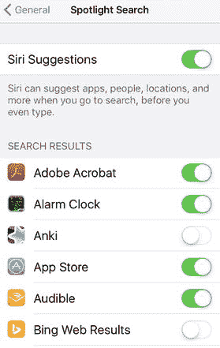
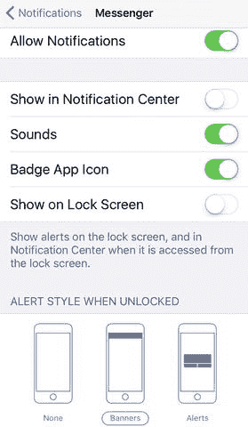
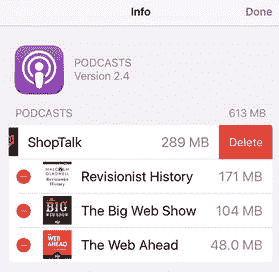
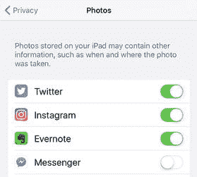
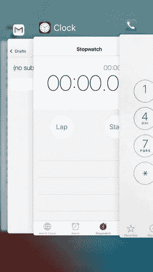

# 3. 解决应用问题

你的 iPhone、iPad 或 iPod touch 是一件令人印象深刻的工业设计产品。从响应灵敏的触摸屏到强大的摄像头，再到整体时尚的设计，iOS 设备既是一件艺术品，也是一项工程杰作。但如果没有软件让它焕发生机，所有这些硬件都毫无用处；而在 iOS 世界中，这些软件以应用的形式存在。这不仅包括 iOS 默认安装的各种应用，还包括那些可通过`App Store`下载的苹果及第三方应用。

简而言之，尽管硬件一流，但你的 iOS 设备的功能和限制都是由其上安装的应用决定的。为何说是限制？因为一个残酷的事实是：如果你的应用无法正常工作，那么你的 iOS 设备也无法正常工作。如果你找不到某个应用、应用崩溃，或者应用的行为与开发者的预期不符，那么你的 iOS 体验将大打折扣。为了帮助你避免这种情况——或帮助你摆脱困境——本章将介绍一些与应用相关的常见问题及解决方案。

### 常规应用故障排除

应用问题的范围很广，从找不到应用或它的数据（令人困扰），到应用行为异常（令人烦恼），再到应用完全无法工作（让人恼火）。好消息是，除非该应用的开发者极其无能，否则大多数应用问题都可以快速或至少直接地解决。

#### 你发现搜索困难，因为 iOS 从太多应用中返回结果

当你在 iOS 设备上执行`聚焦搜索`时，根据搜索文本的不同，你可能会看到来自各种应用的结果。如果进行更一般的搜索，你很容易看到来自二十多个甚至更多应用的结果。

**解决方法：** 配置`聚焦搜索`，使其不显示来自你很少使用或从不搜索的应用的结果。要配置`聚焦搜索`，请打开`设置`应用，轻点`通用`，然后轻点`聚焦搜索`。在`搜索结果`部分，将你希望从搜索中排除的每个应用旁边的开关轻点至`关闭`（见图 3-1）。

**图 3-1.** 在`设置`中，使用`聚焦搜索`屏幕告诉 iOS 要从搜索结果中排除哪些应用

#### 你找不到某个应用

如果你在 App Store 里有点忘乎所以，很容易就会让几十个图标散落在十几个甚至更多页面上（最多 15 页）。由于这些应用大多安装时没有特定顺序，要找到某个应用的图标可能会非常耗时，令人沮丧。

**解决方案：** 你可以重置主屏幕布局，这会执行两个操作：

-   将主屏幕（可能还有部分第二屏幕，取决于设备和 iOS 版本）恢复为出厂默认图标排列。
-   按字母顺序显示你所有的第三方应用图标。

**注意：** 重置主屏幕布局也会删除你创建的所有自定义应用文件夹。

要重置主屏幕布局，请打开 `设置`，点击 `通用`，点击 `还原`，点击 `还原主屏幕布局`，然后在 iOS 要求确认时，点击 `还原主屏幕布局`。

---

#### 某个应用显示太多通知

就像一位吵闹或粗鲁的客人，有些应用在进入你的 iOS 系统后，会通过过频繁或过强硬的弹窗通知来回应你的邀请。

**解决方案：** 通过按你的喜好配置应用的通知来控制它。打开 `设置` 应用，点击 `通知`，然后点击你想要操作的应用。iOS 会显示该应用的通知选项，如图 3-2 所示。请注意，某些应用（例如 `日历`）会将通知分成几类，因此你可能需要先点击一个类别，才能看到类似图 3-2 所示的选项。

*图 3-2.* 使用应用的通知设置来控制你看到其通知的频率和位置。

现在，你可以通过以下选项配置该应用的通知：

-   要完全停止该应用的通知，请将 `允许通知` 开关点击为 `关闭`。
-   要不在“通知中心”看到该应用的通知，请将 `在“通知中心”显示` 开关点击为 `关闭`。
-   要听不到该应用的通知声音，请将 `声音` 开关点击为 `关闭`。对于某些应用，你需要点击 `声音` 查看声音列表，然后点击 `无` 来关闭通知声音。
-   要看不到该应用的标记图标，请将 `标记` 开关点击为 `关闭`。
-   要不在“锁定屏幕”上看到该应用的通知，请将 `在锁定屏幕上显示` 开关点击为 `关闭`。
-   使用 `解锁时的提醒样式` 部分，选择你喜欢的该应用通知样式。点击 `无` 关闭提醒，或点击你想要的样式：`横幅`（几秒钟后自动消失）或 `提醒`（在你关闭前不会消失）。

---

#### 你的 Facebook 数据未出现在“通讯录”或“日历”应用中

iOS 系统内置了 Facebook 支持。你可以轻松地将链接、照片和其他内容发布到你的 Facebook 时间线，甚至无需加载 Facebook 应用即可发送简单的状态更新。但是，如果你在 `通讯录` 应用中看不到你的 Facebook 好友，或在 `日历` 应用中看不到你的 Facebook 活动，那么这种内置的 Facebook 支持就远没有那么方便了。

**解决方案：** 如果你在 `通讯录` 应用中看不到你的 Facebook 好友，可以尝试以下两种方法：

-   在 `设置` 应用中，点击 `Facebook`，然后将 `通讯录` 开关点击为 `开启`。
-   在 `通讯录` 应用中，点击 `群组`，然后点击以激活 `所有 Facebook` 群组。

如果你在 `日历` 应用中看不到你的 Facebook 活动，请尝试以下操作：

-   在 `设置` 应用中，点击 `Facebook`，然后将 `日历` 开关点击为 `开启`。
-   在 `日历` 应用中，点击 `日历`，然后点击以激活 `Facebook 活动` 日历。

---

#### 某个应用卡住了

如果你的 iOS 设备屏幕冻结，原因可能是某个应用崩溃了。

**解决方案：** 通常可以通过强制退出应用来让设备恢复正常。你可以尝试两种方法：

-   按住 `睡眠/唤醒` 按钮直到出现 `滑动来关机` 屏幕；然后按住 `主屏幕` 按钮约 6 秒钟。iOS 会关闭该应用并返回主屏幕。
-   如果某个应用卡住了，但你的设备其他方面运行正常，请双击 `主屏幕` 按钮显示多任务屏幕，根据需要向左或向右滚动以显示应用的缩略图屏幕，然后将应用缩略图向上拖到屏幕顶部。你的 iPhone 会将缩略图移出屏幕并关闭该应用。

---

#### 你的屏幕对触摸无响应

有时，你的 iOS 设备可能会冻结，无论怎么点击、滑动或威胁都无法让手机做出响应。最可能的问题是触摸屏暂时卡住了。要解决此问题，请按 `睡眠/唤醒` 按钮使设备进入睡眠状态，再次按 `睡眠/唤醒` 唤醒设备，然后拖拽 `滑动来解锁`。在大多数情况下，你现在应该可以恢复正常的 iOS 操作了。

如果这不起作用，那么可能是你正在使用的应用崩溃了，因此你需要按照我在“某个应用卡住了”一节中描述的方法将其关闭。

---

#### 某个应用占用大量空间

你的 iOS 设备既实用又有趣，以至于很容易忘记它也有局限性，尤其是在存储方面。如果你使用的是 16GB 设备，这一点尤为明显，但即使是容量更大的设备，如果你塞满了电影、电视节目和大量杂志订阅，也会很快被填满。

你可以通过连接 `iTunes` 或依次点击 `设置`、`通用`、`储存空间与 iCloud 用量` 来查看设备还剩多少可用空间。`储存空间与 iCloud 用量` 屏幕不仅会显示你有多少可用存储空间，还允许你点击 `管理储存空间` 查看每个应用使用了多少空间。

如果你发现设备空间不足，请检查各个应用，看看是否有某个应用占用了过多的硬盘空间。

**解决方案：** 如果发现某个占空间的“大户”，你有两种方法可以删除其数据，为设备腾出空间：

-   **第三方应用。** 对于从 App Store 下载的应用，点击该应用，点击 `删除 App`，然后在你的 iPhone 要求确认时，再次点击 `删除 App`。
-   **内置应用。** 对于 iOS 自带的应用（例如 `音乐` 或 `视频`），点击该应用以显示其存储在设备上的数据列表，然后点击 `编辑`。这会将列表置于编辑模式。要移除某个项目，请点击该项目左侧的红色 `删除` 按钮，然后点击出现的 `删除` 按钮（见图 3-3）。

    

    *图 3-3.* 要从内置应用中移除数据，请点击红色的 `删除` 按钮，然后点击出现的 `删除` 按钮。

---

#### 你想控制第三方对你的应用的使用权限

不时会有某个应用请求访问你设备上的其他应用，例如 `通讯录`、`日历` 或 `照片`。如果你安装了很多应用，你可能已经不清楚哪些第三方程序有权访问你的其他应用。

**解决方案：** 你可以按照以下步骤允许或撤销特定应用的第三方权限：

1.  打开 `设置` 应用，然后点击 `隐私`。
2.  点击你想要控制访问权限的应用。iOS 会显示已请求访问该应用的应用列表，如图 3-4 所示。

    

    *图 3-4.* 你可以允许或撤销第三方对你应用的访问权限。

3.  在每个应用旁边，将开关点击为 `关闭` 以撤销访问权限，或点击为 `开启` 以允许访问。

#### 您在使用 Handoff 功能时遇到问题

您可以使用 Handoff 功能在 iOS 设备上开始一项任务，然后在附近的 Mac 上继续该任务。（Handoff 也支持反向操作：您可以在 Mac 上开始任务，然后在 iOS 设备上继续。）但您可能会发现 Handoff 无法正常工作，导致您无法继续任务。

**解决方案**：首先，确保您的设备符合以下使用 Handoff 的指南：

- 您的 Mac 必须运行 OS X Yosemite 或更高版本，或任何版本的 `macOS`。
- 您的 Mac 必须支持蓝牙 4.0。若要检查，请点击苹果图标，点击“关于本机”，点击“系统报告”，点击“蓝牙”，然后查看 LMP 版本。如果显示为 `0x6`，则您的 Mac 支持蓝牙 4.0。

> **提示**  
> 如果您的 Mac 不支持蓝牙 4.0，您可能仍可以通过安装第三方工具“Continuity Activation Tool”来使用 Continuity 功能。该工具可从 [`https://github.com/dokterdok/Continuity-Activation-Tool`](https://github.com/dokterdok/Continuity-Activation-Tool) 获取。

- 您的 iOS 设备必须运行 iOS 8 或更高版本。
- 您的 Mac 和设备必须登录到同一个 iCloud 账户。
- 您的 iOS 设备与 Mac 之间的距离应保持在约 33 英尺（约 10 米）以内。

如果以上条件均已满足，请确保您的 Mac 已配置为允许 Handoff 连接：

1. 打开“系统偏好设置”。
2. 点击“通用”。
3. 勾选“允许在这台 Mac 和 iCloud 设备之间使用 Handoff”复选框。

最后，确保 iOS 已配置为允许 Handoff 连接：

1. 打开“设置”应用。
2. 点击“通用”。
3. 点击“Handoff”。
4. 将“Handoff”开关打开。

### 高级应用故障排除

一般来说，您完全不必担心“打开太多”iOS 应用，因为系统会自动管理您的应用及其消耗的资源。不过，我在此加入以下“问题”，以便您更深入地了解 iOS 如何管理应用的打开与关闭。

#### 您打开了太多应用

在 Mac 或 PC 上，打开太多程序可能会导致系统资源（尤其是内存）出现问题。然而，尽管 iOS 支持多任务处理，但它并不会像桌面电脑那样遭遇“太多应用”带来的困扰。

要理解其原因，首先需要知道，在 iOS 中，多任务处理最基本的含义是：当您运行一个应用并切换到另一个应用时，设备会将第一个应用保留在后台。在大多数情况下，第一个应用在后台不执行任何操作——它不会占用当前应用的处理器时间，也不会消耗电池电量。这意味着您可以随意打开任意数量的应用。但是，如果第一个应用正在执行某项任务而您切换到另一个应用，则第一个应用会继续在后台执行该任务。

要深入理解 iOS 的多任务处理机制，您需要了解应用在 iOS 中的四种状态：

- **运行状态**：应用已打开并拥有系统焦点。
- **关闭状态**：此模式表示应用已完全关闭。如果您重启设备（通过关机再开机），所有应用都会进入关闭状态。
- **挂起状态**：如果您启动一个应用，然后按下主屏幕按钮返回主屏幕，iOS 通常会将正在运行的应用置于挂起状态。这意味着该应用仍保留在内存中，但没有运行，不占用处理器时间，也不消耗电池。然而，应用仍保持其当前状态，因此当您返回时，应用会从您离开的地方继续运行。
- **后台状态**：如果您启动一个应用，开始某个进程（如播放音乐），然后按下主屏幕按钮返回主屏幕，您的 iPhone 会将应用置于后台状态，这意味着它让应用的进程在后台继续运行。当您返回应用时，您会看到进程仍在运行或已经完成。

值得注意的是，绝大多数应用在您切换到另一个应用时会进入挂起状态。但是，如果您启动一个应用而设备没有足够的可用内存，iOS 会开始将挂起的应用置为关闭状态，以释放内存。

这种内置的资源管理机制，正是为什么在多任务屏幕（即双击主屏幕按钮时出现的屏幕；参见图 3-5）中“打开”了很多应用，但几乎所有这些应用都处于关闭状态，它们丝毫不会影响系统性能。（因此，您完全可以将多任务屏幕视为“最近使用的应用”屏幕。）

**图 3-5** iPhone 的多任务屏幕可能看起来有很多“打开”的应用，但其中很少有应用在使用系统资源。

