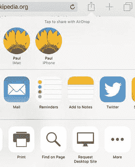
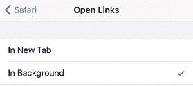
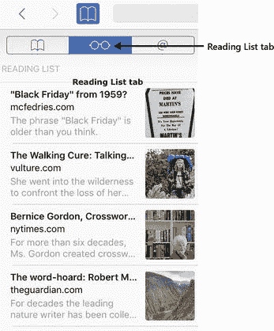
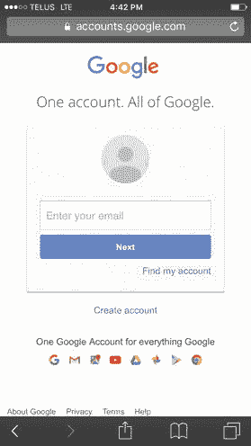
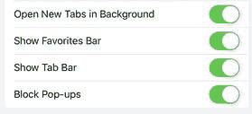
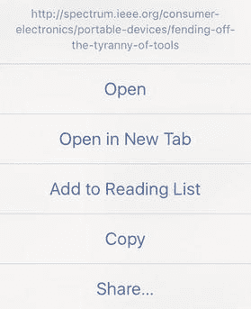
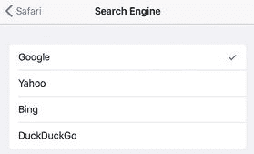

# 4. 解决网页问题

我们生活在一个这样的世界：10 或 15 年前“信息触手可及”（内行人士称之为 IAYF）的承诺，如今已从遥不可及的白日梦变成了“让我帮你查一下”的现实。这是因为我们的指尖离接入互联网、拥有海量信息的设备——尤其是 iPhone 或支持蜂窝网络的 iPad——从未如此之近。无论您是需要解决一场争论、查找最近咖啡馆的路线，还是想起出演过《绽放》的女演员名字，您的 iOS 设备随时都能提供帮助。

值得庆幸的是，iOS 自带的 Safari 应用是一款功能齐全的浏览器，具备您可能需要的一切功能。它是一款出色的浏览器，但遗憾的是它并非完美无缺，因此您可能会遇到大小不一的困扰，影响您的上网体验。本章将解决许多最常见的 Safari 烦扰和问题，并展示如何规避它们或一劳永逸地修复它们。因此，下次您在晚宴上听到有人声称达斯汀·霍夫曼出演了《星球大战》时，您就能以创纪录的速度纠正这一说法。

### 网页浏览问题故障排除

#### 您无法正常查看页面文本或其他信息

我们身处移动网页革命已有多年，令人惊讶的是，仍有大量网站未针对移动浏览进行优化。这意味着您经常访问一些为桌面浏览器设计的网站，导致文本、图像和其他数据小得无法辨认，尤其是在较小的 iPhone 或 iPod touch 屏幕上。

**解决方案**：许多网站支持您通过将两根手指放在屏幕上并分开来放大页面。要快速放大页面上有不同区域的部分，您可以双击要放大的特定区域——可以是图片、段落、表格或文本列。Safari 会将此区域放大以填满屏幕宽度。再次双击可恢复常规视图。

> **注**：双击缩放技巧并非在所有页面上都有效。如果网页开发者将页面的 `maximum-scale` 属性设置为 `1`，则表示您无法将页面放大到超过其原始尺寸。

#### 滚动回长网页顶部需要很长时间

虽然大多数网页只包含一两个屏幕的文字和图片，但有些页面相当冗长，包含多个屏幕。如果你正在阅读一个特别长的网页，且接近页面底部，那么当你需要返回顶部使用地址/搜索栏时，你可能需要滚动很长一段距离。

解决方案：别再让你的手指受累啦！只需轻点屏幕顶部的状态栏一次，即可显示地址/搜索栏，然后再次轻点状态栏；Safari 会立即将你带到页面顶部。

提示

如果你使用的是 iPhone 6 或更高版本的任何机型，在单手浏览网页时可能会发现很难够到屏幕顶部。请记住，你可以轻点两下 `Home` 按钮，将 Safari 屏幕向下移动一半，使其顶部工具栏触手可及。

#### 你想查看网站的桌面版

许多网站会识别出你正在使用 iOS 设备浏览，并显示该网站的“移动”版本。这个版本通常更易于阅读和导航，但这种便利几乎总是以牺牲网站部分功能为代价的。

解决方案：如果某个网站没有显示你想要的功能，你可以请求该网站的“桌面”版本（即，你在使用桌面浏览器时会看到的完整版本）。请按照以下步骤操作：

1.  在屏幕上向下滑动以显示菜单栏。
2.  轻点`共享`按钮。
3.  在底部的共享操作列表中，轻点`请求桌面站点`，如图 4-1 所示。

    

    图 4-1。要将网站从移动版切换为桌面版，请轻点`共享`，然后轻点`请求桌面站点`

#### 你觉得网页的额外功能过于干扰

在线阅读文章或随笔绝非易事。问题在于几乎每个页面上都有大量的干扰项：与文字冲突的背景颜色或图片；位于文字上方、侧边以及其中的广告；诸如搜索框、订阅链接和内容列表等网站功能；还有那些用于在 Facebook、Twitter、Pinterest 等平台与朋友分享文章的无处不在的图标。更糟糕的是，其中许多功能还会闪烁或变化，使得阅读页面内容成为一项真正的挑战。

解决方案：Safari 可以通过为支持的页面提供`阅读器`功能来帮你解决这个问题。`阅读器`会移除所有那些妨碍你阅读乐趣的无关页面干扰项。因此，你看到的将不再是杂乱无章的文字、图标和图片，而是纯粹、简单、足够大且易于阅读的文字。如何达到这种愉悦状态呢？轻点 Safari 屏幕顶部的标题栏，然后轻点地址栏左侧的`阅读器`按钮，如图 4-2 所示。Safari 会立即转换页面，你会看到类似于图 4-3 所示的页面（这是图 4-2 所示页面的`阅读器`版本）。

图 4-3。网页的`阅读器`版本是一种简洁且易于阅读的文字界面

图 4-2。如今的网页往往充斥着广告、图标和其他小玩意儿

#### 你想在后台打开新标签页

根据你的 iOS 设备和 iOS 版本，当你长按一个链接然后轻点`在新标签页中打开`时，你可能会发现 Safari 会立即切换到新标签页并在你等待时加载该链接。这通常是你想要的行为，因为它能让你在新网页加载完成后立即查看。然而，你可能会发现大多数时候你更希望留在当前网页，稍后再查看新标签页。

解决方案：每次都多做一个额外的点击来返回当前标签页，很快就会让人感到厌烦。解决方案是配置 Safari，使其始终在后台打开新标签页。（此设置在 iPhone 和 iPod touch 上默认关闭，但在 iPad 上默认开启。）请按照以下步骤操作：

1.  在主屏幕上，轻点`设置`。设置应用会滑入。
2.  轻点`Safari`。iOS 会显示 Safari 界面。
3.  在 iPhone 或 iPod touch 上，轻点`打开链接`，然后轻点`在后台`，如图 4-4 所示。在 iPad 上，将`在后台打开新标签页`开关打开。

    

    图 4-4。在 iPhone 或 iPod touch 上，在`打开链接`界面中轻点`在后台`

#### 你想在离线时阅读一个或多个页面

在浏览网页时，你经常会遇到内容引人入胜、让你迫不及待想阅读的页面。不幸的是，快速瞥一眼文章的长度，你就会意识到你需要的时间比你当前拥有的要多。你即将进行一次长途飞行或其他一段离线时间，那将是完美的阅读时机，但你如何保存网页内容以便离线阅读呢？

解决方案：你可以利用 Safari 的一个名为“阅读列表”的功能。顾名思义，这是一个简单的待读事项列表。当你现在没有时间阅读某内容时，将其添加到你的阅读列表，你就可以在闲暇时阅读它，即使你没有连接到互联网。

有几种技巧可以将页面添加到你的阅读列表：

*   使用 Safari 导航到你稍后想阅读的页面，轻点`共享`按钮，然后轻点`添加到阅读列表`。
*   长按你稍后想阅读的页面的链接，然后轻点`添加到阅读列表`。

当你准备好阅读时，打开 Safari，轻点`书签`按钮，然后轻点`阅读列表`标签页，如图 4-5 所示。Safari 会显示你添加到列表中的所有项目，你只需轻点你想阅读的文章即可。为了使列表更易于管理，请轻点`显示未读`以仅查看你尚未浏览过的页面。

图 4-5。Safari 的“阅读列表”标签页包含你保存以供稍后阅读的网页

#### Safari 不会询问是否存储网站密码

记住数十个用户名和密码来登录常用网站，是现代人必备的技能。`Safari` 通过询问是否存储网站的账户数据并在后续访问时自动填入来提供帮助。这能极大节省时间，但有时 `Safari` 并不会询问是否存储网站的登录信息。

**解决方法：** `Safari` 不询问是否存储网站用户名和密码主要有三个原因：

* 某些网站要求浏览器不要保存密码，而 `Safari` 会遵从这些请求。在这种情况下，你可以按照下文所示的方法手动添加密码。
* `Safari` 可能被设置为不保存用户名和密码。要检查此设置，请打开 `设置`，点击 `Safari`，再点击 `自动填充`，然后将 `名称和密码` 开关打开至 `开启` 状态。
* `Safari` 可能处于 `无痕浏览` 模式，在此模式下它不会保存任何数据，包括网站登录数据。要检查此模式，请打开 `Safari` 并查看菜单栏。如果菜单栏显示为黑色或深灰色（见图 4-6）而非白色或浅灰色，则表示 `Safari` 处于 `无痕浏览` 模式。要解决此问题，请点击 `标签页` 图标，然后点击 `无痕浏览` 按钮以停用该模式，从而退出 `无痕浏览` 模式。

图 4-6.  
若菜单栏显示为黑色或深灰色，则 `Safari` 处于 `无痕浏览` 模式，不会询问是否存储网站用户名或密码。

以下是手动输入网站用户名和密码的操作步骤：

1. 点击 `设置` 以显示 `设置` 应用。
2. 点击 `Safari`。此时出现 `Safari` 屏幕。
3. 点击 `密码`。`设置` 会提示你输入锁屏密码或进行 `Touch ID` 验证。
4. 输入你的锁屏密码或完成 `Touch ID` 验证。此时出现 `密码` 屏幕。
5. 点击 `添加密码`。此时出现 `添加密码` 屏幕。
6. 填写网站的地址、你的用户名和密码。密码会以常规文本而非常见的圆点形式显示，因此操作时请确保无人偷窥。
7. 点击 `完成`。`iOS` 会保存该网站的登录数据。

#### 你想保存信用卡数据

网购是最受欢迎的线上消遣方式之一，但如果你网购足够频繁，手动输入信用卡号及有效期可能会变得令人厌烦。

**解决方法：** 你可以将信用卡数据保存在 `Safari` 中，这样就不必反复输入你的信用卡详细信息。请按照以下步骤配置 `Safari`，使其在你进行在线购物时保存你的信用卡数据：

1. 在主屏幕中，点击 `设置` 以打开 `设置` 应用。
2. 点击 `Safari`。此时出现 `Safari` 屏幕。
3. 点击 `自动填充` 以打开 `自动填充` 屏幕。
4. 将 `信用卡` 开关打开至 `开启` 状态。

> **提示：** `Safari` 让你无需手动输入信用卡数据，而是可以直接使用相机自动录入。在 `自动填充` 屏幕中，点击 `已保存的信用卡`，输入锁屏密码（如果你正在向你的 `iOS` 设备添加信用卡信息，强烈建议使用锁屏密码或 `Touch ID`；参见第 9 章），然后点击 `添加信用卡`。接着点击 `使用相机`，将信用卡对准相机取景框，等待卡片信息被识别即可。

#### 你想查看网站的弹出式窗口

弹出式广告几乎是自互联网诞生以来就存在的一大祸害。这些烦人广告带来的困扰如此之大，以至于所有现代浏览器早已默认内置了弹出式窗口拦截器，`iOS Safari` 也不例外。

然而，并非所有弹出式窗口都令人厌烦。有些弹出式窗口可能显示有用信息，或者呈现网站界面的关键功能。但是，在弹出式窗口被拦截的情况下，你就会错过这些信息或功能。

**解决方法：** 在访问包含你想要查看的弹出式窗口的网站时，你可以暂时关闭 `Safari` 的弹出式窗口拦截器。请按以下步骤操作：

1. 在主屏幕中，点击 `设置` 以显示 `设置` 应用。
2. 点击 `Safari`。此时出现 `Safari` 屏幕。
3. 将 `拦截弹窗` 开关关闭至 `关闭` 状态，如图 4-7 所示。

图 4-7.  
要临时允许某个网站的弹出式窗口，请将 `拦截弹窗` 开关关闭至 `关闭`，然后访问该网站。

现在你可以使用 `Safari` 访问该网站，其弹出式窗口会出现在一个新标签页中。处理完该网站后，再次按照以上步骤将 `拦截弹窗` 开关打开至 `开启` 状态。

#### 你想在点击链接前查看其地址

如你所知，在 `iOS Safari` 中，你可以通过点击来“单击”网页上的链接。然而如今，精明的上网者在点击链接前总会先检查其地址，因为你永远不知道它最终会把你带到何处。地址并不总是代表恶意或可疑的网站，但检查一下总没有坏处。

在常规网页浏览器中，你可以通过将鼠标指针悬停在链接上，并在状态栏中查看链接地址来了解该链接将把你带到何处（即查看链接的 URL）。但这个方法在 `iOS Safari` 中行不通，那么如何在点击链接前查看其地址呢？

**解决方法：** 长按该链接几秒钟。`Safari` 随后会显示一个弹出屏幕，其中包含链接文本，更重要的是，还会显示其 URL，如图 4-8 所示。如果链接看起来没问题，请点击 `打开` 以在当前浏览器页面中访问，或点击 `在新页面中打开` 以开启一个新页面。如果你决定不点击该链接，请在菜单外部点击一下。

图 4-8.  
长按链接以检查其地址，再决定是否访问该网站。

### 搜索问题故障排除

#### 你想使用不同的搜索引擎

`Google` 是 `iOS` 上的默认搜索引擎。当然，几乎所有人都在使用 `Google`，但如果你对它有所不满，可能会想切换到另一个不同的搜索引擎。例如，许多人不喜欢 `Google` 的广告追踪，因此转而使用不追踪用户的 `DuckDuckGo`。

**解决方法：** 你可以使用 `Safari` 导航到其他搜索引擎的 URL 并在此进行搜索。不过，`Safari` 的默认搜索引擎使用起来更为便捷，因为它允许你直接从地址栏进行搜索。虽然 `Google` 是 `iOS` 的默认搜索引擎，但它并非 `iOS` 唯一支持的搜索引擎。以下是设置其他搜索引擎为 `Safari` 默认搜索引擎的步骤：

1. 打开 `设置` 应用。
2. 点击 `Safari`。此时出现 `Safari` 屏幕。
3. 点击 `搜索引擎`。`iOS` 会打开 `搜索引擎` 屏幕。
4. 点击你想要使用的搜索引擎。如图 4-9 所示，你有四种选择：`Google`、`Yahoo`、`Bing` 或 `DuckDuckGo`。

图 4-9.  
在 `搜索引擎` 屏幕中，点击你希望设为 `Safari` 默认使用的搜索引擎。

#### 在网页中查找特定信息并非易事

当你在浏览网页时，想要查找特定信息的情况并不少见。此时，与其通读整页来寻找所需内容，不如直接搜索数据来得方便。在桌面版的 Safari 或任何其他电脑浏览器中，你可以轻松做到这一点，但乍看之下，Safari 应用程序似乎找不到“查找”功能。

**解决方案：** Safari 确实提供了这一功能，但你需要知道在哪里找到它：

1.  使用 Safari 应用导航到包含你想要查找信息的网页。
2.  点击网页标题栏（或向下滑动屏幕）以显示菜单栏，然后点击 Safari 窗口顶部地址/搜索框的内部。
3.  输入你想要使用的搜索文本。Safari 会显示网页匹配项，但在这些匹配项的底部还会显示“在此页上（X 个匹配项）”，其中 X 是你的搜索文本在网页上出现的次数。
4.  向上轻扫搜索结果以隐藏键盘。
5.  点击 `查找“搜索词”`（其中 `搜索词` 是你输入的搜索文本）。Safari 会高亮显示搜索词的第一个匹配项。此时，“在此页上”消息会出现在结果屏幕的底部，如图 4-10 所示。

    

    **图 4-10.** “在此页上”消息告诉你当前网页上出现的匹配项数量

6.  点击向下箭头，可以向前循环浏览页面上出现的搜索词实例。请注意，你也可以通过点击向上箭头向后循环浏览结果。此外，当你在最后一个结果出现后点击向下箭头时，Safari 会返回到第一个结果。
7.  完成搜索后，点击 `完成`。

#### 你想使用语音命令搜索网络

你可以使用 Safari 直接在搜索框中输入搜索查询，或通过导航到搜索引擎网站来输入。然而，如今由于 Siri 应用的语音识别能力，输入似乎突然变成了一种过时的消遣。那么，当你可以直接告诉 Siri 你要找什么的时候，为什么还要输入搜索查询呢？

**解决方案：** 按住 `主屏幕` 按钮（或按住设备耳机上的 `麦克风` 按钮，或蓝牙耳机上的等效按钮）来启动 Siri。以下是一些使用 Siri 进行网络搜索的通用技巧：

- **搜索整个网络。** 说“搜索网络查找 `主题`”，其中 `主题` 是你的搜索条件。
- **搜索维基百科。** 说“搜索维基百科查找 `主题`”，其中 `主题` 是你想要查询的条目。
- **使用特定搜索引擎搜索。** 说“`引擎 主题`”，其中 `引擎` 是搜索引擎的名称，例如 Google 或 Bing（但由于某种原因，不包括 DuckDuckGo），而 `主题` 是你的搜索条件。

Siri 还能理解与其通过 Yelp 合作相关的、用于搜索商家和餐厅的命令。要使用 Siri 查找商家和餐厅，通常使用以下通用语法（当然，和 Siri 打交道时，不必过于拘泥于此）：

“查找（或寻找）`某物` `某处`。”

在这里，`某物` 部分可以是商家名称（例如“星巴克”）、商家类型（例如“加油站”）、餐厅类型（例如“泰国餐厅”）或通用产品（例如“咖啡”）。`某处` 部分可以是相对于你当前位置的某个地点（例如“附近”或“我周围”或“步行可达”）或一个具体位置（例如“在印第安纳波利斯”或“在宽河区”）。以下是一些示例：

- “查找步行可达的加油站。”
- “寻找印第安纳波利斯的披萨餐厅。”
- “在附近找咖啡。”
- “在我周围找一家杂货店。”

另外请注意，如果你在命令的 `某物` 部分之前添加一个限定词，例如“好的”或“最好的”，Siri 会按照 Yelp 评分排序返回结果。

