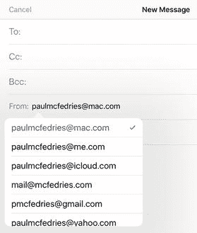
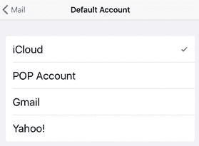
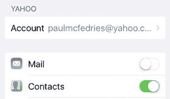
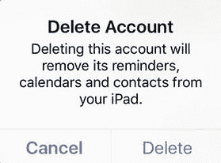
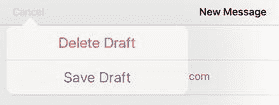
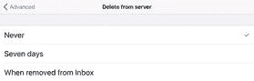
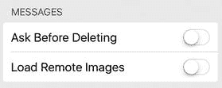
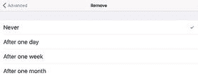
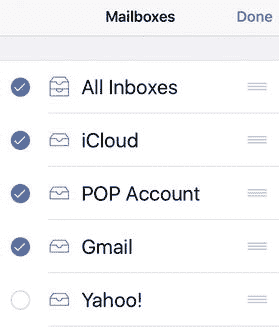

# 解决电子邮件故障

如今，我们拥有数量惊人的沟通方式：短信、SnapChat、视频通话、Facebook 消息、Twitter 私信等等。毫不奇怪，这些新颖的（或多或少）通信技术获得了所有的报道和赞誉。但说到日常的、基础的沟通，我们大多数人还是会依赖老牌且好用的电子邮件。它不性感，几十年来也没怎么改变，而且开发者给邮件客户端添加的任何花哨功能通常都被忽略了。电子邮件就是能完成任务。

或者，我应该说，电子邮件通常能完成任务。和任何技术一样，电子邮件也少不了各种各样的小毛病和漏洞，因此你可能会发现使用 iOS 的“邮件”应用发送或接收电子邮件时遇到麻烦。好消息是，大多数这些问题都容易解决，你通常可以很快让“邮件”恢复正常工作。为了帮助你做到这一点，本章汇集了最常见的电子邮件抱怨及其解决方案。

### 发送电子邮件故障排除

#### 发送邮件时“邮件”使用了错误的账户

当你添加了多个电子邮件账户时，在发送新邮件时，“邮件”应用如何决定使用哪一个？它会指定其中一个账户——具体来说，是你添加到“邮件”应用的第一个账户——作为默认账户，然后每次你撰写新邮件时，它都会自动使用该地址作为发件账户。当您通过电子邮件共享链接、照片或地图等内容时，它也会使用该地址作为默认的发件账户。

**注意：** 当你回复或转发邮件时，“邮件”不会自动使用默认账户。在这些情况下，“邮件”会将回复或转发配置为从原始邮件发送到的账户发出。

如果默认账户正是你想要用来发送邮件的账户，那么这个行为就不是问题，但你可能会更倾向于使用你的其他账户之一。

**解决方案：** 首先，请注意，你不必局限于为每封邮件都使用默认账户。如果你在发送邮件时需要改用其他账户，请按以下步骤操作：

1.  在“邮件”应用中，开始一封新邮件。
2.  在新邮件屏幕上，点击“`抄送/密送，发件人`”行。
3.  点击“`发件人`”行。“邮件”会显示可用的电子邮件地址列表，如图 5-1 所示。

    

    **图 5-1.** 你可以使用“发件人”列表选择不同的发送地址

4.  点击你想用来发送邮件的地址。

如果你只是偶尔需要使用这种技巧，那么按需更换发送账户效果不错，但你肯定不希望每次发送邮件时都重复这个操作。如果你有一个特别偏好的账户，希望全部或大部分时间都使用它来发送邮件，那么你需要将该账户设置为默认账户。请按以下步骤操作：

1.  在主屏幕上，点击 `设置`。设置应用随即打开。
2.  点击 `邮件` 以打开邮件屏幕。iOS 会显示邮件屏幕。
3.  在邮件部分的底部附近，点击 `默认账户`。这将打开默认账户屏幕，其中显示你的账户列表。当前默认账户旁边会显示一个勾选标记。
4.  点击你想设置为默认账户的账户。iOS 会在该账户旁边放置一个勾选标记，如图 5-2 所示。

    

    **图 5-2.** 在默认账户屏幕中，点击你希望“邮件”用作发送邮件的默认账户

#### 你想阻止某个账户接收电子邮件

你可能希望`Mail`暂时阻止某个特定账户接收电子邮件的原因有很多：

- `Mail`应用会按固定间隔检查新邮件，因此，如果你在`Mail`中配置了多个账户，这种不断的检查会严重消耗设备电池。通过阻止一个或多个账户接收邮件，可以减少这种消耗。
- 某个账户可能会在短时间内收到大量邮件。与其浪费时间和资源在设备上接收所有这些邮件，你可能更希望阻止它们在`iOS`中被接收，然后在常规的邮件客户端中处理它们。
- 某个账户可能会收到一封或多封非常大的邮件。与其让设备承受这些“庞然大物”，你可能更希望阻止它们被下载，以便你能更轻松地使用桌面或网页邮件客户端处理这些邮件。

或者，你可能希望永远不让某个特定账户接收电子邮件，但仍然希望使用该账户的其他数据，例如日历或联系人。

注意

仅对以下账户类型可以关闭邮件接收功能，同时保留日历和联系人等其他类型的数据：`iCloud`、`Exchange`、`Google`、`Yahoo!`、`AOL`和`Outlook.com`。你不能对`POP`（邮局协议）或`IMAP`（互联网消息访问协议）账户执行此操作。

解决方案：首先，我假设你仍然想保留该账户。也就是说，你要么想临时停止接收特定账户的邮件，要么想永久停止接收邮件但仍然接收其他数据。如果这两种情况都不是，那么你可能想删除该账户，如下一节所述。否则，您需要禁用该账户的邮件接收功能。操作方法如下：

1.  在“主屏幕”上，点击“设置”以打开“设置”应用。
2.  点击“邮件”以打开“邮件”屏幕。
3.  点击你想要禁用的账户。`iOS`会显示该账户的设置。
4.  根据账户类型，使用以下方法之一临时禁用该账户：
    - 对于`iCloud`、`Exchange`、`Google`、`Yahoo!`、`AOL`或`Outlook.com`账户，将“邮件”开关点击为“关闭”，如图 5-3 所示。

        

        图 5-3.
        对于`iCloud`、`Exchange`、`Google`、`Yahoo!`、`AOL`或`Outlook.com`账户，将“邮件”开关点击为“关闭”
    - 对于`POP`或`IMAP`账户，将“账户”开关点击为“关闭”。

当你准备再次使用该账户时，重复这些步骤，将“邮件”开关或“账户”开关重新点击为“开启”。

#### 你不再需要某个账户

一个你不再使用的电子邮件账户会弄乱你的“邮件收件箱”，占用存储空间，并因不断检查新邮件而浪费电池电量。

解决方案：如果你不再使用某个电子邮件账户，则应将其删除。这将从`Mail`中移除该账户及其邮件，释放一些存储空间，加快同步时间，并节省电池电量。

注意

如果你发现即使尝试了本章中的故障排除步骤后，仍无法使用特定账户发送电子邮件，那么一种通常有效的方法是删除该账户，然后重新添加。

按照以下步骤删除账户：

1.  打开“设置”应用。
2.  点击“邮件”以打开“邮件”屏幕。
3.  点击你想要删除的账户。这将打开该账户的设置。
4.  在屏幕底部，点击“删除账户”。`iOS`会要求你确认。
5.  点击“删除”，如图 5-4 所示。`iOS`会移除该账户。

    

    图 5-4.
    点击该账户，然后点击“删除账户”，将其从`Mail`中移除

#### 你想保存一封未完成的电子邮件

如果你在电脑上撰写一封邮件，并决定稍后处理，你的邮件程序会将该邮件存储为草稿，你可以随时重新打开。`Mail`应用似乎没有这个选项，那么如何保存一封未完成的邮件呢？

解决方案：`Mail`应用似乎不提供保存邮件草稿的选项，但它确实有，尽管方式非常不直观。在邮件窗口中，点击“取消”，然后点击“存储草稿”（见图 5-5）。当你准备继续编辑时，在“邮箱”屏幕中打开该账户，点击“草稿”，然后点击你保存的邮件。

图 5-5.
要保存一封未完成的邮件，请点击“取消”，然后点击“存储草稿”

#### 排查使用第三方账户时的外发电子邮件问题

出于安全原因，一些互联网服务提供商（`ISP`）要求其所有客户的出站邮件必须通过该`ISP`的`SMTP`（简单邮件传输协议）服务器进行路由。如果你使用的是由`ISP`维护的电子邮件账户，这通常不是什么大问题，但如果你使用的是由第三方（例如你的网站主机）提供的账户，则可能导致以下问题：

- 你的`ISP`可能会阻止使用第三方账户发送的邮件，因为它认为你试图通过`ISP`的服务器中继邮件（这是垃圾邮件发送者常用的技术）。
- 如果你的`ISP`每月只允许一定量的`SMTP`带宽或一定数量的已发送邮件，而第三方账户提供了更高的限制或完全没有限制，你可能会产生额外费用。
- 你可能会遇到性能问题，`ISP`路由邮件所需的时间比第三方主机长得多。

解决方案：为了解决这些问题，许多第三方主机提供通过标准端口`25`以外的端口访问其`SMTP`服务器的权限。例如，`iCloud`的`SMTP`服务器（`smtp.icloud.com`）也接受端口`465`和`587`上的连接。请咨询你的邮件托管提供商，了解他们支持哪个（或哪些）端口。

以下是配置电子邮件账户以使用非标准 SMTP 端口的方法：

1.  在“主屏幕”上，点击“设置”。你会看到“设置”应用。
2.  点击“邮件”。出现“邮件”设置屏幕。
3.  点击你想要配置的`POP`账户。出现该账户的设置屏幕。
4.  在屏幕底部附近，点击`SMTP`。`iOS`会显示`SMTP`屏幕。
5.  在“主服务器”部分，点击该服务器。`iOS`会显示服务器设置。
6.  在“外发邮件服务器”部分，点击“服务器端口”，然后输入端口号。
7.  点击“完成”。

注意

你可能还会发现通过蜂窝网络连接发送邮件时遇到问题。要了解如何排查该问题，请参阅第 2 章的“你可以通过 Wi-Fi 发送电子邮件，但无法通过蜂窝网络发送”部分。

#### 使用特定账户无法发送 POP 邮件

当你使用 `Mail` 发送 POP 邮件时，可能会发现邮件要么停留在`收件箱`文件夹中（意味着从未发出），要么从未送达（此时你可能会或不会收到退信）。邮件无法发送的原因有很多，但通常可归结为以下一项或多项 POP 账户设置错误。

- 使用了错误的 SMTP 主机名。
- 使用了错误的用户名或密码。
- 如果你的邮件主机要求 SSL（安全套接层）加密，但你未使用（反之，在主机不要求时你却使用了 SSL 加密）。
- 未使用身份验证。为了减少垃圾邮件，许多互联网服务提供商现在要求对发件邮件进行 SMTP 身份验证，这意味着你必须登录 SMTP 服务器以确认你是邮件的发送者（而非冒充你地址的垃圾邮件发送者）。如果你的互联网服务提供商要求对发件进行身份验证，你需要配置你的电子邮件账户以提供正确的凭据。
- 使用了邮件主机不支持的服务器端口。

如果你对此不太确定，请咨询你的邮件主机。

**解决方法：** 按照以下步骤使用正确设置配置你的电子邮件账户：

1.  在主页面上，轻点`设置`。iOS 将显示“设置”应用。
2.  轻点`邮件`。将出现“邮件”设置屏幕。
3.  轻点你要配置的 POP 账户。将出现该账户的设置屏幕。
4.  在屏幕底部附近，轻点`SMTP`。iOS 将显示 SMTP 屏幕。
5.  在“主服务器”部分，轻点该服务器。iOS 将显示该服务器的设置屏幕。
6.  检查`主机名`和`用户名`字段中的值，确保其正确无误。
7.  重新输入正确的密码。
8.  如果你的主机要求 SSL，则将`SSL`开关轻点至“开”；否则，将此开关轻点至“关”。
9.  轻点`身份验证`以打开“身份验证”屏幕，轻点你的主机所要求的身份验证类型（通常为`密码`），然后轻点“返回”返回到服务器设置屏幕。
10. 检查`服务器端口`设置是否为你的主机支持的端口值。
11. 轻点`完成`。

#### 使用 Siri 语音命令发送电子邮件时遇到问题

你可以使用 `Siri` 语音识别应用通过简单的语音命令检查、撰写、发送和回复信息。按住主屏幕按钮（或按住设备耳机上的麦克风按钮，或蓝牙耳机上的相应按钮），直到出现 `Siri`。`Siri` 虽然方便，但你可能难以让它按你的意愿行事。

**解决方法：** 确保你使用的是 `Siri` 能识别的命令。

要检查 iCloud 账户上的新电子邮件，你只需说“检查电子邮件”（或仅说“检查邮件”）。你也可以按以下方式查看 iCloud 邮件列表：

-   要显示未读信息，请说“显示新邮件”。
-   要显示某个特定人员的邮件，请说“显示来自*姓名*的邮件”，其中*姓名*是发件人的名字。

要开始撰写新电子邮件，`Siri` 为你提供了几个选项：

-   要创建发送给特定人员的新邮件，请说“发送邮件给*姓名*”，其中*姓名*是收件人的名字。此姓名可以是通讯录中的姓名，也可以是具有已定义关系的某人，例如“妈妈”或“我的兄弟”。
-   要创建带有特定主题行的新邮件，请说“发送关于*主题*的邮件给*姓名*”，其中*姓名*指定收件人，*主题*是主题行文本。
-   要创建新邮件并指定正文文本，请说“发送关于*主题*的邮件给*姓名*，内容为*文本*”，其中*姓名*是收件人，*主题*是主题行，*文本*是邮件正文文本。

在每种情况下，`Siri` 都会创建新邮件、显示它，然后询问你是否要发送。如果要发送，你可以说“发送”或轻点`发送`按钮。

如果你正在查看某封邮件，可以说“回复”来发送回复。如果你想在回复中添加一些文本，请说“回复*文本*”，其中*文本*是你的回复内容。

你也可以在 `Mail` 中使用 `Siri` 来听写信息。当你在新邮件的正文内轻点时，出现的键盘会在空格键旁边显示一个`麦克风`图标。轻点`麦克风`图标，然后开始听写。以下是一些说明：

-   对于标点符号，你可以说出所需符号的名称，例如“逗号”（`,`）、“分号”（`;`）、“冒号”（`:`）、“句号”（`.`）、“问号”（`?`）、“感叹号”（`!`）、“破折号”（`-`）或“@符号”（`@`）。
-   你可以通过说“左括号”，然后说出文本，再说“右括号”来将文本括在括号中。
-   要用引号将文本括起来，请说“左引号”，然后说出文本，再说“右引号”。
-   要将单词全部呈现为大写字母，请说“全大写”，然后说出该单词。
-   要开始新段落，请说“换行”。
-   你可以通过说“笑脸”来输入 `:-)`，说“眨眼”来输入 `;-)`，说“苦脸”来输入 `:-(`，增添一些趣味。

完成后，轻点`完成`。

### 接收电子邮件疑难解答

#### 你在设备上能收到邮件，但在电脑上却收不到

如果你需要在多台设备上检查电子邮件，首先需要了解 POP 邮件是如何通过互联网传递的。（这不适用于 iCloud、Gmail 以及其他使用 IMAP 的服务。）当有人给你发送信息时，它不会直接发送到你的 iOS 设备或电脑。相反，它会发送到你的互联网服务提供商（或你的公司）为处理收到的邮件而设置的服务器上。当你请求 `Mail` 检查新邮件时，它会与 POP 服务器通信，查看你的账户中是否有邮件在等待。如果有，`Mail` 会下载这些邮件，然后指示服务器删除存储在服务器上的邮件副本。因此，如果你在 iOS 设备上收取了邮件，这些邮件将无法再下载到你的电脑上。

**解决方法：** 你需要配置 `Mail`，使其在下载邮件后，在 POP 服务器上保留一份邮件副本。这样，当你使用另一台设备检查邮件时，这些邮件仍然可用。请注意，对于添加到 iOS 的 POP 账户，这是默认行为。因此，如果你发现 iOS 设备能收到邮件，但其他地方收不到，则需要按照以下步骤阻止 iOS 从服务器删除邮件：

1.  在主页面上，轻点`设置`。
2.  轻点`邮件`以打开“邮件”屏幕，显示“邮件”屏幕。
3.  轻点你要配置的 POP 账户。将出现该账户的设置屏幕。
4.  在屏幕底部附近，轻点`高级`。iOS 将显示“高级”屏幕。
5.  轻点`从服务器删除`。将出现“从服务器删除”屏幕。
6.  轻点`永不`，如图 5-6 所示。

    

    **图 5-6.** 为确保 `Mail` 在 POP 服务器上保留下载邮件的副本，请在“从服务器删除”屏幕中轻点`永不`。

#### 您收到大量垃圾邮件

遗憾的是，如今已不存在完全免受垃圾邮件侵扰的区域。只要您拥有基于互联网的电子邮件账户，就一定会收到垃圾邮件，仅此而已。事实上，您很可能每天收到的垃圾邮件不是一两封，而是一两打。这并不奇怪，因为如今垃圾邮件已占据每天发送的数十亿封邮件中的大多数，在某些日子里甚至占到所有发送邮件的 90%！互联网服务提供商和电子邮件托管公司过滤垃圾邮件的能力在不断提升，但这些防御措施仍然不够完善。

**解决方案：** 虽然无法完全避免垃圾邮件，但您可以采取一些措施来尽量减少每天需要处理的垃圾邮件数量：

- 切勿在论坛或博客评论中输入您的真实电子邮件地址。垃圾邮件发送者收集地址的最常见方法就是从网络帖子中获取。一种常用的策略是修改您的电子邮件地址，例如添加一些使地址无效但他人仍能轻易识别的文字。示例如下：`yourname@yourisp.remove-this-to-email-me.com`。
- 考虑创建一个专门用于登录、邮件列表、新闻简报及其他网络用途的电子邮件地址。这个地址最终很可能也会收到垃圾邮件，但总比让您的主邮箱沦陷要好。
- 如果您在收件箱中看到确定是垃圾邮件的邮件，请勿点开它。这样做有时会通知垃圾邮件发送者您已打开邮件，从而确认您的地址是有效的。您可以通过禁用远程图片来防止这种情况，具体方法将在下一节介绍。

> **提示：** 如果您在收件箱中发现明确的垃圾邮件，可以直接删除而无需点开。只需在邮件上向左短划，然后点击`废纸篓`，或者向左长划直至邮件从收件箱中消失。

- 切勿回复垃圾邮件。即使邮件中包含声称是“退订”地址的链接，也不要回复。回复垃圾邮件会证明您的地址是有效的，最终只会招致更多的垃圾邮件。
- 如果您的某个邮箱收到了大量垃圾邮件，可以考虑宣布“垃圾邮件破产”，并删除该账户——不仅从您的 iOS 设备上删除，还要从您的互联网服务提供商或邮件托管商处删除。

#### 您想禁用邮件中的远程图片

网络爬虫是一种驻留在远程服务器上的图片，它通过在 HTML 格式的电子邮件中引用远程服务器地址来加入邮件中。当您打开邮件时，`邮件`应用会使用该地址下载图片并显示在邮件内。这听起来似乎无害，但如果邮件是垃圾邮件，这个地址很可能也包含您的电子邮件地址或指向您电子邮箱的代码。因此，当远程服务器收到加载图片的请求时，它不仅能知道您已打开邮件，还能确认您的邮箱地址是有效的。所以，垃圾邮件发送者会频繁使用网络爬虫也就不足为奇了，因为对他们来说，有效的邮箱地址如同金子一般珍贵。

**解决方案：** iOS 的“邮件”应用默认会显示远程图片。要禁用远程图片，请按照以下步骤操作：

1. 在主屏幕上，点击`设置`。iOS 将打开`设置`应用。
2. 点击`邮件`以打开`邮件`设置屏幕。
3. 将`载入远程图像`开关滑动至`关闭`位置，如图 5-7 所示。`邮件`应用将保存此设置，不再在您的电子邮件中显示远程图片——尤其是网络爬虫。

   

   **图 5-7.** 要屏蔽网络爬虫，请将`载入远程图像`开关滑动至`关闭`位置

> **提示：** 要在非垃圾邮件中显示远程图片，请点击该邮件，然后点击`载入所有图像`。

#### 您不再希望邮件应用按主题整理邮件

在`邮件`应用中，您的邮件会按主题进行分组，这意味着原始邮件及其所有回复都集中在该账户的`收件箱`文件夹中。

按主题整理邮件通常很方便，但并非总是如此。例如，如果您使用 iPhone 或 iPod touch，有时您可能通过点击`下一封`（右箭头）和`上一封`（左箭头）按钮来浏览邮件。当您遇到一个主题对话时，`邮件`应用会跳入该对话中，然后您需要在其中逐封浏览邮件，如果该对话包含大量回复，这会非常麻烦。

**解决方案：** 如果您发现主题对话带来的麻烦大于便利，可以按照以下步骤将`邮件`应用配置为不再按主题整理邮件：

1. 在主屏幕上，点击`设置`。iOS 将打开`设置`应用。
2. 点击`邮件`以打开`邮件`设置屏幕。
3. 将`按主题整理`开关滑动至`关闭`位置。

#### 已删除的邮件正在从废纸篓文件夹中移除

当您删除一封邮件时，`邮件`应用并不会完全移除该邮件，而只是将其转移到该账户的`废纸篓`文件夹。这很有用，因为如果您误删了邮件，可以在`废纸篓`文件夹中找到它，并将其移回`收件箱`（或其原始文件夹）。也就是说，只要邮件仍在`废纸篓`文件夹中，您就可以恢复它。不幸的是，`邮件`应用会将每个账户配置为一周后自动删除`废纸篓`文件夹中的项目。

**解决方案：** 请按照以下步骤来控制`邮件`应用何时从`废纸篓`文件夹中删除邮件：

1. 在主屏幕上，点击`设置`以显示`设置`应用。
2. 点击`邮件`以显示`邮件`设置屏幕。
3. 点击您想要配置的账户。
4. 显示该账户的高级邮件选项：
   - 对于 iCloud 账户，点击`邮件`，然后点击`高级`。
   - 对于 POP 账户，点击`高级`。
   - 对于大多数其他账户类型，点击`账户`，然后点击`高级`。
5. 点击`移除`以打开`移除`屏幕。
6. 点击`永不`以防止`邮件`应用自动从该账户的`废纸篓`文件夹中移除邮件，如图 5-8 所示。

   

   **图 5-8.** 在`移除`屏幕中，点击`永不`可防止`邮件`应用自动从该账户的`废纸篓`文件夹中删除邮件

#### 您看不到“所有收件箱”文件夹

如果您在 iOS 中设置了多个账户，`邮件`应用会包含一个名为`所有收件箱`的文件夹，它会显示您所有账户中收到的邮件合并列表。在升级 iOS 后，此文件夹有时会消失。

**解决方案：** 请按照以下步骤将`所有收件箱`文件夹恢复到`邮件`界面中：

1. 在`邮件`应用中，显示`邮箱`屏幕。
2. 点击`编辑`。
3. 点击`所有收件箱`项目以将其激活，如图 5-9 所示。

   

   **图 5-9.** 要将`所有收件箱`文件夹恢复到`邮箱`屏幕，请点击`编辑`，然后点击以激活`所有收件箱`项目
4. 点击`完成`。

