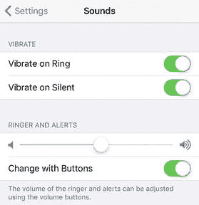
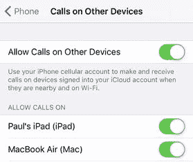
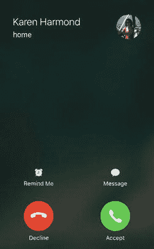
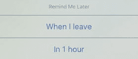
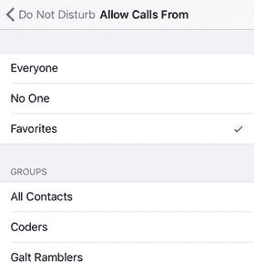
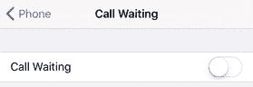
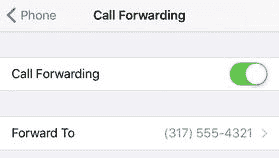
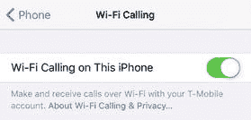
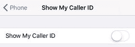
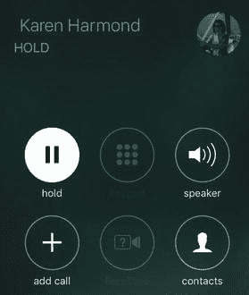

# 6\. 修复手机问题

本书大部分章节都聚焦于 iOS 及其设备与数据相关的功能：Wi-Fi、应用、网页、电子邮件、照片等。这很恰当，因为我们的 iOS 设备归根结底是电脑，所以将重点放在解决计算任务上是合理的。但 iPhone 与众不同。诚然，它是一款出色的移动电脑，但其核心也是一部移动电话。虽然电话通话开始显得有些过时，但这部智能手机的“电话”功能仍被几乎所有 iPhone 用户使用，即使是二十多岁的年轻人也不例外。（皮尤研究中心最近的一项调查发现，18 至 29 岁的智能手机用户中，有 93%曾使用过语音或视频通话。）电话通话经久不衰的吸引力源于多个因素：即时性（假设对方接听！）、私密性和高效性。但这一切都只有在 iPhone 的通话功能正常工作且你知道如何充分利用它们时才成立。本章将介绍一些常见的通话问题，并告诉你如何修复或应对它们。

### 排查来电问题

#### 你需要将来电静音

当有来电时，有时你可能无法立即接听电话。例如，如果你正在开会，你可能会希望先离开房间再接听电话，以尽可能减少对其他与会者的干扰。当然，如果你在走向门口的过程中电话一直响，那你仍然会打扰到所有人。

解决方法：听到来电铃声后，立即按下`睡眠/唤醒`按钮一次。这会暂时关闭铃声，这意味着如果你决定接听，你仍有标准次数的响铃机会。如果你不接听，你的 iPhone 会将此呼叫转接到语音信箱。

#### 你无法使用音量按钮调节铃声音量

你可能更希望调低音量，而不是将来电静音。然而，当你按下设备侧面的`音量减小`按钮时，铃声的音量保持不变。

解决方法：如果你无法使用音量按钮调高或调低铃声音量，说明此功能已被禁用。要重新开启，请遵循以下步骤：

1.  打开`设置`应用。
2.  点击`声音与触感`。
3.  将`用按钮调整`开关切换到`开`，如图 6-1 所示。

    

    图 6-1.

    将`用按钮调整`开关切换到`开`，即可使用 iPhone 的音量按钮控制铃声音量

警告

另一方面，锁定铃声音量是个好主意，因为它能避免一个主要的 iPhone 烦恼：因铃声音量被意外静音（例如，iPhone 在包或口袋中被碰撞）而错过电话。

#### 你想要将来电直接发送到语音信箱

你的 iPhone 收到一个电话，但你现在无法接听。然而，你也不想让电话一直响到语音信箱启动而打扰周围的人。

解决方法：使用以下任一技巧：

*   如果手机未锁定，点击触摸屏上的红色`拒绝`按钮。
*   如果你正在使用 EarPods，按住中央按钮两秒钟。
*   快速连续按下`睡眠/唤醒`按钮两次。

无论使用哪种方法，iOS 都会将此呼叫直接发送到语音信箱。但请注意，如果你改变主意，将无法接听此电话。

#### 你想要能够使用其他设备接听电话

我们都遇到过这种情况：你在一个房间，听到 iPhone 在另一个房间响铃，然后你疯狂冲刺试图在电话转入语音信箱前接听。如果这种冲刺不必发生，而你只需使用与 iPhone 在同一 Wi-Fi 网络上的 iPad 或 Mac 就能接听电话，那该多好。

解决方法：iOS 支持一项功能，使你能够使用其他设备（包括 iPad、iPhone 甚至 Mac）来接听来电。要确保此功能已激活并控制可用于接听电话的设备，请遵循以下步骤：

1.  打开`设置`应用，然后点击`电话`以显示`电话`设置。
2.  点击`在其他设备上通话`。如果你看不到此设置，请参阅下一个问题。
3.  确保`允许在其他设备上通话`开关已设置为`开`，如图 6-2 所示。

    

    图 6-2.

    将`允许在其他设备上通话`开关切换到`开`，然后在你想要用来接听电话的每个设备旁边将开关切换到`开`
4.  在设备列表中，对于你想要用来接听电话的每个设备，将其开关切换到`开`。

#### 你无法访问“在其他设备上通话”设置

如果你想要配置 iPhone 以允许在其他 iOS 设备上接听来电，你可能会发现，在`设置`应用中点击`电话`后，该设置并未出现。

解决方法：你必须使用同一个 Apple ID 同时登录 iCloud 和 FaceTime，才能看到`在其他设备上通话`设置。请遵循以下步骤登录这些服务：

1.  打开`设置`应用。
2.  点击`iCloud`。
3.  如果你尚未登录 iCloud，请输入你的 Apple ID 电子邮件地址和密码，然后点击`登录`。
4.  点击`设置`返回主`设置`屏幕。
5.  点击`FaceTime`以打开`FaceTime`设置。
6.  将`FaceTime`开关切换到`开`。
7.  如果你尚未登录，请点击`使用 Apple ID 登录 FaceTime`，输入你的 Apple ID 电子邮件地址和密码，然后点击`登录`。

#### 你想在不接听电话的情况下回复来电

在本章前面部分，你已经学会了如何将来电直接发送到语音信箱。这对于你想忽略的电话来说非常有用，但在很多情况下，你既无法接听电话，又不想忽略来电者。例如，如果你正在等一个电话，但同时又不得不去开会，那么来电时接听电话会显得不礼貌；但如果你只是将电话转到语音信箱，来电者可能会感到困惑。同样，你可能会在赴约时稍微迟到，而在路上你看到来电者正是你要见的人。此时，接听电话可能不太方便，但让语音信箱处理又会让对方怀疑你是否会赴约。

解决方案：iOS 提供了一项功能，可以轻松处理这些棘手的电话情况。它叫做`用信息回复`，允许你同时拒接来电并向来电者发送一条预设的短信。这样一来，你避免了语音通话（根据你当时的情况，这可能会显得不礼貌或不方便），但同时给了来电者一些反馈。

默认情况下，`用信息回复`提供了三条可立即发送的消息：

- `抱歉，我现在不方便接听电话。`
- `我正在路上。`
- `我稍后打给你好吗？`

如果这些消息都不太合适，你还可以选择发送自定义信息。以下是拒接来电并向来电者发送短信的方法：

1.  当来电时，点击`信息`按钮，如图 6-3 所示。你的 iPhone 会为每条预设短信显示一个按钮。

    

    图 6-3.
    点击`信息`按钮，通过短信回复来电者 注意 你的手机套餐必须开通来电显示功能，才能看到`信息`按钮。  

2.  点击你想要发送的回复。如果你想发送其他信息，请点击`自定义`，输入你的信息，然后点击`发送`。  

来电者会在电话应用中看到“用户忙”的提示，随后收到一条短信。

注意

如果你不喜欢默认回复，可以自行创建。依次点击`设置`> `电话`> `用信息回复`，然后使用三个文本框输入你自己的信息。

#### 你想设置提醒稍后回电

`用信息回复`功能是你 iPhone 上一个实用的技巧，但它存在与直接拒接来电相同的问题：如果你之后想和那个人通话，你必须记得回拨。

解决方案：你可以使用“提醒事项”应用来在一小时后（或任何时间）提醒自己回电。不过，幸运的是，你不需要执行这个额外的步骤，因为你可以让电话应用替你完成。电话应用有一项功能，允许你在拒接来电的同时自动创建回电提醒。你可以将提醒设置为在一小时后触发，或者在离开当前所在位置时触发。

以下是拒接来电并设置回电提醒的方法：

1.  当来电时，点击`稍后提醒我`（参见前面的图 6-3）。你的 iPhone 会显示回电提醒选项，如图 6-4 所示。

    

    图 6-4.
    来电时，点击`稍后提醒我`可查看此处显示的提醒选项  

2.  点击你想要设置的提醒类型：
    - `我离开时`。点击此选项可设置基于位置的提醒，当你离开当前位置时触发。
    - `1 小时后`。点击此选项可设置基于时间的提醒。 

提示

如果你没有看到`我离开时`提醒选项，你需要打开`定位服务`。

#### 你只想允许特定人群的来电

你可能在某些情况下希望拒接所有来电，但除了来自某个特定人或群组的电话。

解决方案：你可以通过激活`勿扰模式`并将其配置为只允许来自你想通话之人的来电来实现。

`勿扰模式`的这一功能是针对人群组而非个人起作用的。因此，你的首要任务是创建或配置一个群组，其中包含你允许来电的人。你有两个选择：

- 在电话应用中，将每个人添加到`个人收藏`列表。点击`通讯录`，然后对于每个人，点击该联系人，点击`添加到个人收藏`，再点击`电话`。如果该联系人有多个号码，请点击你希望作为收藏的号码。
- 为你允许来电的人创建一个通讯录应用群组。但请注意，通讯录应用本身不提供创建群组的功能。你需要登录`icloud.com`，打开通讯录，然后点击群组窗格底部的`添加`（`+`）按钮。

设置好群组后，按照以下步骤配置`勿扰模式`，使其仅允许来自该群组的来电：

1.  点击`设置`以打开“设置”应用。  
2.  点击`勿扰模式`。此时会出现“勿扰模式”屏幕。  
3.  将`手动`开关拨至`开启`以激活`勿扰模式`。  
4.  点击`允许来电`以打开“允许来电”屏幕，如图 6-5 所示。

    

    图 6-5.
    使用“允许来电”屏幕选择在`勿扰模式`激活时允许向你呼叫的群组  

5.  点击`个人收藏`或点击某个联系人群组。  

现在，iOS 将只允许你选择的群组中的来电通过。当你想要再次接听所有来电时，请重复步骤 1 到 3，将`手动`开关拨至`关闭`以停用`勿扰模式`。（或者，如果你希望保留其他`勿扰模式`功能，请重复步骤 1 到 4，然后点击`所有人`。）

#### 你不想在通话时看到其他来电的信息

如果你正在通话中，另一个电话打进来，你的 iPhone 会立即显示来电者的姓名或号码，以及三个选项：`拒绝来电`、`保留当前通话并接听`和`结束当前通话并接听`。这是你 iPhone 上呼叫等待功能的一部分。如果你正在等待一个重要电话，或者想将来电者加入到你已设置好的电话会议中，这个功能非常有用。（请注意，只有当你的手机套餐中包含此功能时，你才会看到呼叫等待信息。）

然而，在其他时候，你可能会觉得这个功能很烦人且具有侵入性（而任何被你保持通话或挂断以接听新电话的人，可能也会觉得这种行为粗鲁无礼）。

解决方案：你可以按照以下步骤关闭呼叫等待功能：

1.  在主屏幕上，点击`设置`。此时会出现“设置”应用。  
2.  点击`电话`。此时会出现“电话”屏幕。  
3.  点击`呼叫等待`。此时会出现“呼叫等待”屏幕。  
4.  将`呼叫等待`开关拨至`关闭`，如图 6-6 所示。你的 iPhone 将禁用呼叫等待功能。

    

    图 6-6.
    为避免在通话时被打扰，请关闭`呼叫等待`功能

#### 您正收到不受欢迎的来电

使用 iPhone 的乐趣可能会被第一个来自电话推销员、陌生销售或类似烦人者的来电打破。您也可能会发现，自己正收到前任、老同学或任何您曾经认识但不想再有联系的人打来的不受欢迎的电话。一次性来电您可以应付，但如果您定期收到个人或公司的不受欢迎来电，iPhone 的乐趣就会大打折扣。

**解决方案：** iOS 提供了一项来电拦截功能，可以阻止特定号码给您打电话。请按照以下步骤阻止最近给您打过电话的号码：

1.  打开`电话`应用。
2.  点击菜单栏中的`最近通话`图标。
3.  点击您想要阻止的电话号码或联系人右侧的蓝色`信息`按钮。
4.  点击`屏蔽此来电号码`。`电话`应用会要求您确认。
5.  点击`屏蔽联系人`。

如果您要阻止的联系人不在`电话`应用的`最近通话`列表中，但在您的`通讯录`列表中，请按照以下步骤阻止该联系人：

1.  打开`电话`应用。
2.  点击菜单栏中的`通讯录`图标。
3.  点击您要阻止的联系人。
4.  点击`屏蔽此来电号码`。`电话`应用会要求您确认。
5.  点击`屏蔽联系人`。

**注意：** 若要从黑名单中移除某个人或号码，请打开`设置`，点击`电话`，点击`来电阻止与身份识别`，然后点击`编辑`。点击姓名或号码左侧的红色`删除`图标，然后点击`删除`。

#### 您更愿意在其他号码上接听 iPhone 来电

如果您暂时无法使用 iPhone，您如何处理来电？例如，当您乘坐飞机时，您必须关闭 iPhone 或将其置于`飞行模式`，这样来电就无法接通。同样，如果您必须将 iPhone 送回 Apple 维修或更换电池，那么当有人试图给您打电话时，手机无法使用，所有来电都将转至语音信箱。

**解决方案：** 对于这些以及其它 iPhone 无法接听来电的情况，您可以通过将电话转接到另一个号码（例如您的工作或家庭号码）来解决此问题。请注意，此功能的可用性取决于您的蜂窝网络提供商是否支持。

操作方法如下：

1.  在`主屏幕`上，点击`设置`。将显示`设置`应用。
2.  点击`电话`。将显示`电话`屏幕。
3.  点击`呼叫转移`。将显示`呼叫转移`屏幕。
4.  将`呼叫转移`的开关拨到`开启`。您的 iPhone 将显示`转接至`屏幕。
5.  点击用于转接来电的电话号码。
6.  点击`返回`以回到`呼叫转移`屏幕。图 6-7 显示了设置好转接来电的`呼叫转移`屏幕。在屏幕顶部的状态栏中，注意时间左侧出现的一个带箭头的小`电话`图标，它表示呼叫转移功能已开启。

**图 6-7.** 激活呼叫转移，将您的 iPhone 来电转接到另一个号码。

### 拨出电话故障排除

#### 您想拨打电话，但套餐仅剩几分钟

如果您的蜂窝套餐通话分钟数所剩无几，您最不愿做的就是超出套餐时间，因为那些额外的分钟数通常非常昂贵。

**解决方案：** 您或许仍可以拨打电话而无需耗尽那点剩余的通话时间。这是因为 iOS 支持`Wi-Fi 通话`，您可以利用 Wi-Fi 互联网连接而不是蜂窝网络连接来拨打电话。请咨询您的蜂窝网络提供商，确认其是否支持`Wi-Fi 通话`。如果支持，您应该能够按照以下步骤在 iPhone 上启用`Wi-Fi 通话`：

1.  在`主屏幕`上，点击`设置`。将显示`设置`应用。
2.  点击`电话`。将显示`电话`屏幕。
3.  点击`Wi-Fi 通话`。将显示`Wi-Fi 通话`屏幕。
4.  将`在此 iPhone 上启用 Wi-Fi 通话`的开关拨到`开启`，如图 6-8 所示。iOS 会要求您确认。

**图 6-8.** 将`在此 iPhone 上启用 Wi-Fi 通话`开关拨到`开启`以通过 Wi-Fi 拨打电话。

5.  点击`启用`。

#### 您想在电话号码中包含分机号或菜单选项

如果您要致电工作中的家人或朋友，或者要联系某公司的特定部门或个人，您很可能需要在主号码接通后拨打一个分机号。同样，许多企业要求您通过一系列菜单才能获取信息或联系特定员工或部门（“销售请按 1；客服请按 2”，等等）。这通常需要您调出键盘、听取提示、输入号码，并根据需要重复操作，效率很低。

**解决方案：** 如果您知道分机号或电话菜单顺序，您可以将其编辑到电话号码中，让`电话`应用为您完成所有繁琐工作。`电话`应用可以执行以下任一操作：

*   `暂停`。此选项在电话号码中用逗号 (`,`) 表示，意味着`电话`应用会先拨打主号码，等待两秒钟，然后拨打逗号后的任何分机号或菜单值。如果需要更长延迟，您可以在号码中添加多个逗号。
*   `等待`。此选项在电话号码中用分号 (`;`) 表示，意味着`电话`应用只拨打主号码，并显示一个标有`拨号 "extension"` 的按钮，其中 `extension` 是分号后的任何数字。当电话系统提示您输入分机号时，您只需点按`拨号`按钮即可。

您可以通过两种方式设置这些选项：

*   `通讯录列表`。当您使用`通讯录`列表输入电话号码时，输入完整号码，然后点按屏幕键盘左下角出现的 `+*#` 键。这会临时添加两个新按键：`暂停`和`等待`。点按`暂停`以添加逗号，然后点按分机号或菜单值，并根据需要重复；点按`等待`以添加分号，然后点按分机号。
*   `拨号键盘`。使用`电话`应用中的拨号键盘，输入完整号码。要添加逗号以告诉`电话`应用`暂停`，请长按 `*` 键直至出现逗号，然后点按分机号或菜单值；要添加分号以告诉`电话`应用`等待`，请长按 `#` 键直至出现分号，然后点按分机号。

#### 您打电话时不想被识别身份

尽管人们通常认为隐藏来电身份是只有恶徒和其他不良分子才需要的功能，但一个人在拨打电话时不想泄露身份也有很多合理的原因。联系危机热线、担任举报人、披露或寻求敏感信息，这些都是重视甚至要求保护隐私的场景。

**解决方案：** 您可以配置您的设备不显示您的`来电显示`，前提是您的蜂窝网络提供商支持该功能。请按照以下步骤操作：

1.  打开`设置`应用。
2.  点击`电话`。
3.  点击`显示我的来电显示`。
4.  将`显示我的来电显示`开关拨到`关闭`，如图 6-9 所示。

**图 6-9.** 要隐藏来电时的身份，请将`显示我的来电显示`开关拨到`关闭`。

**警告：** 您可能有充分理由在打电话时隐藏您的`来电显示`，但请注意，许多人会自动忽略那些未显示来电者姓名的来电。

#### 你想将通话置于保持状态

通话时，你可能想将对方置于保持状态，先处理其他事情。这是电话的标配功能，但“`电话`”应用似乎并未提供此选项。

**解决方法：** 出于某种神秘原因，iOS 将此实用功能隐藏了起来。要启用它，请长按静音按钮。几秒钟后，你的 iPhone 会将此图标替换为保持图标，并将通话方置于保持状态，如图 6-10 所示。要取消保持，请再次点击该图标。

图 6-10. 要将通话置于保持状态，请长按静音按钮几秒钟，直到看到保持图标

