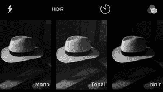
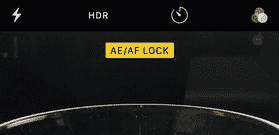
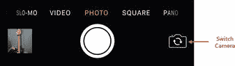
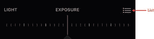
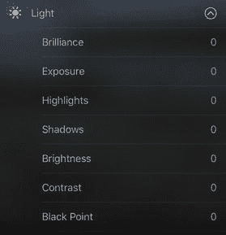
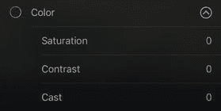
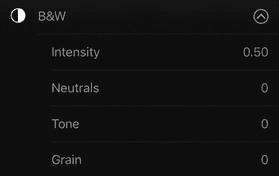
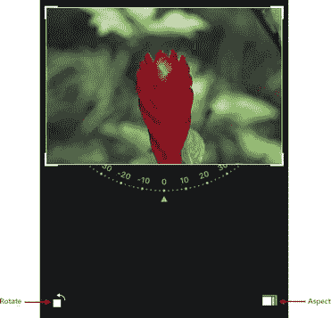

# 7. 解决相机和照片相关问题

一场摄影革命正在进行，而这场革命的领导者并非佳能或尼康这样的传统相机公司，而是一家计算机公司。我说的当然是苹果公司及其 `iPhone`、`iPod touch` 和 `iPad`。这些设备长期以来都配有摄像头，但在过去的一两代产品中，其摄像头的性能已变得极为出色。再加上我们无论走到哪里都会随身携带这些设备，如今已有数亿人身边随时带着高质量的摄影设备。至少可以说，这是革命性的。虽然使用 iOS 设备上的相机不像使用数码单反相机那样需要学习曲线，但要充分发挥其性能并解决一些恼人的问题，确实需要了解相机的工作原理以及一些幕后设置。

### 相机问题故障排除

#### 你的很多照片都模糊不清

iOS 设备的相机硬件正在逐步改进，`iPhone`、`iPad` 和 `iPod touch` 通常能拍出相当不错的照片。然而，大多数人在使用 iOS 拍照时遇到的最大问题可能是图像模糊，这通常是由于拍照时未能保持设备稳定所致。

**解决方法：** `iPhone 6` 及更新机型确实提供了光学图像防抖功能，这意味着相机会自动补偿微小的手部抖动和其他小幅移动。但即使你使用的是较旧的 `iPhone` 或其他 iOS 设备，也可以采取以下一些措施来尽量减少甚至避免照片模糊：

*   扩大站姿以稳定身体。
*   将至少一个肩膀（或整个身体一侧）靠住附近的物体，例如墙壁、门框或汽车。
*   将空闲的手臂横过躯干，前臂与地面平行，然后将握持设备的那只手的手肘放在空闲的手臂上，这有助于稳定握持手臂。
*   在拍照时屏住呼吸。
*   记住，设备是在你松开 `快门` 按钮时拍照，而不是在按下时。因此，请尽量保持构图稳定并稳住身体，直到手指从 `快门` 按钮上抬起。

> **注意：** 你可能会想先按住 `快门` 按钮，待身体稳定后再松开。但这种方法已不再适用，因为按住 `快门` 按钮会启动连拍模式，以每秒 10 张的速度拍照。

*   松开 `快门` 按钮后，请保持手机稳定，直到照片缩略图出现在屏幕左下角。如果在设备最终处理照片时移动，照片就会变模糊。

在使用 iOS 设备拍照时记住部分或全部这些要点，你很快就会发现模糊照片已成为过去。

#### 你的弱光照片通常太暗、有颗粒感或模糊不清

在弱光条件下拍摄照片很困难，因为任何相机都需要光线，而相机可用的光线越少，拍出的照片就越容易显得太暗、有颗粒感或模糊不清。

`iPhone 7 Plus` 配备了两个摄像头，其中一个镜头的孔径为 `f/1.8`，而 `iPhone 6s` 和 `6s Plus` 的镜头孔径为 `f/2.2`。在相机规格这个看似颠倒的世界里，更小的光圈数值意味着更大的镜头通光面积——在本例中，`f/1.8` 镜头的通光面积比 `f/2.2` 镜头大 50%。镜头可用的通光面积越大，相机能收集到的光线就越多，因此其弱光拍摄能力也就越强。

**解决方法：** 即使你没有 `iPhone 7 Plus`，仍然可以采取一些措施来改善弱光照片。以下是一些提示：

*   利用所有可用的光源。如果在户外，寻找路灯、明亮的标志牌，甚至是明亮的月光。如果在室内且是白天，请靠近窗户拍照。在夜晚，打开台灯和其他光源。
*   拍照时尽量保持设备稳定，尤其要使用我在上一部分提到的许多相同技巧。当“`相机`”应用检测到光线较暗时，它会降低快门速度——即延长快门开启时间——以让更多光线到达镜头。然而，较慢的快门速度意味着曝光时间更长，因此更容易出现相机抖动。
    > **提示：** 对于非常黑暗的环境，考虑为你的 iOS 设备投资一个三脚架。这是确保相机在长时间曝光期间保持稳定的最佳方法。
*   调整曝光级别，它控制着照片的整体亮度。在黑暗条件下，“`相机`”应用通常会调整曝光进行补偿，这意味着增加曝光。不幸的是，这通常会导致场景中较亮的区域过度曝光，显得发白。同样，场景中单个明亮的物体也可能导致“`相机`”应用减少曝光，从而使阴影和其他暗部区域曝光不足。要调整曝光，请先构图，然后点击屏幕设置对焦点。现在你可以向上拖动屏幕增加曝光（使图像变亮），或向下拖动减少曝光（使图像变暗）。
*   利用闪光灯。许多人不喜欢使用内置相机闪光灯，因为它会让拍摄对象看起来苍白。但在光线非常暗的情况下，你可能别无选择，因为闪光灯可能是你唯一有效的光源。“`相机`”应用的“`闪光灯`”功能默认设置为“`自动`”，这意味着应用会自行判断是否需要使用闪光灯。你可以保持此设置，也可以将“`闪光灯`”设置为“`打开`”，这样“`相机`”应用就会始终使用它。在“`相机`”应用中，点击“`闪光灯`”图标（闪电符号；参见图 7-1），然后点击“`自动`”或“`打开`”。

图 7-1.

轻点`闪光灯`，然后轻点你要使用的设置。

- 以黑白模式拍摄。弱光照片中的阴影及其他较暗部分通常会显得颗粒感重，但当照片为彩色时，这种颗粒感会格外突出。通过采用黑白而非彩色拍摄，你可以改善照片中颗粒感部分的外观。在“相机”应用中，轻点“滤镜”图标（三个重叠的圆圈），然后轻点以下任一滤镜（见图 7-2）：
  - `单色` — 此滤镜将所有颜色转换为黑白色调，不进行其他处理。对于大多数弱光环境而言，这是一款全能型好滤镜。
  - `色调` — 此滤镜与`单色`相同，但还额外提升了亮度和对比度。当环境相当暗或场景缺乏对比度时，这款滤镜很好用。
  - `黑白` — 此滤镜与`单色`相同，但额外增强了多项其他参数，包括对比度、亮度和强度。这可以拍出一些非常戏剧性的照片，但你可能会觉得某些图像显得处理过度。

图 7-2.

要以黑白模式拍摄弱光照片，轻点“滤镜”，然后轻点`单色`、`色调`或`黑白`

弱光拍摄完成后，请务必再次轻点“滤镜”图标，然后轻点`无`，以移除滤镜。

**提示**  
你也可以将黑白滤镜应用于已拍摄的照片。使用“照片”应用打开照片；轻点“编辑”（图标看起来像三个均衡器条）；轻点“滤镜”；然后轻点`单色`、`色调`或`黑白`。

#### 对焦或曝光设置难以固定

“相机”应用提供了一项名为`自动对焦`的功能，可使相机自动对焦于画面中央的任何主体。

或者，你也可以通过轻点屏幕自行设置对焦和曝光。如果希望聚焦的主体不在画面中央，可以轻点该主体，iOS 设备便会自动将对焦点移至该物体。它还会自动调整白平衡和曝光。如果曝光似乎不准确，你可以在屏幕任意位置向上或向下拖动，分别增加或减少亮度。

大多数人依赖`自动对焦`，这确实是一项便捷功能，但当你已完美构图时，`自动对焦`一旦介入，可能会破坏对焦或曝光（或两者兼具！）。

**解决方案**：为预防此情况，请先构图，然后长按你希望对焦的人物或物体约三秒钟（或直到对焦矩形闪烁）。松开手指后，你会看到屏幕顶部显示`AE/AF 锁定`（即`自动曝光/自动对焦`的缩写），如图 7-3 所示。你当前的对焦和曝光设置现已锁定，即使移动相机也不会改变。若要解除曝光和对焦锁定，请轻点屏幕。

图 7-3.

要锁定曝光和对焦，长按屏幕直至看到`AE/AF 锁定`

#### 你想让自己出现在后置摄像头拍摄的照片中

“自拍”（即拍一张自己的照片，可能包含一两位朋友）这个词曾被牛津词典评为 2013 年度词汇，我相信这对你来说一点都不意外。只需看看任何活动或场合，你就会发现我们每个人都成了自己最喜欢的拍摄对象。为了让自拍更简单，只需切换到前置摄像头即可，这几乎像是为自拍量身定做的。

我说“几乎”，是因为用前置摄像头自拍的方法确实存在几个缺点：

- 前置摄像头相比后置摄像头分辨率低，且不支持闪光灯。
- 所有照片基本都必须在手臂长度的距离内拍摄，这让每张照片都带有一种“这是我正在自拍”的独特外观。

富有创意的自拍者通过使用镜子和其他技巧绕过了这些限制，但 iOS 提供了一个更简单的替代方案：延时拍摄。此功能让相机在您轻点快门按钮后等待几秒再拍摄照片。这意味着你的拍照步骤变化如下：

1.  在“相机”应用中，使用“切换相机”图标（如图 7-4 所示）选择后置摄像头。

    

    图 7-4.

    使用“相机”应用的“切换相机”按钮选择后置摄像头

2.  轻点“延时拍摄”按钮（如图 7-5 所示），然后轻点你想要设置的延迟秒数：3 秒或 10 秒。

    

    图 7-5.

    在“相机”应用的菜单栏中，轻点“延时拍摄”图标

3.  放置你的 iOS 设备（例如，放在桌子或椅子上），使其指向你自拍时想要使用的背景。

4.  轻点快门。

5.  在拍摄前进入画面。

请注意，“相机”应用不会只拍一张照片，而是连拍 11 张。若要选择要保留的照片，请轻点左下角的照片缩略图，轻点连拍照片，轻点“选择”，轻点你想要保留的照片，轻点“完成”，然后轻点`仅保留一张喜欢的`。

**提示**  
`连拍`模式并非仅在拍摄延时照片时可用。你可以在任何想要的时候，通过长按快门按钮来拍摄一组连拍照片。

#### 难以拍出笔直的照片

尽管你偶尔会想从一个有趣或刁钻的角度拍照，但大多数时候，照片拍得笔直会看起来效果最好。然而，当你快速或随意拍照时，让照片变直可能是一个挑战。你总可以在拍完照片后再进行校正（请参阅本章后面的“照片不直”一节），但最好从一开始就拍直。

**解决方案**：确保照片笔直的一个有用方法是显示“相机”应用的网格，它会显示两条水平线和两条垂直线，将画面分成九个矩形（即 3x3 网格）。这些线条不会显示在你的照片中，但你可以用它们来确保你的主体在水平和垂直方向上都对齐。请按照以下步骤激活网格：

1.  打开“设置”应用。

2.  轻点“照片与相机”。

3.  将“网格”开关轻点至打开。

**提示**  
网格对于运用“三分法”构图也很有用。使用三分法时，你将主体放在某条网格线上（或两条网格线的交点上），而不是放在屏幕正中央。

### 照片问题故障排除

#### 照片曝光不当或存在类似光线问题

即便你在拍摄时倾注了大量心血精心设置，仍可能得到一张曝光不足或过度、阴影过暗或过亮、或整体对比度欠佳的照片。当然，我们大多数照片都是快速抓拍瞬间的，这些即兴拍摄的照片更容易出现光线问题。

**解决方法：**“照片”App 自带一个“`增强`”功能，可以分析照片并自动应用多项修正。使用方法如下：

1.  在“照片”App 中，打开你想要修正的照片。
2.  轻点照片以显示控制选项（如果尚未显示）。
3.  如图 7-6 所示，轻点“`编辑`”。“照片”App 会显示其编辑工具。

**图 7-6.** 在“照片”App 的菜单栏中，轻点“`编辑`”以载入照片编辑工具

4.  轻点“`增强`”（位于右上角的魔棒图标；参见图 7-7）。“照片”App 会调整照片的色彩和亮度。

**图 7-7.** 要为你的照片应用自动修正，请轻点“`增强`”图标

5.  轻点“`完成`”。“照片”App 会保存你的更改。

> **注意：** 如果你的编辑使照片变得更糟，你可以恢复原始照片。轻点照片以显示控制选项（如需），轻点“`编辑`”，然后轻点“`复原`”，当“照片”App 要求你确认时，轻点“`复原到原始状态`”。

如果“`增强`”功能未能改善你的照片，或者你希望采用更精细的调整方式，“照片”App 还提供了一些编辑工具，可帮助你解决与光线相关的特定问题。它提供了七个滑块，可用于调整照片的光线：

*   **黑曜石。** 使用此滑块可调整照片某些部分的光线，特别是通过调整照片中较暗部分的光线。如果你的照片除了较暗部分以外曝光正常，请增加黑曜石值。
*   **曝光。** 使用此滑块可设置照片的整体亮度。如果整张照片因过亮而泛白，请降低曝光值以获得较暗的图像；如果整张照片因过暗而模糊，请增加曝光值以获得较亮的图像。
*   **高光。** 使用此滑块可调整图像中最亮部分的强度。如果你的照片有一个或多个区域因过亮而泛白，请降低“`高光`”值以抵消这种效果。
*   **阴影。** 使用此滑块可调整图像中最暗部分的强度。如果你的照片有一个或多个区域因过暗而缺乏细节，请降低“`阴影`”值以尝试恢复部分细节。
*   **亮度。** 使用此滑块可调整照片所有色调的明暗程度，使其偏向白色或黑色。与主要影响照片暗部的“`黑曜石`”不同，“`亮度`”会影响照片的所有色调。如果照片过暗，请增加亮度；如果照片过亮，请降低亮度。
*   **对比度。** 使用此滑块可调整照片色调的分布。如果照片中的色调差异过大，请降低对比度使其趋于一致；如果照片因色调过于相近而显得平淡，请增加对比度以使色调突出。
*   **黑点。** 使用此滑块可设置图像中最黑部分的界限。较低的值意味着图像中最暗的部分看起来也是灰色的，而较高的值则意味着照片中更多暗部区域会呈现为黑色。

> **注意：** 根据你的 iOS 设备和该设备上运行的 iOS 版本，你可能无法看到所有这些照片编辑工具。

若要使用这些工具调整照片的光线，请按以下步骤操作：

1.  在“照片”App 中，打开你想要修正的照片。
2.  轻点照片以显示控制选项（如果尚未显示）。
3.  轻点“`编辑`”（前面在图 7-6 中指出过）。“照片”App 会显示其编辑工具。
4.  轻点“`灯光`”（参见图 7-8）。

**图 7-8.** 要为你的照片应用特定的光线修正，请轻点“`灯光`”图标

5.  轻点“`灯光`”列表。（在某些情况下，你可能需要先轻点“`列表`”图标，该图标与图 7-10 中指出的图标类似。）“照片”App 会显示可用的设置，如图 7-9 所示。

**图 7-10.** “`灯光`”列表中的每项设置都会显示一个滑块，例如此处显示的“`曝光`”滑块

**图 7-9.** 轻点“`灯光`”列表，查看可对照片进行的与光线相关的调整选项

6.  轻点你想要调整的设置项。“照片”会为此设置显示一个滑块。例如，图 7-10 显示了“`曝光`”滑块。
7.  向左或向右拖动滑块，直至获得你想要的效果。
8.  轻点“`列表`”图标（参见图 7-10）返回“`灯光`”列表。
9.  根据需要重复步骤 6 到 8，进行其他光线调整。
10.  轻点“`完成`”。“照片”App 会保存你的更改。

#### 照片颜色显示异常

照片的颜色有时会显得不太对劲。例如，它们可能缺乏饱和度、颜色过于接近，或者整张照片偏蓝或偏红。

**解决方案：** “照片”应用提供了多种工具，可用来改善照片颜色。其中最简单的工具是`增强`功能，它可以自动调整照片的颜色。要使用`增强`工具，请通过“照片”应用打开要修复的照片，轻点照片以显示控制项（如果未显示），轻点`编辑`（如图 7-6 所示），轻点`增强`（如图 7-7 所示），然后轻点`完成`。

如果`增强`功能未能改善照片颜色，或者你希望进行更精细的编辑，“照片”应用还提供了编辑工具，可帮助你解决与颜色相关的特定问题。以下三个滑块可用于调整照片中的颜色：

-   **饱和度。** 使用此滑块可调整照片颜色的鲜艳程度。如果照片缺乏活力，请尝试提高饱和度。
-   **对比度。** 使用此滑块可调整照片色调的分布。如果颜色混在一起，请增加对比度以使颜色区分开来。
-   **色偏。** 使用此滑块可调整偏红或偏蓝的照片。

要使用这些工具调整照片颜色，请遵循以下步骤：

1.  在“照片”应用中，打开要修复的照片。
2.  轻点照片以显示控制项（如果尚未显示）。
3.  轻点`编辑`（如图 7-6 所示）。“照片”应用会显示其编辑工具。
4.  轻点`光线`（参见图 7-8）。
5.  轻点`颜色`列表。（在某些情况下，你可能需要先轻点`列表`图标，该图标与图 7-10 中指出的图标类似。） “照片”应用会显示可用的设置，如图 7-11 所示。

    

    **图 7-11.** 轻点`颜色`列表，查看可对照片进行的颜色相关调整
6.  轻点要调整的设置项。“照片”应用会显示该设置的滑块。
7.  向左或向右拖动设置滑块，直到获得想要的效果。
8.  轻点`列表`图标（参见前面的图 7-10）以返回`颜色`列表。
9.  根据需要重复步骤 6 至 8 进行其他颜色调整。
10.  轻点`完成`。“照片”应用会保存你的更改。

#### 你的黑白照片效果有待提升

前面你了解到，应用 iOS 黑白照片滤镜（如`单色`、`色调`或`怀旧`)可以改善弱光图像。当然，当你寻求黑白照片特有的鲜明、简洁或强烈感时，也可以对任何照片应用黑白滤镜。不幸的是，有时你的黑白作品最终可能会显得缺乏创意、平淡无奇或杂乱无章。

**解决方案：** 可能是因为你选错了拍摄对象，因为并非所有场景都适合处理成黑白效果。不过，如果并非这个原因，那么你可以通过“照片”应用中`黑白`类别下的四项设置来优化你的黑白照片：

-   **强度。** 使用此滑块可调整照片中从彩色转换为黑白部分的强度。如果黑白照片冲击力不足，请尝试增加强度。
-   **中性色。** 使用此滑块可调整照片中从白色或灰色调转换而来的部分的强度。如果黑白照片的这些部分不够突出，请尝试增加中性色数值。
-   **色调。** 使用此滑块可调整照片的整体强度。如果黑白照片看起来发白，请尝试增加色调。
-   **颗粒。** 使用此滑块可为照片添加颗粒感。如果你想要照片具有复古效果，请尝试增加颗粒。

要使用这些工具调整黑白照片，请遵循以下步骤：

1.  在“照片”应用中，打开要修复的照片。
2.  轻点照片以显示控制项（如果尚未显示）。
3.  轻点`编辑`（如图 7-6 所示）。“照片”应用会显示其编辑工具。
4.  轻点`光线`（参见图 7-8）。
5.  轻点`黑白`列表。（在某些情况下，你可能需要先轻点`列表`图标，该图标与图 7-10 中指出的图标类似。） “照片”应用会显示可用的设置，如图 7-12 所示。

    

    **图 7-12.** 轻点`黑白`列表，查看可对照片进行的黑白相关调整
6.  轻点要调整的设置项。“照片”应用会显示该设置的滑块。
7.  向左或向右拖动设置滑块，直到获得想要的效果。
8.  轻点`列表`图标（参见前面的图 7-10）以返回`黑白`列表。
9.  根据需要重复步骤 6 至 8 进行其他黑白调整。
10.  轻点`完成`。“照片”应用会保存你的更改。

#### 照片中出现一处或多处红眼

当你使用闪光灯拍摄人物或动物照片时，在某些情况下，闪光灯可能会在拍摄对象的视网膜上形成反光。结果就产生了常见的红眼现象，即拍摄对象的瞳孔呈现红色而非黑色。

**解决方案：** 如果你的 iOS 设备上有一张照片，其中人物或动物因相机闪光灯出现了红眼，你可以使用“照片”应用将其移除，让拍摄对象看起来更自然。具体操作如下：

1.  在“照片”应用中，打开包含你想要移除的红眼的照片。
2.  轻点照片以显示控制项（如果尚未显示）。
3.  轻点`编辑`（如图 7-6 所示）。“照片”应用会显示其编辑工具。
4.  轻点`红眼`，如图 7-13 所示。

    

    **图 7-13.** 轻点`红眼`图标以显示“照片”应用的红眼移除工具
5.  轻点你想要移除的红眼区域。“照片”应用会移除红眼。
6.  重复步骤 5，直到移除照片中所有红眼。
7.  轻点`完成`。“照片”应用会将更改应用到照片。

#### 照片中包含你想去除的元素

在拍照取景时，你可能会尽量避开某些会破坏最终画面的元素，例如灯柱或栅栏顶部。即便你费尽心思，照片中仍然难免出现不想要的画面部分。

**解决方法：** 当照片中包含你不需要或不希望看到的元素时，通常可以将其裁切掉。这称为裁剪，你可以使用“照片”应用来完成。裁剪照片时，你需要指定一个矩形区域作为保留部分，“照片”应用会自动舍弃矩形外的所有内容。对于移除照片边缘或边缘附近的冗余元素，裁剪是一项非常有用的技能，同时你也能借此突出照片的真正主体。

请按照以下步骤裁剪照片：

1.  在“照片”应用中，打开需要裁剪的照片。
2.  如果尚未显示控制项，请轻点照片以将其调出。
3.  轻点“编辑”（此前已在图 7-6 中标注）。“照片”应用将显示其编辑工具。
4.  轻点“裁剪与校正”（如图 7-14 所示）。“照片”应用会显示用于裁剪的网格，如图 7-15 所示。

    

    图 7-15.
    轻点并拖动角落以裁剪照片

    

    图 7-14.
    轻点“裁剪与校正”图标以显示“照片”应用的裁剪工具
5.  轻点并拖动网格的一角来设定要保留的区域。
6.  轻点“完成”。“照片”应用会将修改应用到照片上。

**提示**

对某些照片进行裁剪的最快方法是直接告诉“照片”应用你希望最终照片的尺寸。轻点“比例”（如图 7-14 中标注），然后轻点一个具体的形状（“原始”或“正方形”）或具体的宽高比，例如 5:7 或 4:5。接着拖动照片（而不是网格！），使得你要保留的部分位于网格内。

#### 照片不水平

你可能从惨痛的经验中得知，用 iPhone 相机拍摄出完全水平的照片非常困难。这需要大量的练习和稳定的双手。（你也可以激活相机应用的网格功能；请参阅章节“你很难拍出水平的照片”。）即使你尽了最大努力，最终得到的照片仍可能不太水平。

**解决方法：** 你可以使用“照片”应用将照片顺时针或逆时针旋转，直到主体看起来是水平的。请按照以下步骤裁剪并校正照片：

1.  在“照片”应用中，打开需要校正的照片。
2.  如果尚未显示控制项，请轻点照片以将其调出。
3.  轻点“编辑”（此前已在图 7-6 中标注）。“照片”应用将显示其编辑工具。
4.  轻点“裁剪与校正”（见图 7-14）。“照片”应用会显示校正工具（带有角度标记的弧形；见图 7-15）。
5.  向左或向右拖动校正工具，直到照片水平。
6.  轻点“完成”。“照片”应用会将修改应用到照片上。

**注意**

“裁剪与校正”功能还可以让你将照片旋转 90 度，例如从竖屏方向旋转为横屏方向。为此，请轻点“旋转”图标（见图 7-14），直到照片达到你想要的朝向。

