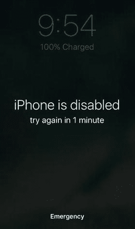
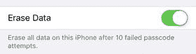
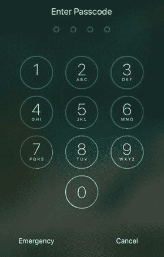
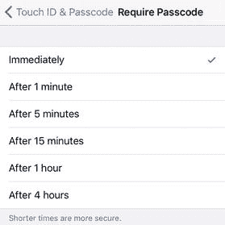
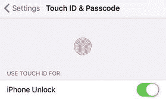
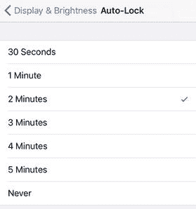
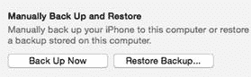
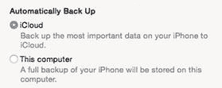
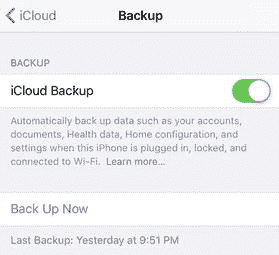
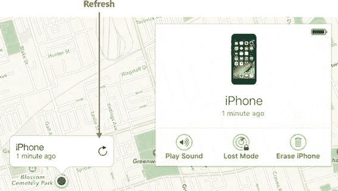

# 8. 保护你的设备

iPhone 自 2007 年问世，iPad 自 2010 年问世以来，这些设备已成为许多人生活中不可或缺的一部分。这种不可或缺性来自于这些设备的多功能性。在典型的一天里，你可能会用 iOS 设备浏览网页、收发电子邮件和短信、拨打电话、管理联系人和日历、听音乐、玩游戏、查看天气或股市，以及处理其它大大小小的事务。然而，这种无比强大的功能和便利性也是有代价的：你的 iOS 设备上存储了大量关于你的信息。诚然，这些数据大多可能微不足道或转瞬即逝，但其中许多是私密且敏感的。丢失 iOS 设备会造成极大的不便，但他人获取你的信息则可能导致大问题。所以，没错，保护 iOS 设备的概念听起来可能不像一个故障排除话题。但采取措施确保设备丢失后能够找到它，并确保设备丢失期间无人能查看或篡改你的信息，可被视为一种预防性维护。而防患于未然正是最好的故障排除方式。

### 锁定你的设备

当 iOS 设备处于睡眠状态时，即使轻触屏幕或按音量键也不会产生任何反应，此时设备处于锁定状态。这种合理的安排可以防止手机放在口袋里，或在背包或手提包里晃动时意外触碰。要解锁设备，你可以按两次主屏幕按钮，或者按一次睡眠/唤醒按钮，然后再按主屏幕按钮。就这么简单，你便能继续使用了。

不幸的是，这个简单的方法意味着任何拿到你 iOS 设备的人也能迅速恢复使用——使用你的设备！如果你的设备上有敏感或机密信息，或者想避免因数字漫游而产生巨额费用，你需要真正锁定你的 iOS 设备。

#### 你想用密码锁定设备

就像你用密码“锁定”用户账户和众多在线账户一样，你可能也希望用类似的方式来锁定 iOS 设备。

**解决方法：** 你可以通过设置密码来实现，任何人在使用设备前都必须输入该密码。iOS 的默认设置是六位数字密码，但你可以将其改为简单的四位数字密码，或者更长、更复杂、使用数字、字母和符号任意组合的自定义密码。

请按照以下步骤设置密码：

1.  在主屏幕上，轻点“设置”。系统将显示“设置”应用。
2.  轻点“触控 ID 与密码”以打开“触控 ID 与密码”屏幕。如果您的 iOS 设备不支持触控 ID，则轻点“密码”以打开“密码锁定”屏幕。
3.  轻点“开启密码”。系统将显示“设置密码”屏幕。
4.  如果你希望使用六位数字密码以外的密码，请轻点“密码选项”，然后轻点你想要使用的密码类型（见图 8-1）。

    

    图 8-1.
    iOS 为你提供了几种密码类型选项
5.  输入你的密码。出于安全考虑，字符在密码框中会显示为圆点。
6.  如果你在输入自定义密码，请轻点“下一步”。你的 iOS 设备会提示你重新输入密码。
7.  再次输入你的密码。
8.  如果你在输入自定义密码，请轻点“完成”。

**注意**

你必须牢牢记住 iOS 设备的密码。如果忘记，你将被自己的设备拒之门外。重新访问设备的唯一方法是使用 iTunes 通过现有备份来恢复 iOS 设备的数据和设置（如第 1 章所述）。

#### 你希望确保数据不会落入恶意之手

如果你的 iOS 设备落入他人之手，你的密码可以防止此人访问你的数据和应用程序。你可能会想知道，当此人尝试猜测密码时会发生什么：

- 在第七次尝试失败后，`iOS` 会将设备锁定五分钟。
- 在第八次尝试失败后，`iOS` 会将设备锁定十五分钟。
- 在第九次尝试失败后，`iOS` 会将设备锁定一小时。
- 在第十次尝试失败后，`iOS` 会将设备完全锁定，你必须与 `iTunes` 同步才能恢复数据。

- 在六次密码输入错误后，`iOS` 会锁定设备——即阻止任何进一步的密码尝试——持续一分钟，如图 8-2 所示。

图 8-2. 当有人错误猜测你的密码六次后，iOS 会阻止进一步尝试一分钟

如果你的设备包含极其敏感或私密的数据，你可能会担心有人仍能以某种方式访问这些数据。

**解决方案：** 你可以将 iOS 设备配置为不仅在第十次密码尝试失败后完全锁定，还能擦除其所有数据。具体设置方法如下：

1. 在主屏幕上，轻点 `Settings`。此时会显示 `Settings` 应用。
2. 轻点 `Touch ID & Passcode`。如果你的 iOS 设备不支持 `Touch ID`，则改为轻点 `Passcode`。`iOS` 会提示你输入密码。
3. 输入你的密码，如果你使用的是自定义密码，则轻点 `Done`。
4. 将 `Erase Data` 开关轻点至 `On`。`iOS` 会要求你确认是否要启用此功能。
5. 轻点 `Enable`。`iOS` 会启用 `Erase Data`，如图 8-3 所示。

图 8-3. 启用 `Erase Data` 后，你的 iOS 设备在检测到连续十次密码输入错误后，会自动擦除所有数据

#### 你需要在 iPhone 锁定时拨打紧急电话

如果遇到紧急情况，你需要拨打电话求助，你可能不希望浪费时间在输入密码上。同样，如果你发生了意外，其他不知道你密码的人可能也需要用你的 iPhone 设备来寻求帮助。

**解决方案：** 在这两种情况下，你都可以通过轻点“输入密码”屏幕上的 `Emergency` 按钮来临时绕过密码，如图 8-4 所示。

图 8-4. 在“输入密码”屏幕中，你可以轻点 `Emergency` 在不解锁 iPhone 的情况下拨打紧急电话

#### 你正在使用密码，但解锁设备时密码并不总是出现

默认情况下，一旦你锁定设备，或者设备在闲置一段时间后自动锁定，`iOS` 会立即生效密码。这是一个合理的默认设置，因为如果设备处于解锁状态，密码就无法保护你的设备。然而，你可能会发现，你可以锁定设备，但解锁时 `iOS` 并不要求输入密码。

**解决方案：** 这个问题意味着你的 iOS 设备被设置为在锁定后不立即要求输入密码。有些人将密码设置为在设备锁定至少一分钟后才生效，以避免每次设备因闲置而自动锁定时都要反复重新输入密码。然而，任何延迟要求输入密码的设置都会降低设备的安全性。

要确保你的 iOS 设备一锁定就必须输入密码，请按照以下步骤操作：

1. 在主屏幕上，轻点 `Settings`。此时会显示 `Settings` 应用。
2. 轻点 `Touch ID & Passcode`。如果你的 iOS 设备不支持 `Touch ID`，则改为轻点 `Passcode`。`iOS` 会提示你输入密码。
3. 输入你的密码，如果你使用的是自定义密码，则轻点 `Done`。
4. 轻点 `Require Passcode` 以打开 `Require Passcode` 屏幕。
5. 轻点 `Immediately`，如图 8-5 所示。

图 8-5. 为确保你的密码始终保护着锁定的设备，请将 `Require Passcode` 设置改为 `Immediately`

#### 你希望可以用指纹解锁设备

在所谓的“i 犯罪”时代，用密码保护你的 iOS 设备是明智之举，因为窃贼经常通过抢夺 iPhone 和其他苹果设备来“摘苹果”。有了密码作为窃贼和你 iOS 设备之间的数字屏障，至少你的个人数据可以免遭窥探。是的，密码是一种明智的安全预防措施，但它并不总是很方便。首先，一天中需要多次输入那四个（或更多）字符的代码，会给使用设备带来微小但令人不快的烦恼。其次，由于 `iOS` 可能不明智地在输入密码时高亮每个字符，至少在理论上，一些肩窥者有可能识别出你的密码。

**解决方案：** 如果你有一台支持 `Touch ID` 的 iOS 设备——即 iPhone 5s 或更高版本、iPad Pro、iPad Air 2 或 iPad mini 3 或更高版本——你可以利用 `Touch ID`，即这些 iOS 设备 Home 按钮中内置的指纹传感器。通过让设备学习你独特的指纹，你只需按下 Home 按钮即可解锁设备。没错：无需再输入密码就能进入主屏幕。另一个额外的好处是，你可以使用同一个指纹来批准你在 `iTunes Store`、`App Store`、`iBooks Store`、`Apple Pay` 甚至一些第三方应用中的购买，这样你就不再需要输入 Apple ID 密码了。

以下是设置 `Touch ID` 的方法：

1. 在主屏幕上，轻点 `Settings`。此时会显示 `Settings` 应用。
2. 轻点 `Touch ID & Passcode`，然后输入你的密码（如果有的话）以打开 `Touch ID & Passcode` 屏幕。
3. 轻点 `Add a Fingerprint`。此时会显示 `Touch ID` 屏幕。
4. 将你的拇指——或解锁 iOS 设备时最常用来按 Home 按钮的手指——轻放在 Home 按钮上。
5. 在 `Touch ID` 学习你的指纹图案时，反复抬起并放下你的手指。
6. 当看到 `Adjust Your Grip` 屏幕时，轻点 `Continue`。
7. 再次反复抬起并放下你的手指，这次着重于手指的边缘部分。
8. 当看到 `Complete` 屏幕时，轻点 `Continue`。如果你尚未指定密码，你的 iOS 设备会提示你现在设置一个。
9. 输入你的密码，然后在要求确认时再次输入。`Settings` 会带你回到 `Touch ID & Passcode` 屏幕。
10. 要添加另一个指纹，重复步骤 3 到 8。

#### 无法使用指纹解锁 iOS 设备

使用 `Touch ID` 解锁 iOS 设备非常方便，尤其当你需要输入一个很长的自定义数字或字母数字密码时。然而，如果当你将手指放在主屏幕按钮上时，iOS 设备拒绝解锁，这种便利性就荡然无存了。

**解决方法：** 无法使用指纹解锁 iOS 设备的原因有很多：
- 如果你的设备运行的是 iOS 10，请记住，你可能需要用保存为指纹的那根手指按下主屏幕按钮来解锁设备。在某些设备以及更早版本的 iOS 系统中，你只需将手指放在主屏幕按钮上即可解锁设备。
- 如果你刚刚重启了设备，或者在过去 48 小时内没有解锁过设备，`Touch ID` 将无法使用。在这些情况下，iOS 会强制你使用密码来解锁设备。如果连续五次尝试指纹识别失败，iOS 也会要求输入密码。
- 确保你使用的是已添加到 iOS 作为 `Touch ID` 指纹的手指。人们常常会添加，比如，右手拇指或食指，然后尝试用左手拇指或食指解锁设备，这种情况并不少见。
- 确保你的手指完全覆盖住主屏幕按钮。
- 手指放在主屏幕按钮上时不要移动。
- 确保你的手指清洁且干燥。
- 如果你的手指非常冷，`Touch ID` 有时会失效，所以可以尝试暖一下手指。
- 确保你的手指没有伤口或肿胀。
- 如果你最近游过泳或洗过澡，你的手指可能吸收了足够多的水分导致指纹改变（形成所谓的“泡皱手指”）。在这种情况下，你别无选择，只能等待指纹恢复正常状态。
- 使用软布清洁主屏幕按钮。
- 确保保护壳或其他保护套没有遮挡主屏幕按钮的一部分。
- 确保 iOS 已配置为允许使用指纹解锁设备。运行 `设置` 应用，轻点 `触控 ID 与密码`，然后输入你的密码以打开 `触控 ID 与密码` 屏幕。确保 `设备解锁` 开关（其中`设备`是 `iPhone` 或 `iPad`）设置为 `开启`，如图 8-6 所示。

**图 8-6.** 要使用保存的指纹解锁设备，请确保 `设备解锁` 开关为 `开启`

如果这些解决方案对你都不起作用，那么你应该删除所有指纹并重新添加。请按照以下步骤删除指纹：
1. 在主屏幕上，轻点 `设置`。出现 `设置` 应用。
2. 轻点 `触控 ID 与密码`，然后输入你的密码以打开 `触控 ID 与密码` 屏幕。
3. 轻点你想要删除的指纹。
4. 轻点 `删除指纹`。iOS 会删除该指纹并返回 `触控 ID 与密码` 屏幕。
5. 重复步骤 3 和 4 以删除所有指纹。

**提示：** 一种更简单的删除指纹方法是：执行步骤 1 和 2，在要删除的指纹上向左滑动，然后轻点出现的 `删除` 按钮。

#### 不想忘记为 Touch ID 配置了哪个指纹

如果你不经常使用 `Touch ID`，你可能会忘记自己将哪根或哪些手指添加为 iOS 中的指纹。

**解决方法：** 为了帮助你记忆，你可以为每个指纹提供一个描述性的名称（例如 `"右手拇指"` 或 `"左手食指"`）。操作方法如下：
1. 在主屏幕上，轻点 `设置`。出现 `设置` 应用。
2. 轻点 `触控 ID 与密码`，然后输入你的密码以打开 `触控 ID 与密码` 屏幕。
3. 轻点一个已保存的指纹（其名称将是通用的，例如 `"指纹 1"`）。**提示：** 如果 iOS 给你的指纹起了诸如 `"指纹 1"` 和 `"指纹 2"` 之类的通用名称，你怎么知道哪个是哪个呢？在显示 `触控 ID 与密码` 屏幕时，将一根手指放在主屏幕按钮上。如果 iOS 识别出那根手指，它会高亮显示对应的指纹名称。
4. 为该指纹输入一个新名称，如图 8-7 所示，然后轻点 `完成`。

**图 8-7.** 为了帮助记住你添加了哪些手指作为指纹，请为每个指纹提供一个描述性名称
5. 对每个已保存的指纹重复步骤 3 和 4。

#### 想要将设备配置为自动锁定

你可以随时按下 `睡眠/唤醒` 按钮来锁定你的 iOS 设备。但是，如果你的 iOS 设备处于开启状态但你并未使用它，它会在两分钟后自动进入待机模式。这被称为 `自动锁定`，这是一个方便的功能，因为它可以在你的 iOS 设备闲置时节省电池电量（并防止意外触摸）。正如我之前所述，如果你已通过密码或指纹锁保护你的 iOS 设备，这也是一个关键功能，因为如果你的 iOS 设备从不锁定，那么这些安全功能就毫无用处。但是，你可能会发现，你的 iOS 设备在闲置一段时间后并不会自动锁定。

**解决方法：** 要确保你的 iOS 设备自动锁定，你必须配置 `自动锁定` 功能，使其在指定的闲置时间后关闭设备。请遵循以下步骤：
1. 在主屏幕上，轻点 `设置`。出现 `设置` 应用。
2. 在 iOS 10 中，轻点 `显示与亮度`。在更早版本的 iOS 中，轻点 `通用`。
3. 轻点 `自动锁定`。出现 `自动锁定` 屏幕。
4. 轻点你想要使用的时间间隔。请注意，可用选项取决于你的设备。图 8-8 显示了 iPhone 的可用选项：30 秒、1 分钟、2 分钟、3 分钟、4 分钟或 5 分钟。

**图 8-8.** 为确保你的密码和/或指纹锁能发挥作用，请使用 `自动锁定` 让设备在指定的闲置时间后自动锁定

### 备份你的设备

如果你的 iOS 设备发生了一些不好的事情——例如，它崩溃了并且无法正常启动、损坏或丢失，或者你忘记了密码——你可以通过恢复设备的默认设置（如第 1 章所述）来恢复。你存储在设备上的所有数据怎么办？要恢复这些数据，你需要在电脑或 iCloud 上有可用的备份。

#### 想要在不进行同步的情况下备份设备

当你将 iOS 设备与电脑同步时，iTunes 会在执行同步之前自动创建一份你当前 iOS 设备数据的备份。但请注意，iTunes 不会备份整个 iOS 设备，这是合理的，因为设备上的大部分内容——音乐、照片、视频、应用等——已经在你的电脑上了。相反，iTunes 仅备份 iOS 设备独有的数据，包括你的通话记录、短信、网页剪辑、网络设置、应用设置和数据，以及 Safari 浏览器历史和 cookie。

然而，如果你已将 iTunes 配置为不自动同步你的 iOS 设备，你可能希望在不执行同步的情况下备份你的 iOS 设备。

**解决方法：** 请按照以下步骤使用 iTunes 备份你的 iOS 设备：
1. 将你的 iOS 设备连接到电脑。
2. 打开 iTunes（如果它没有自动启动）。
3. 如果你的 iOS 设备询问是否信任此电脑，请轻点 `信任`，然后在电脑上点击 `继续`。
4. 在设备列表中，点击你的 iOS 设备。
5. 点击 `摘要` 选项卡。
6. 点击 `立即备份`，如图 8-9 所示。iTunes 会备份 iOS 设备的数据。

**图 8-9.** 在 iTunes 中，点击已连接的 iOS 设备，点击 `摘要` 选项卡，然后点击 `立即备份`

#### 你想让 iOS 自动备份你的设备

使用 iTunes 备份你的 iOS 设备很方便，但需要将设备连接到电脑、打开 iTunes 并运行备份。这些步骤并不繁琐，但足以成为一道障碍，可能导致你无法定期备份设备。这是一个问题，因为成功恢复数据的关键在于拥有一个最近的备份可用。

为了确保这一点，如果能有一种方法按定期计划自动备份你的 iOS 设备，那将非常理想。

解决方案：如果你有 iCloud 账户，可以将 iOS 设备配置为使用 iCloud 作为备份位置。

如果你经常使用 iTunes 同步 iOS 设备，可以告诉 iTunes 使用 iCloud 作为备份位置。请按照以下步骤进行配置：

1. 将你的 iOS 设备连接到电脑。
2. 在 iTunes 中，当你的 iOS 设备出现在设备列表时，点击它。
3. 点击“摘要”标签页。
4. 在“自动备份”部分，选择“iCloud”，如图 8-10 所示。

   

   图 8-10. 在 iTunes 中，点击已连接的 iOS 设备，点击“摘要”标签页，然后在“自动备份”部分点击“iCloud”

如果你从不使用 iTunes，你仍然可以通过 iOS 设备本身直接配置 iOS 将数据备份到 iCloud：

1. 在主屏幕上，点击“设置”以启动“设置”应用。
2. 点击“iCloud”。
3. 点击“备份”。
4. 将“iCloud 云备份”开关拨到“开”，如图 8-11 所示，然后在 iCloud 确认设置时点击“好”。这会告诉 iOS 在设备锁定、连接到 Wi-Fi 网络并接入电源时进行自动备份。

   

   图 8-11. 将“iCloud 云备份”拨到“开”，以设置自动 iCloud 备份

5. 若要立即运行备份，请点击“立即备份”。你的 iOS 设备会将数据备份到你的 iCloud 账户。

#### 你遇到 iCloud 备份问题

设置 iCloud 备份后，你可能会发现备份无法完成或根本不会运行。

解决方案：导致 iCloud 备份无法运行的可能原因有多种。以下是一些需要检查的事项：

-   确保 iCloud 备份已激活。打开“设置”应用，点击“iCloud”，点击“备份”，然后将“iCloud 云备份”开关拨到“开”。
-   确保你的 iOS 设备已连接到 Wi-Fi 网络。如果没有互联网连接，iCloud 备份无法运行，也无法通过蜂窝网络连接运行。
-   确保你的 iOS 设备已接入电源。
-   确保你的设备已锁定。
-   检查你的 iCloud 账户是否有可用空间。要检查这一点，请打开“设置”应用，点击“iCloud”，然后查看“存储空间”命令旁边的“可用”值，如图 8-12 所示。

  

  图 8-12. 在“设置”应用的 iCloud 界面中，“存储空间”命令会显示你的 iCloud 账户中剩余多少可用空间

注意：如何知道你的 iCloud 是否有足够的可用空间？备份大小因设备和容量而异，但预计你的备份需要 400 MB 到 1 GB 的空间。

如果你的 iCloud 备份因存储空间不足而失败，你可以通过删除不再拥有或使用的设备上的一个或多个备份来释放一些空间：

1. 在主屏幕上，点击“设置”以启动“设置”应用。
2. 点击“iCloud”。
3. 点击“存储空间”。
4. 点击“管理存储空间”。
5. 在“备份”部分，点击你想要删除备份的设备。
6. 点击“删除备份”。iOS 会要求你确认是否要关闭此设备的备份并删除其备份数据。
7. 点击“关闭并删除”。

### 保护丢失的设备

如果使用 iOS 设备有缺点的话，那就是你生活中相当大的一部分内容都会集中在这台设备上。起初，这听起来可能是件好事，但如果你不小心丢失了设备，你生活的这部分内容也可能随之丢失。此外，假设你之前没有为 iOS 设备配置密码锁，那么你的隐私就会出现一个大漏洞，因为任何人都可以随意查看你的数据。

如果你一直在定期备份 iOS 设备，那么你很可能可以恢复大部分甚至全部数据。然而，我相信你更愿意找到你的设备，因为它价格昂贵，而且想到陌生人在翻阅你的东西，总会让人感到有些毛骨悚然。

以往寻找丢失的 iOS 设备的方法包括仔细搜索你丢失前到过的每一个角落，并给各个失物招领处打电话，看是否有人上交。现在寻找 iOS 设备的新方法是通过一个叫做“查找我的 iPhone”的功能。（如果你有 iCloud 账户，可以通过 iCloud 账户使用该功能，或者通过“查找我的 iPhone”应用来使用。）“查找我的 iPhone”利用内置在 iOS 设备中的 GPS 传感器来定位设备。你还可以使用“查找我的 iPhone”在 iOS 设备上播放声音、远程锁定设备并发送信息，或者在紧急情况下远程删除你的数据。

注意：你可能会认为“查找我的 iPhone”的一个致命缺陷是，拿到你 iOS 设备的人可以轻松关闭该功能并禁用它。幸运的是，情况并非如此，因为 iOS 带有一个名为“激活锁”的功能，这意味着只有输入你的 Apple ID 密码，才能关闭“查找我的 iPhone”。

#### 你想确保能够找到丢失的设备

“查找我的 iPhone”的工作原理是寻找你的 iOS 设备向外界发送的特定信号。此信号默认是关闭的，因此如果你计划使用“查找我的 iPhone”，需要先将其打开。

解决方案：按照以下步骤激活“查找我的 iPhone”：

1. 在主屏幕上，点击“设置”。出现“设置”应用。
2. 点击“iCloud”。显示你的 iCloud 账户设置。
3. 点击“查找我的设备”（其中“设备”指 iPhone、iPad 或 iPod）。
4. 将“查找我的设备”开关拨到“开”。iOS 会要求你确认。
5. 点击“允许”。

提示：你丢失的 iOS 设备可能只是躺在某个无人能找到的地方。这种情况下，风险在于你还没来得及通过“查找我的 iPhone”定位它之前，iOS 设备电池就已耗尽。为了降低这种可能性，请务必激活“发送最后位置”开关。这会配置 iOS 在其检测到电池电量即将耗尽时，向你发送设备的最后已知位置。

#### 你想在地图上定位丢失的设备

为了大致了解丢失设备的位置，你可能更倾向于通过地图直观地查看其位置。

解决方案：你可以使用 `icloud.com` 的“查找我的 iPhone”功能来定位你的设备。请按照以下步骤操作：

1. 使用网页浏览器导航至 [`www.icloud.com`](http://www.icloud.com)。注意：除了使用 `icloud.com`，你也可以使用“查找我的 iPhone”应用来定位你丢失的 iOS 设备。
2. 登录到你的 iCloud 账户。
3. 点击“查找我的 iPhone”。出现 iCloud“查找我的 iPhone”应用。
4. 点击“所有设备”。iCloud 会显示你的 iOS 设备列表。
5. 在列表中点击你丢失的 iOS 设备。iCloud 会将你的 iOS 设备定位到地图上，如图 8-13 所示。

   

   图 8-13. 你可以使用 iCloud 的“查找我的 iPhone”应用将丢失的 iOS 设备定位到地图上

提示：要查看设备的位置是否已发生变化，请点击“刷新位置”按钮（如图 8-13 中所指）。

#### 你想要通过播放声音定位丢失的设备

在地图上定位丢失的设备通常很方便（例如，它可能显示你的设备在家中或工作场所），但大多数时候，它不够具体，无法准确告诉你设备在哪里。

如果你把 iPhone 放错了地方，首先要尝试的是用另一部设备拨打你的号码，这样你就能听到手机铃声。

但如果你手机开启了静音模式、飞行模式，或者手头没有其他设备，这种方法就行不通了。如果无论如何都能在 iPhone 上听到声音就好了，同样，如果能听到丢失的 iPad 或 iPod touch 发出声音也不错。

解决方案：你可以使用“查找我的 iPhone”在设备上播放声音。即使你的 iOS 设备处于静音模式或飞行模式，这个声音也会播放；即使设备音量已调低或静音，它也会大声播放。操作步骤如下：

1.  登录 iCloud 并打开“查找我的 iPhone”应用。
2.  显示“我的设备”列表。
3.  在列表中点击你丢失的 iOS 设备。“查找我的 iPhone”会在地图上定位你的 iOS 设备。
4.  点击“播放声音”。“查找我的 iPhone”开始在设备上播放声音并显示一条提醒信息。
5.  找到你的 iOS 设备后，在提醒信息中轻点“好”（如果需要，输入你的密码或使用触控 ID）来关闭声音。

#### 你想要锁定丢失设备上的数据

如果通过播放声音无法立即找到你的 iOS 设备，下一步应该是确保其他发现该设备的人无法翻看你的私密内容。

解决方案：你可以将 iOS 设备置于丢失模式，该模式会使用你之前设置的密码远程锁定 iOS 设备。（如果你没有为 iOS 设备设置密码保护，则无法远程锁定设备。）你还可以提供一个联系电话号码，并为找到你 iOS 设备的人发送一条信息。

按照以下步骤将 iOS 设备置于丢失模式：

1.  登录 iCloud 并打开“查找我的 iPhone”应用。
2.  显示“我的设备”列表。
3.  在列表中点击你丢失的 iOS 设备。“查找我的 iPhone”会在地图上定位该设备。
4.  点击“丢失模式”。“查找我的 iPhone”会显示“丢失模式”对话框，提示你输入一个可以联系到你的电话号码。
5.  输入你的电话号码，然后点击“下一步”。“查找我的 iPhone”提示你输入一条信息，该信息将与电话号码一起显示在 iOS 设备上。
6.  输入信息，然后轻点或点击“完成”。“查找我的 iPhone”远程锁定 iOS 设备并显示这条信息。

**警告**

如果你的设备已被锁定但仍未找到，请留意是否有邮件或短信告知你设备已找到。当你点击链接时，系统会要求你提供 Apple 登录凭证。这看起来像是一条合法的 Apple 消息，但实际上是一个旨在获取你 Apple ID 登录信息的骗局，以便骗子解锁你的设备。

#### 你想要擦除丢失设备上的数据

如果你无法让对方归还你的 iOS 设备，并且设备包含敏感或机密数据，你可能需要采取进一步措施，确保对方无法访问你的数据。

解决方案：你可以使用“查找我的 iPhone”采取严厉措施，远程擦除 iOS 设备上的所有数据。请按照以下步骤操作：

1.  登录 iCloud 并打开“查找我的 iPhone”应用。
2.  显示“我的设备”列表。
3.  在列表中点击你丢失的 iOS 设备。“查找我的 iPhone”会在地图上定位该设备。
4.  点击“抹掉此设备”（其中“设备”指 iPhone、iPad 或 iPod）。“查找我的 iPhone”会提示你输入 Apple ID 密码。
5.  输入你的密码，然后点击“下一步”。“查找我的 iPhone”要求你输入一个可选的联系电话号码，该号码会在设备被抹掉后显示在 iOS 设备上。
6.  输入你的电话号码，然后点击“下一步”。“查找我的 iPhone”提示你输入一条信息，该信息会在设备被抹掉后与电话号码一同显示。
7.  输入信息，然后点击“完成”。“查找我的 iPhone”会远程擦除 iOS 设备上的所有数据。

**注意**

如果你在擦除设备后找到了它，你可以将设备连接到电脑，然后使用 iTunes 恢复最新的备份来恢复你的设置、应用和数据。

