# 9. 解决隐私问题

移动设备革命带来的一个意想不到的后果是，我们现在经常在公共场合使用计算机。是的，长期以来一直有人在咖啡店里敲击笔记本电脑，但如今我们更有可能在公交车、公园、电影放映前或课后使用手机和平板电脑。这意味着隐私成为一个潜在问题，因为现在人们可以在我们工作时看到我们的屏幕。移动设备革命的另一个意外后果是，我们现在随身携带大量个人或机密信息。这带来了另一个潜在的隐私问题：如果有人能够访问你的设备，那个人就可以随意查看你的应用、常去地点、浏览历史等等。在第 8 章中，你学会了如何锁定你的 iOS 设备，但并不难想象有人在你设备未锁定时仍能访问它的场景。这一切意味着，认真对待隐私问题，并保持一种审慎的警惕心态至关重要：假设在公共场合有人正盯着你的屏幕；假设有人可以在设备未锁定时访问它。本章将向你展示如何采取措施解决这些及类似的隐私问题。

### 解决通用隐私问题

让我们从解决一些与通用隐私问题相关的问题开始。

#### 输入时每个字符都会弹出，造成隐私风险

iPhone 屏幕键盘有一个名为“字符预览”的功能，它在点击每个字符时会显示该字符的弹出版本。（iPad 上不会出现此情况。）这对 iOS 键盘新手来说很棒，因为它能帮助他们确认输入准确，但老手往往会觉得它分散注意力。无论如何，当你在任何附近的人都能看到屏幕的地方输入时，每个字符弹出都会带来潜在的隐私风险。

解决方案：Apple 在 iOS 9 中默认关闭了字符预览，但如果你在 iPhone 上输入时看到字符弹出，则需要自己将其关闭，步骤如下：

1.  打开“设置”应用。
2.  轻点“通用”。
3.  轻点“键盘”。
4.  将“字符预览”开关拨至关闭位置，如图 9-1 所示。

    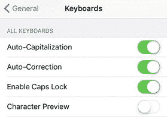

    图 9-1. 为防止输入时字符弹出，请关闭“字符预览”设置

**警告**

即使“字符预览”设置为开启状态，iOS 也不再显示密码字符的弹出版本。这很好，但它仍会在最多三秒内显示你最新点击的密码字符！无法关闭此功能，因此在公共场所输入密码时，请尽量遮挡。

#### 你想阻止某个应用使用其他应用的数据

第三方应用有时会请求使用其他应用数据的权限。例如，某个应用可能需要访问你的通讯录、日历、照片，或者你的 Twitter 和 Facebook 账户。当然，你始终可以拒绝这些请求，但如果你过去曾允许某个应用访问，之后可能会改变主意，希望撤销该权限。

**解决方案：** iOS 提供了一项隐私功能，让你能够控制哪些应用有权访问你的数据。具体操作如下：

1.  打开 `设置` 应用。
2.  轻点 `隐私`。此时会显示 `隐私` 屏幕。
3.  轻点你想要控制访问权限的应用或功能。iOS 会显示已请求访问该应用或功能的第三方应用列表。图 9-2 展示了 `照片` 应用的示例。

    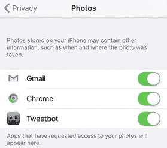
    图 9-2. 在 `设置` 中，轻点 `隐私`，然后轻点某个应用或功能，即可查看已请求访问该项的第三方应用

4.  若要撤销第三方应用对该应用或功能的访问权限，请将其开关轻点为 `关闭`。

#### 你不想让位置被追踪

在 iOS 中，`定位服务` 指的是为应用和系统工具提供设备当前地理坐标访问权限的功能与技术。这是一项方便的功能，但你也需要将其置于掌控之下，因为你的位置数据，特别是当前位置，本质上是私密的，不应随意对外提供。幸运的是，iOS 自带了一些用于控制和配置 `定位服务` 的工具。

接下来的几节将向你展示如何为单个应用以及单个系统服务关闭 `定位服务`。这种精细化的控制是管理 `定位服务` 的最佳方式，但有时你可能更倾向于采用更宽泛的方法，即完全关闭 `定位服务`。例如，如果你正前往一个秘密约会地点（真令人兴奋！）并随身携带了 iOS 设备，那么知道设备上没有应用或服务在追踪你的行踪，可能会让你感觉更安心。

**注意**

从更平常的角度来说，`定位服务` 会消耗电池电量，因此如果你的 iOS 设备电量不足，或者你只是想最大程度地延长电池续航（例如在长途公交车上），那么完全关闭 `定位服务` 会有所帮助。

**解决方案：** 按照以下步骤关闭 iOS 设备上的所有 `定位服务`：

1.  打开 `设置` 应用。
2.  轻点 `隐私`。此时会显示 `隐私` 设置。
3.  轻点 `定位服务`。此时会显示 `定位服务` 设置。
4.  将 `定位服务` 开关轻点至 `关闭` 位置。iOS 会要求你确认。
5.  轻点 `关闭`。iOS 会关闭所有 `定位服务`（见图 9-3）。

    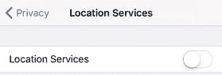
    图 9-3. 若要防止任何应用或服务使用你的位置，请将 `定位服务` 开关设置为 `关闭`

#### 你想阻止某个应用使用你的位置

当你打开一个带有 GPS 组件的应用时，该应用会显示一个类似图 9-4 所示的对话框，请求你允许它使用设备中的 GPS 硬件来确定你的当前位置。请注意，iOS 仅允许应用在你使用它时访问你的位置。一旦你退出应用，它便无法再访问你的位置。如果你认为应用无权知晓你的当前位置，请轻点 `不允许`；如果你觉得没问题，则轻点 `允许`。

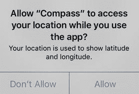
图 9-4. 当你首次启动一个使用 GPS 功能的应用时，它会请求你的许可，以便在使用该应用时访问你的当前位置

另一种略有不同的情况是，某个应用必须使用你的位置才能运行。一个很好的例子是 `Foursquare`，它需要你的位置来向你显示附近的商家，并让你能够“签到”那些地点。在这种情况下，iOS 会自动允许该应用在你使用它时访问你的位置，但该应用可能还会请求在你未使用它时访问你的位置，如图 9-5 所示。同样，如果你认为该应用越界了，请轻点 `不允许`；如果没问题，则轻点 `允许`。

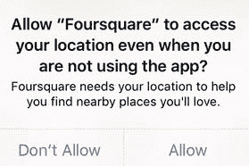
图 9-5. 一个必须在你使用应用时访问你位置的应用，也可能寻求在你未使用它时访问你位置的权限

无论你选择了哪种权限类型，在做出决定后，你都有可能改变主意。例如，如果你拒绝某个应用获取你的位置，该应用可能会缺少某些关键功能。同样，如果你允许某个应用使用你的位置，你可能会对隐私受到侵犯而感到后悔。

**解决方案：** 无论出于何种原因，你可以按照以下步骤来控制应用对你位置的访问权限：

1.  打开 `设置` 应用。
2.  轻点 `隐私`。此时会显示 `隐私` 设置。
3.  轻点 `定位服务`。此时会显示 `定位服务` 屏幕。
4.  轻点你想要配置 GPS 访问权限的应用。该应用的位置访问选项会显示出来。图 9-6 展示了 `Foursquare` 应用的选项。

    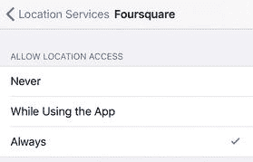
    图 9-6. 使用这些选项配置应用对你位置的访问权限

5.  轻点以下选项之一来配置该应用对你位置的访问权限：
    - `永不`。如果你想拒绝该应用获取你的当前位置，请轻点此选项。
    - `使用期间`。如果你想允许某个应用仅在你主动使用时访问你的当前位置，请轻点此选项。
    - `始终`。如果该应用需要你的位置才能运行，即使你未使用它时也需要（请注意，此选项仅适用于需要全天候访问 GPS 的应用），请轻点此选项。

#### 你想阻止一个或多个系统服务使用你的位置

iOS 还向各类内部系统服务提供 `定位服务`，这些服务执行诸如校准指南针、设置时区以及提供根据位置数据变化的 Apple 广告等任务。你可能更希望 iOS 不向一个或多个此类服务提供你的位置信息。

**解决方案：** 如果你不想让 iOS 向其中某些服务提供你的位置信息，可以按照以下步骤阻止：

1.  打开 `设置` 应用。
2.  轻点 `隐私`。此时会显示 `隐私` 屏幕。
3.  轻点 `定位服务`。此时会显示 `定位服务` 屏幕。
4.  轻点 `系统服务`。iOS 会显示 `系统服务` 屏幕。iPhone 上的此屏幕如图 9-7 所示。

    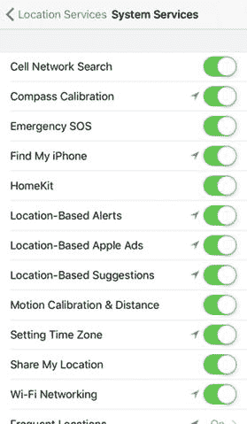
    图 9-7. 将你希望拒绝其访问你位置的任何系统服务旁的开关轻点至 `关闭`

5.  对于你不想提供位置数据访问权限的任何系统服务，请将其开关轻点至 `关闭`。

**提示**

了解系统服务何时正在使用你的位置也很重要。要进行设置，请滚动到 `系统服务` 屏幕底部，然后将 `状态栏图标` 开关轻点至 `打开`。此后，每当系统服务使用你的位置时，iOS 都会在状态栏中显示该开关上方所列图标之一。

#### 防止 iOS 存储常用位置列表

iOS 会跟踪您最常访问的物理位置，并将此数据提供给“地图”和“日历”等应用。这使得这些应用能够根据您的位置历史记录提供建议，但出于隐私原因，您可能更希望 iOS 不跟踪您的常用位置。

解决方案：您不仅可以清除常用位置列表，还可以完全阻止 iOS 维护此列表，从而增强隐私。请按照以下步骤操作：

1.  打开“设置”应用。
2.  轻点“隐私”。此时将显示“隐私”屏幕。
3.  轻点“定位服务”。此时将显示“定位服务”屏幕。
4.  轻点“系统服务”。iOS 将显示“系统服务”屏幕。
5.  轻点“常去地点”以打开“常去地点”屏幕。
6.  若要删除当前的常用位置列表，请轻点“清除历史记录”，然后在系统要求确认时，再次轻点“清除历史记录”。
7.  若要阻止 iOS 存储您经常使用的位置，请将“常去地点”开关轻点至“关闭”，如图 9-8 所示。

    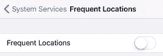

    图 9-8。若要阻止 iOS 跟踪您最常使用的位置，请将“常去地点”开关轻点至“关闭”。

#### 不想与家人和朋友共享您的位置

当您在 iCloud 账户上设置“家人共享”时，其中一个设置屏幕会询问您是否希望通过“信息”和“查找我的朋友”应用与家人共享您的位置。如果您最初决定共享位置，之后可能会改变主意，希望保持位置隐私。

解决方案：您可以按照以下步骤禁用此功能：

1.  打开“设置”应用。
2.  轻点“隐私”。此时将显示“隐私”屏幕。
3.  轻点“定位服务”。此时将显示“定位服务”屏幕。
4.  轻点“共享我的位置”以打开“共享我的位置”屏幕。
5.  将“共享我的位置”开关轻点至“关闭”，如图 9-9 所示。

    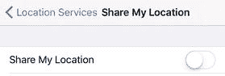

    图 9-9。若要停止允许家人和朋友看到您的位置，请将“共享我的位置”开关轻点至“关闭”。

#### 不想将设备使用信息发送给 Apple

iOS 会持续监控您的设备资源，以防范不良事件。这些事件可能包括内存过低、处理器使用率过高、应用崩溃或系统意外重启。当检测到此类事件时，iOS 会记录当前系统状态并将此数据写入诊断文件。图 9-10 显示了一个典型条目。

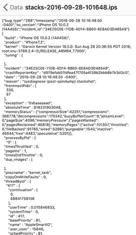

图 9-10。一个典型的诊断条目

如您所见，这些数据大部分是高度技术性的。这是因为它们旨在供 Apple 工程师在诊断您的设备或应用问题时使用。

注意：要查看您的诊断和使用条目，请打开“设置”，轻点“隐私”，轻点“诊断与用量”，然后轻点“诊断与用量数据”。

然而，iOS 也会定期创建诊断日志并将其发送给 Apple 进行分析。这些日志对于 Apple 修复错误和改进产品很有用，但它们是匿名的，通常不包含任何个人数据。我在这里说“通常”，是因为 Apple 确实会在这些日志中包含位置数据。

尽管如此，您可能会对将使用情况和诊断数据（特别是您的位置）发送给 Apple 感到不安。

解决方案：您可以按照以下步骤阻止 iOS 在其诊断和使用日志中包含您的位置：

1.  打开“设置”应用。
2.  轻点“隐私”。此时将显示“隐私”屏幕。
3.  轻点“定位服务”。此时将显示“定位服务”屏幕。
4.  轻点“系统服务”。iOS 将显示“系统服务”屏幕。
5.  将“诊断与用量”开关轻点至“关闭”，如图 9-11 所示。

    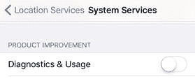

    图 9-11。若要阻止 iOS 将您的位置随诊断日志一起发送，请将“诊断与用量”开关轻点至“关闭”。

如果您不希望 iOS 向 Apple 发送任何诊断和使用日志，可以按照以下步骤禁用此功能：

1.  打开“设置”应用。
2.  轻点“隐私”。此时将显示“隐私”屏幕。
3.  轻点“诊断与用量”。此时将显示“诊断与用量”屏幕。
4.  轻点“不发送”，如图 9-12 所示。

    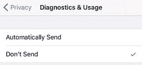

    图 9-12。若要阻止 iOS 向 Apple 发送任何诊断和使用日志，请显示“诊断与用量”屏幕，然后轻点“不发送”。

#### 不想接收定向广告

类似于在线广告商可以使用 Cookie（广告商存储在您计算机上的小型文本文件）在网络上跟踪您，应用广告商可以使用名为“广告标识符”的数据片段来跟踪您的兴趣。这是一个匿名的设备标识符，当您执行某些操作（例如在 App Store 中搜索）时，iOS 会使用它。广告商可以访问“广告标识符”，并利用它向您投放基于您的使用情况选择的广告。您可能更希望不接收这些定向广告。

解决方案：您可以配置隐私设置，告知广告商不要使用“广告标识符”来跟踪您的兴趣和操作。您还可以重置“广告标识符”值，这类似于删除计算机上的跟踪 Cookie。

请按照以下步骤操作：

1.  打开“设置”应用。
2.  轻点“隐私”。此时将显示“隐私”屏幕。
3.  轻点“广告”。此时将显示“广告”屏幕。
4.  将“限制广告跟踪”开关轻点至“开启”，如图 9-13 所示。

    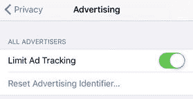

    图 9-13。若要阻止广告商使用“广告标识符”向您发送定向广告，请激活“限制广告跟踪”设置。
5.  轻点“还原广告标识符”，然后在 iOS 要求您确认时，轻点“还原标识符”。

另一种 iOS 向您投放定向广告的方式是通过您的位置。以下是关闭此隐私漏洞的步骤：

1.  打开“设置”应用。
2.  轻点“隐私”。此时将显示“隐私”屏幕。
3.  轻点“定位服务”。此时将显示“定位服务”屏幕。
4.  轻点“系统服务”。iOS 将显示“系统服务”屏幕。
5.  将“基于位置的 Apple 广告”开关轻点至“关闭”，如图 9-14 所示。

    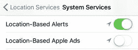

    图 9-14。将“基于位置的 Apple 广告”轻点至“关闭”，以防止看到基于您位置的定向广告。

#### 不想被显示您所在地区的热门应用

App Store 会使用您的位置来告诉您附近哪些应用最受欢迎。出于隐私考虑，您可能不希望以这种方式被定位。

解决方案：请按照以下步骤关闭此跟踪功能：

1.  打开“设置”应用。
2.  轻点“隐私”。此时将显示“隐私”屏幕。
3.  轻点“定位服务”。此时将显示“定位服务”屏幕。
4.  轻点“系统服务”。iOS 将显示“系统服务”屏幕。
5.  将“附近的热门应用”开关轻点至“关闭”，如图 9-15 所示。

    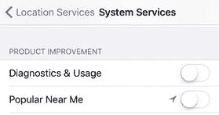

    图 9-15。若要阻止 iOS 使用您的位置来确定附近的热门应用，请将“附近的热门应用”开关轻点至“关闭”。

### 解决网页浏览隐私问题

本章的其余部分将向您介绍一些与增强网页浏览会话隐私相关的故障排除技巧。

#### 想要删除已访问的网站列表

Safari 的“历史记录”列表（即你最近浏览过的网站集合）在需要时是一个很棒的功能，不需要时也无伤大雅。但有时，“历史记录”列表确实会带来不便。例如，如果你访问了一个私人公司网站、金融网站或任何其他不想让别人看到的网站，历史记录可能会暴露你的行踪。

有时，一些不良网站也可能意外出现在你的历史记录中。例如，你可能在网页或邮件中点了一个看似合法的链接，结果却进入了某个阴暗、令人不快的网络角落。当然，你会立刻点击“返回”按钮迅速离开那里，但那个讨厌的网站已经潜伏在你的历史记录里了。

**注意**

从 iOS 9 开始，清除 Safari 历史记录也会同时清除你的 cookie 和网站数据。清除 cookie 可能会带来一些问题，因为许多 cookie 存储了网站的登录数据或个性化设置。因此，在清除历史记录时，请考虑只清除最近的数据（例如，前一小时的数据）。

**解决方法：** 无论你的历史记录列表中有不想让别人看到的网站，还是你觉得 Safari 跟踪你在网络上的行踪这个想法本身有些不妥，都可以按照以下步骤清除历史记录列表：

1.  在 Safari 中，轻点“`书签`”按钮。Safari 会打开“书签”列表。
2.  轻点“`返回`”，直到回到“书签”屏幕。
3.  轻点“`历史记录`”。Safari 会打开“历史记录”屏幕。
4.  轻点“`清除`”。Safari 会询问你要清除多久之前的历史记录，如图 9-16 所示。
    -   ``
    -   **图 9-16.** 轻点“`清除`”，然后选择要删除多长时间的网页浏览历史记录。
5.  轻点一个时间段：`最后一小时`、`今天`、`今天和昨天`或`所有历史记录`。Safari 会删除该时间段内历史记录列表中的所有网站。

**注意**

Safari 会利用你的历史记录（以及书签）来分析你查看的每个页面，并确定你最可能点击的链接——即所谓的“最常点选”——然后预加载该链接。如果你确实点击了该链接，页面加载速度会非常快。但是，如果你不放心让 Safari 把你的历史记录和书签发送给 Apple，可以关闭此功能。依次轻点“`设置`”、“`Safari`”，然后将“`预载最常点选`”开关切换至“`关闭`”（参见图 9-17）。
    -   ``
    -   **图 9-17.** 你可以阻止 Safari 显示可能被别人看到的建议。

#### 不希望 Safari 在搜索时显示建议

Safari 可能影响你在线隐私的另一种方式，是在你在地址栏输入搜索文字时显示建议。如果有人从你肩膀后面偷看，或者只是借用你的设备快速搜索一下，她就有可能看到这些建议。

**解决方法：** 要关闭这些建议，请按以下步骤操作：

1.  打开“`设置`”应用。
2.  轻点“`Safari`”以打开 Safari 设置屏幕。
3.  将“`搜索引擎建议`”开关和“`Safari 建议`”开关都切换至“`关闭`”，如图 9-17 所示。

#### 希望浏览网页时不存储关于所访问网站的数据

如果你发现自己经常要手动清除浏览历史记录或网站数据，那么可以通过配置 Safari 自动完成此操作来节省一些时间。这就是所谓的“无痕浏览”，意味着 Safari 在浏览时不会保存任何数据。具体来说，它不会保存以下内容：

-   网站不会被添加到历史记录中（但在当前会话中，“`返回`”和“`前进`”按钮仍然可以用于导航已访问过的网站）。
-   网页文本和图像不会被保存。
-   搜索文本不会保存在搜索框中。
-   自动填充的密码不会被保存。

**解决方法：** 要激活无痕浏览，请按以下步骤操作：

1.  在 Safari 中，轻点“`标签页`”按钮。
2.  轻点“`无痕浏览`”。Safari 会为无痕浏览创建一组单独的标签页。
3.  轻点“`添加标签页 (+)`”。Safari 会创建一个新的无痕浏览标签页。

完成无痕浏览后，轻点“`标签页`”图标，然后轻点“`无痕浏览`”按钮即可关闭无痕浏览。

#### 希望确保不被在线广告商追踪

在线广告商以提供“个性化广告”这一“好处”为幌子，利用 cookie 来追踪你访问过的网站、进行的搜索等等。这些数据虽然不会与你的个人身份信息直接关联，但没人喜欢被这样追踪。幸运的是，iOS 上的 Safari 默认配置已经可以最大程度地减少此类追踪，但你或许仍想确认——甚至加强——这些设置。

**解决方法：** 防止在线追踪涉及两个方面。首先，确保 Safari 的“`不跟踪`”功能已激活，这会告知广告商不要在线追踪你。但请注意，这并不能强制广告商不追踪你。是否遵守全靠自愿，但为了那些为数不多的会遵守这一设定的广告商，你仍然应该激活此设置。

其次，你需要决定在什么级别上阻止 Cookie。你有四种选择：

-   **总是阻止。** 此级别告知 Safari 不接受任何 Cookie。我不推荐此级别，因为它会禁用许多网站的功能（例如，网站无法保存你的登录数据和个性化设置）。
-   **仅允许来自当前网站。** 此级别告知 Safari 只接受你当前正在访问的网站设置的 Cookie。其他任何网站——尤其是在线广告网站——都不能设置 Cookie。如果你想加强 Safari 的广告拦截功能，可以考虑使用此设置，尽管它可能会导致某些功能丢失（请参阅下一项）。
-   **允许我访问的网站。** 此级别告知 Safari 不仅接受当前网站的 Cookie，还接受你过去访问过的任何网站的 Cookie。例如，假设你之前访问过 YouTube 网站。如果当前网站想要设置一个 YouTube 的 Cookie，那么此设置将允许它这样做。如果你从未访问过某个网站（对于绝大多数在线广告网站来说都是如此），那么 Safari 就会阻止该网站的 Cookie。这是默认设置，是一个很好的折衷方案，因为你之前访问过的网站可能需要访问 Cookie 来为你当前访问的网站实现某些功能（例如账户数据）。
-   **总是允许。** 此级别告知 Safari 接受来自任何网站的任何 Cookie。请避免使用此设置，因为这意味着任何不遵守“`不跟踪`”设置的在线广告商（遗憾的是，这占了绝大多数）都会使用 Cookie 来追踪你。

按照以下步骤配置 Safari，以确保你不会被在线广告商追踪：

1.  打开“`设置`”应用。
2.  轻点“`Safari`”以打开 Safari 设置屏幕。
3.  如有必要，将“`不跟踪`”开关切换至“`开启`”。
4.  轻点“`阻止 Cookie`”以打开“`阻止 Cookie`”屏幕，如图 9-18 所示。
    -   ``
    -   **图 9-18.** Safari 的 Cookie 阻止设置。
5.  轻点你想要使用的 Cookie 阻止级别设置。

#### 你想要删除已保存的信用卡数据

在第四章“解决网页问题”中，你学习了如何通过将信用卡数据保存在`Safari`中来节省时间和精力。这很方便，但如果你借出设备，或者有人在设备解锁状态下拿到它，这也是很危险的。

**解决方案：** 你可以按照以下步骤删除已保存的信用卡：

1. 打开`设置`应用。
2. 点击`Safari`，打开 Safari 屏幕。
3. 点击`自动填充`，打开自动填充屏幕。
4. 点击`已保存的信用卡`。如果设置了密码或`触控 ID`，iOS 会提示你输入。
5. 输入密码或扫描指纹，打开信用卡屏幕。
6. 点击`编辑`。
7. 点击你要删除的信用卡，然后点击`删除`。

#### 你想要删除已保存的网站密码

你可以配置`Safari`的自动填充功能来保存网站用户名和密码。这确实很方便，但这意味着任何能访问你已解锁设备的人都能登录这些网站。

**解决方案：** 要避免这个问题，你可以删除一个或多个已保存的网站密码。以下是操作步骤：

1. 打开`设置`应用。
2. 点击`Safari`，打开 Safari 屏幕。
3. 点击`密码`。如果设置了密码或`触控 ID`，iOS 会提示你输入。
4. 输入密码或扫描指纹，打开密码屏幕。
5. 点击`编辑`。
6. 点击每个你要删除的密码，然后点击`删除`。

