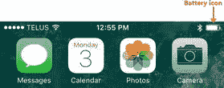
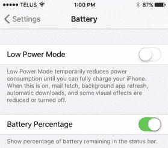
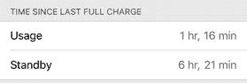
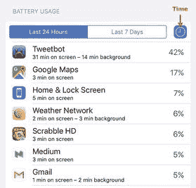
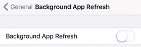
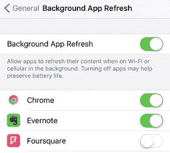
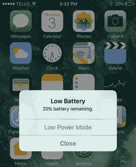
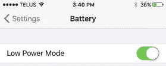
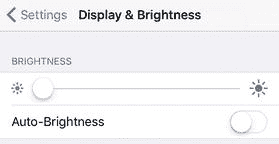

# 10. 修复电池与充电问题

现代数字世界的一个奇特现象是，虽然在过去十几年间，我们的设备在性能、小型化和整体技术复杂性方面取得了惊人的进步，但电池续航能力的提升却相对缓慢。例如，从`iPhone 4s`到`iPhone 6`（跨越四代），通过 Wi‑Fi 上网的电池续航时间仅从 9 小时增加到了 11 小时。Apple 声称`iPhone 7 Plus`可以达到 15 小时，但即便是跨越六代产品提升了 67%，这也不值得夸耀。考虑到我们对 iOS 设备的重视程度，用户目前最大的抱怨是电池续航差，而对每一代新产品最大的期望就是更好的（甚至是非常好的）电池性能，这并不奇怪。不幸的是，由于许多技术原因，我们短期内无法看到 iOS 设备电池续航的显著提升。这意味着我们需要立即采取措施，监测并最大化现有电池的性能。

### 追踪电池使用情况

iOS 不会提供海量的电池数据，但你可以监控总使用时间（包括所有活动：通话、上网、播放媒体等）和待机时间（你的 iOS 设备处于休眠模式的时间）。此外，iOS 的一个不错的功能是，它会按应用细分最近（过去三小时）的电池使用情况，这样你就可以看到哪些应用在消耗你的电量。

#### 你想要精确知道剩余电量的百分比

默认情况下，iOS 会在状态栏显示一个电池图标（见图 10-1）。随着电量消耗，图标内部的白色部分会减少，当电量低到需要你留意时，电量水平会变成红色。当然，这确实是有用的信息，但有点模糊和不精确。

*图 10-1. iOS 电池图标显示在状态栏中*

**解决方案：** 为了更密切地关注设备电池续航，你需要让 iOS 同时显示剩余电量的百分比。以下是操作步骤：

1. 在主屏幕上，点击`设置`，打开设置应用。
2. 点击`电池`，打开电池屏幕。
3. 将`电池百分比`开关点击为`开启`，如图 10-2 所示。

*图 10-2. 将`电池百分比`开关点击为`开启`，以在状态栏图标上添加剩余电量百分比*

#### 你想要了解在电池供电状态下设备的使用情况

Apple 公布了很多电池续航数据，包括使用模式（即设备开启时）和待机模式（设备休眠时）。但是，如果你需要知道你的设备是否有足够的电量来支撑一次长途飞行或类似长时间远离电源插座的情况，你真的能相信 Apple 的数据吗？

**解决方案：** 幸运的是，你不需要相信 Apple 的说法，因为 iOS 会记录你设备的整体电池使用情况。具体来说，它会记录自上次完全充电以来，你的设备处于使用模式和待机模式的时间。通过一段时间和几个充电周期的追踪，你就会了解你的 iOS 设备在使用时能获得多少电池续航时间。

按照以下步骤查看这些数据：

1. 在主屏幕上，点击`设置`，打开设置应用。
2. 点击`电池`，打开电池屏幕。
3. 滚动到屏幕底部，查看`使用时间`和`待机时间`的值，如图 10-3 所示。

*图 10-3. 滚动到电池屏幕底部，查看自上次完全充电以来你的 iOS 设备处于使用和待机模式的总时间*

#### 你怀疑某个应用耗电过多

在状态栏电池图标上添加百分比数值，并监控`设置`应用电池屏幕中的`使用时间`，其中一个好处是你能了解应用如何消耗电量。特别是，你可能会注意到在使用某个特定应用时，电池电量似乎比平时消耗得更快。知道这一点很有用，但你如何确定呢？

**解决方案：** iOS 可以按应用细分你的设备电池使用情况来提供帮助。在最近 24 小时和最近 7 天这两个时间段内，你都可以看到每个应用消耗的总电量的百分比。你还可以显示每个应用在屏幕显示时和后台运行时消耗电量的总时长。

如果你发现某个特定应用消耗的电量远远超出你的预期（特别是，如果你使用该应用的频率并没有比其他应用高很多），这可能表明存在问题。例如，该应用可能存在内存泄漏，或者正在后台运行任务。

按照以下步骤查看按应用划分的电池使用情况：

1. 在主屏幕上，点击`设置`，打开设置应用。
2. 点击`电池`，打开电池屏幕。
3. 在`电池用量`部分（见图 10-4），点击可在查看`最近 24 小时`和`最近 7 天`的使用情况之间切换。

*图 10-4. 在电池屏幕中，`电池用量`部分按应用细分电池百分比，并可选择显示电池使用时长*
4. 点击`时间`图标（在图 10-4 中指出），以切换显示每个应用在屏幕显示和后台运行的总时长。

### 延长电池续航时间

在 iOS 设备上尽可能减少耗电量，不仅可以延长充电间隔时间，还可以延长电池的整体寿命。`电池用量`屏幕通常会提供一两条延长电池续航的建议，但你还可以采取许多其他措施。

#### 阻止所有应用在后台运行

iOS 提供的最佳电池用量工具之一是“电池”屏幕中的“时间”图标（见图 10-4）。启用后，此功能不仅会告知你每个应用在屏幕开启时消耗的电量，更重要的是，还会告知每个应用在后台消耗的电量。应用在后台执行任务的能力称为“后台应用刷新”，这很重要，因为虽然你知道应用何时在屏幕上活跃，但 iOS 通常不会给出提示，因此你并不总是知道它何时在后台活跃。

实际上，这意味着如果电池电量不足，你可以停止使用某些应用，但你不知道这些应用或其他应用是否仍在后台工作——因此仍在消耗宝贵的电池电量。

解决方案：你可以按照以下步骤为所有应用停用“后台应用刷新”：

1.  在主屏幕上，点按“设置”以打开“设置”应用。
2.  点按“通用”以打开“通用”屏幕。
3.  点按“后台应用刷新”以打开“后台应用刷新”屏幕。
4.  将“后台应用刷新”开关点按至“关闭”，如图 10-5 所示。

    

    图 10-5.

    当电量不足时，关闭“后台应用刷新”以防止任何应用在后台运行。

#### 阻止特定应用在后台运行

通过定期检查应用的电池用量（包括总体百分比以及屏幕开启和后台的总时间），你最终会识别出耗电大户。特别是，你会知道哪些应用通过运行后台任务来消耗设备电池。在这种情况下，为所有应用关闭“后台应用刷新”似乎有些过度，尤其是如果只是单个应用导致问题。

解决方案：如果你发现某个特定应用在后台任务中消耗的电量高于平均水平，并且你认为该应用无需在后台运行，则可以仅针对该应用停用“后台应用刷新”。

请遵循以下步骤：

1.  在主屏幕上，点按“设置”以打开“设置”应用。
2.  点按“通用”以打开“通用”屏幕。
3.  点按“后台应用刷新”以打开“后台应用刷新”屏幕。
4.  在应用列表中，将你不再希望其在后台运行的应用旁边的开关点按至“关闭”，如图 10-6 所示。

    

    图 10-6.

    你可以为某个在后台运行时消耗过多电池电量的单个应用禁用“后台应用刷新”。

#### 希望 iOS 设备使用更少电量

当 iOS 设备电池电量不足，或者虽然电量充足但你知道需要长时间使用设备时，将设备配置为在其他任务上使用更少电量将是有益的。

解决方案：你将在下一节学到许多节省电量的技巧。然而，iOS 提供了一种降低设备总功耗的简便方法。它称为“低电量模式”，通过以下方式节省电池寿命：

*   关闭“后台应用刷新”
*   禁用“邮件”应用的推送功能（应用自动检查新邮件）
*   停用所有自动内容下载
*   阻止所有自动应用更新
*   禁用一些视觉效果
*   调暗屏幕

当电池电量降至 20% 时，iOS 会询问你是否要切换到“低电量模式”，如图 10-7 所示。（当电量降至 10% 时，此消息会再次出现。）点按“低电量模式”以启用此功能。

图 10-7.

当设备电池电量降至 20% 时，iOS 会询问你是否要切换到“低电量模式”

要手动启用“低电量模式”，请执行以下步骤：

1.  在主屏幕上，点按“设置”以打开“设置”应用。
2.  点按“电池”以打开“电池”屏幕。
3.  将“低电量模式”开关点按至“开启”，如图 10-8 所示。请注意，查看电池图标可以判断此功能是否处于活动状态，在“低电量模式”下，该图标会变为黄色。

    

    图 10-8.

    要手动启用“低电量模式”，请在“设置”应用中打开“电池”屏幕，然后将“低电量模式”开关点按至“开启”。

注意

在“低电量模式”开启的情况下，iOS 会自动将设备配置为 30 秒后自动锁定，并禁用“自动锁定”设置。

#### 尽量节省电池电量

如果电池电量不足，附近又找不到电源插座，但你确实需要使用 iOS 设备，那么就需要最大限度地降低设备的耗电量。

**解决方案：** 以下是一些建议，可帮助你将设备电池消耗降至最低，同时仍保留部分功能：

-   **尽量减少运行的应用数量。** 如果暂时无法给 iOS 设备充电，请避免后台任务（例如播放音乐）或次要任务（例如整理联系人）。如果你的唯一目标是阅读所有电子邮件，请专注于此事直至完成，因为你无法预知还有多少时间。
-   **确保“自动锁定”功能生效。** 你肯定不希望 iOS 设备在闲置时消耗电池电量，所以要确保“自动锁定”在正常工作。打开`设置`，轻点`显示与亮度`，轻点`自动锁定`，然后选择较短的时长（例如 iPhone 上选 1 分钟，iPad 上选 2 分钟）。
-   **必要时，手动让 iOS 设备进入睡眠模式。** 如果你被打断——例如送披萨的小哥准时出现——不要等待 iOS 设备自动休眠，因为这几秒或几分钟会消耗宝贵的电池电量。相反，请立即按下`睡眠/唤醒`按钮，手动让设备进入睡眠模式。
-   **不需要时关闭 Wi-Fi。** Wi-Fi 开启时会定期检查可用的无线网络，这会消耗电池电量。如果无需连接无线网络，请关闭 Wi-Fi 以节省电量。打开`设置`，轻点`无线局域网`，然后将`无线局域网`开关滑至`关闭`。
-   **不需要时关闭蜂窝数据。** 你的 iPhone 或支持蜂窝网络的 iPad 会持续搜索附近的蜂窝基站以维持信号，这会快速消耗电池电量。如果你在使用 Wi-Fi 网络上网，就不需要蜂窝数据，所以请将其关闭。打开`设置`，轻点`蜂窝网络`，然后将`蜂窝数据`开关滑至`关闭`。
-   **不需要时关闭 GPS。** GPS 开启时，接收器会定期与 GPS 系统交换数据，这会消耗电池电量。如果暂时不需要 GPS 功能，请关闭 GPS 天线。打开`设置`，轻点`隐私与安全性`，轻点`定位服务`，然后将`定位服务`开关滑至`关闭`。
-   **不需要时关闭蓝牙。** 蓝牙运行时，会持续检查附近的蓝牙设备，这也会消耗电池电量。如果你没有使用任何蓝牙设备，请关闭蓝牙以节省电量。打开`设置`，轻点`蓝牙`，然后将`蓝牙`开关滑至`关闭`。
-   **降低电子邮件自动检查频率。** 让电子邮件频繁轮询服务器以获取新邮件会消耗电池。将其设置为每小时检查一次，或者，理想情况下，如果可以的话设置为`手动`检查。操作方法：轻点`设置`，轻点`邮件`，轻点`账户`，然后轻点`获取新数据`。在`获取`部分，轻点`每小时`或`手动`。
-   **关闭推送。** 如果你没有使用低电量模式，并且拥有 iCloud 或 Exchange 账户，请考虑关闭推送功能以节省电池电量。轻点`设置`，轻点`邮件`，轻点`账户`，然后轻点`获取新数据`。在“获取新数据”屏幕上，将`推送`开关滑至`关闭`，并在`获取`部分轻点`手动`。参见图 10-10。

    
    **图 10-10.** 关闭推送以确保这个后台任务不会耗尽电池电量

-   **停用后台应用刷新。** 当你急需电量时，可能不需要应用在后台运行。请参阅“你想阻止所有应用在后台运行”部分，了解如何关闭`后台应用刷新`。或者，你也可以考虑保持该开关打开，但针对个别应用（特别是像 Facebook 和 Gmail 这类活跃应用）关闭`后台应用刷新`；请参见“你想阻止特定应用在后台运行”部分。
-   **开启低电量模式。** 不要等到电池电量降至 20%（iOS 会自动提示你开启`低电量模式`）时再操作。尽早手动开启，以延长电池续航时间。我在“你想让 iOS 设备更省电”部分中展示了如何手动激活`低电量模式`。
-   **调暗屏幕。** 触摸屏会消耗大量电池电量，因此调暗屏幕可以减少能耗。在主屏幕上，轻点`设置`，轻点`显示与亮度`，然后将`亮度`滑块向左拖动以调暗屏幕。此外，将`自动亮度调节`开关滑至`关闭`，如图 10-9 所示。

    
    **图 10-9.** 将屏幕亮度调至仍能看清内容的最低水平，并关闭“自动亮度调节”功能

> **注：** 如果你暂时不需要使用设备的全部四个天线——Wi-Fi、蜂窝网络、GPS 和蓝牙——更快的关闭方法是将 iOS 设备切换到飞行模式。可以打开`设置`，然后将`飞行模式`开关滑至`开启`；或者从屏幕底部向上滑动以打开控制中心，然后轻点`飞行模式`图标。

### 排查其他电池问题

在本章结束前，我将快速介绍另外两个与电池相关问题的解决方案。

#### 你想最大化电池的使用寿命

在附近没有电源的日子里，最大化电池续航固然重要，但确保电池的整个使用寿命也被最大化同样关键。

**解决方案：** 你的 iOS 设备中的锂离子电池比镍镉等老式电池技术宽容得多。只需使用几个简单的技巧和预防措施，你就能确保电池在你的 iOS 设备整个使用周期内提供良好性能：

-   **尽量减少电池需要充电的周期次数。** 你的 iOS 设备电池设计为在经历 500 次完全放电和充电周期后，仍能保持其原始容量的 80%。放电到 0% 再充满电算作一个周期，放电到 50% 再充满电算作半个周期，以此类推。如果你尽可能方便地经常将 iOS 设备接入电源，达到 500 个周期的时间就会更慢。
-   **使用电池。** 不过，不要以为从不使用电池就能让它保持完好如新。锂离子电池需要定期使用，否则它们会拒绝充电。
-   **不要对电池进行深度充放电。** 深度充放电——也称为重新调节或重新校准——是指让电池完全放电，然后再完全充电的过程。这对于早期的电池技术很重要，但不适用于你 iOS 设备中的锂离子电池。在充电前让电池电量下降到大约 50% 左右，似乎是最大化电池寿命的最佳平衡点。
-   **避免极端温度。** 将 iOS 设备暴露在极热或极冷的环境中会降低电池的长期效能。请尽量让你的 iOS 设备保持在适宜的温度下。
-   **尽量不要摔落你的 iOS 设备。** 摔落设备可能会损坏电池，导致电池性能不佳甚至最终失效。
-   **使用高质量的充电器。** 廉价充电器可能会对电池造成不可逆的损坏。请使用随 iOS 设备附带的充电器，或使用专为你特定品牌和型号的 iOS 设备设计的第三方充电器。
-   **不要在满电状态下存放你的 iOS 设备。** 如果你将有几周或更长时间不使用 iOS 设备，你可能会想在存放前给它充满电。然而，为了延长寿命，最好在电池部分放电的状态下存放设备——比如说，放电到 40% 到 60% 之间。

**警告**：更需要注意的是，切勿在电池完全放电的状态下存放你的 iOS 设备。这可能会损坏电池，以至于当你重新插上设备时，电池完全无法充电。

#### 你的电池无法充电

当你将 iOS 设备插入电源插座时，你可能会发现它无法充电。

**解决方案：** 如果你发现电池无法充电，以下是一些可能的解决方法：

-   如果 iOS 设备通过 USB 端口连接到电脑充电，可能是电脑进入了待机状态。唤醒电脑应该可以解决问题。
-   USB 端口可能无法提供足够的电力。例如，大多数键盘和集线器上的 USB 端口提供的电力有限。如果你的 iOS 设备插在键盘或集线器的 USB 端口上，请将其插到你的 Mac 或 PC 的 USB 端口上。
-   将 USB 线缆连接到 USB 电源适配器，然后将适配器插入电源插座。
-   仔细检查所有连接，确保一切均已正确插入。
-   如果你有另一条 Lightning 数据线，可以换一条试试。
-   如果 iOS 设备已经很久没有充电，其电池可能已进入休眠模式以保护自身免受长期损坏。在这种情况下，需要几分钟——甚至可能长达十分钟——电池才会“苏醒”并开始正常充电。

如果这些建议都不能解决问题，你可能需要将你的 iOS 设备送去维修。

