# 11. 解决无障碍访问问题

iPhone、iPad 或 iPod touch 的承诺是信息触手可及。但是，如果行动障碍使得控制双手都困难，更不用说指尖了，那该怎么办？如果视觉障碍使得连看清信息都成问题，那又该如何？无论你从小就必须克服身体障碍，还是随着年龄增长几乎每天都发现新的身体限制，这并不意味着你必须被排除在数字设备革命之外。诚然，对于有视觉、听觉或行动障碍的人来说，iOS 设备可能难以使用，甚至无法使用。但这仅仅是因为默认设置似乎是为了让二十多岁、身体完全健康的人受益而选择的。好消息是，你不必安于这些默认设置。iOS 系统充满了有用的设置、选项和技巧，它们可以将任何设备从使用起来令人痛苦（在某些情况下是字面意义上的疼痛）转变为一种享受（至少是相对而言）。在本章中，我将带你了解在处理视觉、听觉和行动限制时使用 iOS 设备相关的各种问题，你将学习如何配置 iOS 以克服这些限制，并充分利用你的设备。

### 应对视觉挑战

那些已不再年轻的人（就此而言，甚至不再是中年人）都确切地知道一件事：你年龄越大，视力就越差。当然，你可以增加眼镜的度数，或者购买加强型老花镜，但在阅读 iOS 设备屏幕上的文本和辨认图标方面，即使是这些也可能不够。而且，当然，如果你的视力问题超出了远视或散光等简单问题，那么更换眼镜也无法帮助你理解屏幕上发生的事情。

无论你的视觉挑战源于何处，如果你看不到 iOS 试图在屏幕上向你展示的内容，你就无法使用 iOS。幸运的是，你可以让 iOS 发挥作用，让文本、图标和图像更容易被看到。正如你在本部分所学到的，iOS 提供了许多工具来放大屏幕元素，让事物更容易看清，减少视觉干扰，甚至让你听到屏幕内容的语音翻译。

#### 你想让文本更易阅读

如果你的“事后诸葛亮”视力还算不错，那你可能会问自己一个简单的问题：为什么我设备屏幕上的所有东西看起来都这么小？图标小、按钮小、文本也小得可怜。

解决方法：我很高兴地告诉你，这些并非一成不变（从电子设备角度来说）。iOS 提供了几项设置，可以放大屏幕上的内容，或使其更清晰。请按照以下步骤修改部分或全部设置：

1.  在主屏幕上，轻点 `设置` 以打开“设置”应用。
2.  轻点 `通用` 以显示“通用”屏幕。
3.  轻点 `辅助功能` 以显示“辅助功能”屏幕。
4.  轻点 `显示与文字大小`，然后轻点 `降低白点值` 开关将其打开，以减弱白色强度。
5.  轻点 `更大字体`，然后使用滑块设置你偏好的字体大小（见图 11-1）。你也可以将 `更大辅助功能字体` 开关打开，以利用支持 `动态字体` 功能的 App，该功能允许 App 根据你设定的滑块值调整文本大小。

   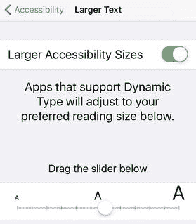

   图 11-1. 你可以使用 `更大字体` 设置来增大 iOS 和某些 App 使用的文本大小

6.  将 `粗体文本` 开关打开，以使所有屏幕文本以更易看清的粗体字体呈现。请注意，iOS 需要你重启设备才能使 `粗体文本` 设置生效。
7.  将 `按钮形状` 开关打开，以便为所有按钮应用填充颜色（例如，见图 11-2 中的 `通用` 按钮），这使它们更容易看清和轻点。

   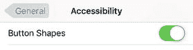

   图 11-2. 激活 `按钮形状` 设置，为按钮（如此处显示的 `通用` 按钮）应用填充以显示其形状

8.  轻点 `增强对比度` 以改善整体屏幕对比度。将 `降低透明度` 开关打开以最大程度减少透明和模糊效果；将 `加深颜色` 开关打开以使非白色颜色更深。
9.  轻点 `减弱动态效果`，然后将 `减弱动态效果` 开关打开，以指示 iOS 减少使用用户界面动态效果，这有助于更轻松地跟踪屏幕上发生的事情。
10. 将 `开/关标签` 开关打开，以便在每个 `开/关` 开关上补充显示 `1`（当开关打开时）或 `0`（当开关关闭时），如图 11-3 所示。如果你难以区分 iOS 开关的“开”和“关”状态，这会很有用。

    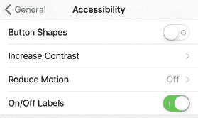

    图 11-3. 激活 `开/关标签` 设置后，你会看到设置为 `开` 的开关上显示 `1`，设置为 `关` 的开关上显示 `0`

#### 你想要一种快速放大屏幕的方法

你可能会发现，虽然你能看清屏幕上的大部分项目，但偶尔有图标或一小段文本太小而无法辨认。上一节提到的一些设置可能会有所帮助，但它们会影响整个 iOS，可能有些小题大做。

解决方法：你总是可以拿个放大镜来凑近看你无法辨认的部分，但 iOS 提供了电子版的解决方案。它叫做 `缩放`，可以让你看到屏幕的放大区域。以下是启用它的方法：

1.  在主屏幕上，轻点 `设置` 以打开“设置”应用。
2.  轻点 `通用` 以显示“通用”屏幕。
3.  轻点 `辅助功能` 以显示“辅助功能”屏幕。
4.  轻点 `缩放` 以显示“缩放”屏幕。
5.  将 `缩放` 开关打开，如图 11-4 所示。iOS 会添加一个“缩放”窗口，其内部的底层屏幕文本和元素会被放大。

   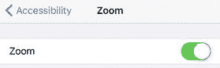

   图 11-4. 将 `缩放` 开关打开，即可看到“缩放”窗口，它会放大屏幕的一部分

以下是使用“缩放”窗口的一些提示：

-   要切换“缩放”窗口的开关，请用三根手指在屏幕上双击。
-   要移动“缩放”窗口，请拖动其底部边框中间出现的椭圆形手柄。
-   要移动“缩放”窗口内的屏幕内容，请用三根手指在窗口内拖动。
-   要调整放大倍率，请用三根手指在屏幕上双击，然后用三根手指在屏幕上拖动。
-   要放大整个屏幕而非仅放大一部分，请返回“辅助功能”设置，轻点 `缩放`，轻点 `缩放区域`，然后轻点 `全屏幕缩放`。

> **注**  
> 默认情况下，`缩放` 会自动放大屏幕上有焦点的部分（即你当前正在操作的控件所在的屏幕区域）。如果你觉得这很突兀，可以通过显示“缩放”屏幕并将 `跟随焦点` 开关关闭来禁用它。

#### 你想要听到屏幕上的内容

如果你发现自己确实很难看清屏幕上的内容，你可能更希望有人将屏幕文本读给你听。

解决方法：iOS 内置了一款名为 `旁白` 的辅助技术，可以帮到你。`旁白` 的工作是朗读当前屏幕或对话框中的任何文本。`旁白` 还能做许多其他事情，包括以下内容：

-   告诉你当前 App 的名称，以及该 App 当前屏幕或对话框的名称。
-   告诉你当前获得焦点的控件名称、控件类型（例如，开关）以及控件的当前状态（例如 `开`）。
-   复述你最近的按键操作。例如，如果你按下 `删除` 键来删除一个字符，`旁白` 会说出 `“删除”`。
-   告诉你当前项目的文本内容，例如一条短信。

按照以下步骤激活 `旁白`：

1.  在主屏幕上，轻点 `设置` 以打开“设置”应用。
2.  轻点 `通用` 以显示“通用”屏幕。
3.  轻点 `辅助功能` 以显示“辅助功能”屏幕。
4.  轻点 `旁白` 以显示“旁白”屏幕。
5.  将 `旁白` 开关打开，如图 11-5 所示。`旁白` 会描述当前屏幕，包括“设置”App 为请求你确认而显示的提醒按钮。

   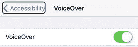

   图 11-5. 将 `旁白` 开关打开，即可听到屏幕上的显示内容

6.  轻点 `好` 两次。

> **注**  
> `旁白` 提供了大量的自定义设置，使你可以控制 `旁白` 的详细程度；是否要听到音效；打字时是想要听到字符、单词，还是两者都听到；以及更多。你可以在“旁白”屏幕上找到所有这些设置。

请注意，激活 `旁白` 会像下面这样改变你使用 iOS 界面的方式：

-   轻点一个屏幕项目以选中它，并让 `旁白` 告诉你它的名称以及可选的状态或文本。iOS 会在该项目周围放置一个黑色边框，以表明它已被选中。有关示例，请参见图 11-5 中的 `辅助功能` 按钮。
-   要运行、激活或选择已选中的屏幕项目，请双击它。
-   要滚动，请在屏幕上用三根手指滑动。

#### 你想用 iOS 设备放大现实世界中的物品

`相机` App 自带一个缩放功能，通过在屏幕上张开手指，你可以看到当前画面的放大版本。除了作为一个有用的摄影功能外，该缩放功能也便于更仔细地查看现实世界中的物品，比如微小的文字或远处的标志。不幸的是，如果你同时有行动障碍，这个张手手势并不容易使用。

**解决方案：** iOS 提供了一个`放大器`工具，它可以自动启动`相机` App 并激活其缩放功能。以下是启用`放大器`需要遵循的步骤：

1.  在主屏幕上，轻点`设置`以打开`设置` App。
2.  轻点`通用`以显示`通用`屏幕。
3.  轻点`辅助功能`以显示`辅助功能`屏幕。
4.  轻点`放大器`以显示`放大器`屏幕。
5.  将`放大器`开关轻点至`打开`，如图 11-6 所示。

    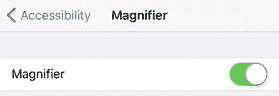

    图 11-6. 将`放大器`开关轻点至`打开`，以便轻松使用`相机` App 的缩放功能来更仔细地查看现实世界中的物品

**提示：** 如果有时你觉得缩放后的屏幕太暗或太亮，你可以配置 iOS 让其自动调整。在`放大器`屏幕中，将`自动亮度`开关轻点至`打开`。

激活`放大器`后，你可以通过三次按下`主屏幕按钮`来调用它。

### 克服身体挑战

使用你的 iOS 设备乍一看似乎更像是一种脑力活动。毕竟，你花大量时间在屏幕前阅读、查看和思考。

然而，如果你仔细规划一下你的设备使用时间，你几乎肯定会发现你花了大把时间在体力任务上：打字、轻点、双击，以及所有手势——滑动、拖移、捏合、张合等等——这些操作都是让你的设备按你指令行事所必需的。

iOS 这个出人意料的体力操作特性意味着，如果你自身有身体挑战，你可能会发现执行某些任务很困难（而且有些任务可能几乎不可能完成）。幸运的是，不一定非得这样。iOS 有不少设置和工具，要么能减轻你使用设备的负担，要么能让你绕过可能遇到的任何问题。

#### 双击主屏幕按钮不显示多任务屏幕

在 iOS 中切换 App 需要双击`主屏幕按钮`打开多任务屏幕，滑动直到你想要切换到的 App 出现在视野中，然后轻点该 App。如果你无法访问多任务屏幕，那么切换 App 会变得非常困难。

**解决方案：** 如果双击`主屏幕按钮`没有显示多任务屏幕，可能是因为你两次按压之间的间隔太长，所以尝试更快地双击。

如果这对你来说是一个持续存在的问题，你可以降低主屏幕按钮点击速度。以下是需要遵循的步骤：

1.  在主屏幕上，轻点`设置`以打开`设置` App。
2.  轻点`通用`以显示`通用`屏幕。
3.  轻点`辅助功能`以显示`辅助功能`屏幕。
4.  轻点`主屏幕按钮`以显示`主屏幕按钮`屏幕。
5.  轻点`慢速`，如图 11-7 所示。iOS 会闪烁`慢速`选项，并在新的主屏幕按钮点击速度下震动设备。

    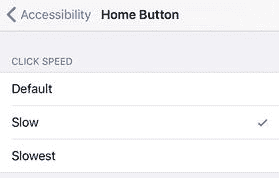

    图 11-7. 如果让 iOS 识别`主屏幕按钮`双击有困难，请尝试`慢速`
6.  如果你觉得那个速度仍然有问题，试着改用`最慢速`。

**提示：** 一旦你解决了`主屏幕按钮`点击问题，你可以配置 iOS 在三次按下`主屏幕按钮`时启动你常用的辅助功能，使其更易于使用。打开`设置`，轻点`通用`，轻点`辅助功能`，然后轻点`辅助功能快捷键`（它在屏幕底部）。在出现的列表中，轻点一种辅助技术——比如`旁白`或`缩放`。现在，你可以通过三次按下`主屏幕按钮`来调用该工具。

#### 你发现使用触控 ID 解锁设备很困难

你在第 8 章“保护你的设备”中了解到，你可以使用`触控 ID`来解锁你的 iOS 设备（参见“你想用指纹解锁设备”）。在 iOS 9 及更早版本中，你将存有已保存指纹的手指放在`主屏幕按钮`上即可解锁设备。然而，在 iOS 10 中，你现在必须用那个手指按下`主屏幕按钮`。你可能会发现身体限制使得执行这个操作很困难。

**解决方案：** 你可以让 iOS 允许手指轻放在`主屏幕按钮`上即可解锁设备。以下是需要遵循的步骤：

1.  在主屏幕上，轻点`设置`以打开`设置` App。
2.  轻点`通用`以显示`通用`屏幕。
3.  轻点`辅助功能`以显示`辅助功能`屏幕。
4.  向下滚动并轻点`主屏幕按钮`以显示`主屏幕按钮`屏幕。
5.  将`手指轻触打开`开关轻点至`打开`，如图 11-8 所示。

    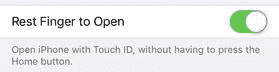

    图 11-8. 轻点`手指轻触打开`，恢复到只需将注册了`触控 ID`的手指放在`主屏幕按钮`上即可解锁 iOS 设备的模式

#### 你打字时会出现不必要的按键

如果你想多次输入同一个键，你可以根据需要多次轻点该键。但是，当你按住一个键时，iOS 会假设你想要多次输入该键。iOS 首先接受最初的按键，然后短暂等待（大约半秒钟），看你是否继续保持按键按下状态。如果你继续按住，iOS 就会接受该键的多次输入，直到你松开为止。

如果你正在使用方向键浏览文档，或者使用`退格键`删除多个字符，这些技术都很有用。如果你有行动障碍，导致你的手指经常在键上弹跳或按住你本打算只按一次的键，那么这些技术绝对没有用处。

**解决方案：** 如果你倾向于多次按下按键或按键时间过长，`按键重复`功能可以帮你过滤掉在这些情况下出现的多余字符。

要使用此功能，请按照以下步骤激活并配置它：

1.  在主屏幕上，轻点`设置`以打开`设置` App。
2.  轻点`通用`以显示`通用`屏幕。
3.  轻点`辅助功能`以显示`辅助功能`屏幕。
4.  轻点`键盘`以显示`键盘`屏幕。
5.  轻点`按键重复`以显示`按键重复`屏幕。
6.  如果你不希望 iOS 在你按住一个键时重复字符，请将`按键重复`开关轻点至`关闭`。否则，将此开关轻点至`打开`，如图 11-9 所示。

    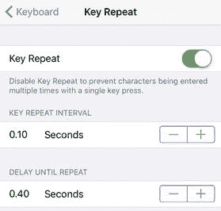

    图 11-9. 将`按键重复`轻点至`打开`，以配置 iOS 如何处理重复按键
7.  如果`按键重复`是`打开`状态，使用`按键重复间隔`设置来设定 iOS 在重复按键之间等待的时间。
8.  如果`按键重复`是`打开`状态，使用`重复前延迟`设置来设定 iOS 在初次按键后、开始重复按键之前的等待时间。

#### iOS 有时会误解或无法识别您的轻点操作

iOS 设备上的触摸屏是现代电子技术的奇迹：灵敏、多功能且强大。很难想象没有它如何使用 iOS，因此触摸屏问题如此令人沮丧也就不足为奇了。如果您觉得难以控制手指，或者您的灵活度不如从前，那么您可能会遇到以下一种或多种触摸屏问题：

-   如果您倾向于在屏幕上按住手指稍长时间，iOS 会将此手势解释为长按而非简单轻点。
-   如果您倾向于在屏幕上让手指弹跳，iOS 会将此手势解释为多次轻点而非单次轻点。
-   如果您倾向于让手指在屏幕上移动，iOS 会将此手势解释为滑动而非轻点。

**解决方案：** iOS 提供了几种所谓的“触控调节”功能，您可以根据需要激活和调整这些功能，以使您的轻点操作被正确识别和/或解释。请按照以下步骤操作：

1.  在“`主屏幕`”上，轻点“`设置`”以打开“`设置`”应用。
2.  轻点“`通用`”以显示“`通用`”屏幕。
3.  轻点“`辅助功能`”以显示“`辅助功能`”屏幕。
4.  轻点“`触控调节`”以显示“`触控调节`”屏幕。
5.  如果您倾向于在屏幕上按住手指时间过长，请将“`按住持续时间`”开关轻点至“`开启`”，如图 11-10 所示，然后使用“`秒`”设置来指定 iOS 在认定您正在执行长按手势之前，允许您按住屏幕的时间长度。

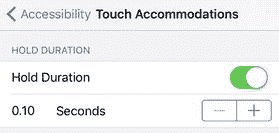

*图 11-10.* 将“`按住持续时间`”轻点至“`开启`”，以防止长按被解释为长按手势

6.  如果您倾向于在屏幕上让手指弹跳，请将“`忽略重复`”开关轻点至“`开启`”，然后使用“`秒`”设置来指定 iOS 在将此手势解释为多次轻点（而非单次轻点）之前应等待的时间。
7.  如果您倾向于让手指在屏幕上移动，请通过在“`轻点辅助`”部分轻点以下选项之一，告知 iOS 将此手势解释为轻点而非滑动：
    -   `使用初始触控位置`。轻点此设置以使用您的轻点手指首次接触屏幕的位置作为轻点位置。
    -   `使用最终触控位置`。轻点此设置以使用您的轻点手指停止或离开屏幕的位置作为轻点位置。

### 克服听觉挑战

如果您多年来听力下降，或者您的一只或两只耳朵有听力障碍，那么检测设备声音以及欣赏音乐和电影可能会成为一项挑战。幸运的是，有现成的帮助。iOS 提供了一些设置和工具，您可以对其进行配置以帮助或规避您的听力问题。

#### 耳机声音不平衡

有时，一只耳朵的听力问题特别严重。在这些情况下，调整设备音量会很麻烦，因为将音量调高到足以让听力较差的耳朵听清时，可能会使另一只耳朵听到的声音过大。

**解决方案：** iOS 可以通过让您平衡每只耳朵的音量来提供帮助。也就是说，您可以调高听力较差耳朵的音量和/或调低听力较好耳朵的音量。

以下是需要遵循的步骤：

1.  在“`主屏幕`”上，轻点“`设置`”以打开“`设置`”应用。
2.  轻点“`通用`”以显示“`通用`”屏幕。
3.  轻点“`辅助功能`”以显示“`辅助功能`”屏幕。
4.  在“`听觉`”部分下，使用图 11-11 中所示的滑块来调节左右声道之间的平衡。

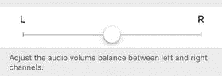

*图 11-11.* 要补偿一只耳朵的听力不佳，请使用此滑块调节左右声道之间的音频平衡

#### 您听不到提醒

当 iOS 显示短信或电子邮件通知时，通常会显示一条横幅几秒钟并播放声音。如果您离设备较远看不到横幅，并且您的听力受损，那么您可能很容易错过提醒。

**解决方案：** 在您的 iPhone 上（此功能在其他 iOS 设备上不可用），您可以告诉 iOS 让摄像头 LED 灯闪烁几次，这为您提供了发生提醒的视觉信号。

请按照以下步骤进行设置：

1.  在“`主屏幕`”上，轻点“`设置`”以打开“`设置`”应用。
2.  轻点“`通用`”以显示“`通用`”屏幕。
3.  轻点“`辅助功能`”以显示“`辅助功能`”屏幕。
4.  在“`听觉`”部分，轻点“`LED 闪烁以示提醒`”。
5.  将“`LED 闪烁以示提醒`”开关轻点至“`开启`”，如图 11-12 所示。

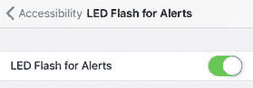

*图 11-12.* 将“`LED 闪烁以示提醒`”轻点至“`开启`”，以便在有提醒时让 iOS 闪烁摄像头 LED 灯

6.  如果您还希望即使在将“`响铃/静音`”开关设置为“`静音`”时 iOS 也能闪烁 LED，请将“`静音时闪烁`”开关轻点至“`开启`”。

## 排查其他 iOS 问题

到目前为止，在本书中您不仅学习了许多通用的解决问题的技巧，还学习了如何排查和解决各种问题。为了更容易找到这些问题（或者，在许多情况下，在问题发生前预防它们），这些问题已根据特定的主题领域进行了分类和分组。这些领域包括蜂窝网络、无线局域网、应用、网页浏览、电子邮件、电话、相机、照片、设备保护、隐私、电池和辅助功能。这是一个范围广泛的列表，但还有很多 iOS 问题不属于这些类别。

本章的目的是汇集一系列最常见的不属于上述分类的问题、烦恼和令人困惑的情况，并提供解决方案和变通方法，以完成您的 iOS 故障排除学习。

### 排查杂项问题

我将从探讨几个能让您的 iOS 设备更易用、更高效的杂项问题开始本章。

#### 您发现很难触及 iPhone 屏幕顶部的项目

iPhone 6、6s 和 7 的大高度（更不用说它们更大的 Plus 版本了）意味着即使是手型一般的人，在单手使用设备时，也会觉得触及屏幕顶部或靠近顶部的项目相当费力。

**解决方案：** 双击“`主屏幕`”按钮，我指的是轻轻点击按钮而不是用力按下它。这会将当前屏幕的内容向下滑动大约一半，使得更容易触及顶部的项目，尤其是在单手使用手机时。要将屏幕推回原位，请再次双击“`主屏幕`”按钮，或点击屏幕内容上方的空白区域（您也可以等待大约八秒钟，屏幕将自动恢复原状）。

#### 双击主屏幕按钮无反应

在前一节中，您已经了解到，在 iPhone 6（及后续机型）的大屏幕上，可以通过双击`主屏幕`按钮来触及屏幕顶部的项目。不过，您可能会发现这个技巧对您并不奏效。

**解决方法：** 以下是可供尝试的几种故障排查技巧：

-   请记住，此功能仅在 iPhone 上可用，iPad 或 iPod touch 不支持。截至撰写本文时，支持此功能的 iPhone 机型仅有 6、6 Plus、6s、6s Plus、7 和 7 Plus。
-   如果您看到了多任务屏幕（即显示所有正在运行或近期运行的应用的屏幕），说明您是在**连按两次**`主屏幕`按钮，而不是**轻点两下**。您只需要**轻快地触碰两下**即可。
-   此功能称为`便捷访问`，是一项辅助功能设置。如果它无法正常工作，可能意味着该设置已被关闭。如需检查，请按以下步骤操作：

1.  在主屏幕中，轻点`设置`以打开`设置`应用。
2.  轻点`通用`以打开`通用`屏幕。
3.  轻点`辅助功能`以打开`辅助功能`屏幕。
4.  将`便捷访问`开关轻点至`开启`，如图 12-1 所示。

    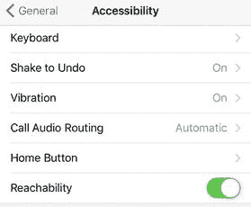

    **图 12-1.** 确保`便捷访问`设置已`开启`以启用主屏幕按钮轻点两下功能。

#### 您的 iOS 设备在不恰当的时间打扰您

当您正在开会、看电影或准备睡觉时，您肯定不希望 iOS 设备被来电或提醒打扰。大多数人通过激活`飞行`模式来处理这种情况，这会关闭设备上的所有天线。这能确保您暂时不受干扰，但它有一个重大缺陷：没有天线工作，设备就无法与外界通信，因此无法下载信息或执行任何其他在线活动。这可能是您想要的，但如果您在等待重要事情，这就不是最佳方案了。此外，您还必须记得激活`飞行`模式，在忙碌时这并非总能做到。

**解决方法：** 配置`勿扰模式`，它能使所有设备干扰静音——包括`通知中心`的提醒和电话——但保持设备在线，以便继续接收数据。这样一来，当您准备好重新投入使用时，所有新数据都已存在于设备上，您可以快速跟上进度。

要激活`勿扰模式`，请打开`设置`，轻点`勿扰模式`，然后将`手动`开关轻点至`开启`。

通过根据您的工作方式配置`勿扰模式`，可以充分发挥其作用。请按以下步骤操作：

1.  在主屏幕中，轻点`设置`以打开`设置`应用。
2.  轻点`勿扰模式`以显示`勿扰模式`屏幕。
3.  若要设置自动启用和停用`勿扰模式`的时间，请将`设定时间`开关轻点至`开启`，如图 12-2 所示。然后轻点`自定时间`控制项；使用`自`来设置开始时间，使用`至`来设置结束时间，然后轻点`返回`回到`勿扰模式`屏幕。

    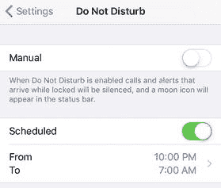

    **图 12-2.** 将`设定时间`开关轻点至`开启`，然后为`勿扰模式`设置开始和结束时间。

    **注意：** 除了定时启用`勿扰模式`，您也可以随时通过步骤 1 和 2 显示`勿扰模式`屏幕，然后轻点`手动`开关至`开启`来手动启用。

4.  如果您希望即使在`勿扰模式`激活时也允许某些来电，请轻点`允许以下来电`，然后轻点您允许通过的人：`所有人`、`没有人`、`个人收藏`（即`电话`应用中`个人收藏`列表里的联系人），或某个特定的联系人分组。
5.  如果您希望`勿扰模式`允许同一人在三分钟内第二次来电时接通，请将`重复来电`开关保持在`开启`位置。如果您不希望允许此例外，请将`重复来电`开关轻点至`关闭`。
6.  如果您希望`勿扰模式`在设备已解锁时正常处理（即非静音）来电和通知，请轻点`仅在设备已锁定时`选项（其中`设备`指 iPhone、iPad 或 iPod）。

#### 屏幕键盘的咔嗒声让你（和你附近的人）抓狂

默认情况下，iOS 的屏幕键盘每次按键都会发出咔嗒声。苹果公司肯定认为这种声音反馈很有用，所以默认开启了此声音，但据我所知，没人不觉得它烦人且毫无意义。即使您不介意这持续不断的咔嗒声，我敢保证您设备周围能听到声音的每个人都在（或许不是那么）默默地咒骂您。

**解决方法：** 按照以下步骤关闭键盘咔嗒声：

1.  在主屏幕中，轻点`设置`以打开`设置`应用。
2.  轻点`声音`以显示`声音`屏幕。
3.  将`按键音`开关轻点至`关闭`，如图 12-3 所示。

    

    **图 12-3.** 要享受无噪音的舒爽输入体验，请将`按键音`开关轻点至`关闭`。

#### 输入两个或更多空格时，iOS 总会在空格前添加一个句点 (.)

实际上，正如程序员所说，这是一个功能，而非错误。这是一个内置快捷方式，让您可以通过轻点两下空格键来高效地结束大多数句子。

**解决方法：** 如果您希望能够输入多个空格而不出现句点，可以关闭这个快捷方式。请按照以下步骤操作：

1.  在主屏幕中，轻点`设置`以打开`设置`应用。
2.  轻点`通用`以显示`通用`屏幕。
3.  轻点`键盘`以显示`键盘`屏幕。
4.  将`“.”快捷键`开关轻点至`关闭`，如图 12-4 所示。

    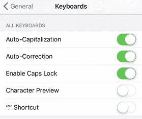

    **图 12-4.** 要输入两个空格而不出现句点 (`.`)，请将`“.”快捷键`开关轻点至`关闭`。

#### 您无法用另一种语言输入

您的 iOS 设备已设置适合您所在地区的默认键盘，并且还附带了一个表情符号键盘。如果您想用其他语言（如阿拉伯语、希腊语或俄语）输入，则无法使用默认键盘直接进行。

**解决方法：** 您需要为想要使用的语言安装一个新的键盘布局。请按照以下步骤操作：

1.  在主屏幕中，轻点`设置`以打开`设置`应用。
2.  轻点`通用`以显示`通用`屏幕。
3.  轻点`键盘`以显示`键盘`屏幕。
4.  轻点`键盘`以打开`键盘`屏幕，该屏幕会显示已安装键盘的列表。
5.  轻点`添加新键盘`以显示`添加新键盘`屏幕。
6.  轻点您想要使用的键盘布局。

要从一种布局切换到另一种，请调出屏幕键盘，然后按住`键盘`按钮（位于`123`或`?123`按钮右侧）。这会显示已安装键盘的列表，如图 12-5 所示，然后轻点您想要使用的布局。

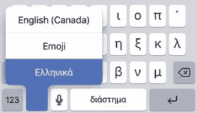

**图 12-5.** 按住`键盘`按钮可查看已安装的键盘布局列表。

#### 您的设备显示屏在夜间使用时亮度过于刺眼

许多人会将 iOS 设备放在床头用作时钟或闹钟。夜间使用时调暗屏幕是必须的，但对很多人来说，屏幕色彩仍然过于刺眼，可能导致难以入睡。

**解决方案：** 您可以使用`Night Shift`（夜览）功能，将屏幕色彩向光谱的红色端偏移。这能让屏幕整体感觉更"温暖"，从而减轻夜间观看时的刺眼感，更有利于入睡。

请按照以下步骤激活并配置`Night Shift`：

1. 在主屏幕上，轻点`设置`以打开`设置`应用。
2. 轻点`显示与亮度`以显示`显示与亮度`屏幕。
3. 轻点`夜览`以显示`夜览`屏幕。
4. 若要设定自动开启和关闭`夜览`的时间，请将`设定时间`开关轻点至`开`，如图 12-6 所示。然后轻点`时间`控制项；使用`自`设定开始时间，使用`至`设定结束时间，然后轻点`返回`回到`夜览`屏幕。

   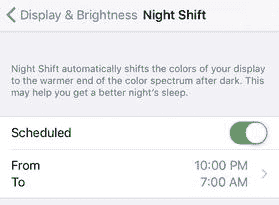

   **图 12-6.** 将`设定时间`开关轻点至`开`，然后为`夜览`设定开始和结束时间

   **注意：** 您也可以不设定`夜览`的计划时间，而是按照步骤 1 至 3 显示`夜览`屏幕，然后将`手动启用至明天`开关轻点至`开`，随时手动启用该功能。

5. 使用`色温`滑块调整屏幕色彩，使其更暖（向右滑动）或更冷（向左滑动）。

#### 您想控制孩子在 iOS 设备上能看到和能操作的内容

如果您的孩子能接触到您的 iOS 设备，或者他们有自己的设备，那么您可能会有些担心他们在网页、YouTube 或 iTunes 上可能接触到某些内容。同样，您可能也不希望他们安装应用或泄露当前的位置信息。

**解决方案：** 针对所有这些以及类似的育儿担忧，您可以激活 iOS 的家长控制功能，从而在夜间睡得更安稳。这些控制功能将限制孩子们能看到和能操作的内容及活动。设置方法如下：

1. 在主屏幕上，轻点`设置`。将显示`设置`应用。
2. 轻点`通用`。将显示`通用`屏幕。
3. 轻点`限制`。将显示`限制`屏幕。
4. 轻点`启用限制`。iOS 将显示`启用限制`屏幕，您需要在此指定一个四位数字的密码，用于日后修改家长控制设置。（请注意，此密码与本书之前讨论的锁屏密码不同；请参阅第 8 章"保护您的设备"。）
5. 输入四位数的限制密码，然后再次输入该密码进行确认。iOS 将返回`限制`屏幕并使各项控制功能可用，如图 12-7 所示。

   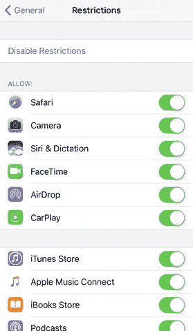

   **图 12-7.** 使用`限制`屏幕配置您想要使用的家长控制功能

6. 在`允许`部分，针对每个应用或任务，轻点其`开/关`开关，以允许或禁止您的孩子使用该应用或任务。
7. 在`允许的内容`下，轻点`分级区域`，然后轻点您想使用其分级制度的国家或地区。
8. 针对每个内容控制项——`音乐`、`播客与新闻`、`影片`、`电视节目`、`图书`、`App`、`Siri`和`网站`——轻点该控制项，然后轻点您希望孩子能访问的内容所允许的最高分级。
9. 如果您不希望孩子更改某些设置（例如`定位服务`和`通讯录`），请在`隐私`部分轻点相应的设置类型，然后轻点`不允许更改`。
10. 如果您不希望孩子更改当前的`邮件`、`日历`或`通讯录`账户设置，请轻点`允许更改`下的`账户`，然后轻点`不允许更改`。
11. 如果您不希望孩子调整您已设定的最大音量限制，请轻点`音量限制`，然后轻点`不允许更改`。

    **提示：** 要在 iOS 设备上设置最大音量，请打开`设置`应用，轻点`音乐`，轻点`音量限制`，然后使用`最大音量`滑块设定限制。

12. 在`游戏中心`部分，轻点`开/关`开关以启用或禁用多人游戏、添加好友以及录制屏幕功能。

### 故障排除：连接与同步问题

如今大多数同步都通过 iCloud 进行，许多人发现自己很少需要将 iOS 设备连接到电脑。不过，如果您没有 iCloud 账户，那就有必要连接电脑并通过 iTunes 进行同步了，因此确保一切正常运作就更加重要。

#### iTunes 无法识别您的设备

当您将 iOS 设备连接到电脑时，iTunes 应该会启动，并且您应该在设备列表中看到该设备。如果连接设备时 iTunes 没有启动，或者 iTunes 已在运行但设备没有出现在设备列表中，这意味着 iTunes 无法识别您的设备。

**解决方案：** 以下是一些可能的修复方法：

* **信任此电脑。** 只有在 iOS 中告知您信任运行 iTunes 的这台电脑后，才能连接到 iTunes。在您的设备上，轻点`信任`。
* **检查连接。** 确保 USB 连接器和 Lightning 接口都已完全插好。
* **尝试其他 USB 端口。** 您当前使用的端口可能无法正常工作，请尝试其他端口。如果您使用的是 USB 集线器上的端口，请尝试使用电脑内置的 USB 端口之一。
* **尝试其他线缆。** USB 线缆可能有缺陷，因此请尝试更换一条线缆（如果有的话）。
* **重启设备。** 按住`睡眠/唤醒`按钮几秒钟，直到设备关机。再次按住`睡眠/唤醒`按钮，直到看到 Apple 标志。
* **重启电脑。** 这应该能重置电脑的 USB 端口，可能会解决问题。
* **检查您的 iTunes 版本。** 使用 iOS 10 至少需要 iTunes 12.5.1 版本。
* **检查您的操作系统版本。** 在 Mac 上，运行 iOS 10 的 iOS 设备要求 OS X Mavericks (10.9)或更高版本。在 Windows PC 上，您的 iOS 设备要求 Windows 7。

#### iTunes 无法同步您的设备

iTunes 或许能识别您的 iOS 设备，但可能拒绝同步该设备。

**解决方案：** 可能涉及几个原因。首先，连接您的设备，切换到电脑上的 iTunes，然后在设备列表中点击您的设备。在`摘要`标签页（见图 12-8）中，确保选中了`连接此设备时自动同步`复选框（其中 device 指 iPhone、iPad 或 iPod）。

**图 12-8.** 选中`连接此设备时自动同步`复选框

如果该复选框已被选中，那么您需要更深入探究以解决问题。请按照以下步骤操作：

1. 打开 iTunes 偏好设置：
   * **Mac。** 点击`iTunes`，然后点击`偏好设置`。
   * **Windows。** 点击`编辑`，然后点击`偏好设置`。
2. 点击`设备`标签页。
3. 取消选中`阻止 iPod、iPhone 和 iPad 自动同步`复选框。
4. 点击`确定`以应用新设置并再次启用自动同步。

另一种可能性是您的 iOS 设备当前处于锁定状态。这通常对 iTunes 来说不是问题，但它有时会被锁定设备搞混淆。简单的解决方法是断开设备连接，解锁设备，然后重新连接。

#### 同步音乐或视频时遇到问题

你可能会遇到将音乐或视频同步到 iOS 设备的问题。

**解决方案：** 最可能的原因是文件采用了 iOS 无法读取的格式，例如 `WMA`、`MPEG-1` 或 `MPEG-2`。首先，使用转换软件（例如格式工厂；请参阅 [`www.pcfreetime.com/`](http://www.pcfreetime.com/)）将文件转换为 iOS 可以识别的格式。然后，将它们放回 iTunes 并尝试再次同步。这应该能解决问题。

iOS 支持的音频格式包括 `AAC`、受保护的 `AAC`、`HE-AAC`、`MP3`、`MP3 VBR`、Audible（格式 2、3 和 4；Audible 增强音频；`AAX` 和 `AAX+`）、Apple 无损、`AIFF` 和 `WAV`。iOS 支持的视频格式包括 `H.264`、`MPEG-4` 和 `Motion JPEG`。

#### 每次连接设备时都会打开某个应用

每次将 iOS 设备连接到电脑时，都可能会看到“照片”应用（在 Mac 上）或“自动播放”对话框（在 Windows 中）。如果你确实想将照片传输到电脑，这当然很方便，但你可能会发现你只是偶尔才这样做。在这种情况下，每次都要处理 iPhoto 或对话框会令人沮丧且浪费时间。

**解决方案：** 你可以配置你的电脑，使其不再提示你从 iOS 设备获取照片。

**注意**

配置你的电脑不下载 iOS 设备上的照片意味着将来你需要恢复该设置才能获取照片，或者手动导入它们。

以下是在 Mac 上进行设置的方法：

1.  点击“聚焦”，输入 **image**，然后点击**图像捕捉**。“图像捕捉”应用随即打开。
2.  在**设备**列表中，点击你的 iOS 设备。
3.  在**设备**窗格的底部，点击**连接此相机时打开**菜单，然后选择**无应用程序**，如图 12-9 所示。

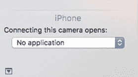  
图 12-9. 在 Mac 的“图像捕捉”程序中，选择**无应用程序**以防止连接 iOS 设备时打开“照片”应用

4.  点击**图像捕捉**，然后点击**退出图像捕捉**。“图像捕捉”保存新设置后关闭。下次连接 iOS 设备时，“照片”应用将忽略它。

请按照以下步骤让 Windows 在每次连接 iOS 设备时不打开“自动播放”对话框：

1.  打开**默认程序**窗口：
    *   Windows 10。在任务栏的“搜索”框中，输入 **default**，然后点击**默认程序**。
    *   Windows 8。在“开始”屏幕中，输入 **default**，然后点击**默认程序**。
    *   Windows 7。点击**开始**，然后点击**默认程序**打开**默认程序**窗口。
2.  点击**更改自动播放设置**。“自动播放”对话框随即出现。
3.  在**设备**部分，打开 iOS 设备的列表，并选择**不执行任何操作**，如图 12-10 所示。

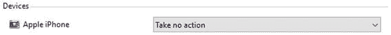  
图 12-10. 在 iOS 设备列表中，选择**不执行任何操作**以防止连接 iOS 设备时出现“自动播放”对话框

4.  点击**保存**。Windows 保存新设置。下次连接 iOS 设备时，你将不会再受到“自动播放”对话框的打扰。

索引  
A  
辅助功能  
听力 耳机声音  
LED 闪烁以示提醒  
实体主屏幕按钮  
按键重复  
任务  
触控调节  
触控 ID  
视觉  
按钮形状  
眼镜度数  
更大字体  
放大器工具  
开/关标签  
旁白  
缩放窗口  
高级应用故障排除  
后台状态  
关闭状态  
iPhone 多任务处理  
运行状态  
挂起状态  
应用问题  
描述  
Facebook，联系人和日历  
卡死  
连续互通功能  
主屏幕布局  
通知  
聚焦搜索  
存储空间  
点按、滑动和威胁  
第三方程序  
B  
备份  
自动  
iCloud 同步  
iOS 设备  
电池续航  
自动检查邮件  
自动锁定  
后台应用刷新  
屏幕活动时  
停用  
关闭  
充电问题  
显示与亮度  
低电量模式  
最小化运行中的应用  
睡眠模式  
技巧与注意事项  
关闭蓝牙  
关闭蜂窝数据  
关闭 GPS  
关闭推送  
关闭 Wi-Fi  
使用情况  
蓝牙  
C  
相机  
对焦/曝光设置  
弱光照片  
照片，模糊图像  
后置摄像头，自拍  
拍正的照片  
蜂窝网络  
控制数据  
限制  
数据漫游  
数据用量  
电子邮件  
连接的配件  
连接与同步问题  
自动播放对话框  
iTunes  
音乐/视频  
照片应用  
D  
设备锁定  
自动锁定  
机密信息  
紧急呼叫  
抹掉数据  
指纹，触控 ID  
密码尝试  
密码选项  
需要密码  
设置  
睡眠/唤醒按钮  
E  
电子邮件故障  
接收  
所有收件箱文件夹  
已删除邮件，废纸篓文件夹  
禁用远程图像  
已下载邮件，POP 服务器  
互联网服务提供商  
整理邮件，邮件主题  
垃圾邮件  
发送  
删除账户  
POP 邮件接收，阻止账户  
Siri 语音命令  
第三方账户  
未完成邮件  
错误账户  
F  
“查找我的 iPhone”应用  
备份  
抹掉数据  
位置，地图  
丢失模式  
播放声音  
信号  
G, H  
常规隐私问题  
广告标识符  
App Store，跟踪功能  
字符预览  
诊断与用量  
家人和朋友，位置共享  
GPS  
定位服务  
防止 iOS，频繁位置  
系统服务  
第三方应用  
I, J, K  
互联网服务提供商 (ISP)  
iOS 设备  
L  
丢失设备保护  
参见“查找我的 iPhone”应用  
M, N, O  
其他问题  
难以找到 iPhone 屏幕  
勿扰模式  
双击主屏幕按钮  
键盘按键音  
键盘布局，语言  
夜览功能  
 Restrictions  
屏幕上打字空格与句点 (.)  
P, Q  
电话  
来电拦截功能  
呼叫转移  
呼叫等待  
勿扰功能  
iCloud 和 FaceTime  
iPad、iPhone 和 Mac  
提醒事项  
用信息回复  
铃声音量  
静音  
语音信箱  
拨出  
来电显示  
分机/菜单选项  
将呼叫者置于保持状态  
Wi-Fi 通话  
照片应用  
黑白  
黑点  
亮度  
鲜明度  
色彩与亮度  
颜色  
对比度  
裁剪  
编辑工具  
增强功能  
曝光  
高光  
光线  
红眼图标  
阴影  
校正  
R  
重新启动  
重启  
恢复备份  
出厂设置  
设备  
设备固件升级 (DFU) 模式  
抹掉设备  
iTunes  
S, T, U, V  
Safari 浏览器应用  
搜索问题  
查找特定信息  
搜索引擎  
语音命令  
网页浏览  
信用卡数据  
桌面版网站  
链接地址，长按  
滚动  
后台打开新标签页  
弹出窗口  
阅读列表  
标签页  
用户名和密码  
查看页面文本/信息  
网页附加功能，干扰  
简单邮件传输协议 (SMTP)  
软件更新  
W, X, Y, Z  
网页浏览隐私  
删除历史记录  
移除已保存的信用卡  
存储数据  
建议  
跟踪，在线广告商  
用户名和密码  
Wi-Fi 网络  
隔空播放，文件传输  
天线开关  
连接问题  
描述  
隐藏网络  
热点  
干扰、兼容性和设备范围  
iOS 自动连接  
加入网络  
密码  
切换
