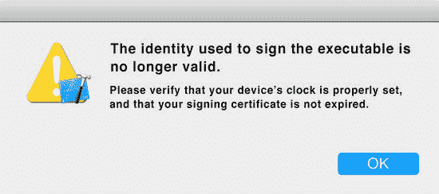
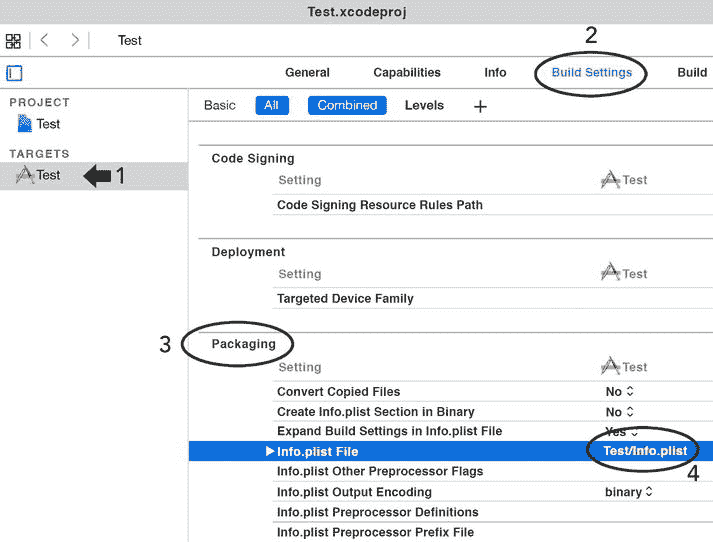
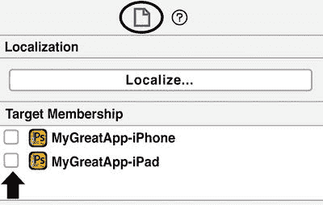
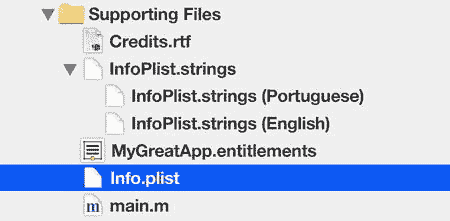
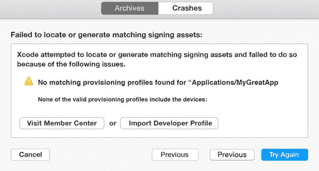
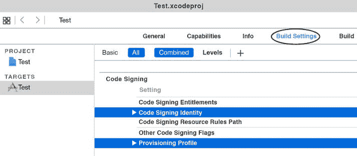
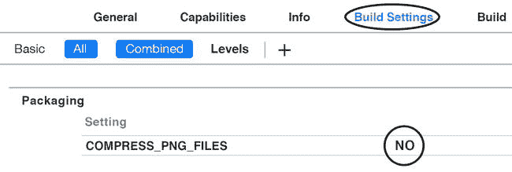
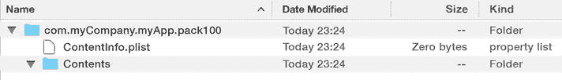
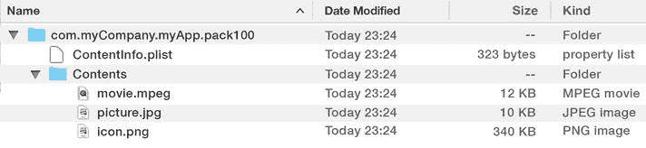

# Xcode 故障排除

电子补充材料 本章在线版本 (doi:[10.1007/978-1-4842-1560-9_1](http://dx.doi.org/10.1007/978-1-4842-1560-9_1)) 包含补充资料，仅供授权用户查阅。

## 反击

由于我们描述的开发问题较为复杂，本书并非针对 Xcode、iTunes Connect 和开发者门户所有问题的权威指南。

你在开发过程中面临的问题是相互关联的。有时，同一个错误信息可能由多个原因引起。我们希望本书能帮助你解决大部分问题，并为你提供解决其他未提及问题的思路。

因此，请戴上你的拳击手套，让第一回合开始吧。

## 打开项目文件时 Xcode 崩溃？

这类崩溃通常表明项目文件已损坏。

不幸的是，由于 Xcode 的内部问题和 bug，项目文件很容易损坏，尤其是复杂项目。使用 Auto Layout 的复杂项目就像一颗定时炸弹，迟早（更可能是早）会导致项目损坏。

此问题最常见的原因是项目工作区相关的内部文件损坏。这些内部文件可以轻松移除，让项目恢复正常。

以下是解决崩溃问题的几个步骤。

### 如果你没有使用 CocoaPods

备份你的项目文件夹。在项目文件夹中找到项目文件（扩展名为 `.xcodeproj` 的文件）。右键点击项目文件，选择“显示包内容”。删除 `project.xworkspace` 文件和 `xcuserdata` 目录。

就这么简单。现在尝试打开项目文件，Xcode 就不会崩溃了。

**注意**

坏消息是，Xcode 使用你删除的这些文件和目录来存储工作区信息（哪些窗口和标签页是打开的，以及一些调试器设置）。

好消息是你的代码完好无损，下次打开项目时，你删除的文件会被重新创建。

### 如果你正在使用 CocoaPods

执行步骤 1 到 4。回到项目文件夹，删除扩展名为 `.xcworkspace` 的文件。同时删除同一目录下的 `Podfile.lock` 文件。在项目文件夹中启动终端，输入以下命令并按下回车键：`pod deintegrate`

**注意**

终端是所有版本的 [Mac OS X](http://guides.macrumors.com/Mac_OS_X) 都包含的程序。它位于[应用程序文件夹](http://guides.macrumors.com/Applications_folder)内的[实用工具文件夹](http://guides.macrumors.com/Utilities_folder)中。启动后，它可以控制任何基于 UNIX 的操作系统（如 Mac OS X）的底层机制。

要启动终端应用，点击 Spotlight，输入 `terminal`，然后按回车键。

要将终端切换到你的项目文件夹，输入以下命令并按回车键：

`cd /你的项目路径`

如果路径中包含空格，必须在每个空格前加反斜杠。

例如

`/Mobile Documents` 必须写成 `/Mobile \ Documents`。

**注意**

如果你的系统没有安装 `deintegrate`，请启动终端并输入以下命令：

`sudo gem install cocoapods-deintegrate`

返回终端，输入以下命令并按回车键：`pod install`

这将重新安装项目使用的所有 Pod，并恢复 `xcworkspace` 文件。

现在你可以再次打开工作区文件，Xcode 不会崩溃。

**注意**

当你使用 CocoaPods 时，你的项目文件是扩展名为 `.xcworkspace` 的那个文件。

## 用于签署可执行文件的身份无效



图 1. 用于签署的身份无效

这条错误信息表明某个签名身份已失效，或者设备的时钟有问题。连 Xcode 也无法确定问题所在。

你可以通过访问 `开发者门户` 来确认所有签名身份的有效性，但我敢打赌它们都没问题。

我们之前见过这个错误，解决方案是重新创建配置文件。

请遵循以下步骤：

- 使用 `开发者门户`，重新生成所有与项目相关的配置文件，但为它们命名新名称。
- 下载新的证书，并将其拖放到 Xcode 的图标上。
- 重启 Xcode。
- 输入以下命令删除执行上一步时找到的所有文件，每找到一个文件就按一次回车键：`rm YYYYY`，其中 `YYYYY` 是要删除的文件名。
- 输入以下命令并按回车键，查找所有与项目相关的配置文件：`grep -alir "XXXXX" *`，其中 `XXXXX` 是你的应用的 Bundle ID。例如：`grep –alir "com.myCompany.myGreatApp" *`
- 启动终端，输入以下命令并按回车键：`cd ∼/Library/MobileDevice/Provisioning\ Profiles` 这行命令会将终端定位到 Xcode 存放配置文件的目录。

## Xcode 编译失败并报错“SBPartialInfo”

> 无法打开文件 myapp-SBPartialInfo.plist，因为不存在该文件

当向用户呈现错误信息时，普遍共识是：

- 如果用户能解决问题，告诉他怎么做。
- 如果问题出在用户创建的文件上，解释如何修复该文件。
- 永远不要显示涉及非用户创建文件或用户无法解决的问题的错误信息。为什么要制造困惑？

这条错误信息违反了所有常识规则，因为它提到了一个用户未创建的文件，一个用户毫不知情的文件。更糟糕的是，即使使用最强大的通灵板，用户也无法猜出问题所在。

经过几年使用 Xcode 的经验，我们知道有几个问题会导致这类错误信息。第一个问题是 Auto Layout 约束出了问题。

### NSLayoutConstraint 问题

大多数情况下，`SBPartialInfo` 错误与一个有问题的 `NSLayoutConstraint` 有关。是的，你没看错，就是那个好用的老式 Auto Layout 约束，我们的崩溃老友。

要解决此问题，请遵循以下步骤：

选择报告导航器，点击 Xcode 的 `项目导航器` 面板顶部最后一个图标（图 2），或按下 8。


图 2. 报告导航器

选择顶部的报告并仔细阅读，直到找到出问题的 `NSAutoLayoutConstraint`。

还有一种问题也会导致图 1 中的错误信息：`Info.plist` 文件路径不正确。

### Info.plist 路径不正确

检查你目标的构建设置，确认 `Info.plist` 文件的路径是否正确。

选择相关目标（1），点击构建设置（2），选择打包部分（3），检查 `Info.plist` 文件行（4）是否有正确的路径和 `Info.plist` 文件名（见图 3）。



图 3. Info.plist 路径

还有第三种问题也会导致图 1 中的错误信息：`Info.plist` 文件分配给了某个目标。


### `Info.plist` 不得分配给任何目标

在 Xcode 的“项目导航器”（图 4）中选中 `Info.plist` 文件，然后在 Xcode 的右侧面板中，点击“文件检查器”图标（图 5 中圆圈标记处）。如图 5 所示的同一右侧面板中，请确保未将 `Info.plist` 文件分配给任何目标（见箭头）。



图 5.

请勿将 `Info.plist` 分配给任何目标



图 4.

`Info.plist` 位置说明

请勿将 `Info.plist` 分配给任何目标。

## 未找到匹配的描述文件

当您尝试向 App Store 提交应用时，会出现如图 7 所示的错误信息。此信息的出现通常与两件事有关：描述文件已过期或缺失。



图 7.

未能找到签名资源

### 缺失描述文件

有时，上帝们早上心情不好，决定删除或吊销您的一些描述文件。“昨天一切都还运行良好，”您说道。我们理解。

首先，请导航至项目的“构建设置”选项卡（图 8），验证您是否已为所选目标配置了正确的描述文件。



图 8.

代码签名与描述文件

如果描述文件缺失，请从“开发者门户”下载。

说明

好吧，我们可以建议您让 Xcode 自动获取描述文件，但不幸的是，此操作有 99.99% 的概率无法解决此问题。还是自行下载描述文件更快。

## 比 Photoshop 更好的图片压缩

如果您喜欢自己压缩图像，以下是一些实用技巧。

据我们所知，Mac OS X 上用于图像优化和压缩的最佳应用程序是 `ImageOptim`（ [`www.imageoptim.com`](http://www.imageoptim.com/) ）。`ImageOptim` 是一款免费应用程序，它在一个易于使用的界面中集成了许多优化工具，例如 `PNGOUT`、`Zopfli`、`Pngcrush`、`AdvPNG`、扩展的 `OptiPNG`、`JpegOptim`、`jpegrescan`、`jpegtran` 和 `Gifsicle`。

默认情况下，Xcode 配置为压缩添加到包中的所有图像，但效果不如 `ImageOptim`。

为了使用您自己压缩的图像，您需要通过禁用“构建设置”选项卡中的 `COMPRESS_PNG_FILES` 来禁用 Xcode 的压缩标志。将此选项从 `YES` 更改为 `NO`，以防止 Xcode 压缩您已经压缩过的图像（图 9）。



图 9.

压缩 PNG 选项

## 为 App 内购买创建包

您已决定在您的应用中添加 App 内购买项目。这些 App 内购买项目将向用户提供内容，并由 Apple 托管这些内容。怎么做呢？

### 提供内容

在 iOS 6 发布之前，开发者负责在购买后为用户保留和提供内容。所有内容都必须存储由开发者自己维护的服务器上。

自从 Apple 推出 iOS 6 以来，可以将所有内容托管在 Apple，从而使过程更加简单。

要将内容提交给 Apple，您必须将所有内容打包成一种特殊类型的文件，称为“包”。

### 什么是包？

简单来说，包是一个结构化的文件夹。此文件夹内包含一个名为 `ContentInfo.plist` 的文件和一个名为 `Contents` 的文件夹。

#### `ContentInfo.plist`

`ContentInfo.plist` 文件包含两个键：

*   `ContentVersion`，代表内容的版本号；
*   `IAPProductionIdentifier`，即 App 内购买项目的捆绑标识符，如 `com.myCompany.myInAppPurchase` 之类的内容。

#### `Contents` 文件夹

`Contents` 文件夹包含与特定 App 内购买项目相关的所有文件，例如音乐、视频、图像、文本等，这些都与您正在销售的内容相关联。

说明

您的 App 内购买项目中可以包含任何类型的内容，但代码除外。

### 创建包：更快的方法

Apple 推荐使用 Xcode 为您的 App 内购买项目创建包，但这个过程需要无尽的点击和复杂的配置。

我们为您创建了另一种方法，更简单，适合批量交付。

方法如下：

使用 Mac OS X 的 Finder，创建一个以您的 App 内购买项目的捆绑标识符命名的文件夹，例如 `com.myCompany.myApp.pack100`。我们将这个文件夹称为主包文件夹。   在主包文件夹内创建一个名为 `Contents` 的文件夹。   在主包文件夹内创建一个纯文本文件，命名为 `ContentInfo.plist`。  

此时，您将获得如图 10 所示的结构：



图 10.

App 内购买包结构将包要交付的所有多媒体内容复制到 `Contents` 文件夹。   将如下结构添加到您的 `ContentInfo.plist` 文件中：

```xml
<?xml version="1.0" encoding="UTF-8"?>
<!DOCTYPE plist PUBLIC "-//Apple//DTD PLIST 1.0//EN"
"http://www.apple.com/DTDs/PropertyList-1.0.dtd">
<plist version="1.0">
<dict>
    <key>ContentVersion</key>
    <string>1.0</string>
    <key>IAPProductIdentifier</key>
    <string>XXXXX</string>
</dict>
</plist>
```

将 `XXXXX` 替换为 App 内购买项目的包 ID，在本例中为 `com.myCompany.myApp.pack100`。

现在文件夹结构恰好如图 11 所示：



图 11.

App 内购买最终结构

### 创建最终的包

是时候创建扩展名为 `pkg` 的最终包文件了。

在包含主包文件夹的目录中启动终端，键入以下命令，然后按回车键：

```bash
productbuild --content <pathToInAppDirectory> <pkg-name.pkg>
```

示例：

```bash
productbuild --content com.myCompany.myApp.pack100 com.myCompany.myApp.pack100.pkg
```

此命令将在同一目录中为您创建包。您可以稍后使用 Application Loader 将此包提交给 Apple。

说明

如果 `productbuild` 命令失败，则意味着您需要在系统上安装 Xcode 的命令行工具。为此，请启动终端并键入以下命令：

```bash
xcode-select –-install
```


好的，作为一名高级文档工程师和翻译员，我将遵循您给出的注意事项和示例，将以下英文文本翻译成中文。


