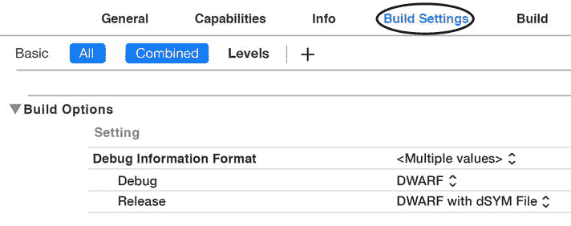

# 将编译时间减少高达 75%

开发过程中最耗时的环节之一就是 Xcode 编译、构建和运行应用程序所花费的时间。

根据你的配置方式，编译代码的时间可能会过长。

其中一种“错误”配置会强制 Xcode 生成开发过程中不必要的文件。其中一个文件是 `dSYM` 文件，它包含编译后代码的调试符号。每次生成这些文件都会不必要地拖长编译时间。

你可以通过在“Build Settings”➤ “Build Options”➤ “Debug Information Format”➤ “Debug”（图 12）中将该项从 `DWARF with dSYM File` 更改为 `DWARF`（图 12）来禁用开发环境下的 `dSYM` 文件生成。

**图 12.** 调试信息格式

> **注意：** 由 Xcode 7 创建的新项目已将此选项配置为 `DWARF`，这意味着 Xcode 在开发期间不会创建 `dSYM` 文件。
>
> 旧版本的 Xcode 将此选项设置为 `DWARF with dSYM file`，这意味着在开发期间会生成 `dSYM` 文件，从而导致项目编译时间更长。

> **注意：** 如果你的项目使用了 CocoaPods 或涉及多个目标依赖，请记得为所有目标更改此选项。
>
> 你应该为 Release 选项保留 `DWARF with dSYM File`，否则在你从 App Store 获取崩溃日志时，将无法对其进行符号化。

> **注意：** 在崩溃日志的符号化过程中，Xcode 会将原始的崩溃日志文件与 `dSYM` 文件合并，生成一个人类可读的崩溃日志版本。这个友好的崩溃日志版本包含程序员能够识别的代码信息，有助于确定崩溃的原因。

