# 为 iOS 应用创建图标

以下脚本用于创建 iOS 应用图标：

```
mkdir -p ./icons_iphone
mkdir -p ./icons_ipad
for x in 29 40 60
do
   double=$(($x * 2))
   triple=$(($x * 3))
   sips --resampleWidth $double icon.png --out ./icons_iphone/icon-$x@2x.png
   sips --resampleWidth $triple icon.png --out ./icons_iphone/icon-$x@3x.png
done
for x in 29 40 76
do
   double=$(($x * 2))
   sips --resampleWidth $x icon.png --out ./icons_ipad/icon-$x.png
   sips --resampleWidth $double icon.png --out ./icons_ipad/icon-$x@2x.png
done
```

**注意：** 此脚本会创建两个文件夹：一个包含 iPhone 图标，另一个包含 iPad 图标。

iOS 图标将按以下尺寸创建：iPhone 使用 29、40 和 60 点 @2x 和 @3x，iPad 使用 29、40 和 76 点 @1x 和 @2x。为 iOS 7 及以上版本编译的应用使用这些格式。

## 为 OS X 应用创建图标

使用以下脚本为你的 Mac 应用创建图标：

```
mkdir -p ./icons_mac
for x in 512 256 128 32 16
do
   double=$(($x * 2))
   sips --resampleWidth $double icon.png –out ./icons_mac/icon-$x@2x.png
   sips --resampleWidth $x icon.png --out ./icons_mac/icon-$x.png
done
```

**注意：** Mac OS X 图标将按以下尺寸创建（兼容 Mac OS X 10.8 及以上版本）：16、32、128、256 和 512 点，分辨率分别为 @1x 和 @2x。

## 使用脚本

创建应用图标的大尺寸版本（至少 1024 x 1024 像素），并将此图像保存为 `icon.png` 到桌面文件夹。在桌面文件夹中启动终端。复制（C）并粘贴（V）本节列出的其中一个脚本到终端窗口中，然后按下回车键。

脚本将执行并暂停。再次按下回车键以继续执行脚本。

**注意：** 如果不想每次使用时都复制粘贴代码，可以使用本书和 apress.com 上提供的脚本。

## UINavigationBar 色调不生效

如果你尝试使用 `tintColor` 属性更改导航栏的色调颜色但颜色未变化，这是因为导航栏还有另一个名为 `barTintColor` 的色调属性。你应该改用下面所示的方法。

#### Swift

```
let bar = self.navigationController?.navigationBar
bar?.barTintColor = UIColor.greenColor()
```

#### Objective-C

```
UINavigationBar *bar = self.navigationController.navigationBar;
bar.barTintColor = [UIColor greenColor];
```

## 调试极其棘手的 Quartz 错误

如果你的项目大量使用 Quartz，并且代码崩溃时没有给出任何问题线索，你会喜欢这一节。

### 还有希望...

调试复杂 Quartz 应用程序的一个可行解决方案是为你的项目添加一个 `CGPostError` 断点。

选择断点导航器（1），点击面板左下角的 +（2），选择添加符号断点（3），然后在符号字段中填入 `CGPostError`（图 13）。

如果问题行与 Quartz 相关，XCode 现在就会在出错行处停止。

## 并发向数组添加对象

如果你曾尝试并发向 `NSMutableArray` 添加对象，你会知道这是不可能的。`NSMutableArray` 不允许同时访问其内容。

例如，以下 Objective-C 代码会崩溃，并显示错误消息："NSArray was mutated while being enumerated."

#### Objective-C

```
NSMutableArray *newArray = [[NSMutableArray alloc] init];
[anotherArray
   enumerateObjectsWithOptions:NSEnumerationConcurrent
                   usingBlock:^(id obj,
                                NSUInteger idx, BOOL *stop)
{
  // 向 newArray 添加新对象
  [newArray addObject:newObject];
}];
```

崩溃是因为枚举是并发运行的。任何两个线程同时尝试向 `newArray` 添加新对象都会导致应用程序崩溃。

### 老式 C 语言方法

解决方案是使用老式的 C 语言数组。

```
// cArray 是一个 "id" 类型元素的数组
// count 是 cArray 将拥有的条目数
id cArray [count];
id __strong *arrayPtr = cArray;
/* 填充数组
   arrayPtr[0] = ...
   arrayPtr[1] = ...
   arrayPtr[2] = ...
   等等...
*/
[anotherArray
    enumerateObjectsWithOptions:NSEnumerationConcurrent
                     usingBlock:^(id obj, NSUInteger idx,
                                  BOOL *stop) {
        arrayPtr[idx] = newObject;
}];
```

此方法有效，因为随着 `idx` 递增，枚举时将为 `arrayPtr[idx]` 分配不同的内存地址。两个线程不可能访问同一个内存地址。因此，这段代码永远不会崩溃。

### 回到未来

随后，你可以使用以下代码将这个 C 数组转换为普通的 `NSMutableArray`：

```
NSMutableArray *array = [NSMutableArray
                arrayWithObjects:cArray
                           count:count];
```

**注意：** Swift 中数组的并发访问完全正常，无需额外代码。

## 应用已损坏，无法打开

以下是 Xcode 显示的错误信息的一部分：删除该应用并重新从 App Store 下载。

### 情况

我们有一个 Cocoa 应用在启动时尝试验证其内部购买收据，但在 bundle 中未找到收据。

按照 Apple 的指示，我们使用 `exit(173)` 强制应用退出，这会指示 iTunes 检索缺失的收据，但我们仍然无法获取该收据。

以下是 Apple 关于收据验证失败的说法（http://addfone.com/TXReceiptValidation）：

- 应对收据验证失败

> 验证失败的原因有多种。例如，当用户将你的应用从一台 Mac 复制到另一台时，GUID 不再匹配，导致收据验证失败。

在 OS X 中验证失败则退出

> 如果在 OS X 中验证失败，请以状态码 173 调用 `exit`。此退出状态通知系统你的应用已确定其收据无效。此时，系统会尝试获取有效收据，并可能提示用户输入其 iTunes 凭证。

互联网上的多个网页说明了此问题与证书的关系，但我们之前多次遇到此问题，并观察到另一种可能导致此错误的情况：沙盒用户已损坏。


### 众神想要惩罚你

你懂的：某一天，你心情愉悦，阳光灿烂，花儿绽放，鸟儿歌唱，`Xcode`里的一切都运行良好。

第二天，众神一觉醒来心情不佳，便来惩罚你。有时他们会间接惩罚你，通过内部腐败的方式判处沙盒用户“惨死”。此时，获取或验证该用户的购买收据就会失败。

更“贴心”的是，众神绝不会向你提供任何能提示问题真正原因的错误信息——你永远也猜不到。

解决沙盒用户死亡的方法是删除有问题的用户，并通过`iTunesConnect`创建一个新用户。

**注意**  
另一个可以尝试的解决方案是：打开 Mac App Store 应用（如果你处理的是 Mac 应用）或`iTunes`（如果你处理的是 iOS 应用），从当前账户注销，然后立即退出该应用。

### 应用无法获取收据

你已经按照上一节的说明创建了一个新的沙盒用户，但你的应用仍然无法获取购买收据？

请验证你的代码是否已正确签名。

转到目标的构建设置，为`Code Signing Identity`和`Provisioning Profile`的 Debug 和 Release 字段调整为你应用对应的值（参见图 14）。

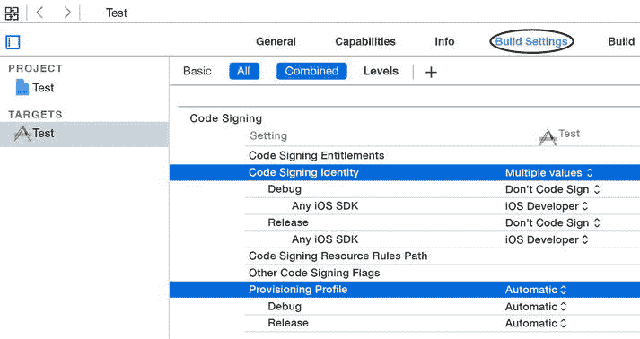

**图 14.**  
代码签名身份和配置文件

在图 14 中，你可以看到`Provisioning Profile`部分在 Debug 和 Release 条目中设置为“自动”。点击“自动”，将这两个条目更改为各自目标的配置文件。

同时，将`Code Signing Identity`中的`iOS Developer`条目更改为在调整`Provisioning Profile`部分后出现的正确的 Debug 和 Release 身份。

### 不同目标中存在同名类

你有一个包含多个目标的项目，特别是涉及不同平台，如 iOS 和 OS X。

你有两个名为`RenderMe`的类，一个为 iOS 设计，另一个为 OS X 设计。这两个类功能相似，但由于平台差异，实现完全不同。

你希望这两个类同名，因为这能简化项目管理，而且它们用途相似。

在开发的某个阶段，你将不得不将这些类分配给各自的目标，并使用如下代码行导入类：

```
#import "RenderMe.h"
```

#### 这是你所期望的...
你期望 iOS 目标导入并编译 iOS 版本的`RenderMe`，Mac OS X 目标也同样如此。

#### 且慢！
请相信我们，在合适的时间和项目复杂性下，Xcode 会为错误的目标导入并编译错误的类。我们之前就见过这种情况。

此时你有两个解决方案：为这两个类使用不同的名称，或者使用绝对路径导入它们。

不要对两个目标都使用

```
#import " RenderMe.h"
```

而要根据不同情况使用如下代码行：

```
#import "/absolutePathForMyIOSRenderMe/RenderMe.h"
#import "/absolutePathForMyMacRenderMe/RenderMe.h"
```

虽然不美观，但有效。

### 反对基础国际化的案例

iOS 6 在 Xcode 中引入了一个名为“使用基础国际化”的选项。你可以通过导航到项目的信息标签页（图 15）来查看此选项。基础国际化的原理是定义一个默认语言作为基础语言。

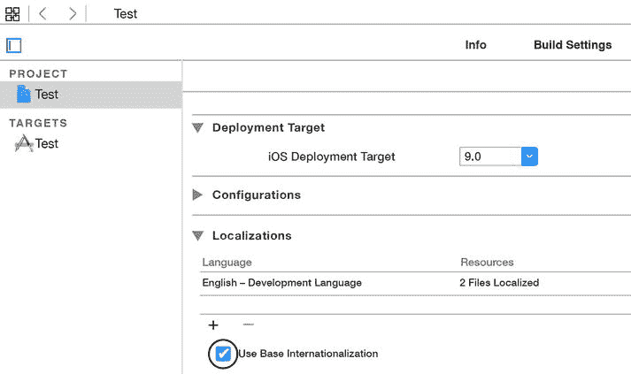

**图 15.**  
使用基础国际化

假设你的应用本地化成了英语和葡萄牙语，并且英语是基础语言。所有设备语言设置为葡萄牙语的用户都将看到葡萄牙语本地化内容，而其他所有用户都将看到英语内容，因为英语是基础语言。

#### 界面元素的本地化
当我们谈论本地化界面元素时，我们指的是 XIB 文件和故事板。

在 iOS 6 之前，本地化一个界面文件会使 Xcode 生成额外的 XIB 和故事板文件副本，每个要本地化的语言一个。这种文件的多重性使得维护和处理多种本地化几乎不可能。

苹果通过引入一个名为`Base Internationalization`的选项解决了这个问题。使用此选项，你不再需要拥有多个界面元素副本，而是拥有一个指定为基础语言的 XIB 或故事板，以及包含其他语言本地化内容的文本文件（图 16）。

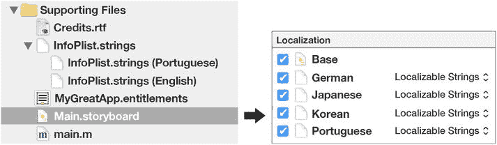

**图 16.**  
一个被本地化为多种语言的故事板

`Base Internationalization`的想法很好，但你必须意识到，此功能存在一些问题，会导致某些界面元素无法被本地化。

#### UIBarButtonItem 及其他元素的本地化失败
`Base Internationalization`选项在某些元素上本地化失败的一个典型例子是当你的应用使用了`UIBarButtonItem`对象时。`Base Internationalization`选项不会自动本地化这些元素。Xcode 甚至不会将它们的字符串添加到`localization files`中，而手动添加也无法本地化这些元素。

如果你使用了`UIBarButtonItem`对象，你将不得不在运行时通过编程方式对它们进行本地化。

**注意**  
如果你使用“使用基础国际化”选项，请务必在所有语言上测试你的应用，因为包括`UIBarButtonItems`在内的其他一些界面元素也可能无法正常显示本地化内容。

### 检查缺失的 Localizable.strings

你已经将应用本地化为多种语言，但你感觉某些字符串在某种语言中缺失了。

逐一检查所有本地化文件并进行比较过于复杂且效率低下。

好消息是：你可以让 Xcode 为你检查缺失的字符串！

选择“产品” ➤ “方案” ➤ “编辑方案”，并在“启动时传递的参数”部分添加选项`-NSShowNonLocalizedStrings YES`（见图 17）。

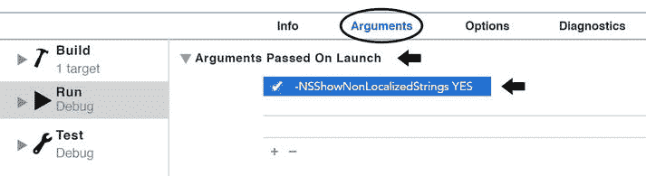

**图 17.**  
检查缺失的 Localizable.strings

下次运行应用时，你将看到 Xcode 的控制台中显示了缺失的字符串，类似如下内容：

```
BarButtonItemColor[23980:60b] Localizable string "Ahi-1h-yfI.title" not found in strings table "Main∼iphone" of bundle CFBundle 0x17d70dd0 </var/mobile/Applications/1228CFF2-DB3D-4A2D-B0D8-17DA32E7DD8A/BarButtonItemColor.app>
```

这个错误信息与一个最初以英语（基础语言）创建，后来本地化为葡萄牙语的应用有关。

错误信息中缺失的字符串属于元素`"Ahi-1h-yfI.title"`，这并非巧合，它正是一个`UIBarButtonItem`，证实了我们在“反对基础国际化的案例”一节中所说的内容。

在将该项目的故事板从基础语言本地化为葡萄牙语之后，Xcode 确实忘记将`UIBarButtonItem`的字符串添加到本地化文件中，这就是 Xcode 报错的原因。

将缺失的字符串添加到葡萄牙语本地化文件中并不会将`UIBarButtonItem`本地化。要本地化此按钮，唯一的办法是在运行时通过编程方式实现。

### 你错误地声明了你的 NSString

你需要为全新的类声明一个常量`NSString`，而你很可能正在像下面这样声明它。


#### Objective-C

`const NSString * kMyConstant;`

这一行代码定义了一个指向常量 `NSString` 的指针。但这并非你想要的结果，原因很简单：`NSString` 对象本身已经是不可变的。

相反，你应该像下面这样声明：

`NSString * const kMyConstant;`

这定义了一个指向 `NSString` 的常量指针，这才是你需要的。

这才是声明 `NSString` 常量的正确方式。

**注意：** 在 Swift 中声明常量，只需使用 `let` 关键字：

`let kMyConstant = "something"`

## CocoaPods: /Manifest.lock: 没有那个文件或目录

`diff: /../Podfile.lock: No such file or directory`

`diff: /Manifest.lock: No such file or directory`

`error: The sandbox is not in sync with the Podfile.lock. Run 'pod install' or update your CocoaPods installation`

如果你的项目使用了 CocoaPods，并且编译时遇到此错误信息，请尝试以下步骤：

关闭 Xcode。在存放 `Podfile` 的目录中启动终端，依次输入以下每一行命令，每输入一行后按回车键，等待命令执行完毕。

`sudo gem install cocoapods-deintegrate`  
`pod deintegrate`  
`pod install`

第一行命令会在你的系统上安装 `deintegrate`，这是 CocoaPods 的一个模块，用于从项目中移除所有 Pod 及其相关引用。

如果你已经安装了 `deintegrate`，请跳过这一行。

第二行命令会从项目中移除所有 Pod，并清理所有相关引用。

第三行命令会重新安装这些 Pod。

返回 Xcode，选择 **Product ➤ Clean**。然后重新构建项目即可。如有必要，请重启 Xcode。

## Asset Catalogs 错误

Apple 在 iOS 7（Xcode 5）中引入了 Asset Catalogs。使用 Asset Catalogs，你可以简化应用程序中用户界面所用图片的管理。

如果你是个完美主义者，你可能不想听到下面这种情况下的 Asset Catalogs 错误：

- 你的项目有两个 target：一个针对 iPhone，一个针对 iPad。
- 每个 target 有不同的图标。
- 你的项目是为 iOS 7 编译的。
- 所有图标共用一个 Assets Catalog 文件。
- `AppIcon` 被设置为包含特定设备的图标。
- 所有图标都存储在 Assets Catalog 的 `AppIcon` 条目中。

很遗憾地通知你，这样是无法正常工作的。

### 错误表现

在 iPad 上运行的 iPhone target 会为 iOS 7.x 设备显示 iPad 图标。

### 解决方案

为你支持的每个平台分别创建一个不同名称的 Assets Catalog 文件。每个 Assets Catalog 必须包含自己名称不同的 `AppIcon` 条目。每个 `AppIcon` 条目只能包含属于该平台的图标。

不要忘记为每个 target 配置正确的 Assets Catalog 和 `AppIcon` 条目。

## 应用崩溃且无任何线索？

如果你的 Objective-C 应用崩溃并显示臭名昭著的 `signal SIGABRT` 消息，且没有提供任何其他崩溃线索，那么本节提供的代码将特别有用。

将 `main.m` 文件中的代码替换为类似下面的内容：

#### Objective-C

```
int main(int argc, char *argv[]) {
  int retVal;
  @autoreleasepool {
    @try {
      retVal = UIApplicationMain(argc, argv, nil, nil); //***
    }
    @catch (NSException *exception) {
      NSLog(@"\n\nSTACK SYMBOLS\n%@",
            [exception callStackSymbols]);
      NSLog(@"\n\nSTACK RETURN ADDRESSES\n%@",
            [exception callStackReturnAddresses]);
      NSLog(@"\n\nOBJECT: %@",[exception name]);
      NSLog(@"\n\nUSER INFO DICT: %@",[exception userInfo]);
      NSLog(@"\n\nREASON: %@",[exception reason]);
      retVal = 1;
    }
  }
  return retVal;
}
//*** 这一行应与你 `main.m` 中的写法保持一致。
```

如果应用崩溃，这段代码会向控制台输出大量信息，可能会帮助你识别问题。

**注意：** 由于 Swift 的特性，无法为该语言实现此类代码。

## 沙盒应用的 NSUserDefaults 失效？

这个问题我们见过几次。

你在测试一个应用时，它突然失去了读取或写入 `NSUserDefaults` 的能力。

这个问题的典型解决方案是重启你的 Mac，但每个人都讨厌这样做。

相反，你可以启动终端并输入：

```
ps auwx | grep cfprefsd | grep -v grep | awk '{print $2}' |
xargs sudo kill -9
```

这会杀死 macOS 的 `cfprefsd` 守护进程，该进程为 `CFPreferences` 和 `NSUserDefaults` API（应用程序编程接口）提供偏好设置服务。

下次尝试访问 `NSUserDefaults` 时，该守护进程会自动重启，一切应该就能恢复正常。

## 界面元素不更新？

如果你有一个界面元素（如旋转指示器或文本视图）需要持续更新，但由于应用忙于循环而无法更新，请在循环末尾添加以下代码。

#### Swift

```
var date : NSDate? = NSDate()
date = date!.dateByAddingTimeInterval(0.0)
let runLoop = NSRunLoop.currentRunLoop()
runLoop.runUntilDate(date!)
```

#### Objective-C

```
[[NSRunLoop currentRunLoop] runUntilDate:
           [NSDate dateWithTimeIntervalSinceNow:0.0]];
```

这段代码会强制循环短暂暂停，从而让应用能够更新界面。

**注意：** 请记住，这段代码会停止当前运行循环极短的时间。这可能会拖慢某些应用。请谨慎使用。如果需要，你可以调整时间间隔。

## 使用正则表达式查找和替换字符串

假设你的项目中包含类似本节中的多行代码。

#### Swift

```
myButton1.setTitleColor(UIColor.grayColor(),
          forState:UIControlState.Normal)
myButton2.setTitleColor(UIColor.greenColor(),
          forState:UIControlState.Selected)
myButton3.setTitleColor(UIColor.orangeColor(),
          forState:UIControlState.Disabled)
```

#### Objective-C

```
[myButton1 setTitleColor:[UIColor grayColor]
           forState: UIControlStateNormal];
[myButton2 setTitleColor:[UIColor greenColor]
           forState: UIControlStateSelected];
[myButton3 setTitleColor:[UIColor orangeColor]
           forState: UIControlStateDisabled];
```

这些按钮具有不同的名称、不同的颜色和不同的控件状态。

你想要搜索所有类似的行，并将颜色改为红色，但保留名称和控件状态不变。

你想要将代码修改为如下所示：

#### Swift

```
myButton1.setTitleColor(UIColor.redColor(),
          forState:UIControlState.Normal)
myButton2.setTitleColor(UIColor.redColor(),
          forState:UIControlState.Selected)
myButton3.setTitleColor(UIColor.redColor(),
          forState:UIControlState.Disabled)
```


#### Objective-C

```
[myButton1 setTitleColor:[UIColor redColor]
           forState: UIControlStateNormal];
[myButton2 setTitleColor:[UIColor redColor]
           forState: UIControlStateSelected];
[myButton3 setTitleColor:[UIColor redColor]
           forState: UIControlStateDisabled];
```

如何实现？  
正则表达式可以拯救你。

### 使用正则表达式

**注意**  
苹果文档指出，在使用 Xcode 搜索功能并配合正则表达式时，必须使用 ICU 语法。ICU 语法使用美元符号（`$`）后跟数字来表示引用的捕获组（`$1`、`$2` 等）。

选择 Find ➤ Find and Replace in Project... 确保你选择了“替换”选项并勾选了“Regular Expression”（正则表达式）。如果没有，请点击“Text”字样并选择正确选项（参见图 18 和图 19）。

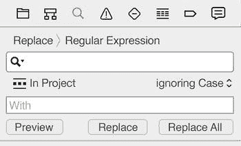  
图 19. 已选中正则表达式

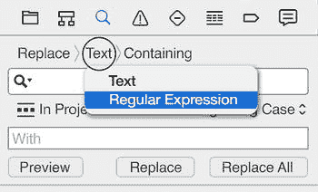  
图 18. 正则表达式选项

#### “查找”字段

“查找”字段用于输入要查找的字符串，或者在本例中，输入你想要查找的正则表达式。

在“查找”字段中填入 `\[(.*) setTitleColor:(.*) forState:(.*)\]`

##### 说明：

你可以将这个表达式分为几个部分（参见图 20）。

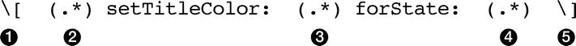  
图 20. 分解后的正则表达式

➊ 查找左方括号 `[`；  
➋ 查找左方括号与字符串 `setTitleColor:` 之间可能存在的任何内容，并将结果存储为“组 1”；  
➌ 查找 `setTitleColor:` 与 `forState:` 之间可能存在的任何内容，并将结果存储为“组 2”；  
➍ 查找 `setTitleColor:` 与右方括号之间可能存在的任何内容，并将结果存储为“组 3”；  
➎ 查找右方括号 `]`；

**注意**  
这里的问题是，为什么要在方括号前加上反斜杠来进行搜索？答案很简单——因为方括号本身是正则表达式语法的一部分。如果我们使用像 `[0-9]` 这样的表达式，就是在告诉 Xcode“查找一个介于 0 到 9 之间的数字”。反斜杠的作用是告诉 Xcode，我们要查找的是方括号这个字符，而不是将方括号当作命令来使用。反斜杠字符被称为“转义”字符，根据维基百科的解释，它是一个能够引发对字符序列中后续字符进行另一种解释的字符。

#### “替换”字段

“替换”字段用于输入你希望用来替换匹配“查找”字段表达式的文本的表达式。

在“替换”字段中填入 `[$1 setTitleColor:[UIColor redColor] forState:$3]`

参见图 21。

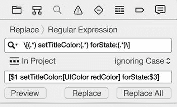  
图 21. 正则表达式

#### 说明

变量 `$1` 和 `$3` 代表“查找”字段中的捕获组。如前所述，“组 1”将是左方括号与 `setTitleColor:` 之间可能存在的任何内容，而“组 3”将是 `setTitleColor:` 与右方括号之间可能存在的任何内容。通过使用变量 `$1` 和 `$3`，我们相当于将“组 1”和“组 3”的内容“粘贴”到了相应位置上。

在我们的示例中：
- “组 1”将包含不同的按钮名称：`myButton1`、`myButton2` 和 `myButton3`；
- “组 2”将包含不同的颜色：灰色、绿色和橙色；
- “组 3”将包含不同的控件状态：normal、selected 和 disabled。

通过使用图 21 中“替换”字段所示的表达式，我们指示 Xcode 按以下方法构建替换字符串：以左方括号开头，接着是“组 1”的内容，然后是一个空格，接着是字符串 `setTitleColor:[UIColor redColor] forState:`，再接着是“组 3”的内容，最后以右方括号结尾。

#### 但有一个问题...

我们描述的搜索命令只有在连续书写这些代码行时才会生效，如下所示：

```
[myButton1 setTitleColor:...
                   forState:...];
```

如果这些行被换行符分隔，像下面这样，搜索将无法找到它们：

```
[myButton1 setTitleColor:...
                   forState:...];
```

问题出现的原因在于，命令的不同部分之间存在换行符（在本书中用 `\n` 字符表示），而我们没有在搜索命令中提供相应的指令来考虑这一点。

为了处理换行符或其他不可见字符，你需要在搜索字符串中添加 `\s*` 指令。

在这种情况下，“查找”字段将变为：

```
\[(.*) \s* setTitleColor:(.*) \s* forState:(.*)\]
```

**注意**  
ICU 语法将以下字符视为“空白字符”：制表符、换页符、换行符、回车符以及任何类型的空格或不可见字符。  
你可以通过访问 [`http://addfone.com/TXICUSyntax`](http://addfone.com/TXICUSyntax) 了解更多关于 ICU 语法的信息。

## 从数组中提取字典

你有一个字典数组，这些字典包含两个字段：“name”和“date”，分别对应一个 `NSString` 对象和一个 `NSDate` 对象。

在某个时候，你想要从这个数组中提取出日期最近的字典。

你可以使用如下所示的代码。

### Swift: NSArray

```
// 创建带有随机日期的字典
let obj1 : NSDictionary? = ["name":"car",
                            "date":date1!]
let obj2 : NSDictionary? = ["name":"boat",
                            "date":date2!]
let obj3 : NSDictionary? = ["name":"plane",
                            "date":date3!]
// 将它们存储到一个数组中
let unsortedArray : NSArray = [obj1!, obj2!, obj3!]
// 创建一个 NSSortDescriptor 来对数组进行排序
let dateDescriptor : NSSortDescriptor =
    NSSortDescriptor(key: "date", ascending: true)
// 对数组进行排序
let sortedArrayOfDics : NSArray =
    unsortedArray.sortedArrayUsingDescriptors([dateDescriptor])
// 因为数组已排序，最后一个对象就是
// 日期最近的那个
let mostRecent : AnyObject! = sortedArrayOfDics.lastObject
```


好的，作为高级文档工程师和翻译员，我将严格按照您提供的注意事项和示例，将给定的英文文本翻译成中文。


### Swift 变体...

如果你正在处理一个包含 `NSDictionary` 对象的 `NSArray`，前面的代码是有效的，但如果你使用的是 Swift 字典构成的 Swift 数组，那又该如何呢？

在这种情况下，你必须使用以下代码：

```
// creating the dictionaries
let dict1 : [String:AnyObject?] = ["object" : "car",    "date" : date1]
let dict2 : [String:AnyObject?] = ["object" : "boat",   "date" : date2]
let dict3 : [String:AnyObject?] = ["object": "plane",  "date" : date3]

// creating the array
let array : Array = [dict1, dict2, dict3]

// creating the sort
let result = array.sort {
  item1, item2 in
  let date1 = item1["date"] as! NSDate
  let date2 = item2["date"] as! NSDate
  return date1.compare(date2) == NSComparisonResult.OrderedAscending
}

let latestDate = result.last
print(latestDate)
```

#### Objective-C

```
// the dictionaries with random dates
NSDictionary *obj1 = @{ @"name":@"car", @"date":date1};
NSDictionary *obj2 = @{ @"name":@"boat", @"date":date2};
NSDictionary *obj3 = @{ @"name":@"plane", @"date":date3};

// the unsorted array
NSArray *unsortedArray = @[obj1, obj2, obj3];

// create a NSSortDescriptor to sort the array
NSSortDescriptor *dateDescriptor = [NSSortDescriptor sortDescriptorWithKey:@"date" ascending:YES];
NSArray *sortDescriptors = @[dateDescriptor];

// sorting the array
NSArray *sortedArray = [unsortedArray sortedArrayUsingDescriptors:sortDescriptors];

// because the array is sorted, the last object is the
// one with the most recent date
NSDictionary *mostRecent = [sortedArray lastObject];
```

## 计算数组中元素数量的神奇方法

假设你有一个字典数组，这些字典包含两个字段：`object`（一个 `NSString` 类型）和 `selected`（一个存储在 `NSNumber` 中的 `BOOL` 类型）。

你想知道这些字典中有多少个的 `selected` 字段等于 `YES`/`true`。

接下来展示的是首先想到的代码。

#### Swift

```
var count = 0
for dict in array {
  if dict["selected"] == true
     count++
}
```

#### Objective-C

```
NSInteger count = 0;
for (NSDictionary * dict in array) {
  BOOL isSelected = [dict [@"selected"] boolValue];
  if (isSelected)
    count++;
}
```

但这段代码不够“神奇”。

让我们用神奇的方式来实现它。

### Swift: NSArray

```
// creating the dictionaries
let dict1: NSDictionary = ["object"   : "television",
                           "selected" : true]
let dict2: NSDictionary = ["object"   : "phone",
                           "selected" : false]
let dict3: NSDictionary = ["object"   : "book",
                           "selected" : true]

// creating the array
let array : NSArray? = [dict1, dict2, dict3]

// this is the magical command
let count = array!.valueForKeyPath("@sum.selected")?.integerValue
print(count); // this will print 2 on console
```

### Swift 变体...

前面的代码只有在使用 `NSDictionary` 实例构成的 `NSArray` 时才有效。如果你使用的是 Swift 字典构成的 Swift 数组，则应使用以下代码：

```
// creating the dictionaries
let dict1 = ["object" : "television", "selected": true]
let dict2 = ["object" : "phone",      "selected": false]
let dict3 = ["object" : "book",       "selected": true]

// creating the array
let array = [dict1, dict2, dict3]

// the magic command
let filteredArray = array.filter({$0["selected"] == true})
let result = filteredArray.count
print(result) // this will print 2 on console
```

#### Objective-C

```
// creating the dictionaries
NSDictionary *dict1 = @{@"object"    : @"television",
                        @"selected"  : @(YES) };
NSDictionary *dict2 = @{@"object"    : @"phone",
                        @"selected"  : @(NO)  };
NSDictionary *dict3 = @{@"object"    : @"book",
                        @"selected"  : @(YES) };

// creating the array
NSArray *array = @[dict1, dict2, dict3];

// this is the magical command
NSInteger count = [[array valueForKeyPath:@"@sum.selected"] integerValue];
NSLog(@"count %@", @(count)); // this will print 2 on console
```

## OS X 应用未以正确尺寸启动

如果你已经调整了 Cocoa 应用，使其以特定尺寸启动，但应用却未能做到，那么本节内容绝对适合你。

我们不止一次看到这个问题，它通常与某些干扰初始 `ViewController` 的「自动布局」约束有关。

此问题的解决方案是向 `ViewController` 的视图应用约束，使其以正确尺寸启动，但这类视图不接受约束。

你必须将整个界面嵌入到一个 `NSView` 中，并对该视图应用约束，定义你希望应用启动时的尺寸（图 22）。

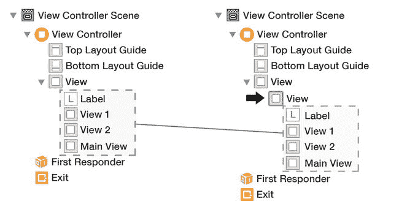

图 22. 将整个界面元素嵌入到一个视图中（之前和之后）

## 检测正在运行的应用目标

你有一个包含独立 iPhone 和 iPad 目标的项目，在代码的某个地方，你想知道当前正在运行的是哪个目标。

使用 `UI_USER_INTERFACE_IDIOM()` 不是一个选项，因为该方法只会检查目标是在 iPhone 还是 iPad 上运行，而不是检查目标本身。

解决此问题的一种方法是添加一个预处理宏，然后在代码中检查该宏是否存在，但编译器指令会使代码变得笨拙并降低可读性。

然而，有更好的方法。下面展示的代码将读取 bundle 的 `infoDictionary`，并找出正在运行的目标。

#### Swift

```
func getTarget() -> NSString {
  let dict : NSDictionary = NSBundle.mainBundle().infoDictionary!
  let family  = dict["UIDeviceFamily"]!
  let device = family[0]
  return (device.integerValue == 1) ? "iPhone" : "iPad"
}
```

#### Objective-C

```
- (NSString *) getTarget {
  NSDictionary *dict = [[NSBundle mainBundle] infoDictionary];
  NSArray *family = dict[@"UIDeviceFamily"];
  NSInteger device = [family[0] integerValue];
  return (device == 1) ? @"iPhone" : @"iPad";
}
```

## 禁用类上的方法

你有一个新类，必须使用特定的初始化方法（如 `initWithMode:`）来初始化，并且你希望阻止人们使用父类可能提供的其他初始化方法。

下面展示的代码将提醒人们使用正确的初始化方法，并禁用可能存在的其他方法。


#### Swift

```
@available(*, unavailable,
             message="init is unavailable, use initWithMode")
init() {
  // your code...
}
```

#### Objective-C

```
#import <Foundation/Foundation.h>

@interface SampleClass : NSObject

- (id)init __attribute__((unavailable("init is unavailable,
                                    use initWithMode")));
@end
```

**注意**  
该指令将在编译时产生错误，警告用户不应使用 `init` 方法进行初始化。

## 弃用类中的某个方法

你弃用了类中的一个方法，并希望警告用户更新代码以使用新方法。

你可以简单地为此方法添加这个编译器属性。

#### Swift

```
@available(*, deprecated)
class func shareWithParams(params: NSDictionary) {
  // your code...
}
```

#### Objective-C

```
#import <Foundation/Foundation.h>

@interface SampleClass : NSObject

+(void)shareWithParams:(NSDictionary *)params
       __attribute((deprecated("use shareWithPars:
                                instead")));
@end
```

**注意**  
该编译器属性将在编译时产生错误，警告当前方法已被弃用，应使用其他方法。

## Xcode 出现“沙滩球”现象

当我们试图打开一个前一天还能正常工作的项目时，Xcode 是否永远在显示“沙滩球”？

**注意**  
死亡沙滩球或旋转等待光标是一种彩色的圆形光标类型，形似沙滩球，当应用程序在 Mac OS X 上挂起时，它会取代常规鼠标指针。

事实证明，在 Xcode 偏好设置中禁用源代码控制可以解决此问题（图 23）。

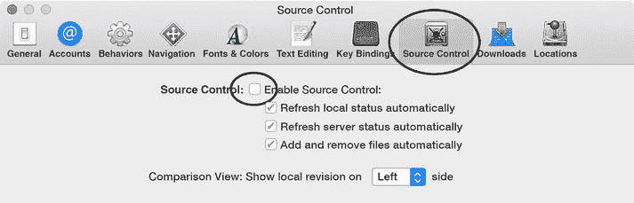

**图 23.** 通过禁用源代码控制解决“沙滩球”问题

**注意**  
此处描述的源代码控制问题也是导致尝试打开某些项目时 Xcode 崩溃的原因。

## UIButton 未变灰

你正尝试使用以下代码禁用 `UIButton`，但按钮并未变灰。

#### Swift

```
myButton.enabled = false
```

#### Objective-C

```
myButton.enabled = NO;
```

`UIButton` 对象在被禁用时不会显示为灰色。你必须强制将其标题设为灰色，以使其看起来像是“已禁用”，可使用如下代码。

#### Swift

```
myButton.enabled = false
myButton.setTitleColor(UIColor.grayColor(),
                       forState:UIControlState.Disabled)
```

#### Objective-C

```
myButton.enabled = NO;
[myButton setTitleColor:[UIColor grayColor]
              forState:UIControlStateDisabled];
```

## 捕获内存损坏

有些类型的 Bug 简直难以捕获。

你的应用程序崩溃了，情况怪异且难以追踪。

用户开始抱怨，而你无法复现问题。

你的应用程序可能遇到了某种内存损坏问题。

以下是苹果对此的看法。

> Objective-C 和 C 代码容易受到内存损坏问题的影响，例如栈和堆缓冲区溢出以及释放后使用问题。当这些内存违规发生时，你的应用程序可能会不可预测地崩溃或显示异常行为。内存损坏问题难以追踪，因为崩溃和异常行为通常难以复现，并且原因可能远离问题的源头。

更多信息，请访问 [`http://addfone.com/TXSanitizer`](http://addfone.com/TXSanitizer)

### Sanitizer（地址清理器）

Xcode 7 附带一个名为 Address Sanitizer 的选项，该选项会在应用程序中生成额外代码，通过指针检查每次读取和写入，如果内存中的某个地址被损坏，则会发出警告。

要启用此选项，请选择 Product ➤ Scheme ➤ Edit Scheme ➤ Diagnostics，然后勾选 **Enable Address Sanitizer**（图 24）。

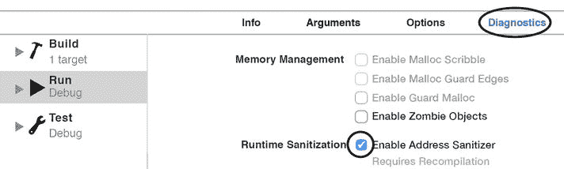

**图 24.** Xcode 7 Address Sanitizer

启用 Address Sanitizer 后运行你的应用程序，直到它崩溃。崩溃现在将产生丰富的错误信息，为你提供问题的线索。

你的用户将停止抱怨。

**注意**  
Address Sanitizer 可能会带来显著的开销，并将你的代码速度降低至少一半。

## SpriteKit 在 didBeginContact 时崩溃

> spritekit 断言失败： (typeA == b2_dynamicBody || typeB == b2_dynamicBody)，函数 SolveTOI

每次两个物体碰撞时，都会调用 `SpriteKit’s didBeginContact:` 方法。在此方法运行期间，SpriteKit 期望至少其中一个碰撞物体是动态的（`physicsBody.dynamic = YES`）。如果其中一个物体在 `didBeginContact:` 运行时从动态变为静态，SpriteKit 将会崩溃。

防止崩溃的一种解决方法是操作临时变量，而不是直接操作 `dynamic` 属性本身。请参考以下代码。

#### Swift

```
let tempBody = self.physicsBody
tempBody!.dynamic = false
self.physicsBody = tempBody
```

#### Objective-C

```
SKPhysicsBody *tempBody = node.physicsBody;
tempBody.dynamic = NO;
node.physicsBody = tempBody;
```

**注意**  
此解决方案仅用于确认问题。你必须检查代码，防止在 `didBeginContact:` 期间将两个 `physicsBody` 的属性都改为静态。

如果你的 `physicsBody` 属于一个已被缩放过的节点，此解决方案将无法正常工作。在这种情况下，当你将 `tempBody` 重新赋值给该对象时，它会创建一个未缩放的 `physicsBody`。

## SpriteKit 对象不遵守边界？

你的 SpriteKit 对象使用路径作为其 `physicsBody` 边界，但这些对象不遵守其他对象的边缘/边界。

SpriteKit 对象使用的所有路径必须是凸的，并且应使用按逆时针顺序绘制的顶点创建（图 25）。

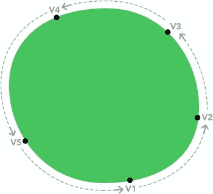

**图 25.** 按正确顺序绘制的凸形状

请检查你的路径是否遵循此规则，或者使用它们创建的任何形状是否是非凸的（图 26）。

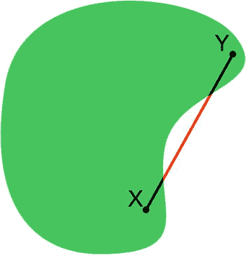

**图 26.** 非凸形状；顶点顺序无关紧要

**注意**  
你可以通过绘制形状内两点之间的连线来检测形状是否为非凸。如果连接线落在形状外部，则为非凸形。SpriteKit 对象必须是凸的（图 25），并应使用按逆时针顺序绘制的顶点创建。

## 关于 Cocoa 应用使用 Storyboard 的反例

这是一种致命的组合：

- 你正在创建一个 Cocoa 应用程序。
- 你的应用程序需要分别使用 `[NSPanel openPanel]` 和 `[NSPanel savePanel]` 来加载和保存文件。
- 你使用 storyboard 创建应用程序。
- 你选择要求 OS X 10.10.0 作为应用程序所需的最低操作系统。

很抱歉地通知你，你的应用程序将无法工作。

原因是 OS X 10.10.0 和 10.10.1 中的一个 Bug，它不仅阻止 `[NSPanel openPanel]` 和 `[NSPanel savePanel]` 工作，而且如果你尝试使用这些方法，实际上会导致应用程序崩溃。

例如，以下代码在 OS X 10.10.0 和 10.10.1 中会崩溃，但在 10.10.2 及更高版本中完美运行。


#### Swift

```swift
let panel = NSSavePanel()
panel.beginSheetModalForWindow(self.view.window!, completionHandler: { (result) -> Void in
})
```

#### Objective-C

```objc
NSSavePanel* panel = [NSSavePanel savePanel];
panel beginSheetModalForWindow:self.view.window completionHandler:^(NSInteger result){
}];
```

以下是我们联系苹果公司后得到的回复：

> 我们的工程师已审查您的请求，并确定您遇到的是一个已知问题，其解决方法是使用 xib 文件替代 storyboard。或者，您也可以选择将该应用的最低操作系统版本要求设为 OS X 10.10.2。

OS X 应用中的 storyboard 问题并不仅限于 `NSSavePanel` 和 `NSOpenPanel`。在某些情况下，`NSSplitControllers` 和 `NSTabViewControllers` 也无法与 storyboard 很好地协同工作。

因此，在 OS X 10.10 成为历史之前，我们建议不要在 OS X 项目中使用 storyboard。请按照苹果的建议，使用 XIB 文件。

## 支持独立圆角的 UIView 类

**注意**

`UIButton`、`UILabel`、`UISegmentedControl` 和 `UITextView` 是 `UIView` 基类的一些示例。

如果你想创建圆角 `UIView` 基类，并且能够独立控制每个角的半径，我们为你创建了这个分类（Swift 中称为“extension”）。

#### Swift

`UIView+IndependentCorners.swift`

```swift
import UIKit
import QuartzCore

extension UIView {
    func corners(corners: UIRectCorner, radius: CGFloat) {
        let maskPath = UIBezierPath(roundedRect: bounds,
                                    byRoundingCorners: corners,
                                    cornerRadii: CGSizeMake(radius, radius))
        let cornerLayer = CAShapeLayer()
        cornerLayer.frame = self.bounds
        cornerLayer.path = maskPath.CGPath
        layer.mask = cornerLayer
    }
}
```

使用以下代码设置圆角：

```swift
// 同时将左上角和右下角的半径设为 20 点
myView.corners(UIRectCorner.TopLeft | UIRectCorner.BottomRight, radius: 20)
```

**注意**

你可以通过竖线字符（"|"）分隔多个角来组合它们。选项包括 `UIRectCorner.TopLeft`、`UIRectCorner.TopRight`、`UIRectCorner.BottomLeft`、`UIRectCorner.BottomRight` 和 `UIRectCorner.AllCorners`。

#### Objective-C

`UIView+IndependentCorners.h`

```objc
#import <UIKit/UIKit.h>

@interface UIView (IndependentCorners)
- (void)setCorners:(UIRectCorner)corners withRadius:(CGFloat)radius;
@end
```

`UIView+IndependentCorners.m`

```objc
#import "UIView+IndependentCorners.h"

@implementation UIView (IndependentCorners)
- (void)setCorners:(UIRectCorner)corners withRadius:(CGFloat)radius
{
    UIBezierPath *shapePath = [UIBezierPath
        bezierPathWithRoundedRect:[self bounds]
                byRoundingCorners:corners
                      cornerRadii:CGSizeMake(radius, radius)];
    CAShapeLayer *newCornerLayer = [CAShapeLayer layer];
    newCornerLayer.frame = [self bounds];
    newCornerLayer.path = shapePath.CGPath;
    [self layer].mask = newCornerLayer;
}
@end
```

使用以下代码设置圆角：

```objc
// 同时将左上角和右下角的半径设为 30 点
[myView setMaskTo:self.pickerFrom
    byRoundingCorners:UIRectCornerBottomLeft | UIRectCornerBottomRight
      withCornerRadii:CGSizeMake(30.0f, 30.0f)];
```

**注意**

与 Swift 示例类似，你可以通过竖线字符（"|"）分隔多个角来组合它们。选项包括 `UIRectCornerTopLeft`、`UIRectCornerTopRight`、`UIRectCornerBottomLeft`、`UIRectCornerBottomRight` 和 `UIRectCornerAllCorners`。

## 让 NSViews 与 UIViews 兼容

如果你既开发 iOS 应用又开发 OS X 应用，你一定曾希望可以将为一个平台编写的代码用于另一个平台。其中最经典的场景之一就涉及 `UIViews` 和 `NSViews`。

`UIViews` 和 `NSViews` 的问题在于它们是截然不同的物种。最终，即使你用它们执行相同的简单操作，也必须为这两个类编写不同的代码。

虽然我们同意 `UIViews` 和 `NSViews` 是截然不同的物种，但也看到它们有很多共同之处。为同一功能（例如在 iOS 和 OS X 上分别使用 `setAlpha:` 和 `setAlphaValue:` 设置视图透明度）使用不同命令，这并不合理。

我们为你创建了一个类，使 `UIView` 和 `NSView` 对象在某些简单方面具有相似性。该类还为 `NSViews` 添加了一些增强功能，例如支持视图的淡入淡出以及通过视图中心设置其位置。


#### Swift

`NSView+ CompatibleUIView.swift`

```
import Foundation
import AppKit

extension NSView {
    typealias AnimationHandler  = () -> Void
    typealias CompletionHandler = (finished : Bool) -> Void

    var center: CGPoint {
        get {
            let midX = CGRectGetMidX(frame)
            let midY = CGRectGetMidY(frame)
            return CGPointMake(midX, midY)
        }
        set(newCenter) {
            var newFrame = CGRectZero
            newFrame.size = frame.size
            let myWidth = CGRectGetWidth(frame)
            let myHeight = CGRectGetHeight(frame)
            let x = floor(newCenter.x - (myWidth / 2.0))
            let y = floor(newCenter.y - (myHeight / 2.0))
            newFrame.origin.x = x
            newFrame.origin.y = y
            frame = newFrame
        }
    }

    var alpha: CGFloat {
        get { return alphaValue }
        set(value) { alphaValue = value }
    }

    func fadeInWithDuration(duration: NSTimeInterval) {
        wantsLayer = true
        NSAnimationContext.beginGrouping()
        NSAnimationContext.currentContext().duration = duration
        animator().alphaValue = 1.0
        NSAnimationContext.endGrouping()
    }

    func fadeOutWithDuration(duration: NSTimeInterval) {
        wantsLayer = true
        NSAnimationContext.beginGrouping()
        NSAnimationContext.currentContext().duration = duration
        animator().alphaValue = 0.0
        NSAnimationContext.endGrouping()
    }

    func animateWithDuration(duration: NSTimeInterval, animations: AnimationHandler) {
        wantsLayer = true
        NSAnimationContext.runAnimationGroup({ (context: NSAnimationContext) -> Void in
            context.duration = duration
            context.allowsImplicitAnimation = true
            animations()
        }, completionHandler: { () -> Void in })
    }

    func animateWithDuration(duration: NSTimeInterval, animations: AnimationHandler, completion: CompletionHandler) {
        wantsLayer = true
        NSAnimationContext.runAnimationGroup({ (context: NSAnimationContext) -> Void in
            context.duration = duration
            context.allowsImplicitAnimation = true
            animations()
        }, completionHandler: { () -> Void in
            completion(finished: true)
        })
    }
}
```

这一类别将允许你在你的 `NSViews` 上使用 `setAlpha:` 和 `setCenter:`，并且作为额外功能，还添加了一些强大的方法。

**淡入和淡出**

```
// 在 5 秒内淡入或淡出 myView
myView.fadeInWithDuration(5)
myView.fadeOutWithDuration(5)
```

**像 UIView 一样为 NSView 添加动画**

```
// 在 5 秒内将 myView 的透明度从 0 动画至 0.7
myView.alpha = 0
myView.animateWithDuration(5.0, animations: { () -> Void in
    self.myView.alphaValue = 0.7
})

// 或者
// 在 5 秒内将 myView 的透明度从 0 动画至 0.7，并在动画完成后执行某些操作
self.myView.animateWithDuration(5.0,
    animations: { () -> Void in
        self.myView.alphaValue = 0.7
    }, completion: { (finished) -> Void in
        // 动画完成... 在此执行操作
    })
```

#### Objective-C

`NSView+ CompatibleUIView.h`

```
@class NSView;

@interface NSView (CompatibleUIView)
- (void)setAlpha:(CGFloat)point;
- (CGFloat)alpha;
- (void)setCenter:(CGPoint)point;
- (CGPoint)center;
+(void)fadeOut:(NSView*)viewToDissolve
  withDuration:(NSTimeInterval)duration;
+(void)fadeIn:(NSView*)viewToFadeIn
withDuration:(NSTimeInterval)duration;
+ (void)animateWithDuration:(NSTimeInterval)duration
                 animations:(void (^)(void))animations;
+ (void)animateWithDuration:(NSTimeInterval)duration
                 animations:(void (^)(void))animations
                 completion:(void (^)(BOOL finished))completion;
@end
```

`NSView+ CompatibleUIView.m`

```
#import "NSView+CompatibleUIView.h"
#import <Cocoa/Cocoa.h>

@implementation NSView (CompatibleUIView)

- (void)setAlpha:(CGFloat)point {
    [self setAlphaValue:point];
}

- (CGFloat)alpha {
    return self.alphaValue;
}

- (void)setCenter:(CGPoint)point {
    CGSize size = self.frame.size;
    CGRect newFrame = CGRectZero;
    newFrame.size = size;
    CGFloat width = CGRectGetWidth(self.frame);
    CGFloat height = CGRectGetHeight(self.frame);
    CGFloat x = floorf(point.x - (width / 2.0f));
    CGFloat y = floorf(point.y - (height / 2.0f));
    newFrame.origin.x = x;
    newFrame.origin.y = y;
    [self setFrame:newFrame];
}

- (CGPoint)center {
    return CGPointMake(CGRectGetMidX(self.frame),
                       CGRectGetMidY(self.frame));
}

+(void)fadeOut:(NSView*)viewToDissolve
  withDuration:(NSTimeInterval)duration
{
    [NSAnimationContext beginGrouping];
    [[NSAnimationContext currentContext] setDuration:duration];
    [[viewToDissolve animator] setAlphaValue:0.0];
    [NSAnimationContext endGrouping];
}

+(void)fadeIn:(NSView*)viewToFadeIn
withDuration:(NSTimeInterval)duration
{
    [NSAnimationContext beginGrouping];
    [[NSAnimationContext currentContext] setDuration:duration];
    [[viewToFadeIn animator] setAlphaValue:1.0f];
    [NSAnimationContext endGrouping];
}

+ (void)animateWithDuration:(NSTimeInterval)duration
                 animations:(void (^)(void))animations
{
    [NSAnimationContext beginGrouping];
    [[NSAnimationContext currentContext] setDuration:duration];
    animations();
    [NSAnimationContext endGrouping];
}

+ (void)animateWithDuration:(NSTimeInterval)duration
                 animations:(void (^)(void))animations
                 completion:(void (^)(BOOL finished))completion
{
    [NSAnimationContext beginGrouping];
    [[NSAnimationContext currentContext] setDuration:duration];
    animations();
    [NSAnimationContext endGrouping];
    if(animations)
    {
        id completionBlock = [completion copy];
        [self performSelector:@selector(runEndBlock:)
                   withObject:completionBlock
                   afterDelay:duration];
    }
}

+ (void)runEndBlock:(void (^)(void))completionBlock
{
    completionBlock();
}

@end
```

以下代码展示了如何使用这些强大的功能：

**淡入和淡出**

```
[NSView fadeIn:myView withDuration:1.0];
[NSView fadeOut:myView withDuration:1.0];
```

**像 UIView 一样为 NSView 添加动画**

```
[NSView animateWithDuration:1.0 animations:^{
    [myView setAlphaValue:0.7f];
}]

// 或者
[NSView animateWithDuration:1.0 animations:^{
    [myView setAlpha:0.7f];
} completion:^(BOOL finished) {
    // 动画完成后执行某些操作
}];
```

## 检测 UIPickerView 何时停止滚动

`UIPickerView` 并没有提供直接的方法来检测其滚轮何时停止滚动，但我们可以使用一个小技巧来实现检测。

首先，在你的代码中找到让滚轮开始滚动的那一行，然后添加如下所示的代码。


#### Swift

```swift
UIView.beginAnimations("animation", context: nil)
UIPickerView.setAnimationDelegate(self)
UIView.setAnimationDidStopSelector( Selector("animationDidStop:finished:context:") )
// 这一行让转轮动起来
picker.selectRow(value, inComponent: 0, animated: true)
UIView.commitAnimations()
```

转轮停止转动时，将执行以下代码：

```swift
func animationDidStop(animationID: String?, finished: NSNumber, context: UnsafeMutablePointer<Void>) {
  print( "动画结束！" )
}
```

#### Objective-C

```objc
[UIView beginAnimations:@"animation" context:nil];
[UIPickerView setAnimationDelegate:self];
[UIPickerView setAnimationDidStopSelector:
                         @selector(animationFinished:finished:context:)];
// 这一行让转轮动起来
[self selectRow:value inComponent:0 animated:YES];
[UIView commitAnimations];
```

转轮停止转动时，将执行以下代码：

```objc
- (void) animationFinished:(NSString *)animationID
         finished:(BOOL)finished context:(void *)context {
  NSLog(@"动画结束");
}
```

## “疯狂”的 NSDates

接下来是创建 `NSDate` 的代码。

#### Swift

```swift
let comps   = NSDateComponents()
comps.day   = 22
comps.month = 8
comps.year  = 2020
let gregorian = NSCalendar(identifier:
           NSCalendarIdentifierGregorian)
let date = gregorian?.dateFromComponents(comps)
print("日期是", date)
```

#### Objective-C

```objc
NSDateComponents *comps = [[NSDateComponents alloc] init];
[comps setDay:22];
[comps setMonth:8];
[comps setYear:2020];
NSCalendar *gregorian = [[NSCalendar alloc]
                  initWithCalendarIdentifier:
                NSCalendarIdentifierGregorian];
NSDate *date = [gregorian dateFromComponents:comps];
NSLog(@"日期是 %@", date);
```

日期是 2020 年 8 月 22 日，对吧？然而，当你查看控制台时，却看到

```
日期是 2020-08-21 23:00:00 +0000
```

什么？！2020 年 8 月 21 日？？？

问题在于 `NSLog` 和 `print` 都使用了 UTC（协调世界时）日期表示法，这种表示法考虑了时区。

如果你需要创建一个不考虑时区的日期，或者更准确地说，一个将某个时区引用视为“默认”的日期，请在创建 Gregorian 变量之后，添加一行代码（以**粗体**显示）。

代码将变为：

#### Swift

```swift
let comps   = NSDateComponents()
comps.day   = 22
comps.month = 8
comps.year  = 2020
let gregorian = NSCalendar(identifier:
              NSCalendarIdentifierGregorian)
// 魔法行
gregorian?.timeZone = NSTimeZone(forSecondsFromGMT: 0)
let date = gregorian?.dateFromComponents(comps)
print("日期是", date)
```

#### Objective-C

```objc
NSDateComponents *comps = [[NSDateComponents alloc] init];
[comps setDay:22];
[comps setMonth:8];
[comps setYear:2020];
NSCalendar *gregorian = [[NSCalendar alloc]
                  initWithCalendarIdentifier:
       NSCalendarIdentifierGregorian];
// 魔法行
gregorian.timeZone = [NSTimeZone timeZoneForSecondsFromGMT:0];
NSDate *date = [gregorian dateFromComponents:comps];
NSLog(@"日期是 %@", date);
```

现在结果将是

```
日期是 2020-08-22 00:00:00 +0000
```

## 本地化应用名称

如果你希望 iOS 或 OS X 应用在不同销售国家拥有不同的名称，可以通过一种名为 `InfoPlist.strings` 的特殊文件来本地化名称。

只需遵循以下步骤：

1. 将 `InfoPlist.strings` 本地化为你需要的语言。
2. 选择 **文件 ➤ 新建 ➤ 文件 ➤ 选择 iOS 或 OS X ➤ 资源 ➤ 字符串文件**，创建一个名为 `InfoPlist.strings` 的文件，并将其分配到所需的目标中。
3. 在 `InfoPlist.strings` 中添加以下键值对：
   `"CFBundleDisplayName" = "AAA";`
   `"CFBundleName" = "BBB";`
   将 `AAA` 和 `BBB` 分别替换为特定语言下的应用名称和包名称。

> **注意：** 你可能已经注意到 `InfoPlist.strings` 包含了同样存在于 `Info.plist` 中的键 `CFBundleDisplayName` 和 `CFBundleName`。`InfoPlist.strings` 中的键将优先于 `Info.plist` 中对应的键。

## 使用 Auto Layout 水平居中视图

警告！你现在正步入野兽的心脏地带，一个从未有人能全身而退的危险区域。从此刻起，你所有的战斗都将是史诗级的，对手是毫无怜悯之心的生物。

忘掉逻辑思维，欢迎来到 Auto Layout。

### 示例

你有三个简单的视图。所有视图具有相同的宽度和高度，并且间距相等（图 27）。你的目标是使用 Auto Layout，让这些视图在所有设备上都精确呈现如图 27 所示的效果。

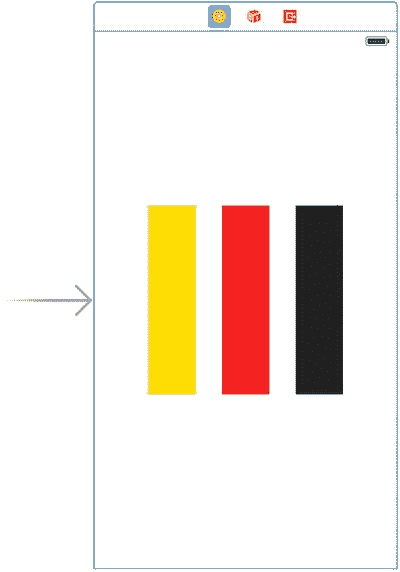

**图 27.** 三个对齐的视图

### 哎呀……坏主意

要让这些视图在不同设备上呈现图 27 的效果，第一个想法是让 Xcode 为你创建约束。为此，在 Xcode 的项目导航器中选择故事板文件，点击 **编辑器 ➤ 解析 Auto Layout 问题 ➤ 重置为建议的约束**。在不同设备上执行此操作的结果如图 28 所示。

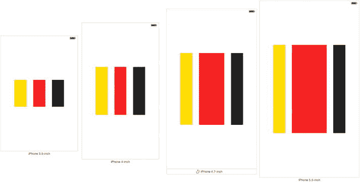

**图 28.** Auto Layout 的结果

### 什么？！

然后你想：问题在于我们必须约束这些视图，使其具有“相同宽度”、“相同高度”和相同的“宽高比”。不，如果你这样做，结果和第一个一样错误。

接着你尝试另一种方法。你为这些视图的“宽度”和“高度”以及它们之间的间距定义了约束。没门，何塞！结果更糟。

多次尝试之后，你放弃了。没有任何逻辑或直觉思考能拯救你。

你现在独自在丛林中，野兽正注视着你。


### 逻辑已退出房间

以下是用一种看似“取巧”的方法来解决这个问题，而这在 Auto Layout 中似乎是公认的解决方式：

1.  选中所有视图。点击 Interface Builder 面板底部的 `Pin` 按钮，选择 `Equal Widths`（等宽）、`Equal Heights`（等高）和 `Aspect Ratio`（宽高比），然后点击 `Add 6 Constraints`（添加 6 个约束）。这将使所有三个视图具有相同的宽度、高度和宽高比（见图 29）。

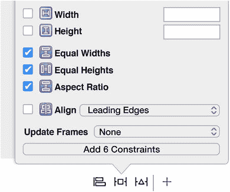

**图 29.** 宽度、高度和宽高比

2.  仅选中第一个视图，返回 `Pin` 菜单，选择 `Width`（宽度）和 `Height`（高度），然后点击 `Add 2 Constraints`（添加 2 个约束）（见图 30）。这将定义第一个视图的宽度和高度。由于上一步添加的约束，其他视图将具有相同的大小。

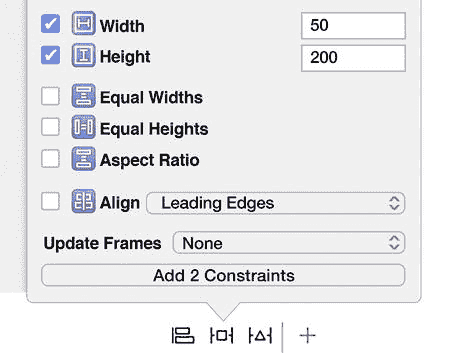

**图 30.** 第一个视图的宽度/高度

3.  选中所有视图，点击 Interface Builder 面板底部的 `Alignment`（对齐）按钮，选择 `Horizontal Center in Container`（容器内水平居中）和 `Vertical Center in Container`（容器内垂直居中），然后点击 `Add 6 Constraints`（添加 6 个约束）（见图 31）。

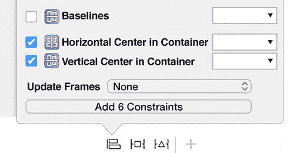

**图 31.** 水平和垂直居中

> **注意：** 在第 4 步中，我们为所有视图添加了一个 `Horizontal Center in Container` 约束。添加此约束后，我们是在告诉 Auto Layout 将三个视图都对齐到容器的水平中心，这不符合逻辑，因为这不是我们希望视图所处的位置。下一步将解决这个问题。

### 这样就能击败这个“怪兽”

选择 `Editor`（编辑器）➤ `Resolve Auto Layout Issues`（解决自动布局问题）➤ `Update Constraints`（更新约束）。此步骤会为所有视图添加一个水平偏移量，从而解决上一步造成的问题。换句话说，每个视图将位于“水平中心加上一个偏移量”的位置。

图 32 显示了最终结果。

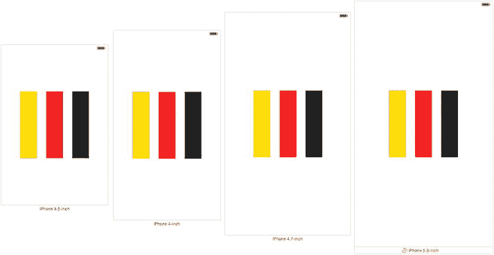

**图 32.** Auto Layout 的最终结果

所有视图大小相同，并且在不同的设备上具有相同的间距。

---

## 复制后 Storyboard 中的元素变灰

你在 Storyboard 或项目之间复制了一个视图控制器或其元素，复制完成后，你注意到其中一些元素变成了灰色（图 33）。这是为什么？

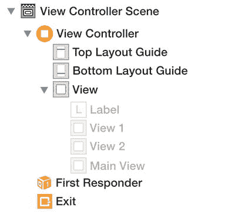

**图 33.** Storyboard 中变灰的元素

出现此问题是因为你在具有不同 `Size Classes`（尺寸类别）的 Storyboard 之间复制了元素。

请参见图 34 中的 `Size Classes` 选择按钮。

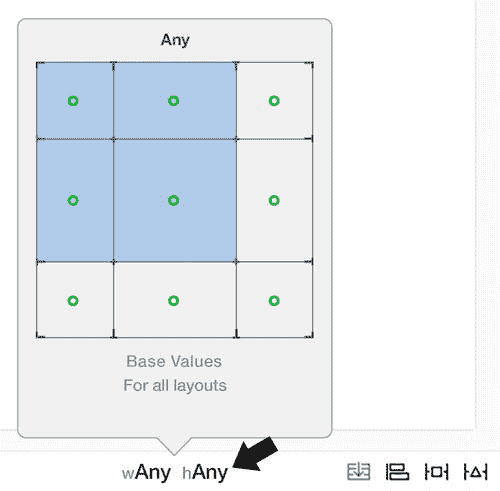

**图 34.** 尺寸类别选择

如果你将一个元素从设置为 `Any/Any` 的 Storyboard 复制到另一个未按此设置的 Storyboard，则该元素会变灰。

两个 Storyboard 的 `Size Classes` 选择必须相同，否则复制后元素会变灰。

要解决此问题，请遵循以下步骤：

1.  备份一份你要从中复制元素的 Storyboard。
2.  通过取消选中相应的复选框，禁用该 Storyboard 的 `Size Classes`（尺寸类别）（见图 35）。

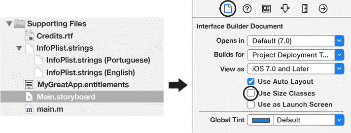

**图 35.** 使用尺寸类别选项

3.  从已复制的 Storyboard 中将所需的界面元素复制到最终的 Storyboard 中。

复制后，元素将不再变灰。

---

## 调试 Core Data

当你使用 Core Data 处理数据库密集型应用程序时，幕后会进行许多操作以保持运行流畅。

当这些操作之一发生异常时，应用程序将崩溃，并且很可能很难发现问题。

在“Core Data 的并发处理”一节中，我们描述了可能影响 Core Data 应用程序的问题之一，但其他晦涩的问题也可能突然出现。

### 在黑暗中独行

如果问题奇怪且难以捉摸，你可以通过选择 `Product`（产品）➤ `Scheme`（方案）➤ `Edit`（编辑）➤ `Scheme`（方案）➤ `Arguments`（参数），并在 `Arguments Passed on Launch`（启动时传递的参数）部分添加键值 `-com.apple.CoreData.SQLDebug 3`，来启用 Xcode 调试 Core Data 操作的能力（图 36）。


**图 36.** 调试 Core Data

> **注意：** 选项 `-com.apple.CoreData.SQLDebug` 接受 1 到 3 之间的值。值越高，详细程度越高。

一旦启用此键，Xcode 的日志会显示如图 37 所示的信息。

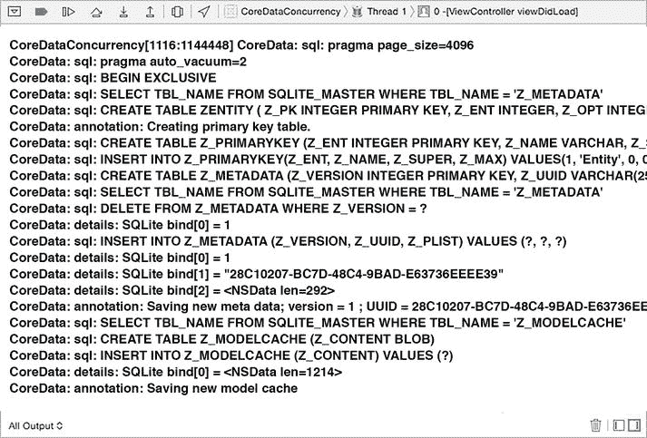

**图 37.** Core Data 调试信息

---

## 包中不包含 Info.plist

当你尝试验证或向 App Store 提交应用程序时，通常会出现此错误消息。

此消息表明 `Info.plist` 文件缺失。实际上，这条消息具有误导性，因为如果你的 `Info.plist` 文件中缺少某些键，也可能显示此错误消息。

如果 `Info.plist` 文件中缺少以下键，则会触发该错误：`CFBundleVersion`、`CFBundleShortVersionString` 和 `CFBundlePackageType`。

- `CFBundleVersion`：此键指定包的构建版本号。
- `CFBundleShortVersionString`：此键存储包的发布版本号字符串。
- `CFBundlePackageType`：此键通常包含一个四字母代码，用于标识包的类型。可能的值包括：
    - `APPL` – 该包是一个应用程序；
    - `FMWK` – 该包是一个框架；
    - `BNDL` – 该包是一个可加载的包。

> **注意：** iOS 和 OS X 应用程序都使用所有这些键。

欲了解更多信息，请访问 [`http://www.addfone.com/TXCFKeys`](http://www.addfone.com/TXCFKeys)

要检查你的 `Info.plist` 文件是否缺少任何这些键，请打开你的目标（Target）信息面板，右键单击任意键，然后选择 `Show Raw Keys/Value`（显示原始键/值）（图 38）。

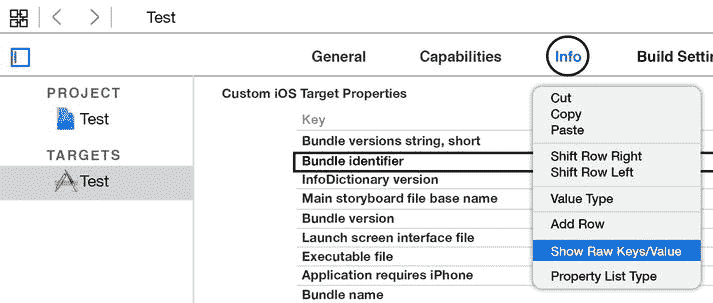

**图 38.** `Info.plist` 键（友好名称）

选择此选项后，键将不会像图 38 那样以友好的名称显示。相反，它们将使用不友好的 Core Foundation (CF) 名称显示（图 39），这正是你所需要的。

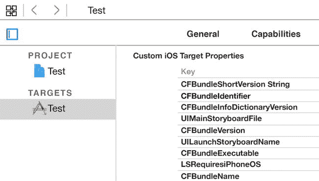

**图 39.** `Info.plist` 键（CF 名称）

---

## 检查 App Store 中应用的版本

如果出于某种原因，你需要检查你的 iOS 或 OS X 应用程序在 App Store 中的版本，请使用下面显示的代码。


好的，这是根据您的要求和示例，将给定英文文本翻译成中文的结果。


#### Swift

```
func getAppVersion ( onCompletion: (version: String) -> Void) {
    // 获取应用的 Bundle 标识符
    let bundleIdentifier = "com.yourCompany.yourAppBundleID"
    // 使用 iTunes API 构建应用路径
    let path : String = "http://itunes.apple.com/lookup?bundleId=\(bundleIdentifier)"
    let lookupURL : NSURL = NSURL(string:path)!
    let session = NSURLSession.sharedSession()
    let request = NSURLRequest(URL: lookupURL)
    // 使用 iTunes API 异步请求应用数据
    let task = session.dataTaskWithRequest(request,
                              completionHandler: { data, response, error in
      if !(error != nil) {
      do {
      let jsonResults = try
                          NSJSONSerialization.JSONObjectWithData(data!,
                                 options: [])  as! NSDictionary
      let results = jsonResults["results"]
      let appDetails = results?.firstObject
      // 获取应用版本号
      let latestVersion = appDetails!!["version"] as! String
      onCompletion(version: latestVersion)
    }
      catch let error as NSError {
      print("error = \(error)")
    }
      catch {   }
      }
      })
    task.resume()
  }
```

你必须像这样使用它：

```
getAppVersion { (version) -> Void in
  print("latest version = ", version)
}
```

#### Objective-C

```
-(void)getAppVersionAndRunOnCompletion:
       (void (^)(NSString *version))completionBlock {
  // 获取应用的 Bundle 标识符
  NSString *bundleIdentifier =
                           @"com.yourCompany.yourAppBundleID";
  // 使用 iTunes API 获取应用数据
  NSURL *lookupURL = [NSURL URLWithString:[NSString
                             stringWithFormat: @"http://itunes.apple.com/
         lookup?bundleId=%@", bundleIdentifier]];
  NSURLSession *session = [NSURLSession sharedSession];
  [[session dataTaskWithURL:lookupURL
          completionHandler:^(NSData *data,
                              NSURLResponse *response,
                              NSError *error) {
            // data 为 nil 或发生错误，返回 nil 并退出
            if ( (data == nil) || (error != nil) ) {
              completionBlock(nil);
              return;
            }
            NSDictionary *jsonResults = [NSJSONSerialization
                          JSONObjectWithData:data options:0
                                                error:nil];
            NSUInteger resultCount = [[jsonResults
                        objectForKey: @"resultCount"]
                                                integerValue];
            // jsonResults 中的对象数量为零，返回 nil 并退出
            if (!resultCount){
              completionBlock(nil);
              return;
            }
            NSDictionary *appDetails = [[jsonResults
                                              objectForKey: @"results"]
                           firstObject];
            NSString *latestVersion = [appDetails
                                                 objectForKey: @"version"];
            completionBlock(latestVersion);
          }] resume];
}
```

你必须像这样使用它：

```
[self getAppVersionAndRunOnCompletion:^(NSString *version) {
    NSLog(@"latest version on the app store = %@", version);
}];
```

## 断点和 NSLog 不工作

当出现此问题时，Xcode 不会在任何已设置的断点处暂停，并且`NSLog`也无法向 Xcode 的控制台打印任何信息。

此问题通常由两个原因之一导致：项目文件损坏或产品 Scheme 错误。

出于某种原因，应用扩展和 Apple Watch 目标更容易受到错误的 Product Scheme 影响。

**注意：** 如果你在项目期间多次创建和删除 Target，Xcode 会失去对内容的控制，并且 Product Scheme 会被损坏。

### 项目损坏

首先，尝试按照“打开项目文件时 Xcode 崩溃？”一节的说明清理项目，并查看问题是否解决。

### 错误的 Product Scheme

如果问题仍未解决，请点击 **Product** ➤ **Scheme** ➤ **Manage Schemes**，选择所有 Scheme，然后点击左下角的减号将其删除。接着点击 **Autocreate Schemes Now** 按钮重新创建刚刚删除的 Scheme。

现在你可以构建并运行你的项目，断点很可能会正常工作。

## ViewControllers 之间切换缓慢

如果你的应用使用了 Storyboard，并且`ViewControllers`之间的切换耗时过长，可能是因为 iOS 在加载和实例化下一个`ViewController`时遇到了困难。也许下一个`ViewController`包含了许多需要加载的元素，导致耗时过长。

这个问题合乎逻辑的解决方案是预加载下一个`ViewController`，但如何做到呢？

我们在网络上看到一些页面建议使用`UIPageViewControllers`而不是 Storyboard 来实现`ViewControllers`之间的平滑过渡，但这远非一个好的解决方案，只会引发更多问题。

Storyboard 没有提供预加载`ViewControllers`的方法，但我们可以通过在当前`ViewController`的`viewWillAppear`方法中使用如下所示的代码来模拟这一功能。

#### Swift

```
override func viewWillAppear(animated: Bool) {
  super.viewWillAppear(animated)
  // 这将预加载下一个 ViewController
  dispatch_async(dispatch_get_main_queue()) {
   storyboard?.instantiateViewControllerWithIdentifier
           ("nextViewController")
  }
}
```

#### Objective-C

```
- (void)viewWillAppear:(BOOL)animated {
  [super viewWillAppear:animated];
  // 这将预加载下一个 ViewController
  dispatch_async(dispatch_get_main_queue(),
  ^{
     [self.storyboard
      instantiateViewControllerWithIdentifier:
      @"nextViewController"];
  });
}
```

这段代码会在一个单独的线程上实例化下一个`ViewController`，并将其保留在内存中。当我们 push 出下一个`ViewController`时，它将会快速且平滑地加载完成。


