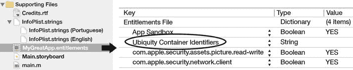
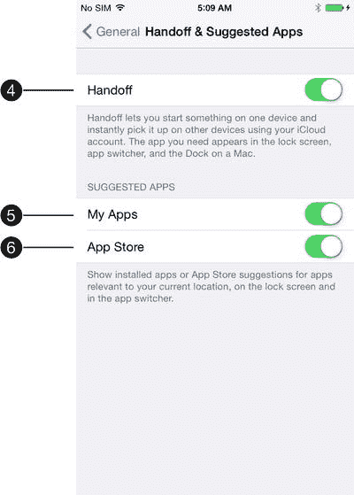
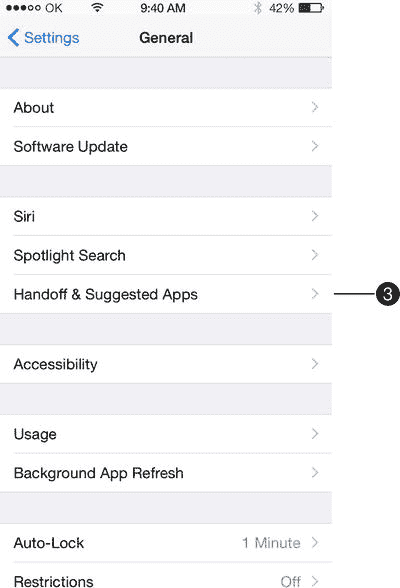
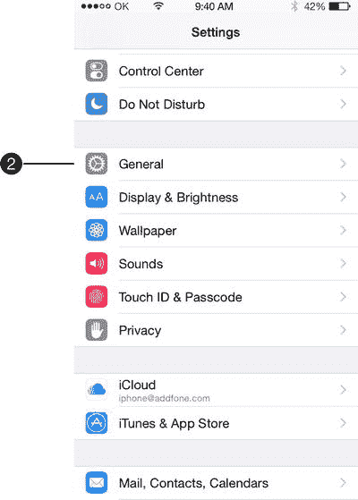
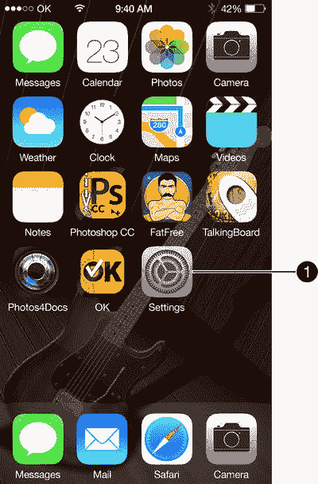
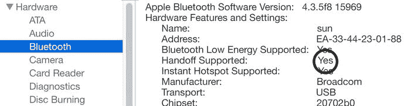
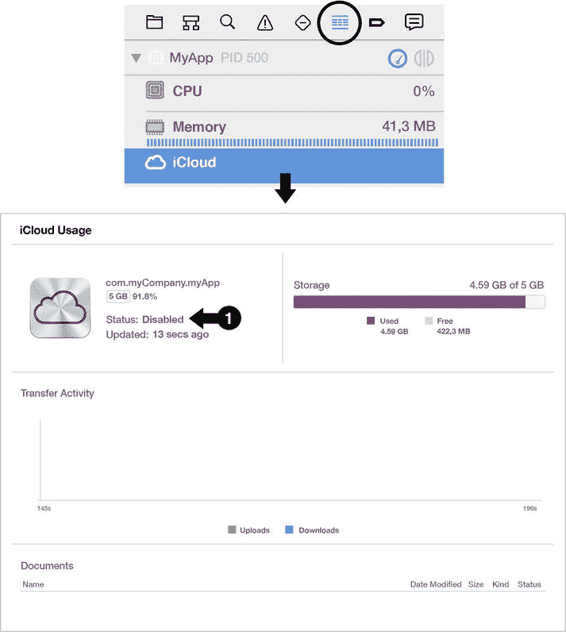

# 完成运行问题

你构建并运行 Mac 或 iOS 应用程序。Xcode 正确编译了所有内容。Xcode 显示以下信息：“正在构建 MyGreatApp...”和“正在运行 MyGreatApp”，紧接着就终止了应用程序，并显示“已完成运行 MyGreatApp。”。没有任何错误信息，没有崩溃，什么也没有，同时也没有应用程序在运行。

## 我们曾警告过你将受到的惩罚

正如我们之前所说，当神灵惩罚你时，它们会阻止 Xcode 显示任何能暗示问题的错误信息。但我们可以通过打破常规思维来激怒这些至高无上的存在，并笑到最后。

我们知道 OS X 的 `console` 始终会显示系统上运行的应用程序（包括 Xcode）所产生的错误信息。所以，这是我们必须检查的第一件事。

`Console` 是存在于所有 UNIX 版本（包括 Mac OS X）中的一个日志查看器。它允许用户搜索系统中所有已记录的日志信息，并能在记录特定类型信息时提醒用户。

要启动 `console`，请点击 OS X 的 `Spotlight`，输入 `console`，然后按下 `Return` 键。

保持控制台窗口打开，再次构建并运行你的应用程序，查看是否有关于你应用程序的信息弹出。在我们的案例中，我们看到了一条类似这样的记录：

`taskgated[98]: 已终止 com.myGreatApp，因为其使用 com.apple.developer.ubiquity-container-identifiers 授权不被允许 (错误代码 -67050)`

换句话说，我们的应用程序因为试图使用其授权未许可的功能而被 `taskgated` 终止。再换句话说，OS X 因为我们的应用程序试图执行其授权未授权的操作而终止了它。问题是，到底是什么操作呢？

出于某种奇怪的原因（这恰恰证实了 Xcode 确实非常憎恨我们），一个名为 `Ubiquity Container Identifiers` 的键被随机添加到了我们应用程序的授权文件中，而且我们发誓，这绝非我们本意，也违背了我们的意愿。

要检查你的应用程序的授权是否有问题，请在 Xcode 的 `Project Navigator` 中选择该授权文件，定位并打开应用程序的授权窗口。图 40 显示了该文件以及授权的一个示例。



图 40. Ubiquity Container Identifiers

在图 40 中，你可以看到应用程序的授权文件中存在一个名为 `Ubiquity Container Identifiers` 的键，但这个键是空的，没有值。

当你移除这个键后，应用程序就能再次正常运行了。

如果你的问题与应用程序的授权无关，控制台上的信息也能为你提供线索。

## iOS 与 Mac 之间的 Handoff 堵塞

这是我们遇到过的最棘手的问题之一。

你正在开发同一应用程序的 iOS 和 OS X 版本，并希望使用 `Handoff` 在平台之间传输活动。

一切运行正常，但突然间，iOS 和 Mac 应用程序之间的管道堵塞了，`Handoff` 停止了工作。你的 iOS 应用程序发布了新的 `Handoff` 活动，但 OS X 没有响应。

我们准备了一份系统性的检查清单，列出了你必须修正的所有事项，以疏通这些管道。

### 在你的 iOS 设备上

按下设备的 Home 按钮返回主屏幕。轻点“设置” ➤ “通用” ➤ “Handoff 与建议的 App”，查看 Handoff、我的 App 以及 App Store 是否已开启（参见图 41、42、43 和 44 中的 ➊ 至 ➏ 项）。



图 44. Handoff



图 42. 设置



图 41. 展示作者创建的应用程序及主屏幕的无耻广告



图 43. Handoff 与建议的 App

确保你的设备上 Wi-Fi 和蓝牙已配置并正常工作。验证你是否有可用的互联网连接。

### 在你的 Mac 上

检查你的 Mac 是否支持 `Handoff`。点击 ➤ “关于本机” ➤ “系统报告” ➤ “蓝牙”，并检查“Handoff 支持”条目是否显示为“是”（图 45）。



图 45. Handoff 支持

验证蓝牙是否已开启。验证你是否有可用的互联网连接。

### 在 Mac OS X 上

你可以通过设置一个隐蔽的首选项标志后重启 OS X，来增加 `sharingd`（负责 `Handoff` 等功能的守护进程）的日志详细程度。为此，启动 `Terminal`，输入以下命令，然后按下 Return 键。

`defaults write com.apple.Sharing EnableDebugLogging -bool TRUE`

之后 OS X 会在 `Console` 中显示 `sharingd` 的日志信息。

### 在你的项目中

- 检查你是否通过使用 `addUserInfoEntriesFromDictionary` 来更新 `NSUserActivity`。不要直接更新 `userInfo` 字典。
- 你的 Mac 应用程序必须被沙盒化，并使用你的团队 ID 进行签名。在你的 OS X 目标的“功能”标签页中开启“App Sandbox”。
- 检查你是否已将类似以下键值添加到 `Info.plist` 文件中：
```
<key>NSUserActivityTypes</key>
<array>
    <string>XXXXX</string>
</array>
```
其中 `XXXXX` 是描述的活动，例如 `com.myCompany.myApp.activity`。

## 顽固的应用通用容器

你的应用程序正在使用 iCloud Drive，但你创建的文件夹和文件并未在 iCloud 上公开显示。

调试 iCloud 是一项复杂的任务，尤其是在 Xcode 中唯一可用的相关工具是 iCloud 调试计量器（图 46），而该计量器自 Xcode 6 以来就一直存在故障。很可能会一直显示你应用的 iCloud 状态为“已禁用”（➊）。



图 46. iCloud 调试计量器

### 验证以下内容

以下是你为了在 iCloud 上公开显示应用程序文件夹需要验证的几项内容：

-   必须为“iCloud 文档”开启 iCloud 功能，使用默认容器或你定义的某些自定义容器。
-   授权文件必须类似于以下内容：
```
<key>com.apple.developer.icloud-container-identifiers</key>
<array>
    <string>iCloud.$(CFBundleIdentifier)</string>
</array>
<key>com.apple.developer.icloud-services</key>
<array>
    <string>CloudDocuments</string>
</array>
<key>com.apple.developer.ubiquity-container-identifiers</key>
<array/>
```
-   你是否已将这些键添加到 `Info.plist` 文件中？
```
<key>NSUbiquitousContainers</key>
<dict>
    <key>iCloud.$(CFBundleIdentifier)</key>
    <dict>
        <key>NSUbiquitousContainerIsDocumentScopePublic</key>
        <true/>
        <key>NSUbiquitousContainerSupportedFolderLevels</key>
        <string>Any</string>
        <key>NSUbiquitousContainerName</key>
        <string>MyApp</string>
    </dict>
</dict>
```


### 秘密“咒语”在此……

每次你在应用的 iCloud 配置中修改任何内容（例如容器名称或容器标识符）时，都需要增加应用 `Info.plist` 的版本号和构建号——分别对应 `CFBundleShortVersionString` 和 `CFBundleVersion`，并确保你的应用在启动时运行以下代码行：

```
[[NSFileManager defaultManager] URLForUbiquityContainerIdentifier:nil];
```

**注意：** Mac OS X 自带一个名为 `brctl` 的工具，它是 `CloudDocs` 守护进程的管理器，负责将文件从你的设备传输到 iCloud。要使用此工具，请启动 `终端`，输入以下命令，然后按回车键：

```
brctl log --wait --shorten
```

### 在哪里可以查看文件……

当文件和文件夹暴露在 iCloud 云端盘上后，你可以通过以下任一位置查看它们：

- 在设备的“设置”➤“iCloud”➤“管理储存空间”➤“文稿与数据”中；
- 在 Mac OS X 的 iCloud 云端盘文件夹中；
- 在你的应用内部，通过使用 `UIDocumentPicker` 并由以下代码调用：

#### Swift

```
@IBAction func openImportDocumentPicker(sender : AnyObject) {
    let documentPicker = UIDocumentPickerViewController(documentTypes: ["public.image"],
                                                       inMode: UIDocumentPickerMode.Import)
    documentPicker.modalPresentationStyle = UIModalPresentationStyle.FormSheet
    self.presentViewController(documentPicker, animated: true) { () -> Void in  }
}
```

#### Objective-C

```
- (IBAction)openImportDocumentPicker:(id)sender {
   UIDocumentPickerViewController *documentPicker =
                         [[UIDocumentPickerViewController alloc]
                                initWithDocumentTypes:@[@"public.image"]
                                              inMode:UIDocumentPickerModeImport];
   documentPicker.modalPresentationStyle = UIModalPresentationFormSheet;
   [self presentViewController:documentPicker animated:YES completion:nil];
}
```

## 实用技巧

让开发者的工作更轻松，不仅包括解决 Xcode 内部的问题（正如本书一直试图做到的），还包括在 Xcode 之外使用一些工具和方法来辅助开发。以下部分介绍了一些这样的工具。

### CocoaPods

根据 CocoaPods 官网介绍，CocoaPods 是 Swift 和 Objective-C Cocoa 项目的依赖管理器。它拥有近 10,000 个库，可以帮助你优雅地扩展项目。简而言之，CocoaPods 是一个巨大的归档库，包含数千个库和开源代码，你可以在项目中使用这些代码——这些代码不仅能加速开发，还能让开发过程更轻松。在你的项目中使用 CocoaPods 非常简单，网上也有很多教程对其进行了说明。

[`www.cocoapods.org`](http://www.cocoapods.org/)

### GitHub

为你的项目寻找开源代码的另一个好来源是 GitHub。许多托管在 GitHub 上的项目都可以通过 CocoaPods 轻松导入到你的项目中。所以，别忘了去看看它们：

[`www.github.com`](http://www.github.com/)

### StackOverflow

如果其他方法都没用，试试 StackOverflow。以下是 StackOverflow 的官方定义：“Stack Overflow 是一个面向专业和业余程序员的问答网站。它由你构建并运营，是 [Stack Exchange](http://stackexchange.com/) 问答网站网络的一部分。有了你的帮助，我们正在共同努力建立一个关于每个编程问题的详细答案库。”据我们所知，StackOverflow 是发布问题并获得快速高质量答案的最佳网站。

[`www.stackoverflow.com`](http://www.stackoverflow.com/)

### fastlane 工具

根据 fastlane 官网介绍，“fastlane 让你能够定义并运行针对不同环境的部署流水线。它帮助你统一应用的发布流程，并自动化整个过程。fastlane 连接了所有 fastlane 工具和第三方工具，例如 [CocoaPods](http://cocoapods.org/) 和 [xctool](https://github.com/facebook/xctool)。”所谓“自动化整个过程”，fastlane 指的是使用终端来处理大量与应用开发和交付相关的事务，消除处理 iTunesConnect 和开发者门户时的繁琐与痛苦，包括配置文件带来的噩梦。

[`http://fastlane.tools`](http://fastlane.tools/)

### HandBrake

`HandBrake` 是一个开源工具，用于将几乎所有格式的视频转换为一系列现代、广泛支持的编码格式。我们见过 `Handbrake` 将 1.2GB 大小的视频转换为 16MB，且画质没有明显损失。

[`http://handbrake.fr`](http://handbrake.fr/)

### Alcatraz

根据 Alcatraz 官网介绍，“Alcatraz 是一个面向 Xcode 的开源包管理器。它让你无需手动克隆或复制文件即可发现并安装插件、模板和配色方案。”换句话说，Alcatraz 可以让你安装许多有用的插件，帮助改进 Xcode。

[`www.alcatraz.io`](http://www.alcatraz.io/)

