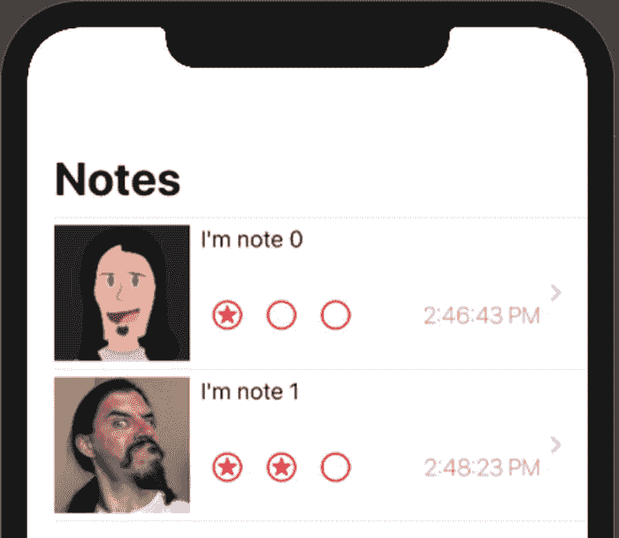
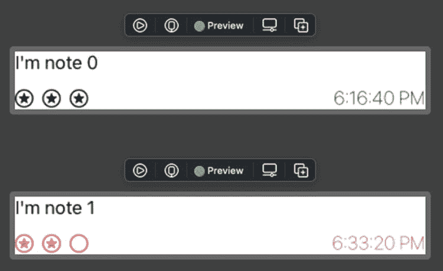

# 1. 介绍 SwiftUI

首先，感谢您至少阅读了第一章的这部分内容。跳过它确实很诱人，但我是那种会阅读前言、序言等等的人。既然作者认为这些内容重要到值得写下并收录进来，或许确实值得一读。

在学习新的 IDE、语言或用户界面设计工具时，往往很难知道从哪里入手。我想说的是：如果你不懂 `Swift`，学习 `SwiftUI` 将会非常困难。事实上，如果你不熟悉 `Xcode`、`iOS` 开发以及与之相关的各种框架，那么从 `SwiftUI` 开始学习并非最佳选择（参见图 1-1）。

这本书并非关于 `Swift`、`Xcode`、`iOS` 框架或 `UIKit` 的教程。熟悉这些内容即使不是必须，也是非常重要的。

**图 1-1** `SwiftUI` 界面示例

## 练习

我在每章中都包含了一个或多个练习。有些练习较短，有些则较长。每个练习都有一个或多个章末（EOC）代码压缩包供你查阅。

许多章节中的代码都是基于同一份代码逐步构建的。因此，只有一个包含完整结果的章末文件。

每个练习的重点在于实践。我希望你通过这个过程来运用你所学到的知识。我强烈建议你随着好奇心的驱使，尝试练习的各种变体。

我也强烈鼓励重复练习。如果你将同一个练习重复多次，直到能够熟练地完成它，那么在读完这本书后，你的掌握程度会更好。

## 概念

`SwiftUI` 的许多方面会让人感觉很像 `Swift`。如果你熟悉 `Swift`，那会很有帮助。你在传递闭包、链式调用、处理可选值等方面会感到比较得心应手。

然而，`SwiftUI` 对用户界面采用了一种非常强调状态驱动的概念。用户界面是状态的一种展示。如果某个值（状态）发生变化，UI 就应该反映出这种变化，因此需要重新渲染。

如果 `TextField` 中显示的值被更新了，界面就应该显示这个新值。在 `SwiftUI` 中，这通过绑定自动完成。我们将使用属性包装器（类似于 `Optional` 是一种带有包装值的类型）将这些值传递给像 `TextField` 这样的控件。

如果值发生变化，`TextField` 会随之更新。同时，`TextField` 中的更改也会存储在与传入项相同的位置。不再需要获取 `text` 属性并手动存储——`SwiftUI` 省去了中间步骤，直接更改属性！

## 唯一数据源

这些属性包装器的概念与“唯一数据源”的理念紧密相连。如果我们将用户名或电子邮件地址存储在一个属性中，那么该属性就可以成为唯一数据源。如果属性发生改变，UI 就会更新。如果用户输入了新值，该值也会存储在同一属性中。

在值类型（例如结构体）和引用类型（例如类）上使用这个概念，有不同的方式。我们将在本书中详细探讨这些方式。

## 老朋友

我们还将探讨如何在基于 `SwiftUI` 的应用中使用现有的 UI。你可能有一些运行良好的现有代码，并希望复用它。如果代码依然好用，没必要将其丢弃。

或者，你可能没有时间一次性重新创建整个 UI。

## 新朋友

当然，我们将会学习如何在 `SwiftUI` 中开发界面设计。但我们也会探讨如何在 `Storyboard` 项目中使用 `SwiftUI`。你可能希望从当前的 `UIKit` 应用开始，逐步迁移到 `SwiftUI`。

无论你决定或需要以何种方式开始使用 `SwiftUI`，我希望这本书能帮助你达成目标。

## Combine

如果你还没有使用过 `Combine` 框架，那么你将在本书中用到它。这不是一本关于 `Combine` 的书籍，但它的部分内容与我们需要在 `SwiftUI` 中完成的工作紧密集成。

本书中散布着 `Combine` 的相关内容。此外，还有专门的一章旨在更深入地探讨 `Combine`。该框架可能值得用一本书来专门讲解，但我们会在适当时候深入挖掘，以理解我们在做什么以及使用什么。

## 一切都好

如前所述，代码即 UI。它不会被存储为 `XML` 或其他格式，然后从中生成 UI。

此外，画布就是模拟器。当你进入实时模式时，它实际上等同于模拟器。它并不完美，但你可以确信它非常接近。而且，它远不止是在没有底层代码的情况下（例如 `Storyboard` 预览）查看设计效果的渲染图。

你甚至可以设计预览，以显示各种配色方案、设备等场景下的效果（参见图 1-2）。

**图 1-2** 单一元素的多个预览

对我而言，关键在于我们需要重新思考对用户界面的认知方式。我们不再创建带有属性的项目，而是在这些项目上调用修饰符。修饰符又会返回项目，然后我们重复这个过程，将它们链式调用起来。

我们的 UI 与状态绑定，并保持同步。状态的改变会更新 UI。UI 中的更改也会更新状态。

如果不小心，这可能导致一切都紧密耦合。但我们将把事物分解，并利用 `SwiftUI` 内置的大量功能。最终，我们会发现界面的许多方面工作方式都是相同的。因此，在过去需要多个构建块才能完成的任务，现在只需一两个即可。

## 平台

我们将专注于使用 `SwiftUI` 进行 `iOS` 开发。然而，在很多情况下，这些代码对于 `Apple Watch`、`macOS`、`iPadOS`、`Apple TV` 乃至未来可能出现的平台都是相同的。

我们将看几个例子，将 `iOS` 的 UI 复制到手表项目中。只需进行最少的修改就能使其正常工作。`SwiftUI` 的抽象程度更高。告诉它渲染一个 `Picker`，它会根据平台来决定这意味着什么。

## 开始编码吧！

万岁！

